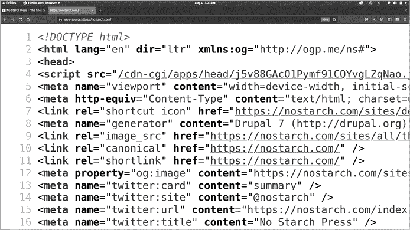
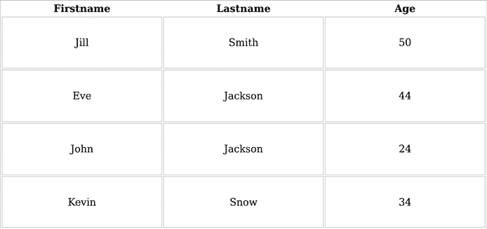

## 第八章：网页抓取


你需要数据来进行数据科学，当你手头没有数据集时，你可以尝试*网页抓取*，这是一种从公共网站直接读取信息并将其转换为可用数据集的技术。在本章中，我们将介绍一些常见的网页抓取技术。

我们将从最简单的抓取开始：下载网页代码并查找相关文本。然后，我们将讨论正则表达式，这是一组通过文本进行逻辑搜索的方法，以及 Beautiful Soup，这是一个免费的 Python 库，可以帮助你通过直接访问超文本标记语言（HTML）元素和属性来更容易地解析网站。我们将探讨表格，最后讨论一些与抓取相关的高级话题。让我们首先看看网站是如何工作的。

## 理解网站是如何工作的

假设你想查看 No Starch Press 网站，这是本书的出版商。你打开一个浏览器，如 Mozilla Firefox、Google Chrome 或 Apple Safari。你输入 No Starch 首页的网址，[`nostarch.com`](https://nostarch.com)。然后，浏览器会展示给你页面，当前页面在写作时看起来像图 8-1。


图 8-1：本书出版商的主页，可以通过[`nostarch.com`](https://nostarch.com)访问

你可以在这个页面上看到很多内容，包括文本、图片和链接，所有这些都经过精心排列和格式化，使得页面对人类来说易于阅读和理解。这种精心的格式化不是偶然发生的。每个网页都有源代码，指定了页面的文本和图像，以及它的格式和排列。当你访问一个网站时，你看到的是浏览器对这些代码的*解释*。

如果你有兴趣查看网站的实际代码，而不是浏览器的视觉呈现，你可以使用特殊命令。在 Chrome 和 Firefox 中，你可以通过打开页面，右键点击（在 Windows 上，或在 macOS 上按住 CTRL 并点击）页面上的空白处，然后点击查看页面源代码，来查看[`nostarch.com`](https://nostarch.com)的源代码。当你这样做时，你会看到一个类似于图 8-2 的标签。



图 8-2：No Starch Press 首页的 HTML 源代码

这个标签包含了指定 No Starch Press 首页所有内容的代码。它是以原始文本的形式呈现的，没有浏览器通常提供的视觉解释。网页的代码通常是用 HTML 和 JavaScript 语言编写的。

在本章中，我们对这些原始数据感兴趣。我们将编写 Python 脚本，自动扫描 HTML 代码，像图 8-2 中显示的代码一样，找到可以用于数据科学项目的有用信息。

## 创建你的第一个网页抓取工具

让我们从最简单的抓取器开始。这个抓取器将接受一个 URL，获取与该 URL 关联的网页的源代码，并打印出它获得的源代码的第一部分：

```py
import requests
urltoget = 'https://bradfordtuckfield.com/indexarchive20210903.xhtml'
pagecode = requests.get(urltoget)
print(pagecode.text[0:600])
```

这个代码片段首先导入了我们在第七章中使用过的 `requests` 包；这里我们将用它来获取网页的源代码。接下来，我们指定 `urltoget` 变量，它将是我们想要请求的网页的 URL。在这个例子中，我们请求的是我个人网站上的一个归档页面。最后，我们使用 `requests.get()` 方法来获取网页的代码，并将这些代码存储在 `pagecode` 变量中。

`pagecode` 变量有一个 `text` 属性，其中包含了网页的所有代码。如果你运行 `print(pagecode.text)`，你应该能够看到网页的所有 HTML 代码，它会作为一个长文本字符串存储。一些页面的代码量非常大，所以一次性打印所有的代码可能会不方便。如果是这样，你可以指定只打印部分代码。因此，在前面的代码片段中，我们通过运行 `print(pagecode.text[0:600])` 来指定只打印页面代码的前 600 个字符。

输出看起来是这样的：

```py
<?xml version="1.0" encoding="utf-8"?>
<!DOCTYPE html PUBLIC "-//W3C//DTD XHTML 1.0 Strict//EN" "http://www.w3.org/TR/xhtml1/DTD/xhtml1-strict.dtd">
<html  xml:lang="en-US" lang="en-US">
  <head><meta http-equiv="Content-Type" content="text/html; charset=utf-8">

    <title>Bradford Tuckfield</title>
    <meta name="description" content="Bradford Tuckfield" />
    <meta name="keywords" content="Bradford Tuckfield" />
    <meta name="google-site-verification" content="eNw-LEFxVf71e-ZlYnv5tGSxTZ7V32coMCV9bxS3MGY" />
<link rel="stylesheet" type="text/css" href=
```

这个输出是 HTML，它主要由用尖括号（`<` 和 `>`）标记的*元素*组成。每个元素向浏览器（如 Firefox 或 Chrome）提供有关如何向访客展示网站的信息。例如，你可以看到输出中有一个 `<title>` 标签；它也叫做*开始标签*，标记了标题元素的开始。在第七行的末尾，`</title>` 是另一个标签，这次叫做*结束标签*，标记了标题元素的结束。站点的实际标题是出现在开始标签和结束标签之间的文本；在这个例子中，它是 `Bradford Tuckfield`。当浏览器访问该站点时，它会解析标题元素的开始和结束标签的含义，然后在浏览器标签顶部显示标题文本 `Bradford Tuckfield`。这不是一本 HTML 书，所以我们不会详细讲解我们看到的每一个代码细节。即使没有深入的 HTML 专业知识，我们也可以成功地进行抓取。

现在我们已经抓取了一个网页，你可能觉得你已经掌握了所有的抓取技能。然而，你还有很多东西需要学习。大多数网页都有大量的 HTML 代码和内容，但数据科学家很少需要网页的全部源代码。在商业场景中，你更可能只需要网页上某个特定的信息或数据。为了找到你需要的特定信息，能够快速自动地在长字符串的 HTML 代码中进行搜索会非常有用。换句话说，你将需要*解析*HTML 代码。让我们来看一下如何做到这一点。

## 解析 HTML 代码

在上一节中，我们讨论了如何将任何公共网页的代码下载到 Python 会话中。现在让我们来谈谈如何解析下载的代码，以获取所需的准确数据。

### 抓取电子邮件地址

假设你有兴趣自动收集电子邮件地址以创建营销名单。你可能会使用我们之前介绍的抓取工具，下载多个网页的源代码。但你不需要每个页面代码中那些长字符串中的所有信息。相反，你只需要代表页面中电子邮件地址的小子字符串。所以，你需要在每个抓取的页面中搜索这些较小的子字符串。

假设你下载的其中一个页面的代码是 [`bradfordtuckfield.com/contactscrape.xhtml`](https://bradfordtuckfield.com/contactscrape.xhtml)。如果你访问这个网页，你会看到浏览器显示的内容，如 图 8-3 所示。


图 8-3：可以轻松抓取的示例页面内容

这个页面只显示一个电子邮件地址，在浏览页面内容一眼看去就不难找到。如果我们想写一个脚本，找到格式像这样页面上的电子邮件地址，我们可以搜索 `Email:` 文本，并查看紧随其后的字符。让我们通过简单的文本搜索来实现这一点：

```py
urltoget = 'https://bradfordtuckfield.com/contactscrape.xhtml'
pagecode = requests.get(urltoget)

mail_beginning=pagecode.text.find('Email:')
print(mail_beginning)
```

这段代码的前两行遵循与前一节相同的抓取流程：我们指定一个 URL，下载该 URL 的页面代码，并将代码存储在 `pagecode` 变量中。之后，我们使用 `find()` 方法搜索邮件文本。该方法以文本字符串作为输入，并返回该文本的位置。在这种情况下，我们将 `Email:` 字符串作为 `find()` 方法的输入，并将该文本的位置存储在 `mail_beginning` 变量中。最终输出为 `511`，表示 `Email:` 文本在页面代码中的位置是第 511 个字符。

在我们知道了 `Email:` 文本的位置后，我们可以尝试通过查看该文本后面的字符来获取实际的电子邮件地址：

```py
print(pagecode.text[(mail_beginning):(mail_beginning+80)])
```

在这里，我们打印出紧跟 `Email:` 文本开头（即第 511 个字符）的 80 个字符。输出如下所示：

```py
Email:  <label class="email" href="#">demo@bradfordtuckfield.com</label>
</div>
```

你可以看到，代码中包含的内容不仅仅是 图 8-3 中可见的文本。特别是，一个名为 `label` 的 HTML 元素出现在 `Email:` 文本和实际电子邮件地址之间。如果你只想要电子邮件地址，你必须跳过与 `<label>` 标签相关的字符，同时还需要删除电子邮件地址后的字符：

```py
print(pagecode.text[(mail_beginning+38):(mail_beginning+64)])
```

这段代码将输出 `demo@bradfordtuckfield.com`，正是我们想要在页面上找到的文本，因为它跳过了 `Email:` 文本的 38 个字符和 `<label>` 标签，且去除了电子邮件地址之后的字符，电子邮件地址在 `Email:` 文本后第 64 个字符结束。

### 直接搜索地址

我们通过查找 `Email:` 文本后第 38 到第 64 个字符，成功找到了页面 HTML 代码中的电子邮件地址。这个方法的问题在于，当我们尝试在其他网页上使用时，它不太可能自动生效。如果其他页面没有我们找到的相同 `<label>` 标签，那么查找 `Email:` 后第 38 个字符就不适用了。或者，如果电子邮件地址的长度不同，那么在 `Email:` 后第 64 个字符停止搜索也无法奏效。由于抓取通常是快速、自动地在多个网站上进行的，因此手动检查应该查找哪个字符而不是第 38 和第 64 个字符，显然是不可行的。所以这种技术在实际业务场景中的抓取器中很可能不可行。

我们可以尝试搜索 `Email:` 文本，而不是查看后续的字符，尝试搜索 `@` 符号本身。每个电子邮件地址应该包含一个 `@`，所以如果找到它，我们很可能找到了一个电子邮件地址。电子邮件地址中不会有 HTML 标签，所以我们不需要担心跳过 HTML 标签来找到地址。我们可以像搜索 `Email:` 文本那样搜索 `@`：

```py
urltoget = 'https://bradfordtuckfield.com/contactscrape.xhtml'
pagecode = requests.get(urltoget)

at_beginning=pagecode.text.find('@')
print(at_beginning)
```

这是我们之前使用的相同抓取代码。唯一的区别是我们搜索的是 `@`，而不是 `Email:`。最终的输出显示，`@` 出现在代码的第 553 个字符处。我们可以打印出 `@` 前后立即的字符，从而得到电子邮件地址本身：

```py
print(pagecode.text[(at_beginning-4):(at_beginning+22)])
```

这里没有 HTML 标签需要跳过。但我们仍然面临一个问题：为了获得没有其他额外字符的电子邮件地址，我们必须知道 `@` 前后各有多少个字符（分别是 4 和 22）。如果我们尝试重复这一方法来自动抓取多个网站上的电子邮件地址，它就无法奏效。

如果我们有一种方法可以进行智能搜索，我们的搜索将更成功，并且更容易自动化。例如，假设我们可以搜索符合以下模式的文本：

`<匹配电子邮件地址开头的字符>`

`@`

`<匹配电子邮件地址结尾的字符>`

事实上，有一种方法可以通过文本执行自动化搜索，从而识别像这里描述的模式。我们现在就来介绍这种方法。

## 使用正则表达式进行搜索

*正则表达式*是特殊的字符串，用于在文本中进行高级、灵活、定制化的模式搜索。在 Python 中，我们可以使用 `re` 模块进行正则表达式搜索，`re` 是 Python 标准库的一部分，Python 安装时会预先安装。以下是使用 `re` 模块进行正则表达式搜索的示例：

```py
import re

print(re.search(r'recommend','irrelevant text I recommend irrelevant text').span())
```

在这个代码片段中，我们导入了 `re` 模块。正如其缩写所示，该模块用于正则表达式。该模块提供了一个 `search()` 方法，可以用于在任何字符串中搜索文本。在这种情况下，我们指定了两个参数：字符串 `recommend` 和一个包含 *recommend* 单词的文本字符串。我们要求该方法在包含一些无关文本的大字符串中搜索子字符串 `recommend`。请注意，我们在 `recommend` 字符串前添加了一个单独的 `r` 字符。这个 `r` 告诉 Python 将 `recommend` 字符串视为*原始*字符串，这意味着 Python 在搜索前不会处理或调整该字符串。`span()` 方法将为我们提供这个子字符串的起始和结束位置。

输出 `(18,27)` 表明 `recommend` 出现在第二个字符串中，从字符串的第 18 个索引开始，到第 27 个索引结束。这个 `search()` 方法类似于我们在前一部分使用的 `find()` 方法；两者都是用来查找子字符串在长字符串中的位置。

但是假设你正在搜索一个由某个容易拼错单词的人编写的网页。默认情况下，`re.search()` 方法查找的是精确匹配，因此如果你正在搜索一个拼错了 `recommend` 的网页，你将无法找到任何匹配项。在这种情况下，我们可能希望让 Python 查找 `recommend`，但查找它的不同拼写。以下是使用正则表达式实现这一目标的一种方法：

```py
import re
print(re.search('rec+om+end', 'irrelevant text I recommend irrelevant text').span())
```

在这里，我们改变了代码的参数：我们不再搜索正确拼写的 `recommend`，而是搜索 `rec+om+end`。之所以有效，是因为 `re` 模块将加号（`+`）解释为*元字符*。当这种特殊类型的字符用于搜索时，它有一个特殊的逻辑解释，可以帮助你进行灵活的搜索，而不需要精确匹配。`+` 元字符表示重复：它指定 Python 应该搜索前一个字符的一次或多次重复。所以当我们写 `c+` 时，Python 知道应该搜索字母 `c` 的一次或多次重复，而当我们写 `m+` 时，Python 知道应该搜索字母 `m` 的一次或多次重复。

使用像 `+` 这样的元字符并具有特殊逻辑意义的字符串称为*正则表达式*。正则表达式在每种主要编程语言中都有使用，并且在所有涉及文本的代码应用中非常重要。

你应该尝试使用 `+` 元字符进行实验，以便更好地理解它的工作方式。例如，你可以尝试搜索 `recommend` 的各种拼写错误，如下所示：

```py
import re
print(re.search('rec+om+end','irrelevant text I recomend irrelevant text').span())
print(re.search('rec+om+end','irrelevant text I reccommend irrelevant text').span())
print(re.search('rec+om+end','irrelevant text I reommend irrelevant text').span())
print(re.search('rec+om+end','irrelevant text I recomment irrelevant text').span())
```

这段代码包含了四个正则表达式搜索。第一个搜索的输出是 `(18,26)`，表示拼写错误的单词`recomend`匹配了我们搜索的正则表达式`rec+om+end`。记住，`+`元字符用于搜索前一个字符的一个或多个重复，所以它将匹配拼写错误的`recomend`中的单个`c`和单个`m`。第二个搜索的输出是 `(18,28)`，表示拼写错误的`reccommend`也匹配了正则表达式`rec+om+end`，因为`+`元字符指定了一个或多个字符重复，在这里`c`和`m`都重复了两次。在这种情况下，我们使用`+`的正则表达式为搜索提供了灵活性，使其能够匹配多个拼写变体。

但是正则表达式的灵活性并非绝对。当你在 Python 中运行第三个和第四个搜索时，它们会返回错误，因为正则表达式`rec+om+end`没有匹配指定字符串（`reommend`和`recomment`）中的任何部分。第三个搜索没有返回匹配项，因为`c+`指定了一个或多个`c`的重复，而`reommend`中没有任何`c`的重复。第四个搜索没有返回匹配项，因为虽然`c`和`m`字符的数量是正确的，但搜索`rec+om+end`要求在末尾有一个`d`字符，而`recomment`没有匹配的`d`。使用正则表达式时，你需要小心确保它们准确表达了你想要的内容，并具备你所需的灵活性。

### 使用元字符进行灵活的搜索

除了`+`，Python 正则表达式中还可以使用其他几个重要的元字符。像`+`这样的元字符用于指定重复次数。例如，星号（`*`）表示前一个字符重复*零次*或更多次。请注意，这与`+`不同，`+`表示字符至少重复*一次*或更多次。我们可以按如下方式在正则表达式中使用`*`：

```py
re.search('10*','My bank balance is 100').span()
```

这个正则表达式将找到字符串中表示银行余额的位置，可以是 1、10、100、1,000，甚至是任何数量的 0（甚至是零个 0）。以下是使用`*`作为元字符的示例：

```py
import re
print(re.search('10*','My bank balance is 1').span())
print(re.search('10*','My bank balance is 1000').span())
print(re.search('10*','My bank balance is 9000').span())
print(re.search('10*','My bank balance is 1000000').span())
```

在这段代码中，我们再次对四个字符串进行`10*`正则表达式搜索。我们发现第一个、第二个和第四个字符串匹配，因为尽管它们表示不同的金额，每个字符串都包含字符`1`，后面跟着零次或多次重复的字符`0`。第三个字符串虽然也包含重复的`0`字符，但没有匹配，因为该字符串没有与 0 相邻的`1`字符。

在实践中，文本中出现重复超过两次的字符是不常见的，因此`*`对你来说可能并不总是有用。如果你不想允许字符重复超过一次，问号（`?`）作为元字符非常有用。当`?`作为元字符使用时，它指定前面的字符出现零次或一次：

```py
print(re.search('Clarke?','Please refer questions to Mr. Clark').span())
```

在这种情况下，我们使用`?`，因为我们想搜索 Clark 或 Clarke，而不是 Clarkee、Clarkeee 或含有更多*e*的 Clark。

### 使用转义序列微调搜索

元字符使你能够执行有用且灵活的文本搜索，允许多种拼写和格式。然而，它们也可能导致混淆。例如，假设你想在文本中搜索一个特定的数学方程式，比如 99 + 12 = 111\。你可以尝试如下搜索：

```py
re.search('99+12=111','Example addition: 99+12=111').span()
```

当你运行这段代码时，你会遇到错误，因为 Python 没有找到与搜索字符串匹配的项。这可能会让你感到惊讶，因为你很容易看到我们在搜索字符串中指定的方程式的精确匹配。这个搜索没有返回结果，因为`+`的默认解释是作为元字符，而不是字面加号。记住，`+`表示前面的字符重复一次或多次。如果我们做如下搜索，就能找到匹配项：

```py
re.search('99+12=111','Incorrect fact: 999912=111').span()
```

在这种情况下，Python 通过将`+`号解释为元字符找到精确匹配，因为`9`在右侧的字符串中重复。如果你想搜索实际的加号，而不是将`+`作为元字符，你需要使用另一个元字符来指定这个偏好。你可以这样做：

```py
re.search('99\+12=111','Example addition: 99+12=111').span()
```

在这里，我们使用反斜杠（`\`）作为特殊的元字符。`\`称为*转义字符*。它允许`+`加号“逃脱”其元字符的身份，转而被字面解释。我们将`\+`字符串称为*转义序列*。在前面的代码片段中，我们找到了匹配项，因为我们对`+`加号进行了转义，因此 Python 查找字面上的加号，而不是将`+`解释为元字符并查找重复的`9`字符。

你可以通过使用转义序列对任何元字符进行字面搜索。例如，假设你想查找一个问号，而不是将问号作为元字符进行搜索。你可以这样做：

```py
re.search('Clarke\?','Is anyone here named Clarke?').span()
```

这样可以找到`Clarke?`的匹配项，但找不到`Clark?`的匹配项。因为我们对问号进行了转义，Python 会查找字面上的问号，而不是将其解释为元字符。

如果你需要搜索反斜杠，你需要使用两个反斜杠——一个用来逃避元字符解释，另一个用来告诉 Python 搜索哪个字面字符：

```py
re.search(r'\\',r'The escape character is \\').span()
```

在这个代码片段中，我们再次使用 `r` 字符来指定我们希望将字符串解释为原始文本，并确保 Python 在我们的搜索之前不做任何调整或处理。转义序列在正则表达式中很常见且有用。一些转义序列赋予标准字符（而非元字符）特殊意义。例如，`\d` 将搜索字符串中的任何数字（0 到 9），如下所示：

```py
re.search('\d','The loneliest number is 1').span()
```

这段代码找到字符 `1` 的位置，因为 `\d` 转义序列表示任何数字。以下是其他有用的转义序列，它们使用非元字符：

`\D` 用于搜索任何非数字字符

`\s` 用于搜索空白字符（空格、制表符和换行符）

`\w` 用于搜索任何字母字符（字母、数字或下划线）

其他重要的元字符是方括号 `[` 和 `]`。它们可以成对出现在正则表达式中，用来表示字符类型。例如，我们可以如下搜索任何小写字母：

```py
re.search('[a-z]','My Twitter is @fake; my email is abc@def.com').span()
```

这段代码指定我们要查找位于 `a` 到 `z` 之间的任何字符。它返回了输出 `(1,2)`，其中只有字符 `y`，因为这是字符串中的第一个小写字母。我们也可以类似地搜索任何大写字母：

```py
re.search('[A-Z]','My Twitter is @fake; my email is abc@def.com').span()
```

这个搜索返回 `(0,1)`，因为它找到的第一个大写字母是字符串开头的 `M`。

另一个重要的元字符是管道符号（`|`），它可以用作 *或* 逻辑表达式。如果你不确定两种拼写方式中哪一种正确，这尤其有用。例如：

```py
re.search('Manchac[a|k]','Lets drive on Manchaca.').span()
```

在这里，我们指定要搜索以 `Manchac` 结尾，结尾可以是 `a` 或 `k`。如果我们搜索 `Lets drive on Manchack.`，它也会返回匹配项。

### 结合元字符进行高级搜索

以下是你应该知道的其他元字符：

`$` 表示行或字符串的结尾

`^` 表示行或字符串的开头

`.` 用作通配符，表示除了行末（`\n`）之外的任何字符

你可以将文本和元字符结合起来进行高级搜索。例如，假设你有一份计算机上所有文件的列表，你想在所有文件名中搜索某个 *.pdf* 文件。也许你记得 *.pdf* 文件名和 *school* 有关系，但你不记得其他信息。你可以使用这个灵活的搜索来找到文件：

```py
re.search('school.*\.pdf$','schoolforgottenname.pdf').span()
```

让我们看看这个片段中的正则表达式。它以`school`开始，因为你记得文件名中包含这个词。然后，它有两个元字符在一起：`.*`。`.`是一个通配符元字符，`*`表示任何数量的重复。因此，`.*`表示在`school`之后的任何字符的任意数量。接下来，我们有一个转义的句点（圆点）：`\.`，它指的是一个实际的句点符号，而不是通配符。接着，我们搜索字符串`pdf`，但只有在文件名末尾出现时才匹配（由`$`指定）。总结来说，这个正则表达式指定了一个文件名，它以`school`开头，以`.pdf`结尾，并且中间可能有任何其他字符。

让我们在不同的字符串中搜索这个正则表达式，确保你熟悉它正在搜索的模式：

```py
import re
print(re.search('school.*\.pdf$','schoolforgottenname.pdf').span())
print(re.search('school.*\.pdf$','school.pdf').span())
print(re.search('school.*\.pdf$','schoolothername.pdf').span())
print(re.search('school.*\.pdf$','othername.pdf').span())
print(re.search('school.*\.pdf$','schoolothernamepdf').span())
print(re.search('school.*\.pdf$','schoolforgottenname.pdf.exe').span())
```

这些搜索中有一些会找到匹配项，而有一些会抛出错误，因为没有找到匹配项。仔细观察抛出错误的搜索，确保你理解为什么它们没有找到匹配项。当你对正则表达式和它们使用的元字符越来越熟悉时，你将能够迅速掌握任何你看到的正则表达式的逻辑，而不是把它看作一堆毫无意义的标点符号。

你可以使用正则表达式进行多种搜索。例如，你可以指定一个正则表达式来搜索街道地址、URL、特定类型的文件名或电子邮件地址。只要你要搜索的文本中存在一个逻辑模式，你就可以在正则表达式中指定该模式。

若要了解更多关于正则表达式的内容，你可以查看官方的 Python 文档：[`docs.python.org/3/howto/regex.xhtml`](https://docs.python.org/3/howto/regex.xhtml)。但实际上，掌握正则表达式的最佳方式是自己动手实践。

## 使用正则表达式搜索电子邮件地址

正则表达式使你能够灵活且智能地搜索多种类型的模式。让我们回到最初的例子，搜索电子邮件地址，看看我们如何在这里使用正则表达式。记住，我们想要搜索与以下模式匹配的文本：

`<some text>``@``<some more text>`

这是一个可以完成此搜索的正则表达式：

```py
re.search('[a-zA-Z]+@[a-zA-Z]+\.[a-zA-Z]+',\
'My Twitter is @fake; my email is abc@def.com').span()
```

让我们仔细看看这个片段的元素：

1.  它以`[a-zA-Z]`开始。这包括方括号元字符，指定了一个字符类。在这种情况下，它会查找由`a-zA-Z`表示的字符，即任何小写或大写的字母字符。

1.  `[a-zA-Z]`后面跟着`+`，指定一个或多个字母字符。

1.  接下来是`@`。它不是元字符，而是搜索字面上的“at”符号（`@`）。

1.  接下来，我们再次遇到`[a-zA-Z]+`，它指定在`@`后，任何数量的字母字符应该出现。这应该是电子邮件域名的第一部分，比如*protonmail*在*protonmail.com*中。

1.  `\.`指定了一个句点或圆点字符，用来在*.com*、*.org*或任何其他顶级域名中查找这个字符。

1.  最后，我们再次遇到`[a-zA-Z]+`，它指定在句号后应该跟着一些字母字符。这就是*.com*中的*com*或*.org*中的*org*部分。

这六个元素一起指定了电子邮件地址的一般模式。如果你不熟悉正则表达式，可能会觉得`[a-zA-Z]+@[a-zA-Z]+\.[a-zA-Z]+`是在指定一个电子邮件地址。但由于 Python 能够解析正则表达式中的元字符，Python 能够理解这个搜索并返回电子邮件地址。同样重要的是，你也已经学会了正则表达式，并且理解了这个正则表达式的含义。

记住一个重要的事情：世界上有很多电子邮件地址。前面的正则表达式会识别许多电子邮件地址，但不是每一个可能的电子邮件地址。例如，有些域名使用的字符并不是英语中标准罗马字母的一部分。前面的正则表达式无法捕捉这些电子邮件地址。另外，电子邮件地址可能包含数字，而我们的正则表达式也无法匹配这些地址。能够可靠捕捉每一个可能的电子邮件地址中所有字符组合的正则表达式将会非常复杂，而达到这种复杂度超出了本书的范围。如果你对高级正则表达式感兴趣，可以查看由专业人士编写的正则表达式，专门用于查找电子邮件地址，网址是[`web.archive.org/web/20220721014244/https://emailregex.com/`](https://web.archive.org/web/20220721014244/https://emailregex.com/)。

## 将结果转换为可用数据

记住，我们是数据科学家，不仅仅是网页抓取者。在抓取网页之后，我们需要将抓取的结果转化为可用的数据。我们可以通过将所有抓取到的内容导入 pandas 数据框来实现。

让我们抓取以下网址中段落里列出的所有（虚假的）电子邮件地址：[`bradfordtuckfield.com/contactscrape2.xhtml`](https://bradfordtuckfield.com/contactscrape2.xhtml)。我们可以从读取网站的所有文本开始，具体如下：

```py
import requests
urltoget = 'https://bradfordtuckfield.com/contactscrape2.xhtml'
pagecode = requests.get(urltoget)
```

这段代码和我们之前使用的是一样的：我们只是下载 HTML 代码并将其存储在`pagecode`变量中。如果你愿意，可以通过运行`print(pagecode.text)`来查看此页面的所有代码。

接下来，我们可以指定正则表达式来查找段落中的所有电子邮件地址：

```py
allmatches=re.finditer('[a-zA-Z]+@[a-zA-Z]+\.[a-zA-Z]+',pagecode.text)
```

在这里，我们使用相同的字符作为我们的正则表达式。但我们使用了一种新的方法：`re.finditer()`，而不是 `re.search()`。我们这样做是因为 `re.finditer()` 能够获取多个匹配项，而我们需要这样做来获取所有的电子邮件地址。（默认情况下，`re.search()` 只会找到字符串或正则表达式的第一个匹配项。）

接下来，我们需要将这些电子邮件地址编译在一起：

```py
alladdresses = []
for match in allmatches:
    alladdresses.append(match[0])

print(alladdresses)
```

我们从一个空列表 `alladdresses` 开始。然后我们将每个 `allmatches` 对象中的元素追加到该列表中。最后，我们打印出这个列表。

我们还可以将我们的列表转换为 pandas 数据框：

```py
import pandas as pd
alladdpd=pd.DataFrame(alladdresses)
print(alladdpd)
```

现在我们已经将地址放入一个 pandas 数据框中，可以使用 pandas 库提供的大量方法来执行任何我们可能用其他 pandas 数据框完成的操作。例如，如果对我们有用，我们可以将其按字母顺序反转，然后将其导出为一个 *.csv* 文件：

```py
alladdpd=alladdpd.sort_values(0,ascending=False)
alladdpd.to_csv('alladdpd20220720.csv')
```

让我们想一下到目前为止我们做了什么。从一个 URL 开始，我们下载了该 URL 指定的网页的完整 HTML 代码。我们使用正则表达式查找页面上列出的所有电子邮件。我们将这些电子邮件编译成 pandas 数据框，然后可以将其导出为 *.csv* 或 Excel 文件，或者根据需要进行其他转换。

下载 HTML 代码并指定正则表达式以查找特定信息，正如我们所做的那样，是完成任何抓取任务的合理方式。然而，在某些情况下，编写复杂的正则表达式来匹配难以匹配的模式可能会变得困难或不方便。在这些情况下，您可以使用其他库，这些库包含先进的 HTML 解析和抓取功能，而无需您编写任何正则表达式。一个这样的库叫做 Beautiful Soup。

## 使用 Beautiful Soup

*Beautiful Soup 库* 允许我们在不编写任何正则表达式的情况下，查找特定 HTML 元素的内容。例如，假设你想收集页面中的所有超链接。HTML 代码使用 *anchor* 元素来指定超链接。这个特殊元素通过一个简单的 `<a>` 起始标签来指定。以下是一个锚点元素在网页 HTML 代码中的示例：

```py
<a href='https://bradfordtuckfield.com'>Click here</a>
```

这段代码指定了文本`Click here`。当用户点击 HTML 网页上的这个文本时，浏览器将跳转到[`bradfordtuckfield.com`](https://bradfordtuckfield.com)。HTML 元素以`<a>`开头，表示这是一个锚点或超链接，指向一个网页或文件。接下来，它有一个名为`href`的属性。在 HTML 代码中，*属性*是一个变量，提供有关元素的更多信息。在这个例子中，`href`属性包含了超链接应该“指向”的 URL：当某人点击`Click here`文本时，浏览器将跳转到`href`属性中包含的 URL。`href`属性后面是一个尖括号，然后是页面上显示的文本。最后，`</a>`表示超链接元素的结束。

我们可以通过在网页代码中进行正则表达式搜索`<a>`模式，或者指定一个正则表达式来查找网址，从而找到网页中的所有锚点元素。然而，Beautiful Soup 模块使得我们可以更加轻松地找到这些锚点元素，而无需担心正则表达式。我们可以通过以下方式找到网站中所有链接的 URL：

```py
import requests
from bs4 import BeautifulSoup

URL = 'https://bradfordtuckfield.com/indexarchive20210903.xhtml'
response = requests.get(URL)
soup = BeautifulSoup(response.text, 'lxml')

all_urls = soup.find_all('a')
for each in all_urls:
    print(each['href'])
```

在这里，我们导入了`requests`和`BeautifulSoup`模块。就像其他所有的第三方 Python 包一样，你需要在脚本中使用`BeautifulSoup`之前先安装它。`BeautifulSoup`模块是一个名为 bs4 的包的一部分。bs4 包有一些所谓的*依赖项*：需要安装的其他包，以确保 bs4 正常工作。它的依赖项之一是名为 lxml 的包。在使用 bs4 和`BeautifulSoup`之前，你需要安装 lxml。导入所需的模块后，我们使用`requests.get()`方法下载网页代码，正如我们在本章之前做过的那样。然后，我们使用`BeautifulSoup()`方法解析代码，并将结果存储在一个名为`soup`的变量中。

拥有`soup`变量后，我们就可以使用 Beautiful Soup 的特定方法。特别是，我们可以使用`find_all()`方法来查找网页代码中的特定类型的元素。在这个例子中，我们搜索所有的锚点元素，它们由字符`a`表示。获取所有锚点元素后，我们打印出它们的`href`属性值——即它们链接到的页面或文件的 URL。你可以看到，使用 Beautiful Soup，我们可以用几行代码完成有用的解析，而无需使用复杂的正则表达式。

### 解析 HTML 标签元素

锚点元素并不是 HTML 代码中唯一的一种元素。我们在本章前面看到过`<title>`元素。有时网页也会使用`<label>`元素来为页面上的文本或内容添加标签。例如，假设你想从我们之前看到的[`bradfordtuckfield.com/contactscrape.xhtml`](http://bradfordtuckfield.com/contactscrape.xhtml)网页中抓取联系信息。我们已经将图 8-3 复现为图 8-4 在这里。


图 8-4：一个可以轻松抓取的示例页面内容

你可能正在做一个项目，目的是搜索网页中的电子邮件地址、电话号码或网站。再一次，你可以尝试使用正则表达式来搜索这些内容。但是该网页上的电话号码和电子邮件地址是用 HTML 的`<label>`元素标注的，因此 Beautiful Soup 使得获取这些信息更加容易。首先，让我们看看该网页 HTML 代码中是如何使用`<label>`元素的。以下是该页面代码的一个小样本：

```py
<div class="find-widget">
    Email:  <label class="email" href="#">demo@bradfordtuckfield.com</label>
</div>
```

正如你在本章前面看到的，`<label>`标签用于表示 HTML 代码中的某个部分属于某种特定类型。在这种情况下，`class`属性标识这是一个电子邮件地址的标签。如果你抓取的网页中有这些`<label>`元素，你可以按如下方式搜索电子邮件地址、电话号码和网站：

```py
import requests
from bs4 import BeautifulSoup

URL = 'https://bradfordtuckfield.com/contactscrape.xhtml'
response = requests.get(URL)
soup = BeautifulSoup(response.text, 'lxml')

email = soup.find('label',{'class':'email'}).text
mobile = soup.find('label',{'class':'mobile'}).text
website = soup.find('a',{'class':'website'}).text

print("Email : {}".format(email))
print("Mobile : {}".format(mobile))
print("Website : {}".format(website))
```

这里，我们再次使用`soup.find()`方法。但这次不仅仅是查找标签为`a`的元素，正如我们在查找超链接时所做的那样，而是还要查找带有`<label>`标签的元素。代码中的每个`<label>`标签指定了不同的`class`。我们找到每种标签（如电子邮件和手机）的文本并打印出来。对于网站链接，我们查找带有`website`类的锚点标签。最终的结果是我们能够找到每一种我们需要的数据：电子邮件地址、手机号码和网站。

### 抓取和解析 HTML 表格

表格在网站上很常见，因此了解如何从网站表格中抓取数据是很有必要的。如果访问[`bradfordtuckfield.com/user_detailsscrape.xhtml`](https://bradfordtuckfield.com/user_detailsscrape.xhtml)，你可以看到一个简单的 HTML 表格示例。该网页包含了一个关于几个虚构人物的表格，展示在图 8-5 中。



图 8-5：可以使用 Beautiful Soup 抓取的表格

假设我们想从这个表格中抓取这些人物的信息。让我们来看看指定这个表格的 HTML 代码：

```py
<table style="width:100%">
  <tr class="user-details-header">
    <th>Firstname</th>
    <th>Lastname</th>
    <th>Age</th>
  </tr>
  <tr class="user-details">
    <td>Jill</td>
    <td>Smith</td>
    <td>50</td>
  </tr>
  <tr class="user-details">
    <td>Eve</td>
    <td>Jackson</td>
    <td>44</td>
  </tr>
  <tr class="user-details">
    <td>John</td>
    <td>Jackson</td>
    <td>24</td>
  </tr>
  <tr class="user-details">
    <td>Kevin</td>
    <td>Snow</td>
    <td>34</td>
  </tr>
</table>
```

`<table>`标签指定表格的开始，`</table>`指定表格的结束。在开始和结束之间是一些`<tr>`和`</tr>`标签。每个`<tr>`标签指定一个表格行的开始（`tr`是*table row*的缩写）。在每个表格行内，`<td>`标签指定特定单元格的内容（`td`是*table data*的缩写）。你可以看到第一行是表格的头部，包含了每一列的名称。第一行之后的每一行都指定了一个人的信息：首先是名字，其次是姓氏，再次是年龄，分别放在三个不同的`<td>`元素中。

我们可以按照如下方式解析表格：

```py
import requests
from bs4 import BeautifulSoup

URL = 'https://bradfordtuckfield.com/user_detailsscrape.xhtml'
response = requests.get(URL)
soup = BeautifulSoup(response.text, 'lxml')

all_user_entries = soup.find_all('tr',{'class':'user-details'})
for each_user in all_user_entries:
    user = each_user.find_all("td")
 print("User Firstname : {}, Lastname : {}, Age: {}"\
.format(user[0].text, user[1].text, user[2].text))
```

在这里，我们再次使用 Beautiful Soup。我们创建一个`soup`变量，包含网页的解析版本。然后，我们使用`find_all()`方法查找页面上的每一个`tr`元素（表格行）。对于每一行，我们再次使用`find_all()`来查找该行中的每一个`td`元素（表格数据）。找到每行的内容后，我们将它们打印出来，并格式化以标记名字、姓氏和年龄。除了打印这些元素外，你还可以考虑将它们添加到 pandas 数据框中，这样可以更轻松地导出、排序或进行其他分析。

## 高级爬虫

爬虫是一个深奥的话题，本章所覆盖的内容只是冰山一角，仍有很多需要学习的地方。你可以从本节所列出的一些领域开始。

首先，考虑到某些网页是动态的；它们会根据用户的交互发生变化，例如点击元素或滚动页面。网页的动态部分通常是通过 JavaScript 渲染的，而 JavaScript 的语法与我们在本章专注于抓取的 HTML 有很大不同。我们用来下载 HTML 代码的`requests`包，以及用来解析代码的 Beautiful Soup 模块，都是用于静态网页的。对于动态网页，你可能需要使用其他工具，如 Selenium 库，它专门用于抓取动态网页。使用 Selenium 时，你的脚本可以执行诸如填写网站表单、点击验证码挑战等操作，而无需直接的人工输入。

你还应该考虑应对被封锁的策略。许多网站对所有抓取其数据的尝试都抱有敌意。它们有策略来阻止爬虫，如果它们检测到你正在尝试抓取并获取它们的信息，它们可能会试图封锁你。应对被封锁的一种方式是放弃，这样可以避免因抓取敌对网站而产生的法律问题或道德问题。

如果你决定爬取那些试图阻止你的站点，你可以采取一些措施来避免被封锁。一个方法是设置一个或多个*代理服务器*。网站可能会阻止你的 IP 地址访问其数据，所以你可以设置一个不同的服务器，使用一个网站没有封锁的 IP 地址。如果网站继续试图封锁你的代理服务器的 IP 地址，你可以设置*轮换代理*，这样你可以不断获取新的、没有被封锁的 IP 地址，并仅使用这些新的、未封锁的 IP 地址进行爬取。

当你采取这种方法时，你应该考虑其伦理影响：你是否愿意使用这些策略来访问一个不希望你访问的网站？记住，在极少数情况下，未经授权的爬取可能会导致诉讼甚至刑事起诉。你应该始终保持谨慎，确保你已经仔细思考了你所做一切的实际和伦理影响。

并非所有网站都反感让人访问和爬取它们的数据。有些网站允许爬取，甚至有些网站还设置了*应用程序接口（API）*来方便数据访问。API 允许你自动查询网站的数据，并以用户友好的格式接收数据。如果你需要爬取某个网站，检查它是否有你可以访问的 API。如果网站有 API，API 文档应指明 API 提供的数据以及如何访问它。我们在本章讨论的许多工具和思路也适用于 API 使用。例如，`requests`包可以用来与 API 进行交互，获取 API 数据后，这些数据可以用于填充 pandas 数据框。

最后，定时是设置爬虫脚本时需要考虑的一个重要问题。有时候，爬虫脚本会快速连续地向一个网站发起多个请求，尽可能快速地下载尽可能多的数据。这可能会导致网站被压垮而崩溃，或者网站可能会阻止爬虫以防止过载。为了避免目标网站崩溃或阻止你，你可以调整爬虫，让它的运行速度变得更慢。一种减慢脚本速度的方法是故意添加暂停。例如，在从一个表格下载一行数据后，脚本可以暂停并什么也不做（脚本可以*休眠*）1 秒、2 秒或 10 秒，然后再下载表格的下一行。故意慢下来对那些喜欢快速完成任务的人来说可能会让人沮丧，但从长远来看，它往往能让爬取成功的概率更高。

## 总结

在本章中，我们介绍了网页抓取技术。我们概述了抓取的概念，并简要介绍了 HTML 代码的工作原理。接着，我们构建了一个简单的抓取工具，它仅仅是下载并打印出网页的代码。我们还通过解析网站代码进行了搜索，包括使用正则表达式进行高级搜索。我们展示了如何将抓取自网站的数据转换为可用的数据集。我们还使用了 Python 的 Beautiful Soup 库，轻松地在网页上找到超链接和标签信息。最后，我们简要讨论了一些抓取技能的高级应用，包括 API 集成和抓取动态网站。在下一章中，我们将讨论推荐系统。让我们继续！
