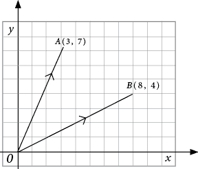
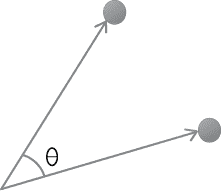
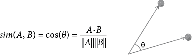

## 第九章：推荐系统


每个有才能的销售员都知道如何向顾客提出聪明、精准的推荐，随着在线零售商规模和技术的不断发展，他们热衷于自动化这一销售策略。但是，做出这些推荐并不容易。为此，许多企业创建了自动化的*推荐系统*，通过分析产品和顾客的数据来确定哪些顾客最有可能对哪些产品感兴趣。

在本章中，我们将详细讨论推荐系统。我们将从最简单的推荐系统开始：一个仅向每个顾客推荐最受欢迎商品的系统。接下来，我们将讨论一个重要的技术——*协同过滤*，它使我们能够为每个顾客和每个商品提供独特、个性化的推荐。我们将讨论两种协同过滤方法：基于商品的和基于用户的协同过滤。最后，我们将通过一个案例研究和一些与推荐系统相关的高级概念来结束本章。

## 基于受欢迎程度的推荐

在我们编写推荐系统的代码之前，我们应该考虑如何进行推荐。假设你是一个销售员，想要向走进店里的顾客推荐商品。如果你了解这位顾客，你可以根据你对顾客口味和情况的了解来做推荐。如果是新顾客走进店里，且你对他们一无所知，你可以观察他们正在浏览的商品，并根据这个信息来推荐。但也有可能，在他们浏览任何商品之前，你就被要求做出推荐。需要在没有任何顾客具体信息的情况下做出智能推荐的问题，称为*冷启动问题*。

面对冷启动问题时，一个合理的做法是推荐最受欢迎的商品。这样做简单且易于实施。虽然它不具备了解顾客所有信息并做出个性化推荐的复杂性，但如果某个商品在大众中很受欢迎，那么它很可能也会吸引新顾客。

在线零售商面临着类似的挑战：新的访客访问他们的网站，这些访客可能没有浏览历史记录，或者对于在线零售商来说是陌生的。这些零售商希望基于详细的顾客信息做出个性化推荐，但当他们面临冷启动问题时，只能依赖其他方法，比如普遍的受欢迎程度。冷启动问题在在线零售商中尤为常见，因为潜在顾客可以匿名访问网站，而不需要向网站或其销售团队提供任何个人信息。

让我们来思考一下我们会用什么代码来做基于流行度的推荐。对于这个或任何其他推荐系统，拥有与交易历史相关的数据是很有帮助的。我们可以下载、读取并查看一些伪造的交易历史数据，如下所示：

```py
import pandas as pd
import numpy as np
interaction=pd.read_csv('https://bradfordtuckfield.com/purchasehistory1.csv')
interaction.set_index("Unnamed: 0", inplace = True)
print(interaction)
```

在这里，我们导入了 pandas 包来进行数据处理。我们从互联网读取一个*.csv*文件到`interaction`变量，并将其存储为一个 pandas 数据框。我们指定数据的第一列作为索引（行名称），然后打印数据框。最终输出的结果显示在列表 9-1 中。

```py
 Unnamed: 0  user1  user2  user3  user4  user5
0      item1      1      1      0      1      1
1      item2      1      0      1      1      0
2      item3      1      1      0      1      1
3      item4      1      0      1      0      1
4      item5      1      1      0      0      1
```

列表 9-1：一个交互矩阵，显示每个商品的购买历史

列表 9-1 显示了一个矩阵，表示一个零售商的销售历史，该零售商有五个客户和五个待售商品。请注意，我们称客户为*用户*，假设他们是零售商网站的用户。但无论我们如何称呼他们，我们使用的推荐技术都是相同的。

该矩阵如果用户没有购买某个商品，则该位置为`0`，如果用户购买了该商品，则为`1`。例如，你可以看到`user2`购买了`item3`但没有购买`item2`，而`user3`购买了`item2`但没有购买`item3`。这种 0/1 矩阵是在构建推荐系统时常见的格式。我们可以称这个矩阵为*交互矩阵*；它表示了用户与商品之间的互动信息。由于几乎每家公司都有与其商品和购买历史相关的记录，因此基于交互矩阵构建推荐系统是一种非常常见的做法。

假设一个新客户，我们称之为`user6`，走进了你的商店（或访问了你的网站）。你面临一个冷启动问题，因为你对`user6`一无所知。如果你想为`user6`推荐可以购买的商品，你可以列出最受欢迎的商品，方法如下：

```py
interaction_withcounts=interaction.copy()
interaction_withcounts.loc[:,'counts']=interaction_withcounts.sum(axis=1)
interaction_withcounts=interaction_withcounts.sort_values(by='counts',ascending=False)
print(list(interaction_withcounts.index))
```

在这里，我们创建了一个名为`interaction_withcounts`的交互矩阵副本。我们将使用这个副本来通过计算购买每个商品的用户数量来找出最受欢迎的商品。请注意，我们的矩阵并不记录用户是否多次购买某个商品或只购买了一次，因此我们的分析只会查看用户是否购买过商品；我们不会分析每个用户购买每个商品的次数。

由于我们矩阵的每一行记录的是某个特定商品的购买情况，因此我们使用`sum()`方法计算每一行的购买总和，并将结果存储在一个名为`counts`的新列中。然后我们使用`sort_values()`方法，它会将我们的矩阵行按购买数量从高到低排序。通过从最受欢迎到最不受欢迎排序，它将商品按流行度进行排序。最后，我们打印出排序后的矩阵的索引，显示出所有商品的名称，从最受欢迎到最不受欢迎：

```py
['item1', 'item3', 'item2', 'item4', 'item5']
```

我们可以理解为`item1`是最受欢迎的项目（实际上与`item3`并列），`item2`是第三受欢迎的，依此类推。

现在你已经有了这个列表，你可以准备向不熟悉的客户提供推荐。推荐的呈现方式将取决于你的商业战略、网站开发团队的能力以及市场营销团队的偏好。推荐系统项目中的数据科学部分是创建优先推荐列表，并让市场营销人员或网页开发人员将这些推荐呈现给用户。这也是推荐系统项目具有挑战性的原因之一：它们需要多个团队的合作。

我们可以创建一个函数，通过将我们迄今为止的所有代码结合起来，生成适用于任何交互矩阵的基于受欢迎程度的推荐：

```py
def popularity_based(interaction):
    interaction_withcounts=interaction.copy()
    interaction_withcounts.loc[:,'counts']=interaction_withcounts.sum(axis=1)
    sorted = interaction_withcounts.sort_values(by='counts',ascending=False)
    most_popular=list(sorted.index)
    return(most_popular)
```

这个函数只是将我们之前在本章中编写的代码功能进行了封装。它以交互矩阵作为输入，汇总每个项目的购买次数，按购买数量排序，并返回按从最受欢迎到最不受欢迎排序的项目名称列表。这个最终的排序列表可以用于向客户提供推荐，即使你对客户不熟悉。你可以通过在 Python 中运行 `print(popularity_based(interaction))` 来调用这个函数。

基于受欢迎程度的推荐系统是一种简单合理的方式，用来解决冷启动问题，并向用户提供某种推荐。你可以在今天的许多网站上看到基于受欢迎程度的推荐，其中*热门*内容被突出显示。你也可以在实体零售商店看到基于受欢迎程度的推荐，例如书店中显著展示畅销书。

但是基于受欢迎程度的推荐不如个性化推荐有效。能够使用关于人和项目的详细信息的推荐系统，比通用的基于受欢迎程度的推荐系统更有可能成功。让我们现在来看一个这样的例子。

## 基于项目的协同过滤

假设你并没有完全面临冷启动问题。相反，你对第六个客户有一些信息：特别是，你知道他们对`item1`感兴趣。这个信息就是你在使用*协同过滤*时所需要的一切来做出推荐。

让我们再看一遍我们的交互矩阵，从中获取一些关于如何向对`item1`感兴趣的人推荐的思路：

```py
 Unnamed: 0  user1  user2  user3  user4  user5
0      item1      1      1      0      1      1
1      item2      1      0      1      1      0
2      item3      1      1      0      1      1
3      item4      1      0      1      0      1
4      item5      1      1      0      0      1
```

如果我们查看互动矩阵的第一行，就能看到客户与 `item1` 的完整互动历史。该商品被 `user1`、`user2`、`user4` 和 `user5` 购买，但没有被 `user3` 购买。如果我们查看 `item3`，我们会发现它与 `item1` 的购买历史完全相同。它们可能是类似的商品，比如两部詹姆斯·邦德电影，或者它们可能是互补的，比如花生酱和果酱。不管怎样，如果两个商品曾经一起被购买过，那么它们未来很可能会被一起购买。

相比之下，看看 `item1` 和 `item2` 的购买历史；它们的客户重叠较少。这些商品的购买历史不太相似。由于它们过去没有经常一起被购买，因此它们未来也不太可能经常一起被购买。做出智能推荐的一种方式是使用这个思路：如果一个用户对某个商品感兴趣，就向他推荐其他购买历史与该商品最相似的商品。这种方法叫做*基于商品的协同过滤*。

为了推荐购买历史最相似的商品，我们需要一种方法来定量衡量两个购买历史之间的相似度。我们看到 `item1` 和 `item3` 的购买历史非常相似（完全相同），而 `item1` 和 `item2` 的购买历史差异较大。如果我们比较 `item1` 和 `item5`，我们会看到它们的历史之间有一些相似性，也有一些差异。但与其做出定性的判断，认为两个购买历史是*非常相似*还是*不太相似*，用数字精确量化这种相似性将会更有用。如果我们能找到一种量化两个商品相似度的度量标准，我们就可以使用这个标准来推荐商品。

### 测量向量相似性

让我们更仔细地看一下某个商品的购买历史，以获得定量衡量相似性的灵感：

```py
print(list(interaction.loc['item1',:]))
```

这行代码打印出 `item1` 的购买历史。输出如下所示：

```py
[1,1,0,1,1]
```

我们可以从几个角度来思考这个购买历史。它可能看起来只是一些数字的集合。由于这些数字被方括号括起来，Python 会将这个集合解释为一个列表。我们也可以将它看作一个矩阵中的一行（我们的互动矩阵）。最重要的是，我们可以将这个数字集合看作一个*向量*。你可能还记得在数学课上，向量是一个有方向的线段。表示一个向量的一种方式是将其表示为一组坐标数字。例如，图 9-1 描绘了两个向量，*A⃗* 和 *B⃗*。



图 9-1：两个向量，由坐标对表示

在这个例子中，*A⃗* 和 *B⃗* 是有向线段，或者说是向量。它们都是二维的。就像每个向量一样，这两个向量也可以通过它们的坐标完全描述：在我们知道这两个向量都从原点出发后，坐标对 (3,7) 完全描述了向量 *A⃗*，而坐标对 (8,4) 完全描述了向量 *B⃗*。我们之前看到的购买历史 `[1,1,0,1,1]` 可以看作是表示 `item1` 购买历史的向量。事实上，我们的交互矩阵中的所有行，或者任何交互矩阵，都可以看作是向量。

由于我们有表示项目的向量，我们可能想要像图 9-1 那样在图表中绘制我们的向量。然而，在我们的交互矩阵中，每个项目向量都有五个坐标，因此如果我们想绘制它们，我们将不得不在一个五维图中绘制，而这在直观上是无法用人类轻松理解的方式表示的。由于我们无法绘制项目向量，我们可以看一下图 9-1 中的 *A⃗* 和 *B⃗* 向量，来理解如何测量向量相似性，然后将我们学到的内容应用到后面的项目向量中。

你可以看到，向量 *A⃗* 和 *B⃗* 有些相似：它们都大致指向上方并朝向右侧。我们想要找到一个量化的度量，准确表示两个向量之间有多相似。我们所需要做的就是测量两个向量之间的角度，如在图 9-2 中所示。



图 9-2：两个向量之间的角度，用希腊字母 theta 表示

每一对向量之间都有一个角度，我们可以测量这个角度。在二维空间中，我们可以拿出量角器，实际测量两个向量之间的角度。在图 9-2 中，角度用希腊字母 theta 标注。如果角度 theta 很小，我们可以得出结论，两个向量是相似的。如果 theta 很大，我们可以得出结论，两个向量非常不同。两个向量之间的最小角度是 0；两个向量之间的 0 度角意味着它们指向完全相同的方向（它们重合）。

这不是一本几何学书籍，但试着记住你在数学和几何课上学到的最后一件事：*余弦*。余弦是我们可以测量的每个角度的一个函数。0 度角的余弦是 1；这是余弦能达到的最大值。随着角度大于 0，余弦值减小。对于 90 度角（也叫做*垂直*角，或*直角*），余弦值为 0。

余弦函数很重要，因为我们可以用它来衡量两个向量的相似性。如果两个向量相似，它们之间的角度会很小，因此它们之间的角度余弦值会很大（接近 1）。如果两个向量垂直，它们非常不同，它们之间的角度余弦值将是 0。像图 9-1 中的*A⃗*和*B⃗*这样的向量并不完全相似，也不完全不同，因此它们之间的角度余弦值会在 0 和 1 之间。在比较向量时，我们通常提到两向量的*余弦相似度*（即两个向量之间的角度余弦值）。相似的向量将具有较高的余弦相似度，而不同的向量将具有较低的余弦相似度。

当向量具有许多维度时，比如我们购买历史中的五维向量，我们不会实际测量角度。相反，我们可以使用一个特殊的公式，允许我们在不使用量角器的情况下计算任意一对向量之间的角度余弦值；请参见图 9-3。



图 9-3：计算两个向量之间角度余弦值的公式

我们将在下一节中详细解释这个公式。

### 计算余弦相似度

让我们仔细看看图 9-3 中的公式。分子是*A* · *B*。在这个公式中，向量*A⃗*和*B⃗*之间的点表示是*点积*，这是一种特殊的向量乘法方式。以下函数计算任何两个相同长度向量的点积：

```py
def dot_product(vector1,vector2):
    thedotproduct=np.sum([vector1[k]*vector2[k] for k in range(0,len(vector1))])
    return(thedotproduct)
```

图 9-3 中的公式的分母显示了围绕*A*和*B*的管道符号（`||`）。这些管道符号表示向量*A⃗*和*B⃗*的大小，也称为它们的向量*范数*。以下函数计算任何向量的范数：

```py
def vector_norm(vector):
    thenorm=np.sqrt(dot_product(vector,vector))
    return(thenorm)
```

两个向量之间的角度余弦值（即两个向量的余弦相似度）是两个向量的点积，除以这两个向量的范数的乘积。我们可以通过使用我们刚刚定义的两个函数，按图 9-3 中所示的公式组合，创建一个 Python 函数来计算任何两个向量的余弦相似度：

```py
def cosine_similarity(vector1,vector2):
    thedotproduct=dot_product(vector1,vector2)
    thecosine=thedotproduct/(vector_norm(vector1)*vector_norm(vector2))
    thecosine=np.round(thecosine,4)
    return(thecosine)
```

这个函数计算的余弦相似度是一种常见的相似度度量，广泛应用于许多数据科学领域，不仅仅用于推荐系统。

让我们尝试计算一些我们项目向量的余弦相似度：

```py
import numpy as np
item1=interaction.loc['item1',:]
item3=interaction.loc['item3',:]
print(cosine_similarity(item1,item3))
```

这个代码段会产生一个简单的输出：

```py
1.0
```

我们可以看到，`item1`和`item3`的余弦相似度为`1.0`，这意味着这两个向量之间的角度为 0。因此，它们是完全相同的向量，它们是能够达到的最相似的向量。相比之下，你可以通过运行以下代码段来检查`item2`和`item5`之间的余弦相似度：

```py
item2=list(interaction.loc['item2',:])
item5=list(interaction.loc['item5',:])
print(cosine_similarity(item2,item5))
```

这两个商品的余弦相似度为`0.3333`，意味着这两个向量之间的角度相对较大——大约 71 度，接近直角。因此，这两件商品非常不同。我们从它们的向量中可以看到这一点：五个用户中只有一个同时购买了这两件商品。如果我们按照类似的过程检查`item3`和`item5`的余弦相似度，我们会发现它是`0.866`，表示这些向量相似但并非完全相同。

现在我们可以衡量任何两件商品的历史相似度，准备好利用这一计算来创建推荐系统了。

### 实现基于物品的协同过滤

让我们回顾一下假设的销售人员和假设的销售场景。你有一个互动矩阵，描述了所有五个客户和五个商品的购买历史。你看到一个新的、不熟悉的顾客进入你的商店（或访问你的网站），你所知道的唯一信息是这个新顾客对`item1`感兴趣。你应该如何为他们做出推荐呢？

你可以根据每个商品的购买历史与`item1`的购买历史相似度对所有商品进行排序。你的推荐将是一个有序的商品列表，按购买历史与`item1`最相似的商品到最不相似的商品排列。

让我们写一下 Python 代码来实现这一点，使用余弦相似度。我们可以首先定义需要进行计算的向量：

```py
ouritem='item1'
otherrows=[rowname for rowname in interaction.index if rowname!=ouritem]
otheritems=interaction.loc[otherrows,:]
theitem=interaction.loc[ouritem,:]
```

接下来，我们可以计算每个商品与我们选择的商品的相似度，并通过找到与我们选择的商品最相似的其他商品来进行推荐：

```py
similarities=[]
for items in otheritems.index:
    similarities.append(cosine_similarity(theitem,otheritems.loc[items,:]))

otheritems['similarities']=similarities
recommendations = list(otheritems.sort_values(by='similarities',ascending=False).index)
```

在这个代码片段中，我们创建了一个`similarities`变量，初始为空列表。然后，我们创建了一个循环，计算我们选择的商品与每个其他商品之间的余弦相似度。之后，我们得到了最终的推荐列表：一个所有其他商品的列表，从最相似到最不相似的商品排序。

你可以通过运行`print(recommendations)`来检查推荐结果，它会显示以下列表：

```py
['item3', 'item5', 'item2', 'item4']
```

这个列表是你推荐系统的输出。最终输出类似于基于人气的推荐系统的输出：只是一个商品列表，按相关性从高到低排序（从最相关到最不相关的推荐）。不同之处在于，我们不再根据整体人气来衡量相关性，而是根据购买历史的相似度来衡量：购买历史越相似，越被视为更相关，因此在推荐给用户时具有更高的优先级。

我们还可以创建一个函数，将所有这些功能整合在一起：

```py
def get_item_recommendations(interaction,itemname):
    otherrows=[rowname for rowname in interaction.index if rowname!=itemname]
    otheritems=interaction.loc[otherrows,:]
    theitem=list(interaction.loc[itemname,:])
    similarities=[]
    for items in otheritems.index:
        similarities.append(cosine_similarity(theitem,list(otheritems.loc[items,:])))
    otheritems['similarities']=similarities
    return list(otheritems.sort_values(by='similarities',ascending=False).index)
```

你可以运行`get_item_recommendations(interaction,'item1')`来查看对任何对`item1`感兴趣的用户推荐的商品。你也可以替换`item1`为其他任何商品，来查看对其他商品感兴趣的用户的推荐。

我们在这里创建的推荐系统是*基于物品的协同过滤*。它之所以是*过滤*，是因为我们不是向用户推荐每一件商品，而是过滤并仅展示最相关的商品。它之所以是*协同*，是因为我们使用与所有商品和所有用户相关的信息，所以就像用户和商品在协作帮助我们确定相关性一样。它之所以是*基于物品*，是因为我们的推荐是基于商品购买历史之间的相似性，而不是用户之间或其他任何因素的相似性。

基于物品的协同过滤相对容易实现，即使我们只知道潜在客户的一个信息（他们感兴趣的单一商品），也可以用它来做出“温暖”的推荐。你可以看到，它只需要几行代码就能实现，而唯一需要的输入数据就是交互矩阵。

基于物品的协同过滤有时会做出*显而易见*的推荐。比如，多个詹姆斯·邦德电影在购买历史上可能有很高的重叠，因此使用基于物品的协同过滤推荐一部詹姆斯·邦德电影时，可能会推荐另一部詹姆斯·邦德电影。但是詹姆斯·邦德的粉丝已经熟悉这些电影，他们不需要被推荐观看他们已经看过的电影。推荐系统在推荐那些不那么显而易见的商品时会更具价值。接下来，让我们看一下一个以生成一些不那么显而易见的推荐而闻名的方法。

## 基于用户的协同过滤

假设你想为一个你已经熟悉的客户提供推荐。例如，假设我们的第五个客户`user5`走进你的商店（或访问你的网站）。你的交互矩阵已经包含了与`user5`相关的详细记录以及他们之前购买的所有商品。我们可以利用这些详细信息为`user5`做出智能的、“温暖”的推荐，采用*基于用户的协同过滤*。

这种方法基于这样一个理念：相似的人可能对相同的商品感兴趣。如果我们需要为一个特定客户提供推荐，我们会找到与该客户最相似的客户，并推荐这些相似客户购买过的商品。

让我们再次查看一下我们的交互矩阵：

```py
 Unnamed: 0  user1  user2  user3  user4  user5
0      item1      1      1      0      1      1
1      item2      1      0      1      1      0
2      item3      1      1      0      1      1
3      item4      1      0      1      0      1
4      item5      1      1      0      0      1
```

这次，不再把*行*看作与*商品*相关的向量，而是把*列*看作与*顾客*相关的向量。向量`[1,0,1,1,1]`（矩阵的最后一列）代表了`user5`的完整购买历史。如果我们查看其他顾客的购买历史向量，可以看到`user2`的购买历史与`user5`的购买历史相似。我们还可以看到`user3`的购买历史与`user5`的购买历史非常不同——几乎没有重叠。正如我们在实现基于商品的协同过滤时所做的那样，我们可以基于顾客的购买历史来计算顾客之间的相似度：

```py
user2=interaction.loc[:,'user2']
user5=interaction.loc[:,'user5']
print(cosine_similarity(user2,user5))
```

这个代码片段的输出是`0.866`，这表示`user2`和`user5`的余弦相似度相对较高（记住，越接近 1，两个向量就越相似）。我们可以通过对这个片段进行小的调整，来改变我们计算相似度的用户：

```py
user3=interaction.loc[:,'user3']
user5=interaction.loc[:,'user5']
print(cosine_similarity(user3,user5))
```

在这里，我们发现`user3`和`user5`的余弦相似度是 0.3536，说明它们的相似度相对较低，正如预期的那样。

我们还可以创建一个函数，用来计算与给定顾客最相似的顾客：

```py
def get_similar_users(interaction,username):
    othercolumns=[columnname for columnname in interaction.columns if columnname!=username]
    otherusers=interaction[othercolumns]
    theuser=list(interaction[username])
    similarities=[]
    for users in otherusers.columns:
        similarities.append(cosine_similarity(theuser,list(otherusers.loc[:,users])))
    otherusers.loc['similarities',:]=similarities
    return list(otherusers.sort_values(by='similarities',axis=1,ascending=False).columns)
```

这个函数以顾客名称和交互矩阵作为输入。它计算输入顾客与交互矩阵中所有其他顾客的相似度。最终输出是一个顾客的排名列表，按与输入顾客的相似度从最相似到最不相似排序。

我们可以通过多种方式使用这个函数来获取推荐。以下是获取`user5`推荐的一种方式：

1.  计算每个用户与`user5`的相似度。

1.  将顾客按与`user5`的相似度从高到低进行排序。

1.  找出与`user5`最相似的顾客。

1.  推荐最相似的顾客所购买的，但`user5`没有购买的所有商品。

我们可以编写实现这个算法的代码如下：

```py
def get_user_recommendations(interaction,username):
    similar_users=get_similar_users(interaction,username)
    purchase_history=interaction[similar_users[0]]
    purchased=list(purchase_history.loc[purchase_history==1].index)
 purchased2=list(interaction.loc[interaction[username]==1,:].index)
    recs=sorted(list(set(purchased) - set(purchased2)))
    return(recs)
```

在这个代码片段中，我们有一个函数，它以交互矩阵和用户名作为输入。该函数找到与输入用户最相似的用户，并将该用户的购买历史存储在名为`purchase_history`的变量中。接下来，它找出最相似的用户购买的所有商品（存储在变量`purchased`中）和输入用户购买的所有商品（存储在变量`purchased2`中）。然后，它找出最相似的用户购买的，但输入用户没有购买的商品。它通过使用`set()`函数来实现这一点。`set()`函数创建一个列表中唯一元素的集合。所以，当你运行`set(purchased) - set(purchased2)`时，你会得到`purchased`中那些不属于`purchased2`的唯一元素。最后，它将这些元素的列表作为最终推荐返回。

你可以简单地运行此函数，执行`get_user_recommendations(interaction,'user2')`。你应该会看到以下输出：

```py
['item4']
```

在这种情况下，`item4`是我们的推荐，因为它是由与`user2`最相似的`user5`购买的，而且`user2`还没有购买它。我们已经创建了一个执行基于用户的协同过滤的函数！

你可以对这个函数做出许多调整。例如，你可能希望获得比只看一个相似客户更多的推荐。如果是这样，你可以查看比仅一个更相似的客户。你还可以添加基于项目的相似度计算，这样你就只会推荐那些由相似用户购买且也与焦点用户已经购买的项目相似的项目。

确保你理解基于用户和基于项目的协同过滤之间的相似性和差异是值得的。两者都依赖于余弦相似度计算，并且都依赖于交互矩阵作为输入。在基于项目的协同过滤中，我们计算项目之间的余弦相似度，并推荐与感兴趣的项目相似的其他项目。在基于用户的协同过滤中，我们计算用户之间的余弦相似度，并推荐来自相似用户购买历史中的项目。两者都能产生不错的推荐。

为了确定哪种方法适合你的业务，你可以同时尝试两种方法，看看哪一种能带来更好的结果：无论是更多的收入、更多的利润、更多的满意客户、更多的客户参与，还是任何你希望最大化的指标。进行这种实验比较的最佳方式是 A/B 测试，你在第四章中已经学过了。

基于用户的协同过滤以比基于项目的协同过滤提供更多惊喜结果而闻名。然而，它也通常计算上更加复杂。大多数零售商的客户数通常比项目数多，因此基于用户的协同过滤通常需要比基于项目的协同过滤更多的计算。

到目前为止，我们一直在使用一个不切实际的小型完全虚构的数据集。将我们迄今为止讲解的想法应用于来自真实业务的数据会更有益，真实的用户和他们的真实交互历史。在下一节中，我们将进行这样的操作：我们将通过一个案例研究，生成针对真实用户和他们可能感兴趣的真实项目的推荐。

## 案例研究：音乐推荐

我们将使用来自 Last.fm 的数据（[`last.fm`](https://last.fm)）。这个网站允许人们登录并听音乐。在这个案例中，我们交互矩阵中的“项目”将是音乐艺术家，而交互矩阵中的 1 表示用户听过某个艺术家的音乐，而不是代表购买。尽管存在这些小的差异，我们仍然可以使用本章中讨论的所有方法来推荐用户应该接下来听的音乐。

让我们查看一些与 Last.fm 用户相关的数据并进行分析：

```py
import pandas as pd
lastfm = pd.read_csv("https://bradfordtuckfield.com/lastfm-matrix-germany.csv")
print(lastfm.head())
```

和往常一样，我们导入了 pandas 包，读取我们的*.csv*文件，并将数据存储在`lastfm`变量中。当我们打印出数据的前几行时，看到如下输出：

```py
 user  a perfect circle  abba  ...  underoath  volbeat  yann tiersen
0     1                 0     0  ...          0        0             0
1    33                 0     0  ...          0        0             0
2    42                 0     0  ...          0        0             0
3    51                 0     0  ...          0        0             0
4    62                 0     0  ...          0        0             0
```

在这些数据中，每一行代表一个独特的（匿名）用户。每一列代表一个音乐艺术家。矩阵中的条目可以像我们之前的交互矩阵中的条目一样进行解释：每个等于`1`的条目表示某个用户听过某个艺术家的音乐，每个等于`0`的条目表示用户没有听过该艺术家的音乐。在这种情况下，我们可以谈论一个用户或一个项目的听歌历史，而不是购买历史。不管怎样，这个矩阵中的条目展示了用户和项目之间的交互历史。我们不需要第一列（用户 ID），所以我们可以删除它：

```py
lastfm.drop(['user'],axis=1,inplace=True)
```

在继续之前，注意这个交互矩阵和之前那个矩阵的区别。在我们之前的交互矩阵中，行对应的是项目，列对应的是用户。这个交互矩阵是反转的：行对应的是用户，列对应的是项目（歌曲）。我们编写的函数是针对具有前一种形状（行是项目，列是用户）的交互矩阵来工作的。为了确保我们的交互矩阵可以与我们的函数兼容，我们应该*转置*它，或者将它的行作为列，列作为行：

```py
lastfmt=lastfm.T
```

这段代码使用了我们的矩阵的`T`属性来转置我们的交互矩阵，并将结果存储在`lastfmt`变量中。让我们查看一下数据的行数和列数：

```py
print(lastfmt.shape)
```

输出是`(285,1257)`：数据有 285 行和 1,257 列。所以，我们在查看 1,257 个真实用户和 285 个真实艺术家的信息，这些用户听过这些艺术家的音乐。相比我们之前的虚构数据，这要更为详实。现在让我们为这些用户生成推荐。只需要调用我们在本章之前已经创建的一个函数：

```py
get_item_recommendations(lastfmt,'abba')[0:10]
```

你将看到如下输出：

```py
['madonna', 'robbie williams', 'elvis presley', 'michael jackson', 'queen',
'the beatles', 'kelly clarkson', 'groove coverage', 'duffy', 'mika']
```

对于那些对 ABBA 音乐感兴趣的人，推荐了通过基于项目的协同过滤方法选择的这些艺术家。它们是按相关性从高到低排序的。记住，这些艺术家是基于相似的购买历史选择的：在所有艺术家中，麦当娜的听歌历史与 ABBA 最相似，而罗比·威廉姆斯的听歌历史是第二相似的，以此类推。

这就是所需要做的；我们可以为任何我们感兴趣的艺术家调用推荐函数。从虚构数据到真实数据的过渡非常简单。我们还可以调用我们的用户推荐函数：

```py
print(get_user_recommendations(lastfmt,0)[0:3])
```

输出显示了给第一个用户（数据集中索引为 0 的用户）提供的三个推荐：

```py
['billy talent', 'bob marley', 'die toten hosen']
```

这些推荐是通过基于用户的协同过滤获得的。记住这意味着什么：我们的代码找到了一个与第一个用户的听歌历史最相似的用户。最终的推荐是最相似用户听过的，但焦点用户尚未听过的艺术家。

## 使用高级系统生成推荐

协同过滤是构建推荐系统最常见的方式，但它不是唯一的。还有几种其他技术可以生成智能推荐。一种方法叫做*奇异值分解*，它依赖于矩阵代数将互动矩阵*分解*为几个较小的矩阵。这些较小的矩阵可以通过多种方式相乘，从而预测哪些产品会吸引哪些顾客。奇异值分解是使用线性代数来预测顾客偏好的几种方法之一。另一种这样的线性代数方法叫做*交替最小二乘法*。

我们在第七章讨论的聚类方法也可以用于生成推荐系统。这些基于聚类的推荐系统采用以下类似的方法：

1.  生成用户集群。

1.  在每个用户集群中找到最受欢迎的项目。

1.  推荐那些流行的项目，但仅限于每个集群内部。

这种方法与我们在本章开头讨论的基于流行度的推荐系统相同，但有一个改进：我们查看相似顾客群体内的流行度，而不是全局流行度。

其他推荐系统依赖于内容分析。例如，为了在音乐流媒体服务中推荐歌曲，你可以下载一份歌曲歌词的数据库。你可以使用一些自然语言处理工具来衡量不同歌曲歌词之间的相似性。如果用户听过 X 歌曲，你可以推荐那些与 X 歌曲歌词最相似的歌曲。这是一个基于项目的推荐系统，但它使用项目属性而不是购买历史来找到相关的推荐。像这样的*基于属性的系统*（也叫做*内容推荐系统*）在某些情况下可以有效工作。今天实现推荐系统的许多公司收集各种各样的数据作为输入，并使用包括神经网络在内的各种预测方法来预测每个用户喜欢什么。基于内容的方法的问题是，它可能很难获得可靠且在各项目之间具有可比性的属性数据。

属性数据并不是唯一可以添加到推荐系统中的数据类型。在推荐系统中使用日期也可能非常有价值。在基于流行度的系统中，日期或时间戳可以让你将*所有时间最受欢迎*的列表替换为*今天最受欢迎*的列表，或者展示最近一小时、一周或任何其他时间段的趋势内容。

你可能还需要构建包含非 0/1 矩阵的推荐系统。例如，你可以拥有一个交互矩阵，其条目表示某首歌曲播放的次数，而不是用 0/1 来指示歌曲是否被播放。你还可能会遇到一个包含评分而非交互的矩阵。在本章中实现的相同方法也可以应用于这些替代类型的交互矩阵：你仍然可以计算余弦相似度，并基于最相似的项目和用户进行推荐。

推荐系统的世界很大。这里有空间让你发挥创造力并尝试新的方法，在探索改进这一领域的过程中可以敞开思维。

## 摘要

在本章中，我们讨论了推荐系统。我们从基于流行度的系统开始，展示如何推荐流行项目和畅销书。接着介绍了协同过滤，包括如何衡量项目和顾客的相似性，以及如何利用相似性进行基于项目和用户的推荐。我们展示了一个案例研究，使用我们的协同过滤代码获取与音乐流媒体服务相关的推荐。最后，我们讨论了一些高级考量，包括其他可使用的方法和可以利用的其他数据。

接下来，我们将讨论一些用于文本分析的高级自然语言处理方法。
