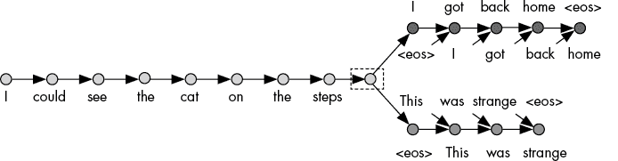

## 第十章：自然语言处理


找到数学化分析文本数据的方法是*自然语言处理（NLP）*领域的主要目标。在本章中，我们将回顾一些 NLP 世界中的重要思想，并讨论如何在数据科学项目中使用 NLP 工具。

我们将从介绍一个商业场景开始，并思考 NLP 如何能够帮助解决这个问题。我们将使用 word2vec 模型，它可以将单个单词转换为数字，从而使得进行各种强大的分析成为可能。我们将展示这个转换的 Python 代码，然后探索它的一些应用。接下来，我们将讨论通用句子编码器（USE），这是一种可以将整个句子转换为数字向量的工具。我们将回顾设置和使用 USE 的 Python 代码。在这个过程中，我们将找到使用前几章中的思想的方法。让我们开始吧！

## 使用 NLP 检测抄袭

假设你是一个文学代理机构的负责人。你的机构每天收到数百封电子邮件，每封邮件都包含来自有抱负的作者的书籍章节。这些章节可能相当长，每篇包含数千到数万字，而你的机构需要仔细筛选这些长篇章，试图找到一些值得接受的章节。代理人筛选这些提交的邮件所花费的时间越长，他们就越没有时间去处理其他重要任务，比如向出版社推销书籍。虽然困难，但文学代理机构确实有可能自动化其中的一些筛选工作。例如，你可以编写一个 Python 脚本，自动检测抄袭。

文学代理机构并不是唯一可能对抄袭检测感兴趣的企业。假设你是一个大型大学的校长。每年，你的学生会提交成千上万篇长论文，你希望确保这些论文没有抄袭。抄袭不仅是一个道德和教育问题，也是一个商业问题。如果你的大学因容忍抄袭而声名狼藉，毕业生将面临更差的就业前景，校友捐赠将下降，越来越少的学生愿意报名，大学的收入和利润无疑会急剧下降。你的大学教授和评分人员已经非常辛苦，因此你希望节省他们的时间，寻找一种自动化的抄袭检测方法。

一个简单的抄袭检测器可能会寻找完全匹配的文本。例如，你所在大学的某个学生可能在他们的论文中提交了以下几句话：

> 人们的一生确实会在死前在眼前一闪而过。这个过程被称为“生活”。

也许你读了这篇论文，感觉这个想法很熟悉，于是你请图书管理员在他们的图书数据库中搜索这段文字。他们找到了 Terry Pratchett 的经典作品 *The Last Continent* 中每个字符的精确匹配，表明了抄袭行为；学生因此受到惩罚。

其他学生可能更狡猾。他们不是直接从出版书籍中抄袭文本，而是学会了改写，这样他们可以通过对措辞做一些微小、不重要的改变来复制想法。例如，有一个学生可能想要抄袭以下文字（同样来自 Pratchett）：

> 拥有开放心态的麻烦，当然在于，人们会坚持过来并试图把东西放进你的脑袋里。

这位学生稍微改写了句子，变成了如下所示：

> 拥有开放心态的问题在于，人们会坚持不懈地试图将东西插入你的脑海。

如果你的图书管理员搜索这个学生句子的精确匹配，他们是找不到任何结果的，因为学生稍微改写了句子。为了抓住像这样的聪明抄袭者，你需要依赖能检测到不仅仅是精确文本匹配，还能基于相似词语和句子的意义检测到“松散”或“模糊”匹配的 NLP 工具。例如，我们需要一种方法来识别 *trouble* 和 *problem* 是在学生改写中作为近义词使用的相似词。通过识别同义词和近义词，我们就能确定哪些不完全相同的句子彼此足够相似，可以作为抄袭证据。我们将使用一个名为 word2vec 的 NLP 模型来完成这一任务。

## 理解 word2vec 自然语言处理模型

我们需要一种方法，能够精确量化任意两个词语之间的相似性。让我们思考一下，两个词语相似意味着什么。考虑 *sword* 和 *knife* 这两个词。它们的字母完全不同，没有重叠，但这两个词所指的事物是相似的：它们都是用来切东西的锋利金属物体。这两个词不是完全的同义词，但它们的意义非常相似。我们人类拥有一生的经验，赋予我们直观的感觉来判断这两个词的相似性，但我们的计算机程序不能依赖直觉，所以我们必须找到一种方法，基于数据来量化这些词语的相似性。

我们将使用来自大量自然语言文本的数据，这些文本也被称为 *语料库*。语料库可以是书籍、报纸文章、研究论文、戏剧或博客文章的集合，或者这些的混合。重要的一点是，它由 *自然语言* 组成——由人类组合的短语和句子，反映了人类的说话和写作方式。一旦我们拥有了自然语言语料库，我们就可以研究如何利用它来量化词语的意义。

### 量化词语之间的相似性

让我们从看一些自然语言句子开始，思考其中的单词。想象一下可能包含*剑*和*刀*的两个句子：

1.  韦斯利用剑攻击我，割破了我的皮肤。

1.  韦斯利用刀攻击我，割破了我的皮肤。

你可以看到这些句子几乎是相同的，除了细节上攻击者使用了剑还是刀。将一个词替换为另一个词后，它们的意思依然相似。这是一个表明*剑*和*刀*相似的迹象：它们可以在许多句子中互相替换，而不会大幅改变句子的意思或含义。当然，也有可能使用其他物品进行攻击，因此像下面这样的句子也可能出现在语料库中：

1.  韦斯利用鲱鱼攻击我，割破了我的皮肤。

尽管关于用鲱鱼进行皮肤刺穿攻击的句子从技术上讲是可能的，但它在任何自然语言语料库中出现的可能性远低于关于剑或刀攻击的句子。一个不懂英语的人，或者一个 Python 脚本，能够通过查看我们的语料库并注意到*攻击*这个词经常出现在*剑*这个词附近，而不常出现在*鲱鱼*这个词附近，来找到这一证据。

注意哪些词汇经常出现在其他词汇附近将对我们非常有用，因为我们可以利用一个词的邻居更好地理解这个词。看看表 10-1，它展示了经常出现在*剑*、*刀*和*鲱鱼*附近的词汇。

表 10-1：自然语言中经常出现在彼此附近的词汇

| **词汇** | **自然语言语料库中常常出现在附近的词汇** |
| --- | --- |
| 剑 | 切割，攻击，鞘，战斗，锋利，钢铁 |
| 刀 | 切割，攻击，馅饼，战斗，锋利，钢铁 |
| 鲱鱼 | 腌制的，海洋，鱼片，馅饼，银色，切割 |

剑和刀都通常是*锋利的*，由*钢铁*制成，用来*攻击*，用来*切割*东西和*战斗*，因此我们可以在表 10-1 中看到，这些词汇经常出现在*剑*和*刀*附近。然而，我们也可以看到这些邻近词汇列表之间的不同。例如，*剑*经常出现在*鞘*附近，而*刀*则不常出现在*鞘*附近。而且，*刀*经常出现在*馅饼*附近，但*剑*通常不会。至于*鲱鱼*，它有时出现在*馅饼*附近（因为人们有时吃鲱鱼馅饼），也有时出现在*切割*附近（因为人们有时在准备食物时切割鲱鱼）。但是，*鲱鱼*附近的其他词汇与*剑*和*刀*附近的词汇没有重叠。

表 10-1 很有用，因为我们可以通过它来理解和表达两个单词的相似性，使用数据而不是直觉反应。我们可以说 *剑* 和 *刀* 是相似的，不仅仅是因为我们凭直觉觉得它们的意思相近，而是因为它们通常会出现在相同的邻近词附近。相比之下，*剑* 和 *鲱鱼* 的相似性就比较小，因为它们在自然语言文本中的常见邻近词几乎没有重叠。表 10-1 给我们提供了一种基于数据的方法来判断单词是否相似，而不是基于模糊的直觉，而且，重要的是，即使是一个不会英语的人也能创建和解读表 10-1，因为即使是不懂英语的人也可以查看文本并找出哪些单词常常是邻近词。这个表也可以通过一个读取任何语料库并找到共同邻近词的 Python 脚本来生成。

我们的目标是将单词转化为数字，因此我们的下一步是创建一个表 10-1 的版本，该版本包含单词作为彼此邻近词的概率数值，如表 10-2 所示。

表 10-2：单词在自然语言语料库中共同出现的概率

| **单词** | **邻近词** | **邻近词在自然语言语料库中与该单词共同出现的概率** |
| --- | --- | --- |
| 剑 | 切割 | 61% |
| 刀 | 切割 | 69% |
| 鲱鱼 | 切割 | 12% |
| 剑 | 派 | 1% |
| 刀 | 派 | 49% |
| 鲱鱼 | 派 | 16% |
| 剑 | 鞘 | 56% |
| 刀 | 鞘 | 16% |
| 鲱鱼 | 鞘 | 2% |

表 10-2 提供的信息与表 10-1 大致相同；它展示了哪些单词有可能出现在自然语言语料库中的其他单词附近。但是表 10-2 更为精确；它给出了单词共同出现的概率数值，而不仅仅是邻近词的列表。再次可以看到，表 10-2 中的百分比似乎是合理的：*剑* 和 *刀* 常常以 *切割* 作为邻近词，*刀* 和 *鲱鱼* 比 *剑* 更有可能以 *派* 作为邻近词，而 *鲱鱼* 很少以 *鞘* 作为邻近词。同样，表 10-2 可以由一个不会英语的人创建，也可以由一个有着书籍或英文文本的 Python 脚本生成。同样，甚至是不懂英语的人，或者一个 Python 脚本，也能查看表 10-2 并清楚了解不同单词之间的相似性与差异性。

### 创建方程组

我们几乎准备好将单词完全表示为数字了。下一步是创建一个比表 10-2 更具数字化的东西。我们不再使用表格表示这些百分比的可能性，而是尝试将它们表示为一个方程组。我们只需要几个方程就能简洁地表示表 10-2 中的所有信息。

让我们从一个算术事实开始。这个算术事实可能看起来毫无用处，但你稍后会看到它为什么有用：

61 = 5 · 10 – 5 · 1 + 3 · 5 + 1 · 1

你可以看到，这是数字 61 的一个方程——这正是根据表 10-2，单词*cut*出现在单词*sword*附近的概率。我们还可以通过使用不同的符号来重写方程的右边：

61 = (5, –5, 3, 1) · (10, 1, 5, 1)

这里，点（·）代表的是点积，这是我们在第九章引入的概念。在计算点积时，我们将两个向量的第一个元素相乘，将第二个元素相乘，依此类推，并将结果相加。我们可以使用乘法和加法来写出这个点积的更标准的方程式，形式如下：

61 = 5 · 10 + (–5) · 1 + 3 · 5 + 1 · 1

你可以看到，这与我们开始时的方程完全相同。5 和 10 相乘，因为它们分别是第一个和第二个向量的第一个元素。数字–5 和 1 也相乘，因为它们分别是第一个和第二个向量的第二个元素。当我们进行点积时，我们将所有这些对应的元素相乘并加总结果。让我们用这种点积风格再写一个算术事实：

12 = (5, –5, 3, 1) · (2, 2, 2, 6)

这只是另一个算术事实，使用点积表示法。但请注意，这是一个关于 12 的方程——正是根据表 10-2，单词*cut*出现在单词*herring*附近的概率。我们还可以注意到，方程中的第一个向量(5, –5, 3, 1)与前一个方程中的第一个向量完全相同。现在，我们有了这两个算术事实，可以再次将它们重写为一个简单的方程组：

sword = (10, 1, 5, 1)

herring = (2, 2 ,2, 6)

*cut*出现在某个单词附近的概率 = (5, –5, 3, 1) · 该单词的向量

在这里，我们迈出了重要的一步：我们不仅仅写下算术事实，而是声称我们拥有代表单词*sword*和*herring*的数字向量，并且我们声称可以使用这些向量来计算单词*cut*与任何单词靠近的概率。也许这看起来是一个大胆的假设，但很快你会看到它为何是合理的。现在，我们可以继续，并写下更多的算术事实，如下所示：

60 = (5, –5, 3, 1) · (10, 1, 5, 9)

1 = (1, –10, –1, 6) · (10, 1, 5, 1)

49 = (1, –10, –1, 6) · (2, 2, 2, 6)

16 = (1, –10, –1, 6) · (10, 1, 5, 9)

56 = (1, 6, 9, –5) · (10, 1, 5, 1)

16 = (1, 6, 9, –5) · (2, 2, 2, 6)

2 = (1, 6, 9, –5) · (10, 1, 5, 9)

你可以把这些看作是任意的算术事实。但我们也可以将它们与表 10-2 连接起来。事实上，我们可以将目前所有的算术事实重写成方程 10-1 所示的系统。

剑 = (10, 1, 5, 1)

刀 = (10, 1, 5, 9)

鲱鱼 = (2, 2, 2, 6)

*切割*出现在某个单词附近的概率 = (5, –5, 3, 1) · 该单词的向量

*派*出现在某个单词附近的概率 = (1, –10, –1, 6) · 该单词的向量

*鞘*出现在某个单词附近的概率 = (1, 6, 9, –5) · 该单词的向量

方程 10-1：包含单词向量表示的方程组

从数学上讲，你可以验证方程 10-1 中的所有方程都是正确的：通过将单词向量代入方程，我们可以计算出表 10-2 中的所有概率。你可能会想知道我们为什么创建了这个方程组。它似乎不过是在以更复杂的方式用更多的向量重复我们在表 10-2 中已经拥有的概率而已。我们在这里迈出的重要一步是，通过创建这些向量和这个方程组，而不是直接使用表 10-2，我们找到了每个单词的数值表示。向量 (10, 1, 5, 1) 在某种意义上“捕捉了*剑*的含义”，同样，(10, 1, 5, 9) 捕捉了*刀*的含义，(2, 2, 2, 6) 捕捉了*鲱鱼*的含义。

尽管我们已经有了每个单词的向量，但你可能并不完全相信这些向量真的能代表英语单词的含义。为了帮助你更有信心，我们可以用这些向量做一些简单的计算，看看能学到什么。首先，让我们在 Python 会话中定义这些向量：

```py
sword = [10,1,5,1]
knife = [10,1,5,9]
herring = [2,2,2,6]
```

在这里，我们将每个单词向量定义为 Python 列表，这是在 Python 中处理向量的标准方式。我们关注的是了解我们的单词之间有多相似，因此让我们定义一个函数来计算任意两个向量之间的距离：

```py
import numpy as np
def euclidean(vec1,vec2):
    distance=np.array(vec1)-np.array(vec2)
    squared_sum=np.sum(distance**2)
    return np.sqrt(squared_sum)
```

这个函数叫做`euclidean()`，因为它本质上是在计算任意两个向量之间的欧几里得距离。在二维空间中，*欧几里得距离*是直角三角形的斜边长度，我们可以用毕达哥拉斯定理来计算。更非正式地，我们通常将欧几里得距离称作*距离*。在超过二维的空间中，我们使用相同的毕达哥拉斯定理公式来计算欧几里得距离，唯一的区别是它更难画出来。计算向量之间的欧几里得距离是一种合理的方式来计算两个向量的相似度：欧几里得距离越小，向量之间的相似度越高。让我们计算一下这些单词向量之间的欧几里得距离：

```py
print(euclidean(sword,knife))
print(euclidean(sword,herring))
print(euclidean(knife,herring))
```

你应该能够看到 *sword* 和 *knife* 之间的距离是 8。而 *sword* 和 *herring* 之间的距离则是 9.9。这些距离测量反映了我们对这些单词的理解：*sword* 和 *knife* 彼此相似，因此它们的向量很接近，而 *sword* 和 *herring* 彼此不太相似，所以它们的向量相距较远。这证明了我们将单词转换为数值向量的方法是有效的：它让我们成功地量化了单词之间的相似度。

如果我们想要检测抄袭，我们需要找到能够代表的不仅仅是这三个词的数值向量。我们需要为英语语言中的每个单词，或者至少为那些经常出现在学生论文中的大多数单词找到向量。我们可以想象这些向量可能是什么。例如，*haddock* 是一种鱼类，跟鲱鱼差不多。因此，我们会预期 *haddock* 的邻近词与 *herring* 相似，并且在 表 10-2 中的概率也会相似（具有类似的邻居概率，像是 *cut* 或 *pie* 或其他任何词）。

每当两个单词在 表 10-2 中有相似的概率时，我们预期它们会有相似的向量，因为我们会根据 方程 10-1 中的方程系统，将这些向量相乘，以得到这些概率。例如，我们可能会发现 *haddock* 的数值向量类似于 (2.1, 1.9, 2.3, 6.5)。这个向量在欧几里得距离上将接近 *herring* 的向量 (2, 2, 2, 6)，如果我们将 *haddock* 向量与 方程 10-1 中的其他向量相乘，我们会发现 *haddock* 与每个邻近词的概率应该与 *herring* 在 表 10-2 中的概率相似。同样，我们还需要为英语中成千上万的其他单词找到向量，我们预期具有相似含义的单词应该有相似的向量。

说我们需要为每个英语单词找到向量很容易，但接下来问题就来了：我们应该如何确定这些向量呢？要理解如何为每个单词确定向量，看看 图 10-1 中的方程系统示意图。


图 10-1：单词彼此接近的概率的可视化表示

这个图看起来很复杂，但它的目的是为了说明我们的方程组。 在方程式 10-1 中，我们将每个单词表示为一个四个元素的向量，像这样：（*a*，*b*，*c*，*d*）。在图 10-1 左侧的 *a*、*b*、*c* 和 *d* 表示这些元素。从这些元素延伸出的每个箭头表示乘法。例如，从标记为 *a* 的圆圈到标记为 *切割概率附近出现* 的椭圆的箭头上标有 5，表示我们应该将每个 *a* 的值乘以 5，并加到估算的 *cut* 在一个单词附近出现的概率中。如果我们考虑所有这些箭头所表示的乘法，你可以从图 10-1 中看到，*cut* 在一个单词附近出现的概率是 5 · *a* – 5 · *b* + 3 · *c* + 1 · *d*，这正如方程式 10-1 中描述的那样。图 10-1 只是另一种表示方程式 10-1 的方式。如果我们能够找到每个英语单词的正确 *a*、*b*、*c* 和 *d* 值，我们就能得到用于检查抄袭所需的单词向量。

我们画图 10-1 的原因是要指出，它恰好呈现出一个神经网络的形式，这是我们在第六章已经讨论过的有监督学习模型的类型。由于它构成了一个神经网络，我们可以使用先进的软件（包括几个免费的 Python 包）来训练这个神经网络，找出每个英语单词的 *a*、*b*、*c* 和 *d* 应该是多少。创建表格 10-1 和表格 10-2，以及方程式 10-1 中的方程组的全部目的，是为了创建一个像图 10-1 所示的假设性神经网络。只要我们拥有像表格 10-2 中那样的数据，我们就可以使用这个神经网络软件来训练图 10-1 中所示的神经网络，并找到我们需要的所有单词向量。

这个神经网络训练的最重要输出将是我们数据中每个单词的 *a*、*b*、*c* 和 *d* 值。换句话说，神经网络训练的输出将是每个单词的 (*a*，*b*，*c*，*d*) 向量。这个过程被称为 *word2vec* 模型：为语料库中的每个单词创建像表格 10-2 那样的概率表，使用该表建立一个像图 10-1 所示的神经网络，然后训练该神经网络来找到表示每个单词的数字向量。

word2vec 模型之所以流行，是因为它可以为任何单词创建数字向量，这些向量可以用于许多有用的应用程序。word2vec 流行的一个原因是，我们可以仅使用原始文本作为输入来训练 word2vec 模型；在训练模型并获取词向量之前，我们不需要对任何单词进行注释或标记。因此，即使是一个不懂英语的人，也可以通过使用 word2vec 方法创建词向量并对其进行推理。

如果这听起来很复杂，别担心。接下来，我们将通过代码来处理这些类型的向量，你会看到，尽管 word2vec 的理论和概念很复杂，但代码和应用可以是直接且简单的。目前，尽量让自己对我们到目前为止讨论的基本概念感到舒适：如果我们创建了关于哪些单词在自然语言中彼此接近的数据，我们就可以利用这些数据创建向量，从而量化任何一对单词的相似性。接下来，让我们继续用一些代码，看看如何使用这些数字向量来检测抄袭。

## 分析 word2vec 中的数字向量

不仅有人已经创建了 word2vec 模型，而且他们还为我们做了所有的繁重工作：编写代码、计算向量，并将所有这些内容发布到网上，供我们随时免费下载。在 Python 中，我们可以使用 Gensim 包来访问许多英语单词的词向量：

```py
import gensim.downloader as api
```

Gensim 包有一个`downloader`，允许我们仅通过使用`load()`方法来访问许多 NLP 模型和工具。你可以用以下一行代码加载一个词向量集合：

```py
vectors = api.load('word2vec-google-news-300')
```

这段代码加载了一个由约 1000 亿个单词组成的新闻语料库创建的词向量集合。本质上，某人获取了类似于我们表 10-2 中的信息，但其中包含更多的单词。他们从由人类编写的真实新闻来源中获取了这些单词和概率。然后，他们利用这些信息创建了一个类似于图 10-1 中的神经网络——同样，其中包含更多的单词。他们训练了这个神经网络，并为语料库中的每个单词找到了对应的向量。

我们刚刚下载了他们计算的向量。我们预期这些向量会有用的一个原因是，用于创建这些向量的文本语料库既庞大又多样化，而庞大且多样化的文本数据源往往能提高 NLP 模型的准确性。我们可以按如下方式查看对应于任何单词的向量：

```py
print(vectors['sword'])
```

在这里，我们打印出单词*sword*的向量。你将看到的输出是一个包含 512 个数字元素的向量。像这样的词向量，表示我们下载的模型中的单词*sword*，也被称为*嵌入向量*，因为我们已经成功地将一个单词*嵌入*到*向量空间*中。简而言之，我们已经将一个单词转换成了一个数字向量。

你会注意到，*sword*的这个 512 维向量与我们在本章之前使用的*sword*的向量（10, 1, 5, 1）不同。这个向量与我们之前的向量不同有几个原因。首先，这个向量使用了与我们不同的语料库，因此在它的表 10-2 版本中会列出不同的概率。其次，这个模型的创建者决定使用 512 维的向量，而不是我们使用的 4 维向量，因此它们得到了更多的向量元素。第三，他们的向量调整为接近 0 的值，而我们的向量没有。每个语料库和每个神经网络都会导致略有不同的结果，但如果我们使用的是一个好的语料库和一个好的神经网络，我们期望得到相同的定性结果：这些向量代表了单词，并使我们能够检测抄袭（以及执行许多其他任务）。

下载这些向量后，我们可以像处理任何其他 Python 对象一样使用它们。例如，我们可以计算单词向量之间的距离，方法如下：

```py
print(euclidean(vectors['sword'],vectors['knife']))
print(euclidean(vectors['sword'],vectors['herring']))
print(euclidean(vectors['car'],vectors['van']))
```

在这里，我们进行了与之前相同的欧几里得距离计算，但这次我们使用的是我们下载的向量，而不是方程 10-1 中的向量。当你运行这些比较时，你会看到以下输出：

```py
>>> **print(euclidean(vectors['sword'],vectors['knife']))**
3.2766972
>>> **print(euclidean(vectors['sword'],vectors['herring']))**
4.9384727
>>> **print(euclidean(vectors['car'],vectors['van']))**
2.608656
```

你可以看到这些距离是合理的：*sword*的向量与*knife*的向量相似（它们之间的距离约为 3.28），但与*herring*的向量不同（它们之间的距离约为 4.94，比*sword*和*knife*之间的差异要大得多）。你也可以对语料库中的其他词对（如*car*和*van*）进行相同的计算。你可以比较词对之间的差异，找出哪些词对的意思最相似或最不相似。

欧几里得距离并不是唯一用于比较单词向量的距离度量。使用余弦相似度度量也是常见的，就像我们在第九章中做的那样。记住，我们用这段代码来计算余弦相似度：

```py
def dot_product(vector1,vector2):
    thedotproduct=np.sum([vector1[k]*vector2[k] for k in range(0,len(vector1))])
    return(thedotproduct)

def vector_norm(vector):
    thenorm=np.sqrt(dot_product(vector,vector))
    return(thenorm)

def cosine_similarity(vector1,vector2):
    thecosine=0
    thedotproduct=dot_product(vector1,vector2)
    thecosine=thedotproduct/(vector_norm(vector1)*vector_norm(vector2))
    thecosine=np.round(thecosine,4)
    return(thecosine)
```

这里我们定义了一个名为`cosine_similarity()`的函数，用来检查任意两个向量之间的角度余弦。我们可以如下检查一些向量之间的余弦相似度：

```py
print(cosine_similarity(vectors['sword'],vectors['knife']))
print(cosine_similarity(vectors['sword'],vectors['herring']))
print(cosine_similarity(vectors['car'],vectors['van']))
```

当你运行这段代码时，你会看到以下结果：

```py
>>> **print(cosine_similarity(vectors['sword'],vectors['knife']))**
0.5576
>>> **print(cosine_similarity(vectors['sword'],vectors['herring']))**
0.0529
>>> **print(cosine_similarity(vectors['car'],vectors['van']))**
0.6116
```

你可以看到这些度量正是我们想要的：它们对我们认为不同的词给出了较低的值，而对我们认为相似的词给出了较高的值。尽管你的笔记本电脑不会“说英语”，但通过分析自然语言文本语料库，它能够量化出不同词语之间的相似度和差异度。

### 使用数学计算操作向量

word2vec 的一个著名例子来自对*king*和*queen*这两个词的分析。为了看到这个例子，我们首先获取一些英语单词的向量：

```py
king = vectors['king']
queen = vectors['queen']
man = vectors['man']
woman = vectors['woman']
```

在这里，我们定义与几个单词相关的向量。作为人类，我们知道国王是君主制国家的男性领导人，而女王是女性领导人。我们甚至可能将*king*和*queen*之间的关系表示如下：

king – man + woman = queen

从*king*的概念开始，去掉*man*的概念，再加上*woman*的概念，最终得到*queen*的概念。如果我们仅从单词的角度来看，这个方程可能显得荒谬，因为通常情况下无法以这种方式加减单词或概念。然而，请记住，我们拥有这些单词的向量版本，因此我们可以相互加减向量，并看看结果如何。让我们尝试在 Python 中对这些单词对应的向量进行加减运算：

```py
newvector = king-man+woman
```

在这里，我们取`king`向量，减去`man`向量，再加上`woman`向量，并将结果定义为一个新变量`newvector`。如果我们的加法和减法按预期进行，`newvector`应该捕捉到一个特定的含义：去除*man*属性后，加入*woman*属性的国王。换句话说，尽管`newvector`是三个向量的和，它们其中没有一个是*queen*的向量，但我们期望它们的和接近或等于*queen*的向量。让我们检查一下`newvector`与`queen`向量之间的差异，看是否符合预期：

```py
print(cosine_similarity(newvector,queen))
print(euclidean(newvector,queen))
```

我们可以看到我们的`newvector`与我们的`queen`向量相似：它们的余弦相似度为 0.76，欧几里得距离为 2.5。我们可以将其与其他熟悉的单词对的差异进行比较：

```py
print(cosine_similarity(vectors['fish'],vectors['herring']))
print(euclidean(vectors['fish'],vectors['herring']))
```

你应该看到*king – man + woman*比*fish*与*herring*的相似度更接近*queen*。我们对单词向量的数学计算得到了完全符合我们对这些单词语言意义的预期结果。这证明了这些向量的有用性：我们不仅可以通过比较它们找到单词对之间的相似性，还可以通过加法和减法操作来添加和减去概念。能够对这些向量进行加减运算，并得到合乎逻辑的结果，进一步证明了这些向量可靠地捕捉了它们所关联单词的含义。

### 使用 word2vec 检测抄袭

让我们回到本章早些时候的抄袭情境。记得我们介绍了以下两个句子作为抄袭的例子：

1.  拥有开放心态的问题，当然，是人们会坚持走近并试图将东西放进去。[原句]

1.  拥有开放心态的问题是，人们会坚持走近并试图将东西塞进你的脑袋。[抄袭句子]

因为这两句话在某些地方有所不同，所以一个只寻找精确匹配的简单抄袭检测工具在这里是无法检测到抄袭的。我们并不希望检查每个字符的精确匹配，而是要检查每个单词的意思是否接近。对于那些完全相同的单词，我们会发现它们之间的距离为 0：

```py
print(cosine_similarity(vectors['the'],vectors['the']))
print(euclidean(vectors['having'],vectors['having']))
```

这些结果并不令人惊讶。我们发现，一个单词的向量与其自身的余弦相似度为 1.0，而一个单词的向量与其自身的欧几里得距离为 0。每个单词都与自己相等。但请记住，狡猾的抄袭者是在进行释义，而不是使用与已发布文本完全相同的词语。如果我们比较那些经过释义的单词，我们可以预期它们会与原始单词相似，但不会完全相同。我们可以通过以下方式衡量这些潜在释义单词的相似性：

```py
print(cosine_similarity(vectors['trouble'],vectors['problem']))
print(euclidean(vectors['come'],vectors['approach']))
print(cosine_similarity(vectors['put'],vectors['insert']))
```

你会看到这段代码的以下结果：

```py
>>> **print(cosine_similarity(vectors['trouble'],vectors['problem']))**
0.5327
>>> **print(euclidean(vectors['come'],vectors['approach']))**
2.9844923
>>> **print(cosine_similarity(vectors['put'],vectors['insert']))**
0.3435
```

这段代码比较了抄袭文本和原文中的单词。结果显示，几乎每种情况下都有接近匹配：要么是相对较小的欧几里得距离，要么是相对较高的余弦相似度。如果学生句子的单个单词与已发表句子的单个单词都能接近匹配，那么即便没有精确匹配，这也是抄袭的有力证据。重要的是，我们可以通过自动化检查这些接近匹配，而不依赖于缓慢且成本高昂的人类判断，而是依赖于数据和快速的 Python 脚本。

检查句子中每个单词的接近匹配是检测抄袭的合理起点。然而，这并不完美。主要问题在于，迄今为止，我们只学会了评估单个单词，而不是完整句子。我们可以将句子看作是单个单词的集合或序列。但是，在许多情况下，最好采用一种能够同时评估整个句子的意义和相似性的技术，将句子视为独立的单元，而不仅仅是单词的集合。为此，我们将转向一种强大的新方法。

## 使用跳跃思维

*跳跃思维*模型是一个自然语言处理（NLP）模型，利用数据和神经网络将整个句子转换为数值向量。它与 word2vec 非常相似，但不同之处在于，它不是一次将单个单词转换为向量，而是将整个句子作为单元转换为向量。

跳跃思维的理论与 word2vec 的理论相似：你获取一个自然语言语料库，找出哪些句子往往彼此接近，然后训练一个神经网络，能够预测哪些句子可能出现在其他句子的前面或后面。对于 word2vec，我们在图 10-1 中看到过神经网络模型的示意图。对于跳跃思维，图 10-2 展示了类似的示意图。



图 10-2：我们使用跳跃思维模型来预测哪些句子会彼此接近。

图 10-2 基于 Ryan Kiros 及其同事在 2015 年的论文“Skip-Thought Vectors”中的模型（[`arxiv.org/pdf/1506.06726.pdf`](https://arxiv.org/pdf/1506.06726.pdf)）。你可以看到图左侧的句子被作为输入。这个句子是一个单词序列，但所有单词都被视为一个单元一起考虑。skip-thoughts 模型试图找到这个句子的向量表示，当用作神经网络输入时，可以预测最可能出现在它之前和之后的句子（包括图 10-2 右侧的句子）。就像 word2vec 基于预期哪些单词接近其他单词一样，skip-thoughts 基于预测哪些句子接近其他句子。你不需要太担心理论，只需记住 skip-thoughts 是一种通过计算附近句子出现概率来对自然语言句子进行向量编码的方法。

就像使用 word2vec 一样，我们不需要自己编写任何代码。相反，我们将转向*Universal Sentence Encoder (USE)*。这个工具将句子转换为向量，使用 skip-thoughts 的思想来找到这些向量（以及其他高级技术方法）。我们将使用 USE 的向量输出进行抄袭检测，但 USE 向量也可以用于聊天机器人实现、图像标记等多种用途。

因为有其他人已经为我们编写了 USE 的代码，所以使用 USE 的代码并不难。我们可以从定义要分析的句子开始：

```py
Sentences = [
    "The trouble with having an open mind, of course, is that people will insist on coming along and trying to put things in it.",\
    "The problem with having an open mind is that people will insist on approaching and trying to insert things into your mind.",\
    "To be or not to be, that is the question",\
    "Call me Ishmael"
]
```

这里我们有一个句子列表，我们想将每个句子转换为数值向量。我们可以导入其他人编写的代码来进行这种转换：

```py
import tensorflow_hub as hub
embed = hub.load("https://tfhub.dev/google/universal-sentence-encoder-large/5")
```

`tensorfow_hub`模块允许我们从在线库中加载 USE。USE 是一个大模型，所以如果将其加载到 Python 会话中需要几分钟甚至更长时间也不必惊慌。加载后，我们将其保存为名为`embed`的变量。现在 USE 已经在我们的 Python 会话中，我们可以用一行简单的代码创建单词嵌入（向量）：

```py
embeddings = embed(Sentences)
```

我们的`embeddings`变量包含代表`Sentences`列表中每个句子的向量。你可以通过检查`embeddings`变量的第一个元素来查看第一句的向量：

```py
print(embeddings[0])
```

运行这段代码时，你会看到一个包含 512 个元素的数值向量，其中前 16 个元素如下所示：

```py
>>> **print(embeddings[0])**
tf.Tensor(
[ 9.70209017e-04 -5.99743128e-02 -2.84200953e-03  7.49062840e-03
  7.74949566e-02 -1.00521010e-03 -7.75496066e-02  4.12207991e-02
 -1.55476958e-03 -1.11693323e-01  2.58275736e-02 -1.15299867e-02
 -3.84882478e-05 -4.07184102e-02  3.69430222e-02  6.66357949e-02
```

这是你列表中第一句的向量表示，不是句子中的单个单词，而是整个句子本身。就像我们用 word2vec 向量做的那样，我们可以计算任意两个句子向量之间的距离。在这种情况下，向量之间的距离将代表两个句子整体意义的差异程度。让我们检查一下第一和第二句之间的距离：

```py
print(cosine_similarity(embeddings[0],embeddings[1]))
```

我们可以看到，余弦相似度大约为 0.85——这表明我们`Sentences`列表中的前两个句子非常相似。这是证据，表明学生的句子（我们`Sentences`列表中的第二个句子）是从普拉特切特的句子（我们`Sentences`列表中的第一个句子）抄袭的。相反，我们可以检查其他向量之间的距离，发现它们并不像这两个句子那样相似。例如，如果你运行`print(cosine_similarity(embeddings[0],embeddings[2]))`，你会看到这两个句子的余弦相似度约为 0.02，表明这两个句子几乎是完全不同的。这是证据，表明普拉特切特没有抄袭*哈姆雷特*。如果你运行`print(cosine_similarity(embeddings[0],embeddings[3]))`，你会看到这两个句子的余弦相似度约为-0.07，另一个低相似度分数，表明普拉特切特也没有抄袭*白鲸*。

你可以看到，检查任意两句子之间意义的距离是非常直接的。你的抄袭检测器可以简单地检查学生的作品和以前发布的句子之间的余弦相似度（或欧几里得距离），如果相似度很大（或欧几里得距离过小），你可以认为这是学生抄袭的证据。

## 主题建模

为了完成这一章，让我们介绍一个最后的商业场景，讨论如何将 NLP 工具与前几章的工具结合使用来处理这个问题。在这个场景中，假设你经营一个论坛网站。你的网站已经取得了巨大成功，以至于你再也无法亲自阅读所有的帖子和对话，但你仍然希望了解人们在你的网站上写的主题，以便了解你的用户是谁，他们关心什么。你希望找到一种可靠的自动化方式，分析你网站上的所有文本，并发现讨论的主要话题。这个目标，称为*主题建模*，在 NLP 中很常见。

首先，让我们来看一组可能出现在你网站上的句子。一个成功的论坛网站可能每秒钟接收到成千上万的评论，但我们从一个小样本开始，只有八个句子：

```py
Sentences = [
    "The corn and cheese are delicious when they're roasted together",
    "Several of the scenes have rich settings but weak characterization",
    "Consider adding extra seasoning to the pork",
    "The prose was overwrought and pretentious",
    "There are some nice brisket slices on the menu",
    "It would be better to have a chapter to introduce your main plot ideas",
    "Everything was cold when the waiter brought it to the table",
    "You can probably find it at a cheaper price in bookstores"
]
```

就像你之前做的那样，你可以计算所有这些句子的向量或嵌入：

```py
embeddings = embed(Sentences)
```

接下来，我们可以创建一个包含所有句子嵌入的矩阵：

```py
arrays=[]
for i in range(len(Sentences)):
    arrays.append(np.array(embeddings[i]))

sentencematrix = np.empty((len(Sentences),512,), order = "F")

for i in range(len(Sentences)):
    sentencematrix[i]=arrays[i]

import pandas as pd
pandasmatrix=pd.DataFrame(sentencematrix)
```

这段代码首先创建一个名为`arrays`的列表，并将所有句子向量添加到该列表中。接下来，它创建一个名为`sentencematrix`的矩阵。这个矩阵只是将你的句子向量堆叠在一起，每个句子向量占一行。最后，我们将这个矩阵转换成一个 pandas 数据框，以便更方便地操作。最终结果，名为`pandasmatrix`，包含八行；每一行都是我们八个句子的句子向量。

现在我们有一个包含句子向量的矩阵。但仅仅获得我们的向量还不够；我们需要决定如何使用它们。记住，我们的目标是主题建模。我们希望理解人们在写什么主题，以及哪些句子与哪些主题相关。我们有几种方法可以实现这一目标。实现主题建模的一种自然方法是使用聚类，这是我们在第七章中已经讨论过的内容。

我们的聚类方法很简单：我们将句子向量的矩阵作为输入数据。我们将应用聚类来确定数据中存在的自然分组。我们将解释我们找到的这些组（簇）为你论坛网站上正在讨论的不同主题。我们可以按以下方式进行聚类：

```py
from sklearn.cluster import KMeans
m = KMeans(2)
m.fit(pandasmatrix)

pandasmatrix['topic'] = m.labels_

pandasmatrix['sentences']=Sentences
```

你可以看到，聚类只需要几行代码。我们从 sklearn 模块导入了 `KMeans` 代码。我们创建了一个叫做 `m` 的变量，然后使用它的 `fit()` 方法为我们的矩阵（`pandasmatrix`）找到两个簇。`fit()` 方法利用欧几里得距离度量和我们的句子向量来找到两个文档簇。它找到的这两个簇就是我们将视为我们的句子集合的两个主要主题。在找到这些簇之后，我们向 `pandasmatrix` 添加了两个新列：首先，我们添加了作为聚类结果的标签（在 `topic` 变量中），其次，我们添加了我们正在尝试聚类的实际句子。让我们看看结果：

```py
print(pandasmatrix.loc[pandasmatrix['topic']==0,'sentences'])
print(pandasmatrix.loc[pandasmatrix['topic']==1,'sentences'])
```

这个代码片段输出两组句子：首先是标记为属于簇 0 的句子（`topic` 变量等于 0 的行中的句子），其次是标记为属于簇 1 的句子（`topic` 变量等于 1 的行中的句子）。你应该看到以下结果：

```py
>>> **print(pandasmatrix.loc[pandasmatrix['topic']==0,'sentences'])**
0    The corn and cheese are delicious when they're...
2          Consider adding extra seasoning to the pork
4       There are some nice brisket slices on the menu
6    Everything was cold when the waiter brought it...
Name: sentences, dtype: object
>>> **print(pandasmatrix.loc[pandasmatrix['topic']==1,'sentences'])**
1    Several of the scenes have rich settings but w...
3            The prose was overwrought and pretentious
5    It would be better to have a chapter to introd...
7    You can probably find it at a cheaper price in...
Name: sentences, dtype: object
```

你可以看到，这种方法已经在我们的数据中识别出了两个簇，并将其标记为簇 0 和簇 1。当你查看被分类为簇 0 的句子时，你会发现许多似乎是在讨论食物和餐馆。而当你查看簇 1 时，你会看到它似乎由书籍评论组成。至少根据这八个句子的样本，这些是你论坛上讨论的主要话题，并且它们已经被自动识别和组织。

我们已经完成了主题建模，使用了一个数值方法（聚类）来处理非数值数据（自然语言文本）。你可以看到，USE 和词嵌入在许多应用中是非常有用的。

## 自然语言处理的其他应用

NLP 的一个有用应用是在推荐系统中。假设你经营一个电影网站，并希望向用户推荐电影。在第九章中，我们讨论了如何使用互动矩阵基于交易历史的比较来进行推荐。然而，你也可以基于内容的比较来构建推荐系统。例如，你可以获取每部电影的情节概要，并使用 USE 为每个情节概要获取句子嵌入。然后，你可以计算情节概要之间的距离，确定各种电影的相似度，并在用户观看电影后，向该用户推荐情节最相似的电影。这就是*基于内容的推荐系统*。

另一个有趣的 NLP 应用是*情感分析*。我们在第六章中稍微接触到过情感分析。某些工具能够判断给定句子的语气或表达的情感是积极、消极还是中立。有些工具依赖于我们在本章中介绍的词嵌入技术，而其他工具则不依赖。情感分析对于每天收到成千上万封电子邮件和消息的企业非常有用。通过对所有收到的电子邮件进行自动情感分析，企业可以判断哪些客户最为满意或不满，并可能根据客户的情感优先回应。

今天许多企业在其网站上部署*聊天机器人*—一种能够理解文本输入并回答问题的计算机程序。聊天机器人的复杂性不同，但许多都依赖于一些类似于本章所述的 word2vec 和 skip-thought 方法的词嵌入技术。

NLP 在商业中有许多其他潜在的应用。今天，律师事务所正在尝试使用 NLP 自动分析文档，甚至自动生成或至少整理合同。新闻网站也尝试使用 NLP 自动生成某些类型的格式化文章，例如体育赛事的回顾。随着 NLP 领域的不断发展，应用的可能性是无穷无尽的。如果你掌握了像 word2vec 和 skip-thoughts 这样强大的方法作为起点，创建有用的应用是没有限制的。

## 摘要

本章中，我们讨论了自然语言处理。我们讨论的所有 NLP 应用都依赖于嵌入技术：能够准确表示单词和句子的数值向量。如果你能够将一个词用数字表示，就可以对它进行数学运算，包括计算相似度（我们在抄袭检测中做过）和聚类（我们在主题建模中做过）。NLP 工具可能很难使用和掌握，但它们的能力可以让人惊叹。

在下一章，我们将转变方向，通过讨论一些与数据科学相关的其他编程语言的简单概念来结束本书。
