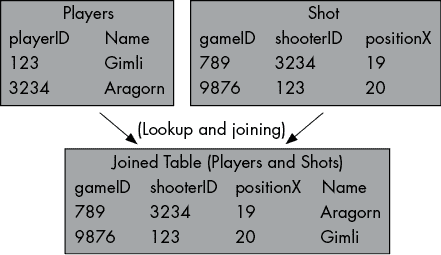
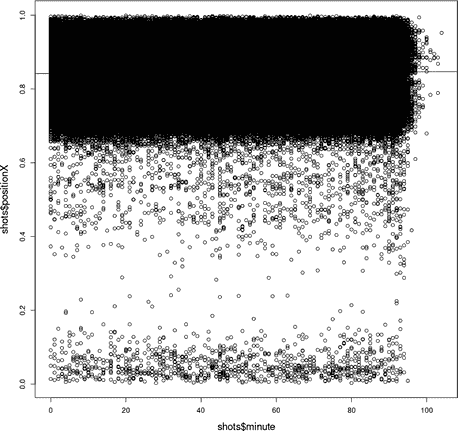

## 第十一章：数据科学在其他语言中的应用


到目前为止，我们的所有商业解决方案都有一个共同点：它们只使用了 Python。Python 是数据科学领域的标准语言，但它并不是唯一的语言。最优秀的数据科学家是多才多艺的，能够使用多种语言编写代码。本章简要介绍了结构化查询语言（SQL）和 R 语言，这两种常见语言是每个优秀数据科学家都应该掌握的。本章并不是对这两种语言的全面概述，而是一个基本介绍，帮助你识别和编写几行 SQL 或 R 代码。

本章将从介绍一个商业场景开始。接着，我们将介绍一些简单的 SQL 代码，来创建数据库并操作其中的数据。接下来，我们将讨论 R 语言以及如何使用它执行简单的操作和线性回归。你将学习如何在 Python 会话中运行 SQL 和 R 命令，而不是花费大量精力配置环境来运行 SQL 和 R 命令。

## 用 SQL 赢得足球比赛

想象一下，你收到了一份作为欧洲足球队经理的工作邀请。这可能看起来更像是一个体育场景，而非商业场景，但请记住，体育也是一项商业，每年全球都有数十亿美元的收入。球队聘请经理是为了最大化他们的收入和利润，并确保一切运作顺利。

每个团队从商业角度来看需要做的一件最重要的事情就是赢得比赛——常常获胜的团队通常比那些常常输掉比赛的团队赚得更多。作为一名优秀的数据科学家，你知道如何为自己在新职位上的成功奠定基础：你开始深入数据，探索数据，试图了解赢得足球比赛所需的要素。

### 阅读和分析数据

你可以从以下网址下载几个包含与欧洲足球相关的数据的文件：[`bradfordtuckfield.com/players.csv`](https://bradfordtuckfield.com/players.csv)，[`bradfordtuckfield.com/games.csv`](https://bradfordtuckfield.com/games.csv)，以及[`bradfordtuckfield.com/shots.csv`](https://bradfordtuckfield.com/shots.csv)。第一个文件，*players.csv*，包含了一份职业足球球员的名单，包括他们的名字和唯一的 ID 号。接下来的文件，*games.csv*，包含了与成千上万场足球比赛相关的详细统计数据，包括参赛的队伍、进球数以及更多信息。第三个文件，*shots.csv*，是最大的，包含了关于数十万次比赛射门的信息，包括谁进行了射门、球员使用哪只脚、射门发生的地点以及射门的结果（是否被封堵、是否偏出或是否进球）。

如果你能够对这些数据进行严格分析，你将能深入了解欧洲足球，并掌握作为经理成功所需的大部分重要知识。（这些公共领域数据的原始来源包括[`www.kaggle.com/technika148/football-database`](https://www.kaggle.com/technika148/football-database)、[`understat.com`](https://understat.com) 和 [`www.football-data.co.uk`](https://www.football-data.co.uk)。）

让我们从读取这些文件开始。我们这里使用 Python，但别担心，我们很快会使用 SQL：

```py
import pandas as pd
players=pd.read_csv('players.csv', encoding = 'ISO-8859-1')
games=pd.read_csv('games.csv', encoding = 'ISO-8859-1')
shots=pd.read_csv('shots.csv', encoding = 'ISO-8859-1')
```

到目前为止，这应该看起来很熟悉。这是读取 *.csv* 文件的标准 Python 代码。在导入 pandas 后，我们读取包含关于欧洲足球信息的数据集。你可以看到，我们读取了将在此使用的所有三个数据集：`players`，包含有关个人球员的数据；`games`，包含关于单场比赛的数据；以及 `shots`，包含球员在比赛中射门的数据。

让我们来看一下这些数据集的前几行：

```py
print(players.head())
print(games.head())
print(shots.head())
```

`players` 表只有两列，当你运行`print(players.head())`时，你应该能够看到它们的前五行：

```py
 playerID            name
0       560   Sergio Romero
1       557  Matteo Darmian
2       548     Daley Blind
3       628  Chris Smalling
4      1006       Luke Shaw
```

`shots` 数据更为详细。当你运行`print(shots.head())`时，你应该能够看到它的前五行：

```py
 gameID  shooterID  assisterID  ...     xGoal positionX positionY
0      81        554         NaN  ...  0.104347     0.794     0.421
1      81        555       631.0  ...  0.064342     0.860     0.627
2      81        554       629.0  ...  0.057157     0.843     0.333
3      81        554         NaN  ...  0.092141     0.848     0.533
4      81        555       654.0  ...  0.035742     0.812     0.707
```

你可以看到，默认情况下，pandas 包省略了一些在输出控制台中无法显示的列。你可以通过运行`print(shots.columns)`来查看数据集中所有列的列表，执行后将显示如下列表：

```py
Index(['gameID', 'shooterID', 'assisterID', 'minute', 'situation',
       'lastAction', 'shotType', 'shotResult', 'xGoal', 'positionX',
       'positionY'],
       dtype='object')
```

我们有关于每次射门的详细数据。我们知道使用哪只脚进行射门（在 `shotType` 列中），射门的结果（在 `shotResult` 列中），以及射门的位置（在 `positionX` 和 `positionY` 列中）。但有一点数据中没有明确提到，那就是射门球员的姓名。我们所拥有的只是 `shooterID`，一个数字。如果我们想知道谁射门了，我们必须查找：首先在 `shots` 数据中找到 `shooterID`，然后在 `players` 数据集中查找与该 `shooterID` 匹配的球员姓名。

例如，第一脚射门是由 `shooterID` 为 554 的球员完成的。如果我们想知道这名球员的名字，我们需要查找 `players` 数据集。如果你浏览 `players` 数据，或者在 Python 中运行 `print(players.loc[7,'name'])`，你会看到这名球员是胡安·马塔（Juan Mata）。

### 熟悉 SQL

让我们来看一些 SQL 代码，这些代码将帮助你进行此类查找。我们先从 SQL 代码开始，然后再讨论如何执行这些代码。单独的 SQL 命令通常被称为 SQL *查询*。以下代码是一个 SQL 查询，它将展示整个 `players` 数据集：

```py
SELECT * FROM playertable;
```

通常，短小的 SQL 查询只要你懂英语，就很容易理解。在这个代码片段中，`SELECT` 告诉我们我们正在选择数据。查询末尾的 `FROM` `playertable` 表示我们将从名为 `playertable` 的表中选择数据。在 `SELECT` 和 `FROM playertable` 之间，我们需要指定要从 `playertable` 表中选择的列。星号（`*`）是一个快捷方式，表示我们要选择 `playertable` 表中的所有列。分号（`;`）告诉 SQL 我们已经完成了这个特定的查询。

所以，这个 SQL 查询选择了整个 `players` 表。如果你不想选择所有的列，你可以用一个或多个列名替换 `*`。例如，以下两个查询也是有效的 SQL 查询：

```py
SELECT playerID FROM playertable
SELECT playerID, name FROM playertable
```

第一个查询只会从 `playertable` 表中选择 `playerID` 列。第二个查询会从 `playertable` 表中选择 `playerID` 和 `name` 两列——我们指定要选择这两列的输出结果和使用星号时的输出结果是一样的。

你可能注意到我们的 SQL 查询中，关键字都是大写的。这是编写 SQL 查询时的一种常见做法，虽然在大多数环境中它并不是强制要求的。我们这样做是为了遵循约定。

### 设置 SQL 数据库

如果你将前面的 SQL 查询直接粘贴到 Python 会话中，它们将无法正确运行；它们不是 Python 代码。如果你经常运行 SQL 查询，你可能希望设置一个专门用于编辑和运行 SQL 查询的环境。然而，这是一本 Python 书，我们不想让你陷入设置 SQL 环境的细节中。相反，让我们讲解几个步骤，帮助你直接在 Python 中运行 SQL 查询。你可以通过在 Python 中运行以下命令来开始：

```py
import sqlite3
conn = sqlite3.connect("soccer.db")
curr = conn.cursor()
```

在这里，我们导入了 SQLite3 包，它允许我们在 Python 中运行 SQL 查询。SQL 是一种与数据库交互的语言，因此我们需要使用 SQLite3 来连接数据库。在第二行，我们告诉 SQLite3 连接到一个名为 `soccer.db` 的数据库。你可能电脑上没有名为 `soccer.db` 的数据库，所以 SQLite3 可能没有可以连接的数据库。这没关系，因为 SQLite3 模块非常有用：当我们指定一个要连接的数据库时，如果该数据库存在，它会连接到该数据库；如果数据库不存在，它会为我们创建一个新的数据库并连接到它。

既然我们已经连接到数据库，我们需要定义一个 *游标* 来访问这个数据库。你可以把这个游标看作类似于你在电脑上使用的鼠标光标，它帮助你选择和操作对象。如果你现在不理解这一点，也不要担心。稍后我们会更清楚地展示如何使用这个游标。

现在我们有了一个数据库，我们希望将其填充。通常，数据库包含多个表，但我们的`soccer.db`数据库目前是空的。到目前为止，我们处理的三个 pandas 数据框都可以作为表格保存到数据库中。我们可以通过一行代码将`players`数据框添加到数据库中：

```py
players.to_sql('playertable', conn, if_exists='replace', index = False)
```

在这里，我们使用`to_sql()`方法将我们的`players`数据框推送到数据库的`playertable`表中。我们使用之前创建的连接`conn`，它确保该表被推送到我们的`soccer.db`数据库中。现在，玩家数据被存储在我们的数据库中，而不是仅仅作为 pandas 数据框在 Python 会话中访问。

### 执行 SQL 查询

我们终于准备好在数据上运行 SQL 查询了。以下是运行 SQL 查询的 Python 代码：

```py
curr.execute('''
SELECT * FROM playertable
          ''')
```

你可以看到我们创建的游标`curr`终于派上用场了。游标是我们用来在数据上执行 SQL 查询的对象。在这种情况下，我们执行了一个简单的查询，选择了名为`playertable`的整个表。需要注意的是，这只选择了数据，但并没有显示它。如果我们想要实际查看选择的数据，我们需要将其打印到控制台：

```py
for row in curr.fetchall():
    print(row)
```

游标已选择数据并将其推送到 Python 会话的内存中，但我们需要使用`fetchall()`方法来访问这些数据。当你运行`fetchall()`时，它会选择一组行。这就是为什么我们在`for`循环中逐行打印每一行的原因。`playertable`表有成千上万的行，你可能不希望一次性将所有行打印到屏幕上。你可以通过添加`LIMIT`子句来限制查询返回的行数：

```py
curr.execute('''
SELECT * FROM playertable **LIMIT 5**
          ''')
for row in curr.fetchall():
    print (row)
```

在这里，我们运行与之前相同的代码，只是添加了七个字符：`LIMIT 5`。通过将`LIMIT 5`添加到 SQL 查询中，我们将返回的行数限制为仅前五行。由于我们只获取表中的前五行，打印它们到屏幕上变得更容易。这显示了我们在使用 pandas 时运行`print(players.head())`时看到的数据。但要小心：在这种情况下，`LIMIT 5`将返回前五行，但在其他数据库环境中，它可能会随机返回五行。你可以依赖于从`LIMIT 5`子句中获得五行，但不能总是确定会得到哪五行。

我们经常只想要数据的特定子集。例如，假设我们想要查找具有特定 ID 的玩家：

```py
curr.execute('''
SELECT * FROM playertable WHERE playerID=554
          ''')
for row in curr.fetchall():
    print (row)
```

在这里，我们运行了大部分相同的代码，但我们添加了一个`WHERE`子句。我们不再选择整个表格，而只选择那些满足特定条件的行。我们感兴趣的条件是`playerID=554`。输出显示我们一行数据，告诉我们`playerID`等于 554 的玩家叫 Juan Mata。这告诉我们我们想知道的信息：Juan Mata 是数据中记录的第一次射门的球员。你应该开始注意到一个模式：在创建 SQL 查询时，我们从一个选择整个表格的简短查询开始，然后添加*子句*（就像我们在这里添加的`LIMIT`子句或`WHERE`子句），以精炼我们得到的结果。SQL 查询由多个子句组成，每个子句都会影响查询选择的数据。

我们可以使用`WHERE`子句来选择各种条件。例如，我们可以使用`WHERE`子句来选择具有特定名字的玩家的 ID：

```py
curr.execute('''
SELECT playerID FROM playertable WHERE name="Juan Mata"
          ''')
for row in curr.fetchall():
    print (row)
```

我们还可以使用`AND`操作符来指定多个条件：

```py
curr.execute('''
SELECT * FROM playertable WHERE playerID>100 AND playerID<200
          ''')
for row in curr.fetchall():
    print (row)
```

在这个例子中，我们选择了满足两个条件的`playertable`中的行：`playerID>100`和`playerID <200`。

你可能想查找表格中的一个名字，但不确定拼写。在这种情况下，你可以使用`LIKE`操作符：

```py
curr.execute('''
SELECT * FROM playertable WHERE name LIKE "Juan M%"
          ''')
for row in curr.fetchall():
    print (row)
```

在这个例子中，我们使用百分号字符(`%`)作为*通配符*，意味着它代表任何字符集合。你可能会注意到，这与我们在查询中早些时候使用星号(`*`)的方式类似（`SELECT *`）。我们使用`*`表示所有列，而`%`表示任何可能的字符。尽管这两种用法相似（都表示未知值），但它们并不能互换使用，并且有两个重要的区别。首先，`*`可以作为查询本身的一部分使用，而`%`只能作为字符串的一部分使用。其次，`*`用于指代列，而`%`用于指代其他字符。

当你查看这段代码的结果时，你会发现我们找到了几个名字以*Juan M*开头的玩家：

```py
(554, 'Juan Mata')
(2067, 'Juan Muñoz')
(4820, 'Juan Manuel Falcón')
(7095, 'Juan Musso')
(2585, 'Juan Muñiz')
(5009, 'Juan Manuel Valencia')
(7286, 'Juan Miranda')
```

如果到目前为止我们做的事情看起来很熟悉，那是正常的。我们搜索的字符串`Juan M%`是一个正则表达式，就像我们在第八章中讨论的正则表达式一样。你可以看到，每种编程语言都有自己的规则和语法，但这些语言之间有很大的重叠。大多数语言都允许使用正则表达式来搜索文本。许多语言允许你创建表格并选择它们的前五行。通常，当你学习一门新的编程语言时，你并不是在学习完全新的功能，而是在学习以新的方式做你已经做过的事情。

你可以使用 Python 和 pandas 以及 SQL 来创建和操作表格。使用 SQL 的优势在于，在许多情况下，SQL 比 pandas 更快、更可靠、更安全。它还可能与一些不允许你使用 Python 和 pandas 的程序兼容。

### 通过连接表格来组合数据

到目前为止，我们已经使用了我们的球员表。但我们也可以使用其他的表。让我们读取`games`表，将其推送到我们的足球数据库中，然后选择前五行：

```py
games=pd.read_csv('games.csv', encoding = 'ISO-8859-1')

games.to_sql('gamestable', conn, if_exists='replace', index = False)

curr.execute('''
SELECT * FROM gamestable limit 5
          ''')

for row in curr.fetchall():
    print (row)
```

这个代码片段完成了我们之前在`players`表中做的所有操作：读取它，将其转换为 SQL 数据库表，并从中选择行。我们可以再次对`shots`表做相同的事情：

```py
shots=pd.read_csv('shots.csv', encoding = 'ISO-8859-1')

shots.to_sql('shotstable', conn, if_exists='replace', index = False)

curr.execute('''
SELECT * FROM shotstable limit 5
          ''')

for row in curr.fetchall():
    print (row)
```

现在，我们的数据库中有三张表：一张是球员表，一张是投篮表，另一张是比赛表。这对我们来说有点新颖。在本书的大部分内容中，我们的数据都集中在每个章节中的单一表格中。然而，你感兴趣的数据可能会分散在多个表中。在这种情况下，我们已经注意到我们的`shots`表包含了关于每次投篮的详细信息，但没有包含投篮球员的名字。为了找出投篮球员的名字，我们需要在`shots`表中查找`shooterID`，然后在`players`表中查找该 ID 号。

我们需要在多张表之间进行匹配和查找。如果我们只需要做一两次，手动滚动查看表格可能不是大问题。但如果我们需要获取投篮了数千次的球员名字，反复使用手动查找将变得非常耗时。

相反，假设我们能自动将这两张表中的信息结合起来。这是 SQL 的一个自然特性。我们可以在图 11-1 中看到我们需要做的事情。



图 11-1：连接两张表，使得查找变得更加容易和快速

你可以看到，如果我们将两张表连接起来，就不再需要查看多个表来获取我们需要的所有信息。每一行不仅包含来自`shots`表的信息，还包含来自`players`表的投篮球员名字。我们将通过使用 SQL 查询来完成图 11-1 所示的连接操作：

```py
SELECT * FROM shotstable JOIN playertable ON
shotstable.shooterID=playertable.playerID limit 5
```

让我们逐行查看这个代码片段。我们从`SELECT *`开始，就像我们之前的 SQL 查询一样。接下来是`FROM shotstable`，表示我们将从名为`shotstable`的表中选择数据。然而，差异从这里开始。我们看到`shotstable JOIN playertable`，这意味着我们不仅仅从`shotstable`中选择数据，而是想将这两张表连接起来，并从合并后的表中选择数据。

但是，这两张表应该如何连接呢？我们需要指定连接这两张表的方式。具体来说，我们将通过查找 ID 是否匹配来连接这些表。每当`shotstable`表中的`shooterID`与`playertable`表中的`playerID`匹配时，我们就知道我们的行是匹配的，并可以将它们连接起来。最后，我们添加`LIMIT 5`，表示我们只想看到前五行，以避免输出的行数过多。

我们可以在 Python 中运行以下 SQL 查询：

```py
curr.execute('''
SELECT * FROM shotstable JOIN playertable ON shotstable.shooterID=playertable.playerID limit 5
          ''')

for row in curr.fetchall():
    print(row)
```

在这里，我们运行了前面解释的 SQL 查询，查询的是我们数据库中的表格。我们的 SQL 查询以 图 11-1 中所示的方式将表格连接在一起。在该图中，你可以看到，对于每个投篮者 ID，我们找到了与之匹配的球员 ID，并将该球员的名字添加到了连接表格的匹配行中。我们的查询也做了同样的事情：由于我们指定了 `WHERE shotstable.shooterID=playertable.playerID`，它会查找 `shooterID`（来自 `shotstable`）和 `playerID`（来自 `playertable`）之间的所有匹配项。在找到这些匹配项后，它会将匹配行中的信息结合在一起，最终的结果将是一个包含更多完整信息的连接表格。

在运行查询后，我们会打印出查询返回的行。总体而言，我们遵循了之前相同的流程：使用光标执行查询，然后获取所选的数据并将其打印到控制台。

输出结果如下所示：

```py
(81, 554, None, 27, 'DirectFreekick', 'Standard', 'LeftFoot', 'BlockedShot', 0.104346722364426, 0.794000015258789, 0.420999984741211, 554, 'Juan Mata')
(81, 555, 631.0, 27, 'SetPiece', 'Pass', 'RightFoot', 'BlockedShot', 0.064342200756073, 0.86, 0.627000007629395, 555, 'Memphis Depay')
(81, 554, 629.0, 35, 'OpenPlay', 'Pass', 'LeftFoot', 'BlockedShot', 0.0571568161249161, 0.843000030517578, 0.332999992370605, 554, 'Juan Mata')
(81, 554, None, 35, 'OpenPlay', 'Tackle', 'LeftFoot', 'MissedShots', 0.0921413898468018, 0.848000030517578, 0.532999992370605, 554, 'Juan Mata')
(81, 555, 654.0, 40, 'OpenPlay', 'BallRecovery', 'RightFoot', 'BlockedShot', 0.0357420146465302, 0.811999969482422, 0.706999969482422, 555, 'Memphis Depay')
```

你可以看到，输出结果展示了我们想要的数据：投篮数据，以及关于投篮球员的信息（球员的名字是每行的最后一个元素）。以这种方式连接表格可以为进行更复杂的分析提供有价值的数据支持，就像我们在前几章中所做的那样。

连接表格看起来可能很简单，但这个过程有很多细微之处，如果你想在 SQL 上做到精通，这些细节是你需要了解的。例如，如果你有一个 ID 不出现在 `players` 表中的投篮记录会发生什么？或者，如果两个球员有相同的 ID——我们如何知道哪个球员投出了那个 ID 的投篮？默认情况下，SQL 使用 `INNER JOIN` 来执行连接。如果没有球员 ID 与特定的投篮者 ID 匹配，内连接将不会返回任何结果；它只会返回那些能够精确知道是哪个球员投篮的行。但 SQL 还提供了其他类型的连接，每种连接使用不同的逻辑并遵循不同的规则。

这不是一本 SQL 书籍，因此我们不会深入讨论 SQL 语言的每个细节以及每种连接方式。当你深入学习 SQL 时，你会了解到，SQL 的高级功能通常包括越来越复杂的选择数据和连接表格的方式。目前，你可以为自己感到自豪，因为你已经能够执行基本的 SQL 查询了。你能够将数据存入数据库，从表格中选择数据，甚至将多个表格连接起来。

## 使用 R 赢得足球比赛

R 是另一种对数据科学职业非常有用的语言。让我们来学习如何运行一些 R 命令，这些命令将帮助你在足球管理的职业生涯中取得成功。就像我们使用 SQL 一样，我们可以在 Python 会话中运行 R 命令，而不必担心设置 R 环境。在许多方面，R 与 Python 非常相似，因此在掌握 Python 数据科学技能之后，你会发现掌握 R 技能相对容易一些。

### 熟悉 R 语言

让我们首先看一下一些 R 代码。就像我们对 SQL 查询的处理一样，我们也先看一下 R 代码，然后再执行它：

```py
my_variable<-512
print(my_variable+12)
```

第一行定义了一个名为 `my_variable` 的变量。如果我们在写 Python，等价的语句将是 `my_variable=512`。在 R 中，我们使用 `<-` 而不是 `=`，因为在 R 中，`<-` 是 *赋值运算符*，它是用于定义变量值的字符集合。`<-` 字符的形状像一支箭头，指示数字 512 从右侧传递并被赋值给 `my_variable`。在赋值之后，我们可以对变量进行加法运算、打印它，或做任何我们想做的操作。在我们的代码片段中，我们通过 `print(my_variable+12)` 打印出变量的值加上 12 的结果。

就像我们运行 SQL 查询时一样，你可能会想：我们如何运行这段 R 代码？如果你愿意，可以下载 R 并设置一个可以运行这段代码的 R 环境。但我们也可以通过一些简单的准备工作，在 Python 会话中直接运行它。让我们从导入一个需要的模块开始：

```py
from rpy2 import robjects
```

在这种情况下，rpy2 包将帮助我们在 Python 会话中运行 R 命令。现在我们已经导入了这个包，运行 R 代码变得轻松简单：

```py
robjects.r('''
my_variable<-512
print(my_variable+12)
''')
```

这与我们之前运行 SQL 代码的方法类似。我们可以使用 `robjects.r()` 函数在 Python 会话中运行任何 R 代码。你可以看到输出显示了 524，这是我们在代码中做加法运算的结果。

到目前为止，我们已经运行了一些简单的 R 代码，但都没有涉及到你在足球管理工作中需要的内容。接下来，让我们运行一些与我们的足球数据相关的 R 代码，如下所示：

```py
robjects.r('''
players<-read.csv('players.csv')
print(head(players))
''')
```

这里，第一行使用 `read.csv()` 命令读取我们的 *players.csv* 文件。我们通过使用和之前相同的赋值运算符（`<-`）将数据存储在 `players` 变量中。在第二行，我们打印出数据的前几行。

通过查看这段 R 代码，你可以看到 R 和 Python 之间的一些差异。在 Python 中，我们使用 `pd.read_csv()`，而在 R 中，我们使用 `read.csv()`。这两个函数都用于读取 *.csv* 文件，但在写法上有一些小的差别。类似地，在 Python 中，我们需要使用 `players.head()` 来获取数据的前几行。而在 R 中，我们使用 `head(players)`。当我们使用 pandas 数据集时，`head()` 方法返回前五行数据。但在 R 中，`head()` 函数返回前六行。R 和 Python 有许多相似之处，但它们并不完全相同。

我们可以以相同的方式读取其他表格：

```py
robjects.r('''
shots<-read.csv('shots.csv')
print(head(shots))
''')
```

这次，我们读取并打印出 `shots` 数据的前几行。我们还可以打印出数据中特定列的前几个元素：

```py
robjects.r('''
print(head(shots$minute))
print(head(shots$positionX))
''')
```

在 R 中，美元符号（`$`）用来通过名称引用列。此代码片段打印出 `shots` 数据中 `minute` 和 `positionX` 列的前六个元素。`minute` 列的前六个元素如下：

```py
[1] 27 27 35 35 40 49
```

这些是我们数据中前六次拍摄的时间点。`positionX` 的前六个元素如下：

```py
[1] 0.794 0.860 0.843 0.848 0.812 0.725
```

这些是数据中前六次投篮的 x 位置。在这里，我们使用术语*x 位置*来表示每次投篮距离“球场底线”的远近。一个队的球门 x 位置为 0，另一个队的球门 x 位置为 1，因此 x 位置告诉我们某次投篮距离对方球门有多远。

### 在 R 中应用线性回归

每当我们查看数据时，我们可以尝试从中学习。我们可能想了解的一件事是，比赛开始时的投篮与比赛结束时的投篮有何不同。在比赛过程中，时间如何影响投篮的位置？有几种假设可能成立：

+   进攻球员可能会随着比赛的进行变得更加疲劳和焦虑，因此他们开始从距离球门更远的位置投篮（即较低的 x 位置）。

+   防守球员可能会随着比赛的进行变得更加疲劳和马虎，因此进攻球员能够从距离球门较近的位置投篮（即较高的 x 位置）。

+   也许前两个假设都不成立，或者比赛时间与投篮 x 位置之间存在其他模式。

为了决定这些假设中的哪一个是真实的，我们可以尝试在 R 中进行线性回归：

```py
robjects.r('''
shot_location_model <- lm(positionX~minute,data=shots)
print(summary(shot_location_model))
''')
```

在这里，我们使用`lm()`命令进行线性回归。该回归旨在找出我们`shots`数据中`minute`变量和`positionX`变量之间的关系。正如我们在第二章中所做的那样，我们希望查看每个线性回归输出中的系数。请记住，系数可以解释为直线的斜率。如果我们从回归中找到一个正系数，我们可以解释为比赛进行时，球员投篮的距离球门越来越近。如果我们找到一个负系数，我们可以解释为比赛进行时，球员投篮的距离球门越来越远。当我们查看线性回归代码的输出时，它看起来是这样的：

```py
Call:
lm(formula = positionX ~ minute, data = shots)

Residuals:
     Min       1Q   Median       3Q      Max
-0.84262 -0.06312  0.01885  0.06443  0.15716

Coefficients:
             Estimate Std. Error  t value Pr(>|t|)
(Intercept) 8.414e-01  3.291e-04 2556.513   <2e-16 ***
minute      5.251e-05  5.944e-06    8.835   <2e-16 ***
---
Signif. codes:  0 '***' 0.001 '**' 0.01 '*' 0.05 '.' 0.1 ' ' 1

Residual standard error: 0.09 on 324541 degrees of freedom
Multiple R-squared:  0.0002404,	Adjusted R-squared:  0.0002374 
F-statistic: 78.05 on 1 and 324541 DF,  p-value: < 2.2e-16
```

如果你查看此输出中的`Estimate`列，你会看到`minute`变量的估计系数是`5.251e-05`。这是一个正系数，所以随着比赛的进行，我们预计投篮会（稍微）更靠近球门。

### 使用 R 绘制数据

现在我们已经完成了回归分析，我们可以绘制数据图表，展示回归结果：

```py
robjects.r('''
png(filename='the_plot_chapter11.png')
plot(shots$minute,shots$positionX)
abline(shot_location_model)
dev.off()
''')
```

在第一行，我们使用了`png()`命令。这告诉 R 打开一个文件用于绘制图表。我们还需要指定一个文件名，文件会被写入到这个位置。接下来，我们使用`plot()`命令，首先指定 x 轴的内容，然后指定 y 轴的内容。`abline()`命令用于绘制回归线。最后，我们运行`dev.off()`命令，这会关闭图形设备，意味着它告诉 R 绘制完成，文件应该写入到计算机的内存中。运行这个代码片段后，你应该能看到文件保存在你的笔记本上，应该像图 11-2 一样。



图 11-2：成千上万场足球比赛中每分钟射门的 x 位置及回归线

如果你在笔记本上找不到输出文件，可以修改上述代码片段中的文件名参数。例如，你可以写`png(filename='/home/Yossarian/Documents/plotoutput.png')`，将文件保存在你计算机的任何特定位置。

在这张图中，你可以看到大量的射门数据，许多数据点都叠加在一起。回归线几乎看不见——你能看到它在图的左右两侧稍微突出，接近*y*大约是 0.85 的位置。它有一个正斜率，但只是略微正向；通过分析足球比赛的每分钟射门位置，很难辨认出任何明显的模式。这是你本来可以用 Python 做到的，使用第二章中的代码和思路，但现在你也能用另一种语言完成。

这一张图和一个回归模型还不足以让你成为一个完美的足球经理，但它会为你提供信息和背景，帮助你学习如何赢得足球比赛，并帮助你的球队取得成功。与其依赖理论或道听途说，你拥有数据科学家的技能，可以通过直接分析数据来确定在足球比赛中什么是有效的。读完本章后，你不仅能用 Python，还能用 SQL 和 R 来分析数据并从中学习。

我们可以用 R 做更多的事情；本书中使用 Python 完成的任何任务也可以用 R 完成。除了绘图和线性回归，你还可以进行监督学习、K 均值聚类等操作。事实上，你已经学会了很多：你可以读取数据、计算回归并绘制图表。

## 获取其他宝贵技能

当你完成本书并合上它时，你将具备一些强大的数据科学技能。但你总是可以学习更多的内容。你应该考虑的一件事是提高你对更多编程语言的熟练度。除了 Python、SQL 和 R 之外，还有许多其他编程语言，至少在初级或中级水平上，你可能也想学习。以下是你可能考虑学习的其他编程语言：

**C++**

1.  C++ 是一种高性能语言；用 C++ 编写的代码功能强大且执行速度快。它通常比 Python 更难以使用。

**Scala**

1.  Scala 用于处理大数据——即那些包含数百万或数十亿行数据的 datasets。

**Julia**

1.  Julia 在近年来的流行度不断上升，因其高效性和数学计算速度而声名鹊起。

**JavaScript**

1.  JavaScript 在网页编程中极为常见。它使你能够创建动态的、互动性强的网站。

**MATLAB**

1.  MATLAB 是 *矩阵实验室* 的缩写，旨在进行精确的数学计算，包括矩阵操作。它通常用于科学计算，但只有那些能够负担其高昂价格的人或机构才能使用。

**SAS，Stata，SPSS**

1.  这些是专有的统计软件包。Stata 在专业经济学家中广泛使用。SPSS 由 IBM 拥有，通常被一些社会科学家使用。SAS 被一些企业使用。和 MATLAB 一样，所有这些语言也都有高昂的价格，通常会促使人们选择像 Python、SQL 和 R 这样的免费替代品。

除了这些，还有许多其他方法。一些数据科学家认为，数据科学家应该比任何统计学家都更擅长编程，而比任何程序员都更擅长统计学。说到统计学，你可能希望进一步研究以下高级统计学主题：

**线性代数**

1.  许多统计方法，如线性回归，本质上是线性代数方法。当你阅读与高级数据科学或高级机器学习相关的教科书时，你会看到线性代数符号和线性代数概念，比如矩阵求逆。如果你能深入理解线性代数，你将更好地掌握这些高级主题。

**贝叶斯统计**

1.  在过去几十年里，一种被称为*贝叶斯统计*的统计技术变得非常流行。贝叶斯技术使我们能够有效地推理关于不同观点的信心水平，以及如何在面对新信息时更新我们的信念。它们还允许我们在统计推断中使用先验信念，并对我们对统计模型的不确定性进行细致推理。

**非参数统计**

1.  与贝叶斯统计类似，非参数方法使我们能够以新的方式推理数据。非参数方法非常强大，因为它们要求我们对数据做极少的假设，因此它们具有鲁棒性，并适用于各种数据，即使是那些“不太规范”的数据。

数据科学不仅仅是统计理论。它还与技术部署相关。以下是你需要掌握的一些与技术部署相关的技术技能：

**数据工程**

1.  本书的大多数章节中，我们为你提供了干净的数据进行分析。然而，在许多现实生活中的场景中，你将会收到杂乱、不完整、标签错误、不断变化，或其他需要精心管理的数据。数据工程是一套与大规模、难以控制的数据集打交道的技巧，以谨慎和高效的方式进行工作。你可能会发现自己在一家公司工作，那里有数据工程师负责为你清理和准备数据，但你也很可能会遇到许多需要你自己完成这些任务的情况。

**DevOps**

1.  在数据科学家进行一些分析后，通常还需要更多的步骤，才能使分析结果变得有用。例如，如果你使用线性回归进行预测，你可能希望将回归模型安装到服务器上并定期执行。你将如何以及在哪里安装它？是否需要定期更新？你将如何监控它？如何以及何时重新部署它？这些问题与机器学习 DevOps 相关，也叫做* MLOps*，如果你能掌握一些 DevOps 和 MLOps 的技能，你在数据科学事业中将会更加成功。

**高级/流利/高效编程**

1.  一个初级数据科学家能够编写可运行的代码。而一个有才华的数据科学家，相比之下，能够编写高效的代码。它将运行得更快，并且更加可读和简洁。

除了这些技能之外，你还需要在与你的工作（或你希望从事的工作）相关的应用领域获得专业知识。如果你有兴趣在金融领域担任数据科学家，你应该学习数学金融以及顶级金融公司使用的量化模型。如果你有兴趣在制药或医疗公司工作，你应该考虑生物统计学，甚至纯生物学作为研究领域。你知道的越多，你在数据科学事业中就会越有效。

## 总结

在本章中，我们讨论了除了 Python 之外，其他对数据科学家有用的编程语言。我们从 SQL 开始，SQL 是一个强大的语言，用于处理表格数据。我们使用 SQL 从表格中选择数据并将表格连接在一起。接着，我们讨论了 R 语言，R 是一种由统计学家设计的语言，适用于许多强大的数据分析。现在你已经完成了本书，并且掌握了出色的数据科学技能。恭喜你，祝你好运，万事如意！
