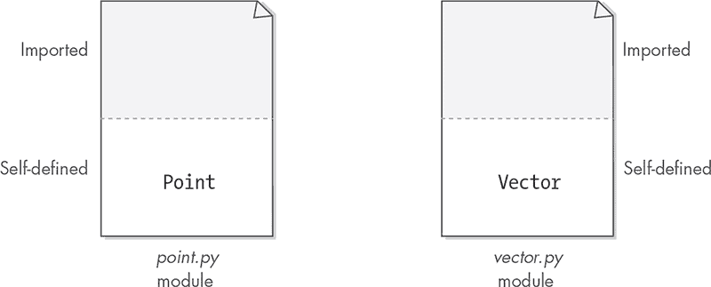
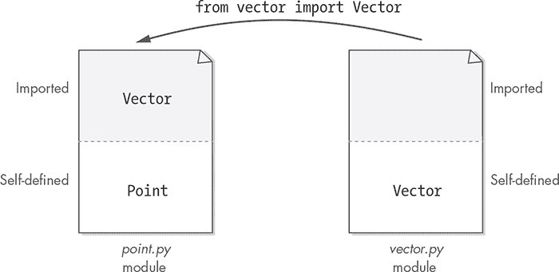
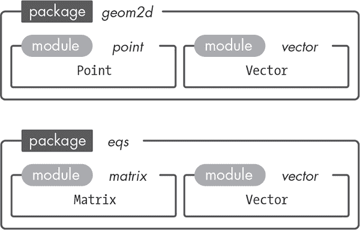
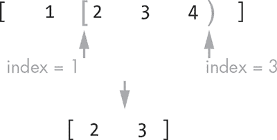
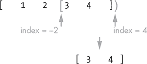

## 简短的 Python 入门


在本章中，我们将查看一些我们将在全书中使用的 Python 特性。这不是 Python 的介绍；我假设你已经具备了基本的语言理解。如果你没有基础，有很多优秀的书籍和在线教程可以帮助你入门。

我们将首先探讨如何将 Python 代码拆分成包，并将这些包导入到我们的程序中。我们将学习如何文档化 Python 代码，以及如何使用 Python 查阅这些文档。接着，我们将回顾元组、列表、集合和字典，这些是最常用的 Python 集合类型。

### **Python 包和模块**

合理大小的软件项目通常包含大量源文件，也称为*模块*。一组相关的 Python 模块被称为*包*。让我们通过讨论这两个概念：模块和包，来开始我们对 Python 的探讨。

#### ***模块***

一个 Python *模块*是一个包含 Python 代码的文件，该代码旨在被其他 Python 模块或脚本导入。另一方面，*脚本*是一个旨在被执行的 Python 文件。

Python 模块允许我们在文件之间共享代码，从而避免重复编写相同的代码。

每个 Python 文件都可以访问一个名为 __name__ 的全局变量。这个变量可以有两个可能的值：

+   模块的名称，即文件名，去掉 *.py* 扩展名

+   字符串 '__main__'

Python 根据文件是被其他模块导入还是作为脚本运行来确定 __name__ 的值。当模块被导入到另一个模块或脚本中时，__name__ 被设置为模块的名称。如果我们将模块作为脚本运行，例如，

```py
$ python3 my_module.py
```

然后，__name__ 的值会被设置为 '__main__'。这现在可能显得有些抽象，但我们将在本章稍后解释为什么我们关心 __name__ 这个全局变量。如我们所见，知道一个给定的模块是作为脚本执行还是被导入是一个重要的信息，我们需要考虑。

随着我们为项目编写越来越多的 Python 模块，将它们按功能分组是有意义的。这些模块组被称为*包*。

#### ***包***

一个 *包*是一个包含 Python 模块和一个特殊文件的目录，该文件的名称必须是 *__init__.py*。Python 解释器会将任何包含 *__init__.py* 文件的文件夹理解为一个包。

例如，像这样的文件夹结构：

geom2d

|- __init__.py

|- point.py

|- vector.py

是一个名为*geom2d*的 Python 包，包含两个文件或模块：*point.py* 和 *vector.py*。

每当从包中导入内容时，*__init__.py* 文件都会被执行。这意味着*__init__.py* 文件可以包含 Python 代码，通常是初始化代码。然而，大多数时候，这个*__init__.py* 文件是空的。

### **运行文件**

当 Python 导入一个文件时，它会读取该文件的内容。如果该文件只包含函数和数据，Python 只会加载这些定义，但不会实际执行代码。然而，如果文件中有顶层指令或函数调用，Python 会在导入过程中执行它们——这是我们通常不希望发生的。

之前，我们看到当文件被运行时（与导入不同），Python 会将`__name__`全局变量设置为字符串’__main__’。我们可以利用这一点来确保只有在文件被运行时才执行主要逻辑，而在文件被导入时则不执行：

```py
if __name__ == '__main__':
    # only executes if file is run, not imported
```

我们将这种模式称为“if name is main”模式，并且在本书中我们将使用这一模式来编写应用程序。

请记住，当文件被导入时，Python 会将`__name__`变量设置为该模块的名称。

### **导入代码**

假设你有一些 Python 代码，你希望在多个文件中使用它。一种方法是每次需要使用它时都复制粘贴代码。这不仅会显得繁琐和无聊，而且想象一下如果你改变了代码的某些功能：你需要打开每个粘贴了代码的文件，并以相同的方式进行修改。正如你能想象的，这并不是一种高效的软件编写方式。

幸运的是，Python 提供了一个强大的代码共享系统：导入模块。当*module_b*导入*module_a*时，*module_b*可以访问*module_a*中编写的代码。这让我们可以在一个地方编写算法，然后在多个文件中共享这些代码。让我们看一个示例，使用我们将在本书下一部分编写的两个模块。

假设我们有两个模块：*point.py* 和 *vector.py*。这两个模块位于我们之前看到的包中：

geom2d

|- __init__.py

|- point.py

|- vector.py

第一个模块名为*point.py*，它定义了几何原始类型 Point，第二个模块*vector.py*定义了另一个几何原始类型 Vector。图 1-1 展示了这两个模块。每个模块分为两个部分：一部分是灰色的，表示该模块从其他地方导入的代码；另一部分是白色的，表示模块本身定义的代码。



*图 1-1：两个 Python 模块*

现在，假设我们需要我们的*point.py*模块实现一些使用 Vector 的功能（比如，按给定的向量移动一个点）。我们可以通过 Python 的 import 命令访问 *vector.py* 中的 Vector 代码。图 1-2 展示了这一过程，它将 Vector 代码引入到*point.py*模块的“导入”部分，使其在整个模块中都可以使用。



*图 1-2：从 vector.py 导入 Vector 类*

在图 1-2 中，我们使用了以下 Python 命令：

```py
    from vector import Vector
```

这个命令仅从*vector.py*中引入了 Vector 类。我们并没有引入*vector.py*中定义的其他任何内容。

正如你将在下一部分看到的那样，导入模块有几种方式。

#### ***不同的导入形式***

为了理解我们可以如何导入模块和模块中的名称，我们来使用我们*力学*项目中的两个包。

Mechanics

|- geom2d

|    |- __init__.py

|    |- point.py

|    |- vector.py

|

|- eqs

|    |- __init__.py

|    |- matrix.py

|    |- vector.py

在这个例子中，我们将使用*geom2d*和*eqs*两个包，每个包内都有两个文件或模块。每个模块定义一个类，类的名称与模块名称相同，只是首字母大写。例如，*point.py*模块定义了 Point 类，*vector.py*定义了 Vector 类，*matrix.py*定义了 Matrix 类。图 1-3 展示了这个包的结构。



*图 1-3：来自我们力学项目的两个包及其部分模块*

通过在心中建立这个目录结构，让我们分析几个场景。

##### **从同一包中导入模块**

如果我们在包*geom2d*中的模块*point.py*中，并且想要导入整个*vector.py*模块，我们可以使用以下代码：

```py
import vector
```

现在我们可以像下面这样使用*vector.py*模块的内容：

```py
v = vector.Vector(1, 2)
```

需要注意的是，由于我们导入了整个模块，而不是其中的单独实体，因此我们必须使用模块名称来引用模块定义的实体。如果我们想使用不同的名称来引用该模块，我们可以为其起别名：

```py
import vector as vec
```

然后我们可以像这样使用它：

```py
v = vec.Vector(1, 2)
```

我们还可以只导入模块中的特定名称，而不是导入整个模块。正如你之前看到的，语法如下：

```py
from vector import Vector
```

使用这个导入，我们可以改为执行以下操作：

```py
v = Vector(1, 2)
```

在这种情况下，我们还可以为导入的名称起别名：

```py
from vector import Vector as Vec
```

当我们*别名*一个导入的名称时，我们只是将它重命名为其他名字。在这种情况下，我们现在可以这样写：

```py
v = Vec(1, 2)
```

##### **从不同包中导入模块**

如果我们想从不同的包中导入*matrix.py*模块内的*point.py*模块，我们可以做如下操作：

```py
import geom.point
```

或者等效地

```py
from geom import point
```

这样，我们就可以在*matrix.py*中使用整个*point.py*模块：

```py
p = point.Point(1, 2)
```

再次强调，我们可以选择为导入的模块起别名：

```py
import geom.point as pt
```

或者等效地

```py
from geom import point as pt
```

无论哪种方式，我们都可以像这样使用 pt：

```py
p = pt.Point(1, 2)
```

我们也可以从模块中导入名称，而不是导入整个模块，方法如下：

```py
from geom.point import Point

p = Point(1, 2)
```

如之前所示，我们可以使用别名：

```py
from geom.point import Point as Pt

p = Pt(1, 2)
```

##### **相对导入**

最后，我们有相对导入。*相对导入*是指使用以文件当前所在位置为起点的路径来引用模块。

我们使用一个点（.）来引用同一包中的模块或包，使用两个点（..）来引用父目录。

根据我们之前的示例，我们可以通过相对导入的方式，从*matrix.py*中导入*point.py*模块：

```py
from ..geom.point import Point

p = Point(1, 2)
```

在这种情况下，路径..geom.point 的意思是：从当前目录移动到父目录，然后寻找*point.py*模块。

### **使用文档字符串文档化代码**

当我们编写其他开发者会使用的代码时，良好的实践是进行文档化。这些文档应包括如何使用我们的代码、代码做出了哪些假设以及每个函数的功能。

Python 使用 *文档字符串* 来记录代码。这些文档字符串被定义在三重引号（"""）之间，并出现在它们所记录的函数、类或模块的第一条语句中。

你可能已经注意到，你之前下载的 *Mechanics* 项目的代码如何使用这些文档字符串。例如，如果你打开 *matrix.py* 文件，Matrix 类的方法就是这样进行文档化的：

```py
def set_data(self, data: [float]):
    """
    Sets the given list of 'float' numbers as the values of
    the matrix.

    The matrix is filled with the passed in numbers from left
    to right and from top to bottom.
    The length of the passed in list has to be equal to the
    number of values in the matrix: rows x columns.

    If the size of the list doesn't match the matrix number
    of elements, an error is raised.

    :param data: [float] with the values
    :return: this Matrix
    """
    if len(data) != self.__cols_count * self.__rows_count:
        raise ValueError('Cannot set data: size mismatch')

    for row in range(self.__rows_count):
        offset = self.__cols_count * row
        for col in range(self.__cols_count):
            self.__data[row][col] = data[offset + col]

    return self
```

如果你在使用这段代码时遇到问题，Python 提供了 `help` 全局函数；如果你将 `help` 应用于模块、函数、类或方法，它将返回该代码的文档字符串。例如，我们可以在 Python 解释器控制台中这样获取 `set_data` 方法的文档：

```py
>>> from eqs.matrix import Matrix
>>> help(Matrix.set_data)

Help on function set_data in module eqs.matrix:
set_data(self, data: [<class 'float'>])
    Sets the given list of 'float' numbers as the values of
    the matrix.

    The matrix is filled with the passed in numbers from left
    to right and from top to bottom.
    The length of the passed in list has to be equal to the
    number of values in the matrix: rows x columns.

    If the size of the list doesn't match the matrix number
    of elements, an error is raised.

    :param data: [float] with the values
    :return: this Matrix
```

有一些自动化工具，比如 Sphinx（[*https://www.sphinx-doc.org/*](https://www.sphinx-doc.org/)），可以使用项目中的文档字符串生成 HTML、PDF 或纯文本的文档报告。你可以将这些文档与代码一起分发，方便其他开发者开始学习你编写的代码。

在本书中我们不会编写文档字符串，因为它们占用的空间比较大。但它们应该都包含在你下载的代码中，你可以在那里查看。

### **Python 中的集合**

我们的程序经常需要处理一系列项目，有时这些集合非常庞大。我们希望以便捷的方式存储这些项目。有时我们会关心某个集合是否包含特定项目，而有时我们需要知道项目的顺序；我们也可能希望有一种快速查找给定项目的方法，或许是找到一个满足特定条件的项目。

正如你所看到的，处理集合项的方式有很多种。事实证明，选择正确的数据存储方式对我们的程序性能至关重要。每种集合都有其适用的场景；知道在每个特定情境下使用哪种类型的集合是每个软件开发者应当掌握的重要技能。

Python 提供了四种主要的集合：集合、元组、列表和字典。接下来我们将解释每种集合如何存储元素以及如何使用它们。

#### ***集合***

*集合*是一个无序的独特元素集合。当我们需要快速确定某个元素是否存在于集合中时，集合非常有用。

要在 Python 中创建一个集合，我们可以使用 `set` 函数：

```py
>>> s1 = set([1, 2, 3])
```

我们也可以使用字面量语法：

```py
>>> s1 = {1, 2, 3}
```

请注意，当使用字面量语法时，我们通过花括号（{}）来定义集合。

我们可以使用全局的 `len` 函数来获取集合中包含的元素数量：

```py
>>> len(s1)
3
```

检查某个元素是否存在于集合中是一个快速操作，可以使用 `in` 运算符来完成：

```py
>>> 2 in s1
True

>>> 5 in s1
False
```

我们可以使用 add 方法向集合中添加新元素：

```py
>>> s1.add(4)
# the set is now {1, 2, 3, 4}
```

如果我们尝试添加一个已经存在的元素，什么也不会发生，因为集合不允许重复元素：

```py
>>> s1.add(3)
# the set is still {1, 2, 3, 4}
```

我们可以使用 remove 方法从集合中移除一个元素：

```py
>>> s1.add(3)
>>> s1.remove(1)
# the set is now {2, 3, 4}
```

我们可以使用熟悉的数学操作处理集合。例如，我们可以计算两个集合的差集，即包含第一个集合中不在第二个集合中的元素的集合：

```py
>>> s1 = set([1, 2, 3])
>>> s2 = set([3, 4])
>>> s1.difference(s2)
{1, 2}
```

我们还可以计算两个集合的并集，即包含出现在两个集合中的所有元素的集合：

```py
>>> s1 = set([1, 2, 3])
>>> s2 = set([3, 4])
>>> s1.union(s2)
{1, 2, 3, 4}
```

我们可以遍历集合，但遍历的顺序是不确定的：

```py
>>> for element in s1:
...     print(element)
...
3
1
2
```

#### ***元组***

*元组*是不可变且有序的元素序列。*不可变*意味着，一旦创建，元组无法以任何方式更改。元组中的元素是通过它们所占的索引来引用的，索引从零开始。在 Python 中，计数总是从零开始。

当我们在代码中传递有序数据的集合时，元组是一个不错的选择，因为它们不会被任何方式改变。例如，在如下代码中：

```py
>>> names = ('Anne', 'Emma')
>>> some_function(names)
```

你可以确信，`names`元组不会被某个函数（如 some_function）以任何方式修改。相反，如果你决定使用一个集合，比如：

```py
>>> names = set('Anne', 'Emma')
>>> some_function(names)
```

什么也不会阻止 some_function 向传入的`names`集合中添加或移除元素，因此你需要检查函数的代码，了解代码是否会改变这些元素。

**注意**

*无论如何，正如我们稍后看到的，函数不应该修改它们的参数，所以我们在本书中写的函数将永远不会修改它们的输入参数。尽管如此，你可能会使用由其他开发者编写的函数，而这些开发者没有遵循同样的规则，因此你需要检查这些函数是否有这种副作用。*

元组是用圆括号定义的，元组中的元素是用逗号分隔的。这里有一个元组，使用字面量语法定义，包含了我的名字和年龄：

```py
>>> me = ('Angel', 31)
```

如果我们想创建一个只有一个元素的元组，我们需要在元素后写一个逗号：

```py
>>> name = ('Angel',)
```

还可以通过 tuple 函数创建元组，传入一个包含元素的列表：

```py
>>> me = tuple(['Angel', 31])
```

我们可以使用 len 全局函数获取元组中元素的数量：

```py
>>> len(count)
2
```

我们还可以使用元组的 count 方法计算某个值在元组中出现的次数：

```py
>>> me.count('Angel')
1

>>> me.count(50)
0

>>> ('hey', 'hey', 'hey').count('hey')
3
```

我们可以使用 index 方法获取某个项第一次出现的索引：

```py
>>> family = ('Angel', 'Alvaro', 'Mery', 'Paul', 'Isabel', 'Alvaro')
>>> family.index('Alvaro')
1
```

在这个例子中，我们要查找字符串'Alvaro'的索引，它出现了两次：分别在索引 1 和索引 5。index 方法返回第一次出现的索引，在这个例子中是 1。

可以使用 in 运算符检查某个元素是否存在于元组中：

```py
>>> 'Isabel' in family
True

>>> 'Elena' in family
False
```

元组可以被数字乘以，这是一个特殊的操作，会生成一个新元组，原始元素会按照乘数重复：

```py
>>> ('ruby', 'ruby') * 4
('ruby', 'ruby', 'ruby', 'ruby', 'ruby', 'ruby', 'ruby', 'ruby')

>>> ('we', 'found', 'love', 'in', 'a', 'hopeless', 'place') * 16
('we', 'found', 'love', 'in', 'a', 'hopeless', 'place', 'we', 'found', ...
```

我们可以使用 for 循环遍历元组的值：

```py
>>> for city in ('San Francisco', 'Barcelona', 'Pamplona'):
...     print(f'{city} is a beautiful city')
...
San Francisco is a beautiful city
Barcelona is a beautiful city
Pamplona is a beautiful city
```

使用 Python 的内建 enumerate 函数，我们可以遍历元组中的项及其索引：

```py
>>> cities = ('Pamplona', 'San Francisco', 'Barcelona')
>>> for index, city in enumerate(cities):
...     print(f'{city} is #{index + 1} in my favorite cities list')
...
Pamplona is #1 in my favorite cities list
San Francisco is #2 in my favorite cities list
Barcelona is #3 in my favorite cities list
```

#### ***列表***

*列表* 是一个有序的非唯一元素集合，通过它们的索引进行引用。列表非常适合需要按顺序保存元素并且我们知道它们出现位置的情况。

列表和元组相似，唯一的区别是元组是不可变的；列表中的元素可以移动，可以添加和删除元素。如果你确定一个大型集合中的元素不会被修改，使用元组而不是列表；元组的操作比列表的操作更快。如果 Python 知道集合中的元素不会改变，它可以做一些优化。

在 Python 中创建一个列表，我们可以使用 list 函数：

```py
>>> l1 = list(['a', 'b', 'c'])
```

或者我们可以使用字面量语法：

```py
>>> l1 = ['a', 'b', 'c']
```

注意使用方括号（[]）的方式。

我们可以使用 len 函数来检查列表中元素的数量：

```py
>>> len(l1)
3
```

列表元素可以通过索引访问（第一个元素的索引是零）：

```py
>>> l1[1]
'b'
```

我们还可以替换列表中的现有元素：

```py
>>> l1[1] = 'm'
# the list is now ['a', 'm', 'c']
```

小心不要使用列表中不存在的索引；这会引发 IndexError：

```py
>>> l1[35] = 'x'
Traceback (most recent call last):
  File "<input>", line 1, in <module>
IndexError: list assignment index out of range
```

可以使用 append 方法将项目追加到列表的末尾：

```py
>>> l1.append('d')
# the list is now ['a', 'm', 'c', 'd']
```

列表可以被迭代，且迭代的顺序是有保证的：

```py
>>> for element in l1:
...     print(element)
...
a
m
c
d
```

很多时候，我们不仅对元素本身感兴趣，还对它在列表中的索引感兴趣。在这种情况下，我们可以使用 enumerate 函数，它返回一个包含索引和元素的元组：

```py
>>> for index, element in enumerate(l1):
...     print(f'{index} -> {element}')
...
0 -> a
1 -> m
2 -> c
3 -> d
```

可以通过从另一个列表中取连续元素来创建新列表。这个过程叫做 *切片*。切片是一个重要的话题，需要单独的一节来讲解。

##### **切片列表**

切片列表看起来有点像使用方括号进行索引，只是我们使用两个由冒号分隔的索引：[*<start>* : *<end>*]。以下是一个例子：

```py
>>> a = [1, 2, 3, 4]
>>> b = a[1:3]
# list b is [2, 3]
```

在前面的例子中，我们有一个包含值 [1, 2, 3, 4] 的列表 a。我们通过切片原始列表，创建了一个新列表 b，从索引 1（包含）开始，到索引 3（不包含）结束。

**注意**

*不要忘记，Python 中的切片总是包括起始索引的元素，并且排除结束索引的元素。*

图 1-4 展示了这一过程。



*图 1-4：切片一个列表*

切片操作符中的起始和结束索引是可选的，因为它们有默认值。默认情况下，起始索引被赋值为列表中的第一个索引，始终为零。结束索引被赋值为列表中的最后一个索引加一，这等于 len(the_list)。

```py
>>> a = [1, 2, 3, 4]

# these two are equivalent:
>>> b_1 = a[0:4]
>>> b_2 = a[:]
```

在这个例子中，b_1 和 b_2 列表都是原始 a 列表的副本。我们所说的副本意味着它们是不同的列表；你可以安全地修改 b_1 或 b_2，而列表 a 保持不变。你可以通过以下方式来验证：

```py
>>> a = [1, 2, 3, 4]
>>> b = a[:]
>>> b[0] = 55

>>> print('list a:', a)
list a: [1, 2, 3, 4]

>>> print('list b:', b)
list b: [55, 2, 3, 4]
```

负索引是你可以使用的另一个技巧。负索引是从列表的末尾开始计算并向列表的开头移动的索引。负索引可以像正索引一样用于切片操作，唯一的区别是：负索引从 -1 开始，而不是从 -0 开始。例如，我们可以通过以下方式切片列表，获取它的最后两个值：

```py
>>> a = [1, 2, 3, 4]
>>> b = a[-2:]
# list b is [3, 4]
```

在这里，我们正在创建一个新列表，从倒数第二个位置开始，一直到列表的最后一个元素。图 1-5 展示了这一点。

切片列表是 Python 中的一项多功能操作。



*图 1-5：使用负索引切片列表*

#### ***字典***

一个 *字典* 是由键值对组成的集合。字典中的值与它们的键相关联；我们通过键从字典中检索元素。在字典中查找值的速度非常快。

当我们想存储由某些键引用的元素时，字典非常有用。例如，如果我们想存储关于兄弟姐妹的信息，并且希望能通过兄弟姐妹的名字来检索这些信息，我们可以使用字典。我们将在接下来的代码中查看这一点。

在 Python 中创建字典，你可以使用 `dict` 函数，

```py
>>> colors = dict([('stoke', 'red'), ('fill', 'orange')])
```

或者使用字面量语法，

```py
>>> colors = {'stoke': 'red', 'fill': 'orange'}
```

`dict` 函数期望传入一个包含元组的列表。这些元组应包含两个值：第一个值作为键，第二个值作为值。创建字典的字面量版本要简洁得多，并且在两种情况下，最终生成的字典是一样的。

和列表一样，我们可以使用方括号访问字典中的值。然而，这次我们在方括号中使用的是值的键，而不是索引：

```py
>>> colors['stroke']
red
```

你可以使用任何不可变的对象作为字典中的键。记住，元组是不可变的，而列表则不是。数字、字符串和布尔值也是不可变的，因此可以用作字典键。

让我们创建一个字典，键是元组：

```py
>>> ages = {('Angel', 'Sola'): 31, ('Jen', 'Gil'): 30}
```

在这个例子中，我们将年龄映射到由名字和姓氏组成的键（一个元组）。如果我们想知道 Jen 的年龄，我们可以通过使用其键在字典中获取相应的值：

```py
>>> age = ages[('Jen', 'Gil')]
>>> print(f'she is {age} years old')
she is 30 years old
```

当我们查找一个字典中不存在的键时，会发生什么？

```py
>>> age = ages[('Steve', 'Perry')]
Traceback (most recent call last):
  File "<input>", line 1, in <module>
KeyError: ('Steve', 'Perry')
```

我们会得到一个错误。我们可以在获取字典中的值之前，使用 `in` 操作符检查键是否存在：

```py
>>> ('Steve', 'Perry') in ages
False
```

我们也可以获得一个类似集合的视图，包含字典中的所有键：

```py
>>> ages.keys()
dict_keys([('Angel', 'Sola'), ('Jen', 'Gil')])
```

我们可以对值做同样的操作：

```py
>>> ages.values()
dict_values([31, 30])
```

我们可以使用 `in` 操作符检查字典中键和值的存在情况：

```py
>>> ('Jen', 'Gil') in ages.keys()
True

>>> 45 in ages.values()
False
```

字典可以通过几种方式进行遍历。假设我们有以下的年龄字典：

```py
>>> ages = {'Angel': 31, 'Jen': 30}
```

我们可以使用 `for` 循环遍历字典的键：

```py
>>> for name in ages.keys():
...     print(f'we have the age for {name}')
...
we have the age for Angel
we have the age for Jen
```

我们可以对值做同样的操作：

```py
>>> for age in ages.values():
...     print(f'someone is {age} years old')
...
someone is 31 years old
someone is 30 years old
```

我们也可以对键值元组做同样的操作：

```py
>>> for name, age in ages.items():
...     print(f'{name} is {age} years old')
...
Angel is 31 years old
Jen is 30 years old
```

目前为止，这就是我们需要了解的 Python 集合内容。接下来让我们继续 Python 之旅，学习如何解构集合。

### **解构**

*解构* 或 *拆解* 是一种技术，它允许我们将集合中的值分配给变量。让我们看一些例子。

假设我们有一个包含某个人信息的元组，其中包括她的姓名和最喜欢的饮料：

```py
>>> anne_info = ('Anne', 'grape juice')
```

假设我们想将这两条信息分配给两个单独的变量。我们可以这样分开：

```py
>>> name = anne_info[0]
>>> beverage = anne_info[1]
```

这样做完全可以，但我们可以使用解构语法以更优雅的方式来实现。为了将元组中的两个字符串解构到两个变量中，我们需要在赋值的左侧使用另一个元组，包含变量名：

```py
>>> (name, beverage) = anne_info

>>> name
'Anne'

>>> beverage
>>> 'grape juice'
```

我们也可以解构列表。例如，如果我们有一个列表，包含另一个人的类似信息，如

```py
>>> emma_info = ['Emma', 'hot chocolate']
```

我们可以使用左侧的列表解构出姓名和最喜欢的饮料：

```py
>>> [name, beverage] = emma_info

>>> name
'Emma'

>>> beverage
'hot chocolate'
```

左侧的元组或列表必须与右侧的大小匹配，但有时我们并不关心解构出来的所有值。在这种情况下，可以在不想获取对应值的位置使用下划线。例如，

```py
[a, _, c] = [1, 2, 3]
```

将值 1 分配给变量 a，将值 3 分配给变量 c，但会丢弃值 2。

这是一种帮助我们编写更简洁代码的技巧。

### **总结**

本章介绍了一些中级和高级的 Python 技巧，这些技巧我们将在整本书中使用。我们了解了 Python 程序是由模块组成，这些模块打包成包，并且如何从代码的其他部分导入这些模块。

我们还解释了“if name is main”模式，它用于避免在文件被导入时执行部分代码。

然后，我们简要介绍了四种基本的 Python 集合：元组、列表、集合和字典。我们还学习了如何解构或拆解这些集合。

现在让我们换个话题，谈谈几种编程范式。
