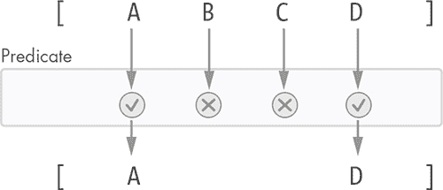
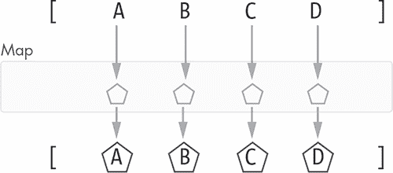
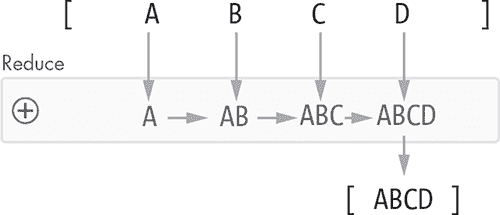

## 第二章：两种 Python 编程范式


现在我们已经探讨了一些 Python 编程语言的主题，接下来让我们了解可以用来编写代码的两种主要范式。在本章的第二部分中，我们将讨论函数式编程和面向对象编程范式，并探讨每种范式带来的好处。最后，我们将简要介绍类型提示。让我们开始吧。

### **函数式编程**

函数式编程是一种编程范式，意味着它是一种我们可以选择遵循的编写代码的风格。要说“我们正在编写函数式风格的代码”，我们必须遵循一些简单的规则，来定义什么是函数式编程。

函数式编程范式的核心元素是纯函数和数据的不可变性。我们将在接下来的章节中详细分析这些概念。

不是所有的编程语言都能很好地支持函数式风格的编程。例如，像 C 这样的语言对其支持并不好。另一方面，也有一些语言，比如 Haskell，完全是函数式的，意味着你只能编写函数式风格的代码。按设计，Python 不是一门函数式语言，但它确实支持函数式编程风格。

让我们来了解一下纯函数。

#### ***纯函数***

让我们快速回顾一下 Python 函数的语法：

```py
def function_name(parameters):
    <function body>
```

函数的定义以 `def` 关键字开始，后面是函数名和括号中的输入参数。冒号（:）标志着函数头的结束。函数体中的代码需要缩进一级。

在函数式编程范式中，函数类似于数学中函数的概念：将某些输入映射到某些输出。如果一个函数是*纯*的，我们就说它是纯函数：

+   对于相同的一组输入，它始终返回相同的输出。

+   它没有副作用。

*副作用* 是指函数体外的某些东西被函数改变了。当函数修改输入时，也会发生副作用，因为纯函数永远不会修改其输入。例如，以下函数就是纯函数：

```py
def make_vector_between(p, q):
    u = q['x'] - p['x']
    v = q['y'] - p['y']

    return {'u': u, 'v': v}
```

给定相同的输入点 p 和 q，输出始终是相同的向量，且函数体外的任何内容都没有被修改。相比之下，以下代码是 `make_vector` 的不纯版本：

```py
last_point = {'x': 10, 'y': 20}

def make_vector(q):
    u = q['x'] - last_point['x']
    v = q['y'] - last_point['y']
    new_vector = {'u': u, 'v': v}
    last_point = q

    return new_vector
```

上面的代码片段使用了 `last_point` 的共享状态，每次调用 `make_vector` 时都会改变这个状态。这种变化是函数的副作用。返回的向量依赖于 `last_point` 的共享状态，因此该函数对于相同的输入点不会始终返回相同的向量。

#### ***不可变性***

如你在之前的例子中所见，函数式编程的一个关键特点是*不可变性*。如果某个事物随时间不会改变，我们就称它为不可变的。如果我们决定使用函数式编程风格编写代码，那么我们就要坚定地避免数据变更，并通过纯函数来建模我们的程序。

让我们来看一个例子。假设我们使用字典在平面上定义了一个点和一个向量：

```py
point = {'x': 5, 'y': 2}
vector = {'u': 10, 'v': 20}
```

如果我们想计算通过向量位移现有点得到的新点，可以通过创建一个新点的函数来以函数式的方式实现。下面是一个例子：

```py
def displaced_point(point, vector):
    x = point['x'] + vector['u']
    y = point['y'] + vector['v']

    return {'x': x, 'y': y}
```

这个函数是纯粹的：给定相同的点和向量输入，结果的位移点始终相同，而且函数体内没有任何被变更的内容，甚至函数参数也没有被改变。

如果我们运行这个函数，并传入之前定义的点和向量，我们将得到如下结果：

```py
>>> displaced_point(point, vector)
{'x': 15, 'y': 22}

# let's check the state of point (shouldn't have been mutated)
>>> point
{'x': 5, 'y': 2}
```

相反，解决这个问题的一种非函数式方式可能会涉及使用如下的函数来修改原始点：

```py
def displace_point_in_place(point, vector):
    point['x'] += vector['u']
    point['y'] += vector['v']
```

这个函数会修改它接收到的点，这违反了函数式编程风格的一个关键规则。

请注意函数名中使用了 `in_place`。这是一个常见的命名约定，表示变化将通过修改原始对象来发生。在本书中，我们将遵循这一命名约定。

现在让我们看看如何使用这个 `displace_point_in_place` 函数：

```py
>>> displace_point_in_place(point, vector)
# nothing gets returned from the function, so let's check the point

>>> point
{'x': 15, 'y': 22}
# the original point has been mutated!
```

正如你所见，这个函数没有返回任何值，这是一个迹象，表明该函数不是纯函数，因为要进行某种有用的操作，它必须修改某些内容。在这种情况下，这个“某些内容”就是我们的点，它的坐标已经被更新。

函数式编程的一大优势是，通过尊重数据结构的不变性，我们避免了意外的副作用。当你修改一个对象时，你可能并不清楚代码中所有引用该对象的地方。如果代码中的其他部分依赖于该对象的状态，可能会出现你未察觉的副作用。因此，在对象被修改后，程序的行为可能会与预期不同。这类错误极难追踪，可能需要数小时的调试。

如果我们最小化项目中的变更次数，我们将使其更加可靠，减少错误的发生。

现在让我们来看一下在函数式编程中占据核心地位的一类特殊函数：lambda 函数。

#### ***Lambda 函数***

回到 20 世纪 30 年代，一位名叫阿隆佐·丘奇的数学家发明了 lambda 演算，这是关于函数以及函数如何应用于其参数的理论。Lambda 演算是函数式编程的核心。

在 Python 中，*lambda 函数*，或者称为*lambda*，是一个匿名的、通常是短小的一行函数。我们会发现，lambda 在将函数作为参数传递给其他函数时非常有用。

我们在 Python 中定义一个 lambda 函数，使用 `lambda` 关键字，后跟参数（用逗号分隔），冒号和函数的表达式体：

```py
    lambda <arg1>, <arg2>, ...: <expression body>
```

表达式的结果就是返回值。

求两个数之和的 lambda 函数可以写成如下形式：

```py
>>> sum = lambda x, y: x + y
>>> sum(1, 2)
3
```

这等同于常规的 Python 函数：

```py
>>> def sum(x, y):
...     return x + y
...
>>> sum(1, 2)
3
```

Lambda 函数将在接下来的章节中出现；我们将看到它们如何在多个场景中使用。我们最常使用 lambda 函数的地方是作为 filter、map 和 reduce 函数的参数，正如我们在“Filter、Map 和 Reduce”中讨论的那样，见 第 29 页。

#### ***高阶函数***

*高阶*函数是指一个函数，它要么接收一个（或多个）函数作为输入参数，要么返回一个函数作为结果。

让我们来看两个情况的例子。

##### **函数作为函数参数**

假设我们想写一个函数，使其能够运行另一个函数指定的次数。我们可以这样实现：

```py
>>> def repeat_fn(fn, times):
...     for _ in range(times):
...         fn()
...

>>> def say_hi():
...     print('Hi there!')
...

>>> repeat_fn(say_hi, 5)
Hi there!
Hi there!
Hi there!
Hi there!
Hi there!
```

如你所见，repeat_fn 函数的第一个参数是另一个函数，它会根据第二个参数指定的次数执行。然后，我们定义了另一个函数来简单地打印字符串“Hi there!”到屏幕上：say_hi。调用 repeat_fn 函数并传递 say_hi 的结果就是这五次问候。

我们可以使用匿名 lambda 函数来重写前面的例子：

```py
>>> def repeat_fn(fn, times):
...     for _ in range(times):
...         fn()
...

>>> repeat_fn(lambda: print("Hello!"), 5)
Hello!
Hello!
Hello!
Hello!
Hello!
```

这让我们不必定义一个命名函数来打印信息。

##### **函数作为函数返回值**

让我们看一个返回另一个函数的例子。假设我们想定义一些验证函数，用于验证给定的字符串是否包含某个字符序列。我们可以写一个名为 make_contains_validator 的函数，它接收一个字符序列并返回一个函数来验证包含该序列的字符串：

```py
>>> def make_contains_validator(sequence):
...     return lambda string: sequence in string
```

我们可以使用这个函数来生成验证函数，例如以下的这个，

```py
>>> validate_contains_at = make_contains_validator('@')
```

这个可以用来检查传入的字符串是否包含 @ 字符：

```py
>>> validate_contains_at('foo@bar.com')
True
>>> validate_contains_at('not this one')
False
```

高阶函数是一个非常有用的工具，我们将在本书中多次使用它。

#### ***函数嵌套在其他函数内***

我们在本书中还将使用的另一种便捷技巧是将函数定义在另一个函数内。我们可能会这么做的两个主要原因是：首先，它让内部函数可以访问外部函数内的所有内容，而无需将这些信息作为参数传递；其次，内部函数可能定义了一些我们不想暴露给外部的逻辑。

可以使用常规语法在一个函数内部定义另一个函数。让我们来看一个例子：

```py
def outer_fn(a, b):
    c = a + b

    def inner_fn():
        # we have access to a, b and c here
        print(a, b, c)

    inner_fn()
```

在这里，inner_fn 函数是在 outer_fn 函数内部定义的，因此它不能从外部访问，只能在其函数体内访问。inner_fn 函数可以访问 outer_fn 内定义的所有内容，包括函数参数。

在函数内部定义子函数在函数逻辑变得复杂并且可以分解成更小任务时非常有用。当然，我们也可以将函数拆分成多个在同一层级定义的小函数。在这种情况下，为了表明这些子函数并非用于外部导入和使用，我们将遵循 Python 的标准，命名这些函数时以两个下划线开头：

```py
def public_fn():
    # this function can be imported

def __private_fn():
    # this function should only be accessed from inside the module
```

请注意，Python 没有访问修饰符（如 public、private 等）；因此，模块顶部编写的所有代码，即 Python 文件中的代码，都可以被导入并使用。

请记住，两个下划线只是我们需要遵循的一种约定。实际上并没有什么可以阻止我们导入并使用这段代码。如果我们导入了一个以两个下划线开头的函数，我们必须理解，该函数并不是由其作者编写供外部使用的，如果我们调用这个函数，可能会得到意想不到的结果。通过在调用它们的函数内部定义子函数，我们可以防止这种情况发生。

#### ***过滤、映射与归约***

在函数式编程中，我们从不修改集合的元素，而是总是创建一个新的集合，以反映操作对该集合的更改。有三个操作构成了函数式编程的基石，可以完成我们所能想到的对集合的任何修改：过滤、映射和归约。

##### **过滤**

*filter* 操作接受一个集合，并创建一个新的集合，其中可能会排除某些项。项是根据 *谓词函数* 进行过滤的，谓词函数是一个接受一个参数并根据该参数是否通过给定测试返回 True 或 False 的函数。

图 2-1 说明了过滤操作。



*图 2-1：过滤集合*

图 2-1 显示了一个由四个元素组成的源集合：A、B、C 和 D。集合下方是一个框，表示谓词函数，用于确定保留哪些元素，丢弃哪些元素。集合中的每个元素都会传递给谓词函数，只有通过测试的元素才会被包含在结果集合中。

在 Python 中，有两种方法可以过滤集合：使用全局 filter 函数，或者如果集合是列表的话，使用列表推导式。我们在这里专注于 filter 函数；列表推导式将在下一节中介绍。Python 的 filter 函数接收一个函数（谓词）和一个集合作为参数：

```py
    filter(<predicate_fn>, <collection>)
```

让我们编写一个谓词 lambda 函数来测试一个数字是否是偶数：

```py
lambda n: n % 2 == 0
```

现在让我们使用我们的 lambda 函数来过滤一组数字，并获取一个只包含偶数的新集合：

```py
>>> numbers = [1, 2, 3, 4, 5, 6, 7, 8]
>>> evens = filter(lambda n: n % 2 == 0, numbers)
>>> list(evens)
[2, 4, 6, 8]
```

需要注意的一点是，filter 函数并不返回列表，而是返回一个迭代器。迭代器允许逐项遍历一个集合。如果你想了解更多关于 Python 迭代器及其底层工作原理的信息，请参考[*https://docs.python.org/3/library/stdtypes.html#typeiter*](https://docs.python.org/3/library/stdtypes.html#typeiter)和[*https://docs.python.org/3/glossary.html#term-iterator*](https://docs.python.org/3/glossary.html#term-iterator)。

我们可以使用之前看到的 list 函数消耗所有的迭代器值并将它们放入一个列表中。我们也可以使用 for 循环消耗迭代器：

```py
>>> for number in evens:
...     print(number)
...
2
4
6
8
```

##### **映射（Map）**

*map*操作通过将源集合中的每个项目传递给一个函数并将结果存储在一个新集合中来创建一个新集合。新集合的大小与源集合相同。

图 2-2 展示了 map 操作。



*图 2-2：映射一个集合*

我们将由项 A、B、C 和 D 组成的源集合传入一个映射函数，这个映射函数在图 2-2 中的矩形框内进行说明；映射的结果存储在一个新集合中。

我们可以通过全局 map 函数映射一个集合，或者如果我们有一个列表，也可以使用列表推导式。稍后我们会讨论列表推导式；现在，让我们先学习如何使用 map 函数映射集合。

map 全局函数接收两个参数：一个映射函数和一个源集合：

```py
    map(<mapping_fn>, <collection>)
```

这就是我们如何将一个名字列表映射到其长度的方式：

```py
>>> names = ['Angel', 'Alvaro', 'Mery', 'Paul', 'Isabel']
>>> lengths = map(lambda name: len(name), names)
>>> list(lengths)
[5, 6, 4, 4, 6]
```

和 filter 函数一样，map 函数返回一个迭代器，可以通过 list 函数将其转换为列表。在之前的示例中，生成的列表包含了 names 列表中每个名字的字母数：*Angel*有五个字母，*Alvaro*有六个字母，依此类推。我们将每个名字映射成一个表示其长度的数字。

##### **归约（Reduce）**

*reduce*操作是最复杂的，但同时也是三者中最灵活的。它创建一个新集合，新集合中的项数可能比原始集合少，可能更多，或者与原始集合相同。为了构建这个新集合，首先将归约函数应用于第一个和第二个元素。然后，它将归约函数应用于第三个元素*和*第一次应用的结果。接着，它将归约函数应用于第四个元素和第二次应用的结果。这样，结果逐步累积。这里可以通过一张图来帮助理解，看看图 2-3。



*图 2-3：归约一个集合*

本示例中的归约函数将集合中的每个元素（A、B、C 和 D）连接成一个单一元素：ABCD。

归约函数接收两个参数：累积结果和集合中的一个项：

```py
    reducer_fn(<accumulated_result>, <item>)
```

该函数期望在处理完新项后返回累积结果。

Python 没有提供全局的 `reduce` 函数，但有一个名为 *functools* 的包，它包含一些有用的操作，用于处理高阶函数，包括一个 `reduce` 函数。这个函数不会返回一个迭代器，而是直接返回结果集合或项。这个函数的签名如下：

```py
    reduce(<reducer_fn>, <collection>)
```

让我们通过一个例子来进行说明：

```py
>>> from functools import reduce

>>> letters = ['A', 'B', 'C', 'D']

>>> reduce(lambda result, letter: result + letter, letters)
'ABCD'
```

在这个例子中，`reduce` 函数返回了一个单一的项：’ABCD’，它是将集合中每个字母连接起来的结果。为了开始归约过程，`reduce` 函数取了前两个字母，*A* 和 *B*，并将它们连接成 *AB*。对于这个第一步，Python 将集合的初始项 (*A*) 作为累积结果，并将归约器应用于它和第二项。然后，它移到第三个字母 *C*，并将其与当前的累积结果 *AB* 连接，从而生成新的结果：*ABC*。最后一步对 *D* 字母做同样的操作，生成结果 *ABCD*。

当累积结果和集合中的项具有不同类型时会发生什么？在这种情况下，我们不能将第一个项作为累积结果，因此 `reduce` 函数希望我们提供第三个参数，作为起始的累积结果：

```py
    reduce(<reducer_fn>, <collection>, <start_result>)
```

例如，假设我们有之前的名字集合，我们想要将其归约为这些名字的总长度。在这种情况下，累积结果是数字类型，而集合中的项是字符串；我们不能将第一个项作为累积长度。如果我们忘记给 `reduce` 提供起始结果，Python 会通过引发错误提醒我们：

```py
>>> reduce(lambda total_length, name: total_length + len(name), names)
Traceback (most recent call last):
  File "<input>", line 1, in <module>
  File "<input>", line 1, in <lambda>
TypeError: can only concatenate str (not "int") to str
```

对于这种情况，我们应该传递 0 作为初始的累积长度：

```py
>>> reduce(lambda total_length, name: total_length + len(name), names, 0)
25
```

这里有一个有趣的注释：如果累积结果和集合中的项具有不同类型，你总是可以将 `map` 和 `reduce` 结合起来，以获得相同的结果。例如，在前面的练习中，我们也可以这样做：

```py
>>> from functools import reduce

>>> names = ['Angel', 'Alvaro', 'Mery', 'Paul', 'Isabel']
>>> lengths = map(lambda name: len(name), names)
>>> reduce(lambda total_length, length: total_length + length, lengths)
25
```

在这段代码中，我们首先将名字列表映射为名字长度的列表：`lengths`。然后，我们将 `lengths` 列表归约，求出所有值的总和，不需要提供起始值。

当使用常见操作（如两个数字的和或两个字符串的连接）归约项时，我们不需要自己编写 lambda 函数；我们可以简单地将现有的 Python 函数传递给 `reduce` 函数。例如，当对数字进行归约时，Python 提供了一个有用的模块，名为 *operator.py*。这个模块定义了用于数字操作的函数等。使用这个模块，我们可以简化之前的例子，如下所示：

```py
>>> from functools import reduce
>>> import operator

>>> names = ['Angel', 'Alvaro', 'Mery', 'Paul', 'Isabel']
>>> lengths = map(lambda name: len(name), names)
>>> reduce(operator.add, lengths)
25
```

这段代码更简洁、更易读，因此我们将在本书中优先使用这种形式。

`operator.add` 函数由 Python 定义如下：

```py
def add(a, b):
    "Same as a + b."
    return a + b
```

如你所见，这个函数等同于我们定义的用于求和两个数字的 lambda 函数。我们将在全书中看到更多由 Python 定义的可以与 reduce 一起使用的函数示例。

到目前为止，我们所有的示例都将集合缩减为单一值，但 reduce 操作可以做更多事情。事实上，filter 和 map 操作都是 reduce 操作的特例。我们可以仅使用 reduce 操作来筛选和映射一个集合。但这不是我们此处要分析的内容；如果你有兴趣，可以自行尝试理解。

让我们看一个例子，假设我们想要基于名字列表创建一个新集合，每个项都是之前所有名字与当前名字用连字符 (-) 连接起来的结果。我们期望得到的结果应该是这样的：

```py
['Angel', 'Angel-Alvaro', 'Angel-Alvaro-Mery', ...]
```

我们可以使用以下代码来实现：

```py
>>> from functools import reduce

>>> names = ['Angel', 'Alvaro', 'Mery', 'Paul', 'Isabel']
>>> def compute_next_name(names, name):
...     if len(names) < 1:
...         return name
...     return names[-1] + '-' + name
...
>>> reduce(
...    lambda result, name: result + [compute_next_name(result, name)],
...    names,
...    [])
['Angel', 'Angel-Alvaro', 'Angel-Alvaro-Mery', 'Angel-Alvaro-Mery-Paul', ...]
```

在这里，我们使用 compute_next_name 来确定序列中的下一个项。reduce 中使用的 lambda 函数将累积结果（即已连接的名字列表）与一个新列表（由新项组成）进行连接。由于列表中每项的类型（字符串）与结果（字符串列表）不同，因此需要提供初始解决方案——一个空列表。

如你所见，reduce 操作非常灵活多变。

#### ***列表推导式***

如前所述，我们可以使用列表推导式在 Python 中筛选和映射列表。处理列表时，通常偏爱这种形式，因为它的语法更加简洁和易读，优于 filter 和 map 函数。

映射项的列表推导式结构如下：

```py
    [<expression> for <item> in <list>]
```

它有两部分：

+   for *<item>* in *<list>* 是在 *<list>* 中迭代项目的 for 循环。

+   *<expression>* 是一个映射表达式，用来将 *<item>* 映射为其他内容。

让我们重复一下之前做的练习，这次我们使用列表推导式将名字列表映射到每个名字的长度列表：

```py
>>> names = ['Angel', 'Alvaro', 'Mery', 'Paul', 'Isabel']
>>> [len(name) for name in names]
[5, 6, 4, 4, 6]
```

我希望你明白为什么 Python 程序员更偏爱列表推导式而非 map 函数；这个例子几乎就像是普通英语：“每个名字的长度，在 names 中的每个名字”。在这个例子中，for name in names 迭代原始列表中的名字，并使用每个名字的长度 (len(name)) 作为结果。

要使用列表推导式筛选列表，我们可以在推导式末尾添加一个 if 子句：

```py
    [<expression> for <item> in <list> if <condition>]
```

如果我们想要，例如，筛选一个名字列表，这次只保留以 *A* 开头的名字，我们可以写出以下列表推导式：

```py
>>> [name for name in names if name.startswith('A')]
['Angel', 'Alvaro']
```

从这个例子中注意两点：映射表达式是名字本身（一个身份映射，相当于没有映射），并且筛选使用了字符串的 startswith 方法。此方法只有在字符串具有给定的前缀时才会返回 True。

我们可以在同一个列表推导式中同时进行过滤和映射。例如，假设我们想从名字列表中筛选出那些字母超过五个的名字，然后构建一个新列表，其中的元素是原始名字及其长度的元组。我们可以轻松实现：

```py
>>> [(name, len(name)) for name in names if len(name) < 6]
[('Angel', 5), ('Mery', 4), ('Paul', 4)]
```

为了便于比较，让我们看看如果我们选择使用 `filter` 和 `map` 函数，会是什么样子：

```py
>>> names_with_length = map(lambda name: (name, len(name)), names)
>>> result = filter(lambda name_length: name_length[1] < 6, names_with_length)
>>> list(result)
[('Angel', 5), ('Mery', 4), ('Paul', 4)]
```

如你所见，结果是相同的，但列表推导式版本更简单且更具可读性。更容易阅读的代码也更容易维护，因此，列表推导式将成为我们过滤和映射列表的首选方式。

现在，让我们将注意力转向本章将要探讨的第二个范式：面向对象编程。

### **面向对象编程**

在前面的部分，我们讨论了函数式编程和一些函数式编程模式。现在我们将学习另一种编程范式：*面向对象范式*。就像函数对函数式编程的重要性一样，面向对象编程中的对象也扮演着类似的角色。那么，首先，我们来看看：什么是对象？

我们可以通过多种方式来描述对象是什么。我将偏离面向对象编程理论中的标准学术定义，尝试一种不太传统的解释。

从实际的角度来看，我们可以把对象看作是某一特定领域的专家。我们可以向它们提问，它们会给我们信息；或者我们可以请求它们为我们做一些事情，它们就会执行这些任务。我们的提问或请求可能涉及复杂的操作，但这些专家会将复杂性隐藏起来，以便我们无需担心细节——我们只关心任务能否完成。

举个例子，想象一下去看牙医。当你去看牙医时，你不需要了解任何牙科知识。你依赖牙医的专业技能来修复你的蛀牙。你也可以向牙医询问关于牙齿的问题，牙医会用你能理解的语言回答你，隐藏了牙科的真正复杂性。在这个例子中，牙医就是你依赖的对象，用来处理与牙科相关的任务或查询。

要向对象请求某些操作，我们会调用对象的*方法*。方法是属于某个对象的函数，并且能够访问该对象的内部数据。对象本身有一些内存，用来存储通常对外部世界隐藏的数据，尽管该对象可能决定以*属性*的形式公开其中的一部分数据。

**注意**

*方法是属于类的函数：它是类定义的一部分。它需要在定义它的类的实例上被调用（执行）。与此相对，函数不属于任何类；它是独立工作的。*

在 Python 的术语中，对象中的任何函数或变量都被称为*属性*。无论是属性还是方法，它们都是属性。在本章和本书的其余部分，我们将使用这些等价的术语。

现在让我们实际操作一下，看看如何在 Python 中定义和使用对象。

#### ***类***

*类*定义了对象的构造方式以及它们具有什么特征和知识。有些人喜欢将类比作蓝图；它们是对象包含什么信息以及可以做什么的通用描述。对象和类是相关但不同的；如果类是蓝图，那么对象就是完成的建筑。

我们使用保留的 class 关键字在 Python 中定义一个新类。按照惯例，类名以大写字母开头，并且每个新单词的首字母也大写（这种情况通常称为*Pascal 命名法*）。让我们创建一个模拟咖啡机的类：

```py
class CoffeeMachine:
    def __init__(self):
        self.__coffees_brewed = 0
```

在这个列表中，我们定义了一个表示咖啡机的新类。我们可以使用这个类生成新的咖啡机对象，这个过程称为*实例化*。当我们实例化一个类时，我们创建了该类的一个新对象。实例化一个类的方法是调用其名称，仿佛它是一个返回实例化对象的函数：

```py
>>> machine = CoffeeMachine()
```

现在我们有了机器对象，其功能由咖啡机类定义（目前还为空，但我们将在接下来的部分中完成它）。当一个类被实例化时，它的 __init__ 函数会被调用。在这个 __init__ 函数内部，我们可以执行一次性的初始化任务。例如，这里我们添加了酿造咖啡的数量并将其设置为零：

```py
def __init__(self):
    self.__coffees_brewed = 0
```

注意 __coffees_brewed 前面的两个下划线。如果你还记得我们之前讨论的访问级别，Python 中默认所有内容对外部可见。双下划线命名规则用于表示某些内容是私有的，外部不应该直接访问它。

```py
# Don't do this!
>>> machine.__coffees_brewed
0
```

在这种情况下，我们不希望外部世界访问 __coffees_brewed；否则他们就可以随意更改酿造的咖啡数量！

```py
# Don't do this!
>>> machine.__coffees_brewed = 5469
>>> machine.__coffees_brewed
5469
```

那么，如果我们无法访问 __coffees_brewed，我们如何知道我们的机器已经酿造了多少杯咖啡呢？答案是属性。属性是类的只读属性。然而，在讨论属性之前，我们需要先了解一些语法。

##### **self**

如果你看一下前面的例子，你会发现我们频繁使用一个名为 self 的变量。我们本可以为这个变量使用任何其他名字，但按照惯例，使用 self。正如你之前看到的，我们将其传递给类内每个函数的定义，包括初始化函数。多亏了这个第一个参数 self，我们能够访问类中定义的任何内容。例如，在 __init__ 函数中，我们将 __coffees_brewed 变量附加到 self 上；从那时起，这个变量就存在于对象中了。

变量 self 需要作为每个函数定义中的第一个参数，但在我们调用这些函数时，不需要将其作为第一个参数传递给类的实例。例如，要实例化 CoffeeMachine 类，我们写了以下代码：

```py
>>> machine = CoffeeMachine()
```

初始化器在没有参数的情况下被调用（这里没有 self）。如果你仔细想想，在这种情况下我们怎么可能把初始化器作为 self 传递呢，毕竟我们还没有初始化对象？事实证明，Python 为我们处理了这个问题：我们永远不需要将 self 传递给初始化器或任何对象的方法或属性。

`self`引用是不同属性如何访问类中其他定义的方式。例如，在我们稍后编写的`brew_coffee`方法中，我们会用`self`来访问`__coffees_brewed`计数：

```py
def brew_coffee(self):
    # we need 'self' here to access the class' __coffees_brewed count
    self.__coffees_brewed += 1
```

理解了`self`后，我们可以继续了解属性。

##### **类属性**

对象的*属性*是一个只读属性，用于返回一些数据。对象的属性通过*点表示法*来访问：*object.property*。以我们的咖啡机为例，我们可以添加一个`coffees_brewed`属性（表示咖啡机已经煮过的咖啡数量），代码如下：

```py
class CoffeeMachine:
    def __init__(self):
        self.__coffees_brewed = 0

    @property
    def coffees_brewed(self):
        return self.__coffees_brewed
```

然后我们可以这样访问它：

```py
>>> machine = CoffeeMachine()
>>> machine.coffees_brewed
0
```

属性通过使用`@property`装饰器来定义为函数：

```py
@property
def coffees_brewed(self):
    return self.__coffees_brewed
```

属性不应接受任何参数（除了习惯性的 self），并且它们应该返回某些内容。一个不返回任何内容或期望参数的属性在概念上是错误的：属性应仅仅是我们请求对象提供的只读数据。

我们提到过，`@property`是一个装饰器的例子。Python 装饰器允许我们修改函数的行为。`@property`修改了类函数，使其可以像类的属性一样被使用。在本书中我们不会使用其他装饰器，因此这里不做详细介绍，但如果你感兴趣，建议你阅读相关资料。

属性帮助我们获取有关对象的信息。例如，如果我们想知道某个`CoffeeMachine`实例是否至少煮过一杯咖啡，我们可以添加一个如下的属性：

```py
class CoffeeMachine:
    def __init__(self):
        self.__coffees_brewed

    @property
    def has_brewed(self):
        return self.__coffees_brewed > 0

    --snip--
```

我们现在可以询问`CoffeeMachine`类的实例是否已经煮过咖啡：

```py
>>> machine.has_brewed
False
```

这台机器还没有准备任何咖啡，那么我们怎么能让一个`CoffeeMachine`实例为我们煮咖啡呢？我们使用方法。

##### **类方法**

属性让我们了解关于对象的信息：它们回答我们的查询。为了请求对象为我们执行某些任务，我们使用方法。*方法*不过是属于类的一个函数，它能够访问类中定义的属性。在我们的`CoffeeMachine`类示例中，我们可以写一个方法来请求它煮些咖啡：

```py
class CoffeeMachine:
    def __init__(self):
        self.__coffees_brewed = 0

    @property
    def coffees_brewed(self):
        return self.__coffees_brewed

    @property
    def has_brewed(self):
        return self.__coffees_brewed > 0

    def brew_coffee(self):
        self.__coffees_brewed += 1
```

方法将 self 作为第一个参数，这使得它们能够访问类中定义的所有内容。如前所述，在调用对象的方法时，我们永远不需要自己传递 self；Python 会自动为我们处理。

**注意**

*请注意，属性就像是带有`@property`装饰器的方法。属性和方法都期望`self`作为它们的第一个参数。当调用方法时，我们使用括号并可选择传递参数，但属性是通过不带括号的方式来访问的。*

我们可以在类的实例上调用`brew_coffee`方法：

```py
>>> machine = CoffeeMachine()
>>> machine.brew_coffee()
```

现在我们已经煮好了第一杯咖啡，我们可以向实例提问如下：

```py
>>> machine.coffees_brewed
1
>>> machine.has_brewed
True
```

正如你所看到的，方法必须在类的特定实例（对象）上调用。这个对象将响应请求。因此，函数是直接调用的，没有特定的接收者，像

```py
a_function()
```

方法必须在对象上调用，像

```py
machine.brew_coffee()
```

对象只能响应在创建它们的类中定义的方法。如果在对象上调用了一个方法（或任何属性），但该方法没有在类中定义，则会引发 AttributeError。让我们试试看。尽管我们从未给咖啡机提供过如何泡茶的指令，仍然让它尝试泡茶：

```py
>>> machine.brew_tea()
Traceback (most recent call last):
  File "<input>", line 1, in <module>
AttributeError: 'CoffeeMachine' object has no attribute 'brew_tea'
```

好吧，我们的对象抱怨了：我们从未告诉它我们希望它知道如何准备茶。以下是它抱怨的关键：

'CoffeeMachine' 对象没有 'brew_tea' 属性

经验教训：永远不要要求一个对象做它没有被教过的事情；它会崩溃并导致程序失败。

方法可以接受任意数量的参数，在我们的类中，这些参数必须在第一个强制性参数：self 之后定义。例如，让我们为我们的 CoffeeMachine 类添加一个方法，允许我们用指定量的水来填充它。

```py
class CoffeeMachine:

    def __init__(self):
        self.__coffees_brewed = 0
        self.__liters_of_water = 0

    def fill_water_tank(self, liters):
        self.__liters_of_water += liters
```

我们可以通过调用新方法来填充咖啡机实例：

```py
>>> machine = CoffeeMachine()
>>> machine.fill_water_tank(5)
```

在我们继续之前，关于方法要知道的最后一件事是它们动态分发的强大特性。当在对象上调用方法时，Python 会检查该对象是否响应该方法，但是，关键是，Python 不关心对象的类，只要该类定义了请求的方法。

我们可以利用这个特性定义不同的对象，这些对象可以响应相同的方法（这里的相同方法指的是相同的名称和参数），并且可以互换使用。例如，我们可以定义一个新的、更现代的咖啡生产者实体：

```py
class CoffeeHipster:
    def __init__(self, skill_level):
        self.__skill_level = skill_level

    def brew_coffee(self):
        # depending on the __skill_level, this method
        # may take a long time to complete.
        # But apparently the result will be worth it?
        --snip--
```

现在我们可以写一个函数，期望一个咖啡生产者（任何定义了 brew_cofee() 方法的对象），并对其进行操作：

```py
def keep_programmer_awake(programmer, coffee_producer):
    while programmer.wants_to_sleep:
        # give the coder some wakey juice
        coffee_producer.brew_coffee()
        --snip--
```

这个函数适用于 CoffeeMachine 和 CoffeeHipster 的实例：

```py
>>> machine = CoffeeMachine()
>>> hipster = CoffeeHipster()
>>> programmer = SleepyProgrammer('Angel')

# works!
>>> keep_programmer_awake(programmer, machine)

# also works!
>>> keep_programmer_awake(programmer, hipster)
```

为了使此技术有效，我们需要确保方法具有相同的签名，即它们的名称相同，并且期望完全相同的参数和相同的名称。

#### ***魔法方法***

我们的类可以定义一些特殊的方法，这些方法被称为*魔法方法*或*双下划线方法*（简称*dunder 方法*）。这些方法通常不会直接由我们调用，但 Python 会在幕后使用它们，正如我们将在以下示例中看到的那样。

我们已经使用过一个这样的函数：__init__，它作为初始化函数在实例化对象时使用。这个 __init__ 方法定义了当类的新实例被创建时执行的代码。

魔法方法的一个显著用途（我们将在本书中广泛使用）是重载运算符。通过一个例子来看这个问题。假设我们实现了一个类来表示复数：

```py
class ComplexNum:
    def __init__(self, re, im):
        self.__re = re
        self.__im = im

    @property
    def real(self):
        return self.__re

    @property
    def imaginary(self):
        return self.__im
```

那么我们该如何实现 ComplexNum 实例的加法操作呢？一个选项是定义一个名为 plus 的方法：

```py
class ComplexNum:

    --snip--

    def plus(self, addend):
        return ComplexNum(
            self.__re + addend.__re,
            self.__im + addend.__im
        )
```

我们可以这样使用：

```py
>>> c1 = ComplexNum(2, 3)
>>> c2 = ComplexNum(5, 7)

>>> c1.plus(c2)
# the result is: 7 + 10i
```

这样写也可以，但如果我们能像对待其他数字一样使用 + 运算符，那就更好了：

```py
>>> c1 + c2
```

Python 包含了一个魔法方法，__add__；如果我们实现这个方法，就可以像之前一样使用 + 运算符，Python 会在后台调用这个 __add__ 方法。因此，如果我们将我们的加法方法重命名为 __add__，就可以使用 + 运算符自动添加 ComplexNum 实例：

```py
class ComplexNum:

    --snip--

    def __add__(self, addend):
        return ComplexNum(
            self.__re + addend.__re,
            self.__im + addend.__im
        )
```

我们可以在类中实现更多魔法方法来执行减法、除法、比较等操作。你可以参考 表 4-1 和 第 70 页 中的内容，查看我们可以通过魔法方法实现的操作。例如，使用 - 运算符对两个复数进行减法操作，实际上只需要实现 __sub__ 方法：

```py
class ComplexNum:

    --snip--

    def __sub__(self, subtrahend):
        return ComplexNum(
            self.__re - subtrahend.__re,
            self.__im - subtrahend.__im
        )
```

现在我们可以使用 - 运算符：

```py
>>> c1 - c2
# yields: -3 - 4i
```

那么如何用 == 运算符比较两个实例的相等性呢？只需要实现 __eq__ 魔法方法：

```py
class ComplexNum:

    --snip--

    def __eq__(self, other):
        return (self.__re == other.__re) and (self.__im == other.__im)
```

现在我们可以轻松比较复数了：

```py
>>> c1 == c2
False
```

在本书中，我们会使用一些魔法方法；它们能大大提高代码的可读性。

现在我们换个话题，来学习类型提示。

### **类型提示**

Python 的 *类型提示* 是我们在编写代码时可以用来确保不输入错误方法名或属性名的小帮助。

比如，我们可以使用前一节中实现的复数类：

```py
class ComplexNum:

    def __init__(self, re, im):
        self.__re = re
        self.__im = im

    @property
    def real(self):
        return self.__re

    @property
    def imaginary(self):
        return self.__im
```

假设我们写了一个函数，接受一个 ComplexNum 实例作为参数，并且我们想要提取复数的虚部，但我们有点困倦，不小心写了以下代码：

```py
def defrangulate(complex):
    --snip--
    im = complex.imaginry
```

你注意到拼写错误了吗？由于我们对复数参数没有任何了解，IDE 也无法给出任何视觉提示。就 IDE 来看，imaginery 是一个完全有效的属性名，直到我们运行程序并传递一个复数，才会报错。

Python 是一种动态类型语言：它在运行时使用类型信息。例如，它会检查一个对象在运行时是否响应某个方法，如果没有，就会抛出错误：

AttributeError: 'ComplexNum' 对象没有属性 'imaginry'

有点遗憾，不是吗？在这种情况下，我们知道这个函数只接受 ComplexNum 类的实例，所以如果我们的 IDE 能提醒我们关于属性名的错误输入就好了。事实上，我们可以通过类型提示来实现这一点。

在函数或方法定义中，类型提示位于参数名后面，用冒号分隔：

```py
def defrangulate(complex: ComplexNum):
    --snip--
    im = complex.imaginry
    -------------^-------
    'ComplexNum' object has no attribute 'imaginry'
```

如你所见，IDE 已经提示我们 ComplexNum 类没有名为 imaginry 的属性。

除了我们使用类定义的类型外，我们还可以使用 Python 的内建类型作为类型提示。例如，复数初始化器期望两个浮点数，可以这样写：

```py
class ComplexNum:
    def __init__(self, re: float, im: float):
        self.__re = re
        self.__im = im
```

现在，如果我们尝试使用错误的参数类型实例化类，我们的集成开发环境（IDE）会提醒我们：

```py
i = ComplexNumber('one', 'two')
------------------^------------
Expected type 'float', got 'str' instead.
```

我们可以使用 `float` 来表示浮点数，`int` 来表示整数，`str` 来表示字符串。

这些类型提示在开发过程中对我们有所帮助，但在运行时没有任何影响。我们将在本书中的许多地方使用类型提示：它们不需要额外时间来添加，而且能为我们提供一些额外的安全性。

### **总结**

本章讨论了两种编程范式：函数式编程和面向对象编程。当然，这两者都是庞大的话题，关于它们可以，且已经，写成整本书。我们仅仅触及了表面。

我们还讨论了魔法方法和类型提示，这是本书中我们将广泛使用的两种技术。

在下一章，我们将讨论命令行。之后，我们将开始编写代码。
