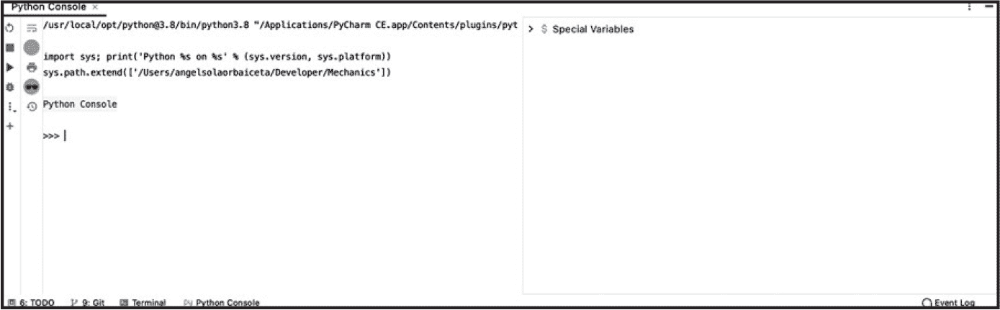
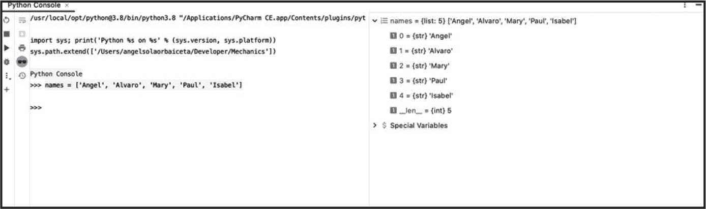
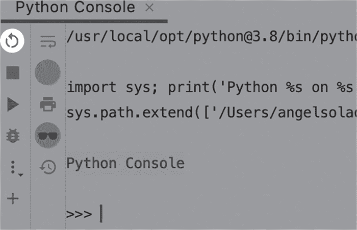

## 命令行


*命令行接口* 让我们可以直接向计算机发出指令。在命令行中，我们可以运行程序、搜索文件、创建和删除目录、连接互联网等。除两个例外外，本书中创建的所有应用程序都设计为从命令行执行。本章将简要介绍命令行接口的基础知识。如果您已经知道如何使用命令行，可以跳过本章。

### **Unix 和 Windows**

每个操作系统都有不同的命令行界面（CLI），但它们的目的都是相似的：直接向操作系统发出指令。Linux 和 macOS 都基于 Unix，因此它们共享一个通用的语法，并使用相似的*命令行处理器*，这些程序可以解释您以纯文本形式发出的指令，并将其转换成计算机可以执行的语言。有几种 Unix 命令行处理器，bash、bourne 和 zsh 就是其中的几个例子。

这些系统中的命令行应用程序通常称为 *shell*、*终端* 或 *提示符*。苹果的 macOS 自带有 bash shell，但最近它将 bash 替换为 zsh，zsh 可以说是更现代且功能更强大。我们不会过于关注这些 shell 版本之间的差异；在我们的使用场景中，它们可以互换使用。

Windows 有自己的命令行系统，且与 macOS 或 Linux 使用不同的语法。幸运的是，由于大多数开发者更熟悉类似 Unix 的 shell，Windows 决定允许其用户安装 Linux 子系统。在下一部分，我们将讨论如何安装 Windows 子系统 Linux（WSL）支持，以便您在使用 Windows 计算机跟随本书时使用。

### **查找您的 Shell**

如果您是 Linux 或 macOS 用户，您无需安装任何额外的软件：您的系统自带有一个终端。您可以在应用程序目录中找到它。

如果您是 Windows 用户，您的系统也有命令行，但我们将不使用它；我们将安装 WSL（Windows Subsystem for Linux）。这个系统将让您访问一个可以用于跟随本书内容的 shell。让我们看看如何在您的计算机上安装它。如果您不是 Windows 用户，可以跳过这一部分。

#### ***安装 Windows 子系统 Linux***

*Windows 子系统 Linux*，简称 WSL，是在 Windows 操作系统内安装的 Linux 操作系统。WSL 将允许您访问 Linux 的主要工具，包括 shell。

由于安装说明通常会随着时间的推移而变化，如果您在以下步骤中遇到任何问题，请参考官方文档。您可以在[*https://docs.microsoft.com/windows/wsl*](https://docs.microsoft.com/windows/wsl)找到官方文档，那里还会有详细的信息和逐步的安装指南。

截至本文编写时，要安装 Linux 子系统，你首先需要在你的机器上启用 WSL 可选功能。为此，打开 PowerShell 应用程序以管理员身份运行，然后执行以下命令：

```py
PS C:\> dism.exe /online /enable-feature
    /featurename:Microsoft-Windows-Subsystem-Linux
    /all /norestart
```

请注意，你应该将此命令写在一行上；我不得不换行，因为它在书籍的印刷版本中无法容纳。它可能需要几秒钟才能完成。一旦命令执行完毕，重启你的机器。

当你的机器完全重启后，你可以开始安装任何你选择的 Linux 发行版（也叫做*distro*）。如果你没有特别偏好的 Linux 发行版，我建议你安装 Ubuntu；它既可靠又对开发者友好。

要安装 Linux 子系统，打开 Microsoft Store 并搜索 *Ubuntu*（或你选择的发行版）。在本书中，我将使用 Ubuntu 的 20 LTS 版本。运行 Linux 子系统的安装程序；一旦安装过程完成，打开它。

当你第一次打开 Linux 子系统时，它需要执行一些安装步骤，这可能需要几分钟。正如你所看到的，这个安装包括 Linux 操作系统和一个与其通信的 shell，但不包括图形界面。shell 会提示你创建一个新的用户名和密码。如果你在安装和配置系统时遇到困难，不要犹豫，阅读文档。

#### ***初探 Shell***

当你打开 shell 时，它会显示如下内容：

```py
angel@MacBook ~ %
```

你可能会看到一些不同的字符出现在最后，但第一部分是通过 @ 符号分隔的已登录用户和机器名：

```py
<user>@<machine> ~ %
```

在本书的其余部分，我们将使用美元符号（$）表示 shell，并且不再显示用户和机器的名称：

```py
$
```

现在你知道如何打开 shell，我们来看看一些有用的命令。

### **文件和目录**

让我们尝试第一个命令：pwd（即 *print working directory* 的缩写）。在 shell 中输入 pwd 并按回车键。这条命令会显示当前目录的路径，也就是 shell 当前所在的目录：

```py
$ pwd
/Users/angel
```

在这种情况下，shell 告诉我们当前的工作目录是*angel*，它位于*Users*目录内。

使用 whoami 命令，我们还可以让 shell 告诉我们当前登录的用户：

```py
$ whoami
angel
```

然后，我们可以使用 ls 命令列出当前目录中的内容：

```py
$ ls
Desktop               Downloads             Music             PycharmProjects
Applications          Developer             Library           Pictures
Documents             Git                   Movies            Public
```

#### ***移动目录***

我们可以使用 cd 命令后跟我们想要切换到的目录名称来切换目录：

```py
$ cd Documents
$ pwd
/Users/angel/Documents
```

要回到上一级目录，即父目录，我们使用两个点：

```py
$ cd ..
$ pwd
/Users/angel
```

在这两个 cd 命令的示例中，我们使用相对路径切换了目录。*相对路径*是从当前目录开始的路径。例如，如果我们想使用相对路径切换目录，我们只需要提供如下的路径：

```py
$ cd Documents/Video
$ pwd
/Users/angel/Documents/Video
```

我们可以使用一个点（.）来表示当前目录。所以，下面是切换到 *Documents/Video* 目录的另一种方法：

```py
$ cd ./Documents/Video
$ pwd
/Users/angel/Documents/Video
```

我们也可以使用 *绝对路径* 来更改目录，绝对路径是相对于根目录的路径。根目录的名称就是一个斜杠字符（/）。让我们尝试使用绝对路径切换到根目录：

```py
$ cd /
$ pwd
/
```

现在让我们回到我们的主目录。主目录也有一个特殊的快捷方式名称，即波浪号（~）：

```py
$ cd ~
$ pwd
/Users/angel
```

#### ***创建文件和目录***

我们可以使用 `mkdir` 命令创建新目录，后面跟上我们想要创建的目录名称：

```py
$ mkdir tmp/mechanics
```

在这里，我们刚刚在工作目录中创建了一个名为 *tmp* 的新目录，里面有一个名为 *mechanics* 的新目录。我们本可以通过两步完成相同的操作，首先创建 *tmp* 目录，

```py
$ mkdir tmp
```

然后进入 *tmp* 目录（`cd tmp`），再创建 *mechanics* 目录，

```py
$ mkdir mechanics
```

两种情况的结果是一样的。

让我们进入那个新目录：

```py
$ cd tmp/mechanics
```

要创建一个新文件，我们可以使用 `touch` 命令，后面跟上文件名：

```py
$ touch file.txt
$ ls
file.txt
```

我们可以使用输入重定向将一些文本写入文件，我们将在下一节中对此做进一步解释：

```py
$ echo write me to the file > file.txt
```

这个命令比我们之前看到的命令稍微复杂一些，它有两个部分。左侧的部分，在 > 符号的左边，使用 `echo` 命令将“write me”输出到文件。我们可以单独运行这个命令来看看它的效果：

```py
$ echo write me to the file
write me to the file
```

如我们所见，`echo` 命令只是简单地打印我们传递给它的内容。使用 > 符号时，我们可以将输出目标从标准输出（shell）重定向到文件，这样消息就会写入文件，而不是输出到 shell。

为了证明我们已经删除了文件，让我们使用 `cat` 命令读取文件内容：

```py
$ cat file.txt
write me to the file
```

`cat` 命令会打印文件的内容。该命令是 *concatenate*（连接）的缩写，它会连接传递给它的文件内容。实际上，我们可以将 `cat` 命令传递给同一个文件两次，以查看连接的结果：

```py
$ cat file.txt file.txt
write me to the file
write me to the file
```

现在让我们删除刚刚创建的文件和目录。

#### ***删除文件和目录***

要删除文件，我们使用 `rm` 命令：

```py
$ rm file.txt
```

文件现在永远消失了：在使用命令行时没有垃圾桶或其他安全机制。我们在删除文件或目录时需要格外小心。

让我们回到上两级目录，离开 *tmp/mechanics* 文件夹：

```py
$ cd ../..
$ pwd
/Users/angel
```

如果一个目录是空的，我们可以使用 -d 命令行选项将其删除。*命令行选项*是我们可以传递给命令的参数，用来修改其行为。命令行选项有两种形式：一种是一个短横线后跟一个或多个小写字母，如 -f；另一种是双短横线后跟一个单词或复合词，如 --file 或 --file-name。

删除一个空目录的操作如下：

```py
$ rm -d tmp
rm: tmp: Directory not empty
```

如你所见，shell 返回了一个错误消息，因为我们的 *tmp* 目录不是空的（它有一个子目录）。如果我们想要删除一个目录及其所有子目录，我们可以使用 -r 选项：

```py
$ rm -r tmp
```

如果目录或任何子目录中包含文件，前面的命令会失败。此命令在我们想删除不包含文件的目录时非常有用，因为如果遇到文件，该命令将不会删除任何东西，以确保安全。要删除包含文件的目录，我们可以使用 -rf 选项：

```py
$ rm -rf tmp
```

你需要对 rm -rf 命令保持 *极其小心*。这个命令可能会造成一些不可恢复的严重损害。

#### ***命令总结***

表 3-1 总结了我们在本节中探讨的命令。

**表 3-1：** 文件和目录的 shell 命令

| **命令** | **描述** |
| --- | --- |
| whoami | 显示有效用户 ID |
| pwd | 返回当前工作目录的名称 |
| ls | 列出目录内容 |
| cd | 更改目录 |
| mkdir | 创建新目录 |
| echo | 将参数写入标准输出 |
| cat | 拼接并打印文件内容 |
| rm | 删除文件 |
| rm -d | 删除空目录 |
| rm -r | 删除目录及其中的子目录 |
| rm -rf | 删除目录及文件（递归） |

#### ***使用 Windows 子系统运行 Linux***

现在我们了解了基本的命令来在机器的目录之间移动，接下来让我们看看在使用 Windows 子系统运行 Linux 时的一些具体情况。

##### **查找 C: 驱动器**

每次你打开 Linux 子系统时，shell 的工作目录将设置为 Linux 子系统的主目录。你可以使用 pwd 命令查看当前目录：

```py
$ pwd
/home/angel
```

WSL 有自己独立的目录结构，与计算机本身的目录结构不同。不过，由于你将在 Windows 机器上编写本书的代码，你需要一种访问 C: 驱动器的方式。WSL 提供了一个简单的访问 C: 驱动器的方法。

你的本地驱动器会被挂载到 Linux 子系统中的一个名为 */mnt* 的目录内。让我们进入 */mnt* 目录，然后列出其内容：

```py
$ cd /mnt
$ ls
c    d
```

使用绝对路径（以 / 开头）来导航到 /mnt 是非常重要的。ls 命令列出了我的两个驱动器：C: 和 D:。要打开其中一个，只需更改目录：

```py
$ cd c
```

现在，WSL 的工作目录就是你的 C: 驱动器。你可以找到你的 *Users* 主目录，或者任何你用来编写代码的文件夹：

```py
$ cd Users/angel
```

##### **确保 Python 安装（Ubuntu）**

Ubuntu 已预装 Python 3 版本。你可以从 shell 中检查已安装的版本：

```py
$ python3 --version
Python 3.8.2
```

你可以使用 Ubuntu 的 apt 命令行工具将 Python 更新到最新版本。首先，你需要更新 apt 软件包列表，以确保它们与最新版本的软件保持同步。你需要以 *超级用户* 身份运行此命令。你可以通过在命令前加上 sudo（即 *superuser* do）来实现这一点。运行任何超级用户命令时，你需要提供密码：

```py
$ sudo apt update
[sudo] password for angel: <write your password here>
```

当你输入密码时，你不会在终端看到任何内容。输入时，提示符将保持为空，主要出于安全原因。一旦包列表更新完成，你就可以升级 Python 的版本：

```py
$ sudo apt upgrade python3
```

现在你可以确保 Ubuntu 上有最新的 Python 版本 3 的稳定版本。你已经准备好学习如何运行 Python 脚本了。

### **运行 Python 脚本**

使用命令行运行 Python 文件是一个简单的过程：

```py
$ python3 <filename.py>
```

使用 Python 版本 3 的解释器非常重要，因为我们将使用一些仅在此版本中可用的功能。由于 Python 版本 2 和 3 可以安装在同一台机器上，因此版本 3 的解释器名称会以 3 结尾。

让我们创建一个 Python 文件并执行它。在你的终端中，使用以下命令创建一个新的 Python 文件：

```py
$ touch script.py
```

这将会在终端的工作目录中创建一个新文件 *script.py*。用 PyCharm 或你选择的编辑器打开文件，并输入一个打印语句：

```py
print('hello, World!')
```

确保保存文件。让我们检查一下我们的*script.py*文件是否正确写入：

```py
$ cat script.py
print('hello, World!')
```

最后，让我们从命令行执行我们的 Python 脚本：

```py
$ python3 script.py
hello, World!
```

正如预期的那样，我们的程序给出了一个问候，World！问候。

### **向脚本传递参数**

命令行程序可以接受参数。让我们尝试一下，在我们的 Python 脚本中接受一个参数来个性化问候。打开*script.py*文件并修改它，使其包含以下内容：

```py
import sys

name = sys.argv[1] if len(sys.argv) > 1 else 'unknown'
print(f'Hello, {name}')
```

Python 的 sys.argv 是传递给执行脚本的参数列表。列表的第一个项始终是执行程序的名称，在本例中是*script.py*。因此，我们首先需要检查参数列表是否包含多个项，以确定是否将名称作为参数传递给程序。如果我们检测到用户传递了参数，就将其用作我们要问候的人的名字，但如果没有传递参数，则默认名字为未知。

现在我们可以运行没有参数的程序，得到一个非个人化的问候：

```py
$ python3 script.py
Hello, unknown!
```

我们还可以传递一个名字给脚本，以获得一个更加个性化的问候：

```py
$ python3 script.py Jenny
Hello, Jenny!
```

### **标准输入和输出**

在终端中执行的程序可以读取和写入数据。当一个程序（比如我们之前的*script.py*）打印内容时，它作为输出出现在终端中。我们之前的程序输出了像 Hello, Jenny! 这样的字符串，然后显示在终端屏幕上。终端的屏幕通常被称为*标准输出*。

#### ***将输出重定向到文件***

之前，我们通过使用 > 字符将 echo 命令的输出重定向到文件中。

在终端中试试这个：

```py
$ python3 script.py Jenny > greeting.txt
$ cat greeting.txt
Hello, Jenny!
```

这次，*script.py* 程序的结果没有打印到终端屏幕上，而是写入了一个新文件 *greeting.txt*。

使用 > 字符，我们可以将程序的输出重定向到一个新文件。如果目标文件已存在，它会被覆盖。我们还可以使用 >> 字符将内容追加到现有文件，而不是创建一个新文件：

```py
$ python3 script.py Angel >> greeting.txt
$ cat greeting.txt
Hello, Jenny!
Hello, Angel!
```

这是一个非常有用的技巧，我们将在全书中使用它将程序的结果写入外部文件。

#### ***从文件重定向输入***

就像我们可以重定向 shell 的标准输出一样，我们也可以重定向 shell 的输入。让我们创建一个新的脚本。与其从程序的参数中读取名字，不如提示用户输入他们的名字。首先，创建一个新的空文件：

```py
$ touch script2.py
```

打开文件并输入以下代码：

```py
print("What's your name?")
name = input()
print('Hello there, {name}')
```

如果我们现在运行我们的新脚本，它会提示我们输入名字：

```py
$ python3 script2.py
What's your name?
Angel
Hello there, Angel
```

这个程序从*标准输入*读取名字，也就是从 shell 读取。我们必须在 shell 中输入名字并按回车键，程序才能读取它。我们可以使用 < 字符将输入从文件重定向到我们的程序。在这种情况下，程序会读取文件的内容，而不是从 shell 中读取。

让我们在一个新文件中写下一个名字：

```py
$ echo Mary > name.txt
```

现在，让我们将输入重定向为从这个文件读取到我们的程序：

```py
$ python3 script2.py < name.txt
What's your name?
Hello there, Mary
```

这一次，当程序提示输入名字时，shell 会读取 *name.txt* 文件的内容，而不需要我们自己输入任何东西。

本书中我们将编写的应用程序会使用输入重定向将输入文件的内容读入到 Python 程序中。

### **使用 PyCharm 的 Python 控制台**

正如我们在本书的介绍部分所看到的，PyCharm 附带了两个控制台：一个是 Python 控制台，另一个是你系统的 shell。前者特别有趣，因为它允许我们直接运行 Python 代码并检查所有加载的符号。你可以通过点击底部栏的 Python 控制台按钮或通过菜单选择 View ▸ Tool Windows ▸ Python Console 来打开 PyCharm 的 Python 控制台。

如图 3-1 所示，Python 控制台被分为两个窗格：左侧窗格是你编写 Python 代码的控制台，右侧窗格列出了你已定义的所有变量。让我们做一个实际练习来学习它是如何工作的。



*图 3-1：PyCharm Python 控制台*

在 Python 提示符下，输入以下内容：

```py
>>> names = ['Angel', 'Alvaro', 'Mary', 'Paul', 'Isabel']
```

现在右侧窗格中列出了你可以探索的符号列表（见图 3-2）。你可以展开名字符号，检查列表中的项目。



*图 3-2：声明一个名字列表*

现在让我们写一个函数，过滤一个字符串列表，只保留那些长度小于给定值的字符串。请在控制台中输入以下内容（注意代码中的缩进用三个点表示）：

```py
>>> def filter_list_shorter_than(lst, length):
...     return [item for item in lst if len(item) < length]
...

>>> filter_list_shorter_than(names, 5)
['Mary', 'Paul']
```

如果你想保存过滤后的列表的引用，你可以将结果保存到一个变量中：

```py
>>> result = filter_list_shorter_than(names, 5)
```

现在你可以使用 Python 控制台的右侧窗格来查看结果列表。

你也可以从控制台导入 Python 模块。你可以从自己的项目或标准库中导入模块。例如，如果你之前在 PyCharm 中打开了 *Mechanics* 项目，你可以导入 Point 类。

```py
>>> from geom2d import Point
>>> p = Point(10, 15)
```

从标准库导入模块同样简单。例如，要从 json 模块导入 JSONDecoder 类，可以使用以下代码：

```py
>>> from json import JSONDecoder
```

有时候，我们可能需要重新加载控制台，以便清除所有导入的模块和已定义的变量。这是个好主意，因为你导入的模块和定义的变量可能会与新写的代码产生交互。我们可以通过点击控制台左上方的重新加载按钮来重新加载 Python 控制台（见图 3-3）。



*图 3-3：重新加载控制台*

慢慢探索 PyCharm 的 Python 控制台，因为你会发现它在本书中非常有用；我们会经常通过在其中运行快速实验来测试代码。

### **总结**

在这一短小的章节中，我们介绍了使用 bash/zsh 命令行的基础知识。通过这个终端，我们可以向计算机发出命令，并从这里执行 Python 脚本。我们还探索了标准输入和输出重定向，这是我们在全书中会广泛使用的技术。

不再浪费时间，让我们开始创建我们的 *Mechanics* 项目吧。让乐趣开始！
