## 4

点和向量


点和向量是几何学的基础。在本书中，我们将它们作为我们的*基本元素*，是构建其余几何库的基石。为了让我们的几何库可用，必须确保我们实现的点和向量代码没有错误。代码中的一个 bug 不仅会导致库函数出错，还可能传播到我们在其上构建的其他库中，给我们带来各种错误的计算。

在本章中，我们有两个主要任务。首先，我们需要实现类来表示点和向量。然后，我们需要通过单元测试来确保我们的代码没有 bug，这是我们在本书中将反复进行的过程。但在做这两件事之前，我们需要实现一些有用的方法。

### **比较数字**

在表示实数时，计算机并不具有无限精度。大多数计算机使用浮点数来存储这些值，而浮点数无法表示每一个有理数，更不用说无理数了。因此，在比较浮点数时，你必须指定一个*容差*：一个数字 *ϵ*，它小到足够可以满足

|*a – b*| < *ϵ*

其中 *a* 和 *b* 是你想要比较的两个数字。

容差的数量级需要与问题的大小和你所需的精度相一致。例如，在处理行星轨道长度时，使用 1*E*^(–20)毫米的容差就没有太大意义，因为这些长度的数量级是数百万公里。同样，在处理原子距离时，使用 1*E*^(–2)厘米的容差也是毫无意义的。

在我们开始编写我们的基本元素之前，我们需要一种方法来判断两个浮点数在给定的容差 *ϵ* 下是否可以被认为是相等的。但我们不能依赖计算机来比较浮点数，因为百位小数上的不同数字在逻辑上被认为是完全不同的数字。因此，我们将从本章开始，编写一个函数来比较两个数字，使用给定的容差。对于我们的几何计算，我们将使用默认的容差 1*E*^(–10)，这是大多数计算中可接受的精度水平。

打开你的项目，在 IDE 中右键点击项目根文件夹，选择**新建** ▸ **Python 包**。将其命名为*geom2d*，然后点击**确定**。这将是我们所有几何代码的包。

**注意**

*因为包名已经确定了包内的内容是二维的，所以我们在命名文件和类时不会重复这个信息。在包内，我们会使用像* point *或* segment *这样的名称，而不是* point2d *或* segment2d*。如果我们要创建一个三维几何包，* geom3d*，我们仍然会使用* point *和* segment*，只是它们会有不同的三维实现。*

通过右键单击*geom2d*包文件夹并选择**新建** ▸ **Python 文件**来创建一个新文件。命名为*nums*，保持类型下拉框不变，然后点击**确定**。

创建好文件后，让我们实现第一个比较函数。清单 4-1 中包含了我们的函数代码。

```py
import math

def are_close_enough(a, b, tolerance=1e-10):
    return math.fabs(a - b) < tolerance
```

*清单 4-1：比较数字*

首先，我们导入了*math*模块，这是 Python 标准库的一部分，包含了有用的数学函数。我们的函数接受两个数字 a 和 b，以及一个可选的容差参数，如果未提供其他值，默认容差为 1*E*^(-10)。最后，我们使用 math 库的 fabs 函数来检查 a 和 b 之间的差值的绝对值是否小于容差，并返回相应的布尔值。

实际上，我们会发现有两个特定的值需要进行比较：零和一。为了避免重复编写类似的代码，

```py
are_close_enough(num, 1.0, 1e-5)
```

或

```py
are_close_enough(num, 0.0, 1e-5)
```

让我们将它们作为函数实现。接着上一个函数，添加清单 4-2 中的代码。

```py
--snip--

def is_close_to_zero(a, tolerance=1e-10):
    return are_close_enough(a, 0.0, tolerance)

def is_close_to_one(a, tolerance=1e-10):
    return are_close_enough(a, 1.0, tolerance)
```

*清单 4-2：将数字与零或一进行比较*

像清单 4-2 中的函数并非严格必要，但它们非常方便，并使代码更具可读性。

### **点类**

根据欧几里得《几何原本》的第一卷，点是“没有部分的东西”。换句话说，点是没有宽度、长度或深度的实体。它只是空间中的一个位置，是肉眼无法看到的。点是所有欧几里得几何的基础，他所有著作中的其他内容都是建立在这个简单概念上的。因此，我们的几何库也将基于这一强大的原始概念。

一个点由两个数字*x*和*y*组成。这些是它的坐标，有时也称为*投影*。图 4-1 描绘了一个点*P*及其在欧几里得平面中的坐标。

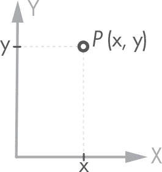

*图 4-1：平面中的点 P*

让我们实现一个表示二维点的类。如之前所述，我们将通过右键单击*geom2d*包文件夹并选择**新建** ▸ **Python 文件**来创建一个新文件。命名为*point*，然后点击**确定**。在文件中输入清单 4-3 中的代码。

```py
class Point:
    def __init__(self, x, y):
        self.x = x
        self.y = y
```

*清单 4-3：我们的点类*

坐标被传递给初始化方法(__init__)并作为类的属性存储。

在编写完初始化器后，让我们实现一些功能。

#### ***计算点之间的距离***

为了计算两点*P*和*Q*之间的距离*d*(*P, Q*)，我们使用方程 4.1。

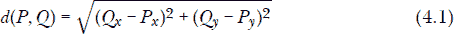

在这里，*P*[*x*]和*P*[*y*]是*P*的坐标，而*Q*[*x*]和*Q*[*y*]是*Q*的坐标。我们可以在图 4-2 中看到这个图形。

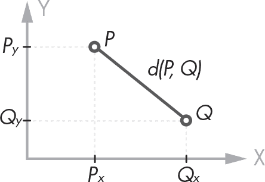

*图 4-2：点 P 和 Q 之间的距离*

我们可以通过两种方式实现距离计算。我们可以在点 p 上调用方法，计算到另一个点 q 的距离，例如 p.distance_to(q)。我们也可以将相同的计算实现为一个函数，将两个点作为参数传入：distance_between(p, q)。前者是面向对象的风格，后者是函数式的。由于我们在这里做的是面向对象编程，所以我们将选择前者。

清单 4-4 包含实现我们类中 方程 4.1 的代码。

```py
import math

class Point:
    --snip--

    def distance_to(self, other):
        delta_x = other.x - self.x
        delta_y = other.y - self.y
        return math.sqrt(delta_x ** 2 + delta_y ** 2)
```

*清单 4-4：计算两点之间的距离*

首先，我们需要导入 *math* 模块，它将许多有用的数学操作加载到我们的类中。我们定义了一个 distance_to 方法，使用 self 和 other 作为参数：self 是当前的点，other 是我们要计算距离的点。然后我们计算这两个坐标之间的距离（或 *delta*），并使用幂运算符（**）将两个 delta 的平方相加，并返回它们和的平方根。

现在让我们测试一下。打开 IDE 中的 Python 控制台，尝试以下操作：

```py
>>> from geom2d.point import Point
>>> p = Point(1, 3)
>>> q = Point(2, 4)
>>> p.distance_to(q)
1.4142135623730951
```

激动人心！我们已经迈出了构建几何库的第一步——欧几里得会为我们感到骄傲。你可以使用计算器尝试相同的操作，看看我们的实现是否得到了正确的结果。本章稍后我们将自动化测试，检查 distance 方法是否得到了正确的结果。

在我们打开控制台并加载 p 和 q 后，尝试以下操作：

```py
>>> p
<geom2d.point.Point object at 0x10f8a2588>

>>> p.__dict__
{'x': 1, 'y': 3}
```

评估点 p 会返回一个字符串，告诉我们 p 是一个在内存位置 0x10f8a2588 的 Point 类对象。注意，你获得的内存地址可能与你的不同。如果不了解计算机内存中的所有内容（并且无法读取十六进制），这种描述帮助不大。你还可以检查任何类的 __dict__ 属性，以获取该类持有的所有属性的字典。这会给你更多关于实例的信息。在本章稍后的部分，我们将实现一个特殊的方法，帮助打印一个更简洁的对象描述，例如（2, 5）。

现在让我们将注意力集中在为 Point 类重载 + 和 – 操作符上。

#### ***加法和减法操作符***

我们需要的下一个基本操作是加法和减法，这些操作我们也将在向量中实现。我们会经常使用这些基本方法，既可以单独使用，也可以用来构建更复杂的方法。我们可以像普通方法那样实现它们，通过 p.plus(q) 和 p.minus(q) 来调用，但我们可以做得更好。Python 允许我们重载 + 和 – 操作符（正如我们在“魔法方法”中所学到的，在第 43 页），这样我们就可以写成 p + q 和 p - q，Python 就知道要正确地加法和减法。重载操作符使得像这样的代码更加易读和易懂。

在 Python 中重载运算符需要实现一个对应于运算符的特定名称的方法。然后，当 Python 遇到该运算符时，它会用你定义的方法替代并调用它。对于 + 运算符，方法名是 __add__，而对于 - 运算符，方法名是 __sub__。表 4-1 包含了我们可以在类中重载的常见运算符。

**表 4-1：** Python 可重载的运算符

| **运算符** | **方法名称** | **描述** |
| --- | --- | --- |
| + | __add__(self, other) | 加法 |
| - | __sub__(self, other) | 减法 |
| * | __mul__(self, other) | 乘法 |
| / | __truediv__(self, other) | 除法 |
| % | __mod__(self, other) | 模运算 |
| == | __eq__(self, other) | 等式 |
| != | __ne__(self, other) | 不等式 |
| < | __lt__(self, other) | 小于 |
| <= | __le__(self, other) | 小于或等于 |
| > | __gt__(self, other) | 大于 |
| >= | __ge__(self, other) | 大于或等于 |

让我们将加法和减法操作实现为方法。在 Point 类内部，在 distance_to 方法之后，添加 列表 4-5 中的代码。

```py
class Point:
    --snip--

   def __add__(self, other):
       return Point(
           self.x + other.x,
           self.y + other.y
       )

   def __sub__(self, other):
       return Point(
           self.x - other.x,
           self.y - other.y
       )
```

*列表 4-5：点的加法和减法*

方法 __add__ 创建并返回一个新的点，其投影是两个参数投影的和。从代数角度来看，这个操作没有太大意义，但我们以后可能会发现它很有用。方法 __sub__ 做的是同样的事情，只不过结果的投影是输入点投影的差。两个点相减 *P – Q* 结果是一个从 *Q* 到 *P* 的向量，但我们还没有为向量创建类。我们将在下一节重构这段代码，使其返回一个向量实例。

让我们实现下一个主要的基础构件：向量。

### **向量类**

与点类似，欧几里得平面中的 *向量* 由两个数字组成，称为坐标，它们编码了大小和方向。例如，向量 ⟨3, 5⟩ 可以理解为沿水平方向正向移动 3 个单位，沿垂直方向正向移动 5 个单位所得到的位移。图 4-3 展示了欧几里得平面中的向量 。

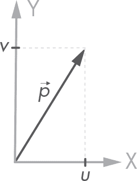

*图 4-3：平面中的向量 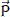*

许多物理量是矢量的：它们需要大小和方向才能完全定义。例如，速度、加速度和力都是矢量量。由于向量如此常见，我们来创建一个类来表示它们。

右键点击 *geom2d* 包文件夹，选择 **新建** ▸ **Python 文件**。将文件命名为 *vector* 并点击 **确定**。然后输入 列表 4-6 中的代码。

```py
class Vector:
    def __init__(self, u, v):
        self.u = u
        self.v = v
```

*列表 4-6：向量类*

Vector 类的实现类似于 Point 类。坐标被命名为 u 和 v，而不是 x 和 y。这只是一个惯例，避免无意中混淆点和向量。

在继续之前，让我们重构 Point 类的 __sub__ 方法，使其返回一个 Vector。回想一下，两个点相减*P - Q*会得到一个从*Q*指向*P*的向量。修改你的*point.py*文件，使其现在与清单 4-7 中的代码相匹配。

```py
import math

from geom2d.vector import Vector

class Point:
    --snip--

    def __sub__(self, other):
        return Vector(
            self.x - other.x,
            self.y - other.y
        )
```

*清单 4-7: 重构 Point 类的 __sub__ 方法*

我们将在“向量工厂”一节中详细讨论这个操作，见第 89 页，我们将使用这个操作来创建向量。

现在让我们为 Vector 类实现一些有用的方法。

#### ***加法和减法运算符***

和点一样，向量的加法和减法是常见操作。例如，我们可以通过对表示两个力的向量求和来得到两个力的和（力是向量量）。

在 __init__ 方法之后，输入清单 4-8 中的代码。

```py
class Vector:
    --snip--

    def __add__(self, other):
        return Vector(
            self.u + other.u,
            self.v + other.v
        )

    def __sub__(self, other):
        return Vector(
            self.u - other.u,
            self.v - other.v
        )
```

*清单 4-8: 向量的加法和减法*

在 __add__ 和 __sub__ 方法中，我们创建了一个新的 Vector 实例来保存加法或减法的投影结果。

图 4-4 展示了两个向量的加法和减法操作，和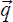。注意，减去 – 可以理解为加上–。

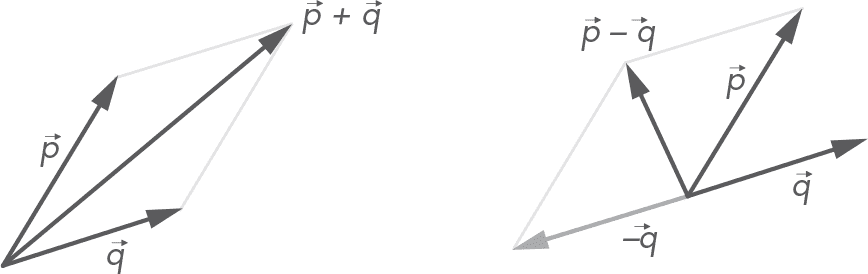

*图 4-4: 两个向量的和： + 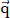，和两个向量的差： – *

现在你可能会想知道我们是否会对其他运算符做相同的处理。加法和减法在点和向量的世界中很容易理解，但像 __mul__ 运算符（用于重载乘法操作）就没有那么简单了。乘法到底是点积、叉积，还是向量缩放操作，这一点不太明确。我们不会使用单一的运算符，而是简单地将这些操作实现为具有描述性名称的方法：scaled_by、dot 和 cross。

我们将从缩放开始。

#### ***缩放向量***

要*缩放*一个向量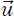，你需要用一个叫做*标量*的量*k*来乘它，标量会拉伸或缩小这个向量。从数学上讲，标量乘法看起来像方程 4.2：

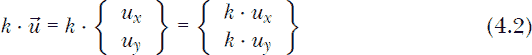

让我们在 Vector 类中创建一个缩放方法。在 __sub__ 方法下输入清单 4-9 中的代码。

```py
class Vector:
    --snip--

   def scaled_by(self, factor):
       return Vector(factor * self.u, factor * self.v)
```

*清单 4-9: 缩放一个向量*

在前面的代码中，我们简单地返回一个新的 Vector，其中的 u 和 v 属性被传入的标量因子乘以。

#### ***位移点***

使用缩放方法，我们可以实现另一个操作：将点 *P* 通过给定的向量  位移 *k* 次。从数学上讲，这看起来像方程 4.3。

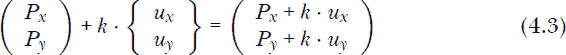

从图形上看，效果如图 4-5 所示。

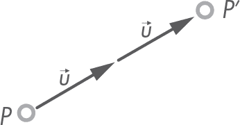

*图 4-5：通过向量 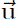 将点 P 位移给定次数 k（本例中为 2）*

让我们在 Point 类中以编程方式实现它，因为位移对象是点（列表 4-10）。

```py
class Point:
    --snip--

   def displaced(self, vector: Vector, times=1):
       scaled_vec = vector.scaled_by(times)
       return Point(
           self.x + scaled_vec.u,
           self.y + scaled_vec.v
       )
```

*列表 4-10：通过向量 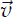 将点 P 位移给定次数 k*

该方法接收两个参数：一个向量 vector 和一个标量 times。向量将根据 times 进行缩放，产生最终的位移。例如，一个向量 ⟨3, 5⟩，如果 times = 2，则结果为 ⟨6, 10⟩。请注意，参数 times 默认值为 1，因为通常传入的向量已经具有所需的长度。返回的点是源点坐标与位移向量坐标之和。

让我们在 Python shell 中尝试移动一个点。重新启动控制台，以避免先前导入的 Point 和 Vector 类干扰，然后输入以下内容：

```py
>>> from geom2d.point import Point
>>> from geom2d.vector import Vector

>>> p = Point(2, 3)
>>> v = Vector(10, 20)
>>> p_prime = p.displaced(v, 2)
>>> p_prime.__dict__
{'x': 22, 'y': 43}
```

你可以使用计算器来验证数学运算是否如预期工作。

#### ***向量范数***

向量的 *范数* 是它的长度。*单位范数* 是长度恰好为一个单位的范数。单位范数的向量对于定义方向非常有用；因此，我们通常需要知道一个向量是否具有单位范数（即它是否是 *规范的*）。我们还经常需要 *归一化* 一个向量：保持其方向，但将其缩放至长度为 1。二维向量的范数由方程 4.4 给出。


让我们实现一个返回 Vector 范数的属性，并实现另一个检查向量是否规范的属性。两者都包含在列表 4-11 中。

```py
import math

from geom2d import nums

class Vector:
    --snip--

    @property
    def norm(self):
        return math.sqrt(self.u ** 2 + self.v ** 2)

    @property
    def is_normal(self):
        return nums.is_close_to_one(self.norm)
```

*列表 4-11：向量的范数*

从范数属性获得的值完全符合方程 4.4 的定义。为了知道一个向量的范数是否为 1，我们使用数值比较方法`is_close_to_one`，并传入该向量的范数。

我们将实现两个重要操作：一个方法将一个向量  归一化，得到一个方向相同但长度为单位长度的向量 *û*，另一个方法将一个向量缩放到给定的长度。通过方程 4.5 可以获得向量的归一化版本，我们称其为 *单位向量* 或 *单位向量*。

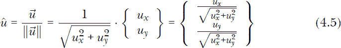

这样计算出来的向量将具有长度 1。将该向量与标量 *k* 相乘，得到的向量是 *[k]*，它与原向量方向相同，但长度为标量的值，如 方程 4.6 所示。

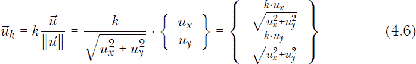

在 列表 4-12 中，我们将把这些方程转化为代码。

```py
class Vector:
    --snip--

   def normalized(self):
       return self.scaled_by(1.0 / self.norm)

   def with_length(self, length):
       return self.normalized().scaled_by(length)
```

*列表 4-12：单位长度或指定长度的向量*

要归一化一个向量，我们通过它的范数的倒数对其进行缩放（这相当于将向量的长度除以它的范数）。当我们想要将向量缩放到指定长度时，我们只需归一化向量，然后按所需长度进行缩放。

#### ***不可变设计***

你现在可能已经意识到，我们从未直接修改任何对象的属性，而是创建并返回一个新的 Point 或 Vector 实例。例如，要归一化一个向量，我们可以使用 列表 4-13 中的代码。

```py
def normalize(self):
   norm = self.norm
    self.x = self.x / norm
    self.y = self.y / norm
```

*列表 4-13：就地归一化一个向量*

调用该方法会导致 *就地归一化*，即当前对象属性的变更。就地归一化速度更快且占用更少内存，但也更容易出错。当程序中的其他部分没有预料到这种变化时，程序很容易错误地修改正在使用的对象。找到这种类型的 bug 非常棘手，需要大量的调试。此外，使用不可变数据的程序更容易理解和推理，因为你不需要跟踪对象随时间如何变化其状态。

看一下以下代码，它实现了与之前类似的归一化方法，但其中包含了一个微妙的错误。在这种情况下，归一化将产生错误的结果。你能找出原因吗？

```py
def normalize(self):
    self.x = self.x / self.norm
    self.y = self.y / self.norm
```

这是一个棘手的例子。在第一行通过改变 self.x 属性，第二次调用获取 self.norm 属性时将使用更新后的 self.x 值。第一次和第二次调用 self.norm 的结果不同，这就是我们必须将 self.norm 的值存储在变量中的原因。

当对象的数据量较小时，最好完全避免变更。你的程序如果并发执行，也会表现得更正确，代码也更容易理解。将可变性减少到最低限度会使代码更加健壮；正如本书中所展示的，我们将尽可能遵循这一原则。

#### ***命名约定***

注意方法的命名约定。修改对象状态的方法命名如下：

normalize    就地归一化向量

scale_by    就地缩放向量

创建新对象作为结果的方法命名如下：

normalized    返回一个新的归一化向量

scaled_by    返回一个新的缩放向量

接下来，我们将在我们的 Vector 类中实现点积和叉积。这些简单的运算将为一些有用的操作打开大门，比如计算两个向量之间的角度或测试是否垂直。

#### ***点积***

两个向量  和  之间的 *点积* 会得到一个标量值，这是衡量这两个向量方向差异的度量。在二维空间中，若 *θ* 为两个向量之间的角度，该点积由方程 4.7 给出。

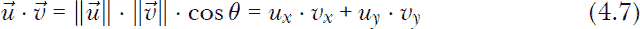

为了理解点积在两个操作数向量的相对方向不同的情况下可能具有的不同值，让我们看一下图 4-6。该图描绘了一个参考向量  和三个其他向量：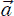、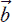 和 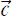。一条垂直于  的线将空间分成两个半平面。向量  位于该线上，因此  与  之间的角度 *θ* 为 90°，由于 cos(90^°) = 0，因此  ·  = 0。垂直向量的点积为零。向量  恰好与  在同一半平面上；因此，! Image ·  > 0。最后，! Image 位于  的对侧半平面上；因此，! Image ·  < 0。

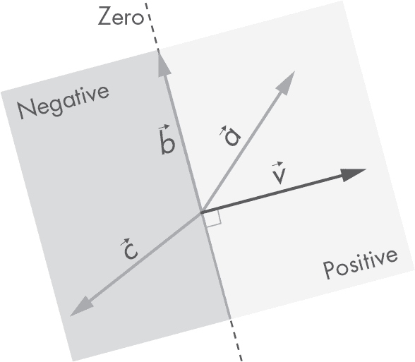

*图 4-6：与 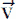 相关的向量方向会产生不同的点积。*

根据方程 4.7，实现点积是直接的。在 Vector 类内部，输入列表 4-14 中的代码。

```py
class Vector:
    --snip--

   def dot(self, other):
       return (self.u * other.u) + (self.v * other.v)
```

*列表 4-14：点积*

在我们继续讨论叉积之前，先停下来分析它的一个应用：获取向量在给定方向上的投影。

#### ***投影向量***

当参与点积运算的其中一个向量是单位向量时，运算结果是一个向量在另一个向量上的投影长度。为了理解这一点，参考方程 4.7。给定一个向量  和一个单位向量 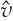，其点积为：

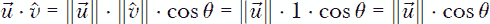

其中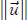 · cos*θ*正好是在方向上的投影。这在计算沿某一方向的投影时非常有用，例如，我们可以用它来获取一个桁架构件上力的轴向分量，如图 4-7 所示。在这种情况下，我们只需做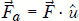来计算轴向分量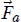。

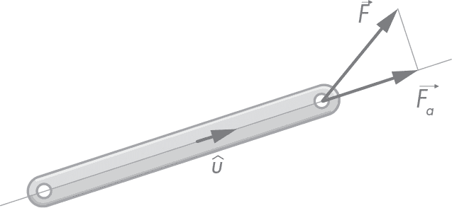

*图 4-7：力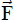在桁架构件轴向方向上的投影*

让我们将此操作实现为一个新方法。在你的类中输入清单 4-15 中的代码。

```py
class Vector:
    --snip--

   def projection_over(self, direction):
       return self.dot(direction.normalized())
```

*清单 4-15：一个向量在另一个向量上的投影*

请注意，方向参数可能不是单位向量。为了确保我们的公式有效，我们将其标准化。

#### ***叉积***

两个三维向量的*叉积*会产生一个新的向量，该向量垂直于包含其他两个向量的平面。操作数的顺序很重要，它决定了结果向量的方向。你可以通过右手定则来确定叉积的方向。请注意，因此这个乘积是非交换的：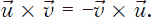 图 4-8 说明了这一现象。

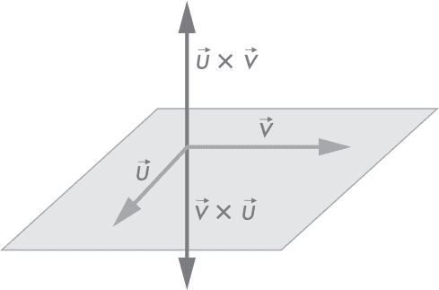

*图 4-8：叉积是非交换的。*

在三维空间中，叉积可以使用方程 4.8 进行计算。

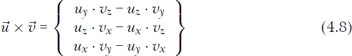

在二维空间中，每个向量都包含在同一平面内；因此，每个叉积都会生成一个垂直于该平面的向量。从之前的表达式中很容易观察到这一点，只需注意*u*[*z*] = *v*[*z*] = 0：

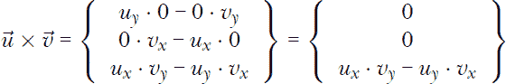

在二维应用中，叉积被认为会产生一个标量值，它是前面表达式中结果向量的 z 坐标。你可以把这个坐标看作是结果向量的长度。由于 x 和 y 坐标为零，z 坐标给出的大小就是我们需要保留的值。给定*θ*为向量和之间的夹角，可以通过应用方程 4.9 来获得二维中的叉积操作。

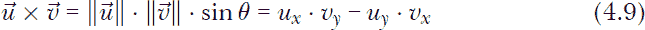

让我们实现叉积。在清单 4-16 中输入代码。

```py
class Vector:
    --snip--

   def cross(self, other):
       return (self.u * other.v) - (self.v * other.u)
```

*清单 4-16：叉积*

在二维中，叉积的一个重要应用是确定角度的旋转方向。从图 4-8 可以看到， ×  > 0，因为从到描述了一个正的（逆时针）角度。相反，从到描述了一个负角度，导致负的叉积 ×  < 0。最后，注意平行向量的叉积为零，这很容易理解，因为 sin 0 = 0。让我们更仔细地看一下这个事实，并编写我们类中的方法，判断两个向量是否平行或垂直。

#### ***平行和垂直向量***

使用点积和叉积，可以很容易地测试两个向量是否平行或垂直。列表 4-17 包含了这些操作的代码。

```py
class Vector:
    --snip--

   def is_parallel_to(self, other):
       return nums.is_close_to_zero(
           self.cross(other)
       )

   def is_perpendicular_to(self, other):
       return nums.is_close_to_zero(
           self.dot(other)
       )
```

*列表 4-17：检查向量是否平行或垂直*

检查两个向量是否平行非常简单，只需要检查它们的叉积是否为零。同样，检查两个向量是否垂直也很简单，只需要检查它们的点积是否为零。注意，我们使用函数 is_close_to_zero 来解决计算中的浮动点数比较问题。

#### ***向量之间的角度***

计算两个向量之间的角度可以通过点积表达式来完成：

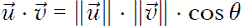

将一边的点积项除以另一边的范数乘积，并取该表达式余弦的倒数，我们得到方程 4.10：

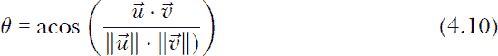

这个表达式只计算角度的大小；如果我们想知道方向，则需要利用叉积。角度的符号可以通过以下方式得到：

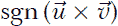

其中 sgn 是符号函数，定义如下：

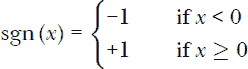

要理解为什么使用方程 4.10 只能得到角度的大小，我们需要记住余弦函数的一个重要特性。从基本几何中回忆一下，单位向量的角度余弦恰好是其水平投影的值。通过检查图 4-9 中的单位圆可以看到，两个具有相反角度的向量（角度和为零）会分配相同的余弦值。换句话说，cos *α* = cos (–*α*)，这意味着一旦一个角度通过余弦函数处理，它的符号就永远丢失了。因此，无法从计算出的点积值中确定角度的符号。

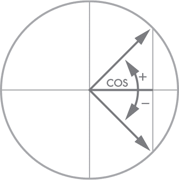

*图 4-9：对角的余弦相等。*

对于我们的许多应用，我们需要角度的大小和符号；借助叉积，我们可以将这些信息带回来。让我们创建两个新方法，一个返回角度的绝对值（用于那些只需要大小的情况），另一个返回包含符号的角度值。在你的 Vector 类中输入清单 4-18 中的代码。

```py
class Vector:
    --snip--

   def angle_value_to(self, other):
       dot_product = self.dot(other)
       norm_product = self.norm * other.norm
       return math.acos(dot_product / norm_product)

   def angle_to(self, other):
       value = self.angle_value_to(other)
       cross_product = self.cross(other)
       return math.copysign(value, cross_product)
```

*清单 4-18：计算两个向量之间的角度*

第一个方法 angle_value_to 计算 self 和 other 之间的角度，使用方程 4.10。我们首先获得点积值，并将其除以模的乘积。然后，角度就是结果的反余弦值。第二个方法 angle_to 返回带有符号的角度值，这个符号来自叉积。Python 中的 math.copysign(x, y)函数返回 x 的大小，并使用 y 的符号。

让我们在控制台中尝试这两种方法。重新加载并输入以下内容：

```py
>>> from geom2d.vector import Vector
>>> u = Vector(1, 0)
>>> v = Vector(1, 1)

>>> v.angle_value_to(u)
0.7853981633974484 # result in radians

>>> v.angle_to(u)
-0.7853981633974484 # result in radians
```

仅供参考，角度值 0.78539...是*π*/4 弧度（45^°）。

现在假设我们有一个向量，并且希望通过旋转原始向量一定角度来创建一个新向量。

#### ***旋转向量***

想象一下，在棒子受外力作用的情况下，正如我们在图 4-7 中看到的那样，我们还希望知道外力在与棒子垂直方向上的投影！Image，这就是力的剪切分量。为了找到力的投影，我们首先需要找出一个垂直于棒子方向的向量*û*，这个向量通过将其旋转*π*/2 弧度获得，如图 4-10 所示。

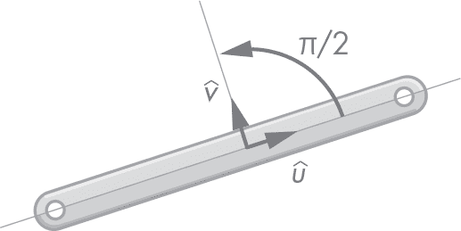

*图 4-10：旋转棒的方向向量 *π*/2 弧度*

旋转保持原始向量的长度不变，因为旋转是一种尊重长度的变换。假设*α*是我们希望向量旋转的角度，我们可以使用方程 4.11：

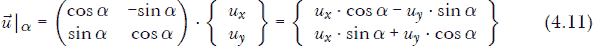

这在 Python 中变成清单 4-19 中的代码。

```py
class Vector:
    --snip--

   def rotated_radians(self, radians):
       cos = math.cos(radians)
       sin = math.sin(radians)
       return Vector(
           self.u * cos - self.v * sin,
           self.u * sin + self.v * cos
       )
```

*清单 4-19：旋转向量*

rotated_radians 函数返回一个新向量，这是通过给定的弧度数旋转原始向量得到的结果。遵循我们的不可变性原则，我们从不修改源向量；相反，我们返回一个应用了旋转的新向量。

有一个角度，*π*/2 弧度（90^°），它对于旋转向量非常有用。使用*π*/2 弧度，我们得到一个与原始向量垂直的新向量。为了避免一遍又一遍地写 v.rotated_radians(math.pi / 2)，我们可以在 Vector 类中定义一个新方法。知道 cos (*π*/2) = 0，sin (*π*/2) = 1，方程 4.11 中的角度简化为以下形式：

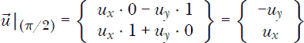

我们将这个方法命名为 perpendicular。在 Python 中，它看起来像清单 4-20。

```py
class Vector:
    --snip--

   def perpendicular(self):
       return Vector(-self.v, self.u)
```

*清单 4-20：获取垂直向量*

我们经常用来旋转的另一个角度是 *π* 弧度（180^°）。旋转一个向量 *π* 弧度会得到一个共线但方向相反的向量。这时，cos (*π*) = –1 且 sin (*π*) = 0。现在，方程 4.11 中的角度看起来是这样的：


让我们称这个方法为 opposite。在 Python 中，它看起来像 列表 4-21。

```py
class Vector:
    --snip--

   def opposite(self):
       return Vector(-self.u, -self.v)
```

*列表 4-21：获取相反向量*

这两个方法——垂直和相反——其实并没有增加我们之前没有的任何东西；我们本可以直接使用 rotated_radians。不过，它们非常方便，我们将经常使用它们。

#### ***正弦和余弦***

为了将向量量投影到 x 轴和 y 轴上，我们使用向量角度的正弦或余弦值，如 图 4-11 所示。

我们将使用这些来计算 第五部分中桁架结构杆件在全局坐标系下的刚度矩阵。杆件的刚度矩阵是相对于一个参考框架计算的，该框架的 x 轴与杆件的导线方向一致，但我们需要将这个矩阵投影到全局的 x 轴和 y 轴方向上，以建立结构的全局方程组。

如果向量类没有提供这两个属性，使用该类的客户端可以获取它的角度值，然后计算它的正弦或余弦。尽管这是完全可以接受的，但它需要先计算角度，然后再进行一次额外的正弦或余弦操作。但正如你所知道的，我们可以通过它们的数学定义更高效地计算正弦和余弦值。

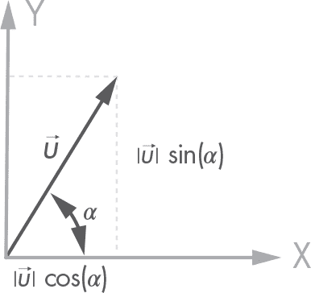

*图 4-11：向量投影*

假设我们有一个向量 ，其范数为 ∥∥，它的投影分别为 *u* 和 *v*。可以通过以下方式计算正弦和余弦：

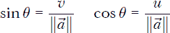

让我们将这些实现为向量类的属性。输入代码到 列表 4-22。

```py
class Vector:
    --snip--

    @property
    def sine(self):
        return self.v / self.norm

    @property
    def cosine(self):
        return self.u / self.norm
```

*列表 4-22：向量的方向正弦和余弦*

鉴于前面的表达式，实施起来是直接的。让我们通过添加最后的细节来完成我们的点类和向量类。

### **完成我们的类**

我们的点类和向量类看起来不错，但它们缺少一些小细节。如果我们比较它们的两个实例，Python 可能无法确定它们是否相等；我们稍后会解决这个问题。而且，正如你记得的，Python 会在控制台打印对象实例，附带类名和内存地址，但这对我们来说不太有用；我们也会在这里修复这个问题。

#### ***检查相等性***

尝试在 shell 中输入以下内容（不要忘记重新加载）。

```py
  >>> from geom2d.point import Point
  >>> p = Point(1, 0)
  >>> p == p
➊  True

  >>> q = Point(1, 0)
  >>> p == q
➋  False
```

我敢打赌 ➊ 并没有让你感到惊讶：一个 Point 与它自己是相等的。那么 ➋ 呢？你是不是皱了皱眉？我们在比较两个具有相同坐标的点，但 Python 说它们是不同的。难道 (1, 0) 不应该等于 (1, 0) 吗？它应该是相等的，但首先我们需要教 Python 如何比较两个给定的类实例。默认情况下，Python 认为两个类的实例相等，前提是它们实际上是同一个实例，也就是说，它们位于同一内存区域。为了更明确一些，请在控制台上写下这个：

```py
>>> p
<geom2d.point.Point object at 0x10baa3f60>

>>> q
<geom2d.point.Point object at 0x10c63b438>
```

Python 将实例 p 视为位于内存地址 0x10baa3f60 的实例，实例 q 位于 0x10c63b438。别忘了，你实例的内存地址与这些会有所不同。我们必须指示 Python 通过检查投影是否足够接近，来将我们的 Point 实例视为相同。你还记得 表 4-1 吗？通过实现一个名为 __eq__(self, other) 的方法，你实际上是在重载 == 运算符。让我们为 Point 和 Vector 类都实现这一点。

列表 4-23 包含了 Point 类的代码（别忘了导入 nums）。

```py
import math

from geom2d import nums

class Point:
   --snip--

   def __eq__(self, other):
      if self is other:
           return True

       if not isinstance(other, Point):
           return False

       return nums.are_close_enough(self.x, other.x) and \
              nums.are_close_enough(self.y, other.y)
```

*列表 4-23：Point 类相等性实现*

列表 4-24 包含了 Vector 类的代码。

```py
import math

from geom2d import nums

class Vector:
   --snip--

   def __eq__(self, other):
      if self is other:
           return True

       if not isinstance(other, Vector):
           return False

       return nums.are_close_enough(self.u, other.u) and \
              nums.are_close_enough(self.v, other.v)
```

*列表 4-24：实现向量相等性*

正如你所看到的，无论哪种情况，思路都是一样的：将坐标与另一个给定实例进行比较。但在此之前，我们要做两个重要的检查。第一个是检查我们是否在比较同一个实例与它自己，在这种情况下我们不需要进一步的比较，因此直接返回 True。第二个检查是检查 other 是否不是该类的实例。由于 Python 允许我们比较任何两个对象，我们可能会将一个 Vector 实例与一个字符串进行比较。例如，如果我们检测到这种比较来自不同类的实例，我们就返回 False，比较结束。你会在全书中看到这种比较模式，因为我们所有实现了 __eq__ 的类都会使用这种方法。

为了确保我们没有犯错，让我们重复实验一次。别忘了重新加载控制台以导入代码的最新版本，并输入以下代码：

```py
>>> from geom2d.point import Point
>>> p = Point(1, 0)
>>> p == p
True

>>> q = Point(1, 0)
>>> p == q
True
```

就这样！现在我们的 Point 和 Vector 类的比较终于按预期工作了。

#### ***字符串表示***

正如你在控制台中评估类实例时看到的，输出并不太有帮助：

```py
>>> from geom2d.vector import Vector
>>> v = Vector(2, 3)
>>> v
<geom2d.vector.Vector object at 0x10c63b438>
```

如果我们尝试使用 str 函数将实例转换为其字符串表示，我们会得到相同的结果：

```py
>>> str(p)
'<geom2d.vector.Vector object at 0x10c63b438>'
```

当将 Vector 实例的字符串表示打印到控制台时，我们会发现如下内容更有用：

```py
>>> str(p)
'(2, 5) with norm 5.385164807134504'
```

该消息包含了坐标值和范数值的信息。Python 中的 str() 函数将类的实例转换为其字符串表示形式。此函数首先检查传入的参数是否实现了 __str__ 方法。如果实现了，它会调用该方法并返回结果。如果没有实现，它则直接返回默认的字符串表示形式，在我们的案例中就是那个没有用的内存位置。

让我们在我们的类中实现 __str__ 方法。进入 Point 类并输入 Listing 4-25。

```py
class Point:
   --snip--

   def __str__(self):
       return f'({self.x}, {self.y})'
```

*Listing 4-25: 为 Point 类重写字符串表示*

然后在 Vector 类中输入 Listing 4-26。

```py
class Vector:
   --snip--

   def __str__(self):
       return f'({self.u}, {self.v}) with norm {self.norm}'
```

*Listing 4-26: 为 Vector 类重写字符串表示*

我们使用 *f-strings*（f’’）将实例属性包含在字符串中。属性插入在大括号之间，Python 会调用它们的 __str__ 方法来获取它们的字符串表示并连接结果。例如，你可以将 f-string 看作是，

```py
f'({self.x}, {self.y})'
```

被 Python 翻译成类似这样的内容：

```py
"(" + str(self.x) + ", " + str(self.y) + ")"
```

现在，在我们的类的实例上使用 str() 时，会打印出更好的描述。让我们重新加载 Python shell 并再试一次：

```py
>>> from geom2d.vector import Vector
>>> v = Vector(2, 3)
>>> str(v)
'(2, 3) with norm 3.605551275463989'
```

好多了，不是吗？

#### ***向量工厂***

*工厂函数* 只是构建对象的一个函数。工厂函数是初始化需要一些计算的对象的好选择。初始化函数理想情况下应该仅设置类的属性，避免任何计算；为此我们将使用工厂函数。

工厂函数同样有助于提高代码的可读性。例如，如果你想从点 *P* 到另一个点 *Q* 创建一个向量，代码

```py
    make_vector_between(p, q)
```

比起这段代码，阅读起来好多了：

```py
    Vector(q.x - p.x, q.y - p.y)
```

不仅如此，后者很可能会被写多次，这应该告诉你，某个算法需要被抽象为一个独立的概念。在这个特殊的情况下，算法是用来在两个有序点之间创建向量的公式（见 Equation 4.12）。

**注意**

*缺少抽象是一个常见的问题。它发生在一个表示具体概念的算法没有被恰当地封装到其自己的函数或类中，并且没有一个描述性的名称。其主要风险在于，当抽象没有很好地封装时，我们的大脑理解代码的速度变慢，且相同的算法会被复制粘贴到多个地方，导致难以维护。*

在 *geom2d* 中创建一个新文件，命名为 *vectors*，并输入 Listing 4-27 中的代码。

```py
from geom2d.point import Point
from geom2d.vector import Vector

def make_vector_between(p: Point, q: Point):
    return q - p

def make_versor(u: float, v: float):
    return Vector(u, v).normalized()

def make_versor_between(p: Point, q: Point):
    return make_vector_between(p, q).normalized()
```

*Listing 4-27: 向量工厂函数*

这个文件定义了几个函数，它们的目的是创建向量。我们定义的第一个函数 make_vector_between，用于创建从点 p 到点 q 的向量。我们利用 Point 类的 __sub__ 实现来创建这两个点之间的向量。这是一种便捷的创建向量的方法，数学上如方程 4.12 所示。

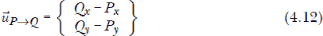

接下来，我们有一个名为 make_versor 的函数，它创建单位长度的*单位向量*。*单位向量*常用于表示方向或朝向，因此我们希望能有一个方便的方式来创建它们。请注意，单位向量通常在其上方有一个小帽符号，例如*û*，表示它们的长度是单位长度。

最后，我们有一个 make_versor_between 函数，用于创建两个点之间的单位向量，它会重用 make_vector_between 函数来返回标准化后的结果。得到的单位向量也可以通过方程 4.13 来计算。

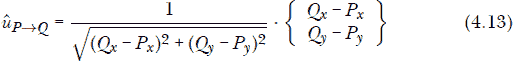

### **单元测试**

到目前为止，我们已经在 Point 和 Vector 类上实现了一些方法，并在控制台手动测试过其中的一些方法，但现在我们面临一些重大问题：我们如何说服别人相信我们的代码始终按预期工作？我们如何确保自己写的代码始终有效？我们如何确保在修改现有代码或添加新代码时不会破坏任何功能？

经常需要回到你很久以前写的一段代码中去修复一个 bug。当你想要修改这段代码时，问题就出现了，因为你不知道这个修改是否会破坏已经正常工作的部分。事实上，你可能根本不了解所有代码的功能是什么，因此你可能会不小心修改了不该修改的部分，从而破坏了其他功能。这种现象发生得非常频繁，以至于它有了自己的名字：*回归*。

在控制台手动测试代码既累人又无聊，这样做你很可能测试不到所有需要测试的内容。而且，它不是一个可重复的过程：你会忘记已经执行了哪些测试，或者如果其他人需要运行这些测试，他们得弄清楚应该测试什么，怎么测试。但是，我们真的需要确保我们的修改不会破坏任何东西。如果代码不能按预期工作，那它就完全没有用处。

让我们的生活变得更加轻松的是一种我们可以执行的自动化测试，它只需要几毫秒就能运行，并输出明确的结果，指出是否发生了错误，发生在哪里，为什么会出错。这就是*单元测试*的基本思想，它是任何一位认真开发者必不可少的活动。在没有伴随良好的单元测试来证明代码质量之前，代码不能算完成。我认为这部分开发工作至关重要，所以我想在书中早期就介绍它，并广泛使用它。为我们的代码编写自动化的单元测试是一个简单的过程，实际上没有任何理由不这么做。

为你的代码创建单元测试很简单：创建一个新文件，并在其中添加一个新类，类中包含测试目标小部分的方法。每个测试用例都有一个 *断言* 函数，用来确保在给定一组输入的情况下得到特定的结果。当断言成功时，测试被视为通过；否则，测试失败。当执行测试类时（如我们接下来所见），方法会被执行，且其断言会被检查。

如果这还不太清楚，别担心；我们将在本书中大量使用单元测试，你将能完全理解它。

#### ***测试距离***

我们为 Point 编写的第一个方法是 distance_to，所以让我们从这里开始我们的单元测试之旅。在 *geom2d* 包中，创建一个名为 *point_test.py* 的新文件。你的项目结构应该如下所示：

力学

|- geom2d

|    |- __init__.py

|    |- nums.py

|    |- point.py

|    |- point_test.py

|    |- vector.py

|    |- vectors.py

在 *point_test.py* 中，输入来自 清单 4-28 的代码。

```py
  import unittest

  from geom2d.point import Point

➊ class TestPoint(unittest.TestCase):

   ➋ def test_distance_to(self):
          p = Point(1, 2)
          q = Point(4, 6)
          expected = 5
          actual = p.distance_to(q)

       ➌ self.assertAlmostEqual(expected, actual)
```

*清单 4-28：点之间的距离测试*

我们首先导入 Python 附带的 *unittest* 模块。这个模块为我们提供了编写和执行单元测试所需的大部分基础设施。导入 Point 类后，我们定义了 TestPoint 类，它继承自 unittest.TestCase ➊。TestCase 类定义了一套很好的断言方法，继承它后，我们可以在类中使用这些方法。

接下来是 test_distance_to 方法 ➋。方法名必须以 *test_* 开头，这一点非常重要，因为这就是类用来发现哪些方法是需要执行的测试的方法。你可以在类中定义其他方法，但只要它们的名称没有以 *test* 开头，它们就不会作为测试被执行。在测试中，我们创建了两个已知相距 5 个单位的点，并断言它们的距离 p.distance_to(q) 接近这个值。

**注意**

*unittest* 模块的命名可能会让人困惑。即使测试本身实际上是类中的方法，*UnitTest* 这个名字仍然被用于类。我们扩展 *UnitTest* 类，只是为了将相关的测试用例分组。

断言方法 assertAlmostEqual ➌（定义在我们继承的类中：unittest.TestCase）用于检查浮动小数的相等性，允许给定的容忍度，该容忍度以比较的小数位数表示。默认检查的小数位数为 7，在本次测试中，我们将遵循默认值（因为没有提供其他值）。记住，当进行浮动小数比较时，必须使用容忍度，或者在此情况下，使用给定的小数位数（见第 4 页的“比较数字”）。

有几种方法可以运行测试。让我们探索如何从 PyCharm 和控制台运行测试。

##### **从 PyCharm 运行测试**

如果你查看 PyCharm 中的测试文件，你会看到类和方法定义左边有一个绿色的播放按钮。类按钮会执行其中的所有测试（到目前为止我们只有一个），而方法旁边的按钮只会运行那个测试。点击类按钮；从菜单中选择**运行‘Unittest for point’**。运行窗格会出现在 IDE 的下部，执行测试的结果会显示出来。如果你做对了，你应该看到以下内容：

```py
--snip--

Ran 1 test in 0.001s

OK

Process finished with exit code 0
```

现在让我们学习如何从控制台运行相同的测试。

##### **从控制台运行测试**

除 PyCharm 外，其他 IDE 可能有自己运行测试的方式。但无论你使用什么 IDE，你总是可以从控制台运行测试。打开控制台或命令行，确保你在*Mechanics*项目目录中。然后运行以下命令：

```py
$ python3 -m unittest geom2d/point_test.py
```

你应该看到以下结果：

```py
Ran 1 tests in 0.000s

OK
```

我们将通过本书的 IDE 运行大部分测试，但如果你更喜欢，也可以从控制台运行它们。

##### **断言错误**

让我们看看如果断言检测到错误结果会发生什么。在*point_test.py*文件中，改变距离的预期值：

```py
expected = 567
```

这个断言期望点（1, 2）和（4, 6）之间相距 567 单位，这完全是错误的。现在通过点击类旁边的绿色播放按钮再次执行测试。你应该看到以下结果：

```py
Ran 1 test in 0.006s

FAILED (failures=1)

Failure
Traceback (most recent call last):
  --snip--
  File ".../geom2d/tests/point_test.py", line 14, in test_distance_to
    self.assertAlmostEqual(expected, actual)
  --snip--

AssertionError: 567 != 5.0 within 7 places (562.0 difference)
```

最有价值的信息出现在最后一条消息中。它告诉我们发生了断言错误；也就是说，当它发现 5.0 而预期是 567 时，断言失败了。它在比较中使用了 7 位小数，仍然发现了 562 的差异。

在这个断言错误之前是*回溯*，即 Python 执行路径，直到发生错误。如消息所示，离失败越近的调用出现在列表的最后。正如你所看到的，测试执行在文件*point_test.py*中失败（这不奇怪），发生在第 14 行（你可能会看到不同的行号），在名为 test_distance_to 的测试中。这个信息在你修改现有代码并运行测试时将非常宝贵，因为它能告诉你到底是哪里出错了。这些测试失败信息会提供非常精确的细节。

别忘了把我们的单元测试恢复到最初的样子，并确保它仍然能成功运行。

#### ***测试向量的加法和减法操作***

为了确保+和-操作对于向量正常工作（对于 Point 类的测试留作练习），我们使用以下测试用例：

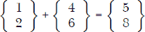

和

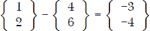

在*geom2d*包中创建一个新文件，用于测试 Vector 类。命名为*vector_test*并输入清单 4-29 中的代码。

```py
import unittest

from geom2d.vector import Vector

class TestVector(unittest.TestCase):
    u = Vector(1, 2)
    v = Vector(4, 6)

    def test_plus(self):
        expected = Vector(5, 8)
        actual = self.u + self.v
        self.assertEqual(expected, actual)

    def test_minus(self):
        expected = Vector(-3, -4)
        actual = self.u - self.v
        self.assertEqual(expected, actual)
```

*清单 4-29：加法和减法操作的测试*

使用类定义左侧的绿色播放按钮运行所有测试。如果你一切正确，两个新的测试应该会成功。太好了！我们的操作已经正确实现。好的一点是，如果实现中有 bug，这些测试会指出问题出现的地方和原因。

值得注意的是，这一次我们使用了断言方法 assertEqual，它在底层使用==操作符比较两个参数。如果我们没有在 Vector 类中重载该操作符，即使结果正确，测试也会失败。试试看：注释掉 Vector 类中的 __eq__(self, other)方法定义（通过在行首加上#字符），然后重新运行测试。

你会看到最后两个测试失败，错误信息可能类似如下：

```py
<geom2d.vector.Vector object at 0x10fd8d198> !=
<geom2d.vector.Vector object at 0x10fd8d240>

Expected :<geom2d.vector.Vector object at 0x10fd8d240>
Actual   :<geom2d.vector.Vector object at 0x10fd8d198>
```

熟悉吗？那是 Python 假设来自类的两个对象只有在它们是同一个实际对象并且在同一内存位置时才会相等。我们的 __eq__ 操作符重载向 Python 解释了何时两个对象应该被视为相同。不要忘记取消注释该方法。

#### ***测试向量积操作***

让我们为点积和叉积添加两个新的测试用例，使用测试类中定义的相同两个向量：

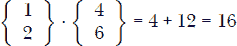

和

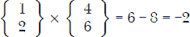

在代码中，这看起来像列表 4-30。

```py
import unittest

from geom2d.vector import Vector

class TestVector(unittest.TestCase):

    --snip--

    def test_dot_product(self):
        expected = 16
        actual = self.u.dot(self.v)
        self.assertAlmostEqual(expected, actual)

    def test_cross_product(self):
        expected = -2
        actual = self.u.cross(self.v)
        self.assertAlmostEqual(expected, actual)
```

*列表 4-30：测试向量的点积和叉积*

运行所有测试用例，确保新测试也通过。注意，由于我们再次在比较数字，我们使用断言方法 assertAlmostEqual。

#### ***测试向量平行性和垂直性***

接下来我们将测试 is_parallel_to 和 is_perpendicular_to 方法。由于我们在检查布尔表达式，我们希望有两个测试，一个检查两个向量是否平行（正向测试），一个检查它们是否不平行（反向测试）。对于正向测试，我们将依赖于一个事实：一个向量总是平行于它自身。将列表 4-31 中的代码输入到 TestVector 中。

```py
import unittest

from geom2d.vector import Vector

class TestVector(unittest.TestCase):

    --snip--

    def test_are_parallel(self):
        self.assertTrue(self.u.is_parallel_to(self.u))

    def test_are_not_parallel(self):
        self.assertFalse(self.u.is_parallel_to(self.v))
```

*列表 4-31：测试向量平行性*

在这个列表中有两个新的断言方法，比较有趣：assertTrue，用来检查给定的表达式是否求值为 True；assertFalse，用来检查给定的表达式是否求值为 False。

我们将遵循相同的模式来检查垂直性。在最后两个测试后，将这两个测试输入到列表 4-32 中。

```py
import unittest

from geom2d.vector import Vector

class TestVector(unittest.TestCase):

    --snip--

    def test_are_perpendicular(self):
        perp = Vector(-2, 1)
        self.assertTrue(self.u.is_perpendicular_to(perp))

    def test_are_not_perpendicular(self):
        self.assertFalse(self.u.is_perpendicular_to(self.v))
```

*列表 4-32：测试向量垂直性*

运行 TestVector 类中的所有测试，确保它们成功。恭喜你！你已经编写了你的第一个单元测试。这些测试将确保我们的几何类中的方法按预期工作。此外，如果你找到了更好的实现方式来优化我们覆盖测试的某个方法，只需运行该方法的测试，确保它仍然按预期工作。测试还有助于文档化你代码的预期行为。如果你在某个时刻需要提醒自己，了解你编写的代码在特定情况下应该做什么，单元测试应该能够帮到你。

编写好的测试并不是一件简单的事情。通过写很多测试才能变得熟练，但我们可以遵循一些准则，帮助我们写出更好的测试。让我们来看一下三条简单的规则，它们能让我们的测试更加坚韧。

#### ***单元测试的三条黄金法则***

我们已经覆盖了点（Point）和向量（Vector）类的一小部分方法的测试。现在，你已经掌握了所需的知识，试着测试我们在点（Point）和向量（Vector）类中编写的所有方法。我会把这个任务留给你作为练习，但如果你需要帮助，可以查看书中提供的代码：它包含了大量的单元测试。寻找我们没有测试的方法，并编写你认为需要的测试，确保它们能正常工作。我鼓励你尝试，但如果你仍然觉得单元测试对你来说很陌生，别担心，我们会在本书的其他章节中编写单元测试。

正如前面提到的，我相信编写单元测试是编程的重要组成部分，对于没有覆盖单元测试的软件，应该被视为不好的实践。此外，为开源社区编写代码时，需要良好的单元测试。你必须给社区一个理由，让他们相信你做的事情真的有效。通过自动化测试来证明这一点，总是一个不错的方法，因为几乎不可能有人会花时间考虑如何测试你的代码，然后打开控制台手动逐一尝试。

随着实践的积累，你会在编写可靠的单元测试方面变得越来越好。现在，我想给你一些基本规则，帮助你入门。不要期望现在就能完全理解它们的含义，但随着你阅读书中的内容，可以时不时回过头来看看这一节。

##### **规则 1：一个失败的原因**

单元测试应该只有一个失败的原因。这听起来很简单，但在很多情况下，*测试对象*（你正在测试的内容）是复杂的，由多个组件协同工作。

如果测试失败的原因只有一个，那么找到代码中的 bug 就非常简单。想象一下相反的情况：一个测试可能会因为五个不同的原因而失败。当这个测试失败时，你会发现自己花费太多时间在阅读错误信息和调试代码上，试图理解这次失败的具体原因。

一些开发者和测试专家（测试本身就是一个职业，我曾从事这个工作多年）认为每个测试应该只有一个断言。从实用主义的角度来看，有时多个断言并不会造成太大危害，但如果只用一个，那会更好。

让我们分析一个特定的案例。以我们为检查两个向量是否垂直而编写的测试为例。如果不是

```py
def test_are_perpendicular(self):
    perp = Vector(-2, 1)
    self.assertTrue(self.u.is_perpendicular_to(perp))
```

我们已经编写了

```py
def test_are_perpendicular(self):
    perp = u.perpendicular()
    self.assertTrue(self.u.is_perpendicular_to(perp))
```

那么，测试可能会因为`is_perpendicular_to`方法中的错误，或因为我们用来计算垂直向量的`perpendicular`实现有问题而失败，查看这之间的区别吗？

##### **规则 2：受控环境**

我们使用*fixture*这个词来指代测试运行的环境。环境包括围绕测试的所有数据和测试对象本身的状态，所有这些都可能改变测试的结果。这个规则规定你应该完全控制你的测试运行的环境。测试的输入和预期输出应该始终预先知道。测试中发生的一切都应该是*可确定的*；也就是说，不应有任何随机性或依赖于你无法控制的事物：例如日期、时间、操作系统、未由测试设置的机器环境变量等。

如果你的测试看起来随机失败，那么它们是没有用的，你应该将它们删除。人们很快就会习惯于随机失败的测试并开始忽视它们。问题在于，当他们也忽视因为代码中的漏洞而失败的测试时，问题就会出现。

##### **规则 3：测试独立性**

测试不应依赖于其他测试。每个测试应独立运行，绝不依赖于其他测试所设置的环境。

这样做至少有三个原因。首先，你希望独立运行或调试测试。其次，许多测试框架不保证测试执行的顺序。最后，阅读和理解不依赖其他测试环境的测试要简单得多。

让我们通过清单 4-33 中的`TestSwitch`类来说明这一点。

```py
class TestSwitch(unittest.TestCase):

   switch = Switch()

   def test_switch_on(self):
    self.switch.on()
    self.assertTrue(self.switch.is_on())

   def test_switch_off(self):
    # Last test should have switched on
    self.switch.toggle()
    self.assertTrue(self.switch.is_off())
```

*清单 4-33：测试依赖于另一个测试*

看到`test_switch_off`是如何依赖于`test_switch_on`的吗？通过使用名为`toggle`的方法，如果测试顺序不同，而在这个测试执行时开关的状态是*关闭*，我们可能会得到错误的结果。

永远不要依赖测试执行顺序；那会导致问题。测试应该始终独立运行：无论执行顺序如何，它们的工作方式应该是相同的。

### **总结**

在本章中，我们创建了两个重要的类：Point 和 Vector。我们 *geom2d* 库的其余部分将建立在这些简单但强大的抽象概念之上。我们通过实现特殊方法 __eq__，教会了 Python 如何判断两个给定的 Point 或 Vector 实例是否在逻辑上相等，并通过 __str__ 提供了更好的文本表示。我们通过单元测试覆盖了这些类中的一些方法，并鼓励你自行扩展测试覆盖率。学习编写优秀单元测试的最佳方式是通过实践。在下一章中，我们将向 *geom2d* 中添加两个新的几何抽象：线和线段。这些提供了一个新的维度，可以用来构建更复杂的形状。
