## 第七章：多边形


我们的下一个原始元素，多边形，建立在点和线段的基础上。多边形可以用来描述碰撞的几何图形、需要重新绘制的屏幕部分、物体边界等等。事实证明，这些原始元素在图像处理时非常有用，因为你可以利用它们来判断图像的不同部分是否重叠。在动态仿真中，它们有助于确定两个物体何时碰撞。在图形密集型应用的用户界面中，你可以使用简单的多边形来轻松判断用户的鼠标是否悬停在可能被选中的实体上。

在本章中，我们将实现三种原始元素：通过顶点定义的通用多边形；通过中心点和半径定义的圆；以及通过原点、宽度和高度定义的矩形。由于在某些应用中仅使用通用多边形可能更为方便，因此圆和矩形都会实现一个方法，将它们转换为通用多边形。我们还将编写一些其他算法，包括一个判断多边形是否与另一个同类多边形重叠的算法，以及一个测试多边形是否包含给定点的算法。

### **Polygon 类**

*多边形*是一个二维图形，通过至少三个有序且不重合的顶点定义，这些顶点连接形成一个闭合的*多边形链条*。每个连接都是一个线段，从一个顶点到下一个顶点，其中最后一个顶点连接回第一个顶点。给定顶点[*V*[1], *V*[2], …, *V*[*n*]]，每个线段定义为[(*V*[1] → *V*[2]),(*V*[2] → *V*[3]), …, (*V*[*n*] → *V*[1])]，被称为*边*（参见 Figure 6-1）。

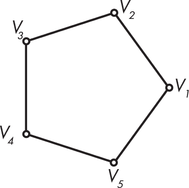

*Figure 6-1: 通过顶点定义的多边形*

此时，你的*geom2d*包应该是这样的：

力学

|- geom2d

|    |- __init__.py

|    |- line.py

|    |- line_test.py

|    |- nums.py

|    |- point.py

|    |- point_test.py

|    |- segment.py

|    |- segment_test.py

|    |- vector.py

|    |- vector_test.py

|    |- vectors.py

创建一个类来表示通过顶点定义的多边形，顶点作为一系列点（Point 类的实例）。在*geom2d*包内创建一个新文件，命名为*polygon.py*，并输入 Listing 6-1 中的代码。

```py
from geom2d.point import Point

class Polygon:
    def __init__(self, vertices: [Point]):
        if len(vertices) < 3:
            raise ValueError('Need 3 or more vertices')

        self.vertices = vertices
```

*Listing 6-1: 多边形初始化*

首先我们从 geom2d.point 导入 Point 类。然后我们定义 Polygon 类，创建一个初始化函数，接受一个按多边形链条顺序排列的点的序列；相连的顶点应在序列中相邻。如果列表包含少于三个点，我们将抛出一个 ValueError 类型的异常。还记得快速失败策略吗？我们希望在检测到任何不合逻辑并可能引发问题的情况时尽早失败，例如一个包含少于三个顶点的多边形。

**注意**

*根据 Python 的文档，当“操作或函数接收到一个类型正确但值不合适的参数，并且该情况没有更精确的异常描述”时，应该引发 ValueError*。

#### ***边***

一个*边*是指在多边形的顶点序列中，从一个顶点到下一个顶点的线段。多边形的边一起构成了它的*周长*。为了闭合多边形链条，最后一个顶点需要与第一个顶点相连。因此，生成多边形的边需要配对顶点序列。这听起来像是一个通用操作，我们可以将其应用于任何对象序列，而不仅仅是顶点，因此我们希望将其实现为一个独立的模块。

在接下来的章节中，你需要对 Python 的列表推导式有较好的理解。你可以参考第 35 页的“列表推导式”部分以复习相关知识。

##### **配对顶点**

给定一个项目列表（无论是什么类型），

[A, B, C]

配对算法应该创建一个新的列表，其中每个元素是原始位置的项与下一个项的元组，包括将最后一个元素与第一个元素配对，如下所示：

[(A, B), (B, C), (C, A)]

让我们在 Python 项目中新建一个包来编写这段代码。在*geom2d*同级目录下创建一个新包，命名为*utils*。在这个包中，我们将保存一些可能会被项目其他模块复用的小型通用逻辑。你的项目文件夹结构应该如下所示：

机械学

|- geom2d

|    |- __init__.py

|    |- line.py

|    | ...

|- utils

|    |- __init__.py

许多软件项目最终都会有一个*utils*包或模块，里面聚集了各种不相关的算法。虽然这种做法很方便，但最终会导致项目维护困难，且难以持续发展。*utils*包是为那些没有足够大到可以单独成为一个包，但仍然被项目内多个部分复用的代码块所设计的。当*utils*中的相关代码开始增多时，最好将其迁移到专门的包中。例如，如果我们的配对逻辑开始变得更加复杂，涉及到各种不同的情况和集合类型，我们可以将其移动到一个名为*pairs*的新包中。但目前情况并非如此，因此我们将保持简单。

在该包中创建一个新文件，命名为*pairs.py*，并在其中包含列出 6-2 中的函数。

```py
def make_round_pairs(sequence):
    length = len(sequence)
    return [
     ➊ (sequence[i], sequence[(i + 1) % length])
     ➋ for i in range(length)
    ]
```

*列出 6-2：配对列表元素*

该函数使用*列表推导式*从一个值的范围内创建一个新列表，起始值为 0，直到长度➋。对于每个值，它会创建一个包含两个元素➊的元组：原始列表中索引为 i 的元素和索引为 i + 1 的下一个元素。当我们达到索引 i = length 时，i + 1 在序列中会越界，所以我们希望通过模运算符将其包裹回到索引 0，以便最后一个元素和第一个元素也能配对。我们使用模运算符（%）来实现这一点，它返回将一个数字除以另一个数字的余数。巧妙之处在于，*n* % *m*对于每个*n* < *m*都会返回*n*，并且当*n* = *m*时返回 0。

为了更好地理解模运算，请在终端中尝试以下操作：

```py
>>> [n % 4 for n in range(5)]
[0, 1, 2, 3, 0]
```

看看当*n* = 4 时结果是 0，而对于其他所有值，结果是*n*本身？尝试增加范围参数：

```py
>>> [n % 4 for n in range(7)]
[0, 1, 2, 3, 0, 1, 2]
```

在模 4 运算中，数字永远不会超过 3。一旦达到这个数字，下一个数字就会重新回到 0。

**注意**

*如果你想了解更多关于这种“包裹”现象的知识，请搜索*模算术*。它在现代密码学中被广泛应用，并且具有一些非常有趣的属性。*

我们现在准备实现一个方法，用于生成我们的 Polygon 类的边。

##### **生成边**

一旦顶点正确配对，编写生成边的代码就变得简单：我们只需要为每对顶点创建一个 Segment 实例。为了计算它们，首先在你的文件*polygon.py*中添加以下导入：

```py
from geom2d.segment import Segment
from utils.pairs import make_round_pairs
```

然后，输入列表 6-3 中的方法。

```py
from geom2d.point import Point
from geom2d.segment import Segment
from utils.pairs import make_round_pairs

class Polygon:
    --snip--

    def sides(self):
        vertex_pairs = make_round_pairs(self.vertices)
        return [
            Segment(pair[0], pair[1])
            for pair in vertex_pairs
        ]
```

*列表 6-3：计算多边形的边*

使用 make_round_pairs 函数，我们将顶点配对，使得每个顶点对元组都包含一条线段的起始和结束点。然后，使用列表推导式，将这些元组映射为线段。

##### **测试边**

让我们为边属性创建一个单元测试。创建一个新的文件*polygon_test.py*，并将其放在*geom2d*包中，然后输入 TestPolygon 类的代码（见列表 6-4）。

```py
import unittest

from geom2d.point import Point
from geom2d.polygon import Polygon
from geom2d.segment import Segment

class TestPolygon(unittest.TestCase):
    vertices = [
        Point(0, 0),
        Point(30, 0),
        Point(0, 30),
    ]
    polygon = Polygon(vertices)

    def test_sides(self):
        expected = [
            Segment(self.vertices[0], self.vertices[1]),
            Segment(self.vertices[1], self.vertices[2]),
            Segment(self.vertices[2], self.vertices[0])
        ]
        actual = self.polygon.sides()
        self.assertEqual(expected, actual)
```

*列表 6-4：测试多边形的边*

在测试类中，我们创建了一个顶点列表——(0, 0)、(30, 0)和(0, 30)——它们构成了一个三角形。我们使用这些点作为测试对象 polygon 的顶点。图 6-2 展示了该多边形。为了确保边正确计算，我们使用原始顶点按正确顺序配对来构建预期边的列表。

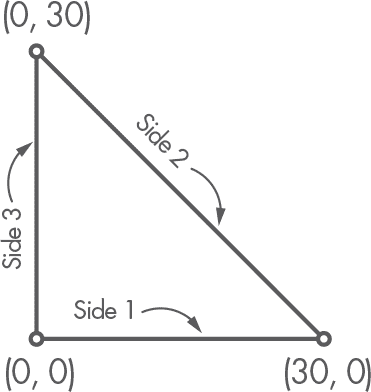

*图 6-2：测试中使用的多边形*

由于我们在 Segment 类中重载了*==*运算符（通过实现特殊方法 __eq__），所以相等比较会按预期工作。如果我们没有这么做，即使是由相同的端点界定的线段，相等断言也会认为它们不同，从而导致测试失败。

使用以下命令运行测试，确保它成功。

```py
$ python3 -m unittest geom2d/polygon_test.py
```

如果一切顺利，你应该会看到以下输出：

```py
Ran 1 tests in 0.000s

OK
```

#### ***质心***

多边形中的一个重要点是它的*质心*，即所有顶点位置的算术平均值。假设 *n* 是顶点的数量，*质心* 可以使用方程 6.1 来表示。

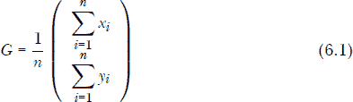

这里，*x*[*i*] 和 *y*[*i*] 是顶点 *i* 的坐标。

##### **实现质心**

让我们实现质心属性。为此，我们首先需要在多边形类的顶部导入以下内容：

```py
import operator
from functools import reduce
```

导入后，将列表 6-5 中的代码添加到 `sides` 方法下方。

```py
import operator
from functools import reduce

from geom2d.point import Point
from geom2d.segment import Segment
from utils.pairs import make_round_pairs

class Polygon:
    --snip--

    @property
    def centroid(self):
     ➊ vtx_count = len(self.vertices)
     ➋ vtx_sum = reduce(operator.add, self.vertices)
     ➌ return Point(
           vtx_sum.x / vtx_count,
           vtx_sum.y / vtx_count
       )
```

*列表 6-5：计算多边形的质心*

我们首先将顶点列表的长度存储在变量 `vtx_count` 中 ➊。然后，我们通过将它们相加来归约顶点列表，得到一个称为 `vtx_sum` 的结果点 ➋。你可能想阅读第 29 页中的《过滤、映射和归约》部分，以回顾 `reduce` 函数以及我们如何使用操作符。请注意，`operator.add` 操作符可以在 `reduce` 函数中使用，因为我们的 Point 类重载了 `+` 操作符。

我们最后做的事是通过将 `vtx_sum` 的每个投影除以 `vtx_count` 来构造结果点 ➌。

##### **测试质心**

让我们编写一个单元测试，确保质心被正确计算。在你的文件 *polygon_test.py* 中，输入列表 6-6 中的代码。

```py
class TestPolygon(unittest.TestCase):
   --snip--

   def test_centroid(self):
       expected = Point(10, 10)
       actual = self.polygon.centroid
       self.assertEqual(expected, actual)
```

*列表 6-6：测试多边形的质心中心*

使用方程 6.1，我们可以手动计算质心，以查看 (10, 10) 中的投影是如何得到的。知道我们的测试多边形的顶点是 (0, 0)，(30, 0) 和 (0, 30)，我们得到：

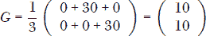

你可以在图 6-3 中直观地查看这个内容。

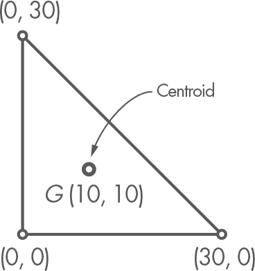

*图 6-3：测试多边形的质心*

运行文件 *polygon_test.py* 中的所有测试，确保一切按预期工作。你可以在终端中使用以下命令来运行它们：

```py
$ python3 -m unittest geom2d/polygon_test.py
```

如果两个测试都通过，你应该会看到以下输出：

```py
Ran 2 tests in 0.000s

OK
```

在继续之前，让我们先做一件事。记住，为了计算质心，我们将顶点列表简化成如下形式，

```py
vtx_sum = reduce(operator.add, self.vertices)
```

我们之前说过，使用 `operator.add` 进行的这种归约工作是因为我们的 Point 类重载了 `+` 操作符？让我们看看如果没有重载这个操作符会发生什么。打开 *point.py*，并注释掉 `__add__` 方法：

```py
class Point:
    --snip--

    # def __add__(self, other):
    #     return Point(
    #         self.x + other.x,
    #         self.y + other.y
    #     )
```

再次运行测试。这一次你会在终端看到一个错误：

```py
======================================================
ERROR: test_centroid (geom2d.polygon_test.TestPolygon)
------------------------------------------------------
Traceback (most recent call last):
  --snip--
    vtx_sum = reduce(operator.add, self.vertices)
TypeError: unsupported operand type(s) for +: 'Point' and 'Point'

-------------------------------------------------------
Ran 2 tests in 0.020s
```

这个带有消息（不支持的操作数类型...）的 `TypeError` 对错误描述非常清楚。如果两个 Point 实例没有实现 `__add__` 方法，它们不能相加。取消注释我们为实验注释掉的 `__add__` 方法，然后重新运行测试，确保一切恢复如初。

#### ***包含 Point***

现在出现了一个有趣的问题：我们如何确定一个给定的点是否在多边形内部？一种广泛使用的程序是 *射线投射算法*，它计算从点出发的射线在任何方向上与多边形的几条边交叉的次数。交点数为偶数（包括零）意味着点在多边形外部，而交点数为奇数则意味着点在内部。看看 图 6-4。

左侧的图展示了一个复杂的多边形和位于外部的点 *P*。从该点发出的每条射线在任何方向上都与零条或偶数条边相交。右侧的案例展示了点 *P* 在多边形内部。这时，射线始终与奇数条边相交。

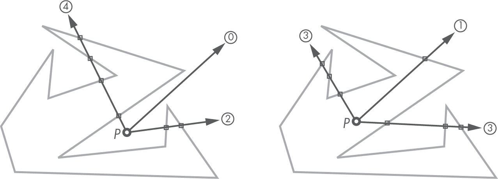

*图 6-4：射线投射算法*

另一个常用的算法，也是我们将使用的算法，是 *绕数算法*。这个算法通过对从待测点到多边形顶点的向量之间的角度求和来工作。它的工作方式是这样的：要知道一个点 *P* 是否在具有顶点 *V*[1]、*V*[2]、…、*V*[*n*] 的多边形内部，我们的算法如下：

1.  创建一个从 *P* 到每个顶点的向量：

    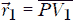：从 *P* 到顶点 *V*[1] 的向量

    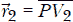：从 *P* 到顶点 *V*[2] 的向量

    . . .

    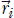：从 *P* 到顶点 *V*[*n*] 的向量

1.  计算每个向量 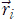 到下一个向量 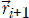 的角度，绕回并计算最后一个向量与第一个向量之间的角度：

    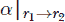：从 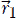 到 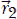 的角度

    ：从  到 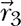 的角度

    . . .

    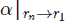：从 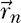 到  的角度

1.  将在前一步计算的所有角度相加。

1.  如果角度为 2*π*，则点 *P* 在多边形内部；如果为 0，则在外部。

查看 图 6-5，更好地理解这个算法是如何工作的。当点在多边形内部时，可以很容易看出角度之和是 2*π*。

尽管我们也可以实现 *射线投射算法*，但我选择了 *绕数算法*，因为它很好地利用了我们在本书中创建的三个关键函数：make_vector_between 工厂函数、make_round_pairs 和 Vector 类中的 angle_to 方法。让我们来实现它。


*图 6-5：测试一个多边形是否包含一个点*

##### **实现绕数算法**

我们需要导入几个模块。你在文件顶部导入的内容应该像这样：*polygon.py*：

```py
import math
import operator
from functools import reduce

from geom2d.nums import are_close_enough
from geom2d.point import Point
from geom2d.vectors import make_vector_between
from geom2d.segment import Segment
from utils.pairs import make_round_pairs
```

一旦你导入了所有内容，输入代码 列表 6-7，作为 Polygon 类的一个新方法。

```py
import math
import operator
from functools import reduce

from geom2d.nums import are_close_enough
from geom2d.point import Point
from geom2d.vectors import make_vector_between
from geom2d.segment import Segment
from utils.pairs import make_round_pairs

class Polygon:
    --snip--

   def contains_point(self, point: Point):
    ➊ vecs = [make_vector_between(point, vertex)
                for vertex in self.vertices]
    ➋ paired_vecs = make_round_pairs(vecs)
    ➌ angle_sum = reduce(
           operator.add,
        ➍ [v1.angle_to(v2) for v1, v2 in paired_vecs]
       )

    ➎ return are_close_enough(angle_sum, 2 * math.pi)
```

*列表 6-7：Polygon contains_point 算法*

我们首先通过列表推导式计算出向量列表 ➊，它将多边形的每个顶点映射为一个从点到顶点的向量。然后，使用 make_round_pairs，我们将向量配对并将结果存储在 paired_vecs ➋ 中。

我们使用另一个列表推导式将成对的向量映射到它们所形成的角度 ➍。然后我们通过将计算出的每个角度 ➌ 相加来简化结果列表，最后我们检查计算出的角度总和（angle_sum）是否足够接近 2*π* ➎，如果是，则该点在多边形内。我们认为角度的其他任何值都表示该点在多边形外。

##### **测试 contains_point**

让我们通过在文件 *polygon_test.py* 中添加两个单元测试来确保这个算法能正常工作（见 列表 6-8）。

```py
class TestPolygon(unittest.TestCase):
   --snip--

   def test_doesnt_contain_point(self):
       point = Point(15, 20)
       self.assertFalse(self.polygon.contains_point(point))

   def test_contains_point(self):
       point = Point(15, 10)
       self.assertTrue(self.polygon.contains_point(point))
```

*列表 6-8：测试多边形是否包含某点*

你可以通过 IDE 中的绿色播放按钮或从终端运行测试：

```py
$ python3 -m unittest geom2d/polygon_test.py
```

在第一个测试中，我们选择一个已知在三角形外的点，并验证它实际上在外面。第二个测试验证点 (15, 10) 在三角形内。

##### **测试边缘情况**

让我们再试一个测试，看看会发生什么。那多边形的顶点呢？它们被认为在多边形内还是外？这是我们所说的 *边缘情况*，这种情况需要在代码中进行特殊处理。

输入看似无害的测试代码 列表 6-9，并运行文件 *rect_test.py* 中的所有测试。

```py
class TestPolygon(unittest.TestCase):
   --snip--

   def test_contains_vertex(self):
       self.assertTrue(
           self.polygon.contains_point(self.vertices[0])
       )
```

*列表 6-9：测试多边形是否包含其一个顶点*

运行测试后的输出如下：

```py
Error
Traceback (most recent call last):
  --snip--
  File ".../geom2d/polygon.py", line 36, in <listcomp>
    [v1.angle_to(v2) for v1, v2 in paired_vecs]
  File ".../geom2d/vector.py", line 69, in angle_to
    value = self.angle_value_to(other)
  File ".../geom2d/vector.py", line 66, in angle_value_to
    return math.acos(dot_product / norm_product)
ZeroDivisionError: float division by zero
```

哎呀！我们肯定做错了什么。你能通过阅读堆栈跟踪猜出是什么吗？从最后一行开始，我们找到了源头：ZeroDivisionError。显然我们在 angle_value_to 方法中尝试了除以零。具体来说，我们在这一行做了除法：

```py
return math.acos(dot_product / norm_product)
```

这意味着 norm_product 为零；因此，用来计算角度的至少一个向量的模长为 0。往上查看堆栈跟踪，我们找到了出错前使用角度方法的代码行：

```py
[v1.angle_to(v2) for v1, v2 in paired_vecs]
```

所以，看来当我们尝试计算两个向量之间的角度时，其中一个向量的长度为 0。这个从点 *P*（这次是多边形的一个顶点）到它自身的向量显然是一个零向量。

为了处理这个特殊的边缘情况，我们可以将顶点视为在多边形内作为一种约定。在 contains_point 方法的开始部分，我们检查传入的点是否为多边形的一个顶点，如果是，则直接返回 True。修改该方法以适应这个新条件（见 列表 6-10）。

```py
class Polygon:
    --snip--

    def contains_point(self, point: Point):
        if point in self.vertices:
            return True

        vecs = [make_vector_between(point, vertex)
                for vertex in self.vertices]
        paired_vecs = make_round_pairs(vecs)
        angle_sum = reduce(
            operator.add,
            [v1.angle_to(v2) for v1, v2 in paired_vecs]
        )

        return are_close_enough(angle_sum, 2 * math.pi)
```

*列表 6-10：修正后的算法，检查点是否在多边形内*

如你所见，处理边界情况需要一些个性化的代码块。现在，运行所有测试，确保它们都成功：

```py
$ python3 -m unittest geom2d/polygon_test.py
```

此次输出应如下所示：

```py
Ran 5 tests in 0.001s

OK
```

#### ***多边形工厂***

实际上，我们通常需要根据一个包含顶点坐标的数字列表来构建多边形。例如，在从文本文件读取多边形时我们就会用到这种方式，稍后我们将在第十二章看到。在做这件事之前，我们首先需要将这些数字配对，并将它们映射为 Point 类的实例。

例如，列表

```py
[0, 0, 50, 0, 0, 50]
```

可以用于定义一个三角形的三个顶点：

```py
[(0, 0), (50, 0), (0, 50)]
```

让我们实现一个工厂函数，根据一系列浮动点数来创建多边形。创建一个名为 *polygons.py* 的新文件。我们项目的结构目前如下所示：

机械学

|- geom2d

|    |- __init__.py

|    |- line.py

|    |- line_test.py

|    |- nums.py

|    |- point.py

|    |- point_test.py

|    |- polygon.py

|    |- polygon_test.py

|    |- polygons.py

|    |- segment.py

|    |- segment_test.py

|    |- vector.py

|    |- vector_test.py

|    |- vectors.py

|- utils

|    |- __init__.py

|    |- pairs.py

在新文件中，输入代码内容，见清单 6-11。

```py
from geom2d import Point, Polygon

def make_polygon_from_coords(coords: [float]):
    if len(coords) % 2 != 0:
        raise ValueError('Need an even number of coordinates')

    indices = range(0, len(coords), 2)
    return Polygon(
        [Point(coords[i], coords[i + 1]) for i in indices]
    )
```

*清单 6-11：多边形工厂函数*

函数 make_polygon_from_coords 接受一个坐标列表，并首先检查其是否包含偶数个坐标（否则无法配对）。如果坐标列表的长度除以 2 没有余数，我们就得到了偶数个坐标。

如果发现坐标的数量不均匀，我们将抛出一个 ValueError。如果数量均匀，我们接着构建一个包含索引的列表，在这些索引位置我们将在 coords 列表中找到顶点的 x 坐标。我们通过一个从 0 到 len(coords)（不包括上限）的步长为 2 的范围来实现这一点。

为了更好地理解我们是如何做到这一点的，请在 Python 的 shell 中尝试以下操作：

```py
>>> list(range(0, 10, 2))
[0, 2, 4, 6, 8]
```

使用这些索引，我们可以通过列表推导式轻松地获得顶点的列表。回想一下，Python 的 range 函数返回的是一个半开区间，不包含上限，这就是为什么我们在结果列表中没有得到数字 10 的原因。列表推导式将每个索引映射为一个 Point 类的实例。我们通过将这个列表传递给多边形的构造函数来创建多边形。正如你从代码中看到的，x 坐标是输入列表中每个索引 i 处的数字，而 y 坐标则是它右边的数字，也就是 i + 1。

处理完这些后，让我们看看如何比较多边形的相等性。

#### ***多边形相等性***

为了确保我们可以检查多边形是否相等，接下来在 Polygon 类中实现 __eq__ 方法（参见清单 6-12）。

```py
class Polygon:
    --snip--

    def __eq__(self, other):
        if self is other:
            return True

        if not isinstance(other, Polygon):
            return False

        return self.vertices == other.vertices
```

*清单 6-12：多边形相等性*

我们首先检查传入的 other 是否与 self 为同一个实例，如果是，返回 True。其次，如果 other 不是 Polygon 的实例，我们就没有太多可以比较的地方；我们已经知道它们不可能相等。

由于 Point 已经实现了 __eq__ 方法，我们只需要比较两个多边形的顶点列表，前提是之前的两个检查都没有返回结果。Python 将检查两个列表是否包含相同的顶点，并且顺序相同。列表是有序集合，因此在检查相等性时，顺序非常重要。尝试在 shell 中进行以下实验：

```py
>>> l1 = [1, 2, 3]
>>> l2 = [3, 2, 1]
>>> l3 = [3, 2, 1]
>>> l1 == l2
False

>>> l2 == l3
true
```

即使 l1 和 l2 包含相同的数字，Python 也认为它们是不同的，因为它们的顺序不同（别忘了，对于列表和元组，顺序很重要）。相反，l2 和 l3 的顺序相同，因此被认为是相等的。多边形由一组有序的顶点组成：相同顶点集的不同排列将导致不同的多边形。这就是为什么我们使用列表作为集合，因为在列表中顺序是关键因素。

如果你跟随操作，你的 *polygon.py* 文件应该像 列表 6-13 中那样。

```py
import math
import operator
from functools import reduce

from geom2d.nums import are_close_enough
from geom2d.point import Point
from geom2d.vectors import make_vector_between
from geom2d.segment import Segment
from utils.pairs import make_round_pairs

class Polygon:
    def __init__(self, vertices: [Point]):
        if len(vertices) < 3:
            raise ValueError('Need 3 or more vertices')
        self.vertices = vertices

    def sides(self):
        vertex_pairs = make_round_pairs(self.vertices)
        return [Segment(pair[0], pair[1]) for pair in vertex_pairs]

    @property
    def centroid(self):
        vtx_count = len(self.vertices)
        vtx_sum = reduce(operator.add, self.vertices)
        return Point(
            vtx_sum.x / vtx_count,
            vtx_sum.y / vtx_count
        )

    def contains_point(self, point: Point):
        if point in self.vertices:
            return True

        vecs = [make_vector_between(point, vertex)
                for vertex in self.vertices]
        paired_vecs = make_round_pairs(vecs)
        angle_sum = reduce(
            operator.add,
            [v1.angle_to(v2) for v1, v2 in paired_vecs]
        )

        return are_close_enough(angle_sum, 2 * math.pi)

    def __eq__(self, other):
        if self is other:
            return True

        if not isinstance(other, Polygon):
            return False

        return self.vertices == other.vertices
```

*列表 6-13：多边形类*

现在让我们来看一下圆形。

### **圆形类**

*圆形*是平面上距离一个固定点（称为 *中心*）给定距离（即 *半径*）的所有点的集合。因此，圆形由其中心 *C* 的位置和半径 *r* 的值定义（见 图 6-6）。


*图 6-6：一个由中心点 *C* 和半径 *r* 定义的圆形*

正如你可能还记得的那样，圆形的面积计算公式如下：

*A = π ⋅ r*²

一个圆的周长计算公式如下：

*l*[c] = 2π ⋅ *r*

在 *geom2d* 包中创建一个名为 *circle.py* 的新文件。在文件中输入 列表 6-14 中的代码。

```py
import math

from geom2d.point import Point

class Circle:
    def __init__(self, center: Point, radius: float):
        self.center = center
        self.radius = radius

    @property
    def area(self):
        return math.pi * self.radius ** 2

    @property
    def circumference(self):
        return 2 * math.pi * self.radius
```

*列表 6-14：圆形类初始化*

太好了！我们现在有了一个表示圆形的类，它具有中心和半径这两个属性。我们还定义了名为面积（area）和周长（circumference）的属性。

**注意**

*为了保持章节长度的合理性，我们将不再包括更多的单元测试部分。附带的代码确实包含了单元测试，我鼓励你自己动手编写它们。*

#### ***包含点***

测试一个点 *P* 是否在一个通用多边形内部需要一些步骤，但在圆形的情况下，逻辑非常简单。我们计算从中心 *C* 到点 *P* 的距离：*d*(*C,P*)。如果这个距离小于半径，即 *d*(*C,P*) < *r*，那么该点在圆内。如果 *d*(*C,P*) 大于 *r*，则该点距离中心比半径远，因此在圆外。进入 Circle 类，在 列表 6-15 中输入代码。

```py
class Circle:
   --snip--

   def contains_point(self, point: Point):
       return point.distance_to(self.center) < self.radius
```

*列表 6-15：检查一个圆形是否包含某个点*

你能想出一些测试用例来确保 `contains_point` 方法没有 bug 吗？

#### ***从圆形到多边形***

在第七章中，我们将通过旋转、缩放和倾斜来变换多边形的几何形状。经过这些变换后，圆形可能不再是圆形，结果的数学表示可能会变得复杂。

由于使用特定几何类来处理所有可能的形状会很繁琐，而我们的通用多边形无论形状如何都能正常工作，为什么不尝试用足够边数的多边形来逼近圆形呢？

要将圆形转换为多边形，需要选择一个划分数，比如 *n*。整个 2*π* 角度被划分为 *n* 个子角度 *θ* = 2*π*/*n*。从角度 0 开始，每次增加 *θ*，我们可以计算出 *n* 个圆周上的点，这些点将成为内接圆形的多边形的顶点。我们可以使用方程 6.2 计算给定角度 *α* 的顶点 *V*。

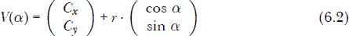

其中 *C* 是圆心，*r* 是半径。图 6-7 显示了选择 *n* = 8 的结果，这将圆形转换为一个八边形，顶点为 *V*[1]、*V*[2]、……、*V*[8]。

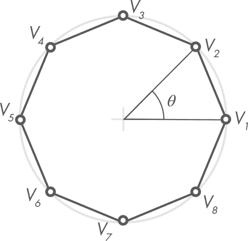

*图 6-7：将圆形转换为多边形*

还要注意，当 *n* 的值较小时，所得的多边形与圆形的近似效果较差。例如，在图 6-8 中，*n* 分别选择为 3、4 和 5。正如你所看到的，内接多边形看起来只和它们所近似的圆形相似。通常我们会选择 *n* 的值在 30 到 200 之间，以得到一个可接受的结果。

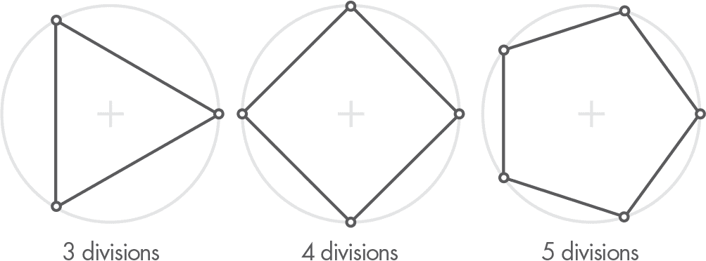

*图 6-8：将圆形转换为多边形时的划分数*

在 Circle 类中实现 to_polygon 方法，参考清单 6-16。

```py
import math

from geom2d.point import Point
from geom2d.polygon import Polygon

class Circle:
   --snip--

   def to_polygon(self, divisions: int):
    ➊ angle_delta = 2 * math.pi / divisions
      return Polygon(
       ➋ [self.__point_at_angle(angle_delta * i)
          for i in range(divisions)]
    )

   def __point_at_angle(self, angle: float):
    ➌ return Point(
          self.center.x + self.radius * math.cos(angle),
          self.center.y + self.radius * math.sin(angle)
      )
```

*清单 6-16：从圆形创建多边形*

这次我们将算法分成了两部分：主要逻辑由 to_polygon 方法处理，另一个私有方法 __point_at_angle 用于根据角度返回圆周上的点 ➌。这样的点是根据方程 6.2 计算的。

to_polygon 方法首先计算给定划分数 ➊ 的角度增量（或角度增量）。然后，使用列表推导式，它将范围 0,*n*) 中的每个整数映射到圆周上对应增量角度的位置 ➋。这个点的列表将作为多边形初始化时的顶点。注意，我们如何通过将当前数字与角度增量相乘，将范围 [0, *n*) 转换为角度。

#### ***相等性和字符串表示***

让我们在 Circle 类中实现相等性比较和字符串表示方法。请在[清单 6-17 中输入代码。

```py
import math

from geom2d.nums import are_close_enough
from geom2d.point import Point
from geom2d.polygon import Polygon

class Circle:
   --snip--

   def __eq__(self, other):
       if self is other:
            return True

        if not isinstance(other, Circle):
            return False

       return self.center == other.center \
              and are_close_enough(self.radius, other.radius)

   def __str__(self):
       return f'circle c = {self.center}, r = {self.radius}'
```

*清单 6-17：圆形相等性和字符串表示*

如果你跟着做的话，你的 *circle.py* 文件应该和清单 6-18 一样。

```py
import math

from geom2d.nums import are_close_enough
from geom2d.point import Point
from geom2d.polygon import Polygon

class Circle:
    def __init__(self, center: Point, radius: float):
        self.center = center
        self.radius = radius

    @property
    def area(self):
        return math.pi * self.radius ** 2

    @property
    def circumference(self):
        return 2 * math.pi * self.radius

    def contains_point(self, point: Point):
        return point.distance_to(self.center) < self.radius

    def to_polygon(self, divisions: int):
        angle_delta = 2 * math.pi / divisions
        return Polygon(
            [self.__point_at_angle(angle_delta * i)
             for i in range(divisions)]
        )

    def __point_at_angle(self, angle: float):
        return Point(
            self.center.x + self.radius * math.cos(angle),
            self.center.y + self.radius * math.sin(angle)
        )

    def __eq__(self, other):
        if self is other:
            return True

        if not isinstance(other, Circle):
            return False

        return self.center == other.center \
               and are_close_enough(self.radius, other.radius)

    def __str__(self):
        return f'circle c = {self.center}, r = {self.radius}'
```

*清单 6-18：Circle 类*

#### ***圆形工厂***

我们通常从圆心和半径来构建圆，但也有几种不同的构建方式。在这一节中，我们将探讨其中一种：通过三点生成一个圆。我们这样做主要是为了趣味，但这也能让我们感受到我们正在构建的几何原始体的强大。

假设我们给定了三个不共线的点，分别是*A*、*B*和*C*。正如你在图 6-9 中看到的，你可以找到一个通过这三个点的圆。


*图 6-9：通过三点定义圆*

为了解决这个问题，我们需要找到圆的中心和半径，后者比较简单，因为如果我们知道圆心的位置，任何一个三点到圆心的距离都能得到半径。所以，问题归结为寻找一个通过给定点的圆的圆心。我们可以通过以下方式来找到它：

1.  计算从*A*到*B*的线段，我们称之为*seg*[1]。

1.  计算从*B*到*C*的线段，我们称之为*seg*[2]。

1.  找到*seg*[1]和*seg*[2]的角平分线的交点。

交点*O*是圆的中心（见图 6-10）。如前所述，求圆的半径非常简单，只需测量*O*与*A*、*B*或*C*之间的距离即可。

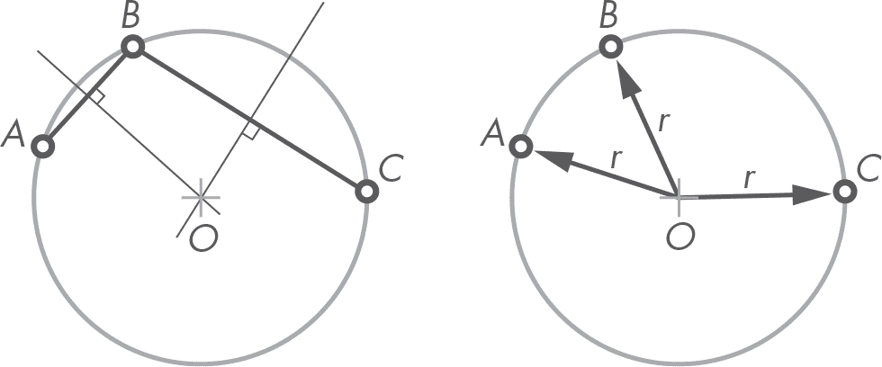

*图 6-10：通过三点定义的圆的圆心和半径*

我们准备实现逻辑了。在*geom2d*包中创建一个新文件，并命名为*circles.py*。在该文件中输入清单 6-19 中的代码。

```py
from geom2d import Point
from geom2d.circle import Circle
from geom2d.segment import Segment

def make_circle_from_points(a: Point, b: Point, c: Point):
    chord_one_bisec = Segment(a, b).bisector
    chord_two_bisec = Segment(b, c).bisector
    center = chord_one_bisec.intersection_with(chord_two_bisec)
    radius = center.distance_to(a)

    return Circle(center, radius)
```

*清单 6-19：由三点生成圆*

**注意**

*回顾一下，圆弦是一个线段，其端点位于圆周上，并穿过圆。*

如果你被要求简化这个函数，你能做到吗？每一行代码都清楚地告诉你它在做什么；你可以一行一行地阅读，并将其与算法描述进行匹配。自解释的代码清楚地表达了其意图，这种代码通常被称为*清晰代码*，它在软件行业中是一个备受推崇的概念，甚至有几本书专门讨论这一话题。我最喜欢的两本书包括[6]和[1]，如果你想编写真正易读的代码，我也推荐你阅读它们。

### **矩形类**

本章中我们将实现的最后一个几何原始体是矩形，但它不是任何类型的矩形——它是那种边始终水平和垂直的矩形。旋转矩形可以通过本章前面提到的多边形原始体来表示。这个看似限制性的规则背后有其原因，主要与该原始体通常用于什么用途有关。

这种矩形通常用于二维图形应用程序，应用场景包括以下几种：

+   表示屏幕上需要重新绘制的部分

+   确定屏幕上需要绘制某物的位置

+   确定必须绘制的几何形状的大小

+   测试两个对象是否可能发生碰撞

+   测试鼠标光标是否位于屏幕的某个区域上

一个*矩形*可以通过一个点（称为*原点*）和一个大小来定义，大小又有两个属性：宽度和高度（见图 6-11）。按照约定，原点位于矩形的左下角，假设坐标系的 y 轴指向上方。

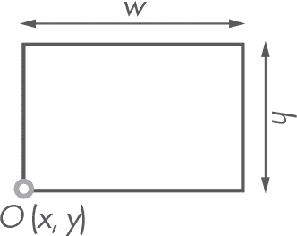

*图 6-11：由原点 *O*、宽度 *w* 和高度 *h* 定义的矩形*

让我们从一个类开始，来表示大小。在 *geom2d* 包中，创建一个名为 *size.py* 的新文件，包含列表 6-20 中的定义。

```py
from geom2d.nums import are_close_enough

class Size:
    def __init__(self, width: float, height: float):
        self.width = width
        self.height = height

    def __eq__(self, other):
        if self is other:
            return True

        if not isinstance(other, Size):
            return False

        return are_close_enough(self.width, other.width) \
               and are_close_enough(self.height, other.height)
```

*列表 6-20：Size 类*

使用这种大小的表示法，让我们来创建 Rect 的初始定义。创建一个名为 *rect.py* 的新文件，并输入列表 6-21 中的代码。

```py
from geom2d.point import Point
from geom2d.size import Size

class Rect:
    def __init__(self, origin: Point, size: Size):
        self.origin = origin
        self.size = size

    @property
    def left(self):
        return self.origin.x

    @property
    def right(self):
        return self.origin.x + self.size.width

    @property
    def bottom(self):
        return self.origin.y

    @property
    def top(self):
        return self.origin.y + self.size.height

    @property
    def area(self):
        return self.size.width * self.size.height

    @property
    def perimeter(self):
        return 2 * self.size.width + 2 * self.size.height
```

*列表 6-21：Rect 类*

该类存储了一个 Point 实例表示原点，以及一个 Size 实例表示它的宽度和长度。我们在类中定义了一些有趣的属性，即：

left    矩形最左边的 x 坐标

right    矩形最右边的 x 坐标

bottom    矩形最底部边缘的 y 坐标

top    矩形最顶部边缘的 y 坐标

area    矩形的面积

perimeter    矩形的周长

让我们在 shell 中创建一个矩形：

```py
>>> from geom2d.point import Point
>>> from geom2d.size import Size
>>> from geom2d.rect import Rect

>>> origin = Point(10, 20)
>>> size = Size(100, 150)
>>> rect = Rect(origin, size)
```

让我们检查一下它的一些属性：

```py
>>> rect.right
110

>>> rect.area
15000

>>> rect.perimeter
500
```

#### ***包含点***

下一个逻辑步骤是实现一个方法来测试一个点是否在矩形内。为了测试一个点 *P* 是否位于矩形内部，我们将使用以下两个条件：

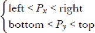

多亏了我们为类添加的属性，这变得轻而易举（见列表 6-22）。

```py
class Rect:
   --snip--

   def contains_point(self, point: Point):
       return self.left < point.x < self.right \
              and self.bottom < point.y < self.top
```

*列表 6-22：测试矩形是否包含一个点*

请注意 Python 中复合不等式的优美语法，

```py
left < point.x < right
```

而在其他大多数编程语言中，这通常需要用两个不同的条件来表示：

```py
left < point.x && point.x < right
```

#### ***交集***

假设我们有两个矩形，并且我们想知道它们是否重叠。由于 Rect 表示的矩形边缘始终是水平和垂直的，因此这个问题简化了很多。测试两个矩形是否重叠，实际上就是测试它们在 x 轴和 y 轴上的投影是否重叠。我们所说的*投影*，是指它们在轴线上的阴影。每个阴影是一个区间，从矩形原点的值所在的位置开始，长度要么是它的宽度，要么是它的高度（见图 6-12）。

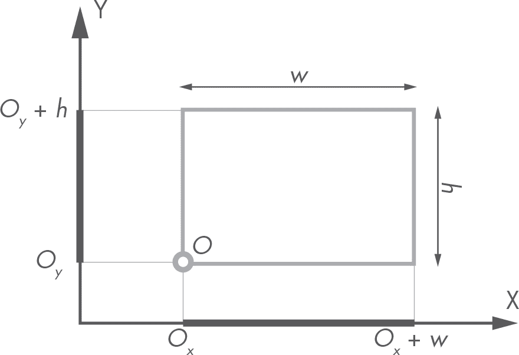

*图 6-12：矩形的投影*

例如，图 6-12 中的水平轴阴影可以表示为以下区间，

(*O*[x]，*O*[x] + *w*)

其中*O*是原点，*w*是矩形的宽度。同样，垂直投影或阴影将是：

(*O*[y], *O*[y] + *h*)

其中*h*是这次的高度。请注意，*O*[*x*] + *w*的结果正是我们在 Rect 类中定义的正确属性，而*O*[*y*] + *h*则是顶部。

图 6-13 则描绘了两个矩形，它们的垂直投影重叠，但水平方向投影不重叠。因此，矩形并未发生重叠。

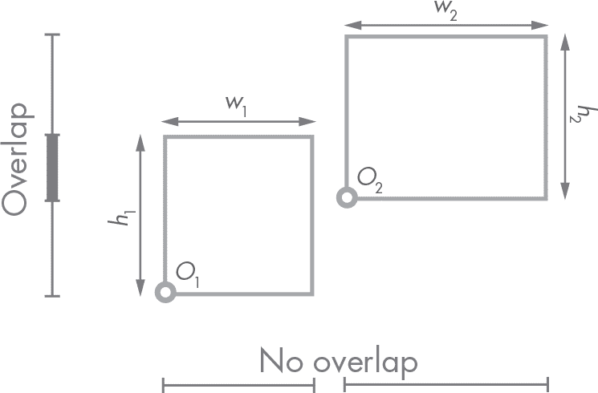

*图 6-13：两个不相交的矩形*

图 6-14 则描绘了两个矩形，它们的垂直和水平方向投影发生了重叠。如你所见，这种布局确实产生了一个重叠区域，并以灰色标示出来。我们可以观察到，重叠的矩形总是会产生矩形形状的重叠区域。

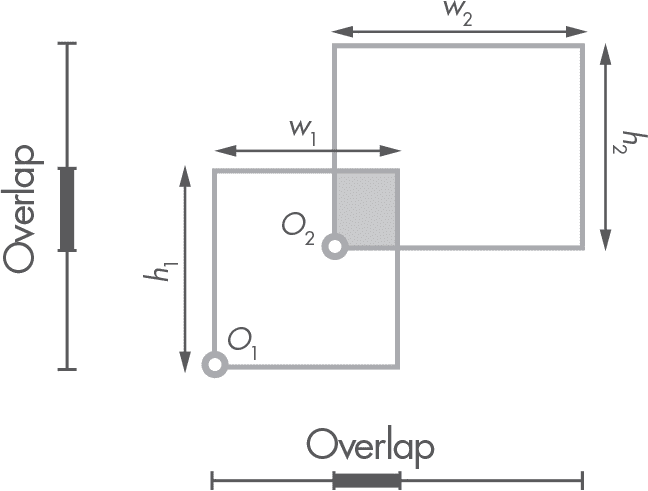

*图 6-14：两个相交的矩形*

使用前面图示中的术语，我们可以通过*开区间*来定义该条件，开区间是指端点被排除的区间。如果两个矩形重叠，则

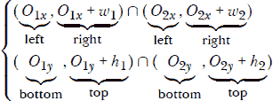

其中∩是交集二进制运算符。

##### **开区间**

现在我们已经将问题简化为计算区间之间的交集，让我们创建一个新的 OpenInterval 类来实现这个逻辑。请注意，在 Rect 类中编写算法的实现来查找两个区间的交集在概念上是错误的。每个类只应包含与其领域相关的逻辑，而区间交集显然与矩形无关。一个矩形不应知道如何计算两个区间的交集；这不属于它的领域。如果它需要计算交集，就像在我们的例子中一样，它应该将任务委托给该领域的专家：OpenRange。

如果你遵循这个简单的指南，你的代码将更容易推理和扩展。代码中的每一条知识应该恰好存在于它应在的位置，而且仅在该位置。软件的最大敌人之一就是*知识重复*，即同一条知识（如果你喜欢，可以称之为算法）出现在多个地方。当核心逻辑需要更改时，你需要记得在所有地方进行修改。相信我，问题比它听起来要严重得多。

**注意**

*大多数作者使用“代码重复”的说法，但我更倾向于称之为“知识重复”。这个词语的选择是有意的，因为我注意到一些开发者倾向于误解这个概念，可能是因为“代码”这个词过于泛泛。应该避免重复的是由代码表达的知识。*

在*geom2d*中创建一个名为*open_interval.py*的新文件，并在其中定义如清单 6-23 所示的 OpenInterval 类。

```py
class OpenInterval:
    def __init__(self, start: float, end: float):
        if start > end:
            raise ValueError('start should be smaller than end')
        self.start = start
        self.end = end

    @property
    def length(self):
     ➊ return self.end - self.start

    def contains(self, value):
     ➋ return self.start < value < self.end
```

*清单 6-23：OpenInterval 类*

`OpenInterval` 是通过起始和结束属性创建的。我们确保起始值小于结束值；否则，我们会引发一个 `ValueError` 异常。回想一下我们的快速失败约定；我们不希望有构造不当的区间存在。接下来，我们将区间的长度定义为一个属性 ➊，并定义一个方法来测试给定的值是否在区间范围内 ➋。

现在让我们加入另外两种方法：一种用于检查区间是否重叠，另一种用于实际计算重叠的结果（见清单 6-24）。

```py
from geom2d.nums import are_close_enough

class OpenInterval:
    --snip--

    def overlaps_interval(self, other):
     ➊ if are_close_enough(self.start, other.start) and \
               are_close_enough(self.end, other.end):
           return True

     ➋ return self.contains(other.start) \
               or self.contains(other.end) \
               or other.contains(self.start) \
               or other.contains(self.end)

    def compute_overlap_with(self, other):
     ➌ if not self.overlaps_interval(other):
            return None

     ➍ return OpenInterval(
            max(self.start, other.start),
            min(self.end, other.end)
        )
```

*清单 6-24: 开区间重叠*

第一种方法 `overlaps_interval` 返回一个布尔值，如果区间与传入的另一个区间重叠，则返回 True。为此，我们首先检查两个区间的起始和结束值是否相同 ➊，如果相同则返回 True。然后检查四个端点是否有一个包含在另一个区间内 ➋。如果你对这段逻辑感到困惑，可以拿一支笔和一些纸，画出所有可能的两个重叠区间的组合（我已经为你在图 6-15 中画出了这些组合，排除了两个区间的起始和结束值相同的情况）。

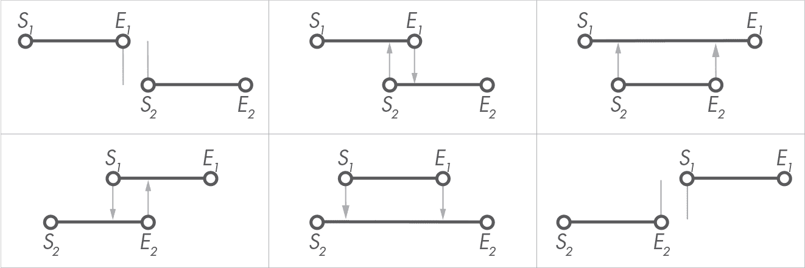

*图 6-15: 区间位置的可能情况*

第二种方法 `compute_overlap_with` 开始时会确保实际上存在重叠，如果没有重叠则返回 None ➌。重叠部分是一个新的区间，起始值为两个起始值中的最大值，结束值为两个结束值中的最小值 ➍。

我鼓励你为这个重叠逻辑编写单元测试。这是一个极好的机会来提升你的测试技能。重叠区间有很多组合，尽量覆盖所有情况。

##### **计算交集**

在 `OpenInterval` 的帮助下，矩形交集问题变得容易解决。返回到 *rect.py*，并导入 `OpenInterval` 类：

```py
from geom2d.open_interval import OpenInterval
```

现在，在 `contains_point` 方法下面，输入清单 6-25 中的代码。

```py
from geom2d.open_interval import OpenInterval
from geom2d.point import Point
from geom2d.size import Size

class Rect:
    --snip--

    def intersection_with(self, other):
     ➊ h_overlap = self.__horizontal_overlap_with(other)
        if h_overlap is None:
            return None

     ➋ v_overlap = self.__vertical_overlap_with(other)
        if v_overlap is None:
            return None

     ➌ return Rect(
            Point(h_overlap.start, v_overlap.start),
            Size(h_overlap.length, v_overlap.length)
       )
```

*清单 6-25: 两个矩形的交集*

有两个私有的辅助方法计算水平和垂直重叠；我们稍后会详细了解这两个方法。方法首先计算 `self` 和 `other` 之间的水平重叠 ➊。如果发现没有重叠，则返回 None，意味着矩形没有交集。垂直重叠也采用相同的步骤 ➋。只有当两个重叠都不为 None 时，即水平和垂直投影都重叠，我们才会进入最后的返回步骤，其中计算结果矩形 ➌。我们怎么找到这个矩形的原点和大小呢？很简单：原点坐标是水平和垂直重叠区间的起始值，宽度是水平重叠的长度，高度是垂直重叠的长度。

所以，唯一缺少的部分是实现查找水平和垂直区间重叠的私有方法（如果存在）。该代码在 清单 6-26 中。

```py
class Rect:
   --snip--

   def __horizontal_overlap_with(self, other):
       self_interval = OpenInterval(self.left, self.right)
       other_interval = OpenInterval(other.left, other.right)

       return self_interval.compute_overlap_with(other_interval)

   def __vertical_overlap_with(self, other):
       self_interval = OpenInterval(self.bottom, self.top)
       other_interval = OpenInterval(other.bottom, other.top)

       return self_interval.compute_overlap_with(other_interval)
```

*清单 6-26：交集私有方法*

现在让我们看看如何基于矩形构建一个通用多边形。

#### ***转换为多边形***

与圆形类似，应用仿射变换到矩形上可能会得到一些非矩形的形状。事实上，在进行通用仿射变换后，矩形会变成一个平行四边形，如 图 6-16 所示，这些形状无法用我们的 Rect 类来描述。

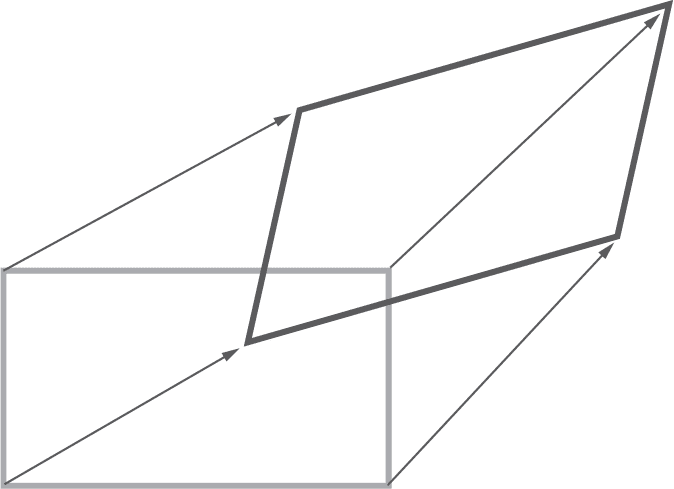

*图 6-16：仿射变换后的矩形*

从矩形创建多边形的方法很简单，因为此类多边形的顶点就是矩形的四个角。在 Rect 类中，添加 清单 6-27 中的方法。别忘了导入 Polygon 类。

```py
from geom2d.open_interval import OpenInterval
from geom2d.point import Point
from geom2d.polygon import Polygon
from geom2d.size import Size

class Rect:
   --snip--

   def to_polygon(self):
       return Polygon([
           self.origin,
           Point(self.right, self.bottom),
           Point(self.right, self.top),
           Point(self.left, self.top)
       ])
```

*清单 6-27：从矩形创建多边形*

不用多说，顶点应该按顺序给出，顺时针或逆时针，但无论如何要尊重顺序。顶点的顺序很容易搞错，导致边界交叉。为了确保这种情况永远不会发生，我们应该写一个测试，作为练习留给你。

#### ***相等性***

你已经是实现 __eq__ 方法的专家了，是吗？清单 6-28 显示了实现代码。

```py
class Rect:
   --snip--

    def __eq__(self, other):
        if self is other:
            return True

        if not isinstance(other, Rect):
            return False

        return self.origin == other.origin \
               and self.size == other.size
```

*清单 6-28：矩形相等性*

唯一需要注意的是，我们能够直接使用 == 比较尺寸，因为我们在 *Size* 类上也实现了 __eq__ 方法。

请注意，像 __\textit{eq}__ 这样在 *Rect* 中实现（例如 are_close_enough(self.size.width, other.size.width) ...）并不理想。记得德梅特法则吗？这些知识属于 *Size* 类，并且应该仅在该类中实现。

作为参考， 清单 6-29 显示了你的 *rect.py* 文件应该是什么样子的。

```py
from geom2d.open_interval import OpenInterval
from geom2d.point import Point
from geom2d.polygon import Polygon
from geom2d.size import Size

class Rect:

    def __init__(self, origin: Point, size: Size):
        self.origin = origin
        self.size = size

    @property
    def left(self):
        return self.origin.x

    @property
    def right(self):
        return self.origin.x + self.size.width

    @property
    def bottom(self):
        return self.origin.y

    @property
    def top(self):
        return self.origin.y + self.size.height

    @property
    def area(self):
        return self.size.width * self.size.height

    @property
    def perimeter(self):
        return 2 * self.size.width + 2 * self.size.height

    def contains_point(self, point: Point):
        return self.left < point.x < self.right \
               and self.bottom < point.y < self.top

    def intersection_with(self, other):
        h_overlap = self.__horizontal_overlap_with(other)
        if h_overlap is None:
            return None

        v_overlap = self.__vertical_overlap_with(other)
        if v_overlap is None:
            return None

        return Rect(
            Point(h_overlap.start, v_overlap.start),
            Size(h_overlap.length, v_overlap.length)
        )

    def __horizontal_overlap_with(self, other):
        self_interval = OpenInterval(self.left, self.right)
        other_interval = OpenInterval(other.left, other.right)

        return self_interval.compute_overlap_with(other_interval)

    def __vertical_overlap_with(self, other):
        self_interval = OpenInterval(self.bottom, self.top)
        other_interval = OpenInterval(other.bottom, other.top)

        return self_interval.compute_overlap_with(other_interval)

    def to_polygon(self):
        return Polygon([
            self.origin,
            Point(self.right, self.bottom),
            Point(self.right, self.top),
            Point(self.left, self.top)
        ])

    def __eq__(self, other):
        if self is other:
            return True

        if not isinstance(other, Rect):
            return False

        return self.origin == other.origin \
               and self.size == other.size
```

*清单 6-29：Rect 类的实现*

#### ***矩形工厂***

我们经常使用矩形来近似一组几何图形的外部边界。例如，在本书的后续章节中，我们将生成图示，作为力学问题解决方案的一部分。为了将图示放入正确尺寸的图像中，我们将创建一个可以容纳所有内容的矩形。为此，我们将创建一个工厂函数，返回一个包含给定点列表的矩形。

例如，如果我们给定点列表 [*A, B, C, D, E*]，那么矩形会像 图 6-17 中的左侧插图那样。我们还需要另一个工厂函数，做类似的事情，但也为矩形添加一些边距。

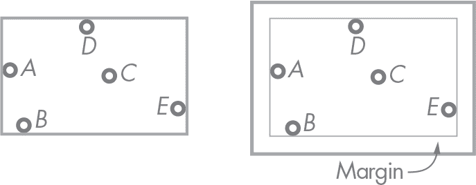

*图 6-17：包含点的矩形*

在 *geom2d* 包中，创建一个新文件并命名为 *rects.py*。添加第一个工厂函数（见 清单 6-30）。

```py
from geom2d.point import Point
from geom2d.rect import Rect
from geom2d.size import Size

def make_rect_containing(points: [Point]):
 ➊ if not points:
        raise ValueError('Expected at least one point')

    first_point = points[0]
 ➋ min_x, max_x = first_point.x, first_point.x
 ➌ min_y, max_y = first_point.y, first_point.y

    for point in points[1:]:
     ➍ min_x, max_x = min(min_x, point.x), max(max_x, point.x)
     ➎ min_y, max_y = min(min_y, point.y), max(max_y, point.y)

 ➏ return Rect(
        Point(min_x, min_y),
        Size(max_x - min_x, max_y - min_x)
    )
```

*清单 6-30：创建包含点列表的矩形*

第一步是检查列表 points 是否至少包含一个点 ➊。你可能会对语法感到惊讶；这里的技巧是，Python 在布尔上下文中将空列表视为 False。实际上，这是一个 Pythonic 的惯用法，用来检查列表是否为空。

接下来，我们需要寻找矩形的边界：最小和最大 x 轴和 y 轴的投影。四个变量存储这些值 ➋ ➌，它们被初始化为列表中第一个点的坐标。然后，我们遍历所有点，除了第一个点，因为它已经被用来初始化前述变量。为了避免经过第一个点，我们从索引 1 开始切片列表，直到列表的末尾：points[1:]。（你可以参考“列表”在第 15 页中有关切片列表的内容。）对于每个点，当前存储的最小和最大 x ➍ 以及 y ➎ 投影值会与当前值进行比较。

一旦我们得到这四个值，就可以使用最小的 x 和 y 投影来构建结果矩形 ➏，并计算每个最大值和最小值之间的差值作为矩形的大小。

现在，让我们实现一个类似的函数，并在点周围添加边距。在实现了 make_rect_containing 后，输入清单 6-31 中的代码。

```py
--snip--

def make_rect_containing_with_margin(points: [Point], margin: float):
 ➊ rect = make_rect_containing(points)
    return Rect(
     ➋ Point(
            rect.origin.x - margin,
            rect.origin.y - margin
        ),
     ➌ Size(
            2 * margin + rect.size.width,
            2 * margin + rect.size.height
        )
    )
```

*清单 6-31：创建包含点列表和给定边距的矩形*

这个函数从之前的函数计算出的矩形 ➊ 开始。然后，通过将矩形的原点向左和向下移动边距的宽度 ➋，并将大小增加两倍边距的宽度 ➌，来计算新的矩形。请记住，边距是添加到左侧和右侧的，所以我们将它加到宽度上两次——高度也是如此。

还有一种我们可能想要构建矩形的方法：根据其中心和大小来创建矩形。这个实现很简单，正如你在清单 6-32 中看到的那样。

```py
--snip--

def make_rect_centered(center: Point, width: float, height: float):
    origin = Point(
        center.x - width / 2,
        center.y - height / 2
    )
    return Rect(origin, Size(width, height))
```

*清单 6-32：根据矩形的中心和大小创建矩形*

通过这三种工厂方法，我们可以方便地创建矩形。我们将在后续章节中使用它们，因此我们希望确保它们能生成预期的矩形，并通过一些自动化单元测试进行验证。我会把这个作为一个练习留给你。你可以在与本书附带的源代码中的 *rects_test.py* 中找到我写的测试。

### **总结**

本章开始时，我们实现了一个通用多边形，描述为至少由三个顶点组成的序列。我们编写了一个算法来配对对象序列，使得最后一个和第一个元素也能配对，并用这个逻辑生成多边形的边。我们还实现了绕数算法来检查多边形是否包含一个点。

本章中我们创建的第二个几何原始元素是圆形。正如你所看到的，检查一个点是否在圆内比检查它是否在普通多边形内要简单得多。我们想出了一个方法，利用给定的分割数或边数来构造一个逼近圆形几何的通用多边形。我们将在下一章中使用这个方法。

最后，我们实现了一个矩形。为了计算矩形之间的交集，我们需要一种方法来确定两个区间之间的重叠；因此，我们创建了一个开放区间的抽象来处理这个逻辑。

我们的几何库几乎完成了。我们已经具备了书中所需的所有基本元素；唯一缺少的就是一种变换它们的方法，这也是下一章的主题。
