## 绘制矢量图像


我们即将开始绘制由数学方程式描述的图像，这是一个既有趣又富有娱乐性的主题。我们称由几何原始元素构成的图像为*矢量图像*，与*位图图像*相对，后者有时也被称为*光栅图像*。矢量图像非常适合绘制工程问题的结果，这些问题通常以图表和简化的几何形式呈现。

在这一章中，我们将创建自己的 Python 包，能够从我们在第二部分中创建的几何原始元素（如点、线段、圆、 多边形等）生成 SVG 图像。在后面的章节中，当我们使用代码解决实际的力学问题时，这个包将帮助我们生成图形结果。

市面上有许多优秀的 SVG 包（例如 *svgwrite*），我们可以直接导入它们，但本书的重点是通过实践学习，所以除了 Python 标准库和我们自己的代码，我们不会使用任何外部库。

为了简洁起见，我们在这一章中不会编写单元测试，但如果你下载代码，你会看到我已经写好了单元测试，以确保一切正常工作。我鼓励你尝试为本章中的函数编写自己的单元测试，然后将其与我提供的代码进行比较。

本章将介绍一个强大的概念：*模板化*。在模板化时，我们有一段文本，称为*模板*，它可以通过填充不同的占位符来定制。这项技术在 web 开发中广泛使用，用于生成在浏览器中渲染的 HTML 文档。在这里，确实有很多优秀的模板库（如 *jinja2* 或 *mako*），但我们希望了解它们背后的工作原理，因此我们将自己编写模板逻辑，而不是使用现成的库。

### **位图和矢量图像**

图像有两种类型：*位图*和*矢量图*。你可能以前见过位图图像：*.jpeg*、*.gif* 和 *.png* 都是位图图像格式的例子。位图是一种在像素网格上定义的图像，每个像素都会被赋予一个特定的颜色。这些图像在原始尺寸下看起来很漂亮，但如果你放大，可能会开始看到那些小方格——像素。

另一方面，矢量图像通过数学方程式定义其内容。这具有平滑缩放而不失真质量的优势。让我们来探索 *.svg*，这是最广泛使用的矢量图像格式，也是我们在本书中将使用的格式。

### **SVG 格式**

SVG 代表可缩放矢量图形。其规范由*万维网联盟 (W3C)* 开发，并且是一个开放标准。我建议你打开 [*https://developer.mozilla.org/en-US/docs/Web/SVG*](https://developer.mozilla.org/en-US/docs/Web/SVG)，将其作为参考，查看更完整的描述和示例，这些内容可以补充书中所述的内容。如果你需要向你的 SVG 包添加新内容，这个页面将是你的好帮手。

让我们快速参考一下上面提到的 Mozilla 网站中的定义，它优美地描述了这些图像是如何定义的：

SVG 图像及其相关行为是通过 XML 文本文件定义的，这意味着它们可以被搜索、索引、脚本化和压缩。此外，这也意味着它们可以使用任何文本编辑器和绘图软件创建和编辑。

请注意，SVG 图像是以纯文本格式定义的，而大多数其他图像格式是以二进制编码的。这意味着我们可以轻松地自动化创建 SVG 图像，甚至检查现有图像的内容。

**注意**

*本章假设你已经对 XML 格式有基本了解，但如果你没有，也不用担心；它非常容易学习。可以查看以下资源开始学习：* [`www.w3schools.com/xml`](https://www.w3schools.com/xml) *和* [`www.xmlfiles.com/xml`](https://www.xmlfiles.com/xml)。

让我们尝试创建第一个 SVG 图像。打开你喜欢的纯文本编辑器，如 Sublime Text、Visual Studio Code、Atom，或者如果你喜欢，也可以使用 PyCharm，然后编写 清单 8-1。

```py
<svg  width="500" height="500">
    <circle cx="200" cy="200" r="100" fill="#ff000077" />
    <circle cx="300" cy="200" r="100" fill="#00ff0077" />
    <circle cx="250" cy="300" r="100" fill="#0000ff77" />
</svg>
```

*清单 8-1：多个圆形的 SVG 描述*

请注意，你不应使用富文本编辑器（如 Word）创建 SVG 文件。这些富文本编辑器会在原始文件中添加自己的标记，破坏 SVG 格式。

一旦你复制了 清单 8-1 中的内容，保存文件为 *circles.svg*，并使用 Chrome 或 Firefox 打开它。信不信由你，浏览器是一些最好的 SVG 图像查看器。通过使用它们的 *开发者工具*，我们可以检查组成图像的不同部分，这在稍后构建更复杂的图像时将非常有用。你应该看到类似 图 8-1 的图像（屏幕上会有颜色，但书籍的印刷版是灰度的）。放大图像，你会看到它如何保持清晰。

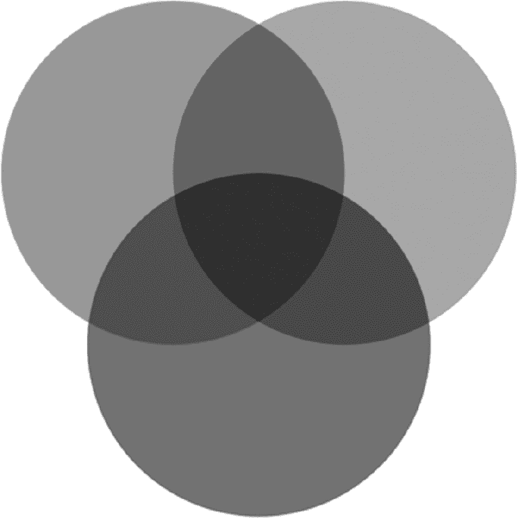

*图 8-1：SVG 圆形示例*

让我们分析一下 清单 8-1 中的代码。第一行最为晦涩，包含了 *XML 命名空间*（xmln）属性。

```py
 width="500" height="500"
```

我们必须在每个 svg 开始标签中包含这个命名空间定义。width 和 height 属性确定图像的像素大小。SVG *属性* 是影响特定元素如何呈现的修饰符。例如，width 和 height 属性决定了绘图的大小。

然后，在 svg 开始和结束标签之间是实际的绘制定义，在这种情况下是三个圆形：

```py
<circle cx="200" cy="200" r="100" fill="#ff000077" />
<circle cx="300" cy="200" r="100" fill="#00ff0077" />
<circle cx="250" cy="300" r="100" fill="#0000ff77" />
```

正如你可能已经猜到的，cx 和 cy 对应的是圆心的坐标；r 是圆的半径。属性 fill 确定圆形的填充颜色，采用十六进制格式：#rrggbbaa，其中 rr 是红色值，gg 是绿色值，bb 是蓝色值，aa 是 alpha 或透明度值（参见 图 8-2）。

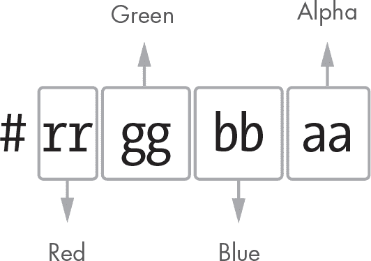

*图 8-2：十六进制颜色组件*

例如，颜色 #ff000077 具有以下组成部分：

**红色**    ff，最大值（十进制中的 255）

**绿色**    00，最小值（十进制中的 0）

**蓝色**    00，最小值（十进制中的 0）

**透明度**    77，255 中的 119，相当于约 47% 的透明度

这种颜色是纯正的红色，并加入了一些透明度。

你可能没有意识到，但 SVG 图像的坐标原点位于左上角，y 轴指向下方。你可能不习惯这种垂直轴的方向，但别担心：通过使用我们的仿射变换之一，我们可以轻松地将空间变换，使 y 轴指向上方，正如你将在本章后面看到的那样。图 8-3 展示了我们创建的图像的几何形状和坐标布局。

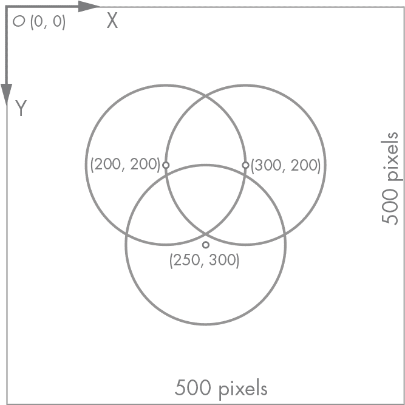

*图 8-3：我们第一个 SVG 图像的几何形状*

#### ***viewBox***

我们可以为 svg 标签定义的一个有用属性是 viewBox。viewBox 是用户看到的图像的矩形部分。它由四个数字定义，

```py
viewBox="x y w h"
```

其中 x 和 y 是矩形原点的坐标，w 和 h 是矩形的宽度和高度。

让我们给圆形图像添加一个 viewBox 来查看其效果（参见 列表 8-2）。

```py
<svg 
    width="500"
    height="500"
    viewBox="100 100 300 300">
    <circle cx="200" cy="200" r="100" fill="#ff000077" />
    <circle cx="300" cy="200" r="100" fill="#00ff0077" />
    <circle cx="250" cy="300" r="100" fill="#0000ff77" />
</svg>
```

*列表 8-2：SVG viewBox*

保存我们在 列表 8-2 中所做的更改，并在浏览器中重新加载图像以查看变化。要理解发生了什么，查看 图 8-4。

我们定义了一个矩形，其原点在 (100, 100)，宽度为 300，高度为 300：一个包含所有三个圆形且没有任何边距的矩形。注意，图像保持其 500x500 像素的大小，这是由 width 和 height 属性定义的。如果 viewBox 的大小与 SVG 本身的大小不同，内容会被缩放。

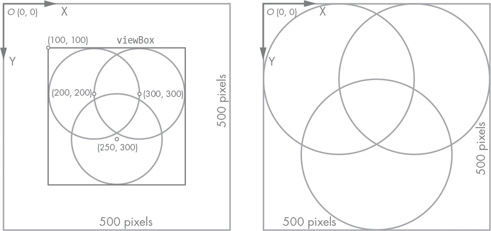

*图 8-4：SVG 图像的 *viewBox*

因此，viewBox 是从无限画布中显示给用户的矩形部分。它是可选的，默认为由宽度和高度定义的矩形，原点在 (0, 0)。

#### ***空间变换***

还记得第七章中讲解的仿射变换概念吗？SVG 图像使用它们来变换内容。属性 transform 可以用来定义仿射变换矩阵，如下所示：

```py
transform="matrix(sx shy shx sy tx ty)"
```

矩阵项的顺序看起来可能一开始有些令人困惑，但对于 SVG 标准的制定者来说，这其实是有意义的。SVG 文档定义了仿射变换矩阵，如下所示：

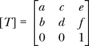

这些是 transform 属性的术语：

```py
transform="matrix(a b c d e f)"
```

用我们更易理解的语言来表达，这些术语是 *a* = *s*[*x*]，*b* = *sh*[*y*]，*c* = *sh*[*x*]，*d* = *s*[*y*]，*e* = *t*[*x*]，*f* = *t*[*y*]：

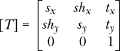

让我们看看它如何运作。我们将通过将 *sh*[*x*] 设置为 1 来应用 x 方向上的剪切变换。记住，*s*[*x*] 和 *s*[*y*] 必须都为 1；否则，如果设置为零，图像将会塌缩成一条线或一个点，我们将看不到任何东西。清单 8-3 中已经包含了 transform 属性。

```py
<svg 
    width="500"
    height="500"
    transform="matrix(1 0 1 1 0 0)"
    <circle cx="200" cy="200" r="100" fill="#ff000077" />
    <circle cx="300" cy="200" r="100" fill="#00ff0077" />
    <circle cx="250" cy="300" r="100" fill="#0000ff77" />
</svg>
```

*清单 8-3：圆形图像中的剪切变换*

记得删除 viewBox 属性，以免结果几何形状被裁剪。你应该看到类似图 8-5 的内容。

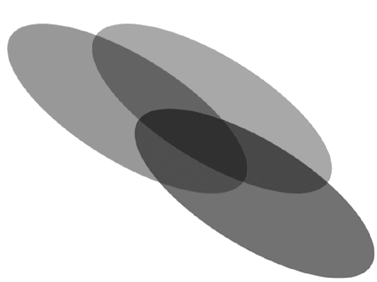

*图 8-5：变换后的圆形*

那么如何反转 y 轴，使其朝上，就像我们习惯的那样？很简单！编辑 transform 矩阵如下：

```py
transform="matrix(1 0 0 -1 0 0)"
```

你应该看到的结果几何形状在图 8-6 中有所概述。将其与图 8-1 进行比较。发生了什么？图像进行了垂直翻转。

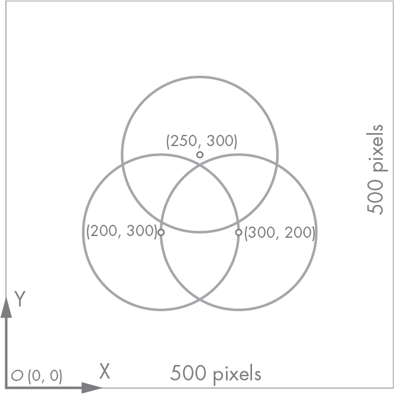

*图 8-6：变换后的圆形，y 轴反转*

现在你已经基本理解了如何创建 SVG 图像，让我们开始做一些 Python 编程。我们将在项目中创建一个包来绘制 SVG 图像。

### **svg 包**

让我们为项目创建一个新的图形包，它将包含一个用于生成 SVG 图像的子包。稍后在本书中，我们将为其他类型的图形操作添加更多子包。右键点击 **项目工具** 窗口中的项目名称，选择 **新建** ▸ **Python 包**。将其命名为 *graphic*。你也可以自己创建一个新文件夹，但别忘了添加 *__init__.py* 文件，告诉 Python 这是一个包。

你应该将包放置在与 *geom2d* 同一级别，并且只包含一个 *__init__.py* 文件。你的项目目录结构应该如下所示：

机械学

|- geom2d

|    |- tests

|- graphic

|- utils

现在让我们添加 *svg* 子包：右键点击刚刚创建的包，再次选择 **新建** ▸ **Python 包**，但这次将其命名为 *svg*。现在我们可以开始添加代码了。

#### ***模板***

模板是一个包含占位符的文档。通过为这些占位符赋值，我们可以生成文档的完整版本。例如，想想那些通过你名字来问候你的邮件营销活动。发送这些邮件的公司可能有一个像这样的模板。

你好，{{name}}！

这里有一些我们认为你可能喜欢的书籍推荐。

...

并且通过一个自动化过程，将 {{name}} 占位符替换为每个客户的名字，然后发送最终生成的邮件。

模板中的占位符也可以称为 *变量*。在渲染模板的过程中，变量会被赋值，从而生成最终的文档，文档中包含了所有已定义的内容。图 8-7 演示了使用两组不同值渲染相同模板的过程。模板中有变量 place-from、place-to、distance 和 units，我们为这些变量赋不同的值，生成相同模板的不同版本。

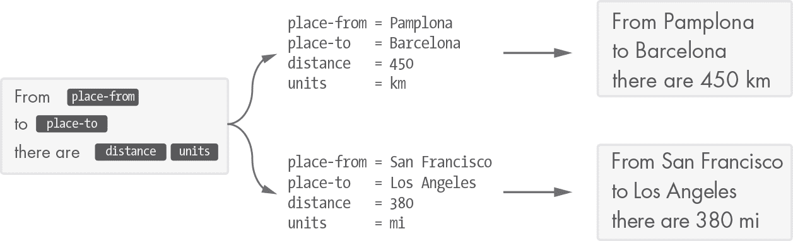

*图 8-7：模板渲染过程*

使用模板是一种强大的技术，解决了需要生成任何形状和格式的文本的各种问题。例如，大多数 web 框架使用某种形式的模板来生成渲染后的 HTML 文档。我们将使用模板来生成我们的 SVG 图像。

##### **使用 Python 字符串替换的示例**

让我们在代码中做一个模板示例。打开 Python 的 shell，并输入以下模板字符串：

```py
>>> template = 'Hello, my name is {{name}}'
```

现在，让我们通过将 {{name}} 变量替换为真实名字来创建一个问候语：

```py
>>> template.replace('{{name}}', 'Angel')
'Hello, my name is Angel'
```

如你所见，我们可以使用 Python 的 replace 字符串方法来创建一个新的字符串，其中 {{name}} 已被 'Angel' 替换。由于 replace 返回一个新的实例，我们可以像这样链式调用：

```py
>>> template.replace('{{name}}', 'Angel').replace('Hello', 'Hi there')
'Hi there, my name is Angel'
```

在这个示例中，我们首先将 {{name}} 变量替换为字符串 'Angel'。然后，我们在结果字符串上调用 replace 方法，将单词 'Hello' 替换为 'Hi there'。

请注意，我们可以使用 replace 方法替换任何我们想要的字符序列；无需让我们的替换目标出现在大括号中，就像我们之前用 {{name}} 那样。使用双大括号是一种约定，用于帮助我们快速识别模板中的变量。这个约定也有助于防止不必要的替换：我们的模板中不太可能包含两个大括号之间的任何内容，除非是我们的变量。

现在我们已经了解了如何在 Python 中使用模板字符串，让我们看看如何在单独的文件中定义模板，并将其加载到代码中的字符串中。

#### ***加载模板***

为了避免混合 XML 和 Python 代码，我们希望将 SVG 标签的定义分离到各自的文件中。包含 XML 的文件需要有占位符，以便插入实际数据。例如，我们的圆形定义文件可能如下所示：

```py
<circle cx="{{cx}}" cy="{{cy}}" r="{{r}}" />
```

这里我们使用了双大括号来放置占位符。我们将使用代码将此定义加载到一个字符串中，并将占位符替换为圆心的实际坐标和半径。

我们将创建几个模板，因此让我们在*svg*包内创建一个名为*templates*的文件夹，通过右键单击包名并选择**新建** ▸ **目录**。我们需要一个函数，它可以根据名称读取此文件夹中的模板并将其内容作为字符串返回。在*svg*包中，但不在*templates*文件夹内，创建一个名为*read.py*的新文件，并添加列表 8-4 中的代码。

```py
from os import path

import pkg_resources as res

def read_template(file_name: str):
    file_path = path.join('templates', file_name)
    bytes_str = res.resource_string(__name__, file_path)
    return bytes_str.decode('UTF-8')
```

*列表 8-4：读取模板文件的内容*

让我们分解一下列表 8-4。函数中首先要做的事情是获取*templates*文件夹内文件的路径。我们通过使用 os.path 模块的 join 函数来实现这一点。此函数通过连接作为参数传递的各部分并使用适合操作系统的分隔符来计算路径。例如，基于 Unix 的操作系统使用/字符。

然后，使用*pkg_resources*模块中的 resource_string，我们将文件作为*字节字符串*读取。文件以字节序列存储到磁盘中，因此当我们使用 resource_string 函数读取它时，得到的是字节字符串。为了将其转换为 Unicode 字符字符串，我们需要对其进行*解码*。为此，字节字符串具有 decode 方法，该方法接受编码作为参数。

我们返回使用 UTF-8 编码解码字节字符串的结果。这将给我们一个字符串版本的模板，便于操作。

#### ***图像模板***

我们要定义的最重要的模板是 SVG 图像的模板。在*templates*文件夹中创建一个新的文本文件，命名为*img*（不带扩展名；我们不需要扩展名），并在其中包含列表 8-5 中的定义。

```py
<svg  version="1.1"
     width="{{width}}"
     height="{{height}}"
     viewBox="{{viewBox}}"
     transform="matrix({{transf}})">
    {{content}}
</svg>
```

*列表 8-5：SVG 图像模板*

该模板包括五个占位符，需要用实际的图像值进行替换。我们可以尝试使用之前定义的 read_template 函数，在 Python 的 shell 中加载模板：

```py
>>> from graphic.svg.read import read_template
>>> read_template('img')
'<svg  version="1.1"\n  width="{{width}}"...'
```

在*svg*目录中（但在*templates*文件夹外）创建一个新的文件*image.py*，并定义一个函数，该函数读取文件并进行替换。在你的*image.py*文件中，输入列表 8-6 中的代码。

```py
from geom2d import AffineTransform, Rect, Point, Size
from graphic.svg.read import read_template

def svg_content(
        size: Size,
        primitives: [str],
        viewbox_rect=None,
        transform=None
):
 ➊ viewbox_rect = viewbox_rect or __default_viewbox_rect(size)
 ➋ transform = transform or AffineTransform()
 ➌ template = read_template('img') return template \
        .replace('{{width}}', str(size.width)) \
        .replace('{{height}}', str(size.height)) \
     ➍ .replace('{{content}}', '\n\t'.join(primitives)) \
     ➎ .replace('{{viewBox}}', __viewbox_from_rect(viewbox_rect)) \
     ➏ .replace('{{transf}}', __transf_matrix_vals(transform))
```

*列表 8-6：SVG 图像*

svg_content 函数有四个参数；最后两个参数 viewbox_rect 和 transform 的默认值为 None。我们可以使用“或”操作符，这样当 viewbox_rect 不是 None 时，它保持其值，否则将由 __default_viewbox_rect ➊（我们接下来将编写此函数）创建一个默认实例。我们对 transform ➋做同样的处理，使用默认值构造一个仿射变换。

然后，使用我们在前一节准备的函数，我们加载存储在*templates/img*中的模板 ➌。

最后一个也是最重要的步骤是将加载的模板字符串中的所有占位符替换为我们传入的值。

**注意**

*Python 中字符串的一个优点，与大多数编程语言类似，是它们是不可变的；你不能直接修改字符串中的某个字符。相反，你需要创建一个包含所需更改的新字符串。这就是* replace *字符串方法的工作原理：它将给定的字符序列替换为另一个序列，并返回一个新的字符串作为结果。得益于这个特性，我们可以漂亮地链式调用多个* replace *来处理对* read_template* 方法的结果。*

{{width}} 和 {{height}} 占位符的替换非常直接；只需记住，传入的 size.width 和 size.height 属性是数字，因此我们需要使用 str 将它们转换为字符串表示。

primitives 参数包含了一系列字符串，这些字符串代表了图像的内容。我们需要将这些字符串收集到一个单独的字符串中。join 字符串方法将列表中的所有元素连接成一个单一的字符串，并以它被调用时的字符串作为分隔符。为了获取包含所有 primitives 的字符串，我们将使用 join ➍ 方法对列表进行操作，并以换行符和制表符（\n\t）作为分隔符。

对于 viewBox，我们需要将 Rect 实例转换为定义它的四个数字 ➎；这通过 __viewbox_from_rect 实现，我们稍后将定义它。transf ➏ 的处理方式也是如此。

让我们在 svg_content 后编写缺失的辅助函数。代码见 列表 8-7。

```py
--snip--

def __default_viewbox_rect(size: Size):
    return Rect(Point(0, 0), size)

def __viewbox_from_rect(rect: Rect):
    x = rect.origin.x
    y = rect.origin.y
    width = rect.size.width
    height = rect.size.height

    return f'{x} {y} {width} {height}'

def __transf_matrix_vals(t: AffineTransform):
    return f'{t.sx} {t.shy} {t.shx} {t.sy} {t.tx} {t.ty}'
```

*列表 8-7：SVG 图像辅助函数*

第一个函数 (__default_viewbox_rect) 使用点 (0, 0) 作为原点和提供的尺寸来创建一个矩形用于 viewBox。正如它的名字所示，这个函数用于提供 viewbox _rect 参数的默认值，以防用户没有提供。

__viewbox_from_rect 函数返回一个格式化字符串，可以用作 SVG 定义中的 viewBox。最后一个函数 __transf_matrix_vals 做的事情类似：它将一个仿射变换转换为 SVG 期望的字符串格式。

很棒！我们现在有了一个函数，可以将 SVG 模板渲染为一个字符串。接下来，让我们看一下我们将添加到几乎所有图形元素中的一些属性。

#### ***属性***

可以使用 *属性* 来修改 SVG 元素的外观。SVG 属性是按照 XML 属性语法定义的（别忘了 SVG 图像是按照 XML 格式定义的）：

```py
name="value"
```

例如，我们可以使用 stroke 属性来设置图形的描边颜色：

```py
<circle cx="10" cy="15" r="40" stroke="green" />
```

请注意，在前面的例子中，圆形的中心坐标（cx 和 cy）以及半径（r）也作为属性定义在圆形的 SVG 元素中。

正如我们将看到的，许多 SVG 几何基本图形都有共享的属性，用于定义诸如笔触颜色、笔触宽度、填充颜色等。为了重用这部分逻辑，我们将其放在一个所有基本图形生成函数都会使用的文件中。由于这些属性定义较短，我们不会将它们包括在需要加载的模板中；相反，我们将在替换占位符的函数内部定义它们。  

在 *svg* 目录中创建一个名为 *attributes.py* 的新文件。你的 *graphic/svg* 文件夹应该如下所示：  

svg  

|- templates  

|    |- img  

|- __init__.py  

|- attributes.py  

|- image.py  

|- read.py  

输入 列表 8-8 中的函数。  

```py
from geom2d.affine_transf import AffineTransform

def stroke_color(color: str):
    return f'stroke="{color}"'

def stroke_width(width: float):
    return f'stroke-width="{str(width)}"'

def fill_color(color: str):
    return f'fill="{color}"'

def fill_opacity(opacity: float):
    return f'fill-opacity="{str(opacity)}"'

def affine_transform(t: AffineTransform):
    values = f'{t.sx} {t.shy} {t.shx} {t.sy} {t.tx} {t.ty}'
    return f'transform="matrix({values})"'

def font_size(size: float):
    return f'font-size="{size}px"'

def font_family(font: str):
    return f'font-family="{font}"'

def attrs_to_str(attrs_list: [str]):
    return ' '.join(attrs_list)
```

*列表 8-8：SVG 属性*  

所有函数都非常简单；它们接收一个值并返回一个包含 SVG 属性定义的字符串。我们使用单引号括起来返回的字符串，这样就可以在字符串中使用双引号，而无需转义它们。SVG 属性使用双引号定义，例如 stroke="blue"。  

最后的函数接受一些属性，并将它们通过空格分隔连接成一个字符串。我们通过使用单个空格（’ ’）作为 join 函数的分隔符来实现这一点。为了完全理解这个如何工作，可以在 shell 中试一试：  

```py
>>> words = ['svg', 'is', 'a', 'nice', 'format']
>>> ' '.join(words)
'svg is a nice format'
```

### **SVG 基本图形**  

我们已经编写了 *svg* 包的基础；现在我们可以生成空白图像，这一过程涉及读取 *img* 模板并替换其变量。如果我们在 Python 的 Shell 中调用 svg_content 函数，  

```py
>>> from graphic.svg.image import svg_content
>>> from geom2d import Size
>>> svg_content(Size(200, 150), [])
```

我们将得到以下 SVG 内容：  

```py
<svg  version="1.1"
     width="200"
     height="150"
     viewBox="0 0 200 150"
     transform="matrix(1 0 0 1 0 0)">
</svg>
```

这是一个很好的开始，但谁希望有空白的图像呢？  

在接下来的章节中，我们将创建一些基本的 SVG 基本图形，以便在 <svg></svg> 标签之间添加：线条、矩形、圆形、多边形和文本标签，等等。正如我们在整本书中将看到的那样，我们并不需要很多基本图形来绘制我们的工程图；仅凭直线、圆形和矩形就能做得相当好。  

我们生成这些 SVG 基本图形的策略与生成 SVG 内容时使用的策略相同：我们将使用一个模板来定义带有变量的 SVG 代码，并在函数中替换这些变量。  

#### ***线条***  

我们将在 *svg* 包中实现的第一个基本图形是线段，或者用 SVG 术语来说是直线。这可能有点不太合适，因为线段和直线是不同的概念。（回想一下，直线是无限的，而线段则不是；它们有有限的长度。）无论如何，我们在这里使用 SVG 术语，所以我们将在 *templates* 文件夹中创建一个名为 *line* 的新模板文件，并在其中添加 列表 8-9 中的代码：  

```py
<line x1="{{x1}}" y1="{{y1}}" x2="{{x2}}" y2="{{y2}}" {{attrs}}/>
```

*列表 8-9：线条模板*  

线条的模板很简单。占位符定义了以下内容：  

+   x1 和 y1，起点的坐标  

+   x2 和 y2，终点的坐标  

+   attrs，属性将被插入的位置

图 8-8 展示了使用 SVG 图像的默认坐标系统的线条及其属性。

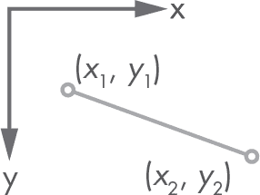

*图 8-8：SVG 线条的例子*

现在我们来创建一个函数，它读取模板并插入一个片段的值。我们需要一个新文件；让我们在*svg*文件夹中创建它，命名为*primitives.py*。输入清单 8-10 中的函数。

```py
from geom2d import Segment
from graphic.svg.attributes import attrs_to_str
from graphic.svg.read import read_template

__segment_template = read_template('line')

def segment(seg: Segment, attributes=()):
    return __segment_template \
        .replace('{{x1}}', str(seg.start.x)) \
        .replace('{{y1}}', str(seg.start.y)) \
        .replace('{{x2}}', str(seg.end.x)) \
        .replace('{{y2}}', str(seg.end.y)) \
        .replace('{{attrs}}', attrs_to_str(attributes))
```

*清单 8-10：SVG 线*

需要注意的一点是，参数属性的默认值是()，也就是一个空元组。我们也可以使用一个空列表[]作为参数的默认值，但这两者之间有一个重要的区别：元组是不可变的，而列表是可变的。函数的默认参数只会在文件加载到解释器时评估一次，因此，如果一个可变的默认参数被修改，那么对同一函数的所有后续调用都会得到修改后的默认值，而这正是我们想避免的。

在 shell 中，尝试以下代码来创建一个 SVG 线条，以查看结果并确保所有占位符都已正确替换。

```py
>>> from geom2d import Segment, make_point
>>> from graphic import svg
>>> seg = Segment(make_point(1, 4), make_point(2, 5))
>>> attrs = [svg.attributes.stroke_color('#cacaca')]
>>> svg.primitives.segment(seg, attrs)
'<line x1="1" y1="4" x2="2" y2="5" stroke="#cacaca"/>'
```

这行位于 SVG 文件中的代码将像图 8-9 那样绘制。

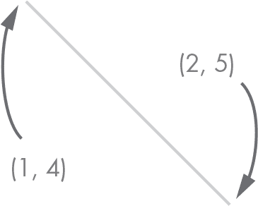

*图 8-9：SVG 线*

请记住，图中为了清晰起见添加了箭头和位置说明，但它们不会出现在图片本身中。

#### ***矩形***

我们的下一个原语是矩形，因此在*templates*中创建一个名为*rect*的新文件（记住，我们的模板文件没有使用扩展名），文件内容如清单 8-11 所示：

```py
<rect x="{{x}}" y="{{y}}"
      width="{{width}}" height="{{height}}"
      {{attrs}}/>
```

*清单 8-11：矩形模板*

你可以将模板写成一行；我们这里使用了多行，因为在印刷版中，代码无法放在一行内。定义矩形的属性是，按照预期，原点的坐标 x 和 y 以及由宽度和高度给定的大小。在*primitives.py*中，添加清单 8-12 中的函数。

```py
from geom2d import Rect, Segment
from graphic.svg.attributes import attrs_to_str
from graphic.svg.read import read_template

__segment_template = read_template('line')
__rect_template = read_template('rect')

--snip--

def rectangle(rect: Rect, attributes=()):
    return __rect_template \
        .replace('{{x}}', str(rect.origin.x)) \
        .replace('{{y}}', str(rect.origin.y)) \
        .replace('{{width}}', str(rect.size.width)) \
        .replace('{{height}}', str(rect.size.height)) \
        .replace('{{attrs}}', attrs_to_str(attributes))
```

*清单 8-12：SVG 矩形*

为了更好地理解定义 SVG 格式矩形的属性，可以查看图 8-10。该图使用了 SVG 的默认坐标系统：y 轴向下。这也是为什么矩形的原点是左上角。如果我们使用的是 y 轴向上的坐标系统，原点将是左下角。

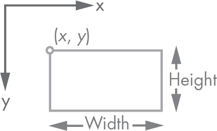

*图 8-10：一个 SVG 矩形的例子*

在 shell 中试试，就像我们对片段做的那样，检查所有占位符是否已正确替换：

```py
>>> from geom2d import Rect, Point, Size
>>> from graphic.svg.primitives import rectangle
>>> r = Rect(Point(3, 4), Size(10, 20))
>>> rectangle(r)
'<rect x="3" y="4" width="10" height="20" />'
```

确保一切按预期工作是个好主意，因为在本书后续章节中，我们将使用这些简单的基本图形创建许多图表。单元测试是最佳选择，比在命令行中手动测试要好得多。如果你下载了本书的代码，你会发现所有这些基本图形渲染函数都已覆盖了测试。尝试自己编写测试，这样你可以习惯编写单元测试，然后将它们与我提供的测试进行对比。

#### ***圆形***

我们将采用类似于矩形的方式来创建圆形。创建一个名为*circle*的模板文件（请参见清单 8-13）。

```py
<circle cx="{{cx}}" cy="{{cy}}" r="{{r}}" {{attrs}}/>
```

*清单 8-13: 圆形模板*

然后将渲染圆形的函数添加到*primitives.py*中（请参见清单 8-14）。

```py
from geom2d import Circle, Rect, Segment
from graphic.svg.attributes import attrs_to_str
from graphic.svg.read import read_template

__segment_template = read_template('line')
__rect_template = read_template('rect')
__circle_template = read_template('circle')

--snip--

def circle(circ: Circle, attributes=()):
    return __circle_template \
        .replace('{{cx}}', str(circ.center.x)) \
        .replace('{{cy}}', str(circ.center.y)) \
        .replace('{{r}}', str(circ.radius)) \
        .replace('{{attrs}}', attrs_to_str(attributes))
```

*清单 8-14: SVG 圆形*

这里没有什么意外的！你可以查看图 8-11，查看我们用来定义 SVG 格式中圆形的属性。


*图 8-11: SVG 圆形示例*

让我们在命令行中试试：

```py
>>> from geom2d import Circle, Point
>>> from graphic.svg.primitives import circle
>>> c = Circle(Point(3, 4), 10)
>>> circle(c)
'<circle cx="3" cy="4" r="10" />'
```

#### ***多边形***

多边形很容易定义；我们只需要提供按特定方式格式化的顶点坐标列表。创建一个名为*polygon*的模板文件，放在*templates*中（请参见清单 8-15）。

```py
<polygon points="{{points}}" {{attrs}}/>
```

*清单 8-15: 多边形模板*

然后在*primitives.py*中包含清单 8-16 中的函数。

```py
from geom2d import Circle, Rect, Segment, Polygon
from graphic.svg.attributes import attrs_to_str
from graphic.svg.read import read_template

__segment_template = read_template('line')
__rect_template = read_template('rect')
__circle_template = read_template('circle')
__polygon_template = read_template('polygon')

--snip--

def polygon(pol: Polygon, attributes=()):
    return __polygon_template \
        .replace('{{points}}', __format_points(pol.vertices)) \
        .replace('{{attrs}}', attrs_to_str(attributes))
```

*清单 8-16: SVG 多边形*

占位符{{points}}将被应用 __format_points 函数处理顶点列表后的结果替换。让我们在*primitives.py*文件中编写这个函数（请参见清单 8-16）：

```py
--snip--

def __format_points(points: [Point]):
    return ' '.join([f'{p.x},{p.y}' for p in points])
```

*清单 8-17: 格式化点*

如你所见，顶点列表被转换为一个字符串，其中每个顶点通过空格分隔，

```py
' '.join(...)
```

两个坐标，x 和 y，通过逗号分隔：

```py
[f'\{p.x\},\{p.y\}' for p in points]
```

例如，一个顶点为 (1, 2)，(5, 6) 和 (8, 9) 的多边形将会得到如下结果：

```py
<polygon points="1, 2 5, 6 8, 9" />
```

#### ***多边形线***

*多边形线*的定义与多边形相同，唯一的区别是最后一个顶点未与第一个顶点连接。创建一个名为*polyline*的模板文件，放在*templates*中（请参见清单 8-18）。

```py
<polyline points="{{points}}" {{attrs}}/>
```

*清单 8-18: 多边形线模板*

将渲染函数包含在文件*primitives.py*中（请参见清单 8-19）。

```py
from geom2d import Circle, Rect, Segment, Polygon
from graphic.svg.attributes import attrs_to_str
from graphic.svg.read import read_template

__segment_template = read_template('line')
__rect_template = read_template('rect')
__circle_template = read_template('circle')
__polygon_template = read_template('polygon')
__polyline_template = read_template('polyline')

--snip--

def polyline(points: [Point], attributes=()):
    return __polyline_template \
        .replace('{{points}}', __format_points(points)) \
        .replace('{{attrs}}', attrs_to_str(attributes))
```

*清单 8-19: SVG 多边形线*

再次，这里没有什么惊讶的。图 8-12 展示了多边形和多边形线之间的区别。它们的定义是相同的，唯一的区别是最后一个连接顶点 (*x*[4], *y*[4]) 和 (*x*[1], *y*[1]) 的段，只有在多边形中才会出现。

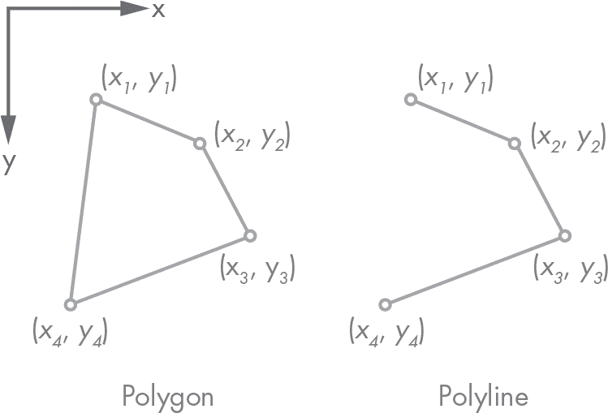

*图 8-12: 一个 SVG 多边形和多边形线*

让我们在命令行中试试多边形和多边形线，看看结果：

```py
>>> from geom2d import Polygon, Point
>>> from graphic.svg.primitives import polygon, polyline
>>> points = [Point(1, 2), Point(3, 4), Point(5, 6)]

>>> polygon(Polygon(points))
'<polygon points="1, 2 3, 4 5, 6" />'

>>> polyline(points)
'<polyline points="1,2 3,4 5,6" />'
```

多边形和折线有相同的点序列，但在 SVG 图像中，多边形将连接第一个和最后一个顶点，而折线将保持开放。

#### ***文本***

我们的图表将包含标题（就像第十八章中的结构分析结果图表），因此我们需要能够在图像中包含文本。创建一个新的模板文件，命名为*text*，并将其保存在*templates*文件夹中，代码见列表 8-20。

```py
<text x="{{x}}" y="{{y}}" dx="{{dx}}" dy="{{dy}}" {{attrs}}>
    {{text}}
</text>
```

*列表 8-20：文本模板*

占位符{{text}}必须位于打开和关闭标签<text>和</text>之间；这里将插入实际的文本。属性 x 和 y 定义了文本的位置；然后 dx 和 dy 用于偏移该原始位置。我们会发现这种偏移在某些情况下非常有用，例如当我们想在文本旁边添加一个点的坐标时。我们可以选择点本身的位置作为基准位置，然后偏移一定的量，这样文本和点的绘制就不会重叠。

在*primitives.py*中添加列表 8-21 中显示的函数来渲染文本：

```py
from geom2d import Circle, Rect, Segment, Polygon, Vector
from graphic.svg.attributes import attrs_to_str
from graphic.svg.read import read_template

__segment_template = read_template('line')
__rect_template = read_template('rect')
__circle_template = read_template('circle')
__polygon_template = read_template('polygon')
__polyline_template = read_template('polyline')
__text_template = read_template('text')

--snip--

def text(txt: str, pos: Point, disp: Vector, attrs_list=()):
    return __text_template \
        .replace('{{x}}', str(pos.x)) \
        .replace('{{y}}', str(pos.y)) \
        .replace('{{dx}}', str(disp.u)) \
        .replace('{{dy}}', str(disp.v)) \
        .replace('{{text}}', txt) \
        .replace('{{attrs}}', attrs_to_str(attrs_list))
```

*列表 8-21：SVG 文本*

让我们在 Shell 中试试：

```py
>>> from geom2d import Point, Vector
>>> from graphic.svg.primitives import text
>>> text('Hello, SVG', Point(10, 15), Vector(5, 6))
'<text x="10" y="15" dx="5" dy="6" >\n    Hello, SVG\n</text>'
```

如果我们格式化结果字符串，结果如下所示：

```py
<text x="10" y="15" dx="5" dy="6" >
    Hello, SVG
</text>
```

#### ***分组***

我们通常希望将一组元素分组，以便可以为它们所有的元素添加一个共同的属性，比如仿射变换或填充颜色。这就是分组的用途。它们本身没有什么可渲染的内容，但它们以整洁的方式将一组原始元素分组在一起。在*templates*文件夹中创建一个*group*文件（见列表 8-22）。

```py
<g {{attrs}}>
    {{content}}
</g>
```

*列表 8-22：分组模板*

为了渲染该分组，我们将在*primitives.py*文件中添加列表 8-23 中显示的函数。

```py
from geom2d import Circle, Rect, Segment, Polygon, Vector
from graphic.svg.attributes import attrs_to_str
from graphic.svg.read import read_template

__segment_template = read_template('line')
__rect_template = read_template('rect')
__circle_template = read_template('circle')
__polygon_template = read_template('polygon')
__polyline_template = read_template('polyline')
__text_template = read_template('text')
__group_template = read_template('group')

--snip--

def group(primitives: [str], attributes=()):
    return __group_template \
        .replace('{{content}}', '\n'.join(primitives)) \
        .replace('{{attrs}}', attrs_to_str(attributes))
```

*列表 8-23：SVG 分组*

这一次，所有作为序列传递的原始元素将被连接成一个由换行符（\n）分隔的字符串。这样做是为了让每个原始元素都被插入到新的一行中，这将使文件更易于阅读。

#### ***箭头***

在本节中，我们将添加一个不同的原始元素，它不是通过加载和渲染模板来构建的，而是通过使用其他原始元素来创建：箭头。在第十八章中，当我们绘制结构图时，我们将使用箭头来表示力，因此现在正是实现箭头的好时机。

箭头由一条线段和一个位于其一端的小三角形构成，即箭头的头部（见图 8-13）。

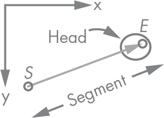

*图 8-13：SVG 箭头*

绘制箭头的线段非常简单：我们只需要一个线段。绘制箭头头部稍微复杂一些，因为它需要始终与线段对齐。通过一点基本几何知识，我们可以找出定义箭头头部的点。请查看图 8-14。

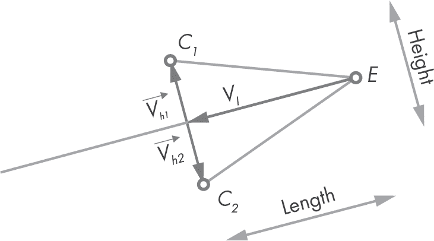

*图 8-14：箭头中的关键点*

我们的箭头头部是由点*C*[1]、*E*（线段的终点）和*C*[2]定义的一个三角形。箭头的大小由长度和高度决定，我们将使用这些尺寸来定位*C*[1]和*C*[2]点。

该图使用三个向量来定位这两点。

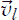    这是一个与线段方向向量相反方向的向量，长度与箭头相同。

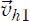    这是一个垂直于线段的向量，长度是箭头头部高度的一半。

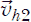    这与类似，但方向相反。

使用这些向量，我们现在可以按如下方式计算这些点：

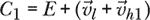

和

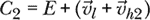

毫不拖延，让我们编写绘制箭头的代码。在*primitives.py*中，输入列表 8-24 中的代码。

```py
--snip--

def arrow(
        _segment: Segment,
        length: float,
        height: float,
        attributes=()
):
    director = _segment.direction_vector
 ➊ v_l = director.opposite().with_length(length)
 ➋ v_h1 = director.perpendicular().with_length(height / 2.0)
 ➌ v_h2 = v_h1.opposite()

    return group(
        [

         ➍ segment(_segment),
         ➎ polyline([
                _segment.end.displaced(v_l + v_h1),
                _segment.end,
                _segment.end.displaced(v_l + v_h2)
            ])
        ],
        attributes
    )
```

*列表 8-24：SVG 箭头*

我们定义了箭头函数，该函数接受线段、箭头的长度和高度以及 SVG 属性作为参数。请注意，_segment 参数以一个下划线开头，这是为了避免与文件中的 segment 函数发生冲突。

在这个函数中，我们首先将线段的方向向量存储在变量 director 中。然后，我们通过将 director 的相反向量按传入的长度➊进行缩放来计算向量。向量通过将 director 的垂直向量按箭头的半高度➋进行缩放得到。然后，就是它的相反向量➌。

该函数返回一个 SVG 组，包含箭头的线段➍和一个折线➎。这条折线使用我们之前讨论的三个点来定义箭头的头部。

第一个点*C*[1]是通过将线段的终点平移到向量和相加的结果来计算的。接下来是线段的终点。最后是*C*[2]，它是通过将线段的终点平移到一个向量，该向量是将和相加的结果。

### **原始结果**

我们向我们的*primitives.py*文件中添加了一些函数。如果你跟着做，你的文件应该和列表 8-25 类似。

```py
from geom2d import Circle, Rect, Segment, Point, Polygon, Vector
from graphic.svg.attributes import attrs_to_str
from graphic.svg.read import read_template

__segment_template = read_template('line')
__rect_template = read_template('rect')
__circle_template = read_template('circle')
__polygon_template = read_template('polygon')
__polyline_template = read_template('polyline')
__text_template = read_template('text')
__group_template = read_template('group')

def segment(seg: Segment, attributes=()):
    return __segment_template \
        .replace('{{x1}}', str(seg.start.x)) \
        .replace('{{y1}}', str(seg.start.y)) \
        .replace('{{x2}}', str(seg.end.x)) \
        .replace('{{y2}}', str(seg.end.y)) \
        .replace('{{attrs}}', attrs_to_str(attributes))

def rectangle(rect: Rect, attributes=()):
    return __rect_template \
        .replace('{{x}}', str(rect.origin.x)) \
        .replace('{{y}}', str(rect.origin.y)) \
        .replace('{{width}}', str(rect.size.width)) \
        .replace('{{height}}', str(rect.size.height)) \
        .replace('{{attrs}}', attrs_to_str(attributes))

def circle(circ: Circle, attributes=()):
    return __circle_template \
        .replace('{{cx}}', str(circ.center.x)) \
        .replace('{{cy}}', str(circ.center.y)) \
        .replace('{{r}}', str(circ.radius)) \
        .replace('{{attrs}}', attrs_to_str(attributes))

def polygon(pol: Polygon, attributes=()):
    return __polygon_template \
        .replace('{{points}}', __format_points(pol.vertices)) \
        .replace('{{attrs}}', attrs_to_str(attributes))

def polyline(points: [Point], attributes=()):
    return __polyline_template \
        .replace('{{points}}', __format_points(points)) \
        .replace('{{attrs}}', attrs_to_str(attributes))

def text(txt: str, pos: Point, disp: Vector, attrs_list=()):
    return __text_template \
        .replace('{{x}}', str(pos.x)) \
        .replace('{{y}}', str(pos.y)) \
        .replace('{{dx}}', str(disp.u)) \
        .replace('{{dy}}', str(disp.v)) \
        .replace('{{text}}', txt) \
        .replace('{{attrs}}', attrs_to_str(attrs_list))

def group(primitives: [str], attributes=()):
    return __group_template \
        .replace('{{content}}', '\n\t'.join(primitives)) \
        .replace('{{attrs}}', attrs_to_str(attributes))

def arrow(
        _segment: Segment,
        length: float,
        height: float,
        attributes=()
):
    director = _segment.direction_vector
    v_l = director.opposite().with_length(length)
    v_h1 = director.perpendicular().with_length(height / 2.0)
    v_h2 = v_h1.opposite()

    return group(
        [
            segment(_segment),
            polyline([
                _segment.end.displaced(v_l + v_h1),
                _segment.end,
                _segment.end.displaced(v_l + v_h2)
            ])
        ],
        attributes
    )

def __format_points(points: [Point]):
    return ' '.join([f'{p.x},{p.y}' for p in points])
```

*列表 8-25：SVG 原始结果*

我们已经准备好开始绘制图像了。在下一章中，我们将使用我们的*svg*包绘制几何问题的结果。但首先，让我们提供一个方便的方式来导入该包的内容。

### **包导入**

与我们在*geom2d*包中所做的类似，我们希望提供一个选项，通过一行导入语句将*svg*包中的所有内容导入：

```py
from graphic import svg
```

我们需要做的唯一事情是将所有相关模块导入到*svg*包的*__init__.py*文件中：

```py
from .attributes import *
from .image import svg_content
from .primitives import *
```

### **总结**

图形在工程应用中至关重要。许多应用涉及创建由简单几何原语（如线段和矩形）构成的图表。我们在本书的第二部分中创建了一个几何包；在本章中，我们学习了如何将这些原语转换为矢量图像。

我们首先简要介绍了 SVG 格式，并展示了如何通过几行 XML 数据轻松创建 SVG 图像。接着，我们了解了模板，这是一种无扩展名的纯文本文件，通过占位符定义 SVG 结构。占位符的形式是{{name}}，它们会通过代码替换为具体的数据。模板被广泛使用，并且有一些复杂的包用于渲染模板。我们的使用案例相对简单，因此我们使用 Python 字符串的`replace`方法进行了替换。

最后，我们创建了函数，以获取几何原语的 SVG 表示：线段、圆形、矩形和多边形。从现在开始，创建矢量图应该是直接的，我们将在下一章中证明这一点。
