## 第十章：图形用户界面与画布


在我们深入仿真之前，我们需要了解图形用户界面（GUIs）的基础知识。这个话题非常广泛，我们只能略微触及皮毛，但我们会了解足够的信息来将我们的仿真展示给用户。

图形用户界面（GUIs）通常由一个父窗口（或多个窗口）组成，其中包含用户可以交互的*控件*，例如按钮或文本框。对于我们绘制仿真图形的目标，我们最感兴趣的控件是*画布*。在画布上，我们可以绘制几何图形原语，并且可以每秒重绘它们多次，这将帮助我们创造运动的感觉。

在这一章中，我们将介绍如何使用 Tkinter 布局图形用户界面，Tkinter 是 Python 标准库中自带的一个包。掌握这一点后，我们将实现一个类，方便我们将几何原语绘制到画布上。这个类还将包含一个仿射变换，作为其状态的一部分。我们将使用这个变换来影响所有原语的绘制方式，从而实现一些效果，例如将绘制内容垂直翻转，使得 y 轴指向上方。

### **Tkinter**

Tkinter 是 Python 标准库中自带的一个包，用于构建图形用户界面。它提供了视觉组件，换句话说，就是控件，比如按钮、文本框和窗口。它还提供了画布，我们将用它来绘制仿真图形的框架。

Tkinter 是一个功能丰富的库；甚至有整本书专门讲解它（例如，参见[7]）。我们只会讲解对于我们的目标而言需要的内容，但如果你喜欢创建 GUI，我建议你花些时间浏览 Tkinter 的在线文档；你可以学到很多东西，这些都能帮助你为程序构建精美的 GUI。

#### ***我们的第一个 GUI 程序***

让我们在*graphic*文件夹中创建一个新包，将我们的仿真代码放入其中。右键单击*graphic*，选择**新建** ▸ **Python 包**，命名为*simulation*，然后点击**确定**。你项目中的文件夹结构应该如下所示：

Mechanics

|- apps

|    |- circle_from_points

|- geom2d

|    |- tests

|- graphic

|    |- simulation

|    |- svg

|- utils

现在，让我们创建第一个 GUI 程序来熟悉 Tkinter。在新创建的*simulation*文件夹中，添加一个名为*hello_tkinter.py*的新 Python 文件。输入清单 10-1 中的代码。

```py
from tkinter import Tk

tk = Tk()
tk.title("Hello Tkinter")

tk.mainloop()
```

*清单 10-1：Hello Tkinter*

要执行文件中的代码，请在项目树面板中右键单击该文件，然后从弹出的菜单中选择**运行 ‘hello_tkinter’**。当你执行代码时，一个标题为“Hello Tkinter”的空窗口将会打开，如图 10-1 所示。

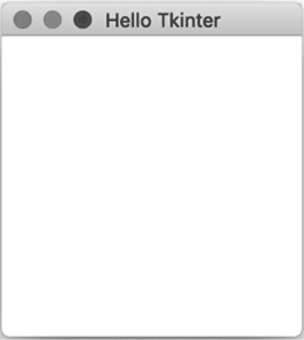

*图 10-1：空的 Tkinter 窗口*

让我们回顾一下我们刚刚写的代码。我们首先从 tkinter 中导入 Tk 类。tk 变量保存了一个 Tk 实例，代表 Tkinter 程序中的主窗口。这个窗口在文档和在线示例中也被称为*root*。

然后，我们将窗口的标题设置为 Hello Tkinter，并运行*主循环*。注意，主窗口不会在屏幕上显示，直到主循环开始。在图形界面程序中，主循环是一个无限循环：它在程序执行时一直运行；在运行过程中，它会收集窗口中的用户事件并做出反应。

图形用户界面与我们之前编写的其他程序不同，因为它们是*事件驱动的*。这意味着可以配置图形组件，在接收到期望的事件类型时运行某些代码。例如，我们可以告诉按钮在接收到点击事件时显示一条消息，也就是当它被点击时。反应事件的代码通常称为*事件处理程序*。

让我们添加一个文本字段，供用户输入名字，并添加一个按钮，通过名字向用户打招呼。修改你的*hello_tkinter.py*文件，包含清单 10-2 中的代码。注意文件顶部新增的导入部分。

```py
  from tkinter import Tk, Label, Entry, Button, StringVar

  tk = Tk()
  tk.title("Hello Tkinter")

➊ Label(tk, text='Enter your name:').grid(row=0, column=0)
➋ name = StringVar()
➌ Entry(tk, width=20, textvariable=name).grid(row=1, column=0)
➍ Button(tk, text='Greet me').grid(row=1, column=1)

  tk.mainloop()
```

*清单 10-2：Hello Tkinter 小部件*

为了添加标签“Enter your name:”，我们从 tkinter 实例化了 Label 类 ➊。我们将构造函数传递给程序主窗口（tk）的引用，并传递一个带有要显示文本的命名参数：text='Enter your name:’。在标签出现在窗口之前，我们需要告诉它在窗口中的位置。

在创建的 Label 实例上，我们调用带有命名参数 row 和 column 的 grid 方法。此方法将小部件放置在窗口中一个不可见的网格里，按照给定的行和列索引。网格中的单元格会根据内容自动调整大小。正如代码中所示，我们在每个小部件上调用此方法，以便将它们定位到窗口中。图 10-2 展示了我们 UI 的网格。还有其他方式可以在窗口中放置组件，但我们现在将使用这种方式，因为它足够灵活，能够轻松地排列组件。

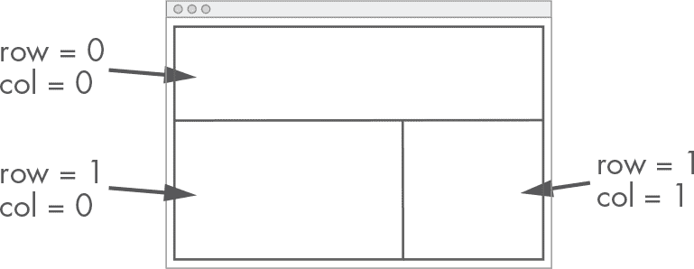

*图 10-2：Tkinter 网格*

Tkinter 中的输入字段被称为 Entry ➌。为了访问该字段的内容（即输入的文本），我们必须首先创建一个 StringVar 变量，称为 name ➋。这个变量通过 textvariable 参数传递给 Entry 组件。我们可以通过在实例上调用 get 来获取字段中写入的字符串，稍后我们将这样做。最后，我们创建一个按钮，文本为“Greet me” ➍；这个按钮点击时不会做任何事情（我们稍后会添加功能）。

运行该文件。现在你应该能看到一个标签、一个文本字段和一个按钮，如图 10-3 所示。


*图 10-3：一些 Tkinter 小部件*

让我们通过为按钮点击事件添加一个事件处理程序来完成我们的程序，点击按钮后会弹出一个新对话框，显示问候信息。修改你的代码，使其看起来像清单 10-3。

```py
  from tkinter import Tk, Label, Entry, Button, StringVar, messagebox

  tk = Tk()
  tk.title("Hello Tkinter")

➊ def greet_user():
      messagebox.showinfo(
         'Greetings',
         f'Hello, {name.get()}'
      )

  Label(tk, text='Enter your name:').grid(row=0, column=0)
  name = StringVar()
  Entry(tk, width=20, textvariable=name).grid(row=1, column=0)
  Button(
     tk,
     text='Greet me',
   ➋ command=greet_user
  ).grid(row=1, column=1)

tk.mainloop()
```

*清单 10-3：问候用户的 Hello Tkinter*

我们添加了一个名为 greet_user ➊ 的函数。这个函数会打开一个标题为“Greetings”的信息对话框，显示一条问候信息，内容是向用户在文本框中输入的名字打招呼。请注意，我们从 tkinter 导入了 messagebox 来调用 showinfo 函数，这个函数实际执行打开对话框的工作。为了将按钮点击事件与 greet_user 函数连接，我们需要通过参数 command 将其传递给 Button 的构造函数 ➋。

现在运行文件。别忘了每次想要执行新代码时，先关闭应用程序的窗口，然后重新运行程序。在文本框中输入你的名字并点击按钮。程序应该会弹出一个新对话框，显示个性化的问候信息，类似于图 10-4。

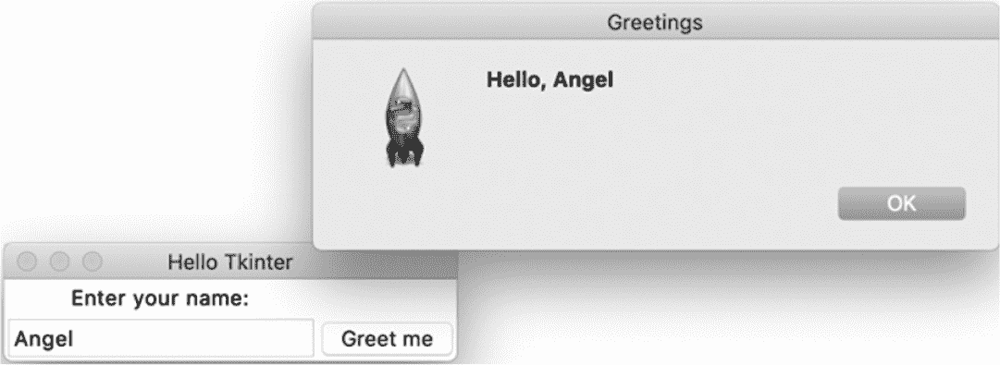

*图 10-4：我们的 Tkinter 问候程序*

Tkinter 还能做很多事情，但在本书中我们不需要使用那么多功能。我们主要关注的是它的画布组件，接下来我们将深入探索这一部分。如果你想了解更多关于 Tkinter 的信息，网上有很多优秀的资源。你也可以参考之前提到的[7]。

#### ***画布***

画布是一个可以绘制的区域。在 Tkinter 的数字世界中，情况也是如此。Tkinter 的画布组件由 tkinter 中的 Canvas 类表示。

让我们创建一个新的 Tkinter 应用程序，在其中尝试绘制画布内容。在 *simulation* 文件夹中，创建一个名为 *hello_canvas.py* 的新文件，并输入清单 10-4 中的代码。

```py
from tkinter import Tk, Canvas

tk = Tk()
tk.title("Hello Canvas")

canvas = Canvas(tk, width=600, height=600)
canvas.grid(row=0, column=0)

tk.mainloop()
```

*清单 10-4：Hello Canvas*

这段代码创建了一个 Tkinter 应用程序，包含了一个主窗口和一个 600x600 像素的画布。如果你运行这个文件，应该会看到一个空的窗口，标题为“Hello Canvas”。画布已经存在，只是暂时还没有绘制任何内容。

##### **绘制线条**

我们从简单的开始，在画布上画一条线。只需要在创建画布和启动主循环之间，添加以下这一行：

```py
--snip--

canvas.create_line(0, 0, 300, 300)

tk.mainloop()
```

传递给 create_line 的参数分别是起点的 x 和 y 坐标，以及终点的 x 和 y 坐标。

现在再次运行文件。应该会看到一条从屏幕左上角（0, 0）到屏幕中央（300, 300）的线段。正如你所猜测的那样，坐标原点在屏幕的左上角，y 轴朝下。稍后当我们进行动画模拟时，我们将使用仿射变换来修正这一点。

默认情况下，线条的宽度是 1 像素，颜色是黑色，但我们可以进行更改。试试以下代码：

```py
canvas.create_line(
    0, 0, 300, 300,
    width=3,
    fill='#aa3355'
)
```

现在这条线变得更粗，而且呈现出红色。你的结果应该和图 10-5 类似。

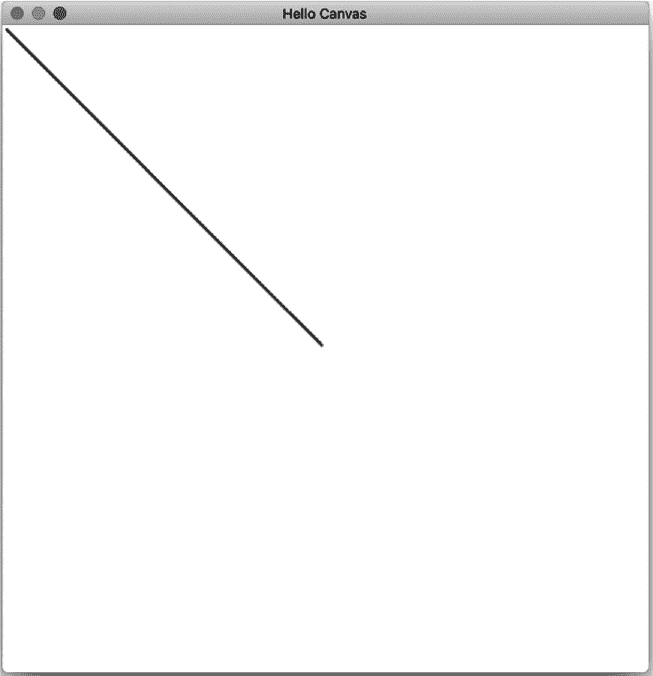

*图 10-5：Tkinter 画布上的一条线*

##### **绘制椭圆**

让我们使用与前一条线相同的颜色，在应用程序窗口的中央绘制一个圆形：

```py
--snip--

canvas.create_oval(
    200, 200, 400, 400,
    width=3,
    outline='#aa3355'
)

tk.mainloop()
```

传递给 `create_oval` 的参数是包含椭圆的矩形左上角的 x 和 y 坐标，以及右下角的 x 和 y 坐标。接着是用于确定线条宽度和颜色的命名参数：`width` 和 `outline`。

如果你运行文件，你会看到一个位于窗口中心的圆形。让我们通过将它的宽度增加 100 像素，保持高度为 400 像素，将其变成一个正确的椭圆：

```py
canvas.create_oval(
    200, 200, 500, 400,
    width=3,
    outline='#aa3355'
)
```

通过将右下角的 x 坐标从 400 改为 500，圆形变成了椭圆。现在应用程序有了一个同时包含线条和椭圆的画布，如 图 10-6 所示。

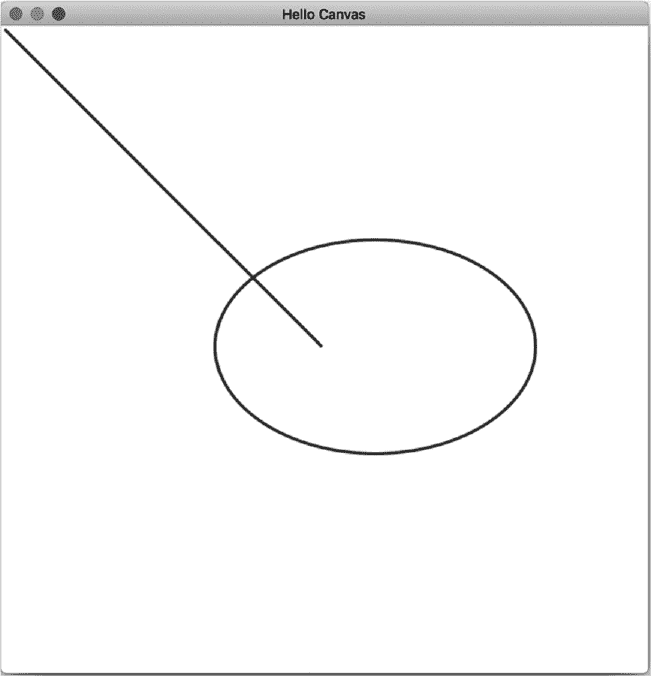

*图 10-6：添加到 Tkinter 画布上的椭圆*

如果我们想为椭圆添加填充颜色，可以使用命名参数 `fill='...'`。以下是一个示例：

```py
canvas.create_oval(
    200, 200, 500, 400,
    width=3,
    outline='#aa3355',
    fill='#cc3355',
)
```

不过有一个限制：Tkinter 不支持透明度，这意味着我们的填充和描边将完全不透明。Tkinter 不支持格式为 #rrggbbaa 的颜色，其中 aa 是 *alpha*（透明度）值。

##### **绘制矩形**

绘制矩形也相当简单。在文件中输入以下代码：

```py
--snip--

canvas.create_rectangle(
    40, 400, 500, 500,
    width=3,
    outline='#aa3355'
)

tk.mainloop()
```

`create_rectangle` 的必需参数是矩形左上角的 x 和 y 坐标，以及右下角的 x 和 y 坐标。

运行文件，结果应该类似于 图 10-7。

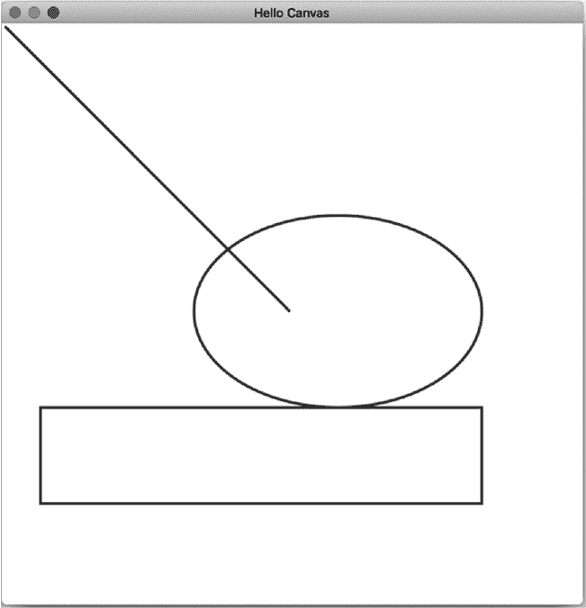

*图 10-7：添加到 Tkinter 画布上的矩形*

不错！结果图像变得越来越奇怪，但在画布上绘制图形是不是既简单又有趣？

##### **绘制多边形**

我们需要了解的最后一个几何原始图形是通用多边形。在你添加了绘制矩形的代码之后，写入以下内容：

```py
--snip--

canvas.create_polygon(
    [40, 200, 300, 450, 600, 0],
    width=3,
    outline='#aa3355',
    fill=''
)

tk.mainloop()
```

`create_polygon` 的第一个参数是一个顶点坐标的列表。其余的是影响样式的命名参数。请注意，我们将空字符串传递给 `fill` 参数；默认情况下，多边形是填充的，但我们希望它只有轮廓。运行文件查看结果。它应该类似于 图 10-8。

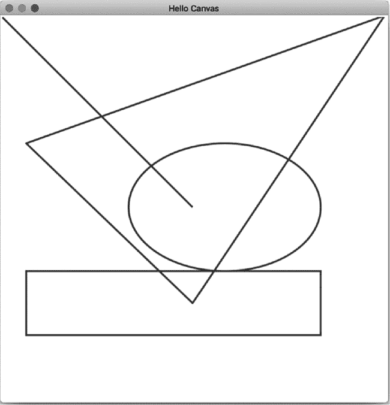

*图 10-8：添加到 Tkinter 画布上的多边形*

我们创建了一个顶点为 (40, 200)、(300, 450) 和 (600, 0) 的三角形。尝试添加填充颜色并查看结果。

##### **绘制文本**

它不是一个几何原始图形，但我们可能还需要在画布上绘制一些文本。使用 `create_text` 方法可以轻松做到这一点。将以下内容添加到 *hello_canvas.py*：

```py
--snip--

canvas.create_text(
    300, 520,
    text='This is a weird drawing',
    fill='#aa3355',
    font='Helvetica 20 bold'
)

tk.mainloop()
```

前两个参数是文本中心的 x 和 y 坐标。命名参数 `text` 是我们设置实际文本的地方；我们可以使用 `font` 来更改字体。最后运行文件一次，查看完整的绘图，如 图 10-9 所示。

如果我们可以绘制线条、圆形、矩形、通用多边形和文本，我们几乎可以绘制任何东西。我们也可以使用弧线和样条曲线，但我们将通过仅使用这些简单的原语来完成我们的仿真。

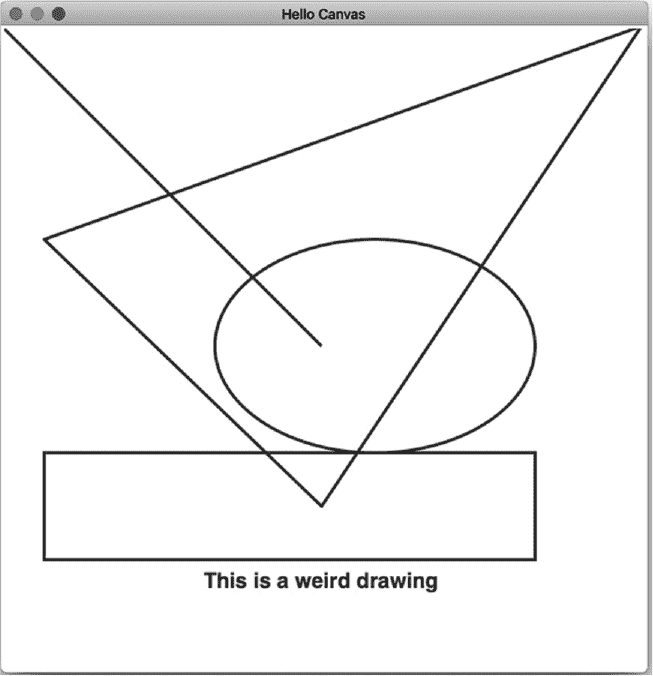

*图 10-9: 添加到我们的 Tkinter 画布上的文本*

你的最终代码应该如下所示，参考清单 10-5。

```py
from tkinter import Tk, Canvas

tk = Tk()
tk.title("Hello Canvas")

canvas = Canvas(tk, width=600, height=600)
canvas.grid(row=0, column=0)

canvas.create_line(
    0, 0, 300, 300,
    width=3,
    fill='#aa3355'
)
canvas.create_oval(
    200, 200, 500, 400,
    width=3,
    outline='#aa3355'
)
canvas.create_rectangle(
    40, 400, 500, 500,
    width=3,
    outline='#aa3355'
)
canvas.create_polygon(
    [40, 200, 300, 450, 600, 0],
    width=3,
    outline='#aa3355',
    fill=''
)
canvas.create_text(
    300, 520,
    text='This is a weird drawing',
    fill='#aa3355',
    font='Helvetica 20 bold'
)

tk.mainloop()
```

*清单 10-5: 最终绘图代码*

现在我们知道如何将简单的原语绘制到画布上，让我们想出一种方法，直接将我们的*geom2d*库的几何原语绘制到画布上。

### **绘制我们的几何原语**

使用画布的 create_oval 方法绘制圆形非常简单。然而，这个方法并不方便；为了定义圆形，你需要传递定义一个矩形的两个顶点的坐标，该矩形内接圆形或椭圆。另一方面，我们的 Circle 类通过它的中心点和半径来定义，并且具有一些有用的方法，可以使用 AffineTransform 的实例进行变换。如果我们能像这样直接绘制我们的圆形，那就太好了：

```py
circle = Circle(Point(2, 5), 10)
canvas.draw_circle(circle)
```

我们肯定希望与我们的几何原语一起工作。类似于我们在第八章中创建它们的 SVG 表示方式，我们需要一种方法将它们绘制到画布上。

计划如下：我们将为 Tkinter 的 Canvas 小部件创建一个包装类。我们将创建一个包含我们希望绘制的画布实例的类，但它的方法允许我们传递自己的几何原语。为了利用我们强大的仿射变换实现，我们将把变换与绘图关联，这样我们传递的所有原语将首先经过变换。

#### ***画布包装类***

包装类就是一个包含另一个类（它所包装的类）实例的类，并用于提供与被包装类相似的功能，但具有不同的接口和一些附加的功能。这是一个简单却强大的概念。

在这种情况下，我们正在包装一个 Tkinter 画布。我们的画布包装类的目标是让我们以简单、干净的接口绘制我们的几何原语：我们希望方法能够直接接受我们的原语实例。这个包装类将帮助我们避免重复的任务，即将几何类的表示适配为 Tkinter 画布绘图方法所期望的输入。不仅如此，我们还会对我们绘制的所有内容应用仿射变换。图 10-10 描述了这个过程。

在*simulation*包中，创建一个名为*draw.py*的新文件。输入清单 10-6 中的代码。

```py
from tkinter import Canvas

from geom2d import AffineTransform

class CanvasDrawing:

    def __init__(self, canvas: Canvas, transform: AffineTransform):
        self.__canvas = canvas
        self.outline_color = '#aa3355'
        self.outline_width = 3
        self.fill_color = ''
        self.transform = transform

    def clear_drawing(self):
        self.__canvas.delete('all')
```

*清单 10-6: 画布包装类*

CanvasDrawing 类被定义为 Tkinter 画布的包装类。一个画布实例被传递给初始化函数并存储在一个私有变量 __canvas 中。将 __canvas 设为私有意味着我们不希望任何使用 CanvasDrawing 的人直接访问它。它现在属于包装类实例，应该仅通过其方法使用。

一个 AffineTransform 实例也被传递给初始化函数。我们将在绘制到 Tkinter 画布之前，将这个仿射变换应用到所有几何原件。变换存储在一个公共变量中：transform。这意味着我们允许 CanvasDrawing 实例的用户直接操作和编辑这个属性，它是实例状态的一部分。我们这样做是为了让改变绘制时应用的仿射变换变得简单，通过将 transform 属性重新赋值为一个不同的变换。

一个实例的状态定义了它的行为：如果状态发生变化，实例的行为也会随之变化。在这种情况下，很明显，如果属性 transform 被重新分配为一个不同的仿射变换，所有后续的绘图命令将会根据这个变换产生结果。

图 10-10 是一个表示我们画布包装类行为的图示。它将接收不同几何原件的绘制请求，应用仿射变换，并调用 Tkinter 的画布方法将其绘制到画布上。

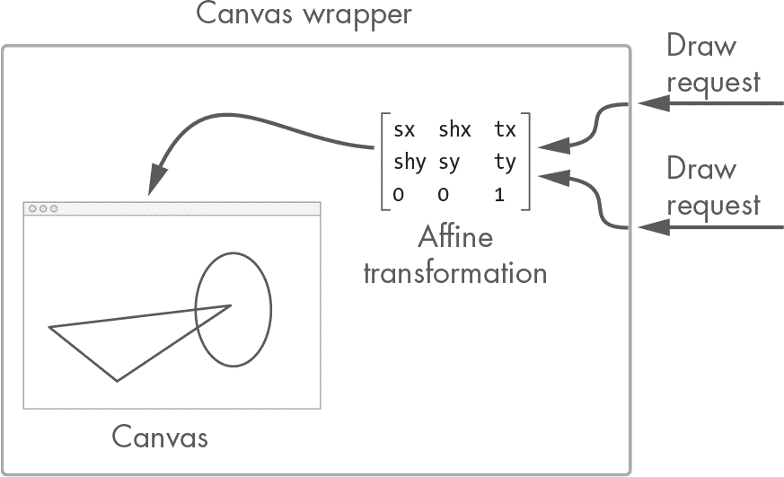

*图 10-10：画布包装类*

初始化函数中还定义了其他状态变量：outline_color，用于定义几何体轮廓的颜色，outline_width 用于轮廓的宽度，fill_color 用于填充几何体的颜色。这些在初始化函数中有默认值（在前一节示例中使用的那些），但它们也是公共的，实例的用户可以更改它们。如同之前一样，应该清楚这些属性是实例状态的一部分：如果我们编辑 outline_color，例如，所有后续的绘图都会使用该颜色作为轮廓色。

我们在这个类中只定义了一个方法：clear_drawing。这个方法将清除画布，在每次绘制每个帧之前使用。现在让我们聚焦于绘图命令。

#### ***绘制线段***

让我们从最简单的几何原件开始绘制：线段。在 Canvas Drawing 类中，输入清单 10-7 中的方法。对于这段代码，你需要先更新*geom2d*的导入，包含 Segment 类。

```py
from tkinter import Canvas

from geom2d import Segment, AffineTransform

class CanvasDrawing:
   --snip--

   def draw_segment(self, segment: Segment):
       segment_t = self.transform.apply_to_segment(segment)
       self.__canvas.create_line(
           segment_t.start.x,
           segment_t.start.y,
           segment_t.end.x,
           segment_t.end.y,
           fill=self.outline_color,
           width=self.outline_width
       )
```

*清单 10-7：绘制线段*

**注意**

*注意我们是如何将* self.outline_color *值传递给* fill *参数的。这看起来像是一个错误，但不幸的是，Tkinter 选择了一个不好的名字。* fill *属性用于* create_line *命令中的笔触颜色。更好的名字应该是* outline *或者，更好的是，* stroke-color。

`draw_segment` 方法做了两件事：首先，它使用当前仿射变换转换给定的段，并将结果存储在 `segment_t` 中。然后，它调用画布实例的 `create_line` 方法。对于轮廓颜色和宽度，我们使用实例的状态变量。

让我们继续讨论多边形、圆形和矩形。

#### ***绘制多边形***

如果你还记得在第 179 页的“转换段和多边形”中提到的内容，一旦仿射变换应用到圆形或矩形上，结果将是一个通用的多边形。这意味着所有三个多边形都将使用画布的 `create_polygon` 方法进行绘制。

让我们创建一个私有方法，将多边形绘制到画布上，忽略仿射变换；这一部分将由每个公共绘图方法来处理。

在你的 `CanvasDrawing` 类中，输入清单 10-8 中的私有方法。

```py
from functools import reduce
from tkinter import Canvas

from geom2d import Polygon, Segment, AffineTransform

class CanvasDrawing:
    --snip--

    def __draw_polygon(self, polygon: Polygon):
        vertices = reduce(
            list.__add__,
            [[v.x, v.y] for v in polygon.vertices]
        )

        self.__canvas.create_polygon(
            vertices,
            fill=self.fill_color,
            outline=self.outline_color,
            width=self.outline_width
        )
```

*清单 10-8：将多边形绘制到画布上*

对于这段代码，你需要添加以下导入：

```py
from functools import reduce
```

并更新来自 geom2d 的导入：

```py
from geom2d import Polygon, Segment, AffineTransform
```

`__draw_polygon` 方法首先准备多边形的顶点坐标，以符合画布小部件的 `create_polygon` 方法的期望。这是通过使用 Python 的列表 `__add__` 方法来减少多个顶点坐标列表实现的，正如你回忆的那样，`__add__` 方法重载了 `+` 操作符。

让我们分解一下。首先，通过列表推导式将多边形的顶点映射出来：

```py
[[v.x, v.y] for v in polygon.vertices]
```

这将创建一个包含每个顶点的 x 和 y 坐标的列表。如果多边形的顶点是 (0, 10)、(10, 0) 和 (10, 10)，之前展示的列表推导式将生成如下列表：

```py
[[0, 10], [10, 0], [10, 10]]
```

这个列表接下来需要被 *扁平化*：内嵌列表中的所有值（数值坐标）必须连接成一个单一的列表。扁平化之前的列表的结果将如下所示：

```py
[0, 10, 10, 0, 10, 10]
```

这是方法 `create_polygon` 所期望的顶点坐标列表。最终的扁平化步骤是通过 `reduce` 函数实现的；我们传递给它列表的 `.__add__` 操作符，它生成一个新的列表，该列表由连接两个列表操作数的结果组成。要查看这个过程的实际效果，你可以在 Python 的交互式命令行中测试以下内容：

```py
>>> [1, 2] + [3, 4]
[1, 2, 3, 4]
```

一旦顶点坐标列表准备好，将其绘制到画布上就变得简单了：我们只需将该列表传递给画布的 `create_polygon` 方法。现在最困难的部分已经完成，绘制多边形应该会更容易。将清单 10-9 中的代码输入到你的类中。

```py
from functools import reduce
from tkinter import Canvas

from geom2d import Circle, Polygon, Segment, Rect, AffineTransform

class CanvasDrawing:
    --snip--

   def draw_circle(self, circle: Circle, divisions=30):
       self.__draw_polygon(
           self.transform.apply_to_circle(circle, divisions)
       )

   def draw_rectangle(self, rect: Rect):
       self.__draw_polygon(
           self.transform.apply_to_rect(rect)
       )

   def draw_polygon(self, polygon: Polygon):
       self.__draw_polygon(
           self.transform.apply_to_polygon(polygon)
       )
```

*清单 10-9：绘制圆形、矩形和通用多边形*

不要忘记添加来自 *geom2d* 的缺失导入：

```py
from geom2d import Circle, Polygon, Segment, Rect, AffineTransform
```

在这三种方法中，过程是相同的：调用私有方法 `__draw_polygon`，并将当前仿射变换应用到几何形状后的结果传递给它。不要忘了，在圆形的情况下，我们需要将用来近似圆形的分割数传递给变换方法。

#### ***绘制箭头***

现在让我们按照我们在第八章中为 SVG 图像使用的方法来绘制箭头。

箭头的头部将绘制在线段的端点*E*上，由两条线段在该端点成角度相交组成。为了提供一些灵活性，我们将使用二维来定义箭头的几何形状：长度和高度（参见图 10-11）。

如你在图 10-11（从第八章重复）中看到的，要绘制箭头的头部，我们需要弄清楚点*C*[1]和*C*[2]的位置。有了这两个点，我们就可以轻松绘制从*C*[1]到*E*以及从*C*[2]到*E*的线段。

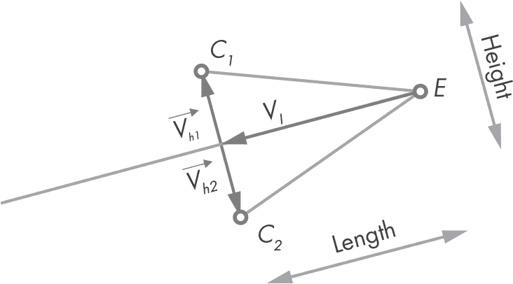

*图 10-11：箭头中的关键点*

为了找出这些点在平面中的位置，我们将计算三个向量：，它的长度与箭头头部相同，并且方向与线段的方向向量相反，另外两个是和，它们与线段垂直，且长度都等于箭头头部高度的一半。图 10-11 展示了这些向量。点*C*[1]可以通过创建一个*E*（线段的端点）的平移版本来计算，

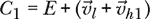

同样地，*C*[2]：

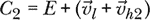

让我们编写这个方法。在 CanvasDrawing 类中，输入清单 10-10 中的代码。

```py
class CanvasDrawing:
    --snip--

    def draw_arrow(
            self,
            segment: Segment,
            length: float,
            height: float
    ):
        director = segment.direction_vector
        v_l = director.opposite().with_length(length)
        v_h1 = director.perpendicular().with_length(height / 2.0)
        v_h2 = v_h1.opposite()

        self.draw_segment(segment)
        self.draw_segment(
            Segment(
                segment.end,
             ➊ segment.end.displaced(v_l + v_h1)
            )
        )
        self.draw_segment(
            Segment(
                segment.end,
             ➋ segment.end.displaced(v_l + v_h2)
            )
        )
```

*清单 10-10：绘制箭头*

我们首先计算出需要的三个向量，利用之前的公式找出点*C*[1]和*C*[2]的位置。正如你所看到的，由于我们在 Vector 类中实现的方法，这一过程相当直接。例如，为了获得，我们使用线段方向向量的相反向量，并将其缩放到所需的长度。我们使用类似的操作来计算我们方程式中的其余元素。

然后我们有三个线段：基准线，即作为参数传递的线段；从*E*到*C*[1] ➊ 的线段；以及从*E*到*C*[2] ➋ 的线段。

作为参考，你的*drawing.py*文件应该如下所示：清单 10-11。

```py
from functools import reduce
from tkinter import Canvas

from geom2d import Circle, Polygon, Segment, Rect, AffineTransform

class CanvasDrawing:

    def __init__(self, canvas: Canvas, transform: AffineTransform):
        self.__canvas = canvas
        self.outline_color = '#aa3355'
        self.outline_width = 3
        self.fill_color = ''
        self.transform = transform

    def clear_drawing(self):
        self.__canvas.delete('all')

    def draw_segment(self, segment: Segment):
        segment_t = self.transform.apply_to_segment(segment)
        self.__canvas.create_line(
            segment_t.start.x,
            segment_t.start.y,
            segment_t.end.x,
            segment_t.end.y,
            outline=self.outline_color,
            width=self.outline_width
        )

    def draw_circle(self, circle: Circle, divisions=30):
        self.__draw_polygon(
            self.transform.apply_to_circle(circle, divisions)
        )

    def draw_rectangle(self, rect: Rect):
        self.__draw_polygon(
            self.transform.apply_to_rect(rect)
        )

    def draw_polygon(self, polygon: Polygon):
        self.__draw_polygon(
            self.transform.apply_to_polygon(polygon)
        )

    def __draw_polygon(self, polygon: Polygon):
        vertices = reduce(
            list.__add__,
            [[v.x, v.y] for v in polygon.vertices]
        )

        self.__canvas.create_polygon(
            vertices,
            fill=self.fill_color,
            outline=self.outline_color,
            width=self.outline_width
        )

    def draw_arrow(
            self,
            segment: Segment,
            length: float,
            height: float
    ):
        director = segment.direction_vector
        v_l = director.opposite().with_length(length)
        v_h1 = director.perpendicular().with_length(height / 2.0)
        v_h2 = v_h1.opposite()

        self.draw_segment(segment)
        self.draw_segment(
            Segment(
                segment.end,
                segment.end.displaced(v_l + v_h1)
            )
        )
        self.draw_segment(
            Segment(
                segment.end,
                segment.end.displaced(v_l + v_h2)
            )
        )
```

*清单 10-11：CanvasDrawing 类结果*

现在我们有了一种方便的方式来绘制几何图形，但它们完全没有运动，我们需要运动来生成模拟。让这些几何图形栩栩如生的缺失成分是什么呢？这就是下一章的主题。事情变得越来越激动人心！

### **总结**

在本章中，我们介绍了使用 Python 的 Tkinter 包创建图形用户界面的基础知识。我们学习了如何使用网格系统将小部件放置到主窗口中。我们还了解了如何让按钮响应点击事件，以及如何读取文本框的内容。最重要的是，我们学习了 Canvas 类及其方法，利用这些方法我们可以在画布上绘制简单的原始图形。

我们通过创建自己的类来结束这一章节，该类封装了 Tkinter 的画布，并允许我们直接绘制几何原始图形。这个类还包括一个仿射变换，在图形绘制之前应用于原始图形。该类具有定义笔触宽度和颜色以及填充颜色的属性。这些属性决定了我们用它绘制的几何图形的宽度和颜色。现在是时候让这些静态几何图形动起来了。
