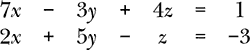
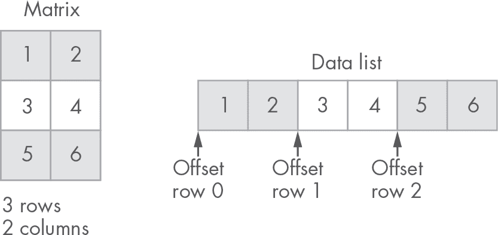
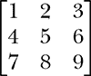
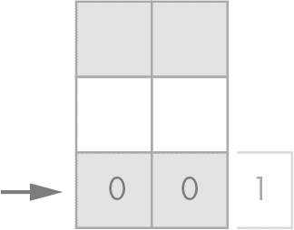
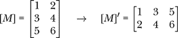

## 第十三章：矩阵和向量


本书的这一部分将处理方程组的求解。我们可以方便地使用 *矩阵形式* 来表示一组方程，其中将未知系数存储在矩阵中，将自由项存储在向量中。

我们一直在与矩阵和向量进行仿射变换工作，但为了完整性起见，我们在这里定义它们。*矩阵* 是一个按行和列排列的二维数字数组。矩阵可以进行一些数学运算，包括加法、减法、乘法等。此上下文中的 *向量* 是一个只有一行或一列（通常为一列）的矩阵。

考虑以下方程组：



我们可以方便地将其写成矩阵形式如下：


注意方程中的系数是如何表示的，它们在 2（行）乘 3（列）的矩阵中。根据矩阵乘法规则，这些系数与未知数 *x*、*y* 和 *z* 相乘，得到我们的两个方程，每个方程的结果需要等于其对应的右边项，这些右边项存储在 ⟨1,–3⟩ 向量中。

现在可能不太明显，但矩阵，以及由此扩展的向量，将大大简化方程组的工作。然而，要使用它们，我们需要为矩阵和向量实现新的类。

新的 Vector 类将表示一个任意长度的单维数组（序列）中的数字。这种类型的向量不应与我们在第四章中实现的几何向量混淆，后者由两个坐标（*u* 和 *v*）组成。我们新的 Vector 类的一个大小为 2 的实例看起来可能与几何向量相似，但它们是不同的：这些数字不一定表示定义方向的坐标。我们将不得不处理两个同名的类：Vector。如你所见，由于它们定义在不同的模块中，消除歧义应该不会有任何问题。

我们可以为这两个新类实现很多操作，但我们将务实，只实现下一章中求解方程组所需的操作。例如，尽管加法、减法或乘法是常见的，我们并不需要实现这些操作。

让我们首先实现两个简单的函数，帮助我们将新实例化的向量和矩阵填充为零。我们将在实例化向量或矩阵时使用这些函数。

### **列表工具**

在内部，这个新的 Vector 类的实例将使用一个数字列表来存储数据。当实例化该类的一个实例时，我们希望将其内部列表填充为零。这样，未明确设置为其他值的值默认将为零。类似地，Matrix 类将其数据存储在一个列表的列表中。我们还希望矩阵中的每个位置都初始化为零。

在*utils*包中创建一个新的 Python 文件，命名为*lists.py*，并在其中输入列表 13-1 中的代码。

```py
 def list_of_zeros(length: int):
    return [0] * length

def list_of_list_of_zeros(rows: int, cols: int):
    return [list_of_zeros(cols) for _ in range(rows)]
```

*列表 13-1：零列表*

我们定义了两个函数。第一个函数，list_of_zeros，接受一个长度参数，并创建一个填充零的指定长度的列表。第二个函数，list_of_list_of_zeros，创建多个大小为 cols 的零列表，数量由参数 rows 指定。

对于[0] * length 这种有趣的语法可以这样理解：“创建一个由零组成的列表，长度为给定值。”可以在 Python 控制台中试试：

```py
>>> [0] * 5
[0, 0, 0, 0, 0]
```

这是一种初始化包含相同重复值的列表的简洁方式。

list_of_list_of_zeros 函数使用列表推导创建一个大小为 rows 的列表，其中每个项目是一个大小为 cols 的零列表。在每次迭代中，索引并未使用，因此使用了下划线：

```py
from _ in range(rows)
```

让我们在终端中尝试这个函数：

```py
>>> from utils.lists import list_of_list_of_zeros
>>> list_of_list_of_zeros(2, 3)
[[0, 0, 0], [0, 0, 0]]
```

现在让我们设置一个新包，在其中添加新的 Matrix 和 Vector 类。

### **设置**

现在让我们在项目中创建一个新包，里面添加 Vector 和 Matrix 的实现。这个包还将包含我们将在接下来的章节中实现的方程求解函数，通常也会包含我们编写的任何数学或方程求解算法。在项目的顶层创建一个新包，并命名为*eqs*。在其内部再添加一个包，并命名为*tests*。你项目的结构应该现在看起来像这样：

力学

|- apps

|    |- circle_from_points

|- eqs

|    |- tests

|- geom2d

|    |- tests

|- graphic

|    |- simulation

|    |- svg

|- utils

你应该已经添加了*eqs*目录及其*tests*子目录：

力学

| ...

|- eqs

|    |- tests

| ...

### **向量**

正如我们在本章介绍中所看到的，*eqs*包中的向量将表示一个存储在列表中的数字序列。我们不会将其与*geom2d*包中的 Vector 实现混淆；它们共用一个名称，虽然这是不幸的，但记住它们是两个不同的（虽然有联系的）概念。这里的向量是一种特殊类型的矩阵；具体来说，它们是只有一行或一列的矩阵。例如，我们可以称一个向量为


作为一个*列向量*，突出了它是一个只有一列的矩阵。同样地，我们称这样的向量为

[2  –1  3]

一个*行向量*，因为它只是一个只有一行的矩阵。

我们将矩阵和向量实现为两个独立的类（而不是使用 Matrix 类来表示两者），仅仅是为了提高可读性。例如，为了从矩阵中获取一个值，我们需要指明行和列的索引。而对于向量，我们只需要一个索引，因此使用 Matrix 类来存储向量是有意义的，但这将迫使我们在获取或设置值时传递两个索引，而从概念上讲，只需要一个索引即可。因此，在阅读像这样的代码时

```py
m.value_at(2, 4)
v.value_at(3)
```

我们可以快速识别出 m 是一个矩阵，而 v 是一个向量。

#### ***实现向量类***

我们将使用一个列表来存储向量的数据。我们不会让用户访问这个私有的数字列表，而是会在类中提供方法来操作向量。在*eqs*中创建一个新文件*vector.py*，并在清单 13-2 中输入代码。

```py
from utils.lists import list_of_zeros

class Vector:

    def __init__(self, length: int):
        self.__length = length
        self.__data = list_of_zeros(length)

    @property
    def length(self):
        return self.__length
```

*清单 13-2：向量类*

当一个向量类的实例被初始化时，我们传入一个长度。这个长度保存在一个名为 __length 的类的私有属性中，并通过@property 装饰器作为属性暴露。这确保了向量类一旦被实例化，长度属性就不会被修改。回想一下，属性是只读的属性。

向量的数据存储在 __data 属性中，它是通过之前的 list_of_zeros 函数初始化的。

让我们实现设置向量中值的方法。在类中，输入清单 13-3 中的新代码。

```py
class Vector:
   --snip--

   def set_value(self, value: float, index: int):
       self.__data[index] = value
       return self

   def add_to_value(self, amount: float, index: int):
       self.__data[index] += amount
       return self

   def set_data(self, data: [float]):
       if len(data) != self.__length:
           raise ValueError('Cannot set data: length mismatch')

       for i in range(self.__length):
           self.__data[i] = data[i]

       return self
```

*清单 13-3：设置向量值*

我们添加了三个新方法。第一个方法 set_value 是最简单的：它在指定的索引处设置一个值。注意，如果给定的索引大于或等于向量的长度，或者小于零，我们会引发通常称为*越界*错误的异常，即 IndexError。只要我们对 Python 如何处理这种情况满意，就不需要自己检查这个条件。同样需要注意的是，方法返回的是 self，也就是类的实例。我们将继续使用这个模式，在类中设置值时返回实例。这样我们就可以链接“设置”操作或执行类似的操作。

```py
vec = Vector(5).set_value(3, 2)
```

而不是做这个不太漂亮的等效方法：

```py
vec = Vector(5)
vec.set_value(3, 2)
```

我们定义的第二种方法是 add_to_value，它将给定的值加到向量中的一个值上。当你在本书的第五部分中处理结构时，这个方法会很方便，正如你将看到的那样。

最后，我们有 set_data 方法，它将源数据列表中的所有值设置到向量中。为此，它首先检查提供的列表是否与向量的长度相同；然后将每个值复制到私有列表 __data 中。

现在让我们实现一个方法，从向量中获取给定索引的值。在*vector.py*文件中，输入清单 13-4 中的代码。

```py
class Vector:
   --snip--

   def value_at(self, index: int):
       return self.__data[index]
```

*清单 13-4：获取向量值*

我们快完成向量类的实现了。我们可以实现更多方法来执行如加法或减法向量等操作，但本书的目的不需要这些。我们唯一需要的一个方法是 __eq__，它可以用来检查两个向量实例是否相等。现在我们来实现它。在*vector.py*文件中添加以下导入：

```py
from geom2d import are_close_enough
```

然后在清单 13-5 中输入新代码。

```py
from geom2d import are_close_enough
from utils.lists import list_of_zeros

class Vector:
    --snip--

    def __eq__(self, other):
        if self is other:
            return True

        if not isinstance(other, Vector):
            return False

        if self.__length != other.__length:
            return False

        for i in range(self.length):
            if not are_close_enough(
                    self.value_at(i),
                    other.value_at(i)
            ):
                return False

        return True
```

*清单 13-5：向量类相等性*

我们首先检查是否正在比较同一个实例与它自己，在这种情况下，结果是 True，我们无需再比较其他内容。接着，如果传入的对象不是 Vector 类的实例，我们知道比较无法成功，因此返回 False。如果我们发现正在比较两个 Vector 类的实例，那么我们开始进行实际的检查。首先确保两个向量的长度相同（不同大小的向量无法相等）。如果长度检查成功，我们最后通过 our are_close_enough 函数逐一检查值是否相等。

当我们实现可能计算量大的 __eq__ 方法时，重要的是先检查计算量较小的条件。例如，在这里，我们首先快速检查向量的长度，再进行每对值的相等性比较。相比需要进行 *n* 次比较（*n* 是向量的长度）的值比较，长度比较只需要一次比较。

我们完成的 Vector 类应与第 13-6 段中的示例类似。

```py
from geom2d import are_close_enough
from utils.lists import list_of_zeros

class Vector:

    def __init__(self, length: int):
        self.__length = length
        self.__data = list_of_zeros(length)

    @property
    def length(self):
        return self.__length

    def set_value(self, value: float, index: int):
        self.__data[index] = value
        return self

    def add_to_value(self, amount: float, index: int):
        self.__data[index] += amount
        return self

    def set_data(self, data: [float]):
        if len(data) != self.__length:
            raise ValueError('Cannot set data: length mismatch')

        for i in range(self.__length):
            self.__data[i] = data[i]

        return self

    def value_at(self, index: int):
        return self.__data[index]

    def __eq__(self, other):
        if self is other:
            return True

        if not isinstance(other, Vector):
            return False

        if self.__length != other.__length:
            return False

        for i in range(self.length):
            if not are_close_enough(
                    self.value_at(i),
                    other.value_at(i)
            ):
                return False

        return True
```

*第 13-6 段：向量类结果*

因为这个类将作为解线性方程组的基础，所以我们不能容忍其实现中有任何错误：否则，解这些方程组将变得毫无意义。让我们添加一些测试，确保这个类没有漏洞。

#### ***测试向量类***

在本章开始时，我们在 *eqs* 包内创建了一个 *test* 目录。在该目录内，创建一个名为 *vector_test.py* 的新文件，并输入第 13-7 段中的代码。

```py
import unittest

from eqs.vector import Vector

class VectorTest(unittest.TestCase):

    def test_length(self):
        self.assertEqual(5, Vector(5).length)

    def test_unset_value_is_zero(self):
        vector = Vector(2)
        self.assertEqual(0.0, vector.value_at(0))
        self.assertEqual(0.0, vector.value_at(1))

    def test_set_get_value(self):
        value = 10.0
        vector = Vector(2).set_value(value, 1)
        self.assertEqual(0.0, vector.value_at(0))
        self.assertEqual(value, vector.value_at(1))

    def test_add_to_value(self):
        vector = Vector(2).set_data([1, 2]).add_to_value(10, 0)
        self.assertEqual(11, vector.value_at(0))
        self.assertEqual(2, vector.value_at(1))
```

*第 13-7 段：向量类单元测试*

这段代码定义了一个新的测试类 VectorTest，包含四个单元测试。运行所有测试，确保它们通过，并且我们的实现是正确的。你可以通过 Bash Shell 执行这些测试：

```py
$ python3 -m unittest eqs/tests/vector_test.py
```

第一个测试 test_length 检查向量的长度属性是否返回正确的值。接下来是 test_unset_value_is_zero，它确保我们正确地初始化了向量，并将其填充为零。test_set_get_value 在索引 1 处设置值 10.0，并检查向量在请求索引 1 处的项时是否返回相同的值。我们还断言向量在索引 0 处返回零，以确保 set_value 不会修改任何它不应该修改的值。最后，我们有 test_add_to_value 来测试 add_to_value 方法。此测试初始化向量为 [1, 2]，将 10 单位添加到索引 0 处的项，并断言该索引的值是否正确更新。

你可能已经注意到，test_set_get_value 测试可能会因为两种不同的原因失败：（1）vector 的 set_value 方法实现有误，或者（2）value_at 方法实现有误。大部分情况都是这样，你指出我们在这里破坏了良好测试的第一条规则是对的（参见 第 97 页的“三大单元测试黄金法则”）。但没有使用 value_at 方法的断言来测试 set_value 方法是很难的。我们本可以通过某种方式访问 vector 的私有 __data 来获取值，而不使用 value_at，但更倾向于通过类的公共 API 来测试，而不是访问它的实现细节。我们希望能够改变类的内部实现，而不改变它的行为，并且这不应该导致任何测试失败。如果我们依赖于类的内部结构来进行测试，那就会把测试与类的实现紧密耦合。

作为经验法则，类的私有实现应该始终对外界保密；只有类本身才应该了解它。这在面向对象术语中叫做 *封装*。

我们的 Vector 类现在已经准备好并经过测试。让我们实现一个类来表示矩阵。

### **矩阵**

矩阵为向量增加了一个额外的维度。矩阵是按行和列分布的数字数组。

在 *eqs* 目录下创建一个新的文件 *matrix.py*。输入 Matrix 类的初始定义，如 清单 13-8 所示。

```py
from utils.lists import list_of_list_of_zeros

class Matrix:

    def __init__(self, rows_count: int, cols_count: int):
        self.__rows_count = rows_count
        self.__cols_count = cols_count
        self.__is_square = rows_count == cols_count
        self.__data = list_of_list_of_zeros(rows_count, cols_count)

    @property
    def rows_count(self):
        return self.__rows_count

    @property
    def cols_count(self):
        return self.__cols_count

    @property
    def is_square(self):
        return self.__is_square
```

*清单 13-8：Matrix 类*

Matrix 类通过行数和列数进行初始化。这些值作为类的私有属性保存：__rows_count 和 __cols_count。它们作为公共属性公开：rows_count 和 cols_count。一个矩阵如果行数和列数相同，则为方阵。我们也将其作为属性公开：is_square。最后，我们使用在本章开始时创建的函数，初始化私有属性 __data，给它一个零填充的二维列表。

#### ***设置值***

让我们添加设置矩阵值的方法。在 Matrix 类中，输入 清单 13-9 中的两个方法。

```py
class Matrix:
    --snip--

   def set_value(self, value: float, row: int, col: int):
       self.__data[row][col] = value
       return self

   def add_to_value(self, amount: float, row: int, col: int):
       self.__data[row][col] += amount
       return self
```

*清单 13-9：设置矩阵的值*

就像我们在 Vector 类中做的那样，我们实现了一个方法，用于根据位置（由行和列给定）在矩阵中设置值，并且实现了另一个方法，用于在现有值上加上给定的数值。遵循我们设置值时返回实例的约定，set_value 和 add_to_value 方法都返回 self。

如果我们能通过一个值列表来填充矩阵，那也会非常方便。所以在我们刚刚写的代码之后，输入 清单 13-10 中的方法。

```py
class Matrix:
    --snip--

   def set_data(self, data: [float]):
    ➊ if len(data) != self.__cols_count * self.__rows_count:
           raise ValueError('Cannot set data: size mismatch')

       for row in range(self.__rows_count):
        ➋ offset = self.__cols_count * row
           for col in range(self.__cols_count):
            ➌ self.__data[row][col] = data[offset + col]

       return self
```

*清单 13-10：设置矩阵的值*

如你所见，使用列表中的值来设置矩阵数据并不像设置向量那样直接。我们需要执行一个检查，以确保数据适合矩阵：给定的数据应该具有与行数乘以列数 ➊ 相同的长度，也就是矩阵包含的总值数。如果不匹配，我们将抛出一个 ValueError。

然后，我们遍历矩阵的行索引。在偏移量变量中，我们存储输入列表中当前行数据的偏移量 ➋。对于索引为 0 的行，偏移量也是 0。对于索引为 1 的行，偏移量将是行的长度：即矩阵中的列数，依此类推。图 13-1 展示了这个偏移量。接下来，我们遍历列的索引，并从输入数据 ➌ 中设置 __data 中的每个值。



*图 13-1：从列表中设置矩阵数据*

正如我们将在第 V 部分中看到的，当我们处理桁架结构时，计算结构方程组的一个步骤是考虑节点上的外部约束条件。我们稍后会详细讲解，但现在知道这一修改要求我们将矩阵的行和列设置为单位向量就足够了。例如，如果我们有以下矩阵，



将行和列分别设置为索引 0 和 1 的单位向量，结果如下所示：


让我们在 Matrix 类中写两个方法来完成这个操作。输入代码见列表 13-11。

```py
class Matrix:
    --snip--

    def set_identity_row(self, row: int):
        for col in range(self.__cols_count):
            self.__data[row][col] = 1 if row == col else 0

        return self

    def set_identity_col(self, col: int):
        for row in range(self.__rows_count):
            self.__data[row][col] = 1 if row == col else 0

        return self
```

*列表 13-11：设置单位行和列*

我们实现了两个新方法：`set_identity_row`和`set_identity_col`。两者的实现类似：它们将行或列中的所有值设置为 0，除了主对角线上的位置，它被设置为 1。

在这段代码中，我们使用了紧凑的条件表达式：三元运算符。该运算符的语法如下：

```py
<expression> if <condition> else <expression>
```

它根据条件值返回两个表达式中的一个。在这个特定的案例中，我们的条件是`row == col`，当行索引和列索引相等时，该条件为 True。

请注意，如果矩阵不是方阵，可能会出现设置某行或某列为单位向量时，它最终会被填充为全零的情况。例如，见图 13-2。我们有一个三行两列的矩阵，并将第三行（索引为 2 的行）设置为单位行。由于矩阵只有两列，值 1 将超出矩阵范围，位于不存在的第三列中。



*图 13-2：在非方阵中设置单位行*

现在让我们添加两个方法来从矩阵中获取值。

#### ***获取值***

我们需要实现`value_at`方法，以便在给定的行和列索引处获取一个值。我们还需要另一个方法`value_transposed_at`，它能像矩阵已转置一样从矩阵中获取一个值。提醒一下：矩阵[*M*]的转置是另一个矩阵[*M*]^′，其中[*M*]的行和列互换：



我们将在第十四章中使用这种第二种方法来实现 Cholesky 分解算法，用于求解线性方程组。我们也可以在 Matrix 类中实现一个方法，返回一个新矩阵，该矩阵是通过转置当前矩阵得到的，然后从这个矩阵中提取值。这个方法确实是一个不错的选择，但由于表示线性方程组的矩阵通常非常大，将所有值复制到新矩阵中是一个计算开销很大的操作。能够像访问转置矩阵一样获取值，是我们在 Cholesky 实现中用到的性能优化。

在*matrix.py*中，输入清单 13-12 中的代码。

```py
class Matrix:
    --snip--

    def value_at(self, row: int, col: int):
        return self.__data[row][col]

    def value_transposed_at(self, row: int, col: int):
        return self.__data[col][row]
```

*清单 13-12：获取矩阵值*

首先实现`value_at`。该方法从私有数据存储中返回给定行和列索引处的值。接着是`value_transposed_at`。正如你所见，这个方法与`value_at`类似，唯一的区别是它不是直接从矩阵中获取值，而是模拟转置后的矩阵获取。

self.__data[row][col]

这次从矩阵中提取的值是

self.__data[col][row]

通过交换行和列索引，可以像访问转置矩阵一样获取该矩阵的值。这个方法稍后会带来显著的性能提升。

使用此方法时需要记住的一点是，我们传入的行索引不应大于列数，列索引也不应大于行数。由于我们是以矩阵转置的方式访问数据，实际的行数是原矩阵的列数，列数也是如此。

#### ***缩放值***

让我们实现最后一个有用的方法：缩放矩阵。就像我们可以缩放向量一样，我们也可以通过将矩阵的所有值乘以标量来缩放矩阵。请在清单 13-13 中输入此方法。

```py
class Matrix:
    --snip--

    def scale(self, factor: float):
        for i in range(self.__rows_count):
            for j in range(self.__cols_count):
                self.__data[i][j] *= factor

        return self
```

*清单 13-13：缩放矩阵*

该方法遍历所有的行列索引，并将每个位置存储的值乘以传入的因子。由于这是一个设置数据的方法，我们返回 self。

#### ***矩阵相等性***

为了完成 Matrix 类的实现，让我们加入`__eq__`方法来比较矩阵是否相等。首先，在*matrix.py*的顶部添加以下导入：

```py
from geom2d import are_close_enough
```

然后在清单 13-14 中输入`__eq__`方法的实现。

```py
from geom2d import are_close_enough
from utils.lists import list_of_list_of_zeros

class Matrix:
    --snip--

    def __eq__(self, other):
        if self is other:
            return True

        if not isinstance(other, Matrix):
            return False

        if self.__rows_count != other.rows_count:
            return False

        if self.__cols_count != other.cols_count:
            return False

        for i in range(self.__rows_count):
            for j in range(self.__cols_count):
                if not are_close_enough(
                        self.__data[i][j],
                        other.__data[i][j]
                ):
                    return False

        return True
```

*清单 13-14：矩阵类相等性*

像往常一样，我们首先检查`self`和`other`的引用，因为如果我们正在将一个实例与它自己进行比较，就不需要再比较其他任何东西，比较可以安全地返回 True。然后，我们确保传入的对象是`Matrix`类的实例；否则，我们就没有太多可以比较的内容。

在开始逐一比较矩阵值之前，我们要确保矩阵的大小相同。如果检测到行数或列数不匹配，我们返回 False。

最后，如果所有前面的检查都没有返回值，我们比较两个矩阵的值。一旦找到一对不相等的值（根据我们的`are_close_enough`函数），我们返回 False。如果所有值都相等，我们退出 for 循环，并最终返回 True。

作为参考，你的*matrix.py*文件应该如下所示：清单 13-15。

```py
from geom2d import are_close_enough
from utils.lists import list_of_list_of_zeros

class Matrix:

    def __init__(self, rows_count: int, cols_count: int):
        self.__rows_count = rows_count
        self.__cols_count = cols_count
        self.__is_square = rows_count == cols_count
        self.__data = list_of_list_of_zeros(rows_count, cols_count)

    @property
    def rows_count(self):
        return self.__rows_count

    @property
    def cols_count(self):
        return self.__cols_count

    @property
    def is_square(self):
        return self.__is_square

    def set_value(self, value: float, row: int, col: int):
        self.__data[row][col] = value
        return self

    def add_to_value(self, amount: float, row: int, col: int):
        self.__data[row][col] += amount
        return self

    def set_data(self, data: [float]):
        if len(data) != self.__cols_count * self.__rows_count:
            raise ValueError('Cannot set data: size mismatch')

        for row in range(self.__rows_count):
            offset = self.__cols_count * row
            for col in range(self.__cols_count):
                self.__data[row][col] = data[offset + col]

        return self

    def set_identity_row(self, row: int):
        for col in range(self.__cols_count):
            self.__data[row][col] = 1 if row == col else 0

        return self

    def set_identity_col(self, col: int):
        for row in range(self.__rows_count):
            self.__data[row][col] = 1 if row == col else 0

        return self

    def value_at(self, row: int, col: int):
        return self.__data[row][col]

    def value_transposed_at(self, row: int, col: int):
        return self.__data[col][row]

    def scale(self, factor: float):
        for i in range(self.__rows_count):
            for j in range(self.__cols_count):
                self.__data[i][j] *= factor

        return self

    def __eq__(self, other):
        if self is other:
            return True

        if not isinstance(other, Matrix):
            return False

        if self.__rows_count != other.rows_count:
            return False

        if self.__cols_count != other.cols_count:
            return False

        for i in range(self.__rows_count):
            for j in range(self.__cols_count):
                if not are_close_enough(
                        self.__data[i][j],
                        other.__data[i][j]
                ):
                    return False

        return True
```

*清单 13-15：矩阵类结果*

我们的矩阵类差不多完成了！我们需要检查是否有 bug。在编写代码时，我们可能犯了一些小错误。一旦开始使用这个类来求解方程组，这些错误可能会引发问题。这类计算通常在工程应用中至关重要，因此我们不能容忍实现中的任何 bug。不过这对我们来说没问题。我们知道该怎么做：让我们添加一些自动化单元测试。

#### ***测试矩阵类***

在*tests*文件夹中，创建一个新的文件，命名为*matrix_test.py*。在清单 13-16 中输入测试的初始代码。

```py
import unittest

from eqs.matrix import Matrix

class MatrixTest(unittest.TestCase):

    def test_is_square(self):
        self.assertTrue(
            Matrix(2, 2).is_square
        )

    def test_is_not_square(self):
        self.assertFalse(
            Matrix(2, 3).is_square
        )
```

*清单 13-16：矩阵单元测试*

在这个文件中，我们定义了一个新的测试类叫做`MatrixTest`，它继承自`TestCase`。我们为`is_square`属性创建了两个测试，一个检查矩阵是否是方阵，另一个检查矩阵是否不是方阵。运行测试，理想情况下它们都能通过，但如果没有，回到属性的实现中，确保实现正确。你可以使用以下命令从命令行运行测试：

```py
$  python3 -m unittest eqs/tests/matrix_test.py
```

你应该得到类似下面的输出：

```py
Ran 2 tests in 0.001s

OK
```

现在让我们检查设置或获取值的方法。在我们刚刚编写的两个测试之后，在清单 13-17 中输入测试。

```py
class MatrixTest(unittest.TestCase):
    --snip--

    def test_unset_value_is_zero(self):
        matrix = Matrix(2, 2)
        self.assertEqual(0.0, matrix.value_at(0, 1))

    def test_set_get_value(self):
        value = 10.0
        matrix = Matrix(2, 2).set_value(value, 0, 1)
        self.assertEqual(value, matrix.value_at(0, 1))

    def test_add_to_value(self):
        expected = [1, 12, 3, 4]
        matrix = Matrix(2, 2) \
            .set_data([1, 2, 3, 4]) \
            .add_to_value(10, 0, 1)
        self.assert_matrix_has_data(matrix, expected)
```

*清单 13-17：测试设置和获取值*

第一个测试确保在实例化时，矩阵中尚未设置的值为零。接着，我们测试`set_value`和`value_at`方法，确保它们能够正确设置和获取矩阵值。最后，我们测试`add_to_value`方法，确保它能够将给定的数值加到已经设置的值上。

在这个最后的测试中，我们使用了一个不存在的断言方法：assert _matrix_has_data。我们需要在 MatrixTest 类中自己实现这个方法，并在需要确保矩阵中所有值符合预期时使用它。通过这样做，我们可以只用一个断言来检查矩阵中的值是否与作为第二个参数传入的列表中的值相同。在测试类的最后部分，输入 Listing 13-18 中显示的方法定义。

```py
class MatrixTest(unittest.TestCase):
    --snip--

   def assert_matrix_has_data(self, matrix, data):
       for row in range(matrix.rows_count):
           offset = matrix.cols_count * row
           for col in range(matrix.cols_count):
               self.assertEqual(
                   data[offset + col],
                   matrix.value_at(row, col)
               )
```

*Listing 13-18: 自定义矩阵值断言*

这个断言方法与 Matrix 类中的 set_data 结构相同。这一次，我们不是设置值，而是使用 assertEqual 来测试是否相等。

我们必须注意，加入一个具有自己逻辑（此处为偏移计算）的断言方法，给测试引入了另一个失败的可能原因：断言方法本身实现错误。和往常一样，如果我们想要务实，就必须进行权衡。我们可以运用工程常识来分析利弊和替代方案。在这种情况下，拥有一个自定义的断言来检查矩阵值是值得的：它简化了矩阵值的断言，并使编写新测试和检查矩阵值变得轻松无忧。我们只需要特别确保断言方法中的逻辑是正确的。

现在让我们测试 set_data 方法。测试代码在 Listing 13-19 中。

```py
class MatrixTest(unittest.TestCase):
    --snip--

   def test_set_data(self):
       data = [1, 2, 3, 4, 5, 6]
       matrix = Matrix(2, 3).set_data(data)
       self.assert_matrix_has_data(matrix, data)
```

*Listing 13-19: 测试从列表设置数据*

在这个测试中，我们使用了自定义的断言方法，使得测试变得非常简短和简洁。我们创建了一个有两行三列的矩阵，使用一个包含 1 到 6 之间数字的列表设置数据，然后断言这些数据是否已经正确地放置在各自的位置。

接下来，我们的测试应该是针对设置身份行和列的方法。请输入 Listing 13-20 中的测试。

```py
class MatrixTest(unittest.TestCase):
    --snip--

    def test_set_identity_row(self):
        expected = [1, 0, 4, 5]
        matrix = Matrix(2, 2) \
            .set_data([2, 3, 4, 5]) \
            .set_identity_row(0)
        self.assert_matrix_has_data(matrix, expected)

    def test_set_identity_col(self):
        expected = [2, 0, 4, 1]
        matrix = Matrix(2, 2) \
            .set_data([2, 3, 4, 5]) \
            .set_identity_col(1)
        self.assert_matrix_has_data(matrix, expected)
```

*Listing 13-20: 测试设置身份行和列*

在这两个测试中，我们首先指定结果矩阵的预期值。然后，我们创建一个新的 2×2 矩阵，并将其值设置为介于 2 到 5 之间的数字列表。接着，我们设置身份行或身份列，并断言这些值是否符合预期。

我们避免在矩阵的任何初始值中使用 1：我们正在测试的方法会将矩阵中的某个值设置为 1。假设我们实现的 set_identity_row 方法错误地将矩阵中的一个值设置为 1，并且它选择将已经初始化为 1 的值再次设置为 1。如果是这样，我们的测试将无法检测到这个错误，因为无法判断这个 1 是我们在测试开始时自己设置的，还是 set_identity_row 方法设置的。通过不使用 1 作为输入值，我们避免了暴露测试中的这个问题。

我们在 Matrix 类中实现的最后一个需要测试的方法是：scale。测试代码见示例 13-21。

```py
class MatrixTest(unittest.TestCase):
    --snip--

   def test_scale(self):
       expected = [2, 4, 6, 8, 10, 12]
       matrix = Matrix(2, 3) \
           .set_data([1, 2, 3, 4, 5, 6]) \
           .scale(2)
       self.assert_matrix_has_data(matrix, expected)
```

*示例 13-21：测试缩放矩阵*

该测试创建了一个 2×3 的矩阵，使用 1 到 6 的数字设置其数据，然后将所有数值都缩放为 2。通过自定义的 assert_matrix_has_data 断言，我们检查所有的数值是否正确缩放。确保运行测试类中的测试。在 shell 中，运行方式如下：

```py
$ python3 -m unittest eqs/tests/matrix_test.py
```

你应该得到类似下面的输出：

```py
Ran 9 tests in 0.001s

OK
```

### **总结**

在本章中，我们实现了两个类，它们将帮助我们处理方程组：Vector（向量）和 Matrix（矩阵）。在下一章，我们将使用这两个类来表示我们将通过数值方法求解的方程组。
