## 结构求解


在前一章中，我们定义了结构模型的类：StrNode、StrBar 和 Structure。我们还编写了结构求解的类：StrNodeSolution、StrBarSolution 和 StructureSolution。我们使用前面三个类来定义结构，使用后面三个类来建模解，包括节点的位移和杆件的应力与应变。问题是，我们如何从定义模型过渡到求解模型呢？

在本章中，我们将通过开发求解算法来回答这个问题，该算法是原始结构模型和求解结构模型之间的桥梁。我们将回顾结构的求解过程，其中我们基于每根杆件的矩阵组装结构的刚度矩阵 [*k*]，并根据每个节点的负载组装负载向量 {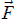}。解算 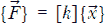 方程组得到结构节点在全局坐标系中的位移：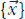。为了求解这个方程组，我们将使用我们的 Cholesky 实现。

本章还将介绍一种高级单元测试技术：测试替身（test doubles）。测试替身帮助我们通过将代码中依赖的函数或类替换为“虚拟”的实现，从而隔离代码的某一部分，以便在测试时只测试代码的一部分。

### **结构求解**

在前一章中，我们研究了与杆件的位移相关的各个自由度所施加的力的方程组。一个杆件有两个节点，每个节点有两个自由度：

*u* x 方向的位移

*v* y 方向的位移

这使得每根杆件总共有四个自由度：*u*[1]和*v*[1]对应节点 1，*u*[2]和*v*[2]对应节点 2。施加在节点上的力——我们称它们为 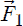 和 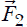——可以分别分解为两个分量。因此， 可以分解为 *F*[1*x*] 和 *F*[1*y*]，同样适用于 （参见图 16-1）。

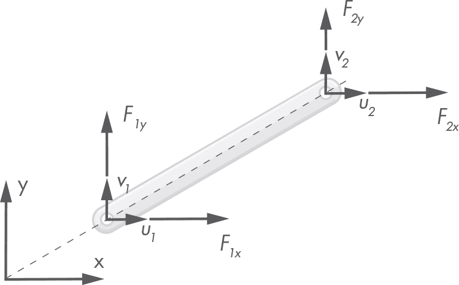

*图 16-1：杆件的自由度*

这些力和节点位移之间的方程系统在“全局坐标系中的刚度矩阵”一节中已重复出现，见第 397 页：

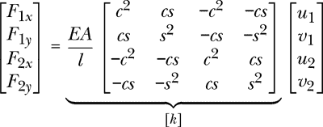

需要注意的是，这些力和位移，以及刚度矩阵 [*k*]，都是基于全局坐标系的，正如图 16-1 左下角所示的那样。每根杆件都有自己的局部坐标系，正如你从图 15-18 中看到的那样，但为了建立结构的全局方程组，我们希望将力和位移参考到这个全局坐标系。

在继续之前，让我们简要了解一下刚度矩阵中每个术语的含义。

#### ***解释刚度矩阵项***

刚度矩阵项将给定自由度的力与另一个自由度中产生的位移相关联。它们按一种明确定义的方式排列：

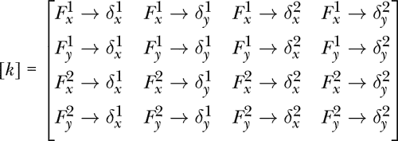

例如，这里 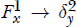 可以解读为“第一节点 x 方向的力 () 与它在第二节点 y 方向上产生的位移 (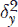) 之间的关系”。牢记这一点，我们可以辨识出一个模式。

每一行包含了将某一自由度的力与所有自由度的位移相关联的刚度项。例如，第一行包括将起始节点 x 轴方向的力 () 与所有可能的位移相关联的项：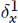、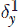、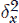 和 。

每一列包含了将每个自由度中的力与给定自由度中位移相关联的刚度项。例如，第一列包括将每个自由度中的力—、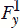、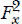 和 —与起始节点在 x 轴方向的位移相关联的项。

记住这种刚度项的解释；我们稍后在组装结构的全局刚度矩阵时将使用这些知识。让我们继续修订解析过程，并逐步编写代码。

#### ***结构初始化***

作为结构解析过程的一部分，我们希望将一些中间结果保存在结构类的私有属性中。在进入主算法之前，我们先初始化这些属性。

打开你的 *model/structure.py* 文件，编辑类，以便它包含我们在 __init__ 方法中添加的新属性，正如列表 16-1 中所示。

```py
  from functools import reduce

➊ from eqs import Matrix, Vector as EqVector
  from .node import StrNode
  from .bar import StrBar

  class Structure:
   ➋ __DOF_PER_NODE = 2

     def __init__(self, nodes: [StrNode], bars: [StrBar]):
        self.__bars = bars
        self.__nodes = nodes

      ➌ self.__dofs_dict = None
        self.__system_matrix: Matrix = None
        self.__system_vector: EqVector = None
        self.__global_displacements: EqVector = None

    --snip--
```

*列表 16-1：初始化结构*

我们需要从 eqs 包中添加两个新的导入，Matrix 和 Vector ➊。因为我们稍后还需要导入另一个 Vector 类，那个是在 geom2d 包中定义的，我们将 eqs 包中的 Vector 别名为 EqVector。请注意 Python 中的别名语法：

```py
from <module> import <identifier> as <alias>
```

接下来，我们定义一个名为 __DOF_PER_NODE ➋ 的常量，其值为 2。我们将在代码中使用这个常量，而不是直接使用数字。这个清晰的名称应该能很好地提示该数字的实际含义。我们将在代码中避免使用*魔法数字*，即那些出现在代码中，但不清楚其代表什么含义的数字。命名良好的常量可以告诉读者该数字实际上代表什么。

最后，我们定义四个新的私有属性，并将它们都初始化为 None ➌。

__dofs_dict 一个字典，其中键是节点的 ID，值是分配给该节点的自由度编号的列表。稍后我们会解释这个是什么意思。

__system_matrix 结构全局方程组的刚度矩阵。

__system_vector 结构全局方程组的载荷向量。

__global_displacements 一个节点的全局位移列表，其中每个位移的索引与其自由度编号相同。

如果你还不完全理解这些新属性的含义，别担心；我们将在后续章节中详细解释每个属性。

#### ***主要结构求解算法***

结构求解算法可以分为三个大步骤：

1.  为每个自由度分配一个编号。

1.  汇总并求解结构的方程组。

1.  使用系统的结果向量来构建求解模型。

让我们试着快速理解这些步骤的含义；我们稍后会补充剩余的细节。第一步，给自由度编号，是一个为结构中的每个自由度分配一个唯一数字的过程。我们以图 16-2 中的结构为例。

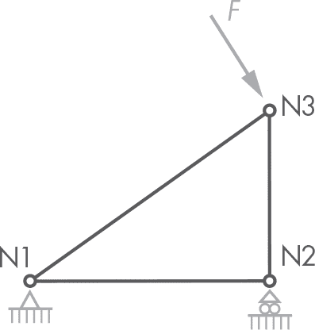

*图 16-2：我们的示例结构*

图 16-2 中的结构有三个节点（N1、N2 和 N3），每个节点有两个自由度。为自由度分配编号就像听起来那么简单：我们将每个自由度与一个独特的数字关联。表 16-1 展示了一个可能的自由度编号分配方案，使用了节点的自然顺序。

**表 16-1：分配自由度编号**

| **节点** | **自由度编号** |
| --- | --- |
| N1 | 0, 1 |
| N2 | 2, 3 |
| N3 | 4, 5 |

如你所见，我们从零开始分配 DOF 编号。我们本可以选择任何其他的数字集合，包括从我们喜欢的任何数字开始的编号方案，但由于我们将使用这些数字来引用系统矩阵和向量中的位置，使用直接与索引相关联的数字会更方便。否则，我们就需要在 DOF 编号和系统中的索引之间进行映射。

在分配了 DOF 编号后，下一步是组装全局方程系统。这个系统与杆件的方程系统结构相同：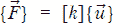。当我们解这个方程系统时，我们会得到所有自由度的全局位移。使用这些位移，我们可以利用第十五章中定义的类创建结构解模型。

让我们在`Structure`类（来自*model*包）中实现这个三步算法。请在列表 16-2 中输入新方法。

```py
class Structure:
    --snip--

    def solve_structure(self):
        self.__assign_degrees_of_freedom()
        self.__solve_system_of_equations()
        return self.__make_structure_solution()
```

*列表 16-2：结构解析*

`solve_structure`方法将计算解并返回一个`StructureSolution`实例。该方法概述了我们刚刚描述的三步过程。虽然这三个私有方法还不存在，但我们将在接下来的部分逐一实现它们。

#### ***自由度编号***

解析过程的第一步是为结构的每个自由度分配一个编号。请记住，每个节点有两个自由度，因此`__assign_degrees_of_freedom`方法会为结构的每个节点分配两个数字，并将它们保存在我们在列表 16-1 中初始化的`__dofs_dict`字典里。分配了 DOF 编号后，我们在图 16-2 中看到的结构现在应该像图 16-3 那样。

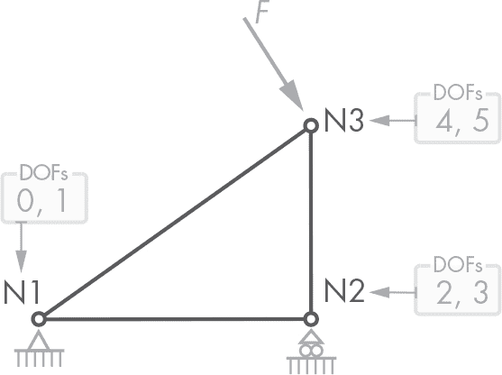

*图 16-3：我们结构节点的自由度，带有编号标签*

让我们实现这个方法。请在列表 16-3 中输入代码。

```py
class Structure:
    --snip--

    def __assign_degrees_of_freedom(self):
        self.__dofs_dict = {}
        for i, node in enumerate(self.__nodes):
            self.__dofs_dict[node.id] = (2 * i, 2 * i + 1)
```

*列表 16-3：自由度分配*

该方法首先初始化`__dofs_dict`属性，将其设置为空字典，以确保每次运行该方法时使用的是一个全新的字典。然后，我们遍历结构中所有节点的枚举（`self.__nodes`），将每个节点的 id 作为字典中的键，并将该节点的自由度（DOFs）作为一个包含两个数字的元组与之关联。

Python 中的`enumerate`函数返回我们传递给该函数的元素的可迭代序列及其索引。当我们的逻辑需要获取列表中项目的索引时，这个函数非常方便。在这里，我们使用节点的索引来计算它的 DOF 编号，对于给定的索引`i`，DOF 编号分别是`2*i`和`2*i + 1`。

因此，索引为 0 的第一个节点将获得自由度 0 和 1，索引为 1 的节点将获得自由度 2 和 3，以此类推。

对于一个有三个节点（编号为 1、2 和 3）的结构，其自由度字典可能如下所示：

```py
dofs_dict = {
    1: (0, 1),
    2: (2, 3),
    3: (4, 5)
}
```

让我们继续下一步，这里是关键步骤。

#### ***组装和求解方程组***

要找到结构各个节点的位移，我们需要组装并求解结构的整体 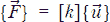 方程组。这个方程组由各个杆件的单独方程组组合而成。就像每个杆件的  方程组将其节点上的外力和位移联系在一起一样，结构的整体方程组则将结构中每个节点的力和位移联系在一起。

让我们更详细地分析一下，以便理解所有的细节。像往常一样，通过手动做一个小例子可以帮助我们更好地理解这个过程。

##### **手动示例**

在开始之前，关于术语的一个小提示：我们将用杆件所在节点的编号，并用箭头分隔，来标记每根杆件。所以，1 → 2 是从节点 1 到节点 2 的杆件。

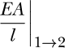

指的是杆件 1 → 2 的 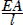 数量：*E* 代表杆件的材料杨氏模量，*A* 是杆件的截面积，*l* 是杆件的长度。

现在让我们来看一下 图 16-3 中的结构。这个结构有三个节点，三个杆件，并且节点 3 上施加了外部载荷。让我们使用之前定义的自由度编号来推导每个杆件的方程组（参见 图 16-4）。

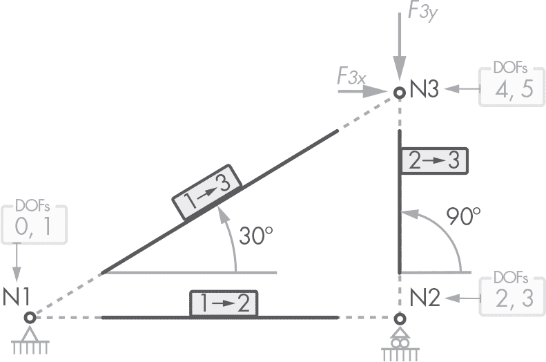

*图 16-4：我们结构的节点和杆件，已标记*

**杆件** 1 → 2 这个水平杆件从节点 1 到节点 2，其局部的 x 轴和 y 轴与全局坐标系对齐；因此，在这种情况下，*θ* = 0°，所以 cos0° = 1，sin0° = 0。杆件的方程组如下：

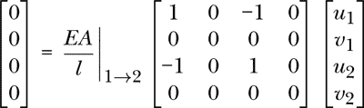

如果你需要回顾这个方程组是如何推导出来的，请参考 第 397 页中的“全局坐标系中的刚度矩阵”章节。

**杆件** 1 → 3 这个从节点 1 到节点 3 的杆件与全局 x 轴形成 30°的角度，因此 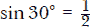 和 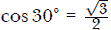。杆件的方程组如下：


**杆件** 2 → 3 这个垂直杆件从节点 2 到节点 3，与全局坐标系的 x 轴形成 30°角，因此 cos30° = 0，sin30° = 1。杆件的方程组如下：

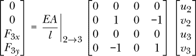

现在我们已经有了每个杆件的方程组，我们需要组装结构的全局方程组。结构总共有三个节点，每个节点有两个自由度，因此系统的大小为 3 × 2 = 6。在这个系统中，力和位移需要出现在它们对应的自由度编号所给定的位置。为了清楚说明这一点，让我们做一个表格，列出自由度编号以及与之相关的力和位移（表 16-2）。

**表 16-2：** 每个力和位移对应的自由度编号

| **自由度 (DOF)** | **相关力** | **相关位移** |
| --- | --- | --- |
| 0 | *F*[1*x*] = 0 | *u*[1] |
| 1 | *F*[1*y*] = 0 | *v*[1] |
| 2 | *F*[2*x*] = 0 | *u*[2] |
| 3 | *F*[2*y*] = 0 | *v*[2] |
| 4 | *F*[3*x*] | *u*[3] |
| 5 | *F*[3*y*] | *v*[3] |

如果自由度编号能告诉我们每个力或位移项在方程组中应占的位置，那么我们可以这样开始构建系统：

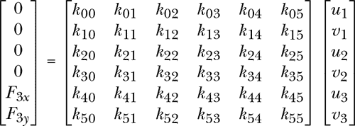

请注意，如果我们决定以不同的方式编号自由度，那么力和位移项的顺序会有所不同，但仍然是完全有效的。

在这个方程组中，我们还需要计算刚度项。一般的刚度项 *k*[*ij*] 将施加在 *i*^(th) 自由度上的力与 *j*^(th) 自由度上的位移相关联（这与我们之前在“解释刚度矩阵项”中看到的内容相同，见 第 429 页）。

正如你所想的那样，如果 *i*^(th) 和 *j*^(th) 自由度不属于同一节点，或者不通过杆件连接的节点之间，那么 *k*[*ij*] 刚度项将为零：在 *i* 自由度施加的力和 *j* 自由度的位移之间无法产生任何关系。在我们的示例结构中，所有节点都已连接，因此全局矩阵中不会出现零值（除了已经存在于杆件各自矩阵中的零值）。在大型结构中，如果一个节点只与少数几个节点相连，那么得到的刚度矩阵往往会有很多零值。

要计算每个 *k*[*ij*] 项，我们需要加上与 *i*^(th) 和 *j*^(th) 自由度相关的杆件刚度矩阵中的所有刚度值。例如，要计算 *k*[00]，我们必须考虑杆件 1 → 2 和 1 → 3 的刚度，因为这些杆件在自由度 0 上施加的力与相同自由度的位移之间产生了刚度关系。为了简化  项的符号表示，我们使用以下别名：

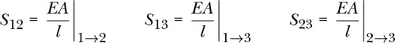

这样，我们可以通过添加每个刚度项和荷载来组装系统的矩阵和向量：

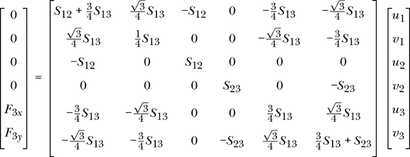

还有最后一步是让这个方程系统可解：应用外部约束条件，即将受约束的位移设为零。到目前为止，这个方程系统代表的是没有外部约束的结构，但有一些被强加为零的位移，我们必须将这些条件强制输入其解中。在这种情况下，节点 N1 的 x 和 y 位移都受到约束，这可以用数学方式表达如下：

*u*[1] = 0 和 *v*[1] = 0

N2 节点的 y 位移受到约束。因此，

*v*[2] = 0

要在我们的方程组中引入这些条件，以便它们出现在解中，我们必须将给定自由度（DOF）编号的行和列设置为系统矩阵中的单位矩阵，并将系统的力向量中的相应位置设为零。在这种情况下，位移 *u*[1]、*v*[1] 和 *v*[2] 分别分配了 0、1 和 3 的自由度编号；让我们将这些行和列设置为单位向量：

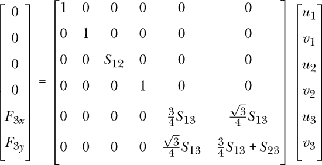

受约束索引的力向量值已经是零（在这些自由度上没有施加力），但如果不是零，我们也必须将它们置为零。通过这个小的代数技巧，我们强制 *u*[1]、*v*[1] 和 *v*[2] 在系统的解中等于零。得到的系统矩阵是正定的；因此，我们在 第十四章 中实现的 Cholesky 数值方法是一个解决此系统的良好候选。

结构的方程组现在已经组装完毕，并准备求解。如果我们使用线性系统求解过程，如 Cholesky 分解，我们将获得位移的值。

现在我们理解了这个过程，让我们将其写成代码。

##### **算法**

在结构类中，输入方法 清单 16-4。该方法一步步定义了我们的求解算法。

```py
from functools import reduce

from eqs import Matrix, Vector as EqVector, cholesky_solve
from .node import StrNode
from .bar import StrBar

class Structure:
    --snip--

    def __solve_system_of_equations(self):
        size = self.nodes_count * self.__DOF_PER_NODE
        self.__assemble_system_matrix(size)
        self.__assemble_system_vector(size)
        self.__apply_external_constraints()
        self.__global_displacements = cholesky_solve(
            self.__system_matrix,
            self.__system_vector
        )
```

*清单 16-4：求解方程组*

我们在 清单 16-2 中调用了 __solve_system_of_equations，但当时还没有定义它。现在这个完整的方法概述了组装和求解结构方程组的主要步骤。注意，我们使用了许多我们还没有定义的方法；我们将在后续章节中定义它们。

我们首先通过将结构中节点的数量与每个节点的自由度数相乘来计算系统的大小，这个值我们已经存储在类中的常量 __DOF_PER_NODE 中。

然后，我们使用稍后编写的两个私有方法 __assemble_system_matrix 和 __assemble_system_vector 来组装系统的矩阵和向量。

我们调用的下一个方法，__apply_external_constraints，应用那些强制约束位移为零的条件，类似于我们之前手动示例中做的。

最后一步使用我们最近计算的系统矩阵和力向量，通过 Cholesky 解算器函数：cholesky_solve 来求解该方程。此函数需要从 eqs 包中导入。我们得到的结果是全局坐标系下的位移向量。

##### **组装系统矩阵**

让我们编写 __assemble_system_matrix 方法。这可能是结构分析算法中最复杂的代码部分，但别担心，我会一步一步带你走。首先，输入代码到清单 16-5 中。

```py
class Structure:
    --snip--

    def __assemble_system_matrix(self, size: int):
        matrix = Matrix(size, size)

        for bar in self.__bars:
         ➊ bar_matrix = bar.global_stiffness_matrix()
         ➋ dofs = self.__bar_dofs(bar)

           for row, row_dof in enumerate(dofs):
               for col, col_dof in enumerate(dofs):
                   matrix.add_to_value(
                    ➌ bar_matrix.value_at(row, col),
                      row_dof,
                      col_dof
                   )

     ➍ self.__system_matrix = matrix

    def __bar_dofs(self, bar: StrBar):
        start_dofs = self.__dofs_dict[bar.start_node.id]
        end_dofs = self.__dofs_dict[bar.end_node.id]
        return start_dofs + end_dofs
```

*清单 16-5：组装方程组矩阵*

我们首先创建一个新的矩阵实例，其行数和列数与传入的大小参数相同。然后，我们使用一个 for 循环遍历结构中的所有杆件。在循环中，我们对每个杆件调用 global_stiffness_matrix 方法，并将结果的刚度矩阵存储在 bar_matrix 变量中 ➊。

接下来，我们创建一个包含所有自由度编号的列表，这些自由度编号包含在杆件的节点中：dofs ➋。为了在 __assemble_system_matrix 方法中避免增加过多的噪声，我们实现了另一个私有方法：__bar_dofs。

这个 __bar_dofs 方法使用传入杆件节点的 id，从 __dofs_dict 中提取其自由度编号。在提取起始节点和结束节点的自由度编号后，我们通过连接两个自由度元组来创建一个新的元组。注意，我们可以使用 + 运算符来连接元组。

现在，我们有了一个包含给定杆件节点自由度编号的元组。回想一下，这给了我们杆件刚度项在结构方程组矩阵中的位置：自由度编号也是系统矩阵中的索引。在 __assemble_system_matrix 中，我们使用两个 for 循环遍历杆件刚度矩阵中的所有项。这些循环遍历矩阵的行和列，并将每个访问到的刚度值添加到结构的全局矩阵 ➌ 中。我们使用枚举中的索引来访问杆件的刚度矩阵，使用自由度编号来确定在结构矩阵中的位置。为了确保你理解这个过程，请查看图 16-5。

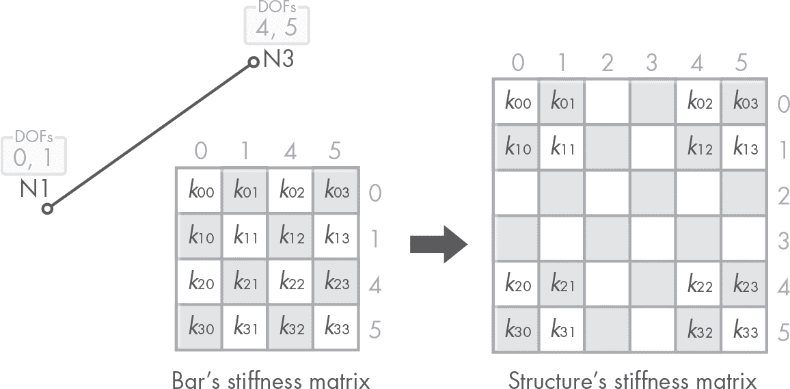

*图 16-5：组装刚度矩阵*

在图中，我们选择了杆件 1 → 3，其第一个节点 N1 的自由度为 0 和 1，而第二个节点 N2 的自由度为 4 和 5。我们在杆件的刚度矩阵的边侧和顶部标注了自由度编号。矩阵中的刚度项将这些自由度关联起来。例如，*k*[21] 项位于与自由度 4 对应的行和与自由度 1 对应的列中；该项关联了在自由度 4 上施加的力与自由度 1 上的位移。这些自由度编号是结构刚度矩阵中的索引。例如，*k*[21] 项位于该矩阵的第 4 行和第 1 列。

在清单 16-5 的最后一步是将计算得到的矩阵赋值给实例的 __system_matrix 属性 ➍。

##### **组装系统的向量**

我们使用与刚度矩阵类似的过程来组装系统的外力向量。不同的是，这次我们不遍历结构的杆件，而是遍历节点：我们要收集每个节点上的外部力。

在你的文件中，输入新的私有方法到清单 16-6 中。

```py
class Structure:
    --snip--

    def __assemble_system_vector(self, size: int):
        vector = EqVector(size)

        for node in self.__nodes:
            net_load = node.net_load
            (dof_x, dof_y) = self.__dofs_dict[node.id]

            vector.add_to_value(net_load.u, dof_x)
            vector.add_to_value(net_load.v, dof_y)

        self.__system_vector = vector
```

*清单 16-6：组装方程系统向量*

我们首先创建一个新的向量，其大小根据 size 参数来确定（别忘了，我们已经将这个类别名为 EqVector）。

接下来，我们有一个 for 循环，遍历每个节点。对于每个节点，我们将其净载荷保存到 net_load 变量中。然后，我们从 __dofs_dict 中提取节点的自由度编号到 dof_x 和 dof_y 变量中。请注意，我们正在将元组解构到这些变量中；如果需要复习解构，请查看第 20 页的“解构”部分。

然后，我们将每个净载荷分量加入到向量变量中：x 分量（net_load.u）放在 dof_x 指定的位置，y 分量（net_load.v）放在 dof_y 指定的位置。

最后，我们将计算得到的向量分配给实例的 __system_vector 属性。

##### **应用外部约束**

最后，我们需要将外部约束包含到结构的刚度矩阵和力向量中。这意味着我们希望那些外部约束的位移在最终解向量中为零；如果它们受到约束，就不能移动。为了实现这一点，我们可以使用之前探讨的代数技巧，即将相关自由度的行和列设置为刚度矩阵中的单位行列，并在力向量中设置为零。

这比说起来容易做，所以，事不宜迟，先看看代码长什么样。将代码输入到清单 16-7 中。

```py
class Structure:
    --snip--

    def __apply_external_constraints(self):
        for node in self.__nodes:
         ➊ (dof_x, dof_y) = self.__dofs_dict[node.id]

         ➋ if node.dx_constrained:
                self.__system_matrix.set_identity_row(dof_x)
                self.__system_matrix.set_identity_col(dof_x)
                self.__system_vector.set_value(0, dof_x)

         ➌ if node.dy_constrained:
                self.__system_matrix.set_identity_row(dof_y)
                self.__system_matrix.set_identity_col(dof_y)
                self.__system_vector.set_value(0, dof_y)
```

*清单 16-7：应用外部约束*

为了检查现有的外部约束，我们遍历结构的每个节点。对于每个节点，我们将其自由度编号提取到 dof_x 和 dof_y 变量中➊。然后，我们检查该节点的 x 方向位移是否受到约束➋，如果是的话，我们需要做三件事：

1.  将刚度矩阵中的 dof_x 行设置为单位矩阵。

1.  将刚度矩阵中的 dof_x 列设置为单位矩阵。

1.  将力向量 dof_x 的值设置为零。

对 y 方向的位移约束➌，我们也做同样的处理。

系统现在准备好求解了。一旦我们得到了系统的解，以位移向量的形式，我们就可以创建结构的解模型。

#### ***创建解***

让我们快速回顾一下，提醒自己当前所处的阶段。我们已经编写了很多代码，分布在几个私有方法中。图 16-6 显示了解决结构问题所涉及的各个方法的层级结构。

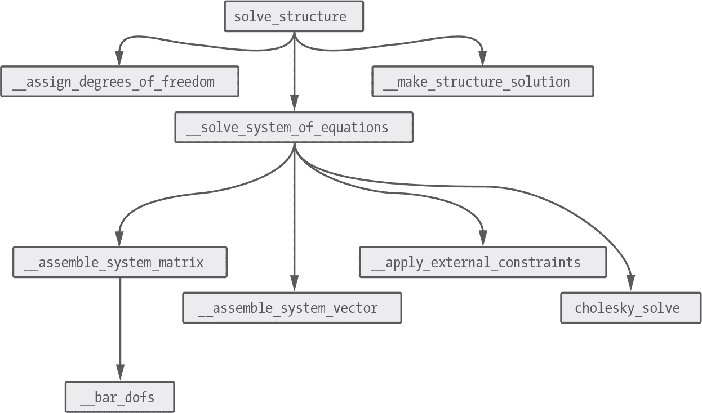

*图 16-6：结构求解代码分解成层级结构*

图中的节点是按执行顺序从左到右排列的方法。solve_structure 方法是定义主要算法的公共方法。如果你还记得，该方法由三个步骤组成，这些步骤被写成私有方法：

__assign_degrees_of_freedom

__solve_system_of_equations

__make_structure_solution

第二个私有方法，__solve_system_of_equations，是包含最多子方法的方法，如图中所示。

到目前为止，我们已经编写了除了 __make_structure_solution 方法之外的所有代码，__make_structure_solution 是 solve_structure 中的第三步，也是最后一步。现在我们来编写这个方法。它利用方程组的解（节点的全局位移）来构建结构解模型。

在 *model/structure.py* 文件中，输入清单 16-8 中的代码。

```py
from functools import reduce

from eqs import Matrix, Vector as EqVector, cholesky_solve
from geom2d import Vector
from structures.solution.bar import StrBarSolution
from structures.solution.node import StrNodeSolution
from structures.solution.structure import StructureSolution
from .bar import StrBar
from .node import StrNode

class Structure:
    --snip--

    def __make_structure_solution(self) -> StructureSolution:
        nodes = [
         ➊ self.__node_to_solution(node)
            for node in self.__nodes
        ]

     ➋ nodes_dict = {}
        for node in nodes:
            nodes_dict[node.id] = node
        bars = [
         ➌ StrBarSolution(
                bar,
                nodes_dict[bar.start_node.id],
                nodes_dict[bar.end_node.id]
            )
            for bar in self.__bars
        ]

     ➍ return StructureSolution(nodes, bars)

    def __node_to_solution(self, node: StrNode) -> StrNodeSolution:
     ➎ (dof_x, dof_y) = self.__dofs_dict[node.id]
     ➏ disp = Vector(
            self.__global_displacements.value_at(dof_x),
            self.__global_displacements.value_at(dof_y)
        )
     ➐ return StrNodeSolution(node, disp)
```

*清单 16-8：创建解模型*

我们需要做的第一件事是从 structures.solution 包中添加几个导入。我们还从 geom2d 包中导入了 Vector 类。

请注意我们如何为方法的返回对象添加类型提示。这些类型提示前面会有一个箭头（->），并位于方法或函数名称与冒号之间。

然后，使用列表推导，我们将每个原始的 __nodes 映射到节点解决方案模型 ➊。我们使用一个需要编写的私有方法：__node_to_solution。给定一个节点，该方法查找它的自由度编号 ➎，创建一个包含这两个自由度编号对应的位移的向量 ➏，并返回一个 StrNodeSolution 实例，使用原始节点和全局位移向量 ➐。

回到 __make_structure_solution，下一步是一个中间计算，它将简化结构解算条的构建。我们将创建一个解决方案节点的字典，其中键是节点的 id，值是节点本身 ➋。

在 `nodes_dict` 的帮助下，计算解决方案的杆模型变得更简单了。通过列表推导，我们将每个原始杆映射到一个 `StrBarSolution` 实例 ➌。为了实例化这个类，我们需要传递原始杆和两个解决方案节点；多亏了我们刚刚创建的字典，这就变得轻而易举。如果我们没有按 ID 创建节点字典，我们就需要在解决方案节点的列表中查找具有给定 ID 的节点。从性能上来看，这并不是理想的做法。对于每个杆，我们可能需要遍历整个节点列表两次。创建按 ID 查找节点的字典是更明智的选择；它允许常数时间内查找节点。这意味着，无论字典的大小如何，查找与键关联的值所花费的时间都是相同的。如果结构中有大量节点，这种改进可以显著减少执行时间。

最后，我们实例化 `StructureSolution`，并传递解决方案的节点和杆 ➍。

#### ***结果***

解决结构问题需要写很多代码，因此我们最好将它们集中在一个列表中以便清晰展示。列表 16-9 是完整的 Structure 类代码，包含了 `solve_structure` 实现以及我们编写的每个私有方法。

```py
from functools import reduce

from eqs import Matrix, Vector as EqVector, cholesky_solve
from geom2d import Vector
from structures.solution.bar import StrBarSolution
from structures.solution.node import StrNodeSolution
from structures.solution.structure import StructureSolution
from .bar import StrBar
from .node import StrNode

class Structure:
    __DOF_PER_NODE = 2

    def __init__(self, nodes: [StrNode], bars: [StrBar]):
        self.__bars = bars
        self.__nodes = nodes

        self.__dofs_dict = None
        self.__system_matrix: Matrix = None
        self.__system_vector: EqVector = None
        self.__global_displacements: EqVector = None

    @property
    def nodes_count(self):
        return len(self.__nodes)

    @property
    def bars_count(self):
        return len(self.__bars)

    @property
    def loads_count(self):
        return reduce(
            lambda count, node: count + node.loads_count,
            self.__nodes,
            0
        )

    def solve_structure(self) -> StructureSolution:
        self.__assign_degrees_of_freedom()
        self.__solve_system_of_equations()
        return self.__make_structure_solution()

    def __assign_degrees_of_freedom(self):
        self.__dofs_dict = {}
        for i, node in enumerate(self.__nodes):
            self.__dofs_dict[node.id] = (2 * i, 2 * i + 1)

    def __solve_system_of_equations(self):
        size = self.nodes_count * self.__DOF_PER_NODE
        self.__assemble_system_matrix(size)
        self.__assemble_system_vector(size)
        self.__apply_external_constraints()
        self.__global_displacements = cholesky_solve(
            self.__system_matrix,
            self.__system_vector
        )

    def __assemble_system_matrix(self, size: int):
        matrix = Matrix(size, size)

        for bar in self.__bars:
            bar_matrix = bar.global_stiffness_matrix()
            dofs = self.__bar_dofs(bar)

            for row, row_dof in enumerate(dofs):
                for col, col_dof in enumerate(dofs):
                    matrix.add_to_value(
                        bar_matrix.value_at(row, col),
                        row_dof,
                        col_dof
                    )

        self.__system_matrix = matrix

    def __bar_dofs(self, bar: StrBar):
        start_dofs = self.__dofs_dict[bar.start_node.id]
        end_dofs = self.__dofs_dict[bar.end_node.id]
        return start_dofs + end_dofs

    def __assemble_system_vector(self, size: int):
        vector = EqVector(size)

        for node in self.__nodes:
            net_load = node.net_load
            (dof_x, dof_y) = self.__dofs_dict[node.id]

            vector.add_to_value(net_load.u, dof_x)
            vector.add_to_value(net_load.v, dof_y)

        self.__system_vector = vector

    def __apply_external_constraints(self):
        for node in self.__nodes:
            (dof_x, dof_y) = self.__dofs_dict[node.id]

            if node.dx_constrained:
                self.__system_matrix.set_identity_row(dof_x)
                self.__system_matrix.set_identity_col(dof_x)
                self.__system_vector.set_value(0, dof_x)

            if node.dy_constrained:
                self.__system_matrix.set_identity_row(dof_y)
                self.__system_matrix.set_identity_col(dof_y)
                self.__system_vector.set_value(0, dof_y)

    def __make_structure_solution(self) -> StructureSolution:
        nodes = [
            self.__node_to_solution(node)
            for node in self.__nodes
        ]

        nodes_dict = {}
        for node in nodes:
            nodes_dict[node.id] = node

        bars = [
            StrBarSolution(
                bar,
                nodes_dict[bar.start_node.id],
                nodes_dict[bar.end_node.id]
            )
            for bar in self.__bars
        ]

        return StructureSolution(nodes, bars)

    def __node_to_solution(self, node: StrNode) -> StrNodeSolution:
        (dof_x, dof_y) = self.__dofs_dict[node.id]
        disp = Vector(
            self.__global_displacements.value_at(dof_x),
            self.__global_displacements.value_at(dof_y)
        )
        return StrNodeSolution(node, disp)
```

*列表 16-9：最终的 Structure 类*

有了这段代码，唯一缺少的就是一些单元测试。我们需要确保我们刚刚编写的所有逻辑没有错误。但是我们在前两章编写的代码变得更加复杂，且需要多个不同类之间的交互才能正常工作。那么我们如何隔离我们想要测试的代码部分呢？

### **高级单元测试：测试替身**

随着我们的类变得更加复杂，它们通常会依赖于其他类和外部函数。这时，单元测试就变得更加棘手。单元测试的目标是隔离我们想要测试的类或函数中的一小部分逻辑，以便测试失败时只有一个单一的原因。测试在将多个部分组合在一起时是否正常运行被称为*集成测试*。集成测试旨在测试系统的较大部分；通过集成测试，我们关注的是当系统的较小部分相互作用时，它们是否仍然有效。我们在这里不会进行集成测试，但我鼓励你自己尝试一下。

回到单元测试，让我们来看看上一章中的 `StructureSolution` 类。假设我们想要测试它的 `bounds_rect` 方法。

```py
def bounds_rect(self, margin, scale=1):
    d_pos = [
        node.displaced_pos_scaled(scale)
        for node in self.nodes
    ]
    return make_rect_containing_with_margin(d_pos, margin)
```

该方法将大部分逻辑委托给 make_rect_containing_with_margin，并且还依赖于 StrNodeSolution 实例来正确计算它们的位移位置。如果我们按原样测试这个方法，我们将测试 make_rect_containing_with_margin 和 Node 类的 displaced_pos_scaled 方法。这两个方法应该已经在其他地方做过单元测试。测试可能会由于与 bounds_rect 逻辑无关的原因而失败。在这种情况下，我们将进行集成测试，但首先我们想通过单元测试确保我们的方法在独立运行时能够正常工作。

我们可以通过使用测试替身而不依赖其他类的实现来测试这种方法。

#### ***测试替身***

一个*测试替身*替代测试中使用的真实实现。这个测试替身可以替代一个函数、一个完整的类，或者只是其中的一部分。为了进行单元测试，我们将替换所有没有被直接测试的代码部分，用测试替身代替。测试替身的具体功能取决于它是哪种类型的测试替身。测试替身有几种不同类型。

**虚拟对象** 这是最简单的测试替身。*虚拟对象*替代了一个需要存在但在测试中实际上从未使用的对象。这可能是函数的一个参数，例如。

**假对象** 一个*假对象*测试替身替代代码的某一部分；它有一个有效的实现，但采用一些简化措施或是大大简化。举个例子，如果我们有一个函数，用于读取文本文件并从中解析出结构模型。如果这个函数在另一个我们想要测试的代码部分中被使用，我们可以创建一个假版本，它假装读取文件，尽管实际上并没有读取文件，而是创建一个结构并返回它。

**存根** 一个*存根*替代代码的某一部分，并始终返回相同的值或以特定方式表现。例如，我们可以存根我们比较浮点数的 are_close_enough 函数，使其在给定测试中总是返回 False。

**模拟对象** 这是一个记录它被使用方式的测试替身，以便可以用来进行断言。*模拟对象*可能是最复杂且最具多功能性的测试替身。我们可以模拟整个对象，将它们传递给代码以替代真实实现，然后检查我们的代码如何与模拟对象交互，以确保发生了正确的交互。我们稍后会简要查看一个真实的模拟对象示例。

现在让我们探讨一下 Python 如何允许我们创建测试替身。我们将重点讨论模拟，因为模拟非常多功能，我们几乎可以在每个需要测试替身的情况下使用它们。

#### ***unittest.mock 包***

Python 标准库中的 unittest 包包括了自己的 mock 机制，位于 unittest.mock 包中。你可以在[*docs.python.org/3/library/unittest.mock.html*](http://docs.python.org/3/library/unittest.mock.html)阅读该包的文档，我建议你这样做，因为它包含了详细的解释，帮助你理解如何最好地使用它。让我们快速了解一下如何使用 unittest.mock 包的主要功能。

##### **Mock 对象**

Mock 是 unittest.mock 包中的主要类。这个类的实例记录它们的每一次交互，并提供断言功能来检查这些交互。你可以在 mock 对象中调用任何你想调用的方法；如果该方法不存在，它将被创建，以便我们可以检查该方法被调用了多少次，或传入了什么参数。正如文档中所述，

Mock 是可调用的，并且当你访问它们时，会创建新 mock 作为新属性。访问同一属性将始终返回相同的 mock。Mock 记录你如何使用它们，从而允许你对代码对它们的操作进行断言。

让我们分解一下文档内容。Mock 类的实例是“可调用的”，意味着你可以像调用函数一样“调用”它。你在实例上做的这些调用都会被 mock 记录下来。这表明我们可以使用 Mock 实例来替代函数。

文档还指出，当你访问 mock 的属性时，mock 会“创建新 mock 作为新属性”。这意味着当你在一个 Mock 实例上调用方法时，如果该方法尚未存在，Python 将会为该方法创建一个新的 Mock，并将其作为实例的新属性添加。不要忘记 mock 是可调用的：你可以像调用方法一样调用这些属性，它们的交互将会被记录下来。

让我们通过 Python 的 shell 来查看一个快速示例，以便将这些概念变得更具体：

```py
>>> from unittest.mock import Mock
>>> mock = Mock()
>>> mock()
<Mock name='mock()' id='4548720456'>

>>> mock.some_method('foo', 23)
<Mock name='mock.some_method()' id='4436512848'>
```

在这段代码中，我们创建了一个新的 Mock 类实例，并像函数一样调用它。我们还在 mock 上调用了一个名为 some_method 的方法，并传递了两个参数：字符串’foo’和数字 23。调用 some_method 没有副作用：它什么也不做，除了记录调用；这是因为 mock 方法默认没有实现。稍后我们将学习如何让 mock 方法返回某些内容或执行某种副作用，但现在请记住，默认情况下，mock 只会记录它们的使用。

如果我们从一个未配置返回任何内容或执行任何副作用的 Mock 对象中调用一个方法，默认情况下它将返回另一个 Mock 实例。这个实例作为属性存储在原始 mock 中。

我们可以询问这个 mock，some_method 是否被调用过，调用时使用了哪些参数：

```py
>>> mock.some_method.assert_called()
>>> mock.some_method.assert_called_once()
>>> mock.some_method.assert_called_with('foo', 23)
```

所有三个调用都成功（不会引发断言错误），但是如果我们请求没有传递给 some_method 的参数，

```py
>>> mock.some_method.assert_called_with('bar', 577)
```

我们会得到一个带有有用信息的 `AssertionError`，这会使测试失败并告诉我们原因：

```py
Traceback (most recent call last):
--snip--
AssertionError: Expected call: some_method('bar', 577)
Actual call: some_method('foo', 123)
```

同样，如果我们请求一个从未被调用的方法的调用记录，

```py
>>> mock.foo.assert_called()
```

我们也会遇到一个错误：

```py
Traceback (most recent call last):
--snip--
AssertionError: Expected 'foo' to have been called.
```

不要忘记，mock 本身是一个可调用的对象，它会记录与其交互的所有信息。因此，下面的代码也会成功：

```py
>>> mock.assert_called()
```

##### **模拟类**

一个常见的 mock 用例是创建一个给定类的 mock 实例。这些 mock 让我们检查它们模拟的类是如何被使用的，以及它上面调用了哪些方法；我们还可以使用 mock 提供返回值，以供测试中的模拟方法使用。

要模拟一个类，我们将其传递给 `Mock` 构造函数的 `spec` 参数。让我们为我们的 `Vector` 类创建一个 mock：

```py
>>> from unittest.mock import Mock
>>> from geom2d import Vector
>>> vector_mock = Mock(spec=Vector)
>>> isinstance(vector_mock, Vector)
True
```

这个 mock 对象的 `__class__` 属性被设置为 `Vector`，以便它看起来像一个真实的 `Vector` 实例。它甚至通过了 `isinstance` 测试！这个 mock 可以有效地用来替代一个真实的 `Vector`。`Vector` 类中的所有方法在这个测试替身中也都有定义。我们可以像通常一样调用它们：

```py
>>> vector_mock.rotated_radians(0.25)
<Mock name='mock.rotated_radians()' id='4498122344'>
```

这次，`rotated_radians` 并没有返回我们期望的 `Vector` 新实例，而是返回了一个 `Mock` 实例。由于模拟类的方法没有实现，因此没有代码来执行旋转操作并返回结果向量。我们可以通过 mock 的 `side_effect` 和 `return_value` 属性来编程 mock 方法返回预定义的值。

但在我们继续之前，还有一件事关于类 mock 很重要：如果我们尝试调用类中不存在的方法，我们将得到一个 `AttributeError`。新属性可以添加到通用 mock 上，但不能添加到类的 mock 上。代码

```py
>>> vector_mock.defrangulate()
```

产生如下结果：

```py
Traceback (most recent call last):
--snip--
AttributeError: Mock object has no attribute 'defrangulate'
```

这是好的：我们可以确保，如果我们的代码的某部分尝试调用原始类中不存在的方法，我们将得到一个错误。

现在让我们看看如何为 mock 添加一个存根实现，或者只是为 mock 设置一个预定义的返回值。

##### **设置返回值和副作用**

通过设置 mock 的 `return_value`，我们可以让它在被调用时返回某个值：

```py
>>> vector_mock.rotated_radians.return_value = Vector(0, 0)
>>> vector_mock.rotated_radians(0.25)
<geom2d.vector.Vector object at 0x10bbaa4a8>
```

现在调用 `rotated_radians` 会返回一个 `Vector` 类的实例：正是我们编程让它返回的实例。从现在起，每次在 mock 上调用这个方法时，它都会返回相同的 `Vector` 实例。

模拟也可以在被调用时执行副作用。根据文档，`side_effect`

可以是一个在调用 mock 时被调用的函数，一个可迭代对象，或是一个将被抛出的异常（类或实例）。

首先让我们看看一个 mock 如何抛出异常。例如，如果我们需要 `cosine` 方法抛出一个 `ValueError`，我们可以这样做：

```py
>>> vector_mock.cosine.side_effect = ValueError
>>> vector_mock.cosine()
Traceback (most recent call last):
--snip--
ValueError
```

请注意，我们将 `ValueError` 类本身设置为 `side_effect`，但正如文档所述，我们也可以使用一个具体的实例，像这样：

```py
>>> vector_mock.cosine.side_effect = ValueError('Oops')
>>> vector_mock.cosine()
Traceback (most recent call last):
--snip--
ValueError: Oops
```

在这种情况下，每次调用 cosine 时，我们都会得到相同的 ValueError 实例。在前一个示例中，每次调用都会生成一个新的错误实例。

我们还可以为 mock 的 side_effect 属性分配一个函数。这个函数接收传递给 mock 函数的参数，并且可能返回一个值。例如，在我们的 Vector mock 中，我们可以决定让 scaled_by 方法返回传入的因子参数：

```py
>>> vector_mock.scaled_by.side_effect = lambda factor: factor
>>> vector_mock.scaled_by(45)
45
```

在这个例子中，scaled_by 方法传入了 45 作为缩放因子，并且这个参数被转发到了定义为 mock 的 side_effect 属性的函数中。

这个函数可以执行自己的副作用，比如保存它接收到的参数或打印某些内容到终端。我们可以将这个函数与 return_value 一起使用。如果我们使用这个函数来执行副作用，但仍然希望返回在 return_value 属性中设置的内容，则该函数应返回 DEFAULT（在 unittest.mock 中定义）。

```py
>>> from unittest.mock import DEFAULT
>>> def side_effect(factor):
...    print(f'mock called with factor: {factor}')
...    return DEFAULT

>>> vector_mock.scaled_by.side_effect = side_effect
>>> vector_mock.scaled_by.return_value = Vector(1, 2)

>>> vector_mock.scaled_by(2)
mock called with factor: 2
<geom2d.vector.Vector object at 0x10c4a7f28>
```

正如你所看到的，side_effect 函数被调用了，但由于它返回了默认值，因此调用 scaled_by 返回了我们设置为 return_value 的向量。

##### **@patch 装饰器**

*mock* 包包括一个 unittest.mock.patch 装饰器，我们可以在测试函数中使用它来模拟对象。@patch 装饰器能够模拟它所装饰的测试函数中实例化的对象。装饰器创建的 mock 会在函数返回后自动被清除，因此模拟只在函数上下文中有效。我们必须通过 ’package.module.name’ 格式传递给 @patch 装饰器我们想要模拟的目标（这是一个字符串，所以别忘了引号），其中 name 可以是类或函数的名称。装饰的函数将作为一个新参数接收被模拟的目标：

```py
from unittest.mock import patch

@patch('geom2d.circles.make_circle_from_points')
def test_something(make_circle_mock):
    make_circle_mock(1, 2, 3)
    make_circle_mock.assert_called_with(1, 2, 3)
```

在这个测试中，我们正在替换 *geom2d* 包的 *circles* 模块中定义的 make_circle_from_points 函数。我们必须将模拟的函数 make_circle_mock 作为参数传递给这个函数。然后，在 test_something 函数的上下文中，我们可以引用被模拟的函数，并像对待其他 mock 一样断言它被调用了。

@patch 装饰器的主要用途是替换测试对象导入的函数或类。通过使用 patch，我们强制它们导入 mock，而不是实际的依赖项。

没有其他简单的方法可以模拟我们想要单元测试的模块的依赖项：如果模块导入了它们的依赖项，我们需要一种方法来替换 Python 导入机制中的依赖项。@patch 装饰器以优雅的方式为我们完成了这个任务。

现在，让我们将所有这些知识应用于隔离测试我们的代码：没有比在实际用例中使用测试替代品更好的学习方法了。如果你是第一次使用测试替代品，你可能会感到有点困惑；这完全正常。随着我们多次看到 mock 的使用，你将开始理解这些概念。

### **测试结构解决方案类**

根据我们之前介绍的 StructureSolution 类中的 bounds_rect 方法的示例，接下来让我们看看如何进行测试。记住，我们想要测试的方法定义如下：

```py
def bounds_rect(self, margin, scale=1):
    d_pos = [
        node.displaced_pos_scaled(scale)
        for node in self.nodes
    ]
    return make_rect_containing_with_margin(d_pos, margin)
```

该方法要求 StrNodeSolution 类能够正确计算其位移位置，使用缩放值，并且 make_rect_containing_with_margin 函数能够根据给定的边距返回正确的矩形。我们不需要测试这些行为；这些应该在其他地方已经完成。我们想要做的是用测试替代品替换它们的实际实现，这样它们就不会干扰我们的测试。

不再多说，让我们在 *structures/tests* 目录下创建一个名为 *structure_solution_test.py* 的新文件。在文件中输入测试设置代码，如 Listing 16-10 所示。

```py
import unittest
from unittest.mock import patch, Mock

from geom2d import Point
from structures.solution.node import StrNodeSolution
from structures.solution.structure import StructureSolution

class StructureSolutionTest(unittest.TestCase):

    p_one = Point(2, 3)
    p_two = Point(5, 1)

    def setUp(self):
        self.n_one = Mock(spec=StrNodeSolution)
        self.n_one.displaced_pos_scaled.return_value = self.p_one
        self.n_two = Mock(spec=StrNodeSolution)
        self.n_two.displaced_pos_scaled.return_value = self.p_two
```

*Listing 16-10: 结构解类测试：设置*

在这个测试设置中，我们定义了两个点：p_one 和 p_two；它们是我们在 setUp 方法中创建的模拟节点的位置。这个 setUp 方法会在每个测试之前由 unittest 框架执行，确保每个测试都有新的模拟节点；否则，模拟节点会继续记录，破坏测试之间的独立性。

我们定义了两个节点：n_one 和 n_two。然后，我们使用 StrNodeSolution 类实例化节点模拟，作为 spec 参数的值。每个节点模拟都将定义一个已定义点，作为其 displaced_pos_scaled 方法的返回值。

接下来，让我们编写第一个测试，确保两个节点在调用 displaced_pos_scaled 方法时，传入了正确的缩放参数值。输入代码，见 Listing 16-11。

```py
class StructureSolutionTest(unittest.TestCase):
   --snip--

    def test_node_displaced_scaled_positions_called(self):
        solution = StructureSolution([self.n_one, self.n_two], [])
        solution.bounds_rect(margin=10, scale=4)

        self.n_one.displaced_pos_scaled.assert_called_once_with(4)
        self.n_two.displaced_pos_scaled.assert_called_once_with(4)
```

*Listing 16-11: 结构解类测试：第一个测试*

我们创建一个 StructureSolution 实例，列表中包含在 setUp 方法中定义的两个节点，并且没有条形图：我们不需要它们来测试 bounds_rect 方法，而且如果我们用空的 bars 列表实例化它，StructureSolution 也不会抱怨。如果 StructureSolution 类的初始化器抱怨传入了一个空的 bars 列表，那么这正是使用虚拟测试替代品的最佳情况：我们会向构造函数传入一个虚拟的 bars 列表。虚拟对象用于填充必需的参数，但它们不会实际做任何事情，也不会干扰测试。

一旦我们实例化了 StructureSolution，我们就调用 bounds_rect 方法，也就是我们的测试对象，并传入边距和缩放的值。最后，我们断言 displaced_pos_scaled 方法在两个节点上都被调用了一次，且传入了正确的缩放值。

这个测试确保我们使用节点的位移位置，并应用相应的缩放值来计算结构解的边界。想象一下，如果我们在实现该方法时错误地混淆了边距和缩放参数：

```py
def bounds_rect(self, margin, scale=1):
    d_pos = [
        # wrong! used 'margin' instead of 'scale'
        node.displaced_pos_scaled(margin)
        for node in self.nodes
    ]
    # wrong! used 'scale' instead of 'margin'
    return make_rect_containing_with_margin(d_pos, scale)
```

我们的单元测试会警告我们：

```py
Expected call: make_rect_containing_with_margin([
    <geom2d.point.Point object at 0x10575a630>,
    <geom2d.point.Point object at 0x10575a6a0>], 10)
Actual call: make_rect_containing_with_margin([
    <geom2d.point.Point object at 0x10575a630>,
    <geom2d.point.Point object at 0x10575a6a0>], 4)
```

恭喜！你已经写出了第一个使用测试替身的单元测试。现在让我们写一个第二个测试，确保正确使用计算矩形的函数。请在清单 16-12 中输入代码。

```py
class StructureSolutionTest(unittest.TestCase):
   --snip--

    @patch('structures.solution.structure.make_rect_containing_with_margin')
    def test_make_rect_called(self, make_rect_mock):
        solution = StructureSolution([self.n_one, self.n_two], [])
        solution.bounds_rect(margin=10, scale=4)

        make_rect_mock.assert_called_once_with(
            [self.p_one, self.p_two],
            10
        )
```

*清单 16-12：结构解决方案类测试：第二个测试*

这个测试有点棘手，因为`make_rect_containing_with_margin`函数是由`StructureSolution`类导入的。为了让这个类导入我们的模拟对象而不是实际实现，我们必须修补函数的路径：’package.module.name’，在这个例子中，如下所示：

'structures.solution.structure.make_rect_containing_with_margin'

但是，等一下：`make_rect_containing_with_margin`不是在`*geom2d*`包中定义的吗？那为什么我们像在`*structures.solution*`包和`*structure*`模块中一样修补它呢？

`@patch`装饰器有一些规则来定义如何给定对象的路径以模拟它。在“在哪里修补”部分，文档中说明：

`patch()`通过（临时）将一个*名称*指向的对象替换为另一个对象来工作。可以有多个名称指向同一个对象，因此为了使修补工作，你必须确保修补测试系统中使用的名称。

基本原理是你修补对象被*查找*的地方，这不一定是定义它的地方。

第二段给了我们关键：对象必须在它们被查找的地方修补。在我们的测试中，我们要替换的函数是在`structures.solution`包中的`*structure*`模块中查找的。开始时这可能听起来有点复杂，但当你做几次后就会明白。

继续我们的测试，前两行和之前的一样：它们创建结构解决方案并调用被测试的函数。然后是断言，这个断言是对传递给测试函数的参数：`make_rect_mock`进行的。记住，`@patch`装饰器将修补后的实体传递给装饰的函数。我们断言模拟对象只被调用一次，参数是模拟节点返回的位置列表和边距的值。

你可以通过在 PyCharm 中点击测试类名称左边的绿色播放按钮来运行这些测试。或者，你也可以从命令行运行它们：

```py
$ python3 -m unittest structures/tests/structure_solution_test.py
```

清单 16-13 展示了结果代码，供你参考。

```py
import unittest
from unittest.mock import patch, Mock

from geom2d import Point
from structures.solution.node import StrNodeSolution
from structures.solution.structure import StructureSolution

class StructureSolutionTest(unittest.TestCase):

    p_one = Point(2, 3)
    p_two = Point(5, 1)

    def setUp(self):
        self.n_one = Mock(spec=StrNodeSolution)
        self.n_one.displaced_pos_scaled.return_value = self.p_one
        self.n_two = Mock(spec=StrNodeSolution)
        self.n_two.displaced_pos_scaled.return_value = self.p_two

    def test_node_displaced_scaled_positions_called(self):
        solution = StructureSolution([self.n_one, self.n_two], [])
        solution.bounds_rect(margin=10, scale=4)

        self.n_one.displaced_pos_scaled.assert_called_once_with(4)
        self.n_two.displaced_pos_scaled.assert_called_once_with(4)

    @patch('structures.solution.structure.make_rect_containing_with_margin')
    def test_make_rect_called(self, make_rect_mock):
        solution = StructureSolution([self.n_one, self.n_two], [])
        solution.bounds_rect(margin=10, scale=4)

        make_rect_mock.assert_called_once_with(
            [self.p_one, self.p_two],
            10
        )
```

*清单 16-13：结构解决方案类测试：结果*

在继续之前，有一个重要的陷阱需要注意。如果你查看这两个测试，你可能会想删除重复的行，

```py
solution = StructureSolution([self.n_one, self.n_two], [])
solution.bounds_rect(margin=10, scale=4)
```

通过将它们移到`setUp`中。这样做似乎是合理的，这样测试就不需要重复这些行，但如果你继续进行重构，你会发现第二个测试现在失败了。为什么？

答案与@patch 装饰器的工作原理有关。它需要装饰依赖被修补的函数，而在我们的案例中，make_rect_containing_with_margin 函数是在实例化 StructureSolution 类时被导入的。因此，至少对于第二个测试，必须在测试方法中实例化该类，并且该方法需要使用@patch 装饰器。

### **测试结构求解过程**

现在让我们添加一些测试，确保结构求解过程得出正确的结果。对于这些测试，我们将在代码中定义图 16-7 中的结构。

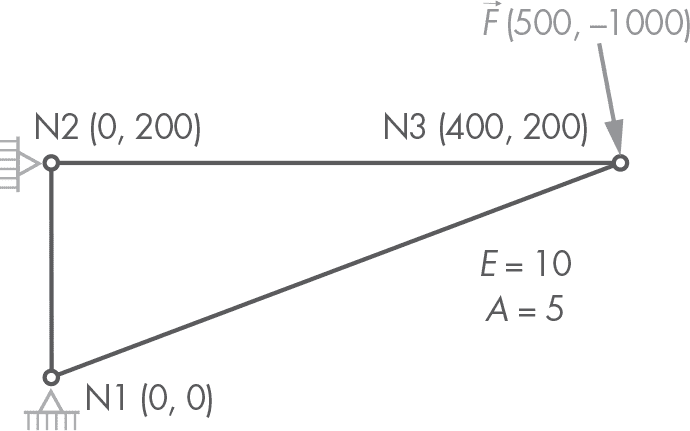

*图 16-7：单元测试用的结构*

在*structures/tests*目录下创建一个名为*structure_test.py*的新文件。在文件中，输入列表 16-14 中的代码。

```py
import unittest
from unittest.mock import patch

from eqs import Matrix
from geom2d import Point, Vector
from eqs.vector import Vector as EqVector
from structures.model.node import StrNode
from structures.model.bar import StrBar
from structures.model.structure import Structure

class StructureTest(unittest.TestCase):

    def setUp(self):
        section = 5
        young = 10
        load = Vector(500, -1000)

        self.n_1 = StrNode(1, Point(0, 0))
        self.n_2 = StrNode(2, Point(0, 200))
        self.n_3 = StrNode(3, Point(400, 200), [load])
        self.b_12 = StrBar(1, self.n_1, self.n_2, section, young)
        self.b_23 = StrBar(2, self.n_2, self.n_3, section, young)
        self.b_13 = StrBar(3, self.n_1, self.n_3, section, young)

     ➊ self.structure = Structure(
            [self.n_1, self.n_2, self.n_3],
            [self.b_12, self.b_23, self.b_13]
        )

    def test_nodes_count(self):
     ➋ self.assertEqual(3,  self.structure.nodes_count)

    def test_bars_count(self):
     ➌ self.assertEqual(3, self.structure.bars_count)

    def test_loads_count(self):
     ➍ self.assertEqual(1, self.structure.loads_count)
```

*列表 16-14：结构求解测试*

这个列表定义了 StructureTest 测试类。在每次测试之前调用的 setUp 方法中，我们定义了图 16-7 中的结构。结构有三个节点：n_1、n_2 和 n_3。最后一个节点 n_3 上施加了一个荷载。我们暂时没有向节点 1 和 2 添加外部约束；稍后我们会解释原因。然后，我们在刚定义的节点之间创建了杆件 b_12、b_23 和 b_13；我们使用了 5 和 10 作为截面面积和杨氏模量。通过这些节点和杆件，结构最终被实例化 ➊。

接下来是三个简单的测试。第一个确保结构能够计算出它有多少个节点 ➋。第二个做同样的事情，但作用于杆件 ➌。第三个也做相同的操作，这次是计算施加在结构上的荷载数量 ➍。

在求解结构的过程中，最复杂的操作之一是组装刚度矩阵，因此我们添加一个测试，检查在施加外部约束条件之前矩阵是否正确组装。由于我们尚未向结构中添加外部约束，传递给 cholesky_solve 函数的矩阵就是我们需要的系统矩阵。如果我们模拟 cholesky_solve 函数，传递给它的参数是系统的刚度矩阵和荷载向量，我们可以捕获这些参数来进行断言。通过模拟这个函数，我们的代码不会执行 Cholesky 方法的原始代码，这没问题，因为那部分逻辑不应该干扰我们的测试。在列表 16-15 中输入新的测试。

```py
class StructureTest(unittest.TestCase):
    --snip--

 ➊ @patch('structures.model.structure.cholesky_solve')
    def test_assemble_system_matrix(self, cholesky_mock):
        eal3 = 0.1118033989
        c2_eal3 = .8 * eal3
        s2_eal3 = .2 * eal3
        cs_eal3 = .4 * eal3
     ➋ expected_mat = Matrix(6, 6).set_data([
            c2_eal3, cs_eal3, 0, 0, -c2_eal3, -cs_eal3,
            cs_eal3, .25 + s2_eal3, 0, -.25, -cs_eal3, -s2_eal3,
            0, 0, .125, 0, -.125, 0,
            0, -.25, 0, .25, 0, 0,
            -c2_eal3, -cs_eal3, -.125, 0, .125 + c2_eal3, cs_eal3,
            -cs_eal3, -s2_eal3, 0, 0, cs_eal3, s2_eal3
        ])

        self.structure.solve_structure()
     ➌ [actual_mat, _] = cholesky_mock.call_args[0]

     ➍ cholesky_mock.assert_called_once()
     ➎ self.assertEqual(expected_mat, actual_mat)
```

*列表 16-15：系统刚度矩阵组装测试*

我们首先希望模拟 cholesky_solve 函数，因此我们添加了一个@patch 装饰器，指定了查找该函数的路径：structures/model/structure 包中的*cholesky_solve*模块 ➊。注意，我们将 cholesky_mock 作为参数传递给测试方法。

接下来，我们定义预期结构的刚度矩阵：expected_mat。它是一个 6 × 6 的矩阵（三个节点，每个节点有两个自由度）。我已经手动做了数学计算并组装了矩阵；我建议你也这样做，以确保你理解这个过程。对于梁 1 → 3，定义了一些辅助变量：

+   eal3 是  数值

+   c2_eal3 是 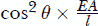

+   s2_eal3 是 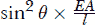

+   cs_eal3 是 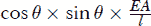

梁 1 → 2 和梁 2 → 3 的刚度矩阵中的数值是直接的，因为它们的角度分别是 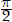 和 0 弧度。在使用这三根梁的矩阵组装全局矩阵后，结果是 ➋。

要运行解析代码，我们必须调用 solve_structure 方法。在执行 solve 方法后，我们关心的是哪些参数传递给了 cholesky_mock 函数。Mocks 有一个属性 call_args，这是一个包含传递给每个 mock 调用的参数的列表。我们的 mock 函数只被调用了一次，所以我们需要的是第一次调用的参数。

我们解构了 cholesky_mock 的 call_args 中的第一个调用（call_args[0]），并只保留了第一个值，存入名为 actual_mat 的变量 ➌。正如你所看到的，左侧列表中的第二个元素([actual_mat, _])是一个下划线，这意味着右侧列表(cholesky_mock.call_args[0])中有一个值，但我们不需要保存它。

然后是两个断言。第一个断言检查 cholesky_mock 是否只被调用了一次 ➍，第二个断言则比较预期的刚度矩阵与实际传递给 cholesky_mock 解析函数的刚度矩阵 ➎。

在这个测试中，我们确保 Cholesky 解析函数接收到正确的、未应用外部约束条件的结构刚度矩阵。现在，让我们编写一个新的测试，加入这些约束，检查刚度矩阵是否被正确修改以包括这些约束。请在清单 16-16 中输入此测试。

```py
class StructureTest(unittest.TestCase):
    --snip--

 ➊ @patch('structures.model.structure.cholesky_solve')
    def test_system_matrix_constraints(self, cholesky_mock):
     ➋ self._set_external_constraints()

        eal3 = 0.1118033989
        c2_eal3 = .8 * eal3
        s2_eal3 = .2 * eal3
        cs_eal3 = .4 * eal3
     ➌ expected_mat = Matrix(6, 6).set_data([
            1, 0, 0, 0, 0, 0,
            0, 1, 0, 0, 0, 0,
            0, 0, 1, 0, 0, 0,
            0, 0, 0, 1, 0, 0,
            0, 0, 0, 0, .125 + c2_eal3, cs_eal3,
            0, 0, 0, 0, cs_eal3, s2_eal3
        ])

        self.structure.solve_structure()
        [actual_mat, _] = cholesky_mock.call_args[0]

        cholesky_mock.assert_called_once()
     ➍ self.assertEqual(expected_mat, actual_mat)
```

*清单 16-16：系统刚度矩阵约束测试*

这个测试与之前的测试类似。cholesky_solve 函数以相同的方式被修补 ➊，并且新的 mock 参数 cholesky_mock 被传递到测试方法中。然后，我们调用一个私有方法，将外部约束添加到节点 1 和节点 2，正如它们在图 16-7 中所示 ➋。我们将在测试后编写此方法。

然后是预期矩阵的定义，这次应用了外部约束 ➌。除了主对角线上的项外，唯一非零的项是属于节点 3 的：自由度 4 和 5。因此，只有那些行和列索引中的项是非零的。

剩下的测试与之前完全相同：我们在结构实例上调用 solve_structure 方法。然后我们将从调用 cholesky_mock 中提取的矩阵参数保存到名为 actual_mat 的变量中。注意，我们使用了列表解包，其中第二个项，即系统的负载向量，通过使用下划线被忽略了。接着是检查 Cholesky 模拟函数是否仅被调用一次的断言，以及比较实际和预期系统矩阵的检查 ➍。

最后，我们需要编写 _set_external_constraints 函数，将外部约束应用到节点 1 和节点 2 上。在我们刚写完的方法之后，输入第 16-17 列表中的代码。

```py
class StructureTest(unittest.TestCase):
    --snip--

    def _set_external_constraints(self):
        self.n_1.dx_constrained = True
        self.n_1.dy_constrained = True
        self.n_2.dx_constrained = True
        self.n_2.dy_constrained = True
```

*第 16-17 列表：为节点设置外部约束*

让我们再做一次最后的测试，检查负载向量组装过程。这个测试的思路是沿用之前两个测试的结构，但这次检查负载向量。输入第 16-18 列表中的测试。

```py
class StructureTest(unittest.TestCase):
    --snip--

 ➊ @patch('structures.model.structure.cholesky_solve')
    def test_assemble_system_vector(self, cholesky_mock):
     ➋ expected_vec = EqVector(6).set_data([
            0, 0, 0, 0, 500, -1000
        ])

        self.structure.solve_structure()
     ➌ [_, actual_vec] = cholesky_mock.call_args[0]

     ➍ self.assertEqual(expected_vec, actual_vec)
```

*第 16-18 列表：系统负载向量组装测试*

我们像之前一样修补 cholesky_solve 函数 ➊。然后我们声明预期的负载向量 ➋，这次很简单，因为只有一个负载作用在节点 3 上。

剩下的测试与之前类似。主要的区别是这次我们解构了第一次调用 cholesky_mock ➌ 的第二个参数，即传入的向量，也就是我们的代码生成的负载向量。这次我们不再断言 mock 被调用了一次，正如我们在之前的两个测试中所做的那样；我们可以这么做，但这个条件已经测试过了，没有必要重复相同的断言。我们想要检查的是 actual_vec 是否等于 expected_vec ➍。

现在我们可以运行测试了。从 shell 中运行以下命令：

```py
$ python3 -m unittest structures/tests/structure_test.py
```

如果所有测试都通过，应该会生成以下输出：

```py
Ran 6 tests in 0.004s

OK
```

我们可以再写几个单元测试，但为了简洁起见，我们就不写了。不过，我建议你自己设计更多的测试，锻炼一下你的测试替代技能。

### **总结**

在本章中，我们开发了结构的求解算法，这是一个复杂的逻辑，我们将其拆分到几个私有方法中。这个求解过程承担了组装结构的全局刚度矩阵和向量、应用外部约束并使用我们之前实现的 Cholesky 方法求解得到的方程组的重任。一旦得到节点的全局位移，它们就会用于构建结构解模型。在第十八章中，我们将看到如何为这个解模型生成图形结果。

我们还介绍了测试替身的概念，这是通过将代码的一个小部分与其协作对象隔离来编写良好单元测试的关键技术。测试替身有几种不同的类型；Python 的*unittest*实现基本上为我们提供了一个：mock。然而，这个 mock 实现非常灵活，甚至可以用作存根（stub）或间谍（spy）。我们通过使用这个类和@patch 装饰器，学习了如何用它们来测试我们最新的代码。

现在是时候集中精力从文本文件中读取和解析结构了，这样我们就能为我们的解析算法提供一些精细的结构定义。让我们开始吧！
