## 18

生成 SVG 图像和文本文件


当我们解决其中一个桁架结构时，我们会用解法值构建一个新模型。如果我们想查看每根杆件的应力或每个节点的位移，我们需要生成一些带有这些信息的输出。图表是一种很好的方式来显示工程计算的结果，但我们也可能需要一个包含详细值的文本文件。

在本章中，我们将为我们的结构分析应用编写一个模块，该模块生成包含所有相关数据的矢量图像和更简洁的结构解法文本表示。

### **设置**

我们在*structures*中添加一个名为*out*的新包；这个包将包含所有解法输出代码。你的*structures*包目录现在应该如下所示：

structures

|- generation

|- model

|- out

|- parse

|- solution

|- tests

我们将首先实现一个从结构解法生成 SVG 图像的函数。让我们创建一个新的 Python 文件，命名为*svg.py*，并再创建一个名为*config.json*的文件，用于存储绘图的配置。你的*out*目录现在应该包含以下文件：

structures

|- out

|- __init__.py

|- config.json

|- svg.py

像往常一样，如果你没有使用 IDE，请记得包含一个*__init__.py*文件。

### **从结构解法到 SVG**

当我们的输出代码完成后，它应该能够生成像图 18-1 中那样的图表。尽管在书籍的打印版中看不到，但压缩条是红色的，拉伸条是绿色的，外力是黄色的，而反应力用紫色表示。

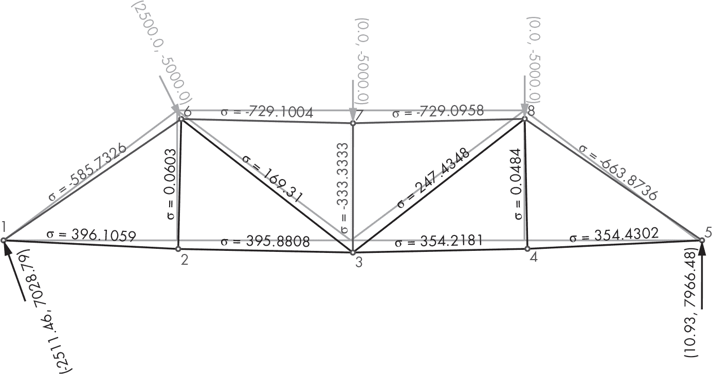

*图 18-1：桁架结果图*

这张图像是通过我们将在本章接下来一起编写的代码生成的。

#### ***配置文件***

当你的代码准备好并且能够正常工作时，你可能希望调整图表的颜色和大小，直到得到令你满意的结果。我们希望能够自由地更改这些颜色，而不需要查看我们的代码，因此我们将它们移动到一个单独的配置文件中，就像我们在第九章和第十二章中已经做过的一样。事实上，我们想调整的任何参数都可以放在配置文件中。我们将在配置文件中包括节点的半径、节点的描边宽度、图像的边距等内容。

图 18-2 展示了我们希望能够配置的部分属性以及我们将赋给它们的值。颜色使用以 # 开头的十六进制值表示。

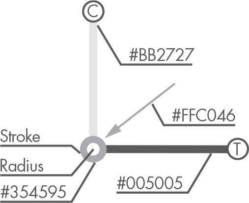

*图 18-2：输出配置值*

打开我们刚才创建的*config.json*文件，并在清单 18-1 中输入配置值。

```py
{
    "sizes": {
        "margin": 170,
        "node_radius": 5,
        "stroke": 4,
        "arrow": 14
    },
    "colors": {
        "node_stroke": "#354595",
        "back": "#FFFFFF",
        "traction": "#005005",
        "compression": "#BB2727",
        "original": "#D5DBF8",
        "load": "#FFC046",
        "reaction": "#4A0072"
    },
    "font": {
        "family": "sans-serif",
        "size": 14
    }
}
```

*清单 18-1：我们输出图像的默认配置*

这些配置值是我们在没有提供其他值时使用的默认值。你可以通过使用不同的颜色、大小或文本字体来个性化你的应用程序图表。

为此，我们需要一种方法，将配置 JSON 文件读取到我们的主*svg.py*脚本中。让我们编写一个函数来实现这一点。在*svg.py*中，输入清单 18-2 中的代码。

```py
import json

import pkg_resources as res

def __read_config():
    config = res.resource_string(__name__, 'config.json')
    return json.loads(config)
```

*清单 18-2：读取配置 JSON 文件*

__read_config 函数使用来自 pkg_resources 包（Python 标准库中的一个包）中的 resource_string 来将我们的*config.json*文件加载为字符串。然后，我们使用 json.loads 将字符串解析为字典。稍后我们会使用这个函数。

现在，让我们看看如何允许用户将一些参数传递给应用程序，这些参数将修改结果图表的绘制方式。

#### ***设置***

我们有一个配置，它包含决定图表外观的值。这些值由应用程序定义，用户无需担心它们。我们允许用户将一个配置字典传递给应用程序，使用它来覆盖默认配置中的值。

除了配置外，我们的应用程序还需要一些其他值来绘制给定结构的解答图。这些值包括绘制几何形状和载荷时使用的比例。例如。我们无法提前猜测这些值，因此我们需要用户将它们提供给应用程序。

我们将这些一次性使用的值称为*设置*。我们将向函数传递一个设置字典，但这些设置不会有默认值，因为没有合适的默认值可以在这里使用；它们完全依赖于正在计算的结构以及用户希望结果的外观。用户是否希望夸大变形？还是希望看到没有比例尺的变形，以便了解变形结构的实际外观？我们无法自行猜测这些，因此，我们将让应用程序的用户来决定这些值。

我们已将所有希望提供给用户的设置列出在表 18-1 中。

**表 18-1：** 输出设置

| **名称** | **类型** | **用途** |
| --- | --- | --- |
| scale | 数字 | 改变结果绘图的比例 |
| disp_scale | 数字 | 改变节点位移的比例 |
| load_scale | 数字 | 改变载荷表示的比例 |
| no_draw_original | 布尔值 | 指定是否绘制原始几何形状 |

让我们编写一个函数，验证字典中是否包含所有这些设置的值。在你的*svg.py*文件中，输入清单 18-3 中的代码。

```py
--snip--

__expected_settings = (
    # scale applied to the diagram
    'scale',
    # scale applied to the node displacements
    'disp_scale',
    # scale applied to the load vectors
    'load_scale',
    # boolean to decide whether to draw the original geometry
    'no_draw_original'
)

def __validate_settings(settings):
    for setting in __expected_settings:
        if setting not in settings:
            raise ValueError(f'"{setting}" missing in settings')
```

*清单 18-3：验证设置字典*

这个 __validate_settings 函数确保所有预期的设置都在设置字典中。如果缺少任何设置，它将向用户抛出带有信息的错误消息。现在，让我们编写生成 SVG 图像的函数。

#### ***解决方案绘制功能***

在*svg.py*文件中，在 __read_config 函数之前，输入清单 18-4 中的代码。

```py
import json

import pkg_resources as res

from geom2d import AffineTransform
from graphic import svg
from structures.solution.structure import StructureSolution

def structure_solution_to_svg(
        result: StructureSolution,
        settings,
        _config=None,
):
    __validate_settings(settings)
    default_config = __read_config()

 ➊ config = {**default_config, **(_config or {})}

 ➋ viewbox = result.bounds_rect(
        config['sizes']['margin'],
        settings.scale
    )
    transform = AffineTransform(sx=1, sy=-1, tx=0, ty=0)

 ➌ return svg.svg_content(
        size=viewbox.size,
        primitives=[],
        viewbox_rect=viewbox,
        transform=transform

   )

--snip--
```

*清单 18-4：结构解决方案到 SVG 函数*

我们定义了 structure_solution_to_svg 函数，但它还没有绘制任何内容；它只是生成一个空的 SVG 图像。该函数接收三个参数：结构解决方案（一个 StructureSolution 类实例）、设置字典和配置字典。配置字典是可选的，因此我们为其提供了默认值 None。

在该函数中，我们首先使用前一节中编写的函数来验证传入的设置。如果验证失败，我们将抛出一个错误并停止执行该函数。

接下来，我们使用 __read_config 函数加载默认配置。

下一步是将传入的配置字典与默认字典合并➊。字典的合并使用 Python 的字典解包操作符：**。如果 a 和 b 是字典，使用{**a, **b}将创建一个包含 a 和 b 中所有条目的新字典。如果有一个键在两个字典中都存在，那么保留的是 b 中的版本，即第二个字典中的版本。因此，在我们的使用中，如果用户提供了配置值，这将覆盖默认值。我们将合并后的配置字典存储在 config 变量中。

**注意**

*字典解包操作符在 Python 3.5 版本中添加。你可以在 PEP-448 中阅读更多内容：* [`www.python.org/dev/peps/pep-0448`](https://www.python.org/dev/peps/pep-0448)*。PEP 代表“Python 增强提案”。这是 Python 社区编写的文档，用于提议语言的新特性等。*

接下来，我们使用结构解决方案的边界矩形➋来计算 SVG 图像的视图框。如果你还记得，StructureSolution 类的 bounds_rect 方法的第一个参数是边界的边距，第二个是缩放。我们从配置中获取边距值，从设置中获取缩放值。

然后，我们创建一个仿射变换，用来翻转图像的 y 轴，使其指向上方。

最后，我们使用来自 svg 包的 svg_content 创建并返回 SVG 图像➌。图像的大小由视图框的大小决定；目前，原语列表为空。在接下来的章节中，我们将用表示节点、杆件和载荷的 SVG 原语填充这个列表。首先，让我们看看标题。

#### ***标题***

我们将在几个地方使用标题：标注杆件的应力、编号节点和给出力的坐标。定位这些标题会有点棘手，因为我们希望旋转它们，使其与它们所标注的元素对齐，正如你在图 18-3 中看到的那样。

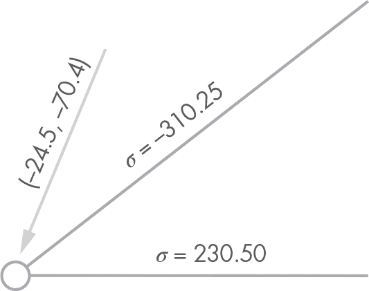

*图 18-3：我们图中的标题*

此外，由于我们对 SVG 图像应用了一个翻转 y 轴的仿射变换，因此我们添加的标题也会被翻转。如果我们不撤销这个翻转，它们将无法阅读。我们将通过缩放标题，使其 y 轴被翻转回去来修正这一点。

在*structures/out*中创建一个新的 Python 文件，名为*captions_svg.py*。你的*out*目录应该如下所示：

out

|- __init__.py

|- captions_svg.py

|- svg.py

在这个新文件中，输入 Listing 18-5 中的代码。

```py
from geom2d import Point, Vector, make_rotation, make_scale
from graphic import svg
from graphic.svg import attributes

def caption_to_svg(
        caption: str,
        position: Point,
        angle: float,
        color: str,
        config
):
 ➊ font = config['font']['family']
    size = config['font']['size']

    rotation = make_rotation(angle, position)
    scale = make_scale(1, -1, position)
 ➋ transform = rotation.then(scale)

 ➌ return svg.text(
        caption,
        position,
        Vector(0, 0),
        [
            attributes.fill_color(color),
            attributes.affine_transform(transform),
            attributes.font_family(font),
            attributes.font_size(size)
        ]
    )
```

*Listing 18-5: 从标题到 SVG*

我们实现了一个名为 caption_to_svg 的函数。这个函数有五个参数：标题文本、标题所在的点、旋转角度、颜色和配置字典。

我们将从配置字典中提取字体系列和字体大小。前两行将这些值分别保存到 font 和 size 变量中➊。

接下来，我们计算一个仿射变换来缩放和旋转标题。我们首先使用 make_rotation 函数生成旋转变换，然后使用 make_scale 函数生成缩放变换；最后，这些变换被合并成一个单一的变换➋。请注意，这两个变换都是相对于标题位置点进行的（见 Figure 18-4）。这一点非常关键。如果我们围绕全局原点（⟨0, 0⟩点）缩放和旋转标题，标题将在图形中出现在一个意想不到的位置。

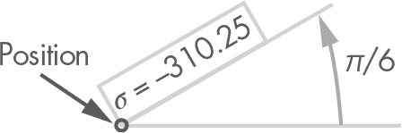

*Figure 18-4: 标题旋转*

最后，我们使用 svg.text 函数创建 SVG 文本元素，传递给它标题、中心点、零位移向量以及属性列表➌。在这些属性中，我们包括填充颜色、变换、字体系列和字体大小。

#### ***条形图***

现在，让我们继续生成 SVG 代码，以绘制原始和变形后的条形几何形状。条形是直线，因此表示它们不会太复杂。在*out*目录下，创建一个名为*bar_svg.py*的新文件。你的*out*目录应该如下所示：

out

|- __init__.py

|- bar_svg.py

|- captions_svg.py

|- svg.py

如我们所知，原始和变形后的条形几何形状都是直线。我们将首先编写一个辅助函数，生成表示条形的 SVG 段落，无论是在原始状态还是变形状态。在文件中，输入 Listing 18-6 中的代码。

```py
from math import sqrt

from graphic import svg
from graphic.svg import attributes

def __bar_svg(geometry, color, cross_section):
 ➊ section_height = sqrt(cross_section)
 ➋ return svg.segment(
        geometry,
        [
            attributes.stroke_color(color),
            attributes.stroke_width(section_height)
        ]
    )
```

*Listing 18-6: 单条形到 SVG*

我们已经编写了 __bar_svg 函数，用来根据传入的几何形状生成一个 SVG 段落，该几何形状应为我们的 Segment 类的实例；我们还传入了要使用的颜色和条形的截面。

为什么我们需要横截面值？我们将使用一个大致代表条形横截面的线条厚度，这样横截面较大的条形将用较粗的线条绘制。图 18-5 展示了我们的近似：我们将线条厚度计算为横截面正方形一边的长度。

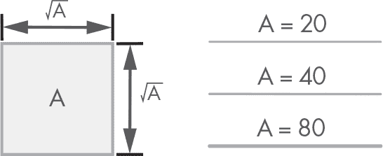

*图 18-5：根据横截面计算线条厚度*

在 section_height 变量中，我们将条形的高度存储为其横截面为正方形的情况 ➊。这个值是通过条形横截面的平方根计算得出的。

最后，我们使用传入的几何图形返回一个 SVG 片段，并添加两个属性：描边颜色和我们计算出的线条厚度 ➋。

让我们继续并编写 bars_to_svg 函数的第一个版本。在你的文件中，在我们刚刚编写的 __bar_svg 函数之前，输入 列表 18-7 中的代码。

```py
from math import sqrt

from graphic import svg
from graphic.svg import attributes
from structures.solution.bar import StrBarSolution

def bars_to_svg(bars: [StrBarSolution], settings, config):
    should_draw_original = not settings.no_draw_original
 ➊ original, final, stresses = [], [], []

    for bar in bars:
     ➋ if should_draw_original:
            original.append(original_bar_to_svg(bar))
     ➌ final.append(bar_to_svg(bar))
     ➍ stresses.append(bar_stress_to_svg(bar))

    # Ordering is important to preserve z-depth
 ➎ return original + final + stresses

def __bar_svg(geometry, color, cross_section):
    --snip--
```

*列表 18-7：条形转 SVG*

在这个列表中，我们只是概述了生成表示条形的 SVG 原语的主要算法。虽然有三个函数负责大部分工作，但我们还没有编写它们：original_bar_to_svg、bar_to_svg 和 bar_stress_to_svg。我们稍后会编写这些函数。

我们的 bars_to_svg 函数首先保存 no_draw_original 设置的取反值，保存在 should_draw_original 变量中。如果 should_draw_original 为真，我们的函数也会包括表示原始条形的片段。

接下来，我们声明三个空列表：original、final 和 stresses ➊。第一个列表 original 存储表示原始条形的片段；第二个列表 final 存储最终的解决方案条形；最后一个列表 stresses 存储应力标签。我们将把所有生成的 SVG 原语放入这些列表中。

然后我们开始迭代条形。对于每个条形，如果 should_draw_original 为真，我们将 original_bar_to_svg 的结果添加到 original 列表 ➋；original_bar_to_svg 是我们尚未编写的函数，它生成表示原始条形的 SVG 片段。我们将表示解决方案条形的 SVG 添加到 final 列表 ➌，将应力标签添加到 stresses 列表 ➍。

循环之后，三个列表将填充表示原始和解决方案结构条形的 SVG 原语。我们将这些列表连接并返回 ➎。正如代码中的注释所指出的，这里顺序很重要：最后出现在列表中的元素将绘制在其余元素之上。我们希望原始条形位于解决方案条形的下方，因此它们需要首先出现在列表中。你可以想象这些条形是按层分布的，如 图 18-6 所示。

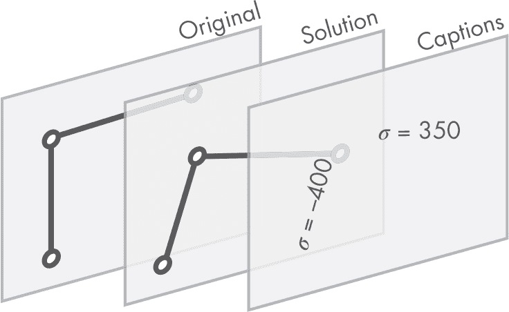

*图 18-6：按层绘制条形 SVG*

让我们编写生成 SVG 原语所用的三个函数。

##### **绘制原始条形图**

对于这些函数，我们将使用我们在“函数内部函数”章节中探讨的一种技术，位于第 28 页。我们将在 `bars_to_svg` 函数内部定义它们，这样它们就可以访问传递给 `bars_to_svg` 的参数。这样我们就不需要传递配置和设置字典。最终的内部函数将具有更短的参数列表，使它们更加简洁。由于这些函数实际上保持在 `bars_to_svg` 内部，因此只有宿主函数可以访问它们。

首先让我们编写 `original_bar_to_svg` 函数。在你的文件中，输入第 18-8 节中的缺失代码。

```py
from math import sqrt

from graphic import svg
from graphic.svg import attributes
from structures.solution.bar import StrBarSolution

def bars_to_svg(bars: [StrBarSolution], settings, config):
    def original_bar_to_svg(_bar: StrBarSolution):
     ➊ color = config['colors']['original']
     ➋ return __bar_svg(
            _bar.original_geometry,
            color,
            _bar.cross_section
        )

    --snip--

    # Ordering is important to preserve z-depth
    return original + final + stresses

def __bar_svg(geometry, color, cross_section):
    --snip--
```

*第 18-8 节：原始（非解法）条形到 SVG*

我们已将 `original_bar_to_svg` 函数写在 `bars_to_svg` 函数的开头。这个函数只需要一个参数：来自解法结构的条形（类型为 `StrBarSolution`），该条形包含在其 `original_geometry` 属性中的原始条形。

首先，我们从配置字典中提取原始条形的颜色 ➊。然后，我们返回调用 `__bar_svg` 函数的结果，传入原始条形的几何形状、颜色和条形的横截面 ➋。

##### **绘制解法条形**

现在让我们编写代码来绘制解法条形。根据应力是压缩还是拉伸，它们将有不同的颜色。在 `bars_to_svg` 函数中，在我们刚刚编写的 `original_bar_to_svg` 函数之后，输入第 18-9 节中的缺失代码。

```py
from math import sqrt

from graphic import svg
from graphic.svg import attributes
from structures.solution.bar import StrBarSolution

def bars_to_svg(bars: [StrBarSolution], settings, config):
    def original_bar_to_svg(_bar: StrBarSolution):
        --snip--

    def bar_to_svg(_bar: StrBarSolution):
        return __bar_svg(
         ➊ _bar.final_geometry_scaling_displacement(
                settings.disp_scale
            ),
         ➋ bar_color(_bar),
         ➌ _bar.cross_section
        )

    def bar_color(_bar: StrBarSolution):
        if _bar.stress >= 0:
            return config['colors']['traction']
        else:
            return config['colors']['compression']

    --snip--

    # Ordering is important to preserve z-depth
    return original + final + stresses

def __bar_svg(geometry, color, cross_section):
    --snip--
```

*第 18-9 节：解法条形到 SVG*

`bar_to_svg` 函数返回调用 `__bar_svg` 的结果，第一个参数是已位移的条形，使用我们在 `StrBarSolution` 类中实现的 `final_geometry_scaling_displacement` 方法计算 ➊。第二个参数是颜色，我们使用在代码中稍后实现的另一个函数 `bar_color` 计算 ➋。第三个也是最后一个参数是条形的横截面 ➌。

`bar_color` 函数根据条形应力的符号从配置字典中返回正确的颜色。请注意，再次强调，我们不需要将配置字典传递给此函数。因为我们处于 `bars_to_svg` 函数内部，已经可以访问它。

##### **绘制应力标注**

最后，我们需要绘制应力标注。这些标注在绘图中定位有点棘手，但我们在 `caption_to_svg` 函数中已经解决了最难的部分。

输入第 18-10 节中的缺失代码。

```py
from math import sqrt

from geom2d import Vector
from graphic import svg
from graphic.svg import attributes
from structures.solution.bar import StrBarSolution
from .captions_svg import caption_to_svg

__I_VERSOR = Vector(1, 0)
__STRESS_DISP = 10
__DECIMAL_POS = 4

def bars_to_svg(bars: [StrBarSolution], settings, config):
    def original_bar_to_svg(_bar: StrBarSolution):
        --snip--

    def bar_to_svg(_bar: StrBarSolution):
        --snip--

    def bar_stress_to_svg(_bar: StrBarSolution):
     ➊ geometry = _bar.final_geometry_scaling_displacement(
           settings.disp_scale
        )
     normal = geometry.normal_versor
     ➋ position = geometry.middle.displaced(normal, __STRESS_DISP)
     ➌ angle = geometry.direction_versor.angle_to(__I_VERSOR)

     ➍ return caption_to_svg(
           f'σ = {round(_bar.stress, __DECIMAL_POS)}',
           position,
           angle,
           bar_color(_bar),
           config
        )

   def bar_color(_bar: StrBarSolution):
       --snip--

    --snip--

    # Ordering is important to preserve z-depth
    return original + final + stresses

def __bar_svg(geometry, color, cross_section):
    --snip--
```

*第 18-10 节：条形应力到 SVG*

我们从 *geom2d* 导入 `Vector` 和我们在本章前面实现的 `caption_to_svg` 函数。然后，我们声明三个常量：

+   __I_VERSOR 是表示水平方向的 *î* 向量。

+   __STRESS_DISP 是我们用来将标注与条形几何形状分开的距离。

+   __DECIMAL_POS 是我们用于格式化应力值的小数位数。

然后是 bar_stress_to_svg 函数的实现。在这个函数中，我们首先要做的事情是计算我们要添加标题的条形图的几何形状，且该几何形状与图纸本身的比例完全一致 ➊。我们希望标题与条形图的绘制图形对齐，因此我们需要其几何形状作为参考。

接下来，我们计算条形图的几何法线方向向量；我们需要这个方向来计算标题的位置。然后，我们通过将条形图的中点沿法线方向向量移动一个等于 __STRESS_DISP ➋的量，来计算标题的原点，即位置。此过程如 Figure 18-7 所示。

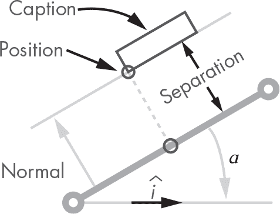

*Figure 18-7: 条形图标题的位置*

我们还需要条形图与*î*方向向量之间的角度 ➌；这个角度将用于旋转标题，使其与条形图对齐。

现在我们已经有了中心点和旋转角度，我们只需调用 caption_to_svg 函数，并将这些值作为参数传递，返回结果 ➍。对于标题的文本，我们使用希腊字母*σ*（西格玛），通常用于表示机械应力，后面跟上条形图的应力值，四舍五入到四位小数。

最后，请注意标签颜色与条形图相同，因此我们从 bar_color 函数中获取它。

##### **结果**

在我们编写的所有代码之后，你的*bar_svg.py*文件应该像 Listing 18-11 所示。

```py
from math import sqrt

from geom2d import Vector
from graphic import svg
from graphic.svg import attributes
from structures.solution.bar import StrBarSolution
from .captions_svg import caption_to_svg

__I_VERSOR = Vector(1, 0)
__STRESS_DISP = 10
__DECIMAL_POS = 4

def bars_to_svg(bars: [StrBarSolution], settings, config):
    def original_bar_to_svg(_bar: StrBarSolution):
        color = config['colors']['original']
        return __bar_svg(
            _bar.original_geometry,
            color,
            _bar.cross_section
        )

    def bar_to_svg(_bar: StrBarSolution):
        return __bar_svg(
            _bar.final_geometry_scaling_displacement(
                settings.disp_scale
            ),
            bar_color(_bar),
            _bar.cross_section
        )

    def bar_stress_to_svg(_bar: StrBarSolution):
        geometry = _bar.final_geometry_scaling_displacement(
            settings.disp_scale
        )
        normal = geometry.normal_versor
        position = geometry.middle.displaced(normal, __STRESS_DISP)
        angle = geometry.direction_versor.angle_to(__I_VERSOR)

        return caption_to_svg(
            f  ' = {round(_bar.stress, __DECIMAL_POS)}',
            position,
            angle,
            bar_color(_bar),
            config
        )

    def bar_color(_bar: StrBarSolution):
        if _bar.stress >= 0:
            return config['colors']['traction']
        else:
            return config['colors']['compression']

    should_draw_original = not settings.no_draw_original
    original, final, stresses = [], [], []

    for bar in bars:
        if should_draw_original:
            original.append(original_bar_to_svg(bar))
        final.append(bar_to_svg(bar))
        stresses.append(bar_stress_to_svg(bar))

    # Ordering is important to preserve z-depth
    return original + final + stresses

def __bar_svg(geometry, color, cross_section):
    section_height = sqrt(cross_section)
    return svg.segment(
        geometry,
        [
            attributes.stroke_color(color),
            attributes.stroke_width(section_height)
        ]
    )
```

*Listing 18-11: Bar 转为 SVG 结果*

确保你的代码与 Listing 18-11 相同，因为我们在本章不会编写单元测试。为我们的 SVG 生成函数编写测试是个不错的主意，因为这里有很多逻辑。然而，为了保持本章的合理长度，我们不会这样做。

现在是节点的部分。

#### ***节点***

在*out*目录下，创建一个名为*node_svg.py*的新文件：

out

|- __init__.py

|- bar_svg.py

|- captions_svg.py

|- node_svg.py

|- svg.py

在此文件中，输入 Listing 18-12 中的代码。

```py
from geom2d import Circle, Vector
from graphic import svg
from graphic.svg import attributes
from structures.solution.node import StrNodeSolution
from .captions_svg import caption_to_svg

def nodes_to_svg(nodes: [StrNodeSolution], settings, config):
 ➊ def node_to_svg(node: StrNodeSolution):
        radius = config['sizes']['node_radius']
        stroke_size = config['sizes']['stroke']
        stroke_color = config['colors']['node_stroke']
        fill_color = config['colors']['back']

     ➋ position = node.displaced_pos_scaled(settings.disp_scale)
     ➌ caption_pos = position.displaced(Vector(radius, radius))

        return svg.group([
         ➍ svg.circle(
                Circle(position, radius),
                [
                    attributes.stroke_width(stroke_size),
                    attributes.stroke_color(stroke_color),
                    attributes.fill_color(fill_color)
                ]
            ),
         ➎ caption_to_svg(
                f'{node.id}', caption_pos, 0, stroke_color, config

            )
        ])

 ➏ return [
        node_to_svg(node)
        for node in nodes
    ]
```

*Listing 18-12: Node 转为 SVG*

我们首先导入一些内容—确保你全部导入了。然后，我们定义 nodes_to_svg 函数，输入参数为 StrNodeSolution 实例列表以及 settings 和 config 字典。该函数将 nodes 列表中的每个节点映射到其 SVG 表示形式，这通过调用一个内部函数 node_to_svg ➏来实现。映射是通过列表推导完成的。

node_to_svg 内部函数操作单个节点，并且可以访问主函数的参数 ➊。它首先做的事情是将一些配置参数保存到变量中。

接下来，我们计算节点的位移位置 ➋以及标题的位置，该位置将是节点的 ID ➌。标题的位置是通过将节点的位置沿水平方向和垂直方向各移动一个等于其半径的量来获得的。Figure 18-8 展示了这一过程。

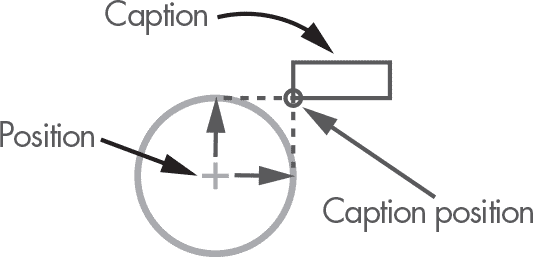

*图 18-8：节点标题定位*

node_to_svg 函数返回一个 SVG 组，包含表示节点本身的圆形 ➍ 和标题 ➎。

我们的节点已经准备好了！让我们添加它们的外部反应力。

#### ***节点反应***

我们还将在 SVG 图中包含外部约束节点的反应力。我们将以箭头和标题的形式表示这些，就像 图 18-9 一样。

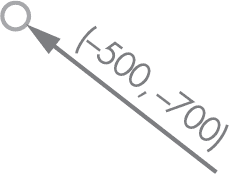

*图 18-9：节点反应*

由于我们将以相同的方式绘制外部荷载和反应力，让我们编写一个函数，绘制一个带有标题的箭头作为向量几何原语；这样我们就可以用于两种情况。

##### **绘制向量**

在 *out* 目录中，创建一个新文件，命名为 *vector_svg.py*。你的 *out* 目录应如下所示：

out

|- __init__.py

|- bar_svg.py

|- captions_svg.py

|- node_svg.py

|- svg.py

|- vector_svg.py

在此文件中，输入 清单 18-13 中的代码。

```py
from geom2d import Point, Vector, Segment
from graphic import svg
from graphic.svg import attributes
from .captions_svg import caption_to_svg

__I_VERSOR = Vector(1, 0)
__CAPTION_DISP = 10
__DECIMAL_POS = 2

def vector_to_svg(
        position: Point,
        vector: Vector,
        scale: float,
        color: str,
        config
):
 ➊ segment = Segment(
        position.displaced(vector, -scale),
        position
    )
 ➋ caption_origin = segment.start.displaced(
        segment.normal_versor,
        __CAPTION_DISP
    )

    def svg_arrow():
        pass

    def svg_caption():
        pass

 ➌ return svg.group([
        svg_arrow(),
        svg_caption()
    ])
```

*清单 18-13：向量到 SVG*

我们定义了三个常量：

+   __I_VERSOR 用于计算与水平方向的角度。

+   __CAPTION_DISP 是向量基准线和标题之间的间隔。

+   __DECIMAL_POS 用固定小数位数格式化向量坐标。

接下来是 vector_to_svg 函数，它具有以下参数：

+   position 是向量的基准点。

+   vector 是向量本身。

+   scale 应用于向量，用于缩短或延长它。

+   color 是描边和字体颜色。

+   config 是配置字典。

在函数中，我们创建一个段来表示向量的基准线 ➊。该段的起点是传入位置，由向量（也作为参数传递给函数）位移，并使用 -scale 的比例。我们希望向量的箭头位于原点；因此，该段的终点位于向量的相反方向。你可以在 图 18-10 中看到这种向量段端点配置。

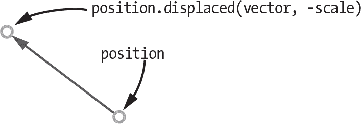

*图 18-10：向量段的端点*

我们还通过将段的起点按段的法向方向位移来计算标题的原点 ➋（见 图 18-11）。

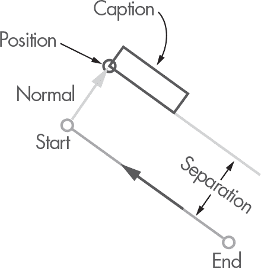

*图 18-11：节点反应标题的位置*

然后是两个我们还未实现的函数：svg_arrow 和 svg_caption。它们是绘制箭头和标题的函数。我们很快就会实现它们。

最后，我们返回一个包含 svg_arrow 和 svg_caption 函数结果的 SVG 组 ➌。

让我们实现这两个缺失的函数。输入 清单 18-14 中缺失的代码。

```py
--snip--

def vector_to_svg(
        position: Point,
        vector: Vector,
        scale: float,
        color: str,
        config
):
    segment = Segment(
        position.displaced(vector, -scale),
        position
    )
    caption_origin = segment.start.displaced(
        segment.normal_versor,
        __CAPTION_DISP
    )

    def svg_arrow():
        width = config['sizes']['stroke']
        arrow_size = config['sizes']['arrow']

     ➊ return svg.arrow(
            segment,
            arrow_size,
            arrow_size,
            [
                attributes.stroke_color(color),
                attributes.stroke_width(width),
                attributes.fill_color('none')
            ]
        )

    def svg_caption():
     ➋ return caption_to_svg(
           vector.to_formatted_str(__DECIMAL_POS),
           caption_origin,
           vector.angle_to(__I_VERSOR),
           color,
           config
        )

    return svg.group([
        svg_arrow(),
        svg_caption()
    ])
```

*清单 18-14：向量到 SVG*

svg_arrow 函数首先将宽度和箭头大小配置值保存在变量中。然后，它返回我们的 SVG 箭头原语，传入段落、箭头宽度和长度的箭头大小，以及包括笔触颜色和宽度的属性列表 ➊。回顾一下，我们的 svg.arrow 函数绘制位于段落末端点的箭头。

svg_caption 函数返回调用 svg_caption 函数的结果，传入标题字符串、原点、旋转角度、颜色和配置字典 ➋。使用我们的 Vector 类的 to_formatted_str 方法计算正确格式的标题。这个方法尚未实现，所以让我们编写它来创建包含向量分量和范数的字符串。

打开 *geom2d/vector.py* 文件，并输入 列表 18-15 中的代码。

```py
class Vector:
    --snip--

    def to_formatted_str(self, decimals: int):
        u = round(self.u, decimals)
        v = round(self.v, decimals)
        norm = round(self.norm, decimals)

        return f'({u}, {v}) with norm {norm}'
```

*列表 18-15：向量到格式化字符串*

我们还需要在 Point 类中定义一个类似的方法，用于格式化解的文本表示中的节点位置。打开 *geom2d/point.py* 并输入 列表 18-16 中的代码。

```py
class Point:
    --snip--

    def to_formatted_str(self, decimals: int):
        x = round(self.x, decimals)
        y = round(self.y, decimals)

        return f'({x}, {y})'
```

*列表 18-16：点到格式化字符串*

现在我们已经实现了一种绘制带有坐标标题的向量的方法，让我们使用我们的实现来显示节点反应。

##### **绘制反应力**

在 *out* 目录中，创建一个名为 *reaction_svg.py* 的新文件。你的 *out* 目录应该如下所示：

out

|- __init__.py

|- bar_svg.py

|- captions_svg.py

|- node_svg.py

|- reaction_svg.py

|- svg.py

|- vector_svg.py

在这个新创建的文件中，输入 列表 18-17 中的代码。

```py
from structures.solution.node import StrNodeSolution
from structures.solution.structure import StructureSolution
from .vector_svg import vector_to_svg

def node_reactions_to_svg(
        solution: StructureSolution,
        settings,
        config
):
    def reaction_svg(node: StrNodeSolution):
     ➊ position = node.displaced_pos_scaled(settings.disp_scale)
     ➋ reaction = solution.reaction_for_node(node)
     ➌ return vector_to_svg(
            position=position,
            vector=reaction,
            scale=settings.load_scale,
            color=config['colors']['reaction'],
            config=config
        )

 ➍ return [
        reaction_svg(node)
        for node in solution.nodes
        if node.is_constrained
    ]
```

*列表 18-17：节点对 SVG 的反应*

在这个文件中，我们定义了 node_reactions_to_svg。结构解中的每个外部约束节点都通过列表推导式映射到其 SVG 反应 ➍。

我们使用一个内部函数来生成每个解节点的 SVG 表示：reaction_svg。这个函数首先获取结果节点的位移位置（应用了 disp_scale） ➊。然后，它请求解结构中该节点的反应 ➋。通过这些信息，我们可以使用 vector_to_svg 函数生成反应向量的 SVG 表示 ➌。

#### ***载荷***

我们在结果图像中最后要绘制的是施加在结构上的载荷。

在 *out* 目录中，创建一个名为 *load_svg.py* 的新文件。你的 *out* 目录应该如下所示：

out

|- __init__.py

|- bar_svg.py

|- captions_svg.py

|- load_svg.py

|- node_svg.py

|- reaction_svg.py

|- svg.py

|- vector_svg.py

在 *load_svg.py* 中，输入 列表 18-18 中的代码。

```py
from geom2d import Vector, Point
from graphic import svg
from structures.solution.node import StrNodeSolution
from .vector_svg import vector_to_svg

def loads_to_svg(nodes: [StrNodeSolution], settings, config):
    def svg_node_loads(node: StrNodeSolution):
     ➊ position = node.displaced_pos_scaled(settings.disp_scale)
     ➋ return svg.group(
            [
                svg_load(position, load)
                for load in node.loads
            ]
        )

    def svg_load(position: Point, load: Vector):
     ➌ return vector_to_svg(
            position=position,
            vector=load,
            scale=settings.load_scale,
            color=config['colors']['load'],
            config=config
        )

 ➍ return [
        svg_node_loads(node)
        for node in nodes
        if node.is_loaded
    ]
```

*列表 18-18：载荷到 SVG*

在这个文件中，我们定义了一个函数 loads_to_svg，接收三个参数：StrNodeSolution 列表以及 settings 和 config 字典。该函数依赖于两个内部函数：svg_node_loads 和 svg_load。我们使用列表推导将每个在传入的节点列表中有外部荷载的节点映射到其 SVG 表示 ➍。我们使用每个节点的 is_loaded 属性来过滤出外部加载的节点。

svg_node_loads 内部函数首先获取解算节点 ➊ 的位移位置，然后返回节点中所有荷载的 SVG 组 ➋。每个荷载都通过第二个内部函数：svg_load，映射到一个 SVG 向量。

svg_load 函数非常简单：它仅调用 vector_to_svg 函数，并传递适当的参数 ➌。

到这里，我们的所有 SVG 生成代码已经准备好！我们只需将它们整合在一起，就可以开始绘制结构解算图了。

#### ***将所有内容结合起来***

现在，让我们打开 *svg.py* 文件，将我们编写的函数添加到 structure_solution_to_svg 函数中。按照 Listing 18-19 输入缺失的代码。

```py
  import json

  import pkg_resources as res

  from geom2d import AffineTransform
  from graphic import svg
  from structures.solution.structure import StructureSolution
➊ from .bar_svg import bars_to_svg
  from .load_svg import loads_to_svg
  from .node_svg import nodes_to_svg
  from .reaction_svg import node_reactions_to_svg

  def structure_solution_to_svg(
          result: StructureSolution,
          settings,
          _config=None,
  ):
      __validate_settings(settings)
      default_config = __read_config()
      config = {**default_config, **(_config or {})}

      viewbox = result.bounds_rect(
          config['sizes']['margin'],
          settings.scale
      )
      transform = AffineTransform(sx=1, sy=-1, tx=0, ty=0)

    ➋ svg_bars = bars_to_svg(result.bars, settings, config)
       svg_nodes = nodes_to_svg(result.nodes, settings, config)
       svg_react = node_reactions_to_svg(result, settings, config)
       svg_loads = loads_to_svg(result.nodes, settings, config)

       return svg.svg_content(
           size=viewbox.size,
        ➌ primitives=svg_bars + svg_nodes + svg_react + svg_loads,
           viewbox_rect=viewbox,
           transform=transform

      )

--snip--
```

*Listing 18-19: 结构解算到 SVG*

首先，我们导入 bars_to_svg、loads_to_svg、nodes_to_svg 和 node_reactions_to_svg 函数 ➊。

然后，在 structure_solution_to_svg 函数内部，我们调用每个函数以生成相应的 SVG 代码 ➋。结果被存储在 svg_bars、svg_nodes、svg_react 和 svg_loads 中。这些结果被连接成一个列表，我们将其传递给 svg_content 函数 ➌。顺序很重要：列表末尾的 SVG 基元会出现在前面的基元之前。

#### ***最终结果***

如果你已经跟随完成，你的 *svg.py* 文件应该与 Listing 18-20 类似。

```py
import json

import pkg_resources as res

from geom2d import AffineTransform
from graphic import svg
from structures.solution.structure import StructureSolution
from .bar_svg import bars_to_svg
from .load_svg import loads_to_svg
from .node_svg import nodes_to_svg
from .reaction_svg import node_reactions_to_svg

def structure_solution_to_svg(
        result: StructureSolution,
        settings,
        _config=None,
):
    __validate_settings(settings)
    default_config = __read_config()

    config = {**default_config, **(_config or {})}

    viewbox = result.bounds_rect(
        config['sizes']['margin'],
        settings.scale
    )
    transform = AffineTransform(sx=1, sy=-1, tx=0, ty=0)

    svg_bars = bars_to_svg(result.bars, settings, config)
    svg_nodes = nodes_to_svg(result.nodes, settings, config)
    svg_react = node_reactions_to_svg(result, settings, config)
    svg_loads = loads_to_svg(result.nodes, settings, config)

    return svg.svg_content(
        size=viewbox.size,
        primitives=svg_bars + svg_nodes + svg_react + svg_loads,
        viewbox_rect=viewbox,
        transform=transform
    )

def __read_config():
    config = res.resource_string(__name__, 'config.json')
    return json.loads(config)

__expected_settings = (
    # scale applied to the diagram
    'scale',
    # scale applied to the node displacements
    'disp_scale',
    # scale applied to the load vectors
    'load_scale',
    # boolean to decide whether to draw the original geometry
    'no_draw_original'
)

def __validate_settings(settings):
    for setting in __expected_settings:
        if setting not in settings:
            raise ValueError(f'"{setting}" missing in settings')
```

*Listing 18-20: 结构解算到 SVG*

我们已经准备好了所有需要的内容，但在下一章开始使用之前，让我们准备一个解算的文本表示。

### **从结构解算到文本**

通过视觉图示，我们可以更好地理解结构变形；因为我们根据条形图所受的应力对其进行着色，这也是查看哪些条形图被压缩、哪些被拉伸的好方法。同时，以文本格式研究数值结果可能更为简便，且我们可能希望它进行其他计算。这两种格式是互补的，我们的结构分析程序将同时输出这两者。

我们将使用以下格式将每个节点的位移写入文本文件：

```py
NODE 25
    original position: (1400.0, 150.0)
    displacement: (0.1133, -0.933) with norm 0.9398
    displaced position: (1400.1133, 149.067)
```

如果节点有外部约束，我们还需要检查它的反应。在这种情况下，我们可以添加最后一行：

```py
NODE 1
    original position: (0.0, 0.0)
    displacement: (0.0, 0.0) with norm 0.0
    displaced position: (0.0, 0.0)
    reaction: (-283.6981, 9906.9764) with norm 9911.0376
```

条形图将遵循以下格式：

```py
[mathescape=true]
BAR 8 (25 → 9) : ⊕ TENSION
    Δl (elongation) = 0.0026
    ϵ  (strain)     = 1.045e-05
    σ  (stress)     = 209.0219
```

让我们编写一个生成结构解算的纯文本表示的函数。

#### ***结构解算的字符串***

在我们编写生成纯文本表示的函数之前，先编写一个有用的辅助函数，该函数接受一个字符串列表并返回一个单一的字符串，将所有字符串通过“换行”字符连接在一起。

我们希望将每个结果值定义为独立的字符串，但我们实现的函数只能返回一个字符串，该字符串随后会被写入文件。

让我们为这个辅助函数创建一个新的文件。在你的*utils*包中，创建一个新的 Python 文件，命名为*strings.py*。该包现在应包含以下内容：

utils

|- __init__.py

|- lists.py

|- pairs.py

|- strings.py

在这个*strings.py*文件中，输入 Listing 18-21 中的函数。

```py
def list_to_string(strings: [str]) -> str:
    return '\n'.join(strings)
```

*Listing 18-21: 列表转字符串*

这个`list_to_string`函数将一个字符串列表映射为一个单一的字符串，每个条目之间使用‘\n’（换行符）字符分隔。

现在让我们概述一下文本输出函数的逻辑。首先，在*structures/out*包内创建一个新的*text.py*文件，该包现在应包含以下文件：

out

|- __init__.py

|- bar_svg.py

|- captions_svg.py

|- load_svg.py

|- node_svg.py

|- reaction_svg.py

|- svg.py

|- text.py

|- vector_svg.py

在这个*text.py*文件中，输入 Listing 18-22 中的代码。

```py
  from structures.solution.bar import StrBarSolution
  from structures.solution.node import StrNodeSolution
  from structures.solution.structure import StructureSolution
  from utils.strings import list_to_string

➊ __DECIMAL_POS = 4
  __SEPARATION = ['------------------------------------------', '\n']

  def structure_solution_to_string(result: StructureSolution):
   ➋ nodes_text = __nodes_to_string(result)
   ➌ bars_text = __bars_to_string(result.bars)
   ➍ return list_to_string(nodes_text + __SEPARATION + bars_text)

  def __nodes_to_string(result: StructureSolution):
      pass

  def __node_to_string(
          result: StructureSolution,
          node: StrNodeSolution
  ):
      pass

  def __bars_to_string(bars: [StrBarSolution]):
      pass

  def __bar_to_string(bar: StrBarSolution):
      pass
```

*Listing 18-22: 结构解决方案转文本*

在这个列表中，我们导入了`StrBarSolution`、`StrNodeSolution`和`Structure Solution`类，以及`list_to_string`函数。我们定义了两个常量，一个用于指定要用来格式化结果值的小数位数，`__DECIMAL_POS` ➊，另一个是分隔字符串列表`__SEPARATION`，用于在结果字符串中分隔不同的部分。

然后是主函数`structure_solution_to_string`。这个函数只接收一个参数：结构解决方案。它使用两个私有函数：一个用于转换节点的字符串表示 ➋，另一个用于转换条形 ➌。结果存储在`nodes_text`和`bars_text`变量中，这两个列表通过`__SEPARATION`字符串连接，并传递给`list_to_string` ➍。

在这个主函数之后，我们定义了其余的私有函数，但它们尚未实现。现在让我们来实现它们。

#### ***节点***

让我们从节点开始。将代码填入 Listing 18-23 中的`__nodes_to_string`和`__node_to_string`函数。

```py
--snip--

def __nodes_to_string(result: StructureSolution):
    return [
     ➊ __node_to_string(result, node)
        for node in result.nodes
    ]

def __node_to_string(
        result: StructureSolution,
        node: StrNodeSolution
):
 ➋ orig_pos = node.original_pos.to_formatted_str(__DECIMAL_POS)
    displacement = node.global_disp.to_formatted_str(__DECIMAL_POS)
    disp_pos = node.displaced_pos.to_formatted_str(__DECIMAL_POS)

 ➌ strings = [
        f'NODE {node.id}',
        f'\toriginal position: {orig_pos}',
        f'\tdisplacement: {displacement}',
        f'\tdisplaced position: {disp_pos}'
    ]

 ➍ if node.is_constrained:
        react = result.reaction_for_node(node)
        react_str = react.to_formatted_str(__DECIMAL_POS)
        strings.append(f'\treaction: {react_str}')

 ➎ return list_to_string(strings) + '\n'

--snip--
```

*Listing 18-23: 节点转文本*

第一个函数`__nodes_to_string`使用列表推导将结果中的每个节点映射到其文本表示，为此它使用了`__node_to_string`函数 ➊。此函数不仅需要节点本身，还需要整个结构对象作为参数。请记住，节点的反作用力是由结构解决方案实例计算的，而不是由节点本身计算的。

__node_to_string 函数首先获取节点原始位置 ➋、全局位移向量和位移位置的格式化字符串。我们使用 Point 和 Vector 类的 to_formatted_str 方法来处理点坐标的格式化。

接着，我们声明一个列表 strings ➌，将刚才获得的字符串放入其中。注意，除了第一个作为标题，其他字符串都以制表符（\t）字符开始。这样，我们就实现了之前定义的良好格式化：

```py
NODE 2
    original position: (200.0, 0.0)
    displacement: (0.0063, -0.1828) with norm 0.1829
    displaced position: (200.0063, -0.1828)
```

接下来，如果节点受到外部约束 ➍，我们生成反作用力字符串。为此，我们首先使用结构解算类计算给定节点的反作用力，然后使用 to_formatted_str 方法格式化它，最后将其附加到字符串列表中。

最后一步是使用辅助函数 list_to_string 将得到的字符串列表转换为单个字符串，并在末尾附加换行符 ➎。

#### ***条形***

现在，让我们来填充条形的函数。我们将使用一些 UTF-8 字符，使文本更具视觉效果。这些字符是可选的；你可以决定不在代码中添加它们，只使用标签。如果决定使用它们，我们将在“Unicode 字符”部分解释如何操作，详情见第 18 页。

输入清单 18-24 中的代码。

```py
--snip--

def __bars_to_string(bars: [StrBarSolution]):
 ➊ return [__bar_to_string(bar) for bar in bars]

def __bar_to_string(bar: StrBarSolution):
 ➋ nodes_str = f'{bar.start_node.id} → {bar.end_node.id}'
    type_str = '⊕ TENSION' if bar.stress >= 0 else '⊖ COMPRESSION'
    elongation = round(bar.elongation, __DECIMAL_POS)
    strain = '{:.3e}'.format(bar.strain)
    stress = round(bar.stress, __DECIMAL_POS)

 ➌ return list_to_string([
        f'BAR {bar.id} ({nodes_str}) : {type_str}',
        f'\tΔl (elongation) = {elongation}',
        f'\tϵ  (strain)     = {strain}',
        f'\tσ  (stress)     = {stress}\n'
    ])
```

*清单 18-24：条形转文本*

__bars_to_string 函数使用列表推导式将列表中的每个条形映射到其文本表示形式 ➊。这个文本是由第二个函数 __bar_to_string 生成的。

在 __bar_to_string 中，我们首先准备一些字符串 ➋，然后使用 list_to_string 函数 ➌将它们连接返回，而 nodes_str 表示条形的节点 ID，用→字符分隔它们。

type_str 表示条形是受拉还是受压，取决于条形应力的符号。我们使用⊕符号来装饰 TENSION 文本，使用⊖来装饰 COMPRESSION 文本。这个细节使得结果在视觉上更为突出。

然后是延伸、应变和应力字符串。这些是条形结果值，格式化为具有 __DECIMAL_POS 小数位数。这里应变是个例外；我们不是进行四舍五入，而是希望使用科学计数法，并保留三位小数（’{:.3e}’）。应变通常是一个较小的值，比应力小几个数量级，因此如果我们尝试将其四舍五入到四位小数，比如 0.0000$，结果仍然是零。使用’{:.3e}’格式，我们会得到像 1.259e–05 这样的值。

在我们的工程应用中格式化值时，必须注意数量级。格式错误的值，如果失去了所需的精度，会导致应用程序无法使用。

#### ***Unicode 字符***

我们在代码中使用的图标，→、*Δ*、*ϵ*、⊕ 和 ⊖，都是 Unicode 字符。每个操作系统都有插入这些字符的方式。如果你进行一个简单的 Google 搜索，你应该能找到如何在你的操作系统中访问它们。例如，macOS 使用 CMD-CTRL-空格键组合打开符号对话框，这就是我在代码中插入这些符号的方式。

你也可以通过在 Python 字符串中插入这些字符的代码来使用它们，方法如下：

```py
>>> '\u2295 is a Unicode symbol'
'⊕ is a Unicode symbol'
```

如果你选择这种替代方法，你需要用字符的代码替换列表中的字符。表 18-2 展示了我们使用的字符及其 Unicode 代码。

**表 18-2：** Unicode 字符

| **字符** | **Unicode** | **用途** |
| --- | --- | --- |
| ⊕ | \u2295 | 拉伸应力 |
| ⊖ | \u2296 | 压缩应力 |
| → | \u279c | 分隔一个条形的节点 ID（1 →2） |
| *Δ* | \u0394 | 长度增量（*Δl*） |
| *ϵ* | \u03f5 | 应变 |
| *σ* | \u03c3 | 应力 |

#### ***将所有内容整合起来***

如果你跟着做，你的结果应该像 列表 18-25 所示。

```py
from structures.solution.bar import StrBarSolution
from structures.solution.node import StrNodeSolution
from structures.solution.structure import StructureSolution
from utils.strings import list_to_string

__DECIMAL_POS = 4
__SEPARATION = ['------------------------------------------', '\n']

def structure_solution_to_string(result: StructureSolution):
    nodes_text = __nodes_to_string(result)
    bars_text = __bars_to_string(result.bars)
    return list_to_string(nodes_text + __SEPARATION + bars_text)

def __nodes_to_string(result: StructureSolution):
    return [
        __node_to_string(result, node)
        for node in result.nodes
    ]

def __node_to_string(
        result: StructureSolution,
        node: StrNodeSolution
):
    orig_pos = node.original_pos.to_formatted_str(__DECIMAL_POS)
    displacement = node.global_disp.to_formatted_str(__DECIMAL_POS)
    disp_pos = node.displaced_pos.to_formatted_str(__DECIMAL_POS)

    strings = [
        f'NODE {node.id}',
        f'\toriginal position: {orig_pos}',
        f'\tdisplacement: {displacement}',
        f'\tdisplaced position: {disp_pos}'
    ]

    if node.is_constrained:
        react = result.reaction_for_node(node)
        react_str = react.to_formatted_str(__DECIMAL_POS)
        strings.append(f'\treaction: {react_str}')

    return list_to_string(strings) + '\n'

def __bars_to_string(bars: [StrBarSolution]):
    return [__bar_to_string(bar) for bar in bars]

def __bar_to_string(bar: StrBarSolution):
    nodes_str = f'{bar.start_node.id} → {bar.end_node.id}'
    type_str = '⊕ TENSION' if bar.stress >= 0 else '⊖ COMPRESSION'
    elongation = round(bar.elongation, __DECIMAL_POS)
    strain = '{:.3e}'.format(bar.strain)
    stress = round(bar.stress, __DECIMAL_POS)

    return list_to_string([
        f'BAR {bar.id} ({nodes_str}) : {type_str}',
        f'\tΔl (elongation) = {elongation}',
        f'\tϵ  (strain)     = {strain}',
        f'\tσ  (stress)     = {stress}\n'
    ])
```

*列表 18-25：结构解决方案转为文本*

我们用不到 70 行代码编写了一个能够生成结构解决方案模型文本表示的函数。

### **总结**

在本章中，我们实现了创建表示结构解决方案模型的矢量图的代码。我们将生成图形的过程拆分成若干部分，以便让代码更易管理，然后我们将其全部整合在 *svg.py* 文件中，特别是在 structure_solution_to_svg 函数中。

我们接着实现了一个函数，structure_solution_to_string，用于生成结构解决方案的纯文本表示。

现在我们已经准备好将我们的应用程序整合起来了。在最后一章，我们将做到这一点。
