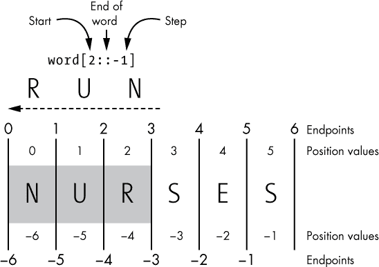
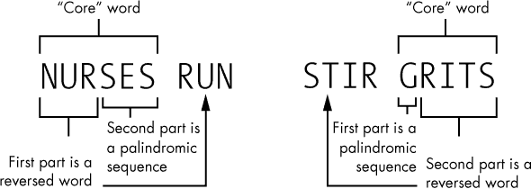
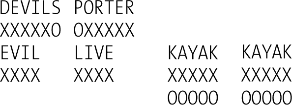
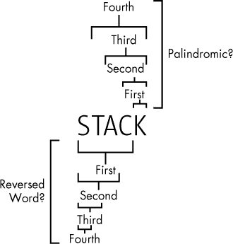

## **2

查找回文短语的拼写**

Radar。Kayak。Rotator。Sexes。这些词有什么共同点？它们是*回文*，即正读和反读都相同的单词。更棒的是*回文短语*，它们是完整的短语，也表现得一样。拿破仑就是最著名的回文短语的作者。当他第一次看到厄尔巴岛——他的流放地时，他说：“Able was I ere I saw Elba。”

2011 年，DC Comics 发布了一个有趣的故事，巧妙地运用了回文短语。超级女巫 Zatanna 被施下了一个诅咒，只有通过回文方式说话才能施展魔法。她想出了足够多的双词短语，比如 *nurses run*、*stack cats* 和 *puff up*，用这些回文短语击败了持剑攻击者。这让我开始好奇：究竟有多少“具有攻击性”的回文短语呢？Zatanna 是否有更好的选择？

在本章中，你将从互联网上加载字典文件，并使用 Python 首先发现回文词，然后在这些文件中发现更复杂的回文短语。接着，你将使用名为 cProfile 的工具来分析你的回文短语代码，以便提升性能。最后，你将筛选出回文短语，看看其中有多少具有“攻击性”特征。

### **查找并打开字典**

本章中的所有项目都需要一个文本文件格式的单词列表，通常称为*字典文件*，所以我们从学习如何加载一个字典文件开始。

尽管它们被称为字典文件，但这些文件只包含单词——没有发音、音节数、定义等信息。这是好消息，因为这些内容会干扰我们的工作。更好的是，字典文件可以在线免费下载。

你可以在表 2-1 列出的位置找到合适的字典文件。下载其中一个文件，或者如果文件直接打开，可以将其内容复制并粘贴到文本编辑器（如 Notepad 或 WordPad，macOS 上的 TextEdit）中，然后将其保存为 *.txt* 文件。将字典文件保存在与 Python 代码相同的文件夹中。我使用了 *2of4brif.txt* 文件来准备这个项目。它可以在表 2-1 中第一个网站提供的可下载 *12dicts-6.0.2.zip* 文件中找到。

**表 2-1:** 可下载字典文件

| **文件** | **单词数** |
| --- | --- |
| *[`wordlist.aspell.net/12dicts/`](http://wordlist.aspell.net/12dicts/)* | 60,388 |
| *[`inventwithpython.com/dictionary.txt`](https://inventwithpython.com/dictionary.txt)* | 45,000 |
| *[`www-personal.umich.edu/~jlawler/wordlist.html`](http://www-personal.umich.edu/~jlawler/wordlist.html)* | 69,903 |
| *[`greenteapress.com/thinkpython2/code/words.txt`](http://greenteapress.com/thinkpython2/code/words.txt)* | 113,809 |

除了 表 2-1 中的文件外，Unix 和类 Unix 操作系统通常会附带一个包含超过 20 万个单词的大型以换行符分隔的单词文件。这个文件通常存储在 */usr/share/dict/words* 或 */usr/dict/words* 中。在 Debian GNU/Linux 上，单词列表存储在 */usr/share/opendict/dictionaries* 中。macOS 字典通常位于 */Library/Dictionaries*，并且包含非英语字典。如果你想使用这些文件，你可能需要在线搜索你的操作系统及版本以查找准确的目录路径。

一些字典文件会排除 *a* 和 *I* 作为单词。其他文件可能将字典中的每个字母作为单一的“头部”单词（例如，所有以 *d* 开头的单词会以 *d* 开头）。我们在这些项目中会忽略一个字母的回文，因此这些问题不应该成为问题。

#### ***打开文件时处理异常***

每当你加载外部文件时，程序应自动检查 I/O 问题，如缺失文件或错误的文件名，并在发生问题时通知你。

使用以下 try 和 except 语句来捕捉和处理 *异常*，这些异常是在执行过程中被检测到的错误：

➊ try:

➋ 使用 open(file) 打开文件时，赋值给 in_file：

做某事

except IOError➌ 作为 e:

➍ print("{}\n 错误打开 {}。正在终止程序。".format(e, file),

file=sys.stderr)

➎ sys.exit(1)

try 子句首先被执行 ➊。无论嵌套的代码块如何退出，with 语句都会在代码块结束后自动关闭文件 ➋。在终止进程之前关闭文件是一种良好的做法。如果不关闭文件，可能会用尽文件描述符（尤其是对于长时间运行的大型脚本），在 Windows 中锁定文件导致无法进一步访问，损坏文件，或者如果你正在写入文件，可能会丢失数据。

如果出了问题，并且错误类型与 except 关键字后指定的异常类型 ➌ 匹配，try 子句的其余部分将被跳过，执行 except 子句 ➍。如果没有问题，try 子句会被执行，except 子句则会被跳过。except 子句中的 print 语句会让你知道存在问题，file=sys.stderr 参数会使错误信息在 IDLE 解释器窗口中以红色显示。

sys.exit(1) ➎ 语句用于终止程序。sys.exit(1) 中的 1 表示程序遇到错误并未成功关闭。

如果发生的异常*不*匹配 except 子句中指定的异常类型，它将被传递到外层的 try 语句或主程序执行中。如果没有找到处理程序，*未处理的异常*会导致程序停止并显示标准的“回溯”错误信息。

#### ***加载字典文件***

示例 2-1 将字典文件加载为列表。你可以手动输入这个脚本，或者从 *[`nostarch.com/impracticalpython/`](https://nostarch.com/impracticalpython/)* 下载它，文件名为 *load_dictionary.py*。

你可以将此文件作为模块导入到其他程序中，并通过一行代码运行它。记住，模块只是一个可以在另一个 Python 程序中使用的 Python 程序。正如你可能已经知道的那样，模块代表了一种*抽象*的形式。抽象意味着你不必关心所有的编码细节。抽象的一个原则是*封装*，即隐藏细节的行为。我们将文件加载代码封装在模块中，这样你就不必在另一个程序中看到或担心详细的代码。

*load_dictionary.py*

"""将文本文件加载为列表。

参数：

- 文本文件名（如有必要，还需包含目录路径）

异常：

- 如果找不到文件名，则会引发 IOError。

返回值：

- 以小写形式列出文本文件中的所有单词。

需要导入：sys

"""

➊ import sys

➋ def load(file):

"""打开文本文件并返回一个小写字符串的列表。"""

try:

with open(file) as in_file:

➌ loaded_txt = in_file.read().strip().split('\n')

➍ loaded_txt = [x.lower() for x in loaded_txt]

return loaded_txt

except IOError as e:

➎ print("{}\nError opening {}. Terminating program.".format(e, file),

file=sys.stderr)

sys.exit(1)

*清单 2-1：将字典文件加载为列表的模块*

在文档字符串之后，我们导入系统函数 sys，以便我们的错误处理代码能够正常工作 ➊。接下来的代码块根据之前的文件打开讨论定义了一个函数 ➋。该函数以文件名作为参数。

如果没有抛出异常，则文本文件的空白字符被移除，文件中的项被分割成单独的行并添加到列表中 ➌。我们希望每个单词都是列表中的一个独立项，然后再返回该列表。由于 Python 对大小写敏感，列表中的单词通过*列表推导* ➍ 转换为小写。列表推导是一种将列表或其他可迭代对象转换为另一个列表的简便方法。在这种情况下，它取代了 for 循环。

如果遇到 I/O 错误，程序会显示标准错误消息，由 e 指定，同时输出描述事件的消息并通知用户程序即将结束 ➎。然后，sys.exit(1) 命令终止程序。

这个代码示例仅用于说明，展示这些步骤如何协同工作。通常，你不会从模块中调用 sys.exit()，因为你可能希望程序在终止之前执行某些操作——比如写日志文件。在后续章节中，我们将把 try-except 块和 sys.exit() 移入 main() 函数，以便更加清晰和可控。

### **项目 #2：查找回文**

你将从查找词典中的单字回文开始，然后转向更困难的回文短语。

**目标**

使用 Python 在英语词典文件中查找回文。

#### ***策略与伪代码***

在开始编码之前，先停下来思考一下你从概念上想做什么。识别回文字符串很简单：只需将一个单词与它自己倒过来切片进行比较。以下是一个将单词从前到后切片，然后再从后到前切片的示例：

>>> word = 'NURSES'

>>> word[:]

'NURSES'

>>> word[::-1]

'SESRUN'

如果在切片字符串（或任何可切片类型）时不提供值，则默认使用字符串的起始位置、结束位置和步长为 1 的正向切片。

图 2-1 展示了反向切片过程。我提供了起始位置为 2，步长为-1。由于没有提供结束索引（冒号之间没有索引或空格），所以意味着要向后切片（因为步长为-1），直到没有更多字符为止。

*图 2-1：'NURSES' 这个单词的负向切片示例*

负向切片的行为与正向切片略有不同，正负位置值和端点是不对称的。这可能会导致混淆，因此我们将限制负向切片为简单的[::-1]格式。

在字典中查找回文所需的代码行数将比加载字典文件还少！这是伪代码：

将数字字典文件加载为一个单词列表

创建一个空列表来存储回文

遍历单词列表中的每个单词：

如果正向切片的单词与反向切片的单词相同：

将单词添加到回文列表

打印回文列表

#### ***回文代码***

清单 2-2，*palindromes.py*，读取英文字典文件，识别哪些单词是回文，将它们保存到列表中，并将列表作为堆叠项打印。你可以从本书的资源下载此代码，访问* [`www.nostarch.com/impracticalpython/`](https://www.nostarch.com/impracticalpython/)*。你还需要*load_dictionary.py*和字典文件；将这三个文件保存在同一文件夹中。

*palindromes.py*

"""在字典文件中查找回文（字母回文组）。"""

➊ import load_dictionary

➋ word_list = load_dictionary.load('2of4brif.txt')

➌ pali_list = []

➍ for word in word_list:

如果 len(word) > 1 且 word == word[::-1]：

pali_list.append(word)

print("\n 找到的回文数量 = {}\n".format(len(pali_list)))

➎ print(*pali_list, sep='\n')

*清单 2-2：在加载的字典文件中查找回文*

首先将*load_dictionary.py*作为模块导入 ➊。注意，导入时不使用*.py*扩展名。而且，该模块与此脚本位于同一文件夹，因此我们无需指定模块的目录路径。而且，由于该模块包含所需的 import sys 行，因此我们无需在此重复。

为了从字典中填充我们的单词列表，在 load_dictionary 模块中使用点表示法调用 load()函数 ➋。将外部字典文件的名称传递给它。如果字典文件与 Python 脚本位于同一文件夹中，你不需要指定路径。你使用的文件名可能会因你下载的字典而有所不同。

接下来，创建一个空列表来存储回文 ➌，并开始遍历 word_list 中的每个单词 ➍，将正向切片与反向切片进行比较。如果两个切片相同，将该单词附加到 pali_list 中。请注意，只有长度大于 1 的单词才被允许（len(word) > 1），这符合回文的最严格定义。

最后，以一种吸引人的方式打印回文——堆叠并且没有引号或逗号 ➎。你可以通过遍历列表中的每个单词来实现这一点，但有一种更高效的方法。你可以使用*splat*操作符（由*表示），它将列表作为输入并将其展开为函数调用中的位置参数。最后一个参数是用于打印多个列表值之间的分隔符。默认的分隔符是空格（sep=' '），但你可以改为在每个项之间换行（sep='\n'）。

单词回文很少见，至少在英语中是这样。使用一个 60,000 个单词的字典文件，你可能幸运地找到大约 60 个，或者仅占所有单词的 0.1%。尽管它们稀有，然而，用 Python 查找它们却非常容易。所以，让我们继续处理更有趣且更复杂的回文对。

### **项目 #3：寻找回文对**

查找回文对比查找单个回文单词需要更多的努力。在本节中，我们将规划并编写代码来查找单词对回文。

**目标**

使用 Python 在英语词典中搜索两词回文对。使用 cProfile 工具分析和优化回文代码。

#### ***策略与伪代码***

示例的单词对回文有*nurses run*和*stir grits*。（顺便说一下，grits 是一种玉米早餐菜肴，类似于意大利的玉米粥。）

与回文类似，回文对正着读和反着读是一样的。我喜欢将它们看作是一个*核心*单词，比如*nurses*，从中派生出一个*回文序列*和*反向单词*（见图 2-2）。

*图 2-2：解剖单词对回文*

我们的程序将检查核心单词。根据图 2-2，我们可以对核心单词做出以下推断：

1.  它可以是奇数或偶数个字母。

1.  单词的一个相邻部分反向拼读时形成一个真实的单词。

1.  这个相邻部分可以占据核心单词的一部分或全部。

1.  另一个相邻部分包含一个回文字母序列。

1.  回文序列可以占据核心单词的一部分或全部。

1.  回文序列不必是一个真实的单词（除非它占据了*整个*单词）。

1.  这两个部分不能重叠或共享字母。

1.  该序列是可逆的。

**注意**

*如果反转词占据整个核心单词并且不是回文，则称其为*逆向词*。逆向词与回文相似，但有一个关键区别：它不会在反向读取时拼出*相同*的单词，而是拼出*不同*的单词。例如，*bats*和*stab*，以及*wolf*和*flow*。顺便提一下，逆向词是*回文*的反写。*

图 2-3 表示一个任意的六个字母单词。Xs 表示单词的部分，*可能*在反向读取时形成一个真正的单词（例如*run*在*nurses*中）。Os 表示*可能的*回文序列（例如*nurses*中的*ses*）。图 2-3 左列中表示的单词行为像图 2-2 中的*nurses*，其反转词在开头。右列中表示的单词行为像*grits*，其反转词在末尾。请注意，每列中的组合数是单词中字母总数加一；还要注意，顶部和底部行表示相同的情况。

每列的顶部行表示一个逆向词。每列的底部行表示一个回文。这些都是反转词，只是不同的*类型*的反转词。因此，它们算作一个实体，可以通过单行代码在一个循环中进行识别。

*图 2-3：六个字母核心单词中反转词（X）和回文序列（O）的位置可能性*

要查看图表的实际应用，考虑图 2-4，其中显示了回文*devils lived*和*retro porter*。*Devils*和*porter*都是核心单词，是相互镜像的，它们在回文序列和反转词方面相对应。将其与逆向词*evil*和回文*kayak*进行比较。

*图 2-4：单词中的反转词（Xs）和回文序列（Os），逆向词和回文。*

回文既是反转词*也是*回文序列。由于它们具有与逆向词相同的 X 模式，因此可以使用与逆向词相同的代码进行处理。

从策略角度来看，你需要循环遍历字典中的每个单词，并评估它在图 2-3 中*所有可能的组合*。假设字典中有 60,000 个单词，那么程序大约需要进行 500,000 次遍历。

要理解这些循环，请查看图 2-5 中的回文核心单词 *stack cats*。你的程序需要遍历单词中的字母，从末尾字母开始，每次迭代添加一个字母。为了找到像 *stack cats* 这样的回文，它将同时评估单词末尾的回文序列 *stack* 和开头的反转单词。请注意，图 2-5 中的第一个循环会成功，因为一个单字母 (*k*) 就可以在这种情况下作为回文。

*图 2-5：示例遍历核心单词，同时查找回文和反转单词*

但你还没有完成。为了捕捉图 2-3 中的“镜像”行为，你必须反向运行循环，查找单词开头的回文序列和单词末尾的反转单词。这将帮助你找到像 *stir grits* 这样的回文。

这是查找回文的伪代码：

加载数字字典作为单词列表

开始一个空列表以保存回文

对于单词列表中的每个单词：

获取单词的长度

如果长度 > 1：

遍历单词中的字母：

如果反转单词片段位于单词前部并且字母

形成回文序列后：

将单词和反转单词添加到回文列表

如果反转单词片段位于单词末尾并且字母

在形成回文序列之前：

将反转单词和单词添加到回文列表

按字母顺序排序回文列表

打印回文列表中的单词对

#### ***回文代码***

清单 2-3，*palingrams.py*，遍历单词列表，识别哪些单词形成单词对回文，将这些对保存到列表中，并将列表打印为堆叠项。你可以从 *[`www.nostarch.com/impracticalpython/`](https://www.nostarch.com/impracticalpython/)* 下载代码。我建议你先使用 *2of4brif.txt* 字典文件，这样你的结果将与我的匹配。将字典和 *load_dictionary.py* 存储在与回文脚本相同的文件夹中。

*palingrams.py*

"""查找字典文件中的所有单词对回文。"""

import load_dictionary

word_list = load_dictionary.load('2of4brif.txt')

# 查找单词对回文

➊ def find_palingrams():

"""查找字典中的回文词。"""

pali_list = []

对于单词列表中的每个单词：

➋ end = len(word)

➌ rev_word = word[::-1]

➍ 如果 end > 1：

➎ 对于 i 在 range(end) 中：

➏ 如果 word[i:] == rev_word[:end-i] 且 rev_word[end-i:] 在 word_list 中：

pali_list.append((word, rev_word[end-i:]))

➐ 如果 word[:i] == rev_word[end-i:] 且 rev_word[:end-i] 在 word_list 中：

pali_list.append((rev_word[:end-i], word))

➑ 返回 pali_list

➒ palingrams = find_palingrams()

# 按第一个单词排序回文

palingrams_sorted = sorted(palingrams)

# 显示回文列表

➓ print("\n 回文数 = {}\n".format(len(palingrams_sorted)))

for first, second in palingrams_sorted:

print("{} {}".format(first, second))

*清单 2-3：查找并打印加载字典中的单词对回文*

在重复使用*palindromes.py*代码加载字典文件的步骤后，定义一个函数来查找回文单词对 ➊。使用函数将允许你以后将代码隔离开来，并测量处理字典中所有单词所需的时间。

立即开始一个名为`pali_list`的列表，用于保存程序发现的所有回文单词对。接下来，启动一个`for`循环来评估`word_list`中的单词。对于每个单词，找到它的长度并将其赋值给变量`end` ➋。单词的长度决定了程序使用的切片索引，用于在单词中查找每个可能的反转单词回文序列组合，如图 2-3 所示。

接下来，反向切片单词并将结果赋给变量`rev_word` ➌。`word[::-1]`的替代方法是`''.join(reversed(word))`，有些人认为这种方法更具可读性。

由于你在寻找单词对回文，因此排除单个字母的单词 ➍。然后嵌套另一个`for`语句来遍历当前单词中的字母 ➎。

现在，运行一个条件判断，要求单词的后端是回文的，前端是字典中反转的单词（换句话说，是一个“真实”单词） ➏。如果一个单词通过了测试，它就会被添加到回文单词对列表中，紧接着是它的反转单词。

根据图 2-3，你知道需要重复条件判断，但要改变切片方向和单词顺序，以反转输出。换句话说，你必须在单词的开始捕捉回文序列，而不是在末尾 ➐。返回回文单词对列表，以完成函数 ➑。

定义完函数后，调用它 ➒。由于字典单词在回文单词对列表中的添加顺序在循环中发生了变化，所以回文单词对不会按照字母顺序排列。因此，需要对列表进行排序，使得单词对中的第一个单词按字母顺序排列。打印列表的长度 ➓，然后将每个单词对单独打印在一行上。

如文所述，*palingrams.py* 在包含约 60,000 个单词的字典文件上运行大约需要三分钟。在接下来的章节中，我们将调查导致这个长运行时间的原因，并看看我们可以做些什么来解决这个问题。

#### ***回文单词对性能分析***

*性能分析*是一个分析过程，通过它收集程序行为的统计数据——例如函数调用的数量和持续时间——在程序执行时进行。性能分析是优化过程的关键部分。它可以告诉你程序中哪些部分占用了最多的时间或内存。这样，你就能知道将精力集中在哪些地方以提高性能。

##### **使用 cProfile 进行性能分析**

*分析*是一种测量输出——记录程序各部分执行的时间和频率。Python 标准库提供了一个方便的分析接口 cProfile，它是一个适用于分析长时间运行程序的 C 扩展。

在 find_palingrams()函数中，可能有某些地方导致*palingrams.py*程序的运行时间较长。为了确认，让我们运行 cProfile。

将以下代码复制到一个名为*cprofile_test.py*的新文件中，并将其保存在与*palingrams.py*及字典文件相同的文件夹中。此代码导入 cProfile 和 palingrams 程序，并在 find_palingrams()函数上运行 cProfile——通过点表示法调用。再次注意，你不需要指定*.py*扩展名。

import cProfile

import palingrams

cProfile.run('palingrams.find_palingrams()')

运行*cprofile_test.py*，并在其完成后（你会在解释器窗口看到>>>），你应该会看到类似以下的内容：

62622 次函数调用，耗时 199.452 秒

排序方式：标准名称

ncalls  tottime  percall  cumtime  percall filename:lineno(function)

1    0.000    0.000  199.451  199.451 <string>:1(<module>)

1  199.433  199.433  199.451  199.451 palingrams.py:7(find_palingrams)

1    0.000    0.000  199.452  199.452 {内建方法 builtins.exec}

60388    0.018    0.000    0.018    0.000 {内建方法 builtins.len}

2230    0.001    0.000    0.001    0.000 {方法 'append' of 'list' 对象}

所有这些循环、切片和查找在我的机器上花费了 199.452 秒，但当然你的时间可能与我的不同。你还会获得一些关于内建函数的额外信息，由于每个 palingram 都调用了内建的 append()函数，因此你甚至可以看到找到的 palingrams 数量（2,230）。

**注意**

*运行 cProfile 的最常见方法*是直接在解释器中运行。这允许你将输出转储到文本文件，并使用网页查看器查看。欲了解更多信息，请访问* [`docs.python.org/3/library/profile.html`](https://docs.python.org/3/library/profile.html)。

##### **使用时间进行分析**

另一种计时程序的方法是使用 time.time()，它返回一个*纪元时间戳*——自 1970 年 1 月 1 日午夜 12 点（UTC）以来的秒数（*Unix 纪元*）。将*palingrams.py*复制到一个新文件中，保存为*palingrams_timed.py*，并在文件顶部插入以下代码：

import time

start_time = time.time()

现在，转到文件末尾并添加以下代码：

end_time = time.time()

print("该程序的运行时间为{}秒。".format(end_time - start_time))

保存并运行文件。你应该在解释器窗口底部看到以下反馈——可能会有几秒钟的偏差：

该程序的运行时间为 222.73954558372498 秒。

运行时间比之前长，因为现在你在评估整个程序，包括打印，而不仅仅是 find_palingrams()函数。

与 cProfile 不同，time 模块没有提供详细的统计信息，但像 cProfile 一样，它可以在单独的代码组件上运行。编辑你刚刚运行的文件，将开始时间和结束时间语句（如下所示，以粗体标出）移动，使它们包围我们的长时间运行的`find_palingrams()`函数。保持文件顶部和底部的导入和打印语句不变。

start_time = time.time()

palingrams = find_palingrams()

end_time = time.time()

保存并运行文件。你应该在解释器窗口底部看到以下反馈：

本程序的运行时间为 199.42786622047424 秒。

现在，这与使用 cProfile 时的初始结果一致。如果你重新运行程序或使用不同的计时器，你不会得到完全相同的时间，但不要太在意。重要的是*相对*时间，这有助于指导代码优化。

#### ***回文优化***

对不起，但三分钟对我来说太长了，等不及等回文串的生成了。通过我们的性能分析结果，我们知道`find_palingrams()`函数占用了大部分处理时间。这可能与读取和写入列表、切片操作或在列表中查找有关。使用替代的数据结构，如元组、集合或字典，可能会加速该函数的执行。特别是集合，当使用`in`关键字时，集合的查找速度比列表快得多。集合使用哈希表进行非常快速的查找。通过哈希，文本字符串会被转换为独特的数字，这些数字比引用的文本小得多，并且搜索效率更高。相比之下，使用列表时，必须对每个项目进行线性搜索。

这样想：如果你在家里找丢失的手机，你可以通过查看每个房间来模拟列表查找，直到找到手机（通常是你最后检查的地方）。但通过模拟集合，你可以基本上用另一部手机拨打你的手机号码，听铃声，然后直接找到正确的房间。

使用集合的一个缺点是，集合中项的顺序不可控，并且不允许重复值。而列表则保留顺序并允许重复，但查找时间较长。幸运的是，我们不关心顺序或重复项，因此集合是最佳选择！

清单 2-4 是从原始的*palingrams.py*程序中提取的`find_palingrams()`函数，已修改为使用单词集合而不是单词列表。你可以在一个名为*palingrams_optimized.py*的新程序中找到它，你可以从*[`www.nostarch.com/impracticalpython/`](https://www.nostarch.com/impracticalpython/)*下载，或者如果你想亲自检查新的运行时间，也可以对你自己的*palingrams_timed.py*副本做出这些更改。

*palingrams_optimized.py*

def find_palingrams():

"""查找字典中的回文串。"""

pali_list = []

➊ words = set(word_list)

➋ for word in words:

end = len(word)

rev_word = word[::-1]

if end > 1:

for i in range(end):

➌ 如果 word[i:] == rev_word[:end-i] 且 rev_word[end-i:] 在 words 中：

pali_list.append((word, rev_word[end-i:]))

➍ 如果 word[:i] == rev_word[end-i:] 且 rev_word[:end-i] 在 words 中：

pali_list.append((rev_word[:end-i], word))

return pali_list

*列表 2-4：* find_palingrams() *函数使用集合优化*

只有四行代码发生变化。定义一个新变量 words，它是 word_list ➊ 的集合。然后循环遍历集合 ➋，查找 word 切片在该集合中的存在性 ➌➍，而不是像以前那样在列表中查找。

这是 *palingrams_optimized.py* 中 find_palingrams() 函数的新运行时间：

该程序的运行时间为 0.4858267307281494 秒。

哇！从三分钟多到不到一秒！*这就是*优化！而差异就在于数据结构。验证一个单词是否属于*列表*是困扰我们的原因。

为什么我先展示给你“错误”的方法？因为这就是现实世界中发生的情况。你让代码运行，然后再进行优化。这是一个简单的例子，一个有经验的程序员一开始就会做对，但它体现了优化的整体概念：先让它尽可能地工作，然后再让它更好。

### **dnE ehT**

你已经编写了代码来查找回文和拼字回文，使用 cProfile 对代码进行了性能分析，并通过使用适当的数据结构优化了代码。那么我们在 Zatanna 面前表现如何？她有一战之力吗？

这里列出了一些在*2of4brif*字典文件中找到的更“激进”的词组——从意外的*同质灌肠*到严酷的*躯干腐烂*，再到我作为地质学家的个人最爱：*风化矿石*。

| 倾倒泥浆 | 昏昏欲睡的剑 | 同质灌肠 |
| --- | --- | --- |
| 腿部凝胶 | 牛仔裤开采 | 麻风患者排斥 |
| 雨夹雪鳗鱼 | 奶制品袭击 | 猛击哺乳动物 |
| 风化矿石 | 上升先生 | 连续不断的锅 |
| 扫射放屁 | 躯干腐烂 | 天鹅啃咬 |
| 狼群流动 | 伴侣设陷 | 坚果震惊 |
| 拍打朋友 | 强烈小牛 | 按钮敲击 |

### **进一步阅读**

*《Think Python, 2nd Edition》*（O'Reilly，2015）由艾伦·道尼（Allen Downey）编写，简洁明了地描述了哈希表以及它们为何如此高效。它也是一本优秀的 Python 参考书。

### **练习项目：字典清理**

互联网上的数据文件并不总是“即插即用”。你可能会发现，在将其应用到你的项目之前，需要对数据进行一些处理。如前所述，一些在线词典文件将字母表中的每个字母都作为一个单词。这会在你希望允许在回文词中使用单个字母的情况下（例如*acidic a*）引发问题。你可以通过直接编辑词典文本文件来删除这些单字母单词，但这既繁琐又适合失败者。相反，可以编写一个短小的脚本，在将词典加载到 Python 后删除这些单字母单词。为了测试它是否有效，编辑你的词典文件，添加一些像*b*和*c*这样的单字母单词。解决方案请参见附录，或者在* [`www.nostarch.com/impracticalpython/`](https://www.nostarch.com/impracticalpython/)*网站上找到一个副本（*dictionary_cleanup_practice.py*）。

### **挑战项目：递归方法**

使用 Python，通常有不止一种方法来解决问题。请查看可汗学院网站上的讨论和伪代码（* [`www.khanacademy.org/computing/computer-science/algorithms/recursive-algorithms/a/using-recursion-to-determine-whether-a-word-is-a-palindrome/`](https://www.khanacademy.org/computing/computer-science/algorithms/recursive-algorithms/a/using-recursion-to-determine-whether-a-word-is-a-palindrome/)*）。然后重写*palindrome.py*程序，使其使用递归来识别回文。
