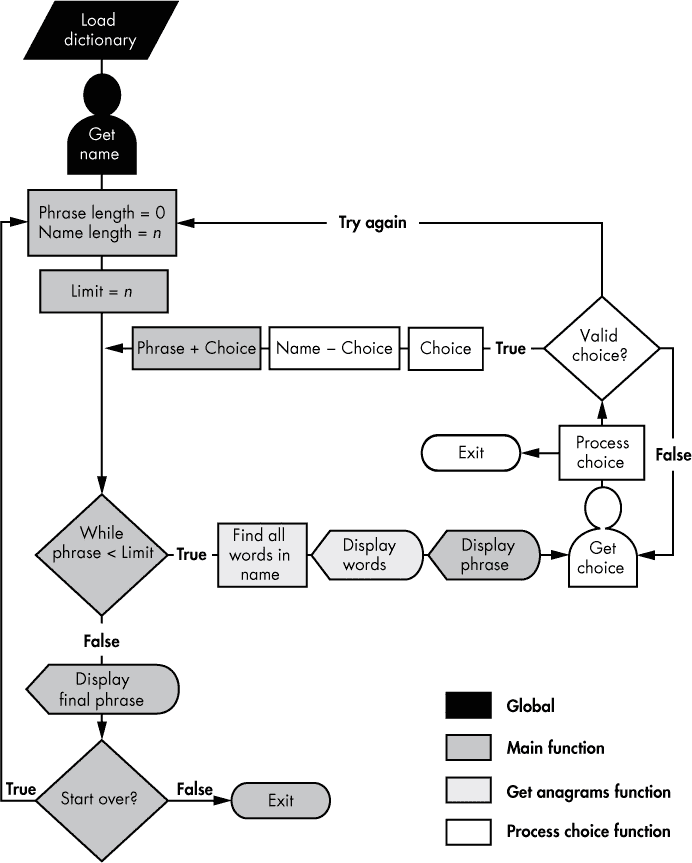

## **3**

**解决字谜**

*字谜* 是通过重新排列另一个单词的字母所形成的单词。例如，*Elvis* 会产生令人毛骨悚然的三重奏 *evils*、*lives* 和 *veils*。这是否意味着 Elvis 仍然活着，但隐藏了他邪恶的存在？在《哈利·波特与密室》一书中，“I am Lord Voldemort” 是邪恶巫师的真名 Tom Marvolo Riddle 的字谜。“Lord Earldom Vomit” 也是 Tom Marvolo Riddle 的字谜，但作者 J.K. Rowling 明智地选择了放弃这个版本。

在本章中，首先你将找到一个给定单词或名称的所有字谜。然后，你将编写一个程序，允许用户通过交互式方式从他们自己的名字构建一个字谜短语。最后，你将扮演计算机巫师，看看如何从“Tom Marvolo Riddle”提取出“I am Lord Voldemort”。

### **项目 #4：查找单词字谜**

你将从分析简单的单词字谜开始，并研究如何通过编程来识别它们。完成这一部分后，你将准备好在接下来的部分处理中处理字谜短语。

**目标**

使用 Python 和字典文件查找给定英语单词或单个名称的所有单词字谜。你可以在 第二章 的开始部分找到查找和加载字典文件的说明。

#### ***策略与伪代码***

超过 600 家报纸和 100 个互联网网站都开展了一种名为 *Jumble* 的字谜游戏。该游戏创立于 1954 年，现在是全球最知名的文字混排游戏。*Jumble* 可能会让人感到非常沮丧，但找出字谜几乎和找回回文一样简单——你只需要知道所有字谜的共同特征：它们必须包含相同数量的相同字母。

##### **识别字谜**

Python 没有内置的字谜运算符，但你可以轻松编写一个。在本章的项目中，你将从 第二章 加载字典文件作为字符串列表。因此，程序需要验证两个字符串是否是彼此的字谜。

让我们来看一个例子。*Pots* 是 *stop* 的字谜，你可以通过 len() 函数验证 *stop* 和 *pots* 是否包含相同数量的字母。但 Python 无法知道两个字符串是否具有相同数量的某个字符——至少在不将字符串转换为其他数据结构或使用计数函数的情况下是无法做到的。因此，除了将这两个单词简单地看作字符串之外，你还可以将它们表示为包含单个字符字符串的两个列表。在像 IDLE 这样的 Shell 中创建这些列表，并将它们命名为 word 和 anagram，正如我在这里所做的那样：

>>> word = list('stop')

>>> word

['s', 't', 'o', 'p']

>>> anagram = list('pots')

>>> anagram

['p', 'o', 't', 's']

这两个列表与我们对字谜对的描述相符；也就是说，它们包含相同数量的相同字母。但是，如果你试图用比较运算符 == 来比较它们，结果是 False。

>>> anagram == word

False

问题在于运算符 (==) 仅在两个列表具有相同数量的相同元素并且这些元素按相同顺序出现时，才会认为它们是相等的。你可以通过内置函数 sorted() 来轻松解决这个问题，该函数可以将列表作为参数并按字母顺序重新排列其内容。因此，如果你对两个列表分别调用 sorted() 并比较排序后的列表，它们将是相等的。换句话说，== 返回 True。

>>> word = sorted(word)

>>> word

['o', 'p', 's', 't']

>>> anagram = sorted(anagram)

>>> anagram

['o', 'p', 's', 't']

>>> anagram == word

True

你还可以将一个字符串传递给 sorted() 来创建一个排序后的列表，就像前面的代码片段一样。这对于将字典文件中的单词转换为排序后的单字符字符串列表非常有用。

现在你知道如何验证是否找到字谜，我们来设计完整的脚本——从加载字典并提示用户输入一个单词（或名称），到查找并打印所有字谜。

##### **使用伪代码**

记住，使用伪代码进行规划可以帮助你发现潜在的问题，提前发现这些问题将节省你大量时间。以下伪代码应帮助你更好地理解我们将在下一节中编写的脚本 *anagrams.py*。

将数字字典文件加载为一个单词列表

接受用户输入的单词

创建一个空列表来存储字谜

排序用户输入的单词

遍历单词列表中的每个单词：

排序单词

如果排序后的单词与用户输入的排序单词相同：

将单词添加到字谜列表

打印字谜列表

脚本首先会从字典文件加载单词到一个字符串列表中。在遍历字典查找字谜之前，你需要知道你想要查找字谜的单词是什么，并且需要一个地方来存储找到的字谜。因此，首先请用户输入一个单词，然后创建一个空列表来存储字谜。一旦程序遍历了字典中的每个单词，它将打印该字谜列表。

#### ***字谜查找器代码***

清单 3-1 加载字典文件，接受程序中*指定的*单词或名称，并为该单词或名称在字典文件中查找所有字谜。你还需要 第二章 中的字典加载代码。你可以从 *[`www.nostarch.com/impracticalpython/`](https://www.nostarch.com/impracticalpython/)* 下载它们，分别命名为 *anagrams.py* 和 *load_dictionary.py*。请将这两个文件保存在同一文件夹中。你可以使用 第二章 中使用的字典文件，或者下载另一个字典文件（有关建议，请参见 表 2-1，位于 第 20 页）。

*anagrams.py*

➊ import load_dictionary

➋ word_list = load_dictionary.load('2of4brif.txt')

➌ anagram_list = []

# 在下面输入一个单词或单一名称来查找其字谜：

➍ name = 'Foster'

print("输入名称 = {}".format (name))

➎ name = name.lower()

print("使用 name = {}".format(name))

# 排序 name 并查找变位词

➏ name_sorted = sorted(name)

➐ 遍历 word_list 中的每个单词：

word = word.lower()

if word != name:

if sorted(word) == name_sorted:

anagram_list.append(word)

# 打印出变位词列表

print()

➑ if len(anagram_list) == 0:

print("你需要一个更大的字典或换个名字！")

else:

➒ print("变位词 =", *anagram_list, sep='\n')

*清单 3-1：给定一个单词（或名字）和一个字典文件，程序会搜索并打印一个变位词列表。*

你首先导入在 第二章 中创建的 load_dictionary 模块 ➊。这个模块将打开一个字典文本文件，并通过它的 load() 函数将所有单词加载到一个列表中 ➋。你使用的 **.txt* 文件可能不同，这取决于你下载的字典文件（见 “查找和打开字典” 在 第 20 页）。

接下来，创建一个空列表，名为 anagram_list，用于保存你找到的任何变位词 ➌。让用户添加一个 *单独* 的单词，比如他们的名字 ➍。这不一定是一个专有名词，但为了与字典中的单词区分开，我们将在代码中称之为 name。打印这个名字，以便用户看到输入的内容。

下一行代码考虑到可能出现的问题。人们倾向于输入首字母大写的名字，但字典文件可能不包含大写字母，而 Python 是区分大小写的。因此，首先使用 .lower() 字符串方法将所有字母转换为小写 ➎。

现在对名称进行排序 ➏。前面提到过，你可以将 sorted() 应用于字符串和列表。

输入的名称按字母顺序排列在列表中，现在是时候查找变位词了。通过字典单词列表中的每个单词开始循环 ➐。为了安全起见，将单词转换为小写，因为比较操作是区分大小写的。转换后，将该单词与未排序的名称进行比较，因为一个单词不能是它自己的变位词。接下来，对字典中的单词进行排序，并将其与已排序的名称进行比较。如果匹配，则将该字典单词添加到 anagram_list 中。

现在显示结果。首先，检查变位词列表是否为空。如果为空，打印一个幽默的回复，避免让用户空等 ➑。如果程序找到了至少一个变位词，使用 splat (*) 操作符打印列表。记住，第二章中提到过，splat 让你将列表中的每个成员打印在单独的一行上 ➒。

以下是使用输入名称 *Foster* 的程序示例输出：

输入的名字 = Foster

使用 name = foster

变位词 =

forest

fortes

softer

如果你想使用另一个输入，可以更改源代码中 name 变量的值。作为练习，尝试调整代码，使用户被提示输入名字（或单词）；你可以通过 input() 函数实现这一点。

### **项目 #5：查找短语变位词**

在上一个项目中，你使用一个名字或单词并重新排列所有字母，找到单词字谜。现在你将从一个名字中衍生出多个单词。这些*短语字谜*中的单词仅构成输入名字的一部分，你需要多个单词才能用尽所有字母。

**目标**

编写一个 Python 程序，允许用户通过名字中的字母互动地构建一个字谜短语。

#### ***策略和伪代码***

最好的短语字谜是那些描述与名字持有者相关的某种著名特征或行为的。例如，Clint Eastwood 中的字母可以重新排列形成*old west action*，Alec Guinness 可以得到*genuine class*，Madam Curie 可以得到*radium came*，George Bush 可以得到*he bugs Gore*，而自由女神像包含*built to stay free*。我自己的名字可以得到*a huge navel*，不过那其实并不是我的特征之一。

到这时，你可能会遇到一个战略性挑战：计算机如何处理上下文内容？发明了 Watson 的 IBM 公司似乎知道答案，但对于我们其他人来说，这块巨石有点难以搬动。

*暴力破解法*是在线字谜生成器中常用的一种方法。这些算法接受一个名字并返回许多随机的字谜短语（通常是 100 个到 10,000 个以上）。大部分返回的短语都是无意义的，浏览这些无数的短语可能会变得非常繁琐。

另一种方法是承认人类在处理上下文问题上最为擅长，并编写一个帮助人类解决问题的程序。计算机可以接受初始的名字并提供可以从其中的某些（或所有）字母组成的单词；然后用户可以选择一个“合适”的单词。程序随后将根据名字中剩余的字母重新计算单词选择，重复该过程，直到所有字母都被使用完或所有可能的单词选择用尽。这个设计充分发挥了两者的优势。

你需要一个简单的界面，提示用户输入初始的名字，显示潜在的单词选择，并展示剩余的字母。程序还需要跟踪逐渐增长的字谜短语，并在每个字母被使用时提醒用户。可能会有很多失败的尝试，所以界面应允许用户随时重新开始。

由于字谜由相同数量的相同字母组成，另一种识别字谜的方法是统计每个字母的数量。如果你把你的名字看作是一个字母集合，那么如果（1）一个单词的所有字母都出现在你的名字中，并且（2）它们出现的频率与名字中相同或更少，那么这个单词就可以从你的名字中构建出来。显然，如果*e*在一个单词中出现了三次，而在你的名字中出现了两次，那么这个单词不能从你的名字中得出。因此，如果构成一个单词的字母集合不是你名字中字母集合的子集，那么这个单词就不能是你名字字谜的一部分。

##### **使用计数器统计字母**

幸运的是，Python 附带了一个名为 collections 的模块，其中包含几个容器数据类型。其中一种类型，Counter，可以统计项目出现的次数。Python 将这些项目存储为字典的键，计数存储为字典的值。例如，下面的代码片段统计列表中每种盆栽树类型的数量。

>>> from collections import Counter

➊ >>> my_bonsai_trees = ['maple', 'oak', 'elm', 'maple', 'elm', 'elm', 'elm', 'elm']

➋ >>> count = Counter(my_bonsai_trees)

>>> print(count)

➌ Counter({'elm': 5, 'maple': 2, 'oak': 1})

my_bonsai_trees 列表包含相同类型树木的多个实例 ➊。Counter 会统计树木的数量 ➋ 并创建一个易于参考的字典 ➌。请注意，print() 函数是可选的，这里用于增加清晰度。单独输入 count 也会显示字典内容。

你可以使用 Counter 来代替 sorted() 方法查找单词的变位词。与两个排序过的列表不同，输出将是两个字典，它们也可以直接通过 == 进行比较。以下是一个示例：

>>> name = 'foster'

>>> word = 'forest'

>>> name_count = Counter(name)

>>> print(name_count)

➊ Counter({'f': 1, 't': 1, 'e': 1, 'o': 1, 'r': 1, 's': 1})

>>> word_count = Counter(word)

>>> print(word_count)

➋ Counter({'f': 1, 't': 1, 'o': 1, 'e': 1, 'r': 1, 's': 1})

Counter 会为每个单词生成一个字典，将单词中的每个字母映射到其出现的次数 ➊➋。这些字典是无序的，但尽管没有排序，Python 仍然能正确识别两个字典是否相等，只要它们包含相同的字母和相同的计数：

>>> if word_count == name_count:

print("匹配成功！")

匹配成功！

Counter 提供了一种绝妙的方式来查找“适配”名称的单词。如果单词中每个字母的计数小于或等于名称中相同字母的计数，那么该单词可以从名称中派生出来！

##### **伪代码**

我们现在已经做出了两个重要的设计决策：（1）让用户逐个单词地互动构建他们的变位词，（2）使用 Counter 方法来查找变位词。这足以开始思考高级伪代码：

加载字典文件

接受用户输入的名称

设置限制 = 名称的长度

开始一个空列表来存储变位词短语

当短语长度 < 限制时：

生成符合名称的字典单词列表

向用户展示单词

向用户展示剩余字母

向用户展示当前短语

询问用户输入单词或重新开始

如果用户输入可以从剩余字母中构成：

接受用户的新单词或单词组合选择

从名称中的字母中移除选择的字母

返回选择和名称中剩余的字母

如果选择无效：

询问用户是否选择新的词语或重新开始

将选择添加到短语并显示给用户

生成新的单词列表并重复该过程

当短语长度等于限制值时：

显示最终短语

询问用户是否重新开始或退出

##### **分配任务**

随着程序代码变得越来越复杂，将其中许多部分封装成函数变得必要。这使得管理输入和输出、执行递归以及阅读代码变得更加容易。

*主函数*是程序开始执行的地方，它启用了高级组织，如管理代码的所有部分，包括与用户的交互。在字谜短语程序中，主函数将包装所有“工作函数”，接受*大部分*的用户输入，跟踪增长中的字谜短语，确定短语何时完成，并向用户显示结果。

用铅笔和纸画出任务和流程图是搞清楚你想做什么以及做在哪里的好方法（类似“图形伪代码”）。图 3-1 是一个带有功能分配的流程图。在这种情况下，三个函数应该足够：main()、find_anagrams()和 process_choice()。

main()函数的主要任务是设置字母计数限制，并管理负责构建通用字谜短语的 while 循环。find_anagrams()函数将获取当前名称中剩余字母的集合，并返回可以由这些字母组成的所有可能的单词。然后，单词将显示给用户，并显示当前的短语，该短语由 main()函数“拥有”和显示。接着，process_choice()函数会提示用户重新开始或选择一个字谜短语。如果用户做出选择，函数将检查选择中的字母是否可用。如果不可用，用户将被提示重新选择或重新开始。如果用户做出有效选择，所选字母将从剩余字母列表中移除，并返回选择和剩余字母列表。main()函数将返回的选择添加到现有短语中。如果达到限制，完成的字谜短语将被显示，并询问用户是否重新开始或退出。

注意，您需要在*全局*作用域中请求初始名称，而不是在 main()函数中。这使得用户可以随时重新开始，而无需重新输入姓名。现在，如果用户想选择一个全新的名字，他们需要退出程序并重新开始。在第九章中，您将使用菜单系统，允许用户在不退出的情况下完全重置他们的操作。

*图 3-1：带有功能分配的字谜短语查找流程图*

#### ***字谜短语编码***

这一部分代码接受用户输入的名字，并帮助他们构建这个名字的字谜短语。你可以从 *[`www.nostarch.com/impracticalpython/`](https://www.nostarch.com/impracticalpython/)* 下载整个脚本，文件名为 *phrase_anagrams.py*。你还需要下载 *load_dictionary.py* 程序，并将这两个文件保存在同一文件夹中。你可以使用在 “项目 #4: 查找单词字谜”（第 36 页）中使用的字典文件。

##### **设置和查找字谜**

列表 3-2 导入 *phrase_anagrams.py* 使用的模块，加载字典文件，要求用户输入名字，并定义了 find_anagrams() 函数，这个函数完成了大部分与字谜查找相关的工作。

*phrase_anagrams.py,* 第一部分

➊ import sys

from collections import Counter

import load_dictionary

➋ dict_file = load_dictionary.load('2of4brif.txt')

# 确保包含 "a" 和 "I"（两者均为小写）

dict_file.append('a')

dict_file.append('i')

dict_file = sorted(dict_file)

➌ ini_name = input("请输入名字：")

➍ def find_anagrams(name, word_list):

"""读取名字和字典文件，并显示名字中的所有字谜。"""

➎ name_letter_map = Counter(name)

anagrams = []

➏ for word in word_list:

➐ test = ''

➑ word_letter_map = Counter(word.lower())

➒ for letter in word:

if word_letter_map[letter] <= name_letter_map[letter]:

test += letter

if Counter(test) == word_letter_map:

anagrams.append(word)

➓ print(*anagrams, sep='\n')

print()

print("剩余字母 = {}".format(name))

print("剩余字母的数量 = {}".format(len(name)))

print("剩余（真实单词）字谜的数量 = {}".format(len(anagrams)))

*列表 3-2：导入模块，加载字典，并定义* find_anagrams() *函数*

从导入语句 ➊ 开始，按照推荐的顺序导入 Python 标准库、第三方模块和本地开发的模块。你需要 sys 来在 IDLE 窗口中将特定的输出显示为红色，并允许用户通过按键退出程序。你将使用 Counter 来帮助识别输入名字的字谜。

接下来使用导入的模块加载字典文件 ➋。文件名参数应该是你正在使用的字典文件名。由于有些字典文件省略了*a*和*I*，需要将这两个字母（如果需要）附加到列表中，并对列表进行排序，以确保它们出现在正确的字母位置，而不是列表的末尾。

现在获取用户输入的名字并将其分配给变量 ini_name（或“初始名字”） ➌。你将根据这个初始名字推导出一个名字变量，并在用户构建字谜时逐步修改名字。将初始名字保存在一个单独的变量中，允许你在用户想要重新开始或再次尝试时重置所有内容。

接下来的代码块是 find_anagrams() ➍，这是用于查找姓名中的字谜的函数。此函数的参数包括一个姓名和一个单词列表。函数开始时使用 Counter 来计算给定字母在姓名中出现的次数，然后将该计数分配给变量 name_letter_map ➎；Counter 使用字典结构，将字母作为键，计数作为值。然后，函数创建一个空列表来保存字谜，并开始对字典文件中的每个单词进行 for 循环 ➏。

for 循环首先创建一个名为 test ➐ 的空字符串。使用这个变量来累积所有在 name 中“匹配”的字母。然后为当前单词创建一个 Counter，就像对 name 做的一样，命名为 word_letter_map ➑。遍历 word 中的字母 ➒，检查每个字母的计数是否与 name 中的计数相同或更少。如果字母满足这个条件，则将其添加到 test 字符串中。由于某些字母可能被拒绝，结束循环时运行 Counter 对 test 进行计数，并与 word_letter_map 比较。如果它们匹配，则将该单词附加到 anagrams 列表中。

函数最后通过使用打印的 splat 操作符显示单词列表，并附带一些用户统计信息 ➓。请注意，find_anagrams() 不返回任何值。这是与人类交互的部分。程序将继续运行，但在用户从显示的列表中选择一个单词之前，什么也不会发生。

##### **处理用户选择**

Listing 3-3 定义了 process_choice()，这是 *phrase_anagrams.py* 中的函数，用于获取用户选择的单词（或多个单词），并与 name 变量中的剩余字母进行匹配，返回可接受的选择——以及任何剩余的字母——给 main() 函数。与 main() 类似，该函数可以直接与用户进行交互。

*phrase_anagrams.py，* 第二部分

➊ def process_choice(name):

"""检查用户选择的有效性，返回选择和剩余字母。"""

while True:

➋ choice = input('\n 做出选择，否则按 Enter 重新开始，或者按 # 结束：')

如果 choice == ''：

main()

elif choice == '#'：

sys.exit()

否则：

➌ candidate = ''.join(choice.lower().split())

➍ left_over_list = list(name)

➎ 对于 candidate 中的字母：

如果字母在 left_over_list 中：

left_over_list.remove(letter)

➏ 如果 len(name) - len(left_over_list) == len(candidate)：

退出循环

否则：

print("无法工作！做出另一个选择！", file=sys.stderr)

➐ name = ''.join(left_over_list)  # 使显示更易读

➑ 返回 choice 和 name

*Listing 3-3：定义了* process_choice() *函数*

首先定义一个名为 name ➊ 的函数参数。程序首次运行时，该参数将与 ini_name 变量相同——即程序启动时用户输入的完整姓名。在用户选择一个（或多个）用于字谜短语的单词之后，它将表示姓名中剩余的字母。

从一个 while 循环开始，直到用户做出有效选择，然后获取用户输入 ➋。用户可以选择输入当前字谜列表中的一个或多个单词，按 ENTER 重新开始，或按 # 退出。使用 # 而不是单词或字母，这样就不会与有效选择混淆。

如果用户做出了选择，字符串会被分配给候选变量，去除空格并转换为全小写 ➌。这样它就可以直接与 name 变量进行比较。接下来，会从 name 变量构建一个列表，用于保存剩余的字母 ➍。

现在开始一个循环，从候选字母 ➎ 中减去已经使用的字母。如果所选字母存在于列表中，就将其移除。

如果用户输入了一个不在显示列表中的单词，或者输入了多个单词，可能会有字母不在列表中。为了检查这一点，可以从 name 中减去剩余字母，如果结果等于候选字母的数量，就可以确定输入有效并跳出 while 循环 ➏。否则，显示警告并为使用 IDLE 窗口的用户将其标红。while 循环会一直提示用户，直到做出可接受的选择。

如果用户的选择中的所有字母都通过测试，那么剩余字母的列表会被转换回字符串，并用来更新 name 变量 ➐。将列表转换成字符串并非严格必要，但它可以保持 name 变量的类型一致，并且让你以清晰易读的格式显示剩余字母，而无需额外的打印参数。

最后将用户选择的字母和剩余字母（name 字符串）一起返回到 main() 函数 ➑。

##### **定义 main() 函数**

清单 3-4 定义了 *phrase_anagrams.py* 中的 main() 函数。这个函数封装了之前的函数，运行一个 while 循环，并判断用户是否成功创建了一个字谜短语。

*phrase_anagrams.py*，第三部分

def main():

"""帮助用户从他们的名字中构建字谜短语。"""

➊ name = ''.join(ini_name.lower().split())

name = name.replace('-', '')

➋ limit = len(name)

phrase = ''

running = True

➌ while running:

➍ temp_phrase = phrase.replace(' ', '')

➎ if len(temp_phrase) < limit:

print("字谜短语的长度 = {}".format(len(temp_phrase)))

➏ find_anagrams(name, dict_file)

print("当前字谜短语 =", end=" ")

print(phrase, file=sys.stderr)

➐ choice, name = process_choice(name)

phrase += choice + ' '

➑ elif len(temp_phrase) == limit:

print("\n*****完成！！！*****\n")

print("名字的字谜 =", end=" ")

print(phrase, file=sys.stderr)

print()

➒ try_again = input('\n\n 再试一次吗？（按 Enter 否则输入 "n" 退出）\n ')

if try_again.lower() == "n":

running = False

sys.exit()

else:

main()

➓ if __name__ == '__main__':

main()

*清单 3-4：定义并调用* main() *函数*

第一件事是将 ini_name 变量转化为一个不带空格的小写字母连续字符串 ➊。记住，Python 对大小写敏感，因此需要将所有字符串转换为小写，这样比较时才会按预期工作。Python 也将空格视为字符，因此你需要删除空格以及连字符中的连字符，然后再进行字母计数。通过声明这个新名称变量，你可以保留原始名称，以防用户想要重新开始。只有 name 会在 process_choice()函数中被修改。

接下来，获取名称的长度 ➋，将其作为 while 循环的限制条件。这可以让你知道，当字谜短语使用完所有名称中的字母时，是时候结束循环了。将这一操作放在 while 循环外，以确保你使用的是完整的初始名称。然后，分配一个变量来保存字谜短语，并将一个运行变量设置为 True，以控制 while 循环。

现在开始一个大循环，允许你遍历名称并构建字谜短语 ➌。首先，准备一个字符串来保存正在增长的短语，并去除其中的空格 ➍。空格会被算作字母，在与限制变量比较短语长度时会干扰操作。接下来，进行比较，如果短语的长度小于限制，则显示当前短语的长度，作为与用户互动的前奏 ➎。

现在是时候让其他函数开始工作了。调用 find_anagrams() ➏并传入名称和字典文件，以获取名称中的字谜列表。在显示的列表底部，向用户展示当前的短语。使用 print()函数的 end 参数，将两个打印语句显示在同一行。这样，你可以在 IDLE 窗口中使用红色字体显示短语，以便与显示中的其他信息区分开来。

接下来，调用 process_choice()函数 ➐来获取用户的单词选择，并将其添加到正在增长的字谜短语中。这还会获取更新后的名称变量，以便程序在 while 循环中再次使用它，如果短语未完成的话。

如果短语的长度等于限制变量 ➑，则字谜完成。告知用户他们已经完成，并以红色字体展示该短语。注意，你没有为短语长度大于限制变量设置条件。因为 process_choice()函数已经处理了这个结果（选择比可用字母更多的字母将不符合验证标准）。

main()函数的结尾会询问用户是否想再试一次。如果他们输入 n，程序结束；如果他们按下 ENTER 键，main()函数将再次被调用 ➒。如前所述，用户唯一改变初始名称的方式是退出并重新启动程序。

在 main()函数之外，当程序没有作为模块导入时，使用标准的两行代码来调用 main()函数 ➓。

##### **运行示例会话**

在这一节中，我提供了一个示例互动会话，使用*phrase_anagrams.py*和名字*Bill Bo*。粗体表示用户输入，斜体粗体表示显示中使用红色字体的部分。

输入一个名字：Bill Bo

字谜短语长度 = 0

bib

bill

blob

bob

boil

boll

i

ill

lib

lilo

lo

lob

oi

oil

剩余字母 = billbo

剩余字母数量 = 6

剩余的（真实单词）字谜数量 = 14

当前字谜短语 =

请选择，否则按 Enter 重新开始，或按 # 结束：ill

字谜短语长度 = 3

bob

剩余字母 = bbo

剩余字母数量 = 3

剩余的（真实单词）字谜数量 = 1

当前字谜短语 = ill

请选择，否则按 Enter 重新开始，或按 # 结束：Bob

***** 完成！！！ *****

名字的字谜 = ill Bob

再试一次？（按 Enter，否则按“n”退出）

找到的字谜数量取决于你使用的词典文件。如果你很难构建字谜短语，试着使用一个更大的词典。

### **项目 #6：寻找伏地魔：高卢策略**

你有没有想过汤姆·里德尔是怎么想到字谜“I am Lord Voldemort”的？他是不是拿起羽毛笔写在羊皮纸上，或者只是挥动魔杖？Python 的魔力是不是也帮了忙？

假设你是霍格沃茨的计算机魔法学教授，汤姆·里德尔，学校的学生会长和模范生，来找你求助。利用你在上一节中使用的*phrase_anagrams.py*咒语，他可以在第一个字谜列表中找到*I am Lord*，这让他非常高兴。但剩下的字母，*tmvoordle*，只会得到像*dolt*、*drool*、*looter*和*lover*这样的无聊单词。里德尔可不高兴。

回过头来看，问题就很明显了：*Voldemort*是法语词，不会出现在任何英文词典文件中。*Vol de la mort*在法语中意味着“死亡之翼”，所以 Voldemort 大致可以理解为“死亡飞行”。但里德尔是百分之百的英国人，到目前为止，你一直在使用英语。除非进行逆向工程，否则你没有理由突然用法语词典替换你的英语词典，就像你没有理由用荷兰语、德语、意大利语或西班牙语一样。

你*可以*尝试随机打乱剩余字母，看看会得到什么。不幸的是，可能的组合数量是字母数的阶乘除以重复字母的阶乘（*o*出现了两次）：9! / 2! = 181,440。如果你要浏览所有这些排列，每次查看一秒钟，完成整个列表将需要超过两天！如果你让汤姆·里德尔来做这件事，他可能会用你来做分灵体！

在这一点上，我想探索两个逻辑路径。一个我称之为“高卢策略”，另一个是“英国蛮力法”。我们将在这里看看第一个，第二个将在下一节中探讨。

**注意**

Marvolo *显然是一个* 编造的词 *用于使伏地魔的变音起作用。J.K.罗琳本可以通过使用* Thomas *代替* Tom *或去掉* Lord *或* I am *部分来获得更多的自由度。类似的技巧通常在书籍翻译成非英语语言时使用。在某些语言中，可能需要更改一个或两个名字。在法语中，变音是“我是伏地魔”。在挪威语中，是“伟大的伏地魔”。在荷兰语中，“我的名字是伏地魔”。在其他语言中，如中文，根本无法使用这个变音！*

Tom Riddle 对战胜死亡充满痴迷，如果你在 *tmvoordle* 中寻找死亡，你将找到古老的法语 *morte*（如在托马斯·马洛里的名著《亚瑟王之死》中）和现代法语 *mort*。去掉 *mort* 就剩下 *vodle*，五个字母排列的组合数非常可控。事实上，你可以在解释器窗口中轻松找到 *volde*：

➊ >>> from itertools import permutations

>>> name = 'vodle'

➋ >>> perms = [''.join(i) for i in permutations(name)]

➌ >>> print(len(perms))

120

➍ >>> print(perms)

['vodle', 'vodel', 'volde', 'voled', 'voedl', 'voeld', 'vdole', 'vdoel',

'vdloe', 'vdleo', 'vdeol', 'vdelo', 'vlode', 'vloed', 'vldoe', 'vldeo',

'vleod', 'vledo', 'veodl', 'veold', 'vedol', 'vedlo', 'velod', 'veldo',

'ovdle', 'ovdel', 'ovlde', 'ovled', 'ovedl', 'oveld', 'odvle', 'odvel',

'odlve', 'odlev', 'odevl', 'odelv', 'olvde', 'olved', 'oldve', 'oldev',

'olevd', 'oledv', 'oevdl', 'oevld', 'oedvl', 'oedlv', 'oelvd', 'oeldv',

'dvole', 'dvoel', 'dvloe', 'dvleo', 'dveol', 'dvelo', 'dovle', 'dovel',

'dolve', 'dolev', 'doevl', 'doelv', 'dlvoe', 'dlveo', 'dlove', 'dloev',

'dlevo', 'dleov', 'devol', 'devlo', 'deovl', 'deolv', 'delvo', 'delov',

'lvode', 'lvoed', 'lvdoe', 'lvdeo', 'lveod', 'lvedo', 'lovde', 'loved',

'lodve', 'lodev', 'loevd', 'loedv', 'ldvoe', 'ldveo', 'ldove', 'ldoev',

'ldevo', 'ldeov', 'levod', 'levdo', 'leovd', 'leodv', 'ledvo', 'ledov',

'evodl', 'evold', 'evdol', 'evdlo', 'evlod', 'evldo', 'eovdl', 'eovld',

'eodvl', 'eodlv', 'eolvd', 'eoldv', 'edvol', 'edvlo', 'edovl', 'edolv',

'edlvo', 'edlov', 'elvod', 'elvdo', 'elovd', 'elodv', 'eldvo', 'eldov']

>>>

➎ >>> print(*perms, sep='\n')

vodle

vodel

volde

voled

voedl

--snip--

首先从 itertools ➊ 导入 permutations。itertools 模块是 Python 标准库中的一组函数，用于创建高效循环的迭代器。你通常会想到数字的排列，但 itertools 版本适用于可迭代对象中的*元素*，其中包括字母。

在输入名字或在这个案例中，名字中剩余的字母后，使用列表推导式来创建名字的排列列表 ➋。通过连接排列中的每个元素，这样最终列表中的每个项目将是 *vodle* 的一个唯一排列。使用 join 生成的新名字元素是 'vodle'，而不是一个难以阅读的包含单个字符的元组（'v', 'o', 'd', 'l', 'e'）。

获取排列的长度作为检查；这样，你可以确认它确实是 5 的阶乘 ➌。最后，无论你如何打印 ➍➎，*volde* 都容易找到。

### **项目 #7：寻找 Voldemort：英国的暴力破解法**

现在假设 Tom Riddle 不擅长解字谜（或法语）。他不认识*mort*或*morte*，于是你又得将剩下的九个字母进行数千次、数万次的排列，寻找一个他会喜欢的字母组合。

好消息是，从编程的角度来看，这比你刚刚看到的交互式解决方案要有趣得多。你只需要使用某种形式的过滤器，将所有排列过滤掉。

**目标**

将*tmvoordle*的字谜数量减少到一个可管理的数字，仍然包含*Voldemort*。

#### ***策略***

根据*牛津英语词典第二版*，目前使用中的英语单词有 171,476 个，远少于*tmvoordle*中的排列总数！无论哪种语言，你都可以推测，*permutations()*函数生成的大多数字谜组合都是无意义的。

通过*密码学*，即研究编码和密码的科学，你可以安全地排除许多无用的、难以发音的组合，比如*ldtmvroeo*，而且你甚至不需要目视检查它们。密码学家长期研究语言，并汇编了关于单词和字母重复模式的统计数据。我们可以在这个项目中使用许多密码分析技术，但让我们集中讨论三种：辅音-元音映射、三元组频率和二元组频率。

##### **通过辅音-元音映射过滤**

*辅音-元音映射*（*c-v 映射*）简单地用*c*或*v*替换单词中的字母。例如，*Riddle*变成*cvcccv*。你可以编写一个程序，遍历字典文件，并为每个单词创建 c-v 映射。默认情况下，不可能的组合（如*ccccccvvv*）会被排除。你还可以通过移除那些*可能*但出现频率低的字词的 c-v 映射来进一步排除成员。

辅音-元音映射相对全面，但这很好。此时，*Riddle* 的一个选项是创造一个新的专有名词，专有名词不一定是字典中的词。因此，你不希望在过程的早期就排除得*太*严格。

##### **通过三元组过滤**

由于初步过滤需要一个相对较宽的筛选范围，因此你需要在较低层次上再次进行过滤，以安全地去除更多来自排列的字谜。*三元组*是由三个连续字母组成的三重组合。毫不奇怪，英语中最常见的三元组是单词*the*，紧随其后的是*and*和*ing*。另一端的三元组则是像*zvq*这样的组合。

你可以在像 *[`norvig.com/ngrams/count_3l.txt`](http://norvig.com/ngrams/count_3l.txt)* 这样的网站上找到三元组出现频率的统计数据。对于任何字母组合，比如 *tmvoordle*，你可以生成并使用一个最不常见的三元组列表来进一步减少排列的数量。对于这个项目，你可以使用 *least-likely_trigrams.txt* 文件，下载地址是 *[`www.nostarch.com/impracticalpython/`](https://www.nostarch.com/impracticalpython/)*。这个文本文件包含了 *tmvoordle* 中出现频率排名在英语中最低 10%的三元组。

##### **使用二元组进行过滤**

*二元组*（也叫 *大二元组*）是字母对。在英语中常见的二元组包括 *an*、*st* 和 *er*。而像 *kg*、*vl* 或 *oq* 这样的组合则很少见。你可以在像 *[`www.math.cornell.edu/~mec/2003-2004/cryptography/subs/digraphs.html`](https://www.math.cornell.edu/~mec/2003-2004/cryptography/subs/digraphs.html)* 和 *[`practicalcryptography.com/`](http://practicalcryptography.com/)* 这样的网站上找到二元组出现频率的统计数据。

表 3-1 是从 *tmvoordle* 字母组合和一个 60,000 词的英语词典文件构建的。图表左侧的字母代表二元组的起始字母，而顶部的字母则代表结束字母。例如，要查找 *vo*，从左侧的 *v* 开始，然后读取位于 *o* 下面的列。对于 *tmvoordle* 中的二元组，*vo* 的出现频率仅为 0.8%。

**表 3-1：** 来自 *tmvoordle* 字母组合在 60,000 词字典中的二元组相对频率（黑色方块表示没有出现）

|  | **d** | **e** | **l** | **m** | **o** | **r** | **t** | **v** |
| --- | --- | --- | --- | --- | --- | --- | --- | --- |
| **d** |  | 3.5% | 0.5% | 0.1% | 1.7% | 0.5% | 0.0% | 0.1% |
| **e** | 6.6% |  | 2.3% | 1.4% | 0.7% | 8.9% | 2.0% | 0.6% |
| **l** | 0.4% | 4.4% |  | 0.1% | 4.2% | 0.0% | 0.4% | 0.1% |
| **m** | 0.0% | 2.2% | 0.0% |  | 2.8% | 0.0% | 0.0% | 0.0% |
| **o** | 1.5% | 0.5% | 3.7% | 3.2% | 5.3% | 7.1% | 2.4% | 1.4% |
| **r** | 0.9% | 6.0% | 0.4% | 0.7% | 5.7% |  | 1.3% | 0.3% |
| **t** | 0.0% | 6.2% | 0.6% | 0.1% | 3.6% | 2.3% |  | 0.0% |
| **v** | 0.0% | 2.5% | 0.0% | 0.0% | 0.8% | 0.0% | 0.0% |  |

假设你正在寻找“类似英语”的字母组合，你可以使用像这样的频率图来排除不太可能出现的字母对。可以将其视为一个“二元组筛网”，只允许未被遮挡的方格通过。

为了安全起见，只排除那些出现频率低于 0.1%的二元组。我已将这些用黑色遮罩标出。注意，如果你削减得太严格，可能会轻易排除掉 *Voldemort* 中所需的 *vo* 字母组合！

你可以通过标记那些不太可能出现在单词开头的二元组来使过滤器更具选择性。例如，虽然 *lm* 这一二元组在单词中出现（如 *almanac* 和 *balmy*）并不罕见，但你需要相当大的运气才能找到一个以 *lm* 开头的单词。你无需依赖密码学来识别这些二元组；只需尝试发音即可！这些起始点的选择在 表 3-2 中以灰色阴影显示。

**表 3-2：** 更新版 表 3-1，灰色阴影方块表示不太可能出现在单词开头的二元组

|  | **d** | **e** | **l** | **m** | **o** | **r** | **t** | **v** |
| --- | --- | --- | --- | --- | --- | --- | --- | --- |
| **d** |  | 3.5% | 0.5% | 0.1% | 1.7% | 0.5% | 0.0% | 0.1% |
| **e** | 6.6% |  | 2.3% | 1.4% | 0.7% | 8.9% | 2.0% | 0.6% |
| **l** | 0.4% | 4.4% |  | 0.1% | 4.2% | 0.0% | 0.4% | 0.1% |
| **m** | 0.0% | 2.2% | 0.0% |  | 2.8% | 0.0% | 0.0% | 0.0% |
| **o** | 1.5% | 0.5% | 3.7% | 3.2% | 5.3% | 7.1% | 2.4% | 1.4% |
| **r** | 0.9% | 6.0% | 0.4% | 0.7% | 5.7% |  | 1.3% | 0.3% |
| **t** | 0.0% | 6.2% | 0.6% | 0.1% | 3.6% | 2.3% |  | 0.0% |
| **v** | 0.0% | 2.5% | 0.0% | 0.0% | 0.8% | 0.0% | 0.0% |  |

现在，你有三个可以用于 181,440 种 *tmvoordle* 排列组合的过滤器：c-v 映射、三元组和二元组。作为最终过滤器，你应该给用户提供仅查看以给定字母开头的字谜的选项。这将使用户能够将剩余的字谜分成更易管理的“块”，或者专注于那些听起来更具挑战性的字谜，比如那些以 *v* 开头的字谜。

#### ***英国式暴力破解代码***

即将呈现的代码生成 *tmvoordle* 的排列组合，并通过刚才描述的过滤器。然后，它为用户提供选择，可以查看所有排列组合，或者仅查看以给定字母开头的排列组合。

你可以从 *[`www.nostarch.com/impracticalpython/`](https://www.nostarch.com/impracticalpython/)* 下载所有需要的程序。该章节中的代码是一个名为 *voldemort_british.py* 的脚本。你还需要同一文件夹中的 *load_dictionary.py* 程序，以及本章之前项目中使用的相同字典文件。最后，你还需要一个名为 *least-likely_trigrams.txt* 的新文件，这是一个包含低频三元组的文本文件。将这些文件都下载到同一文件夹中。

##### **定义 main() 函数**

清单 3-5 导入了 *voldemort_british.py* 需要的模块，并定义了其 main() 函数。在 *phrase_anagrams.py* 程序中，你将 main() 函数放在代码的最后。而在这里，我们将它放在了开始部分。这样做的好处是你可以从一开始就看到该函数的作用——它是如何运行程序的。缺点是你还不知道任何辅助函数的作用。

*voldemort_british.py*，第一部分

➊ import sys

from itertools import permutations

from collections import Counter

import load_dictionary

➋ def main():

"""加载文件，运行过滤器，允许用户按首字母查看字谜。"""

➌ name = 'tmvoordle'

name = name.lower()

➍ word_list_ini = load_dictionary.load('2of4brif.txt')

trigrams_filtered = load_dictionary.load('least-likely_trigrams.txt')

➎ word_list = prep_words(name, word_list_ini)

filtered_cv_map = cv_map_words(word_list)

filter_1 = cv_map_filter(name, filtered_cv_map)

filter_2 = trigram_filter(filter_1, trigrams_filtered)

filter_3 = letter_pair_filter(filter_2)

view_by_letter(name, filter_3)

*示例 3-5：导入模块并定义* main() *函数*

首先，导入你在之前项目中使用过的模块 ➊。然后定义 main() 函数 ➋。name 变量是剩余字母的字符串 *tmvoordle* ➌。将其转换为小写，以防用户输入错误。接下来，使用 load_dictionary 模块加载你的字典文件和三元组文件作为列表 ➍。你的字典文件名可能与此不同。

最后，按照顺序调用所有不同的函数 ➎。稍后我会逐一描述这些函数，但基本上，你需要准备词汇列表、准备 c-v 映射、应用三个过滤器，并让用户查看所有的字谜，或者基于字谜的首字母查看部分字谜。

##### **准备词汇列表**

示例 3-6 通过只包括与 name 变量（此例中为九个字母）长度相同的单词来准备词汇列表。你还应该确保所有单词都是小写，以保持一致性。

*voldemort_british.py,* 第二部分

➊ def prep_words(name, word_list_ini):

"""准备字词列表以寻找字谜。"""

➋ print("初始 word_list 长度 = {}".format(len(word_list_ini)))

len_name = len(name)

➌ word_list = [word.lower() for word in word_list_ini]

if len(word) == len_name]

➍ print("新 word_list 长度 = {}".format(len(word_list)))

➎ return word_list

*示例 3-6：创建与* name *变量长度相等的单词列表*

定义 prep_words() 函数，接受 name 字符串和字典单词列表作为参数 ➊。我建议在单词列表经过过滤前后打印它们的长度；这样你可以追踪过滤器的影响程度。所以，先打印字典的长度 ➋。然后，定义一个变量来保存 name 的长度，并使用列表推导创建一个新列表，遍历 word_list_ini 中的单词，保留与 name 长度相同的单词，并将它们转换为小写 ➌。接着，打印这个新词汇列表的长度 ➍，最后返回这个新列表供下一个函数使用 ➎。

##### **生成 C-V 映射**

你需要将准备好的单词列表转换为一个 c-v 映射。记住，你不再关注字典中的实际单词；这些单词已经被审核并被拒绝。你的目标是将剩余的字母打乱，直到它们形成类似于专有名词的东西。

清单 3-7 定义了一个函数，该函数为 word_list 中的每个单词生成 c-v 映射。程序 *voldemort_british.py* 将使用 c-v 映射来判断一个打乱的字母组合是否符合英语语言中辅音-元音的模式。

*voldemort_british.py,* 第三部分

➊ def cv_map_words(word_list):

"""将单词中的字母映射到辅音和元音。"""

➋ vowels = 'aeiouy'

➌ cv_mapped_words = []

➍ for word in word_list:

temp = ''

for letter in word:

if letter in vowels:

temp += 'v'

else:

temp += 'c'

cv_mapped_words.append(temp)

# 确定唯一 c-v 模式的数量

➎ total = len(set(cv_mapped_words))

# 需要消除的目标分数

➏ target = 0.05

# 获取目标分数中的项数

➐ n = int(total * target)

➑ count_pruned = Counter(cv_mapped_words).most_common(total - n)

➒ filtered_cv_map = set()

for pattern, count in count_pruned:

filtered_cv_map.add(pattern)

print("filtered_cv_map 的长度 = {}".format(len(filtered_cv_map)))

➓ return filtered_cv_map

*清单 3-7：从* word_list *中的单词生成 c-v 映射*

定义 cv_map_words() 函数，将准备好的单词列表作为参数 ➊。由于辅音和元音构成了一个二元系统，你可以用一个字符串来定义元音 ➋。创建一个空列表来存放映射 ➌。然后，遍历单词和每个单词中的字母，将字母转换为 *c* 或 *v* ➍。使用一个名为 temp 的变量来积累映射；然后将其添加到列表中。请注意，每次循环重复时，temp 都会被重新初始化。

你想知道给定的 c-v 映射模式（例如，*cvcv*）的出现频率，以便你可以去除那些出现概率低的模式。在计算频率之前，你需要将列表折叠为唯一的 c-v 映射——因为现在 *cvcv* 可能会重复多次。所以，将 cv_mapped_words 列表转换为集合，以去除重复项，并获取其长度 ➎。现在，你可以定义一个目标百分比来消除它们，使用分数值 ➏。从一个小数字开始，比如 0.05——相当于 5%——这样你不太可能去除那些能形成可用专有名词的字谜。将这个目标值乘以 cv_mapped_words 集合的总长度，并将结果赋值给变量 n ➐。确保将 n 转换为整数；因为它将表示一个计数值，不能是浮动数。

Counter 模块的数据类型有一个方便的方法 most_common()，它将根据你提供的*count*值返回列表中最常见的项；在这种情况下，这个值将是 c-v 映射列表的长度 total 减去 n。你传给 most_common()的值必须是一个整数。如果你传入列表的长度，它会返回列表中的所有项。如果你减去最不可能的 5%的计数，你将有效地从列表中删除这些 c-v 映射 ➑。

请记住，Counter 返回一个字典，但你只需要最终的 c-v 映射，而不需要它们的关联频率计数。因此，初始化一个名为 filtered-cv-map 的空集合 ➒，并遍历 count_pruned()中的每个键值对，只将键添加到新集合中。打印此集合的长度，以便你查看过滤器的效果。然后通过返回过滤后的 c-v 映射以便在下一个函数中使用 ➓。

##### **定义 C-V 映射过滤器**

列出 3-8 应用了 c-v 映射过滤器：根据名称变量中字母的排列生成字谜，然后程序将其转换为 c-v 映射，并将这些字谜与使用 cv_map_words()函数构建的过滤 c-v 映射进行比较。如果字谜的 c-v 映射在 filtered_cv_map 中找到，程序则将字谜存储以供下一个过滤器使用。

*voldemort_british.py*，第四部分

➊ def cv_map_filter(name, filtered_cv_map):

"""根据不太可能的辅音-元音组合去除单词的排列。"""

➋ perms = {''.join(i) for i in permutations(name)}

print("初始排列集的长度 = {}".format(len(perms)))

vowels = 'aeiouy'

➌ filter_1 = set()

➍ for candidate in perms:

temp = ''

for letter in candidate:

if letter in vowels:

temp += 'v'

else:

temp += 'c'

➎ if temp in filtered_cv_map:

filter_1.add(candidate)

print("# 过滤器 1 后的选择数量 = {}".format(len(filter_1)))

➏ return filter_1

*列出 3-8：定义* cv_map_filter() *函数*

定义函数 cv_map_filter()，接受两个参数：名称，接着是 cv_map_words()返回的 c-v 映射集 ➊。使用集合推导式和 permutations 模块生成排列集 ➋。我在“项目 #6: 找到伏地魔：高卢策略”的第 49 页中描述了这个过程。在这里使用集合，以便后续可以进行集合操作，比如求两个过滤集之间的差集。这样也能去除重复项，因为 permutations 将每个*o*视为独立项，返回 9!，而不是 9! / 2!。请注意，permutations 认为*tmv**o**ordle*和*tmvo**o**rdle*是不同的字符串。

现在初始化一个空集合来保存第一个过滤器的内容 ➌，并开始遍历排列 ➍。使用术语 *candidate*，因为这些大多数并不是单词，而只是随机字母的字符串。对于每个候选项，遍历字母并将它们映射为 *c* 或 *v*，就像你在 cv_words() 函数中所做的那样。检查每个 c-v 映射，temp，是否存在于 filtered_cv_map 中。这就是使用集合的一个原因：成员检查非常快速。如果候选项符合条件，将其添加到 filter_1 ➎。最后返回你新的变位集合 ➏。

##### **定义三元组过滤器**

列表 3-9 定义了三元组过滤器，它移除包含不太可能出现的三字母三元组的排列。它使用了一个来源于多个密码学网站的文本文件，已针对 *tmvoordle* 中的字母进行定制。这个函数只会返回包含这些三元组的排列；main() 函数会将新的集合传递给下一个过滤函数。

*voldemort_british.py,* 第五部分

➊ def trigram_filter(filter_1, trigrams_filtered):

"""移除排列中的不太可能出现的三元组。"""

➋ filtered = set()

➌ for candidate in filter_1:

➍ for triplet in trigrams_filtered:

triplet = triplet.lower()

if triplet in candidate:

filtered.add(candidate)

➎ filter_2 = filter_1 - filtered

print("# of choices after filter_2 = {}".format(len(filter_2)))

➏ return filter_2

*列表 3-9：定义了* trigram_filter() *函数*

三元组过滤器的参数包括来自 c-v 映射过滤器的输出以及外部的不可行三元组列表，trigrams_filtered ➊。

初始化一个空集合来保存包含其中一个禁用三元组的排列 ➋。然后开始另一个 for 循环，查看通过上一个过滤器 ➌ 的候选项。一个嵌套的 for 循环查看三元组列表中的每个三元组 ➍。如果三元组出现在候选项中，它将被添加到过滤器中。

现在你可以使用集合操作从 filter_1 ➎ 中减去新的过滤器，然后返回差异以供下一个过滤器 ➏ 使用。

##### **定义二元组过滤器**

列表 3-10 定义了二元组过滤器，它移除不太可能出现的字母对。如果字母对出现在排列的任何位置，它们将触发过滤器；有些仅在排列开始时触发。禁用的二元组基于表 3-2 中的阴影单元格。该函数返回该过滤器的结果，用于最终的过滤函数。

*voldemort_british.py,* 第六部分

➊ def letter_pair_filter(filter_2):

"""移除排列中的不太可能出现的字母对。"""

➋ filtered = set()

➌ rejects = ['dt', 'lr', 'md', 'ml', 'mr', 'mt', 'mv',

'td', 'tv', 'vd', 'vl', 'vm', 'vr', 'vt']

➍ first_pair_rejects = ['ld', 'lm', 'lt', 'lv', 'rd',

'rl', 'rm', 'rt', 'rv', 'tl', 'tm']

➎ for candidate in filter_2:

➏ for r in rejects:

if r in candidate:

filtered.add(candidate)

➐ for fp in first_pair_rejects:

if candidate.startswith(fp):

filtered.add(candidate)

➑ filter_3 = filter_2 - filtered

print("过滤后 filter_3 中的选择数量 = {}".format(len(filter_3)))

➒ 如果 'voldemort' 在 filter_3 中：

print("找到了伏地魔！", file=sys.stderr)

➓ 返回 filter_3

*列表 3-10：定义了* letter_pair_filter() *函数*

该过滤器接受前一个过滤器的结果作为参数 ➊。初始化一个空集合，用于保存任何被丢弃的排列 ➋。然后将两个被拒绝的配对列表赋值给变量 rejects ➌ 和 first_pair_rejects ➍。这两个列表是手动输入的。第一个表示 表 3-2 中被涂黑的单元格；第二个表示被涂灰的单元格。任何包含第一个列表成员的排列——无论在哪里——都将被丢弃；以第二个列表成员开头的排列将不被允许。你可以向这些列表中添加或移除二元组，以改变过滤器的行为。

开始循环遍历排列——继续称其为“候选项”，因为它们不一定是单词 ➎。一个嵌套的 for 循环遍历 rejects 中的配对，确定是否有任何配对在候选项中，并将其添加到过滤集 ➏。第二个嵌套的 for 循环重复此过程处理 first_pair_rejects ➐。将 filtered 从上一个函数返回的集合 filter_2 中减去 ➑。

为了好玩*并且*确保你没有过滤得太远，检查 filter_3 ➒ 是否包含 *voldemort*，并打印一条公告突出显示这个发现，使用引人注目的红色字体供 IDLE 用户查看。然后通过返回最终的过滤集 ➓ 来结束。

##### **让用户选择起始字母**

你无法预知你的过滤是否会成功。你可能最终还是会得到成千上万的排列。提供只查看输出子集的选项不会减少总体数量，但它会在*心理上*使你更容易面对。列表 3-11 为 *voldemort_british.py* 添加了查看以某个输入字母开头的变位词列表的功能。

*voldemort_british.py,* 第七部分

➊ def view_by_letter(name, filter_3):

"""过滤以输入字母开头的变位词。"""

➋ print("剩余字母 = {}".format(name))

➌ first = input("选择一个起始字母，或者按 Enter 查看所有：")

➍ subset = []

➎ for candidate in filter_3:

if candidate.startswith(first):

subset.append(candidate)

➏ print(*sorted(subset), sep='\n')

print("以 {} 开头的选择数量 = {}".format(first, len(subset)))

➐ try_again = input("再试一次吗？（按 Enter，或按其他任意键退出）：")

if try_again.lower() == '':

➑ view_by_letter(name, filter_3)

else:

➒ sys.exit()

*列表 3-11：定义了* view_by_letter() *函数*

定义 view_by_letter() 函数，将 name 变量和 filter_3 作为参数 ➊。你需要该名称，以便可以向用户展示可供选择的字母，以便进行过滤 ➋。获取用户的输入，询问他们是否想查看所有剩余的排列，还是只查看以某个字母开头的排列 ➌。然后，启动一个空列表来保存后者的子集 ➍。

一个 for 循环，带有条件判断，检查候选字母是否以选定字母开头，并将符合条件的字母附加到子集 ➎ 中。然后，使用 splat 操作符 ➏ 打印该列表。接着，程序会询问用户是否想再试一次或者退出 ➐。如果他们按下回车键，则会递归调用 view_by_letter() 并重新从头开始运行 ➑。否则，程序退出 ➒。请注意，Python 默认的递归深度限制为 1000，我们在本项目中忽略这一限制。

##### **运行 main() 函数**

在全局空间中，列表 3-12 通过在用户以独立模式运行程序时调用 main() 函数，完成了代码，如果是导入到另一个程序，则不调用。

*voldemort_british.py,* 第八部分

如果 __name__ == '__main__':

main()

*列表 3-12：调用 main() 函数*

完成程序的示例输出如下所示。在程序应用第三个过滤器后，剩下 248 个排列，其中 73 个以 *v* 开头，数量非常可管理。为了简洁起见，我省略了排列的打印输出。如输出所示，*voldemort* 在过滤后依然存在。

初始 word_list 的长度 = 60388

新的 word_list 长度 = 8687

经过过滤的 cv_map 长度 = 234

初始排列集合的长度 = 181440

# 经过 filter_1 的选择数 = 123120

# 经过 filter_2 的选择数 = 674

# 经过 filter_3 的选择数 = 248

Voldemort 找到了！

剩余字母 = tmvoordle

选择一个起始字母或按回车键查看所有选项：v

有趣的是，另一个存活下来的排列是 *lovedmort*。考虑到伏地魔杀害了多少人——或者说是让别人杀害——这个名字可能是最合适的称号。

### **总结**

在本章中，你首先编写了一个程序来找到给定单词或名称的字谜。然后，你在此基础上扩展了功能，找到了短语名称的字谜，和用户进行交互。最后，你使用了密码分析技术，从近 200,000 个可能的字谜中提取了 *Voldemort*。在这个过程中，你应用了 collections 和 itertools 模块中的有用功能。

### **进一步阅读**

*Jumble* 网站是 *[`www.jumble.com/`](http://www.jumble.com/)*

你可以在以下网站找到一些代表性的在线字谜生成器：

+   *[`wordsmith.org/anagram/`](http://wordsmith.org/anagram/)*

+   *[`www.dcode.fr/anagram-generator`](https://www.dcode.fr/anagram-generator)*

+   *[`www.wordplays.com/anagrammer/`](http://www.wordplays.com/anagrammer/)*

更多的字谜程序可以在 Allen Downey 的 *Think Python, 2nd Edition*（O'Reilly，2015）中找到。

*用 Python 破解密码*（No Starch Press，2017）由 Al Sweigart 编写，提供了更多用于计算单词模式的代码，例如用于在*voldemort_british.py*程序中进行过滤的代码。

### **实践项目：寻找双字母组合**

你*可以*浏览加密学网站寻找频率统计数据，或者自己计算这些数据。编写一个 Python 程序，找到*tmvoordle*中的所有双字母组合，并计算它们在字典文件中出现的频率。一定要测试你的代码，使用像*volvo*这样的单词，避免忽略同一单词中的重复双字母组合。你可以在附录中找到解决方案，或从*[`www.nostarch.com/impracticalpython/`](https://www.nostarch.com/impracticalpython/)*下载*count_digrams_practice.py*。

### **挑战项目：自动字谜生成器**

查看我在“进一步阅读”中提到的在线字谜生成器，并编写一个 Python 程序，模拟其中一个字谜生成器。你的程序应当从输入的名字自动生成短语字谜，并展示一部分（例如前 500 个）供用户查看。
