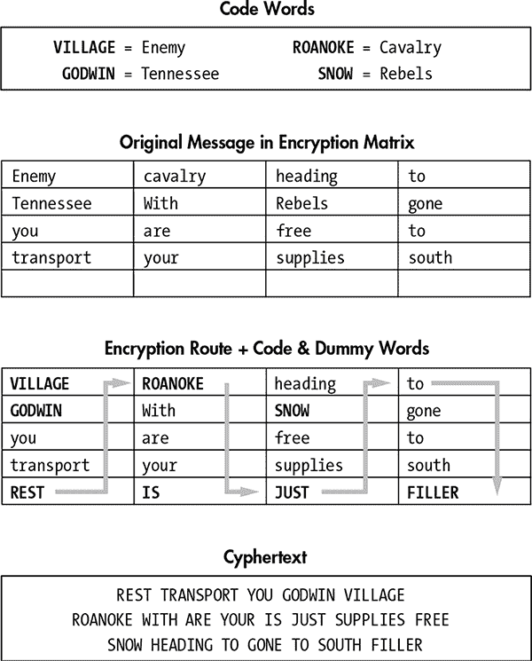
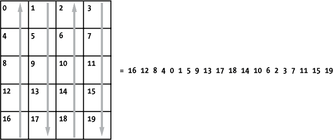
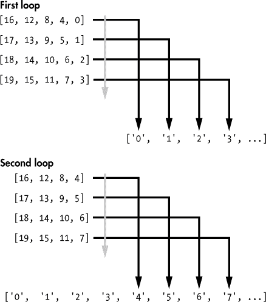
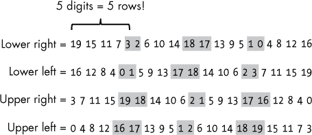
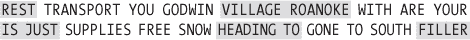
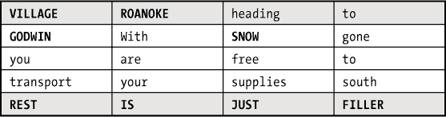
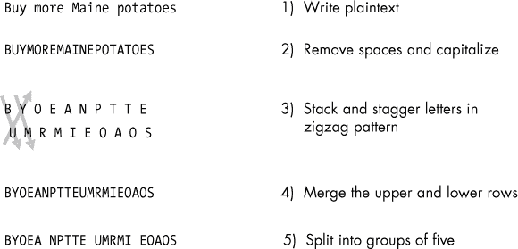
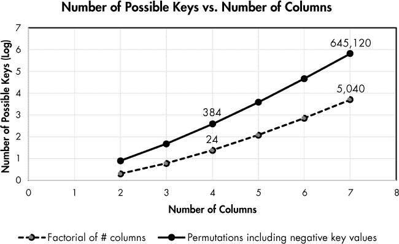

## 第五章：解码美国内战密码**


加密学是通过使用*密码*和*密文*进行安全通信的科学。密码是用其他词替代整个词语；而密文则是将单词中的字母进行打乱或替换（所以从技术上讲，摩尔斯电码实际上就是摩尔斯密文）。加密学的目标之一是使用*密钥*将可读的*明文*加密为不可读的*密文*，然后再将其*解密*回明文。*密码分析*的目标是在不知道密钥或加密算法的情况下解码密码和密码本。

在本章中，我们将研究美国内战中使用的两种密码：北方使用的路线密码和双方都使用的铁轨密码。我们还将探讨是什么使其中一种密码如此成功，以及我们如何从其应用中汲取经验教训，以便为没有经验的用户和不熟悉你代码的 Python 用户编写更好的程序。

### **项目#8：路线密码**

在美国内战中，联邦在加密学领域几乎在所有方面都优于南方联邦。联邦有更好的密码、更好的密文和更训练有素的人员。但也许它最大的优势在于领导力和组织结构。

美国军事电报部的负责人是安森·斯塔格（图 4-1）。作为西联电报的共同创始人，斯塔格从经验中知道，当电报操作员发送完整单词时，他们犯错误的概率比发送随机字母和数字的密文低。他还知道，军事电报只需要保密足够长的时间，以便完成命令。他的安全解决方案是一种混合加密系统，称为*路线置换密码*，它结合了经过置换的真实单词和代码词，成为了历史上最成功的军事密码之一。


*图 4-1：美国电报队的安森·斯塔格将军，1865 年*

置换密码*打乱*字母或单词的排列方式，不同于替代密码，后者是将明文中的字母用不同的字符或符号替代。图 4-2 展示了一个路线置换密码的例子。信息从左到右写在预定的若干列和行上，重要的明文词汇被代码词替代，最后一行填充了虚拟的占位符词。读者通过上下遍历这些列来确定重新排列的词语顺序，如图所示。起始词是*REST*，然后加密路线通过箭头显示出来。



*图 4-2：使用实际联邦代码词的路线密码*

要完全解码此消息，你需要知道起点和用于遍历消息并创建最终密文的路线*以及*代码词的含义。

在 20 世纪初，杰出的军事密码分析师威廉·弗里德曼（William Friedman）批评 Stager 的路由密码。他认为它过于简单，并且觉得南方联盟军队从未破解它的可能性非常小。但事实上，战争期间发送的数十万条路由密码显然从未被破解，而不是因为没有努力过。在一次早期的众包例子中，南方联盟军队将加密消息发布在报纸上，希望能获得解密的帮助，但没有成功。虽然一些历史学家推测这种密码曾在某些时候被破解，但 Stager 的设计教给我们几个重要的教训：

**为人为错误设计。** 军事密码必须简单，因为每天可能会发送数百条。路由密码中使用的真实单词使其不太可能被电报操作员弄乱。Stager 了解他的客户，并为他们设计。他认识到自己劳动力的局限性，并相应地调整了他的产品。相比之下，南方联盟军队在破译自己复杂的消息时遇到了巨大困难，有时甚至放弃，绕过敌军阵地去面对面交流！

**创新胜过发明。** 有时候，你不需要发明新东西；你只需要重新发现旧事物。适用于电报传输的简短字词置换密码本身太弱，无法单独使用，但结合了代号和破坏性虚假词汇后，它们使得南方联盟军队陷入困境。

**分享学习。** 因为电报队的每个人都使用相同的方法，所以很容易在现有技术的基础上进行改进并分享经验教训。这使得路由密码随着时间的推移而不断发展，加入了俚语和故意拼写错误，同时增加了大量的地名、人物和日期的代号词。

Stager 的实用密码可能并不讨后来的“纯粹主义者”喜欢，但它在当时是完美的设计。它背后的概念是永恒的，可以轻松转移到现代应用中。

**目标**

在哈里·特特尔多夫（Harry Turtledove）获奖的 1992 年小说《*南方的枪火*》中，时间旅行者为南方联盟军队提供现代武器，改变了历史的进程。假设你没有携带 AK-47 步枪，而是带着你的笔记本电脑、几块额外的电池和 Python，回到 1864 年，设计一个算法，解密基于假设的加密矩阵和路径的路由密码。在 Stager 的精神指导下，你将编写一个用户友好的程序，减少人为错误。

#### ***策略***

当涉及到解决密码时，如果你知道你在处理哪种类型的密码，事情会变得容易很多。在这种情况下，你知道它是一个置换密码，因为它由被打乱的真实单词组成。你还知道存在代号词和虚假词。你的任务是找出解密路由密码中*置换*部分的方法，然后让别人去担心代号词，而你则去享受一杯应得的薄荷酒。

##### **创建控制消息**

为了理解如何操作，创建你自己的消息和路由密码。将其称为你的*控制信息*：

+   列数 = 4

+   行数 = 5

+   起始位置 = 左下角

+   路由 = 交替上下列

+   明文 = 0 1 2 3 4 5 6 7 8 9 10 11 12 13 14 15 16 17 18 19

+   密文 = 16 12 8 4 0 1 5 9 13 17 18 14 10 6 2 3 7 11 15 19

+   密钥 = –1 2 –3 4

使用数字序列作为明文，可以让你在消息的任何地方立即判断自己是否正确解密了全部或部分内容。

置换矩阵如 图 4-3 所示，灰色箭头表示加密路径。



*图 4-3：控制消息的置换矩阵，包含路由密码路径及生成的密文*

密钥跟踪了列中路由的*顺序*和*方向*。路由不必按顺序穿过列。例如，它可以先向下移动第一列，再向上移动第三列，接着向下移动第四列，最后向上移动第二列。负数表示从底部开始，向上读取一列；正数则表示相反的顺序。对于控制信息，程序中使用的最终密钥将是一个列表：[–1, 2, –3, 4]。这个列表将指示程序从第一列的底部开始向上读取，移动到第二列的顶部并向下读取，接着移动到第三列的底部并向上读取，再移动到第四列的顶部并向下读取。

注意，你不应在密钥中使用 0，因为用户是人类，习惯从 1 开始计数。当然，Python 从 0 开始计数，所以你需要在背后从密钥值中减去 1。这样，大家都能受益！

在 “路由置换密码：暴力破解攻击” 中的 第 88 页，你可以使用这种紧凑的密钥结构通过暴力破解路由密码，自动尝试数百个密钥，直到明文被恢复。

##### **设计、填充和清空矩阵**

你将输入密文作为一个连续的字符串。为了让程序解开该字符串中的路由，你首先需要构建并填充一个转换矩阵。密文字符串只是置换矩阵中的列，在 图 4-3 中按顺序连接在一起的结果。由于置换矩阵有五行，密文中的每五个元素表示一个单独的列。你可以使用一个列表的列表来表示这个矩阵：

```py
>>> list_of_lists = [['16', '12', '8', '4', '0'], ['1', '5', '9', '13', '17'],
['18', '14', '10', '6', '2'], ['3', '7', '11', '15', '19']]
```

这个新列表中的每一项现在代表一个列表——每个列表代表一列——而每个列表中的五个元素代表组成该列的行。这有点难理解，所以我们将在单独的行中打印每一个这些嵌套列表：

```py
>>> for nested_list in list_of_lists
        print(nested_list)
[16, 12, 8, 4, 0]
[1, 5, 9, 13, 17]
[18, 14, 10, 6, 2]
[3, 7, 11, 15, 19]
```

如果你从左到右读取每个列表，从顶部开始，你将沿着换位路径进行读取，该路径是上下交替的列（参见图 4-3）。从 Python 的角度来看，第一个读取的列是`list-of-lists[0]`，起始点是`list-of-lists[0][0]`。

现在，通过按照与起始列相同的方向（向上）读取所有列来规范化路线。这需要反转每个其他列表中元素的顺序，如下所示，已加粗显示：

```py
[16, 12, 8, 4, 0]
[17, 13, 9, 5, 1]
[18, 14, 10, 6, 2]
[19, 15, 11, 7, 3]
```

一个模式浮现出来。如果你从右上角开始，向下读取每一列，直到左下角，数字将按数字顺序排列；你已恢复明文！

为了复制这一点，你的脚本可以遍历每个嵌套列表，移除该列表中的最后一个项并将该项添加到一个新的字符串中，直到翻译矩阵被清空。脚本将通过密钥知道它需要反转哪些嵌套列表，并知道依次清空矩阵的顺序。输出将是一个恢复后的明文字符串：

```py
'0 1 2 3 4 5 6 7 8 9 10 11 12 13 14 15 16 17 18 19'
```

现在你应该对策略有了一个非常概括的理解。接下来，让我们更详细地描述，并编写伪代码。

#### ***伪代码***

脚本可以分为三个主要部分：用户输入、翻译矩阵填充和解密为明文。你应该能够在下面的伪代码中看到这些部分：

```py
Load the ciphertext string.
Convert ciphertext into a cipherlist to split out individual words.
Get input for the number of columns and rows.
Get input for the key.
Convert key into a list to split out individual numbers.
Create a new list for the translation matrix.
For every number in the key:
    Create a new list and append every n items (n = # of rows) from the cipherlist.
    Use the sign of key number to decide whether to read the row forward or backward.
    Using the chosen direction, add the new list to the matrix. The index of each
    new list is based on the column number used in the key.
Create a new string to hold translation results.
For range of rows:
    For the nested list in translation matrix:
          Remove the last word in nested list
          Add the word to the translation string.
Print the translation string.
```

循环前的所有内容基本上只是收集和重新格式化密码数据。第一个循环负责构建和填充矩阵，第二个循环从该矩阵中创建一个翻译字符串。最后，打印出翻译字符串。

#### ***路线密码解密代码***

清单 4-1 接受一个使用路线密码加密的消息、换位矩阵中的列数和行数，以及一个密钥，然后显示翻译后的明文。它将解密所有“常见”的路线密码，其中路线从列的顶部或底部开始，并沿着列向上和/或向下继续。

这是原型版本；一旦你确认它可以正常工作，你可以将其打包供其他人使用。你可以在*[`www.nostarch.com/impracticalpython/`](https://www.nostarch.com/impracticalpython/)*下载此代码。

*route_cipher_decrypt_prototype.py*

```py
➊ ciphertext = "16 12 8 4 0 1 5 9 13 17 18 14 10 6 2 3 7 11 15 19"

   # split elements into words, not letters

➋ cipherlist = list(ciphertext.split())

➌ # initialize variables

   COLS = 4

   ROWS = 5

   key = '-1 2 -3 4'  # neg number means read UP column vs. DOWN

   translation_matrix = [None] * COLS

   plaintext = ''

   start = 0

   stop = ROWS

   # turn key_int into list of integers:

➍ key_int = [int(i) for i in key.split()]

   # turn columns into items in list of lists:

➎ for k in key_int:

    ➏ if k < 0:  # reading bottom-to-top of column

           col_items = cipherlist[start:stop]

       elif k > 0:  # reading top-to-bottom of columnn

           col_items = list((reversed(cipherlist[start:stop])))

       translation_matrix[abs(k) - 1] = col_items

       start += ROWS

       stop += ROWS

   print("\nciphertext = {}".format(ciphertext))

   print("\ntranslation matrix =", *translation_matrix, sep="\n")

   print("\nkey length = {}".format(len(key_int)))

   # loop through nested lists popping off last item to new list:

➐ for i in range(ROWS):

       for col_items in translation_matrix:

        ➑ word = str(col_items.pop())

        ➒ plaintext += word + ' '

   print("\nplaintext = {}".format(plaintext))
```

*清单 4-1：* route_cipher_decrypt_prototype.py 的代码

从将密文➊作为字符串加载开始。你要处理的是单词而不是字母，因此根据空格使用`split()`字符串方法将字符串分开，创建一个名为`cipherlist`的新列表➋。`split()`方法是`join()`方法的反操作，你之前见过。你可以在任何字符串上进行分割；该方法默认为连续的空白字符运行，删除每个空白字符后才移至下一个。

现在是时候输入你对密码的了解了➌：列和行，这些构成了矩阵，还有包含路由的密钥。将列数和行数初始化为常量。然后创建一个名为`translation_matrix`的空列表，用来保存每列的内容作为（嵌套）列表。通过将值`None`乘以列数来分配占位符。你可以使用这些空项的索引将列按正确顺序放回原位，以应对密钥顺序不按数字排列的情况。

一个名为`plaintext`的空字符串将保存解密后的消息。接下来是一些切片参数。请注意，这些参数中的一些是根据行数推导出来的，行数等于每列中的项目数。

现在，使用*列表推导式*将密钥变量（一个字符串）转换为整数列表——这是一种对列表执行操作的简洁方式➍。你稍后会用密钥中的数字作为索引，因此它们需要是整数。

下一段代码是一个`for`循环，它填充`translation_matrix`，它只是一个包含列表的列表➎。由于每列变成一个嵌套列表，并且`key_int`列表的长度等于列数，循环的范围就是密钥，它也描述了路由。

在循环内，使用条件判断密钥是正数还是负数➏；如果密钥是正数，那么切片的方向将被反转。根据绝对密钥值将切片分配到`translation_matrix`的正确位置，并减去 1（因为密钥不包括 0，而列表索引是从 0 开始的）。通过将切片的端点按行数推进并打印一些有用的信息，完成循环。

最后一段代码➐遍历行数——这相当于嵌套列表中单词的数量——以及每个嵌套列表。这两次循环的前两次展示在图 4-4 中。每当你停在每个嵌套列表时，就能使用我最喜欢的 Python 函数之一——列表的`pop()`方法➑。`pop()`方法会移除并返回列表的最后一个项，除非提供了特定的索引。它销毁了嵌套列表，但反正你已经用完它了。



*图 4-4：第一次和第二次遍历嵌套列表，移除并将每个末尾项附加到翻译字符串*

一旦你弹出一个单词，就把它连接到`plaintext`字符串并加一个空格➒。剩下的就是显示解密后的密文。数字测试集的输出如下：

```py
plaintext = 0 1 2 3 4 5 6 7 8 9 10 11 12 13 14 15 16 17 18 19
```

那看起来像是成功了！

#### ***破解路由密码***

上述代码假设你已经知道加密矩阵的路径，或者已经正确猜测出密钥。如果这些假设不成立，你唯一的办法就是尝试每一个可能的密钥和矩阵排列。你可以在《路由置换密码：暴力破解攻击》的第 88 页中，自动化选择密钥的过程——对于特定列数。可是，正如你所看到的，联合路由密码对暴力破解攻击有很强的防护能力。你可以破解它，但你最终会获得大量数据，让你感觉就像那只追上了汽车并抓住它的狗。

随着信息变长，置换密码中可能的加密路径数量变得过于庞大，甚至现代计算机也难以用暴力破解法解决。例如，如果有八列，并且允许路径跳过任何列，那么组合列的方式就是八的阶乘：8 × 7 × 6 × 5 × 4 × 3 × 2 × 1 = 40,320。也就是说，40,320 条路径*在*你开始选择不同的列路径之前。如果路径可以在列中上下变动，组合的数量就增加到 10,321,920。若考虑到从列中的*任何*位置开始——而不是从顶部或底部——并允许*任何*矩阵路径（如螺旋状），那么情况就会变得更加复杂！

由于这个原因，即使是简单的置换密码，也可能拥有成千上万甚至数百万种可能的路径。即便路径数量对计算机来说是可管理的，且暴力破解攻击可能奏效，你仍然需要一种方法来筛选出无数的结果，并且无论是通过计算方式选出一个胜者，还是选择一小部分候选结果进行人工检查。

对于更常见的*字母*置换密码，可以编写一个函数，通过将每次解密的尝试与字典文件进行比较，来检测是否为英语。如果解密出来的字典单词数量超过某个阈值百分比，那么你大概率破解了这个密码。同样，如果常见的字母对（*双字母组合*）出现频率较高，比如*er*、*th*、*on*或*an*，你可能已经找到了密码的解决方案。不幸的是，这种方法不适用于像你现在使用的*单词*置换密码。

字典无法帮助你判断单词是否已经正确排列。对于单词排列，你可以尝试使用诸如语法规则和概率语言模型（例如*n*-gram）的方式，程序化地遍历数千个解密结果并挑选候选结果，但斯塔格在他的路由密码中巧妙地使用了代号和虚假单词，这将大大增加破解的难度。

密码分析师认为，尽管存在上述问题，简单的、直白的置换密码在没有计算机的情况下还是相对容易破解的。他们会寻找有意义的常见单词或字母对，利用这些线索来猜测置换矩阵的行数。

为了说明这一点，让我们使用由数字组成的控制信息。在图 4-5 中，你可以看到一个 4×5 矩阵的密文结果，每个结果都是从网格的四个角之一开始，按照交替的顺序路径进行的。所有情况都包含相邻数字的重复（在图 4-5 中用阴影标出）。这些重复表示你在网格中横向移动，并且提供了关于矩阵设计和所走路径的线索。你可以立即看到有五行，因为每对常见的数字对中的第一个是第五个单词。此外，知道消息中有 20 个单词，你可以推测列数为四（20 / 5 = 4）。通过合理的假设，消息是从左到右写的，你甚至可以猜测路径。例如，如果你从右下角开始，你首先上移到 3，然后左移到 2，再下移到 18，再左移到 17，然后上移到 1，最后左移到 0。当然，使用单词时会更困难，因为单词之间的联系不如数字那样明确，但使用数字更能突显这一点。



*图 4-5：按逻辑顺序排列的字符或单词（阴影部分）可以用于推测加密路径。*

看图 4-6，这是基于图 4-2 中的消息。结束单词和可能的链接单词，如“is just”或“heading to”，被阴影标出。



*图 4-6：对图 4-2 中路线密码的人工破解。示出一个五行矩阵。*

总共有 20 个单词，可以有 4 行、5 行或 10 行。我们怀疑不会使用两列矩阵，因此我们实际处理的是 4×5 或 5×4 的排列。如果加密路径像图 4-5 所示，那么我们预期在四行矩阵中，每两个阴影单词之间会有两个非阴影单词，而在五行矩阵中会有三个非阴影单词。无论你从哪个方向阅读密文，按照四列模式来构思合理的单词对都更加困难。所以，我们可能在处理一个五列的解法，从矩阵的左侧开始——因为从左到右读取的链接单词是有意义的。

请注意，图 4-6 中的阴影单词如何填充在图 4-7 中换位矩阵的顶部和底部行中。这是我们所期望的，因为路径在每一列的顶部和底部“转弯”了。图形化解决方案：上帝赐予不懂数学者的礼物！



*图 4-7：图 4-6 中的阴影单词放置在换位矩阵中*

这看起来很简单，但我们知道路由密码是如何工作的。联邦的破译员最终也发现了它，但密码词的使用让他们无法完全进入系统。要破解这些代码，他们需要一份捕获的密码本或一个能够获取并分析大数据的大型组织，而这在 19 世纪的南方联盟是无法实现的。

#### ***添加用户界面***

本项目的第二个目标是编写代码，减少人为错误，尤其是对于经验较少的人（包括技术人员、实习生、同事和 1864 年的电报员）。当然，使程序更具用户友好的最佳方法是包括一个*图形用户界面（GUI）*，但有时这并不实际或不可行。例如，破解代码程序会自动循环通过成千上万的可能密钥，自动生成这些密钥比直接从用户获取它们要容易。

在这个例子中，你将假设用户会打开程序文件并输入一些内容，甚至做一些小的代码修改。以下是一些指南：

1.  从有用的文档字符串开始（参见第一章）。

1.  将所有必需的用户输入放在最上面。

1.  使用注释来澄清输入要求。

1.  清晰地将用户输入与其余代码分开。

1.  将大多数过程封装在函数中。

1.  包括函数以捕捉可预测的用户错误。

这种方法的好处在于没有侮辱任何人的智商。如果用户*想*滚动查看代码，甚至修改代码，也没有任何障碍。如果他们只想输入一些值并获得一个黑盒解决方案，那么他们也会很高兴。而且，我们通过简化操作并减少出错的可能性，尊重了安森·斯塔格的精神。

##### **指导用户并获取输入**

列表 4-2 展示了重新打包后的原型代码，供与他人分享。你可以在* [`www.nostarch.com/impracticalpython/`](https://www.nostarch.com/impracticalpython/)*找到这段代码。

*route_cipher_decrypt.py*，第一部分

```py
➊ """Decrypt a path through a Union Route Cipher.

➋ Designed for whole-word transposition ciphers with variable rows & columns.
   Assumes encryption began at either top or bottom of a column.
   Key indicates the order to read columns and the direction to traverse.
   Negative column numbers mean start at bottom and read up.
   Positive column numbers mean start at top & read down.

   Example below is for 4x4 matrix with key -1 2 -3 4.
   Note "0" is not allowed.
   Arrows show encryption route; for negative key values read UP.

     1   2   3   4

    ___ ___ ___ ___
   | ^ | | | ^ | | | MESSAGE IS WRITTEN
   |_|_|_v_|_|_|_v_|
   | ^ | | | ^ | | | ACROSS EACH ROW
   |_|_|_v_|_|_|_v_|
   | ^ | | | ^ | | | IN THIS MANNER
   |_|_|_v_|_|_|_v_|
   | ^ | | | ^ | | | LAST ROW IS FILLED WITH DUMMY WORDS
   |_|_|_v_|_|_|_v_|
   START        END

   Required inputs - a text message, # of columns, # of rows, key string

   Prints translated plaintext
   """
➌ import sys

   #==============================================================================
➍ # USER INPUT:

➎ # the string to be decrypted (type or paste between triple-quotes):
   ciphertext = """16 12 8 4 0 1 5 9 13 17 18 14 10 6 2 3 7 11 15 19
   """

➏ # number of columns in the transposition matrix:
   COLS = 4

   # number of rows in the transposition matrix:
   ROWS = 5

➐ # key with spaces between numbers; negative to read UP column (ex = -1 2 -3 4):
   key = """ -1 2 -3 4 """

➑ # END OF USER INPUT - DO NOT EDIT BELOW THIS LINE!
   #==============================================================================

➒ ________________________________________________________________________________
```

*列表 4-2：route_cipher_decrypt.py 的文档字符串、导入和用户输入*

从一个多行文档字符串开始 ➊。文档字符串告知用户该程序仅解密典型的路由密码——即从列的顶部或底部开始的密码——并告诉他们如何输入密钥信息 ➋。包含一个示意图以帮助说明。

接下来，导入`sys`以访问系统字体和功能 ➌。你将检查用户输入是否符合接受标准，因此你需要在 shell 中以引人注目的红色显示消息。将这个`import`语句放在这里有些两难。由于战略目标是将工作代码隐藏起来，你应该在程序的后面应用它。但 Python 将所有`import`语句放在顶部的惯例太强大，无法忽视。

现在是输入部分。你有多少次见过或处理过需要在程序中 *各处* 进行修改或输入的代码？这对作者来说可能很混乱，甚至对其他用户来说更加糟糕。因此，为了方便、礼貌和防止错误，将所有这些重要变量移到顶部。

首先，用一行分隔输入部分，然后通过全大写的注释提醒用户他们即将进行输入 ➍。必需的输入已经通过注释明确定义。你可以使用三重引号来处理文本输入，以便更好地容纳较长的文本片段。请注意，我已经输入了来自 图 4-3 的数字串 ➎。接下来，用户需要添加转换矩阵的列数和行数 ➏，然后是提议的（或已知的）密钥 ➐。

在用户输入部分结束时，使用声明性注释标明，并提醒不要编辑以下行 ➑。然后添加一些额外的空格，以更清晰地将输入部分与程序的其余部分分开 ➒。

##### **定义 main() 函数**

清单 4-3 定义了 `main()` 函数，它运行程序并在解码后打印明文。`main()` 函数可以在它调用的函数之前或之后定义，只要它是最后被调用的函数。

*route_cipher_decrypt.py，* 第二部分

```py
def main():
    """Run program and print decrypted plaintext."""
 ➊ print("\nCiphertext = {}".format(ciphertext))
    print("Trying {} columns".format(COLS))
    print("Trying {} rows".format(ROWS))
    print("Trying key = {}".format(key))

    # split elements into words, not letters
 ➋ cipherlist = list(ciphertext.split())
 ➌ validate_col_row(cipherlist)
 ➍ key_int = key_to_int(key)
 ➎ translation_matrix = build_matrix(key_int, cipherlist)
 ➏ plaintext = decrypt(translation_matrix)

 ➐ print("Plaintext = {}".format(plaintext))
```

*清单 4-3：定义了* main() *函数*

通过打印用户输入到 shell 来开始 `main()` 函数 ➊。然后，将密文按空格拆分成列表，正如你在原型代码中所做的那样 ➋。

接下来的系列语句调用了你将很快定义的函数。第一个函数检查输入的行和列是否适合消息长度 ➌。第二个函数将 `key` 变量从字符串转换为整数列表 ➍。第三个函数构建了转换矩阵 ➎，第四个函数对矩阵运行解密算法并返回明文字符串 ➏。通过打印明文 ➐ 来完成 `main()` 函数。

##### **验证数据**

当你继续为最终用户打包 *route_cipher_decrypt.py* 时，你需要验证输入是否有效。清单 4-4 预见了常见的用户错误，并为用户提供了有用的反馈和指导。

*route_cipher_decrypt.py，* 第三部分

```py
➊ def validate_col_row(cipherlist):
       """Check that input columns & rows are valid vs. message length."""
       factors = []
       len_cipher = len(cipherlist)
    ➋ for i in range(2, len_cipher):  # range excludes 1-column ciphers
           if len_cipher % i == 0:
               factors.append(i)
    ➌ print("\nLength of cipher = {}".format(len_cipher))
       print("Acceptable column/row values include: {}".format(factors))
       print()
    ➍ if ROWS * COLS != len_cipher:
           print("\nError - Input columns & rows not factors of length "
                 "of cipher. Terminating program.", file=sys.stderr)
           sys.exit(1)

➎ def key_to_int(key):
       """Turn key into list of integers & check validity."""
    ➏ key_int = [int(i) for i in key.split()]
       key_int_lo = min(key_int)
       key_int_hi = max(key_int)
    ➐ if len(key_int) != COLS or key_int_lo < -COLS or key_int_hi > COLS \
           or 0 in key_int:
        ➑ print("\nError - Problem with key. Terminating.", file=sys.stderr)
           sys.exit(1)
       else:
        ➒ return key_int
```

*清单 4-4：定义了用于检查和准备用户输入的函数*

`validate_col_row()` 函数检查输入的列数和行数是否适合 `cipherlist` 的长度，该长度作为参数传递 ➊。换位矩阵的大小始终与消息中的单词数量相同，因此列数和行数必须是消息大小的因子。要确定所有允许的因子，首先创建一个空列表来存储因子，然后获取 `cipherlist` 的长度。使用 *cipherlist*，而不是输入的 *ciphertext*，因为密文中的元素是 *字母*，而不是单词。

通常，若要获取一个数字的因子，你会使用范围（`1,` 数字`+` `1`），但你不希望这些端点出现在`factors`列表中，因为具有这些维度的翻译矩阵就是明文。所以将这些值从范围中排除 ➋。由于一个数的因子可以整除该数，因此使用模运算符（`%`）来查找因子，并将它们添加到`factors`列表中。

接下来，为用户显示一些有用的信息：密码列表的长度以及可接受的行列选择 ➌。最后，将用户的两个选择相乘，并将结果与密码列表的长度进行比较。如果它们不匹配，则在终端显示一个红色的警告消息（使用我们之前的`file=sys.stderr`技巧），并终止程序 ➍。使用`sys.exit(1)`，其中`1`表示异常退出。

现在定义一个函数来检查密钥，并将其从字符串转换为列表 ➎。将`key`变量作为参数传递给它。将`key`中的每一项分割出来并转换为整数；将该列表命名为`key_int`，以便与用户输入的`key`变量区分 ➏。接下来，确定`key_int`列表中的最小值和最大值。然后使用`if`语句确保该列表包含的项数与列数相同，并且`key`中的项没有过大、过小或等于`0` ➐。如果任何条件不符合，程序将终止并显示错误消息 ➑。否则，返回`key_int`列表 ➒。

##### **构建和解码翻译矩阵**

列表 4-5 定义了两个函数，一个用于构建翻译矩阵，另一个用于解码翻译矩阵，并将`main()`函数作为模块或独立模式调用。

*route_cipher_decrypt.py,* 第四部分

```py
➊ def build_matrix(key_int, cipherlist):
       """Turn every n items in a list into a new item in a list of lists."""
       translation_matrix = [None] * COLS
       start = 0
       stop = ROWS
       for k in key_int:
           if k < 0:  # read bottom-to-top of column
               col_items = cipherlist[start:stop]
           elif k > 0:  # read top-to-bottom of columnn
               col_items = list((reversed(cipherlist[start:stop])))
           translation_matrix[abs(k) - 1] = col_items
           start += ROWS
           stop += ROWS
       return translation_matrix

➋ def decrypt(translation_matrix):
       """Loop through nested lists popping off last item to a string."""
       plaintext = ''
       for i in range(ROWS):
           for matrix_col in translation_matrix:
               word = str(matrix_col.pop())
               plaintext += word + ' '
       return plaintext

➌ if __name__ == '__main__':
       main()
```

*列表 4-5：定义了用于构建和解码翻译矩阵的函数*

这两个函数表示在*route_cipher_decrypt_prototype.py*程序中对代码的封装。详细描述请参见列表 4-1。

首先，定义一个函数来构建翻译矩阵；将`key_int`和`cipherlist`变量作为参数传递给它 ➊。让该函数返回一个列表的列表。

接下来，将解密代码打包为一个函数，在这个函数中从每个嵌套列表的末尾弹出元素，并使用`translation_matrix`列表作为参数 ➋。返回明文，由`main()`函数打印出来。

以条件语句结束，使得程序能够作为模块运行或独立运行 ➌。

如果你只是偶尔或一次性使用这段代码，你会欣赏它的简单直观。如果你打算修改代码以便用于自己的目的，你也会欣赏到关键变量的可访问性以及主要任务的模块化。你不必深入程序中挖掘或理解像`list1`和`list2`这样难以理解的变量之间的区别。

以下是程序的输出，使用图 4-3 中的密文：

```py
Ciphertext = 16 12 8 4 0 1 5 9 13 17 18 14 10 6 2 3 7 11 15 19

Trying 4 columns
Trying 5 rows
Trying key = -1 2 -3 4

Length of cipher = 20
Acceptable column/row values include: [2, 4, 5, 10]

Plaintext = 0 1 2 3 4 5 6 7 8 9 10 11 12 13 14 15 16 17 18 19
```

你现在应该能够轻松地解密带有已知密钥的路线置换密码，或者使用脚本清晰且易于访问的界面调整密钥来测试怀疑的路线。你将有机会通过自动尝试每一个可能的密钥，真正破解这些密码，详见《路线置换密码：暴力破解》，位于第 88 页。

### **项目 #9：铁路栅栏密码**

南方联邦的军官和间谍在密码学方面几乎是自给自足的。这导致了不太复杂的解决方案，其中之一就是铁路栅栏密码，由于其与分裂木栅栏的锯齿形状相似，因此得名（见图 4-8）。


*图 4-8：一座铁路栅栏*

铁路栅栏是一种简单易用的置换密码，像联邦的路线密码一样，但与路线密码不同的是，它是对字母进行置换而非单词，使其更容易出错。而且，由于可能的密钥数量远比路线密码中的路径数量有限，铁路栅栏密码也更容易被“破解”。

联邦和南方都使用铁路栅栏作为场地密码，而间谍们可能并不经常使用密码词。密码本需要严格控制，显而易见的原因是它们更有可能保存在军事电报办公室，而不是随身携带，容易被渗透的卧底特工带走。

有时，南方联邦使用更复杂的维吉尼亚密码（见《项目 #12：隐藏维吉尼亚密码》位于第 106 页）用于重要消息——以及一些不重要的消息来误导敌人——但这是一项繁琐的解密工作，进行加密也同样费时，并不适合快速的现场通讯。

尽管南方联邦及南方人普遍缺乏密码学方面的训练，但他们依然聪明且富有创新精神。他们在秘密消息艺术方面的成就之一，就是在冷战广泛采用之前 100 年，使用微型摄影。

**目标**

编写 Python 程序，帮助间谍加密和解密“二轨”（两行）铁路栅栏密码。你应该以一种能够减少缺乏经验的用户操作错误的方式编写程序。

#### ***策略***

要使用铁路栅栏密码加密信息，请按照图 4-9 中的步骤操作。



*图 4-9：二轨铁路栅栏密码的加密过程*

明文写完后，去掉空格，所有字母都转换为大写字母（步骤 2）。使用大写字母是密码学中的常规做法，因为它掩盖了专有名词和句子的开头，从而给密码分析员提供了更少的线索来解密信息。

然后将消息按堆叠的方式写出，每隔一个字母就将下一个字母写在前一个字母的下面，并且向右移动一个位置（步骤 3）。这就是“铁丝栅栏”比喻的体现。

然后写出第一行，紧接着在同一行上写出第二行（步骤 4），接着将字母分成五个一组，以制造出独立词的假象，并进一步迷惑密码分析师（步骤 5）。

要解密铁丝栅栏密码，逆向执行过程。只需去掉空格，将消息分为两半，将第二半放在第一半的下方，偏移一个字母，然后按之字形模式读取消息。如果密文的字母数是奇数，将多出的字母放在第一（上）半部分。

为了方便希望使用铁丝栅栏密码的人，按照前面的步骤写两个程序，一个用来加密，另一个用来解密。图 4-9 本质上就是你的伪代码，接下来我们开始吧。既然你已经知道如何为缺乏经验的用户打包代码，从一开始就采用这种方法吧。

#### ***铁丝栅栏密码加密代码***

本节中的代码允许用户输入明文消息，并在解释器窗口中打印出加密结果。此代码可通过书本资源下载，网址为*[`www.nostarch.com/impracticalpython/`](https://www.nostarch.com/impracticalpython/)*。

##### **指导用户并获取输入**

列表 4-6，位于*rail_fence_cipher_encrypt.py*的顶部，提供了程序的说明，并将明文赋值给一个变量。

*rail_fence_cipher_encrypt.py,* 第一部分

```py
➊ r"""Encrypt a Civil War 'rail fence' type cipher.

   This is for a "2-rail" fence cipher for short messages.

   Example text to encrypt:  'Buy more Maine potatoes'

   Rail fence style:  B Y O E A N P T T E
                       U M R M I E O A O S

   Read zigzag:       \/\/\/\/\/\/\/\/\/\/

   Encrypted:  BYOEA NPTTE UMRMI EOSOS

   """
   #------------------------------------------------------------------------------
➋ # USER INPUT:

   # the string to be encrypted (paste between quotes):
➌ plaintext = """Let us cross over the river and rest under the shade of the trees
   """

➍ # END OF USER INPUT - DO NOT EDIT BELOW THIS LINE!
   #------------------------------------------------------------------------------
```

*列表 4-6：rail_fence_cipher_encrypt.py 的文档字符串和用户输入部分*

从多行文档字符串开始，在第一组三重引号前加上`r`（表示“原始”）前缀 ➊。没有这个前缀，Pylint 会对下文中的`\/\`斜杠报出严重警告。幸运的是，pydocstyle 会指出这一点，你可以修复它（阅读第一章了解更多关于 Pylint 和 pydocstyle 的信息）。如果你想了解更多关于*原始字符串*的内容，请参见 Python 文档中的第 2.4.1 节（*[`docs.python.org/3.6/reference/lexical_analysis.html#string-and-bytes-literals`](https://docs.python.org/3.6/reference/lexical_analysis.html#string-and-bytes-literals)*）。

接下来，用一行分隔程序的文档字符串和`import`语句与输入部分，并通过大写注释让用户知道他们要开始了 ➋。用注释清楚地定义输入要求，并将明文放入三重引号中，以更好地容纳长文本字符串 ➌。

最后，用声明结束用户输入部分，并提醒不要编辑以下内容 ➍。

##### **加密消息**

将列表 4-7 添加到*rail_fence_cipher_encrypt.py*中，以处理加密过程。

*rail_fence_cipher_encrypt.py,* 第二部分

```py
➊ def main():
       """Run program to encrypt message using 2-rail rail fence cipher."""
       message = prep_plaintext(plaintext)
       rails = build_rails(message)
       encrypt(rails)

➋ def prep_plaintext(plaintext):
       """Remove spaces & leading/trailing whitespace."""
    ➌ message = "".join(plaintext.split())
    ➍ message = message.upper()  # convention for ciphertext is uppercase
       print("\nplaintext = {}".format(plaintext))
       return message

➎ def build_rails(message):
       """Build strings with every other letter in a message."""
       evens = message[::2]
       odds = message[1::2]
    ➏ rails = evens + odds
       return rails

➐ def encrypt(rails):
       """Split letters in ciphertext into chunks of 5 & join to make string."""
    ➑ ciphertext = ' '.join([rails[i:i+5] for i in range(0, len(rails), 5)])
       print("ciphertext = {}".format(ciphertext))

➒ if __name__ == '__main__':
       main()
```

*Listing 4-7: 定义加密明文消息的函数*

首先，定义一个`main()`函数来运行程序 ➊。拥有一个`main()`函数可以让你在以后有需要时，将此程序作为模块在另一个程序中使用。这个函数调用了其他三个函数：一个用于准备输入的明文，一个用于构建加密所用的“rails”，以及一个用于将加密文本拆分成五个字母一组的块。

接下来，定义一个函数，用于处理输入字符串并为加密做准备 ➋。这个过程包括去除空格 ➌ 和将字母转换为大写（如图 4-9 的第 2 步所示） ➍。然后，换行后将明文打印到屏幕上并返回。

现在，定义一个函数，按图 4-9 的第 3 步，将`message`字符串切片为偶数位置（从 0 开始，步长为 2）和奇数位置（从 1 开始，步长为 2） ➎。然后，将这两个字符串连接成一个新字符串，命名为`rails` ➏，并返回。

定义一个加密函数，该函数以`rails`字符串作为参数 ➐。使用列表推导式将密文分成五个一组的块（如图 4-9 的第 5 步所示） ➑。然后，将加密文本打印到屏幕上。最后编写代码，以便在作为模块或独立模式下运行程序 ➒。

以下是该程序的输出：

```py
plaintext = Let us cross over the river and rest under the shade of the trees
ciphertext = LTSRS OETEI EADET NETEH DOTER EEUCO SVRHR VRNRS UDRHS AEFHT ES
```

#### ***Rail Fence Cipher 解密代码***

本部分的代码允许用户输入使用 rail fence cipher 加密的消息，并在解释器窗口中显示明文。此代码可与本书的其他资源一起下载，网址为*[`www.nostarch.com/impracticalpython/`](https://www.nostarch.com/impracticalpython/)*。

##### **导入模块，指示用户并获取输入**

Listing 4-8 开始的指令与*rail_fence_cipher_encrypt.py*程序中的指令类似（Listing 4-6），导入了两个模块，并获取了用户输入。

*rail_fence_cipher_decrypt.py*，第一部分

```py
   r"""Decrypt a Civil War 'rail fence' type cipher.

   This is for a 2-rail fence cipher for short messages.

   Example plaintext:  'Buy more Maine potatoes'

   Rail fence style:  B Y O E A N P T T E
                       U M R M I E O A O S

   Read zigzag:       \/\/\/\/\/\/\/\/\/\/

   Ciphertext:  BYOEA NPTTE UMRMI EOSOS

   """
➊ import math
   import itertools

   #------------------------------------------------------------------------------
   # USER INPUT:

   # the string to be decrypted (paste between quotes):
➋ ciphertext = """LTSRS OETEI EADET NETEH DOTER EEUCO SVRHR VRNRS UDRHS AEFHT ES

   """

   # END OF USER INPUT - DO NOT EDIT BELOW THIS LINE!
   #------------------------------------------------------------------------------
```

*Listing 4-8: 导入模块，指示用户并获取用户输入*

这里的一个不同之处在于，你需要导入`math`和`itertools`模块 ➊。你将使用`math`进行四舍五入。`itertools`模块是 Python 标准库中的一组函数，能够创建用于高效循环的迭代器。你将在解密过程中使用`itertools`的`zip_longest()`函数。

唯一的另一个变化是用户应该输入密文，而不是明文 ➋。

##### **解密消息**

Listing 4-9 定义了用于准备和解码密文的函数，并完成了*rail_fence_cipher_decrypt.py*。

*rail_fence_cipher_decrypt.py*，第二部分

```py
➊ def main():

       """Run program to decrypt 2-rail rail fence cipher."""

       message = prep_ciphertext(ciphertext)

       row1, row2 = split_rails(message)

       decrypt(row1, row2)

➋ def prep_ciphertext(ciphertext):

       """Remove whitespace."""

       message = "".join(ciphertext.split())

       print("\nciphertext = {}".format(ciphertext))

       return message

➌ def split_rails(message):

       """Split message in two, always rounding UP for 1st row."""

    ➍ row_1_len = math.ceil(len(message)/2)

    ➎ row1 = (message[:row_1_len]).lower()

       row2 = (message[row_1_len:]).lower()

       return row1, row2

➏ def decrypt(row1, row2):

       """Build list with every other letter in 2 strings & print."""

    ➐ plaintext = []

    ➑ for r1, r2 in itertools.zip_longest(row1, row2):

           plaintext.append(r1)

           plaintext.append(r2)

    ➒ if None in plaintext:

           plaintext.pop()

       print("rail 1 = {}".format(row1))

       print("rail 2 = {}".format(row2))

       print("\nplaintext = {}".format(''.join(plaintext)))

➓ if __name__ == '__main__':

       main()
```

*Listing 4-9: 准备、解码并打印消息*

这里的`main()`函数➊与第 4-7 节中加密程序使用的函数相似。调用了三个函数：一个用于准备输入字符串，一个用于在栅栏密码中“分割轨道”，还有一个用于将两个轨道重新拼接成可读的明文。

从一个函数开始，重复加密过程中使用的预处理步骤➋。移除五个字母块之间的空格，以及在粘贴密文时产生的其他空白字符，然后打印并返回密文。

接下来，你需要将消息分成两半，以逆转加密过程➌。正如我在《策略》中提到的，第 81 页上，字符数为奇数的消息中的额外字母被分配到顶部行。为了处理奇数情况，使用`math.ceil()`方法➍。“Ceil”代表“上限”，所以当你除以 2 时，答案总是向上舍入到最接近的整数。将这个数字赋值给`row_1_len`变量。知道了第一行的长度后，使用这个值和切片操作，将`message`变量分割成两个字符串，分别表示两行➎。最后，通过返回行变量来结束函数。

现在，只需从两行中选择并连接每个其他字母，将明文拼接回来。定义一个`decrypt()`函数，并传入`row1`和`row2`字符串➏。通过创建一个空列表来存放结果，开始翻译过程➐。接下来，你需要一种简单的方法来处理密文字符数为奇数的情况——这样会导致两行长度不同——因为 Python 会通过抛出索引越界错误来阻止你遍历两个不等长的序列。这就是为什么我们导入了`itertools`模块——它的函数有助于循环遍历，绕过这个问题。

`itertools.zip_longest()`函数接受两个字符串作为参数，并无怨无悔地循环遍历它们，在较短的字符串结束时向`plaintext`列表添加空值（`None`）➑。你不想打印这个空值，因此如果它存在，使用你在路线密码代码中应用的`pop()`方法将其移除➒。通过打印两个行（轨道）到屏幕上，接着是解密后的密文，完成解密过程。

结束时使用标准代码，运行程序作为模块或独立模式➓。程序的输出如下：

```py
ciphertext = LTSRS OETEI EADET NETEH DOTER EEUCO SVRHR VRNRS UDRHS AEFHT ES

rail 1 = LTSRSOETEIEADETNETEHDOTERE
rail 2 = EUCOSVRHRVRNRSUDRHSAEFHTES

plaintext = letuscrossovertheriverandrestundertheshadeofthetrees
```

请注意，单词之间不会有空格，但没关系——你可不想让密码分析员完全无所作为！

### **总结**

这完成了我们对美国内战密码的探索。你编写了一个帮助用户解密路由密码的程序，并获得了关于密码如何工作及如何破解的宝贵见解。你可以在以下实践项目中实施对密码的自动化攻击，但请记住，凭借其众多可能的路径和使用代码词，联邦的路由密码仍然是一个难解的难题。

接下来，你编写了程序来加密和解密二轨栅栏密码。考虑到手动加密和解密过程的繁琐和易出错，为战争中的双方提供一个自动化的方式来完成大部分工作将是非常有价值的。为了进一步解决这些问题，你编写的代码对没有经验的密码分析员或间谍来说也非常友好。

### **进一步阅读**

更多适合初学者的 Python 程序，用于处理换位密码，可以在 Al Sweigart 的《用 Python 破解密码》（No Starch Press，2018 年）一书中找到。

Gary Blackwood 的《神秘信息：密码与密码学的历史》（企鹅出版社，2009 年）和 Simon Singh 的《密码书：从古埃及到量子密码学的秘密科学》（Anchor 出版社，2000 年）提供了密码学的精彩和图文并茂的概述。

网站 *[`www.civilwarsignals.org/pages/crypto/crypto.html`](http://www.civilwarsignals.org/pages/crypto/crypto.html)* 和 *[`www.mathaware.org/mam/06/Sauerberg_route-essay.html`](http://www.mathaware.org/mam/06/Sauerberg_route-essay.html)* 包含了 Edward Porter Alexander 尝试破解路由密码的描述。Alexander 是南方联邦军信号兵团的创始人，也是一个杰出的军事创新者，拥有许多令人印象深刻的成就。

### **实践项目**

通过这些项目来提高你的密码学技能。解决方案可以在附录和在线找到。

#### ***破解林肯密码***

在他的书《神秘信息：密码与密码学的历史》中，Gary Blackwood 复原了亚伯拉罕·林肯用路由密码加密并发送的实际信息：

**这个信息被滞留了，请确认为什么，若能填补，你会得到他们，海王星，公报，请与他们联系。**

使用 *route_cipher_decrypt.py* 程序来解密这个密码。列数和行数必须是消息长度的因数，路线从一个角落开始，不跳过列，并在每次更换列时改变方向。密码单词的定义和明文解答可以在附录中找到。

#### ***识别密码类型***

你越早知道你正在处理的密码类型，就越早能够破解它。单词置换密码很容易识别，但字母置换密码可能看起来像字母的*替换*密码。幸运的是，你可以通过使用密文中字母出现的频率来区分这两者。由于字母仅被打乱而不是替换，在置换密码中，它们的频率分布将与明文所在语言的分布相同。然而，军事信息是一个例外，因为它们使用行话并省略了许多常见的单词。对于这些信息，你需要基于其他军事信息构建一个频率表。

编写一个 Python 程序，接受一个密文字符串作为输入，并确定它更可能是置换密码还是替换密码。使用* cipher_a.txt *和* cipher_b.txt *文件进行测试，这些文件可以从*[`www.nostarch.com/impracticalpython/`](https://www.nostarch.com/impracticalpython/)*下载。解决方案可以在附录中找到，也可以在本书网站的*identify_cipher_type_practice.py*中找到。

#### ***将密钥存储为字典***

编写一个简短的脚本，将路径密码的密钥拆分为两部分：一部分记录列的顺序，另一部分记录通过列中的行阅读的方向（向上或向下）。将列号作为字典的键，阅读方向作为字典的值。让程序交互式地请求用户为每一列输入密钥值。解决方案可以在附录中找到，并在线在*key_dictionary_practice.py*文件中提供。

#### ***自动化可能的密钥***

要尝试解密路径密码，使用路径中任何列的组合，你需要知道这些组合是什么，以便将它们作为参数输入解密函数。编写一个 Python 程序，接受一个整数（例如列数）并返回一个元组集合。每个元组应包含列号的唯一排列，如`(1, 2, 3, 4)`。包括负值——例如`(2, -3, 4, -1)`——以捕捉向上或向下遍历列的加密路径。解决方案在附录中提供，并可以在本书网站的*permutations_practice.py*中下载。

#### ***路径置换密码：暴力破解***

复制并修改 *route_cipher_decrypt.py* 程序，破解图 4-2 中的路线密码。与其输入单一密钥，不如循环遍历所有可能的密钥—假设列数已知—并打印出结果（使用早期的排列代码生成这个四列密码的密钥）。列的顺序变换以及通过转置矩阵上下来回路径的影响在图 4-10 中有清晰展示。虚线代表列数的阶乘；实线显示了上下读取列的效果（由密钥中的负值体现）。如果你只需要处理 4 的阶乘，那么作为密码分析师，你的工作会很轻松。但随着密码长度的增加，可能的密钥数量会激增。而一些实际的联邦路线密码有 10 列或更多！



*图 4-10：路线密码的可能密钥数与列数的关系*

下面是 384 种由图 4-2 加密文本生成的四个翻译：

```py
using key = [-4, -1, -2, -3]
translated = IS HEADING FILLER VILLAGE YOUR SNOW SOUTH GODWIN ARE FREE TO YOU
WITH SUPPLIES GONE TRANSPORT ROANOKE JUST TO REST

using key = [1, 2, -3, 4]
translated = REST ROANOKE HEADING TO TRANSPORT WITH SNOW GONE YOU ARE FREE TO
GODWIN YOUR SUPPLIES SOUTH VILLAGE IS JUST FILLER

using key = [-1, 2, -3, 4]
translated = VILLAGE ROANOKE HEADING TO GODWIN WITH SNOW GONE YOU ARE FREE TO
TRANSPORT YOUR SUPPLIES SOUTH REST IS JUST FILLER

using key = [4, -1, 2, -3]
translated = IS JUST FILLER REST YOUR SUPPLIES SOUTH TRANSPORT ARE FREE TO YOU
WITH SNOW GONE GODWIN ROANOKE HEADING TO VILLAGE
```

正确答案已经给出，但你可以理解，在使用了密码词和虚拟词的情况下，快速找出它有多么困难。不过，你做到了你的工作。去喝一杯薄荷酒或者一些甜茶吧。

该项目的解决方案在附录和 *[`www.nostarch.com/impracticalpython/`](https://www.nostarch.com/impracticalpython/)* 中提供，文件名为 *route_cipher_hacker.py*。你还需要使用 *perms.py* 程序，它基于之前的实践项目。

### **挑战项目**

挑战项目没有提供解决方案。

#### ***路线密码编码器***

一位初出茅庐的联邦电报员需要加密以下消息，并附上密码词（表 4-1）。通过编写一个程序来帮助他们，该程序将消息作为输入，自动替换密码词，使用虚拟词填充底行，并使用密钥`[-1, 3, -2, 6, 5, -4]`转置这些词。使用一个 6×7 的矩阵，并自行编造虚拟词。

我们将在 4 月 16 日晚上在维克斯堡执行炮火任务，然后前往大湾口，在那里我们将减少要塞。准备在 4 月 25 日或 29 日过河。波特海军上将。

**表 4-1：** 密码词

| 电池 | HOUNDS |
| --- | --- |
| 维克斯堡 | ODOR |
| 四月 | CLAYTON |
| 16 | SWEET |
| 大湾口 | TREE |
| 大湾口 | OWL |
| 要塞 | BAILEY |
| 河流 | HICKORY |
| 25 | MULTIPLY |
| 29 | ADD |
| 海军上将 | HERMES |
| 波特 | LANGFORD |

考虑使用 Python 字典来存储本表中的密码词词汇。

#### ***三轨篱笆密码***

写一个版本的铁路篱笆密码，它使用三个轨道（行）而不是两个。你可以在 *[`en.wikipedia.org/wiki/Rail_fence_cipher`](https://en.wikipedia.org/wiki/Rail_fence_cipher)* 上找到提示。
