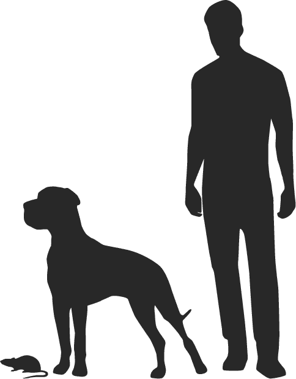
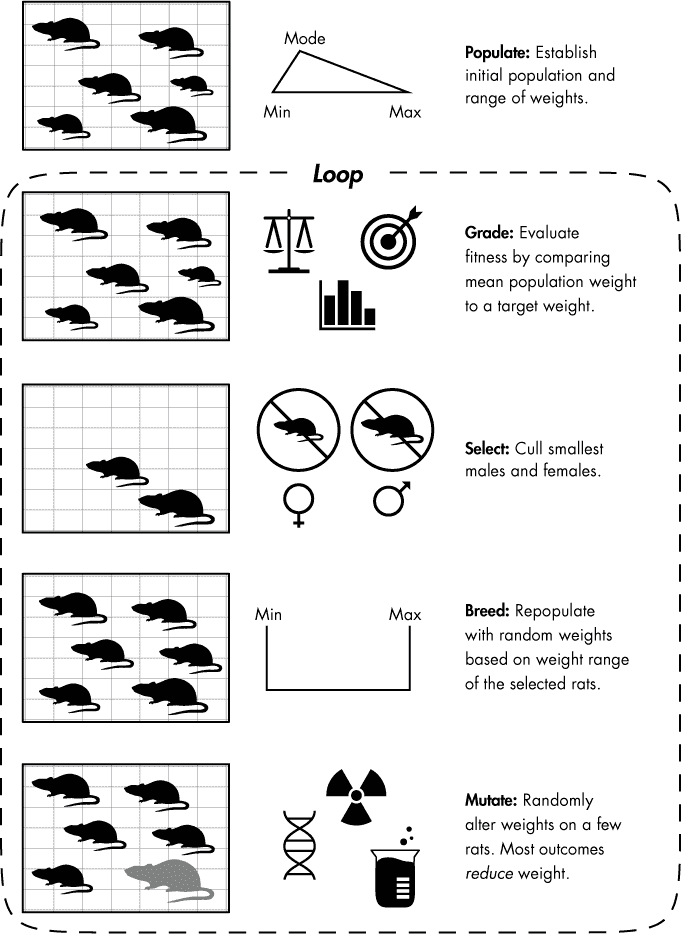
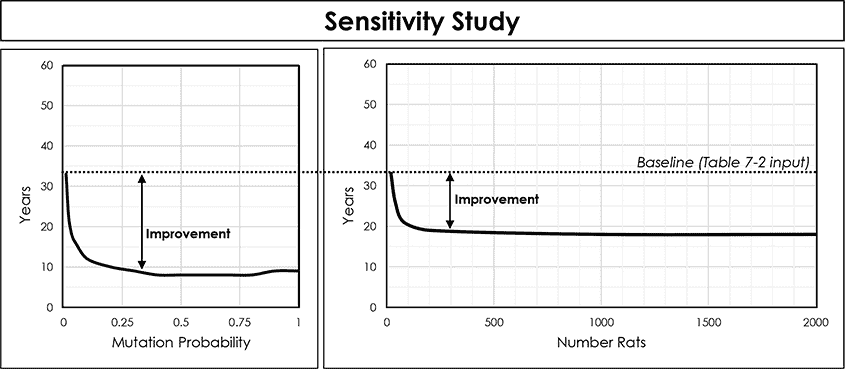
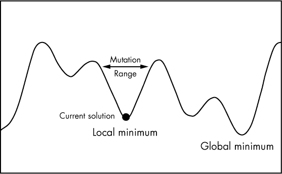

## 第八章：**利用遗传算法培育巨型大鼠**


*遗传算法*是一种通用的优化程序，旨在解决复杂问题。它们于 1970 年代发明，属于*进化算法*的一类，因其模仿达尔文自然选择的过程而得名。它们特别适用于当问题了解不多、面对非线性问题或需要在大型搜索空间中寻找暴力解决方案时。最棒的是，它们是易于理解和实现的算法。

在本章中，你将使用遗传算法培育一种超级大鼠军队，来让它们在世界范围内造成恐慌。之后，你将转换角色，帮助詹姆斯·邦德在几秒钟内破解一个高科技保险箱。这两个项目将帮助你很好地理解遗传算法的机制和强大之处。

### **寻找所有可能解中的最佳解**

遗传算法*优化*，意味着它们从一组可用的备选方案中选择最佳解（根据某些标准）。例如，如果你在寻找从纽约到洛杉矶的最快驾车路线，遗传算法永远不会建议你飞行。它只能从你提供的条件中选择。在优化过程中，这些算法比传统方法更快，并能避免过早收敛到次优解。换句话说，它们高效地搜索解空间，同时又足够全面，以避免选择一个好的答案而错过更好的答案。

与*穷举*搜索引擎不同，后者通过纯粹的暴力方式尝试每一个可能的解，遗传算法并不会尝试所有可能的解。相反，它们会不断地对解进行评分，然后利用这些评分来进行“有根据的猜测”。一个简单的例子是“温暖-寒冷”游戏，在游戏中你通过别人根据你接近或搜索方向的提示，告诉你是越来越接近目标（温暖）还是远离目标（寒冷）。遗传算法使用适应度函数，类似于自然选择的过程，来丢弃“寒冷”的解，并在“温暖”的解上进行改进。基本过程如下：

1.  随机生成一组解的种群。

1.  衡量每个解的适应度。

1.  选择最佳（最温暖）的解并丢弃其他解。

1.  交叉（重组）最佳解中的元素，生成新的解。

1.  通过改变解中一些元素的值来进行突变。

1.  返回第 2 步并重复。

选择-交叉-突变的循环会继续，直到达到一个*停止条件*，比如找到已知的答案，找到一个“足够好”的答案（基于最低阈值），完成指定的迭代次数，或达到时间截止。由于这些步骤与进化过程非常相似，完全符合适者生存的原则，因此遗传算法中使用的术语通常比计算术语更加生物学化。

### **项目 #13：培育超级大鼠军团**

这是你成为疯狂科学家的机会，拥有一个充满沸腾烧瓶、冒泡试管和发出“BZZZTTT”声音的机器的秘密实验室。所以，戴上黑色橡胶手套，开始把灵活的垃圾清道夫变成庞大的食人怪物吧。

**目标**

使用遗传算法模拟繁殖出平均体重为 110 磅的老鼠。

#### ***策略***

你的梦想是培育出一种体型与公獒犬相当的老鼠（我们已经确定你是疯了）。你将从*Rattus norvegicus*，即棕色老鼠开始，然后加入一些人造甜味剂、1950 年代的原子辐射、很多耐心和一点点 Python，但不涉及基因工程——你是老派的，宝贝！这些老鼠将从不到一磅长大到可怕的 110 磅，差不多是雌性公獒犬的体型（见图 7-1）。



*图 7-1：棕色老鼠、雌性公獒犬和人类的体型比较*

在你开始进行这样一项庞大的任务之前，明智的做法是先在 Python 中模拟结果。而且你已经画出了比计划更好的东西——你画出了图形伪代码（见图 7-2）。



*图 7-2：利用遗传算法培育超级老鼠的方式*

图 7-2 展示了遗传算法是如何工作的。你的目标是从一个初始体重大大低于 110 磅的老鼠种群中，培育出一个平均体重为 110 磅的种群。往后，每一代（或*世代*）的老鼠都代表着该问题的一个候选解。就像任何动物饲养员一样，你会筛除那些不理想的雄性和雌性，它们会被人道地送去——对于*Austin Powers*迷来说——一个邪恶的宠物园。然后，你会让剩下的老鼠交配繁殖，这一过程在遗传编程中被称为*交叉*。

剩下的老鼠的后代基本上会和它们的父母一样大，因此你需要对一些老鼠进行突变。虽然突变很少发生，而且通常会导致中性或无益的特征（在这种情况下是低体重），但有时你会成功地培育出更大的老鼠。

然后整个过程变成了一个大循环，无论是有机进行还是通过程序化进行，这让我不禁怀疑我们是否真的是外星模拟中的虚拟存在。不管怎么说，这个循环的结束——停止条件——是当老鼠达到了预期的体型，或者你实在受不了再和老鼠打交道时。

要输入到你的仿真中，你需要一些统计数据。因为你是科学家，所以使用公制系统，无论你是不是疯子。你已经知道雌性公獒犬的平均体重大约是 50,000 克，你可以在表 7-1 中找到有用的老鼠统计数据。

**表 7-1：** 棕色老鼠体重和繁殖统计数据

| **参数** | **已发布值** |
| --- | --- |
| 最小体重 | 200 克 |
| 平均体重（雌性） | 250 克 |
| 平均体重（雄性） | 300–350 克 |
| 最大体重 | 600 克* |
| 每窝幼鼠数量 | 8–12 |
| 每年窝数 | 4–13 |
| 寿命（野生，圈养） | 1–3 年，4–6 年 |
| *在圈养情况下，个别老鼠可能达到 1,000 克。 |

由于存在家养和野生的棕色老鼠，因此某些统计数据可能会有较大差异。圈养的老鼠通常比野生老鼠得到更好的照料，因此它们的体重更大，繁殖更多，幼鼠也更多。所以当有范围数据时，你可以选择较高的值。对于这个项目，首先可以从表 7-2 中的假设开始。

**表 7-2：** 超级老鼠遗传算法的输入假设

| **变量和值** | **注释** |
| --- | --- |
| `GOAL = 50000` | 目标体重（雌性牛头獒，单位：克） |
| `NUM_RATS = 20` | 实验室可容纳的成年老鼠总数 |
| `INITIAL_MIN_WT = 200` | 初始种群中成年老鼠的最小体重（单位：克） |
| `INITIAL_MAX_WT = 600` | 初始种群中成年老鼠的最大体重（单位：克） |
| `INITIAL_MODE_WT = 300` | 初始种群中最常见的成年老鼠体重（单位：克） |
| `MUTATE_ODDS = 0.01` | 老鼠发生突变的概率 |
| `MUTATE_MIN = 0.5` | 最少有利突变对老鼠体重的影响因子 |
| `MUTATE_MAX = 1.2` | 最有利突变对老鼠体重的影响因子 |
| `LITTER_SIZE = 8` | 每对交配老鼠每窝的幼鼠数量 |
| `LITTERS_PER_YEAR = 10` | 每对交配老鼠每年繁殖的窝数 |
| `GENERATION_LIMIT = 500` | 停止繁殖程序的代数上限 |

由于老鼠繁殖非常频繁，你不需要考虑寿命。尽管你会保留上一代的一些父母，但随着后代体重的逐代增加，这些父母将很快被淘汰。

#### ***超级老鼠代码***

*super_rats.py* 代码遵循了图 7-2 中的一般工作流程。你也可以从 *[`www.nostarch.com/impracticalpython/`](https://www.nostarch.com/impracticalpython/)* 下载代码。

##### **输入数据和假设**

清单 7-1，在程序开始时的全局空间中，导入模块并将表 7-2 中的统计数据、因子和假设作为常量进行分配。程序完成并正常工作后，可以自由地修改表中的值，看看它们如何影响你的结果。

*super_rats.py*，第一部分

```py
➊ import time
   import random
   import statistics

➋ # CONSTANTS (weights in grams)
➌ GOAL = 50000
   NUM_RATS = 20
   INITIAL_MIN_WT = 200
   INITIAL_MAX_WT = 600
   INITIAL_MODE_WT = 300
   MUTATE_ODDS = 0.01
   MUTATE_MIN = 0.5
   MUTATE_MAX = 1.2
   LITTER_SIZE = 8
   LITTERS_PER_YEAR = 10
   GENERATION_LIMIT = 500

   # ensure even-number of rats for breeding pairs:
➍ if NUM_RATS % 2 != 0:
       NUM_RATS += 1
```

*清单 7-1：导入模块并分配常量*

首先导入 `time`、`random` 和 `statistics` 模块 ➊。你将使用 `time` 模块来记录遗传算法的运行时间。为遗传算法计时是非常有趣的，即使只是为了惊叹于它们能如此迅速找到解决方案。

`random` 模块将满足算法的随机需求，你将使用 `statistics` 模块来获取平均值。虽然这是 `statistics` 的一个较弱用途，但我希望你能了解这个模块，因为它在许多情况下非常有用。

接下来，分配 表 7-2 中描述的输入变量，并确保注意单位是克 ➋。使用大写字母来命名这些变量，因为它们表示常量 ➌。

现在，我们假设使用繁殖*配对*，因此需要检查用户输入的是偶数只大鼠，如果不是，就添加一只大鼠 ➍。稍后，在 “挑战项目” 的 第 144 页，你将有机会尝试不同的性别分布。

##### **初始化种群**

清单 7-2 是程序的购物代表。它去宠物店挑选初始的繁殖大鼠种群。由于你需要配对繁殖，它应该选择偶数只大鼠。由于你不能负担一个那种无限空间的火山巢穴，你需要在每一代中维持一个固定的成年大鼠数量——尽管数量可以临时增加以容纳窝内的小鼠。记住，随着大鼠长大到像大狗那样大，它们需要更多的空间！

*super_rats.py*，第二部分

```py
➊ def populate(num_rats, min_wt, max_wt, mode_wt):
       """Initialize a population with a triangular distribution of weights."""
    ➋ return [int(random.triangular(min_wt, max_wt, mode_wt))\
               for i in range(num_rats)]
```

*清单 7-2：定义了创建初始大鼠种群的函数*

`populate()` 函数需要知道你想要的成年大鼠数量、大鼠的最小和最大体重，以及最常见的体重 ➊。请注意，这些参数都将使用在全局空间中找到的常量。你不需要将它们作为参数传递给函数，以便函数能够访问它们。但为了清晰起见，我在这里以及后续的函数中都这样做，并且因为局部变量的访问效率更高。

你将使用上述四个参数和 `random` 模块，后者包括不同类型的分布。你将在这里使用三角分布，因为它能让你牢牢控制最小值和最大值，并允许你在统计中建模偏斜性。

由于棕色大鼠在野外、动物园、实验室和作为宠物中都有分布，它们的体重偏向较高。野生大鼠通常较小，因为它们的生活条件恶劣、残酷且短暂，尽管实验室里的大鼠可能会反驳这一点！使用列表推导式来循环遍历大鼠的数量，并为每只大鼠分配一个体重。将这一切通过 `return` 语句捆绑在一起 ➋。

##### **衡量种群的适应度**

衡量大鼠的适应度是一个两步过程。首先，通过比较所有大鼠的平均体重与斗牛獒目标体重来对整个种群进行评分。然后，对每只大鼠进行评分。只有体重排名在前 *n* 百分比的大鼠（由 `NUM_RATS` 变量确定）才能再次繁殖。虽然种群的平均体重是一个有效的适应度衡量标准，但它的主要作用是在这里是确定是否该停止循环并宣布成功。

清单 7-3 定义了 `fitness()` 和 `select()` 函数，这两个函数共同构成了遗传算法的测量部分。

*super_rats.py*，第三部分

```py
➊ def fitness(population, goal):
       """Measure population fitness based on an attribute mean vs target."""
       ave = statistics.mean(population)
       return ave / goal

➋ def select(population, to_retain):
       """Cull a population to retain only a specified number of members."""
    ➌ sorted_population = sorted(population)
    ➍ to_retain_by_sex = to_retain//2
    ➎ members_per_sex = len(sorted_population)//2
    ➏ females = sorted_population[:members_per_sex]
       males = sorted_population[members_per_sex:]
    ➐ selected_females = females[-to_retain_by_sex:]
       selected_males = males[-to_retain_by_sex:]
    ➑ return selected_males, selected_females
```

*列表 7-3：定义了遗传算法的测量步骤*

定义一个函数来评估当前一代的适应度 ➊。使用`statistics`模块获取种群的平均值，并将其除以目标体重返回。当这个值等于或大于 1 时，你就知道是时候停止繁殖了。

接下来，定义一个函数，根据体重将老鼠种群减少到`NUM_RATS`值，这里用`to_retain`参数表示 ➋。它还将接受一个`population`参数，表示每一代的父母。

现在，排序种群，以便你能区分大鼠和小鼠 ➌。取你想要保留的老鼠数量，并使用地板除法将其除以 2，确保结果是一个整数 ➍。执行此步骤是为了保留最大的公鼠和母鼠。如果你只选择种群中最大的老鼠，理论上你会只选择公鼠。通过对`sorted_population`使用地板除法将其除以 2，可以得到当前种群按性别分组的总人数 ➎。

公鼠通常比母鼠大，因此做出两个简化假设：首先，假设种群中恰好一半是雌性，其次，假设最大的母鼠体重大于或等于最小的公鼠体重。这意味着排序后的种群列表的前一半是母鼠，后一半是公鼠。接着，通过将`sorted_population`分为两半，取下半部分作为母鼠 ➏，上半部分作为公鼠，创建两个新列表。现在，只需从这两个列表的末尾取出最大体重的老鼠 ➐——使用负切片——并返回它们 ➑。这两份列表包含了下一代的父母。

当你第一次运行这个函数时，它所做的就是按照性别排序老鼠，因为初始的老鼠数量已经等于`NUM_RATS`常量。之后，传入的种群参数将包括父母和孩子，其值将超过`NUM_RATS`。

##### **培养新一代**

列表 7-4 定义了程序的“交叉”步骤，意味着它将培育下一代。一个关键假设是，每只幼鼠的体重大于或等于母鼠的体重，并且小于或等于父鼠的体重。违反此规则的情况将在“突变”函数中处理。

*super_rats.py*，第四部分

```py
➊ def breed(males, females, litter_size):
       """Crossover genes among members (weights) of a population."""
    ➋ random.shuffle(males)
       random.shuffle(females)
    ➌ children = []
    ➍ for male, female in zip(males, females):
        ➎ for child in range(litter_size):
            ➏ child = random.randint(female, male)
            ➐ children.append(child)
    ➑ return children
```

*列表 7-4：定义了一个培养新一代老鼠的函数*

`breed()`函数的参数包括从`select()`函数返回的已选择公鼠和母鼠的体重列表，以及一窝幼鼠的数量 ➊。接下来，随机打乱这两个列表 ➋，因为你在`select()`函数中已经对它们进行了排序，如果不打乱直接迭代，最小的公鼠会和最小的母鼠配对，以此类推。你需要考虑到爱情和浪漫；最大的公鼠可能会被最娇小的母鼠吸引！

开始一个空列表来存储子代 ➌。现在进入细节。使用 `zip()` 函数遍历打乱的列表，将每对雄性和雌性配对 ➍。每对老鼠可以有多个后代，所以开始另一个循环，以出生窝大小作为范围 ➎。出生窝大小是一个常量，名为 `LITTER_SIZE`，你在输入参数中提供的值，如果值为 `8`，则会得到八个子代。

对于每个子代，在母鼠和父鼠的体重之间随机选择一个体重 ➏。请注意，你不需要使用 `male + 1`，因为 `randint()` 会使用提供范围内的*所有*数字。还要注意，两个值可以相同，但第一个值（母鼠的体重）永远不能大于第二个值（父鼠的体重）。这是简化假设的另一个原因，假设雌性必须不大于最小的雄性。通过将每个子代添加到子代列表中 ➐ 来结束循环，然后返回 `children` ➑。

##### **变异种群**

一小部分子代应该会经历变异，其中大多数变异将导致不利的特征。这意味着体重低于预期，包括那些无法生存的“小个子”。但偶尔会有一次有益的变异，结果会使老鼠变得更重。

清单 7-5 定义了 `mutate()` 函数，它应用你在常量列表中提供的变异假设。调用 `mutate()` 后，应该检查新种群的适应度，如果目标体重没有达到，就重新开始循环。

*super_rats.py*，第五部分

```py
➊ def mutate(children, mutate_odds, mutate_min, mutate_max):
       """Randomly alter rat weights using input odds & fractional changes."""
    ➋ for index, rat in enumerate(children):
           if mutate_odds >= random.random():
            ➌ children[index] = round(rat * random.uniform(mutate_min,
                                                            mutate_max))
       return children
```

*清单 7-5：定义了变异一小部分种群的函数*

该函数需要子代列表、变异发生的几率以及变异的最小和最大影响 ➊。这些影响是你应用于老鼠体重的因子。在程序开始时的常量列表中（以及在表格 7-2 中），它们偏向最小值，因为大多数变异不会导致有益的特征。

遍历子代列表，并使用 `enumerate()`——一个很方便的内置函数，作为自动计数器——来获取索引 ➋。然后使用 `random()` 方法生成一个 0 到 1 之间的随机数，并将其与变异发生的几率进行比较。

如果 `mutate_odds` 变量大于或等于随机生成的数字，则该索引处的老鼠（体重）会发生变异。从一个由最小和最大变异值定义的均匀分布中选择一个变异值；这基本上是在最小-最大范围内随机选择一个值。由于这些值偏向最小值，因此结果更可能是体重减少而不是增加。将当前体重乘以这个变异因子，并将其四舍五入为整数 ➌。最后返回变异后的 `children` 列表。

**注意**

*关于突变统计的有效性，你可以找到一些研究表明有益突变非常稀有，也有一些研究认为它们比我们想象的更常见。狗的繁殖显示，实现体型的巨大变化（例如，吉娃娃与大丹犬）并不需要数百万年的进化。在 20 世纪的一个著名研究中，俄罗斯遗传学家德米特里·贝利亚耶夫从 130 只银狐开始，在 40 年的时间里，仅通过选择每一代中最温顺的狐狸，成功地实现了显著的生理变化。*

##### **定义`main()`函数**

列表 7-6 定义了`main()`函数，该函数管理其他函数并决定何时满足停止条件。它还将显示所有重要结果。

*super_rats.py,* 第六部分

```py
def main():
    """Initialize population, select, breed, and mutate, display results."""
 ➊ generations = 0

 ➋ parents = populate(NUM_RATS, INITIAL_MIN_WT, INITIAL_MAX_WT,
                       INITIAL_MODE_WT)
    print("initial population weights = {}".format(parents))
    popl_fitness = fitness(parents, GOAL)
    print("initial population fitness = {}".format(popl_fitness))
    print("number to retain = {}".format(NUM_RATS))

 ➌ ave_wt = []

 ➍ while popl_fitness < 1 and generations < GENERATION_LIMIT:
        selected_males, selected_females = select(parents, NUM_RATS)
        children = breed(selected_males, selected_females, LITTER_SIZE)
        children = mutate(children, MUTATE_ODDS, MUTATE_MIN, MUTATE_MAX)
     ➎ parents = selected_males + selected_females + children
        popl_fitness = fitness(parents, GOAL)
     ➏ print("Generation {} fitness = {:.4f}".format(generations,
                                                      popl_fitness))
     ➐ ave_wt.append(int(statistics.mean(parents)))
        generations += 1
 ➑ print("average weight per generation = {}".format(ave_wt))
    print("\nnumber of generations = {}".format(generations))
    print("number of years = {}".format(int(generations / LITTERS_PER_YEAR)))
```

*列表 7-6：定义了* main() *函数*

首先，通过初始化一个空列表来存储代数。最终你会用它来计算实现目标所需的年数 ➊。

接下来，调用`populate()`函数 ➋并立即打印结果。然后，获取初始种群的适应度，并打印该值以及每代保留的小鼠数量，即`NUM_RATS`常量。

为了增加趣味，初始化一个列表来存储每代的平均体重，以便在最后查看 ➌。如果你将这些体重与年份数进行对比，你会发现趋势是指数型的。

现在，开始大的遗传循环——选择、配对、突变。这是一个`while`循环，停止条件是达到目标体重或在没有达到目标体重的情况下达到大量的代数 ➍。注意，突变子代之后，你需要将它们与父代合并，生成一个新的`parents`列表 ➎。小鼠大约需要五周时间成熟并开始繁殖，但你可以通过调整`LITTERS_PER_YEAR`常量，从最大可能值减少来考虑这一点（参见表 7-1），就像我们在这里所做的那样。

在每次循环结束时，显示`fitness()`函数的结果，精确到四位小数，以便你监控算法并确保其按预期进行 ➏。获取这一代的平均体重，将其添加到`ave_wt`列表中 ➐，然后将代数加 1。

完成`main()`函数，显示每一代的平均体重列表、代数以及通过`LITTERS_PER_YEAR`变量计算出的年数 ➑。

##### 运行`main()`函数

完成程序时，使用熟悉的条件语句来决定程序是独立运行还是作为模块运行。获取结束时间并打印程序运行所用的时间。性能信息应该仅在模块作为独立程序运行时打印，因此确保将其放置在`if`语句中。参见列表 7-7。

*super_rats.py,* 第七部分

```py
if __name__ == '__main__':
    start_time = time.time()
    main()
    end_time = time.time()
    duration = end_time - start_time
    print("\nRuntime for this program was {} seconds.".format(duration))
```

*列表 7-7：运行* main() *函数和* time *模块，如果程序没有被导入*

#### ***总结***

使用表 7-2 中的参数，*super_rats.py*程序大约需要两秒钟才能运行。平均而言，大鼠需要约 345 代，或 34.5 年，才能达到目标体重 110 磅。这对于一个疯狂的科学家来说，时间实在太长了！但有了你的程序，你可以寻找减少目标时间的方法。

*灵敏度研究*通过对*单一*变量进行多次更改并判断结果来工作。在某些变量相互依赖的情况下，你应该小心操作。而且，由于结果是随机的（即不确定的），你应该在每次改变参数时进行多次运行，以捕捉可能的结果范围。

在你的繁殖计划中，你可以控制的两个因素是繁殖大鼠的数量（`NUM_RATS`）和突变发生的几率（`MUTATE_ODDS`）。突变几率受到饮食和辐射暴露等因素的影响。如果你一次只改变一个变量并重新运行*super_rats.py*，你就可以判断每个变量对项目时间表的影响。

一个直接的观察是，如果你从每个变量的小值开始，慢慢增加它们，你会得到显著的初步结果（参见图 7-3）。之后，两条曲线迅速下降并趋于平稳，这是递减收益的经典例子。每条曲线平稳化的点就是优化节省成本和减少工作量的关键。

例如，保留超过 300 只大鼠几乎不会带来太大好处。你只是在喂养和照顾一大堆多余的大鼠。同样，试图将突变几率提高到 0.3 以上也几乎没有任何收获。

像这样的图表，使得规划前进的道路变得容易。标记为“基线”的水平虚线表示使用表 7-2 中的输入数据所得到的平均结果。你只需保留 50 只大鼠而不是 20 只，就能将这个时间减少超过 10 年。你还应该集中精力增加有益突变的数量。这将更有回报，但风险更大，且更难控制。



*图 7-3：两个参数对达到目标体重所需时间的影响*

如果你重新运行模拟，使用 50 只大鼠并将突变几率提高到 0.05，你理论上可以在 14 年内完成项目，比最初的基线提高了 246%。现在，*这才是*优化！

繁殖超级大鼠是理解遗传算法基本原理的一种有趣且简单的方法。但要真正理解它们的强大，你需要尝试一些更困难的任务。你需要一个计算量庞大到无法通过暴力破解解决的问题，而下一个项目正是这样的难题。

### **项目 #14: 破解高科技保险箱**

你是 Q，詹姆斯·邦德遇到了一个问题。他必须参加一个恶棍的豪华晚宴，悄悄溜到那个恶棍的私人办公室，破解他的墙面保险箱。对于 007 来说，这简直是小菜一碟，除了一个问题：这是一个 Humperdink BR549 数字保险箱，需要 10 位数字，共有 100 亿种可能的组合。而且，只有*所有*数字输入完毕后，锁轮才会开始转动。你不能把听诊器放到保险箱上，慢慢转动旋钮！

作为 Q，你已经拥有一台自动拨号设备，可以通过暴力破解所有可能的解决方案，但邦德根本没有时间使用它。原因如下。

组合锁应该真正被称为*排列*锁，因为它需要*有序*的组合，而根据定义，这些组合是排列。更具体地说，锁依赖于*带重复的排列*。例如，一个有效的——尽管不安全——组合可能是 999999999。

在处理第三章中的字谜和第四章中第 87 页的“实践项目”时，你使用了`itertools`模块的`permutations()`迭代器，但在这里它无法提供帮助，因为`permutations()`返回的是*无*重复的排列。要生成适合锁的排列，你需要使用`itertools`的`product()`迭代器，它计算多个数字集合的笛卡尔积：

```py
>>> from itertools import product
>>> combo = (1, 2)
>>> for perm in product(combo, repeat=2):
    print(perm)
(1, 1)
(1, 2)
(2, 1)
(2, 2)
```

可选的`repeat`关键字参数允许你获取一个可迭代对象与自身相乘的笛卡尔积，这正是你在此情况下需要做的。注意，`product()`函数返回所有可能的组合，而`permutations()`函数仅返回`(1, 2)`和`(2, 1)`。你可以在*[`docs.python.org/3.6/library/itertools.html#itertools.product.Listing`](https://docs.python.org/3.6/library/itertools.html#itertools.product.Listing)*阅读更多关于`product()`的信息。

列表 7-8 是一个 Python 程序，名为*brute_force_cracker.py*，它使用`product()`来暴力破解正确的组合：

*brute_force_cracker.py*

```py
➊ import time
   from itertools import product

   start_time = time.time()

➋ combo = (9, 9, 7, 6, 5, 4, 3)

   # use Cartesian product to generate permutations with repetition
➌ for perm in product([0, 1, 2, 3, 4, 5, 6, 7, 8, 9], repeat=len(combo)):
    ➍ if perm == combo:
           print("Cracked! {} {}".format(combo, perm))

   end_time = time.time()
➎ print("\nRuntime for this program was {} seconds.".format
         (end_time - start_time))
```

*列表 7-8：使用暴力破解方法找到保险箱的组合*

导入`time`和来自`itertools`的`product`迭代器 ➊。获取开始时间，然后将保险箱组合输入为一个元组 ➋。接下来使用`product()`，它返回给定序列的所有带重复的排列的元组。序列包含所有有效的单数字输入（0–9）。你应该将`repeat`参数设置为组合中的数字位数 ➌。比较每个结果与组合是否匹配，如果匹配，则打印`"Cracked!"`，并显示组合和匹配的排列 ➍。最后显示运行时间 ➎。

对于最多八位数字的组合，这种方式非常有效。之后，等待的过程变得越来越不舒适。表 7-3 是程序运行时间与组合中数字个数的记录。

**表 7-3：** 密码组合与运行时间对比（2.3 GHz 处理器）

| **数字位数** | **运行时间（秒）** |
| --- | --- |
| 5 | 0.035 |
| 6 | 0.147 |
| 7 | 1.335 |
| 8 | 12.811 |
| 9 | 133.270 |
| 10 | 1396.955 |

注意，向组合中添加一个数字会将运行时间增加一个数量级。这是指数级增长。对于 9 位数字，你需要等待超过 2 分钟才能得到答案。对于 10 位数字，则需要超过 20 分钟！对邦德来说，这可真是个漫长的时间，足以让他悄悄去“上厕所”。

幸运的是，你是 Q，你了解遗传算法。你所需要做的就是评估每个候选组合的适应度。可以选择监测功率消耗的波动，测量操作的时间延迟，或者监听声音。假设你使用了一个声音放大工具，并且还有一个防止多次输入错误密码后被锁定的工具。由于 BR549 保险箱的安全措施，声音工具一开始只能告诉你*多少个*数字是正确的，而不能告诉你*哪些*数字正确，但只需一点时间，你的算法就能锁定正确答案。

**目标**

使用遗传算法在庞大的搜索空间中快速找到保险箱的密码组合。

#### ***策略***

这里的策略很简单。你将随机生成一个 10 位数字的序列，并与真实密码组合进行比较，根据匹配情况进行评分；在现实世界中，你会使用固定在保险箱门上的声音探测器来找到匹配的数字。然后，你会改变解决方案中的一个值，再次进行比较。如果找到另一个匹配，你就丢弃旧的序列，继续使用新的序列；否则，保留旧的序列，重新尝试。

由于一个解决方案完全替代了另一个解决方案，这表示遗传物质的交叉达到了 100%，所以你基本上只在使用选择和变异。单独使用选择和变异就可以生成一个强大的*爬山*算法。爬山是一种优化技术，它从一个任意的解决方案开始，并在解决方案中改变（变异）一个值。如果结果有改善，就保留新的解决方案，过程继续重复。

爬山算法的一个问题是，它可能会陷入*局部*最小值或最大值，从而找不到最优的*全局*值。想象一下，你正在寻找图 7-4 中波动函数的最低点。当前的最佳猜测由大黑点标记。如果你所做的变化（变异）的幅度太小，无法“跳出”局部低谷，算法就无法找到真正的低点。从算法的角度看，因为每个方向都会导致更差的结果，它就认为自己已经找到了正确的答案。因此，它会过早地收敛到一个解。



*图 7-4：爬山算法“卡住”在局部最小值的示例*

在遗传算法中使用交叉操作有助于避免过早收敛的问题，允许相对较大的变异也能起到同样的作用。因为你不必担心遵循生物学现实，这里可以让变异空间涵盖组合中的所有可能值。这样你就不会卡住，而爬山算法也变得可接受。

#### ***开锁器代码***

*safe_cracker.py*代码接受一个由*n*个数字组成的组合，并通过爬山算法从随机起点开始达到目标组合。该代码可以从*[`www.nostarch.com/impracticalpython/`](https://www.nostarch.com/impracticalpython/)*下载。

##### **设置并定义 fitness()函数**

清单 7-9 导入了必要的模块并定义了`fitness()`函数。

*safe_cracker.py,* 第一部分

```py
➊ import time
   from random import randint, randrange

➋ def fitness(combo, attempt):
       """Compare items in two lists and count number of matches."""
       grade = 0
    ➌ for i, j in zip(combo, attempt):
           if i == j:
               grade += 1
       return grade
```

*清单 7-9：导入模块并定义* fitness() *函数*

在导入一些熟悉的模块 ➊ 之后，定义一个`fitness()`函数，它将真实组合和尝试的解作为参数 ➋。定义一个变量`grade`并将其设置为`0`。然后使用`zip()`同时遍历组合和你的尝试 ➌。若它们相同，则将`grade`加 1 并返回。注意，你并没有记录匹配的索引，只是函数找到了匹配。这模拟了声音检测设备的输出。它最初只能告诉你有多少锁轮转动，而不能告诉你它们的位置。

##### **定义并运行 main()函数**

由于这是一个简短且简单的程序，大部分算法都运行在`main()`函数中，而不是多个函数中，清单 7-10。

*safe_cracker.py,* 第二部分

```py
def main():

    """Use hill-climbing algorithm to solve lock combination."""

 ➊ combination = '6822858902'

    print("Combination = {}".format(combination))

    # convert combination to list:

 ➋ combo = [int(i) for i in combination]

    # generate guess & grade fitness:

 ➌ best_attempt = [0] * len(combo)

    best_attempt_grade = fitness(combo, best_attempt)

 ➍ count = 0

    # evolve guess

 ➎ while best_attempt != combo:

        # crossover

     ➏ next_try = best_attempt[:]

        # mutate

        lock_wheel = randrange(0, len(combo))

     ➐ next_try[lock_wheel] = randint(0, 9)

        # grade & select

     ➑ next_try_grade = fitness(combo, next_try)

        if next_try_grade > best_attempt_grade:

            best_attempt = next_try[:]

            best_attempt_grade = next_try_grade

        print(next_try, best_attempt)

        count += 1

    print()

 ➒ print("Cracked! {}".format(best_attempt), end=' ')

    print("in {} tries!".format(count))

if __name__ == '__main__':

    start_time = time.time()

    main()

    end_time = time.time()

    duration = end_time - start_time

 ➓ print("\nRuntime for this program was {:.5f} seconds.".format(duration))
```

*清单 7-10：定义* main() *函数，并在未导入时运行和计时程序*

提供真实的组合作为一个变量 ➊，并使用列表推导将其转换为列表，方便后续使用 ➋。生成一个与组合长度相等的零列表，并将其命名为`best_attempt` ➌。此时，任何组合都与其他组合一样好。你应该保留这个名字——`best_attempt`——因为在你爬山的过程中，只需要保留最好的解。生成初始尝试后，用`fitness()`函数对其进行评分，然后将结果赋值给一个名为`best_attempt_grade`的变量。

将`count`变量初始化为零。程序将使用此变量记录破解代码所需的尝试次数➍。

现在，启动一个`while`循环，直到你找到正确的组合 ➎。将`best_attempt`的*副本*赋值给一个`next_try`变量 ➏。你复制它是为了避免别名问题；当你修改`next_try`中的元素时，你不希望不小心更改`best_attempt`，因为如果`next_try`未通过适应度测试，你可能还需要继续使用`best_attempt`。

现在是时候突变副本了。组合中的每个数字都旋转保险箱中的一个锁轮，因此命名一个变量 `lock_wheel` 并随机设置它等于组合中的一个索引位置。这代表了在此迭代中要更改的单个元素的位置。接下来，随机选择一个数字，并用它替换 `lock_wheel` 索引位置的值 ➐。

对 `next_try` 进行评分，如果它比上次尝试更优，则将 `best_attempt` 和 `best_attempt_grade` 重置为新值 ➑。否则，`best_attempt` 将在下一次迭代中保持不变。并排打印 `next_try` 和 `best_attempt`，这样你可以在程序结束时滚动查看尝试过程，观察它们是如何演变的。通过增加计数器完成循环。

当程序找到组合时，显示 `best_attempt` 值以及找到该值所需的尝试次数 ➒。记住，`end=' '` 参数会防止打印行末尾换行，并在当前行的结尾和下一行的开始之间放置一个空格。

完成程序的条件语句，使 `main()` 独立运行，并显示精确到五位小数的运行时间 ➓。注意，计时代码放在条件语句之后，因此如果程序作为模块导入，则不会运行。

#### ***总结***

*safe_cracker.py* 程序的最后几行输出如下所示。为了简洁起见，我省略了大部分演化比较。此运行是针对一个 10 位数的组合。

```py
[6, 8, 6, 2, 0, 5, 8, 9, 0, 0] [6, 8, 2, 2, 0, 5, 8, 9, 0, 0]
[6, 8, 2, 2, 0, 9, 8, 9, 0, 0] [6, 8, 2, 2, 0, 5, 8, 9, 0, 0]
[6, 8, 2, 2, 8, 5, 8, 9, 0, 0] [6, 8, 2, 2, 8, 5, 8, 9, 0, 0]
[6, 8, 2, 2, 8, 5, 8, 9, 0, 2] [6, 8, 2, 2, 8, 5, 8, 9, 0, 2]

Cracked! [6, 8, 2, 2, 8, 5, 8, 9, 0, 2] in 78 tries!

Runtime for this program was 0.69172 seconds.
```

十亿种可能的组合，程序仅在 78 次尝试内并且不到一秒的时间内找到了解决方案。即使是詹姆斯·邦德也会对这个结果印象深刻。

这就结束了遗传算法的部分。你已经使用一个示例工作流培养了巨型啮齿动物，然后将其调整为通过暴力算法解决爬坡问题。如果你想继续玩数字达尔文并实验遗传算法，可以在维基百科上找到一个长长的示例应用列表 (*[`en.wikipedia.org/wiki/List_of_genetic_algorithm_applications`](https://en.wikipedia.org/wiki/List_of_genetic_algorithm_applications)*)。示例包括：

+   全球气温变化建模

+   集装箱装载优化

+   交付车辆路线优化

+   地下水监测网络

+   学习机器人行为

+   蛋白质折叠

+   稀有事件分析

+   破译代码

+   拟合函数的聚类

+   过滤和信号处理

### **进一步阅读**

*《Python 中的遗传算法》（Genetic Algorithms with Python）*（亚马逊数字服务有限公司，2016）由克林顿·谢泼德（Clinton Sheppard）编写，是一本使用 Python 介绍遗传算法的初学者入门书籍。它有纸质版或作为便宜的电子书可以从 *[`leanpub.com/genetic_algorithms_with_python/`](https://leanpub.com/genetic_algorithms_with_python/)* 获取。

### **挑战项目**

继续通过这些建议的项目培养超级老鼠并破解超级保险箱。像往常一样，挑战项目没有提供解决方案，你需要自己解决问题。

#### ***建立一群老鼠后宫***

由于单只雄性老鼠可以与多只雌性老鼠交配，因此不需要雄性和雌性老鼠的数量相等。重写*super_rats.py*代码，以适应不等数量的雄性和雌性个体。然后使用与之前相同的老鼠总数重新运行程序，但使用 4 只雄性和 16 只雌性。这将如何影响达到目标体重 50,000 克所需的年数？

#### ***创建一个更高效的开锁器***

如当前代码所示，当*safe_cracker.py*代码找到一个锁轮匹配时，该匹配并没有被显式保存。只要`while`循环在运行，就没有任何东西可以阻止一个正确的匹配被随机覆盖。修改代码，使正确猜测的索引不再受到未来的更改影响。对比两版代码的运行时间，以评估此更改的影响。
