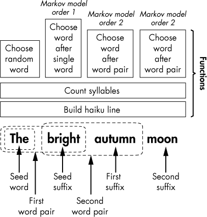
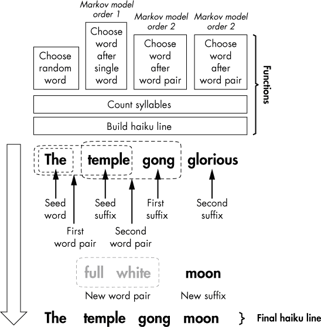
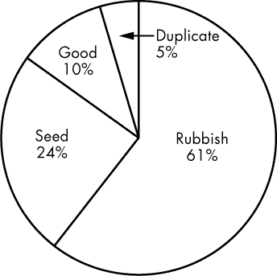

## 第十章：9  

使用马尔可夫链分析写俳句**


计算机可以通过重新排列现有的诗歌来写诗。这基本上就是人类所做的事。你和我没有发明我们使用的语言——我们是学习的。为了说话或写作，我们只是重新组合现有的词汇——而且很少以一种真正原创的方式。正如 Sting 曾经谈到创作音乐时所说：“我不认为流行音乐中有所谓的创作。我认为我们在流行音乐中做的是整理……我是一个很好的整理者。”

在本章中，你将编写一个程序，用马尔可夫链的方式把“最好的词按最好的顺序”排成俳句。但要做到这一点，Python 需要良好的示例，因此你需要提供日本大师们的俳句训练语料库。

为了以有意义的方式重新排列这些词，你将使用*马尔可夫链*，这个名字来自俄罗斯数学家安德烈·马尔可夫。*马尔可夫链分析*是概率论中的一个重要部分，它是一种基于当前状态的特性来预测下一个状态的过程。现代应用包括语音和手写识别、计算机性能评估、垃圾邮件过滤以及谷歌的 PageRank 算法。

通过马尔可夫链分析、训练语料库和第八章中的音节计数程序，你将能够创作出符合音节规则的俳句，并且在很大程度上保持“主题一致”。你还将学习如何使用 Python 的`logging`模块来帮助监控程序的行为，提供简单的开关反馈。同时，在第 184 页的“挑战项目”中，你可以邀请朋友们通过社交媒体来看看他们能否分辨出你模拟的俳句与真正的俳句之间的区别。

### **项目 #16：马尔可夫链分析**

就像第七章中的遗传算法一样，马尔可夫链分析听起来很复杂，但实际上很容易实现。你每天都在做这件事。如果你听到有人说：“Elementary, my dear . . . ,”你会自然而然地想：“Watson。”每当你的大脑听到这个短语时，它都会进行一次样本采集。根据样本数量，它就能预测出答案。另一方面，如果你听到有人说：“I want to go to . . . ,”你可能会想“厕所”或者“电影院”，但大概率不会想到“路易斯安那州的霍马”。有许多可能的答案，但有些答案的可能性更高。

在 20 世纪 40 年代，Claude Shannon 开创了使用马尔可夫链来统计建模文本中字母序列的方式。例如，在一本英文书籍中，每次出现字母组合*th*时，下一个最可能出现的字母是*e*。

但你不仅仅想知道最可能的字母是什么；你还想知道获得该字母的实际概率，以及获得其他每个字母的概率，这是一个非常适合计算机解决的问题。为了解决这个问题，你需要将文本中的每个二字母对映射到它后面紧接着的字母。这是一个经典的字典应用，二字母对作为键，字母作为值。

当应用于单词中的字母时，*马尔可夫模型*是一个数学模型，它根据前面连续的*k*个字母计算一个字母的出现概率，其中*k*是一个整数。*二阶模型*意味着字母出现的概率取决于其前面的两个字母。*零阶模型*意味着每个字母是独立的。这个逻辑同样适用于单词。考虑以下两个俳句示例：

| A break in the clouds | Glorious the moon |
| --- | --- |
| The moon a bright mountaintop | Therefore our thanks dark clouds come |
| Distant and aloof | To rest our tired necks |

一个将每个俳句单词映射到其后续单词的 Python 字典如下所示：

```py
             'a': ['break', 'bright'],
             'aloof': ['glorious'],
             'and': ['aloof'],
             'break': ['in'],
             'bright': ['mountaintop'],
             'clouds': ['the', 'come'],
             'come': ['to'],
             'dark': ['clouds'],
             'distant': ['and'],
             'glorious': ['the'],
             'in': ['the'],
             'moon': ['a', 'therefore'],
             'mountaintop': ['distant'],
             'our': ['thanks', 'tired'],
             'rest': ['our'],
             'thanks': ['dark'],
             'the': ['clouds', 'moon', 'moon'],
             'therefore': ['our'],
             'tired': ['necks'],
             'to': ['rest']
```

由于这里只有两个俳句，因此大多数字典键只有一个值。但请看一下列表底部的*the*：*moon*出现了两次。这是因为马尔可夫模型将每个单词的出现存储为一个单独的重复值。因此，对于键*the*，如果你随机选择一个值，选择*moon*与*clouds*的概率是 2:1。相反，模型会自动筛选掉极为罕见或不可能的组合。例如，许多单词可以接在*the*后面，但不能再接另一个*the*！

以下字典将每一对单词映射到其后面紧接着的单词；这意味着它是一个二阶模型。

```py
             'a break': ['in'],
             'a bright': ['mountaintop'],
             'aloof glorious': ['the'],
             'and aloof': ['glorious'],
             'break in': ['the'],
             'bright mountaintop': ['distant'],
             'clouds come': ['to'],
             'clouds the': ['moon'],
             'come to': ['rest'],
             'dark clouds': ['come'],
             'distant and': ['aloof'],
             'glorious the': ['moon'],
             'in the': ['clouds'],
             'moon a': ['bright'],
             'moon therefore': ['our'],
             'mountaintop distant': ['and'],
             'our thanks': ['dark'],
             'our tired': ['necks'],
             'rest our': ['tired'],
             'thanks dark': ['clouds'],
             'the clouds': ['the'],
             'the moon': ['a', 'therefore'],
             'therefore our': ['thanks'],
             'to rest': ['our']
```

请注意，映射是从第一个俳句到第二个俳句的，因此字典中包含项`'and aloof': ['glorious']`和`'aloof glorious': ['the']`。这种行为意味着你的程序可以从一个俳句跳转到另一个，而不仅仅局限于单一俳句中的单词对。它可以自由地形成新的单词对，即使这些单词对是大师们从未设想到的。

由于训练语料非常短，*the moon*是唯一具有多个值的单词对。对于其他所有单词对，你都“锁定”在单一的结果中。在这个例子中，训练语料的大小极大地决定了每个键的值的数量，但随着语料库的增大，马尔可夫模型中的*k*值将产生更大的影响。

*k*的大小决定了你是会生成胡言乱语、抄袭，还是创作出一篇清晰的原创作品。如果*k*等于 0，那么你将根据单词在语料库中的整体频率随机选择词汇，你很可能会生成大量的废话。如果*k*值很大，结果会受到严格限制，你会开始逐字复述训练文本。所以，较小的*k*值促进创造力，较大的*k*值则促使重复。挑战在于找到两者之间的适当平衡。

举例来说，如果你在之前的俳句上使用一个三阶马尔可夫模型，所有生成的键都会有一个值。与词对*月亮*相关的两个值将会丢失，因为前一个词对变成了两个键，每个键都有一个唯一的值：

```py
             'the moon a': ['bright'],
             'the moon therefore': ['our']
```

由于俳句较短——仅 17 个音节——且可用的训练语料库相对较小，使用*k*值为 2 应该足以强制执行*某种*秩序，同时仍能允许程序中进行创造性的词汇替换。

**目标**

编写一个程序，使用马尔可夫链分析生成俳句。允许用户通过独立重新生成第二行和第三行来修改俳句。

### **策略**

模拟俳句的总体策略是，基于人类写的俳句训练语料库，建立一阶和二阶马尔可夫模型。接着，你将使用这些模型和第八章中的*count_syllables.py*程序生成符合俳句音节结构 5-7-5 的创新俳句。

程序应当逐个生成俳句的每个词，首先从语料库中随机选择一个词来初始化（或*播种*）俳句；使用一阶马尔可夫模型选择俳句的第二个词；然后用二阶模型选择每一个后续的词。

每个词汇都来源于一个*前缀*——一个确定要选择哪个词汇进入俳句的词或词对；词汇映射字典中的键表示前缀。因此，前缀决定的词就是*后缀*。

#### ***选择和舍弃词汇***

当程序选择一个词时，它首先计算该词的音节数，如果该词不合适，就会选择一个新词。如果基于诗句中的前缀没有合适的词语，程序就会求助于我所称之为*幽灵前缀*，即在俳句中没有出现的前缀。例如，如果俳句中的词对是*寺庙钟*，且根据马尔可夫模型，所有跟随的词音节数过多，无法完成这一行，程序将随机选择一对新词，并用它来选择俳句中的下一个词。新的词对前缀*不应包含在该行中*——也就是说，*寺庙钟*将不会被替换。尽管你可以通过多种方式选择合适的新词，但我更喜欢这种技术，因为它可以通过保持程序中的一致性简化整个过程。

你可以通过图 9-1 和图 9-2 中的函数完成这些步骤。假设你正在处理一个五音节的句子，图 9-1 展示了如果所有选择的词汇都符合音节目标，会发生的高层次情况。



*图 9-1：五音节俳句行的高层图形伪代码*

程序从语料库中随机选择种子词*the*，然后计算它的音节数。接下来，它基于前缀*the*从一阶模型中选择*bright*。然后它计算*bright*的音节数，并将该音节数加到句子的音节总数中。由于音节总和不超过五，程序将*bright*添加到句子中，继续从二阶模型中基于前缀*The bright*选择*autumn*，然后重复音节计数过程。最后，程序基于前缀*bright autumn*选择*moon*，计算音节数，并且由于句子的音节总数正好为五，程序将*moon*加入句子，完成整个句子。

图 9-2 展示了程序需要利用一个幽灵前缀来成功完成一个五音节句子的情况。



*图 9-2：选择带有随机选择的幽灵前缀（*full white*）的新后缀*

假设在马尔可夫模型中，跟随前缀*temple gong*的唯一词是*glorious*。这个词的音节数对句子来说太多，因此程序随机选择一个幽灵前缀*full white*。词*moon*跟随幽灵前缀，并满足句子剩余的音节数，因此程序将其添加到句子中。程序然后丢弃*full white*前缀，句子完成了。通过这个幽灵前缀技巧，你不能保证新后缀在语境上完全合适，但同时，这是将创造力融入过程的一种方式。

#### ***从一行到另一行的延续***

马尔可夫模型是让你将俳句注入上下文和意义的“特殊酱汁”，使得每一行能够从一行延续到另一行。日本大师们*通常*写作的俳句每行是一个独立的短语，但上下文的联系贯穿整首诗，如本朝的这首俳句：

在寂静的午夜

我们的老稻草人倒下了

奇怪的空洞回响

*—本朝*

即使大师们偏好每一行俳句都代表一个完整的思想，他们也并不严格遵循这一规则。以下是芭村俳句中的一个例子：

我的两棵梅树

如此优雅，看看它们开花

现在一行，之后一行

*—芭村*

芭蕉的俳句第一行单独来看并不符合语法，因此读者必须不间断地继续读到下一行。当诗句从一行延续到下一行时，没有停顿或语法断裂，这种现象称为*跨行连贯*。根据《虚拟缪斯》作者查尔斯·哈特曼的说法，跨行连贯使得音步行在诗歌中充满了活力和柔韧性。这是件好事，因为如果没有语法上的延续，很难让算法写出连贯的诗歌。为了让程序在多行之间保持“思路”的延续，你需要使用上一行结尾的词对作为当前行的起始前缀。

最后，你应该给用户提供一个机会，不仅可以构建诗歌，还能通过重新生成第二行和第三行与诗歌进行互动编辑。写作大部分时间是重写，若留下两行完美的诗句，却没有办法重新“投掷骰子”来修改不合适的行，那将是无法容忍的。

### **伪代码**

如果你遵循我刚才所提到的策略，你的高级伪代码应该像这样：

```py
Import count_syllables module
Load a training-corpus text file
Process the training corpus for spaces, newline breaks, and so on
Map each word in corpus to the word after (Markov model order 1)
Map each word pair in corpus to the word after (Markov model order 2)
Give user choice of generating full haiku, redoing lines 2 or 3, or exiting
If first line:
    Target syllables = 5
    Get random word from corpus <= 4 syllables (no 1-word lines)
    Add word to line
    Set random word = prefix variable
    Get mapped words after prefix
    If mapped words have too many syllables
        Choose new prefix word at random & repeat
    Choose new word at random from mapped words
    Add the new word to the line
    Count syllables in word and calculate total in line
    If syllables in line equal target syllables
        Return line and last word pair in line
Else if second or third line:
    Target = 7 or 5
    Line equals last word pair in previous line
    While syllable target not reached:
        Prefix = last word pair in line
        Get mapped words after word-pair prefix
        If mapped words have too many syllables
            Choose new word-pair prefix at random and repeat
        Choose new word at random from mapped words
        Add the new word to the line
        Count syllables in word and calculate total in line
        If total is greater than target
            Discard word, reset total, and repeat
        Else if total is less than target
            Add word to line, keep total, and repeat
        Else if total is equal to target
            Add word to line
    Return line and last word pair in line
Display results and choice menu
```

### **训练语料库**

马尔可夫模型是从语料库构建的，因此它们是独特的，取决于该语料库。从埃德加·赖斯·巴勒斯的完整作品中构建的模型，将不同于从安妮·赖斯的作品中构建的模型。每个人都有自己的独特风格，或者说是*声音*，只要样本足够大，马尔可夫方法可以生成一个统计模型来表示你的风格。就像指纹一样，这个模型可以将你与某份文档或手稿联系起来。

为了构建马尔可夫模型，你将使用一个文本文件，该文件包含近 300 首古今俳句，其中 200 多首是由大师们创作的。理想情况下，你的训练语料库应该由成千上万首同一作者创作的俳句组成（以保持一致的“声音”），但这些作品很难找到，尤其是许多古老的日本俳句在音节规则上并不严格遵守，无论是故意的，还是翻译成英语时造成的。

为了增加马尔可夫模型中每个键的值的数量，初始语料库中的俳句被复制了 18 次，并随机分布在文件中。这对俳句内部的单词关联没有影响，但增加了俳句之间的互动。

举例来说，假设下面这首俳句的结尾词对是独特的，仅与第二首俳句的起始词相对应；这将导致一个相当无用的键值对`'hollow frog': ['mirror-pond']`：

张开嘴巴，露出

你整个湿润的内心

傻傻的**空心青蛙**！

**镜面池塘**的星星

突如其来的夏日阵雨

水面泛起涟漪

如果你复制并打乱这首俳句，你可能会引入一个介词，从而大大增加将奇怪的*空心青蛙*与某些有意义的事物连接的几率：

张开嘴巴，露出

你整个湿润的内心

傻傻的**空心青蛙**！

**在**城市田野中

沉思樱花树

陌生人如同朋友

马尔可夫模型现在将两个值分配给`'hollow frog'`：`'mirror-pond'`和`'in'`。每当你复制俳句时，你会看到每个关键字对应的值的数量增加，但这仅在一定程度上有用；过一段时间后，收益递减开始显现，你会一遍又一遍地添加相同的值，却没有任何新的收获。

### **调试**

调试是找出并修复计算机硬件和软件中的错误（bug）的过程。当你在为复杂问题编写解决方案时，你需要密切关注程序的执行，以便在出现意外情况时找出问题的根源。例如，如果你在俳句的第一行中得到了七个音节，而不是五个，你想知道音节计数函数是否失败，还是映射单词时出了问题，或者程序是否认为它在第二行。为了找出问题出在哪里，你需要监控程序在每个关键步骤返回的内容，这就需要使用临时代码或日志记录。我将在接下来的两节中讨论这两种技术。

#### ***构建临时代码***

这里定义的*临时代码*是你为了帮助开发程序而编写的临时代码，完成后会删除。这个名字来源于建筑中的脚手架——是必要的，但没有人希望它永远存在。

一种常见的临时代码是`print()`语句，用于检查函数或计算的返回值。用户不需要看到输出，因此在确认程序正常工作后，你会删除它。

有用的临时代码输出包括值或变量的类型、数据集的长度以及增量计算的结果。正如 Allen Downey 在《*Think Python*》中所说，“花时间构建临时代码可以减少你调试时所花的时间。”

使用`print()`语句进行调试的缺点是，你必须在之后返回并删除（或注释掉）所有这些语句，并且你有可能不小心删除对最终用户有用的`print()`语句。幸运的是，有一种替代方案可以避免这些问题，它叫做`logging`模块。

#### ***使用 logging 模块***

`logging`模块是 Python 标准库的一部分（*[`docs.python.org/3/library/logging.html`](https://docs.python.org/3/library/logging.html)*）。使用`logging`，你可以在任何你选择的位置获取程序正在做什么的定制报告。你甚至可以将报告写入永久的日志文件。以下交互式 Shell 示例使用`logging`检查一个元音计数程序是否正常工作：

```py
➊ >>> import logging
➋ >>> logging.basicConfig(level=logging.DEBUG,
                           format='%(levelname)s - %(message)s')

   >>> word = 'scarecrow'
   >>> VOWELS = 'aeiouy'
   >>> num_vowels = 0
   >>> for letter in word:
           if letter in VOWELS:
               num_vowels += 1
        ➌ logging.debug('letter & count = %s-%s', letter, num_vowels)

   DEBUG - letter & count = s-0
   DEBUG - letter & count = c-0
   DEBUG - letter & count = a-1
   DEBUG - letter & count = r-1
   DEBUG - letter & count = e-2
   DEBUG - letter & count = c-2
   DEBUG - letter & count = r-2
   DEBUG - letter & count = o-3
   DEBUG - letter & count = w-3
```

要使用 `logging` 模块，首先导入它 ➊。然后设置你想要查看的调试信息以及显示格式 ➋。`DEBUG` 级别是最低的信息级别，用于诊断详细信息。请注意，输出使用了字符串格式化 `'%s'`。你可以包含更多的信息——例如，日期和时间可以通过 `format='%(asctime)s'` 显示——但对于这段代码，你真正需要检查的只是程序是否正确计数元音。

对于每个评估的字母，输入自定义文本消息以显示变量值。请注意，你必须将非字符串对象（如整数和列表）转换为字符串 ➌。接下来是 `logging` 输出。你可以看到累计计数，并且可以查看哪些字母实际上改变了计数。

像脚手架一样，`logging` 是为开发者而不是用户设计的。就像 `print()` 函数一样，`logging` 也会使程序变慢。要禁用 `logging` 消息，只需在导入模块后插入 `logging.disable(logging.CRITICAL)` 调用，如下所示：

```py
>>> import logging
>>> logging.disable(logging.CRITICAL)
```

将禁用调用放在程序的顶部，可以让你轻松找到它，并切换消息的开启和关闭。`logging.disable()` 函数将会抑制指定级别或更低级别的所有消息。由于 `CRITICAL` 是最高级别，传递它给 `logging.disable()` 函数会关闭所有消息。这比手动查找并注释掉 `print()` 语句要好得多！

### **代码**

本节中的 *markov_haiku.py* 代码将使用名为 *train.txt* 的训练语料库，准备 Markov 模型作为字典，并一字一字地生成俳句。第八章 中的 *count_syllables.py* 程序和 *missing_words.json* 文件将确保 *markov_haiku.py* 为每行使用正确的音节数。你可以从 *[`www.nostarch.com/impracticalpython/`](https://www.nostarch.com/impracticalpython/)*（第九章 文件夹）下载所有这些文件。务必将它们放在同一目录中。

#### ***设置***

清单 9-1 导入必要的模块，然后加载和准备外部文件。

*markov_haiku.py,* 第一部分

```py
➊ import sys
   import logging
   import random
   from collections import defaultdict
   from count_syllables import count_syllables

➋ logging.disable(logging.CRITICAL)  # comment out to enable debugging messages
   logging.basicConfig(level=logging.DEBUG, format='%(message)s')

➌ def load_training_file(file):
       """Return text file as a string."""
       with open(file) as f:
        ➍ raw_haiku = f.read()
           return raw_haiku

➎ def prep_training(raw_haiku):
       """Load string, remove newline, split words on spaces, and return list."""
       corpus = raw_haiku.replace('\n', ' ').split()
       return corpus
```

*清单 9-1：导入、加载和准备训练语料库*

从单独的行开始列出导入项 ➊。你需要 `logging` 来接收调试消息，而 `defaultdict` 将帮助你通过自动创建新键来从列表构建字典，而不是抛出错误。你还会从 第八章 中你编写的 *count_syllables.py* 程序中导入 `count_syllables` 函数。你应该已经熟悉这些导入。

在导入语句后紧跟禁用`logging`的语句，这样你可以轻松找到它。要查看日志信息，你需要注释掉这个语句 ➋。以下语句配置了你将看到的内容，如前一节所述。我选择从显示中省略级别指定。

接下来，定义一个函数来加载训练语料库的文本文件 ➌。使用内置的`read()`函数将数据作为字符串读取，程序可以在将其转换为列表之前进行准备 ➍。返回该字符串，以供下一个函数使用。

`prep_training()`函数 ➎接收来自`load_training_file()`函数的输出作为参数。然后，它将换行符替换为空格，并根据空格将单词拆分成列表项。最后，函数将语料库作为列表返回。

#### ***构建马尔可夫模型***

马尔可夫模型实际上是 Python 字典，使用单词或单词对作为键，紧随其后的单词作为值。通过重复尾部单词在值列表中的出现，捕获尾部单词的统计频率——类似于集合，字典不能有重复的*键*，但可以有重复的*值*。

列表 9-2 定义了两个函数。这两个函数都以语料库作为参数，并返回一个马尔可夫模型。

*markov_haiku.py,* 第二部分

```py
➊ def map_word_to_word(corpus):
       """Load list & use dictionary to map word to word that follows."""
    ➋ limit = len(corpus) - 1
    ➌ dict1_to_1 = defaultdict(list)
    ➍ for index, word in enumerate(corpus):
           if index < limit:
            ➎ suffix = corpus[index + 1]
               dict1_to_1[word].append(suffix)
    ➏ logging.debug("map_word_to_word results for \"sake\" = %s\n",
                    dict1_to_1['sake'])
    ➐ return dict1_to_1
➑ def map_2_words_to_word(corpus):
       """Load list & use dictionary to map word-pair to trailing word."""
    ➒ limit = len(corpus) - 2
       dict2_to_1 = defaultdict(list)
       for index, word in enumerate(corpus):
           if index < limit:
            ➓ key = word + ' ' + corpus[index + 1]
               suffix = corpus[index + 2]
               dict2_to_1[key].append(suffix)
       logging.debug("map_2_words_to_word results for \"sake jug\" = %s\n",
                     dict2_to_1['sake jug'])
       return dict2_to_1
```

*列表 9-2：定义了构建一阶和二阶马尔可夫模型的函数*

首先，定义一个函数，将每个单词映射到其尾部单词 ➊。该程序只会使用此函数从种子词中选择俳句的第二个单词。它的唯一参数是`prep_training()`函数返回的语料库列表。

设置一个限制，以便不能选择语料库中的最后一个单词 ➋，因为这样会导致索引错误。现在，使用`defaultdict` ➌初始化一个字典。你希望字典的值是列表，用于存储你找到的所有后缀，因此将`list`作为参数传递。

开始遍历语料库中的每个单词，使用`enumerate`将每个单词的索引转换为对象 ➍。使用条件判断和`limit`变量来防止选择最后一个单词作为键。定义一个名为`suffix`的变量，表示尾部单词 ➎。其值将是当前单词的索引位置加 1——即列表中的下一个单词。将这个变量作为当前单词的值添加到字典中。

为了检查一切是否按计划工作，使用`logging`显示*单个键*的结果 ➏。语料库中有成千上万的单词，因此你不想打印出所有单词。选择一个你知道在语料库中存在的单词，比如*sake*。请注意，你使用的是旧的字符串格式化方法`%`，因为它适合当前日志记录器的设计。最后返回字典 ➐。

下一个函数`map_2_words_to_word()`基本上与前一个函数相同，只是它使用两个连续的单词作为键，并映射到后续的单个单词➑。重要的变化是将限制设定为距语料库结尾两个单词的地方➒，使得键由两个单词组成，并且中间有空格➓，并且对`suffix`的索引加 2。

#### ***选择随机单词***

没有关键字，程序无法利用 Markov 模型，因此用户或程序必须提供模拟俳句中的第一个单词。列表 9-3 定义了一个函数，随机选择一个第一个单词，方便自动化种子生成。

*markov_haiku.py*，第三部分

```py
➊ def random_word(corpus):
       """Return random word and syllable count from training corpus."""
    ➋ word = random.choice(corpus)
    ➌ num_syls = count_syllables(word)
    ➍ if num_syls > 4:
           random_word(corpus)
       else:
        ➎ logging.debug("random word & syllables = %s %s\n", word, num_syls)
           return (word, num_syls)
```

*列表 9-3：随机选择一个种子单词以启动俳句*

定义该函数并将`corpus`列表传递给它➊。然后分配一个`word`变量，并使用`random`的`choice()`方法从语料库中选择一个单词➋。

使用`count_syllables()`函数，该函数来自`count_syllables`模块，用于计算单词的音节数；将计算结果存储在`num_syls`变量中➌。我不喜欢在俳句中使用单一单词的行，所以不允许该函数选择音节数超过四个的单词（记住，最短的俳句行有五个音节）。如果发生这种情况，请递归调用`random_word()`函数，直到找到一个合适的单词➍。请注意，Python 的默认最大递归深度为 1,000，但只要使用的是合适的俳句训练语料库，找到合适单词之前几乎不可能超过这个限制。如果情况并非如此，你可以稍后通过使用`while`循环调用该函数来处理这个条件。

如果单词的音节数少于五个，请使用`logging`显示单词及其音节数➎；然后将单词和音节数作为元组返回。

#### ***应用 Markov 模型***

为了选择紧跟种子单词的单个单词，请使用 Markov 模型的 1 阶。之后，程序应使用 2 阶模型选择所有后续单词，该模型使用单词对作为键。列表 9-4 为每个这些操作定义了一个单独的函数。

*markov_haiku.py*，第四部分

```py
➊ def word_after_single(prefix, suffix_map_1, current_syls, target_syls):
       """Return all acceptable words in a corpus that follow a single word."""
    ➋ accepted_words = []
    ➌ suffixes = suffix_map_1.get(prefix)
    ➍ if suffixes != None:
        ➎ for candidate in suffixes:
               num_syls = count_syllables(candidate)
               if current_syls + num_syls <= target_syls:
                ➏ accepted_words.append(candidate)
    ➐ logging.debug("accepted words after \"%s\" = %s\n",
                     prefix, set(accepted_words))
       return accepted_words

➑ def word_after_double(prefix, suffix_map_2, current_syls, target_syls):
       """Return all acceptable words in a corpus that follow a word pair."""
       accepted_words = []
    ➒ suffixes = suffix_map_2.get(prefix)
       if suffixes != None:
           for candidate in suffixes:
               num_syls = count_syllables(candidate)
               if current_syls + num_syls <= target_syls:
                   accepted_words.append(candidate)
       logging.debug("accepted words after \"%s\" = %s\n",
                     prefix, set(accepted_words))
    ➓ return accepted_words
```

*列表 9-4：两个根据前缀、Markov 模型和音节数选择单词的函数*

定义一个名为`word_after_single()`的函数，用于根据前一个单一的种子单词选择俳句中的下一个单词。该函数的参数包括前一个单词、Markov 1 阶模型、当前音节数和目标音节数➊。

开始一个空列表，用于存储符合条件的单词，这些单词既跟随前缀，又没有超出音节目标的音节数➋。将这些后续单词命名为`suffixes`，并使用字典的`get()`方法，该方法根据键返回字典值，将这些单词分配给变量➌。如果请求一个字典中不存在的键，`get()`方法不会引发`KeyError`，而是返回`None`。

存在一个极为罕见的情况，即前缀可能是语料库中的最后一个单词，并且该单词是唯一的。在这种情况下，将没有后缀。使用 `if` 语句来预见这种情况 ➍。如果没有后缀，调用 `word_after_single()` 的函数——你将在下一部分定义——将选择一个新的前缀。  

每个后缀都代表一个*候选*单词，但程序尚未确定该候选词是否“合适”。因此，使用 `for` 循环、`count_syllables` 模块和 `if` 语句来判断将该单词添加到行中是否会违反每行的目标音节数➎。如果目标音节数未超出，则将该单词添加到已接受单词列表中➏。通过 `logging` 消息显示这些可接受的单词，然后返回它们➐。  

下一个函数 `word_after_double()` 和之前的函数类似，不同之处在于它接收的是单词对以及马尔可夫二阶模型（`suffix_map_2`）➑，并从该字典中获取后缀➒。但和 `word_after_single()` 函数一样，`word_after_double()` 返回的是一个可接受单词的列表➓。  

#### ***生成俳句行***  

准备好所有辅助函数后，你可以定义实际编写俳句行的函数。该函数可以构建完整的俳句或仅更新第二行或第三行。有两条路径可以选择：一种是在程序只有一个词的后缀时使用，另一种则适用于其他所有情况。  

##### **构建第一行**  

清单 9-5 定义了写入俳句行并初始化俳句第一行的函数。

*markov_haiku.py,* 第五部分  

```py
➊ def haiku_line(suffix_map_1, suffix_map_2, corpus, end_prev_line, target_syls):
       """Build a haiku line from a training corpus and return it."""
    ➋ line = '2/3'
       line_syls = 0
       current_line = []
    ➌ if len(end_prev_line) == 0:  # build first line
        ➍ line = '1'
        ➎ word, num_syls = random_word(corpus)
           current_line.append(word)
           line_syls += num_syls
        ➏ word_choices = word_after_single(word, suffix_map_1,
                                            line_syls, target_syls)
        ➐ while len(word_choices) == 0:
               prefix = random.choice(corpus)
               logging.debug("new random prefix = %s", prefix)
               word_choices = word_after_single(prefix, suffix_map_1,
                                                line_syls, target_syls)
        ➑ word = random.choice(word_choices)
           num_syls = count_syllables(word)
           logging.debug("word & syllables = %s %s", word, num_syls)
        ➒ line_syls += num_syls
           current_line.append(word)
        ➓ if line_syls == target_syls:
               end_prev_line.extend(current_line[-2:])
               return current_line, end_prev_line
```

*清单 9-5：定义了写入俳句行并初始化第一行的函数*  

定义一个函数，接受两个马尔可夫模型、训练语料库、上一行最后一个单词对以及当前行的目标音节数➊。立即使用一个变量来指定正在模拟的是哪一行俳句➋。大多数处理将针对第二行和第三行（以及可能是第一行的最后一部分），这时你会使用已有的单词对前缀，因此将这些作为基础情况。之后，开始一个计数器来统计当前行的音节总数，并初始化一个空列表来存放当前行的单词。  

使用一个 `if` 语句，当 `end_prev_line` 参数的长度——上一行最后两个单词的音节数为 0 时，表示没有前一行，此时你就在第一行➌。该 `if` 块中的第一条语句将 `line` 变量设置为 1 ➍。  

选择初始种子词，并通过调用`random_word()`函数 ➎获取其音节数。通过将`word`和`num_syls`变量一起赋值，你实际上是在“解包”`random_word()`函数返回的`(word, num_sylls)`元组。函数在`return`语句处结束，因此返回元组是返回多个变量的好方法。在这个程序的更高级版本中，你可以使用带有`yield`关键字的生成器函数，因为`yield`返回一个值而不放弃执行控制。

接下来，将`word`附加到`current_line`并将`num_syls`加到运行总数中。现在你已经有了种子，使用`word_after_single()`函数 ➏收集该种子的所有可能后缀。

如果没有可接受的单词，启动一个`while`循环来处理这种情况。该循环将持续进行，直到返回一个非空的可接受单词列表 ➐。程序将选择一个新的前缀——一个幽灵前缀——使用`random`模块的`choice`方法。（记住，这个前缀不会成为俳句的一部分，而仅仅是用于重新访问马尔可夫模型。）在`while`循环内部，一条`logging`消息将告诉你选择了哪个幽灵前缀。然后程序将再次调用`word_after_single()`函数。

一旦可接受的单词列表构建完成，再次使用`choice`从`word_choices`列表中选择一个单词 ➑。因为列表可能包含重复的单词，所以这就是你看到马尔可夫模型统计影响的地方。接下来，计算单词的音节数并`logging`结果。

将音节计数加到该行的运行总数，并将单词附加到`current_line`列表 ➒。

如果前两个词的音节数等于 5 ➓，则定义一个变量`end_prev_line`并将其赋值为上一行的最后两个词；这个变量是第二行的前缀。最后，返回整行和`end_prev_line`变量。

如果第一行的目标音节数还没有达到，程序将跳转到下一部分的`while`循环以完成这一行。

##### **构建剩余的行**

在列表 9-6 中，`haiku_line()`函数的最后部分处理了这样一种情况，即俳句已经包含了一个词对前缀，程序可以在马尔可夫模型 2 中使用它。程序利用这个前缀来完成第一行——假设前两个词还没有总共五个音节——并构建第二行和第三行。用户还可以在完整的俳句写完后重新生成第二行或第三行。

*markov_haiku.py,* 第六部分

```py
    ➊ else: # build lines 2 and 3
        ➋ current_line.extend(end_prev_line)

    ➌ while True:
           logging.debug("line = %s\n", line)
        ➍ prefix = current_line[-2] + ' ' + current_line[-1]
        ➎ word_choices = word_after_double(prefix, suffix_map_2,
                                            line_syls, target_syls)
        ➏ while len(word_choices) == 0:
               index = random.randint(0, len(corpus) - 2)
               prefix = corpus[index] + ' ' + corpus[index + 1]
               logging.debug("new random prefix = %s", prefix)
               word_choices = word_after_double(prefix, suffix_map_2,
                                                line_syls, target_syls)
           word = random.choice(word_choices)
           num_syls = count_syllables(word)
           logging.debug("word & syllables = %s %s", word, num_syls)

        ➐ if line_syls + num_syls > target_syls:
               continue
           elif line_syls + num_syls < target_syls:
               current_line.append(word)
               line_syls += num_syls
           elif line_syls + num_syls == target_syls:
               current_line.append(word)
               break

    ➑ end_prev_line = []
       end_prev_line.extend(current_line[-2:])

    ➒ if line == '1':
           final_line = current_line[:]
       else:
           final_line = current_line[2:]

       return final_line, end_prev_line
```

*列表 9-6：使用马尔可夫模型 2 来完成写俳句行的函数*

从一个`else`语句开始，只有在存在后缀时才会执行 ➊。由于`haiku_line()`函数的最后部分必须处理第一行以及第二行和第三行，因此使用一个技巧，在步骤➑的条件外，将`end_prev_line`列表（在步骤➑外部构建）添加到`current_line`列表中 ➋。稍后，当你将最终的行添加到俳句中时，你将丢弃这个前导单词对。  

启动一个`while`循环，直到该行的目标音节数达到为止 ➌。每次迭代的开始都包含一条调试信息，告诉你当前循环正在评估的路径：`'1'`或`'2/3'`。  

将上一行的最后两个单词添加到当前行的开头时，当前行的最后两个单词将始终是前缀 ➍。  

使用马尔科夫顺序 2 模型，创建一个可接受的单词列表 ➎。若该列表为空，程序将使用幽灵前缀过程 ➏。  

使用音节数来评估接下来该做什么 ➐。如果音节过多，使用`continue`语句重新开始`while`循环。如果音节不足，将单词附加到当前行，并将其音节数加到该行的音节数中。否则，将单词附加到行中并结束循环。  

将行中的最后两个单词赋值给`end_prev_line`变量，以便程序将其作为下一行的前缀 ➑。如果当前路径是行`'1'`，将当前行复制到名为`final_line`的变量中；如果路径是行`'2/3'`，使用索引切片排除前两个单词，然后赋值给`final_line` ➒。这就是如何从第二行或第三行中移除初始的`end_prev_line`单词对。  

#### ***编写用户界面***  

清单 9-7 定义了*markov_haiku.py*程序的`main()`函数，该函数运行设置功能和用户界面。界面向用户呈现一个选项菜单，并显示生成的俳句。

*markov_haiku.py*，第七部分  

```py
def main():
    """Give user choice of building a haiku or modifying an existing haiku."""
    intro = """\n
    A thousand monkeys at a thousand typewriters...
    or one computer...can sometimes produce a haiku.\n"""
    print("{}".format(intro))

 ➊ raw_haiku = load_training_file("train.txt")
    corpus = prep_training(raw_haiku)
    suffix_map_1 = map_word_to_word(corpus)
    suffix_map_2 = map_2_words_to_word(corpus)
    final = []

    choice = None
 ➋ while choice != "0":

     ➌ print(
            """
            Japanese Haiku Generator

            0 - Quit
            1 - Generate a Haiku
            2 - Regenerate Line 2
            3 - Regenerate Line 3
            """
            )

     ➍ choice = input("Choice: ")
        print()

        # exit
     ➎ if choice == "0":
            print("Sayonara.")
            sys.exit()

        # generate a full haiku
     ➏ elif choice == "1":
            final = []
            end_prev_line = []
            first_line, end_prev_line1 = haiku_line(suffix_map_1, suffix_map_2,
                                                    corpus, end_prev_line, 5)
            final.append(first_line)
            line, end_prev_line2 = haiku_line(suffix_map_1, suffix_map_2,
                                              corpus, end_prev_line1, 7)
            final.append(line)
            line, end_prev_line3 = haiku_line(suffix_map_1, suffix_map_2,
                                              corpus, end_prev_line2, 5)
            final.append(line)

        # regenerate line 2
     ➐ elif choice == "2":
            if not final:
                print("Please generate a full haiku first (Option 1).")
                continue
            else:
                line, end_prev_line2 = haiku_line(suffix_map_1, suffix_map_2,
                                                  corpus, end_prev_line1, 7)
                final[1] = line

        # regenerate line 3
     ➑ elif choice == "3":
            if not final:
                print("Please generate a full haiku first (Option 1).")
                continue
            else:
                line, end_prev_line3 = haiku_line(suffix_map_1, suffix_map_2,
                                                  corpus, end_prev_line2, 5)
                final[2] = line

        # some unknown choice
     ➒ else:
            print("\nSorry, but that isn't a valid choice.", file=sys.stderr)
            continue

     ➓ # display results
        print()
        print("First line = ", end="")
        print(' '.join(final[0]), file=sys.stderr)
        print("Second line = ", end="")
        print(" ".join(final[1]), file=sys.stderr)
        print("Third line = ", end="")
        print(" ".join(final[2]), file=sys.stderr)
        print()

    input("\n\nPress the Enter key to exit.")

if __name__ == '__main__':
    main()
```

*清单 9-7：启动程序并呈现用户界面*  

在介绍信息之后，加载并准备训练语料库，并构建两个马尔科夫模型。然后创建一个空列表来存储最终的俳句 ➊。接下来，命名一个`choice`变量并将其设置为`None`。启动一个`while`循环，直到用户选择 0 ➋。通过输入`0`，用户决定退出程序。  

使用带三引号的 `print()` 语句来显示菜单 ➌，然后获取用户的选择 ➍。如果用户选择 0，退出并说再见 ➎。如果用户选择 1，他们希望程序生成一个新的俳句，所以重新初始化 `final` 列表和 `end_prev_line` 变量 ➏。然后为三行调用 `haiku_line()` 函数，并传递正确的参数——包括每行的目标音节数。请注意，`end_prev_line` 变量名会随每行变化；例如，`end_prev_line2` 存储第二行的最后两个词。最后一个变量 `end_prev_line3` 只是一个占位符，以便你可以重用函数；换句话说，它从未被实际使用。每次调用 `haiku_line()` 函数时，它都会返回一行，你需要将其附加到 `final` 列表中。

如果用户选择 2，程序会重新生成第二行 ➐。在程序重新构建一行之前，需要有一首完整的俳句，因此需要使用 `if` 语句来处理用户提前操作的情况。然后调用 `haiku_line()` 函数，并确保传递 `end_prev_line1` 变量，将其与前一行连接，并将音节目标设置为七个音节。将重建的行插入到 `final` 列表的索引 1 位置。

如果用户选择 3，重复此过程，只不过将音节目标设置为 `5`，并将 `end_prev_line2` 传递给 `haiku_line()` 函数 ➑。将这一行插入到 `final` 列表的索引 2 位置。

如果用户输入菜单中没有的选项，提醒他们并继续循环 ➒。最后显示俳句。使用 `join()` 方法和 `file=sys.stderr` 来在 shell 中打印出漂亮的输出 ➓。

使用标准代码结束程序，以便将程序作为模块或独立模式运行。

### **结果**

要评估一个写诗程序，你需要用客观标准来衡量一些主观的东西——诗歌是否“好”。对于 *markov_haiku.py* 程序，我提出以下基于原创性和人性化两个标准的分类：

**重复** 训练语料库中的俳句逐字重复。

**好** 一首俳句——至少对某些人来说——与人类诗人写的俳句几乎无法区分。它应该代表初步结果，或是第二行或第三行经过几次重生后的结果。

**种子** 一首有一定价值的俳句，但许多人可能会怀疑它是由计算机写的，或者一首你可以通过更改或重新排列不超过两个词来转变为一首好俳句的作品（稍后会更详细说明）。这可能需要对第二行或第三行进行多次重生。

**垃圾** 一首明显是随机拼凑的词汇组合，毫无诗意可言。

如果你使用程序生成大量俳句，并将结果归入这些类别，你可能会得到图 9-3 中的分布情况。大约 5%的时间，你会重复训练语料库中的现有俳句；10%的时间，你会生成一首好俳句；约 25%会是及格或可修正的俳句；其余的则是垃圾。



*图 9-3：使用* markov_haiku.py *生成 500 个俳句的主观结果*

考虑到马尔可夫过程的简单性，图 9-3 中的结果令人印象深刻。再引用查尔斯·哈特曼的话，“这里是语言从无到有，从纯粹的统计噪声中自我创造出来……我们可以看着意义逐渐演化，意识慢慢站立在自己奇迹般的双腿上。”

#### ***好俳句***

以下是一些被归类为“好”的模拟俳句的示例。在第一个示例中，程序巧妙地——如果你不知道是算法的功劳，你甚至可以说是“巧妙地”——改变了我在第八章中的俳句，生成了一个具有相同含义的新俳句。

我所放任的云层

我自己假装远离

遥远的山脉

在下一个示例中，程序成功地复制了传统俳句中的常见主题：图像或思想的并置。

我凝视着的镜子

显示的是我父亲的面容

一池古老寂静的池塘

在这个例子中，你会发现镜子其实就是静止池塘的表面，尽管你可以将脸本身解读为池塘。

运行程序有点像淘金：有时你会找到一块金块。左边的俳句是 300 多年前由 Ringai 创作的。在右边的俳句中，程序做了微妙的修改，使得诗句现在唤起了晚春霜冻的画面——这是季节进程中的一次倒退。

| 在这黑暗的水中从我冰冻的井中汲起闪闪发光的春天            —*Ringai* | 从我的冰冻井中汲起闪闪发光的春天站立不动                         —*Python* |
| --- | --- |

以下是更多“好”俳句的示例。第一个俳句尤为突出，因为它是由训练语料库中的三个独立俳句组成的，但在整个过程中保持了清晰的上下文联系。

当我走在小路上

十一位勇敢的骑士在风暴中疾驰

通过风雨中的树林

一条摇摆的线

穿越黑暗的深红色天空

在这个冬日的池塘上

这样的一种生命

生锈的门吱吱作响

连事物都感受到痛苦

石桥！坐着

静静地什么也不做

然而春天来临，草长

黑暗的天空，哦！秋天

雪花！一只腐烂的南瓜

崩塌且被覆盖

荒凉的沼泽变得模糊

黑色的云层破碎，四散开来

在松树中，坟墓

#### ***种子俳句***

计算机协助人类写诗的概念已经存在一段时间。诗人通常通过模仿早期的诗歌来“启发灵感”，没有理由认为计算机不能作为网络合作的一部分，提供初稿。即使是相当糟糕的计算机创作，也有可能为创作过程“播种”，并帮助人类克服创作障碍。

以下是*markov_haiku.py*程序生成的三个种子俳句示例。左侧是计算机生成的略显不准确的俳句，右侧是我调整后的版本。我在每个版本中只更改了一个单词，并将其加粗显示。

| 我的生命必须像另一个花朵一样结束，什么饥饿的风**它**是 | 我的生命必须像另一个花朵一样结束，什么饥饿的风是**死亡** |
| --- | --- |
|  |  |
| 码头漂浮在热烈抚摸的夜晚中，正是在黎明前**老** | 码头漂浮在热烈抚摸的夜晚中，正是在黎明前**雨** |
|  |  |
| 月升在坟墓上，我的旧悲伤一把锋利的铲子刺**入**星星 | 月升在坟墓上，我的旧悲伤一把锋利的铲子刺**向**星星 |

最后的句子含义隐晦，但似乎有效，因为它充满了自然的联想（如月亮与星星、坟墓与铲子、坟墓与悲伤）。无论如何，你不必过于纠结其含义。用 T.S. 艾略特的话来说：意义就像是小偷给狗的肉，用来分散注意力，让诗歌完成它的工作！

### **总结**

经过两章的学习，你现在已经有了一个能够模拟由大师创作的日本俳句的程序——至少能为人类诗人提供一个有用的起点。此外，你还应用了`logging`模块来监控程序在关键步骤中的操作。

### **进一步阅读**

*虚拟缪斯：计算机诗歌实验*（Wesleyan University Press，1996 年）由查尔斯·O·哈特曼（Charles O. Hartman）编著，是一本引人入胜的书，探讨了人类与计算机早期合作创作诗歌的过程。

如果你想了解更多关于克劳德·香农的信息，可以阅读吉米·索尼（Jimmy Soni）和罗德·古德曼（Rod Goodman）编著的*玩转思维：克劳德·香农如何发明信息时代*（Simon & Schuster，2017 年）。

你可以在 Global Grey 网站（*[`www.globalgreyebooks.com/`](https://www.globalgreyebooks.com/)）找到*日本俳句：二百二十首十七音节诗*（The Peter Pauper Press，1955 年） 的数字版，译者为彼得·贝伦森（Peter Beilenson）。

在论文《Gaiku：利用词汇联想规范生成俳句》（计算语言学协会，2009）中，Yael Netzer 及其合著者探讨了使用词汇联想规范（WANs）生成俳句的方法。你可以通过向人们提交触发词并记录他们的即时反应（例如，将*house*与*fly*、*arrest*、*keeper*等联想）来建立 WAN 语料库。这会产生类似人类生成的俳句中紧密联系、直觉性的关系。你可以在网上找到这篇论文，网址是*[`www.cs.brandeis.edu/~marc/misc/proceedings/naacl-hlt-2009/CALC-09/pdf/CALC-0905.pdf`](http://www.cs.brandeis.edu/~marc/misc/proceedings/naacl-hlt-2009/CALC-09/pdf/CALC-0905.pdf)*。

《*用 Python 自动化无聊的事*》（No Starch Press, 2015）由 Al Sweigart 编写，其中有一章关于调试技巧的有用概述，包括`logging`。

### **挑战项目**

我在这一部分中描述了一些衍生项目的建议。与所有挑战项目一样，你将独立完成——不会提供解决方案。

#### ***新词生成器***

在他 1961 年获奖的科幻小说《*陌生的土地*》中，作家 Robert A. Heinlein 创造了词汇*grok*，表示深刻的直觉理解。这个词进入了流行文化——特别是计算机编程文化——现在已被收入*牛津英语词典*。

想出一个听起来合法的新词并不容易，部分原因是人类对我们已经知道的词汇有很强的依赖性。但是计算机不受这种困扰。在《*虚拟缪斯*》中，Charles Hartman 观察到，他的诗歌创作程序有时会生成一些有趣的字母组合，例如*runkin*或*avatheformitor*，这些组合很容易代表新的词汇。

编写一个程序，使用马尔科夫顺序 2、3 和 4 模型重新组合字母，并使用该程序生成有趣的新词。给它们定义一个意思并开始使用它们。谁知道呢——你可能会创造出下一个*frickin*、*frabjous*、*chortle*或*trill*！

#### ***图灵测试***

根据 Alan Turing 的说法：“如果一台计算机能够欺骗一个人，让他相信它是人类，那么它就应该被称为智能。”利用你的朋友测试*markov_haiku.py*程序生成的俳句。将计算机生成的俳句与一些大师或你自己写的俳句混合。由于计算机生成的俳句往往是断句的，因此要小心选择人类的俳句，这些俳句也需要是断句的，以防聪明的朋友轻松识破。使用小写字母和最少的标点符号也有助于此。我在图 9-4 中提供了一个例子，使用了 Facebook。


*图 9-4：Facebook 上的图灵测试实验示例*

#### ***难以置信！这简直太难以置信了！难以置信！***

特朗普总统以简短、简单的句子著称，他的句子使用“最好的词汇”，而简短、简单的句子非常适合俳句。事实上，*华盛顿邮报*曾刊登过他一些竞选演讲中无意间形成的俳句。以下是其中的一些：

他是个非常棒的人。

我前几天见过他。

在电视上。

他们想外出。

他们想过上好生活。

他们想努力工作。

我们必须做到这一点。

我们需要合适的人选。

所以福特会回归。

使用唐纳德·特朗普演讲的在线文字稿，为*markov_haiku.py*程序构建一个新的训练语料库。记得你需要重新访问第八章，并为*卡内基梅隆大学发音词典*中没有的单词构建一个新的“缺失词汇”字典。然后重新运行程序，生成能够捕捉这个历史时刻的俳句。保存最好的作品，并重新挑战图灵测试，看看你的朋友能否分辨出你的俳句和真正的特朗普名言。

#### ***写俳句，还是不写俳句***

威廉·莎士比亚写了许多符合俳句音节结构的著名短语，如“我们的昨日”，“心灵之刃”，以及“离别是如此甜蜜的悲伤”。使用一部或多部莎士比亚的剧作作为*markov_haiku.py*程序的训练语料库。这里的最大挑战是计算那些古老英语的音节。

#### ***马尔可夫音乐***

如果你有音乐天赋，可以在线搜索“用马尔可夫链作曲”。你应该能找到很多关于如何使用马尔可夫链分析作曲的资料，方法是使用现有歌曲的音符作为训练语料库。生成的“马尔可夫音乐”就像我们的种子俳句——为人类词曲作者提供灵感。
