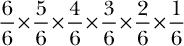
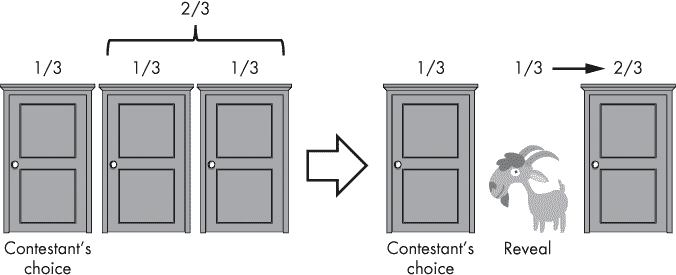
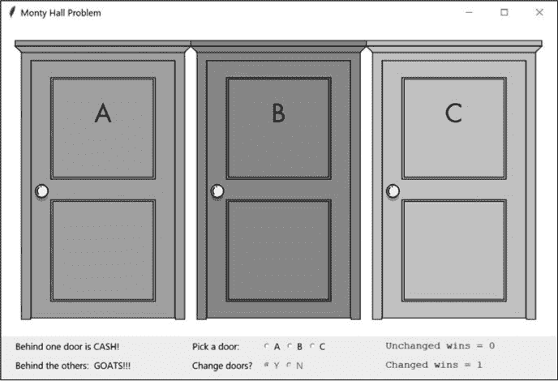
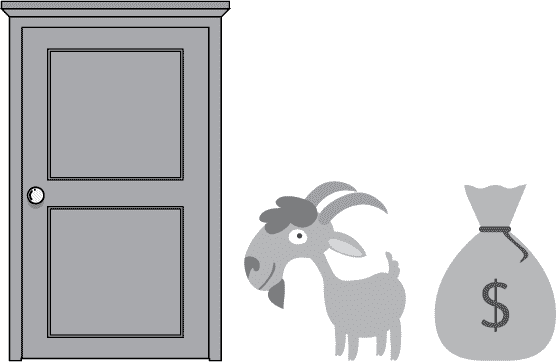
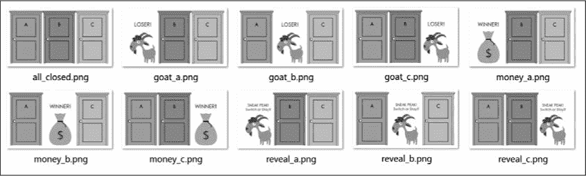
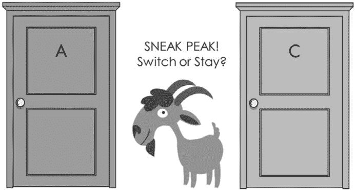

## **11**

**蒙提霍尔问题**

作为电视游戏节目 *Let's Make a Deal* 的主持人，Monty Hall 会展示给参赛者三个封闭的门，并要求他们选择一个。一个门后面藏着一个宝贵的奖品，而另外两个门后面则是臭味扑鼻的老山羊。一旦参赛者选择了一个门，Monty 就会打开剩下的一个门，露出一只山羊。然后，参赛者会面临最后的选择：是更换门，还是坚持原来的选择。

1990 年，"世界上最聪明的女人" Marilyn vos Savant 在她每周的 *Parade* 杂志专栏《问玛丽莲》中指出，参赛者应该选择更换门。虽然她的回答是正确的，但却引发了大量的仇恨邮件、性别偏见和学术迫害。在这个过程中，许多数学教授感到尴尬，但这场丑陋的事件也有光明的一面。激烈的讨论让公众接触到了统计学的科学，vos Savant 提出的一个实验也进入了成千上万的教室。这些手动测试——后来由计算机复制——最终证明了她那被讽刺的“女性逻辑”是正确的。

在本章中，你将使用 *蒙特卡洛模拟（MCS）*，这是一种通过一系列随机输入来建模不同结果的概率的方法，来验证 vos Savant 的结论是否正确。之后，你将使用 tkinter 构建一个有趣的图形界面，来满足她要求学校儿童帮助实验的请求。

### **蒙特卡洛模拟**

想象一下，你想知道投掷一个骰子六次，每次得到不同的面朝上的概率。如果你是一个数学天才，你可能会直接通过确定性方程 6! / 6⁶ 来计算这个概率，或者

最终结果为 0.015。如果你不那么擅长数学，你也可以使用 Python 和大量的投掷来得到相同的答案：

>>> from random import randint

>>> trials = 100000

>>> success = 0

>>> for trial in range(trials):

faces = set()

for rolls in range(6):

roll = randint(1, 6)

faces.add(roll)

if len(faces) == 6:

success += 1

>>> print("成功的概率 = {}".format(success/trials))

成功的概率 = 0.01528

本示例使用了一个 for 循环和 randint 函数，随机选取 1 到 6 之间的数字，表示骰子上的六个面之一，连续投掷六次。它将每次的结果添加到一个名为 faces 的集合中，集合不允许重复。集合的长度达到 6 的唯一方法是每次投掷的结果都是唯一的，这样就算作一次成功。外层的 for 循环会执行 100,000 次这个六次投掷的实验。将成功次数除以实验次数，可以得到与确定性方程相同的概率值 0.015。

蒙特卡洛模拟使用*反复随机抽样*——在这个例子中，每一次掷骰子都是一个随机样本——来预测在指定条件范围内的不同结果。对于这个例子，条件范围是一个六面骰子，每次试验六次掷骰子且不重复，试验次数为 100,000 次。当然，MCS 通常应用于更复杂的问题——那些有大量变量和广泛不确定性的情况，其中结果无法轻易预测。

有多种类型的 MCS，但大多数应用遵循以下基本步骤：

+   列出输入变量。

+   为每个变量提供一个概率分布。

+   开始一个循环：

    +   随机从每个输入的分布中选择一个值。

    +   使用这些值进行确定性计算，即从相同输入中始终产生相同输出的计算。

    +   重复指定次数。

+   汇总结果并生成统计数据，例如计算的平均结果。

对于掷骰子示例，这些步骤是：

+   输入变量 = 六次掷骰子的结果。

+   掷骰子的概率分布 = 均匀分布（每个面为 1/6）。

+   循环：

    +   随机选择的值 = 掷骰子（从分布中抽取）。

    +   计算 = 将六个值加到一个集合中，如果集合长度等于 6，则成功变量加 1。

    +   重复 = 100,000 次。

+   汇总：将成功变量除以 100,0000 来计算概率。

纳西姆·尼古拉斯·塔勒布（Nassim Taleb），《黑天鹅》和《随机的愚弄》一书的备受好评的作者，是 MCS 的支持者。他认为我们的脑袋设计用来迅速帮助我们摆脱困境，而不是处理复杂的不确定性或概率问题。我们并不适应高度偏斜的分布和非线性问题，但有些人的大脑天生就比其他方法更能通过 MCS 理解风险。在现实生活中，我们并不观察概率分布；我们只是观察事件。

每次 MCS 运行代表一个单独事件，例如是否在退休时用尽资金。对于我们很多人来说，MCS 使得风险变得真实。它帮助我们理解事情可能的好坏——这是我们从数学抽象中无法轻易获得的。通过 MCS 得到的洞察，我们可以为防范风险并利用机会做准备。

为了验证蒙提霍尔问题的数学推导，你将使用像前面的掷骰子示例这样的 MCS 应用。然后，在第十二章中，你将使用 MCS 构建一个退休资金模拟器，以规划你（或你父母）的安全退休。

### **项目 #18：验证 Vos Savant**

为了验证 Vos Savant 是对的，可以使用蒙特卡洛方法模拟数万次“游戏”，以查看结果如何。这可以是一个基础程序，因为目标是一个简单的确认，没有多余的修饰。

**目标**

编写一个简单的 Python 程序，使用蒙特卡洛模拟来确定通过改变初始选择来赢得蒙提霍尔问题的概率。

#### ***策略***

蒙提霍尔问题的正确答案是在蒙提揭示山羊后换门。从统计学角度来看，这样做会将你获胜的概率翻倍！

查看图 11-1。在游戏开始时，所有的门都关闭，某一扇门藏有奖品的概率是 1/3。用户只能选择一扇门，这意味着奖品可能藏在其他两扇门中的概率是 2/3。山羊被揭示后，概率依然是 2/3，但这 2/3 的概率转移到了剩下的那扇门。记住，蒙提知道奖品藏在哪里，并且他永远不会揭示*那扇*门。所以，如果坚持选择最初的门，成功的概率是 1/3，而换门的成功概率是 2/3。

*图 11-1：蒙提霍尔问题中奖的概率变化（揭示山羊前后）*

如果你对数学公式有所怀疑，可以使用 MCS 来提供佐证，就像我们在掷骰子的例子中所做的那样。你只需要随机选择一个获胜的门，随机选择一个参赛者的选择，并记录两者相遇的次数。重复这个过程几千次，你会收敛到确定性的数学解。

#### ***Vos Savant 验证码***

这个章节中描述的*monty_hall_mcs.py*程序将自动化选择门并记录结果的过程，这样你可以运行数千次试验并在不到一秒钟的时间内评估它们。你可以从*[`www.nostarch.com/impracticalpython.com/`](https://www.nostarch.com/impracticalpython.com/)*下载代码。

##### **获取运行次数输入**

清单 11-1 通过询问用户想要模拟多少次运行（或游戏）来启动*monty_hall_mcs.py*程序。你还会提供一个默认值。这是引导用户给出合理初步回答的好方法，同时也能为他们节省一些敲键盘的时间。

*monty_hall_mcs.py,* 第一部分

➊ import random

➋ def user_prompt(prompt, default=None):

"""允许在输入时使用默认值。"""

➌ prompt = '{} [{}]: '.format(prompt, default)

➍ response = input(prompt)

➎ if not response and default:

return default

else:

return response

# 输入运行模拟的次数

➏ num_runs = int(user_prompt("输入运行次数", "20000"))

*清单 11-1：导入模块并定义* user_prompt() *函数*

首先导入随机模块以运行 MCS ➊。接下来，定义一个名为 user_prompt() 的函数，要求用户输入要运行的游戏次数，或者如果提供了默认值，则接受默认值 ➋。此函数接受两个参数；第一个是文本提示，告诉用户该做什么，第二个是默认值，初始为 None。立即重新定义提示变量，使其按照惯例显示带有默认值的括号 ➌。将用户的输入赋值给名为 response 的变量 ➍。如果用户按 Enter 键而没有提供任何输入，并且存在默认值，则 user_prompt() 函数将返回默认值 ➎。否则，函数返回用户的输入。使用此函数通过将返回值赋给 num_runs 变量来确定运行的次数 ➏。每次运行将代表一位参赛者玩一次游戏。

##### **运行 MCS 并显示结果**

清单 11-2 随机选择获胜门和用户的第一次选择，然后汇总并展示统计数据。有趣的是，用户的第二次选择——是否换门——并不是得出正确答案所必需的。如果初始选择是获胜门，正确的答案是不要换门。同样，如果初始选择和获胜门不同，正确的答案是换门。没有必要模拟参赛者可能做的或不做的事情。

*monty_hall_mcs.py,* 第二部分

# 分配胜利方式的计数器

➊ first_choice_wins = 0

pick_change_wins = 0

➋ doors = ['a', 'b', 'c']

# 运行蒙特卡罗模拟

➌ for i in range(num_runs):

winner = random.choice(doors)

pick = random.choice(doors)

➍ if pick == winner:

first_choice_wins += 1

else:

pick_change_wins += 1

➎ print("原选择获胜次数 = {}".format(first_choice_wins))

print("更改选择获胜次数 = {}".format(pick_change_wins))

print("初始猜测获胜的概率: {:.2f}"

.format(first_choice_wins / num_runs))

print("通过换门获胜的概率: {:.2f}"

.format(pick_change_wins / num_runs))

➏ input("\n 按 Enter 键退出。")

*清单 11-2：运行蒙特卡罗模拟并显示结果*

分配两个变量来跟踪是否换门或保持原选择是获胜的结果 ➊。然后，创建一个列表来表示三扇门 ➋。

MCS 从一个 for 循环开始，该循环遍历运行次数 ➌。在循环内，从 doors 列表中随机选择获胜门和用户的第一次选择，使用 random.choice()，并将它们赋值给变量。

由于这是一个二元系统——用户换门或不换门——你只需要一个条件语句，根据 pick 变量和 winner 变量的关系来更新计数器 ➍。

完成程序并展示最终结果。显示实际计数和计算出的概率 ➎。然后告知用户程序已完成 ➏。

这是默认 20,000 次运行的输出示例：

输入运行次数 [20000]:

原始选择获胜次数 = 6628

更换选择后获胜次数 = 13372

初始猜测的获胜概率：0.33

通过更换选择的获胜概率：0.67

按下回车键退出。

有些人对计算机打印输出不感兴趣。他们需要更有说服力的东西，因此在下一个项目中，你将以一种更具动手性质的方式重新包装你的代码——一种完整的、有门、有奖品和有山羊的格式。这也将满足 Marilyn vos Savant 的呼吁，让学生们参与进来，帮助恢复她的声誉。

### **项目#19：蒙提霍尔游戏**

蒙提霍尔问题中的三门游戏足够简单，可以使用 tkinter 构建。你已经在第十章开始接触 tkinter 图形。现在，你将在此基础上增加交互按钮供用户点击。

**目标**

使用 tkinter 构建的 GUI 模拟蒙提霍尔问题。跟踪更换门或保持不变是否会导致获胜。此外，在游戏进行时更新并显示这些统计数据。

#### ***面向对象编程简要介绍***

tkinter 模块是使用*面向对象编程（OOP）*编写的。OOP 是一种围绕数据结构（称为*对象*）构建的语言模型，包含*数据*和*方法*以及它们之间的交互——与过程化编程中使用的*动作*和*逻辑*不同。对象是由*类*构建的，类就像对象的蓝图。

OOP 是一个抽象概念，写大型复杂程序时更容易理解。它减少了代码重复，使代码更易于更新、维护和重用。因此，大多数商业软件现在都是使用 OOP 构建的。

如果你在小型程序中实现了 OOP，就像我们迄今为止编写的那些程序，它们大多数会显得过于复杂。事实上，我最喜欢的一句名言，来自英国计算机科学家乔·阿姆斯特朗，正是关于 OOP 的这一方面：“面向对象语言的问题在于，它们携带着所有这些隐性环境。你想要一个香蕉，但你得到的是一个拿着香蕉的猩猩和整个丛林！”

尽管如此，OOP 所生成的对象非常适合用于 GUI 和游戏，即使是一些小型项目。让我们看一个使用*地下城与龙*类型的桌面游戏的例子，玩家可以选择不同的角色，比如矮人、精灵和巫师。这些游戏使用角色卡片列出每个角色类型的重要信息。如果你让你的棋子代表矮人，它就会继承卡片上的特征（见图 11-2）。

*图 11-2：角色扮演游戏中的矮人角色卡片*

清单 11-3 和 11-4 重现了类似桌游的玩法，允许你为矮人和精灵创建虚拟卡片，命名你的棋子，并让它们进行战斗。战斗的结果会影响某个角色的*身体点数*，即代表角色生命的健康值。请注意，面向对象编程（OOP）如何允许你通过“复制”预定义的模板——即*类*——轻松地创建多个相同的对象，在这种情况下是矮人或精灵。

➊ >>> import random

➋ >>> class Dwarf(object):

➌ >>> def __init__(self, name):

➍ self.name = name

self.attack = 3

self.defend = 4

self.body = 5

➎ def talk(self):

print("我是一个刀客，我会砍你！！！")

➏ >>> lenn = Dwarf("Lenn")

>>> print("矮人名称 = {}".format(lenn.name))

矮人名称 = Lenn

>>> print("Lenn 的攻击力 = {}".format(lenn.attack))

Lenn 的攻击力 = 3

>>>

➐ >>> lenn.talk()

我是一个刀客，我会砍你！！！

*清单 11-3：导入* random *模块，创建一个* Dwarf *类，并实例化一个矮人对象*

首先导入 random 来模拟掷骰子 ➊；这就是你的角色如何进行战斗的方式。现在为矮人角色定义一个类，类名的首字母大写，并传入一个对象参数，即你矮人的名字 ➋。类是创建某一类型对象的模板。例如，当你创建一个列表或字典时，你是从一个类中创建它们的。

Dwarf 类定义就像图 11-2 中的卡片；它基本上是矮人的基因蓝图。它会分配*属性*，如力量和生命力，和*方法*，如角色如何移动或讲话。属性是作用于类的*实例*的变量，而方法是也恰好是函数的属性，当它们运行时会传入对它们实例的引用。类是一种数据类型，当你创建该数据类型的对象时，它也被称为该类的实例。设置实例的初始值和行为的过程称为*实例化*。

接下来，定义一个*构造函数*方法，也叫*初始化*方法。它为你的对象设置初始的属性值 ➌。`__init__()`方法是一个特殊的内置方法，Python 会在创建新对象时自动调用它。在这个方法中，你将传入两个参数：self 和你的对象名称。

self 参数是对正在创建的类实例的引用，或者是方法被调用时的实例引用，技术上称为*上下文*实例。如果你创建一个新的矮人并命名为“Steve”，那么 self 将在幕后变成 Steve。例如，self.attack 会变成“Steve 的攻击力”。如果你创建另一个矮人并命名为“Sue”，那么该对象的 self 将变成“Sue”。这样，Steve 的健康属性范围与 Sue 的健康属性就被区分开了。

接下来，在构造函数定义下列出一些矮人的属性 ➍。你需要一个名字以便区分不同的矮人，还有一些关键战斗属性。注意，这个列表与图 11-2 中的卡片相似。

定义一个 talk()方法，并传递 self ➎。通过传递 self，你将方法与对象关联。在更全面的游戏中，方法可能包括诸如移动和解除陷阱的行为。

类定义完成后，创建一个 Dwarf 类的实例，并将该对象分配给本地变量 lenn，这是矮人的名字 ➏。现在，打印名字和攻击属性，以展示你已经可以访问它们。最后调用 talk()方法 ➐。这应该显示一条信息。

清单 11-4 创建一个精灵角色，使用你在清单 11-3 中使用的相同过程，并让它与矮人战斗。精灵的生命属性会根据战斗结果进行更新。

➊ >>> class Elf(object):

def __init__(self, name):

self.name = name

self.attack = 4

self.defend = 4

self.body = 4

>>> esseden = Elf("Esseden")

>>> print("精灵名字 = {}".format(esseden.name))

精灵名字 = Esseden

>>> print("Esseden 生命值 = {}".format(esseden.body))

Esseden 生命值 = 4

>>>

➋ >>> lenn_attack_roll = random.randrange(1, lenn.attack + 1)

>>> print("Lenn 攻击掷骰 = {}".format(lenn_attack_roll))

Lenn 攻击掷骰 = 3

➌ >>> esseden_defend_roll = random.randrange(1, esseden.defend + 1)

>>> print("Esseden 防御掷骰 = {}".format(esseden_defend_roll))

Esseden 防御掷骰 = 1

>>>

➍ >>> damage = lenn_attack_roll - esseden_defend_roll

>>> if damage > 0:

esseden.body -= damage

➎ >>> print("Esseden 生命值 = {}".format(esseden.body))

Esseden 生命值 = 2

*清单 11-4：创建一个* 精灵 *类，实例化一个精灵对象，模拟一场战斗，并更新对象属性*

定义一个精灵类，并提供一些属性 ➊。使它们与矮人有所不同，并且像精灵一样平衡。实例化一个名为 Esseden 的精灵，并使用 print 访问他的名字和生命属性。

使用虚拟骰子的掷骰结果来让你的两个角色进行互动，虚拟骰的最大值等于角色的攻击或防御值。使用 random 模块从 1 到 Lenn 的攻击属性加 1 的范围中选择一个掷骰值 ➋，然后重复此过程获取 Esseden 的防御值 ➌。通过将 Esseden 的掷骰值从 Lenn 的掷骰值中减去 ➍，计算对 Esseden 的伤害，如果伤害为正数，则从 Esseden 的生命属性中扣除它。使用 print()来确认精灵的当前生命值 ➎。

如你所想，构建许多相似的角色并跟踪它们变化的属性，在过程式编程中会变得非常复杂。面向对象编程（OOP）为你的程序提供了模块化结构，便于通过封装隐藏复杂性和作用域的所有权，允许以小块的方式解决问题，并生成可共享的模板，可以在其他地方修改和使用。

#### ***策略与伪代码***

现在回到我们的三门游戏。游戏的规则构成了程序伪代码的主体部分：

初始化游戏窗口并显示已关闭的门和说明

随机选择获胜门

获取玩家的门选择

显示不是获胜门或玩家选择的门

获取玩家是否换门的选择

如果玩家换门：

显示新门

如果获胜者：

记录换门后的胜利

否则：

记录保持原样的胜利

否则如果玩家坚持初始选择：

显示玩家选择的门

如果获胜者：

记录保持原样的胜利

否则：

记录换门后的胜利

在游戏窗口中显示每种策略的获胜次数

重置游戏并关闭所有门

开始设计游戏时，最好先草拟出游戏窗口的外观，包括说明、消息和按钮类型。我猜你不想看到我粗糙的涂鸦，所以不妨看看图 11-3。

*图 11-3：第一轮游戏后的游戏窗口视图*

这就是游戏完成后的第一轮样式，右侧显示了获胜统计数据。请注意，换门的单选按钮在玩家做出初始选择之前是灰色的，无法操作。

#### ***游戏资产***

*游戏资产*是指构建游戏时需要的各种元素。这些元素将包括一系列图像，用于表示门、山羊和奖品（图 11-4）。

*图 11-4：*monty_hall_gui.py* 程序的构建块图像*

我使用 Microsoft PowerPoint 将三张基础图像合成了 10 张图像，表示游戏的所有可能状态（图 11-5）。这是一个设计决策；通过增加几行代码，我也可以仅使用基础图像获得相同的结果。

*图 11-5：*monty_hall_gui.py* 程序的合成图像*

#### ***蒙提霍尔游戏代码***

本节中描述的 *monty_hall_gui.py* 程序将蒙提霍尔问题转化为一个有趣且富有教育意义的游戏。你还需要图 11-5 中显示的 10 个游戏资产。请从 *[`www.nostarch.com/impracticalpython/`](https://www.nostarch.com/impracticalpython/)* 下载它们，并将所有文件保存在同一个文件夹中。

##### **导入模块并定义游戏类**

列表 11-5 导入了模块并定义了游戏类和初始化方法 __init__()。

*monty_hall_gui.py，* 第一部分

➊ import random

import tkinter as tk

➋ class Game(tk.Frame):

"""蒙提霍尔问题游戏的 GUI 应用程序。"""

➌ doors = ('a', 'b', 'c')

➍ def __init__(self, parent):

"""初始化框架。"""

➎ super(Game, self).__init__(parent)  # 父对象将是根窗口

➏ self.parent = parent

self.img_file = 'all_closed.png'  # 当前的门图片

self.choice = ''  # 玩家选择的门

self.winner = ''  # 获胜的门

self.reveal = ''  # 揭示的山羊门

➐ self.first_choice_wins = 0  # 统计用的计数器

self.pick_change_wins = 0  # 统计用的计数器

➑ self.create_widgets()

*清单 11-5：导入模块并定义* Game *类和* _ _init_ _() *方法*

首先导入 random 和 tkinter 模块 ➊。接下来，定义一个名为 Game 的类 ➋。该类的 *祖先*，在括号中显示，将是 tkinter 的 Frame 类。这意味着 Game 类是从现有的 Frame “基类”派生出来的，并且将方便地继承其中的有用方法。Frame 小部件主要作为其他小部件的几何布局管理器，帮助将它们组合成复杂的布局。

请注意，类有其自己的文档字符串约定，您可以在 *[`www.python.org/dev/peps/pep-0257/`](https://www.python.org/dev/peps/pep-0257/)* 找到相关信息。如第一章所述，本书为了简洁起见，主要展示单行文档字符串。

每个 Game 实例将使用相同的三扇门，因此你可以使用 *类属性* 来表示这一点 ➌。任何在方法外部赋值的变量都会成为类属性，类似于程序性程序中在函数外部赋值的变量成为全局变量。为了防止该属性被意外修改，可以使用元组使其不可变。以后，当你想操作门时，可以从这个元组创建列表。

现在，就像之前的矮人和精灵示例一样，为游戏对象定义一个初始化方法 ➍。需要一个 self 参数，但你还需要一个父对象，即将承载游戏的根窗口。

基类也可以称为 *父类*，而 super() 函数让你调用父类的方法以访问继承的方法——在本例中，来自父类。首先，将 Game 传递给 super()，这意味着你希望调用 Game 的父类 Frame 的方法 ➎。然后，将 self 作为参数传递，以引用新实例化的 Game 对象。语句中的 __init__(parent) 部分调用了 Frame 的初始化方法，并将 parent（根窗口）作为参数传入。现在，预构建的 tkinter Frame 类中的属性可以被 Game 对象使用。请注意，这个语句可以简化为 super().__init__()。

接下来，为一系列实例属性分配值 ➏。最好通过 __init__()方法初始化属性，因为它是在创建对象后第一个被调用的方法。这样，这些属性会立即对类中的任何其他方法可用。首先，分配父级，这将是根窗口。然后定义一个属性，用于存储其中一个图像文件（如图 11-5 所示），并将其分配为所有门关闭的图像，这是玩家在每次游戏开始时看到的。接下来，定义属性来保存玩家选择的门、获胜的门，以及用来揭示第一只山羊的门。

使用计数器跟踪玩家坚持最初选择的门时取得的胜利次数，并使用另一个计数器记录玩家换门后获得的胜利次数 ➐。最后，调用一个方法，创建运行游戏所需的标签、按钮和文本小部件 ➑。

##### **创建图像和说明的小部件**

列表 11-6 定义了 create_widgets()方法的第一部分，用于构建游戏的标签、按钮和文本小部件。前两个小部件将是 tkinter 标签，用于显示图 11-5 中的图像，并提供游戏说明。

*monty_hall_gui.py，* 第二部分

➊ def create_widgets(self):

"""为游戏创建标签、按钮和文本小部件。"""

# 创建标签以显示门的图像

➋ img = tk.PhotoImage(file='all_closed.png')

➌ self.photo_lbl = tk.Label(self.parent, image=img,

text='', borderwidth=0)

➍ self.photo_lbl.grid(row=0, column=0, columnspan=10, sticky='W')

➎ self.photo_lbl.image = img

# 创建说明标签

➏ instr_input = [

('在一扇门后面是现金！', 1, 0, 5, 'W'),

('在其他选项后面: GOATS!!!', 2, 0, 5, 'W'),

('选择一扇门:', 1, 3, 1, 'E')

]

➐ 对于 text、row、column、columnspan、sticky 中的每一项:

instr_lbl = tk.Label(self.parent, text=text)

instr_lbl.grid(row=row, column=column, columnspan=columnspan,

sticky=sticky, ➑ipadx=30)

*列表 11-6：定义了一个创建小部件的方法*

定义一个方法，称为 create_widgets()，该方法接受 self 作为参数 ➊。然后为该方法分配一个属性，用于存储门的图像 ➋。请注意，你不必在该属性名前加上 self，因为它只会在方法内部局部使用。tkinter 使用 PhotoImage 类，该类以图像文件名作为参数，用于在画布、标签、文本或按钮小部件中显示图像。完成这一步后，你可以在 tkinter 标签中使用该图像，因此定义一个 photo_lbl 变量，将父级和图像作为参数传递，并指定无文本和细边框 ➌。

要将标签放入父窗口中，使用 `grid()` 方法并传递给它第一行和第一列，让图像横跨 10 列，并使用 W ➍ 使其左对齐。这将填充窗口顶部的闭门图像。`columnspan` 选项允许小部件跨越多于一列。该值不会影响图像的大小，但*会*改变放置指示文本和其他小部件的可用位置数量。例如，如果你将 `columnspan=2`，那么你将只有两个列可以放置指示、按钮和消息。

通过创建对图像对象的引用 ➎ 来完成照片标签。如果你不这样做，图像将无法始终显示。

根据 tkinter 文档，tkinter 是建立在另一个产品 (Tk) 之上的一层，而这两者之间的接口并未正确处理对图像对象的引用。Tk 小部件持有对内部对象的引用，但 tkinter 并没有。Python 使用垃圾回收模块自动回收不再需要的对象的内存。当 Python 内存分配器的垃圾回收器丢弃 tkinter 对象时，tkinter 会告诉 Tk 释放图像。但由于图像仍在使用中，Tk 无法释放，因此它将图像设置为透明。解决此问题的建议包括使用全局变量、使用实例属性，或者像你在这里所做的那样，为小部件实例添加属性（`photo_lbl.image = img`）。更多信息，请参考 *[`effbot.org/tkinterbook/photoimage.htm`](http://effbot.org/tkinterbook/photoimage.htm)*。

最后，添加作为标签小部件的指示文本。这个过程是提供一系列参数，然后通过它们来循环构建小部件。首先，创建一个包含元组的列表 ➏，每个元组包含创建 Label 对象的选项；你可以在下一个语句 ➐ 中看到每个元组所代表的内容。随着你在 for 循环中逐步执行，为每个标签在父窗口中创建并赋予一些文本。然后，使用 `grid()` 方法根据元组列表中的信息，将文本放置到窗口中。

使用 `ipadx` 选项与 `grid()` 配合使用 ➑。此选项指的是标签内 x 方向的内边距，你可以调整它来微调文本在窗口中的显示效果。在这种情况下，你为标签添加了 30 像素，以使文本对齐得更加美观。

##### **创建单选按钮和文本小部件**

列表 11-7 继续定义 `create_widgets()` 方法，通过为三个门创建单选按钮小部件。玩家通过选择 A、B 或 C 单选按钮来做出初始的门选择。然后，他们的选择将由 `win_reveal()` 方法处理，你将在后续的部分构建这个方法。该方法将确定获胜的门并揭示一只山羊。

另一组单选按钮用于获取玩家是否选择更换门的决定。结果将由 show_final() 方法处理，后者也会在稍后定义。除了揭示玩家最终选择的门后面是什么外，该方法还会更新胜利统计，使用在本清单末尾定义的 Text 小部件。

*monty_hall_gui.py,* 第三部分

# 创建用于获取初始用户选择的单选按钮

➊ self.door_choice = tk.StringVar()

self.door_choice.set(None)

➋ a = tk.Radiobutton(self.parent, text='A', variable=self.door_choice,

value='a', command=self.win_reveal)

b = tk.Radiobutton(self.parent, text='B', variable=self.door_choice,

value='b', command=self.win_reveal)

c = tk.Radiobutton(self.parent, text='C', variable=self.door_choice,

value='c', command=self.win_reveal)

# 创建小部件以更改门的选择

➌ self.change_door = tk.StringVar()

self.change_door.set(None)

➍ instr_lbl = tk.Label(self.parent, text='更改门吗？')

instr_lbl.grid(row=2, column=3, columnspan=1, sticky='E')

➎ self.yes = tk.Radiobutton(self.parent, state='disabled', text='Y',

variable=self.change_door, value='y',

command=self.show_final)

self.no = tk.Radiobutton(self.parent, state='disabled', text='N',

variable=self.change_door, value='n',

command=self.show_final)

# 创建用于显示胜利统计的文本小部件

➏ defaultbg = self.parent.cget('bg')

➐ self.unchanged_wins_txt = tk.Text(self.parent, width=20,

height=1, wrap=tk.WORD,

bg=defaultbg, fg='black',

borderwidth=0)

self.changed_wins_txt = tk.Text(self.parent, width=20,

height=1, wrap=tk.WORD, bg=defaultbg,

fg='black', borderwidth=0)

*清单 11-7: 为* create_widgets() *方法构建单选按钮和文本小部件*

首先创建门 A、B 和 C 的单选按钮。当用户与 tkinter 小部件交互时，结果是一个*事件*。你可以使用变量来跟踪这些事件，例如当玩家通过按下单选按钮选择一扇门时。对于特定于小部件的变量，tkinter 有一个变量类。使用*字符串*变量类 StringVar，并将其分配给名为 door_choice 的变量 ➊。立即使用 set() 方法将变量的值设置为 None。

接下来，设置三个门的按钮小部件 ➋。玩家将点击这些按钮中的一个，作为他们的第一次门选择。使用 Radiobutton 类，并传递父窗口、显示的文本、刚刚分配的 door_choice 变量、一个等于门名的值以及一个命令。该命令会调用 win_reveal() 方法，稍后你会定义这个方法。注意，你不需要在方法名后加上括号。

对 B 和 C 按钮重复此过程。这主要是一个复制粘贴的练习，因为你只需要更改门的名称。

现在，构建用于切换门的单选按钮。像你为初始门选择创建的字符串变量 ➌ 一样，创建另一个字符串变量。根据选中的单选按钮，它将保存 y 或 n。

使用 Label 类构建一个指示标签 ➍。然后构建 self.yes 单选按钮 ➎。使用 Radiobutton 类，将父窗口传递给它，并将其状态设置为禁用。这样，窗口会初始化时，yes/no 按钮是灰色的，防止玩家在选择一个门之前就试图更改门。text 参数是按钮的名称；使用简化的 Y 来表示 *yes*。将小部件的变量参数设置为 change_door 变量，将其值设置为 y，并调用 show_final() 函数。对 no 按钮重复这个过程。

你需要的最后几个小部件是 Text 小部件，用于显示更换门与保持原门的次数。使用 Text 类来显示统计信息，并将文本框的颜色设置为与父窗口匹配。为此，使用 cget() 方法获取父窗口的背景色（bg），然后将其分配给变量 ➏。cget() 方法返回 tkinter 选项的当前值，作为字符串。

创建一个文本对象来显示坚持选择第一个选项的胜利次数 ➐。你需要将父窗口、宽度和高度、当文本超出一行时如何换行、背景色、前景色（即文本颜色）以及文本框的边框宽度传递给小部件。请注意，实际的文本不会被包含在内；这将在稍后的 show_final() 方法中添加。

最后再添加一个文本小部件，显示因更换门而获得的胜利次数。

##### **排列小部件**

列表 11-8 完成了 create_widgets() 方法，通过使用 tkinter Grid 布局管理器将剩余的未网格化小部件定位到游戏窗口中。

*monty_hall_gui.py*，第四部分

# 将小部件放置在框架中

➊ a.grid(row=1, column=4, sticky='W', padx=20)

b.grid(row=1, column=4, sticky='N', padx=20)

c.grid(row=1, column=4, sticky='E', padx=20)

self.yes.grid(row=2, column=4, sticky='W', padx=20)

self.no.grid(row=2, column=4, sticky='N', padx=20)

➋ self.unchanged_wins_txt.grid(row=1, column=5, columnspan=5)

self.changed_wins_txt.grid(row=2, column=5, columnspan=5)

*列表 11-8：调用* grid() *方法对小部件进行定位*

使用 grid() 方法将门按钮定位到父窗口 ➊。将三个门按钮组合在同一行和列中，并使用 sticky 对齐方式分隔它们：W 表示左对齐，N 表示居中，E 表示右对齐。使用 padx 来稍微调整它们的横向位置。对其余的按钮重复此过程，然后将胜利统计文本小部件定位到窗口右侧的五列区域 ➋。

##### **更新门的图像**

在整个游戏过程中，你将需要打开和关闭门，因此 列表 11-9 定义了一个辅助方法来根据需要更新门的图像。请注意，在面向对象编程（OOP）中，你无需将文件名作为参数传递给该方法。所有对象的方法都有直接访问以 self 开头的属性。

*monty_hall_gui.py*，第五部分

➊ def update_image(self):

"""更新当前门的图片。"""

➋ img = tk.PhotoImage(file=self.img_file)

➌ self.photo_lbl.configure(image=img)

➍ self.photo_lbl.image = img

*列表 11-9：定义一个方法来更新当前门的图片*

定义一个函数，名为 `update_image()`，将 `self` 作为参数 ➊。然后使用 `PhotoImage` 类，正如在 列表 11-6 中所做的那样 ➋。文件名 *self.img_file* 会在其他方法中更新。

因为你已经创建了存放门图片的标签，使用 `configure()` 方法来改变标签——在本例中，是加载一个新的图片 ➌。你可以使用 `configure()` 或 `config()` 方法。最后，通过将图片分配给一个小部件属性来防止垃圾回收 ➍，如 列表 11-6 所述。

##### **选择获胜门并揭示山羊**

列表 11-10 定义了一个方法，选择获胜门和揭示门，然后打开和关闭揭示门。它还激活了是/否按钮，直到玩家做出第一次门选择之前，这些按钮都是灰色的。

*monty_hall_gui.py，* 第六部分

➊ def win_reveal(self):

"""随机选择获胜门并揭示未选的门，显示山羊。"""

➋ door_list = list(self.doors)

➌ self.choice = self.door_choice.get()

self.winner = random.choice(door_list)

➍ door_list.remove(self.winner)

➎ if self.choice in door_list:

door_list.remove(self.choice)

self.reveal = door_list[0]

else:

self.reveal = random.choice(door_list)

➏ self.img_file = ('reveal_{}.png'.format(self.reveal))

self.update_image()

# 启动并清除是/否按钮

➐ self.yes.config(state='normal')

self.no.config(state='normal')

self.change_door.set(None)

# 门在打开后的 2 秒关闭

➑ self.img_file = 'all_closed.png'

self.parent.after(2000, self.update_image)

*列表 11-10：定义一个方法来随机选择获胜门并揭示门*

定义一个名为 `win_reveal()` 的方法，将 `self` 作为参数 ➊。立即根据类属性 `doors` 创建一个门的列表 ➋。你将根据玩家的第一个门选择和程序随机挑选的获胜门来修改这个列表。

现在，将一个 `self.choice` 属性分配给 `self.door_choice` 字符串变量，并使用 `get()` 方法访问它 ➌。该属性的值由用户点击的门单选按钮（作为其第一个选择）决定。接下来，从门列表中随机选择一个获胜的门。

从门列表中移除获胜的门 ➍。然后使用条件语句检查玩家的选择是否仍在门列表中；如果在，移除它，以便不被揭示 ➎。这样列表中只剩下一个门，将其分配给 `self.reveal` 属性。

如果玩家选择了获胜的门，列表中剩下两个门，所以随机选择其中一个并将其赋值给 self.reveal。更新该门的 self.img_file 属性➏，然后调用更新图片标签的方法以显示新图片。图 11-6 是门 B 揭示图片的示例。

*图 11-6：门 B 的揭示图片*

接下来，设置是和否按钮的状态为正常➐。此后，它们将不再是灰色的。方法的结束是将图片文件更改为*all_closed.png*，并在 2000 毫秒后调用父窗口的 self.update_image()方法➑。这将确保门不会保持打开超过 2 秒钟。

##### **揭示玩家的最终选择**

Listing 11-11 定义了一个函数的第一部分，该函数接受玩家的最终门选择并揭示其背后是什么。该函数还会跟踪更换门或坚持初选的获胜次数。

*monty_hall_gui.py,* 第七部分

➊ def show_final(self):

"""揭示用户最终选择的门背后内容并计算获胜次数。"""

➋ door_list = list(self.doors)

➌ switch_doors = self.change_door.get()

➍ if switch_doors == 'y':

door_list.remove(self.choice)

door_list.remove(self.reveal)

➎ new_pick = door_list[0]

➏ if new_pick == self.winner:

self.img_file = 'money_{}.png'.format(new_pick)

self.pick_change_wins += 1

否则：

self.img_file = 'goat_{}.png'.format(new_pick)

self.first_choice_wins += 1

➐ elif switch_doors == 'n':

➑ if self.choice == self.winner:

self.img_file = 'money_{}.png'.format(self.choice)

self.first_choice_wins += 1

否则：

self.img_file = 'goat_{}.png'.format(self.choice)

self.pick_change_wins += 1

# 更新门图片

➒ self.update_image()

*Listing 11-11：定义了一个方法，用于揭示玩家的最终选择并更新获胜记录*

定义一个名为 show_final()的方法，接受 self 作为参数➊。创建一个新的门列表副本➋，然后获取 self.change_doors 变量并将其赋值给名为 switch_doors 的属性➌。该变量将根据玩家点击的单选按钮，保存'y'或'n'。

如果玩家选择了更换门➜，从列表中移除他们的首次选择和被揭示的门，并将新选项赋值给剩余的门➎。如果这个新选择是获胜的门➏，则显示正确的图片并增加 self.pick_change_wins 计数器。否则，设置图片为山羊并增加 self.first_choice_wins 计数器。

如果玩家决定不更换门➐，并且他们的首次选择是获胜的门➑，则揭示金钱袋，并增加 self.first_choice_wins 计数器。否则，显示一只山羊，并增加 self.pick_change_wins 计数器。

最后，调用 update_image()方法来更新图片➒。同样，您无需传递新图片文件的名称，因为它可以访问您在前面的代码中更改的 self.img_file 属性。

##### **显示统计信息**

清单 11-12 完成了 show_final() 方法，通过更新游戏窗口中胜利统计的数量，禁用是/否按钮，并关闭所有门。

*monty_hall_gui.py,* 第八部分

# 更新显示的统计信息

➊ self.unchanged_wins_txt.delete(1.0, 'end')

➋ self.unchanged_wins_txt.insert(1.0, '未改变的胜利 = {:d}'

.format(self.first_choice_wins))

self.changed_wins_txt.delete(1.0, 'end')

self.changed_wins_txt.insert(1.0, '改变的胜利 = {:d}'

.format(self.pick_change_wins))

# 关闭是/否按钮并清除门选择按钮

➌ self.yes.config(state='disabled')

self.no.config(state='disabled')

➍ self.door_choice.set(None)

➎ # 打开后 2 秒钟关闭门

self.img_file = 'all_closed.png'

self.parent.after(2000, self.update_image)

*清单 11-12: 显示胜利统计，禁用是/否按钮，并关闭所有门*

首先删除 self.unchanged_wins_txt 文本小部件中的任何文本 ➊。 从文本索引 1.0 开始删除。格式是行.列，因此您指定的是文本小部件的第一行和第一列（行编号从 1 开始，列编号从 0 开始）。最后使用 'end'，确保删除从起始索引之后的所有文本。

接下来，使用 insert() 方法将 self.first_choice_wins 属性值和一些描述性文本添加到文本小部件 ➋ 中。从文本索引 1.0 开始插入。

对 self.changed_wins_txt 文本小部件执行相同的操作，然后通过将其配置状态设置为 'disabled' ➌ 来禁用是/否按钮。将 self.door_choice 字符串变量重置为 None，准备开始新游戏 ➍。

通过关闭门来结束方法，就像在清单 11-10 中所做的那样 ➎。

##### **设置根窗口并运行事件循环**

清单 11-13 完成了 *monty_hall_gui.py* 程序，通过设置 tkinter 根窗口，实例化游戏对象，并运行 mainloop()。或者，代码也可以封装在 main() 函数中。

*monty_hall_gui.py,* 第九部分

# 设置根窗口并运行事件循环

➊ root = tk.Tk()

➋ root.title('蒙提霍尔问题')

➌ root.geometry('1280x820')  # 图像大小为 1280 x 720

➍ game = Game(root)

root.mainloop()

*清单 11-13: 设置根窗口，创建游戏对象，并运行 mainloop()*

Tk 类在没有参数的情况下被实例化 ➊。这会创建一个顶级 tkinter 小部件，它将成为游戏应用程序的主窗口。将其分配给名为 root 的变量。

给窗口设置标题 ➋ 和像素大小 ➌。注意，图像的大小会影响几何布局，以便它们能在窗口中适当地显示，底部留有足够的空间用于显示说明和消息。

现在，创建游戏 ➍。将根窗口传递给它，根窗口将成为包含游戏的 *主窗口*。这将导致新游戏被放置在根窗口内。

最后，通过调用 root 上的 mainloop()方法，保持窗口开启并等待处理事件。

### **总结**

在本章中，你使用了一个简单的蒙特卡洛模拟来验证切换门是蒙提·霍尔问题的最佳策略。然后，你使用 tkinter 构建了一个有趣的界面，让小学生通过一局一局的游戏手动验证这个结论。最重要的是，你学会了如何使用面向对象编程来构建响应用户输入的交互式小部件。

### **进一步阅读**

有关 tkinter 的有用参考资料可以在“进一步阅读”中找到，位于第 212 页。

你可以在网上找到 1990 年蒙提·霍尔问题争议的总结，网址是*[`marilynvossavant.com/game-show-problem/`](http://marilynvossavant.com/game-show-problem/)*。

### **实践项目：生日悖论**

需要多少人才能让房间里有 50%的机会两个人生日相同？根据*生日悖论*，其实并不需要那么多！与蒙提·霍尔问题一样，结果是反直觉的。

使用 MCS 来确定达到 50%的概率需要多少人。让程序输出一系列房间人数及其对应的概率。如果你发现自己在查找如何格式化日期，停下来并简化！你可以在附录中或在线找到解决方案，*birthday_paradox_practice.py*，网址是*[`www.nostarch.com/impracticalpython/`](https://www.nostarch.com/impracticalpython/)*。
