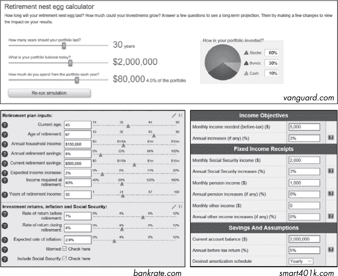
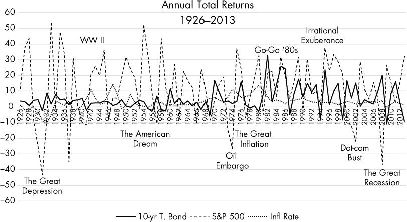
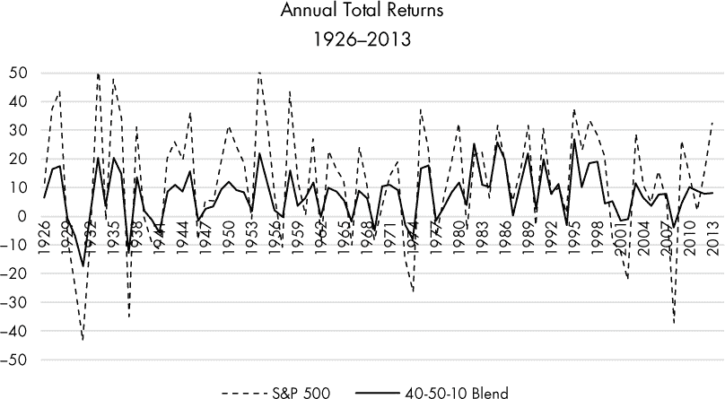
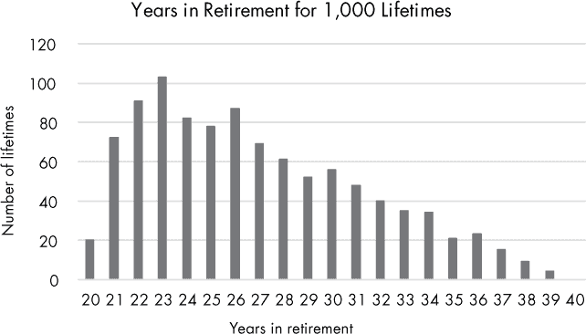
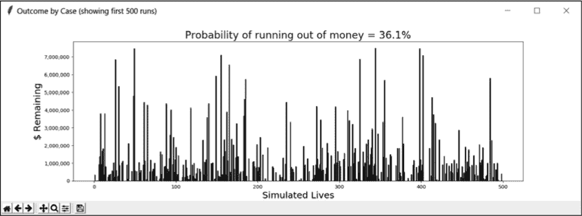
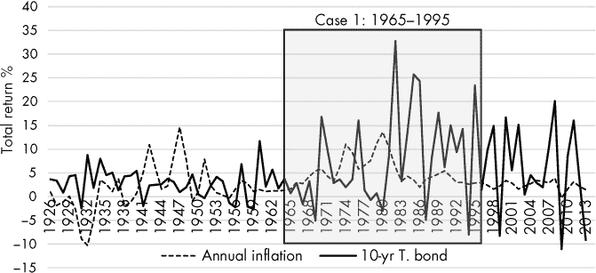
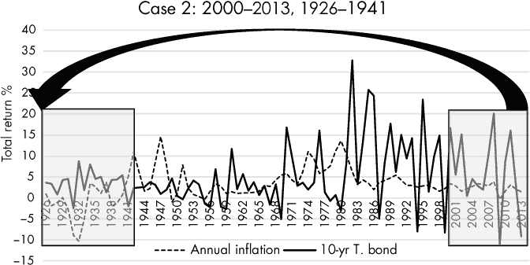

## 第十三章：确保你的“鸡蛋”**


婴儿潮一代是指 1946 年至 1964 年间出生的美国人。他们构成了一个庞大的群体——大约占美国人口的 20%，因此他们对美国文化的各个方面产生了巨大影响。金融行业很快就迎合了他们的需求，几十年来，这些需求主要集中在投资增长上。但在 2011 年，最年长的婴儿潮一代达到了 65 岁，并开始大量退休，每天达到 10,000 人*！*随着寿命比前几代人更长，婴儿潮一代的退休期可能会和他们的职业生涯一样长。资助这个 30 到 40 年的退休期是一个巨大的问题，也是一项巨大的商业机会。

在财务顾问主要专注于*增加*婴儿潮一代财富的那些年，他们依赖于简单的“4%规则”来进行退休规划。简单来说，每退休一年，如果你花费的金额不超过退休首年储蓄的 4%，你将永远不会用完钱。但正如马克·吐温所言，“所有的概括都是错误的，包括这一条！”我们的投资价值和花费金额常常处于波动之中，通常是由于我们无法控制的外部因素。

作为 4%规则的更为复杂的替代方法，金融行业采用了蒙特卡洛模拟（参见第十一章了解 MCS 概述）。使用 MCS，你可以在数千个生命周期中测试和比较退休策略。目标是确定在退休期间每年可以支出多少金额，在考虑到预期寿命的前提下，确保不会耗尽储蓄。

随着不确定性来源的增加，MCS 相较于其他方法的优势也在提升。在第十一章中，你应用了 MCS 来处理单一变量，并使用了简单的概率分布。在这里，你将关注寿命的不确定性，同时捕捉股市、债券市场和通货膨胀的真实周期性和相互依赖性。这将帮助你评估和比较不同的退休策略，从而实现安全和幸福的退休生活。

### **项目#20：模拟退休生命周期**

如果你认为自己还太年轻，不必担心退休问题，那就再想想吧。婴儿潮一代曾也有同样的想法，现在超过一半的人退休储蓄不足。对于大多数人来说，退休后能吃到神户牛肉还是狗粮，取决于他们多久开始储蓄。由于复利的魔力，即使是适度的储蓄也能在几十年里积累起来。早早知道自己未来需要的数字，让你能够设定实际的目标，顺利过渡到黄金岁月。

**目标**

构建一个蒙特卡洛模拟，以估算退休期间用尽资金的概率。将退休年限视为一个关键的不确定因素，并利用历史股市、债券和通货膨胀数据来捕捉这些变量的周期性和相互依赖性。

### **策略**

为了规划你的项目，别犹豫，去看看竞争对手的情况。许多养老基金计算器可以在网上免费使用。如果你玩这些计算器，你会发现它们展示了高度的输入参数变动性。

拥有许多参数的计算器可能看起来更好（见图 12-1），但随着每增加一个细节，你会开始陷入“兔子洞”，尤其是在涉及美国复杂的税法时。当你预测未来 30 到 40 年的结果时，细节可能变得杂乱无章。所以，最好保持简单，专注于最重要且可控的问题。你可以控制退休时间、投资资产配置、储蓄和支出的多少，但你无法控制股市、利率和通货膨胀。



*图 12-1：三个在线养老基金计算器的示例输入面板*

当你无法知道问题的“正确”答案时，查看一系列情境并基于概率做决策是最好的。对于涉及“致命错误”的决策，比如资金耗尽，理想的解决方案是那些能降低这一事件发生概率的方案。

在你开始之前，你需要了解一些术语，因此我整理了一份你在这个项目中会用到的金融术语表：

**债券** 债券是一种债务投资形式，你将钱借给一个实体——通常是政府或公司——并在一定时间内获得利息。借款方会按照约定的利率（债券的*收益率*）支付利息，且在期限结束时偿还全额本金，前提是发行实体没有破产并违约。债券的价值可能随着时间波动，因此如果你提前出售债券，可能会亏损。债券对于退休人员来说很有吸引力，因为它们提供安全、稳定、可预测的回报。美国政府发行的国债被认为是最安全的。然而，不幸的是，大多数债券的回报率偏低，因此容易受到通货膨胀的影响。

**有效税率** 这是个人或已婚夫妇被征税的平均税率，涵盖了地方税、州税和联邦税。税收可能很复杂，州和地方税率差异很大，存在很多扣除和调整机会，且不同类型的收入（如短期与长期资本利得）有不同的税率。税法也是*累进*的，这意味着随着收入增加，你的税负比例也会增加。根据金融服务公司 The Motley Fool 的说法，2015 年，美国人平均的基于收入的税率为 29.8%。这还不包括销售税和财产税！你还可以指望国会在 30 年的退休期间至少调整一次这些税率。由于这些复杂性，在这个项目中，你应调整你的*提取*（支出）参数，以考虑税收问题。

**指数** 投资于多种资产是最安全的，而不是将所有（积蓄）鸡蛋放在一个篮子里。指数是一个假设的证券投资组合，或多个篮子的组合，旨在代表金融市场的广泛部分。例如，标准普尔 500（S&P 500）代表美国 500 家最大公司，这些公司大多数是支付股息的公司。基于指数的投资——例如指数共同基金——允许投资者方便地购买一个包含数百家公司股票的单一产品。

**通货膨胀** 这是由于需求增加、货币贬值、能源成本上升等原因导致的价格上涨。通货膨胀是财富的潜在毁灭者。通货膨胀率是可变的，但自 1926 年以来年均大约为 3%。按此速率计算，货币的价值每 24 年减半。适度的通货膨胀（1%到 3%）通常表明经济在增长，工资也在上涨。较高的通货膨胀率和负通货膨胀都是不受欢迎的。

**案例数量** 这些是 MCS 中进行的试验或运行；每个案例代表一个单一的退休生命周期，并使用一组新的随机选择值进行模拟。对于你将要运行的模拟，50,000 到 100,000 个案例之间的数量应能提供一个适当可重复的答案。

**破产概率** 这是指在退休结束前用完资金的概率。你可以通过用没有资金的案例数除以总案例数来计算它。

**起始值** 起始值是退休开始时所持有的所有流动投资的总价值，包括支票账户、经纪账户、税延个人退休账户（IRA）等。这与*净资产*不同，后者包括房屋、汽车和法贝热蛋等资产。

**股票** 股票是一种表示对公司所有权的证券，并代表对公司部分资产和收益的索赔。许多股票支付*股息*，这是一种类似于债券或银行账户支付的利息的定期支付。对于普通人来说，股票是增长财富的最快方式，但它们并非没有风险。股票的价格可以在短时间内迅速波动——这既受到公司表现的影响，也受到投资者贪婪或恐惧引发的投机行为的影响。退休人员倾向于投资于最大的美国分红支付公司，因为它们提供稳定的收入，并且股票价格波动比小公司更小。

**总回报** 总回报是资本利得（资产价值变化，如股价）、利息和股息的总和。通常以年度为单位进行报价。

**取款** 也称为费用或支出，取款是你在某一年需要覆盖所有费用的税前总收入。对于 4%规则来说，这代表退休第一年起始价值的 4%。这个数值应该在每年根据通货膨胀进行调整。

#### ***历史回报很重要***

使用固定投资回报和通货膨胀值的“养老金模拟器”（见图 12-1）会严重扭曲现实。预测能力仅与假设基础的准确性相关，而回报可能是高度波动的、相互依赖的，并且是周期性的。当退休开始或出现重大意外支出时，恰逢市场大幅下跌，波动性对退休人员影响最大。

图 12-2 中的图表显示了美国最大公司 S&P 500 指数和 10 年期国债的年回报率，后者是一种相对安全、中等风险、固定收益的投资。图表还包括年通货膨胀率和重大金融事件，如大萧条。



*图 12-2：1926 年至 2013 年股票和债券市场的年通胀率加总回报率*

金融学者对图 12-2 中趋势的长期研究得出了一些有用的观察结果，关于美国市场：

+   牛市（上涨市场）通常持续的时间是熊市（下跌市场）的五倍。

+   有害的高通货膨胀率可能会持续长达十年。

+   债券往往提供低回报，难以跟上通货膨胀的步伐。

+   股票回报轻松超越通货膨胀，但代价是价格波动剧烈。

+   股票和债券回报往往呈反向相关；这意味着，当股票回报增加时，债券回报会减少，反之亦然。

+   大公司的股票和国债都不能保证你一帆风顺。

基于这些信息，财务顾问建议大多数退休人员持有一个多元化的投资组合，包括多种投资类型。这种策略利用一种投资类型作为另一种投资的“对冲”，抑制高点但提高低点，从理论上减少波动性。

在图 12-3 中，年投资回报通过 S&P 500 和一个假设的 40/50/10 百分比组合进行绘制，分别是 S&P 500、10 年期国债和现金。三个月期国库券是一种非常短期的债券，具有稳定的价格和较低的收益（像是放在床垫里的钱），代表现金。



*图 12-3：1926 年至 2013 年，S&P 500 与 S&P 500、10 年期国债和现金的组合年回报对比*

这种多元化的投资组合比单纯的股市投资提供了更加平稳的投资体验，同时仍能有效抵御通货膨胀。但它显然会产生不同于那些假设回报*始终*保持恒定且为正值的在线计算器的结果。

通过使用历史数据，你可以捕捉到好时光和坏时光的真实*测量*时长，以及最高点和最低点。你还需要考虑到 4%规则完全忽略的一点：*黑天鹅事件*。

黑天鹅事件是具有重大影响、极不可能发生的事件。这些事件可能是好的，比如遇到你的配偶，也可能是坏的，比如 1987 年 10 月的“黑色星期一”股市崩盘。蒙特卡罗模拟（MCS）的一个优点是它能够考虑到这些意外事件；缺点是你必须编程将它们纳入，如果这些事件真的无法预见，你又如何知道应该包括什么呢？

已经发生的黑天鹅事件，比如大萧条，会在历史回报数据的年度值中体现出来。因此，一种常见的方法是使用历史结果并假设未来不会发生比现在更糟或更好的事情。当模拟使用大萧条时期的数据时，模拟的投资组合将经历与当时真实投资组合相同的股票、债券和通胀行为。

如果使用过去的数据似乎过于限制，你总是可以编辑过去的结果，以反映更低的低点和更高的高点。但大多数人更为务实，更愿意处理那些他们*知道*已经发生的事件——而不是僵尸末日或外星人入侵——因此，真实的历史结果为财务规划提供了一个*可靠*的方式来融入现实。

一些经济学家认为 1980 年前的通货膨胀和回报数据用处有限，因为联邦储备委员会现在在货币政策和通货膨胀控制方面发挥着更为积极的作用。另一方面，正是这种*正是*会让我们暴露于黑天鹅事件之中的思维方式！

#### ***最大的不确定性***

退休规划中最大的未知数是你——或者你幸存的配偶——的去世日期，财务顾问们委婉地称之为“计划结束”。这一不确定性影响着每一个与退休相关的决策，比如你何时退休、退休后花费多少、何时开始领取社会保障、你将留给继承人的遗产等等。

保险公司和政府通过*精算寿命表*来应对这种不确定性。基于某个人群的死亡率经验，精算寿命表可以预测一个特定年龄的人的预期寿命，这个预期寿命表示在死亡之前的平均剩余年数。你可以在* [`www.ssa.gov/oact/STATS/table4c6.html`](https://www.ssa.gov/oact/STATS/table4c6.html) *找到社会保障表。根据该表，2014 年 60 岁的女性的预期寿命为 24.48 年；这意味着计划的结束时间将在她的第 84 年。

精算表对于大规模人群非常有效，但对于个体来说，它们仅是一个起点。在制定您自己的退休计划时，您应该根据家族历史和个人健康状况，审视一系列的数值。

为了处理您模拟中的这种不确定性，考虑将退休年限视为*随机变量*，其值从频率分布中随机选择。例如，您可以输入您预期的最可能、最小和最大退休年限，并使用这些值构建一个三角分布。最可能的值可以来自精算表，但端点应该根据您的个人健康状况和家族历史来确定。

基于 60 岁男性退休年限的三角分布的示例结果见图 12-4。最低退休年限设定为 20 年，最可能为 22 年，最大为 40 年。分布的抽样次数为 1,000 次。



*图 12-4：基于 1,000 次抽样的三角分布，退休年限与生命年数的关系*

如您所见，最小值和最大值之间的每个可能时间区间都可以进行模拟，但从最可能值到最大值，区间的频率逐渐减小，这表明活到 100 岁是可能的，但不太可能。还要注意，图表明显偏向高端。这将确保保守的结果，因为从财务角度来看，早死是一个乐观的结果，而比预期活得长则是最大的财务风险。

#### ***一种定性方式呈现结果***

MCS 的一个问题是如何理解成千上万的模拟结果，并以易于消化的方式呈现结果。大多数在线计算器使用类似图 12-5 中的图表来展示结果。在此示例中，对于一项 10,000 次模拟，计算器会将几个选定的结果绘制在图表上，x 轴为年龄，y 轴为投资价值。曲线在左侧与退休时的投资初始值重合，在右侧则展示计划结束时的价值。总体的退休金持续概率也可能被呈现出来。金融顾问认为低于 80 到 90%的概率是有风险的。


*图 12-5：典型金融行业退休模拟器的示例展示*

从这种分析中获得的最重要信息是用完资金的概率。查看终点和平均结果以及输入参数的摘要也是很有意思的。在您的 Python 模拟器中，您可以在解释器窗口中打印这些结果，如下所示：

```py
Investment type: bonds
Starting value: $1,000,000
Annual withdrawal: $40,000
Years in retirement (min-ml-max): 17-25-40
Number of runs: 20,000

Odds of running out of money: 36.1%

Average outcome: $883,843
Minimum outcome: $0
Maximum outcome: $7,607,789
```

对于图形展示，我们不必重复他人已经做过的内容，而是找到一种新的方式来展示结果。每个案例的部分结果——即退休结束时剩余的资金——可以作为条形图中的垂直线呈现，如图 12-6 所示。



*图 12-6：模拟退休期结果在条形图中以垂直列的形式展示*

在这张图表中，每根柱子代表单个模拟寿命中的退休部分，每根柱子的高度表示该寿命结束时剩余的资金。由于每根柱子代表一个单独的类别，而不是连续测量的区间，因此你可以随意排列柱子而不影响数据。间隙代表资金耗尽的情况，可以按其在模拟中发生的顺序排列。通过在解释器窗口中记录的定量统计数据，这个图表提供了一种定性方式来呈现结果。

这张图表的高峰和低谷代表了许多可能未来的财富变化。在一生中，你可能会死于贫困；而在下一生，你则可能是百万富翁。这让人联想到那句古老的谚语：“若不是上帝的恩典，我也许就在那里。”但另一方面，它也强调了艾森豪威尔将军的观察：“计划是无用的，但规划是不可或缺的。”通过财务规划，你可以“抬高图表中的低谷”，并消除或大幅减少退休后破产的几率。

为了制作这张图表，你将使用`matplotlib`，这是一个支持 2D 绘图和基本 3D 绘图的库。欲了解更多关于`matplotlib`的信息以及如何安装它，请参阅《检测概率代码》一节，见第 194 页。

### **伪代码**

基于之前的讨论，程序设计策略应该集中在几个重要的退休参数上，并利用金融市场的历史行为来模拟结果。以下是高级伪代码：

```py
Get user input for investment type (all stocks, all bonds, or a blend)
Map investment type choice to a list of historical returns
Get user input for the starting value of investments
Get user input for the initial yearly withdrawal amount
Get user input for the minimum, most likely, and maximum duration of retirement
Get user input on number of cases to run
Start list to hold outcomes
Loop through cases:
    For each case:
        Extract random contiguous sample of returns list for duration period
        Extract same interval from inflation list
        For each year in sample:
            If year not equal to year 1:
                Adjust withdrawal for inflation
            Subtract withdrawal from investments
            Adjust investments for returns
            If investments <= 0:
                Investments = 0
                Break
    Append investments value to outcomes list
Display input parameters
Calculate and display the probability of ruin
Calculate and display statistics
Display a subset of outcomes as a bar chart
```

### **查找历史数据**

你可以在许多网站上找到回报和通货膨胀信息（参见《进一步阅读》一节，见第 263 页中的一些例子），但我已经将你所需的信息整理为一系列可下载的文本文件。如果你选择自己编制列表，请注意，不同网站上关于通货膨胀和回报的估算值可能会有所不同。

对于回报，我使用了三种投资工具：标准普尔 500 股指、10 年期国债和三个月期国库券，所有数据均来自 1926 年至 2013 年（1926–1927 年国库券的数值为估算）。我利用这些数据生成了相同时间段的额外混合回报。以下是文件名及其内容的描述：

***SP500_returns_1926-2013_pct.txt*** 标准普尔 500 指数的总回报（1926–2013）

***10-yr_TBond_returns_1926-2013_pct.txt*** 10 年期国债的总回报（1926–2013 年）

***3_mo_TBill_rate_1926-2013_pct.txt*** 三个月期国库券利率（1926–2013 年）

***S-B_blend_1926-2013_pct.txt*** 由 50/50 比例的标准普尔 500 指数和 10 年期国债组成（1926–2013 年）

***S-B-C_blend_1926-2013_pct.txt*** 由 40/50/10 比例的标准普尔 500 指数、10 年期国债和三个月期国库券组成（1926–2013 年）

***annual_infl_rate_1926-2013_pct.txt*** 美国年平均通货膨胀率（1926–2013 年）

以下是标准普尔 500 指数文本文件的前七行示例：

```py
11.6
37.5
43.8
-8.3
-25.1
-43.8
-8.6
```

这些值是百分比，但在代码中加载时，你需要将它们转换为小数值。请注意，年份未包含在内，因为这些值按时间顺序排列。如果所有文件覆盖相同的时间段，那么实际年份并不重要，但为了良好的记录管理，你应该将其包含在文件名中。

### **代码**

将你的退休资金模拟器命名为 *nest_egg_mcs.py*。你需要在 “查找历史数据” 中描述的文本文件，这些文件位于 第 249 页。从 *[`www.nostarch.com/impracticalpython/`](https://www.nostarch.com/impracticalpython/)* 下载这些文件，并将它们与 *nest_egg_mcs.py* 保存在同一文件夹中。

#### ***导入模块并定义函数以加载数据并获取用户输入***

Listing 12-1 导入模块并定义一个函数来读取历史回报和通货膨胀数据，以及另一个函数来获取用户输入。程序运行后，可以随意修改或添加历史数据进行实验。

*nest_egg_mcs.py,* 第一部分

```py
   import sys

   import random

➊ import matplotlib.pyplot as plt

➋ def read_to_list(file_name):

       """Open a file of data in percent, convert to decimal & return a list."""

       ➌ with open(file_name) as in_file:

           ➍ lines = [float(line.strip()) for line in in_file]

           ➎ decimal = [round(line / 100, 5) for line in lines]

           ➏ return decimal

➐ def default_input(prompt, default=None):

       """Allow use of default values in input."""

➑     prompt = '{} [{}]: '.format(prompt, default)

➒     response = input(prompt)

➓     if not response and default:

           return default

       else:

           return response
```

*Listing 12-1: 导入模块并定义函数以加载数据并获取用户输入*

`import` 语句应该都很熟悉。需要 `matplotlib` 库来绘制结果的条形图。你只需要图形绘制功能，正如 `import` 语句中所指定的那样 ➊。

接下来，定义一个名为 `read_to_list()` 的函数，用于加载数据文件并处理其内容 ➋。你将把文件名作为参数传递给它。

使用 `with` 打开文件，这会自动关闭文件 ➌，然后使用列表推导式来构建文件内容的列表 ➍。立即将列表中的项目从百分比转换为保留五位小数的小数值 ➎。历史回报通常最多保留两位小数，所以保留五位小数应该足够了。你可能会注意到一些数据文件的值更为精确，但那只是通过 Excel 进行预处理的结果。最后返回 `decimal` 列表 ➏。

现在，定义一个名为`default_input()`的函数来获取用户输入 ➐。该函数将提示符和默认值作为参数。函数调用时，提示符和默认值将被指定，程序将显示默认值并加上括号 ➑。将一个`response`变量赋值为用户的输入 ➒。如果用户未输入任何内容且存在默认值，则返回默认值；否则，返回用户的回答 ➓。

#### ***获取用户输入***

清单 12-2 加载数据文件，将结果列表通过字典映射到简单名称，并获取用户输入。该字典将用于为用户提供多种投资类型选择。总体而言，用户输入包括：

+   用于投资的类型（股票、债券或两者的混合）

+   他们退休储蓄的起始金额

+   每年的提款或支出金额

+   他们预计在退休后生活的最小年数、最可能的年数和最大年数

+   需要运行的案例数量

*nest_egg_mcs.py,* 第二部分

```py
   # load data files with original data in percent form
➊ print("\nNote: Input data should be in percent, not decimal!\n")
   try:
       bonds = read_to_list('10-yr_TBond_returns_1926-2013_pct.txt')
       stocks = read_to_list('SP500_returns_1926-2013_pct.txt')
       blend_40_50_10 = read_to_list('S-B-C_blend_1926-2013_pct.txt')
       blend_50_50 = read_to_list('S-B_blend_1926-2013_pct.txt')
       infl_rate = read_to_list('annual_infl_rate_1926-2013_pct.txt')
   except IOError as e:
       print("{}. \nTerminating program.".format(e), file=sys.stderr)
       sys.exit(1)

   # get user input; use dictionary for investment-type arguments
➋ investment_type_args = {'bonds': bonds, 'stocks': stocks,
                           'sb_blend': blend_50_50, 'sbc_blend': blend_40_50_10}

➌ # print input legend for user
   print("   stocks = SP500")
   print("    bonds = 10-yr Treasury Bond")
   print(" sb_blend = 50% SP500/50% TBond")
   print("sbc_blend = 40% SP500/50% TBond/10% Cash\n")
   print("Press ENTER to take default value shown in [brackets]. \n")

   # get user input
➍ invest_type = default_input("Enter investment type: (stocks, bonds, sb_blend,"\
                               " sbc_blend): \n", 'bonds').lower()
➎ while invest_type not in investment_type_args:
       invest_type = input("Invalid investment. Enter investment type " \
                           "as listed in prompt: ")

   start_value = default_input("Input starting value of investments: \n", \
                               '2000000')
➏ while not start_value.isdigit():
       start_value = input("Invalid input! Input integer only: ")

➐ withdrawal = default_input("Input annual pre-tax withdrawal" \
                              " (today's $): \n", '80000')
   while not withdrawal.isdigit():
       withdrawal = input("Invalid input! Input integer only: ")

   min_years = default_input("Input minimum years in retirement: \n", '18')
   while not min_years.isdigit():
       min_years = input("Invalid input! Input integer only: ")

   most_likely_years = default_input("Input most-likely years in retirement: \n",
                                     '25')
   while not most_likely_years.isdigit():
       most_likely_years = input("Invalid input! Input integer only: ")

   max_years = default_input("Input maximum years in retirement: \n", '40')
   while not max_years.isdigit():
       max_years = input("Invalid input! Input integer only: ")

   num_cases = default_input("Input number of cases to run: \n", '50000')
   while not num_cases.isdigit():
       num_cases = input("Invalid input! Input integer only: ")
```

*清单 12-2：加载数据，将选择映射到列表，并获取用户输入*

在打印警告提示输入数据应以百分比形式出现后，使用`read_to_list()`函数加载六个数据文件 ➊。在打开文件时使用`try`来捕获与缺失文件或错误文件名相关的异常。然后使用`except`块来处理异常。如果你需要复习`try`和`except`，请参考“处理打开文件时的异常”，见第 21 页。

用户将有一个选择投资工具进行测试。为了让他们输入简单的名称，可以使用字典将名称映射到你刚刚加载的数据列表 ➋。稍后，你会将这个字典及其键传递给一个函数作为参数：`montecarlo(investment_type_args[invest_type])`。在请求输入之前，打印一个图例以帮助用户 ➌。

接下来，获取用户的投资选择 ➍。使用`default_input()`函数并列出选择的名称，这些名称会映射回数据列表。将默认值设置为`'bonds'`，以查看这种被认为“安全”的选择表现如何。务必加上`.lower()`方法，以防用户不小心输入了一个或两个大写字母。对于其他可能的输入错误，使用`while`循环检查输入是否与`investment_type_args`字典中的名称匹配；如果没有找到输入，提示用户输入正确的答案 ➎。

继续收集输入，并使用默认值引导用户进行合理的输入。例如，$80,000 是$2,000,000 起始值的 4%；另外，25 年是 60 岁女性进入退休的一个较好的最可能值，最大值为 40 将允许她们活到 100 岁，50,000 个案例应该可以迅速给出一个较好的破产概率估算。

对于数值输入，使用`while`循环检查输入是否为数字，以防用户在数字中加入美元符号（$）或逗号 ➏。对于`withdrawal`金额，使用提示引导用户输入*今天*的美元金额，并告知他们无需担心通货膨胀 ➐。

#### ***检查其他错误输入***

清单 12-3 检查其他输入错误。退休的最小、最可能和最大年数的顺序应当符合逻辑，并且最大年限为 99 年。允许较长的退休时间使得乐观的用户可以评估医学科学在抗衰老治疗方面取得重大进展的情况！

*nest_egg_mcs.py*，第三部分

```py
   # check for other erroneous input
➊ if not int(min_years) < int(most_likely_years) < int(max_years) \
       or int(max_years) > 99:
    ➋ print("\nProblem with input years.", file=sys.stderr)
       print("Requires Min < ML < Max with Max <= 99.", file=sys.stderr)
       sys.exit(1)
```

*清单 12-3：检查错误并设置退休年份输入的限制*

使用条件语句确保最小输入年份小于最可能年份，最可能年份小于最大年份，且最大年份不超过 99 年 ➊。如果遇到问题，提醒用户 ➋，提供一些澄清说明，并退出程序。

#### ***定义蒙特卡洛引擎***

清单 12-4 定义了将运行蒙特卡洛模拟的函数的第一部分。程序使用循环遍历每个案例，退休年份输入将用于采样历史数据。对于回报率和通货膨胀列表，程序会随机选择一个起始年份或索引。退休年份数，赋值给`duration`变量，从根据用户输入构建的三角分布中抽取。如果选择了 30 年，那么将在此起始索引上加上 30，创建结束索引。随机选择的起始年份将决定退休人员余生的财务命运！正如人们所说，时机就是一切。

*nest_egg_mcs.py*，第四部分

```py
➊ def montecarlo(returns):
       """Run MCS and return investment value at end-of-plan and bankrupt count."""
    ➋ case_count = 0
       bankrupt_count = 0
       outcome = []

    ➌ while case_count < int(num_cases):
           investments = int(start_value)
        ➍ start_year = random.randrange(0, len(returns))
        ➎ duration = int(random.triangular(int(min_years), int(max_years),
                                            int(most_likely_years)))
        ➏ end_year = start_year + duration
        ➐ lifespan = [i for i in range(start_year, end_year)]
           bankrupt = 'no'

           # build temporary lists for each case
        ➑ lifespan_returns = []
           lifespan_infl = []
           for i in lifespan:
            ➒ lifespan_returns.append(returns[i % len(returns)])
               lifespan_infl.append(infl_rate[i % len(infl_rate)])
```

*清单 12-4：定义蒙特卡洛函数并启动循环遍历各个案例*

`montecarlo()`函数以`returns`列表作为参数 ➊。第一步是启动计数器以追踪当前运行的案例 ➋。请记住，不需要使用实际日期；列表中的第一年是索引 0，而不是 1926 年。此外，启动一个计数器来记录提前用完资金的案例数。然后，启动一个空列表，用来保存每次运行的结果，即运行结束时剩余的金额。

开始`while`循环，遍历各个案例 ➌。为起始投资金额指定一个新的变量，称为`investments`，该金额为用户指定的初始投资值。由于`investments`变量会不断变化，你需要保留原始输入变量，以便在每个案例中重新初始化。而且，由于所有用户输入的内容都是字符串，你需要在使用之前将其转换为整数。

接下来，分配一个`start_year`变量，并从可用年份的范围中随机选择一个值 ➍。为了得到模拟生命中的退休时间，使用`random`模块的`triangular()`方法从一个由用户输入的`min_years`、`most_likely_years`和`max_years`定义的三角分布中抽取值 ➎。根据文档，`triangular()`返回一个随机浮动数*N*，使得低值 <= *N* <= 高值，并且在这两个边界之间具有指定的*模式*。

将这个`duration`变量加到`start_year`变量中，并将结果赋值给`end_year`变量 ➏。现在，创建一个新的列表`lifespan`，该列表包含从起始年份到结束年份之间的所有索引 ➐。这些索引将用于将退休期间与历史数据匹配。接下来，分配一个`bankrupt`变量，并赋值为`'no'`。破产意味着你已经没钱了，稍后这个结果将通过`break`语句提前结束`while`循环。

使用两个列表来存储所选`lifespan` ➑的适用回报和通货膨胀数据。使用`for`循环填充这些列表，循环中每个`lifespan`项作为回报和通货膨胀列表的索引。如果`lifespan`的索引超出了其他列表的范围，则使用取模（`%`）运算符来循环索引 ➒。

让我们进一步了解一下这个列表的背景。随机选择的`start_year`变量和计算出的`end_year`变量决定了如何对回报和通货膨胀列表进行抽样。样本是连续的一段金融历史，构成了一个案例。随机选择一个*区间*使得该程序与在线计算器有所不同，后者通常随机选择单个*年份*，并且可能会对每个资产类别和通货膨胀使用*不同的年份*！市场结果并非完全混乱；牛市和熊市是周期性的，通货膨胀趋势也是如此。导致股票下跌的事件同样会影响债券价格和通货膨胀率。随机选择年份会忽略这种相互依赖关系，并破坏已知的行为模式，从而导致不现实的结果。

在图 12-7 中，退休人员（即案例 1）选择在 1965 年退休——在大通货膨胀开始时——并投资债券。由于结束年份发生在回报列表的结束前，退休跨度恰好适合该列表。回报和通货膨胀都在同一个区间内进行抽样。



*图 12-7：债券和通货膨胀列表的图表，标注了 1965 年开始的退休*

在图 12-8 中，退休人员或案例 2 选择在 2000 年退休。由于列表的结束年份是 2013 年，因此 MCS 函数所取的 30 年样本必须“循环”并覆盖 1926 年至 1941 年。这迫使退休人员经历两次衰退和一次大萧条。



*图 12-8：债券和通货膨胀列表的图表，标注了案例 2 中使用的区间*

程序将需要模拟你在案例 2 中看到的循环段——因此使用了模运算符，它允许你将列表视为无尽的循环。

#### ***模拟案例中的每年***

清单 12-5 继续了 `montecarlo()` 函数，并对给定案例的每年退休生活进行循环，根据该年的回报增减投资价值，从投资中扣除通货膨胀调整后的取款金额，并检查是否耗尽了投资。程序将最终的投资价值——代表死亡时剩余的储蓄——保存到列表中，以便在最后计算总体破产概率。

*nest_egg_mcs.py,* 第五部分

```py
        # loop through each year of retirement for each case run
        ➊ for index, i in enumerate(lifespan_returns):
            ➋ infl = lifespan_infl[index]

            ➌ # don't adjust for inflation the first year
               if index == 0:
                   withdraw_infl_adj = int(withdrawal)
               else:
                   withdraw_infl_adj = int(withdraw_infl_adj * (1 + infl))

            ➍ investments -= withdraw_infl_adj
               investments = int(investments * (1 + i))

            ➎ if investments <= 0:
                   bankrupt = 'yes'
                   break

        ➏ if bankrupt == 'yes':
               outcome.append(0)
               bankrupt_count += 1
           else:
               outcome.append(investments)

        ➐ case_count += 1

    ➑ return outcome, bankrupt_count
```

*清单 12-5：模拟每个案例中退休每年的结果*

启动 `for` 循环，遍历一个案例中的所有年份 ➊。对 `returns` 列表使用 `enumerate()`，并利用 `enumerate()` 生成的索引从通货膨胀列表中获取该年平均的通货膨胀值 ➋。使用条件语句，在第一年后开始应用通货膨胀 ➌。根据是否处于通胀或通缩时期，这将逐步增加或减少取款金额。

从 `investments` 变量中减去通货膨胀调整后的取款值，然后根据该年的回报调整 `investments` ➍。检查 `investments` 的值是否大于 0。如果不是，将 `bankrupt` 变量设置为 `'yes'` 并结束循环 ➎。对于破产的情况，将 0 添加到 `outcome` 列表 ➏。否则，循环将继续，直到达到退休的持续时间，因此将 `investments` 的剩余值添加到 `outcome`。

一个人的生命刚刚结束：30 到 40 年的假期、孙辈、宾果游戏和疾病在不到一秒钟的时间里消逝。所以，在循环处理下一个生命周期之前，先增加案例计数器 ➐。通过返回 `outcome` 和 `bankrupt_count` 变量来结束函数 ➑。

#### ***计算破产概率***

清单 12-6 定义了一个计算破产概率的函数，也称为“破产概率”。如果你是风险规避型，或者想为继承人留下大笔遗产，你可能希望这个数字低于 10%。而那些风险偏好较高的人，可能会满足于达到 20% 或更高。毕竟，钱不能带走！

*nest_egg_mcs.py,* 第六部分

```py
➊ def bankrupt_prob(outcome, bankrupt_count):
       """Calculate and return chance of running out of money & other stats."""
    ➋ total = len(outcome)
    ➌ odds = round(100 * bankrupt_count / total, 1)

    ➍ print("\nInvestment type: {}".format(invest_type))
       print("Starting value: ${:,}".format(int(start_value)))
       print("Annual withdrawal: ${:,}".format(int(withdrawal)))
       print("Years in retirement (min-ml-max): {}-{}-{}"
             .format(min_years, most_likely_years, max_years))
       print("Number of runs: {:,}\n".format(len(outcome)))
       print("Odds of running out of money: {}%\n".format(odds))
       print("Average outcome: ${:,}".format(int(sum(outcome) / total)))
       print("Minimum outcome: ${:,}".format(min(i for i in outcome)))
       print("Maximum outcome: ${:,}".format(max(i for i in outcome)))

    ➎ return odds
```

*清单 12-6：计算并显示“破产概率”和其他统计数据*

定义一个名为 `bankrupt_prob()` 的函数，该函数接受从 `montecarlo()` 函数返回的 `outcome` 列表和 `bankrupt_count` 变量作为参数 ➊。将 `outcome` 列表的长度赋值给一个名为 `total` 的变量 ➋。然后，通过将破产案例的数量除以总案例数，计算破产的概率，并四舍五入到小数点后一位 ➌。

现在，显示仿真输入参数和结果 ➍。你在 “以定性方式呈现结果” 中看到了这个文本输出的例子，位于 第 246 页。最后返回 `odds` 变量 ➎。

#### ***定义并调用 main() 函数***

清单 12-7 定义了 `main()` 函数，该函数调用了 `montecarlo()` 和 `bankrupt_count()` 函数，并创建了条形图显示。不同情况下的结果可能有很大的差异——有时你会破产，而有时你会成为千万富翁！如果打印的统计数据没有清楚地显示这一点，条形图一定会。

*nest_egg_mcs.py,* 第七部分

```py
➊ def main():
       """Call MCS & bankrupt functions and draw bar chart of results."""
    ➋ outcome, bankrupt_count = montecarlo(investment_type_args[invest_type])
       odds = bankrupt_prob(outcome, bankrupt_count)

    ➌ plotdata = outcome[:3000]  # only plot first 3000 runs

    ➍ plt.figure('Outcome by Case (showing first {} runs)'.format(len(plotdata)),
                  figsize=(16, 5))  # size is width, height in inches
    ➎ index = [i + 1 for i in range(len(plotdata))]
    ➏ plt.bar(index, plotdata, color='black')
       plt.xlabel('Simulated Lives', fontsize=18)
       plt.ylabel('$ Remaining', fontsize=18)
    ➐ plt.ticklabel_format(style='plain', axis='y')
    ➑ ax = plt.gca()
       ax.get_yaxis().set_major_formatter(plt.FuncFormatter(lambda x, loc: "{:,}"
                                                            .format(int(x))))
       plt.title('Probability of running out of money = {}%'.format(odds),
                 fontsize=20, color='red')
    ➒ plt.show()

   # run program
➓ if __name__ == '__main__':
       main()
```

*清单 12-7：定义并调用* main() *函数*

定义一个不需要任何参数的 `main()` 函数 ➊，并立即调用 `montecarlo()` 函数来获取 `outcome` 列表和 `bankrupt_count()` 函数 ➋。使用你在 清单 12-2 中创建的投资名称与回报列表的字典映射。你传递给 `montecarlo()` 函数的参数是字典名 `investment_type_args`，其中包含用户输入的 `invest_type` 作为键。将返回的值传递给 `bankrupt_prob()` 函数，以获得破产的概率。

将新变量 `plotdata` 赋值为 `outcome` 列表中的前 3,000 项 ➌。条形图可以容纳更多项，但显示它们会非常慢，并且没有必要。由于结果是随机的，通过显示更多的案例，你不会获得更多额外的信息。

现在你将使用 `matplotlib` 来创建和显示条形图。首先，创建一个图形 ➍。文本条目将作为新窗口的标题。`figsize` 参数是窗口的宽度和高度，以英寸为单位。你可以通过添加每英寸像素数（dpi）来调整此参数，例如 `dpi=200`。

接下来，使用列表推导式根据 `plotdata` 列表的长度 ➎ 来构建索引，起始值为 1（表示第一年）。每个垂直条的 x 轴位置将由索引定义，每个条形的高度将是相应的 `plotdata` 项，表示每个模拟生命结束时剩余的资金。将这些传递给 `plt.bar()` 方法，并将条形的颜色设置为黑色 ➏。请注意，条形的其他显示选项，例如改变条形轮廓的颜色（`edgecolor='black'`）或其厚度（`linewidth=0`）。

为 x 轴和 y 轴提供标签，并将字体大小设置为 18。结果可能达到数百万，默认情况下，`matplotlib`在注释 y 轴时会使用科学计数法。要覆盖这一点，可以调用`ticklabel_format()`方法，并将 y 轴样式设置为`'plain'` ➐。这样可以处理科学计数法，但没有千位分隔符，这使得数字难以阅读。为了解决这个问题，首先使用`plt.gca()` ➑获取当前坐标轴。然后，在下一行，获取 y 轴并使用`set_major_formatter()`和`Func_Formatter()`方法以及一个 lambda 函数，应用 Python 的字符串格式化技巧以添加千位分隔符。

对于图表的标题，显示“耗尽资金的概率”——通过`odds`变量捕捉——并用醒目的红色大字体显示。然后，使用`plt.show()` ➒将图表绘制到屏幕上。在全局空间中，最后写上允许该程序作为模块导入或以独立模式运行的代码 ➓。

### **使用模拟器**

*nest_egg_mcs.py* 程序大大简化了退休规划的复杂世界，但不要因此而贬低它。简单的模型通过挑战假设、提高意识和聚焦问题来增值。在退休规划——或任何复杂问题——中，很容易陷入细节，因此最好先了解大致的情况。

让我们通过一个例子来演示，假设初始值为 2,000,000 美元，投资一个“安全稳健”的债券投资组合，采用 4%的提款率（即每年 80,000 美元），退休年龄在 29-30-31 岁之间，模拟 50,000 次。如果你运行这个情景，你应该得到类似于图 12-9 的结果。几乎一半的情况下，你会耗尽资金！由于相对较低的收益率，债券无法跟上通货膨胀——记住，你不能盲目应用 4%提款法则，因为你的资产配置很重要。


*图 12-9：使用* matplotlib *制作的条形图，代表债券-only 投资组合的蒙特卡洛模拟*

请注意，80,000 美元的提款是*税前*金额。假设有效税率为 25%，那么你实际到手的收入仅为 60,000 美元。根据皮尤研究中心的数据，美国中产阶级的中位数可支配收入（税后）目前为 60,884 美元，因此尽管你是百万富翁，但实际上并没有过上奢华的生活。如果你想要 80,000 美元的*可支配*收入，你必须除以 1 减去有效税率；在本例中，计算式为 80,000 / (1 – 0.25) = 106,667 美元。这要求你每年提取略高于 5%的资金，且根据投资类型，破产的概率在 20%到 70%之间！

表 12-1 记录了变化的资产类型和提款率场景的结果。广泛认为安全的结果以灰色标记。如果避免全债券组合，4%规则表现良好。超过 4%，股票的增长潜力提供了减少破产概率的最佳机会——在考虑的选项中，并且风险低于大多数人假设的风险。这就是为什么金融顾问推荐在退休投资组合中加入健康的股票份额。

**表 12-1：** 30 年退休期按资产类型和提款率的破产概率

| **资产类型** | **年度（税前）提款百分比** |
| --- | --- |
|  | **3%** | **4%** | **5%** | **6%** |
| --- | --- | --- | --- | --- |
| 10 年期国债 | 0.135 | 0.479 | 0.650 | 0.876 |
| 标普 500 股票 | 0 | 0.069 | 0.216 | 0.365 |
| 50/50 混合 | 0 | 0.079 | 0.264 | 0.466 |
| 40/50/10 混合 | 0 | 0.089 | 0.361 | 0.591 |

金融顾问还建议不要在退休初期过度消费。一些给大家庭的邮轮旅行、一栋豪华新房或一项昂贵的新爱好，可能会在晚年让你跌入财务悬崖。为了调查这一点，复制*nested_egg_mcs.py*并将副本命名为*nested_egg_mcs_1st_5yrs.py*；按照示例 12-8、12-9 和 12-10 中描述的方式调整代码：

*nest_egg_mcs_1st_5yrs.py,* 第一部分

```py
   start_value = default_input("Input starting value of investments: \n", \
                               '2000000')
   while not start_value.isdigit():
       start_value = input("Invalid input! Input integer only: ")

➊ withdrawal_1 = default_input("Input annual pre-tax withdrawal for " \
                                 "first 5 yrs(today's $): \n", '100000')
   while not withdrawal_1.isdigit():
       withdrawal_1 = input("Invalid input! Input integer only: ")

➋ withdrawal_2 = default_input("Input annual pre-tax withdrawal for " \
                                "remainder (today's $): \n", '80000')
   while not withdrawal_2.isdigit():
       withdrawal_2 = input("Invalid input! Input integer only: ")

   min_years = default_input("Input minimum years in retirement: \n", '18')
```

*示例 12-8：将用户的提款输入分为两部分*

在用户输入部分，替换原有的`withdrawal`变量为两个提款变量，并编辑提示信息，要求用户输入前五年的提款金额 ➊，以及剩余退休年限的提款金额 ➋。将默认值设置为用户在前五年内应期待更高的提款金额。包括`while`循环以验证用户输入。

在`montecarlo()`函数中，修改调整通货膨胀的提款金额的代码。

*nest_egg_mcs_1st_5yrs.py,* 第二部分

```py
            # don't adjust for inflation the first year

            if index == 0:

             ➊ withdraw_infl_adj_1 = int(withdrawal_1)

             ➋ withdraw_infl_adj_2 = int(withdrawal_2)

            else:

             ➌ withdraw_infl_adj_1 = int(withdraw_infl_adj_1 * (1 + infl))

             ➍ withdraw_infl_adj_2 = int(withdraw_infl_adj_2 * (1 + infl))

         ➎ if index < 5:

             ➏ withdraw_infl_adj = withdraw_infl_adj_1

            else:

                withdraw_infl_adj = withdraw_infl_adj_2

            investments -= withdraw_infl_adj

            investments = int(investments * (1 + i))
```

*示例 12-9：调整两个提款变量的通货膨胀，并决定使用哪个*

将调整通货膨胀后的提款设置为仅适用于第一年的输入提款 ➊➋。否则，对两者都进行通货膨胀调整 ➌➍。这样，第二次提款金额将在五年后切换时“准备好”。

使用条件语句来指定何时应用每个调整通货膨胀后的提款 ➎。将这些分配给现有的`withdraw_infl_adj`变量，这样你就不需要再修改其他代码了 ➏。

最后，更新`bankrupt_prob()`函数中打印的统计数据，以包括新的提款值，如示例 12-10 所示。这些应替换旧的提款打印语句。

*nest_egg_mcs_1st_5yrs.py,* 第三部分

```py
    print("Annual withdrawal first 5 yrs: ${:,}".format(int(withdrawal_1)))
    print("Annual withdrawal after 5 yrs: ${:,}".format(int(withdrawal_2)))
```

*示例 12-10：打印两个提款期的提款值*

现在你可以运行新的实验（见表 12-2）。

**表 12-2：** 30 年退休期按资产类型和不同提款率的破产概率

| **资产配置** | **年度（税前）提款百分比（前五年 / 其后）** |
| --- | --- |
|  | **4% / 4%** | **5% / 4%** | **6% / 4%** | **7% / 4%** |
| --- | --- | --- | --- | --- |
| 10 年期国债 | 0.479 | 0.499 | 0.509 | 0.571 |
| 标普 500 股票 | 0.069 | 0.091 | 0.116 | 0.194 |
| 50/50 混合 | 0.079 | 0.115 | 0.146 | 0.218 |
| 40/50/10 混合 | 0.089 | 0.159 | 0.216 | 0.264 |

在表 12-2 中，安全的结果用灰色阴影标示，第一列则重复了常数 4%的结果，作为对照。如果你的投资组合中有足够的股票，你可以承受一些早期支出，因此，一些顾问将 4%规则替换为 4.5%规则或 5%规则。但如果你提前退休——比如 55 至 60 岁之间——无论是否经历任何高支出年份，你破产的风险将会更大。

如果你为 50/50 的股票债券混合组合运行模拟器，使用不同的退休年限，你应该得到与表 12-3 中类似的结果。只有一个结果（灰色阴影部分）具有低于 10%的破产概率。

**表 12-3：** 4%提款率（50/50 股票债券混合）下破产概率与退休年限的关系

| **退休年数** | **4%提款** |
| --- | --- |
| 30 | 0.079 |
| 35 | 0.103 |
| 40 | 0.194 |
| 45 | 0.216 |

进行这样的模拟迫使人们面对艰难的决策，并为他们生活中的一个大段时间制定现实的计划。尽管模拟每年“卖出”资产来资助退休，但更好的现实生活解决方案是*护栏策略*，即优先使用利息和股息，并保持现金储备，以避免在市场低迷时不得不卖出资产。假设你能够保持投资纪律，这一策略将使你在一定程度上突破模拟器计算的安全提款限额。

### **总结**

在本章中，你编写了一个基于蒙特卡洛方法的退休计算器，能够从历史金融数据中进行真实的采样。你还使用了`matplotlib`提供了一种查看计算器输出的替代方法。虽然所使用的示例本可以通过确定性建模，但如果加入更多的随机变量——如未来税率、社会保障支付和医疗保健费用——蒙特卡洛模拟很快成为建模退休策略的唯一实用方法。

### **进一步阅读**

*《聪明的投资者：价值投资的权威之作，修订版》*（哈珀商业，2006 年）由本杰明·格雷厄姆所著，被许多人（包括亿万富翁投资者沃伦·巴菲特）视为有史以来最伟大的投资书籍。

*Fooled by Randomness: The Hidden Role of Chance in Life and in the Markets, Revised Edition*（《随机的愚弄：机遇在生活和市场中的隐秘角色，修订版》）（Random House Trade Paperbacks，2005 年）由纳西姆·尼古拉斯·塔勒布（Nassim Nicholas Taleb）撰写，是“对我们在统计学上自欺欺人的历史及原因进行引人入胜的探讨。” 其中包括关于在金融分析中使用蒙特卡洛模拟的讨论。

*The Black Swan: The Impact of the Highly Improbable, 2nd Edition*（《黑天鹅：高概率事件的影响，第二版》）（Random House Trade Paperbacks，2010 年）由纳西姆·尼古拉斯·塔勒布（Nassim Nicholas Taleb）撰写，是一本“通过历史、经济学和人类脆弱性的愉快漫游”，并且其中还包括关于在金融中使用蒙特卡洛模拟的讨论。

你可以在 *[`www.investopedia.com/terms/f/four-percent-rule.asp`](https://www.investopedia.com/terms/f/four-percent-rule.asp)* 找到 4% 规则的概述。

有关 4% 规则的可能例外情况，可以在 *[`www.cnbc.com/2015/04/21/the-4-percent-rule-no-longer-applies-for-most-retirees.html`](https://www.cnbc.com/2015/04/21/the-4-percent-rule-no-longer-applies-for-most-retirees.html)* 进行讨论。

你可以在以下网站找到历史金融数据：

+   *[`pages.stern.nyu.edu/~adamodar/New_Home_Page/datafile/histretSP.html`](http://pages.stern.nyu.edu/~adamodar/New_Home_Page/datafile/histretSP.html)*

+   *[`www.econ.yale.edu/~shiller/data.htm`](http://www.econ.yale.edu/~shiller/data.htm)*

+   *[`www.moneychimp.com/features/market_cagr.htm`](http://www.moneychimp.com/features/market_cagr.htm)*

+   *[`www.usinflationcalculator.com/inflation/historical-inflation-rates/`](http://www.usinflationcalculator.com/inflation/historical-inflation-rates/)*

+   *[`inflationdata.com/Inflation/Inflation_Rate/HistoricalInflation.aspx`](https://inflationdata.com/Inflation/Inflation_Rate/HistoricalInflation.aspx)*

### **挑战项目**

通过完成这些挑战项目，成为注册金融分析师（CFA）^(1)。

#### ***一图胜千金***

想象一下你是一个 CFA，您的潜在客户，一位富有的德州石油勘探者，无法理解你对他 1000 万美元投资组合的 MCS 结果。“该死，伙计！什么该死的装置竟然让我在一个案例中破产，在另一个案例中却变得值 8000 万？”

通过编辑 *nest_egg_mcs.py* 程序，使其运行单个 30 年的案例，使用历史区间来呈现糟糕和好的结果，例如从大萧条的开始到第二次世界大战结束的时期，但只运行极端案例。对于每个案例中的每一年，输出年份、回报率、通货膨胀率和结果。更好的是，编辑条形图显示，使用每 *年的* 结果而不是每 *个案例* 的结果，以便提供有说服力的视觉解释。

#### ***混合与匹配***

编辑 *nest_egg_mcs.py*，以便用户可以生成他们自己的投资组合。使用我在本章开始时提供的标准普尔 500 指数、10 年期国库券和三个月期国库券的文本文件，并添加任何您喜欢的其他内容，如小盘股、国际股票，甚至黄金。只需记住每个文件或列表中的时间间隔应该相同。

让用户选择投资类型及其百分比。确保他们的输入总和为 100%。然后通过加权和累加每年的回报率创建一个混合列表。最后，在柱状图显示顶部展示投资类型和百分比。

#### ***真是走运！***

编辑 *nest_egg_mcs.py* 以计算在 30 年退休期间遇到大萧条（1939–1949）或大衰退（2007–2009）的概率。您需要确定回报列表中与这些事件对应的索引号，然后计算它们在运行的案例数量中出现的次数。在 Shell 中显示结果。

#### ***全力以赴***

若要以不同的方式查看结果，复制并编辑 *nest_egg_mcs.py*，以便柱状图显示所有结果按从小到大排序。
