## **14

用*火星轨道探测器*绘制火星地图**

*火星轨道探测器*已经成功进入火星轨道，但情况并不理想。轨道非常椭圆，而该项目的地图绘制目标要求低高度的圆形轨道。幸运的是，探测器上有足够的推进剂来进行轨道修正，前提是任务控制中心的专家们有耐心和技能来完成这项工作！

在这一章中，你将基于这个情景设计和构建一个游戏。你将再次使用 pygame（关于 pygame 的概述，请参阅《pygame 概述》，见第 267 页），并通过使游戏足够逼真来推动 STEM（科学、技术、工程和数学）教育，教会玩家轨道力学的基础。

**注意**

*尽管它们共享相同的名称，游戏中的*火星轨道探测器*与 2014 年由*印度空间研究组织（ISRO）*发射的*火星轨道任务*没有直接关系。游戏中的探测器是仿照 1996 年由 NASA 发射的*火星全球勘测者*设计的。*

### **游戏中的天体动力学**

因为你希望你的游戏尽可能逼真，所以有必要快速回顾一下航天飞行的基本科学。这将简短、精炼，并且与游戏开发和游戏玩法密切相关。

#### ***万有引力定律***

万有引力理论认为，像恒星和行星这样的大质量物体会扭曲它们周围的时空，类似于将一个沉重的保龄球放在床垫上，床垫会在球附近产生一个突然而深的凹陷，但凹陷会迅速平坦化。这种行为由艾萨克·牛顿的万有引力定律数学化描述：

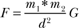

其中*F*是引力，*m*[1]是物体 1 的质量，*m*[2]是物体 2 的质量，*d*是物体之间的距离，*G*是引力常数（6.674 × 10^(–11) *N* · *m*² · kg^(–2)）。

两个物体会根据它们的质量乘积与它们之间距离的平方之比相互作用。因此，当物体靠得很近时，引力会更强，就像保龄球下方床垫的深凹。举个例子，一个 220 磅（100 公斤）的人在珠穆朗玛峰上的体重比在海平面时轻半磅多，因为他距离地球中心近了 8,848 米。（假设地球的质量为 5.98 × 10²⁴公斤，海平面距离地球中心为 6.37 × 10⁶米。）

今天，我们通常将引力视为一个*场*—就像保龄球床垫类比中的床垫—而不是牛顿的吸引点。这个场仍然用牛顿定律定义，并导致*加速度*，通常以米/秒²表示。

根据牛顿的第二运动定律，力等于质量×加速度。你可以通过将引力方程改写为以下形式，来计算物体 1（*m*[1]）对物体 2（*m*[2]）施加的力：

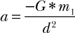

其中 *a* = 加速度，*G* 是引力常数，*m*[1] 是其中一个物体的质量，*d* 是物体之间的距离。力的方向是从物体 2 指向物体 1 的质心（*m*[1]）。

小物体对大物体的引力通常被忽略。例如，一个质量为 1000 千克的卫星对火星施加的引力约为火星对卫星施加引力的 1.6 × 10^(–21) 倍！因此，在你的模拟中，你可以安全地忽略卫星的质量。

**注意**

*作为本项目的简化，距离是从物体的质心计算的。在现实中，绕行卫星会由于行星的形状、地形、地壳密度等变化而经历微妙的引力加速度变化。根据* 《大英百科全书》*，这些变化导致地球表面的引力加速度变化约为 0.5%。*

#### ***开普勒行星运动定律***

1609 年，天文学家约翰·开普勒发现行星的轨道是椭圆形的，这使他能够解释和预测行星的运动。他还发现，太阳与绕行行星之间画出的线段在相等的时间间隔内扫过相等的面积。这一观点被称为开普勒行星运动第二定律，示意图在 图 14-1 中展示，其中展示了行星在其轨道上的不同位置。

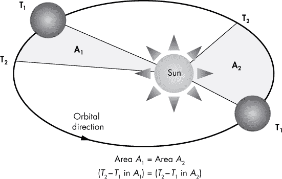

*图 14-1：开普勒行星运动第二定律：行星靠近太阳时轨道速度增加。*

这一定律适用于所有天体，这意味着当绕行一个天体时，物体会在接近该天体时加速，而在远离时减速。

#### ***轨道力学***

绕行基本上是永远自由下落。你正在掉入一个行星的引力井——位于它的核心——但是你的切向速度足够快，以至于你不断错过行星（参见 图 14-2）。只要你平衡好你的动量和引力，轨道将永远不会结束。

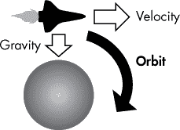

*图 14-2：当航天器的速度使其“自由下落”绕行天体时，便达成了轨道。*

当你在太空的真空中绕行一个行星时，有些反直觉的现象可能发生。由于没有摩擦或风阻，航天器可能会表现出意想不到的方式。

##### **向后飞行**

如果你曾看过《星际迷航》的一集，可能注意到环绕行星的*企业号*似乎像汽车绕过赛道一样，巧妙地绕过行星。这种做法确实是可能的——而且看起来也非常酷——但这需要消耗宝贵的燃料。如果没有必要让航天器的某一特定部分持续对准行星，那么航天器的鼻部就会始终指向同一方向，直到完成整个轨道。因此，在每次轨道运动中，航天器会有一些时刻看起来像是飞向相反方向（参见图 14-3）。

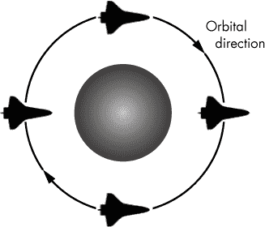

*图 14-3：航天器在轨道中保持相同的姿态，除非被强制改变。*

你可以将这归咎于牛顿及其惯性定律，该定律表明，静止的物体会保持静止，运动的物体会以相同的速度和方向保持运动，除非受到不平衡的外力作用。

##### **提升和降低轨道**

在太空中刹车是行不通的，因为没有摩擦力，惯性可是很强大的。要降低航天器的轨道，你必须使用推进器减速，让航天器进一步掉入行星的引力坑。为了做到这一点，你必须让航天器*逆行*，使其鼻部朝向与当前速度向量相反的方向——简而言之，你得让航天器尾部朝前飞行。当然，这假设主推进器位于航天器的尾部。相反，如果你想提升轨道，你就必须*顺行*航天器，使其鼻部朝向你旅行的方向。这两个概念在图 14-4 中展示。

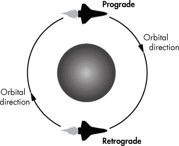

*图 14-4：顺行与逆行是通过航天器的鼻部相对于其绕行天体的运动方向来定义的。*

##### **采取内侧轨道**

如果你正在追赶一艘在轨道上的航天器，你是加速还是减速来追上它？根据开普勒的第二定律，你应该减速。这会降低你的轨道，导致更快的轨道速度。就像赛马一样，你想要采取内侧轨道。

在图 14-5 的左侧，两架航天飞机并排处于几乎相同的轨道上，且以相同的速度飞行。

*图 14-5：轨道悖论：减速以加速！*

靠近行星的航天飞机旋转 180 度，进行逆行推力以减缓其瞬时速度。外侧的航天飞机则进行顺行推力，以增加其瞬时速度。它们同时停止推力，内侧的航天飞机下降到更低的轨道，而外侧的航天飞机转入更高的轨道。大约一个小时后，由于内侧航天飞机距离行星更近，其速度大大加快，并成功赶超并超过外侧航天飞机。

##### **圆形化椭圆轨道**

你可以通过在*远地点*或*近地点*施加发动机脉冲，将高度椭圆轨道转为圆形轨道，这取决于具体情况。远地点（如果物体绕地球运行，则称为*远地点*）是椭圆轨道中最高的点——即物体距离其轨道中心最远的点（见图 14-6）。近地点（如果物体绕地球运行，则称为*近地点*）是轨道中最低的点。

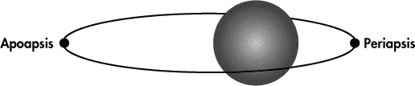

*图 14-6：椭圆轨道中远地点和近地点的位置*

要升高近地点，宇航器在远地点执行顺行推力（参见图 14-7 左侧）。为了在环形化的同时降低轨道，宇航器必须在近地点执行逆行推力（参见图 14-7 右侧）。

这个操作中一个有些反直觉的部分是，初始轨道——即原本会存在的轨道——与最终轨道（实际轨道）会在发动机脉冲施加的点相交。

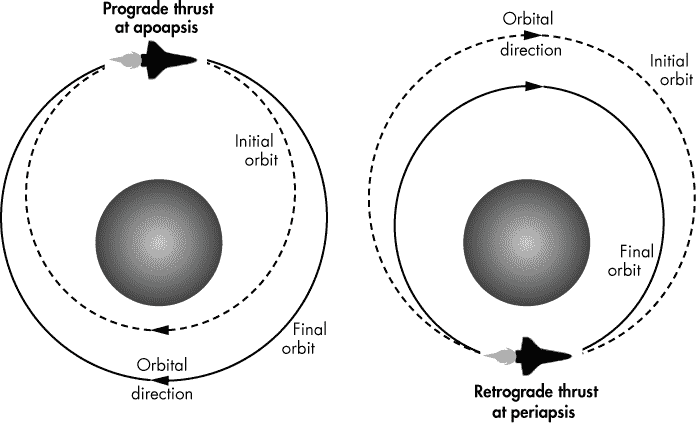

*图 14-7：在远地点升高并环形化轨道（左）与在近地点降低并环形化轨道（右）*

##### **使用霍曼转移轨道升高和降低轨道**

*霍曼转移轨道*使用椭圆轨道在同一平面内切换两个圆形轨道（见图 14-8）。轨道可以升高或降低。该操作相对较慢，但消耗的燃料最少。

要改变一个轨道，使其具有不同的近地点*和*远地点，宇航器需要两次发动机脉冲。一脉冲将宇航器推入转移轨道，另一脉冲则将其推入最终的目的轨道。当升高轨道时，宇航器将在运动方向上施加速度变化；而当降低轨道时，速度变化则是施加在与运动方向相反的方向上。速度变化必须发生在轨道的对侧，如图 14-8 所示。如果没有第二次推力，轨道仍会在第一次推力点相交，如图 14-7 右侧所示。

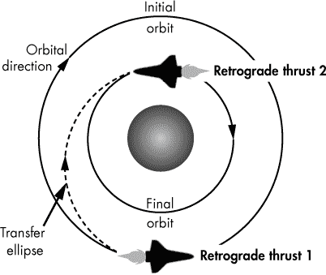

*图 14-8：使用霍曼转移技术转移至较低的圆形轨道*

##### **使用单切线燃烧升高和降低轨道**

*单切线燃烧*技术比霍曼转移轨道更快速，但效率较低，用于在轨道之间快速转换。*燃烧*只是推力或脉冲的另一种术语。与霍曼转移轨道相同，轨道可以升高或降低。

该机动需要两次引擎脉冲，第一次是切向轨道，第二次是非切向的（参见图 14-9）。如果初始轨道是圆形的，如图所示，那么轨道上的所有点既代表远地点也代表近地点，航天器可以在任何时候进行第一次燃烧。

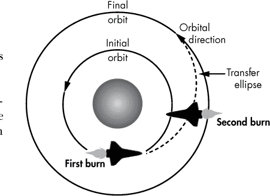

*图 14-9：通过单一切向燃烧转移至更高的圆形轨道*

就像霍曼转移一样，顺行燃烧会提高轨道，而反向燃烧则会降低轨道。如果轨道是椭圆形的，第一次燃烧将在远地点进行顺行燃烧以提高轨道，或在近地点进行反向燃烧以降低轨道。

##### **通过螺旋转移执行螺旋轨道**

*螺旋转移*利用持续的低推力燃烧来改变轨道的大小。在游戏中，你可以通过反向或顺行燃烧来模拟这一过程，这些燃烧是短暂的并且间隔均匀，如图 14-10 所示。

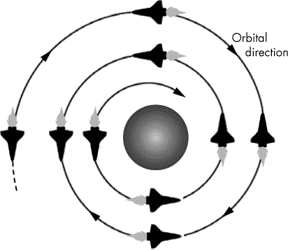

*图 14-10：通过定期间隔的短暂反向燃烧执行螺旋轨道*

要降低轨道，所有的燃烧必须是反向燃烧；要提高轨道，航天器则使用顺行燃烧。

##### **执行同步轨道**

在*同步轨道*中，航天器绕行一个行星的公转周期与该行星自转周期相同。如果同步轨道与赤道平行，且没有轨道倾斜角，它就是*静止轨道*；对绕行天体上的观察者来说，卫星在天空中看起来是静止的，位置固定。通信卫星常使用*静止轨道*，其高度为地球周围 22,236 英里。类似的轨道在火星上被称为*aerostationary*轨道，在月球上被称为*selenostationary*轨道。

### **项目 #22：火星轨道器游戏**

在现实中，一系列方程被用来精确执行轨道机动。在游戏中，你将依靠直觉、耐心和反应！你还需要在一定程度上依靠仪表飞行，主要使用航天器的高度读数和轨道圆形度的测量。

**目标**

使用 pygame 构建一款教授轨道力学基础的街机游戏。游戏的目标是将卫星推入一个圆形的映射轨道，而不耗尽燃料或在大气层中燃烧殆尽。

### **策略**

从游戏草图设计阶段开始，就像在第十三章中做的那样。这个草图应当捕捉游戏的所有关键点，如游戏的外观、声音、物体的运动方式以及游戏如何与玩家进行互动（参见图 14-11）。

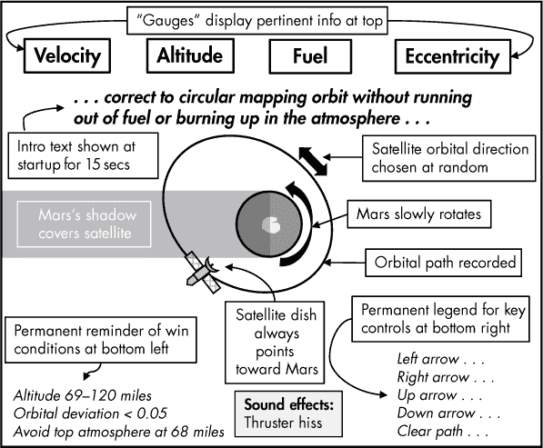

*图 14-11：火星轨道器游戏的主要玩法草图*

图 14-11 中的示意图描述了主要的游戏玩法。你需要一个单独的示意图来描述胜负条件。对于主要的游戏玩法，关键点是：

+   **视角是任务控制中心。** 游戏画面应该像任务控制中心的显示器，玩家可以通过它操作出轨的太空探测器。

+   **火星位于屏幕的正中央。** 大家都喜欢红色星球，所以它将占据漆黑屏幕的中央位置。

+   **火星是动态的。** 火星的地球仪会缓慢围绕其轴旋转并投下阴影。卫星在经过阴影时会明显变暗。

+   **卫星的初始轨道是随机选择的。** 卫星在启动时会以随机但受限制的方位和速度出现。偶尔，这可能会导致即时的游戏失败。但这比实际任务要好，因为实际任务有 47%的失败率！

+   **不需要调整卫星的轨道方向。** 在发射推进器之前不断旋转太空探测器会极大地减少游戏的趣味性。假设姿态推进器围绕机身排列，玩家可以使用箭头键选择要发射的推进器。

+   **发射推进器会产生可听的嘶嘶声。** 尽管太空中没有声音，但每当玩家发射推进器时，会给玩家带来听到嘶嘶声的满足感。

+   **卫星的天线始终指向火星。** 卫星会缓慢自动旋转，使其遥感天线始终指向火星。

+   **卫星的轨道路径是可见的。** 一条细白线将从卫星后方延伸出来，并在玩家按下空格键清除之前持续显示。

+   **数据读数位于屏幕顶部。** 你将把对游戏玩法有用的信息显示在屏幕顶部的框中。关键信息包括太空探测器的速度、海拔、高度和轨道偏心率（即轨道的圆形度度量）。

+   **启动时会显示简短的介绍。** 游戏开始时，屏幕中央会显示介绍文本，持续约 15 秒。该文本不会干扰游戏玩法，玩家可以立即开始操控卫星。

+   **胜利条件和关键控制显示在永久的图例中。** 关键信息，如任务目标和控制键，将永久显示在屏幕的左下角和右下角。

图 14-12 中的游戏示意图描述了成功和失败的情况。玩家在获胜时需要奖励，而在失败时则需要一个有趣的结果。

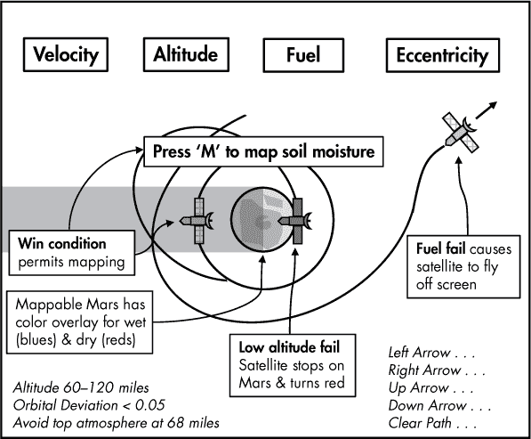

*图 14-12：火星探测器游戏中胜利与失败结果的游戏示意图*

胜利和失败的结果中，关键点是：

+   **为坠毁和烧毁更换卫星图像。** 如果卫星的高度下降到 68 英里以下，它将在大气中燃烧。运动中的卫星图像将被一个发红的版本所替代，固定在火星的旁边，这类似于你在真实的任务控制显示器上可能看到的情形。

+   **如果卫星燃料耗尽，它将在太空中失联。** 尽管这不太现实，但如果卫星燃料耗尽，就让它飞出屏幕，进入深空。这样真的能让玩家意识到失败的后果！

+   **胜利条件解锁奖励。** 如果卫星在目标高度范围内成功进入圆形轨道，新的文本将提示玩家按下 M 键。

+   **按下 M 键可以更改火星图像。** 当 M 键解锁后，按下它会使火星图像变成彩虹图像，其中冷色代表土壤湿度较高的区域，暖色则代表干燥的区域。

对于游戏玩法，卫星的大小和轨道速度不会非常现实，但整体行为是正确的。你应该能够正确执行在《游戏者的天体力学》书中第 286 页所描述的所有轨道操作。

### **游戏资源**

你将需要为火星轨道器游戏准备两张卫星图像、两张行星图像和一个音频文件。你可以在过程开始时一次性准备这些资源，或者在需要时再去构建。后者的方式可以让你在编码过程中间歇休息，这也是一些人喜欢的方式。

寻找好的、免版权的图像和音频文件可能是个挑战。你可以在线找到合适的资源——要么是免费的，要么是收费的——但最好在可能的情况下自己制作。这样可以避免将来出现任何法律问题。

我为这个项目使用的精灵（2D 图标或图像）如图 14-13 所示。你需要一张卫星图像、一张“燃烧”后的卫星图像、一张中心为极地冠的火星图像，以及同一视角下带有彩色覆盖层的火星图像，这个覆盖层将表示映射的土壤湿度渐变。我是在免费的图标网站 AHA-SOFT 上找到卫星图像的（* [`www.aha-soft.com/`](http://www.aha-soft.com/) *），然后复制并重新着色，制作了坠毁后的版本。两张火星图像都是 NASA 的图像，并经过修改以适应游戏。

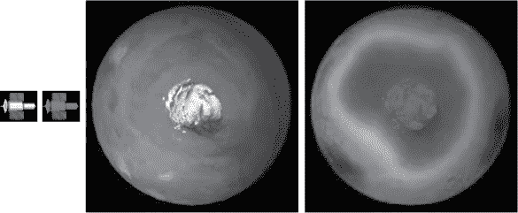

*图 14-13：作为游戏精灵使用的卫星、坠毁的卫星、火星和火星覆盖图像*

我为卫星发射推进器时制作了一个声音文件，使用开源程序 Audacity 中的白噪声生成器。你可以在*[`www.audacityteam.org/`](https://www.audacityteam.org/)*下载 Audacity 的免费版本。我将文件保存为*Ogg Vorbis*格式，这是一种开源标准的音频压缩格式，免费且与 Python 和 pygame 兼容。你也可以使用其他格式，如 MP3 和 WAV，在 pygame 中也可以，但某些格式可能存在已知问题，或者包含专有组件，如果你尝试商业化游戏，可能会引发法律问题。

你可以从本书网站下载这些文件，文件名分别为*satellite.png*、*satellite_crash_40x33.png*、*mars.png*、*mars_water.png* 和 *thrust_audio.ogg*。下载时，请保留文件名，并将这些文件保存在与代码相同的文件夹中。

### **代码**

图 14-14 是你将要构建的最终游戏画面的示例。你可以参考这个图像，了解代码的作用。

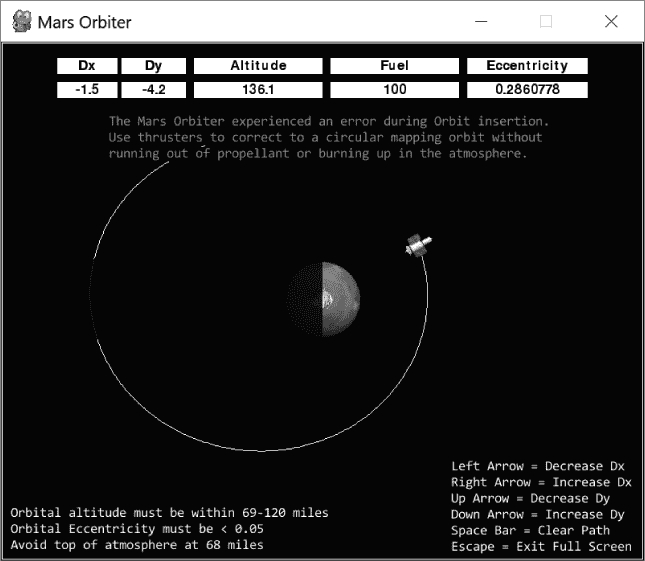

*图 14-14：mars_orbiter.py 最终版本的示例启动游戏画面*

你可以在*[`www.nostarch.com/impracticalpython/`](https://www.nostarch.com/impracticalpython/)*下载完整程序(*mars_orbiter.py*)。

#### ***导入并构建颜色表***

列表 14-1 导入了所需的模块并构建了颜色表。

*mars_orbiter.py,* 第一部分

➊ import os

import math

import random

import pygame as pg

➋ WHITE = (255, 255, 255)

BLACK = (0, 0, 0)

RED = (255, 0, 0)

GREEN = (0, 255, 0)

LT_BLUE = (173, 216, 230)

*列表 14-1：导入模块并构建颜色表*

首先，导入操作系统模块，指定为 os ➊。游戏将以全屏模式启动，但玩家将有退出全屏的选项。这个模块将允许你在玩家按下 ESC 后控制游戏窗口的位置。

你将使用 math 模块进行重力和三角计算，并使用 random 来让卫星以随机位置和速度开始。像在第十三章中一样，导入 pygame，使用 pg 而不是 pygame 以减少输入。

完成后，像在第十三章中一样构建 RGB 颜色表 ➋。这样，当你需要分配其中一种颜色时，可以直接输入颜色名称，而不是 RGB 值元组。

#### ***定义卫星类的初始化方法***

列表 14-2 定义了 Satellite 类及其初始化方法，你将在游戏中使用该方法实例化卫星对象。由于这个方法定义较长，因此分成了两个列表展示。

*mars_orbiter.py,* 第二部分

➊ class Satellite(pg.sprite.Sprite):

"""卫星物体旋转以面向行星并发生碰撞与爆炸。"""

➋ def __init__(self, background):

➌ super().__init__()

➍ self.background = background

➎ self.image_sat = pg.image.load("satellite.png").convert()

self.image_crash = pg.image.load("satellite_crash_40x33.png").convert()

➏ self.image = self.image_sat

➐ self.rect = self.image.get_rect()

➑ self.image.set_colorkey(BLACK)  # 设置透明色

*列表 14-2：定义卫星* 类初始化方法的第一部分*

定义一个卫星对象类 ➊；如果你需要回顾面向对象编程的概念，可以阅读第十一章。将 pygame 的 Sprite 类传给它，因为从卫星类实例化的对象将是精灵。如第十三章中所述，Sprite 是一个内建类，作为创建精灵的模板。你的新类将从这个基类继承精灵所需要的特性。这些特性包括像 rect 和 image 这样的关键属性，稍后你会处理它们。

然后，定义卫星对象的 __init__()方法 ➋，并将 self 传递给它，self——根据惯例——是类定义中一个特殊的名称，表示当前对象。你还需要传递给方法一个背景对象。卫星的路径将在该对象上绘制。

在 __init_()方法内部，立即使用 super 调用内建 Sprite 类的初始化方法 ➌。这将初始化精灵并建立它所需要的 rect 和 image 属性。使用 super 时，你无需明确提到基类（Sprite）。更多关于 super 的内容，请参见列表 11-5 中的第 229 页，或者访问文档中的* [`docs.python.org/3/library/functions.html?highlight=super#super`](https://docs.python.org/3/library/functions.html?highlight=super#super)*。

接下来，将背景分配给 self 作为对象属性 ➍。然后，使用 pygame 的 image.load()方法加载你的两张卫星图像——一张是正常的，一张是摔毁的——并在同一步骤中，调用 convert()方法对它们进行处理 ➎。这会将对象转换为 pygame 可以高效使用的图形格式，一旦游戏循环开始。这一步骤是必要的，否则游戏可能会明显变慢，因为 png 格式会在每秒 30 次以上的频率下被实时转换。

你一次只会使用其中一张卫星图像，取决于玩家是否在大气层中被烧毁，因此使用一个通用的 self.image 属性来保存加载并转换后的图像 ➏。未烧毁的卫星图像将是默认图像；如果卫星对象接近火星，它将被红色摔毁图像替代。

现在，获取图像的矩形信息 ➐。记住，pygame 将精灵放置在矩形表面对象上，并且它需要知道这些矩形的尺寸和位置，以便在游戏运行时使用。

最后，使卫星图像的黑色部分不可见 ➑。卫星图标位于黑色背景上（参见图 14-13），你希望碰撞并燃烧后的图像部分显示在火星上，所以使用 BLACK 常量配合图像对象的 colorkey()方法来使图标的背景透明。否则，你会看到一个带有红色卫星的黑色框，重叠在红色星球上。请注意，如果你想输入黑色的 RGB 等效值，需要将其输入为一个元组：(0, 0, 0)。

#### ***设置卫星的初始位置、速度、燃料和声音***

清单 14-3 完成了卫星类初始化方法的定义。卫星对象的初始位置和速度是从一个有限的范围中随机选择的；遥感天线的方向被初始化，燃料箱已填满，并且添加了声音效果。

*mars_orbiter.py,* 第三部分

➊ self.x = random.randrange(315, 425)

self.y = random.randrange(70, 180)

➋ self.dx = random.choice([-3, 3])

➌ self.dy = 0

➍ self.heading = 0  # 初始化遥感天线的方向

➎ self.fuel = 100

self.mass = 1

self.distance = 0  # 初始化卫星与行星之间的距离

➏ self.thrust = pg.mixer.Sound('thrust_audio.ogg')

➐ self.thrust.set_volume(0.07)  # 有效值为 0-1

*清单 14-3：通过初始化参数* 卫星 *类的初始化方法完成*

当游戏开始时，卫星将出现在屏幕顶部附近的一个随机位置。你将从一系列的 x 和 y 值中选择确切的位置 ➊。

你还将随机选择卫星的速度，但速度会慢到足以让卫星无法逃脱轨道。将速度随机设置为-3 或 3。负值表示逆时针轨道，反之则顺时针。只使用 delta-x（dx）属性 ➋，并让 gravity 处理 dy。如第十三章中讨论的，pygame 通过 x 位置的增量变化（称为 delta-x 或*dx*）和 y 位置的增量变化（称为 delta-y 或*dy*）来移动精灵。这些向量分量会在每个游戏循环中计算并添加到精灵的当前位置信息（self.x, self.y）。

接下来，将 dy 属性设置为 0 ➌。稍后，gravity()方法将在加速新实例化的卫星向下朝着行星移动时设置初始的 dy 值。

为卫星的方向分配一个属性 ➍。遥感天线应始终指向火星，如果你还记得图 14-3，除非克服惯性，否则天线不会指向火星。你将使用一个方法来旋转卫星，所以现在只需将 heading 属性初始化为 0。

现在，给燃料箱加满 100 单位的燃料 ➎。要是想与现实生活挂钩，这可能代表 100 公斤的肼，类似于用于*麦哲伦*探测器上绘制金星的燃料。

接下来，将物体的质量设置为 1。这基本上意味着你将只在引力方程中使用火星的质量，因为你将两个物体的质量相乘。如前所述，卫星对火星的引力可以忽略不计，所以你无需计算它。卫星的质量属性是为了完整性，并作为占位符，以防你以后想要尝试不同的值。

以下距离属性存储卫星与其环绕的天体之间的距离。实际值将在稍后定义的方法中计算。

该是添加音效的时候了。你将在 main() 函数中初始化 pygame 的音频混音器，但现在，先为推进音效命名一个 thrust 属性 ➏。将混音器的 Sound 类传入 Ogg Vorbis 格式 (*.ogg*) 的短小白噪音片段。最后，设置播放音量，使用 0 到 1 之间的值 ➐。你可能需要根据自己的 PC 进行调整。理想情况下，你希望值能让每个玩家至少能*听见*，然后再通过他们自己计算机的音量控制进行微调。

#### ***发射推进器并检查玩家输入***

列表 14-4 定义了 Satellite 类的 thruster() 和 check_keys() 方法。第一个确定当卫星的推进器之一被激活时的操作。第二个检查玩家是否通过按箭头键与推进器互动。

*mars_orbiter.py*，第四部分

➊ def thruster(self, dx, dy):

"""执行与发射推进器相关的操作。"""

➋ self.dx += dx

self.dy += dy

➌ self.fuel -= 2

➍ self.thrust.play()

➎ def check_keys(self):

"""检查用户是否按下箭头键并调用 thruster() 方法。"""

➏ keys = pg.key.get_pressed()

# 火箭推进器

➐ if keys[pg.K_RIGHT]:

➑ self.thruster(dx=0.05, dy=0)

elif keys[pg.K_LEFT]:

self.thruster(dx=-0.05, dy=0)

elif keys[pg.K_UP]:

self.thruster(dx=0, dy=-0.05)

elif keys[pg.K_DOWN]:

self.thruster(dx=0, dy=0.05)

*列表 14-4：为* Satellite *类定义了* thruster() *和* check_keys() *方法*

thruster() 方法接受 self、dx 和 dy 作为参数 ➊。最后两个参数可以是正值或负值，它们会立即加到卫星的 self.dx 和 self.dy 速度分量上 ➋。接下来，燃料水平减少两个单位 ➌。修改这个值是让游戏变得更难或更简单的一种方式。最后，通过调用 thrust 音频属性的 play() 方法来播放嘶嘶声 ➍。注意，OOP 方法不是*返回*值，而是*更新*现有的对象属性。

check_keys()方法以 self 作为参数 ➎。首先，使用 pygame 的键盘模块来确定玩家是否按下了某个键 ➏。get_pressed()方法返回一个布尔值的元组—1 表示 True，0 表示 False—表示每个键在键盘上的当前状态。True 意味着该键已被按下。你可以使用键常量来索引此元组。你可以在*[`www.pygame.org/docs/ref/key.html`](https://www.pygame.org/docs/ref/key.html)*中找到所有键盘常量的列表。

例如，右箭头键是 K_RIGHT。如果这个键已经被按下 ➐，调用 thruster()方法并传递 dx 和 dy 值 ➑。在 pygame 中，x 值向屏幕右侧增加，y 值向屏幕底部增加。因此，如果用户按下左箭头键，dx 值会减少；同样，如果按下上箭头键，dy 值会减小。右箭头键会增加 dx，向下箭头键会增加 dy。屏幕顶部的读数将帮助玩家将卫星的移动与底层的 dx 和 dy 值对应起来（参见图 14-14）。

#### ***定位卫星***

仍然在 Satellite 类中，清单 14-5 定义了 locate()方法。该方法计算卫星与行星之间的距离，并确定指向行星的天线方位角。稍后在计算重力和*偏心率*时，你会使用 distance 属性。偏心率是衡量轨道偏离完美圆形的程度。

*mars_orbiter.py,* 第五部分

➊ def locate(self, planet):

"""计算到行星的距离和方位角。"""

➋ px, py = planet.x, planet.y

➌ dist_x = self.x - px

dist_y = self.y - py

# 获取指向行星的方向以指向天线

➍ planet_dir_radians = math.atan2(dist_x, dist_y)

➎ self.heading = planet_dir_radians * 180 / math.pi

➏ self.heading -= 90  # 精灵正尾部朝前行驶

➐ self.distance = math.hypot(dist_x, dist_y)

*清单 14-5：为* Satellite *类定义了 locate()方法*

要定位卫星，你需要将卫星（self）和行星对象传递给 locate()方法 ➊。首先，确定两个对象在 x-y 空间中的距离。获取行星的 x 和 y 属性 ➋；然后从卫星的 x 和 y 属性中减去它们 ➌。

现在，使用这些新的距离变量来计算卫星的航向与行星之间的角度，以便将卫星天线指向行星。数学模块使用弧度，所以创建一个名为 planet_dir_radians 的局部变量来保存该方向，并将 dist_x 和 dist_y 传递给 math.atan2()函数来计算反正切 ➍。由于 pygame 使用的是角度（唉），你需要使用标准公式将弧度转换为角度；或者，你也可以使用数学模块来实现这一点，但有时看到“幕后的人”也是很有意思的 ➎。这个值应该是卫星对象的一个可共享属性，所以命名为 self.heading。

在 pygame 中，精灵的前方默认朝东，这意味着卫星精灵是尾部先行轨道（参见图 14-13 中的卫星图标）。为了让天线指向火星，你需要从航向角度中减去 90 度，因为在 pygame 中，负角度会导致*顺时针*旋转 ➏。此操作不会消耗玩家的燃料配额。

最后，使用数学模块计算卫星与火星之间的欧几里得距离，通过 x 和 y 分量计算斜边 ➐。你应该将其作为卫星对象的一个属性，因为你稍后将在其他函数中使用它。

**注意**

*在现实生活中，有多种方法可以让卫星的天线指向行星而不消耗大量燃料。这些技术包括缓慢翻转或旋转卫星、让天线端比另一端重、使用磁力矩，或使用内部飞轮——也称为反应轮或动量轮。飞轮使用电动机，可以由太阳能电池板提供电力，从而避免了使用沉重和有毒的液体推进剂。*

#### ***旋转卫星并绘制其轨道***

清单 14-6 通过定义使卫星天线指向行星和绘制卫星后方轨迹的方法，继续扩展了 Satellite 类。稍后，在 main()函数中，你将添加代码，允许玩家通过按空格键擦除并重新开始轨迹。

*mars_orbiter.py,* 第六部分

➊ def rotate(self):

"""通过角度旋转卫星，使天线朝向行星。"""

➋ self.image = pg.transform.rotate(self.image_sat, self.heading)

➌ self.rect = self.image.get_rect()

➍ def path(self):

"""更新卫星的位置并绘制一条线以追踪轨道路径。"""

➎ last_center = (self.x, self.y)

➏ self.x += self.dx

self.y += self.dy

➐ pg.draw.line(self.background, WHITE, last_center, (self.x, self.y))

*清单 14-6：定义了* rotate() *和* path() *方法的* Satellite *类*

rotate()方法将使用你在 locate()方法中计算的 heading 属性，来将卫星天线转向火星。将 self 传递给 rotate() ➊，这意味着 rotate()在被调用时会自动将卫星对象的名称作为参数。

现在，使用 pygame 的 transform.rotate() 方法旋转卫星图像 ➋。传入原始图像和方向属性；将这些赋值给 self.image 属性，以便不破坏原始的主图像。你需要在每次游戏循环中转换图像，而快速转换图像会使其质量下降。因此，始终保留一张主图像，并在每次进行转换时操作一份新的副本。

通过获取转换后的图像的矩形对象 ➌ 来结束函数。

接下来，定义一个名为 path() 的方法并传入 self ➍。此方法将绘制一条标记卫星路径的线，由于绘制线段需要两个点，因此在移动卫星之前，要先为卫星的中心位置分配一个变量并记录为元组 ➎。然后，使用 dx 和 dy 属性递增 x 和 y 坐标 ➏。最后，使用 pygame 的 draw.line() 方法定义这条线 ➐。该方法需要一个绘图对象，因此传入背景属性，接着是线的颜色以及先前和当前的 x-y 坐标元组。

#### ***更新卫星对象***

列表 14-7 更新了卫星对象并完成了类的定义。Sprite 对象几乎总是有一个 `update()` 方法，该方法在游戏运行时每帧调用一次。任何发生在精灵上的事情，例如移动、颜色变化、用户交互等，都包含在这个方法中。为了避免方法过于混乱，`update()` 方法通常会调用其他方法。

*mars_orbiter.py,* 第七部分

➊ def update(self):

"""在游戏中更新卫星对象。"""

➋ self.check_keys()

➌ self.rotate()

➍ self.path()

➎ self.rect.center = (self.x, self.y)

# 如果在大气层内，则将图像更改为火红色

➏ 如果 self.dx == 0 且 self.dy == 0：

self.image = self.image_crash

self.image.set_colorkey(BLACK)

*列表 14-7：为* Satellite *类定义了* update() *方法*

首先，定义 `update()` 方法并传入对象，或者是 self ➊。接下来，调用之前定义的方法。第一个方法检查玩家通过键盘进行的交互 ➋。第二个方法旋转卫星对象，使得天线始终指向行星 ➌。最后一个方法更新卫星的 x-y 坐标，并绘制一条路径在其后面，以便你可以可视化轨道 ➍。

程序需要跟踪卫星精灵的位置，随着其围绕火星轨道运行，因此要分配一个 rect.center 属性并将其设置为卫星的当前 x-y 坐标 ➎。

最后这段代码会改变卫星图片，假设玩家在大气层中发生了撞击 ➏。火星大气层的顶部距离*表面*大约 68 英里。出于我稍后会解释的原因，假设 68 的高度值——这是从*行星中心*测量的像素值——等同于大气层的顶部。如果卫星在游戏过程中下降到这个高度以下，main()函数会将它的速度——由 dx 和 dy 表示——设置为 0。检查这两个值是否都为 0，如果是，就将图片更改为 image_crash，并将其背景设置为透明（就像你之前对主要卫星图片所做的那样）。  

#### ***定义 Planet 类的初始化方法***  

清单 14-8 定义了 Planet 类，你将用它来实例化一个行星对象。  

*mars_orbiter.py，* 第八部分  

➊ class Planet(pg.sprite.Sprite):  

"""旋转并投射重力场的行星对象。"""  

➋ def __init__(self):  

super().__init__()  

➌ self.image_mars = pg.image.load("mars.png").convert()  

self.image_water = pg.image.load("mars_water.png").convert()  

➍ self.image_copy = pg.transform.scale(self.image_mars, (100, 100))  

➎ self.image_copy.set_colorkey(BLACK)  

➏ self.rect = self.image_copy.get_rect()  

self.image = self.image_copy  

➐ self.mass = 2000  

➑ self.x = 400  

self.y = 320

self.rect.center = (self.x, self.y)  

➒ self.angle = math.degrees(0)  

self.rotate_by = math.degrees(0.01)  

*清单 14-8：开始定义* Planet *类*  

你现在可能已经非常熟悉创建 Planet 类的初始步骤了。首先，你用大写字母命名类，然后传递给 Sprite 类，这样它就能方便地从这个内建的 pygame 类继承特性 ➊。接着，你为行星对象定义一个 __init__()，或者初始化方法 ➋。然后你调用 super()初始化方法，就像在 Satellite 类中做的那样。  

加载图片作为属性并同时转换为 pygame 的图形格式 ➌。你需要使用普通的火星图片和映射土壤湿度的图片。你能够使用卫星精灵的原始大小，但火星图片太大。将图片缩放到 100 像素 × 100 像素 ➍，并将缩放后的图片赋给一个新的属性，这样重复的变换就不会损坏原始图片。  

现在，将变换后的图片的透明色设置为黑色，和之前设置卫星图片时一样 ➎。pygame 中的精灵都“挂载”在矩形表面上，如果不让黑色透明，行星表面的角落可能会重叠并遮盖卫星绘制的白色轨道路径（见图 14-15）。  

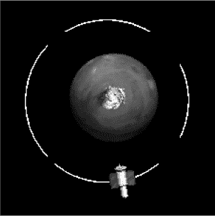  

*图 14-15：火星* rect *角落遮盖轨道路径*  

和往常一样，获取精灵的 rect 对象 ➏。接下来有一个变换需要进行，所以再次复制图片属性，并将其赋予一个逻辑名称 self.image。  

为了应用重力，行星需要质量，因此命名一个 mass 属性，并将其值设为 2000 ➐。之前，你为卫星分配了 1 的质量；这意味着火星的质量只是卫星的 2000 倍！没关系，因为你并不是在使用真实世界的单位，时间和距离的尺度与现实不同。如果你缩放距离，使卫星距离火星只有几百像素，你还需要缩放重力。尽管如此，卫星仍会在重力作用下表现得非常真实。

行星的质量值是通过实验确定的。为了缩放重力，你可以稍后改变这个质量值，或者使用重力常数（G）变量。

将行星对象的 x 和 y 属性设置为屏幕的中心点——你将在 main()函数中使用 800 × 645 的屏幕尺寸——并将这些值分配给 rect 对象的中心 ➑。

最后，分配你需要的属性，以便慢慢旋转火星绕其轴心 ➒。你将使用与旋转卫星相同的 transform.rotate()方法，因此你需要创建一个角度属性。然后，使用 rotate_by 属性分配增量——以度为单位——表示每次游戏循环中该旋转角度的变化。

#### ***旋转行星***

清单 14-9 通过定义其 rotate()方法继续 Planet 类。此方法使行星绕其轴心旋转，在每个游戏循环中进行小幅变化。

*mars_orbiter.py,* 第九部分

➊ def rotate(self):

"""在每次游戏循环中旋转行星图像。"""

➋ last_center = self.rect.center

➌ self.image = pg.transform.rotate(self.image_copy, self.angle)

self.rect = self.image.get_rect()

➍ self.rect.center = last_center

➎ self.angle += self.rotate_by

*清单 14-9：定义一个方法来旋转行星绕其轴心*

rotate()方法也接受对象作为参数 ➊。随着方形火星图像的旋转，边界矩形对象（rect）保持不动，并且必须扩展以适应新的配置（见图 14-16）。尺寸的变化可能会影响 rect 的中心点，因此需要分配一个 last_center 变量，并将其设置为行星的当前中心点 ➋。如果不这样做，火星将在游戏运行时围绕其轴心晃动。

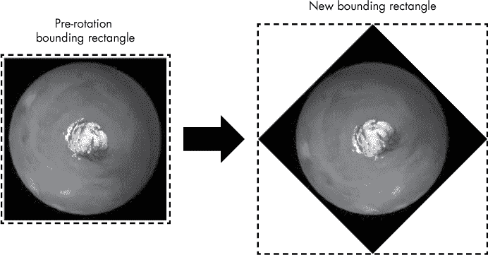

*图 14-16：边界矩形的尺寸变化，以适应旋转的图像。*

接下来，使用 pygame 的 transform.rotate()方法旋转复制的图像，并将其分配给 self.image 属性 ➌；你需要将复制的图像和角度属性传递给该方法。旋转后，立即重置图像的 rect 属性，并将其中心位置恢复为 last_center，以减少旋转过程中可能发生的 rect 偏移 ➍。

当行星对象实例化时，角度属性将从 0 度开始，然后每帧增加 0.1——通过 rotate_by 属性分配 ➎。

#### ***定义 gravity()和 update()方法***

列表 14-10 通过定义 gravity()和 update()方法完成了 Planet 类。在第十三章中，你将重力视为应用于 y 方向的常数。这里使用的方法稍微复杂一些，因为它考虑了两个物体之间的距离。

*mars_orbiter.py，*第十部分

➊ def gravity(self, satellite):

"""计算重力对卫星的影响。"""

➋ G = 1.0  # 游戏中的引力常数

➌ dist_x = self.x - satellite.x

dist_y = self.y - satellite.y

distance = math.hypot(dist_x, dist_y)

# 归一化为单位向量

➍ dist_x /= distance

dist_y /= distance

# 应用重力（dx 和 dy 表示像素/帧）

➎ force = G * (satellite.mass * self.mass) / (math.pow(distance, 2))

➏ satellite.dx += (dist_x * force)

satellite.dy += (dist_y * force)

➐ def update(self):

"""调用 rotate 方法。"""

self.rotate()

*列表 14-10：定义了* gravity() *和* update() *方法的* Planet *类*

定义 gravity()方法，并传入 self 和 satellite 对象 ➊。你仍然在 Planet 类中，因此这里的 self 代表火星。

开始时，命名一个局部变量 G；大写的 G 是*万有引力常数*，也被称为*比例常数* ➋。在现实生活中，这是一个非常小的、经验导出的数字，基本上是一个转换系数，用于使所有单位都能正确运算。由于你在游戏中没有使用现实世界的单位，因此将其设置为 1；这样，它就不会对重力公式产生影响。在游戏开发过程中，你可以微调这个常数，调整重力的强度及其对轨道物体的影响。

你需要知道这两个物体之间的距离，因此首先计算它们在 x 方向和 y 方向的距离 ➌。然后，使用 math 模块的 hypot()方法计算欧几里得距离。这个值将表示重力公式中的*r*。

由于你将直接在重力公式中处理卫星与火星之间的*距离大小*，所以从距离向量中你只需要*方向*。因此，将 dist_x 和 dist_y 除以距离，以“归一化”该向量为一个大小为 1 的单位向量 ➍。你基本上是在将直角三角形的每个边长除以斜边长度。这会保留向量的方向，通过 dist_x 和 dist_y 的相对差异表示，但将其大小设为 1。请注意，如果你不执行此归一化步骤，结果将不现实但非常有趣（请参见图 14-17）。

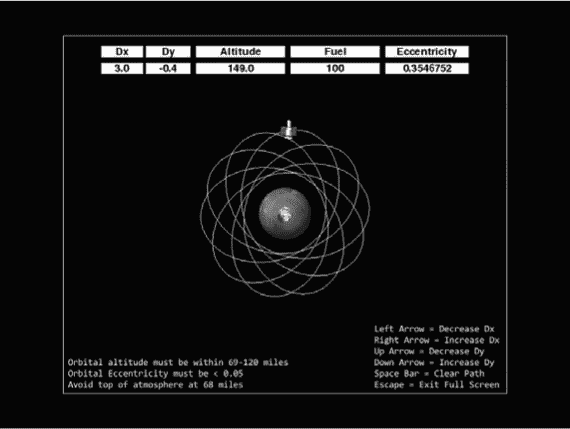

*图 14-17：“Spirograph”轨道，源于使用未归一化的距离向量*

使用牛顿方程计算重力，我在“万有引力定律”中描述了它，见第 286 页 ➎。最后，通过将标准化后的距离乘以力——来计算加速度在每一步中如何改变速度——并将这些量加到卫星对象的 dx 和 dy 属性上 ➏。

注意，你不会将这些变量作为 self 的属性进行赋值。这些只是方法中的中间步骤，不需要与其他方法共享，你可以像在过程式编程中处理局部变量一样处理它们。

最后，定义一个方法，它将在每次游戏循环时调用，以更新行星对象 ➐。使用它来调用 rotate()方法。

#### ***计算离心率***

你已经完成了类的定义。现在是时候定义一些帮助运行游戏的函数了。清单 14-11 定义了一个函数来计算卫星轨道的离心率。玩家需要在一定的高度范围内实现一个圆形轨道，而这个函数将提供圆形度的测量值。

*mars_orbiter.py,* 第十一部分

➊ def calc_eccentricity(dist_list):

"""计算并返回由半径列表得出的离心率。"""

➋ apoapsis = max(dist_list)

periapsis = min(dist_list)

➌ eccentricity = (apoapsis - periapsis) / (apoapsis + periapsis)

return eccentricity

*清单 14-11：定义了一个函数来测量轨道的离心率*

定义 calc_eccentricity()函数，并传入一个距离列表 ➊。在 main()函数中，你将每次游戏循环时都将卫星的距离属性（记录卫星的高度）添加到这个列表中。为了计算离心率，你需要知道轨道的远地点和近地点。通过查找这个列表中的最大值和最小值来获取这些数据 ➋。然后，计算离心率 ➌。最后，在 main()函数中，你将以八位小数的形式显示这个数值，让它看起来更酷、更精确。

注意，圆形轨道的远地点和近地点的数值相同，因此计算结果对于完美的圆形轨道将为 0。函数最后返回离心率变量。

#### ***定义函数以创建标签***

游戏需要大量的文本用于指令和遥测数据输出。逐行显示这些文本可能会导致代码冗余，清单 14-12 将定义两个函数——一个用于显示指令，另一个用于显示你需要与玩家共享的速度、高度、燃料和离心率等数据流。

*mars_orbiter.py,* 第十二部分

➊ def instruct_label(screen, text, color, x, y):

"""接收屏幕、字符串列表、颜色和原点并将文本渲染到屏幕上。"""

➋ instruct_font = pg.font.SysFont(None, 25)

➌ line_spacing = 22

➍ for index, line in enumerate(text):

label = instruct_font.render(line, True, color, BLACK)

screen.blit(label, (x, y + index * line_spacing))

➎ def box_label(screen, text, dimensions):

"""从屏幕、文本以及左上角、宽度、高度生成固定大小的标签。"""

readout_font = pg.font.SysFont(None, 27)

➏ base = pg.Rect(dimensions)

➐ pg.draw.rect(screen, WHITE, base, 0)

➑ label = readout_font.render(text, True, BLACK)

➒ label_rect = label.get_rect(center=base.center)

➓ screen.blit(label, label_rect)

*清单 14-12：定义用于生成指令和读取标签的函数*

定义一个名为 instruct_label() 的函数，用于在游戏屏幕 ➊ 上显示指令。传入屏幕、包含文本的列表、文本颜色以及将要显示文本的 pygame 表面对象的左上角坐标。

接下来，告诉 pygame 使用哪种字体 ➋。font.SysFont() 方法的参数包括字体类型和大小。使用 None 作为字体类型会调用 pygame 的内建默认字体，适用于多个平台。请注意，该方法同时接受 None 和 'None'。

介绍和指令文本将占据多行（见 图 14-14 示例）。你需要指定文本行之间的行距，以像素为单位，因此为此设置一个变量并将其值设置为 22 ➌。

现在，开始遍历文本字符串列表 ➍。使用 enumerate() 获取索引，并结合行距变量，将文本显示在正确的位置。文本需要被放置到一个表面上。命名该表面为 label，将文本行传递给 font.render() 方法，设置抗锯齿为 True 以获得更平滑的文本效果，给文本上色，并将背景色设为黑色。最后，将该表面绘制到屏幕上。传递方法 label 变量和左上角坐标，并将 y 设置为 y + index * line_spacing。

接下来，定义一个名为 box_label() 的函数，用于屏幕顶部作为仪表显示的数据读取标签（见 图 14-18） ➎。此函数的参数为屏幕、文本以及一个包含将形成仪表的矩形表面尺寸的元组。

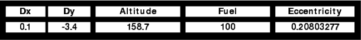

*图 14-18：游戏窗口顶部的数据读取标签（上方为标题标签，下方为数据标签）*

instruct_label() 函数生成的表面会根据显示的文本数量自动调整大小。这对于静态显示效果没问题，但读取数据会不断变化，导致仪表随着文本的增加或减少而扩展或收缩。为了避免这种情况，你将使用一个独立的指定大小的矩形对象作为文本对象的基础。

通过设置字体开始函数，就像在 ➋ 中一样。给一个变量 base 分配一个 pygame 矩形对象；使用 dimensions 参数来设置大小 ➏。这个参数让你通过指定矩形的左上角坐标，然后是宽度和高度，精确放置矩形的位置。生成的矩形应该足够宽，以处理游戏为当前数据类型显示的最长期限。

现在，使用 draw_rect() 方法绘制矩形 ➐。参数包括绘制表面、填充颜色、矩形名称以及宽度为 0，这会填充矩形而不是绘制边框。你将把文本对象放在这个白色矩形上方。

重复渲染文本的代码 ➑，然后获取标签的矩形 ➒。请注意，在 get_rect() 方法中有一个参数可以将中心设置为 base 的中心。这可以让你将文本标签放置在白色矩形的上方。最后，使用 blit 将其绘制到屏幕上，指定源矩形和目标矩形 ➓。

#### ***绘制土壤湿度图***

列表 14-13 定义了让玩家在游戏的胜利条件满足时“绘制”火星土壤湿度图的功能。当玩家按下 M 键时，这些函数将被 main() 函数调用，行星的图像将被一个彩色的覆盖层替代，我们假装它表示土壤湿度含量。当玩家释放按键时，火星的正常视图将恢复。按键检查也将在 main() 函数中执行。

*mars_orbiter.py,* 第十三部分

➊ def mapping_on(planet):

"""显示行星的土壤湿度图像。"""

➋ last_center = planet.rect.center

➌ planet.image_copy = pg.transform.scale(planet.image_water, (100, 100))

➍ planet.image_copy.set_colorkey(BLACK)

planet.rect = planet.image_copy.get_rect()

planet.rect.center = last_center

➎ def mapping_off(planet):

"""恢复正常的行星图像。"""

➏ planet.image_copy = pg.transform.scale(planet.image_mars, (100, 100))

planet.image_copy.set_colorkey(BLACK)

*列表 14-13：定义了让玩家绘制火星土壤湿度图的函数*

首先定义一个函数，它以行星对象作为参数 ➊。像在 列表 14-9 中一样，先分配一个 last_center 变量；这个变量将用于防止行星在其轴上晃动 ➋。

接下来，将火星的水分图像缩放到与正常图像相同的大小，并将其分配给行星的 image_copy 属性，因为反复使用转换会使图像质量下降 ➌。将图像的背景设置为透明 ➍，获取其矩形，并将矩形的中心设置为 last_center 变量；这样，火星就会保持在屏幕的中心位置。

现在，定义另一个函数，当玩家停止主动绘制火星时使用 ➎。它也接受行星对象作为参数。你需要做的就是将行星图像重置为原始版本 ➏。因为你仍然在使用 image_copy 属性，所以不需要重新获取矩形，但你确实需要设置透明色。

#### ***投射阴影***

Listing 14-14 定义了一个函数，赋予火星一个“暗面”并在行星后面投下阴影。阴影将是一个黑色、半透明的矩形，其右边缘与行星精灵的中心重合（参见 Figure 14-19）。这假设太阳位于屏幕的右侧，并且火星正处于春分或秋分时。

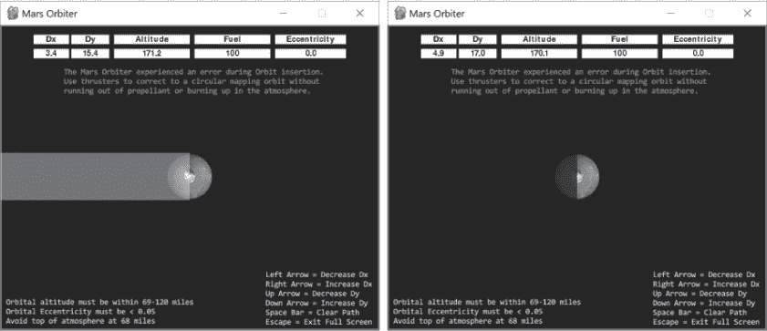

*Figure 14-19: 半透明白色的阴影矩形（左）和最终的半透明黑色阴影矩形（右）*

*mars_orbiter.py,* 第十四部分

➊ def cast_shadow(screen):

"""向屏幕添加可选的终止符和行星后面的阴影。"""

➋ shadow = pg.Surface((400, 100), flags=pg.SRCALPHA)  # 元组是宽度，高度

➌ shadow.fill((0, 0, 0, 210))  # 最后一个数字设置透明度

screen.blit(shadow, (0, 270))  # 元组是左上角坐标

*Listing 14-14: 定义一个函数为火星赋予暗面并让它投下阴影*

cast_shadow() 函数将屏幕对象作为参数 ➊。为名为 shadow 的对象分配一个 400 像素 × 100 像素的 pygame 表面 ➋。使用 pygame 的 SRCALPHA 标志——表示“源透明度”——表明你将使用每个像素的透明度。将该对象填充为黑色并设置 alpha（由最后一个数字表示）为 210 ➌。Alpha 是 RGBA 颜色系统的一部分，其有效值范围为 0 到 255，因此这是非常暗的，但不是完全不透明。最后，将表面绘制到屏幕上，并指定其左上角的坐标。要关闭阴影，只需在 main() 中注释掉函数调用或将 alpha 值设置为 0。

#### ***定义 main() 函数***

Listing 14-15 开始定义运行游戏的 main() 函数。初始化了 pygame 包和声音混音器，设置了游戏屏幕，并将玩家指令存储为列表。

*mars_orbiter.py,* 第十五部分

def main():

"""设置标签和指令，创建对象并运行游戏循环。"""

➊ pg.init()  # 初始化 pygame

# 设置显示：

➋ os.environ['SDL_VIDEO_WINDOW_POS'] = '700, 100'  # 设置游戏窗口位置

➌ screen = pg.display.set_mode((800, 645), pg.FULLSCREEN)

➍ pg.display.set_caption("火星轨道探测器")

➎ background = pg.Surface(screen.get_size())

➏ pg.mixer.init()  # 用于音效

➐ intro_text = [

'火星轨道探测器在轨道插入时遇到错误。'

'使用推力器修正为圆形绘制轨道，避免'

'燃料耗尽或在大气中烧毁。'

]

instruct_text1 = [

'轨道高度必须在 69-120 英里之间'

'轨道偏心率必须小于 0.05'

'避免接近大气层顶部，68 英里处'

]

instruct_text2 = [

'左箭头 = 减少 Dx',

'右箭头 = 增加 Dx',

'上箭头 = 减少 Dy',

'下箭头 = 增加 Dy',

'空格键 = 清除路径',

'Esc = 退出全屏'

]

*Listing 14-15: 启动* main() *函数，通过初始化* pygame *和声音混合器，并设置游戏屏幕和说明*

启动 main() 函数，首先初始化 pygame ➊。然后，使用 os 模块的 environ() 方法分配游戏窗口左上角的坐标 ➋。这一步虽然不是严格必要的，但我想展示你如何控制窗口在桌面上的位置。

接下来，分配一个变量来保存屏幕对象，并将显示模式设置为全屏 ➌。如果玩家退出全屏模式，使用元组 (800, 645) 来指定屏幕的大小。

现在，使用 pygame 的 display.set_caption() 方法将游戏窗口命名为 “火星轨道器” ➍。然后，使用 pygame 的 Surface 类创建一个与屏幕大小相同的游戏背景对象 ➎。

初始化 pygame 的声音混合器，以便播放推进器的音效 ➏。你在卫星的初始化方法中早已定义了这个声音。

游戏将从一个简短的介绍开始，15 秒后会消失。描述键盘控制和胜利条件的永久性说明占据了屏幕的底部角落。将这些内容以列表形式输入 ➐。稍后，你将把这些列表传递给你在 Listing 14-12 中编写的 instruct_label() 函数。列表中的每个项目，按逗号分隔，将在游戏窗口中作为单独的行显示（参见 Figure 14-19）。

#### ***实例化对象、设置轨道验证、映射和时间管理***

Listing 14-16，仍然在 main() 函数中，实例化行星和卫星对象，分配一些有用的变量来确定轨道偏心率，准备函数内的游戏时钟，并分配一个变量来跟踪映射功能的状态。

*mars_orbiter.py,* 第十六部分

# 实例化行星和卫星对象

➊ planet = Planet()

➋ planet_sprite = pg.sprite.Group(planet)

➌ sat = Satellite(background)

➍ sat_sprite = pg.sprite.Group(sat)

# 用于圆形轨道验证

➎ dist_list = []

➏ eccentricity = 1

➐ eccentricity_calc_interval = 5  # 针对 120 英里高度优化

# 时间管理

➑ clock = pg.time.Clock()

fps = 30

tick_count = 0

# 用于土壤湿度映射功能

➒ mapping_enabled = False

*Listing 14-16: 在* main() *函数中实例化对象并分配有用的变量*

继续 main() 函数，首先创建一个来自 Planet 类的行星对象 ➊，然后将其放入一个精灵组 ➋。记得在 第十三章 中提到，pygame 使用叫做 *组* 的容器来管理精灵。

接下来，实例化一个卫星对象，将背景对象传递给卫星类的初始化方法 ➌。卫星需要背景来绘制它的轨迹。

创建卫星后，将它放入自己的精灵组中➍。通常，应该将不同类型的精灵保持在各自的容器中，这样可以方便地管理显示顺序和碰撞处理等。

现在，分配一些变量来帮助计算偏心率。首先创建一个空列表，用于保存每次游戏循环中计算的距离值➎，然后给偏心率变量赋一个占位值 1➏，表示一个非圆形的起始轨道。

你将需要定期更新偏心率变量，以评估玩家对轨道所做的任何更改。记住，你需要轨道的远地点和近地点来计算偏心率，对于大而椭圆的轨道，可能需要一段时间才能实际采样这些值。好消息是，你只需要考虑“获胜”轨道的高度在 69 到 120 英里之间。因此，你可以为低于 120 英里的轨道优化采样率，这些轨道通常只需要不到 6 秒钟的时间来完成。使用 5 秒钟，并将这个值赋给 eccentricity_calc_interval 变量➐。这意味着，对于高度超过 120 英里的轨道，计算出的偏心率可能不完全准确，但考虑到该轨道在该高度下不满足获胜条件，这个偏心率足够用了。

接下来处理时间记录。使用一个时钟变量来保存 pygame 的游戏时钟，这将控制游戏的帧率（每秒帧数）➑。每一帧代表时钟的一次滴答。给一个变量 fps 赋值为 30，意味着游戏将每秒更新 30 次。接着，定义一个 tick_count 变量，用于确定何时清除介绍文本以及何时调用 calc_eccentricity()函数。

通过命名一个变量来启用映射功能，并将其设置为 False ➒。如果玩家达成获胜条件，你将把它改为 True。

#### ***开始游戏循环并播放声音***

Listing 14-17，仍在 main()函数中，启动了游戏时钟和 while 循环，也称为*游戏循环*。它还接收事件，例如玩家使用箭头键发射推进器。如果玩家发射推进器，Ogg Vorbis 音频文件将播放，玩家将听到令人满意的嘶嘶声。

*mars_orbiter.py,* 第十七部分

➊ running = True

while running:

➋ clock.tick(fps)

tick_count += 1

➌ dist_list.append(sat.distance)

# 获取键盘输入

➍ for event in pg.event.get():

➎ if event.type == pg.QUIT:  # 关闭窗口

running = False

➏ elif event.type == pg.KEYDOWN and event.key == pg.K_ESCAPE:

screen = pg.display.set_mode((800, 645))  # 退出全屏

➐ elif event.type == pg.KEYDOWN and event.key == pg.K_SPACE:

background.fill(BLACK)  # 清除路径

➑ elif event.type == pg.KEYUP:

➒ sat.thrust.stop()  # 停止声音

mapping_off(planet)  # 关闭湿度地图视图

➓ elif mapping_enabled:

if event.type == pg.KEYDOWN and event.key == pg.K_m:

mapping_on(planet)

*列表 14-17：在主函数中开始游戏循环，获取事件，并播放声音*

首先为运行游戏的 while 循环分配一个运行变量 ➊，然后开始循环。使用时钟的 `tick()` 方法设置游戏速度，并传入你在前面列出的 `fps` 变量。如果游戏感觉慢，可以将速度设置为 40 fps。对于每次循环——或每一帧——将基于时钟的计数器增加 1。

接下来，将卫星对象的 `sat.distance` 值附加到 `dist_list` ➌。这是卫星和行星之间的距离，通过卫星的 `locate()` 方法在每个游戏循环中计算得出。

现在，收集玩家通过键盘输入的内容 ➍。如前一章节所述，pygame 会记录每个用户交互——称为 *事件*——并将其存储在事件缓冲区中。`event.get()` 方法创建一个事件列表，你可以通过 if 语句进行评估。在这里，首先检查玩家是否关闭了窗口退出游戏 ➎。如果是，则将 `running` 设置为 False 来结束游戏循环。

如果玩家按下 ESC 键，表示退出全屏模式，因此使用 `display.set_mode()` 方法将屏幕大小重置为 800 × 645 像素，这个方法在主函数开始时已经调用过 ➏。如果玩家按下空格键，则将背景填充为黑色，这将擦除卫星的白色轨道路径 ➐。

当玩家按下箭头键时，卫星对象会播放嘶嘶声，但在其 `check_keys()` 方法中没有任何内容告诉它停止播放声音。因此，传递任何 KEYUP 事件给 pygame ➑；当 pygame 检测到玩家释放了箭头键时，调用 `thrust` 的 `stop()` 方法以停止声音播放 ➒。

为了绘制火星，玩家需要按住 M 键，因此使用相同的 KEYUP 事件来调用 `mapping_off()` 函数。这将把行星图像重置为正常的、未映射的状态。

最后，检查 `mapping_enabled` 变量是否为 True，这意味着玩家已达成胜利条件，准备绘制火星 ➓。如果他们按下 M 键，调用 `mapping_on()` 函数来显示土壤湿度覆盖图，替代行星的正常视图。

#### ***应用重力、计算偏心率和处理失败***

列表 14-18 继续执行 `main()` 函数中的 while 循环，对卫星施加重力并计算其轨道的偏心率。偏心率值将决定轨道是否为圆形，这是游戏的胜利条件之一。此列表还会绘制背景，并响应因燃料耗尽或在大气中烧毁而导致的失败条件。

*mars_orbiter.py,* 第十八部分

# 获取航向与行星的距离并施加重力

➊ sat.locate(planet)

planet.gravity(sat)

# 计算轨道偏心率

➋ 如果 `tick_count % (eccentricity_calc_interval * fps) == 0`：

eccentricity = calc_eccentricity(dist_list)

➌ dist_list = []

# 重新绘制背景以防止路径被清除

➍ screen.blit(background, (0, 0))

# 燃料/高度失败条件

➎ if sat.fuel <= 0:

➏ instruct_label(screen, ['燃料耗尽！'], RED, 340, 195)

sat.fuel = 0

sat.dx = 2

➐ elif sat.distance <= 68:

instruct_label(screen, ['大气层进入！'], RED, 320, 195)

sat.dx = 0

sat.dy = 0

*代码清单 14-18：应用重力，计算偏心率，并处理失败条件*

调用卫星的 locate()方法并将行星对象作为参数传递➊。该方法计算指向火星的航向和距离，你可以利用这些数据来调整天线的方向、计算轨道偏心率并应用重力。然后，为了施加重力，调用行星的 gravity()方法并传递卫星对象。

如果 tick_count 的模与偏心率计算间隔 * fps 的乘积为 0 ➋，调用计算偏心率的函数，并传递 dist_list 变量。然后，重置 dist_list 变量为 0，重新开始距离采样➌。

接下来，调用屏幕的 blit()方法，并传递背景和左上角的坐标 ➍。这个语句的位置很重要。例如，如果你将它放在更新精灵的代码之后，你将看不到卫星或火星出现在游戏屏幕上。

现在，处理玩家在没有达到圆形轨道之前燃料耗尽的情况。首先，从卫星对象的 fuel 属性获取当前燃料水平➎。若燃料水平为 0 或更低，使用 instruct_label()函数宣布燃料已耗尽➏，然后将卫星的 dx 属性设置为 2。这将导致卫星精灵迅速飞出屏幕，进入深空，且高度读数会变得越来越大。尽管不现实，但这确保玩家知道他们失败了！

最后一种失败情况是当玩家在大气层中燃烧时。如果卫星的距离属性小于或等于 68 ➐，在屏幕中央附近制作一个标签，让玩家知道他们已进入大气层，然后将卫星的速度属性设置为 0。这将导致重力将精灵锁定在行星上（图 14-20）。此外，当 dx 和 dy 为 0 时，卫星的 update()方法（代码清单 14-7）会将卫星的图像切换为红色的“坠毁”版本。

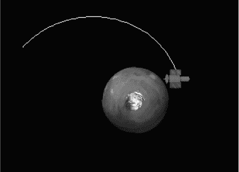

*图 14-20：卫星坠毁配置*

高度参数有点像是作弊，因为高度等同于距离属性，该属性是从行星和卫星精灵的*中心*测量的，而不是从行星表面到卫星的距离。这完全取决于比例。行星大气层非常薄——在游戏的尺度下，火星大气层的厚度不到 2 个像素！由于游戏的设计，当卫星天线的尖端刮到行星时，卫星将会燃烧，但由于卫星精灵的大小不现实地过大，卫星的 68 英里中心点必须被推得更远。

#### ***奖励成功并更新和绘制精灵***

Listing 14-19，仍然在 main() 函数的 while 循环中，通过启用让玩家映射火星土壤湿度的功能来奖励获胜的玩家。在现实中，这可能通过雷达或微波共振器来完成，这些设备可以远程测量裸土中的水分，深度可达几英寸。此列表还更新了行星和卫星精灵，并将其绘制到屏幕上。

*mars_orbiter.py,* 第十九部分

# 启用映射功能

➊ 如果偏心率 < 0.05 且卫星距离 >= 69 且卫星距离 <= 120:

➋ map_instruct = ['按住 M 键映射土壤湿度']

instruct_label(screen, map_instruct, LT_BLUE, 250, 175)

➌ mapping_enabled = True

else:

mapping_enabled = False

➍ planet_sprite.update()

➎ planet_sprite.draw(screen)

sat_sprite.update()

sat_sprite.draw(screen)

*Listing 14-19: 启用映射功能并在游戏循环中更新精灵*

如果轨道是圆形的并且满足高度要求 ➊，显示一条信息，指示玩家按 M 键映射土壤湿度 ➋。将文本放入方括号中，因为 instruct_label() 函数期望一个列表。将文本颜色设置为浅蓝色，并将其放置在屏幕中心附近。

接下来，将 mapping_enabled 变量设置为 True ➌；否则，如果轨道偏离目标参数，将其设置为 False。

最后，通过精灵组 ➍ 调用行星精灵的 update() 方法，然后实际将其绘制到屏幕上 ➎。draw() 方法的参数是屏幕，即绘制精灵的对象。对卫星精灵重复这些步骤。

#### ***显示指令和遥测并投射阴影***

Listing 14-20 完成了 while 循环和 main() 函数，通过显示指令、数据读出和行星的阴影。游戏介绍文本仅在启动时短暂显示。

*mars_orbiter.py,* 第二十部分

# 显示介绍文本 15 秒

➊ 如果 pg.time.get_ticks() <= 15000:  # 时间（毫秒）

instruct_label(screen, intro_text, GREEN, 145, 100)

# 显示遥测和说明

➋ box_label(screen, 'Dx', (70, 20, 75, 20))

box_label(screen, 'Dy', (150, 20, 80, 20))

box_label(screen, '高度', (240, 20, 160, 20))

box_label(screen, '燃料', (410, 20, 160, 20))

box_label(screen, '偏心率', (580, 20, 150, 20))

➌ box_label(screen, '{:.1f}'.format(sat.dx), (70, 50, 75, 20))

box_label(screen, '{:.1f}'.format(sat.dy), (150, 50, 80, 20))

box_label(screen, '{:.1f}'.format(sat.distance), (240, 50, 160, 20))

box_label(screen, '{}'.format(sat.fuel), (410, 50, 160, 20))

box_label(screen, '{:.8f}'.format(eccentricity), (580, 50, 150, 20))

➍ instruct_label(screen, instruct_text1, WHITE, 10, 575)

instruct_label(screen, instruct_text2, WHITE, 570, 510)

# 添加终结线和边框

➎ cast_shadow(screen)

➏ pg.draw.rect(screen, WHITE, (1, 1, 798, 643), 1)

➐ pg.display.flip()

➑ if __name__ == "__main__":

main()

*Listing 14-20: 显示文本和行星阴影并调用* main() *函数*

概述游戏的文字应该停留在屏幕中间的位置，足够长时间让玩家阅读后消失。可以使用 if 语句和 pygame 的 tick.get_ticks() 方法来控制，后者返回游戏开始以来已过的毫秒数。如果过去的时间少于 15 秒，使用 instruct_label() 函数以绿色显示来自 Listing 14-15 的文字列表。

接下来，为数据读数创建仪表，从标题框开始。使用 box_label() 函数，并为每个读数仪表 ➋ 调用它。对数据读数 ➌ 重复此操作。注意，当你传递文本给函数时，可以使用字符串格式化方法。

使用 instruct_label() 函数将 Listing 14-15 中的指令放置在屏幕的底角 ➍。如果你想区分描述获胜条件和定义关键功能的文本，可以随意更改文本颜色。

现在，调用显示行星阴影的函数 ➎，然后作为最后的修饰，使用 pygame 的 draw.rect() 方法添加边框 ➏。传递给它屏幕对象、边框颜色、角坐标和线宽。

完成 main() 函数及其游戏循环，方法是翻转显示器 ➐。正如前一章所述，flip() 方法将所有内容从屏幕对象绘制到可视显示器上。

最后，在全局空间中调用 main()，使用标准语法以独立运行或作为模块 ➑。

### **总结**

在本章中，你使用 pygame 构建了一个 2D 街机风格的游戏，包含图像精灵、音效和键盘控制。你还创建了一个有趣的启发式方法来学习轨道力学。所有在 “为游戏者介绍天体动力学” 第 286 页 链接 中展示的技术都应该可以在游戏中使用。在接下来的部分“挑战项目”中，你可以继续改进游戏和玩家体验。

### **挑战项目**

通过改进火星轨道探测器游戏并根据以下建议添加新的挑战，使其成为你自己的游戏。和往常一样，挑战项目没有提供解决方案。

#### ***游戏标题画面***

复制并编辑 *mars_orbiter.py* 程序，使得标题画面在主游戏画面之前短暂出现。让标题画面显示类似于 *火星全球探测器* 的 NASA 类型任务徽章 (图 14-21)，但要确保它在游戏中独特地适用于火星轨道探测器。你可以在 *[`space.jpl.nasa.gov/art/patches.html`](https://space.jpl.nasa.gov/art/patches.html)* 上查看一些其他的 NASA 徽章（彩色版本）。

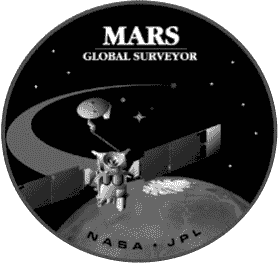

*图 14-21:* 火星全球探测器 *任务徽章*

#### ***智能仪表***

复制并编辑*mars_orbiter.py*程序，使得当高度和偏心率超出目标范围时，读数使用红色背景或红色文本颜色。但要小心：圆形轨道的偏心率值应保持红色，直到高度值进入范围！

#### ***无线电黑障***

复制并编辑*mars_orbiter.py*程序，使得当卫星处于阴影矩形区域内时，键盘控制被锁定。

#### ***评分***

复制并编辑*mars_orbiter.py*程序，使其能够为玩家评分，并将最佳成绩显示在一个可显示的高分列表中。最高分奖励给那些以最少的燃料和时间达到最低允许轨道的人。例如，得分的燃料部分可以是剩余的燃料量；轨道部分为最大允许高度（120）减去圆形轨道的高度；时间部分为达到圆形轨道所用时间的倒数乘以 1,000。将这三个部分相加得到最终得分。

#### ***策略指南***

复制并编辑*mars_orbiter.py*程序，添加一个弹出式策略指南或帮助文件，通过在《游戏者的天体动力学》一书中的某些图像（在 286 页）来实现。例如，添加一行指令，告诉玩家按住 H 键以获取帮助。这样可以弹出并循环展示不同的轨道机动图像，例如霍曼转移轨道或单切点燃烧。确保包含关于每种技巧的优缺点的评论，并在指南打开时暂停游戏。

#### ***大气刹车***

大气刹车是一种节省燃料的技术，利用大气摩擦减慢航天器的速度（图 14-22）。复制并编辑*mars_orbiter.py*程序以包括大气刹车。在 main()函数中，将最低获胜高度设置为 70 英里，最低安全高度设置为 60 英里。如果卫星的高度在 60 到 70 英里之间，则减小其速度。

*图 14-22：使用大气而不是逆行燃烧来圆化轨道。*

图 14-23 展示了游戏中如何利用大气刹车来圆化椭圆轨道。大气层的顶部设定为 80 英里。大气刹车与逆行燃烧在近日点时的作用相同，但你必须小心耐心，确保在轨道变圆之前将轨道升出大气层。

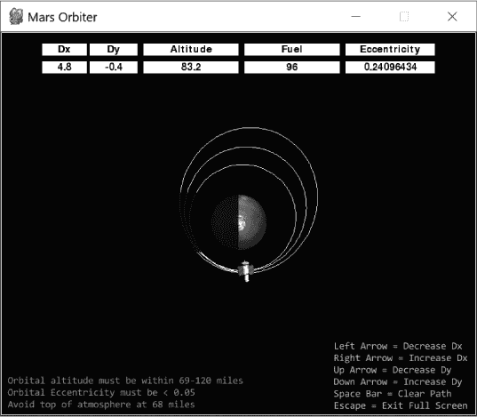

*图 14-23：使用大气刹车将轨道圆化。请注意低燃料消耗。*

NASA 使用类似的技术将*火星全球勘测者*从其椭圆形捕获轨道移动到最终的制图轨道。这个过程花费了数月的时间，因为他们需要保护航天器避免在大气层中过热。

#### ***入侵警告！***

复制并编辑 *mars_orbiter.py* 程序，使得新的行星对象被实例化并穿越屏幕，利用其引力扰动卫星的轨道。创建一个新的精灵来表示彗星或小行星，并以随机间隔发射（但不要*过于*频繁！）。不要对该对象应用火星的 gravity() 方法，以避免它进入火星轨道，而是应用新对象的 gravity() 方法到卫星上。调整新对象的质量，使其能在大约 100 像素的距离内明显扰动卫星的轨道。允许该对象穿越火星或卫星而不发生碰撞。

#### ***从上至下***

火星探测器目前使用的是*赤道*轨道。这是为了便于编码，因为你只需要旋转一张火星图像。但真实的映射轨道使用的是极轨道——与赤道轨道垂直——并且会经过行星的两极（见图 14-24）。随着行星在轨道下方自转，卫星可以映射其整个表面。使用赤道轨道时，由于行星表面的曲率，高纬度地区实际上是无法映射的（参见图 14-24 中的虚线）。

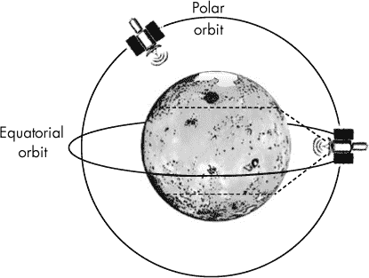

*图 14-24：极轨与赤道轨道的对比；赤道轨道的假想北南映射极限由虚线表示。*

复制并编辑 *mars_orbiter.py* 程序，使得卫星遵循极轨道。这只涉及更换火星图像。但你不能再使用单一的俯视图像；视角需要垂直于行星的自转轴。有关视频示例，请参见 *[`youtu.be/IP2SDbhFbXk`](https://youtu.be/IP2SDbhFbXk)*；有关火星动画 gif，请参见 *[`gph.is/2caBKKS`](http://gph.is/2caBKKS)*。你不能直接在 pygame 中使用动画 gif，但可以将单独的帧提取出来并使用。提取帧的工具可以在网上找到，在下一章中，你将使用其中一种工具从视频中提取图像。
