## **通过行星堆叠提高你的天文摄影水平**


如果你曾经通过望远镜观察过木星、火星或土星，你可能会有些失望。行星看起来很小，几乎没有什么细节。你想要放大并提高倍率，但它没有效果。大于 200 倍的放大倍率往往会变得模糊。

问题在于空气湍流，或者天文学家所说的*视像*。即使在晴朗的夜晚，空气也在不断运动，热气流的上升和下降很容易模糊代表天体的光点。然而，随着 20 世纪 80 年代*电荷耦合器件（CCD）*的商业化，天文学家找到了解决湍流的方法。数字摄影允许一种叫做*图像堆叠*的技术，其中许多照片——有些好，有些差——被平均或堆叠成一张单独的图像。通过足够多的照片，持久不变的特征（如行星表面）会主导瞬时特征（如流动的云层）。这使得天文摄影师能够提高放大限制，并补偿不理想的观测条件。

在本章中，你将使用一个名为`pillow`的第三方 Python 模块来堆叠数百张木星的图像。最终结果将是一个具有比任何单个图像更高信噪比的图像。你还将处理与 Python 代码所在不同文件夹中的文件，并使用 Python 的操作系统（`os`）和 shell 实用工具（`shutil`）模块来操作文件和文件夹。

### **项目#23：堆叠木星**

木星是一颗大而明亮、色彩斑斓的气体巨行星，是天文摄影师的最爱目标。即使是业余望远镜也能看到它的橙色条纹，这些条纹是由线性云带形成的，还有大红斑，一个椭圆形的风暴，其大小足以吞没地球（见图 15-1）。

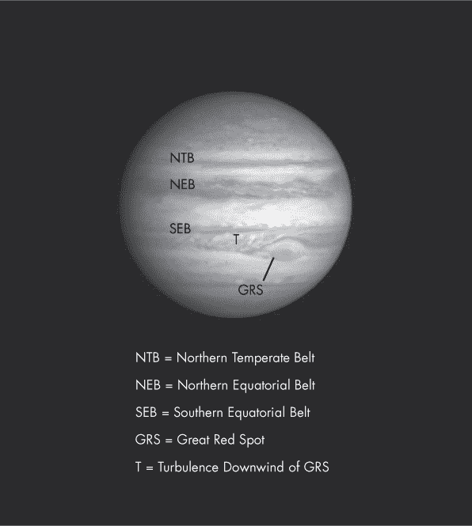

*图 15-1：卡西尼太空探测器拍摄的木星照片*

木星是研究图像堆叠的绝佳对象。它的线性云带和大红斑为眼睛提供了校准点，用于判断边缘定义和清晰度的改进，而且它相对较大的尺寸使得噪声容易被察觉。

噪声表现为“颗粒感”。每个颜色带都有自己的伪影，导致图像上出现彩色斑点。噪声的主要来源是相机（电子读出噪声和热信号）以及来自光本身的光子噪声，因为随着时间的推移，光子以可变的数量撞击传感器。幸运的是，噪声伪影是随机的，可以通过堆叠图像大部分被消除。

**目标**

编写程序裁剪、缩放、堆叠并增强图像，以创建更清晰的木星照片。

### **pillow 模块**

要处理图像，你需要一个免费的第三方 Python 模块，名为 `pillow`。它是 Python Imaging Library (PIL) 的继任项目，后者已于 2011 年停用。`pillow` 模块是从 PIL 仓库“分支”出来的，并将代码升级到 Python 3。

你可以在 Windows、macOS 和 Linux 上使用 `pillow`，它支持多种图像格式，包括 PNG、JPEG、GIF、BMP 和 TIFF。它提供了标准的图像处理功能，如改变单个像素、遮罩、处理透明度、过滤和增强以及添加文本。但 `pillow` 的真正优势在于它能够轻松编辑大量图像。

使用 pip 工具安装 `pillow` 非常简单（有关 pip 的更多信息，请参见 “使用 `python-docx` 操作 Word 文档” 第 110 页）。在命令行中输入 pip install pillow 即可。

大多数主要的 Linux 发行版将 `pillow` 包含在之前包含 PIL 的软件包中，因此你可能已经在系统上安装了 `pillow`。无论你使用什么平台，如果 PIL 已经安装，你需要在安装 `pillow` 之前先卸载它。有关安装说明，请参见 *[`pillow.readthedocs.io/en/latest/installation.html`](http://pillow.readthedocs.io/en/latest/installation.html)*。

### **处理文件和文件夹**

在本书前面的所有项目中，你都将支持文件和模块与 Python 代码放在同一文件夹中。这对于简单项目来说很方便，但对于广泛使用来说不太现实，尤其是在你需要处理本项目中生成的数百个图像文件时。幸运的是，Python 附带了几个可以帮助处理这个问题的模块，比如 `os` 和 `shutil`。但首先，我将简要讨论一下目录路径。

#### ***目录路径***

目录路径是指向文件或文件夹的地址。它以根目录开始，在 Windows 中根目录用字母（例如 *C:\*）表示，而在 Unix 系统中则用正斜杠 (*/*) 表示。Windows 中的其他驱动器会被分配不同的字母，而 macOS 中的驱动器位于 */volume* 下，Unix 中的驱动器则位于 */mnt*（即“挂载”）。

**注意**

*在本章的示例中，我使用的是 Windows 操作系统，但你也可以在 macOS 和其他系统上实现相同的结果。正如常见的做法，我在这里将*目录*和*文件夹*互换使用。*

路径名称的显示方式取决于操作系统。Windows 使用反斜杠 (*\*) 来分隔文件夹，而 macOS 和 Unix 系统使用正斜杠 (*/*)。此外，在 Unix 系统中，文件夹和文件名是区分大小写的。

如果你在 Windows 上编写程序并输入带有反斜杠的路径名，其他平台将无法识别这些路径。幸运的是，`os.path.join()` 方法会自动确保你的路径名适用于 Python 正在运行的操作系统。我们来看看这个以及其他示例，见 Listing 15-1。

```py
➊ >>> import os
➋ >>> os.getcwd()
   'C:\\Python35\\Lib\\idlelib'
➌ >>> os.chdir('C:\\Python35\\Python 3 Stuff')
   >>> os.getcwd()
   'C:\\Python35\\Python 3 Stuff'
➍ >>> os.chdir(r'C:\Python35\Python 3 Stuff\Planet Stacking')
   >>> os.getcwd()
➎ 'C:\\Python35\\Python 3 Stuff\\Planet Stacking'
➏ >>> os.path.join('Planet Stacking', 'stack_8', '8file262.jpg')
   'Planet Stacking\\stack_8\\8file262.jpg'
➐ >>> os.path.normpath('C:/Python35/Python 3 Stuff')
   'C:\\Python35\\Python 3 Stuff'
➑ >>> os.chdir('C:/Python35')
   >>> os.getcwd()
   'C:\\Python35'
```

*列表 15-1：使用* os *模块操作 Windows 路径名*

导入 `os` 模块以访问操作系统相关功能 ➊ 后，获取 *当前工作目录*（*cwd*） ➋。cwd 在进程启动时被分配；也就是说，当你从 shell 运行脚本时，shell 和脚本的 cwd 会是相同的。对于 Python 程序，cwd 是包含该程序的文件夹。当你获取 cwd 时，你会看到完整路径。请注意，你必须使用额外的反斜杠来转义作为文件分隔符使用的反斜杠字符。

接下来，使用 `os.chdir()` 方法 ➌ 更改 cwd，传递给它包含双反斜杠的完整路径。然后，再次获取 cwd，以查看新的路径。

如果你不想输入双反斜杠，可以在路径名参数字符串前加一个 r，将其转换为 *原始字符串* ➍。原始字符串使用不同的规则来处理反斜杠转义序列，但即使是原始字符串也不能以单个反斜杠结尾。路径仍然会以双反斜杠显示 ➎。

如果你希望你的程序与所有操作系统兼容，请使用 `os.path.join()` 方法，并传递文件夹名和文件名，不需要分隔符字符 ➏。`os.path` 方法会根据你使用的系统返回正确的分隔符。这使得文件名和文件夹名的操作不依赖于平台。

`os.path.normpath()` 方法会根据您使用的系统修正分隔符➐。在显示的 Windows 示例中，不正确的 Unix 类型分隔符会被反斜杠替代。原生 Windows 也支持使用正斜杠，并会自动进行转换➑。

完整的目录路径—从根目录开始—被称为 *绝对路径*。你可以使用快捷方式，称为 *相对路径*，使得操作目录更为简便。相对路径是从当前工作目录的角度进行解释的。绝对路径以正斜杠或驱动器标签开始，而相对路径则不以此开始。在下面的代码片段中，你可以在不输入绝对路径的情况下改变目录—Python 能够识别新的位置，因为它是在 *cwd 内部*。在幕后，相对路径会与指向 cwd 的路径连接，从而生成一个完整的绝对路径。

```py
>>> os.getcwd()
'C:\\Python35\\Python 3 Stuff'
>>> os.chdir('Planet Stacking')
>>> os.getcwd()
'C:\\Python35\\Python 3 Stuff\\Planet Stacking'
```

你可以通过使用点（`.`）和双点（`..`）来标识文件夹并减少输入。例如，在 Windows 中，`.\` 指代 cwd，`..\` 指代包含 cwd 的父目录。你还可以使用点来获取 cwd 的绝对路径：

```py
>>> os.path.abspath('.')
'C:\\Python35\\Python 3 Stuff\\Planet Stacking\\for_book'
```

点文件夹可以在 Windows、macOS 和 Linux 中使用。有关 `os` 模块的更多信息，请参见 *[`docs.python.org/3/library/os.html`](https://docs.python.org/3/library/os.html)*。

#### ***Shell 工具模块***

`shutil`模块提供了用于处理文件和文件夹的高级功能，如复制、移动、重命名和删除。由于它是 Python 标准库的一部分，你可以通过输入 import shutil 来加载`shutil`。在本章的代码段中，你会看到该模块的示例用法。同时，你可以在*[`docs.python.org/3.7/library/shutil.html`](https://docs.python.org/3.7/library/shutil.html)*找到该模块的文档。

### **视频**

Brooks Clark 在美国德克萨斯州休斯顿的一个有风的夜晚录制了用于此项目的木星彩色视频。该视频为 101 MB 的*.mov*文件，时长约为 16 秒。

视频长度故意设得较短。木星的自转周期约为 10 小时，这意味着即使只有一分钟的曝光时间，静态照片也可能出现模糊，而你想通过堆叠视频帧来强化的特征可能会改变位置，极大地复杂化了这一过程。

为了将视频帧转换为单独的图像，我使用了由 DVDVideoSoft 开发的免费多媒体程序集 Free Studio。Free Video to JPG Converter 工具允许在恒定时间或帧间隔下捕捉图像。我将间隔设置为跨越整个视频长度采样帧，以提高在空气平稳、可见度良好时捕捉到图像的机会。

几百张图像应该足以进行堆叠并显示显著的改进。在这种情况下，我捕捉了 256 帧。

你可以在*[`www.nostarch.com/impracticalpython/`](https://www.nostarch.com/impracticalpython/)*在线找到名为*video_frames*的图像文件夹，位于本书资源中。下载该文件夹并保留其名称。

视频中的一帧示例，采用灰度显示，见图 15-2。木星的云带模糊不清，大红斑不明显，且图像对比度较低，这是放大常见的副作用。噪点伪影还让木星呈现颗粒状外观。

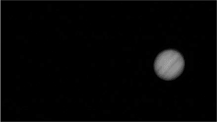

*图 15-2：木星视频中的一帧示例*

除了这些问题，风还晃动了相机，不精确的追踪导致行星向左侧框架偏移。你可以在图 15-3 中看到*横向漂移*的示例，我已将五个随机选择的帧叠加在一起，黑色背景设置为透明。

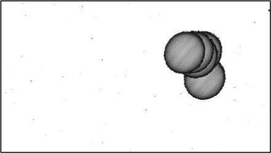

*图 15-3：基于五个随机选择的帧，展示木星视频中的抖动和漂移示例*

移动未必是坏事，因为调整图像的位置可以平滑与 CCD 传感器表面、镜头或传感器上的灰尘等相关的缺陷。但图像叠加的关键假设是，图像必须完全对齐，以便像木星的云带这样的持久特征在平均图像时相互增强。为了获得高信噪比，图像必须经过配准。

*图像配准*是将数据转换到相同坐标系的过程，以便可以进行比较和整合。配准无疑是图像叠加中最难的部分。天文学家通常使用商业软件——如 RegiStax、RegiStar、Deep Sky Stacker 或 CCDStack——来帮助他们对齐和叠加天文照片。然而，你将亲自动手，使用 Python 来完成这一过程。

### **策略**

叠加图像所需的步骤如下（第一个步骤已经完成）：

1.  从视频录制中提取图像。

1.  裁剪围绕木星的图像。

1.  将裁剪后的图像调整为相同的大小。

1.  将图像叠加成一张图像。

1.  增强并过滤最终图像。

### **代码**

你可以将所有步骤整合到一个程序中，但我选择将它们分布到三个程序中。这是因为你通常希望在过程中停下来检查结果，此外你可能还希望运行后续的处理步骤，比如增强，而不必完全重新运行整个工作流。第一个程序将裁剪和缩放图像，第二个程序将叠加图像，第三个程序将增强图像。

#### ***裁剪和缩放代码***

首先，你需要对图像进行配准。对于像月亮和木星这样的大型明亮物体，天文摄影中的一种方法是裁剪每张图像，使其四个边界与天体的表面相切。这将去除大部分天空区域，并缓解任何抖动和漂移问题。对裁剪后的图像进行缩放，将确保它们的大小一致，并稍微平滑它们以减少噪声。

你可以从 *[`www.nostarch.com/impracticalpython/`](https://www.nostarch.com/impracticalpython/)* 下载 *crop_n_scale_images.py*。将其保存在包含捕获的视频帧文件夹的目录中。

##### **导入模块并定义 main() 函数**

列表 15-2 执行了模块导入并定义了运行 *crop_n_scale_images.py* 程序的 `main()` 函数。

*crop_n_scale_images.py,* 第一部分

```py
➊ import os
   import sys
➋ import shutil
➌ from PIL import Image, ImageOps

   def main():
       """Get starting folder, copy folder, run crop function, & clean folder."""
       # get name of folder in cwd with original video images
    ➍ frames_folder = 'video_frames'

       # prepare files & folders
    ➎ del_folders('cropped')
    ➏ shutil.copytree(frames_folder, 'cropped')

       # run cropping function
       print("start cropping and scaling...")
    ➐ os.chdir('cropped')
       crop_images()
    ➑ clean_folder(prefix_to_save='cropped')  # delete uncropped originals

       print("Done! \n")
```

*列表 15-2：导入模块并定义* main() *函数*

首先导入操作系统（`os`）和系统（`sys`）模块 ➊。`os`模块已包含了对`sys`的导入，但这个功能可能在未来会取消，因此最好自己手动导入`sys`。`shutil`模块包含了前面描述的 shell 实用工具 ➋。在图像库中，你将使用`Image`来加载、裁剪、转换和过滤图像；还将使用`ImageOps`来缩放图像 ➌。请注意，在`import`语句中必须使用 PIL，而不是 `pillow`。

启动 `main()` 函数，并将起始文件夹的名称赋值给 `frames_folder` 变量 ➍。该文件夹包含从视频中捕获的所有原始图片。

你将把裁剪后的图片存储在一个名为 *cropped* 的新文件夹中，但如果该文件夹已存在，shell 工具不会创建它，因此请调用稍后编写的 `del_folders()` 函数 ➎。如上所述，如果文件夹不存在，该函数不会抛出错误，因此可以在任何时候安全运行。

你应该始终在原始图片的副本上进行操作，因此使用 `shutil.copytree()` 方法将包含原始图片的文件夹复制到一个名为 *cropped* 的新文件夹中 ➏。现在，切换到此文件夹 ➐ 并调用 `crop_images()` 函数，该函数将裁剪并缩放图片。然后调用 `clean_folder()` 函数，它会删除仍然存在于 *cropped* 文件夹中的原始视频帧 ➑。请注意，在将参数传递给 `clean_folder()` 函数时使用参数名，因为这使得函数的目的更加明确。

打印 `Done!` 以便在程序完成时通知用户。

##### **删除和清理文件夹**

清单 15-3 定义了用于删除文件和文件夹的辅助函数，这些函数位于 *crop_n_scale_images.py* 中。`shutil` 模块如果目标目录中已经有一个同名的文件夹，将拒绝创建新的文件夹。如果你想多次运行该程序，首先必须删除或重命名现有的文件夹。程序还会在裁剪图片后重命名它们，在开始叠加这些图片之前，你需要删除原始图片。由于将会有数百个图像文件，这些函数将自动化本来繁琐的任务。

*crop_n_scale_images.py*，第二部分

```py
➊ def del_folders(name):
       """If a folder with a named prefix exists in directory, delete it."""
    ➋ contents = os.listdir()
    ➌ for item in contents:
        ➍ if os.path.isdir(item) and item.startswith(name):
            ➎ shutil.rmtree(item)

➏ def clean_folder(prefix_to_save):
       """Delete all files in folder except those with a named prefix."""
    ➐ files = os.listdir()
       for file in files:
        ➑ if not file.startswith(prefix_to_save):
            ➒ os.remove(file)
```

*清单 15-3：定义用于删除文件夹和文件的函数*

定义一个名为 `del_folders()` 的函数来删除文件夹 ➊。唯一的参数将是你想要删除的文件夹名称。

接下来，列出文件夹的内容 ➋，然后开始循环遍历内容 ➌。若函数遇到一个以文件夹名称开头并且也是一个目录的项 ➍，则使用 `shutil.rmtree()` 删除该文件夹 ➎。正如你稍后会看到的，删除文件夹与删除文件的方法是不同的。

**注意**

*使用* rmtree() *方法时要始终小心，因为它会* 永久 *删除文件夹及其内容。你可能会删除系统中的大部分内容，丢失与 Python 项目无关的重要文档，并可能破坏你的计算机！*

现在，定义一个辅助函数来“清理”文件夹，并传递一个*不想删除*的文件名 ➏。一开始这可能有点反直觉，但因为你只想保留最后一批已处理的图片，所以不必显式列出文件夹中的任何其他文件。如果文件名没有以你提供的前缀（例如 *cropped*）开头，那么它们将被自动删除。

这个过程类似于上一个函数。列出文件夹内容 ➐，并开始遍历该列表。如果文件名没有以你提供的前缀开头 ➑，则使用`os.remove()`删除该文件 ➒。

##### **裁剪、缩放和保存图像**

Listing 15-4 通过在木星周围拟合一个框并裁剪图像来注册从视频中捕获的帧（见图 15-4）。这种技术在明亮的图像和黑色背景的场景中效果很好（另见进一步阅读，在第 343 页中有其他示例）。

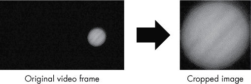

*图 15-4: 将原始视频帧裁剪到木星周围以对齐图像*

通过将图像紧密裁剪在木星周围，你可以解决所有漂移和抖动问题。

每个裁剪后的图像还会被缩放到更大且一致的大小，并稍微平滑以减少噪声。裁剪和缩放后的图像将保存在它们自己的文件夹中，这个文件夹将在之后由`main()`函数创建。

*crop_n_scale_images.py,* 第三部分

```py
➊ def crop_images():
       """Crop and scale images of a planet to box around planet."""
    ➋ files = os.listdir()
    ➌ for file_num, file in enumerate(files, start=1):
        ➍ with Image.open(file) as img:
            ➎ gray = img.convert('L')
            ➏ bw = gray.point(lambda x: 0 if x < 90 else 255)
            ➐ box = bw.getbbox()
               padded_box = (box[0]-20, box[1]-20, box[2]+20, box[3]+20)
            ➑ cropped = img.crop(padded_box)
               scaled = ImageOps.fit(cropped, (860, 860),
                                     Image.LANCZOS, 0, (0.5, 0.5))
               file_name = 'cropped_{}.jpg'.format(file_num)
            ➒ scaled.save(file_name, "JPEG")

   if __name__ == '__main__':
       main()
```

*Listing 15-4: 裁剪初始视频帧至围绕木星的框，并重新缩放*

`crop_images()`函数不接受任何参数 ➊，但最终将处理一个名为*cropped*的副本，该副本包含原始视频帧所在的文件夹。你在调用此函数之前已经在`main()`函数中创建了这个副本。

通过列出当前(*cropped*)文件夹的内容 ➋ 来开始该函数。程序会按顺序为每张图像编号，因此使用`enumerate()`与`for`循环，并将`start`选项设置为`1` ➌。如果你之前没有使用过`enumerate()`，它是一个非常方便的内建函数，作为自动计数器；计数值将被分配给`file_num`变量。

接下来，命名一个变量`img`来存放图像，并使用`open()`方法打开文件 ➍。

为了将边界框的边界适应木星，你需要将图像中所有非木星部分的像素设为黑色`(0, 0, 0)`。不幸的是，木星之外有一些噪声相关的黑色以外的像素，并且木星的边缘是模糊和渐变的。这些问题会导致边界框形状不规则，如图 15-5 所示。幸运的是，你可以通过将图像转换为黑白图像轻松解决这些问题。然后，你可以使用该转换后的图像来确定每张彩色照片的正确框尺寸。

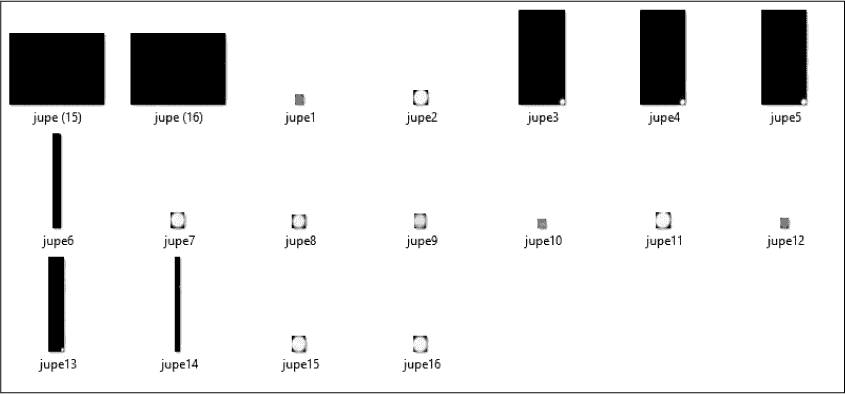

*图 15-5: 由于定义边界框尺寸的问题，裁剪后的图像大小不规则*

为了消除破坏边界框技术的噪声影响，将加载的图像转换为“L”模式——由 8 位黑白像素组成——并将该变量命名为`gray`，表示灰度图 ➎。使用这种模式时，图像只有一个通道（与 RGB 彩色图像的三个通道不同），因此在进行阈值化时，你只需要决定一个单一的值——即设定一个阈值，超过或低于该值时触发某个操作。

为一个新变量`bw`赋值，用来保存真正的黑白图像 ➏。使用`point()`方法（用于更改像素值）和一个 lambda 函数，将任何小于 90 的值设为黑色（`0`），其他所有值设为白色（`255`）。阈值是通过反复试验得出的。`point()`方法现在返回一个干净的图像，适合进行边界框的拟合（见图 15-6）。

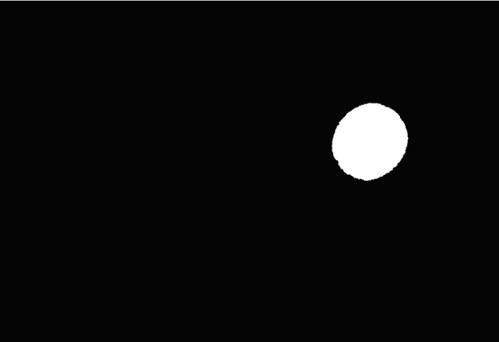

*图 15-6：将原始视频帧之一转换为纯黑白的屏幕截图*

现在，调用`Image`模块的`getbox()`方法，作用于`bw` ➐。此方法通过将边界框拟合到图像的非零区域来修剪掉黑色边框。它返回一个元组，包含边框的左、上、右、下像素坐标。

如果使用`box`裁剪视频帧，会得到一个与木星表面相切的图像（见图 15-7 中的中间图像）。这是你想要的效果，但视觉上不够美观。因此，通过赋值一个新的框变量`padded_box`，并将其四个方向的边缘都扩展 20 像素（见图 15-7 中的最右图像），为图像添加一些黑色填充。由于填充是一致的，并且应用于所有图像，它不会影响裁剪的结果。

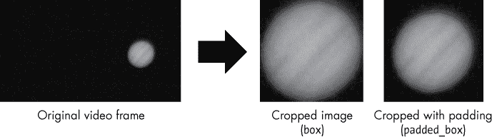

*图 15-7：初始裁剪与木星表面相切（*box*）和带填充的最终裁剪（*padded_box*）*

接下来，通过`crop()`方法裁剪每张图像 ➑。此方法以`padded_box`作为参数。

为了缩放图像，使用`ImageOps.fit()`方法。此方法接受图像、一个像素宽度和高度的元组、一个重采样方法、一个边框（`0`表示无边框）以及甚至是从中心裁剪，中心由元组`(0.5, 0.5)`指定。`pillow`模块提供了多种图像缩放算法，但我选择了流行的*Lanczos*滤镜。放大图像往往会降低其清晰度，但 Lanczos 可以在强边缘产生*振铃伪影*；这有助于增强*感知*清晰度。这种意外的边缘增强可以帮助眼睛集中注意力于那些在原始视频帧中模糊且微弱的特征。

缩放后，赋值一个`file_name`变量。每个被裁剪的 256 个图像文件名将以*cropped_*开头，并以图像编号结尾，图像编号会传递给`format()`方法的替换字段。最后，通过保存文件来结束函数 ➒。

返回到全局作用域，添加让程序可以作为模块或独立运行的代码。

**注意**

*我使用 JPEG 格式保存文件，因为它是通用的、易于读取的，且能够很好地处理色彩渐变，内存占用也非常小。然而，JPEG 使用的是“有损”压缩，这意味着每次保存文件时，图像都会有一点微小的损失；你可以在存储空间的开销下调整压缩的程度。在大多数情况下，处理天文照片时，你会希望使用一种无损格式，例如 TIFF。*

在工作流程的这个阶段，你已经将原始视频帧裁剪成围绕木星的框框；然后你将裁剪后的图像缩放到更大且一致的尺寸（图 15-8）。

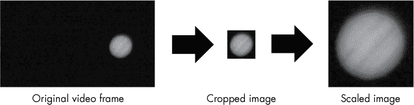

*图 15-8：裁剪和缩放后图像的相对大小*

在接下来的部分，你将编写代码来堆叠裁剪和缩放后的图像。

#### ***堆叠代码***

*stack_images.py* 代码将上一程序生成的图像进行平均，生成一张单一的堆叠图像。你可以从本书的资源网站下载该代码，地址是 *[`www.nostarch.com/impracticalpython/`](https://www.nostarch.com/impracticalpython/)*。请将其保存在与 *crop_n_scale_images.py* 程序相同的文件夹中。

列表 15-5 导入模块，加载图像，创建颜色通道（红色、蓝色、绿色）的列表，平均通道，重新合并通道，并创建并保存最终的堆叠图像。代码足够简单，因此我们不需要使用 `main()` 函数。

*stack_images.py*

```py
➊ import os
   from PIL import Image

   print("\nstart stacking images...")

   # list images in directory
➋ os.chdir('cropped')
   images = os.listdir()

   # loop through images and extract RGB channels as separate lists
➌ red_data = []
   green_data = []
   blue_data = []
➍ for image in images:
       with Image.open(image) as img:
           if image == images[0]:  # get size of 1st cropped image
               img_size = img.size  # width-height tuple to use later
        ➎ red_data.append(list(img.getdata(0)))
           green_data.append(list(img.getdata(1)))
           blue_data.append(list(img.getdata(2)))

➏ ave_red = [round(sum(x) / len(red_data)) for x in zip(*red_data)]
   ave_blue = [round(sum(x) / len(blue_data)) for x in zip(*blue_data)]
   ave_green = [round(sum(x) / len(green_data)) for x in zip(*green_data)]

➐ merged_data = [(x) for x in zip(ave_red, ave_green, ave_blue)]
➑ stacked = Image.new('RGB', (img_size))
➒ stacked.putdata(merged_data)
   stacked.show()

➓ os.chdir('..')
   stacked.save('jupiter_stacked.tif', 'TIFF')
```

*列表 15-5：分离并平均颜色通道，然后重新合成成单一图像*

首先，重复使用在之前程序中用过的一些导入 ➊。接下来，将当前目录更改为 *cropped* 文件夹，该文件夹包含木星的裁剪和缩放图像 ➋，并立即使用 `os.listdir()` 获取文件夹中的图像列表。

使用 `pillow`，你可以操作单个像素或像素组，并且可以针对单独的颜色通道（如红色、蓝色和绿色）进行操作。为了演示这一点，你将处理单独的颜色通道来堆叠图像。

创建三个空列表来存储 RGB 像素数据 ➌，然后开始遍历图像列表 ➍。首先，打开图像。接着，获取第一张图像的宽度和高度，以像素为单位，作为一个元组。记住，在之前的程序中，你将所有的小裁剪图像缩放到了一个更大的尺寸。稍后你需要这些尺寸来创建新的堆叠图像，`size` 会自动为你获取这些信息。

现在使用 `getdata()` 方法获取选定图像的像素数据 ➎。传递方法颜色通道的索引：`0` 表示红色，`1` 表示绿色，`2` 表示蓝色。将结果适当地追加到数据列表中。每张图像的数据将形成数据列表中的一个单独列表。

要对每个列表中的值进行平均，可以使用列表推导将所有图像中的像素求和，并除以图像总数 ➏。注意，你使用了带有解包（`*`）操作符的`zip`。例如，`red_data`列表是一个列表的列表，每个嵌套列表代表一个 256 张图像文件中的数据。使用带有`*`的`zip`可以解包这些列表的内容，从而使图像 1 中的第一个像素与图像 2 中的第一个像素相加，依此类推。

要合并平均的颜色通道，使用带有`zip`的列表推导 ➐。接下来，使用`Image.new()` ➑创建一个新的图像，命名为`stacked`。将方法的颜色模式（`'RGB'`）和包含所需图像宽度和高度的`img_size`元组传递给它，这个元组之前是从其中一个裁剪过的图像中获得的。

使用`putdata()`方法填充新的`stacked`图像，并将`merged_data`列表传递给它 ➒。此方法将数据从一个序列对象复制到图像中，从左上角 `(0, 0)` 开始。使用`show()`方法显示最终图像。最后，切换到父目录并将图像保存为名为*jupiter_stacked.tif*的 TIFF 文件 ➓。

如果你将其中一个原始视频帧与最终的叠加图像（*jupiter_stacked.tif*）进行比较，如图 15-9 所示，你会看到边缘定义和信噪比的明显提升。这在颜色上最为明显，因此如果你还没有运行该程序，可以花点时间从网站上下载*Figure 15-9.pdf*。当图像以彩色显示时，叠加的好处包括更平滑、像“奶油”般的白色条带，更清晰的红色条带，以及更明显的大红斑。然而，仍然有改进的空间，接下来你将编写一个程序来增强最终的叠加图像。

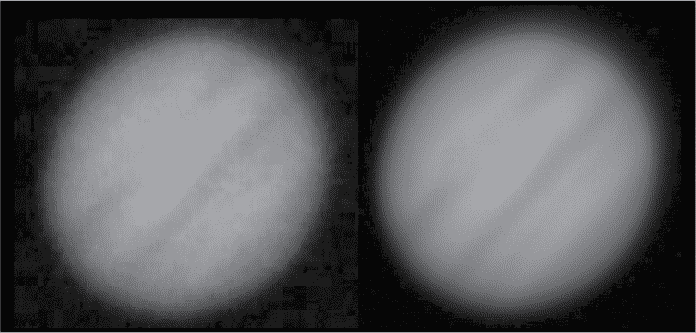

*图 15-9：一个原始视频帧与最终叠加图像（*jupiter_stacked.tif*）的对比*

**注意**

*如果在叠加图像中大红斑看起来有些粉红，那是因为它确实是！它会时常褪色，许多公开的木星图片由于处理过程夸大了颜色，因此这种微妙的色调常常被忽略。或许这样更好，因为“伟大的粉红斑”听起来总不如“伟大的红斑”那么有气势。*

#### ***增强代码***

你已经成功地叠加了所有视频帧，但木星仍然歪斜，且其特征较为模糊。你可以使用`pillow`中的滤镜、增强器和变换工具进一步改善叠加图像。随着图像的增强，你会越来越远离“真实”原始数据。出于这个原因，我选择将增强过程隔离到一个单独的程序中。

通常，堆叠后的第一步是增强细节，使用高通滤波器或锐化掩模算法，然后微调亮度、对比度和色彩。代码将利用 `pillow` 的图像增强功能来执行这些步骤——尽管顺序不同。你可以从 *[`nostarch.com/impracticalpython/`](https://nostarch.com/impracticalpython/)* 下载代码文件 *enhance_image.py*。将其与之前的 Python 程序保存在同一文件夹中。

**注意**

*天文图像的处理可能相当复杂，关于这一主题已经有整本书籍。这个工作流程中省略了一些标准步骤。例如，原始视频没有进行校准，且未纠正由于湍流造成的畸变效应。像 RegiStax 或 AviStack 这样的高级软件可以通过扭曲单独的图像来防止模糊，从而确保像云带边缘这样的扭曲特征在所有图像中正确重叠。*

列表 15-6 导入了 `pillow` 类，并打开、增强并保存了前面代码生成的堆叠图像。由于增强图像有很多可能的选项，尽管程序很小，我还是选择将其模块化。

*enhance_image.py*

```py
➊ from PIL import Image, ImageFilter, ImageEnhance

➋ def main():
       """Get an image and enhance, show, and save it."""
    ➌ in_file = 'jupiter_stacked.tif'
       img = Image.open(in_file)
    ➍ img_enh = enhance_image(img)
       img_enh.show()
       img_enh.save('enhanced.tif', 'TIFF')

➎ def enhance_image(image):
       """Improve an image using pillow filters & transforms."""
    ➏ enhancer = ImageEnhance.Brightness(image)
    ➐ img_enh = enhancer.enhance(0.75)  # 0.75 looks good

    ➑ enhancer = ImageEnhance.Contrast(img_enh)
       img_enh = enhancer.enhance(1.6)
       enhancer = ImageEnhance.Color(img_enh)
       img_enh = enhancer.enhance(1.7)

    ➒ img_enh = img_enh.rotate(angle=133, expand=True)

    ➓ img_enh = img_enh.filter(ImageFilter.SHARPEN)

       return img_enh

   if __name__ == '__main__':
       main()
```

*列表 15-6：打开图像、增强它并使用新名称保存*

导入部分除了最后两个模块 ➊ 外，其他都很常见。这些新模块，`ImageFilter` 和 `ImageEnhance`，包含了预定义的滤镜和类，可以用来通过模糊、锐化、亮化、平滑等方式改变图像（查看 *[`pillow.readthedocs.io/en/5.1.x/`](https://pillow.readthedocs.io/en/5.1.x/)* 以查看每个模块中包含的完整列表）。

首先定义 `main()` 函数 ➋。将堆叠图像赋值给名为 `in_file` 的变量，然后传递给 `Image.open()` 打开该文件 ➌。接下来，调用 `enhance_image()` 函数并传入图像变量 ➍。显示增强后的图像，然后将其保存为 TIFF 文件，这样图像质量不会退化。

现在，定义一个增强函数 `enhance_image()`，它将图像作为参数 ➎。用更简单的话来说，`pillow` 文档中提到，所有增强类都实现了一个公共接口，包含一个名为 `enhance(factor)` 的方法，该方法返回增强后的图像。`factor` 参数是一个浮动值，用于控制增强的程度。值为 `1.0` 时返回原图；较低的值会减弱颜色、亮度、对比度等；较高的值则会增强这些特性。

要改变图像的亮度，首先创建`ImageEnhance`模块中的`Brightness`类的实例，并传入原始图像 ➏。模仿`pillow`文档，将该对象命名为`enhancer`。为了得到最终的增强图像，你调用该对象的`enhance()`方法，并传入`factor`参数 ➐。此时，你将亮度降低了 0.25。行尾的`# 0.75`注释是一种有用的方式来尝试不同的系数。使用这个注释保存你喜欢的值，这样如果其他测试值没有得到令人满意的结果，你可以记住并恢复它们。

继续增强图像，调整对比度到➑。如果你不想手动调整对比度，可以试试`pillow`的自动对比度方法。首先，从 PIL 导入`ImageOps`。然后，将以步骤➑开头的两行代码替换为一行：`img_enh = ImageOps.autocontrast(img_enh)`。

接下来，增加颜色的饱和度。这将帮助让大红斑更加明显。

没有人愿意看一张倾斜的木星图像，所以将图像旋转到一个更“传统”的视角，其中云带水平，大红斑位于右下方。调用`Image`模块的`rotate()`方法，并传入一个角度，角度按逆时针方向计算（单位为度），并让它自动扩展输出图像，以确保整个旋转后的图像都能显示完整 ➒。

现在，锐化图像。即使是在高质量的图像上，锐化可能也是必需的，以改善数据转换、调整大小、旋转图像等带来的插值效果。尽管一些天文摄影资源推荐将锐化操作放在前面，但在大多数图像处理工作流程中，锐化是最后一步。这是因为锐化依赖于图像的最终大小（观看距离）以及所使用的媒体。锐化还可能增加噪点伪影，并且是“有损”的操作，可能会删除数据——这通常不希望在进行其他编辑之前发生。

锐化与之前的增强操作略有不同，因为你需要使用`ImageFilter`类。无需中间步骤，你只需要通过调用图像对象的`filter()`方法，并传入预定义的`SHARPEN`滤镜 ➓，就可以用一行代码创建新的图像。`pillow`模块还提供了其他有助于定义边缘的滤镜，如`UnsharpMask`和`EDGE_ENHANCE`，但对于这张图像，效果与`SHARPEN`几乎没有区别。

最后，通过返回图像并应用代码来运行程序，无论是作为模块还是独立模式。

最终增强后的图像与随机视频帧及最终堆叠图像进行比较，见图 15-10。所有图像都已旋转，以便于比较。

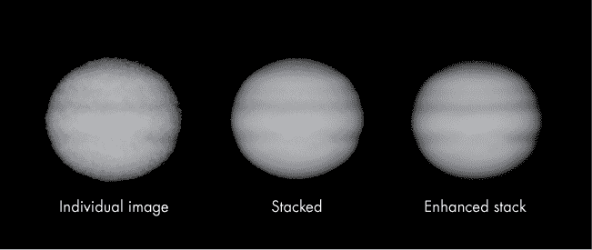

*图 15-10：一帧随机视频、堆叠 256 帧的结果以及最终增强图像*

当你以彩色查看时，最能看到改进。如果你想在运行程序之前看到彩色版本，可以在网站上查看或下载 *Figure 15-10.pdf* 文件。

**注意**

*如果你熟悉* pillow*，你可能知道可以使用* Image.blend() *方法仅通过几行代码堆叠图像。然而，在我看来，结果图像的噪声明显比通过分离和平均各个颜色通道所得到的图像要高，就像你在* stack_images.py *程序中所做的那样。*

### **总结**

图 15-10 中的最终图像不会赢得任何奖项，也不会出现在 *Sky & Telescope* 杂志上，但重点是接受挑战。而且，结果相较于从视频中捕获的单张图像有了显著改进。颜色更加鲜明，云带更加清晰，红斑区更加分明。你还可以看清红斑区下风处的动荡区（参见图 15-1）。

尽管开始时输入较为粗糙，但你成功地完成了图像配准、通过堆叠去除噪声，并使用滤镜和变换增强了最终图像。所有这些步骤都是使用 Python 图像库的免费分支 `pillow` 完成的。你还通过使用 Python 的 `shutil` 和 `os` 模块获得了操作文件和文件夹的经验。

对于更高级的图像处理，你可以使用开源计算机视觉库 OpenCV，通过安装和导入 `cv2` 和 `NumPy` 模块来实现。其他选项还包括 `matplotlib`、`SciPy` 和 `NumPy`。就像使用 Python 时一样，处理问题总有不止一种方式！

### **进一步阅读**

*Python 自动化无聊的事情：完全初学者的实用编程*（No Starch Press，2015）由 Al Sweigart 编写，书中包含了多个关于文件、文件夹以及 `pillow` 库的实用章节。

使用 Python 进行天文学研究的在线资源包括 Python for Astronomers (*[`prappleizer.github.io/`](https://prappleizer.github.io/)*）和 Practical Python for Astronomers (*[`python4astronomers.github.io/`](https://python4astronomers.github.io/)*）。

如果你想了解更多关于 OpenCV-Python 库的内容，可以查看教程 *[`docs.opencv.org/3.4.2/d0/de3/tutorial_py_intro.html`](https://docs.opencv.org/3.4.2/d0/de3/tutorial_py_intro.html)*。请注意，`NumPy` 的知识是学习这些教程及编写优化 OpenCV 代码的前提。另一个选择是 SimpleCV，它可以帮助你更容易地入门计算机视觉和图像处理，且学习曲线比 OpenCV 更平缓，但只支持 Python 2。

*天文摄影*（Rocky Nook，2014）由 Thierry Legault 编写，是任何有意从事严肃天文摄影的人的必备资源。这本书是一本全面且易读的参考书，涵盖了从设备选择到图像处理的各个方面。

“使用 Python 对太阳图像进行对齐”（LabJG，2013），这是 James Gilbert 的一篇博客，包含了使用边界框技术裁剪太阳的代码。它还包括一种巧妙的方法，通过使用太阳黑子作为注册点来重新对齐旋转的太阳图像。你可以在 *[`labjg.wordpress.com/2013/04/01/aligning-sun-images-using-python/`](https://labjg.wordpress.com/2013/04/01/aligning-sun-images-using-python/)* 中找到它。

一个谷歌研究团队找到了如何通过堆叠去除股票摄影网站上图像的水印，以及这些网站如何更好地保护其版权。你可以在 *[`research.googleblog.com/2017/08/making-visible-watermarks-more-effective.html`](https://research.googleblog.com/2017/08/making-visible-watermarks-more-effective.html)* 阅读相关内容。

### **挑战项目：消失的艺术**

图像堆叠技术不仅可以去除噪声——它们还可以去除在拍摄现场移动的任何物体，包括人。例如，Adobe Photoshop 有一个堆叠脚本，可以使非静止的物体神奇地消失。它依赖于一种叫做 *中位数* 的统计平均值，这个值就是按从小到大的顺序排列的数字列表中的“中间”值。这个过程需要多张照片——最好是使用三脚架拍摄——这样你想去除的物体会在每张图像中发生位置变化，而背景保持不变。通常你需要 10 到 30 张每隔 20 秒拍摄的照片，或者从视频中提取的相似间隔的帧。

对于均值，你将数字求和并除以总数；而对于中位数，你需要对数字进行排序并选择中间值。在图 15-11 中，显示了一排五张图像，每张图像都标出了相同的像素位置。在第四张图像中，一只乌鸦飞过，破坏了原本完美的白色背景。如果使用均值堆叠，鸟的影像仍然存在。但如果对图像进行中位数堆叠——也就是说，对红、绿、蓝通道进行排序并取中间值——你就能得到每个通道的背景值（`255`）。鸟的痕迹就消失了。

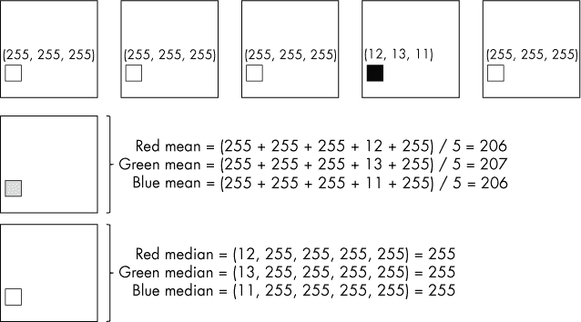

*图 15-11：五张白色图像，突出显示相同的像素并显示其 RGB 值。中位数堆叠去除了黑色像素。*

当你使用中位数进行平均时，伪值会被推到列表的两端。这使得去除离群值变得容易，比如天文照片中的卫星或飞机，只要包含离群值的图像数量少于总图像数量的一半。

掌握了这些知识后，编写一个图像堆叠程序，去除你度假照片中的不速之客。你可以从网站上下载 *moon_cropped* 文件夹进行测试，该文件夹包含五张合成的月球图像，每张图像都被一架飞过的飞机“破坏”了（见图 15-12）。

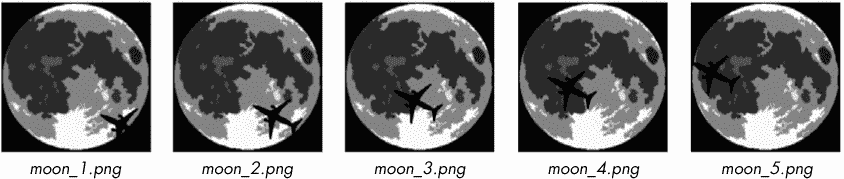

*图 15-12：用于测试中值平均法方法的合成月球照片*

你最终的叠加图像应该没有飞机的痕迹（图 15-13）。

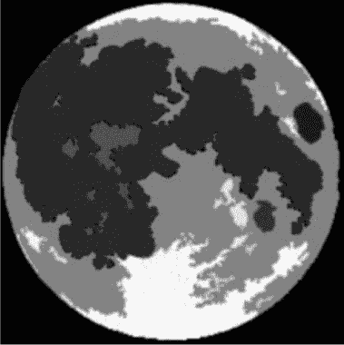

*图 15-13：使用中值平均法叠加* moon_cropped *文件夹中的图像结果*

由于这是一个挑战项目，因此没有提供解决方案。
