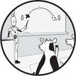

## 4

重复代码：无限循环

你在第三章中学习的 for 循环和 range 循环非常适合用来遍历字符串或索引范围。但是，当我们没有字符串或者索引不遵循固定模式时该怎么办呢？我们使用 while 循环，这是本章的主题。while 循环比 for 循环更为通用，可以处理 for 循环无法应对的情况。

我们将解决三个 for 循环无法胜任的问题：确定老虎机可以玩多少次、组织播放列表直到用户希望停止以及解码一个编码的消息。

### 问题 #8：老虎机

在没有钱的情况下，老虎机可以玩多少次？这是一个微妙的问题，不仅依赖于我们最初的资金，还依赖于玩游戏时的中奖模式。我们会发现，这种情况需要使用 while 循环，而不是 for 循环。

这是 DMOJ 问题 ccc00s1。

#### 挑战

玛莎去赌场并带来了*n*个硬币。赌场有三台老虎机，她按顺序玩它们，直到没有硬币为止。也就是说，她先玩第一台老虎机，再玩第二台，再玩第三台，然后再回到第一台，依此类推。每次玩需要一个硬币。

老虎机的运行规则如下：

+   第一台老虎机每玩第 35 次支付 30 个硬币。

+   第二台老虎机每玩第 100 次支付 60 个硬币。

+   第三台老虎机每玩第 10 次会支付 9 个硬币。

+   其他游戏没有任何奖励。

确定玛莎在没有硬币时玩多少次。

#### 输入

输入由四行组成。

+   第一行包含一个整数*n*，即玛莎带到赌场的硬币数。*n*的范围是 1 到 1000 之间。

+   第二行包含一个整数，表示自上次支付以来第一台老虎机已被玩过的次数。这些游戏发生在玛莎到达之前，玛莎的游戏从这里开始。例如，假设第一台老虎机自上次支付以来已玩了 34 次。那么，玛莎第一次玩时将赢得 30 个硬币。

+   第三行包含一个整数，表示自上次支付以来第二台老虎机已被玩过的次数。

+   第四行包含一个整数，表示自上次支付以来第三台老虎机已被玩过的次数。

#### 输出

输出以下句子，其中 x 是玛莎在没有硬币时玩多少次：

玛莎玩 x 次后破产。

### 探索测试用例

让我们通过一个示例来演示，确保这个问题中的每个细节都清楚明了。这里是我们使用的测试用例：

7

28

0

8

为了仔细追踪玛莎的游戏，我们需要跟踪六个信息点。使用表格来记录这些信息很方便，因为每一行可以告诉我们每次游戏后的状态。这里是我们的列：

**玩** 玛莎已经玩过的老虎机数量

**代币** 玛莎拥有的代币数量

**下一个游戏** 玛莎接下来要玩的老虎机

**第一次游戏** 自上次支付以来，第一个老虎机已经被玩了多少次

**第二次游戏** 自上次支付以来，第二个老虎机已经被玩了多少次

**第三次游戏** 自上次支付以来，第三个老虎机已经被玩了多少次

首先，玛莎已经玩过零次老虎机，她有七个代币，接下来她会玩第一个老虎机。自上次支付以来，第一个老虎机已经被玩了 28 次，第二个老虎机已经被玩了 0 次，第三个老虎机已经被玩了 8 次。我们的状态如下：

| **玩** | **代币** | **下一个游戏** | **第一次游戏** | **第二次游戏** | **第三次游戏** |
| --- | --- | --- | --- | --- | --- |
| 0 | 7 | 第一个 | 28 | 0 | 8 |

玛莎从玩第一个老虎机开始。那需要一个代币。因为这是自上次支付以来，这台机器被玩过的第 29 次，而不是第 35 次，所以老虎机不会支付玛莎任何奖励。玛莎接下来会玩第二个老虎机。我们的新状态如下：

| **玩** | **代币** | **下一个游戏** | **第一次游戏** | **第二次游戏** | **第三次游戏** |
| --- | --- | --- | --- | --- | --- |
| 1 | 6 | 第二次 | 29 | 0 | 8 |

玩第二个老虎机需要一个代币。因为这是自上次支付以来，这台机器被玩过的第一次，而不是第 100 次，所以老虎机不会支付玛莎任何奖励。玛莎接下来会玩第三个老虎机。我们的新状态如下：

| **玩** | **代币** | **下一个游戏** | **第一次游戏** | **第二次游戏** | **第三次游戏** |
| --- | --- | --- | --- | --- | --- |
| 2 | 5 | 第三次 | 29 | 1 | 8 |

玩第三个老虎机需要一个代币。因为这是自上次支付以来，这台机器被玩过的第九次，而不是第十次，所以老虎机不会支付玛莎任何奖励。接下来，玛莎将回到第一个老虎机。我们新的状态如下：

| **玩** | **代币** | **下一个游戏** | **第一次游戏** | **第二次游戏** | **第三次游戏** |
| --- | --- | --- | --- | --- | --- |
| 3 | 4 | 第一个 | 29 | 1 | 9 |

现在，玛莎玩第一个老虎机：

| **玩** | **代币** | **下一个游戏** | **第一次游戏** | **第二次游戏** | **第三次游戏** |
| --- | --- | --- | --- | --- | --- |
| 4 | 3 | second | 30 | 1 | 9 |

然后，玛莎玩第二个老虎机：

| **玩** | **代币** | **下一个游戏** | **第一次游戏** | **第二次游戏** | **第三次游戏** |
| --- | --- | --- | --- | --- | --- |
| 5 | 2 | 第三次 | 30 | 2 | 9 |

玛莎几乎没有剩余的硬币了！但有好消息，因为接下来她将玩第三台老虎机。自从上次支付以来，它已经进行了九次游戏。因此，下一次游戏是它的第十次，这次将支付玛莎九个硬币。她原本有两个硬币，支付一个来玩这个机器，然后得到了九个硬币，所以她这次游戏后将有 2 – 1 + 9 = 10 个硬币：

| **播放次数** | **硬币数** | **下一次播放** | **第一次播放** | **第二次播放** | **第三次播放** |
| --- | --- | --- | --- | --- | --- |
| 6 | 10 | first | 30 | 2 | 0 |

注意到第三台老虎机自上次支付以来，已经进行了零次游戏。

到目前为止已经进行过六次播放。我鼓励你继续追踪。你应该会看到玛莎再也没有得到报酬，并且在再进行 10 次播放后（总共 16 次），玛莎破产了。

### for 循环的局限性

在第三章中，我们学习了 for 循环。标准的 for 循环会遍历一个序列，比如字符串。在老虎机问题中，我们当然没有字符串。

Range for 循环遍历一个整数范围，可以用于指定次数的循环。但对于老虎机问题，我们应该循环多少次呢？十次？五十次？谁知道呢。这取决于玛莎能玩多少次，直到她用完硬币。

我们没有字符串，也不知道需要多少次迭代。如果我们只有 for 循环，我们就会被卡住。

进入 *while 循环*，这是 Python 提供的最通用的循环结构。我们可以编写与字符串或整数序列无关的 while 循环。为了获得这种额外的灵活性，我们需要更加小心，并对编写循环负更多责任。让我们深入了解一下！

### while 循环

要编写一个 while 循环，我们使用 Python 的 while 语句。while 循环由一个布尔表达式控制。如果布尔表达式为 True，则 Python 执行一次 while 循环的迭代。如果表达式仍为 True，则 Python 执行另一次迭代，以此类推，直到布尔表达式为 False。如果布尔表达式在开始时就是 False，那么循环根本不会执行。

while 循环是 *不确定循环*：迭代次数可能事先无法知道。

#### 使用 while 循环

让我们从以下的 while 循环示例开始：

❶ >>> num = 0

❷ >>> while num < 5:

...      print(num)

❸ ...      num = num + 1

...

0

1

2

3

4

在 for 循环中，循环变量是由系统自动创建的；我们不需要在循环前使用赋值语句创建变量。但在 while 循环中，我们什么都不免费获得。如果我们需要一个变量来遍历 while 循环中的值，那么我们必须自己创建这个变量。我们在这里通过在循环之前让 num 等于 0 来实现这一点 ❶。

while 循环本身由布尔表达式 num < 5 控制❷。如果 num < 5 为 True，则循环块中的代码将运行。此时，num 的值是 0，因此布尔表达式为 True。因此，我们运行循环块，输出 0，并将 num 增加到 1 ❸。

我们跳回循环的顶部，再次评估 num < 5 的布尔表达式。由于 num 为 1，表达式为 True。因此，我们再次运行循环块，输出 1，并将 num 增加到 2。

回到循环的顶部：num < 5 还为 True 吗？是的，因为 num 的值是 2。这会启动另一次循环迭代，输出 2，并将 num 增加到 3。

这种模式继续下去，循环会再进行两次迭代：一次当 num 为 3 时，另一次当 num 为 4 时。当 num 为 5 时，num < 5 的布尔表达式最终为 False，从而终止了循环。

记住我们需要增加 num ❸是非常重要的。for 循环会自动将循环变量逐步推进到适当的值。但在 while 循环中，我们不能指望什么都不做就能完成工作，必须手动更新变量，才能将我们带到终止条件。如果忘记增加 num，就会发生以下情况：

>>> num = 0

>>> while num < 5:

...     print(num)

...

0

0

0

0

0

0

0

0

... 永远

如果你在你的计算机上运行这段代码，屏幕将充满零，你必须终止程序。你可以通过按 CTRL-C 或关闭 Python 窗口来终止程序。

问题在于 num < 5 永远为 True；循环中的任何代码都无法使其变为 False。这种循环永远不终止的情况被称为*无限循环*。意外地生成无限 while 循环是非常容易的。如果你看到相同的值反复出现，或者程序似乎什么都不做，那么很可能是你卡在了一个无限循环中。仔细检查 while 循环的布尔表达式，并确保循环块正在朝着终止方向进展。

我们可以随意操作 num 变量。这里是一个每次增加 3 的 while 循环：

>>> num = 0

>>> while num < 10:

...     print(num)

...     num = num + 3

...

0

3

6

9

这里是一个从 4 到 0 的 while 循环：

>>> num = 4

❶ >>> while num >= 0:

...     print(num)

...     num = num - 1

...

4

3

2

1

0

注意，我在这里使用了>=而不是> ❶。这样，while 循环在 num 为 0 时仍然会运行，正如预期的那样。

**概念检查**

以下代码的输出是什么？

n = 3

while n > 0:

if n == 5:

n = -100

print(n)

n = n + 1

A.

3

4

B.

3

4

5

C.

3

4

-100

D.

3

4

5

-100

答案：C。while 循环的布尔表达式只在每次迭代开始时检查一次。即使在迭代过程中某个时刻变为 False，剩余的迭代也会完成。

由于 3 大于 0，循环迭代开始。if 语句块被跳过（因为其布尔表达式为 False），所以此迭代输出 3 并将 n 设置为 4。由于 4 大于 0，我们进行下一次迭代，此次迭代输出 4 并将 n 设置为 5。由于 5 大于 0，我们再进行一次迭代。这次 if 语句块执行，将 n 设置为-100。接着输出-100，并将 n 设置为-99。到这里我们停止，因为 n > 0 为 False。

**概念检查**

以下代码的输出是什么？

x = 6

while x > 4:

x = x - 1

print(x)

A.

6

5

B.

6

5

4

C.

5

4

D.

5

4

3

E.

6

5

4

3

答案：C。许多 while 循环做某些事情并更新循环变量，但这个循环不是这样。这个循环首先递减循环变量 x，然后输出它。由于 6 大于 4，循环运行一次，将 5 赋值给 x 并输出 5。接着，5 大于 4，所以进行另一轮迭代，将 4 赋值给 x 并输出 4。就这样：4 不大于 4，所以循环结束。

#### 在循环中嵌套循环

我们可以像在 for 循环中嵌套循环一样，在 while 循环中嵌套循环。在第三章的“嵌套”部分，我提到过内部 for 循环在外部循环的下一次迭代开始之前完成所有迭代。while 循环也是如此。以下是一个示例：

>>> i = 0

>>> while i < 3:

...     j = 8

...     while j < 11:

...         print(i, j)

...         j = j + 1

...     i = i + 1

...

0 8

0 9

0 10

1 8

1 9

1 10

2 8

2 9

2 10

每个 i 的值都会涉及三行输出，每一行对应内部 j 循环的迭代。

**概念检查**

以下嵌套循环会输出多少行？

x = 0

y = 1

while x < 3:

while y < 3:

print(x, y)

y = y + 1

x = x + 1

A. 2

B. 3

C. 6

D. 8

E. 9

答案：A。外部循环的布尔表达式 x < 3 为 True，所以我们执行外部循环的一次迭代。接着进入两个内部循环的迭代：一次当 y 为 1 时，另一次当 y 为 2 时，每次都会输出一行。所以目前为止输出了两行。

但代码中没有任何地方重置 y 的值！因此，y < 3 将再也不会为 True，也不会有进一步的内部循环迭代。

忘记重置循环变量是处理嵌套 while 循环时常见的错误。

#### 添加布尔运算符

为了解决老虎机问题，我们希望在玛莎至少有一枚硬币时进行循环。代码如下：

while quarters >= 1:

这个简单的布尔表达式就足够解决问题。但和 if 语句一样，while 后面的布尔表达式也可以包含关系运算符或布尔运算符。以下是一个示例：

>>> x = 4

>>> y = 10

>>> while x <= 10 and y <= 13:

...     print(x, y)

...     x = x + 1

...     y = y + 1

...

4 10

5 11

6 12

7 13

`while` 循环由布尔表达式 x <= 10 和 y <= 13 控制。与任何 `and` 运算符一样，只有当两个操作数都为 `True` 时，整个表达式才为 `True`。当 x 为 8，y 为 14 时，循环终止，因为 y <= 13 操作数为 `False`。

### 解决问题

要解决老虎机问题，我们知道需要使用 `while` 循环，而不是 `for` 循环，因为我们无法预先预测迭代次数。每次循环迭代将玩当前的老虎机。当循环结束时，Martha 将没有硬币，我们将输出她玩了多少次。

这是每次迭代时需要做的事情：

+   将 Martha 的硬币数量减少一（因为玩一次老虎机需要一枚硬币）。

+   如果 Martha 当前正在玩第一台老虎机，则玩该机器。这涉及到增加该机器的游戏次数。如果这是第 35 次游戏，则支付 Martha，并将该机器的游戏次数重置为 0。

+   如果 Martha 当前正在玩第二台老虎机，则玩该机器（类似于我们玩第一台机器的方式）。

+   如果 Martha 当前正在玩第三台老虎机，则玩该机器（类似于我们玩第一台机器的方式）。

+   增加 Martha 的游戏次数（因为我们刚刚玩了一台机器）。

+   移动到下一台机器。如果 Martha 刚玩过第一台机器，我们要移动到第二台；如果她刚玩过第二台，我们要移动到第三台；如果她刚玩过第三台，我们要回到第一台。

我们的程序现在变得更长了，因此像我刚才做的那样列出计划是一种有效的技术，有助于控制复杂性并引导我们写出正确的代码。我们可以使用这个大纲来确保我们在按照计划执行，且没有遗漏任何步骤。

我们的代码在清单 4-1 中。

quarters = int(input())

first = int(input())

second = int(input())

third = int(input())

plays = 0

❶ machine = 0

❷ while quarters >= 1:

❸ quarters = quarters - 1

❹ if machine == 0:

first = first + 1

❺ if first == 35:

first = 0

quarters = quarters + 30

elif machine == 1:

second = second + 1

if second == 100:

second = 0

quarters = quarters + 60

elif machine == 2:

third = third + 1

if third == 10:

third = 0

quarters = quarters + 9

❻ plays = plays + 1

❼ machine = machine + 1

❽ if machine == 3:

machine = 0

print('Martha plays', plays, 'times before going broke.')

*清单 4-1：解决老虎机问题*

quarters 变量跟踪 Martha 拥有的硬币数量。first、second 和 third 变量分别跟踪自上次支付以来，第一个、第二个和第三个老虎机的游戏次数。

machine 变量跟踪 Martha 将要玩的下一台老虎机。第一台老虎机用数字 0 表示，第二台用数字 1 表示，第三台用数字 2 表示。因此，将 machine 设置为 0 表示下一台要玩的老虎机是第一台 ❶。

我们本可以用 1、2 和 3 来代替 0、1 和 2 来表示老虎机。或者我们也可以使用字符串：'first'、'second' 和 'third'。但从零开始编号是惯例，因此我在这里采用了这种方式。

程序中的最终变量是 plays，它跟踪玛莎玩过的老虎机次数。等玛莎的硬币用完时，我们会输出这个值。

程序的主体部分是一个 while 循环，它在玛莎有硬币的情况下不断循环 ❷。

每次循环都会玩一个老虎机。因此，首先我们会将玛莎的硬币减少 1 ❸。接着，我们玩当前的老虎机。

我们现在在老虎机 0 上吗？老虎机 1 上吗？老虎机 2 上吗？我们需要一个 if 语句来回答这个问题。

我们首先检查是否在老虎机 0 上 ❹。如果是，那么我们增加游戏次数，因为这个老虎机支付了玛莎一个硬币。接下来，我们检查玛莎是否会获得支付，方法是检查自上次支付以来这个机器是否已被玩了 35 次 ❺。如果是，那么我们将这个机器的游戏次数重置为 0，并增加玛莎 30 个硬币。

这里有几个层次的嵌套，因此花点时间确认代码逻辑是正确的。特别注意，每次我们玩第一个机器时，我们都会将它的游戏次数增加 1。但我们只在每 35 次游戏后才支付玛莎——这就是为什么我们需要内层的 if 语句 ❺！

我们处理第二和第三个老虎机的方式与处理第一个老虎机一样。唯一的区别是每个老虎机在它自己规定的次数后支付玛莎，并支付她对应数量的硬币。

玩过老虎机后，我们将玛莎的游戏次数增加了 1 ❻。现在只剩下移动到下一个机器，如果有下一次循环的话，我们就能在正确的机器上。

为了移动到下一个机器，我们将 machine 增加 1 ❼。如果我们在机器 0 上，这将把我们移到机器 1。如果我们在机器 1 上，这将把我们移到机器 2。如果我们在机器 2 上，这将把我们移到机器 3。

*. . .* 机器 3？没有机器 3！如果我们刚刚玩过机器 2，那么我们希望从机器 0 开始重新来过。为此，我们添加了一个检查：如果我们刚刚移动到机器 3 ❽，那么我们知道我们刚才玩过机器 2，因此将 machine 重置为机器 0。

当循环终止时，我们知道玛莎已经没有硬币了。最后，我们输出所需的句子，包括玛莎的游戏次数。

这段代码包含了很多内容：当玛莎没有硬币时停止，跟踪当前的机器，适时支付玛莎，并计算玛莎的游戏次数。现在你可以提交这段代码，但也可以考虑是否会以不同的方式编写其中的部分代码。如果你在循环顶部增加 plays 的值而不是底部会发生什么？你是否认为在循环顶部或底部减少硬币数有区别？你会不会使用新的变量来跟踪玛莎玩过每台老虎机的次数，而不是修改 first、second 和 third？我强烈鼓励你尝试不同的实现方式。如果你做了修改，并且代码不再通过测试，那太好了！现在你有了新的学习机会，去修复代码并了解为什么你的修改导致了不期望的行为。

接下来的两节将进一步改进代码。我们将使用%运算符来减少所需的变量数量，并学习如何使用 f-strings 来简化字符串的构建。

### 模运算符

在第一章的“整数和浮点数”一节中，我介绍了用于计算整数除法余数的模（%）运算符。例如，16 除以 5 的余数是 1：

>>> 16 % 5

1

而 15 除以 5 的余数是 0（因为 5 恰好能除尽 15）：

>>> 15 % 5

0

第二个操作数决定了%运算符可能返回的值的范围。可能的返回值是从 0 开始，直到但不包括第二个操作数。例如，如果第二个操作数是 3，那么%运算符可能返回的值只有 0、1 和 2。另外，随着第一个操作数的增加，我们会在所有可能的返回值之间循环。下面是一个示例：

>>> 0 % 3

0

>>> 1 % 3

1

>>> 2 % 3

2

>>> 3 % 3

0

>>> 4 % 3

1

>>> 5 % 3

2

>>> 6 % 3

0

>>> 7 % 3

1

注意这个模式：0，1，2，0，1，2，如此循环。

这种行为对于计算达到指定数量后再返回 0 非常有用。它正是我们玩老虎机时需要的行为：我们先玩老虎机 0，然后是 1，再是 2，然后回到 0，再是 1，再是 2，如此循环。（这也是为什么我用 0、1、2，而不是其他值，来代表老虎机的原因。）

假设变量 plays 表示玛莎已经玩的次数。为了确定下一个她将玩的机器（0、1 或 2），我们可以使用%运算符。例如，假设玛莎到目前为止只玩了一台老虎机，我们想知道她接下来会玩哪一台。她接下来会玩老虎机 1，而%运算符告诉我们：

>>> plays = 1

>>> plays % 3

1

如果玛莎到目前为止玩了六次，那么她玩过老虎机 0、1、2、0、1、2。接下来她将玩的是老虎机 0。而且，由于她已经玩过这三台机器两次，且没有其他额外的游戏，%运算符给出的结果是 0：

>>> plays = 6

>>> plays % 3

0

作为一个最终的例子，假设玛莎已经玩了 11 次。她完成了三轮：0, 1, 2, 0, 1, 2, 0, 1, 2。这是她的九次游戏。剩下的两次游戏让玛莎在她的下一次游戏中玩老虎机 2：

>>> plays = 11

>>> plays % 3

2

也就是说，我们可以在不显式维护一个机器变量的情况下，推算出要玩的老虎机。

我们还可以使用 `%` 来简化判断当前老虎机是否支付给玛莎的逻辑。考虑第一个老虎机。在 Listing 4-1 中，我们统计了自从老虎机支付后经过的游戏次数。如果这个次数是 35，那么我们就支付玛莎并将计数重置为 0。但如果使用 `%` 运算符，就不需要重置计数。我们只需检查老虎机是否已经被玩了 35 次的倍数，如果是，就支付玛莎。要测试一个数字是否是 35 的倍数，我们可以使用 `%` 运算符。一个数字如果除以 35 没有余数，那么它就是 35 的倍数：

>>> first = 35

>>> first % 35

0

>>> first = 48

>>> first % 35

13

>>> first = 70

>>> first % 35

0

>>> first = 175

>>> first % 35

0

我们可以先检查 `% 35 == 0` 来判断是否支付玛莎。

我已更新 Listing 4-1 以使用 `%` 运算符。新代码见 Listing 4-2。

quarters = int(input())

first = int(input())

second = int(input())

third = int(input())

plays = 0

while quarters >= 1:

❶ machine = plays % 3

quarters = quarters - 1

if machine == 0:

first = first + 1

❷ 如果 first % 35 == 0：

quarters = quarters + 30

elif machine == 1:

second = second + 1

if second % 100 == 0:

quarters = quarters + 60

elif machine == 2:

third = third + 1

if third % 10 == 0:

quarters = quarters + 9

plays = plays + 1

print('Martha plays', plays, 'times before going broke.')

*Listing 4-2: 使用* % *解决老虎机问题*

我在本节中描述的两种方式中都使用了 `%`：一种是根据游戏次数判断当前的机器 ❶，另一种是判断玛莎是否在某次游戏时得到支付（例如，在 ❷ 处）。

将 `%` 与返回除法余数的操作结合使用，体现了它的灵活性。每当你需要在一个循环中计数（0, 1, 2, 0, 1, 2）时，考虑是否可以使用 `%` 来简化你的代码。

### F-Strings

在我们的老虎机解决方案中的最后一步是输出所需的句子，如下所示：

print('Martha plays', plays, 'times before going broke.')

我们必须记得结束第一个字符串，这样我们就可以输出游戏次数，然后为句子的后半部分开始一个新的字符串。另外，我们使用多个参数进行打印，以避免将游戏次数转换为字符串。如果我们存储结果字符串而不是直接打印，我们就需要进行`str`转换：

>>> plays = 6

>>> result = 'Martha plays ' + str(plays) + ' times before going broke.'

>>> result

'Martha plays 6 times before going broke.'

将字符串和整数拼接在一起对于像这样的简单句子来说是可以的，但它不具备可扩展性。以下是我们尝试嵌入三个整数而不是一个时的样子：

>>> num1 = 7

>>> num2 = 82

>>> num3 = 11

>>> 'We have ' + str(num1) + ', ' + str(num2) + ', and ' + str(num3) + '.'

'We have 7, 82, and 11.'

我们不希望每次都要追踪所有的引号、加号和空格。

构建包含字符串和数字的字符串最灵活的方法是使用 *f-string*。下面是前一个示例使用 f-string 的样子：

>>> num1 = 7

>>> num2 = 82

>>> num3 = 11

>>> f'We have {num1}, {num2}, and {num3}.'

'We have 7, 82, and 11.'

注意字符串的开头有一个 f。这个 f 代表格式化，因为 f-strings 允许你格式化字符串的内容。在 f-string 中，我们可以将表达式放入花括号中。当字符串构建时，每个表达式都会被其值替换并插入到字符串中。结果只是一个普通的字符串——这里没有新的类型：

>>> type(f'hello')

<class 'str'>

>>> type(f'{num1} days')

<class 'str'>

花括号中的表达式可以比简单的变量名更复杂：

>>> f'The sum is {num1 + num2 + num3}'

'The sum is 100'

我们可以在 Slot Machines 的最后一行使用 f-strings。下面是它的样子：

print(f'Martha plays {plays} times before going broke.')

即使在这个最简单的字符串格式化上下文中，我认为 f-strings 增加了清晰度。每当你发现自己在将多个部分拼接成一个字符串时，记得使用它们。

关于 f-strings 的一个警告：它们是在 Python 3.6 中加入的，而在本文写作时，Python 3.6 仍然是相对较新的版本。在 Python 的旧版本中，f-strings 会导致语法错误。

如果你使用 f-strings，请确保检查你提交的评测环境是否使用 Python 3.6 或更高版本来测试你的代码。

在继续之前，你可能想尝试解决《章节练习》中的第 1 题，位于 第 99 页。

### 问题 #9：歌曲播放列表

有时我们无法提前知道会提供多少输入。在这个问题中，我们将看到在这种情况下，while 循环是我们所需要的。

这是 DMOJ 问题 ccc08j2。

#### 挑战

我们有五首最喜欢的歌，分别是 A、B、C、D 和 E。我们已经创建了一个包含这些歌曲的播放列表，并使用一个应用程序来管理这个播放列表。歌曲最初的顺序是 A、B、C、D、E。应用程序有四个按钮：

+   按钮 1：将播放列表中的第一首歌移到播放列表的末尾。例如，如果播放列表目前是 A, B, C, D, E，那么它将变成 B, C, D, E, A。

+   按钮 2：将播放列表中的最后一首歌移到播放列表的最前面。例如，如果播放列表目前是 A, B, C, D, E，那么它将变成 E, A, B, C, D。

+   按钮 3：交换播放列表中的前两首歌曲。例如，如果播放列表目前是 A, B, C, D, E，那么它将变成 B, A, C, D, E。

+   按钮 4：播放播放列表！

我们提供了用户按下按钮的输入。当用户按下按钮 4 时，输出播放列表中歌曲的顺序。

#### 输入

输入由一对一对的行组成，每对行的第一行给出一个按钮的编号（1、2、3 或 4），第二行给出用户按下该按钮的次数（介于 1 和 10 之间）。即，第一行是按钮的编号，第二行是按下该按钮的次数，第三行是按钮的编号，第四行是按下次数，依此类推。输入以以下两行结束：

4

1

表示用户按下了按钮 4 一次。

#### 输出

输出播放列表中歌曲的顺序，所有按键按下后的结果。输出必须在一行中，每对歌曲之间用空格分隔。

### 字符串切片

我们的解决方案的高层次计划是使用一个 while 循环，只要我们没有找到按钮 4 的按下，就一直运行。在每次迭代中，我们会读取两行输入并处理它们。最终形成这个结构：

❶ button = 0

while button != 4:

# 读取按钮

# 读取按下次数

# 处理按钮按下

在 while 循环之前，我们创建变量 button 并将其初始化为 0 ❶。没有这个，button 变量就不存在，在 while 循环的布尔表达式中会导致 NameError。这里可以使用任何数字，除了 4，用来触发循环的第一次迭代。

在这个 while 循环内，我们将使用 for 循环来处理按钮按下的次数。对于每次按下，我们将使用 if 语句检查按下的是哪个按钮。我们需要在 if 语句中为每个按钮编写四个缩进代码块。

让我们来讨论如何处理每个按钮。按钮 1 将播放列表中的第一首歌移到播放列表的末尾。由于我们有一个小且已知数量的歌曲，我们可以使用字符串索引来拼接每个字符。记住，字符串的第一个字符位于索引 0，而不是 1。我们可以像这样将该字符放到字符串的末尾：

>>> songs = 'ABCDE'

>>> songs = songs[1] + songs[2] + songs[3] + songs[4] + songs[0]

>>> songs

'BCDEA'

这样做相当繁琐，且仅适用于恰好有五首歌曲的情况。我们可以使用字符串切片来编写更通用且更不容易出错的代码。

*切片*是 Python 的一项特性，它允许我们引用字符串的子字符串。（实际上，它适用于任何序列，正如我们在书中稍后会看到的那样。）它需要两个索引：我们希望开始的位置和我们希望结束的位置的右边一个索引。例如，如果我们使用索引 4 和 8，那么我们会得到索引 4、5、6 和 7 处的字符。切片使用方括号，两个索引之间用冒号分隔：

>>> s = 'abcdefghijk'

>>> s[4:8]

'efgh'

切片不会改变 s 的引用。我们可以使用赋值语句让 s 引用这个切片：

>>> s

'abcdefghijk'

>>> s = s[4:8]

>>> s

'efgh'

在这里很容易犯一个“错位”的错误，认为 s[4:8] 包含索引 8 处的字符。但实际上它并不包含，就像 range(4, 8) 不包括 8 一样。虽然这种行为可能有点违反直觉，但它在 range 和切片操作中是一致的。

我们在进行字符串切片时，必须始终包含冒号，但开始和结束索引是可选的。如果省略了开始索引，Python 会从索引 0 开始切片：

>>> s = 'abcdefghijk'

>>> s[:4]

'abcd'

如果我们省略结束索引，Python 会切片到字符串的末尾：

>>> s[4:]

'efghijk'

那么，如果省略了两个索引呢？这样就会得到一个包含整个字符串的切片：

>>> s[:]

'abcdefghijk'

我们甚至可以在切片中使用负索引。以下是一个示例：

>>> s[-4:]

'hijk'

起始索引指的是从右侧数第四个字符，即 'h'，结束索引被省略。因此我们得到的切片是从 'h' 到字符串的末尾。

与索引不同，切片操作永远不会引发索引错误。如果我们使用超出字符串范围的索引，Python 会切片到字符串的适当位置：

>>> s[8:20]

'ijk'

>>> s[-50:2]

'ab'

我们将使用字符串切片来实现按钮 1、2 和 3 的行为。按钮 1 的代码如下：

>>> songs = 'ABCDE'

>>> songs = songs[1:] + songs[0]

>>> songs

'BCDEA'

该切片给我们整个字符串，除了索引 0 处的字符。（这里并没有涉及到长度为 5 的字符串；这段代码适用于任何长度的非空字符串。）将缺失的字符加回来后，第一首歌就移动到了播放列表的末尾。其他按钮的切片操作也类似，代码如下所示。

**概念检查**

以下代码的输出是什么？

game = 'Lost Vikings'

print(game[2:-6])

A. st V

B. ost V

C. iking

D. st Vi

E. 维京

答案：A. 索引 2 处的字符是 'Lost' 中的 's'。索引 -6 处的字符是 'Vikings' 中的第一个 'i'。因为我们从索引 2 开始，到索引 -6 之前，所以得到的切片是 'st V'。

**概念检查**

哪个密码可以让我们跳出下面的循环？

valid = False

while not valid:

s = input()

valid = len(s) == 5 and s[:2] == 'xy'

A. xyz

B. xyabc

C. abcxy

D. 多个以上的密码可以让我们跳出循环

E. 没有；循环从不执行，也没有得到密码

答案：B. 当 valid 为 True 时，while 循环终止（因为 not valid 为 False）。给定密码中，只有一个密码的长度为 5 且前两个字符为 'xy'，即 xyabc。因此这是唯一一个能使 valid 为 True 并终止循环的密码。

### 解决问题

现在，我们已经通过使用 while 循环循环处理多个按钮，并使用切片进行字符串操作有所练习，准备好解决歌曲播放列表的问题了。请参考 Listing 4-3 中的代码。

songs = 'ABCDE'

button = 0

❶ while button != 4:

button = int(input())

presses = int(input())

❷ for i in range(presses):

if button == 1:

❸ songs = songs[1:] + songs[0]

elif button == 2:

❹ songs = songs[-1] + songs[:-1]

elif button == 3:

❺ songs = songs[1] + songs[0] + songs[2:]

❻ output = ''

for song in songs:

output = output + song + ' '

❼ print(output[:-1])

*列表 4-3：解决歌曲播放列表问题*

`while` 循环会继续，直到按钮 4 被按下 ❶。每次执行 `while` 循环时，我们读取按钮编号，然后读取此按钮被按下的次数。

现在，在外层的 `while` 循环中，我们需要在每次按下按钮时循环一次。选择哪种循环类型时要牢记所有循环的类型。在这里，使用 `range` 循环是最好的选择 ❷，因为它是最简单的方式来精确控制循环的次数。

`range` 循环内部的行为取决于按下的按钮。我们因此使用 `if` 语句来检查按钮编号并相应地修改播放列表。如果按下按钮 1，我们使用切片将第一首歌移到播放列表的末尾 ❸。如果按下按钮 2，我们使用切片将最后一首歌移到播放列表的开头 ❹。为此，我们从字符串的右端开始，然后使用切片将其他所有字符添加进去。对于按钮 3，我们需要修改播放列表，使得前两首歌交换位置。我们通过将索引 1 处的字符放在前面，再放置索引 0 处的字符，最后添加从索引 2 开始的所有字符来构建一个新字符串 ❺。

一旦我们跳出 `while` 循环，就需要输出歌曲，并在每对歌曲之间添加空格。我们不能直接输出歌曲，因为那样没有空格。因此，我们构建一个包含适当空格的输出字符串。为此，我们从空字符串 ❻ 开始，然后使用 `for` 循环将每首歌和空格连接起来。有一个小问题是，这会在字符串的末尾添加一个空格，出现在最后一首歌后面，而我们不希望这样。所以，我们使用切片去除最后的空格字符 ❼。

你现在可以提交给裁判了。

在继续之前，你可能想尝试解决 “章节练习” 中第 3 题，见 第 99 页。

### 问题 #10：秘密句子

即使我们有一个字符串，并且我们知道将提供多少输入，`while` 循环仍然可能是所需的循环类型。这个问题展示了为什么会出现这种情况。

这是 DMOJ 问题 coci08c3p2。

#### 挑战

Luka 在课堂上写下一个秘密句子。他不想让老师读懂这个句子，所以他没有写下原句，而是写下了一个编码版本。在句子中的每个元音（*a*、*e*、*i*、*o* 或 *u*）后面，他加上字母 *p* 和该元音的重复。例如，他不会写下句子 *i like you*，而是写 *ipi lipikepe yopoupu*。

老师获取了 Luka 编码后的句子。帮助老师恢复 Luka 的原始句子。

#### 输入

输入是一行文本，即 Luka 的编码句子。它由小写字母和空格组成。每对单词之间恰好有一个空格。该行的最大长度为 100 个字符。

#### 输出

输出 Luka 的原始句子。

### for 循环的另一个局限性

在第三章中，我们学习了如何使用 for 循环处理字符串。for 循环从头到尾逐个字符地遍历字符串。在许多情况下，这正是我们想要的。例如，在“三杯”中，我们需要从左到右查看每一个交换，因此我们对交换字符串使用了 for 循环。

在其他情况下，这种方式太过限制，使用 range for 循环可能更为合适。range for 循环让我们能够访问索引而不是字符，它还允许我们选择任意步长跳过序列中的元素。例如，我们可以使用 range for 循环访问字符串中的每第三个字符：

>>> s = 'zephyr'

>>> for i in range(0, len(s), 3):

...     print(s[i])

...

z

h

我们还可以使用 range for 循环从右到左处理字符串，而不是从左到右：

>>> for i in range(len(s) - 1, -1, -1):

...     print(s[i])

...

r

y

h

p

e

z

所有这一切假设我们在每次迭代时都希望按照固定的步长进行跳跃。

如果有时我们想向右移动一个字符，而其他时候我们想向右移动三个字符呢？这并不是不可能的。事实上，如果我们能够做到这一点，那么我们就可以很好地解决 Secret Sentence 问题。

为了理解为什么，考虑这个测试案例：

ipi lipikepe yopoupu

假设我们正在通过复制字符来重构 Luka 的原始句子。编码句子的第一个字符是元音字母 i，这也是 Luka 原始句子的第一个字符。根据 Luka 编码句子的方式，我们知道接下来的两个字符将是 p 和 i。我们不希望将这两个字符包含在 Luka 的原始句子中，因此需要跳过它们。也就是说，在处理完索引 0 后，我们希望跳到索引 3。

索引 3 是一个空格字符。由于它不是元音字母，我们将这个字符按原样复制到 Luka 的原始句子中，然后移动到索引 4。索引 4 是字母 l，另一个非元音字母，因此我们也将它复制过去，并移动到索引 5。在索引 5 处，我们有一个元音字母；复制后，我们希望跳到索引 8。

这里的步长是多少？有时我们跳跃三个位置，但并非总是如此。有时我们跳跃一个位置，但也不总是如此。这是三步和一步的混合。for 循环并不是为这种处理方式设计的。

使用 while 循环，我们可以按自己喜欢的方式在字符串中跳跃，不受预定义步长的限制。

### while 循环通过索引

编写一个遍历字符串索引的 while 循环与编写任何其他类型的 while 循环没有区别。我们只需要结合字符串的长度。下面是如何从左到右遍历字符串中的每个字符：

>>> s = 'zephyr'

>>> i = 0

❶ >>> while i < len(s):

...     print('We have ' + s[i])

...     i = i + 1

...

我们有 z

我们有 e

我们有 p

我们有 h

我们有 y

我们有 r

变量 i 使我们能够访问字符串中的每个字符。它从 0 开始，每次循环时增加 1。

我在循环的布尔表达式 ❶ 中使用了 <，以便在我们还没有到达字符串的长度时继续循环。如果我使用 <= 而不是 <，我们会遇到一个 IndexError 错误：

>>> i = 0

>>> while i <= len(s):

...     print('我们有 ' + s[i])

...     i = i + 1

...

我们有 z

我们有 e

我们有 p

我们有 h

我们有 y

我们有 r

回溯（最近的调用最后）：

文件 "<stdin>"，第 2 行，在 <module> 中

IndexError：字符串索引超出范围

字符串的长度是 6。我们得到这个错误是因为循环尝试访问 s[6]，而这是一个无效的索引。

想要以每次跳过三个字符的方式遍历字符串，而不是一个字符一个字符地遍历？没问题；只需将 i 增加 3 而不是 1：

>>> i = 0

>>> while i < len(s):

...     print('我们有 ' + s[i])

...     i = i + 3

...

我们有 z

我们有 h

我们也可以从右向左遍历，而不是从左向右。我们必须从 len(s) - 1 开始，而不是从 0 开始，并且每次迭代时必须减少 i，而不是增加它。我们还必须改变循环的布尔表达式，以便检测何时到达字符串的开头，而不是结尾。以下是如何从右向左遍历，每次遍历一个字符：

>>> i = len(s) - 1

>>> while i >= 0:

...     print('我们有 ' + s[i])

...     i = i - 1

...

我们有 r

我们有 y

我们有 h

我们有 p

我们有 e

我们有 z

对字符串使用 while 循环的最后一个用例：在满足某个条件时停止在第一个索引。

策略是使用布尔“与”运算符，在仍有更多字符需要检查且尚未满足我们的标准时继续循环。例如，以下是我们如何找到字符串中第一个'y'的索引：

>>> i = 0

>>> while i < len(s) and s[i] != 'y':

...     i = i + 1

...

>>> print(i)

4

如果字符串中没有 'y'，循环在 i 等于字符串的长度时停止：

>>> s = 'breeze'

>>> i = 0

>>> while i < len(s) and s[i] != 'y':

...     i = i + 1

...

>>> print(i)

6

当 i 为 6 时，“与”运算符的第一个操作数为 False，因此循环终止。你可能会想为什么“与”运算符的第二个操作数没有导致错误，因为索引 6 不是字符串中的有效索引。原因是布尔运算符使用*短路求值*，这意味着如果运算符的结果已经可以确定，它们就会停止求值它们的操作数。对于“与”运算符，如果第一个操作数为 False，那么我们知道无论第二个操作数是什么，“与”运算符都会返回 False；因此 Python 不会评估第二个操作数。类似地，对于“或”运算符，如果第一个操作数为 True，那么“或”运算符一定会返回 True，因此 Python 不会评估第二个操作数。

### 解决问题

现在我们知道如何使用 while 循环遍历字符串。

对于秘密句子，我们需要根据是处理元音还是非元音来做不同的处理。如果我们处理的是元音，那么我们需要复制该字符并跳过三个字符（跳过 p 和该元音的第二次出现）。如果我们处理的是非元音，那么我们需要复制该字符并继续处理下一个字符。因此，我们始终复制当前字符，但根据当前字符是否为元音，分别跳过三或一个字符。我们可以在 while 循环内部使用 if 语句来为我们看到的每个字符做出这个决定。

解决秘密句子的方案见清单 4-4。

sentence = input()

❶ result = ''

i = 0

❷ while i < len(sentence):

result = result + sentence[i]

❸ if sentence[i] in 'aeiou':

i = i + 3

else:

i = i + 1

print(result)

*清单 4-4：解决秘密句子*

结果变量 ❶ 用于一次构建原始句子中的一个字符。

while 循环的布尔表达式是标准的，直到我们到达字符串的末尾 ❷。在这个循环中，我们首先将当前字符附加到 result 的末尾。然后我们检查当前字符是否是元音 ❸。回想一下在第二章的“关系运算符”中提到的，in 操作符可以用来检查第一个字符串是否出现在第二个字符串中。如果当前字符在元音字符串中，我们就跳过三个字符；否则，我们继续处理下一个字符。

一旦循环结束，我们就遍历了整个编码句子，并将正确的字符复制到 result 中。因此，最后一步就是输出这个变量。

你准备好将代码提交给评审了。Grepeapat wopork!

### break 和 continue

在本节中，我将向你展示 Python 支持的另外两个循环关键字：break 和 continue。根据我的经验，引入这些关键字会导致学习者过度使用它们，从而影响循环的清晰性，因此我决定在本书的其他地方避免使用它们。尽管如此，它们偶尔还是有用的，而且你可能会在其他 Python 代码中看到它们，所以我们简要讨论一下。

#### break

break 关键字立即终止循环，毫不犹豫。

当我们解决歌曲播放列表问题时，我们使用了一个 while 循环，该循环在按钮不是 4 时继续执行。我们也可以使用 break 来解决这个问题；请参见清单 4-5 查看代码。

songs = 'ABCDE'

❶ while True:

button = int(input())

❷ if button == 4:

❸ break

presses = int(input())

for i in range(presses):

if button == 1:

songs = songs[1:] + songs[0]

elif button == 2:

songs = songs[-1] + songs[:-1]

elif button == 3:

songs = songs[1] + songs[0] + songs[2:]

output = ''

for song in songs:

output = output + song + ' '

print(output[:-1])

*清单 4-5：使用* break 解决歌曲播放列表

循环的布尔表达式 ❶ 看起来很可疑：`True`总是`True`，所以乍一看，似乎这个循环永远不会结束。（这就是`break`的缺点。我们不能仅通过布尔表达式来理解循环的终止条件。）但它是可以终止的，因为我们使用了`break`。如果按下按钮 4 ❷，就会触发`break` ❸，从而终止循环。  

让我们再看一个使用`break`的例子。在本章的《while 循环通过索引》一节中，我们编写了代码来找到字符串中第一个'y'的索引。这里是使用`break`的实现：  

>>> s = 'zephyr'  

>>> i = 0  

>>> while i < len(s):  

...     if s[i] == 'y':  

...         break  

...     i = i + 1  

...  

>>> print(i)  

4  

再次注意，循环的布尔表达式具有误导性：它看起来表明循环总是会一直运行到字符串的末尾，但进一步分析发现`break`的存在可能会影响终止条件。  

`break` 只会终止它自己所在的循环，而不会影响任何外部循环。下面是一个例子：  

>>> i = 0  

>>> while i < 3:  

...     j = 10  

...     while j <= 50:  

...         print(j)  

...         if j == 30:  

❶ ...             break  

...         j = j + 10  

...     i = i + 1  

...  

10  

20  

30  

10  

20  

30  

10  

20

30  

注意到`break` ❶如何缩短了 j 循环的执行。但它并不影响 i 循环：该循环有三个迭代，和没有`break` ❶时完全一样。  

#### continue  

`continue` 关键字结束当前迭代而不执行该循环中的其他代码。与`break`不同，它不会完全结束循环。如果循环条件为`True`，那么循环会继续进行下一次迭代。  

这里有一个使用`continue`的例子，它会打印字符串中每个元音字母及其索引：  

>>> s = 'zephyr'  

>>> i = 0  

>>> while i < len(s):  

❶ ...     if not s[i] in 'aeiou':  

...         i = i + 1  

❷ ...         continue  

❸ ...     print(s[i], i)  

...     i = i + 1  

...  

e 1  

如果当前字符不是元音 ❶，那么我们不想打印它。因此，我们增加 i 的值，将其移到下一个字符，然后使用`continue` ❷结束当前的迭代。如果我们进入`if`语句 ❸，那么这意味着我们正在查看一个元音（否则`continue`会阻止我们到达这里）。所以，我们打印该字符并将 i 增加 1，跳过当前字符。  

`continue` 关键字非常吸引人，因为它似乎为我们提供了一种跳出不想执行的迭代的方式。“这不是元音，我走了！”但是，也可以使用`if`语句来实现相同的行为，而且逻辑通常更加清晰：  

>>> s = 'zephyr'  

>>> i = 0  

>>> while i < len(s):  

...     if s[i] in 'aeiou':  

...         print(s[i], i)  

...     i = i + 1  

...  

e 1  

与其在当前字符不是元音时跳过该迭代，不如让`if`语句在它*是*元音时处理它。  

### 总结  

本章问题的统一特点是我们事先并不知道循环需要多少次迭代。  

**老虎机** 迭代次数取决于最初的硬币数量和老虎机的支付金额。

**歌曲播放列表** 迭代次数取决于按下了多少个按钮。

**秘密句子** 迭代次数以及每次迭代要做什么，取决于元音在字符串中的位置。

当迭代次数未知时，我们使用 `while` 循环，它会根据需要一直运行。使用 `while` 循环比使用 `for` 循环的代码更容易出错，但它也更加灵活，因为我们不再受到 `for` 循环要求系统性地遍历序列的限制。

在下一章中，我们将学习列表，它允许我们存储大量的数字或字符串数据。那么，我们打算如何处理这些数据呢？没错：使用循环！练习以下练习以提高你的循环技能。我们在使用列表解决问题时会频繁用到它们。

### 章节练习

现在你有三种类型的循环可以使用：`for` 循环、`range` 循环和 `while` 循环。使用循环解决问题的挑战之一是知道该使用哪种循环！在接下来的练习中，尝试使用不同类型的循环来找到你最喜欢的解决方案。

1. DMOJ 问题 ccc20j2, 流行病学

1.  DMOJ 问题 coci08c1p2, Ptice

1.  DMOJ 问题 ccc02j2, 美加

1.  DMOJ 问题 ecoo13r1p1, 拿一个数字

1.  DMOJ 问题 ecoo15r1p1, 当你吃糖果时

1.  DMOJ 问题 ccc19j3, 冷敷

### 注释

老虎机最初来源于 2000 年加拿大计算机竞赛的初级/高级组。歌曲播放列表最初来源于 2008 年加拿大计算机竞赛的初级组。秘密句子最初来源于 2008/2009 年克罗地亚信息学开放竞赛，第三场竞赛。
