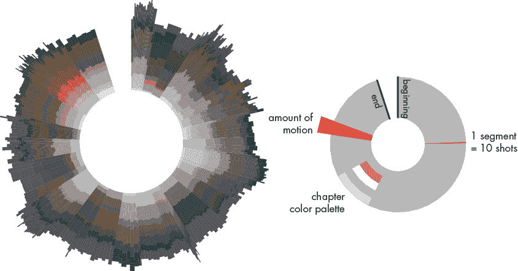
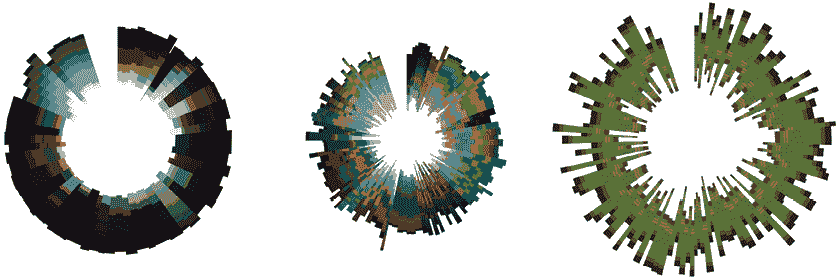
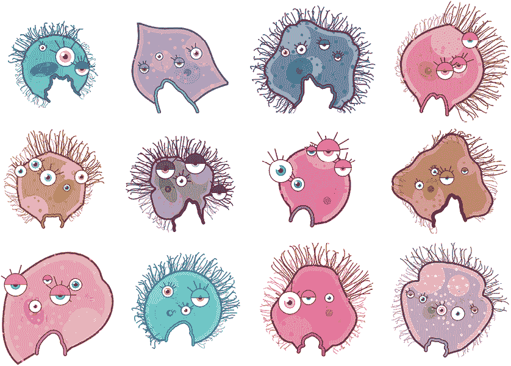

# 序言

当我第一次接触编程代码时，我盯着屏幕上的晦涩命令和符号，既惊讶又困惑，想知道怎么可能有人能理解这些，更别说写它了。我按下 F5 键，程序神奇地生成了一个城市景观，其中两个玩家以大猩猩形象互相投掷爆炸香蕉。我尝试修改几行代码看看会发生什么，有时结果是可以预见的或者很酷的。更多时候，游戏干脆无法运行。计算机为了“帮助”我，诊断出了我的错误，喋喋不休地讲解语法和各种“非法”操作。

在接下来的几年里，我一直满足于避免学习编程。然而，当我开始对使自己的创作更具互动性产生兴趣时，情况开始发生变化。你可能已经遇到了我曾经感到沮丧的那些障碍。也许你一直用视觉工具得心应手，但突然遇到瓶颈。或者你失望（甚至惊恐地发现）自己所想要实现的目标，必须深入到代码中去。

软件应用程序及其各种图形控件让我们感觉自己掌控一切。然而，当你发现缺少了你想要的工具时，这种幻觉很快就会消失。通过学习编程，你将真正掌握电脑的使用。

## 这本书适合谁？

本书假设读者没有编程经验。它力求将编程学习过程做到尽可能直观和有趣。内容基于我丰富的教学经验，特别是面向初学者、设计师和互动媒体专业学生。你将获得的技能和知识是编程的基础，适用于日益扩展的创意技术领域，如游戏、网页、增强/虚拟现实，甚至电影的视觉特效。

如果你是艺术家、学生、设计师、研究员，或者只是有兴趣学习编码技能的人，那么 Processing 的 Python 模式非常适合在视觉环境中学习编程。

对于有编程经验的人，本书可以帮助学习 Python、Processing 中的 Python 模式，或是创意编码技巧。

你可能已经接触过其他*可视化*编程语言——类似 Scratch，你通过连接图形元素（如框、图标和箭头）来编程。Python 并非这样的语言——它是一种*文本*编程语言，需要你手动输入代码。不过，为了使学习过程更具视觉性，你将专注于编写代码，生成图形、模式、动画、数据可视化、用户界面和模拟。这种方法不仅能创建出酷炫的图形，同时也帮助你更好地理解编程的基础概念。

## 什么是 Processing 的 Python 模式？

*Processing 的 Python 模式*结合了*Python*编程语言和*Processing*，这是一个用于交互式和图形编程的开发环境。你还会看到 Processing 的 Python 模式被称为 *Processing.py*。该项目最初是一个名为 Processing.py 的命令行工具，但其开发者决定在该工具为 Processing 开发环境提供支持时将其称为 Python 模式。在本书中，你可以认为这些术语是可以互换的。

Python 是目前最流行的编程语言之一。之所以如此流行有很多理由，下面是*你*应该关注的原因。首先，Python 是一种适合初学者的编程语言。它比 Java 或 C++ 等语言更易于上手，因此你会发现它更容易阅读、编写和理解。其次，它是一种通用编程语言，适用于人工智能（AI）、游戏、仿真、Web 应用程序以及几乎所有其他领域。

Processing 自 2000 年代初以来就存在，它由一个编程语言和一个用于编写和编译代码的编辑器组成。它提供了一系列特殊命令，允许你通过代码绘图、制作动画并处理用户输入。其创始人 Casey Reas 和 Ben Fry 开发 Processing 旨在让编程对设计师和艺术家更为易用，尽管它如今的用户群体已经扩展到研究人员、爱好者和教育工作者。

Java 是最初的 Processing 编程语言的基础，但自那以后出现了其他变体，包括 JavaScript (*p5.js*) 和 Ruby (*JRubyArt*) 版本。2010 年，Jonathan Feinberg 创建了 Processing.py，你可以将其看作是 Processing 的一种扩展，它允许你使用 Python 编写代码，而不是类似 Java 的代码。

Python 和 Processing 都是开源的，且不收费。更重要的是，你几乎可以在任何平台上使用它们，包括 Linux、macOS 和 Microsoft Windows。

## 什么是算法？

你在编程领域中将经常遇到“*算法*”这个词。你可以将算法看作是计算机或机器为了达到特定目标必须遵循的一组规则。例如，制作一杯速溶咖啡的算法可以如下所示：

1.  在杯子里放一茶匙咖啡粉。

1.  将水壶加满水。

1.  打开水壶。

1.  当水烧开后，将 240 毫升沸水倒入杯中。

1.  向同一杯子中加入一平茶匙的糖。

1.  搅拌内容。

1.  上菜。

然而，这一系列步骤不足以编程一个真实的咖啡制作机器人。如果杯子的大小不同，小杯子可能会溢出。此外，机器人也会忽视任何加奶或加糖的请求。计算机无法做出任何假设，必须要求明确无歧义的指令，并使用机器理解的语言来沟通—例如 Python。学习 Python 语言可能是你最初遇到的障碍，但随着你逐渐熟练，挑战将转向算法思维的掌握。

## 什么是创意编码？

*创意编码*是用于创意输出的计算机编程。这个广泛的术语包含但不限于计算机生成的音频和视觉艺术、互动装置、实验性游戏和数据可视化。

以 Frederic Brodbeck 的*Cinmetrics*项目为例。Brodbeck 使用 Python 开发了一个程序，分析 DVD 电影数据以生成电影的视觉*指纹*。指纹是由许多片段组成的开放环形图；每个片段代表 10 个镜头的跨度，同心圆带显示了每个片段的颜色分解。每个片段的对角线长度表示运动量。图 1 是电影*量子危机*（2008）的*Cinmetrics*指纹。

图 1：*量子危机*的指纹，由 Frederic Brodbeck 创建。截图来自[`cinemetrics.site/`](http://cinemetrics.site/)。

这些指纹还可以动画化，此时，运动将通过脉动的片段来呈现。互动界面提供了预设和滤镜的选择，以便你可以将指纹排列在一起进行比较—例如，比较原版与翻拍、不同类型的电影、同一导演的作品等等。图 2 比较了（从左到右）*2001 太空漫游*（1968）、*辛普森电影*（2007）和一场足球比赛。

图 2：比较（从左到右）*2001 太空漫游*、*辛普森电影*和一场足球比赛的指纹。截图来自[`cinemetrics.site/`](http://cinemetrics.site/)。

许多创意编码项目采用类似的基础方法，其中数据被输入到程序中以影响它如何控制输出。实时音频同步的音乐可视化—如在流行媒体播放器软件中展示的那样—就是一个很好的例子。然而，你还可以尝试其他许多数据源，如网络订阅源、健身追踪器、环境传感器和大量的公共数据集。

在某些情况下，选择随机化的数据值是很有用的。考虑一下程序生成的游戏内容。与其手动构建关卡，不如编程使游戏自动生成地下城布局、地形、叙事元素和敌人生成位置。当然，这样的游戏应该包含合理的约束条件；例如，限制一次出现的敌人总数，并确保关卡布局不会是无法通行的。

游戏角色可以通过随机选择模块化组件构成，或完全通过形状和公式生成。例如，我写了一个 Processing Python 程序，生成图 3 中显示的随机微生物怪兽。这个代码——改编自 Lieven Menschaert 的 NodeBox 脚本*Aquatics!*——生成一个具有随机填充颜色、形状（由一种叫做*超级公式*的东西定义）并且至少有三只眼睛的生物。它有 70%的概率在生物的边缘生长出毛发，而这些毛发可以被随机方向的水流所摆动。

图 3：Lieven Menschaert 的 NodeBox 脚本*Aquatics!*的 Processing.py 改编版

无数酷炫的创意编程项目存在——从涂鸦和写诗的机器人，到进化模拟器，甚至还有一个程序，它通过卫星图像寻找类似字母的建筑或基础设施（*The Aerial Bold Project*，由 Benedikt Groß和 Joey Lee 发起，2016 年）。

也许这种创意编程听起来对你来说有些太艺术化了？Processing 对于你一直梦想构建的赛车模拟器也不太合适，更适合后台 Web 开发也不是它的强项。没关系，使用 Processing 的 Python 模式进行创意编程并不一定是阅读这本书的最终目标。可以把它看作是探索 Python、其他框架、创意编程应用以及编程的一般起点。

## 我在哪里可以找到帮助？

编程是有回报的，部分原因在于它具有挑战性。如果你发现自己在某件事上挣扎，不要紧张；这是正常的！只要稍加坚持，你很快就能掌握那些让你卡住的知识点。

### 在线资源

如果你进展不顺利，可以向在线社区求助。你可以在官方 Processing 论坛的[`discourse.processing.org/`](https://discourse.processing.org/)找到专门的 Processing.py 分类。你会经常发现有人已经遇到并解决了你所面临的挑战；如果没有，可以创建一个新话题。顺便提一下，本书的作者经常在这个友好和热情的网络角落里潜伏。

官方的 Python 模式参考文档可在*https://py.processing.org/reference/*上查看。每个条目都包括描述和简短的代码示例。在你使用 Processing 开发环境时，保持这个网页的打开非常有用。

### 源代码和解决方案

你将输入大量代码。这是好事，因为最好的学习方式就是通过实践。然而，有时你可能会打错字，或者不明白为什么代码不工作。在这种情况下，能够访问一个完整、可工作的文件版本将会很有帮助。你可以访问本书中的所有代码，以及每章挑战的解决方案，网址是[`github.com/tabreturn/processing.py-book/`](https://github.com/tabreturn/processing.py-book/)。你还可以在[`www.nostarch.com/Learn-Python-Visually/`](https://www.nostarch.com/Learn-Python-Visually/)找到本书的任何更新。

## 本书内容是什么？

本书从基础知识开始，随着学习的深入，逐步过渡到更高级的主题。因此，每一章都需要掌握前一章介绍的概念。你将通过一系列实际任务，逐步完成学习目标。你还会找到一些理论内容，丰富的视觉效果，并通过挑战来巩固所学的知识。

以下大纲简要概述了每一章的内容：

1.  第一章：你好，世界！ 本章涵盖了本书的安装与设置程序，并介绍了如何用代码绘制基础图形。你还将学习计算机如何处理颜色，如何使用变量存储和重用值，以及如何使用 Python 执行基本的算术运算。

1.  第二章：绘制更复杂的形状 在第一章中学习了一些绘图基础后，你将继续学习绘制更具有机形状的图形，而非几何图形。你将学习如何通过使用点（或顶点）和曲线来定义形状，这使得你可以用代码绘制几乎任何形状。

1.  第三章：字符串简介与文本处理 本章将教你如何使用 Python 的字符串功能来处理文本。你还将学习如何使用 Processing 函数在显示窗口中绘制文本，使用不同的样式、颜色和字体。

1.  第四章：条件语句 在这一章，你将开始像程序员一样思考。本章将引入控制流的概念，也就是说，你将学习如何编写能够做出决策的程序，执行不同的操作来应对不同的情况。

1.  第五章：迭代与随机性 本章将教你如何编写可以重复某个操作特定次数，或者直到满足某个条件的程序。在本章末，你将尝试随机性并创建平铺图案。

1.  第六章：运动与变换 本章主要讲解如何在 Processing 程序中添加运动效果，并对绘图空间进行变换。你还将学习如何将帧保存为图像，并如何从计算机获取时间值。你将运用这些技能创建一个动画屏保和模拟时钟。

1.  第七章：使用列表和读取数据 Python 列表将为你提供强大的方法来管理和操作集合中的值。你将探索数据可视化的技巧。你还将学习如何从外部文件中读取列表数据。最后的任务是通过使用 CSV 文件渲染一个图表。

1.  第八章：字典和 JSON 字典与列表类似，都是用来存储集合的项。然而，使用字典时，你通过使用一个键（通常是一个单词）来访问项，而不是通过引用项的位置。同样，你将运用新的字典技巧进行数据可视化。你还将学习如何处理 JSON 数据。

1.  第九章：函数与周期运动 你将使用函数将程序划分为具有可重用代码的命名部分。这将使你的代码更加模块化，易于阅读和修改。你还将深入学习一些三角学知识，以生成椭圆形和波动类型的运动。

1.  第十章：面向对象编程与 PVector 你可以使用面向对象编程，通过建模现实世界的物体来结构化程序。在这一章中，你将采用面向对象的方法，构建一个变形虫模拟。你还将学习如何使用 Processing 的 `PVector` 类来编程控制变形虫的运动。

1.  第十一章：鼠标与键盘交互 在这一章中，你将为你的程序添加互动功能。Processing 可以处理来自各种设备的输入，但这里你将专注于鼠标和键盘输入，构建一个绘画应用。在这个过程中，你将了解事件函数，以及如何控制 Processing 的绘制循环行为。

## 出发吧！

你通过这些章节的进度，可能会受到之前在类似领域的经验影响。如果你之前做过任何类型的编程，无论是 Python 还是其他语言，你会遇到一些熟悉的概念。不过，这不是比赛！享受这个过程，适时休息，如果你感到很有灵感，也可以随时偏离路线。
