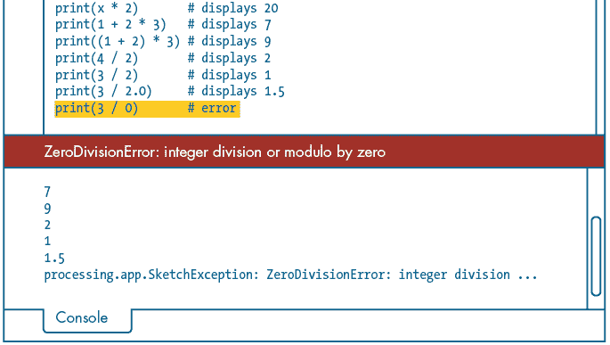

## 第一章：Hello, World!


在学习一门新的编程语言时，传统的第一行代码通常是显示 “Hello, World!” 消息。延续这一传统，你在这里也会写出这样的代码——但这不仅仅是全部。本章将介绍你需要了解的 Processing 基础知识，之后你将快速从简单的 “Hello, World!” 过渡到使用代码绘图。

要开始使用，你需要为 Processing 设置 Python 模式，这样你就可以创建自己的草图。在此过程中，你将学习如何在 Processing 中编写代码的基本规则，以及如何处理错误、使用变量和执行算术运算。你还将了解 Processing 如何处理颜色，以及如何使用弧度测量角度。到本章结束时，你将能够通过使用各种 Processing 函数绘制色彩斑斓的几何图形。让我们开始吧。

## Processing 安装与 Python 模式设置

在编写任何代码之前，你需要为 Processing 设置 Python 模式。前往 Processing 的下载页面（[`processing.org/download/`](https://processing.org/download/)）并下载适合你系统的 Processing 版本（Windows、Linux 或 macOS）。截至 2021 年 1 月，Processing 3.5.4 是最新的稳定版本。

Processing 不使用安装程序。相反，你只需解压你下载的文件（通常是 *.zip* 压缩包）并运行应用程序。具体过程在操作系统之间稍有不同：

+   在 Windows 上，通过右键点击文件并选择 **提取全部** 来解压所有内容，然后按照指示操作。将文件夹提取或移动到计算机上的任何位置，包括 *Program Files* 文件夹或 *Desktop*。

+   在 macOS 上，双击文件进行解压，然后将提取出来的应用程序移到计算机上的任何位置，包括 *Applications* 文件夹或 *Desktop*。

+   Processing 的 Linux 版本是一个 *.tar* 压缩包。将文件夹提取或移动到计算机上的任何位置，包括你的主文件夹或桌面。

完成后，打开新提取的文件夹。图 1-1 显示了你在文件管理器中能看到的简化列表。接下来，定位并运行名为 *processing* 的可执行文件。在 macOS 上，你将只有一个名为 *processing* 的文件。


图 1-1：Windows 或 Linux 的新提取的 *processing* 文件夹内容

应用程序的布局在不同系统和 Processing 版本中可能略有不同，但关键元素已在 图 1-2 中概述。如果你是 Mac 用户，你会在屏幕顶部找到 *菜单栏*。请注意，Processing 界面右上角的按钮标记为 *Java*。这是因为 Processing 默认包含了 Java 模式。


图 1-2：Processing 界面

接下来，激活 Python 模式。点击**Java**按钮，从下拉菜单中选择**添加模式**；然后，在弹出的贡献管理器窗口中选择**Python 模式 for Processing**。最后，点击**安装**。现在，你可以通过下拉菜单在 Python 和 Java 模式之间切换。切换到 Python 模式（见图 1-3）。


图 1-3：右侧的按钮表示已激活 Python 模式。

现在，你准备好编写你的第一行代码了！

## 你的第一个草图

Processing 将程序称为*草图*。考虑到你可能制作的内容的视觉和艺术性质，这个词非常合适。选择**文件**▶**新建**来创建一个新的草图，或者使用菜单旁边列出的快捷键。

输入以下代码：

```py
size(500, 500)print('Hello, World!')
```

我稍后会详细讲解这段代码。现在，使用**文件**▶**另存为**保存草图，并将其命名为*hello_world*。

你会注意到，Processing 创建了一个名为*hello_world*的新文件夹；其中有两个文件：*hello_world.pyde*和*sketch.properties*（见图 1-4）。根据你的系统配置，你可能看不到文件扩展名（*.pyde*）。要重新打开任何草图，只需找到并打开*.pyde*文件。


图 1-4：你的*hello_world*草图文件夹内容

你可能还想在草图文件夹中添加其他资源，如图片和字体，不过这些稍后再讲。

接下来，点击播放（▶）按钮执行代码。更好的方式是使用关联的快捷键：Windows 和 Linux 使用 ctrl-R，macOS 使用-R。此时，应该会出现一个灰色的 500 × 500 像素的*显示窗口*。在编辑器底部的黑色区域，即控制台中，Processing 应该显示`Hello, World!`（见图 1-5）。

现在让我们回到你在这个文件中输入的代码，它使用了两个 Processing 函数：`size()`和`print()`。*函数*是命名的指令，有点像是给计算机的狗命令。有些命令很简单，比如“坐下”，但像“取物”这样的命令可能需要指定 Fido 应该取回的具体物品。

Python 函数由函数名称和开闭*括号*组成，在括号内提供参数。在我使用的狗命令类比中，“球”可以是“取物”的一个参数。`size()`函数（见图 1-6）接受两个参数：第一个表示草图的宽度，第二个是高度。

在这种情况下，显示窗口的宽度为 500 像素，高度为 500 像素。


图 1-5：显示窗口（左）和控制台中显示`′Hello, World!′`的编辑器（右）


图 1-6：`size()`函数的结构

`print()`函数用于输出到控制台。此函数接受一个参数：字符串`'Hello, World!'`。因为这是文本数据——或者严格来说，是*字符串*数据——你需要将其放在引号中。你可以使用单引号或双引号，但请确保开闭引号类型一致。

Python 会根据*数据类型*对每个值进行分类，这决定了该值的处理方式以及你可以在其上执行的操作。例如，你可以对数值数据类型执行算术操作——如除法或减法——但不能对字符串执行。 在本章中，你将处理三种数据类型：

1.  字符串 文本数据，如‘Hello, World!’

1.  整数 没有小数点的数字，如 1、–27 或 422

1.  浮点数 包含小数点的数字，如 1.618

Processing 代码与标准 Python 代码的不同之处在于它的一些函数；例如，`size()`函数是 Processing 特有的。换句话说，它在 Processing 环境之外无法使用。另一方面，`print()`函数是标准 Python 编程语言的内置元素。它在 Processing 的 Python 模式和任何其他 Python 程序中都能工作。

在本书中，我通常在*Processing*的上下文中提到 Processing 特有的功能，而将标准 Python 功能称为*Python*。如果这让你感到困惑，可以把它们看作是同一个东西。此时，区分 Processing 和 Python 并不关键；你会随着时间的推移理解其中的差异。

### 注释

如果你希望 Python 忽略代码中的某部分，可以将其注释掉。这个功能对于自己或其他编辑代码的人留下便于理解的英文注释非常有用。让我们在你的*hello_world*文件中添加几个注释：

```py
1 # dimensions of the display window measured in pixelssize(500, 500)print('Hello, World!') # writes hello world to the console area2 '''This is a multiline comment.Any code between the opening and closing triple-quotes is ignored.'''print('How are you?')
```

注释分为两种类型：单行注释和多行注释。如图所示，单行注释使用`#`字符，1 多行注释使用`'''`（或`"""`）2。

在完成本书任务的过程中，添加注释以提醒自己代码的工作原理。注释在调试代码时也非常有用。例如，如果你怀疑某些代码行导致程序失败，你可以通过注释掉这些行来暂时禁用它们。

### 空白字符

Python 以及扩展的 Processing Python 模式，对空白字符非常敏感。你需要小心插入空格字符或制表符的位置。例如，给`size()`这一行添加一些空格，然后运行草图：

```py
# dimensions of the display window measured in pixels size(500, 500)print('Hello, World!')  # writes hello world to the console area. . .
```

当你运行草图时，消息栏会变为红色，Processing 会显示错误信息（图 1-7）。Python 依赖缩进来区分代码块。缩进的行会导致程序出错，因为 Python 没有遇到任何代码来定义`size()`函数的新代码块。


图 1-7：空白错误

通过删除你刚刚添加的空格字符来修正代码。

随着你在这些章节中的学习，你会逐渐理解什么时候以及在哪里使用缩进。但现在，注意代码中的空格和制表符字符，这些都会影响代码的缩进。

### 错误

空格问题并不是你会遇到的唯一错误类型。偶尔你可能会漏掉某个括号、逗号或引号，特别是在刚开始时。试着从你的`size()`函数中去掉闭括号，像这样：

```py
# dimensions of the display window measured in pixelssize(500, 500print('Hello, World!')  # writes hello world to the console area. . .
```

现在运行代码并观察控制台输出。注意消息栏中的提示（图 1-8）。相当聪明吧？


图 1-8：消息栏中的警告（红色）提示了 Processing 遇到错误的可能原因。

这是一个*语法错误*的例子，而这并不是你第一次遇到这种错误。就像英语句子必须以大写字母开头并以句号结尾一样，Python 函数必须有一个开括号和一个闭括号。当你有多个参数时，需要用逗号将它们分隔开。这套规则被称为*语法*。如果你不遵守这些规则，Python 会感到困惑并报告错误。

错误信息并不总是如此清晰或准确，但它们可以为你提供一个线索，帮助你开始搜索 bug。有时，将错误信息复制并粘贴到搜索引擎中，能帮助你找到解决方案。

### 颜色

在 Processing 中，你可以用多种方式描述颜色。为了简化起见，我将采用*十六进制*值作为第一个示例。如果你熟悉像 Adobe Photoshop、Adobe Illustrator、Inkscape 或 GIMP 这样的图形软件，你可能已经在这些程序的颜色选择器中看到过十六进制值。

Processing 包含了自己的颜色选择器（图 1-9），你可以通过菜单栏选择**工具**▶**颜色选择器**来访问它。你可以使用这个颜色选择器来混合和采样颜色值。以#号开头的值是十六进制值；你可以使用**复制**按钮将其复制，然后粘贴到代码编辑器中。


图 1-9：Processing 颜色选择器

你的屏幕通过混合三种原色显示颜色——就像你在美术课上混合红、黄、蓝颜料一样。然而，你的屏幕使用的是红、绿、蓝三种原色。此外，由于光以*加法*的方式混合颜色，当所有三种原色以最大强度结合时，像素显示为白色。相反，完全没有颜色的像素显示为黑色。其他颜色则包含了不同量的红、绿、蓝。例如，亮红色的混合如下：

100% | 0% | 0%

十六进制颜色值由六个十六进制数字（`0`、`1`、`2`、……、`9`、`A`、`B`、`C`、`D`、`E`、`F`）组成，并可以分为三对，每一对对应一个原色。下面是亮红色的值：

`#FF0000`

`FF` 代表红色量；中间的 `00` 是绿色；最右边的 `00` 是蓝色。由于一些原因，`FF` 相当于 100%。另外，记住你正在混合光线，所以 `#FFFFFF` 是白色，`#000000` 是黑色。这里还有其他一些例子：

1.  100% 蓝色 `#0000FF`

1.  深绿色 `#006600`

1.  深灰色 `#505050`

使用选择器进一步实验，观察当你选择不同颜色时，十六进制值是如何变化的。

`fill()` 函数设置用于填充形状的颜色。根据你使用的颜色系统，它最多接受四个参数。对于十六进制颜色，只需使用一个参数：以 `#` 开头的六位数值，放在引号中。

在你的 *hello_world* 草图底部添加以下代码：

```py
. . .fill('#FF0000')
```

你现在已经将填充颜色设置为红色。为了看到效果，让我们绘制一个矩形。`rect()` 函数用于绘制矩形，它接受四个参数：

```py
rect(`x_coordinate`, `y_coordinate`, `width`, `height`)
```

前两个参数指定矩形左上角的位置（图 1-10）。Processing 的 x 坐标从显示窗口的左边缘开始；y 坐标从顶部边缘开始。


图 1-10：Processing 的坐标系统

显示窗口的左上角坐标是 (0, 0)，右下角是 (500, 500)。因此，要将矩形向下移动，增加 y 坐标值。在你的 *hello_world* 草图中添加一条新的矩形代码：

```py
. . .fill('#FF0000')rect(100, 150, 200, 300)
```

运行草图，确认输出与 图 1-11 匹配。尝试修改 `rect()` 的参数，调整矩形的大小和位置。


图 1-11：`rect(100, 150, 200, 300)`

你现在应该熟悉了 Processing 的坐标系统。`rect()` 是许多绘图函数之一；稍后你将了解更多。

在这一部分，你还学会了使用十六进制值定义颜色，这些值描述了不同量的红、绿、蓝光。你现在可以使用像 Processing 自带的颜色选择器来混合和采样任何你需要的值。你会看到在 Processing 中还有其他定义颜色的系统，但在本书的大部分内容中，你将使用十六进制值。

### 填充和描边

当你编写一条 `fill()` 代码时，之后的每个形状都会使用你指定的颜色进行填充。直到 Processing 遇到下一条 `fill()` 代码，这个颜色才会改变。这样，Processing 就像是画画：你拿起画笔，蘸上颜料，然后你画的每一笔都会受到上次选择的画笔和颜色的影响。当你想以不同的风格或颜色画画时，你更换画笔或蘸取不同的颜料。如果你想完全禁用填充，可以使用 `noFill()`。

在你的 *hello_world* 文件末尾添加以下代码，绘制一个较小的红色矩形、一个橙色正方形以及一个没有填充的正方形：

```py
. . .# small red rectanglerect(10, 15, 20, 30)# orange squarefill('#FF9900')1 rect(50, 100, 150, 150)# fill-less squarenoFill()2 square(250, 100, 150)
```

对于一个正方形，你有两个选择：使用 `rect()` 1 函数，并传入匹配的宽度和高度（第三个和第四个）参数。或者，使用 `square()` 2 函数，它需要三个参数：x、y 和范围。

Processing 会从上到下解释代码行。因此，代码底部的形状会出现在视觉“堆栈”的顶部。所以前面的代码会生成图 1-12 中的形状。


图 1-12：没有填充的正方形——代码的最后一行是最上面的形状。

*描边* 是 *轮廓* 的另一种说法，你可能会使用以下三种描边函数：`stroke()` 用于更改颜色，`strokeWeight()` 用于更改宽度，`noStroke()` 用于完全禁用描边。与 `fill()` 和 `noFill()` 类似，描边函数会影响它们下面的所有内容。

要获得 3 像素宽的白色描边，可以在形状代码之前插入以下代码：

```py
. . .stroke('#FFFFFF')strokeWeight(3)fill('#FF0000'). . .
```

`stroke()` 行会影响它之后的每个形状。图 1-13 显示了现在所有形状都有白色描边。


图 1-13：添加白色描边

对于更粗的描边，你可能需要指定角落和尖端是圆形的还是尖锐的。有关更多信息，请查阅相关的 Processing.py 参考条目，了解 `strokeCap()` 和 `strokeJoin()`。

### 背景颜色

要更改背景颜色，使用 `background()` 函数。在你的代码末尾添加一个背景行：

```py
. . .square(250, 100, 150)background('#004477')
```

运行代码并注意到所有内容都消失了；整个显示窗口现在是一个平坦的蓝色。这是因为 `background('#004477')` 会覆盖它之前的所有内容，当你开始处理动画时，这会非常有用。现在，将该行移动到代码顶部，这样你可以再次看到形状 (图 1-14)：

```py
# dimension of the display window in units of pixelssize(500, 500)background('#004477'). . .
```

请注意，`background` 函数也可以接受图像作为参数（我将在第二章中介绍图像）。


图 1-14：添加背景颜色

## 颜色模式

我将在本章中使用十六进制颜色值，但这里先简单介绍其他颜色模式，因为在某些情况下，你可能需要使用非十六进制的颜色表示。例如，假设你想写一个代码来加深鲜红色的填充。首先，你会回忆起这是一种鲜红色：

```py
fill('#FF0000')
```

你也可以将这个颜色表示为 RGB 格式：

```py
fill(255, 0, 0)
```

在这种安排中，每个红/绿/蓝值是以逗号分隔的。正如你可能已经推断出来的，`255` 等于 `FF`（它本身等于 100%）。为了使红色变得一半亮度，你可以从 `255` 中减去 `127`。然而，试图从 `FF` 中减去 `127` 会有点复杂，因为你在处理十六进制和十进制数字的混合。在这种情况下，使用十进制值更容易（255 – 127 = 128）。

使用`fill(255, 0, 0)`时，`colorMode()`设置为`RGB`。不过，你不需要显式指定这个，因为它是默认模式。它的工作原理是：如果 Processing 检测到一个带引号的单一参数（例如`'#FF0000'`），它会将其解读为十六进制，但如果你提供三个参数，它会自动识别你正在使用 0 到 255 的系统。

然而，你可以使用另一种模式：HSB。一旦设置为`HSB`模式，三个`fill()`参数分别表示*色相*、*饱和度*和*亮度*。为了更好地理解这些变量如何影响颜色，我们来看一下 GIMP 这款开源图像编辑器的颜色选择器（图 1-15）。

旋转大三角形调整色相值 H 在 0 到 360 度之间；H（色相）字段对应三角形右下角的白色线条。你可以移动三角形内部的小白圆圈来调整 S（饱和度）和 V（亮度）字段。*亮度*和*值*在这个上下文中是可以互换的术语，因此 V 对应于 HSB 中的 B。


图 1-15：色相：330 度；饱和度：90%；亮度/值：80%

如果你安装了 GIMP，或者有类似的颜色选择器软件，我鼓励你进行实验。为了在 Processing 中模仿 GIMP 的配色方案，可以相应地设置颜色模式：

```py
colorMode(HSB, 360, 100, 100)
```

`HSB`代表模式，`360`表示色相的度数范围，两个`100`参数表示饱和度和亮度的 0 到 100 百分比范围。现在你可以这样写一个红色填充：

```py
fill(0, 100, 100)
```

这是因为鲜红色位于色相环的 0 度位置（从 GIMP 调色器中的“东”开始），其饱和度和亮度为 100%（图 1-16）。


图 1-16：色相：0 度；饱和度：100%；亮度/值：100%

在 HSB 模式下，在色谱上移动——从红色到橙色，再到黄色、绿色，依此类推——只需要对 H 值进行加减。尝试在 RGB 模式下做同样的事情就不那么容易，因为你需要调整每种原色的比例。

接下来的章节将进一步介绍颜色相关的内容。如果你需要更多细节，请参考`colorMode()`和`fill()`的相关 Processing.py 参考文档。

## 2D 基本图形

接下来我们开始绘制基本形状。新建一个草图（**文件**▶**新建**）并将其保存为*primitives_2d*（**文件**▶**另存为**）。在继续之前，添加以下代码来进行设置：

```py
size(600, 300)background('#004477')noFill()stroke('#FFFFFF')strokeWeight(3)
```

现在，当你运行草图时，由于`background('#004477')`，会出现一个空白的蓝色显示窗口。你绘制的任何形状将没有填充，边框是 3 像素的白色。

接下来，通过`point()`函数绘制三个点（图 1-17）：

```py
point(100, 25)point(200, 25)point(150, 75)
```

`point()`函数接受两个参数，分别表示 x 和 y 坐标。当前的`strokeWeight()`决定了点的大小。


图 1-17：通过`point()`函数绘制的三个点

接下来是几个绘图函数的描述，以及要添加到你的工作草图中的代码。尝试调整参数，看看完成后的效果如何（见图 1-18）。


图 1-18：各种 2D 基本图形

### triangle()

`triangle()`函数绘制一个三角形。六个参数表示三对 x-y 坐标。我将每一对 x-y 坐标通过去掉每两个参数之间的空格进行了分组，这样更容易阅读：

```py
triangle(100,25, 200,25, 150,75)
```

Python 对参数之间的空白不敏感，所以如果你发现将代码格式化成这种方式对你有帮助，可以随意使用这种格式。

### ellipse()

`ellipse()`函数绘制一个椭圆。第一个参数对表示椭圆的中心点坐标，第二对参数表示椭圆的宽度和高度：

```py
ellipse(100,100, 100, 50)
```

对于圆形，你可以使用`ellipse()`函数，传入相等的宽度和高度（第三个和第四个）参数。或者，你可以使用`circle()`函数，它需要三个参数：x，y 和直径。

```py
circle(100,100, 50)
```

`circle()`和`square()`函数在 Processing 中是相对较新的，因此你可能会发现很多示例（**文件**▶**示例**）和在线代码仅使用`ellipse()`和`rect()`。

### quad()

`quad()`函数绘制一个*四边形*（四边形）。本质上，它就像一个三角形函数，只是多了一个点，八个参数表示四对 x-y 坐标：

```py
quad(260,180, 360,200, 380,250, 260,280)
```

### line()

`line()`函数绘制一条直线，连接两个点。第一对参数表示起始的 x-y 坐标，第二对表示结束的 x-y 坐标：

```py
line(450,80, 520,220)
```

和点和形状一样，线条的宽度会受到前面任何`strokeWeight()`函数的影响。

2D 基本图形函数提供了一种简便的方法来在显示窗口中绘制图形。还有一个图形函数需要复习，那就是`arc()`，但是它比其他图形函数稍微复杂一些。变量和算术运算符对于绘制弧形将非常有用，因此我将先介绍这些内容。不过，在继续之前，这里有一个小挑战，帮助你巩固所学的内容。

#### 挑战任务#1：彩虹任务

开始一个新的草图（**文件**▶**新建**）并将其保存为*rainbow*（**文件**▶**另存为**）。添加以下代码来开始：

```py
size(600, 300)background('#004477')noStroke()
```

使用你迄今为止学到的内容，完成图 1-19 中的彩虹。

提示：考虑如何重叠图形来遮盖其他图形。如果需要帮助，可以访问解决方案：[`github.com/tabreturn/processing.py-book/tree/master/chapter-01-hello,world!/rainbow/`](https://github.com/tabreturn/processing.py-book/tree/master/chapter-01-hello,world!/rainbow/)。


图 1-19：重新创建这个彩虹。

## 变量

*变量*是信息的占位符——就像你在代数中使用字母表示一个值一样。事实上，Python 变量的外观和行为非常相似。

开始一个新的草图并将其保存为 *variables*。为了简化操作，你将把值打印到控制台区域。添加以下代码来设置草图并打印其宽度和高度（以像素为单位）：

```py
size(600, 400)background('#004477')noStroke()print(width)print(height)
```

如果你运行草图，显示窗口的宽度和高度应该会被打印到控制台，如图 1-20 所示。

但请注意，你从未明确地定义 `width` 或 `height`。Processing 会自动将显示窗口的宽度和高度赋值给这两个变量。由此可知，`width` 和 `height` 是由 Processing 维护其值的变量。这些预定义的变量称为 *系统变量*。

然而，你并不局限于使用系统变量；你也可以定义自己的变量。声明新变量时，通过使用等号 (`=`) 为其赋值，这个操作符被称为 *赋值运算符*。尝试用一个名为 `x` 的新变量来实现这一点：

```py
. . .
x = 10print(x) # displays 10 in the console
```


图 1-20：将变量打印到控制台

变量 `x` 等于 10，因此 `print()` 函数在控制台显示 `10`。

你可以随意命名你的变量，只要名称中只包含字母数字字符和下划线，不以数字开头，并且不与任何保留的关键字或变量（如 `width`）冲突。例如，以下展示了几个可能的变量名（注释标明哪些是正确的）：

```py
playerlives = 3 # correct
playerLives = 3 # correct
player_lives = 3 # correct
player lives = 3 # incorrect (contains a space)
player-lives = 3 # incorrect (contains a hyphen)
player2lives = 3 # correct
2playerlives = 3 # incorrect (begins with a number)
```

是否应该使用 *camelCase*、下划线或其他命名规则来命名多单词变量，是一种风格问题（也是争论不休的话题），但最好决定一个命名约定并坚持使用，因为你将在 Processing 中大量使用变量。

现在，向你的脚本中添加三个变量，用作 `rect()` 函数的参数：

```py
. . .
y = 30
w = 100
h = wrect(x, y, w, h)
```

`y` 变量表示 y 坐标；`w` 表示宽度；`h` 表示 `rect()` 函数的高度值。请注意，`h` 值等于 `w` 值（即 100）。你已经将 `x` 定义为 10。运行草图确认它在显示窗口的左上角附近显示了一个白色的正方形（见图 1-21）。


图 1-21：使用变量作为坐标的正方形

自己进一步实验形状和变量。在下一节中，你将学习如何使用变量进行数学计算。

## 算术运算符

*算术运算符*对*操作数*执行算术运算；这比听起来要简单得多。例如，在表达式 1 + 3 中，"+" 是运算符，而数字 1 和 3 是操作数。为了更好地理解 Python 中这一切是如何工作的，我们来看一些示例。

### 基本操作

在你的*变量*草图末尾添加以下一行，计算变量`x`加 2 的结果：

```py
. . .print(x + 2)
```

运行草图并检查控制台输出的最后一行。我猜测代码会做你预期的事情。在本章的早些时候，你为变量`x`分配了一个值 10，而 10 + 2 等于 12，这就是你在控制台上看到的结果。

你还可以进行减法运算（请参阅注释以查看结果）：

```py
. . .print(x + 2) # displays 12print**(x - 2)** # displays 8
```

使用`*`运算符进行乘法：

```py
. . .print(x * 2) # displays 20
```

现在试试这一行，但在运行之前，看看你是否能预测结果：

```py
. . .print(1 + 2 * 3) # displays ???
```

控制台显示的是`7`而不是`9`，因为乘法先于加法发生。某些运算符的优先级高于其他运算符。还记得 PEMDAS 吗？它是一个助记符，帮助你记住*运算顺序*，即首先是括号，然后是指数运算，然后是乘法/除法，最后是加法/减法。（有些人可能更熟悉 BEDMAS 或 BODMAS，它们使用*括号*替代*括号*，以及*of*或*order*来表示指数运算。）

如果你想先进行加法运算，请使用括号：

```py
print (1 + 2 * 3) # displays 7print((1 + 2) * 3) # displays 9
```

对于除法，使用正斜杠(`/`)：

```py
print(4 / 2) # displays 2
```

请注意，除以两个整数总是产生整数结果（整数是没有小数点的整数）。例如：

```py
print(3 / 2) # displays 1
```

Processing 会丢弃任何小数位，实质上将结果向下取整。然而，需要注意的是，这种行为是 Python 2 的特性。在本文写作时，Processing 的 Python 模式使用的是 Python 2.7。如果你写的是 Python 3 代码，结果将是 1.5。

在 Python 2 中进行浮点数除法时，定义至少一个操作数时使用小数点：

```py
print(3 / 2.0) # displays 1.5
```

这一行在 Python 2 和 3 版本中显示 1.5。 本书避免使用任何与 Python 3 不兼容的 Python 代码。请放心，你可以将你新获得的编码技能应用于 Python 2 和 3 的开发。如果 Processing 切换到 Python 3，你的代码仍然可以正常运行。

当然，除零操作将导致错误（图 1-22）。



图 1-22：除零错误

Processing 使用其他算术运算符（如地板除法和指数运算），这些在这里没有必要复习。然而，模运算符值得简单介绍。

### 模运算符

*模运算符*计算除法运算的余数，并用百分号符号（`%`）表示。以 5 除以 2 为例。你可以说答案是 2.5，或者你可以说答案是 2 余 1，因为 2“可以”除 5 两次，剩下 1。

模运算符执行后者操作并提供余数。下面是对比除法和取模运算的一些代码（如之前所示，注释中显示了输出结果）：

```py
print(5.0 / 2) # displays 2.5print(5.0 % 2) # displays 1.0
```

可能现在还不明显为什么这个运算符很有用。然而，许多重要的算法，如加密算法，使用模运算。暂时考虑一下，模运算结果为`0`表示数字整除得出精确的结果。除此之外，这对于判断一个数字是奇数还是偶数非常有用：

```py
print(7 % 2) # displays 1, therefore 7 is oddprint(6 % 2) # displays 0, therefore 6 is even
```

在接下来的章节中，你将使用取模运算符。

## 弧

现在我已经介绍了变量和一些基础数学内容，接下来可以介绍`arc()`函数，它用于绘制椭圆弧。让我们通过几个示例来看一下它是如何工作的。创建一个新的草图并保存为*disk_space_analyzer*。添加以下设置代码，定义一些视觉参数以便开始：

```py
size(600, 600)background('#004477')stroke('#FFFFFF')strokeWeight(3)noFill()
```

`arc()`函数接受以下参数，这里将它们分多行显示以便更容易理解（请记住，Python 对函数参数之间的空白不敏感）：

```py
arc( `x_coordinate`, `y_coordinate`, `width`, `height`, `start_angle`, `end_angle`
)
```

通过使用`start_angle`为`0`，`end_angle`为`2`，在草图中添加一个弧：

```py
. . .arc( width/2, height/2,  200, 200,  0, 2
)
```

图 1-23 中的绿色叠加帮助说明了参数是如何工作的。Processing 会沿着一个不可见椭圆的边界绘制弧线，该椭圆的中心位于显示窗口的中间，x-y 坐标为`width/2`，`height/2`；它的宽度为 200 像素，高度为 200 像素。角度`0`位于东面，顺时针打开到角度`2`，看起来大约是 115 度的旋转角度。

这个大角度的原因是 Processing 使用*弧度*而非度数来衡量角度；1 弧度大约等于 57.3 度。为什么要使用弧度呢？弧度作为一种标准的角度单位，在许多数学领域中使用，它为圆周运动提供了更自然和优雅的公式。想一想：为什么完整的圆是 360 度？为什么不是 300 度、100 度，甚至是百万度？顺便提一下，为什么一小时有 60 分钟？一天有 24 小时？这些都与古老的计数系统有关。


图 1-23：起始角度为 0，结束角度为 2 的弧

与将一个圆分割成任意数量的切片（比如 360 度）不同，弧度系统基于与圆的*半径*相关的比例度量。图 1-24 展示了弧度是如何定义的。从左边的图示开始，取任何圆的半径；创建一个相同长度的弧；然后测量弧的两端和圆心之间的角度，从而得出一个弧度。


图 1-24：定义弧度

如果 1 弧度大约等于 57.3 度，那么 2 弧度等于 114.6 度。这使得 180 度大致等于 3.142 弧度（图 1-25）。你认识这个数字吗？没错，它就是圆周率π！


图 1-25：测量半圆和圆周的弧度数量

Processing 提供了`degrees()`和`radians()`函数，用于在两种单位之间进行转换，但如果你能记住一些关键的度量单位，使用弧度应该不会有问题。首先，0 度等于 0 弧度，180 度等于*π*弧度。因此，360 度等于 2π弧度。在 Processing 中，你可以使用系统变量`PI`来代替写出冗长的小数。

添加以下代码，使用`arc()`函数绘制半圆和完整圆：

```py
. . .arc(width/2, height/2, 300, 300, 0, PI) # half-circlearc(width/2, height/2, 400, 400, 0, PI*2) # full-circle
```

运行草图。第一个新弧形从`0`开始，结束于`PI`，形成半圆；第二个最外层、最大的弧形结束角度为`PI*2`，因此它呈现为一个完整的圆。

如果你想关闭一个弧形，使其形成“切片”，可以添加一个额外的`PIE`参数。添加以下代码来测试：

```py
. . .arc(width/2, height/2, 350, 350, 3.4, (PI*2)-(PI/2), PIE)
```

该弧形从 3.4 弧度（大约 10 点钟方向）延伸到约 4.7 弧度（12 点钟方向）。图 1-26 展示了最终结果。你可以通过其切片形状识别出最新的弧形。


图 1-26：这里有四个弧形，其中一个是完整的圆。切片状的弧形（左上）使用了`PIE`参数。

#### 挑战 #2：磁盘使用分析器

接下来是进入第二章之前的最后一个挑战。*磁盘使用分析器*展示了磁盘驱动器内容的图形表示。Linux GNOME 磁盘使用分析器（也被称为*Baobab*）就是这种软件的一个例子，其图表很好地利用了弧形。

通过应用到目前为止学到的知识，重新创建图 1-27 中的环形图形。首先将现有的弧线注释掉，然后继续在同一个草图文件中工作。（文本和数字标签已经添加，以帮助你进行计算；在重新创建时不要添加它们。）


图 1-27：磁盘使用分析器图表

如果你需要帮助，记得可以访问[`github.com/tabreturn/processing.py-book/`](https://github.com/tabreturn/processing.py-book/)查看所有挑战的解决方案。

## 总结

现在你已经成功运行了 Python 模式的 Processing。你也学会了如何设置新的草图，设置显示窗口的大小，并应用背景颜色。你已经学会了在控制台中显示“Hello, World!”等消息，并使用 2D 基本函数绘制图形。你还学会了颜色的使用，并且知道如何使用十六进制、RGB 和 HSB 颜色模式来定义线条和填充的颜色。此外，你应该理解如何使用弧度来度量角度，并使用`arc()`函数。

在开始使用 Processing 的同时，你也学习了一些 Python 编程基础知识，比如如何管理空白字符、添加代码注释，以及使用算术运算符执行数学操作。你还了解了如何使用 Python 变量，它们是数据的占位符。Processing 包含了系统变量，比如`width`和`height`，但你也可以将值存储在自己的变量中，只要变量名遵循 Python 的命名规则。

在第二章中，你将学习如何绘制更具有机感的形状，而不是几何形状。你还将深入了解像 Adobe Illustrator 和 Inkscape 这样的矢量图形软件的内部工作原理。
