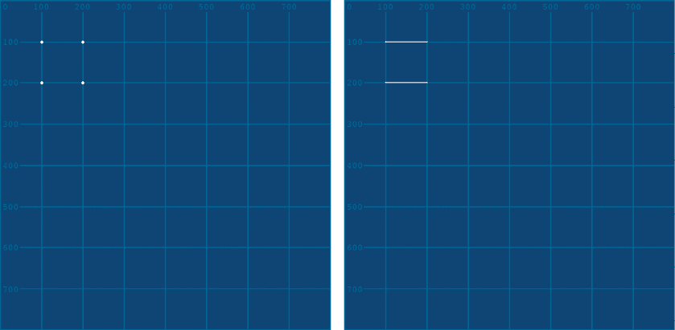

## 第二章：绘制更复杂的形状


在第一章中，你学习了 2D 基本图形，包括弧、椭圆、线条、点、四边形、矩形和三角形。然而，有些形状，比如心形、星形、八边形和皮卡丘轮廓，无法归入任何这种类别，需要使用更多的形状函数才能创建。

在本章中，你将学习如何使用点和曲线绘制更复杂的形状，以及使用顶点函数来布局点。通过这些技术，你将绘制出融合直线和曲线的形状，并通过从一个形状中减去另一个形状来创建*负*形状。

你还将学习如何使用两种类型的曲线：*Catmull-Rom 样条曲线*和*Bézier 曲线*。尽管这两者都涉及复杂的数学，但 Processing 的曲线函数处理了底层的微积分运算，使你只需控制点的坐标就能创建曲线。

## 显示网格

理解 Processing 中曲线如何工作的最佳方式是绘制几个曲线并对其进行操作。使用网格背景作为参考，可以更容易地绘制点和曲线，因此你将通过使用现成的图形来添加一个网格。创建一个新的草图并将其保存为*curves*，然后按照以下说明下载网格图形：

1.  打开你的网页浏览器并访问[`github.com/tabreturn/processing.py-book/`](https://github.com/tabreturn/processing.py-book/)。

1.  导航到*chapter-02-drawing_more_complicated_shapes*。

1.  下载*grid.png*文件。

其他草图资源（图像、字体和其他媒体）应放在名为*data*的子文件夹中，因此在你的*curves*草图文件夹内创建一个新的*data*子文件夹，并将*grid.png*文件放入其中（图 2-1）。


图 2-1：将网格图形放置在你的*data*子文件夹中。

这个网格图形将位于你绘制的所有内容下方（图 2-2），帮助你衡量 x-y 坐标。使用以下代码设置你的草图：

```py
size(500, 500)1 grid = loadImage('grid.png')2 image(grid, 0, 0)noFill()strokeWeight(3)
```

`loadImage()`函数加载图形文件并将其分配给名为`grid`的变量 1。`image()`函数 2 则将图像绘制到显示窗口。三个参数（`grid`，`0`，`0`）分别表示加载的图像文件、x 坐标和 y 坐标。

图像将按其原始尺寸绘制，除非使用额外的第四（宽度）和第五（高度）`image()`函数参数来调整大小。


图 2-2：显示网格图像

## 使用 Catmull-Rom 样条曲线绘制曲线

要在 Processing 中绘制曲线，你可以使用`curve()`函数。此函数接受八个参数，它们表示四对 x-y 坐标；这些分别是起始控制点、曲线起点、曲线终点和终止控制点。

让我们从一条标准直线开始，然后将其转变为曲线。这样，你可以通过与更简单且熟悉的`line()`函数进行比较，直观地了解`curve()`函数是如何工作的。在你的*curves*草图中添加一条对角线（见图 2-3）：

```py
. . .stroke('#0099FF') # pale blueline(100,100, 400,400)
```


图 2-3：将直线转变为曲线

Processing 在指定的 x-y 坐标对之间绘制一条直线：(100, 100) 和 (400, 400)。注意，直线的坐标与下面的网格对应。

### 使用 curve() 绘制曲线

要使用`curve()`函数绘制相同的直线，请在*curves*草图中注释掉`line()`函数，并将其替换为`curve()`函数：

```py
. . .stroke('#0099FF')  # pale blue#line(100,100, 400,400)curve(0,0, 100,100, 400,400, 500,500)
```

当你运行草图时，视觉效果应该与之前在图 2-3 中展示的完全相同。`curve()`函数括号中的四个中间值与`line()`函数相匹配，它们也表示曲线的起始和结束 x-y 坐标。

但是，`curve()`函数需要额外的四个外部参数（在这个示例中是`0,0`和`500,500`），它们表示两对*控制点*坐标。这些控制点的位置决定了你对直线施加的曲率的方向和程度。在详细探讨之前，添加以下新行到代码的末尾，以绘制一条相同长度、相同位置，但带有曲率的黄色线条：

```py
. . .stroke('#FFFF00') # yellowcurve(0,250, 100,100, 400,400, 500,250)
```

在这个例子中，四个中间参数保持不变，但控制点的坐标已改为`0,250`和`500,250`。结果是一条带有轻微 S 弯的黄色曲线（见图 2-4）。通过比较蓝色和黄色线条，你可以直观地看到更改控制点如何影响曲线的形状。


图 2-4：黄色曲线的控制点，橙色圈出的部分，否则将不可见。

要理解控制点如何影响曲线，可以想象每个黄色曲线的端点延伸到相邻的控制点。你把控制点移近显示窗口的中心时，就相当于你在“弯曲”这条曲线。相反，如果将控制点 1 和 2 分别放置在显示窗口的左上角和左下角，四个点将排成一行，曲线就不再弯曲，从而形成一条直线。

为了观察控制点的作用，添加以下橙色曲线作为视觉辅助线：

```py
. . .stroke('#FF9900') # orange# control point 1:1 curve(0,250, 0,250, 100,100, 400,400)# control point 2:2 curve(100,100, 400,400, 500,250, 500,250)
```

第一个`curve()`函数 1 从控制点 1 绘制一条橙色曲线，直到黄色曲线的起点；第二个`curve()`函数 2 从黄色曲线的终点绘制另一条橙色曲线，直到控制点 2。结果（见图 2-5）是一条三段式曲线（橙色-黄色-橙色），展示了控制点如何决定黄色部分的曲率。


图 2-5：你的 Processing 曲线（左）与传统样条（右）。(插图：Pearson Scott Foresman，公有领域许可。)

如你所见，橙色曲线延伸了黄色曲线，并说明了如果黄色曲线是一个完整的物理样条线，它会是什么样子。在图 2-5 的右侧，你可以看到没有计算机帮助下绘制此类曲线的柔性条带。如前所述，样条正是从这个条带得名。两个钉子对应`curve()`函数的起点和终点，而每端的 L 形件则代表控制点。

### 使用 curveTightness()更改曲线

`curveTightness()`函数决定了曲线如何严格地符合控制它的点，就像你用一条更具或更少柔韧性的材料代替了草图绘制的样条，或者将一条更短或更长的样条输入到相同区域中。该函数接受从-5.0 到 5.0 的值，默认值为 0。

要进行实验，在黄色描边上方添加一行`curveTightness()`：

```py
. . .curveTightness(0) # try values between -0.5 and 0.5stroke('#FFFF00')  # yellow
```

输入不同的值，以影响下方的曲线。图 2-6 展示了不同`curveTightness()`值下的曲线。


图 2-6：从左上角顺时针：`curveTightness`(`-1`)、`curveTightness`(`0`)、curveTightness`(1)`，以及`curveTightness`(`5`)

图 2-6 中的右下曲线，紧度参数设置为`1`，因此曲线非常坚硬，结果是一条直的黄色线。你调整紧度值越远离`1`，曲线的变形程度就越大。对于超过起始点和结束点的曲线，可以使用大于 1 的值。例如，在紧度限制为`5`（左下）时，样条曲线会在通过起始和结束点时形成环路。而使用紧度参数`-1`（左上）时，较长的样条曲线会重新规划路线，以更好地与它所经过的点对齐，因此曲线更具弯曲性，但没有环路。

`curve()`函数直观且有用，用于快速生成曲线。但在 3D 建模、动画、计算机辅助设计（CAD）和矢量插图软件中，你最有可能遇到 Bézier 曲线，因此接下来我们将探讨这些曲线。

## 绘制 Bézier 曲线

*Bézier 曲线* 提供了一种直观且多功能的方式，通过一系列锚点和控制点来建模光滑的曲线。你可能在像 Adobe Illustrator 或 Inkscape 这样的矢量图形绘制软件中遇到过这些曲线。在本节中，你将使用`bezier()`函数绘制曲线。在图形软件中，你有可视化的节点可以抓取和操作；而在 Processing 中，你需要定义锚点和控制点的位置，使用`bezier()`函数的参数。

### 使用`bezier()`函数

`bezier()`函数有八个参数，这里将其拆分为多行，便于阅读：

```py
bezier( `anchor_point_1_x`, `anchor_point_1_y`, `control_point_1_x`, `control_point_1_y`, `control_point_2_x`, `control_point_2_y`, `anchor_point_2_x`, `anchor_point_2_y`
)
```

第一对和最后一对参数是曲线的起点和终点。当使用贝塞尔曲线时，你通常将可见线连接的点称为*锚点*。从第一个锚点（`anchor_point_1_x, anchor_point_1_y`）开始，线条的曲率由其关联的控制点（`control_point_1_x, control_point_1_y`）的位置控制。另一个控制点（`control_point_2_x, control_point_2_y`）则控制线条朝向终点锚点的曲率（图 2-7）。不过，这种行为与样条曲线不同；相反，控制点更像是磁铁，导致线条向它们的方向膨胀。

要绘制贝塞尔曲线，创建四个变量来表示两个控制点的 x-y 坐标对：

```py
. . .stroke('#FF99FF') # pink
cp1x = 250
cp1y = 250
cp2x = 250
cp2y = 250bezier(400,100, cp1x,cp1y, cp2x,cp2y, 100,400)
```


图 2-7：锚点和控制点控制贝塞尔曲线的位置和曲率。

第一对 `bezier()` 坐标将锚点 1 放置在网格的右上方；最后一对坐标将锚点 2 放置在左下方。所有控制点变量（`cp1x, cp1y, cp2x, cp2y`）都引用显示窗口的中心（250, 250）。通过将控制点沿锚点 1 和锚点 2 之间的对角路径放置，你将形成一条直线。接下来，你将这些控制点向外移动，以观察这如何使线条发生弯曲。

运行此草图以渲染一条粉色线，表示已拉直的贝塞尔曲线（图 2-8）。


图 2-8：粉色线条表示已拉直的贝塞尔曲线。

粉色线条应穿过显示窗口的中心（250, 250）与黄色曲线交汇。

### 锚点和控制点的定位

要将粉色线条调整为曲线（图 2-9），将 `cp1x` 变量设置为 `200`。除了这个变化之外，还需添加两行额外的代码：

```py
. . .cp1x = **200**. . .bezier(400,100, cp1x,cp1y, cp2x,cp2y, 100,400)stroke('#FF0000') # redline(400,100, cp1x,cp1y)
```


图 2-9：通过调整控制点使粉色线条弯曲

额外的代码创建了一条红线，连接锚点 1（`400, 100`）和其控制点（`cp1x, cp1y`）。这条红线很有用，因为现在你可以可视化控制点的位置以及它控制哪个锚点。此外，在 `bezier()` 和红色 `line()` 函数之间共享变量意味着每次你调整定位曲线控制点（`cp1x, cp1y`）的值时，红线都会相应变化。将 `cp1x` 的值设置为 `200` 会使粉色线条产生弯曲，因为——随着控制点远离粉色线条——粉色线条向其膨胀。

曲线的上半部分受其顶部锚点连接的控制点（控制点 1）的影响最大；当你操作下方锚点的控制点时，这一点将更加明显。

现在添加另一条红线，将（下方的）锚点 2 和控制点 2 连接起来：

```py
. . .cp2x = **320**cp2y = **420**. . .line(400,100, cp1x,cp1y)line(100,400, cp2x,cp2y)
```

新的红线将锚点 2（`100,400`）与其控制点（`cp2x,cp2y`）视觉连接。运行草图查看结果（图 2-10）。尝试不同的控制点值，观察它们如何影响曲线。


图 2-10：调整控制点 2

注意，粉色曲线的下半部分被“磁性”地拉向控制点 2。了解如何放置锚点和控制点，以便获得所需的曲线是需要技巧的。尝试下载并在 Inkscape（或如果你安装了 Illustrator）中练习。或者，试着在你的浏览器中玩 The Bézier Game，网址为[`bezier.method.ac`](https://bezier.method.ac)*/*。

现在，你可以使用 Catmull-Rom 样条曲线和 Bézier 曲线绘制曲线。`curve()`和`bezier()`函数对于独立的曲线很有用，但如果要绘制由多个曲线段组成的形状，你需要使用顶点。

## 使用顶点绘制形状

在 Processing 中，*顶点*是用来连接线条以形成形状的点。*顶点*的复数形式是 vertices。你可以将 vertices 视为连线画图谜题中的点。例如，一个三角形需要 3 个顶点；一个五边形需要 5 个；而一个五角星（）需要 10 个。当使用直线和曲线连接顶点时，形状的可能性变得无限。顶点不仅限于二维空间——例如，Blender 中的 Suzanne（一个猴头）有大约 500 个顶点，分布在三维空间中（图 2-13）。


图 2-13：约 500 个顶点中的三个被圈出（黄色）

你将通过一系列的`vertex()`函数绘制一个方形。创建一个新的草图并将其保存为*vertices*。在新的*vertices*文件夹中，添加一个*data*文件夹，并包含前一个草图中的*grid.png*文件的副本（图 2-14）。


图 2-14：*vertices*草图文件夹结构

添加代码以设置初始参数：

```py
size(800, 800)
grid = loadImage('grid.png')image(grid, 0, 0)noFill()stroke('#FFFFFF')strokeWeight(3)
```

同样，你需要加载并显示网格图像，以帮助你在显示窗口中测量坐标。你绘制的每个形状将没有填充，且边框为 3 像素的白色。

现在，不再使用`rect()`或`square()`函数，而是使用顶点来绘制一个方形：

```py
beginShape() # begins recording vertices for a shape ...vertex(100, 100)vertex(200, 100)vertex(200, 200)vertex(100, 200)endShape() # stops recording
```

`beginShape()`和`endShape()`函数对于将顶点分成不同形状至关重要。如果没有这两个函数，Processing 将假设草图中的所有顶点都属于同一个形状。也就是说，Processing 会忽略任何放置在`beginShape()`和`endShape()`对外的“非法”`vertex()`线。如图 2-15 所示，代码绘制了一个没有左边的方形。


图 2-15：使用顶点绘制的开口方形

形状不会自动闭合，除非你包含一个`endShape(CLOSE)`参数，或者添加一个与起点连接的最终顶点。然而，活跃的`fill()`会填充颜色， 无论如何（图 2-16）。


图 2-16：尽管有一侧是开放的，形状仍然填充了颜色。

你还可以为`beginShape()`函数提供各种参数，以确定封闭顶点之间是否连接（如果有的话）（图 2-17）。



图 2-17：`beginShape(POINTS)`（左）和`beginShape(LINES)`（右）函数

对于仅由点组成的形状，使用`beginShape(POINTS)`。对于每隔一个顶点之间的线条，使用`beginShape(LINES)`。有关`beginShape()`参数的更多细节，请参考文档。

### Bézier 顶点

`bezierVertex()`函数允许你在顶点之间绘制曲线。还可以使用`curveVertex()`函数来绘制 Catmull-Rom 类型的曲线，但本书侧重于 Bézier 类型，因为它提供了更大的控制力和更优美的曲线。

`bezierVertex()`函数有六个参数。为了理解这些参数的作用，你将继续完成图 2-18 中显示的其他形状。

我手动添加了淡蓝色的线条，其虚线的尖端提供了控制点的视觉指示。仅将这些线条作为参考使用；你不需要重新绘制它们。


图 2-18：一枚中国硬币（左下），S 曲线（中间），和心形（右）

#### S 曲线

*S 曲线*只是一个弯曲的线条，包含两个顶点，每个顶点都连接着自己的控制点。你将使用`bezierVertex()`函数来绘制它，以便将这个第一个示例保持尽可能简单，但通常，你会使用`bezier()`来绘制 S 曲线。

在`beginShape()`和`endShape()`之间，根据需要组合使用`bezierVertex()`和`vertex()`函数。然而，首先的顶点总是通过`vertex()`来创建。开始一个新的形状并绘制第一个（在这种情况下是上方）顶点：

```py
. . .# s-curvebeginShape()vertex(400, 200) # starting (upper) vertexendShape()
```

运行草图。由于没有第二个顶点来形成一条线，因此孤立的顶点应该显示为(400, 200)处的一个点。

现在通过使用`bezierVertex()`添加第二个顶点：

```py
. . .# s-curvebeginShape()vertex(400,200) # starting (upper) vertexbezierVertex( 300, 300, # control point for the starting vertex 500, 500, # control point for the second (lower) vertex 400, 600 # second (lower) vertex coordinates
)endShape()
```

最后一对`bezierVertex()`参数（`400, 600`）表示第二个（下方）顶点的位置。第二个顶点连接到由第二对参数（`500, 500`）定位的控制点。第一对参数（`300, 300`）代表紧跟在`bezierVertex()`之前的`vertex()`函数的控制点。参考图像中给出的顶点位置（图 2-18），创建这个形状（图 2-19）实际上只是输入正确的坐标顺序而已。


图 2-19：完整的 S 曲线

这是一个开放形状，如果填充会显得不自然。接下来，你将研究一个闭合形状，但在继续之前，随时可以尝试不同的顶点和控制点值。

#### 心形

你可以将心形想象成由两条弯曲的线连接到两个顶点。首先，绘制心形的一半（图 2-20）：

```py
. . .# heartbeginShape()vertex(600, 400)bezierVertex(420,300, 550,150, 600,250)endShape()
```


图 2-20：半个心形

你需要做的就是完成心形的右半部分。添加第二行`bezierVertex()`，看看能否填补缺失的参数：

```py
. . .# heartbeginShape()vertex(600, 400)bezierVertex(420,300, 550,150, 600,250)bezierVertex(___,___, ___,___, 600,400)endShape()
```

回到图 2-18 查看控制点的位置。记住，你可以访问所有挑战的解决方案，网址为[`github.com/tabreturn/processing.py-book/`](https://github.com/tabreturn/processing.py-book/)。

#### 中国硬币

带有中间方孔的圆形金属硬币最早是在几百年前的中国出现的，但复制这种形状是学习 Processing 的一个好例子。要创建图 2-18 中的紫色硬币形状，你将使用`beginContour()`和`endContour()`函数从圆形中减去一个正方形。

首先，你将使用`beginShape()`、`endShape()`和`vertex()`函数创建外形。然后，你将在`beginShape()`和`endShape()`函数中放置`beginContour()`和`endContour()`函数。在这对轮廓函数内，你将绘制一个第二个形状，它也由`vertex()`和`bezierVertex()`函数组成；轮廓函数会从外形中减去这个形状。

第一个挑战是创建外圆。`beginContour()`和`endContour()`函数无法从预定义的形状函数（如`rect()`、`ellipse()`或`circle()`）中减去，因此你需要通过使用顶点来构造外圆。然而，使用贝塞尔曲线绘制圆形是可行的，你将通过创建一个菱形并使用控制点将其形成圆形。

从用`vertex()`函数形成一个菱形开始（如图 2-21 所示）：

```py
. . .# coinbeginShape()vertex(100, 600)vertex(200, 500)vertex(300, 600)vertex(200, 700)vertex(100, 600)endShape()
```


图 2-21：你将形成圆形的菱形

在顶点定位正确后，你可以继续为菱形添加曲线。当然，这将需要`bezierVertex()`函数，你将参考当前定位的顶点坐标。要了解如何定位额外的控制点坐标，请参见图 2-22。


图 2-22：定位顶点和控制点以形成圆形

图 2-22 显示了控制点应该如何定位，以形成最圆的形状。现在将每个`vertex()`替换为`bezierVertex()`函数。记住，第一点必须保留为`vertex()`，以形成圆形（图 2-23）：

```py
# coinbeginShape()vertex(100, 600)bezierVertex(100,545, 145,500, 200,500)bezierVertex(255,500, 300,545, 300,600)bezierVertex(300,655, 255,700, 200,700)bezierVertex(145,700, 100,655, 100,600)endShape()
```


图 2-23：使用`bezierVertex``(``)`函数形成的圆形

在圆形到位后，你可以开始从中间移除正方形。同样，通过使用顶点而不是预定义的形状函数（如`rect()`或`square()`）来定义这个正方形。这是一个相对简单的练习，但请注意，你需要为被减去的形状使用*反向旋转*：你必须将正方形的顶点按与放置外部形状（圆形）顶点相反的方向排列。

再次阅读圆形的代码，并注意顶点是按顺时针顺序绘制的；这意味着正方形的顶点必须按逆时针顺序绘制——也就是说，与其将要减去的形状的旋转方向相反。如果你没有正确设置这个方向，将不会发生减去操作。

将正方形的顶点放入`beginContour()`和`endContour()`函数中。当然，除非你添加填充，否则你无法看到效果（如图 2-24 所示）：

```py
# coin1 fill('#6633FF')beginShape()vertex(100, 600)bezierVertex(100,545, 145,500, 200,500)bezierVertex(255,500, 300,545, 300,600)bezierVertex(300,655, 255,700, 200,700)bezierVertex(145,700, 100,655, 100,600)2 beginContour()vertex(180, 580)vertex(180, 620)vertex(220, 620)vertex(220, 580)3 endContour()endShape()
```


图 2-24：完成的硬币

如果没有填充 1，你只会看到白色的轮廓。`beginContour()`函数 2 开始记录组成负形状的顶点。不需要`bezierVertex()`函数，因为正方形没有曲线。顶点按逆时针顺序排列，从正方形的左上角（`180, 580`）开始，直接向下（到`180, 620`），然后继续绕行，直到`endContour()`停止记录 3。

## 使用矢量图形软件生成形状

你可以使用矢量图形绘图软件来绘制形状，然后引用顶点和控制点的位置来编写 Processing 代码。这就是我如何绘制出图 2-25 中显示的 Python 徽标的蓝色参考线。


图 2-25：追踪包含顶点和控制点位置的 Python 徽标。（Python 软件基金会的徽标商标政策可在[`www.python.org/psf/trademarks/`](https://www.python.org/psf/trademarks/)查看。）

如果你喜欢挑战，可以清除你的*曲线*草图，尝试完成我在图 2-25 中开始绘制的 Python 徽标的半部分。这里有一些代码可以帮助你开始绘制轮廓：

```py
beginShape()vertex(262, 238)vertex(262, 178)bezierVertex(262,40, 370,30, 500,30)bezierVertex(630,30, 730,40, 735,178)endShape()
```

你还可以将矢量图形导出为 SVG 文件，以便在 Processing 中使用`loadShape()`和`shape()`函数，而不是使用`loadImage()`和`image()`函数。但请注意：SVG 支持并不总是可靠的，你可能需要花一些时间调整你的 SVG 导出设置，以确保它们在 Processing 中正确显示。

## 总结

你现在已经学习了 Processing 的大部分基本绘图功能。通过使用网格图形作为坐标参考，你学会了绘制模拟物理样条曲线的曲线。此外，你还学会了绘制贝塞尔曲线——这是一种平滑、优雅的曲线，你可以通过锚点和控制点来控制它们。你还了解了如何通过一系列顶点来绘制形状。当你用直线和曲线连接顶点时，形状的可能性是无限的。你将在接下来的许多任务中，运用曲线、顶点和第一章中学到的技能。

在第三章中，你将开始探索 Processing 的文本功能。这包括将文本绘制到显示窗口、对其进行样式设置以及加载字体。你还将了解 Python 内置的字符串数据处理功能。在本书后续的章节中，你将使用文本功能为图表和图形界面元素添加标签，并为图像添加对话气泡。
