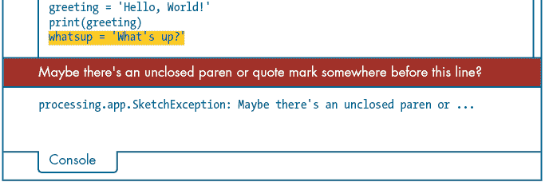
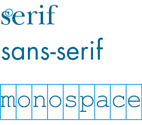
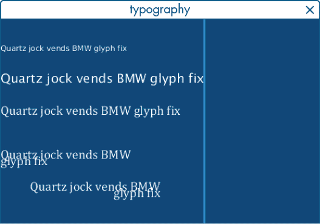

## 第三章：字符串简介与文本操作


在第一章中，你创建了一个‘Hello, World!’字符串并将其打印到控制台，但 Python 能做的远不止打印字符串数据。在这一章，你将使用运算符、函数和方法来操作字符串。字符串是大多数编程语言中的基本数据类型，你将在几乎所有编写的程序中使用它们。如果你需要向用户传达信息、捕获文本框的输入、从网页获取数据或执行涉及文本的任何任务，你都会使用字符串。

在这一章，你还将学习如何使用 Processing 的文本函数在显示窗口中渲染任何字符串为文本。Processing 可以使用不同的字体，以不同的大小和位置，绘制各种颜色和样式的文本。你可能会用这些功能来用字母作画、标注图表、显示高分表，或构建一个交互式界面。

## 字符串

在探索 Processing 的文本渲染函数之前，你需要先了解字符串的基本知识。根据定义，*字符串*包含一个或多个字符的序列。例如，‘hello’ 是一个包含五个字符的字符串；它以 *h* 开头，以 *o* 结尾。你已经在第一章中简要接触过字符串数据类型，在那里你用它来定义十六进制颜色值并在控制台打印文本信息。

要创建一个新的 'hello' 字符串并将其赋值给名为 `greeting` 的变量，可以使用以下代码：

```py
greeting = 'hello'
```

Python 识别 `hello` 为字符串，因为它被引号括起来。你可以使用单引号或双引号，但一定要确保使用与打开时相同类型的引号将其关闭。

在 Python 中，你可以用多种方式操作字符串。要将 `hello` 转换为 `Hello!`，你需要将第一个字符大写并在字符串末尾插入一个感叹号。Python 提供了许多内置功能来执行这些操作，我将在这一节中介绍一些最有用的功能。

你将学习如何组合字符串，以及如何查找、计数和提取特定的字符序列。这些功能大多数仅适用于字符串数据类型。例如，你不能将整数或浮动值转换为大写字母，因为它们是数字。如果你在数字的末尾加上一个 `!` 字符，它就不再是一个数字；它变成了一个包含数字字符和感叹号的字符串。另一方面，你不能用数字去除一个字符串。

以下示例使用除法运算符将整数 `6` 除以 `3`，在控制台打印出 `2`。但尝试将 `'hello'` 除以 `3` 会导致错误：

```py
print(6 / 3) # displays a 2print('hello' / 3) # displays an error
```

Python 不能将字符串与整数相除，因此你会得到一个 `TypeError` 错误信息。然而，某些数学运算符可以作用于字符串。例如，`'hello' * 3` 会返回 `hellohellohello`。在本章稍后，你将学习如何使用 `+` 运算符连接字符串。

### 在 Python 中创建字符串

让我们开始创建一些新的字符串变量，了解 Python 如何处理不同类型的引号，并解决创建字符串时可能遇到的一些问题。

开始一个新的草图并将其保存为 *strings*。添加以下代码：

```py
greeting = 'Hello, World!'print(greeting)
```

当你运行草图时，`print()` 函数会将 `Hello, World!` 输出到控制台。

记住，Python 期望字符串以引号开始和结束，那么当字符串本身包含引号字符时会发生什么呢？添加另一个字符串变量，看看当你有未配对的引号时会发生什么：

```py
. . .
whatsup = 'What's up?'
```

Python 会将这个字符串解释为 `What`，忽略撇号后面的所有内容。会留下些许悬空字符和一个未配对的引号（`s up?'`）。运行草图并观察错误信息（图 3-1）。



图 3-1：由撇号引起的错误

为了修复这个问题，请使用双引号：

```py
whatsup = "What's up?"
```

或者，你可以通过使用反斜杠来 *转义* 撇号字符：

```py
whatsup = 'What\'s up?'
```

反斜杠表示 Python 应该将撇号视为普通字符，而不是语言语法的一部分。如果你现在打印 `whatsup` 变量，它会显示以下内容：

```py
What's up?
```

注意，控制台输出中不会显示反斜杠。

反斜杠是转义字符，因此如果你需要在字符串中包含反斜杠，必须在前面加上另一个反斜杠。例如，`print('\\')` 会在控制台中显示一个单独的反斜杠。

你已经看到如何在用双引号限定的字符串中嵌套单引号。事实上，这种方法同样适用于反向操作。例如，添加一个新的 `question` 变量，使用单引号内嵌双引号：

```py
greeting = 'Hello, World!'print(greeting)whatsup = "What's up?"
question = 'Is your name really "World"?'print(whatsup)print(question)
```

运行草图确认没有错误。控制台应显示三个 `print` 语句的内容。

### 使用连接和字符串格式化

`+` 运算符执行整数和浮点数的算术加法，但你也可以使用 `+` 运算符将多个字符串连接成一个序列或链。*连接* 是编程术语，表示 *将多个元素结合在一起*，它对于许多任务非常有用，例如将单词连接成句子和段落。在你的草图中尝试这个示例：

```py
. . .
all = greeting + whatsup + questionprint(all)
```

这应该在控制台中显示以下行：

```py
Hello, World!What's up?Is your name really "World"?
```

注意，连接操作会精确地将字符串按其定义连接在一起，不会自动添加空格，因此你需要显式地插入所需的空格字符。

要修复前面的输出，请编辑 `all` 变量所在的行：

```py
. . .
all = greeting + ' ' + whatsup + ' ' + questionprint(all)
```

控制台应显示以下内容：

```py
Hello, World! What's up? Is your name really "World"?
```

现在，这行代码包括了在代码中指定的空格。

连接的另一种替代方法是*字符串格式化*，而 Python 为此提供了`format()`方法（我将在第 60 页的“字符串方法”部分进一步解释方法）。你需要理解的是，`format()`通过替换占位符符号为值来工作，而不是将它们按顺序连接起来。你会发现，连接操作符适用于简单任务，但在构建较长且更复杂的字符串时，它可能会显得笨拙。

这是使用`format()`构建的相同一行：

```py
. . .
all = '{} {} {}'.format(greeting, whatsup, question)print(all)
```

在这种方法中，Python 会将每一对大括号（`{}`）替换为对应的变量——也就是说，第一个大括号替换为`greeting`，第二个替换为`whatsup`，第三个替换为`question`。这样你就不需要通过`+ ' ' +`来手动插入每个空格字符了。

如果`format()`的替代方法似乎并不简洁，可以考虑使用连接的这个示例：

```py
firstname = 'World'
o2 = 21
hi = "Hi! I'm " + firstname + ". My atmosphere is " + str(o2) + "% oxygen."
```

如果你打印`hi`，你会得到`Hi! I'm World. My atmosphere is 21% oxygen`。使用连接时，你必须仔细放置空格字符，而且很难看出`hi`这一行在做什么。此外，你还必须将`o2`变量包装在`str()`函数中，以将其从数字转换为字符串；如果不这样做，Python 会尝试（并失败）将整数和字符串进行算术加法。

将其与使用`format()`方法构建的相同一行进行比较：

```py
hi = "Hi! I'm {}. My atmosphere is {}% oxygen.".format(firstname, o2)
```

这能更好地展示你将获得的结果。`format()`方法还可以处理数字到字符串的转换。你可以根据当前任务选择最适合的方法。

### 处理字符串长度

`len()`函数返回字符串中的字符总数。你可以用它来检查字符串是否包含超过 1 个字符，或者验证字符串是否适合发布到推特（最多 280 个字符）。你还可以使用`len()`函数来查找列表（第七章）或字典（第八章）中的项目总数。

`len()`函数接受一个参数；你可以使用`greeting`变量来试试看：

```py
print(len(greeting))
```

这应该显示 13，即`greeting`字符串中的字符总数。

到目前为止，你已经学会了如何定义新字符串并通过小的字符串构建字符串，但在 Python 中你还能做更多的事情。在接下来的章节中，你将学习如何通过使用切片符号和字符串方法来操作字符串。

## 字符串操作

让我们在你的工作草图中添加一些代码，这样你就可以尝试一些字符串操作方法。你将通过使用切片符号来提取部分字符串，转换大小写字符，并查找和计数特定字符序列的出现次数。你可以使用这些技术来自动化处理字符串数据的过程——例如，扫描数据中的关键词，分析字符串或缩短它们。你可以随意尝试不同的值和参数，看看它们的反应。

### 切片符号

Python 的*切片表示法*提供了一种简单而强大的方法来提取字符串中的字符。你可以使用切片表示法来提取单个字符或子字符串。*子字符串*是任何连续的字符序列，它构成更长字符串的一部分。例如，一个 URL 字符串可能以子字符串`http://`开始。

要在新的字符串变量`url`上实验切片表示法，将这个变量添加到你的*字符串*草图中：

```py
url = 'http://www.nostarch.com'
```

你将通过使用一对方括号（`[]`）来指定要提取的字符的位置（*索引*）。为了简化，假设我们提取`url`字符串中的第一个字符。不过请注意，这个索引系统是从零开始的，这意味着字符的索引是从 0 而不是 1 开始的。请参见图 3-2 作为字符索引的参考。


图 3-2：字符串索引系统从 0 开始。

使用`0`（零）来提取第一个字符：

```py
print(url[0]) # displays: h
```

控制台应该显示一个`h`。

第二个字符的索引是`1`：

```py
print(url[1]) # displays: t
```

控制台应该显示一个`t`，即`http`中的第一个`t`。

使用冒号（`:`）来指定字符的范围。你可以使用这个来提取 URL 字符串中的*方案*（`http`）以及冒号斜杠斜杠（`://`），这个范围从索引`0`到索引`7`：

```py
print(url[0:7]) # displays: http://
```

`:7`位于`0`的右侧，用于提取直到第一个`w`之前的字符。但因为你的范围是从索引`0`开始的，你可以省略冒号前的`0`，得到相同的结果：

```py
print(url[:7]) # displays: http://
```

冒号位于索引值（`7`）之前，这意味着 Python 必须从字符串的左侧/开始位置提取直到第七个字符的所有内容。

如果将冒号放在索引之后，Python 会返回从指定索引到字符串结尾的所有内容。你可以用这种方式提取冒号斜杠斜杠后的所有内容，也就是你通常在浏览器地址栏中输入的 URL 部分：

```py
print(url[7:]) # displays: www.nostarch.com
```

现在，你应该能在控制台中看到`www.nostarch.com`。这是 URL 的*子域*（`www`）、*域名*（`nostarch`）和*顶级域名*（`com`）的组合，它们由点字符分隔（图 3-3）。


图 3-3：URL 的组成部分

你可以通过字符串切片操作来提取 URL 的每个部分。假设顶级域名（`com`）总是三个字符，你可以通过使用索引`-3`后跟冒号来提取它：

```py
print(url[-3:]) # displays: com
```

负值表示从字符串的末尾（右侧）开始计算索引位置，因此`url[-3]`只会提取字符`c`。你可以使用冒号来提取`c`及其后的所有字符。无论 URL 多长，这段代码总是会显示最后三个字符。相反，使用`[:-3]`，将冒号放在`-3`的左边，表示提取直到倒数第三个字符（`http://www.nostarch.`）。

要提取域名（`nostarch`），提取索引`11`到`-4`之间的子字符串：

```py
print(url[11:-4]) # displays: nostarch
```

这将适应任何域名。例如，如果你将 `url` 值更改为 `http://www.nostarchpress.com`，Python 会打印出 `nostarchpress`。但这只有在方案是 *http* 且子域是 *www* 的情况下有效。你可以使用字符串方法，这些方法将适应任何长度的方案、子域和顶级域名。

这种符号切片字符串的方式有几种其他方法，但这些方法现在应该足够了。你还可以使用切片符号从列表和字典中提取项，因此你将在涉及这些数据类型的章节中再次遇到它。

### 字符串方法

*字符串方法*对字符串执行各种操作，如将字符在大写和小写之间转换，以及搜索和计数字符和子字符串。你将在草图中使用字符串方法来验证你的 URL 是否包含方案、子域、域名和顶级域名。这不是字符串方法的全面回顾，但它将让你熟悉它们的某些操作。任何一本合格的 Python 参考书都会涵盖其余部分。

#### 方法与函数

Python 中的*方法*看起来和行为上都很像函数。你通过其名称调用函数——像 `print()`——它为你执行预定义的任务。方法也类似，但它们与特定的对象相关联，例如字符串方法是与字符串对象关联的。函数可能接受或不接受参数，具体取决于你使用的函数；方法也是如此。

作为示例，让我们将 `len()` *函数*与*方法*进行对比。没有 `len()` 方法，但我们假设有一个，以便专注于方法和函数之间语法上的差异。

回想一下，`len()` 函数返回任何字符串中的字符总数：

```py
urllength = len(url)
```

`len()` 函数接受 `url` 参数，并返回其包含的字符串的长度。`url` 字符串的总长度是 23 个字符，因此变量 `urllength` 的值等于整数 `23`。

方法以点号（`.`）开头，并附加到你想要影响的数据上。如果 `len()` 函数是一个方法，你应该这样写：

```py
urllength = url.len()
```

接下来，你将使用 `upper()` 方法将字符串字符转换为大写。

#### upper() 和 lower() 方法

`upper()` 方法返回一个字符串版本，其中所有小写字母都被转换为大写。它不接受任何参数。以下是一个例子：

```py
urlupper = url.upper()
print(urlupper) # HTTP://WWW.NOSTARCH.COM
```

`upper()` 方法是一个字符串方法，因此你必须将其附加到字符串上。语法可能与 `format()` 类似，后者是你之前用来将花括号替换为字符串中文本值的方法。在这个例子中，变量 `urlupper` 的值是 `HTTP://WWW.NOSTARCH.COM`。当你无法使用粗体或斜体时，这个方法可能有助于突出某些关键短语。`lower()` 方法是 `upper()` 的反向操作，它将所有大写字母转换为小写。

#### count() 方法

现在，让我们验证 `url` 字符串是否包含 *www* 子域名。`count()` 方法返回一个字符或字符序列在字符串中出现的总次数，并且它需要一个参数来指示你要计数的字符。例如，你可以使用 `count()` 方法验证 URL 中是否包含三个 *w* 字符：

```py
print(url.count('w')) # 3
```

你的控制台应该确认有三个 *w* 字符。但它并没有指示这些字符是否是连续的；这些字母可能分散在字符串中。为了更明确，使用参数 `'www'`：

```py
print(url.count('www')) # 1
```

子字符串 `www` 在这个字符串中只出现一次。但你不能确定这就是子域名。如果 URL 的域名部分包含 *www* 呢？你可以更具体一些，统计 `http://www` 出现的次数，但 HTTP 并不是唯一的 Web 地址方案。例如，*HTTPS*，HTTP 的安全扩展，用于加密计算机网络中的通信。更复杂的是，子域名可能不是 *www*。

#### `find()` 方法

让我们尝试另一种方法。`find()` 方法返回任何字符或子字符串的索引。注意冒号斜杠斜杠 (`://`) 如何分割方案和子域名。使用 `find()` 方法来检索冒号斜杠斜杠的索引。添加代码来找到该索引，存储在一个名为 `css` 的变量中，然后用它来提取方案：

```py
css = url.find('://') # 4
scheme = url[:css] # http
```

`find()` 方法检索 `url` 字符串中第一个出现的 `://` 的索引。更具体地说，这是子字符串中第一个字符，即冒号的索引。如果找不到该子字符串，结果将是 `-1`。在这个实例中，索引为 `4`。请注意，这个参数区分大小写。

子域名位于冒号斜杠斜杠和第一个点之间。使用 `find()` 方法找到第一个点的索引，并使用切片符号提取并将子域名赋值给一个名为 `subdomain` 的变量：

```py
dot1 = url.find('.') # 10
subdomain = url[css+3:dot1] # www
```

`css+3` 等于 `7`，即 *www* 中第一个 *w* 的索引。我加上了 `3` 来将起始索引偏移到冒号斜杠斜杠的长度。这对于 *www* 或任何其他子域名都有效（尽管如果没有子域名，你会遇到一些问题）。

顶级域名 (*com*) 从第二个点开始一直到字符串的末尾。如果某个字符或子字符串出现多次—例如点—你可以提供第二个 `find()` 参数来指示搜索应该从哪个索引位置开始。你可以使用 `dot1` 变量来表示这个偏移量，但你需要加上 `1` 来从它之后的字符开始。将顶级域名赋值给一个名为 `tld` 的变量：

```py
dot2 = url.find('.', dot1+1) # 19
tld = url[dot2 + 1:] # com
```

`dot2` 变量等于 `19`，即 URL 中第二个点的索引。在 `tld` 这一行中，我将 `19` 作为起始索引参数加上了 `1`，因为我不想包含 *.com* 中的点。

`find()` 方法可以接受一个额外的第三个参数，用于指示搜索应该在字符串的哪个位置终止。

最后，将域名（*nostarch*）赋值给一个名为`domain`的变量：

```py
domain = url[dot1+1:dot2] # nostarch
```

域名子串位于第一个和第二个点之间，但要加上`1`到`dot1`，以避免获取第一个点字符。

你现在已经使用切片符号将 URL 分割成了各个部分。将切片符号与字符串方法结合使用，可以提供一种更强大的方式来完成此操作，这样你的程序就能处理不同长度的协议、子域和顶级域。

在下一部分中，你将学习如何使用 Processing 文本函数将字符串作为文本显示在显示窗口中，这样你就不再局限于在控制台中打印字符串。你可以使用文本作为装饰，标注视觉输出中的元素，或为用户提供反馈。

## 排版

*排版*指的是文本（或*字体*）的排列和样式，以使其更易读且更具美感。排版处理可以真正决定设计的成败。例如，标题最好能与其他文本区分开；字母间距应比单词间距更紧凑，而且你可能同意，草书字体不适合用于路标。虽然我不建议你用 Processing 排版一本书，但它确实提供了有用的功能来控制文本的外观。

### 字体

字体由许多字形组成；*字形*是任何单个字符，比如*A*、*a*或*?*。如果你没有指定 Processing 应该使用哪个字体来绘制文本，它会依赖预定义的默认字体。你的计算机包括一系列预安装的字体，但不同操作系统之间的选择可能不同。你还可以在系统中安装额外的字体来扩展选择。不过，如果你在不同计算机之间移动或共享草图（它们的字体库不同），你可能会遇到问题。如果一个草图需要特定字体，而该字体未安装，Processing 就无法加载它。为避免这些问题，我将解释如何将字体文件与草图一起打包。

由于早期的计算机字体是基于像素的，它们需要为每个字体大小提供一组独立的字形。例如，如果一种字体有三种大小和一种斜体变体，它包含六个完整的字符图形集。然而，现代字体是基于矢量的，这就是为什么你可以将文本缩放到任何大小而不会出现像素化的原因。你不再需要为每个字体大小准备一个文件，但粗体和斜体变体仍然是独立的字体文件。

默认情况下，Processing 会使用标准的*无衬线*字体在显示窗口中渲染文本。在字体术语中，*衬线*是附着在字符顶端的小线条（见图 3-4 中的圆圈）。*无*的意思是“没有”；因此，无衬线字体没有衬线。



图 3-4：字体分类

*等宽*字体也可以是衬线字体，但其特点是每个字符占用相同的水平空间。*比例间距*字体（如图 3-4 中的衬线和无衬线示例）通过使用内建的度量标准来指定每个字符与其相邻字符之间的间距，从而使文本更易读。例如，当*i*和*m*字符占用相同大小的“容器”时，会出现不自然的间距问题，这也是许多等宽字体尝试通过给*i*加大衬线并压缩*m*来解决的问题（见图 3-5）。这也意味着等宽字符在多行文本中会垂直对齐。


图 3-5：等宽字符具有固定的宽度

也就是说，等宽字体在某些情况下更易读。例如，当你需要让字符在列中对齐时，等宽字体会很有用：

```py
Sam  Jan  Amy  Tim | Total
99   359  11   3   | 472
```

这种特性使得等宽字体更适合编写代码，这也是为什么 Processing 编辑器（以及其他所有代码编辑器）的默认字体是等宽字体。

### 文本函数

让我们创建一个新草图来实验 Processing 的文本函数。你将使用这些函数在显示窗口中绘制文本，并设置你的字体、字体大小、行间距和文本对齐方式。

启动一个新草图，并将其保存为*typography*。添加以下代码开始：

```py
size(500, 320)background('#004477')fill('#FFFFFF')stroke('#0099FF')strokeWeight(3)
```

这段代码将背景设置为蓝色，填充颜色设置为白色。正如你很快会看到的，`fill()`颜色将影响你绘制的文本。任何描边都是淡蓝色的，宽度为 3 像素。

*全字母句*是一个包含给定字母表中每个字母至少一次的句子。创建一个名为`pangram`的变量，存储一个完美的英语全字母句：

```py
pangram = 'Quartz jock vends BMW glyph fix'
```

从这里开始，你将渲染存储在`pangram`中的不同版本的字符串，如图 3-6 所示。

要重现图 3-6，从`text()`函数开始，`text()`函数将文本绘制到显示窗口中，其字体颜色由当前的填充颜色决定：

```py
text(pangram, 0, 50)
```



图 3-6：你将渲染这些版本的相同全字母句。

运行草图。你应该能在显示窗口中看到全字母句的第一个（顶部）版本。参数`(pangram, 0, 50)`分别代表字符串值、x 坐标和 y 坐标。你可以添加额外的第三个和第四个参数来指定文本区域的宽度和高度，这些将在稍后使用。

`textSize()`函数设置所有后续`text()`函数的字体大小（以像素为单位）。添加以下代码以显示全字母句的第二个版本：

```py
textSize(20)text(pangram, 0, 100)
```

运行草图以确认你有较小和较大的两种版本的全字母句。

请注意，垂直的淡蓝色线条（图 3-6）精确标记了最长/最大行文本的结束。添加这条线的目的是为了探索 `textWidth()` 函数，您可以使用它来计算显示文本的宽度。在这种情况下，你想要测量第二个完整句子的宽度并在其结束处绘制一条垂直线。使用 `textWidth()` 函数作为线条函数的参数：

```py
line( textWidth(pangram), 0, textWidth(pangram), height
)
```

现在，单词的宽度作为行的起始和结束 x 坐标；起始和结束的 y 坐标分别是显示窗口的顶部和底部边缘。这将绘制一个淡蓝色的垂直规则线，表示第二个完整句子的结束，且高度与显示窗口相同。

你将用衬线字体渲染第三个完整句子。要切换到另一种字体，你需要知道字体名称并进行引用。要列出你计算机上安装的字体，可以使用 `PFont.list()`：

```py
print(PFont.list())
```

滚动浏览控制台输出，查看是否能找到`Cambria`或`Georgia`。这两种都是衬线字体。如果系统中未安装 Cambria 或 Georgia，你将无法在列表中找到它们。在这种情况下，任何其他衬线字体都可以使用，比如 Times New Roman。

Processing 使用它自己的字体格式，因此在使用之前，你需要使用 `createFont()` 函数转换字体。

添加一行 `createFont()`，其中包含一个字符串参数，表示你将使用的衬线字体的名称：

```py
seriffont = createFont('Cambria', 20)
```

`createFont()` 函数接受两个参数：一个字体名称（如控制台列出的方式）和字体大小。前一行将转换后的字体分配给一个名为 `seriffont` 的变量，接下来你将使用这个变量。

要激活新的字体，使用 `textFont()`。然后，再次绘制完整句子（第三个版本），以确认它已生效：

```py
textFont(seriffont)text(pangram, 0, 150)
```

`textFont()` 函数接受一个参数，即一个已准备好的字体。所有后续的 `text()` 函数都会使用这个 `seriffont`，直到 Processing 遇到另一个 `textFont()` 函数。

`textLeading()` 函数控制文本的行距。*Leading*（发音类似于*wedding*）是排版术语，用来描述每行文本之间的间距。

`textAlign()` 函数控制文本的对齐方式；你可以使用 `LEFT`、`CENTER` 或 `RIGHT` 作为参数来设置文本的水平对齐。

你将使用 `textLeading()` 和 `textAlign()` 函数来渲染完整句子的底部两个版本（第四和第五个版本），如图 3-6 所示。添加左对齐和右对齐的完整句子：

```py
1 textLeading(10)text(pangram, 0, 200, 250, 100)textAlign(RIGHT)text(pangram, 0, 250, 250, 100)
```

第一个全字句是左对齐的，因为这是 Processing 的默认设置。我为`text()`函数添加了宽度和高度参数，以启用自动换行。每个全字句都被限制在自己的矩形区域内，宽度为 250 像素，高度为 100 像素。如果一行文字超出了 250 像素的宽度，Processing 会自动将无法适应的单词推到新的一行。如果有任何行部分超过了文本区域的高度（100 像素），它们是不可见的，尽管在这里没有发生这种情况。行间距（leading）被减小到 10 像素 1，导致行与行之间重叠。通常情况下，行间距的值与字体大小成比例。

就像`fill`、`stroke`和许多其他 Processing 属性一样，你设置的文本参数会一直有效，直到你明确指定其它值。但如果你调整文本大小——通过另一个`textSize()`函数——行间距将重置为一个成比例的值。

## 总结

这段简短的介绍探讨了通过使用 Python 的切片符号和字符串方法来操作字符串，并使用 Processing 的`text()`函数在显示窗口中绘制文本。Processing 的排版功能让你能够控制字体大小、水平对齐、行间距/行距以及字体选择。在接下来的许多任务中，你将使用字符串方法和文本函数。

在第四章中，你将探索包括控制流和条件语句在内的主题——这些技术允许你编写可以跳过、跳转或重复执行代码行的程序。这些工具很有用，因为它们让你能够根据特定的规则和值改变代码执行的顺序，甚至决定是否执行代码。
