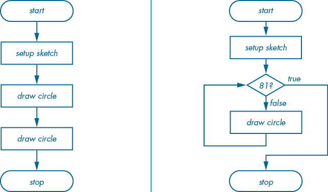
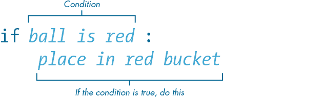
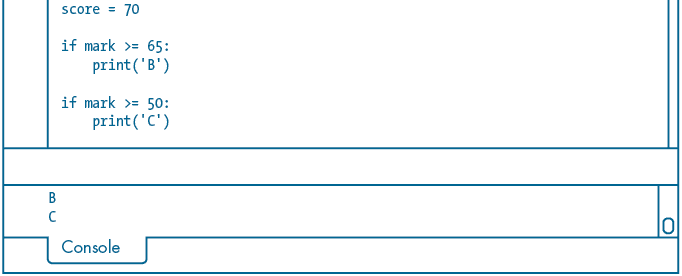
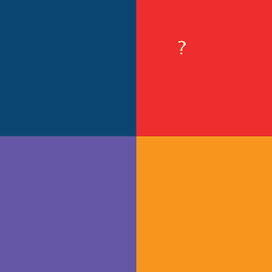
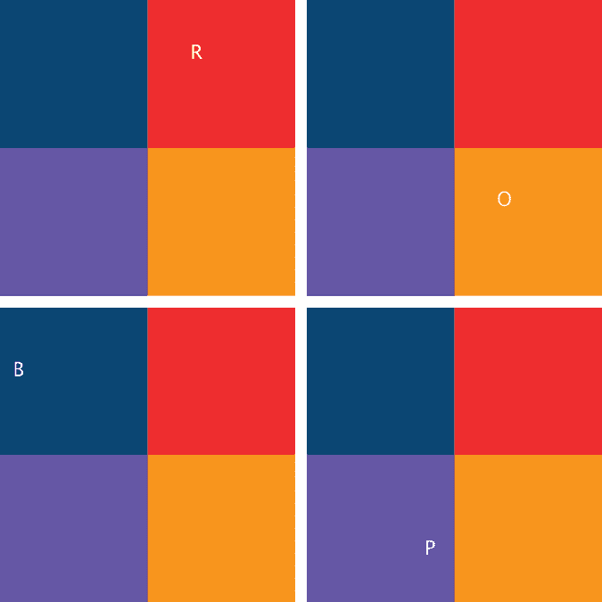

## 第四章：条件语句


到目前为止，你编写的程序是逐行执行的，从代码的顶部开始，一直到底部。你可以将这个执行流程想象为一系列按顺序执行的步骤，这意味着程序只能以一种方式运行。在本章中，你将学习如何编写不同的路径，让 Python 根据是否满足某些条件来选择不同的执行路线。这非常有用，因为你可以根据不同的场景执行程序中的不同操作——就像视频游戏根据你的表现将你引导到不同的关卡或屏幕。

要评估一个条件，你将使用*布尔*数据类型，它表示两种状态之一：真或假。你将学习编写布尔表达式来测试某个语句是否为真或假。然后，你会使用`if`、`elif`和`else`语句，根据真假结果让代码执行不同的操作。

## 控制流

*控制流*指的是代码行执行的顺序。默认情况下，这个流从代码的顶部开始，并按顺序逐行执行，直到达到代码的底部。通过使用控制流语句，如`if`、`elif`、`else`、`while`和`for`，你可以指示 Python 跳过、跳转或重复某些代码行。

举个例子，假设你想用圆形填充显示窗口。图 4-1 展示了两种排列方式：9 个圆形按三行三列排列，81 个圆形按九行九列排列。


图 4-1：9 个圆形（左）和 81 个圆形（右）排列方式

你可以为每个显示的圆形编写一个`circle()`函数。如果你只绘制 9 个圆形，编写 9 个`circle()`函数可能是可行的，但如果要编写 81 个`circle()`函数，这将是繁琐的，并且容易出错。如果你需要多个圆形，更好的方法是编写一行`circle()`，然后让 Python 根据需要重复执行这行代码。图 4-2 展示了这两种方法，使用流程图表示编程逻辑。



图 4-2：手动方法（左）与条件方法（右）绘制多个圆形的流程图比较

手动方法如左侧所示。每个*绘制圆形*表示一个`circle()`函数；在这种情况下，有两个*绘制圆形*步骤，但你可以根据需要添加更多。

在图 4-2 中的右侧流程图会重复*绘制圆形*步骤，直到满足某个条件。包含*81?*的菱形表示一个决策步骤，检查当前圆形的数量是否为 81。如果为真，程序将继续执行*停止*步骤；如果为假，Processing 会绘制另一个圆形并返回到决策步骤。

本章及下一章将探讨如何在 Python 中实现这种逻辑，这将是你首次接触算法思维。之后的章节中，你将在大多数草图中应用流程控制技术。

## 条件语句

*条件语句*用于测试一个或多个条件，并根据测试结果执行相应的响应。

要探索 Python 的各种条件语句，创建一个新草图并将其保存为*conditional_statements*。在接下来的章节中，你将向这个工作草图中输入代码。

### 布尔数据类型

如前所述，布尔值是可以表示两种可能状态的值：`True`或`False`。为了查看布尔数据类型的操作方式，请在草图中添加以下两个变量：

```py
ball_is_red = True
ball_is_spiky = False
```

布尔值的首字母总是大写，并且不使用引号，因为那样会使其变成字符串。

每当 Python 需要将布尔值作为数值处理时，它会将`True`转换为`1`，将`False`转换为`0`；不过，这个过程是双向的。例如，Python 的`bool()`函数会将任何值转换为布尔值，将`1`转换为`True`，将`0`转换为`False`。当你遇到`if`语句时，这个特性非常有用，因你可以指示 Python 根据`True`/`False`的结果执行不同的代码行。

在你的草图中，添加一系列的`print()`函数来测试这种行为：

```py
. . .print(ball_is_red) # displays: Trueprint(ball_is_spiky) # displays: Falseprint(ball_is_red + True) # displays: 2print(bool(1)) # displays: Trueprint(bool(0)) # displays: False
```

前两条`print`语句会将变量值重复输出到控制台。第三条`print`语句使用算术加法（`+`）运算符将一个`True`布尔值与另一个`True`布尔值相加。将`True`和`True`相加的结果是`2`。将布尔值转换为数字可以与数学运算符一起使用，或者使用任何将值转换为数字的函数，例如`int()`函数，它将值转换为整数。最后两条`print`语句，其中包含`bool()`函数，将`1`和`0`转换为各自的布尔值。

### 关系运算符

前面的例子明确地定义了球是否是红色和/或有刺，但关系运算符也可以指引你的程序自行判断哪些是对的，哪些是错的。*关系运算符*，例如大于符号（`>`）和小于符号（`<`），用来确定两个操作数之间的关系。例如，给定`3 > 2`，3 和 2 是操作数，而大于符号是关系运算符。因为 3 确实大于 2，所以这个语句是正确的。

为了看到这个如何工作，向你的*conditional_statements*草图中添加以下代码：

```py
. . .x = 2print(x > 1) # displays: Trueprint(x < 1) # displays: False
```

变量`x`等于`2`，大于`1`，所以控制台应该显示`True`。然而，`2`并不小于`1`，因此最后一行应该打印`False`。注意，关系运算符返回的是布尔值。这在下一部分中非常重要，因为这些比较结果将决定程序执行哪些代码行。表格 4-1 列出了 Python 的关系运算符。

表格 4-1：关系运算符

| **运算符** | **描述** | **示例** |
| --- | --- | --- |
| `>` | 左操作数大于右操作数 | `2 > 1` 返回 `True` |
| `<` | 左操作数小于右操作数 | `1 < 2` 返回 `True` |
| `>=` | 左操作数大于或等于右操作数 | `1 >= 2` 返回 `False` |
| `<=` | 左操作数小于或等于右操作数 | `2 <= 2` 返回 `True` |
| `==` | 左操作数等于右操作数 | `2 == 2` 返回 `True` |
| `!=` | 左操作数不等于右操作数 | `2 != 2` 返回 `False` |

表 4-1 没有显示的是，`==`和`!=`运算符可以同时作用于数字和字符串。添加以下代码来测试这一点：

```py
. . .
name = 'Jo'print(name == 'Jo') # displays: Trueprint(name != 'Em') # displays: True
```

接下来，你将把关系运算符与`if`语句以及其他条件语句结合使用，以指定执行代码行的条件。

### `if`语句

`if`语句需要两个元素：一个返回`True`或`False`的表达式，以及在前者为`True`时要执行的代码。图 4-3 展示了`if`语句的语法。



图 4-3：`if`语句的语法

所有淡蓝色部分是占位符*伪代码*，它只是用英文描述代码中正在发生的事情；意思是，你以后可以用 Python 代码替换它。

#### 分配及格成绩

要开始使用`if`语句，你将编写一个简单的程序，根据学生的考试成绩为他们分配字母成绩。首先，将以下代码添加到你的工作草图中：

```py
. . .score = 60if score >= 50: print('PASS')
```

这段代码为任何分数大于或等于 50 的学生赋予`PASS`（通过）成绩。在这个例子中，`score >= 50`返回`True`，因此`print('PASS')`这一行会被执行。确保缩进`print`这一行，你可以通过按 Tab 键来完成。

任何在`if`语句下面缩进的内容都会在条件为`True`时执行。例如，将以下代码行添加到你的代码中：

```py
. . .if score >= 50: print('PASS') print('Well done!')
```

现在，对于任何分数大于或等于 50 的学生，这段代码应该同时打印`PASS`和`Well done!`。

另一方面，靠左边的`print`语句无论分数是否超过 50 都会打印`Well done!`：

```py
. . .score = **10**if score >= 50: print('PASS')print('Well done!')
```

如果你需要在一个`if`语句中嵌套另一个`if`语句，请相应地增加缩进。大多数代码编辑器允许你选择多行代码并按 Tab 键进行缩进，Processing 的编辑器也不例外。如果你需要取消缩进，按住 Shift 键并同时按 Tab 键。

在没有添加下一个示例到你的代码中之前，看看你能否预测结果：

```py
score = **60**1 language = 'ES' # for Español (Spanish)2 if score >= 50: 3 print('PASS') 4 if language == 'EN': print('Well done!') 5 if language == 'ES': print('Bien hecho!')
```

如果你预测控制台会先显示 `PASS` 行，然后显示 `Bien hecho!`，那你是对的。`'ES'` 字符串值被分配给一个名为 `language` 的新变量 1。分数大于或等于 50，因此程序会执行最外层 `if` 语句的内容 2。`PASS` 行 3 会首先打印。然而，下一条 `if` 语句 4 的条件评估为 `False`，因此程序跳过了 `Well done!` 行。最后的 `if` 语句 5 会检查西班牙语。由于语言变量等于 `'ES'`，Processing 会将 `Bien hecho!` 打印到控制台。

#### 分配字母成绩

目前，你的评分程序只能授予 `PASS`。要分配字母成绩，如 A、B 或 C，你需要使用更多的 `if` 语句。

修改你的代码，将 `PASS` 字符串改为 `C`，并插入一个新的 `if` 语句，对于任何大于或等于 65 的分数，授予 B：

```py
. . .score = **60**if score >= 65: print('B')if score >= 50: print('C')
```

运行草图。由于 `score` 变量的值大于 50，控制台显示了 `C`。但是有一个问题——当你将分数改为 `70` 时，控制台会显示 `B` *和* `C`（图 4-4）。



图 4-4：70 分获得了 B *和* C。

因为分数大于 65 且大于 50，两个 `if` 语句都会被触发，导致打印出两个字母成绩。为了避免出现多个成绩，需要将 `if` 语句连接起来，这样如果第一个条件为真，后续的 `if` 语句会被跳过。这就是 `else-if` 结构发挥作用的地方。

### elif 语句

*else-if 语句*，或 Python 中的 `elif`，只有在 `if` 条件返回 `False` 后才会运行。使用 `elif` 将解决之前的问题，即让两个 `if` 语句独立操作。因此，只需将第二个 `if` 改为 `elif`：

```py
. . .score = **60**if score >= 65: print('B')**elif** score >= 50: print('C')
```

现在，如果 `score` 的值是 `B`，就不需要检查 `C` 条件，Python 会完全跳过 `elif` 语句。另一方面，如果最初的 `if` 语句条件返回 `False`，那么 `elif` 会检查 `score` 是否大于或等于 50；如果是，它会打印出 `C`。

将 `score` 变量设置为一个适合 B 的值，比如 `70`，然后运行草图。此时控制台应该显示 `B`，但没有 `C`。

#### 顺序很重要

正确排序 `if...elif` 逻辑非常重要。比如，考虑下面这段代码，将 `C` 条件放在了前面：

```py
score = 70if score >= 50: print('C')elif score >= 65: print('B')
```

在这种情况下，任何大于或等于 50 的分数都会获得 C，即使它高于 65 应该得到 B。事实上，B 成绩永远不会打印到控制台，因为程序永远无法检查 `B` 条件。

#### 检查 A

在你的 *conditional_statements* 草图中，插入一个新的 `if` 语句来处理 A 成绩（80 或更高）。另外，将 `B` 语句改为 `elif`。调整 `score` 来测试是否正常工作：

```py
score = **87**if score >= 80: print('A')**elif** score >= 65: print('B')elif score >= 50: print('C')
```

你可以根据需要添加尽可能多的`elif`语句，但始终是一个`if`语句标志着`if...elif`链的开始。

现在你的 A/B/C 逻辑已经到位，但如果成绩低于 50，它将通过所有的`if...elif`语句而不触发任何动作，根本没有得到任何成绩。

### else 语句

如果学生没有得到 A、B 或 C，可以得出成绩为`FAIL`的结论。为了处理`FAIL`情况，可以使用*else 语句*来处理任何不符合`if...elif`分组的条件。你无需检查`score`变量是否小于 50，因为这一点已经通过其未能匹配之前的任何条件而隐含了。为了处理`FAIL`情况，可以在代码中添加以下`else`语句：

```py
. . . print('C')else: print('FAIL')
```

`else`语句没有条件，总是出现在`if...elif`分组的末尾。

将`score`值调整为类似 40 的数值并测试代码。控制台应该显示`FAIL`。

#### 没有`elif`的`else`语句

`else`语句不一定需要紧跟在`elif`之后。你可以使用`if...else`结构，在不需要`elif`分支的情况下。例如，考虑一个程序，它将所有成绩为 50 及以上的视为`PASS`，而其他所有成绩则为`FAIL`：

```py
if score >= 50: print('PASS')else: print('FAIL')
```

由于没有`elif`语句，`else`会处理`if`没有捕获到的任何分数。当然，是否包含`elif`语句完全取决于你打算实现的逻辑。

### 逻辑运算符

到目前为止，每个`if...elif`语句都依赖于单一关系运算的结果。但通常情况下，在单个表达式中评估多个关系运算是非常有用的。例如，你可能想检查先前提到的球是否是红色的*并且*有刺。为此，你可以使用*逻辑运算符*，或者在另一个`if`语句中嵌套一个`if`语句，以根据多个条件的结果做出决定。

让我们修改之前的示例，以处理红色且有刺的球。你可以使用嵌套的`if`语句，如下面的伪代码所示：

```py
if `ball is red`: if `ball is spiky`: `place in red & spiky bucket`
```

外部的`if`检查球是否是红色的，然后内部的`if`检查球是否有刺。

你也可以使用单一的`if`语句结合逻辑运算符`and`来做同样的事情：

```py
if `ball is red` and `ball is spiky`: `place in red & spiky bucket`
```

`and`运算符在两边的表达式都为真时返回`True`。

表 4-2 列出了 Python 的逻辑运算符，并提供了每个运算符的简要说明和示例。

表 4-2：逻辑运算符

| **运算符** | **描述** | **示例** |
| --- | --- | --- |
| `and` | 如果两个操作数都为真，则返回`True` | `2 > 1 and 4 > 3` 返回 `True` |
| `or` | 如果至少一个操作数为真，则返回`True` | `2 > 1 or 4 < 3` 返回 `True` |
| `not` | `True`变为`False`，反之亦然 | `not 4 < 3` 返回 `True` |

现在让我们通过使用 `and` 运算符将两个表达式连接起来，以检查一个更为狭窄的条件。添加另一个 `if` 语句来检查学生的分数是否大于或等于 45 *并且* 小于 50，如果是，则显示 `OFFER RETAKE`：

```py
. . .if score >= 45 and score < 50: print('OFFER RETAKE')
```

这个条件包含了逻辑运算符 `and`。为了使其评估为 `True`，`score >= 45` 和 `score < 50` 都必须返回 `True`。将 `score` 值改为此范围内的数字，例如 `46`，并确认控制台显示 `FAIL` 和 `OFFER RETAKE`。

#### 检查无效输入

现在，让我们添加另一个 `if` 语句，使用 `or` 条件来处理任何超出有效范围（0 到 100）的分数。将此语句放在 `if...elif` 链的顶部，并将 `A` 语句改为 `elif`：

```py
. . .score = **105**1 if score < 0 or score > 100: print('INVALID SCORE')2 **elif** score >= 80 : print('A'). . .
```

现在，如果 `score` 是 `105`，程序应该打印 `INVALID SCORE`。对于 `or` 运算符 1 来说，要评估为 `True`，它的两个操作数之一，`score < 0` 和 `score > 100`，必须返回 `True`。尝试不同的分数值以测试代码。如果控制台显示无效的分数信息以及一个成绩，确保你已将第二个语句更改为 `elif` 2。

#### 显示无效输入的消息

还有一个最后的改进空间。目前，如果用户输入一个 `0` 的分数，程序会将其判定为 `FAIL`。然而，`0` 的分数相对不常见，因此添加一个最终的 `if` 语句，显示一个警告消息，提示用户可能输入了无效的内容。

这是完整的评分程序：

```py
. . .score = 0if score < 0 or score > 100: print('INVALID SCORE')elif score >= 80: print('A')elif score >= 65: print('B')elif score >= 50: print('C')else: print('FAIL')if score >= 45 and score < 50: print('OFFER RETAKE')if not1 score: print('WARNING: SCORE IS ZERO')
```

回想一下，当处理布尔值时，Python 将 `0` 解释为 `False`。这意味着如果 `score` 被赋值为 `0`，它会被评估为 `False`。然而，`not` 运算符 1 会反转这个布尔值，将其转换为 `True`，从而触发警告信息。你也可以使用 `mark == 0` 来测试相同的条件，这样更加明确且易于阅读，但这是一个很好的机会来展示 `not` 运算符的实际应用。请注意，这是一个独立的 `if` 语句，因此对于 `0` 的得分，控制台会同时显示 `FAIL` 和警告信息。

你可能会决定程序需要一些可点击的按钮和输入框。第十一章介绍了鼠标和键盘交互技术，你可以用它们为这种程序添加图形用户界面。

#### 挑战 #3：四方任务

在这个挑战中，你将使用条件语句来判断一个点在四种颜色方格中的位置。请添加以下代码：

```py
size(600, 600)noFill()noStroke()fill('#FF0000') # red quadrantrect(width/2, 0, width/2, height/2)fill('#004477') # blue quadrantrect(0, 0, width/2, height/2)fill('#6633FF') # violet quadrantrect(0, height/2, width/2, height/2)fill('#FF9900') # orange quadrantrect(width/2, height/2, width/2, height/2)
```

运行草图。显示窗口应该出现，平等地分为不同颜色的象限（图 4-5）。每一对 `fill()` 和 `rect()` 行绘制了一个从显示窗口中心到每个角落的彩色方块。


图 4-5：四种颜色的网格

接下来，在右上象限放置一个单一的文本字符：

```py
. . .
x = 400
y = 1001 txt = '?'fill('#FFFFFF')textSize(40)textAlign(CENTER, CENTER)2 text(txt, x, y)
```

`txt`值 1，一个问号，位于红色象限中（图 4-6）。`text()`函数 2 依赖于`x`和`y`变量来控制该字符的位置。



图 4-6：将问号放置在红色（右上）象限中

您的挑战是编写条件语句，将?字符替换为 R（红色）、B（蓝色）、P（紫色）或 O（橙色），并放入适当的方格中，以匹配下面的颜色。

首先，插入一个`if`语句来管理 R（红色）条件：

```py
. . .txt = '?'if x >= width/2: txt = 'R'fill('#FFFFFF'). . .
```

`if`语句将`txt`变量设置为`'R'`，适用于显示窗口中心右侧的任何`x`值。运行草图，确认代码在红色象限中显示 R。如果仍然看到一个问号，确保已将`if`语句插入到`fill('#FFFFFF')`行之上。

现在，将`y`值设置为`400`，以将字符放置在橙色象限中。运行草图。它仍然是一个 R。要显示 O，您需要添加一个`elif`语句（以及一个逻辑`and`操作符）。一旦 O 正常工作，尝试将字符放置在另一个象限中，依此类推。图 4-7 显示了完成任务的四个截图；标题列出了相应的 x-y 坐标。

现在，您已经掌握了`if...elif...else`逻辑，您可以开始使用布尔表达式进行迭代。如果需要帮助，可以访问解决方案：[`github.com/tabreturn/processing.py-book/tree/master/chapter-04-conditional_statements/four_square/`](https://github.com/tabreturn/processing.py-book/tree/master/chapter-04-conditional_statements/four_square/)。



图 4-7：从左上角开始顺时针：每个字母的 x-y 坐标为 R = (400, 100)、O = (400, 400)、P = (250, 485) 和 B = (38, 121)。

## 小结

在本章中，您学习了布尔数据类型、关系运算符以及如何编写布尔表达式，这些表达式与`if`语句一起工作，指示 Python 执行特定的代码行。您还探索了构造更复杂表达式的逻辑运算符，以及如何组合使用`if`、`elif`和`else`语句。

在第五章中，您将进一步控制流程，学习如何编写可以重复操作直到满足某些要求的程序。为了获得一些特别有趣的结果，您将为创作添加随机性。
