## 第五章：迭代与随机性


在第四章中，你学习了如何为 Python 编程实现分支路径。在本章中，你将使用`while`和`for`循环语句创建循环路径。*循环语句*重复动作，这样你就无需多次编写相同或相似的代码，从而减少了代码行数。换句话说，你可以使用更易于适应的代码更高效地解决问题。你将使用这些循环语句在 Processing 中生成视觉图案。

你还将学习如何将随机性应用到你的图案中，使其更加引人注目且不可预测。Processing 的`random()`函数非常有用，可以为你的形状函数生成随机化的参数，允许你创建不规则的设计。你还可以随机化控制流语句的条件，使得每次运行时你的代码都会有所不同。毫无疑问，随机性是创意编程工具集中最有用且最激动人心的工具之一，因为它使你能够编写出能够产生不可预测结果的程序。

## 迭代

在计算机编程中，*迭代*是重复一系列指令指定次数或直到满足某个条件的过程。举个例子，假设你要铺设地板。你从一个角落开始，放置一块瓷砖。然后你将另一块瓷砖放在它旁边，重复这个过程直到你到达对面的墙壁，然后向下移动一行继续。在这个场景中，放置一块瓷砖就是一次迭代。在许多迭代过程中，前一次迭代的结果定义了下一次迭代的起始点。

然而，像铺设瓷砖这样的任务可能是繁琐的工作。人类在推理和创造性思维方面非常出色，但如果没有足够的刺激，他们往往会失去对执行这种单调活动的兴趣。然而，计算机在执行重复性任务时，尤其是在涉及数字时，能够迅速且精确地完成。

### 使用迭代绘制同心圆

要开始在 Processing 中探索迭代，创建一个新的草图并将其保存为*concentric_circles*。然后添加以下代码：

```py
size(500, 500)background('#004477')noFill()stroke('#FFFFFF')strokeWeight(3)circle(width/2, height/2, 30)circle(width/2, height/2, 60)circle(width/2, height/2, 90)
```

每个`circle()`函数的 x-y 坐标都放置在显示窗口的中心。第一个圆是最小的，直径参数为`30`；每个后续的圆直径比前一个大 30 像素。程序逐行运行每个`circle()`函数，向着一个充满同心圆的显示窗口（图 5-1）推进。

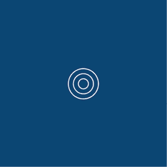

图 5-1：使用三个`circle()`函数绘制的三圆

然而，要填满整个窗口，你需要写更多的`circle()`行代码。你可以使用 Python 的`while`循环来迭代运行这些`circle()`函数，而不是手动添加`circle()`函数。

### while 循环

`while`循环是一种控制流语句，类似于`if`语句。关键区别在于`while`会继续执行它下方缩进的代码*直到*条件不再成立。

在你的*同心圆*草图中，通过使用`'''`进行多行注释，将`circle()`行注释掉，并添加一个基本的`while`循环结构：

```py
. . .'''circle(width/2, height/2, 30, 30)circle(width/2, height/2, 60, 60)circle(width/2, height/2, 90, 90)'''
i = 0while i < 24: print(i)
```

`i`变量被定义为*循环计数器*，控制`while`语句的迭代。对于`while`表达式，`i`等于 0，因此小于 24。与仅执行一次`print()`函数的`if`语句不同，`while`会重复执行`print`语句，直到`i`的值达到 24——而在此情况下，永远不会达到。

运行草图时，控制台将打印出一连串的`0`（图 5-2）。

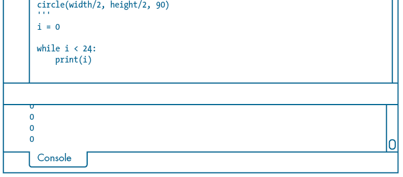

图 5-2：控制台列出了无尽的零。

这段代码使你的程序崩溃，进入了一个无限循环！要退出程序，请点击**停止**按钮。处理可能需要一些时间才能响应。变量`i`保持为 0，且`i < 24`条件永远无法达到`False`，因此循环无法结束。

为了纠正这个问题，在每次`while`循环迭代时将`i`加 1：

```py
. . .while i < 24: print(i) i = i + 1
```

这行代码表示循环计数器`i`等于其自身加 1。在第一次迭代时，`i`为 0，满足小于 24 的条件，程序打印`0`，然后将`i`加 1，开始下一次迭代。在下次迭代中，`i`为 1，依然小于 24，程序打印`1`，将`i`加 1，并再次执行这个过程。只要`i < 24`的条件为`True`，迭代将继续。当`i`达到 24 时，程序将退出循环并执行`while`块之后的其他代码。

请注意，输出永远不会达到 24（图 5-3），因为`while`条件语句中写的是“`i`小于 24”，而不是“`i`小于或等于 24”。

要绘制 24 个圆形，请在循环内放置`circle()`函数：

```py
. . .while i < 24: print(i) circle(width/2, height/2, 30*i) i = i + 1
```

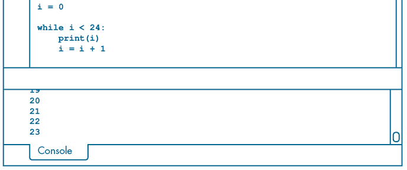

图 5-3：控制台显示 0 到 23，但不显示 24。

为了避免绘制 24 个大小完全相同、位置相同的圆形，可以将`i`作为`circle()`直径参数的乘数。在第一次迭代时，直径参数等于`30*0`。因此，第一个圆形位于显示窗口的正中心，直径为 0，因此不会渲染出来（图 5-4）。

其他 23 个圆形足以填满 500 × 500 像素的区域。通过修改`while`语句中的数字，你可以绘制任意数量的圆形（多或少）。

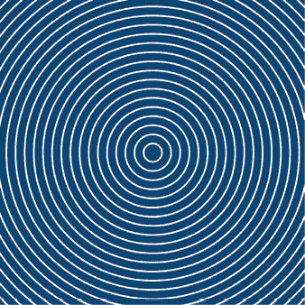

图 5-4：图形现在有 24 个圆形（其中一个不可见，另一些部分被裁剪）。

### for 循环

Python 的 `for` 循环会执行指定次数的代码块。不同于依赖条件表达式的 `while` 循环，`for` 循环是对一个序列进行迭代。*序列* 是一组值的集合；例如，字符串数据是字符的序列。Python 的 *列表* 是特别灵活的序列，关于列表的内容我将在第七章讲解。为了在本节的 `for` 循环中生成序列，你将使用 `range()` 函数。

当你在进入循环之前已经确定了所需的迭代次数时，`for` 循环比 `while` 循环更合适。一般来说，`for` 循环更简洁，且不会触发无限循环。当 `while` 循环或 `for` 循环都能满足需求时，选择 `for` 循环。

理解 `for` 循环的最简单方法之一是将你已经写过的使用 `while` 语句的代码进行转换。通过使用 **文件**▶**另存为**，将 *concentric_circles* 保存为一个名为 *for_loop* 的新草图。将 `while` 循环的部分注释掉，并添加以下 `for` 循环：

```py
. . .'''1 i = 0while i < 24: print(i) circle(width/2, height/2, 30*i)2     i = i + 1'''3 for i in range(24): print(i) circle(width/2, height/2, 30*i)
```

在 `while` 循环版本中，记得你必须定义 `i` 变量作为循环计数器。每次 `while` 块迭代时，你还必须递增 `i` 以避免进入无限循环。`for` 语句则不需要定义和管理一个单独的计数器变量。

因此，`i = 0` 1 就不再需要，也不再需要嵌套语句来递增它 2。相反，`range()` 函数接受 `24` 作为参数，生成从 0 到不包括 24 的序列，控制 `for` 循环 3 的迭代行为。在第一次迭代时，`i` 等于 0，即序列中的第一个值。每次迭代后，`range()` 序列中的下一个值将赋给 `i`。当 `i` 达到 23 时，`for` 块会执行最后一次，然后 Python 退出循环。运行草图以确认显示窗口与 图 5-4 看起来相同。

`range()` 函数最多可以接受三个参数。分别提供起始值和结束值两个参数：

```py
. . .for i in range(10, 13): print(i) circle(width/2, height/2, 30*i)
```

在这个例子中，`circle()` 函数应该执行三次，分别是 `i` = 10, `i` = 11 和 `i` = 12。运行草图以查看结果（图 5-5）。

你应该能看到三个同心圆。

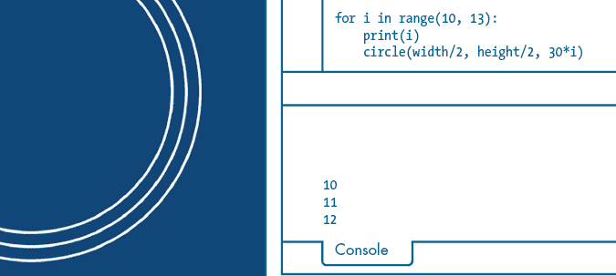

图 5-5：`range(10, 13)` 的结果

现在使用三个范围参数来分别表示起始、结束和步长。*步长* 是序列中每个整数之间的差值：

```py
. . .for i in range(3, 13, 3): print(i) circle(width/2, height/2, 30*i)
```

在这个例子中，`circle()` 函数应该执行四次，分别是 `i` = 3, `i` = 6, `i` = 9 和 `i` = 12。结果应该是四个间距增大的环（图 5-6）。

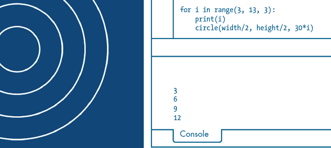

图 5-6：`range(3, 13, 3)` 的结果

尝试不同的范围参数，观察圆形是如何被影响的。

#### 挑战 #4：创建线条图案

在这个挑战中，使用`line()`函数和每个图案一个`for`循环，重新创建图 5-7 中展示的三个图案。如果你的代码产生的结果与示例稍有不同，也不要担心，只要基本图案保持不变即可。

如果你不确定从哪里开始，这里有一些线索可以帮助你处理每个图案：

+   左侧的图案类似于同心圆，只是它有 12 条对角线。

+   对于中间的图案，行间距随着每次`for`循环迭代增加 1.5 倍。定义一个额外的变量可能会有所帮助。

+   右侧的图案需要在`for`循环中嵌套`if...else`结构。你可以考虑使用第一章中描述的取余（`%`）运算符来判断`i`是奇数还是偶数。

如果你需要帮助，可以在[`github.com/tabreturn/processing.py-book/tree/master/chapter-05-iteration_and_randomness/for_loop_patterns/`](https://github.com/tabreturn/processing.py-book/tree/master/chapter-05-iteration_and_randomness/for_loop_patterns/)找到解决方案。


图 5-7：三种`for`循环图案

## `break`和`continue`语句

循环提供了一种高效的方式来自动化和重复任务。不过，有时你可能需要提前退出循环。例如，当你绘制一系列同心圆来填充显示窗口时（如前面的任务所示），如果圆形在`range()`值序列耗尽之前到达显示窗口的边缘，你可能想要*break*循环。如果 Python 在`for`或`while`循环中遇到`break`语句，它会立即终止该循环。循环终止后，程序会照常继续执行。

有时你需要终止一次迭代（而不是整个循环），让 Python 立即开始下一次迭代。为此，可以使用`continue`语句。

让我们看一个简单的示例，比较普通的循环、带有`break`语句的循环和带有`continue`语句的循环。无需编写任何代码。图 5-8 展示了三条虚线，从左到右使用每种循环类型绘制。

淡蓝色（上方）虚线的循环如下所示：

```py
for i in range(20, width, 20): fill('#0099FF') circle(i, 75, 10)
```

每次迭代时，`circle()`函数绘制一个新的点，将其放置在前一个点右侧 20 像素的位置。第一个点的 x 坐标是 20；当虚线达到显示窗口的`width`时，循环完成。这个循环不关心两个垂直的红色带，并会直接穿过它们绘制点。

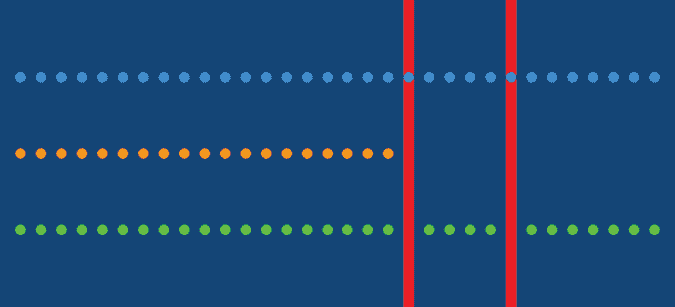

图 5-8：使用不同循环绘制虚线

橙色（中间）虚线的循环如下所示：

```py
for i in range(20, width, 20): if red(get(i, 150)) == 255: break fill('#FF9900') circle(i, 150, 10)
```

`get()` 函数接受一个 x-y 坐标并返回该位置的像素颜色；要提取该像素的红色值，你需要将 `get()` 函数包裹在 `red()` 函数中。这会根据 RGB 混合返回一个介于 0 和 255 之间的红色值，对于任何在亮红色带中的像素（`#FF0000`），其值为 255。循环会在绘制点之前检查是否有红色像素；如果检测到，`break` 语句会终止循环。由于 `break` 语句会立即退出循环，`fill()` 和 `circle()` 函数在最后一次迭代时不会绘制任何点。

绿色（底部）虚线的循环如下所示：

```py
for i in range(20, width, 20): if red(get(i, 225)) == 255: continue fill('#00FF00') circle(i, 225, 10)
```

这个循环会在绘制点之前检查是否有红色像素；如果检测到像素，`continue` 语句会立即终止当前循环的迭代，并开始下一次迭代，跳过 `fill()` 和 `circle()` 函数。

## 随机性

随机性是计算机编程中的一个重要概念，因为它在加密学中的应用。此外，随机性被编程应用于从视频游戏到模拟到赌博软件的各个领域。然而，计算机生成的随机数并不是真正的随机，因为它们是通过特定的算法生成的。如果你知道生成“随机”数所用的算法和条件，你就可以预测序列中的模式。因此，计算机只能通过生成*伪随机*数来模拟随机性，这些数并不是真正的随机数，但在统计上足够接近实际的随机数。

在本节中，你将使用 Processing 的 `random()` 和 `randomSeed()` 函数来生成伪随机值。利用这些随机值，你将绘制出比使用预定义值时更有趣的图案。

### random() 函数

每次调用 Processing 的 `random()` 函数时，它会在指定的范围内生成一个意想不到的值。为了开始实验随机性，创建一个新的草图并将其保存为 *random_functions*。添加以下设置代码：

```py
size(600, 250)background('#004477')noFill()stroke('#FFFFFF')strokeWeight(9)
```

新的草图有一个蓝色背景。很快，你将绘制点；点的大小受到 `strokeWeight()` 函数的影响。

`random()` 函数最多可以接受两个参数。如果只有一个参数，表示你定义了一个上限：

```py
print(random(5))
```

这段代码会显示一个范围从 0 到但不包括 5 的随机浮动值。

两个参数分别表示上限和下限：

```py
print(random(5, 10))
```

这一次，控制台会显示一个范围从 5 到但不包括 10 的随机浮动数。

如果你想要一个随机整数，可以将 `random()` 函数包裹在 `int()` 中。这会通过去掉小数点及其后的所有内容，将浮动数转换为整数：

```py
print(int(random(5, 10)))
```

图 5-9 显示了你可以预期看到的内容。当然，由于值是随机的，控制台输出在你的计算机上会有所不同，每次运行草图时也会有所不同。

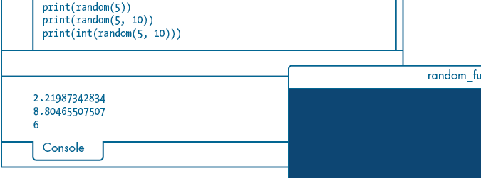

图 5-9：尝试不同的 `random()` 参数

接下来，让我们生成 50 个随机值。与其在控制台区域打印一长串数据，不如将它们作为一系列共享 y 坐标的点进行绘制。添加以下代码：

```py
. . .for i in range(50): point(random(width), height/2)
```

这个 `point()` 函数使用 `random()` 函数来定义其 x 坐标。y 坐标始终为 `height/2`。每次运行草图时，点的位置应该会有所不同（图 5-10）。

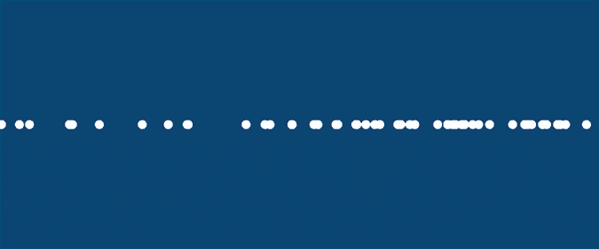

图 5-10：沿一条直线分布的随机值

现在将 `range` 参数从 `50` 改为 `500`，并使用随机的 x 和 y 坐标绘制点：

```py
. . .for i in range(**500**): point(random(width), **random(height)**)
```

结果应该是一个显示窗口，里面填充了 500 个随机位置的点（图 5-11）。

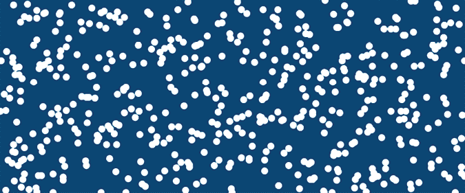

图 5-11：用随机摆放的点填充显示窗口

每次运行草图时，它都会生成一个（略微）不同的排列。

### 随机种子

在图 5-10 和图 5-11 中，Processing 从伪随机的 *序列* 中选择坐标。这个伪随机序列本身依赖于一个 *随机种子*，这是一个随机函数根据不可预测的因素（如按键时间）选择的初始数字。例如，你可能在上一秒的时刻过去 684 毫秒时按下了最后一个键。对于 0 到 9 之间的随机数，你的计算机会抓取 684 的最后一位数字（即 4）。随机种子决定了你从第一次 `random()` 调用中得到的结果以及后续所有调用的结果。

你可以使用 Processing 的 `randomSeed()` 函数手动设置随机种子。将范围参数改为 `10`，并在工作草图的最顶部插入一行 `randomSeed()`：

```py
randomSeed(213)size(600, 250). . .for i in range(**10**): point(random(width), random(height))
```

这个 `randomSeed()` 函数接受一个单一的参数，任何你选择的整数，不过在本例中我们使用 `213`。与 500 个点的（图 5-11）版本不同，该版本没有定义随机种子，每次运行代码时都会产生相同的模式，在任何执行它的计算机上都是如此。

这种确保程序每次运行时生成相同伪随机数序列的能力在许多应用中非常有用。例如，假设你开发了一个平台游戏，关卡中包含随机摆放的障碍物。不需要手动摆放障碍物可以节省大量时间。然而，你发现某些伪随机数序列生成的关卡比其他的更具吸引力。而且，生成的关卡难度不同，所以你需要控制玩家通过关卡的顺序。如果你知道哪些种子值生成了每个关卡，你就可以仅通过一个整数按需重现任何一个关卡。

在下一部分，你将结合 `for` 循环和 `random()` 函数来创建有趣的瓷砖排列。

## Truchet 瓷砖

塞巴斯蒂安·特鲁谢（Sébastien Truchet，1657–1729），一位法国多米尼加修道士，活跃于数学、水利学、图形学和排版学等领域。在他众多的贡献中，他开发了一种利用瓷砖创建有趣图案的方案，这些瓷砖后来被称为*Truchet 瓷砖*。原始的 Truchet 瓷砖是方形的，并通过对角线将其对角角落分割。这个瓷砖可以以 90 度的倍数旋转，产生四种变体，如图 5-12 所示。


图 5-12：一块 Truchet 瓷砖，展示了其四种可能的方向

这些瓷砖排列在一个方形网格上，可以是随机的或根据某种模式排列，以创建美观的设计。图 5-13 展示了四种可能的排列，包括一个随机的瓷砖排列（右下角）以及一些有序的排列方法。

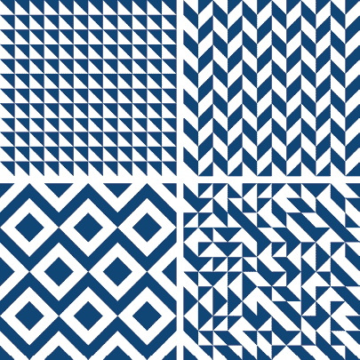

图 5-13：四种 Truchet 瓷砖布局

接下来，你将使用图 5-14 中展示的四分之一圆 Truchet 瓷砖，并以其两种可能的方向进行排列。

让我们运用你在本章中学到的循环和随机性技术，使用这种瓷砖创建不同的图案。创建一个新的草图，并将其保存为 *truchet_tiles*。添加以下设置代码：

```py
size(600, 600)background('#004477')noFill()stroke('#FFFFFF')strokeWeight(3)for i in range(1, 145): arc(0, 0, 50, 50, 0, PI/2) arc(50, 50, 50, 50, PI, PI*1.5)
```

新的草图有一个蓝色背景。你绘制的每个形状将没有填充，只有 3 像素宽的白色轮廓线。这是为了绘制图 5-14 中展示的四分之一圆设计。每块瓷砖的大小是 50 × 50 像素，因此显示窗口可以正好放下 12 列（600 ÷ 50）和 12 行。因此，填满显示窗口需要 144 块（12 × 12）瓷砖，这就是 `range(1, 145)` 的由来。


图 5-14：四分之一圆 Truchet 瓷砖

运行草图。一个瓷砖应出现在左上角（图 5-15）。


图 5-15：所有 144 块瓷砖放置在左上角

实际上，在图 5-15 中，你看到的是所有 144 块瓷砖放置在同一个位置！

要控制列和行的位置，使用 `col` 和 `row` 变量。根据粗体代码修改你的脚本：

```py
. . .**col = 0****row = 0**for i in range(1, 145): arc(**col**, **row**, 50, 50, 0, PI/2) arc(**col+**50, **row+**50, 50, 50, PI, PI*1.5) **col += 50**
```

每次循环迭代时，`col` 变量（瓷砖的 y 坐标）增加 `50`。结果应当是每个瓷砖放置在其前一个瓷砖的右边，如图 5-16 所示。


图 5-16：剩余的 132 块瓷砖位于右边缘之外。

然而，有一个问题：程序不知道何时返回左边缘并开始新的一行。相反，瓷砖溢出，延伸到右边缘，超出了可见范围。

为了纠正这一点，在循环中嵌套一个 `if` 语句：

```py
. . .for i in range(1, 145): . . . if i % 12 == 0: row += 50 col = 0
```

`i % 12`对于任何能够被 12 整除的`i`值都会返回 0。换句话说，如果一个除以 12 的操作余数为 0，就表示你刚刚放置了另外 12 个瓷砖。此时，`row`变量会增加 50，`col`会重置为 0。下一个瓷砖会被放置在新一行的开头，这将导致显示窗口充满瓷砖（图 5-17）。

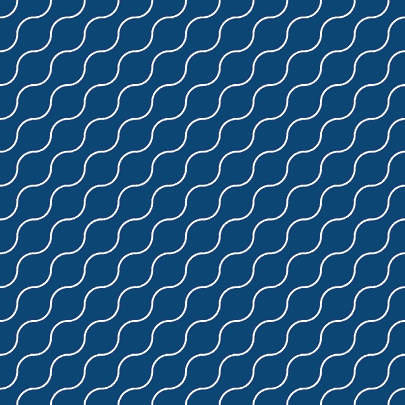

图 5-17：充满四分之一圆形 Truchet 瓷砖的显示窗口

为了增加趣味性，通过添加以下`if...else`结构来随机化每个瓷砖的方向：

```py
. . .for i in range(1, 145): if int(random(2)1): arc(col, row, 50, 50, 0, PI/2) arc(col+50, row+50, 50, 50, PI, PI*1.5) 2 else: arc(col+50, row, 50, 50, PI/2, PI) arc(col, row+50, 50, 50, PI*1.5, 2*PI) col += 50 . . .
```

`random(2)`函数会返回一个从 0 到不包括 2 的浮点值。因此，将结果通过`int()`转换为整数，便会得到 0 或 1。这就像是抛硬币，每次迭代时会决定选择哪种瓷砖方向。因为这个“抛硬币”操作返回的是一个布尔兼容的值——0 或 1——它可以作为`if`语句的条件，完全不需要关系运算符。如果抛硬币的结果是 0，`else`代码 2 将会运行，因为`0`等同于`False`（而`if`只在`True`时运行）。

每次运行草图时，显示窗口都会呈现不同的图案（图 5-18）。

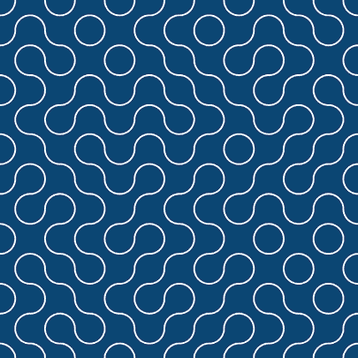

图 5-18：随机排列的四分之一圆形 Truchet 瓷砖

如果你曾经玩过策略游戏*Trax*，这个图案应该很熟悉。另一个基于瓷砖的策略游戏*Tantrix*使用了 Truchet 瓷砖的六边形变体。当然，瓷砖的种类远不止 Truchet 这一种。你可以尝试添加填充、将半圆形替换为对角线、增加额外的瓷砖或添加有关瓷砖之间可以相邻的规则（图 5-19）。如果你在寻找有趣的项目，许多瓷砖图案可供灵感参考。

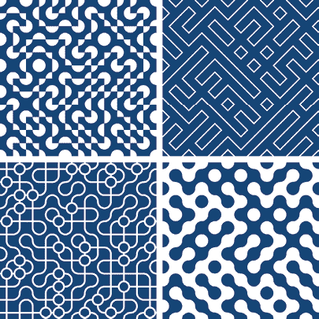

图 5-19：Truchet 瓷砖的变体

你可以在[`github.com/tabreturn/processing.py-book/tree/master/chapter-05-iteration_and_randomness/truchet_tiles_variations`](https://github.com/tabreturn/processing.py-book/tree/master/chapter-05-iteration_and_randomness/truchet_tiles_variations)找到一些 Truchet 瓷砖变体的代码。

随着你的程序变得越来越复杂，你会发现有多种方法可以编码出相同的结果。例如，你可以通过在一个循环内使用另一个循环，利用带步长参数的`range()`函数，或是各种组合方式来铺设四分之一圆形的 Truchet 瓷砖。在 Github 上的 Truchet 瓷砖变体中，你会找到一个名为*loop_within_a_loop*的示例，它采用了这种方法。现在你已经理解了控制流，你可以开始思考如何优化算法以提高可读性和效率。

## 总结

您现在已经学习了迭代以及如何使用`while`和`for`语句编写循环；这让您能够用更少的代码行完成更多的任务，且代码更加灵活。循环将在本书的后续章节中不断出现，为您提供更多掌握它们的机会。

本章还介绍了随机性，它在各种计算应用中都很有用，包括创意编程。Processing 的`random()`函数生成伪随机数序列，您可以通过使用随机种子来控制这些序列，从而确保每次运行草图时产生相同的值序列。

下一章将介绍运动。您将学习如何为您的 Processing 草图添加运动，同时也会学习变换函数，作为高效的方式来移动、旋转和缩放您的元素，特别适用于一组形状。
