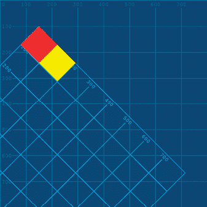

## 第六章：运动与变换


将运动应用于生物和无生命物体的图形，可以赋予它们个性。弹跳的动画暗示着俏皮；精确的运动意味着强度，而慢动作则可以暗示沉重。这些技巧被广泛应用于电影、动画、舞蹈编排，当然，还有你最喜欢的皮克斯动画片。但这还不是全部，运动在界面设计中也非常普遍，比如微妙的按钮悬停效果，或者在内容加载时出现的复杂旋转图形。

在本章中，你将通过编写运动和变换函数的代码让物体动起来。你将学习如何使用变换函数操控坐标系统，使得移动、旋转和缩放元素变得更加简单。此外，你还将学习如何通过使用`setup()`和`draw()`函数来构建一个动画的 Processing 草图。运动从字面上为你的 Processing 草图增加了一个新的维度——时间。

## 感知运动

首先，考虑一下运动是如何被感知的。大脑每秒钟从视网膜获取许多次快照。只要显示屏每秒能够显示超过大约 10 到 12 帧的静态图像，观众就会体验到平滑流畅的运动错觉。更高的帧率会显得更加平滑。

稍作停顿，注意图 6-1 中的两个圆圈。


图 6-1：两个圆圈（左侧和右侧定位）

如果你仅展示左边的圆圈四秒钟，再展示右边的圆圈四秒钟，循环这个序列无限次（见图 6-2），这将是一个有效的帧率，约为每秒 0.25 帧（即 0.25 *fps*）。结果，大多数观察者会同意，这将呈现出一对交替出现的图像，显示圆圈在两个不同位置之间变化。


图 6-2：显示交替的圆圈

然而，当帧率加速到大约 2.5 帧每秒（快 10 倍）时，观察者将开始将序列解读为一个在两个点之间弹跳的圆圈——就好像圆圈在中间的空隙中移动一样。这种错觉被称为*贝塔运动*。进一步提高帧率时，两个圆圈将同步闪烁。从这个实验中，你可以看到帧率不仅影响物体的移动速度，还影响你对物体运动的感知。

请注意图 6-3 中圆圈的编号。

现在，假设你想要为此做动画。按照编号来确定顺序，每一帧移除一个圆圈。在第一帧，移除标记为 0 的圆圈。在第二帧，替换圆圈 0 并只移除圆圈 1。继续围绕环形路径进行此操作，并使动画循环播放。每一帧移除一个连续的圆圈，结果是一个以顺时针方向移动的间隙（图 6-4）。


图 6-3：按顺时针顺序编号的圆圈环


图 6-4：动画中的圆圈环

如果你以 1 帧每秒（fps）的速度运行动画，圆圈刚好出现在间隙前面，似乎跳入了空缺的圆圈位置（图 6-5）。


图 6-5：以 1 fps 的速度，接下来的圆圈似乎跳进了空缺中。

然而，在 25 帧每秒（fps）下，一个快速移动的虚拟白点似乎遮挡了其下方的圆圈，因为它在环形路径上疾驰——这种现象被称为*菲现象*（图 6-6）。

现在你已经准备好构建一个 Processing 草图，除了引入 Processing 的动画功能外，还可以让你实验这些现象。


图 6-6：以 25 fps 的速度，一个虚拟的白点似乎遮挡了圆圈。

## 为 Processing 草图添加运动

Processing 允许你选择在显示窗口中绘制一次或多次。对于动画，你会使用后者的方法。为了让一个对象移动，你需要在每一帧中调整它的位置——如果调整得足够迅速、增量足够小，结果就是平滑、流畅的运动。

### `draw()` 和 `setup()` 函数

要让 Processing 多次绘制某个对象，你需要通过使用`setup()`和`draw()`函数来构建你的代码。在这两个函数下面，你可以嵌套书中到目前为止讲解的任何函数或语句。正如图 6-7 所示，你的代码放置位置取决于你希望它执行的时机。


图 6-7：为运动构建代码结构

任何`def`关键字后面都会跟着函数名、括号和冒号。第九章会更详细地介绍`def`，但现在只需知道，任何缩进在`def`下方的代码都属于该函数。

`setup()`代码在启动时只运行一次，通常包括像`size()`函数这样的内容以及定义环境属性的其他代码。我稍后会更详细地讲解`draw()`，但首先，创建一个新的草图，保存为*perceiving_motion*，然后添加以下代码：

```py
def setup(): size(500, 500) background('#004477') noFill() stroke('#FFFFFF') strokeWeight(3)
```

这段代码几乎与你之前设置的每一个草图相似，唯一不同的是`def setup()`这一行。每当你打算使用`draw()`函数时，你也必须使用`setup()`。现在添加`draw()`函数：

```py
. . .def draw(): print(frameCount)
```

Processing 在每个新的帧下调用`draw()`函数中的代码。`frameCount`是一个系统变量，包含自开始草图以来显示的帧数。每当新帧到来时，`draw()`函数会调用`print()`函数，从而在控制台显示当前的帧计数。

默认情况下，`draw()`以大约 60 帧每秒（fps）执行。然而，随着动画复杂度的增加，帧率可能会下降，因为你的计算机需要应对更高的需求。通过使用`frameRate()`函数（在`setup()`块内）调整帧率，并向`draw()`添加条件，仅在偶数帧上进行打印：

```py
def setup(): . . . frameRate(2.5)def draw():  if  frameCount % 2 == 0: print(frameCount)
```

将`frameRate`设置为`2.5`，表示每秒绘制两次半线；这意味着每一帧的持续时间是 400 毫秒（0.4 秒）。由于`print`行在每一秒的第 2 帧执行，因此每 800 毫秒（图 6-8）控制台中会出现一行新的输出。


图 6-8：在每个偶数帧上打印帧计数

若要仅在每个偶数帧上绘制圆形，可以使用以下`circle()`行：

```py
. . .def draw(): if frameCount % 2 == 0: circle(420, 250, 80)
```

现在运行草图。你可能会惊讶地发现，圆形并没有闪烁开关（图 6-9）。


图 6-9：圆形不会“闪烁”。

圆形在奇数帧上不消失的原因是，在 Processing 中，绘制的内容会保持不变。每个偶数帧时，程序会在现有的“堆叠”上绘制另一个圆。`setup()`函数中的`background()`颜色在程序开始时执行一次，填充显示窗口为蓝色，形成这个持久性排列的最底层。为了在绘制下一个帧之前“擦除”每一帧，你可以在绘制所有内容之前重新绘制背景。

将`background('#004477')`行复制到你的草图的`draw()`部分：

```py
. . .def draw(): background('#004477') if frameCount % 2 == 0: circle(420, 250, 80)
```

新的`background()`行在每一帧之前清除画面。确保它位于`if`语句之前。在大多数情况下，`background()`函数通常位于`draw()`的顶部，以避免清除当前帧中的其他形状。

测试代码。结果应该是一个闪烁的圆。

为了重新创建之前的圆环实验（图 6-3），将现有的`if`语句替换为一系列的`if`语句：

```py
. . .def draw(): background('#004477') hide = frameCount % 81 if hide != 0: circle(250, 80, 80) if hide != 1: circle(370, 130, 80) if hide != 2: circle(420, 250, 80) if hide != 3: circle(370, 370, 80) if hide != 4: circle(250, 420, 80) if hide != 5: circle(130, 370, 80) if hide != 6: circle(80, 250, 80) if hide != 7: circle(130, 130, 80)
```

当前帧计数除以`8`的余数赋值给`hide`变量。每个`if`语句将绘制一个单独的圆，前提是该圆没有被标记为隐藏。例如，在第 16 帧时，`hide`等于`0`，因为 16 能够被 8 整除。在第 15 帧时，`hide`等于`7`，因为 15 除以 8 的余数是 7。在第 17 帧时，`hide`等于`1`。结果是一个从 0 到 7 的数字流，然后从 0 重新开始。

运行草图。注意间隙如何在圆圈周围移动。在当前的帧率 2.5 fps 下，间隙前方的圆圈似乎跳入了空缺圆圈留下的空白处。但当帧率调整为 25 fps 时，一个类似幽灵的背景色点似乎会在它绕环圈快速移动时遮住下面的圆圈。

### 全局变量

*全局变量*是指你可以在程序中的任何地方访问的变量。到目前为止，书中你定义的几乎每个变量都是全局变量。你需要更多地了解全局变量，以便在多个帧之间管理数据。

全局变量是在任何函数定义（以`def`开头的缩进代码块）外声明的，通常位于代码的顶部。例如，你在`setup()`和`draw()`外声明的任何变量都会自动成为全局变量。相反，任何在这两个函数的缩进行内声明的变量只在该函数内可访问。

作为这种行为的示例，创建一个新的草图并将其保存为*global_variables*。添加以下代码：

```py
def setup(): 1 y = 1def draw(): 2 print(y)
```

`y`变量 1 是在`setup()`函数内声明的。因此，`y`仅在`setup()`代码块的缩进行内可访问。`y`变量的作用域因此被认为是*局部*的，限定在`setup()`中。在编程中，*作用域*是指可以访问变量（或其他实体）的区域。在这种情况下，运行草图会产生一个错误（图 6-10），因为你尝试从`draw()`函数中访问并打印变量`y` 2。


图 6-10：`draw()`函数无法访问在`setup()`中声明的`y`变量。

另外，你也可以将`y = 1`这一行移动到`setup()`函数外部，这样它就处于全局作用域；这允许任意一个函数读取它。将这一行移动到代码顶部，并在你移出的位置插入一个`pass`语句：

```py
y = 1def setup(): passdef draw(): print(y)
```

`draw()`函数现在可以访问`y`，因为它已经在`setup()`外部声明。`pass`语句是一个*空操作*——也就是说，当它执行时什么都不会发生。你需要包含一个`pass`语句，因为 Python 不允许空的函数定义。这使得`pass`成为任何尚未编写代码的有用占位符。运行草图时，控制台应该会打印出无尽的`1`。

你可以通过在局部范围内使用另一个同名变量来覆盖全局的`y`变量——在这种情况下，另一个名为`y`的变量。对你的代码进行以下调整：

```py
y = 1def setup(): 1 y = 0 2 print(y)def draw(): 3 print(y)
```

`setup()`函数先运行—仅运行一次—并且它的`print`第 2 行显示`0`。这是因为在`setup()`函数中，你将`y`定义为`0`。外部（全局）`y`仍然等于 1，并且它被认为是被`setup()`内部（局部）`y`变量所*遮蔽*。`draw()`代码在`setup()`代码之后执行，并且在每个新帧中，都会向控制台打印`1`。运行草图，迅速停止它，然后向上滚动控制台输出。第一行显示的是`0`；从那以后，都是`1`（见图 6-11）。


图 6-11：全局`y`变量被`y = 0`遮蔽。

接下来，移除`y = 0`行，并添加代码，尝试在每帧中将全局`y`变量增加`1`：

```py
. . .def draw(): y += 1 print(y)
```

虽然你可以读取（或遮蔽）任何全局变量，但写入或重新赋值需要额外的代码。因此，这段代码应该会导致 Processing 显示错误（见图 6-12）。


图 6-12：`draw()`函数无法重新赋值给`y`。

这就是`global`语句有用的地方。编辑你的代码，在`draw()`块的顶部插入`global y`行：

```py
. . .def draw(): global y y += 1 print(y)
```

全局`y`变量现在与`draw()`的局部作用域绑定，你可以根据需要修改它。运行草图。全局`y`变量现在应该在每个新帧中递增 1（见图 6-13）。


图 6-13：全局`y`变量在每个新帧中递增 1。

全局变量允许你轻松地跟踪和更新帧之间的值，这对于动画对象尤其有用。添加一个移动的圆圈，其 y 坐标由`y`变量控制：

```py
y = 1def setup(): print(y) size(500, 500) noFill() stroke('#FFFFFF') strokeWeight(3)def draw(): . . . background('#004477') circle(height/2, y, 50)
```

我将大小、填充和描边属性放在了代码的`setup()`部分。由于描边和填充在整个动画过程中保持不变，因此无需在`draw()`中重复应用这些属性。圆圈的 y 坐标，由变量`y`表示，随着帧的推进而将圆圈向下移动。在图 6-14 中，已经添加了运动轨迹以传达运动方向。


图 6-14：圆圈从显示窗口的顶部向下移动。

当圆圈到达显示窗口的底部时，它会继续向下超出视野，越过底边。

### 保存帧

Processing 提供了`saveFrame()`函数，用于将帧保存为图像文件。每当你的草图调用`saveFrame()`时，它会将一个*标记图像文件格式*（TIFF）图像保存在草图文件夹中。你会希望在`draw()`函数的末尾放置这个调用，以确保捕获当前帧中渲染的每个形状。例如，假设你将以下代码添加到`draw()`函数中：

```py
. . .def draw(): . . . if frameCount % 100 == 0: saveFrame() square(10, 10, 100)
```

每当动画遇到第 100 帧时，新的图像文件会出现在你的草图文件夹中。这个图像文件的命名规则是*screen-*后面跟着四位数的帧数；在需要时，帧数会用前导零填充，如图 6-15 所示。因为`saveFrame()`在`square()`行之前执行，所以方块出现在动画的每一帧中，但永远不会出现在保存的图像文件中。


图 6-15：`saveFrame()`函数生成一个以帧数命名的图像文件。

如果你想将文件保存为除 TIFF 外的其他图像格式，如 JPG、PNG 或 TARGA，可以在文件名参数中包含相关的扩展名：

```py
 . . . saveFrame('frame.png')
```

在这种情况下，你会使用相同的文件名保存每个图像，这对于捕捉单个帧是可以的，但当你多次调用相同的`saveFrame()`函数时，会导致文件被覆盖。然而，你可以在文件名中加入一系列哈希符号，使得帧数出现在文件名中。以下代码会在每次保存时生成一个独一无二的 PNG 文件：

```py
 . . . saveFrame('frame-####.png')
```

Processing 会将哈希符号替换为帧数，并在必要时用前导零填充帧数。

#### 挑战 #5：DVD 屏幕保护程序

在这个任务中，你将结合`setup()`、`draw()`、全局变量和`if`语句来为一个物体制作动画，使其在显示窗口的边缘反弹。

DVD 播放器通常会有一个反弹的 DVD 标志作为屏幕保护程序（图 6-16），它会在一定时间的非活动后出现。你可能在其他设备上见过这种变化，尽管它们的图形不同。有趣的是，人们经常会盯着这个无意义的动画，希望看到标志完美地停在屏幕的角落。


图 6-16：标志在屏幕的边缘反弹。

创建一个新的草图，并将其保存为*dvd_screensaver*。添加以下代码：

```py
y = 100
yspeed = 2def setup(): size(800, 600) fill('#0099FF') textSize(50)def draw(): 1 global y, yspeed background('#000000') 2 y += yspeed text('DVD', 100, y3)
```

这段代码与之前使用圆形的例子类似（图 6-14）。在这个实例中，你需要加入一个`yspeed`变量。要为多个变量使用单一的`global`语句，可以用逗号分隔它们。1. 每当新的一帧出现时，程序会将`yspeed`加到`y`变量上 2，这个`y`变量作为 DVD 文字的 y 坐标 3。运行草图时，标志应该会直接向下移动（图 6-17），很快会超出显示窗口的底边。


图 6-17：DVD 文字向下移动。

为了让标志从显示窗口的底边反弹，添加以下`if`语句：

```py
. . .def draw(): . . . if y > height: yspeed *= -1
```

当`y`变量超出显示窗口的`height`时，`yspeed`会乘以`-1`，使得标志朝相反的方向移动。运行草图时，标志应该会在触碰到底部边缘时反弹。

要让标志沿对角线移动，添加一些`x`值：

```py
. . .
x = 100
xspeed = 2. . .def draw(): global y, yspeed, **x, xspeed** background('#000000') y += yspeed x += xspeed text('DVD', **x**, y) . . .
```

在这里，你已将之前使用 `y` 和 `yspeed` 变量所做的一切复制到了 `text()` 函数的 `x` 参数中。现在，标志应该可以在垂直和水平方向上移动了。运行草图（图 6-18）。


图 6-18：斜着移动的 DVD 文本在右下角附近反弹。

当标志从底边反弹时，`yspeed` 被反转，但`xspeed` 不变。这是你期望的行为，但随后标志穿越了右边缘。相反，标志必须从它遇到的每个边缘反弹。你的挑战是完成这个任务。如果你需要帮助，可以访问解决方案：[`github.com/tabreturn/processing.py-book/tree/master/chapter-06-motion_and_transformation/dvd_screensaver/`](https://github.com/tabreturn/processing.py-book/tree/master/chapter-06-motion_and_transformation/dvd_screensaver/)。

## 变换

Processing 的*变换函数*通过使用平移、旋转、缩放和剪切操作提供了方便的方式来操控元素（图 6-19）。你可以将变换应用于单个形状、元素组或整个绘图空间。


图 6-19：从左到右：平移、旋转、缩放和剪切变换

假设你想要将一个星形（如图 6-20 所示）顺时针旋转。这个星形由一系列 `vertex()` 函数定义的顶点组成；每个顶点的位置由一对 x-y 坐标表示。


图 6-20：旋转一个星形

计算每个顶点的新位置需要一个*矩阵*。你可以把矩阵看作是一个数字表格。对于不同的变换，你可以通过加、减或乘以每对 x-y 坐标和*变换矩阵*来进行操作。在星形旋转的情况下，矩阵操作大致如下所示：图 6-21。方括号中标记为*顶点*的*x*和*y*值表示给定顶点的坐标对；这与*变换矩阵*相乘，用以计算新的旋转后的顶点位置。*结果*方括号中的方程揭示了矩阵运算的过程。


图 6-21：旋转的变换矩阵

如果矩阵运算看起来有些困惑，不用担心；Processing 会悄悄为你处理这一切。

在接下来的部分中，你将学习 `translate()`、`rotate()`、`scale()`、`shearX()` 和 `shearY()` 函数。你还将看到如何使用 `pushMatrix()` 和 `popMatrix()` 函数来将变换应用于选定的元素组。

### Processing 变换函数

创建一个新的草图，并将其保存为*transformation_functions*。在草图的文件夹内，创建一个*data*子文件夹，然后按照以下步骤操作：

1.  打开你的网页浏览器并访问[`github.com/tabreturn/processing.py-book/`](https://github.com/tabreturn/processing.py-book/)。

1.  导航到*chapter-06-motion_and_transformation*。

1.  下载*grid.png*和*grid-overlay.png*文件。

1.  将两个文件放入你的*data*子文件夹中。

添加以下设置代码：

```py
size(800, 800)noFill()noStroke()
grid = loadImage('grid.png')image(grid, 0, 0)
grido = loadImage('grid-overlay.png')
```

`grid`变量和`image()`语句加载并显示*grid.png*图形。*grid-overlay.png*文件被加载到`grido`变量中，但还没有在显示窗口中渲染；你将在后续任务中显示它。

### translate()

`translate()`函数接受两个参数：x 偏移量和 y 偏移量。通常，坐标(0, 0)表示显示窗口的左上角。这个点被称为*原点*。使用`translate()`，你可以重新定位坐标系，这会移动原点，并影响你之后绘制的所有内容。

在*transformation_functions*代码中添加`translate()`函数，并通过新的`image()`语句显示 grid-overlay 图形。

```py
. . .translate(150, 100)image(grido, 0, 0)
```

`translate()`函数将整个坐标系水平移动 150 像素，垂直移动 100 像素。`image()`函数在(0, 0)位置绘制 grid-overlay 图形——这是一种浅蓝色版本的第一个网格图像。*grid-overlay.png*图形具有透明背景，因此你应该能够看到*grid.png*文件透过它显示。运行草图以确认输出与图 6-22 相符。


图 6-22：显示在其上方的经过变换的 grid-overlay 图像的网格图

x-y 坐标(0, 0)不再与显示窗口的左上角对齐。grid-overlay 图形作为你新的、移动后的坐标系的可视化表示。

添加一个红色和一个黄色方块：

```py
. . .fill('#FF0000')square(0, 0, 100)fill('#FFFF00')square(100, 0, 100)
```

红色和黄色方块共享`y`参数为`0`，但黄色方块的 x 坐标为`100`。运行草图。Processing 根据新的原点相对定位两个方块。黄色方块应该出现在红色方块的右侧（见图 6-23）。

变换是累积的，这意味着每个后续的变换都会使用当前的坐标系作为参考，因此你可以通过使用额外的`translate(100, 0)`将黄色方块向右移动 100 像素：

```py
. . .translate(100, 0)fill('#FFFF00')square(**0**, 0, 100)
```

新的`translate()`语句的`x`参数为`100`，而`square()`的`x`参数现在为`0`。视觉效果应与图 6-23 相同。


图 6-23：水平相邻的红色和黄色方块

在第五章中，你学习了如何使用循环来排列 Truchet 图块。一个行和列变量追踪图块的位置。或者，你也可以使用`translate()`，每次循环迭代时移动坐标系。

### rotate()

`rotate()` 函数围绕原点 (0, 0) 旋转坐标系统。它接受一个以弧度表示的单一参数。正值顺时针旋转，负值逆时针旋转。与所有变换函数一样，效果是累积的。此外，您可以自由地将 `rotate()` 与其他变换函数混合使用。

在第一个 `translate()` 函数下方添加一行新的 `rotate()` 语句，以旋转网格覆盖图形和红色与黄色方块：

```py
. . .translate(150, 100)rotate(QUARTER_PI). . .
```

`rotate()` 函数使用 `QUARTER_PI` 弧度作为参数，相当于 45 度。请注意，`QUARTER_PI` 是一个预定义的 Processing 变量，相当于写作 `PI/4`。

运行草图。两个方块应当看起来作为一个整体进行旋转，同时显示网格覆盖图形（图 6-24）。



图 6-24：旋转网格覆盖图形和两个方块

坐标系统围绕当前原点旋转，原点作为枢轴点。回想一下，这个原点通过 `translate()` 函数已经偏移了 150 像素的 `x` 和 100 像素的 `y`。

函数的顺序非常重要。例如，交换 `translate()` 和 `rotate()` 语句会产生不同的视觉效果。图 6-25 提供了对比。幽灵方块显示了先执行的变换结果。右边的图像是先执行 `rotate()` 时产生的结果，此时原点与显示窗口的左上角对齐。


图 6-25：`translate()` 和 `rotate()` 函数的顺序很重要；左边的图像显示了先执行 `translate()`，右边的图像显示了先执行 `rotate()`。

要绕方块的中心而不是其左上角旋转，将方块的中心与原点对齐，方法是调整 `square()` 函数的 `x` 和 `y` 参数。

### scale()

`scale()` 函数调整坐标系统的大小。一个参数会按比例缩放；两个参数分别控制 x 和 y 轴的缩放。`scale(1)` 或 `scale(1, 1)` 不会产生任何效果，因为这些是默认的缩放值。

要减小缩放比例，请使用介于 0 和 1 之间的浮动值。缩小现有元素的大小：

```py
. . .translate(150, 100)rotate(QUARTER_PI)scale(0.5). . .
```

`scale(0.5)` 会将元素的大小缩小到原来的一半。与 `rotate()` 一样，缩放是相对于当前坐标系的原点而言的。换句话说，(0, 0) 保持不变，所有内容朝这个点收缩（图 6-26）。


图 6-26：使用 `scale(0.5)` 将大小减半

任何大于 1 的值都会放大。例如，要将所有内容的大小加倍，请使用 `scale(2)`。要在某个轴上进行反射/翻转，请使用负值。例如，`scale(-1, 1)` 会将所有内容水平翻转，生成元素的镜像图像。

### shearX() 和 shearY()

*剪切*形状会使其沿水平或垂直轴倾斜。结果是一个形变的形状，面积不变。一个典型的剪切例子是将矩形转换为具有倾斜边的平行四边形。

`shearX()`和`shearY()`函数分别应用水平和垂直剪切。每个函数接受一个以弧度为单位的单一参数。

要对你的网格覆盖图形和两个方块应用垂直剪切，可以注释掉`rotate()`行，并使用`shearY()`函数应用 45 度垂直剪切：

```py
. . .translate(150, 100)**#**rotate(QUARTER_PI)scale(0.5)shearY(QUARTER_PI). . .
```

`rotate()`函数被注释掉，以使剪切的方向更加直观。`shearY()`的参数是一个正数，因此剪切会按顺时针方向应用。图 6-27 对比了这些代码更改的结果（左图）与`shearX()`操作（右图）。

现在你已经知道如何组合变换函数；然而，你通常会希望将变换效果限制在某些元素的范围内。接下来，让我们看看如何在单个草图中使用多个坐标矩阵。


图 6-27: `shearY(QUARTER_PI)`（左）和`shearX(QUARTER_PI)`（右）

### pushMatrix()和 popMatrix()

`pushMatrix()`和`popMatrix()`函数允许你隔离任何变换函数的效果。通过这种方式，你可以对选定的元素执行不同的变换，这对于元素组特别有用。

你添加到草图中的任何元素都会相对于坐标系的原点定位。请记住，每个新的变换函数都会影响原点的位置或方向，并且每个新的变换都会受到前一个变换的影响。

如果你想将`translate()`和`scale()`应用于黄色方块，但不想应用`shearY()`，可以将红色和黄色方块隔离开来，将每个方块放置在`pushMatrix()`和`popMatrix()`内：

```py
. . .1 translate(150, 100)#rotate(QUARTER_PI)scale(0.5)pushMatrix()2 shearY(QUARTER_PI)image(grido, 0, 0)fill('#FF0000')square(0, 0, 100)popMatrix()pushMatrix()3 translate(100, 0)image(grido, 0, 0)fill('#FFFF00')square(0, 0, 100)popMatrix()
```

`pushMatrix()`函数为`shearY()` 2 和`translate()` 3 创建了新的矩阵，这两个函数都扩展了上面`translate(150, 100)` 1。`popMatrix()`函数恢复了之前`pushMatrix()`行之前的坐标系。我添加了另一个网格覆盖图形，以帮助可视化两个坐标系之间的差异。

作为替代方法，你可以在红色方块后添加`shearY(-QUARTER_PI)`来撤销剪切，但推送和弹出矩阵是更优雅的解决方案。

运行草图。如图 6-29 所示，黄色方块应该被平移和缩放，但不被剪切。


图 6-29: 黄色方块已被平移和缩放，但未进行剪切。

现在假设你想将由多个形状组成的图形移动到显示窗口中。图 6-30 展示了一个鱼缸模拟，每条鱼由多个形状组成。每只眼睛（一个圆形）都有自己的 x-y 坐标，每个定义曲线或直线的顶点也是如此。


图 6-30：使用 `pushMatrix()` 和 `popMatrix()` 进行形状组的平移

要追踪和更新所有这些 x-y 坐标，你必须将它们存储在全局变量中，以便在每一帧中递增。更高效的做法是将每条鱼定义在一对 `pushMatrix()` 和 `popMatrix()` 函数中。这样，你可以通过使用一对全局 x-y 坐标和 `translate()` 函数来控制一条鱼的位置。

使用 `pushMatrix()` 和 `popMatrix()` 函数，包含不同形状的组，每个组使用不同的变换函数序列。你可以添加动画效果。如果需要，重新使用 `image(grido, 0, 0)` 行，在每个 `pushMatrix()...` `popMatrix()` 栈中帮助你可视化正在发生的变化。

#### 挑战 #6：模拟时钟

在这个挑战中，你将使用本章学到的所有技巧来创建一个显示当前时间的模拟时钟。时钟将每秒更新一次，因此你需要使用 `draw()`。为了旋转秒针、分针和时针，你将使用变换函数。

创建一个新的草图，并将其保存为 *analog_clock*。添加以下代码：

```py
def setup(): size(600, 600) frameRate(1) noFill() stroke('#FFFFFF')def draw(): background('#004477')
```

帧率设置为 `1`，足以每秒更新一次秒针的位置。

要获取相关的时间值，请使用 Processing 的 `hour()`、`minute()` 和 `second()` 函数。每个函数与计算机时钟通信并返回一个整数值；这些函数不需要任何参数。在 `draw` 块中添加代码以在控制台显示当前时间：

```py
 . . . h = hour() m = minute() s = second() print('{}:{}:{}'.format(h, m, s))
```

运行草图。在每一帧中，控制台会显示当前的小时（0 到 23）、分钟（0 到 59）和秒数（0 到 59），并用冒号分隔。时间应与系统时钟一致，通常显示在屏幕的角落。

创建一个数字式时钟（即没有指针，只有数字）的方式非常简单，只需结合时间和 `text()` 函数即可。然而，对于模拟时钟，你需要将小时、分钟和秒数转换为旋转角度。

从绘制表盘和时针开始：

```py
 . . . 1 translate(width/2, height/2) strokeWeight(3) 2 circle(0, 0, 350) # hour hand 3 strokeWeight(10) line(0, 0, 1004, 0)
```

`translate()` 函数 1 将原点定位在显示窗口的中心。这样可以简化时钟指针的旋转，因为 `rotate()` 函数是围绕坐标系统的原点旋转的。`circle()` 函数将 x-y 参数都设置为零 2，因此它位于显示窗口的中心（图 6-31）。时针是最粗（也是最短）的，笔画粗细为 `10` 3，长度为 `100` 像素 4。


图 6-31：带时针的时钟表盘

目前时针指向 0 弧度（指向东方）。回想一下，在使用`arc()`函数绘制时，角度是从该点顺时针打开的（向南）。然而，如果时针从三点钟位置开始，你的时钟会偏移三个小时。你可以使用`rotate()`函数来校准：

```py
 . . . rotate(-HALF_PI) # hour hand . . .
```

`HALF_PI` 等于 `PI / 2`；通过在前面加上 `–` 符号，你可以实现逆时针旋转。运行草图，时针现在应该指向十二点（直接向上）。

下一步是计算时针每小时前进多少弧度。考虑到一圈是 2π 弧度，因此一个小时等于 `PI * 2 / 12`。因此，六点钟是 `PI * 2 / 12 * 6`。不过，你可以使用 `TAU` 代替 `PI * 2`。例如，六点钟等于 `TAU / 12 * 6`。

将时针旋转到当前时间：

```py
 . . . # hour hand rotate(TAU / 12 * h) . . .
```

在十二点钟，时针指向正上方。这是因为 `TAU / 12 * 12` 等于 `TAU`，即完成一圈。对于其他每个小时，时针应该指向正确的位置（图 6-32）。当然，时针的角度将取决于现在是一天中的哪个时间。

现在添加分钟和秒针。最终的效果应该类似于图 6-33。

秒针应该每秒钟前进一次。比较控制台中的时间和视觉输出，确保代码正确运行。如果你需要帮助，可以访问解决方案：[`github.com/tabreturn/processing.py-book/tree/master/chapter-06-motion_and_transformation/analog_clock/`](https://github.com/tabreturn/processing.py-book/tree/master/chapter-06-motion_and_transformation/analog_clock/)。


图 6-32：时针指向两点钟


图 6-33：完成的时钟

## 总结

在本章中，你学习了如何为动画结构化一个 Processing 草图。为了在不同的帧之间管理变量，你学会了如何使用全局变量。你可以在每帧增量更新全局变量，以控制形状坐标，从而实现流畅的动画效果。你还学会了如何将帧保存为图像。你可能会将动画保存为一系列图像，然后通过视频编辑软件将它们合成成电影。

你还看到了如何通过变换函数操作坐标系，允许你平移、旋转、缩放和剪切你的元素。你学习了如何修改坐标系，以便对特定组的元素应用变换。通过一次平移操作移动一组形状，比管理大量坐标变量要容易得多。此外，对单一形状（更别说是一个组）应用旋转、缩放和剪切操作，否则将涉及复杂的矩阵计算。

在下一章，你将学习关于 Python 列表的内容以及如何从外部文件读取数据。列表将为你提供强大的方法来管理和操作值，将它们视为元素集合，而非单独的个体。为了帮助可视化列表值，你还将探索数据可视化技巧。
