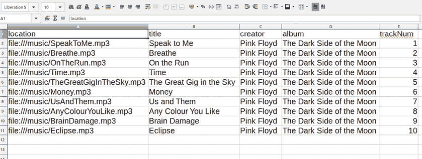

## 第七章：操作列表和读取数据


当你需要处理多个值时，可以通过使用 Python 列表将它们分组到一个变量中。*列表*数据类型可以存储任意数量的项，并能高效、动态地管理和操作这些项。例如，你可以创建一个列表来存储你最喜欢的电影标题，并使用内建的方法插入新电影、重新排序排名或仅显示排名在 30 到 40 之间的标题。

在本章中，你将学习如何创建和操作列表，然后将其与循环结合，访问并对每个项执行操作。为了配合本书的视觉主题，你将生成列表数据的图形表示，包括显示亮度和 RGB 混合的颜色列表图表，以及展示史上畅销视频游戏的图表。你将看到如何调整列表值以影响视觉输出，并观察图表如何根据数据变化进行调整。

你还将学习如何从文本文件中读取数据，以及文本格式与其他文件格式的区别。你将把 Python 列表数据转储到 CSV 格式的文本文件中，并在草图运行时加载它，这样你就可以使用其他工具（如电子表格）准备数据。

## 引入列表

列表包含多个相关或属于同一组的值。例如，考虑编写一个视频游戏，在游戏中玩家四处游走，收集各种物品——钥匙、武器、盔甲升级等等——以便晋级到新的一关。你的游戏需要跟踪这些物品，这些物品可以存储在一个库存列表中。

要表示一个列表，可以使用方括号并用逗号分隔每个元素。例如，以下是一些游戏物品的简单列表：

```py
inventory = ['key', 'gem', 'sword', 'apple', 'book']
```

这个列表包含五个字符串，并被分配给一个名为`inventory`的变量。

对物品集合执行重复操作是常见的编程挑战。假设你想显示一个包含玩家已收集物品的网格（图 7-1）。你可以编写一个`loop`语句来访问库存中的每个物品，并将其绘制在一个单元格中。如果列表的大小发生变化——因为玩家添加或丢弃了物品——循环会自动适应，因此你只需编写一次代码，程序就会填充适当数量的单元格来表示库存物品。


图 7-1：来自游戏*Minetest*的玩家库存

在 Python 中，单个列表可以包含任何混合的数据类型和重复值。例如，这个最高分条目存储了多种数据类型：

```py
topscore = ['LEO', 54120] 
```

玩家名称`LEO`是一个字符串，而高分是一个整数。

列表可以包含任意数量的元素，甚至可以通过使用一对空方括号（中间没有任何内容）来定义一个空列表，这在你打算在程序运行时添加物品时非常有用。

列表是有序的，在许多情况下，顺序很重要——例如，在这个彩虹颜色的顺序中：

```py
rainbow = [ 'red', 'orange', 'yellow', 'green', 'blue', 'indigo', 'violet',
]
```

在定义列表时，你可以将它跨越多行书写，如下所示，这样可以让代码更容易阅读和编辑。Python 还允许在最后一个元素后添加一个可选的尾随逗号。这个额外的逗号有助于你在需要添加或调整列表值时，不小心忘记加逗号的情况。

### 创建和访问列表

为了熟悉如何定义、访问和修改列表，创建一个新的草图。将其保存为 *rainbow_list* 并添加以下代码：

```py
rainbow = ['blue', 'orange', 'yellow']print(rainbow)
```

现在，这个彩虹缺少了一些颜色，且顺序不正确，因此在你继续进行本节时，将使用各种列表操作来添加和调整颜色。首先，运行代码以验证以下控制台输出：

```py
['blue', 'orange', 'yellow']
```

打印 `rainbow` 变量会显示所有三个值，并且带有方括号和逗号。

在许多情况下，你可能希望检索单个元素，而不是整个列表。要显示指定颜色，请在方括号中指定它的位置或 *索引*。请注意，Python 列表的索引从 0 开始，因此要打印第一个元素，输入以下内容：

```py
. . .print(rainbow[0])
```

运行草图以确认控制台显示 `blue`。

第二个元素 `orange` 的索引是 `1`，这个列表中的最后一个元素 `yellow` 的索引是 `2`。要打印项目 1 和 2，请输入以下内容（请注意，在本章中，`print` 语句旁边的注释会指出在控制台中应该出现的内容）：

```py
. . .print(rainbow[1]) # displays: orangeprint(rainbow[2]) # displays: yellow
```

这种语法可能让你想起第三章处理字符串时使用的切片符号，应该会因为它的工作方式相同而产生这种联想。就像使用切片符号一样，使用`-1`可以访问列表的最后一个元素，并通过使用冒号定义的范围来提取子集元素。试试以下代码：

```py
. . .print(rainbow[-1]) # displays: yellowprint(rainbow[-2]) # displays: orangeprint(rainbow[0:2]) # displays: ['blue', 'orange']
```

如果你指定了超出列表范围的任何索引，比如 `rainbow[3]` 或更高，Processing 会显示 `IndexError` 错误信息。

### 修改列表

列表在行为上是动态的，可以在程序运行时发生变化。你可以用新值覆盖任何元素，并使用不同的列表方法插入新元素或删除现有元素。例如，在游戏物品栏中，如果玩家找到了更强大的武器，可以替换掉原有的武器，并随着玩家交易物品来添加或移除元素。

回到彩虹示例，你需要将蓝色替换为红色，使其成为 `rainbow` 列表中的第一个颜色。要修改现有的列表元素，可以像操作其他变量一样重新赋值，但在列表中，你需要使用方括号指定元素的索引。将以下行添加到 *rainbow_list* 草图的末尾：

```py
. . .
rainbow[0] = 'red'
```

`red` 字符串现在替换了 `blue`，覆盖了它，成为列表中的第一个项目。打印 `rainbow` 列表应确认这一点：

```py
print(rainbow) # ['red', 'orange', 'yellow']
```

蓝色不再出现在 `rainbow` 列表中。

让我们看一下几个最有用的列表方法，并附上可以添加到工作草图中的代码。每个示例都建立在之前的代码之上，因此按顺序逐一完成它们，在前进的过程中输入这些行。

#### `append()`方法

`append()`方法将一个元素添加到列表的末尾，无论列表的长度是多少。将蓝色添加到`rainbow`列表的末尾：

```py
rainbow.append('blue')print(rainbow) # red, orange, yellow, blue
```

注意，在这些示例中，`print()`函数后的注释仅包含颜色的顺序；当你实际打印列表时，控制台将显示`['red', ...,'blue']`，包括所有的方括号和引号。

#### `extend()`方法

要将一个列表中的所有元素添加到另一个列表的末尾，可以使用`extend()`方法：

```py
colors = ['indigo', 'violet']
rainbow.extend(colors)print(rainbow) # red, orange, yellow, blue, indigo, violet
```

包含靛蓝和紫罗兰色的`colors`列表现在被添加到原始的`rainbow`列表中。

#### `index()`方法

`index()`方法返回与提供的参数匹配的元素的索引（该元素在列表中的位置，作为整数）。如果有多个匹配项，该方法会返回第一个实例。使用`'yellow'`作为参数来测试这一点：

```py
yellowindex = rainbow.index('yellow')print(yellowindex) # 2
```

尝试不同的颜色参数。如果没有匹配的值，Processing 会显示一个`ValueError`错误消息。

#### `insert()`方法

`insert()`方法接受两个参数：第一个是插入元素的索引；第二个是要插入的值。将`green`插入到列表的中间，索引参数为`3`：

```py
rainbow.insert(3, 'green')print(rainbow) # red, orange, yellow, green, blue, . . .
```

现在绿色位于原本蓝色的位置，将蓝色和它右边的所有颜色都向后移动了一个索引。

#### `pop()`方法

`pop()`方法接受一个参数：要移除的元素的索引。如果需要，可以使用被“弹出”的值进行其他操作。将靛蓝从列表中弹出并赋值给名为`i`的变量；然后打印`i`和`rainbow`，以确认控制台输出与这里的注释一致：

```py
i = rainbow.pop(5)print(i) # indigoprint(rainbow) # red, orange, yellow, green, blue, violet
```

如果你不关心使用被弹出的值，可以去掉`i =`部分。

现在，使用没有参数的`pop()`方法移除列表中的最后一个元素：

```py
i = rainbow.pop()print(rainbow) # red, orange, yellow, green, blue
```

控制台输出应该确认紫罗兰色已从列表中移除。

#### `remove()`方法

`remove()`方法移除第一个值与提供的参数匹配的元素。通过使用`extend()`方法重新添加靛蓝和紫罗兰色，然后使用`remove()`方法移除靛蓝：

```py
rainbow.extend(colors)print(rainbow) # red, orange, yellow, green, blue, indigo, violet
rainbow.remove('indigo')print(rainbow) # red, orange, yellow, green, blue, violet
```

在扩展列表后，`rainbow`恢复为七色列表。在执行`remove`行后，列表又变成了六个颜色，没有靛蓝色。

Python 提供了其他列表方法，但这些方法足够让你开始操作列表。任何合适的 Python 参考资料或网络搜索应该能覆盖其余的内容。例如，如果你想重新排序列表元素，可以查找`reverse()`和按字母数字顺序的`sort()`方法。Processing 参考资料还包括几个列表方法，它们是标准的 Python（而非 Processing）特性，并且在任何 Python 环境中都可以使用。

## 结合循环和列表

你可以编程使用循环处理列表，这样可以节省无数的手动指令行。例如，假设你想创建一个*Breakout*风格的游戏（图 7-2）。在这种类型的游戏中，玩家控制屏幕底部的挡板，目标是将球弹向上方摧毁所有砖块。你可以创建一个列表来存储砖块，当玩家用球击中砖块时，该砖块将从列表中移除。在某些关卡中，你可能希望在游戏过程中出现额外的砖块，这意味着你需要插入新的列表元素。


图 7-2：*LBreakout2*，一个开源的*Breakout*克隆游戏

你可能已经玩过这种游戏的变种，并且可能知道，在砖块被摧毁时，某些砖块会掉落能量道具。你还知道砖块有不同的颜色，有些可能是不可见但坚固的，而有些可能需要多次击打才能摧毁。你可以通过使用列表的列表来编程这些附加属性。列表可以包含其他列表，而这些列表又可以包含进一步嵌套的列表（请参见第 144 页的“创建列表的列表”）。

如果你的列表名为`bricks`，并包含 60 个砖块的填充色，那么渲染每个砖块至少需要和元素个数一样多的代码行。例如，你可以使用以下代码使用`rect()`函数绘制每个砖块：

```py
bricks = [ '#FF0000',  '#FF0000'`,` . . .# brick A1fill(bricks[0])rect(0, 0, 30, 10)# brick A2fill(bricks[1])rect(30, 0, 30, 10). . .# brick F10fill(bricks[59])rect(270, 50, 30, 10)
```

请注意，每个渲染的砖块都需要`fill()`和`rect()`函数。即使你删除了注释，这也意味着要绘制完整的列表，你需要 120 行（60 × 2）的代码。这并不高效，也无法处理可能长度变化的列表。

### 使用颜色值列表绘制图形

对于这个练习，你将从一个十六进制值的列表中绘制一条彩虹色带，首先使用`fill()`和`rect()`函数绘制一条单一的色带。然后，你将调整代码，使用循环绘制整个列表。首先，将以下代码添加到你的*rainbow_list*草图中：

```py
. . .size(500, 500)noStroke()background('#004477')
bands = [ '#FF0000', # red '#FF9900', # orange '#FFFF00', # yellow '#00FF00', # green '#0099FF', # blue '#6633FF' # violet
]# red bandtranslate(0, 100)fill(bands[0])rect(0, 0, width, 50)
```

到目前为止，草图完全依赖于控制台输出。此代码首先定义了显示窗口的大小，关闭了描边，并设置了背景颜色。`bands`列表包含六种颜色的十六进制值，并附有注释以标识每种颜色值。第一条（红色）色带使用`translate()`、`fill()`和`rect()`函数绘制。运行草图，结果应该是在蓝色背景上绘制一条单一的横向红色色带（图 7-3）。


图 7-3：运行草图的结果是一条单一的红色色带。

你已经绘制了列表中的第一条色带，下一步是调整代码，使用`for`循环来绘制所有六条色带。

当你将 `for` 循环与列表结合时，Python 会将每个连续的列表值赋给循环变量，并使用列表的长度来决定所需的迭代次数。为了让你的程序绘制 `bands` 列表中的每个彩带，注释掉现有的 `fill()` 和 `rect()` 函数，然后添加一个循环来为你绘制完整的彩虹：

```py
. . .**#**fill(bands[0])**#**rect(0, 0, width, 50)for band1 in bands: fill(band) rect(0, 0, width, 50) translate(0, 502)
```

在这种情况下，如果你将循环变量命名为 `band` 而不是像 `i` 这样的名称，代码会更易于理解。第一次迭代时，`band` 变量等于 `'#FF0000'`，第二次是 `'#FF9900'`，依此类推。`translate()` 函数将坐标系沿带的高度移动。每次迭代时，Processing 会应用列表中的下一个填充色，并在上一个矩形下方绘制一个新矩形。结果是在显示窗口的宽度上堆叠六个彩虹色的带子（见图 7-4）。请注意，绿色带子在电脑屏幕上会比在印刷书籍中的显示更亮。标准印刷墨水（青色、品红、黄色和黑色—CMYK）无法复制数字显示器上绿色的色调强度。


图 7-4：六种彩带的彩虹序列

在这个例子中，Python 会检索列表中的每个元素，因此你无需指定任何索引值。在下一节中，你将使用 `enumerate()` 函数来获取每个元素的索引和值。

### 使用 enumerate() 进行循环

对于某些循环任务，你需要每个元素的索引和值。例如，假设你有一个你最喜欢的电影的有序列表，并且想要打印每个电影标题及其排名（索引）。你可以使用 `enumerate()` 函数来实现。

要使用 `enumerate()` 函数获取彩虹中每个彩带的索引，在 `for` 和 `in` 之间提供两个变量名。这两个变量将分别存储索引和值，供每次迭代使用。修改你在 *rainbow_list* 示例中的代码：

```py
. . .**#**for band in bands:1 **for i, band in enumerate(bands):** fill(band) rect(0, 0, width, 50) 2 **fill('#FFFFFF')** **textSize(25)** **text(i, 20, 35)** translate(0, 50)
```

`i` 和 `band` 变量分别表示索引和值。额外的 `fill` 和下面的两行 `text` 会在每个矩形上绘制索引数字。

运行示例代码。现在你应该能在每个彩带中看到一个白色数字（见图 7-5），尽管 2 在黄色上不是特别明显。


图 7-5：带编号的彩虹带序列

在需要操作列表索引或跟踪循环迭代次数时，使用 `enumerate()` 函数。如果是其他对列表的循环操作，普通的 `for` 循环就足够了。

## 创建列表的列表

尽管列表内嵌列表的概念看起来可能很复杂，但适当嵌套的列表使复杂的数据集更容易管理。在这个实际的数据可视化任务中，你将创建一个条形图的变体。这个图表将测量六种颜色的相对亮度。图 7-6 显示了你正在努力达到的简化表示。注意，黄色是最亮的颜色，因此它的条形最长。


图 7-6：条形图的简化轮廓表示

最终的图表将包括颜色，条形会进一步分为红色、绿色和蓝色的几个部分，以表示每种颜色的 RGB 混合（稍后会详细介绍）。

创建条形图的第一步是启动一个新的草图并将其保存为 *lists_of_lists*。添加以下设置代码：

```py
size(500, 380)background('#004477')noFill()stroke('#FFFFFF')strokeWeight(3)
h = 50translate(100, 40)
bands = 6rect(0, 0, 40, h*bands)
```

`h` 变量定义了条形的高度，`translate()` 函数定义了左上角的位置。视觉效果应显示为垂直条形；这表示六个带状图（图 7-7）。条形的高度表示一个整数值：6。如果 `bands` 等于 7，则定义条形的矩形将延伸超出显示窗口的底部。


图 7-7：一个 6 × 50 像素高的条形

下一步是将现有的条形分成六个部分，这些部分稍后将形成水平条形。在草图的末尾添加一个新的 `bands1` 彩虹颜色列表，并加入一个循环，使用每种颜色绘制一个矩形：

```py
. . .
bands1 = [ '#FF0000', '#FF9900', '#FFFF00', '#00FF00', '#0099FF', '#6633FF'
]for band in bands1: fill(band) rect(0, 0, 40, h) translate(0, h)
```

这个 `bands1` 列表包含六个十六进制颜色值。这些值定义了每个部分的填充颜色。`for` 循环以列的方式绘制彩虹色的部分，覆盖了第一个条形（图 7-8）。


图 7-8：彩虹色矩形覆盖在原始条形上

下一步是将每个颜色块向右延伸，形成水平条形。每个条形的宽度将由其各自颜色的亮度决定。计算亮度的方法是将构成任何颜色的红色、绿色和蓝色值相加。例如，考虑白色。它是屏幕上最亮的“颜色”；在十六进制中表示为`#FFFFFF`，如果转换为百分比表示，则为 100%红色、100%绿色和 100%蓝色。总体亮度为 300%，或者如果你想取平均值，则为 300 ÷ 3 = 100%的亮度。

为了按 RGB 百分比管理颜色，你需要为每个 R/G/B 主色提供一个整数值，而不是一个十六进制字符串值。将一个新的 `bands2` 列表添加到代码的末尾，每个元素包含一个包含三整数的列表，表示每种颜色的红色/绿色/蓝色混合：

```py
. . .
bands2 = [ [100, 0, 0], [100, 60, 0], [100, 100, 0], [0, 100, 0], [0, 60, 100], [40, 20, 100]
]
```

要直接访问另一个列表元素中的列表元素，请包含第二对方括号。例如，要检索第二个（橙色）条带中的绿色百分比，请输入以下内容：

```py
print(bands2[1][1]) # 60
```

在这种情况下，绿色值为 60，你可以在控制台中确认这一点。

为了处理`bands2`列表中的百分比，请将`colorMode()`设置为使用 0 到 100 之间的 RGB 值。为了绘制条形图，重置并转换坐标系统，然后添加一个循环来绘制填充不同灰度的矩形：

```py
. . .colorMode(RGB, 100)resetMatrix()translate(100, 40)for band1 in bands2: r = band[0] g = band[1] b = band[2] 2 sum = r + g + b 3 avg = sum / 3 4 fill(avg, avg, avg) rect(0, 0, sum5, h) translate(0, h)
```

每次迭代时，`band`被赋予 RGB 百分比值列表。然后，这些值被相加、计算平均值以得到亮度值，条形图的填充色被设置为基于该平均值的红、绿、蓝等量的灰度色。亮度值还决定了条形图的宽度。运行草图查看结果（图 7-9）。

奇怪的是，绿色条形图（从上数第四个）被指示为与红色（顶部）条形图亮度相当。还记得绿色在你的屏幕上比在打印上更亮。数学计算是正确的，但人眼对绿色光的敏感度更高，因为我们拥有更多的绿色光感受器，因此绿色条形图看起来更亮。可以通过数学方式来补偿这一点。如果你想测试，可以使用以下值乘以`r`、`g`、`b`变量：

```py
 . . . r = band[0] *** 0.64** g = band[1] *** 2.15** b = band[2] *** 0.22** . . .
```


图 7-9：每个条形图的宽度代表每种颜色的相对亮度。

现在，黄色条（从上数第三个）是唯一一个比绿色条更宽/更亮的条形图。然而，对于这个任务，我想使用平均公式，因此请移除任何乘数，恢复为平均值。

接下来，调整现有的循环，使得每个条形图显示构成其填充的主要颜色的不同数量：

```py
 . . . r = band[0] g = band[1] b = band[2] **#**sum = r + g + b **#**avg = sum / 3 **#**fill(avg, avg, avg) **#**rect(0, 0, sum, h) 1 fill('#FF0000') rect(0, 0, r, h) 2 fill('#00FF00') rect(r, 0, g, h) 3 fill('#0099FF') rect(r+g, 0, b, h) translate(0, h)
```

`rect()`函数形成包含最多三个段的水平条形图。每个段的大小和填充由颜色条带包含的红色、绿色和蓝色量决定。即使`colorMode()`设置为`RGB`，Processing 仍然可以将带引号的填充参数解释为十六进制值。

运行草图查看结果（图 7-10）。红色条形图位于顶部，完全由红色混合而成。紫色条形图位于底部，主要是蓝色，但也包含一些红色和一点绿色。


图 7-10：每个条形图显示其 RGB 主色的比例。

如果你向别人展示图表，他们可能完全不知道每个条形图代表什么颜色，因此添加标签将有助于阐明问题。为每个条带添加一个标签元素：

```py
. . .bands2 = [ [100, 0, 0, **'red'**], [100, 60, 0, **'orange'**], [100, 100, 0, **'yellow'**], [0, 100, 0, **'green'**], [0, 60, 100, **'blue'**], [40, 20, 100, **'violet'**]]. . .
```

然后，在循环中添加一些行来绘制每个标签：

```py
. . .for band in bands2: . . . fill('#FFFFFF') textAlign(RIGHT) text(band[3], -20, 30) translate(0, h)
```

这将文本填充设置为白色，右对齐，并在条形图旁边写下颜色标签。运行代码查看结果（图 7-11）。


图 7-11：带标签的完整图表

许多列表只需一维即可正常工作，例如购物清单。你可以将二维列表看作是网格或表格，这使得它们对于绘制二维图形非常有用。三维及其他高维列表也有其用途，但在使用这种结构之前，请考虑是否将二维列表添加另一个位置会更加合理。

#### 挑战 #7：Breakout 关卡

在这个挑战中，你将重新创建一个*Breakout*关卡。设置代码将包括一个三维列表。处理这样的列表需要使用嵌套循环——也就是一个循环嵌套在另一个循环内。

结果应该类似于图 7-12。请注意，你并没有创建一个可以玩耍的游戏，带有有效的输入；它更像是在游戏进行中抓取的一张截图。

创建一个新草图，并将其保存为*breakout_level*。添加以下代码来绘制球和挡板：

```py
size(600, 600)noStroke()background('#000000')# ball and paddlefill('#FFFFFF')circle(350, 440, 18)rect(300, 520, 190, 40)
```


图 7-12：完成的*Breakout*任务

这段代码应该会渲染出一个空的黑色舞台，白色的球和挡板，但还没有砖块。

现在，添加砖块的数据。为了节省时间，复制并粘贴我在 GitHub 仓库中的代码：

1.  打开浏览器，访问[`github.com/tabreturn/processing.py-book/.`](https://github.com/tabreturn/processing.py-book/.)

1.  导航到*chapter-07-working_with_lists_and_reading_data*。

1.  定位并打开*bricks.txt*文件。

1.  将*bricks.txt*的内容复制并粘贴到你的草图中。

如果你更愿意手动输入，以下是代码：

```py
r = '#FF0000' # red
o = '#FF9900' # orange
y = '#FFFF00' # yellow
g = '#00FF00' # green
b = '#0099FF' # blue
p = '#6633FF' # violet
bricks = [ # col 0  col 1  col 2  col 3 [ [r,1], [o,1], [y,1], [g,1] ], # row 0 [ [o,1], [y,1], [g,1], [b,1] ], # row 1 [ [y,1], [g,1], [b,1], [p,1] ], # row 2 [ [g,1], [b,2], [p,2], [b,1] ], # row 3 [ [b,1], [p,2], [   ], [g,1] ], # row 4 [ [p,1], [   ], [   ], [y,1] ], # row 5 [ [   ], [   ], [   ], [o,1] ], # row 6 [ [g,1], [   ], [   ], [   ] ] # row 7
]
```

为了让这更易读，我以一种反映每个砖块视觉位置的方式输入了`bricks`列表。按照以下顺序，每个砖块都有一个填充颜色和击中计数（表示摧毁它所需的击中次数）。我用空列表表示每个缺失的砖块。

以第一个砖块为例：[r,1]。这个砖块的填充颜色是红色，需要一次（剩余的）击中才能摧毁。你可以从包含该砖块的列表中推断出列和行的位置；在这种情况下，它位于第 0 行，第 0 列。添加两个`print()`语句来确认这些信息：

```py
. . .1 print(bricks[0]) # displays row 0 items2 print(bricks[0][0]) # displays the very first brick
```

这些`print`语句显示了`bricks`中的第一个元素，它是构成第 0 行第 1 列的四个砖块中的第一个，以及第 0 行第 2 列的第一个砖块。如果你想检索第一个砖块的颜色，可以输入以下内容：

```py
print(bricks[0][0][0]) # displays #FF0000
```

请注意，颜色变量`r`包含一个十六进制值，因此在控制台中显示的是红色的十六进制值。

如我之前所提到的，你需要为此任务使用嵌套循环。以下几行代码将帮助你开始：

```py
. . .
bw = width / 4
bh = height / 15translate(0, bh)for row in bricks: for col, brick in enumerate(row): if len(brick): # code to draw a brick x = col * bw
```

`bw` 变量定义了基于将四列排列到显示窗口中的砖块宽度；`bh` 计算砖块高度。外部的 `for` 循环遍历行，内部的 `for` 循环遍历每一行中的砖块。`col` 和 `brick` 变量分别表示列号和砖块。你可以使用 `len()` 函数来判断这个砖块是否是占位符（即一个空列表）。长度为 0 的 `brick` 相当于 `False`，此时 Python 会跳过 `x = col * bw` 这一行。`x` 变量将保存绘制每个砖块的 x 坐标。完成任务，以匹配 图 7-12 中显示的结果。请注意，大致位于中心的砖块的命中次数为 `2`，并且必须包括光泽效果。如果需要帮助，可以访问 [`github.com/tabreturn/processing.py-book/tree/master/chapter-07-working_with_lists_and_reading_data/breakout_level/`](https://github.com/tabreturn/processing.py-book/tree/master/chapter-07-working_with_lists_and_reading_data/breakout_level/) 获取代码。

在接下来的部分，你将学习如何处理来自外部文件的数据，并且你将使用列表技巧结合 Processing 函数来读取文本文件的内容。

## 读取数据

Python——以及 Processing——能够处理多种类型的文件数据。例如，你可以使用 Processing 创建一个包含各种音频和视频文件的游戏，并将这些多媒体资源存储在 *data* 子文件夹中。你之前在章节中已经从 PNG 文件加载了图像数据到 Processing 草图中；这一部分将重点讲解如何加载存储在基于文本文件中的数据。

你也曾处理过存储在列表中的值，但使用 Python 的列表语法将来自其他源的数据重新输入可能会很繁琐，尤其是对于大规模和可交换的数据集。一个替代方案是通过使用像电子表格这样的工具，在 Processing 之外管理和准备数据，将其保存为基于文本的格式，然后在运行草图时读取文件内容。为了理解什么是基于文本的文件与其他文件的区别，以及如何使用它们来存储数据，我们先简要介绍一下文件格式。

### 文件格式

*文件格式* 是一种标准化的编码信息的方式，用于在数字介质上存储数据。有许多不同的格式，每种格式的解读方式都不同。例如，应用程序以 *可执行格式* 编码，比如 Android 的 APK 文件或 Windows 的 EXE 文件。一些 *多媒体格式* 包括用于音乐的 MPEG-1/2 音频层 III（MP3）或用于图像的 JPG。

你可以通过*文件扩展名*来识别文件的格式。文件扩展名通常由三个字母组成，前面总是有一个点，附加在文件名的末尾。为了简化用户操作，许多操作系统隐藏文件扩展名，但如果你在 Windows 文件资源管理器或 Mac Finder 设置中深入查找，你可以让文件管理器显示扩展名。你的系统依赖这些文件扩展名来用合适的应用程序打开文件，并显示图标或生成缩略图（见图 7-13）。


图 7-13：显示文件扩展名的图标视图中的文件管理器

当你删除或重命名文件扩展名时，这种关联会丢失。或许你曾尝试在文本编辑器中打开 MP3 文件，结果看到一堆乱码，像这样：

```py
. . .
���:����zc��E9���yoO��F�;#C��@##�&�#�##HV�D��#���X���#�&2XNf�##M�#�#���#J��,8,#`}##�#�4R�f�#E��V���d@��P������G��rjS#gbx�:P+�A��'��Q�IF��5�0�i.�A���sG�P"����oA~�#. . .
```

文本编辑器是为编辑文本编码文件而设计的；因此，它们会尝试将音频数据解释为字符。尽管你可能能在其中找到一些可理解的元数据，但 99%的内容是乱码。如果你使用 iTunes、Windows Media Player 或 VLC 打开这个文件，你会听到音乐。

有些文件格式是基于文本的，这意味着你可以在任何文本或代码编辑器中打开它们，并理解其内容。为了澄清，所谓的*基于文本*，是指*纯文本*，而不是包含不同颜色和大小字体的加粗或斜体的 Microsoft Word 文档。你可能会好奇为什么人们会使用纯文本，但它适用于简单的待办事项清单和编写几乎所有编程语言的代码，包括 Python。例如，Processing 文件是纯文本格式，尽管它有一个 *.pyde* 扩展名。

### CSV

*逗号分隔值（CSV）* 文件，具有 *.csv* 扩展名，提供了一种简单的纯文本数据格式化方式。你将下载一个 CSV 文件，包含 Pink Floyd 专辑 *The Dark Side of the Moon* 的曲目列表。

每一行 CSV 文件代表一个条目，每个条目由一个或多个以逗号分隔的字段组成。以下是 *The Dark Side of the Moon* 的简化曲目列表，采用 CSV 格式：

```py
location,title,creator,album,trackNum
file:///music/SpeakToMe.mp3,Speak to Me,Pink Floyd,The Dark Side of the Moon,1
file:///music/Breathe.mp3,Breathe,Pink Floyd,The Dark Side of the Moon,2. . .
```

该文件的第一行包含字段标题，接下来的行提供每个轨道的详细信息。你的电子表格软件（如 Microsoft Excel、LibreOffice Calc 或类似软件）会将 *.csv* 扩展名的文件与自己关联。打开任何 CSV 文件时，电子表格软件会以典型的行列方式显示信息（见图 7-14）。这种格式对于准备 CSV 数据很有用，但需要注意的是，一旦你保存为 CSV 格式，所有样式（如单元格大小、字体颜色等）都不会被保留。



图 7-14：在 LibreOffice Calc 中打开的完整 *playlist.csv* 文件

你现在将编写代码，从 CSV 文件加载曲目列表数据。创建一个名为 *csv* 的新草图，并创建一个 *data* 子文件夹，然后完成以下步骤：

1.  打开你的浏览器并访问 [`github.com/tabreturn/processing.py-book/`](https://github.com/tabreturn/processing.py-book/)。

1.  转到 *chapter-07-working_with_lists_and_reading_data*。

1.  下载 *data.zip* 文件。

1.  解压 ZIP 文件，并将 *playlist.csv* 移动到草图 *data* 子文件夹中。

Processing 提供了 `loadStrings()` 函数来读取基于文本的文件。它接受一个单一的参数（路径），指向你的文本文件，并将内容作为一个字符串列表返回，每个元素表示一行文本。添加以下代码来测试该函数：

```py
csv = loadStrings('playlist.csv')for entry in csv: print(entry)
```

*playlist.csv* 数据被赋值给一个名为 `csv` 的列表。每个 `csv` 元素包含一行文本，表示单个轨道。`for` 循环在控制台中打印每个条目，每个条目占一行：

```py
location,title,creator,album,trackNum
file:///music/SpeakToMe.mp3,Speak to Me,Pink Floyd,The Dark Side of the Moon,1
file:///music/Breathe.mp3,Breathe,Pink Floyd,The Dark Side of the Moon,2. . .
```

`loadStrings()` 函数无法区分不同的纯文本格式；这可以是一本畅销小说，也可以是最新的股市数据。

为了解释 CSV 数据，使用 `split()` 方法将每一行拆分成进一步的列表。在这种情况下，你将拆分每个条目，以便提取每个轨道的编号和标题；你不需要文件位置、创作者或专辑信息。`split()` 方法通过使用你选择的分隔符来工作。在这个例子中，你将使用逗号。修改你的 `for` 循环代码如下：

```py
. . .1 for entry in csv[1:]: 2 track = entry.split(',') print('{}. {}'.format(track[4], track[1]))
```

通过添加 `[1:]`，`for` 循环跳过 `csv` 列表中的第一个项目 1，以避免打印字段标题。每次迭代时，`split()` 方法将一个新的列表分配给 `track` 变量 2。元素 `tracks[4]` 和 `track[1]` 分别保存了轨道编号和标题。

运行草图以确认控制台显示一个包含 10 个编号轨道的列表：

```py
1\. Speak to Me
2\. Breathe. . .
```

如果你想向文件中写入文本，请查阅在线 Processing 文档中的 `saveStrings()` 函数；它实际上是 `loadStrings()` 的反向操作。

在 CSV 文件中格式化纯文本数据是避免在 Processing 编辑器中管理数据的好方法。CSV 的美在于其简单性，但它不适合处理层次结构化数据。在第八章中，你将学习其他基于文本的格式（如 XML 和 JSON）。

#### 挑战 #8：游戏销售图表

在这个最终挑战中，你将生成一个所有时代畅销视频游戏的条形图。图 7-15 展示了最终结果（左侧）以及放大版（右侧）以提供更多细节。


图 7-15：完成的图表（左侧）和图表细节（右侧）

数据来源于维基百科的一篇文章《最畅销视频游戏列表》([`en.wikipedia.org/wiki/List_of_best-selling_video_games`](https://en.wikipedia.org/wiki/List_of_best-selling_video_games))，并将其从 HTML 表格转换为制表符分隔文件。自本书出版以来，排名可能已经发生变化，但这对于本练习的目的并不重要。

你将通过使用`loadStrings()`函数读取销售数据，然后使用本章学到的技巧绘制图表。创建一个名为*game_sales_chart*的新草图，并添加一个*data*子文件夹。在前面的练习中，你下载了一个*data.zip*文件，其中也包含了一个*list_of_best-selling_video_games.tsv*文件；将其放入草图的*data*子文件夹中。

这个文件使用制表符分隔的值，因此文件扩展名为*.tsv*。我使用了制表符，因为游戏标题或工作室/发行商名称包含制表符的可能性非常小，但可能会有逗号，使用`split(',')`方法可能会受到干扰。你可能想在你喜欢的电子表格应用程序中打开 TSV 文件，查看其中的值。总共有 50 款游戏，按销量从高到低排序。如果你用文本编辑器打开文件，你应该会看到类似下面的内容：

```py
Rank	Title	Sales	Developer(s)	Publisher(s)
1	Minecraft	180000000	Mojang	Xbox Game Studios
2	Tetris	170000000	Elektronorgtechnica	Various. . .
```

一个单一的、不可见的制表符字符分隔每个字段。请注意，制表符的大小在不同编辑器之间可能有所不同，因此不一定会形成对齐的列，所以文件的显示可能会有所不同，具体取决于你使用的编辑器。

向你的草图中添加基本的设置代码，定义显示窗口的大小和背景颜色，并读取 TSV 数据：

```py
size(800, 800)background('#004477')
tsv = loadStrings('list_of_best-selling_video_games.tsv')noStroke()
```

一个名为`tsv`的列表保存了游戏销售数据。没有图形元素的轮廓，所以我加入了一行`noStroke()`。

你需要进行计算，将条形图的大小缩放到适合显示窗口。虽然销售数字看起来像是数字，但 Processing 将其视为文本。回想一下，字符串数据不能进行数学运算。幸运的是，有一个简单的解决方法。`int()`和`float()`函数可以分别将不同的数据类型转换为整数和浮点数值。以下是一个示例：

```py
entry1 = tsv[1].split('\t') # Minecraft entry
sales1 = entry1[2] # 180000000print(int(sales1) + 1) # 180000001
```

`split()`方法必须使用制表符字符作为分隔符，从第一个条目（Minecraft）创建一个列表；要指定制表符，使用`'\t'`作为参数。变量`sales1`等于索引 2 处的值，即销售列。尽管看起来像是数字，但这个值是一个字符串，因此`print`语句使用`int()`函数将`sales1`转换为整数，然后加 1。

现在，按照图 7-15 中的示意图完成图表。最好从一个打印每个条目的循环开始。接着，在创建条形图之前先显示标签。一旦有了标签，创建正确宽度的纯白色条形，然后用彩虹顺序效果来完成。如果需要帮助，可以访问[`github.com/tabreturn/processing.py-book/tree/master/chapter-07-working_with_lists_and_reading_data/game_sales_chart/`](https://github.com/tabreturn/processing.py-book/tree/master/chapter-07-working_with_lists_and_reading_data/game_sales_chart/)获取解决方案。

## 总结

在这一章中，你学习了 Python 提供的一系列用于执行各种列表操作的方法，如何使用列表管理项目集合，以及在与循环结合使用时，列表的强大功能。你还学会了如何利用嵌套列表来管理更复杂的数据，并练习了一些数据可视化技巧。

此外，你已经学习了如何处理存储在纯文本格式中的数据，如 CSV 和 TSV，这使得在运行草图时能够从外部文件读取数值。这意味着你不需要在 Processing 编辑器中管理数值，从而使得更换数据集变得更加容易。

下一章将介绍字典，它们与列表类似，都用于存储项目集合。不过，字典通过使用词语而非索引来访问数值。你将再次利用新技能创建独特的数据可视化。
