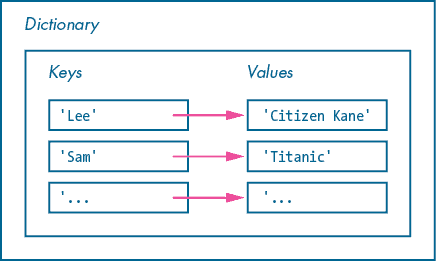
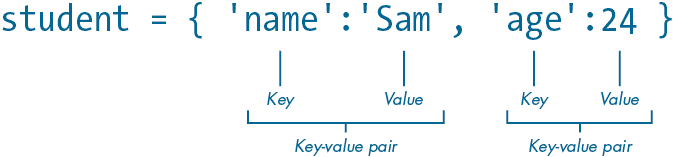
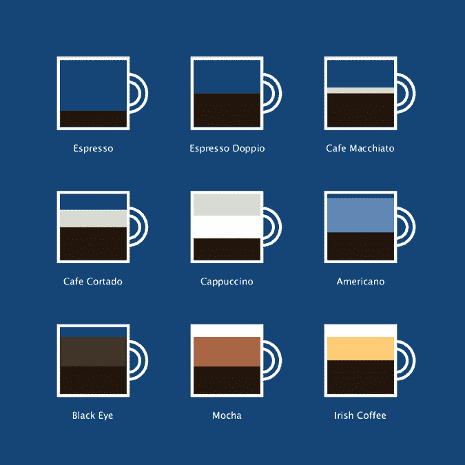

## 第八章：字典和 JSON


字典保存着一组项目，类似于你在第七章学习过的有序列表。不过，字典是无序的，你使用关联的值来访问每个项目，这使得你更容易记住字典中项目所代表的内容。在本章中，你将学习 Python 的字典语法和方法，如何结合循环和字典，以及如何嵌套字典和列表。

你还将学习如何使用另一种纯文本文件格式：*JavaScript 对象表示法（JSON）*。它的语法不像 CSV 那么简单，但更适合处理复杂的数据结构。你将使用 Python 内置的*json*模块来从 JSON 文件中读取字典数据，并且像第七章一样，你将创建一个数据可视化。

## 引入字典

在字典中，每个无序项目与一个称为*键*的值关联。键通常是一个短字符串，每个字典项目由一个键值对组成。这意味着字典是关联的，一些编程语言将字典类型的结构称为*关联数组*。字典与列表不同，后者是按数字索引的，因为列表中的每个元素对应一个数字（索引），表示它在项目序列中的位置。

作为键值对如何工作的一个示例，你可以使用字典记录每个朋友的最喜欢的电影。在这样的字典中，每个键将是朋友的名字，每个值将是对应的电影标题。要插入或检索你朋友 Lee 的最喜欢的电影，你需要使用键`'Lee'`。图 8-1 是这个字典的概念图。



图 8-1：一个字典的示意图，表示键和值之间的映射关系

在你进行 Python 字典练习的第一个任务中，你将编写代码来管理学生记录。创建一个名为*dictionaries*的新草图，并添加以下代码，展示列表和字典之间的区别：

```py
1 student = ['Sam', 24]2 student = {'name': 'Sam', 'age': 24}
```

首先，注意字典使用大括号（`{}`），而列表使用方括号（`[]`）。列表 1 和字典 2 的变体存储的是相同的值：`'Sam'`和`24`。然而，每个字典项目包含一个值*和*一个键。在这个例子中，字典的键是`'name'`和`'age'`。记住，合理命名的键有助于识别值所代表的含义。这个`student`字典包含两个键值对（图 8-2）。

你将使用有意义的键来从`student`字典中检索值。要使用`student`列表，你需要记住每个值似乎是随意的位置。列表更适合处理有序的项目序列，但如果你有一组唯一的键与值映射，最好使用字典。



图 8-2：一个包含两个键值对的字典

字典可以存储各种数据类型，包括字符串、数字、布尔值、列表，甚至其他字典。您可以在字典中存储任意数量的键值对。从技术上讲，字典是有上限的，但如果您管理如此大量的数据，可能应该考虑使用数据库解决方案。

### 访问字典

要访问任何字典的值，请使用字典名称和关联的键，键用方括号括起来。试试以下代码：

```py
. . .print(student['age']) # displays: 24print(student['name']) # displays: Sam
```

每个`print()`函数旁边的注释会确认控制台中应该显示的内容。

要打印整个字典，省略方括号和键，只保留字典名称：

```py
print(student) # {'name': 'Sam', 'age': 24}
```

控制台应显示每个键值对，连同花括号、冒号和逗号。

键值对的顺序不一定与您定义它们的顺序一致，这在不同的 Python 环境中可能有所不同。字典本质上是无序的；Python 关注的是键与值之间的关联。如果您需要按键或值对字典项进行排序，可以使用各种函数和方法。您将在第 163 页的“结合循环和字典”中看到一些排序技巧。

如果您尝试引用一个不存在的键——比如`student['grade']`——处理时会显示`KeyError`消息。如果您需要检查一个键是否存在，请使用`in`操作符：

```py
. . .if 'age' in student: print(student['age'])
```

`in`操作符检查`'age'`键是否存在于`student`字典中。如果找到，操作返回`True`，并且`if`语句执行`print`行，显示`age`值（在此例中为`24`）。

### 修改字典

字典是动态结构，因此您可以随意添加和修改键值对。要更改现有值，像处理列表元素一样重新赋值，但使用键而不是数字索引。举个例子，在您的*字典*示意图中，将学生的年龄改为`25`：

```py
. . .
student['age'] = 25print(student) # {'name': 'Sam', 'age': 25}
```

控制台输出应该确认年龄已从`24`更改为`25`。

要添加新的键值对，请按照相同的过程进行。向`student`字典中添加学生 ID 号码：

```py
. . .
student['id'] = 199505011print(student)# {'name': 'Sam', 'id': 19950501, 'age': 25}
```

这里的`id`值表示出生日期（1995-05-01）1。系统可以利用此信息计算学生的年龄，因此现在不再需要存储个人的`age`值。要删除它，请使用`del`语句：

```py
. . .del student['age']print(student) # {'name': 'Sam', 'id': 19950501}
```

`del`语句永久删除`age`键及其对应的值。

## 嵌套字典和列表

字典可以包含其他字典或列表，列表也可以包含字典。让我们来看两个例子：一个字典包含列表，另一个列表包含字典。两者都是有效的数据结构方式，但正如您所见，您将根据哪种方式在特定应用中效果最好来选择。

此时，你的程序只存储了一个学生的详细信息。一个只管理一个学生的系统并不太实用，因此为了处理多个学生，试试 *字典的列表*。将以下代码添加到你 *字典* 草图的底部：

```py
. . .
students = { 1 'names': ['Sam', 'Lee'], 2 'ids': [19950501, 19991114]
}print(students['names'][1]3) # Lee
```

`names` 列表项包含两个名字 1；`ids` 列表包含它们各自的 ID 号码 2。要直接访问字典项中的任何列表元素，使用关联的键后跟一对方括号，其中包含元素的索引 3。

另一种构建数据的方式是使用 *字典的列表*。与其将学生姓名分到一个列表，将 ID 分到另一个列表，不如为每个学生使用一个字典。将以下代码添加到草图的底部，实际上会完全覆盖原来的 `students` 字典：

```py
. . .
students = [ {'name': 'Sam', 'id': 19950501}, {'name': 'Lee', 'id': 19991114}
]print(students[1]['name']1) # Lee
```

通过使用元素索引，接着是另一对方括号，包含字典键 1，来检索名字 `Lee`。

在这两种方法中（字典列表）的后者可以说是更合理的结构。每个项就像是电子表格中的一行，包含单个学生的详细信息，而每个学生可能有不同数量的列。这意味着，你可以为 Sam 的字典添加一个额外的键值对，而无需为 Lee 做同样的事情。然而，使用第一种方法时，这将变得有些棘手。

你为键命名的方式以及如何选择嵌套列表和字典，应该有助于将数据与现实世界的模型关联，同时减少复杂性。保持键名简短且具有描述性，并记住，结构良好的数据将为你程序中后续的算法提供更直观的理解。换句话说，如果数据结构直观有序，编写代码时你将节省时间和精力。

## 循环和字典的结合

你经常需要遍历字典。例如，你可以通过使用单个循环填充预定义模板，动态生成系统中每个学生的报告。考虑到字典可以包含成千上万甚至百万个键值对，这是一种强大的技术。然而，由于键值系统的存在，迭代字典与迭代列表略有不同。

你可以使用 Python 的 `keys()`、`values()` 和 `items()` 方法迭代字典的键、值或键值对。请注意，许多列表方法——如 `append()`、`extend()`、`index()`、`insert()` 和 `remove()`——无法应用于字典数据类型。

首先，添加一个名为 `courses` 的新字典到你 *字典* 草图的末尾：

```py
. . .
courses = { 'game development': 'Prof. Smith', 'web design': 'Prof. Ncube', 'code art': 'Prof. Sato'
}
```

字典的键代表课程标题；关联的值是协调每门课程的教授。接下来，你将看到如何将这个字典与 `for` 循环结合起来。

### 键的迭代

你可以编写一个仅处理键的`for`循环，如果你不需要处理字典中的值，这会非常有用。在使用字典的`for...in`语句时，键的迭代是隐式发生的。可以在下面的示例中测试这一行为，它应该在控制台中显示所有课程标题：

```py
. . .for course in courses: print(course)
```

在每次迭代中，Python 会将`courses`中的下一个键分配给`course`。`print`语句将每个课程标题显示在控制台的独立一行中，循环在所有键都被迭代后结束：

```py
web design
game development
code art
```

请记住，你不能依赖字典项的顺序。如果你想确保按字母数字顺序获取键，可以将`sorted()`函数应用于`courses`：

```py
. . .for course in **sorted(**courses**)**: print(course)
```

修改后的`for`语句按以下顺序打印键：

```py
code art
game development
web design
```

如果你只需要键的列表，可以使用`keys()`方法，若要对其进行排序，加入`sorted()`函数：

```py
print(sorted(courses.keys()))# displays: ['code art', 'game development', 'web design']
```

这会在控制台打印一个包含键的列表，括号和逗号也会显示出来。

### 迭代值

`values()`方法返回字典的所有值，如果你不需要处理字典中的键，这非常有用。向示例中添加一个新循环，使用`values()`方法来获取每个教授的名字：

```py
. . .for prof in courses.values(): print(prof)
```

在每次迭代中，Python 会将`courses`中的下一个值分配给`prof`。我将这个变量命名为`prof`，是*教授*（表示它将包含的值）的缩写。`print`语句将每门课程的教授名称显示在控制台的独立一行中。

### 迭代项

通常你会希望在循环中同时获取字典的键和值。`items()`方法返回字典的所有键值对。在编写任何循环代码之前，可以使用`items()`方法打印`courses`字典中的项：

```py
print(courses.items())
```

这是控制台输出（由于输出过长，使用省略号表示不能放在一行上）：

```py
[('web design', 'Prof. Ncube'), ('game development', ...
```

你应该能够识别出每一对键值，它们被括在括号内。每对键值之间的括号表示一个*元组*。本书不会详细讨论元组，所以暂时可以将它们视为与列表等效。

添加这个循环，将每个键值元组打印在控制台的单独一行：

```py
. . .for kv in courses.items(): print(kv)
```

当你在`for`循环中使用`items()`方法时，Python 会将一个元组分配给你的循环变量。我将其命名为`kv`，是*键值*的缩写，但你可以根据自己的喜好命名。例如，在*代码艺术*迭代中，`kv`等于`('code art', 'Prof. Sato')`。运行示例以确认控制台显示每个键值对，并且括号和逗号都显示出来。

为了方便遍历字典项，Python 允许你在 `for` 和 `in` 之间包括两个变量，一个用于键，另一个用于相应的值。你可以根据自己的喜好命名这些变量，但赋值的顺序始终是 *key* 在前，*value* 在后；这与元组中的顺序一致。添加此示例以将课程名称和教授姓名分配给不同的变量。此外，此代码包括一个 `sorted()` 函数：

```py
. . .for course1, prof2 in sorted(courses.items()): print('{} coordinates the {} course.'.format(prof, course))
```

每次迭代时，Python 将键（课程名称）赋值给第一个变量 1，将值（教授姓名）赋值给第二个变量 2。控制台应显示以下内容：

```py
Prof. Sato coordinates the code art course.
Prof. Smith coordinates the game development course.
Prof. Ncube coordinates the web design course.
```

请注意，`sorted()` 函数始终对键进行操作，因此句子是按照课程名称的字母顺序排序的，而不是按照教授的名字。要反转顺序，可以添加 `reversed()` 函数：

```py
. . .**#**for course, prof in sorted(courses.items()):for course, prof in reversed(sorted(courses.items())): print('{} coordinates the {} course.'.format(prof, course))
```

现在，`code art` 课程将作为最后一行显示在你的控制台中。

## 使用 JSON

JavaScript 对象表示法（JSON）来源于 JavaScript，但它是一种独立于语言的数据格式。许多编程语言支持 JSON，包括 Python，它在 Web 开发中非常流行。你可以使用 JSON 将类似字典的数据存储在纯文本文件中，以键值对的形式，构建嵌套的字典和列表风格的结构。

对于这次练习，你将使用 JSON 来格式化纯文本文件中的数据，就像在第七章中使用 CSV 一样，只是语法不同，并且文件扩展名是 *.json*。Python 的内置 *json* 模块将处理你读取的数据。如前所述，JSON 语法并不像 CSV 那样简单，但它更具描述性和多功能性。

### 理解 JSON 语法

为了理解 JSON 语法的工作原理，我们可以将其与 CSV 进行对比。在第七章中，你将专辑曲目列表（*The Dark Side of the Moon*）以 CSV 格式进行了存储。以下是该文件的简化版本：

```py
location,title,creator,album,trackNum
file:///music/SpeakToMe.mp3,Speak to Me,Pink Floyd,The Dark Side of the Moon,1
file:///music/Breathe.mp3,Breathe,Pink Floyd,The Dark Side of the Moon,2. . .
```

第一行包含字段标题。第二行及以后的行提供每个曲目的详细信息。

以下是相同（简化版）曲目列表，格式化为 JSON：

```py
[  { "location": "file:///music/SpeakToMe.mp3", "title": "Speak to Me", "creator": "Pink Floyd", "album": "The Dark Side of the Moon", "trackNum": 1 }, { "location": "file:///music/Breathe.mp3", "title": "Breathe", "creator": "Pink Floyd", "album": "The Dark Side of the Moon", "trackNum": 2 }, . . .
```

每个值都有一个对应的键——就像 Python 字典一样！如果你研究代码，你会发现它看起来像是 Python 中的字典列表。然而，JSON 和 Python 数据结构语法之间存在一些微妙的差异。例如，在 JSON 中，字符串必须使用双引号；而在 Python 中，你可以选择使用单引号。术语上也略有不同。在 JSON 中，大括号表示对象（而不是字典），而方括号表示数组（而不是列表）。你如何命名键和如何嵌套元素是由你决定的。

由于这是一个单个专辑的曲目列表，每个曲目都具有相同的 `creator` 和 `album` 信息，这看起来有些冗余。为了避免重复，你可以按以下方式重新结构化你的 JSON：

```py
{  "creator": "Pink Floyd",   "album": "The Dark Side of the Moon", "tracklist": [ { "location": "file:///music/SpeakToMe.mp3", "title": "Speak to Me", "trackNum": 1 }, { "location": "file:///music/Breathe.mp3", "title": "Breathe", "trackNum": 2 }, . . .
```

新结构将曲目嵌套在 `tracklist` 内。`creator` 和 `album` 信息被放置在结构的顶部层级，因为它适用于每个曲目。

你可以编写自己的 JSON 数据、动态生成它，或者从网上获取它。

### 使用 Web APIs

大量的 JSON 数据库，包括音乐元数据到猫咪事实，都可以通过 Web APIs 获得。*Web 应用程序编程接口（API）* 是一种基于 Web 的服务，您可以用它来请求或发布数据。例如，你可以从 Twitter API 请求数据，生成一个衡量你推文频率的图表，或者编程一个自动发布代码艺术推文的 Twitter 机器人。

本书不涵盖如何使用 Web APIs。不过，如果你想探索 Web APIs，应该了解一些基本内容。每个 API 的工作方式略有不同，这意味着你需要查阅特定服务的开发文档。许多 APIs 可以通过 URL 直接访问，这允许你使用浏览器与它们进行交互。例如，*OpenAQ* 提供来自世界各地的空气质量数据。如果你在浏览器中输入以下 URL，你将得到挪威每个城市的空气质量数据的 JSON 摘要：[`api.openaq.org/v1/cities?country=NO`](https://api.openaq.org/v1/cities?country=NO)。

*api.openaq.org* 部分是 API 的域名。*/v1* 表示你正在使用第 1 版，即该 API 的第一次发布。*/cities* 部分请求 OpenAQ 数据库中每个城市的数据，但 *?country=NO* 限制了这些城市只包括挪威的城市。要获取数据的副本，请使用浏览器菜单中的 **保存页面为** 选项，或将内容复制并粘贴到任何文本编辑器中。

你还可能会遇到提供 CSV 和 XML 数据的 API。

CSV、JSON 和 XML 各有优缺点，因此在选择最适合你项目的格式时，要权衡每种格式的相对优点。CSV 的优点在于其简洁性，但它无法支持层次结构的数据。与 JSON 不同，JSON 允许你在对象内嵌套多个层级的对象，而 CSV 限制每个字段只有一个值。XML 是一种成熟、广泛支持且灵活的数据交换格式，但有时它会显得过于复杂和臃肿。JSON 提供了一种折衷方案，并且在 Web 上变得越来越流行，因为它的语法比 XML 更简洁。

### 读取 JSON 数据

当你的草图运行时，你可以读取 JSON 数据。在这个例子中，你将使用存储在 JSON 文件中的咖啡数据生成一个图表。创建一个名为 *coffee_chart* 的新草图，并创建一个 *data* 子文件夹，然后完成以下步骤：

1.  打开浏览器并访问 [`github.com/tabreturn/processing.py-book/`](https://github.com/tabreturn/processing.py-book/)。

1.  转到 *chapter-08-dictionaries_and_json*。

1.  下载 *data.zip* 文件。

1.  解压 ZIP 文件，并将 *coffees.json* 移动到草图的 *data* 子文件夹中。

下面是 *coffees.json* 文件内容的一个片段：

```py
[ {  "name": "Espresso",  "ingredients": [ {"ingredient":"espresso"1, "quantity":30 2, "color":"#221100"3} ] }, . . . {  "name": "Irish Coffee", "ingredients": [ {"ingredient":"espresso", "quantity":60, "color":"#221100"},  {"ingredient":"whiskey", "quantity":40, "color":"#FFCC77"},  {"ingredient":"whippedcream", "quantity":20, "color":"#FFFFFF"} ] },
]
```

每个顶层对象包含不同类型咖啡的详细信息。这段代码展示了两种咖啡：`Espresso`和`Irish Coffee`。这两种是第一种和最后一种配方；总共有九种咖啡。每个`ingredient`对象有三个键值对：配料名称 1、数量（以毫升为单位）2、填充颜色 3。请注意，这些数量不一定准确，因此最终的图表可能不会让咖啡师和咖啡爱好者印象深刻，但它会看起来相当酷。

下一步是从*coffees.json*文件加载数据。Python 的`open()`函数可以打开任何文件，无论是纯文本文件还是其他文件，并返回一个文件对象。对于 JSON 文件，可以使用内置的*json*模块将文件对象加载到 Python 数据结构中。将以下代码添加到你的草图中：

```py
import json
jsondata = open('coffees.json')
coffees = json.load(jsondata)
```

`import`行导入了*json*模块。`open()`函数打开 JSON 文件并将文件对象赋值给变量`jsondata`。`json.load()`函数将 JSON 转换为 Python 数据。为了确认它是否正常工作，可以打印出爱尔兰咖啡中的威士忌数量：

```py
print(coffees[8]['ingredients'][1]['quantity']) # 40
```

爱尔兰咖啡是九种咖啡列表中的最后一个元素，因此它的索引是`8`。威士忌内容是第二个配料（`['ingredients'][1]`）。最终的`['quantity']`表示配料的数量值，40 毫升。

当你通过使用`loadStrings()`获取 CSV 数据时，所有的数据类型都是字符串，包括数字。你必须使用`int()`函数将数值转换为整数，然后才能进行任何算术运算；要创建列表，你必须使用`split()`函数。然而，*json*模块会为你处理所有这些转换。像`40`这样的 JSON 值，没有小数点或引号，会被解释为整数；方括号中的逗号分隔值会自动转换为 Python 列表；等等。现在你可以在 Python 中访问数据，并使用它来渲染图表。

#### 挑战 #9：咖啡图表

你将通过使用九个杯子，按照 3 × 3 的网格方式来可视化所有九种咖啡的数据。图 8-3 显示了最终结果的截图。



图 8-3：完整的咖啡图表

添加以下代码来定义显示窗口的大小、背景颜色和一些变量，并布局九个空杯子：

```py
. . .size(800, 800)background('#004477')
mug = 120
spacing = 230
col = 1translate(100, 100)for coffee in coffees: 1 # ingredients code goes here # mug strokeWeight(5) stroke('#FFFFFF') noFill() square(0, 0, mug) arc(mug, mug/2, 40, 40, -HALF_PI, HALF_PI) arc(mug, mug/2, 65, 65, -HALF_PI, HALF_PI) # label fill('#FFFFFF') textSize(16) label = coffee['name'] text(label, mug/2-textWidth(label)/2, mug+40) 2 if col = 3: translate(spacing*-2, spacing) col = 1 3 else: translate(spacing, 0) col += 1
```

`for`语句之前的代码定义了草图的主要参数，如显示窗口大小和背景颜色。`mug`和`spacing`变量分别控制马克杯的大小和间距；`col`变量作为列计数器。在`for`循环中的注释指出了绘制马克杯和标签代码的开始位置。绘制每个马克杯 3 之后，Processing 会将绘图空间向右移动 230 像素，并将`col`加 1。当`col`达到 3 2（每第三个马克杯）时，绘图空间会被移回到显示窗口的左边缘，并下移一行，`col`重置为 1。配料的代码已经为你留好，注释指出了你应该编写代码的位置 1。

运行草图。你应该能看到九个空的带标签的马克杯。现在，完成图表，使其看起来像图 8-3。如果你需要帮助，可以通过[`github.com/tabreturn/processing.py-book/tree/master/chapter-08-dictionaries_and_json/coffee_chart/`](https://github.com/tabreturn/processing.py-book/tree/master/chapter-08-dictionaries_and_json/coffee_chart/)查看解决方案。

## 摘要

在本章中，你学会了如何将项目集合组织成字典，这样可以将值与有意义的键关联起来。此外，你还将字典和列表结合起来，创建了更直观的数据结构。你还学会了如何定义、访问、修改和嵌套字典，以及如何通过键和值来遍历字典。

本章还介绍了 JSON。你了解了它与 Python 字典和列表的相似之处，以及如何读取 JSON 数据。你可以将字典和列表数据存储在 JSON 文件中，从而将 Python 代码与数据分离。如果你正在寻找有趣的数据来进行处理，许多在线资源都提供了免费的 JSON 数据集供你访问。

在第九章，你将学习如何定义和使用函数，它们是命名的代码块。你决定为函数命名，每当你想运行一个函数时，通过其名称来调用它。这有助于减少代码中的重复，因为你可以多次调用一个单行函数，而无需重复编写多行代码。可以将函数看作是可重用的代码块，它们将使你的草图更加高效，易于维护。你将编写函数，包括一些生成椭圆和波浪运动的函数，然后使用这些函数来编程动画效果，运用三角函数进行计算。
