## 第九章：函数和周期性运动


随着你的程序变得越来越复杂，代码行数会增加，你也会开始重复相同或相似的代码。通过使用*函数*，你可以将程序分成具有名称的可重用代码块。这使得代码更加模块化，允许你在不需要重写代码的情况下重用某些代码行。

你已经使用过许多 Processing 函数，例如`size()`、`print()`和`rect()`，在本章中，你将学习如何定义自己的函数。作为一个例子，Processing 没有绘制菱形的函数，但你可以创建一个。你可以决定这个函数的名称以及它接受的参数。也许你的`diamond()`函数接受 x、y、宽度、高度和可选的旋转角度参数。

你还将创建生成椭圆形和波动类型运动的函数，这将涉及一些三角学内容。你将使用 Processing 的内置函数来执行这些数学计算，从而结合正弦和余弦函数。如果三角学的提法让你想起了数学课上那些让人不快的回忆，不妨深呼吸放松一下。这将是一个实用且可视化的重新介绍，Processing 将为你计算所有的数字。

## 定义函数

合理命名的函数使得代码更容易理解和使用。一个 1000 行的程序可能会让人难以理解，尤其是对于那些没有编写它的人来说。

想象一下编写一个音乐播放器。你可能会创建一个名为`play()`的函数，执行加载和播放 MP3 文件所需的 20 行左右的代码。当你需要播放一首歌曲时，只需使用文件参数调用`play()`函数，例如`play('track_1.mp3')`。在定义了`play()`函数之后，你无需关心它是如何操作的，其他与代码一起工作的人也不需要。除此之外，你还可以为`stop()`、`pause()`、`skipBack()`和`skipForward()`定义函数。

在本节中，你将学习如何使用`def`关键字定义函数，以及如何处理函数参数。你可以将这些称为*用户定义的函数*，以便将它们与 Python 和 Processing 中内置的函数区分开来。

### 创建一个简单的对话框函数

让我们从一个简单的函数开始，这个函数不接受任何参数，并在控制台中绘制像漫画条形图那样的对话框。你已经使用过不需要参数的函数，比如 Processing 中的`noFill()`，它仅依赖函数名和括号。相反，一个像`fill()`的函数则需要至少一个参数，比如十六进制的颜色值。

你的对话框函数将形成一个轮廓，使用纯文本字符，围绕一个标题。一旦这个功能实现，你就可以定义一个更动态的函数，接受一系列参数，在显示窗口中绘制对话框。

创建一个新的草图，并将其保存为*speech_bubbles*。添加以下代码，首先在控制台打印一个问题，然后在五秒钟后通过对话框显示答案：

```py
wait = 50001 print('1\. What do you get if you multiply six by seven?')2 delay(wait)print(' ------------------- ')print('| The answer is 42! |')print('| ------------------ ')print('|/')
```

当你运行草图时，你应该立即看到问题出现在控制台中。Processing 的`delay()`函数会暂停程序 5,000 毫秒（五秒），然后使用接下来的四行打印语句在对话框中揭示答案。运行草图以确认这一点：

```py
1\. What do you get if you multiply six by seven? ------------------- 
| The answer is 42! |
| ------------------ 
|/
```

这可能看起来不是最令人信服的对话框，但目前勉强可以使用。

对你的代码做以下更改，以定义一个打印答案的函数：

```py
wait = 5000def printAnswer(): print(' ------------------- ') print('| The answer is 42! |') print('| ------------------ ') print('|/')print('What do you get if you multiply six by seven?')delay(wait)
printAnswer()
```

`def`关键字定义了一个新函数。你可以给这个函数起任何名字，但要确保名字具有描述性。像变量名一样，函数名应只包含字母数字和下划线字符，并且必须以字母或下划线开头；在这种情况下，我选择了`printAnswer`。在`def`行末尾始终包括括号和冒号。四行`print()`语句位于函数定义的*主体*部分，这是`def`行下面的缩进代码。函数不会执行打印语句，直到你*调用*它。在最后一行，程序必须揭示答案时，调用了`printAnswer()`函数。

当你运行草图时，程序应该和以前一样工作，首先打印问题，然后在五秒钟后通过对话框显示答案。

PEP 8 风格指南建议“函数名应为小写，必要时使用下划线分隔单词以提高可读性。”换句话说，`printAnswer()`函数应该命名为`print_answer()`。然而，当已有的命名风格已经建立时，通常更倾向于保持内部一致性。

我选择了驼峰命名法的函数名，以符合 Processing 内置函数的命名惯例，如`noFill()`或`pushMatrix()`。正如第一章所提到的，驼峰命名法将多个单词合并成一个单词，并使用大写字母开始第二个及之后的单词。这种风格也称为*混合大小写*，有时也叫*小驼峰命名法*（与*大驼峰命名法*相对）。

在草图的末尾添加第二个问题：

```py
. . .delay(wait/2)print('2\. How many US gallons are there in a barrel of oil?')delay(wait)
printAnswer()
```

在显示问题 1 的答案之后，程序等待两秒半，然后打印问题 2。问题 2 的答案将在五秒后揭示。答案再次是 42，但不需要重新输入显示对话框的四行代码。相反，你可以第二次调用`printAnswer()`函数。

你可以添加任意数量的问题。如果每个问题的答案都是 42，你可以调用`printAnswer()`函数来显示答案。如果你想更改*所有*对话框的样式——例如，使用不同的字符来表示边框——编辑`printAnswer()`定义中的代码。你只需要在一个地方修改代码，就能影响每个对话框。

对于每个答案，您有一个整洁的单行函数调用，函数名称表明它的作用。其他程序员无需了解`printAnswer()`函数的内部工作原理即可使用它，但如果需要，他们可以通过查看定义代码了解它是如何工作的。

在继续进行下一部分之前，将代码顶部的`wait`值设置为`0`：

```py
wait = **0**. . .
```

这个更改取消了`delay()`函数的效果，因为零延迟时间意味着没有延迟。因此，草图不会暂停，您添加的下一部分代码可以立即运行。

`printAnswer()`函数仅限于在控制台中绘制气泡，并且它总是打印相同的答案 42，因此接下来，您将定义一个可以接受参数的函数。

### 使用函数绘制复合形状

要定义一个在显示窗口中绘制带有形状和文本的气泡函数，请继续在您的*speech_bubbles*草图中工作。首先，您需要一张图片来放置气泡。

我选择了扬·范·艾克的*阿尔诺芬尼肖像*作为本示例，因为这幅画有三个气泡候选人：一名男子、一名女子和一只狗。而且它是公有领域的。图 9-1 展示了左侧的原始画作，以及右侧您将要完成的效果。

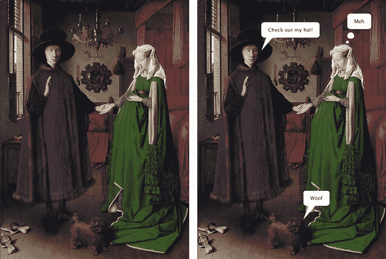

图 9-1：原始*阿尔诺芬尼肖像*，1434 年（左）；带有气泡的版本（右）

您可以从维基百科下载*阿尔诺芬尼肖像*图片（[`en.wikipedia.org/wiki/File:Van_Eyck_-_Arnolfini_Portrait.jpg`](https://en.wikipedia.org/wiki/File:Van_Eyck_-_Arnolfini_Portrait.jpg)）；561 × 768 像素的分辨率就足够了。如果您想使用不同的图片也可以；只需选择至少有三个人物的图片。

创建一个新的*data*子文件夹，并将您的图片添加到其中；然后添加以下代码以加载并显示它：

```py
. . .size(561, 768)
art = loadImage('561px-Van_Eyck_-_Arnolfini_Portrait.jpg')image(art, 0, 0, width, height)
```

如果您没有使用*阿尔诺芬尼肖像*，请相应调整`size()`和`loadImage()`的参数。

运行草图以确认图片跨越了您的显示窗口。

定义并调用一个新的气泡函数，将以下代码添加到草图的末尾：

```py
. . .def speechBubble(): x = 190 y = 150 txt = 'Check out my hat!' noStroke() pushMatrix() translate(x, y) # tail fill('#FFFFFF') beginShape() vertex(0, 0) # tip vertex(15, -40) vertex(35, -40) endShape(CLOSE) # bubble textSize(15) by = -85 bw = textWidth(txt) pad = 20 rect(0, by, bw+pad*2, 45, 10) fill('#000000') textAlign(LEFT, CENTER) text(txt, pad, by+pad) popMatrix() 
speechBubble()
```

如果您使用的是不同的图片，请调整`x`、`y`和`txt`变量。`x`和`y`变量控制气泡的位置——具体来说，是指附着在气泡上的“尾巴”尖端的 x-y 坐标。在绘制任何内容之前，`translate()`函数会重新定位绘图空间，使得这个尖端的顶点坐标为（0，0）；其他尾巴顶点和气泡则相对于这个点进行定位。

`txt`变量定义了气泡内显示的文本。您可以使用任何喜欢的`txt`字符串，但请保持简短。气泡不支持多行标题。

`bubble` 注释下方的代码绘制了一个位于尾部上方的圆角矩形气泡。`rect()` 函数包含第五个参数（`10`），该参数控制角的半径。这个值越大，角就会变得越圆。结果是一个带有左下角尾巴的圆角矩形语音气泡（图 9-2）。

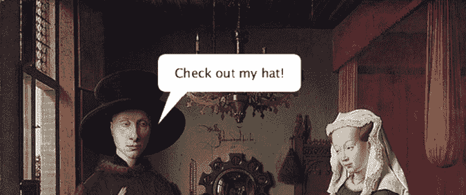

图 9-2：语音气泡尾部的尖端坐标为 (190, 150)。

你可以调用 `speechBubble()` 函数 100 次，但视觉效果始终相同，因为每个语音气泡都覆盖在前一个上，大小相同，文本相同，位置也相同。但是，如果你每次调用 `speechBubble()` 函数时都修改 `x`、`y` 和 `txt` 变量，你就可以自定义 x 坐标、y 坐标和标题。你可以通过向函数定义中添加参数来实现这一点，这样你就可以在函数调用中通过不同的参数传递值给函数。

### 添加参数和占位符

现在你将编辑 `speechBubble()` 的定义，使得函数可以接受三个参数，这样你就可以将坐标和标题值传递给函数，进而操作每个语音气泡的外观。参数被赋值给相应的*占位符*，但稍后会详细讲解这些内容。

当前，有三个变量控制语音气泡的外观：`x`、`y` 和 `txt`。要通过参数控制这些变量值，可以按如下方式调整你的函数定义：

```py
. . .1 def speechBubble(**x, y, txt**): **#**x = 190 **#**y = 150 **#**txt = 'Check out my hat!' . . .2 speechBubble(**190, 150, 'Check out my hat!'**)
```

定义括号现在包含三个参数：`x`、`y` 和 `txt` 1。参数是一个占位符，代表通过参数传入的值。这些参数在函数的局部作用域内可用；换句话说，Python 只能在 `speechBubble()` 函数块内访问 `x`、`y` 和 `txt`。你需要注释掉（或删除）旧的 `x`、`y` 和 `txt` 行，以避免覆盖你通过函数调用传递的值 2。

因为你有三个参数，所以在调用 `speechBubble()` 函数时必须提供三个参数。第一个参数 `190` 被赋值给参数 `x`，第二个参数 `150` 被赋值给参数 `y`，依此类推，按照参数在 `def` 行中出现的顺序。这些被称为*位置参数*，因为参数的顺序决定了每个参数所分配的值（图 9-3）。

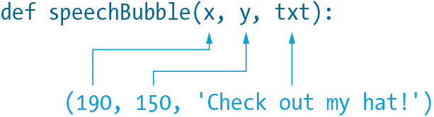

图 9-3：位置参数

运行草图以确认视觉效果没有变化。尝试测试不同的参数来改变语音气泡的外观。

调用第二个 `speechBubble()` 函数：

```py
. . .
speechBubble(315, 650, 'Woof')
```

第一个和第二个（x 和 y）参数将语音气泡定位在狗的上方。第三个参数指定标题必须为“汪汪”（图 9-4）。

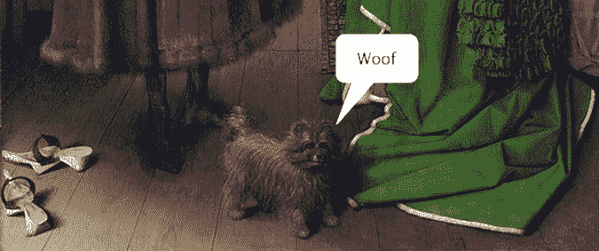

图 9-4：第二个语音气泡

现在你已经有了一个可以接受位置参数的 `speechBubble()` 函数。然而，如果你使用关键字参数，你也可以按任意顺序调用此函数。

### 使用关键字参数

当你调用一个函数时，可以通过使用*关键字参数*明确指定每个值对应的参数。这些参数包括一个关键字和一个值。每个关键字的名称来自函数定义中的参数。考虑以下示例，其中两行代码产生相同的结果：

```py
speechBubble(315, 650, 'Woof') # positional arguments
speechBubble(txt='Woof', x=315, y=650) # keyword arguments
```

第一个 `speechBubble()` 调用使用了位置参数方法。第二个调用使用了关键字参数；注意每个值前面都有一个关键字。Python 使用你在函数调用中的关键字来匹配值和参数（图 9-5）。

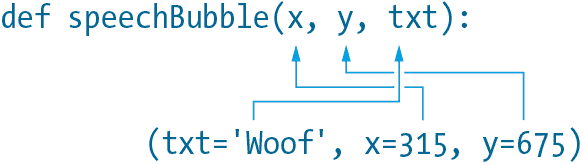

图 9-5：关键字参数

这意味着你可以随意排列函数调用中的参数顺序。只要确保你的关键字与函数定义中的参数名称完全一致。

### 设置默认值

当你定义一个函数时，可以为每个参数指定一个*默认值*，如果你在函数调用时省略了某个参数，Python 就会使用这个备份值。这种行为对于定义可选参数很有用。例如，`rect()` 函数可以接受一个可选的第五个参数，用于设置圆角半径。如果你调用 `rect()` 函数时只传入四个参数，默认会得到一个具有 90 度角的矩形，这是用户通常更常见的需求。但是，如果你提供第五个参数（值为非零的其他数值），你将得到一个带圆角的矩形。

使用等号为参数指定默认值。例如，下面的代码为 `txt` 参数添加了默认值 `'Hello'`：

```py
. . .def speechBubble(x, y, txt**='Hello'**): . . .
```

默认的 `txt` 参数是一个字符串，但你可以使用任何你喜欢的数据类型，包括数字和列表。

你现在可以使用两个位置参数来调用 `speechBubble()` 函数，让 `txt`（第三个参数）使用默认值：

```py
. . .
speechBubble(445, 125)
```

`445` 和 `125` 是 `x` 和 `y` 的位置参数。由于没有第三个参数，`txt` 默认为 `'Hello'`，如函数定义所示。结果（图 9-6）是一个位于女性头顶上的对话框，内容为`'Hello'`。

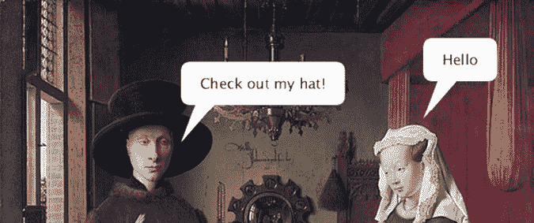

图 9-6：使用默认的 `txt` 参数（即 `Hello`）绘制一个对话框

要将 *Hello* 替换为 *Meh*，请使用三个参数调用 `speechBubble()` 函数：

```py
. . .speechBubble(445, 125, **'Meh'**)
```

因为你为 `txt` 参数提供了位置参数，所以该女性的对话框现在会显示“Meh”。

那位女士显然对她伴侣的帽子并不十分印象深刻，所以她可能不想冒犯他。此时使用*思考气泡*可能更为合适（图 9-7）。

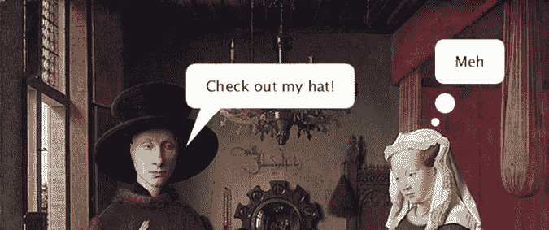

图 9-7：一个对话框（左）和一个思考气泡（右）

要绘制思维气泡，请修改 `speechBubble()` 函数，以绘制一串小圆圈，而不是三角形尾巴。然而，你希望 `speechBubble()` 函数默认绘制语音气泡，因为语音气泡比思维气泡更常见。

向函数定义中添加一个额外的 `type` 参数：

```py
. . .def speechBubble(x, y, txt='Hello'**, type='speech'**): . . .
```

现在你有两个带默认值的参数。注意，这些参数位于没有默认值的参数之后。如果你定义任何带默认值的函数，应该将这些参数放在列表的末尾。

下一步是修改函数体，特别是 `tail` 注释下方的部分。`type` 参数必须决定 Processing 是否绘制三角形尾巴或一串圆圈。修改代码如下：

```py
 . . . # tail if type == 'speech': fill('#FFFFFF') beginShape() vertex(0, 0)  # tip vertex(15, -40) vertex(35, -40) endShape(CLOSE) elif type == 'thought': fill('#FFFFFF') circle(0, 0, 8) circle(10, -20, 20) . . .
```

如果 `type` 参数等于 `'speech'`（函数定义中分配的默认值），`if` 语句代码将绘制一个三角形尾巴。每当函数调用中包含 `type` 参数为 `'thought'` 时，`elif` 语句将绘制一串两个圆圈。编辑你的函数调用，看看效果：

```py
. . .speechBubble(445, 125, 'Meh'**, 'thought'**)
```

`thought` 参数将 `speechBubble()` 函数切换到“思维气泡模式”。如果省略此参数，函数将默认绘制带尾巴的语音气泡。运行草图以确认结果与图 9-7 一致。

### 混合位置参数和关键字参数

你可以使用位置参数来传递 `x` 和 `y` 坐标，省略 `txt` 参数，并为 `type` 添加一个关键字参数。这样，Python 可以使用 `txt` 的默认值（`'Hello'`），但将其渲染为思维气泡。例如，你可能想将狗的语音气泡替换为一个写着`'Hello'`的思维气泡。一个选项是明确地在函数调用中包含 `'Hello'` 作为第三个参数——完全的定位方式。例如：

```py
speechBubble(315, 650, 'Hello', 'thought')
```

这里的每个参数都对应一个参数。尽管如此，这看起来有些多余，因为 `'Hello'` 已经是第三个参数的默认值。如果你在函数调用中省略 `'Hello'` 参数，Processing 将绘制一个带有 *thought* 字样的 *speech* 气泡：

```py
# a speech bubble that says, thought
speechBubble(315, 640, 'thought')
```

回想一下，第三个位置参数是 `txt` 参数，省略第四个参数意味着 Python 必须采用第四个 `type` 参数的默认值（语音气泡模式）。不过，这个问题有一个简单的解决方案；使用关键字参数，而不是依赖位置参数：

```py
speechBubble(315, 650, **type=**'thought')
```

在这种情况下，你明确地声明了值 `'thought'` 属于 `type` 参数。你可能会注意到，如果你对每个值都使用关键字参数，那么可以以任何顺序排列参数。这是正确的，所以根据具体情况决定最适合的混合位置参数和关键字参数组合。

如果你在函数调用中缺少一个或多个必需的参数，Processing 会显示错误信息（图 9-8）。例如，如果你调用`speechBubble()`函数时没有任何参数，错误信息会显示你至少需要两个参数。

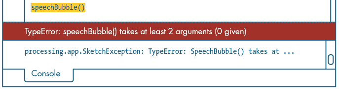

图 9-8：缺少参数的错误信息

如果你提供了太多参数，错误信息会显示`speechBubble()`函数最多只接受四个参数。

### 返回值

你可以使用一个函数来处理数据，然后让它*返回*结果给主程序。这与到目前为止你创建的函数不同，后者执行预定义的代码块后，才会恢复主程序的正常流程。

为了帮助解释这个区别，这里有一些代码，用来对比一个返回值的函数和一个不返回值的函数：

```py
x = random(100)square(x, 40, 20)
```

这里使用了两个 Processing 函数：`random()` 和 `square()`。第一个函数返回一个值；第二个函数则不返回值。`random()`函数生成一个从 0 到但不包括 100 的浮动值。`random()`函数*返回*该值，并将其分配给一个名为`x`的变量。`square()`函数在显示窗口中绘制一个正方形；它不返回值。

要定义一个返回值的函数，使用`return`关键字。举个例子，创建一个新的名为`shout()`的函数。这个函数接受一个字符串参数，然后将该字符串转换为大写并在结尾加上三个感叹号。将以下代码输入到`speechBubble()`调用之前，以确保`shout()`定义位于任何`shout()`函数调用之前：

```py
. . .def shout(txt): return txt.upper() + '!!!'. . .
```

在`return`语句中，`upper()`方法将分配给`txt`的字符串转换为大写；最终结果是该字符串与三个感叹号的拼接。一旦 Python 处理了`return`语句，它会立即退出函数。换句话说，如果你在`return`语句下面的`shout()`定义中添加任何其他代码，Python 会忽略它。

你可以使用这个函数在任意对话框中的文本上添加强调。以下是一个示例：

```py
speechBubble(190, 150, shout('Check out my hat'))
```

`shout()`函数将字符串转换为“CHECK OUT MY HAT!!!”之后，才会传递给`speechBubble()`函数。这将`shout()`函数包装在参数中，避免了创建中间变量的需要，之后你可以将其传递给`speechBubble()`函数。

这是一个简单的示例，用来介绍`return`关键字的作用。许多返回值的函数执行更复杂的任务，例如 Processing 的`sqrt()`函数，它计算任意数字的平方根。

## 定义周期运动的函数

在本节中，你将学习如何通过定义使用三角函数的函数来模拟 Processing 中的周期性运动，以绘制圆形图案和波动。在物理学中，*周期性运动*是指以规律间隔重复的运动，例如摆动的钟摆、水中传播的波浪，或者围绕地球运动的月亮。*周期*是完成一个运动循环所需的时间。月球绕地球的轨道周期大约为 27.3 天；时钟的秒针周期为 60 秒。

*三角学*，或称*三角函数*，是数学的一个分支，研究三角形，并使用各种数学函数，如正弦和余弦，来计算角度和距离。它在许多编程领域也有应用。例如，包含物理的游戏必须不断计算运动中物体的位置和速度，这些计算涉及三角形。

三角函数在控制方向和瞄准行为方面也非常有用。例如，如果你知道图 9-9 中玩家和敌人炮塔的 x-y 坐标，你可以计算出如何旋转敌人炮塔以瞄准玩家。

你将使用直角三角形，通过正弦和余弦函数来计算圆周上的点。这些点的坐标就是你用来模拟平滑周期性运动的基础。

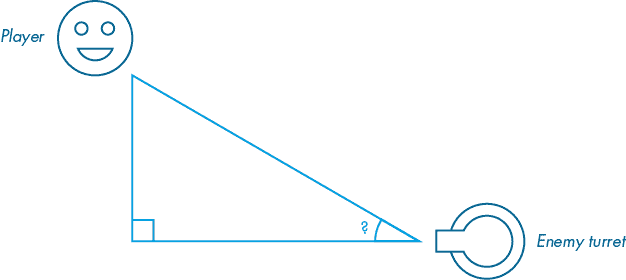

图 9-9：如果敌人炮塔在数学课上听讲就好了。

创建一个新的草图并将其保存为*periodic_motion*。添加以下代码来设置绘图空间：

```py
def setup(): size(800, 600)def draw(): background('#004477') noFill() strokeWeight(3) stroke('#0099FF') line(width/2, height, width/2, 0) line(0, height/2, width, height/2) # flip the y-axis scale(1, -1) translate(0, -height) # reposition the origin translate(width/2, height/2)
```

上述代码通过使用`setup()`和`draw()`函数，结构化了一个动画草图，其中有两条（淡蓝色的）线条在显示窗口的中心交汇。y 轴被翻转，所以 y 坐标随着向下移动而减少；我稍后会详细解释为什么这样做。最后的`translate()`函数将坐标系统移位，使原点（0, 0）位于显示窗口的中心。这意味着显示窗口左边缘的 x 坐标是–400，右边缘的 x 坐标是 400，顶部边缘的 y 坐标是 300，底部边缘的 y 坐标是–300（见图 9-10）。修改后的坐标空间，带有翻转的 y 轴，现在像一个常规的*笛卡尔平面*，拥有四个象限，允许你绘制任何范围在（–400, –300）和（400, 300）之间的 x-y 坐标。

你可能在数学课上遇到过这种系统，这也是我以这种方式设置坐标空间的原因。你将把它作为一个平台，来实验椭圆运动和波动运动，但首先，你可能需要简要复习一下三角函数。

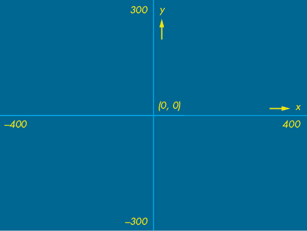

图 9-10：带有四个象限的笛卡尔平面

### 三角函数介绍

*正弦*、*余弦*和*正切*是三种常见的*三角函数*。这些是数学（而非编程）函数，但你可以通过 Processing 的内置三角函数在 Python 中使用它们。sin、cos 和 tan—它们通常的缩写—是基于从直角三角形中得到的比值（见图 9-11）。*直角三角形*（或*直角三角形*）有一个角度恰好为 90 度，通常用一个小方块表示。θ符号，*theta*，通常用来表示未知角度。

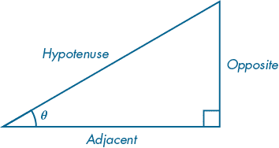

图 9-11：一个直角三角形

如果你知道这个三角形的任意两条边的长度，你可以计算出θ的大小。根据你掌握的边长，你将使用 sin、cos 或 tan 来进行计算。*SOHCAHTOA*，按发音规则为*so-ka-toe-uh*，是一个方便的助记法，帮助你记住以下三角比率：

1.  SOH sin(θ) = 对边 / 斜边

1.  CAH cos(θ) = 邻边 / 斜边

1.  TOA tan(θ) = 对边 / 邻边

作为一个例子，如果你知道图 9-11 中对边和斜边的长度，你可以通过使用 sin(θ)来求得角度θ。如果你知道邻边和斜边的长度，使用 cos(θ)。你也可以重新排列这些方程式，在已知θ和某个边长的情况下，求出未知边的长度。我稍后会再提到这一点。

你将应用 sin 和 cos 来解决一个简单的例子，计算沿着圆周的 x-y 坐标。首先，画一个圆，圆心位于(0, 0)，半径为 200。添加一条从(0, 0)开始的线段，长度与圆的半径相同，并旋转 1 弧度：

```py
. . .
radius = 200
theta = 1def draw(): . . . circle(0, 0, radius*2) stroke('#FFFFFF') pushMatrix() rotate(theta) # approximately 57.3 degrees line(0, 0, radius, 0) popMatrix()
```

代码将圆形呈现为淡蓝色的轮廓。一个白色的线段从圆心延伸到圆周，长度为半径；这形成了一个 1 弧度（大约等于 57.3 度）的角度，如图 9-12 所示。注意，`rotate()`函数应用于线条时是逆时针方向，因为 y 轴是反向的。任务是计算白线与圆周相接的点 A 的 x-y 坐标。其他黄色标记揭示了你将基于其进行计算的直角三角形。

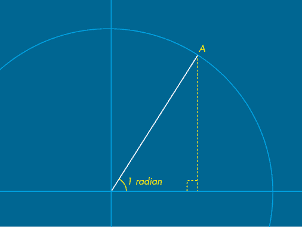

图 9-12：你将找到标记为 A 的点的 x-y 坐标。

观察到 A 点的 y 坐标等于对边的长度（或高度）。你知道角度（`theta`变量）和斜边的长度（`radius`），你可以用它们来计算对边的长度。记住，*SOH*在*SOHCAHTOA*中表示*sin(*θ*) = 对边 / 斜边*。

你已经知道θ和斜边的值，所以重新排列方程以求出对边：*对边 = sin(*θ*) × 斜边*。

如果你用程序中的变量名替换占位符，这是`y = sin(theta) * radius`。

为了计算 A 点的 x 坐标，你需要找出相邻边的长度（或宽度）。回想一下，*SOHCAHTOA* 中的 *CAH* 表示 *cos(*θ*) = adjacent / hypotenuse*，你可以将其重新排列为 `x = cos(theta) * radius`。

将以下代码添加到 `draw()` 函数的末尾：

```py
 . . . # white dot noStroke() fill('#FFFFFF') x = cos(theta) * radius y = sin(theta) * radius circle(x, y, 15)
```

`cos()` 和 `sin()` 函数返回浮动值，范围从 –1 到 1，适用于不同的 `theta` 值。Processing 的三角函数使用弧度制，因此不需要将 `theta` 参数转换为度数。在这个例子中，`theta` 等于 1 弧度，`cos()` 和 `sin()` 函数分别返回 0.54 和 0.84 的值（四舍五入到小数点后两位）。当你将 0.54 和 0.84 乘以半径值 200 时，你会得到一个 x-y 坐标（108, 168）。`circle(x, y, 15)` 函数通过这个 x-y 坐标对渲染一个白色点。运行草图，确认白色点位于 A 点位置，即白色线条连接到圆周边界的地方。

你可以调整 `theta` 值，将白色点移动到淡蓝色圆周上的不同点。要将点定位在原点正上方的 90 度位置，使用 `theta = HALF_PI`；要定位在 180 度位置，使用 `theta = PI`；以此类推。`theta` 值为 `TAU` 会让你回到起始点，在视觉上与 `theta = 0` 的点无区别。如果 `theta` 大于 `TAU`，则会发生环绕效果。换句话说，`cos(TAU+1)` 等同于 `cos(1)`。

接下来的任务是让点开始移动。你不再需要白色线条；通过删除从 `pushMatrix()` 开始直到包括 `popMatrix()` 的代码来去除它。

### 圆形与椭圆形运动

你将从沿着圆周移动点开始（即圆周运动），并创建一个用户定义的函数来处理必要的数学运算。然后，你将使用这个相同的函数来创建圆形运动的螺旋变体。完成圆形和螺旋运动后，你将定义一个新的函数来实现椭圆运动。图 9-13 展示了每种运动的示例。

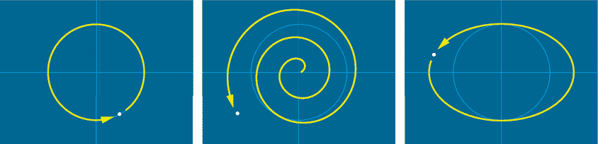

图 9-13：圆形（左）、螺旋形（中）和椭圆形（右）运动

#### 圆形

回想一下，存储在名为 `theta` 的变量中的角度大小决定了白色点的位置。为了让点沿圆周逆时针方向移动，添加代码每次执行 `draw` 函数时递增 `theta`。包括一个 `period` 变量来控制增量大小：

```py
. . .
period = 2.1def draw(): global theta 1 theta += TAU / (frameRate * period) . . .
```

在默认的 `frameRate` 为 60 fps，`period` 为 2.1 秒的情况下，`theta` 的增量大约是 0.05 1。这意味着每一帧，角度会延伸 0.05 弧度。运行草图来测试这一点。白色点应该在大约 2.1 秒内完成一圈圆周。

你增加 theta 的值时，点移动得越快。减小 theta 值会使点向相反方向（顺时针）移动。

定义一个名为`circlePoint()`的新函数，用于计算圆周上的点。在你的`draw()`函数中，将`x`和`y`的代码行替换为`circlePoint()`函数调用：

```py
def circlePoint(t, r): x = cos(t) * r y = sin(t) * r return [x, y]1. . .def draw(): . . . **#**y = sin(theta) * radius **#**x = cos(theta) * radius x, y2 = circlePoint(theta, radius) circle(x, y, 15)
```

`circlePoint()`的定义包括两个参数：`t`表示 theta（角度），`r`表示半径。由于该函数需要计算圆周上一些点的 x 和 y 坐标，因此它需要返回两个值。使用列表来返回多个值；你也可以使用字典（或元组）。

当你调用该函数时，Python 可以*解包*列表中的值并将其赋值给多个变量。为了触发这种解包行为，需要为每个列表项提供相应的变量，并用逗号分隔每个变量。在这种情况下，函数返回一个包含两个值的列表，这些值分别赋给变量`x`和`y`。另外，你也可以将列表赋给一个变量，如`a = circlePoint(theta, radius)`，但这时你必须通过`a[0]`和`a[1]`来引用`x`和`y`，这种方式不如前者简洁或直观。

#### 螺旋

对于向外螺旋的运动（见图 9-13 中的中心图像），你可以使用随时间增加的半径值。以下是一个例子：

```py
 . . . x, y = circlePoint(theta, frameCount) circle(x, y, 15)
```

请记住，`frameCount`是一个系统变量，包含自开始绘制以来显示的帧数。半径参数（`frameCount`）从 0 开始，随着动画的进展逐渐增大，导致点在螺旋轨迹上向外移动。由于每一次完整的旋转保持相同的周期，无论`circlePoint()`的半径如何，点在远离显示窗口中心时会加速。换句话说，点必须在相同的时间内覆盖更大的距离，因此它移动得更快。

#### 椭圆

对于椭圆轨迹，你需要两个半径：一个用于水平轴，另一个用于垂直轴。这些半径控制椭圆形状的宽度和高度，从而指导白点的运动轨迹（见图 9-13 右图）。定义一个新的`ellipsePoint()`函数，参数包括角度、水平半径和垂直半径：

```py
def ellipsePoint(t, hr, vr): x = cos(t) * hr y = sin(t) * vr return [x, y]. . .
```

函数体与`circlePoint()`函数类似。不同之处在于，你需要分别将`x`和`y`值乘以`hr`（水平半径）和`vr`（垂直半径）参数。

以下`ellipsePoint()`函数调用使得点在椭圆轨迹上移动：

```py
 . . . x, y = ellipsePoint(theta, radius*1.5, radius) circle(x, y, 15)
```

`ellipsePoint()`函数的第二个参数（水平半径）大于第三个参数（垂直半径），因此得到的椭圆在水平方向上比垂直方向更宽。

### 正弦波

*正弦波* 是一种几何波形，周期性地重复自身，就像一连串相连的 S 形曲线。该波形在许多数学和物理应用中都有出现。例如，你可以使用正弦波来模拟音乐音调、电波、潮汐和电流。

正弦波的形状是使用 `sin()` 函数形成的。图 9-14 描绘了一个黄色的正弦波。

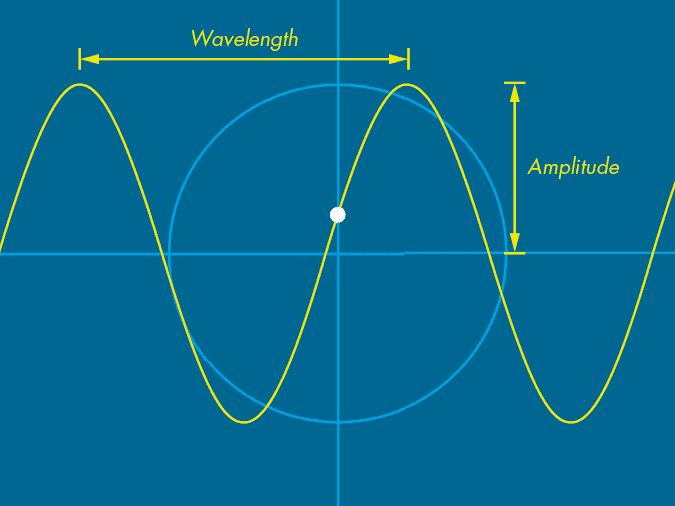

图 9-14：正弦波

*波长* 是一个完整周期的长度，测量的是从波峰到波峰（或从波谷到波谷）的距离。波长与周期有关，但周期是指时间（完成一个周期所需的时间），而波长是指距离。

*振幅* 是从静止位置（y = 0）到波峰的距离。一个振幅为 0 的波将平铺在 x 轴上。你可以通过与淡蓝色圆形的半径进行比较，确定图 9-14 中的黄色波具有 200 的振幅。

为了模拟正弦波运动，请将以下代码添加到你的 *periodic_motion* 草图中。这与绘制圆形相同，但使用固定的 x 坐标：

```py
. . .def draw(): . . . amplitude = radius y = sin(theta) * amplitude circle(0, y, 15)
```

波的 `振幅` 等于淡蓝色圆形的 `半径`，尽管你可以测试任何你喜欢的数值。白点的 y 坐标是通过 `sin(theta)` 乘以振幅计算得出的；x 坐标始终为 0。结果是一个从原点上下移动的白点。

运行草图并仔细观察点的加速和减速情况，就像图 9-14 中的波形穿过水面，点漂浮在其表面一样。当点接近波峰或波谷时，它开始减速，然后在转弯后加速；它在穿越 y 轴时移动得最快。

你可以使用此运动来绘制一整个移动的点波，或者模拟一个挂在弹簧上的重物（图 9-15）。

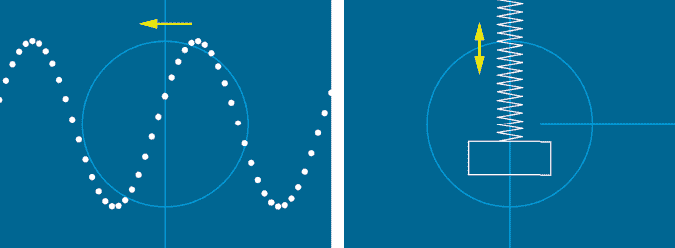

图 9-15：点阵波（左）和挂在弹簧上的重物（右）

每个示例的代码如下。你需要将其添加到 *periodic_motion* 草图的 `draw()` 块的末尾。如果你想在点阵波形上绘制弹簧和重物，可以添加两个代码列表，或者将其中一个列表替换为另一个。

#### 绘制点状正弦波

使用循环绘制一整波点阵。总共有 51 个点，均匀分布在 x 轴上。每个点的 y 坐标基于一个比前一个点更大的 `theta` 值。

```py
 amplitude = radius for i in range(51): 1 f = 0.125 * 2 t = theta + i * f 2 x = -400 + i * 16 3 y = sin(t) * amplitude circle(x, y, 15)
```

循环绘制 51 个点，从 `x` 坐标 -400 开始，x 坐标间隔为 16 像素 2。每个点的 `y` 值通过一个 `theta` 值计算，`theta` 值是比其左侧邻点大 `0.125 * 2` 弧度（即 0.25）。你可以将该乘数改为 `1`，表示一个波，占据显示窗口的宽度；将其保留为 `2` 表示两个波（如图 9-15 所示），将其改为 `3` 表示三个波，以此类推。我将变量命名为 `f`，表示*频率*，指的是事件在固定时间内重复的次数。

波长与频率成反比，因此随着频率的增加，波长会减小（波形开始变得更加尖锐）。波动从右向左传播，但点的水平位置不会改变。

#### 模拟悬挂在弹簧上的重物

使用循环来绘制弹簧，弹簧是由顶点组成的形状。悬挂在弹簧末端的重物是一个矩形。调整填充和描边以绘制轮廓线，而不是填充形状：

```py
 amplitude = radius y = sin(theta) * amplitude noFill() stroke('#FFFFFF') strokeJoin(ROUND) bends = 35 beginShape() for i in range(bends): vx = 30 + 60 * (i % 2 - 1) vy = 300 - (300 - y) / (bends - 1) * i vertex(vx, vy) endShape() rect(-100, y-80, 200, 80)
```

弹簧弯曲的紧角会产生锐利的接头，导致拉长的“肘部”。处理程序会在这些接头过长和过尖时将其裁剪，但在*斜接*（尖锐）和*倒角*（裁剪）接头之间跳跃会使动画看起来很差。为了防止这种情况，我将 `strokeJoin` 设置为 `ROUND`。在 `beginShape()` 和 `endShape()` 函数内嵌套了一个循环，用于绘制锯齿形弹簧的顶点。

通常情况下，在这样的系统中，一些能量会被耗散或丧失，振幅应该随着时间的推移衰减。你可以通过每一帧减少（全局）`radius` 值来模拟这一点，直到它降到 0，这时重物将停下来。

现在你已经学会了如何从函数返回值，并将三角学应用于椭圆和波浪动画，接下来让我们看看通过组合波浪产生的特殊曲线。

### 利萨如曲线

在这一部分中，你将创建一个用于绘制由参数控制的利萨如曲线的函数。*利萨如曲线*——以法国物理学家朱尔·安托万·利萨如命名——是通过组合来自两个波的 x 和 y 坐标形成的。

你可以通过机械方法创建这些曲线，方法是设置一个 Y 形的摆钟，摆钟的末端挂着一个充满沙子的杯子。当杯子摆动时，沙子通过底部的孔流出，绘制出一条曲线。图 9-16 显示了这个装置的一个示例（左）和用沙子绘制的曲线（右）。标有 *r* 的点表示摆钟合并为一根弦的位置。摆钟上部和下部的比例、初始摆动的角度和力量决定了最终曲线的形状。

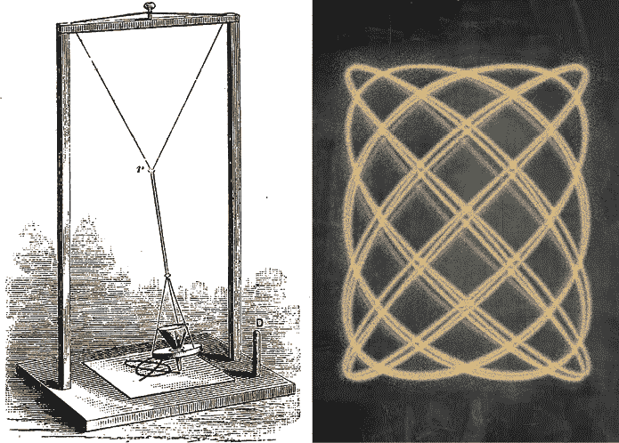

图 9-16：Blackburn 的 Y 形摆钟，出自 John Tyndall 的《声音》，1879 年（左），以及用沙子绘制的利萨如曲线（右）

首先，假设你有两个大小不同的圆（图 9-17）。圆形 A 的半径为 A，大小为 200 单位，圆形 B 的半径为 B，大小为 100 单位。

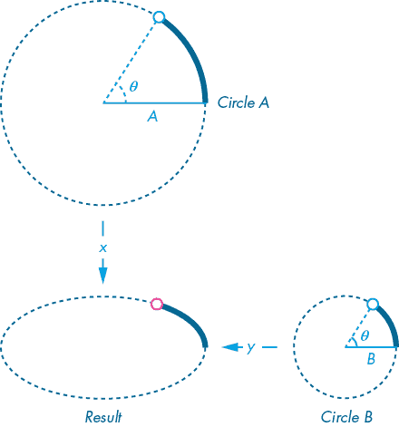

图 9-17：将来自不同圆的 x 和 y 值组合形成椭圆

结果椭圆（左下角）是通过使用圆形 A 的 x 坐标和圆形 B 的 y 坐标形成的。椭圆的宽度与圆形 A 一样，且高度与圆形 B 一样。这些数学计算相对简单，使用了你已经掌握的三角函数绘制椭圆的知识。

为了找到结果椭圆周长上任何点的 x-y 坐标，你可以使用以下公式：

*x* = *cos(*θ*)* × *A*

*y* = *sin(*θ) × *B*

创建一个新的草图，将其保存为 *lissajous_curves*，并添加以下代码以重现 图 9-17 中的椭圆：

```py
def lissajousPoint(t, A, B): x = cos(t) * A y = sin(t) * B return [x, y]def setup(): size(800, 600) frameRate(30) background('#004477') fill('#FFFFFF') noStroke()
theta = 0
period = 10def draw(): global theta theta += TAU / (frameRate * period) # flip the y-axis and reposition the origin scale(1, -1) translate(width/2, height/2-height)  x, y = lissajousPoint(theta, 200, 100) circle(x, y, 15)
```

绘图空间的设置与之前的草图相同。你有一个倒置的 y 轴，原点已移至显示窗口的中心。`theta` 值每帧增量大约为 0.01，作为 `lissajousPoint()` 函数调用中的第一个参数。目前，这个函数执行的操作与你在 *period_motion* 草图中的 `ellipsePoint()` 函数完全相同——唯一的区别是函数名和变量名不同。

请注意，代码的 `draw()` 部分没有 `background()` 调用，因此 Processing 不会在每一帧清除画面。因为这个原因，移动的白点形成了一条连续的线条。运行草图，它应该以逆时针方向画出一个完整的椭圆（图 9-18）。

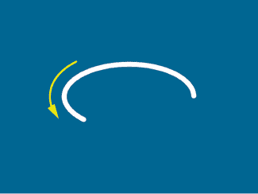

图 9-18：使用 `ellipsePoint()` 函数绘制椭圆

当 theta 达到 τ 弧度（大约为 6.28）时，椭圆已经完成，而 Processing 继续在现有线条上绘制。即使动画看起来已经完成，点仍在沿着周长移动。

下一步是修改 `lissajousPoint()` 函数，以便它能够绘制 Lissajous 曲线（而不是椭圆）。但首先，请考虑在波形方面发生了什么。研究 图 9-19，它将每个圆表示为一个波形，并注意每个波形上的点如何控制椭圆周长上的点位置。

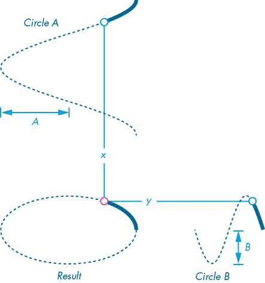

图 9-19：以波形表示的圆形 A 和圆形 B

图 9-19 展示了圆形 A 的 x 坐标，作为一个余弦波，在 -1 和 1 之间振荡，且由 A 的圆半径（波幅）进行缩放。同样，圆形 B 的 y 坐标以正弦波的形式呈现，波幅为 B。

在 图 9-20 中，你可以看到点如何沿着波动形成椭圆的形状。

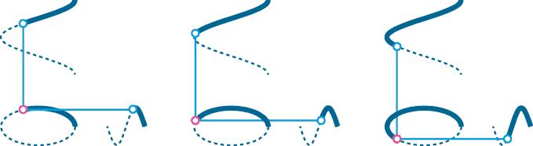

图 9-20：theta = 2（左），theta = 3（中），theta = 4（右）

目前，两个波的频率相匹配。换句话说，每个波完成一个周期的时间是相同的。结果是一个椭圆。

当波的频率不同时，就会出现 Lissajous 曲线。在图 9-21 中，Circle B 波的频率是 Circle A 波的两倍。跟随 Circle B 波的点必须在 Circle A 点完成一个周期的同样时间内完成两个周期。*a*和*b*值（小写）分别表示频率 1 和 2。

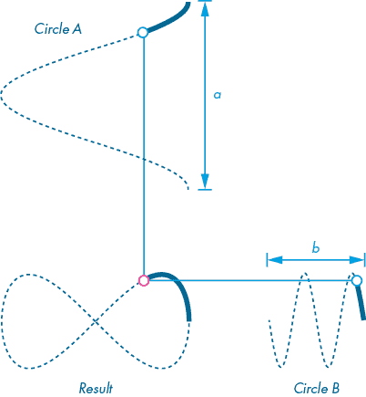

图 9-21：Circle B 波的频率是 Circle A 波的两倍。

频率*a*和*b*可以是 3 和 6，40 和 80，或者 620 和 1240。任何一对 1:2 的比例数字都会产生一个∞形状。这一点在你返回编写代码时将非常重要。你也可以用另一种方式理解这一点：在图 9-17 中，Circle B 点必须总是在 Circle A 点完成一个周长的同样时间内，完成两个周长的循环。

图 9-22 展示了点如何沿着波形移动，形成 Lissajous 曲线。

修改你的`lissajousPoint()`定义，添加一个参数表示频率*a*和频率*b*。将这两个参数作为乘数分别作用于`x`和`y`线中的 theta（`t`）：

```py
def lissajousPoint(t, A, B**, a, b**): x = cos(t *** a**) * A y = sin(t *** b**) * B return [x, y] . . .
```

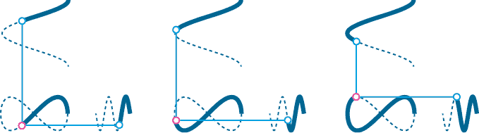

图 9-22：从左到右：theta = 2；theta = 3；theta = 4

现在，为你的函数调用添加参数`a`和`b`：

```py
 x, y = lissajousPoint(theta, 200, 100**, 1, 2**)
```

运行草图，观察 Processing 绘制 Lissajous 曲线（图 9-23）。

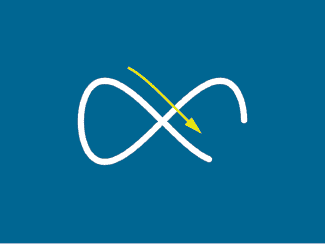

图 9-23：通过使用`lissajousPoint()`函数绘制 Lissajous 曲线

`a`和`b`参数决定了 Lissajous 曲线中的水平和垂直“叶片”的数量。记住，关键在于比例，因此`1`、`2`将产生与`5`、`10`相同的曲线。然而，后者将在更短的时间内完成曲线的绘制，甚至更大的数字会在点之间产生可识别的间距（否则它们会形成一条实线）。图 9-24 展示了几个`a`、`b`参数的结果。尝试使用其他数字进行实验。

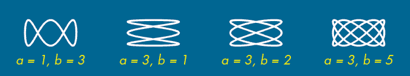

图 9-24：使用不同的`a`、`b`参数绘制 Lissajous 曲线

你可以通过使用三角函数移动形状、点和线，创造出有趣的视觉图案。单纯地实验，没有预设的目标，可能会带来令人印象深刻的视觉效果。可以把这种编程方式看作是一场音乐即兴演奏会，演奏者即兴创作，直到他们偶然发现某种听起来不错的旋律。

下一步任务使用 Lissajous 曲线和`line()`函数来创建动画图案，这应该会给你提供一些有趣的创意。

### 使用 Lissajous 曲线创建类似屏幕保护程序的图案

在第六章中，你编写了一个简单的 DVD 屏幕保护程序；现在让我们使用 Lissajous 曲线创建一个更复杂的屏幕保护程序。屏幕保护程序的最初目的是“保护”屏幕。老式的阴极射线管（CRT）显示器容易发生*烧屏*现象：如果在同一个位置长时间显示相同的图形，它会留下永久的“鬼影”图像。现代显示器不容易发生烧屏现象，但许多人仍然使用屏幕保护程序，因为它们看起来很酷。

你将使用`lissajousPoint()`函数创建一个受流行屏幕保护程序设计启发的图案。图 9-25 展示了最终结果，随着图案在屏幕上扭动，线条和颜色平滑地变化。

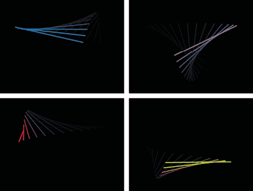

图 9-25：基于 Lissajous 曲线的动画图案

该运动依赖于两条 Lissajous 曲线，使用`line()`函数在每条曲线的前端之间绘制一条直线。图 9-26 展示了这一过程是如何工作的。

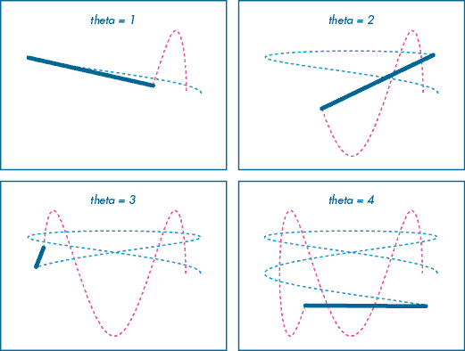

图 9-26：在两条 Lissajous 曲线之间绘制直线

当然，你看不到曲线，只看到直线，但实际上是通过两次`lissajousPoint()`调用计算出你的`line()`函数的 x-y 坐标。当 theta 达到τ弧度时，Lissajous 曲线完成，运动开始重复。

将以下代码添加到`draw()`函数的末尾，在你的*lissajous_curves*草图中：

```py
 . . . 1 for i in range(10): # curves t = theta + i / 15.0 x1, y1 = lissajousPoint(t, 300, 150, 3, 1) x2, y2 = lissajousPoint(t, 250, 220, 1, 3) # background color 2 fill(0x55000000) noStroke() rect(-width/2, -height/2, width, height) # line colorMode(HSB, 360, 100, 100) 3 h = (frameCount + i * 15) % 360 strokeWeight(7) stroke(h, 100, 100) line(x1, y1, x2, y2)
```

循环将绘制 10 条线——一条实线在前，后面跟着 9 条逐渐消失的线。你使用了两个`lissajousPoint()`函数，分别对应每条曲线（它们共同定义了每条线的两端的 x-y 坐标）。每次迭代时，Processing 都会绘制一个半透明的黑色方块，覆盖整个显示窗口，逐渐暗化之前迭代中的线条。

要定义半透明颜色，你使用 Processing 的`0x`表示法 2。十六进制值以`0x`开头，不带引号，后跟八个十六进制数字。前两位定义了*alpha*（透明度）成分；例如，`11`是高度透明的，而`EE`是高度不透明的。这个示例使用`55`，介于两者之间，但更接近透明端。其余六位是标准的 RGB 十六进制混合，在此为黑色（`000000`）。对于笔触颜色，设置`colorMode()`为`HSB`（参见第 14 页的“颜色模式”）。在前 360 帧内，你可以使用`frameCount`每帧调整色相值 1 度。然而，`frameCount`很快会超过 360，所以你需要使用取模运算将其“环绕”回到 0 3。

运行草图以观察输出结果。

尝试不同的`lissajousPoint()`参数，或者添加新的曲线和线条；甚至可以尝试在三条曲线之间连接三条线，形成变形三角形。继续实验，看看你能创造出什么。

## 概述

在本章中，你学会了如何定义自己的函数，这样可以减少重复并帮助你构建更加模块化的程序。记住，命名清晰的函数会使你的代码更易于阅读和理解，不仅对你自己，也对其他任何处理代码的人。

你可以向任何函数添加参数，使其更具通用性，且函数调用会包含与这些参数对应的不同参数，以控制其工作方式。你可以使用位置参数和/或关键字参数来调用函数。对于可选参数，你可以定义包含默认值的参数，以便 Python 在必要时使用这些默认值。

你还可以定义返回值的函数，这意味着你可以使用一个函数来处理数据，并将结果返回给函数调用者。如果一个函数返回一个值，你可以将其赋值给一个变量。此外，你还可以将函数封装在一个参数中，以便处理并返回另一个函数所需的值。

本章还介绍了三角函数的概念以及如何使用它们来模拟周期性运动。你学习了内建的 Processing 三角函数，如 `sin()` 和 `cos()`，并用它们绘制了圆形、螺旋、椭圆、正弦波和李萨如曲线。可以通过三角函数实验生成引人入胜的图案和运动，就像你在某些屏幕保护程序中看到的那样。

在下一章中，你将编写*类*，通过它们来创建*对象*。这些技巧使你能够更高效地构建代码，尤其是在面对更大、更复杂的程序时，通过围绕现实世界中的对象来建模你的程序。你还将学习用于编程运动的*向量*。
