## 第十章：面向对象编程与 PVector


*面向对象编程*（*OOP*）处理的数据结构被称为*对象*。你从类中创建新的对象，可以把类看作是一个对象模板，包含了一组相关的函数和变量。你为每一类想要处理的对象定义一个类，每个新对象都会自动采用你在类中定义的特性。OOP 结合了你迄今为止学到的所有内容，包括变量、条件语句、列表、字典和函数。OOP 提供了一种非常有效的方式，通过模拟现实世界的物体来组织你的程序。

你可以使用类来建模有形物体，如建筑物、人物、猫和汽车。或者，你可以用它们来建模更抽象的事物，如银行账户、个性和物理力量。虽然类定义了某类对象的通用特征，但你可以为每个创建的对象分配独特的属性以加以区分。在本章中，你将应用面向对象编程（OOP）技术来编写变形虫模拟程序。你将学习如何定义变形虫类，以及如何从中“生成”不同的变形虫。

你将通过模拟物理力量来编程变形虫的运动。为此，你将使用一个名为`PVector`的内置 Processing 类。`PVector`类是*欧几里得向量*的实现，包括一套用于执行数学运算的方法，你将使用这些方法来计算每个变形虫的位置和运动。

为了更好地管理代码，你将学习如何将程序拆分成多个文件。然后，你可以通过在 Processing 编辑器中使用标签在构成草图的文件之间切换。

## 使用类

*类*就像是对象的蓝图。例如，考虑一个`Car`类，它可能默认指定所有汽车都有四个轮子、一个挡风玻璃，等等。某些特征，比如油漆颜色，在不同的汽车之间是可以变化的，所以当你使用`Car`类创建一个新的汽车对象时，你可以选择一个颜色。这些特征被称为*属性*。在 Python 中，属性是属于类的变量。你可以决定哪些属性有预定义的值（如四个轮子和挡风玻璃），哪些是在创建新车时分配的（如油漆颜色）。

通过这种方式，你可以使用单一类创建多辆不同颜色的汽车。图 10-1 说明了这一概念。`Car`类包括描述每辆车的油漆颜色、引擎类型和型号的属性。

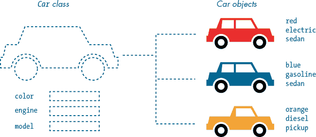

图 10-1：`Car`类作为汽车对象的蓝图。

驾驶员通过转向、加速和刹车来控制车辆。因此，除了属性外，你的`Car`类还可以包含执行这些操作的定义，称为*方法*。在 Python 中，方法是属于某个类的函数，定义了该类可以执行的操作或活动。

现在，让我们定义一个包含一组属性和方法的`Amoeba`类，用于控制变形虫对象的外观和行为。你将使用该类创建许多变形虫。图 10-2 展示了你正在努力实现的变形虫模拟的最终结果。

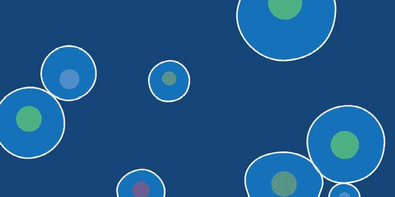

图 10-2：完整变形虫模拟的截图

变形虫在显示窗口中移动时会摇摆和扭曲。这并不是科学上正确的变形虫表现形式，但它应该看起来非常酷。作为额外的挑战，你将添加碰撞检测代码，防止变形虫互相穿越或重叠。你将从一个基本的`Amoeba`类定义开始，然后随着任务的进展添加属性和方法。

### 定义一个新类

在 Python 中，你通过使用`class`关键字来定义一个类。你可以随意给类命名，但和变量和函数名一样，类名只能使用字母数字和下划线字符。由于不能使用空格字符，推荐的类命名约定是*UpperCamelCase*，即每个单词的首字母都大写，从第一个单词开始。

一开始，你的`Amoeba`类除了在控制台打印一行外，什么也不会做。开始一个新草图并将其保存为*microscopic*。定义一个新的`Amoeba`类：

```py
class Amoeba(object): def __init__(self): print('amoeba initialized')
```

`class`关键字定义了一个新类。这里类名是`Amoeba`，后面跟着`object`，并用括号括起来，最后是冒号。

如果你运行这个草图，什么有趣的事情都不会发生，控制台将是空的。

你在类体内定义的函数称为*方法*。`Amoeba`类包括一个特殊方法的定义，名为`__init__`（前后都有两个下划线）。这个方法是一些*魔法方法*中的一个，它们前后都有两个下划线，你不会直接调用它们。我稍后会详细讲解`__init__()`方法（以及`self`参数）。目前，你只需要知道的是，Python 会在每次创建新变形虫时自动运行`__init__()`方法。你使用这个方法在对象创建时设置属性并执行代码。

### 从类中创建实例

要*实例化*一个变形虫，你需要按名称调用`Amoeba`类，并将其赋值给一个变量——就像你调用返回值的函数一样。*实例化*是一个高级词汇，意思是*创建一个新实例*，而*实例*和*对象*是同义词。

添加一行代码来从你的`Amoeba`类创建一个新实例，并将其赋值给名为`a1`的变量：

```py
class Amoeba(object):     def __init__(self): print('amoeba initialized')
a1 = Amoeba()
```

当你运行草图时，Python 会创建一个新的 `Amoeba()` 实例。这将自动调用 `__init__()` 方法。你可以使用 `__init__()` 方法来定义属性并为其赋值，稍后你会这样做。这个方法也可以包含其他指令来初始化变形虫，例如在这个例子中使用 `print()` 函数。当你运行草图时，控制台应该显示一条 `amoeba initialized` 消息。

### 向类添加属性

你可以把属性看作是属于对象的变量。就像一个变量一样，属性可以包含你喜欢的任何数据，包括数字、字符串、列表、字典，甚至其他对象。例如，`Car` 类可能有一个字符串属性来表示车型名称，还有一个整数属性来表示最高车速。

在你的 `Amoeba` 类中，你将添加三个属性来存储 x 坐标、y 坐标和直径的数值；当你实例化新的变形虫时，你将为这些属性赋值。语法类似于传递参数给函数：`__init__()` 方法的括号中包含了你对应的参数列表。

对代码做出以下更改，以便为每个新变形虫添加 `x`、`y` 和 `diameter` 值：

```py
class Amoeba(object): def __init__(self**, x, y, diameter**): print('amoeba initialized')a1 = Amoeba(**400, 200, 100**)
```

`__init__()` 方法已经包含一个参数 `self`；这是必须的，并且总是第一个参数。`self` 参数提供对特定实例值的访问，例如变形虫 `a1` 的 `x` 值为 `400`（但如何工作稍后再讲）。`x`、`y` 和 `diameter` 被作为第二、第三和第四个参数添加。我在 `a1` 行中添加了相应的实参。然而，请注意，我只提供了三个实参，`self` 参数没有提供任何值。图 10-3 描述了这些位置参数如何匹配，从 `__init__()` 方法中的第二个参数开始。

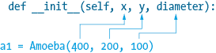

图 10-3：不要为 `self` 参数提供实参。

你也可以使用关键字参数（并为参数指定默认值），但在这个任务中我将坚持使用位置参数。

当你将值传递给 `__init__()` 方法时，它不会自动为你存储这些值。为此，你需要属性，它们就像是对象的变量。将 `x`、`y` 和 `diameter` 参数分配给新的属性。每个属性都以 `self` 为前缀，后跟一个点，再加上属性名：

```py
class Amoeba(object): def __init__(self, x, y, diameter): print('amoeba initialized') self.x = x self.y = y self.d = diametera1 = Amoeba(400, 200, 100)
```

请注意，你将 `diameter` 分配给了 `self.d`。你的属性名称不必与参数名称相匹配。

在这一点上，我可以更详细地解释 `self` 参数。我提到过，`self` 是一个特定实例的引用。换句话说，`self.d` 值为 `100` 属于变形虫 `a1`。每个变形虫实例将拥有自己的一组 `self.x`、`self.y` 和 `self.d` 值。例如，我可能会添加另一个变形虫 `a3`，并赋予不同的值：

```py
a3 = Amoeba(600, 250, 200)
```

这将在稍后你向模拟中添加多个变形虫时派上用场。图 10-4 提供了你的 `Amoeba` 类及其三个可能实例的概念图。

接下来，你将学习如何通过 `a1` 实例访问变形虫 `a1` 的 `x`、`y` 和 `d` 值。你将使用这些值在显示窗口中绘制变形虫，类似于图 10-4 右上角所示的变形虫。

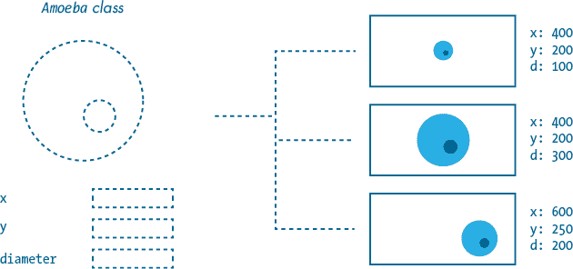

图 10-4：你的 `Amoeba` 类及其三个实例

#### 访问属性

要访问属性，你使用 *点表示法*。对于 `a1` 实例，你可以通过 `a1.x`、`a1.y` 和 `a1.d` 分别访问 `x`、`y` 和 `d` 属性。这是实例名（`a1`）后跟一个点，再跟你想访问的属性名称。

要开始，向你的草图末尾添加以下代码，它绘制了一个圆形，表示变形虫 `a1`：

```py
. . .def setup(): size(800, 400) frameRate(120)def draw(): background('#004477') # cell membrane fill(0x880099FF) stroke('#FFFFFF') strokeWeight(3) circle(a1.x,  a1.y,  a1.d)
```

现在，显示窗口的宽度为 800 像素，高度为 400 像素。120 的高帧率将有助于平滑你稍后添加到变形虫中的抖动动画。*细胞膜*将变形虫的内部与外部环境分隔开，我在这里为它设置了一个白色的描边。填充颜色是半透明的浅蓝色。在 `circle()` 函数中的 x 坐标（第一个参数），Python 会检查 `a1` 实例的属性 `self.x` —— 在这个例子中，它的值为 400；y 坐标的参数值为 `200`，直径参数的值为 `100`。结果（图 10-5）是一个直径为 100 像素的圆形，位于显示窗口的中心。


图 10-5：直径为 100 像素的圆形（基础变形虫）

到目前为止，你已经学会了如何为 `Amoeba` 类添加参数，当你实例化变形虫时将其赋值给属性。除了这些参数外，你的类还可以包含具有预定义值的属性。

#### 添加一个具有默认值的属性

想想汽车的类比。每辆车从生产线下来时油箱是空的。制造商可能在出售前加油，但油箱总是从空开始。为此，你决定为 `Car` 类添加一个属性——我们称之为 `self.fuel`。每个新车对象的默认值为 0，但它将在车辆的使用过程中变化。通过参数指定从 0 开始是多余的；相反，`Car` 类应该自动为你初始化 `fuel` 属性，默认为 0。

让我们回到变形虫的任务。每个变形虫都会包含一个预定义的红色填充的细胞核。要实现这一点，在 `__init__()` 方法的函数体内为一个名为 `nucleus` 的属性分配一个十六进制值（`#FF0000`）。你不需要在 `__init__()` 定义中添加另一个参数，因为你不需要额外的参数来指定红色填充：

```py
 . . . self.x = x self.y = y self.d =  diameter self.nucleus = '#FF0000'. . .
```

现在，你创建的每个变形虫都有一个`nucleus`属性，值为`#FF0000`。

在你的`draw()`函数中插入三行新代码，以便在细胞膜下渲染细胞核：

```py
. . .def draw(): background('#004477') # nucleus fill(a1.nucleus) noStroke() circle(a1.x, a1.y, a1.d/2.5) # cell membrane. . .
```

新的代码行设置了填充色和描边，并通过使用`circle()`函数绘制细胞核，直径是细胞膜的 2.5 倍小（`a1.d/2.5`），并将其置于变形虫的中心。运行草图确认你看到的是紫褐色的细胞核；它实际上是红色的，但你透过淡蓝色的半透明膜看到它。

当你实例化变形虫时，并不设置细胞核的填充色，但这并不意味着你只能使用红色细胞核。你可以在创建变形虫后修改属性值。

#### 修改属性值

许多属性保存的值会随着程序的运行而改变。为了回到汽车的比喻，考虑前面提到的`fuel`属性，它的值会随着油箱在满与空之间的波动不断变化。你可以通过实例使用相同的点语法直接修改任何属性的值。

插入一行代码来改变变形虫实例`a1`的细胞核填充色：

```py
 . . . # nucleus a1.nucleus = '#00FF00' fill(a1.nucleus) . . .
```

这将`nucleus`属性设置为绿色，覆盖了默认的红色值。运行草图确认你能看到一个绿色的细胞核穿透半透明膜。

你也可以通过使用方法来修改属性，这部分我将在《为类添加方法》（第 216 页）中介绍。

#### 使用字典来表示属性

请记住，属性可以包含任何你喜欢的内容——数字、字符串、列表、字典、对象等等。你将使用一个字典属性，该字典包含字符串（十六进制）和浮点值的混合，用于组织细胞核的属性。

将你的`nucleus`属性更改为一个字典，该字典包含细胞核填充色、x 坐标、y 坐标和直径的键值对。为了使每个变形虫的外观有所不同，可以随机化这些值：

```py
class Amoeba(object): def __init__(self, x, y, diameter): print('amoeba initialized') self.x = x self.y = y self.d = diameter self.nucleus = { 'fill': ['#FF0000', '#FF9900', '#FFFF00', '#00FF00', '#0099FF'][int(random(5))], 'x': self.d * random(-0.15, 0.15), 'y': self.d * random(-0.15, 0.15), 'd': self.d / random(2.5, 4) }. . .
```

`fill`键与一个从五种颜色中随机选取的十六进制值配对。现在每个新变形虫的细胞核颜色是随机选择的（尽管你之后可能会明确地覆盖它）。`x`和`y`键被赋予与细胞膜直径成比例的随机值；你将用这些值来定位细胞核在细胞膜的边界内，但不一定是中心位置。细胞核的直径（`d`）也与细胞膜成比例，并且每个实例的值是随机变化的。

更新你的`draw()`代码，以便处理这些更改：

```py
. . .def draw(): background('#004477') # nucleus fill(a1.nucleus['fill']) noStroke() circle( a1.x + a1.nucleus['x'],  a1.y + a1.nucleus['y'],  a1.nucleus['d'] ) # cell membrane . . .
```

`fill()`和`circle()`参数引用相关字典键，以样式和定位细胞核。

每次运行草图时，Processing 都会生成一个独特的变形虫。图 10-6 展示了四次运行的四个结果。当然，Processing 生成相同或相似的随机值组合是可能的（尽管不太可能），连续的结果可能看起来是一样的。

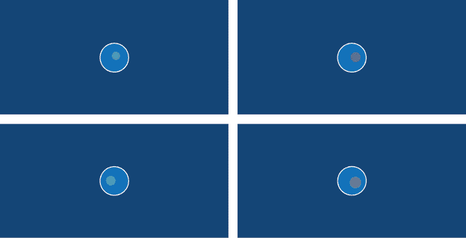

图 10-6：每个变形虫都是通过随机化的细胞核值生成的。

现在你已经设置了控制变形虫视觉外观的属性，下一步是添加方法来动画化它。

### 向类添加方法

你在类体内定义的函数被称为*方法*。用车的比喻来说，驾驶员可以通过使用方法来控制车辆，例如转向、加速和刹车。你还可以添加一个加油的方法。方法通常通过使用对象的属性来执行操作。例如，`accelerate()` 和 `refuel()` 方法会分别减少或增加 `fuel` 属性的值。

你可以任意命名方法，只要遵循与函数相同的命名规则和约定。换句话说，只使用字母数字和下划线字符，使用驼峰命名法或下划线替代空格，等等。

你将为每一帧创建一个新方法来绘制变形虫。目前，代码中 `draw()` 部分的几行代码正在处理此操作。将细胞核和细胞膜的代码从 `draw()` 函数移到新创建的 `display()` 方法的主体中，确保你的缩进正确。在 `display()` 方法中，将每个 `a1` 前缀替换为 `self`：

```py
class Amoeba(object): . . . def display(self1): # nucleus fill(self.nucleus['fill']) noStroke() circle( self.x + self.nucleus['x'],           self.y + self.nucleus['y'],           self.nucleus['d'] ) # cell membrane fill(0x880099FF) stroke('#FFFFFF') strokeWeight(3) circle(self.x, self.y, self.d). . .def draw(): background('#004477')
```

定义中的 `self` 参数为你的 `display()` 方法提供了访问属性的能力，例如 `self.nucleus` 和 `self.x`。`display()` 方法不接受任何参数，因此定义中没有其他参数。

#### 调用方法

一旦你定义了一个方法，就可以像访问属性一样，使用相同的点符号调用该方法并执行方法体中的代码——也就是说，实例名称后跟方法名，并用点分隔。当然，方法像函数一样包含括号，有时也需要传递参数。

在你的 `draw()` 函数中添加一个 `a1.display()` 调用来渲染变形虫 `a1`：

```py
. . .def draw(): background('#004477') a1.display()
```

你在 `display()` 定义中没有参数（除了 `self`），所以方法调用不需要任何参数。运行草图以确认它产生与之前相同的结果（图 10-6）。

为了让变形虫摇晃，你将定义一个新方法，并在 `Amoeba` 类中调用它。此外，这个方法将接受一些参数。

#### 创建一个摇晃的变形虫

变形虫像充满水的气球一样发生变形和波动。为了复制这种不完全圆形的形状，你将用 `bezierVertex()` 函数代替细胞膜的 `circle()` 函数。这与第二章绘制中国硬币时使用的代码相同，只是这里的控制点有些不规则。

图 10-7 展示了具有可视化顶点和控制点的变形虫轮廓。该形状并不完全圆形，但它是平滑的，没有明显的角度。对于平滑的曲线，顶点和两个控制点必须形成一条直线。

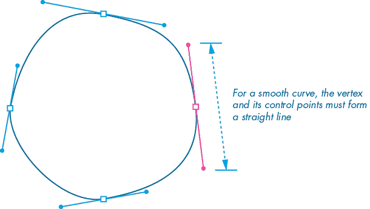

图 10-7：使用贝塞尔曲线绘制变形虫

为了实现摆动效果的动画，你需要调整每一帧中控制点的位置。为了避免可察觉的角度并保持曲线的圆滑外观，你将沿圆形路径移动控制点。图 10-8 展示了（从左到右）两个控制点完成一次旋转；每个控制点最终回到它开始的位置，准备无缝地重复运动。

注意，相对的控制点总是领先或落后于其对应点 180 度。当控制点接近顶点时，曲线变得更紧凑，但保持圆形。圆形轨迹保持从一个控制点到另一个控制点通过顶点的（虚拟）直线。

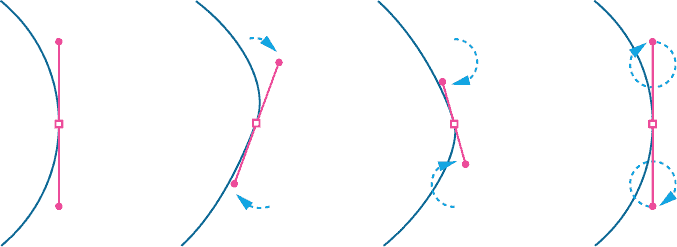

图 10-8：沿圆形路径移动控制点坐标

要编写这个效果，添加一个`circlePoint()`方法，用于计算每个圆形路径的周长上的点（这个方法是你在第九章定义的`circlePoint()`函数的改编）：

```py
class Amoeba(object): . . . def circlePoint(self, t, r): x = cos(t) * r y = sin(t) * r return [x, y] . . .
```

`circlePoint()`方法接受两个参数，一个是 theta（`t`）值，另一个是半径（`r`）。函数作用域的规则同样适用于方法，因此`x`和`y`变量是`circlePoint()`方法的局部变量。

你可以通过类实例调用方法——例如，使用`a1.circlePoint()`调用`circlePoint()`方法。当然，你需要包含两个参数（用于`t`和`r`）。你也可以通过在类内使用`self`前缀来调用方法——例如，`self.circlePoint()`。通过这种方式，你可以在`display()`函数内部调用`circlePoint()`方法，并使用返回的值来绘制摆动的变形虫。

在`display()`块中添加一个`circlePoint()`方法调用，并用由`bezierVertex()`函数组成的代码替换`circle()`函数（用于细胞膜），绘制出一个由贝塞尔曲线组成的形状：

```py
 . . . def display(self): . . . # cell membrane fill(0x880099FF) stroke('#FFFFFF') strokeWeight(3) r = self.d / 2.0 cpl = r * 0.55 cpx, cpy = self.circlePoint(frameCount/(r/2), r/8) xp, xm = self.x+cpx, self.x-cpx yp, ym = self.y+cpy, self.y-cpy beginShape() vertex( self.x, self.y-r # top vertex ) bezierVertex( xp+cpl, yp-r, xm+r, ym-cpl, self.x+r, self.y # right vertex ) bezierVertex( xp+r, yp+cpl, xm+cpl, ym+r, self.x, self.y+r # bottom vertex ) bezierVertex( xp-cpl, yp+r, xm-r, ym+cpl, self.x-r, self.y # left vertex ) bezierVertex( xp-r, yp-cpl, xm-cpl, ym-r, self.x, self.y-r # (back to) top vertex ) endShape(). . .
```

`r`变量表示变形虫的半径。`cpl`值是每个控制点到其顶点的距离；请记住，对于完全圆形的圆，这大约是圆半径的 55%（参见第二章，第 2-22 图）。`circlePoint()`方法通过使用基于递增的`frameCount`的 theta 值，计算`cpx`和`cpy`变量的坐标；`frameCount`被除以变形虫半径的一半，以便较大的变形虫比小的变形虫摆动得更慢。第二个`circlePoint()`参数，即圆形路径的半径，也与变形虫半径成正比。其余的代码使用`cpl`、`cpx`和`cpy`变量来绘制组成摆动变形虫的顶点和曲线。

运行草图以确认你有一个摆动的变形虫。

#### 通过使用方法修改属性

你可以使用一种方法来修改一个或多个属性，作为直接通过点符号修改值的替代方案。以下是一个简短的示例；不需要将这段代码添加到你的草图中。

当你实例化变形虫 `a1` 时，你的 `__init__()` 方法会从一个预定义的五种颜色的列表中随机选择一个核填充色。你可以通过将另一个值赋给 `a1.nucleus['fill']` 来改变这一点。或者，你可以定义一个新的方法来实现这一点：

```py
class Amoeba(object):  . . . def styleNucleus(self, fill): self.nucleus['fill'] = fill  . . .
```

`styleNucleus()` 定义包含一个填充值的参数。在你实例化变形虫 `a1` 之后，你可以通过使用 `a1.styleNucleus('#000000')` 来设置核的填充色为黑色，而不是 `a1.nucleus['fill'] = '#000000'`。这看起来可能没什么用处，但考虑到你可以为核字典的 `x`、`y` 和 `d` 值添加额外的参数，一次性更改它们。你甚至可以添加额外的逻辑，例如 `if` 语句来检查直径值的大小，确保在应用之前它的大小是合适的：

```py
 def styleNucleus(self, fill**, diameter**): self.nucleus['fill'] = fill if diameter > self.d/4 and diameter < self.d/2.5: self.nucleus['d'] = diameter
```

`styleNucleus()` 定义现在包含一个额外的参数，用于表示核的直径。但新的直径值仅在其大小合适时才会生效。`if` 语句将确保该方法忽略任何过小或过大的值，从而避免得到一个小核或一个超大、超出细胞膜的核。

在继续之前，简要回顾一下你在变形虫模拟中所处的阶段。你已经定义了一个 `Amoeba` 类，包含了改变每个实例外观的属性。你创建了一个变形虫 `a1`，但很快你将添加更多实例。你定义了一个 `__init__()` 方法来初始化属性。此外，你还定义了一个 `display()` 方法来绘制变形虫，并调用了另一个方法 `circlePoint()` 来使细胞膜产生波动。稍后，你会让变形虫在显示窗口中移动。不过，在此之前，你需要将你的*显微镜*草图拆分成两个文件。

## 将你的 Python 代码拆分成多个文件

在本书中，你完成了一系列相对较小的编程任务。将每个草图放在一个文件中处理还算可行，但随着你开始处理更复杂的程序，行数将会增加。你可能会将一个 *俄罗斯方块* 游戏压缩成几百行 Processing 代码，但开源的 Minecraft 类似游戏 *Minetest* 几乎有 60 万行（主要是）C++ 代码，而 Windows XP 包含大约 4500 万行源代码！

编程语言有多种机制来组织跨多个文件的项目。在 Python 中，你可以从文件中导入代码。每个被导入的 Python 文件被称为*模块*。在本节中，你将为 `Amoeba` 类创建一个单独的变形虫模块。

你需要考虑将程序合理划分为模块的最佳方式。例如，你可以将一组相关的函数归为一个模块。有时，将变量添加到一个专用的*配置*模块中也是很有用的，这样可以提供一个单独的位置来设置程序全局值。将一个或多个相关的类分组到一个模块中是组织代码的另一种有效方式。

在 Processing 编辑器中，每个标签代表一个模块。通过使用位于*microscopic*标签右侧的箭头（如图 10-9 所示）创建一个新的标签/模块。从弹出的菜单中选择**New Tab**，并将新文件命名为*amoeba*。

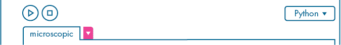

图 10-9：点击用品红色高亮显示的箭头标签进行各种标签操作。

这个新文件/模块被创建在*microscopic*文件夹中，与主草图文件并列。Processing 会在*amoeba*文件名后添加*.py*，这是 Python 模块的标准文件扩展名。现在，*amoeba.py*模块应该会出现在*microscopic*标签旁边。

你可以通过标签切换在主草图和模块之间进行切换。切换到*microscopic*标签，选择所有关于`Amoeba`类的代码，剪切它，然后切换到*amoeba.py*标签并粘贴到那里（见图 10-10）。

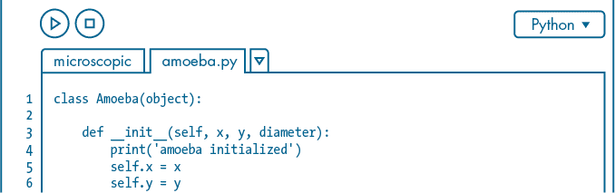

图 10-10：*amoeba.py*标签包含了你的`Amoeba`类的代码。

现在切换回*microscopic*标签。剩下的就是从`a1 = Amoeba(400, 200, 100)`开始的所有内容。

要导入模块，使用`import`关键字。你的`import`行必须在任何实例化变形虫的代码之前。通常，`import`行放在文件的顶部，以避免顺序错误。下面是你*microscopic*标签中的完整代码：

```py
from amoeba import Amoebaa1 = Amoeba(400, 200, 100)  def setup(): size(800, 400) frameRate(120)def draw(): background('#004477') a1.display()
```

`from`关键字指示 Python 打开*amoeba*模块。该模块的名称来自文件名*amoeba.py*，但省略了*.py*扩展名。接着是`import`，用来指定你想导入的类，这里是`Amoeba`。这种语法允许你根据需要从包含多个类定义的模块中选择性地导入类。现在，你可以像使用*microscopic*标签中的定义一样使用`Amoeba`类。

运行草图。它应该像往常一样运行，并在显示窗口的中心显示一个摇晃的变形虫。

你可以使用模块在项目之间共享代码。例如，你可以将变形虫模块复制到任何 Processing 项目文件夹中。然后，你只需导入它即可开始创建变形虫。你还可以将多个模块存储在一种被称为*库*或*包*的文件夹结构中。

这个模块化系统使得编程更高效。除了减少主草图的行数外，你还隐藏了每个模块的内部工作原理，让程序员可以专注于更高层次的逻辑。例如，如果你为*amoeba*模块提供文档，说明如何实例化变形虫并使用方法，那么任何程序员都可以导入并使用它——在不查看*amoeba.py*代码的情况下创建变形虫。此外，模块化使得另一个程序员可以更容易地浏览你的项目代码并理解你的程序，因为它已经被划分为命名文件。

你的`a1`变形虫保持在固定位置，并随着时间推移而摇晃。下一步是让它在显示窗口中移动。

## 使用向量编程运动

你将使用向量来编程变形虫的运动。然而，这些向量不是用于可缩放图形的向量，而是欧几里得向量。*欧几里得向量*（也称为*几何向量*或*空间向量*）表示一个既有大小又有方向的量。你将使用向量来模拟推动变形虫的力。

在图 10-11 中，变形虫从 A 点移动到 B 点，总共推动了 4 个单位的距离。这个距离代表了一个大小；*大小*描述了一个力的强度。一个更大大小的力可能会将同样的变形虫推移 20 个单位。然而，问题在于——大小并没有指示力应用的方向；你只能通过视觉上获得的信息知道，运动是向右移动了 4 个单位。

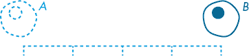

图 10-11：4 个单位的大小

量值是一个*标量*值。它是一个可以用单一数值（如浮点数或整数）描述的单一量。例如，数字 4、1.5、42 和一百万都是标量。

*向量*由多个标量描述。换句话说，它可以包含多个浮点数或整数值。图 10-12 展示了一个标记为*v*的向量，它是带箭头的直线。*v*的长度是它的大小；斜率和箭头指示它的特定方向。

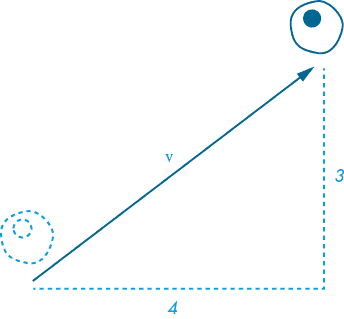

图 10-12：向量*v*向右延伸 4 个单位，向上延伸 3 个单位。

每个向量都有一个 x 和一个 y 分量，因此你可以将这个向量表示为**v** = (4, 3)。它描述了一个将变形虫移动到一个新位置的力，这个新位置比原位置向右 4 个单位，向上 3 个单位。你用粗体字表示向量，但在某些粗体不方便使用的情况下（例如，手写公式），也常常在**v**上方画一个小箭头。

图 10-12 中的水平和垂直测量线与*v*形成一个直角三角形，*v*是其中的斜边。通过这个三角形，你可以使用*勾股定理*来计算向量的大小。该定理指出，斜边的平方等于另外两边的平方和。

如果你将 4 的平方（邻边）加上 3 的平方（对边），你会得到 25，这是斜边的平方。25 的平方根是 5，即斜边的长度，也是*v*的大小。但你不需要担心进行这样的计算。Processing 提供了一个内建的`PVector`类，专门用于处理向量，其中包括一个`mag()`方法来计算大小。

你将调整你的变形虫草图，使其能够使用`PVector`类进行运动。在展示如何使用向量让变形虫移动的同时，我还会概述各种`PVector`方法的工作原理，揭示其背后的数学原理。

### `PVector`类

`PVector`是 Processing 中的一个内建类，用于处理欧几里得向量。你可以在任何草图中使用它——无需`import`语句。`PVector`可以处理二维和三维向量，但我们这里仅使用二维向量。

要创建一个新的二维向量，`PVector()`类需要提供 x 和 y 参数。例如，这行代码定义了在图 10-12 中所示的向量：

```py
v = PVector(4, 3)
```

`v`实例是一个新的向量，水平延伸 4 个单位，垂直延伸 3 个单位。不过，你应该将`3`改为`-3`，以适应 Processing 的坐标系统（在这个系统中，y 值随着向上移动而减少）。

向量可以指向任何方向，无论是负方向还是正方向，但其大小始终是一个正值。使用`mag()`方法来计算任何`PVector`实例的大小；例如：

```py
magnitude = v.mag()print(magnitude) # displays 5.0
```

你知道`mag()`方法必须调用基于毕达哥拉斯定理的预写代码。它返回一个浮动值 5.0，确认了我们在上一节中的计算结果。

### 使用 PVector 移动阿米巴

你将创建一个`PVector`实例来让阿米巴`a1`在显示窗口中移动。在第六章中，你编写了类似的程序——一个 DVD 屏保——通过指示 Processing 在每一帧水平和垂直地移动 DVD logo，达成平滑的对角线运动。这里的方法类似，但你将使用`PVector`类。你会发现，基于向量的方法在模拟运动和力方面更为高效。

切换到*amoeba.py*标签，并在`__init__()`方法中添加一个新的`propulsion`向量：

```py
class Amoeba(object): def __init__(self, x, y, diameter**, xspeed, yspeed**): . . . self.propulsion = PVector(xspeed, yspeed)
```

propulsion 向量通过额外的`xspeed`和`yspeed`两个参数初始化，这将决定每一帧中阿米巴水平和垂直推进的像素数。与 DVD 屏保任务相比，这里你将`xspeed`和`yspeed`变量合并为一个名为`propulsion`的单一向量。

现在切换到*microscopic*标签。使用第四个和第五个`Amoeba()`参数将推进向量的 x 和 y 分量分别设置为`3`和`-1`。使用`draw()`函数根据这些值递增阿米巴的 x 和 y 属性：

```py
. . .a1 = Amoeba(400, 200, 100**, 3, -1**). . .def draw(): background('#004477') a1.x += a1.propulsion.x a1.y += a1.propulsion.y a1.display()
```

每一帧，阿米巴`a1`的 x 值增加 3 个像素；与此同时，它的 y 值减少 1。在默认的 Processing 坐标系统中，y 值减小表示阿米巴向上移动。如果运行该草图，阿米巴应沿对角线快速移动，起始于显示窗口的中心，并很快从右上角下方退出。

你还可以使用`PVector`实例来存储阿米巴的 x 和 y 坐标。实际上，你可以使用`PVector`来存储任何 x-y 坐标对；毕竟，它是一个用于存储两个（或三个）数字的对象，同时还包括许多方便的向量运算方法。切换到*amoeba.py*标签；将`self.x`和`self.y`属性替换为一个名为`self.location`的新向量：

```py
class Amoeba(object):     def __init__(self, x, y, diameter): print('amoeba initialized') self.location = PVector(x, y) . . .
```

变形虫的位置现在也成为一个 `PVector` 实例，尽管它描述的是显示窗口中的一个点，而不是速度或力。但你还不能重新运行草图。首先，你需要更新其余的 *amoeba.py* 文件，使其与新的位置属性兼容。

你的 `Amoeba` 类中有多个 `self.x` 和 `self.y` 的引用，你需要确保将它们全部替换为 `self.location.x` 和 `self.location.y`。最简单的方法是使用查找和替换操作。在 Processing 菜单栏中，选择 **编辑** ▶ **查找** 来访问 **查找** 工具（图 10-13）。在 **查找** 字段中输入 `self.x`，在 **替换为** 字段中输入 `self.location.x`。点击 **全部替换** 按钮应用更改。这里的复选框设置不会影响结果。完成后，对 `self.y` 做同样的操作，替换为 `self.location.y`。

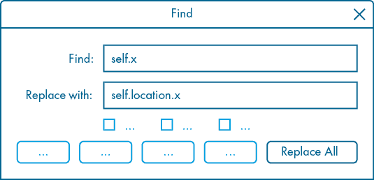

图 10-13：处理查找（和替换）工具

现在，将你在 *microscopic* 标签页中的 `a1.x` 和 `a1.y` 分别更改为 `a1.location.x` 和 `a1.location.y`：

```py
 . . . a1.**location**.x += a1.propulsion.x a1.**location**.y += a1.propulsion.y . . .
```

你将 x 分量和 y 分量分别添加到不同的行中。然而，有一种更高效的方法来实现这一点，即使用 `PVector` 加法。

#### 向量加法

`+` 运算符用于添加浮点数或整数。此外，它还作为字符串操作数的连接运算符。`PVector` 类也被编程为与 `+` 运算符一起使用。你可以将一个 `PVector` 实例添加到另一个实例中，从而得到一个表示两个向量和的新向量。通过扩展，`+=` 作为一个增量赋值运算符，表示运算符左侧的向量操作数等于它自身加上右侧的操作数。

用一行代码替换你的 `a1.x += propulsion.x` 和 `a1.y += propulsion.y`，通过添加 `PVector` 实例来代替单独的分量：

```py
. . .def draw(): background('#004477') a1.location += a1.propulsion a1.display()
```

每次调用 `draw()` 函数（每一帧）时，变形虫的位置都会根据推进力向量递增。如果你运行草图，变形虫会沿着和之前相同的轨迹移动，每一帧水平移动 3 像素，垂直向上移动 1 像素，最终从显示窗口的右上角下方退出。

让我们为模拟添加一个新力。你将模拟一个斜向流动的水流；它辅助变形虫的主要运动，朝东北方向流动。正如维基百科（[`en.wikipedia.org/wiki/Current_(fluid)`](https://en.wikipedia.org/wiki/Current_(fluid))）定义的那样，“流体中的水流是该流体中流动的大小和方向。”显然，这需要通过向量来模拟。

在 *microscopic* 标签页中添加一个名为 `current` 的新 `PVector`。在每一帧中，通过 `draw()` 函数将该向量添加到你的当前位置：

```py
. . .
current = PVector(1, -2). . .def draw(): background('#004477') a1.location += a1.propulsion a1.location += current a1.display()
```

推进向量大约与水平线成 18 度角，推力主要向右而非向上。当前向量大约与水平线成 63 度角，推力主要向上而非向右（见 图 10-14）。这种组合使变形虫以一个大约 36 度的角度向前移动，比之前的方式快。如果你运行草图，变形虫应该会从显示窗口的顶部边缘退出（之前它是从右边缘退出的）。

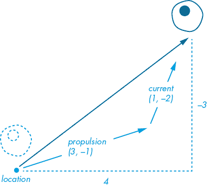

图 10-14：变形虫每帧移动 4 像素的水平距离和 3 像素的垂直距离。

向量加法通过将一个向量的 x 分量与另一个向量的 x 分量相加，y 分量也同样如此。在这个例子中，x 分量相加 (3 + 1) 等于 4，y 分量相加 (–1 + –2) 等于 –3。无论加法的顺序如何，结果总是相同的。例如，(3, –1) + (1, –2) 和 (1, –2) + (3, –1) 的结果都是相同的，结果向量在两种情况下都是 (4, –3)。这使得向量加法成为一个 *交换* 操作，因为改变操作数的顺序不会改变结果。

你可以尝试不同的电流值，看看会发生什么。一个电流向量 (–3, 1) 完全抵消了推进向量，变形虫将停留在显示窗口的中心。而电流向量 (–3.5, 1) 将压倒推进向量的 x 分量，并与 y 分量完全匹配，导致变形虫缓慢而直接地向左移动。

这个系统的妙处在于你可以根据需要将任意数量的力作用于物体的位置。例如，你可能会包括一个风的向量，一个重力的向量，等等。

#### 向量相减

在数学中，减法运算的结果称为 *差*。例如，当你从 6 中减去 4 时，剩下的差是 2。同样，当你从一个向量中减去另一个向量时，结果向量是两者之间的差。

你可以将向量相减想象成这样：首先将两个向量的尾部对齐；在每个向量的头部之间画一条线；这条新线就是差向量。在 图 10-15 中，你从 *a* 中减去了 *b*；其差向量（深蓝色向量 *c*）是 (–2, –1)。

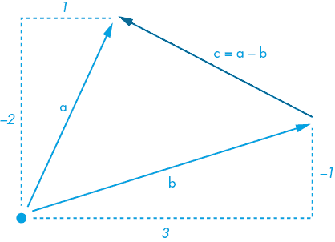

图 10-15：向量 *c* 等于 (–2, –1)。

向量相减的过程与向量加法类似，但你不再是将每个向量的 x 分量（x 分量）和 y 分量（y 分量）相加，而是进行相减。然而，注意减法是 *非交换* 的。这意味着，改变操作数的顺序会改变结果。例如，如果你从 *b* 中减去 *a*，你会得到 (2, 1) 而不是 (–2, –1)。这使得向量 *c* 指向相反的方向，交换了它的头和尾。

你可以通过使用 `–` 运算符来减去 `PVector` 实例。以下是一个示例：

```py
print(current - a1.propulsion)
```

如果你的当前向量为 (1, –2)，这将在控制台打印 `[-2.0, -1.0, 0.0]`。Processing 将一个 `PVector` 实例打印为三个浮动点数值的列表，分别表示向量的 x、y 和 z 分量。z 值始终为 0，除非你在处理三维向量。

你已经将推进向量和当前向量加到变形虫的位置上，以使其在显示窗口中移动。现在，你将应用向量减法的知识，使变形虫朝鼠标指针移动。你将创建一个新的 `PVector` 实例，名为 `pointer`，用来存储鼠标指针的 x-y 坐标。你将从 `pointer` 中减去 `location`（它包含变形虫的 x-y 坐标）来找到差异向量（图 10-16），你将使用这个向量来重新定向变形虫。

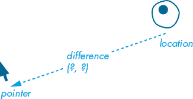

图 10-16：差异向量等于 `pointer` – `location`。

确保你的当前向量设置为 (1, –2)。添加一个新的 `PVector`，命名为 pointer，并创建一个差异变量，它等于指针减去变形虫的位置（图 10-16 中所示的差异向量）。

```py
. . .current = PVector(**1**, **-2**). . .def draw(): background('#004477') pointer = PVector(mouseX, mouseY) difference = pointer - a1.location a1.location += difference . . .
```

`mouseX` 和 `mouseY` 是 Processing 系统变量，保存着鼠标指针的 x 和 y 坐标。但需要注意的是，Processing 只有在鼠标指针移动到显示窗口前后，才会开始跟踪鼠标位置；在此之前，`mouseX` 和 `mouseY` 都会返回默认值 0。

如果你运行这个草图，变形虫将附着在鼠标指针上。这是因为变形虫会在一次“跳跃”中到达指针位置。相反，你希望变形虫朝着指针“游泳”，在多个帧中逐步前进。

#### 限制向量大小

`PVector` 类提供了 `limit()` 方法来限制任何向量的大小，这不会影响方向。它需要一个标量（整数或浮动点数）作为参数，表示最大大小。

你将使用差异向量通过将其添加到推进向量中来引导变形虫朝向鼠标指针。你将限制推进向量的大小为 3（图 10-17），足以在变形虫直接游向当前方向时，稍微克服其大小为 2.24 的作用力。

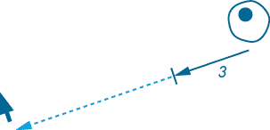

图 10-17：推进向量的大小限制为 3。

在 `draw()` 函数中做以下插入/修改，以引导和推进变形虫朝着鼠标指针前进：

```py
. . .def draw(): . . . 1 **#**a1.location += difference 2 **a1.propulsion += difference.limit(0.03)** 3 a1.location += a1.propulsion**.limit(3)** a1.location += current a1.display()
```

首先，将现有的 `a1.location += difference` 行 1 注释掉或删除。`limit()` 方法将 `difference` 向量限制为大小为 0.03。这个微小的值将在每一帧中被添加到推进向量中——这种效果迅速累积——将变形虫逐步引导朝向鼠标指针。但即使变形虫直接朝指针前进，推进向量的大小也不会超过 3。

运行草图，将鼠标指针移动到显示窗口的左下角附近。变形虫将会漂移到视野之外。但稍等一会儿，它会慢慢朝着那个角落移动；当它到达指针时，会稍微超越它，然后转身返回时再超越一次。它会不断超越指针，因为它试图尽快到达目标。现在将指针移到右下角。在水流的帮助下，变形虫迅速到达屏幕的另一侧，但由于其较高的速度，它会剧烈地超越目标。

很快，你将会向模拟中添加多个变形虫。为了让它们以不同的速度移动，向`Amoeba`类中添加一个最大推进力的属性：

```py
class Amoeba(object): def __init__(self, x, y, diameter, xspeed, yspeed): . . . self.maxpropulsion = self.propulsion.mag()
```

这个属性将根据你提供的`xspeed`和`yspeed`参数来限制变形虫推进向量的大小/力度。修改你在*微观*标签中的代码，使其能够使用`maxpropulsion`属性，替换两个`limit()`方法的参数。另外，调整`xspeed`、`yspeed`和当前向量的值，将它们缩小一个因子 10：

```py
. . .a1 = Amoeba(400, 200, 100, **0.3**, **-0.1**)current = PVector(**0.1**, **-0.2**). . .def draw():  . . . a1.propulsion += difference.limit(**a1.maxpropulsion/100**) a1.location += a1.propulsion.limit(**a1.maxpropulsion**) . . .
```

减少的推进力和当前值使得模拟变得更慢，因此变形虫的移动更加平稳和可控。变形虫不再猛烈超越目标，但它仍然会在指针周围做小的轨道运动。差值向量的限制现在与变形虫的最大推进力成比例，因此较快的变形虫具有额外的操控力来应对其更高的速度。

#### 执行其他向量操作

向量和`PVector`类还有更多内容，但这些内容是本书中涉及的所有内容。可以将你所学的视为该主题的初步入门。`PVector`类还可以处理向量乘法、除法、归一化、三维向量等操作。向量对于编程涉及物理的任何内容都非常有用，比如视频游戏，而且你很可能会在你的创意编程冒险中再次遇到它们。

## 向模拟中添加多个变形虫

你已经有了一个工作的变形虫模块，但你目前只在处理一个变形虫实例`a1`，因此下一步是创建一个变形虫群落。你可以从同一个类创建任意数量的实例。在这一部分中，你将使用`Amoeba`类在同一个显示窗口中生成八个变形虫。每个变形虫的大小都不同，且它们将从不同的 x-y 坐标开始。回想一下，每个变形虫实例包含一个随机化的细胞核值字典，因此细胞核也会有所不同。

添加变形虫的一种（相当手动）方法是定义额外的实例，并使用个性化的变量名和明确区分的参数。考虑以下三个新的变形虫：

```py
a1 = Amoeba(400, 200, 100, 0.3, -0.1)
sam = Amoeba(643, 105, 56, 0.4, -0.4)
bob = Amoeba(295, 341, 108, -0.3, -0.1)
lee = Amoeba(97, 182, 198, -0.1, 0.2)
. . .
```

你可以通过这种方式不断添加变形虫，但这种方法也有其缺点。首先，你需要记得在`draw()`函数的主体中调用每个`display()`方法来渲染每个变形虫：

```py
def draw():  . . . a1.display() sam.display() bob.display() lee.display() . . .
```

这将显示`sam`、`bob`和`lee`静止不动；要让这些变形虫动起来，`draw()`函数还需要更多代码。如果你处理的是大约 5 只变形虫，这样还算高效，更别说 100 只了。

个性化的变形虫名字很可爱，但对这个程序来说并不重要。相反，你将把变形虫存储在一个列表中。你可以方便地使用循环来生成任意数量的变形虫列表。然后，你可以通过另一个循环调用每只变形虫的`display()`方法（以及移动它的代码）。

用一个空的`amoebas`列表和一个循环来填充它，替换你*显微镜*代码顶部的`a1`行：

```py
from amoeba import Amoeba
amoebas = []for i in range(8): diameter = random(50, 200) speed = 1000 / (diameter * 50) x, y = random(800), random(400) amoebas.append(Amoeba(x, y, diameter, speed, speed)). . .
```

每次`for`循环迭代时，Python 都会创建一个新的`Amoeba()`实例。`Amoeba()`的参数是随机的，用来改变每个实例的 x 坐标、y 坐标和直径。`speed`值是基于`diameter`的——因此，较大的变形虫移动得较慢（记得`propulsion`和`maxpropulsion`属性是从`xspeed`和`yspeed`参数派生的）。`append()`方法将新的变形虫实例添加到`amoebas`列表中。变形虫没有像`sam`、`bob`、`lee`这样的名字，但你可以通过索引`amoebas[0]`、`amoebas[1]`等来引用它们。

你必须向`draw()`函数添加一个`for`循环来渲染完整的变形虫列表。以下是你修改后的代码：

```py
. . .def draw(): background('#004477') pointer = PVector(mouseX, mouseY) for a in amoebas: difference = pointer - a.location a.propulsion += difference.limit(a.maxpropulsion/100) a.location += a.propulsion.limit(a.maxpropulsion) a.location += current a.display()
```

`for`循环遍历整个`amoebas`列表。对于每个变形虫，它会计算一个更新的位置，然后使用它的`display()`方法来渲染该变形虫。

较大、较慢的变形虫可能会漂移出显示窗口，被水流压倒，永远无法再见到。为了避免这个问题，添加代码以实现*环绕*边缘——这样，如果变形虫退出显示窗口，它将重新出现在对面边缘，保持其速度和轨迹：

```py
 . . . for a in amoebas: . . . r = a.d / 2 if a.location.x - r > width:    a.location.x = 0 - r if a.location.x + r < 0:        a.location.x = width + r if a.location.y - r > height:   a.location.y = 0 - r if a.location.y + r < 0:        a.location.y = height + r
```

四个`if`语句检查显示窗口的每个边缘。为了确保变形虫在重新出现在对面边缘之前已经完全离开显示窗口，有必要将半径（变量`r`）纳入条件中。同样，每个对应的目标位置也偏移了`r`，以防止变形虫在对面边缘中途重新出现。如果你想看看其他情况，可以将`r`设置为 0。

每次运行草图时，你都会得到不同的变形虫组合。它们都会朝你的鼠标指针聚集（尽管水流压倒了一些大而慢的变形虫），在过程中相互重叠。图 10-18 显示了一个例子，里面有八只变形虫。

要添加或删除变形虫，你可以调整第一个循环中`range()`函数的参数，`draw()`函数中的循环会动态适应。如果你的计算机似乎有些吃力，可以减少变形虫的数量。

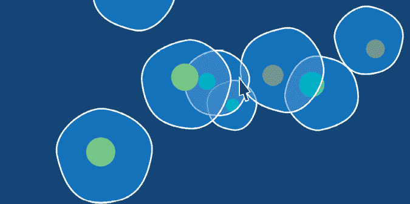

图 10-18：一个显示窗口，里面有八只变形虫朝向鼠标指针移动

#### 挑战#10：碰撞检测

变形虫可能会相互重叠。为了防止这种情况发生，必须先检测重叠发生的位置。然后，你可以应用向量力将任何发生碰撞的变形虫推开。

变形虫大致是圆形的，所以*圆形-圆形碰撞检测*算法在这里非常适用。要理解圆形-圆形碰撞检测是如何工作的，可以参考图 10-19。左边的一对圆形没有发生碰撞；右边的是发生了碰撞的圆形对。对于没有发生碰撞的圆形，它们的圆心之间的距离大于两圆半径之和（r1 和 r2）。相反，当圆形发生碰撞时，它们的圆心之间的距离小于两圆半径之和。

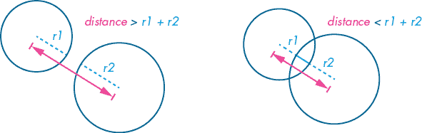

图 10-19：圆形碰撞检测

在 Processing 中测试碰撞时，你需要检查`amoebas`列表中的每一个变形虫与其他所有变形虫之间的碰撞。为此，你需要在`a in amoebas`循环中添加另一个`for`循环：

```py
 . . . for a in amoebas: . . . for b in amoebas: if a is b: continue # your solution goes here
```

你不想检查一个变形虫是否与自己发生碰撞。在循环的顶部，有一个`if a is b`的测试。`is`操作符比较其两侧的对象，以确定它们是否指向同一个实例；如果`a`与`b`是同一个实例，这个条件会被评估为`True`。`continue`语句终止当前循环的迭代，并从下一次循环的开始处重新开始，因此你的“解决方案”代码会被跳过。

想想如何利用图 10-19 中显示的距离向量，将发生碰撞的变形虫推开。你能否添加（或减去）一部分距离向量，将变形虫推向与碰撞方向相反的方向？

如果你需要帮助，可以访问解决方案：[`github.com/tabreturn/processing.py-book/tree/master/chapter-10-object-oriented_programming_and_pvector/`](https://github.com/tabreturn/processing.py-book/tree/master/chapter-10-object-oriented_programming_and_pvector/)。

## 总结

在本章中，你学习了如何使用面向对象编程在 Python 中建模现实世界中的对象。你定义了一个新的`Amoeba`类，并为其添加了属性和方法。类作为对象模板，你可以从中创建无数个实例。将相关的变量（属性）和函数（方法）组织到类中，可以帮助你更高效地组织代码。这对于编写更大、更复杂的项目特别有效。

你还学习了如何将类（和其他代码）分离到不同的 Python 文件中，这些文件被称为模块，并且如何使用这些模块在项目之间共享代码，或者在同一项目中的文件间作为可重用的组件。记住，模块可以减少主草图的行数，让你能够专注于更高层次的逻辑。

本章还介绍了 Processing 内置的`PVector`类，用于处理欧几里得向量。欧几里得向量描述了一个既有大小又有方向的量，但你也可以用向量来存储某个位置（作为 x-y 坐标）。在本章中，你使用了向量来模拟力并控制显示窗口中各个对象的位置。

在下一章中，你将学习如何在 Processing 中处理鼠标和键盘交互。我在本章中已经提到过`mouseX`和`mouseY`系统变量。然而，通过捕捉鼠标点击和按键事件，你可以做更多的事情，解锁与 Processing 草图互动的激动人心的新方式。
