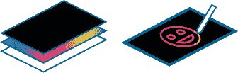
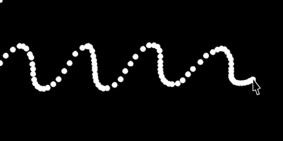
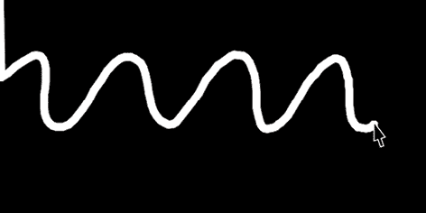
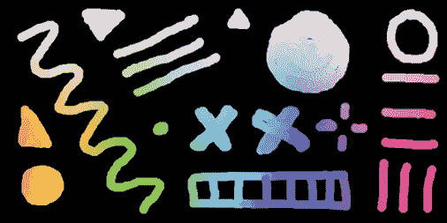
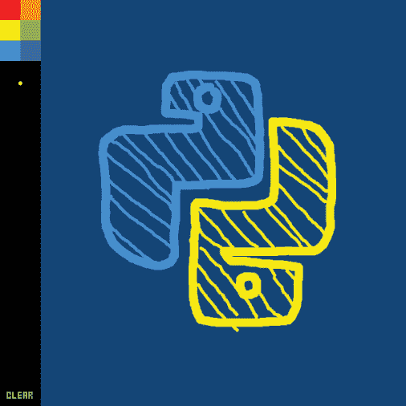
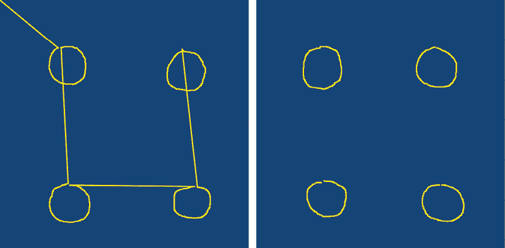
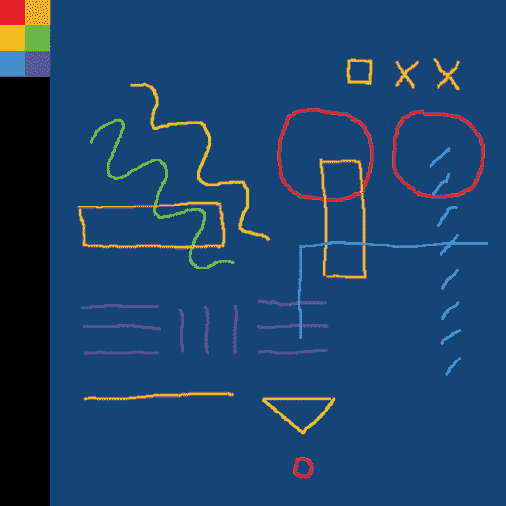
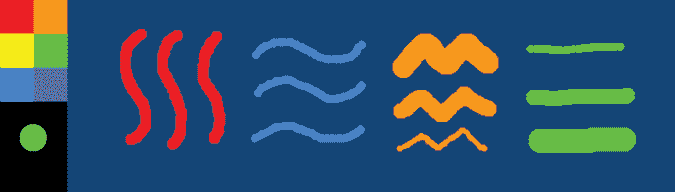
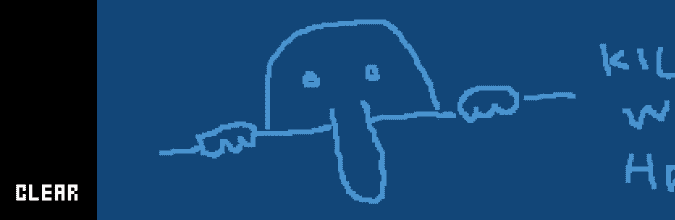

## 第十一章：鼠标和键盘交互


在本章中，你将学习如何编程互动草图，响应鼠标和键盘输入。你可以以有趣且实用的方式结合这些输入设备。例如，许多电脑游戏使用组合键来控制玩家移动，鼠标用于瞄准。在这里，你将编程草图，使用鼠标进行绘画并从工具调色板中选择项目。你还将添加快捷键，通过键盘激活工具。

本章介绍了你可以用来监控鼠标点击和键盘按键的系统变量。你还将学习到*事件函数*，这些函数会在特定类型的鼠标或键盘事件发生时执行。

你将完成的第一个任务是一个简单的涂鸦程序。第二个任务是一个更复杂的画图应用，它包括一个用于选择颜色和画笔的工具调色板。当你编程互动式草图时，你需要能够根据用户输入更改显示窗口的内容，因此这两个程序都设置为动画草图。

## 鼠标交互

你可以使用鼠标输入执行点击操作。你还可以编程手势类型的动作，结合鼠标移动和点击，例如拖放或平移。大多数鼠标有三个按钮——一个左键，一个右键，还有一个可以点击的滚轮，滚轮也可以作为中间按钮使用。

### 鼠标变量

Processing 的`mouseX`和`mouseY`变量存储了你鼠标指针在显示窗口中的水平和垂直位置。Processing 还提供了系统变量`pmouseX`和`pmouseY`，它们包含了上一帧的鼠标坐标。还有一个`mousePressed`变量，它在鼠标按钮被按下时会被设置为`True`。

本章的第一个任务专注于 Processing 的鼠标变量，用于监控鼠标指针的位置并检测鼠标按钮是否被按下。你将编程一个简单的草图来制作*划痕艺术*。一张划痕艺术纸上覆盖着彩虹色的混合色彩，接着涂上一层黑色（图 11-1）。"刮痕者"使用塑料或木制触控笔在黑色表面上刻划线条，揭示下面的颜色。



图 11-1：构成划痕艺术纸张的一层层材料（左），用触控笔涂鸦（右）

你可以购买现成的划痕纸，或者自己制作，但像素是便宜且可重复使用的！

创建一个新文件并将其保存为*scratch_art*。添加以下代码，让你的鼠标绘制一串白色圆圈：

```py
def setup(): size(800, 400) frameRate(20) background('#000000') stroke('#FFFFFF')def draw(): circle(mouseX, mouseY, 15)
```

每一帧，Processing 都会根据 `mouseX` 和 `mouseY` 值绘制一个新圆。每帧都会获取这些坐标，并且帧率相对较低（20 fps）。`draw()` 块中没有 `background()` 函数，因此每个绘制的圆形都会持续存在，直到你关闭显示窗口。如果你慢慢移动鼠标，圆形会形成一条实心的白线；而当你快速移动鼠标时，线条中会留下一些明显的间隙（图 11-2）。显示窗口的左上角总是会有一个圆形，因为鼠标的第一个 x-y 坐标对等于 (0, 0)。



图 11-2：你移动鼠标的速度越快，线条中的间隙就越大。

你可以增加帧率以便更好地填充线条，但如果你足够快地移动鼠标，仍然会出现间隙。为了确保线条连续，可以用绘制线条的代码替换`circle()`函数：

```py
. . .def draw(): strokeWeight(15) line(mouseX, mouseY, pmouseX, pmouseY)
```

`strokeWeight()` 的参数 `15` 与之前的圆形直径相匹配。`line()` 函数绘制从当前帧到前一帧的鼠标坐标之间的线条。

运行草图。第一个 `line()` 函数将从左上角 (0, 0) 延伸到鼠标指针首次进入显示窗口的位置。在 图 11-3 中，我的鼠标从左边缘进入显示窗口（我正从左向右画波浪）。



图 11-3：使用 `line()` 函数绘制每一帧的连续线条

为了打开和关闭“画笔”，插入一个 `if` 语句，当左键按下时激活 `line()` 函数：

```py
. . .def draw(): strokeWeight(15) if mousePressed and mouseButton == LEFT: line(mouseX, mouseY, pmouseX, pmouseY)
```

`mousePressed` 变量保存一个布尔值，当任意鼠标按钮被按下时，该值为 `True`。`mouseButton` 变量根据按下的按钮为 `LEFT`、`RIGHT` 或 `CENTER`，若没有按下任何按钮，则为 `0`。

运行草图，确认在按住左键时，Processing 绘制的是一条白色的线。

为了实现彩虹色的涂鸦艺术效果，插入代码使得笔触颜色基于鼠标指针的位置。水平方向控制色相，垂直方向控制饱和度：

```py
. . .def draw(): colorMode(HSB, 360, 100, 100) h = mouseX * 360.0 / width s = mouseY * 100.0 / height b = 100 stroke(h, s, b) . . .
```

在这个例子中，你将颜色模式设置为 `HSB`（色相、饱和度、亮度）。`h` 变量分配一个 0 到 360 之间的色相值；`s` 变量分配一个 0 到 100 之间的饱和度值。`h` 和 `s` 的值基于鼠标指针相对于显示窗口宽度和高度的位置。颜色的亮度值始终为 100%。

运行草图，测试完成的涂鸦艺术程序（图 11-4）。



图 11-4：在涂鸦艺术程序中涂鸦

现在你已经了解了 Processing 的鼠标变量，在接下来的任务中，你将学习鼠标事件函数。

### 鼠标事件

Processing 提供了一些鼠标事件函数，每当发生特定的鼠标事件时，它们就会被执行。这些函数包括 `mouseClicked()`、`mouseDragged()`、`mouseMoved()`、`mousePressed()`、`mouseReleased()` 和 `mouseWheel()`。你可以在事件函数块中添加代码，当事件函数被触发时，该代码就会执行。为了说明这一点，我将通过一个使用 `mousePressed` 变量的例子与另一个使用 `mousePressed()` 事件函数的例子进行对比。

以下代码使用 `mousePressed` 系统变量，通过按下鼠标按钮将背景颜色从红色切换为蓝色：

```py
def draw(): background('#FF0000') # red if mousePressed: background('#0000FF') # blue
```

当用户按住鼠标按钮时，背景颜色为蓝色；否则，背景颜色为红色。下一个例子使用一个鼠标事件——`mousePressed()` 函数——来执行类似的操作：

```py
def draw(): background('#FF0000') # red def mousePressed(): background('#0000FF') # blue
```

每次按下鼠标按钮时，`mousePressed()` 函数会执行蓝色背景的代码，显示窗口会短暂地闪烁为蓝色（仅一帧）。无论你按住鼠标按钮多长时间，它都会立即返回红色。这是因为事件函数每次事件发生时只执行一次；换句话说，直到你松开并重新按下鼠标按钮，背景才会再次闪烁为蓝色。

### 创建一个绘图应用

在下一个练习中，你将编写一个基础的绘画应用程序，其中包括一个用于选择颜色样本和其他选项的工具面板。你将使用 `mousePressed()`、`mouseReleased()` 和 `mouseWheel()` 函数。

在 图 11-5 中，右侧的大块深蓝色区域是你的绘图画布；工具面板位于左边缘。按住左键可以进行绘制。



图 11-5：带有（画得很糟的）Python 标志的绘画应用

首先，创建一个新的草图并将其保存为 *paint_app*。你将使用由 Marc André “Mieps” Misman 创建的 Ernest 字体来标记工具面板中的按钮。你可以从本书的 GitHub 页面下载这个字体：

1.  打开你的浏览器，访问 [`github.com/tabreturn/processing.py-book/`](https://github.com/tabreturn/processing.py-book/)。

1.  导航到 *chapter-11-mouse_and_keyboard_interaction*。

1.  下载 *Ernest.ttf* 文件。

1.  在你的草图文件夹中创建一个新的 *data* 子文件夹，并将 *Ernest.ttf* 文件放入其中。

添加以下代码来设置你的草图。这段代码定义了显示窗口的大小、背景颜色、字体以及绘图应用的全局变量：

```py
def setup(): size(600, 600) background('#004477') ernest = createFont('Ernest.ttf', 20) textFont(ernest)
swatches = ['#FF0000', '#FF9900', '#FFFF00',             '#00FF00', '#0099FF', '#6633FF']
brushcolor = swatches[2]
brushshape = ROUND
brushsize = 3
painting = Falsepaintmode = 'free'
palette = 60
```

你将使用全局变量（如 `swatches`、`brushcolor` 等）来调整和监控画笔的状态。默认的画笔颜色设为黄色。稍后，你将使用 `palette` 变量来设置工具面板的宽度。此时你还没有添加任何视觉元素，因此如果运行草图，你看到的将只是一个简单的蓝色显示窗口。

#### 使用 `loop()` 和 `noLoop()` 函数控制绘制循环

你将通过使用鼠标事件来控制`draw()`函数的行为。当按下左键时，`draw()`函数将进入循环；一旦释放左键，循环停止，这是一种方便的方式来控制绘图应用的工作方式。当然，`draw()`函数默认是循环的，因此你需要使用`loop()`和`noLoop()`函数来控制这种行为。

`noLoop()`函数停止 Processing 持续执行`draw()`块中的代码。`loop()`函数重新激活标准的`draw()`函数行为，如果你只需要执行一次`draw()`代码，可以使用`redraw()`函数。

首先，在`setup()`块中添加一个`noLoop()`函数，然后在`draw()`函数中打印帧计数：

```py
def setup(): . . . noLoop(). . .def draw(): print(frameCount)
```

如果你运行草图，控制台应该只显示一个`1`，确认`draw()`函数只运行了一次。

现在在`draw()`函数中添加代码，使鼠标在显示窗口中绘制线条，并添加两个鼠标事件来启动和停止绘画流程：

```py
. . .def draw(): print(frameCount) global painting, paintmode 1 if paintmode == 'free': 2 if painting: stroke(brushcolor) strokeCap(brushshape) strokeWeight(brushsize) 3 line(mouseX, mouseY, pmouseX, pmouseY) 4 elif frameCount > 1: painting = True5 def mousePressed(): # start painting if mouseButton == LEFT: loop()6 def mouseReleased(): # stop painting if mouseButton == LEFT: global painting painting = False noLoop()
```

在模拟过程中，仔细阅读这段代码，关注`painting`变量为`True`或`False`时的情况，以及`draw()`函数何时会持续运行。草图开始时，`painting`变量被设置为`False`；此时`draw()`函数并没有进入循环。当你按下左键 5 时，`loop()`函数指示 Processing 重新开始循环`draw()`函数；当你释放按钮 6 时，`noLoop()`函数再次停止绘制行为。`paintmode`变量默认设置为`free` 1，因此 Python 会检查你当前是否在绘画 2。你稍后会添加其他绘画模式。如果`painting`等于`True`，Processing 会在当前帧的鼠标坐标和上一帧的坐标之间绘制一条线 3；如果不是，它会检查帧计数是否已经超过`1` 4，才会将`painting`变量设置为`True`。`if` 2 和`elif` 4 步骤是必要的，以避免在停止和继续绘画（释放左键、移动鼠标，然后再次按下按钮）时绘制直线，而`frameCount > 1`则阻止 Processing 在从左上角到第一次开始绘画的地方绘制一条线。在图 11-6 中，左侧截图展示了如果省略这些语句时发生的情况。



图 11-6：Processing 在停止和开始绘画的点之间绘制直线（左），以及你版本的程序（右）

运行草图，绘制几个圆圈以测试代码是否正常工作。观察控制台并注意，帧计数只有在你按住左键时才会增加。

#### 添加可选颜色样本

工具面板将包括六个颜色选色板，你可以用它们来更改画笔颜色。将以下代码添加到 `draw()` 块的底部，以在显示窗口的左侧渲染一个黑色面板，并在其中根据 `swatches` 列表绘制六个颜色选色板：

```py
. . .def draw(): . . . # black panel noStroke() fill('#000000') rect(0, 0, palette, height) # color swatches for i, swatch in enumerate(swatches): sx = int(i%2) * palette/2 sy = int(i/2) * palette/2 fill(swatch) square(sx, sy, palette/2). . .
```

`for` 循环遍历 `swatches` 列表，绘制一个由不同颜色填充的方格网格。程序会在画笔描边之后绘制面板（和选色板元素），以防止在选择时出现不需要的描边覆盖在选色板上。

如果用户点击了某个颜色选色板，你必须将该颜色赋值给 `brushcolor` 变量；为此，向 `mousePressed()` 函数中添加代码：

```py
. . .def mousePressed(): . . . # swatch select if mouseButton == LEFT and mouseX < palette and mouseY < 90: global brushcolor brushcolor = get(mouseX, mouseY)
```

`if` 语句测试鼠标左键单击，并检查鼠标指针是否位于颜色选色板的某个位置。`get()` 函数返回鼠标指针下方像素的颜色，并将其赋值给 `brushcolor` 变量。你添加一行 `global` 代码来覆盖全局作用域中的 `brushcolor` 变量，该变量在 `draw()` 函数中用于应用画笔颜色的描边。

运行草图。你现在可以选择颜色进行绘画（图 11-7）。



图 11-7：点击工具面板中的选色板以更改画笔颜色。

接下来，你将添加一个调整画笔大小的功能，将其映射到滚轮上。

#### 使用滚轮调整画笔大小

`mouseWheel()` 事件函数用于在鼠标滚轮移动时执行代码。此外，你还可以使用它来根据滚轮的旋转方向获取正值或负值。然而，正负值的旋转方向取决于系统配置。触控板滚动也应该适用，通常通过两指拖动来实现。

在代码的最底部添加一个 `mouseWheel()` 函数：

```py
. . .def mouseWheel(e): print(e)
```

`mouseWheel()` 函数括号中的 `e` 作为一个变量，用于接收事件的详细信息。你可以将其命名为任何你喜欢的名称；程序员通常使用 `e` 或 `event`。

运行草图，将鼠标指针放置在显示窗口的某个位置，并使用滚轮。控制台应该会显示类似以下内容：

```py
<MouseEvent WHEEL@407,370 count:1 button:0>
```

从此输出中，你可以确定鼠标事件类型是 `WHEEL`。事件发生时，水平鼠标位置为 407，垂直位置为 370（`@407,370`）。滚动方向为正（`count:1`）。当然，你的值会有所不同。

添加代码，使用 `mouseWheel()` 函数来调整画笔的大小。此代码还会在选色板下方显示一个画笔预览，反映当前画笔的颜色、大小和形状：

```py
. . .def draw(): . . . # brush preview fill(brushcolor) if brushshape == ROUND: circle(palette/2, 123, brushsize) 1 paintmode = 'free'. . .def mouseWheel(e): # resize the brush global brushsize, paintmode 2 paintmode = 'select' 3 brushsize += e.count 4 if brushsize < 3: brushsize = 3 5 if brushsize > 45: brushsize = 45 redraw()
```

你不希望在调整画笔大小时进行绘画，因此 `paintmode` 被切换为 `select` 2。`e.count` 用来从事件变量中获取负/正滚动值，并将其添加到 `brushsize` 3。然而，必须包括检查（`if` 语句）以确保新画笔大小保持在合理范围内（介于 `3` 4 和 `45` 5 之间）。最后，`redraw()` 函数只运行一次 `draw()` 函数，以更新画笔预览并将 `paintmode` 切换回 `free` 1。

运行草图以确认你可以使用滚轮调整画笔大小，这会更新调色板中的画笔预览图（图 11-8）。



图 11-8：使用不同大小的画笔进行绘画

但是，有一个问题。当使用大画笔选择颜色样本时，颜料块可能会扩展到深蓝色的画布区域（图 11-9）。


图 11-9：使用大画笔选择颜色样本

为了解决这个问题，向 `draw()` 函数中添加一个 `if` 语句，以在鼠标悬停在调色板上时禁用绘画功能。使用 `paintmode` 变量来控制这一点：

```py
. . .def draw(): print(frameCount) global painting, paintmode if mouseX < palette: paintmode = 'select' . . .
```

运行草图以确认你可以使用大画笔选择颜色样本，而不会有颜料块侵占画布区域。

现在你了解了鼠标事件的工作原理，如果需要 `mouseDragged()` 或 `mouseMoved()` 函数，可以查阅在线文档。在第 252 页的“挑战 #11：为画图应用程序添加功能”中，你将尝试使用 `mouseClicked()` 函数。如果你想将鼠标指针从箭头更改为其他形状，可以使用 `cursor()` 函数。例如，你可以在 `setup()` 块中添加 `cursor(CROSS)` 来显示十字准星。

## 键盘交互

计算机的键盘设计继承自打字机。在这个过程中，计算机键盘增加了许多新的键位，如方向键、Esc 键和功能键，以及数字键盘以便更高效地输入数字。它们还配有修饰键（如 alt 和 ctrl），你可以与其他键组合使用，执行特定的操作。例如，Z、X、C 和 V 键与 ctrl 或  键结合使用，可以执行撤销/剪切/复制/粘贴操作。

在 Processing 中，键盘交互与鼠标交互类似，通过系统变量如 `key` 和 `keyPressed`，以及事件函数如 `keyPressed()`、`keyReleased()` 和 `keyTyped()` 来实现。

现在，让我们为画图应用程序添加选择颜色的键盘快捷键。

### 为画图应用程序添加键盘快捷键

要编写快捷键，你需要将 `key` 系统变量和 `keyPressed()` 事件函数结合使用。每次按下一个键时，`keyPressed()` 函数会执行一次。但是，按住一个键可能会导致重复调用该函数。操作系统控制这种重复行为，且不同用户的配置可能有所不同。Processing 会将最近使用的键值存储在 `key` 系统变量中。

在代码的末尾添加一个`keyPressed()`事件函数。暂时，这将打印控制台中的`key`值：

```py
. . .def keyPressed(): print(key)
```

运行草图并按下不同的键。数字、字母和符号会如你所预期地显示在控制台中——当你按下数字 1 键时，显示`1`，按下 Q 键时，显示`q`，依此类推。如果开启了大写锁定，显示的将是大写字母。

要选择不同的颜色样本，将`print()`函数替换为使用数字键 1 到 6 的代码：

```py
. . .def keyPressed(): global brushcolor, paintmode paintmode = 'select'  # color swatch shortcuts if str(key).isdigit(): k = int(key) - 1 if k < len(swatches): brushcolor = swatches[k] redraw()
```

Python 的`isdigit()`方法如果字符串中的所有字符都是数字，则返回`True`。这只适用于字符/字符串，并且能够很好地处理大部分`key`值，对于任何字母和符号返回`False`。然而，Processing 使用数字代码（换句话说，整数，而非字符串）表示特殊键（箭头键和修饰键）。因此，你需要使用`str(key)`将任何数字代码转换为字符串，以防止某些按键导致应用崩溃。如果`key`值是数字，Python 会减去 1 并将其赋值给变量`k`。因为`swatches`列表是从 0 开始索引的，颜色 1 等于`swatches[0]`，依此类推。最终的`if`语句验证索引值（`k`）是否小于样本列表的长度——换句话说，是一个介于 0 到 5 之间的数字。`redraw()`函数会更新画笔预览。

画图应用程序可以用不同的颜色进行绘画，且笔触的厚度各不相同。尝试向你的画图应用添加其他功能。

#### 挑战#11：添加画图应用功能

你可以添加的最有用的功能之一是一个清除按钮，这样当你想要一个空白的新画布时，就不需要关闭并重新打开应用程序了。你将编程一个按钮，重置画布为深蓝色。

向调色板添加一个标记为`CLEAR`的按钮：

```py
. . .def draw(): . . . # clear button fill('#FFFFFF') text('CLEAR', 10, height-12)
```

这将在显示窗口的左下角绘制`CLEAR`，使用 Ernest 字体（见图 11-10）。



图 11-10：清除按钮

你可以使用`mouseClicked()`函数在鼠标按键点击的瞬间执行代码，就在松开按钮的时刻。像其他鼠标事件一样，这段代码只会执行一次，直到你重复该操作。将一个`mouseClicked()`函数添加到你的代码中：

```py
. . .def mouseClicked(): circle(width/2, height/2, width)
```

如果你在显示窗口的任何位置点击，这段代码将在整个画图应用程序上绘制一个圆圈。现在，将`circle()`这一行替换为只响应清除按钮上的点击，而不响应该区域外的点击的代码。此外，这段代码还必须在画布区域上绘制一个深蓝色的正方形。

一旦你正确实现了清除按钮，尝试添加一个保存（为图片）按钮、橡皮擦、更多颜色样本，甚至可以加入一个颜色混合器。如果你需要帮助，可以在[`github.com/tabreturn/processing.py-book/tree/master/chapter-11-mouse_and_keyboard_interaction/paint_app/`](https://github.com/tabreturn/processing.py-book/tree/master/chapter-11-mouse_and_keyboard_interaction/paint_app/)找到解决方案。

## 总结

在本章中，你学习了如何通过鼠标和键盘输入为你的草图添加交互性。你了解了 Processing 的系统变量，用于处理这些输入设备，以及当特定事件发生时触发的事件函数，这些函数只会执行一次。

Processing 支持多种输入设备，如麦克风、摄像头和游戏控制器，我鼓励你去探索这些功能。如果你想制作自定义输入设备，还可以将 Arduino 板连接到 Processing。

在本章中，你编写了一个简单的工具面板来选择颜色样本。许多软件和网页开发项目需要图形界面开发，许多图形用户界面（GUI）工具包提供了预制的控件集，例如按钮、复选框、滑块、下拉列表和文本框。如果你想构建更复杂的界面，Processing 也有图形界面库可以探索。对于 Python（Processing 之外），Tkinter、PyQt 和 Kivy 是一些选择。

在后记中，我将为你指向其他有用的资源，并建议你在创意编程冒险中可能考虑的下一步。
