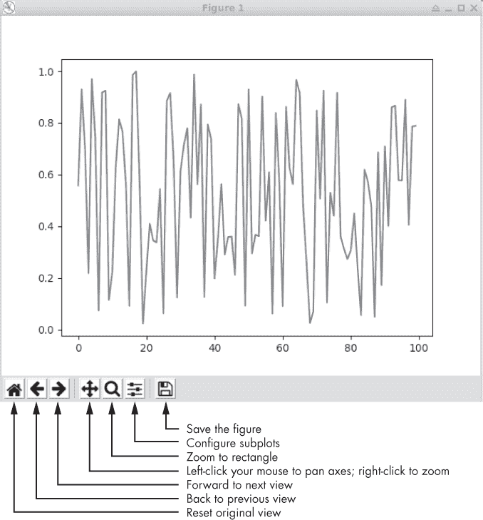

## 第一章：**设置舞台**


尽管本书没有传统的数学练习，但如果我们想掌握这些概念，我们确实需要玩弄一下。我们将有很多机会做到这一点，但我们将使用代码而不是铅笔和纸的练习。

本章将帮助您通过配置我们的工作环境来设置舞台。在整本书中，我将在 Linux 中工作，具体来说是 Ubuntu 20.04，尽管我们所做的大多数工作也可能适用于 Ubuntu 的后续版本和大多数其他 Linux 发行版。为了完整起见，我还包括了配置 macOS 和 Windows 环境的部分。我应该指出，深度学习的预期操作系统是 Linux，大多数事情也可以在 macOS 下工作。Windows 通常是一个次要考虑因素，并且许多深度学习工具包的移植维护不佳，尽管随着时间的推移情况有所改善。

我们将从一些安装预期软件包的说明开始。然后，我们将快速查看 Python 3.*x*中的 NumPy 库。NumPy 是几乎所有 Python 科学用途的基础，并且您需要知道如何在基本水平上使用它。接下来，我将介绍 SciPy。这也是科学上必需的工具包，但在这里我们只需要使用它的一小部分。最后，我会简要介绍 Scikit-Learn 工具包，这里简称为`sklearn`。这个有价值的工具包实现了许多传统的机器学习模型。

在整本书中，我经常使用运行示例来说明概念。所有代码片段都假定执行了以下行：

```py
import numpy as np
```

此外，在某些地方，代码将引用本章前面出现的片段的输出。代码示例很简短，因此从一个到另一个的跟随不应该是繁琐的。我建议在您阅读一章时保持单个 Python 会话运行，尽管这不是必需的。

### 安装工具包

本节的最终目标是安装以下工具包，并且*至少*具有列出的版本号：

+   Python 3.8.5

+   NumPy 1.17.4

+   SciPy 1.4.1

+   Matplotlib 3.1.2

+   Scikit-Learn (`sklearn`) 0.23.2

比这些版本更新的版本几乎肯定也会起作用。

让我们快速看看如何在主要操作系统中安装这些工具包。

#### Linux

对于以下内容，`$`提示符表示命令行，而`>>>`是 Python 提示符。

Ubuntu 20.04 桌面的新安装为我们提供了 Python 3.8.5。使用以下代码

```py
$ cat /etc/os-release
```

验证您的操作系统版本并使用`python3`运行 Python，因为仅使用`python`将启动较旧的 Python 2.7。

这些命令安装了 NumPy、SciPy、Matplotlib 和`sklearn`：

```py
$ sudo apt-get install python3-pip

$ sudo apt-get install python3-numpy

$ sudo apt-get install python3-scipy

$ sudo pip3 install matplotlib

$ sudo pip3 install scikit-learn
```

通过启动 Python 3 并导入每个模块（`numpy`，`scipy`和`sklearn`）来测试安装。然后打印`__version__`字符串以确保它符合或超过上述版本。例如，请参阅以下代码。

```py
>>> import numpy; numpy.__version__

'1.17.4'

>>> import scipy; scipy.__version__

'1.4.1'

>>> import matplotlib; matplotlib.__version__

'3.1.2'

>>> import sklearn; sklearn.__version__

'0.23.2'
```

#### macOS

要为 Macintosh 安装 Python 3.*x*，请访问 *[`www.python.org/`](https://www.python.org/)*，在 **下载** 下选择 **Mac OS X**。然后选择最新的稳定版 Python 3 版本。写这篇文章时，最新版本是 3.9.2。下载完成后，运行安装程序以安装 Python 3.9.2。

安装完成后，打开终端窗口，并通过以下命令验证安装是否成功：

```py
$ python3 --version

Python 3.9.2
```

假设 Python 3 安装正确，现在我们可以使用终端窗口和安装程序为我们设置好的 `pip3` 来安装库：

```py
$ pip3 install numpy --user

$ pip3 install scipy --user

$ pip3 install matplotlib --user

$ pip3 install scikit-learn --user
```

最后，我们可以从 Python 3 内部检查库的版本。输入 **python3** 打开终端中的 Python 控制台，然后导入 `numpy`、`scipy`、`matplotlib` 和 `sklearn` 并打印版本信息，就像上面做的那样，以验证它们是否符合或超过最低版本要求。

#### Windows

要在 Windows 10 上安装 Python 3 和工具包，请按照以下步骤操作：

1.  访问 *[`www.python.org/`](https://www.python.org/)*，点击 **下载** 和 **Windows**。

1.  在页面底部，选择 x86-64 可执行安装程序。

1.  运行安装程序，选择默认选项。

1.  选择 **为所有用户安装** 和 **将 Python 添加到 Windows PATH 中**。这一点很重要。

安装程序完成后，由于我们让安装程序将 Python 添加到 `PATH` 环境变量中，因此可以在命令提示符下使用 Python。打开命令提示符（WINDOWS-R，输入 `cmd`），然后输入 `python`。如果一切顺利，你将看到 Python 启动消息，并出现 `>>>` 交互式提示符。写这篇文章时，安装的版本是 3.8.2。请注意，要退出 Windows 中的 Python，请使用 CTRL-Z，而不是 CTRL-D。

Python 安装程序还贴心地为我们安装了 `pip`。我们可以直接在 Windows 命令提示符下使用它来安装所需的库。在提示符下，输入以下命令来安装 NumPy、SciPy、Matplotlib 和 `sklearn` 库：

```py
> pip install numpy

> pip install scipy

> pip install matplotlib

> pip install sklearn
```

对我来说，这次安装了 NumPy 1.18.1、SciPy 1.4.1、Matplotlib 3.2.1 和 `sklearn` 0.22.2，这些版本符合上面提到的最低要求，因此一切正常。

为了测试，打开命令提示符，启动 Python 并导入 `numpy`、`scipy`、`matplotlib` 和 `sklearn`。这三个库都应该能够正常加载。如果要编写 Python 代码，可以安装任何你喜欢的编辑器，或者直接使用记事本。

在工具包安装并准备就绪后，我们快速了解每个库，至少对它们有一些基本的了解。全书中我们会看到很多例子，但我建议你查看推荐的文档。这样做是值得的。

### NumPy

我们在上一节安装了 NumPy。现在我将介绍一些基本的 NumPy 概念和操作。完整的教程可以在网上找到，网址是 *[`docs.scipy.org/doc/numpy/user/quickstart.html`](https://docs.scipy.org/doc/numpy/user/quickstart.html)*。

启动 Python。然后在提示符下尝试以下操作：

```py
>>> import numpy as np

>>> np.__version__

'1.16.2'
```

第一行加载 NumPy 并为其设置一个快捷名称`np`。使用快捷名称并非强制要求，但几乎是普遍做法。接下来我们会假设使用`np`。第二行显示了版本号，应该至少与上面显示的版本相同。

#### 定义数组

NumPy 操作数组，且非常擅长将列表转换为数组。想象一下在像 C 或 Java 这样的语言中你会遇到什么样的数组。NumPy 提供了一个优势，因为尽管 Python 优雅，但在使用列表模拟数组时，Python 的速度过慢，不适合科学计算。实际的数组要快得多。以下是一个从列表定义数组的示例，然后检查它的一些属性：

```py
>>> a = np.array([1,2,3,4])

>>> a

    array([1, 2, 3, 4])

>>> a.size

    4

>>> a.shape

    (4,)

>>> a.dtype

    dtype('int64')
```

这个示例定义了一个包含四个元素的列表，然后将其传递给`np.array`，将其转换为一个 NumPy 数组。基本的数组属性包括大小和形状。大小是四个元素。形状也是四，作为一个元组，表示`a`是一个向量，属于一维（1D）数组。形状为四是因为数组`a`包含四个元素。如果`a`是二维（2D）数组，形状将包含两个值，分别表示数组的每个轴。请看下面的示例，其中`b`的形状告诉我们`b`有两行四列：

```py
>>> b = np.array([[1,2,3,4],[5,6,7,8]])

>>> print(b)

[[1 2 3 4]

 [5 6 7 8]]

>>> b.shape

(2, 4)
```

#### 数据类型

Python 的数字数据类型有两种类型：任意大小的整数（可以尝试`2**1000`）和浮动点数。然而，NumPy 允许多种不同类型的数组。底层实现中，NumPy 是用 C 语言编写的，因此它支持 C 语言支持的数据类型。上面的示例展示了`np.array`函数接收给定的列表，由于列表中的每个元素都是整数，因此创建了一个每个元素都是有符号 64 位整数的数组。表 1-1 列出了 NumPy 支持的数据类型；我们可以让 NumPy 为我们选择数据类型，也可以显式指定它。

**表 1-1：** NumPy 数据类型名称、C 类型和范围

| **NumPy 名称** | **对应的 C 类型** | **范围** |
| --- | --- | --- |
| float64 | 双精度浮点型 | ±[2.225 × 10^(–308), 1.798 × 10³⁰⁸] |
| float32 | 单精度浮点型 | ±[1.175 × 10^(–38), 3.403 × 10³⁸] |
| int64 | 长长整型 | [–2⁶³, 2⁶³–1] |
| uint64 | 无符号长长整型 | [0, 2⁶⁴–1] |
| int32 | 长整型 | [–2³¹, 2³¹–1] |
| uint32 | 无符号长整型 | [0, 2³²–1] |
| uint8 | 无符号字符型 | [0, 255 = 2²–1] |

让我们来看一些具有特定数据类型的数组示例：

```py
>>> a = np.array([1,2,3,4], dtype="uint8")

>>> a.dtype

dtype('uint8')

>>> a = np.array([1,2,3,4], dtype="int16")

>>> a = np.array([1,2,3,4], dtype="uint32")

>>> b = np.array([1,2,3,4.0])

>>> b.dtype

dtype('float64')

>>> b = np.array([1,2,3,4.0], dtype="float32")

>>> c = np.array([111,222,333,444], dtype="uint8")

>>> c

array([111, 222,  77, 188], dtype=uint8)
```

使用数组`a`的示例采用了整数类型，而使用数组`b`的示例则采用了浮动点类型。注意，第一个`b`示例默认使用了 64 位浮点数。NumPy 这样做是因为输入列表的一个元素是浮动点数（`4.0`）。

最后一个定义数组 `c` 的例子似乎是个 bug，但其实不是。NumPy 不会警告我们如果请求的数据类型无法容纳给定的值。这里，我们有一个 8 位整数，它只能容纳 [0, 255] 范围内的值。前两个，111 和 222，适合，但最后两个，333 和 444，太大了。NumPy 默默地保留了这些值的最低 8 位，分别对应 77 和 188。教训是，NumPy 期望你在处理数据类型时知道自己在做什么。通常这不是问题，但需要记住这一点。

#### 2D 数组

如果一个列表变成了 1D 向量，我们可能会猜测一个列表的列表会变成一个 2D 数组。我们猜得没错：

```py
>>> d = np.array([[1,2,3],[4,5,6],[7,8,9]])

>>> d.shape

    (3, 3)

 >>> d.size

    9

>>> d

    array([[1, 2, 3],

           [4, 5, 6],

           [7, 8, 9]])
```

我们看到，三个子列表被映射为一个 3 × 3 的数组（矩阵）。NumPy 数组的下标从零开始，因此上面引用的 `d[1,2]` 返回 6。

#### 零和一

两个特别有用的 NumPy 函数是 `np.zeros` 和 `np.ones`。它们都根据给定的形状定义数组。第一个将数组元素初始化为零，而第二个将它们初始化为一。这是从头开始创建 NumPy 数组的主要方式：

```py
>>> a = np.zeros((3,4), dtype="uint32")

>>> a[0,3] = 42

>>> a[1,1] = 66

>>> a

array([[ 0,  0,  0, 42],

       [ 0, 66,  0,  0],

       [ 0,  0,  0,  0]], dtype=uint32)

>>> b = 11*np.ones((3,1))

>>> b

array([[11.],

       [11.],

       [11.]])
```

第一个参数是一个元组，给出每个维度的大小。如果我们传入一个标量，结果数组将是一个 1D 向量。我们来看看 `b` 的定义。在这里，我们将 3 × 1 的数组乘以标量（`11`）。这使得数组的每个元素（最初被初始化为 1.0）都被乘以 11。

#### 高级索引

我们在上面的例子中看到了简单的数组索引，我们使用一个单一的值进行索引。NumPy 支持更复杂的数组索引。我们经常使用的一种类型是返回完整子数组的单一索引。下面是一个例子：

```py
>>> a = np.arange(12).reshape((3,4))

>>> a

array([[ 0,  1,  2,  3],

       [ 4,  5,  6,  7],

       [ 8,  9, 10, 11]])

>>> a[1]

 array([4, 5, 6, 7])

>>> a[1] = [44,55,66,77]

>>> a

array([[ 0,  1,  2,  3],

       [44, 55, 66, 77],

       [ 8,  9, 10, 11]])
```

本例介绍了`np.arange`，它是 NumPy 对 Python 的 `range` 函数的等价物。注意使用 `reshape` 方法将 12 元素的向量转换为 3 × 4 的矩阵。同时，注意到 `a[1]` 返回整个子数组，从第一维的第一个索引开始。这种语法是 `a[1,:]` 的简写，其中 `:` 表示给定维度的所有元素。这个简写在赋值时也适用，如下一行所示。

对 Python 列表的切片使用相同的语法也适用于 NumPy。如果我们继续上面的例子，结果如下：

```py
>>> a[:2]

array([[ 0,  1,  2,  3],

       [44, 55, 66, 77]])

>>> a[:2,:]

array([[ 0,  1,  2,  3],

       [44, 55, 66, 77]])

>>> a[:2,:3]

array([[ 0,  1,  2],

       [44, 55, 66]])

>>> b = np.arange(12)

>>> b

array([ 0,  1,  2,  3,  4,  5,  6,  7,  8,  9, 10, 11])

>>> b[::2]

array([ 0,  2,  4,  6,  8, 10])

>>> b[::3]

array([0, 3, 6, 9])

>>> b[::-1]

array([11, 10,  9,  8,  7,  6,  5,  4,  3,  2,  1,  0])
```

我们看到 `a[:2]` 返回前两行，并隐式地对第二维使用 `:`，正如下一行所示。通过第三个命令，我们通过取前两行和前三列，使用 `a[:2,:3]` 获取一个二维子数组。关于 `b` 的例子展示了如何提取每隔一个或每隔三个元素。最后一个例子尤其实用：它使用负增量来反转维度。增量是 -1 来反转所有值。如果增量是 -2，我们将按反向顺序获取 `b` 的每隔一个元素。

NumPy 使用`:`表示特定维度上所有元素。它还允许使用`...`（省略号）作为“根据需要使用多个`:`”的简写。例如，让我们定义一个三维（3D）数组：

```py
>>> a = np.arange(24).reshape((4,3,2))

>>> a

array([[[ 0,  1],

        [ 2,  3],

        [ 4,  5]],

       [[ 6,  7],

        [ 8,  9],

        [10, 11]],

       [[12, 13],

        [14, 15],

        [16, 17]],

       [[18, 19],

        [20, 21],

        [22, 23]]])
```

你可以把数组`a`看作是四个 3 × 2 矩阵的集合。要更新其中的第二个矩阵，你可以使用如下代码：

```py
>>> a[1,:,:] = [[11,22],[33,44],[55,66]]

>>> a

array([[[ 0,  1],

        [ 2,  3],

        [ 4,  5]],

       [[11, 22],

        [33, 44],

        [55, 66]],

       [[12, 13],

        [14, 15],

        [16, 17]],

       [[18, 19],

        [20, 21],

        [22, 23]]])
```

在这里，我们使用`:`显式地指定了维度，并展示了 NumPy 并不挑剔：它知道一个列表的列表符合子数组的预期形状，并相应地更新了数组`a`。我们也可以使用省略号`...`来实现相同的效果，如下所示。

```py
>>> a[2,...] = [[99,99],[99,99],[99,99]]

>>> a

array([[[ 0,  1],

        [ 2,  3],

        [ 4,  5]],

       [[11, 22],

        [33, 44],

        [55, 66]],

       [[99, 99],

        [99, 99],

        [99, 99]],

       [[18, 19],

        [20, 21],

        [22, 23]]])
```

我们现在已经更新了第三个 3 × 2 子数组。

#### 读取和写入磁盘

NumPy 数组可以通过使用`np.save`和`np.load`从磁盘写入和加载，如下所示：

```py
>>> a = np.random.randint(0,5,(3,4))

>>> a

array([[4, 2, 1, 3],

       [4, 0, 2, 4],

       [0, 4, 3, 1]])

>>> np.save("random.npy",a)

>>> b = np.load("random.npy")

>>> b

array([[4, 2, 1, 3],

       [4, 0, 2, 4],

       [0, 4, 3, 1]])
```

在这里，我们使用`np.random.randint`创建一个随机的 3 × 4 整数数组，值的范围在 0 到 5 之间。NumPy 拥有丰富的随机数库。我们将数组`a`保存为`random.npy`文件。`.npy`扩展名是必要的，如果没有提供，系统会自动添加。然后，我们使用`np.load`从磁盘加载该数组。

我们将在本书中遇到其他 NumPy 函数。我会在首次介绍时对它们进行解释。接下来，让我们快速了解一下 SciPy 库。

### SciPy

SciPy 为 Python 添加了大量功能。它在底层使用 NumPy，因此这两个库通常是一起安装的。这里有一个完整的教程：[`docs.scipy.org/doc/scipy/reference/tutorial/index.html`](https://docs.scipy.org/doc/scipy/reference/tutorial/index.html)。

在本书中，我们将重点介绍`scipy.stats`模块中的函数。启动 Python 并尝试以下操作：

```py
>>> import scipy

>>> scipy.__version__

'1.2.1'
```

这会加载 SciPy 模块并验证版本号至少是应该的版本。任何更新的 SciPy 版本应该都能正常工作。

作为快速测试，让我们尝试以下操作：

```py
>>> from scipy.stats import ttest_ind

>>> a = np.random.normal(0,1,1000)

>>> b = np.random.normal(0,0.5,1000)

>>> c = np.random.normal(0.1,1,1000)

>>> ttest_ind(a,b)

Ttest_indResult(statistic=-0.027161815649563964, pvalue=0.9783333836992686)

>>> ttest_ind(a,c)

Ttest_indResult(statistic=-2.295584443456226, pvalue=0.021802794508002675)
```

首先，我们加载 NumPy，然后加载 SciPy 的`stats`模块中的`ttest_ind`函数。该函数接受两组数据，例如两班的考试成绩，并提出问题：这两组数据的平均值是否相同？或者，更准确地说，它问：我们能有多大信心认为这两组数据来自相同的过程？*t 检验*是回答这个问题的经典方法。评估其结果的一种方式是查看*p 值*。你可以将*p 值*理解为如果这两组数据来自相同的生成过程，它们的平均值差异会有多大概率出现。接近 1 的概率意味着我们非常有信心这两组数据来自同一个过程。

变量`a`、`b`和`c`是 1D 数组，其中的值（此处为 1000 个）来自高斯曲线，也称为*正态曲线*。我们稍后会详细讨论这些内容，但现在需要知道的是，这些数字来自一个钟形曲线，其中接近中间的值比靠近边缘的值更有可能被选中。`normal`函数的前两个参数是平均值和标准差，标准差是衡量钟形曲线宽度的指标：标准差越大，曲线越平坦，越宽。

对于这个示例，我们期望`a`和`b`非常相似，因为它们的平均值都是 0.0，尽管钟形曲线的形状略有不同。然而，`c`的平均值为 0.1。我们希望 t 检验能够检测到这一点，并告诉我们，我们需要小心认为`a`和`c`是由相同的过程生成的。

`ttest_ind`函数的输出列出了*p*-值（`pvalue`）。正如我们预期的那样，比较`a`和`b`返回了一个*p*-值为 0.98，意味着在假设这两组数据来自相同的生成过程的情况下，平均值之间的差异的概率大约为 98%。然而，当我们比较`a`和`c`时，得到一个*p*-值为 2.7%（0.027）。这意味着如果`a`和`c`是由相同过程生成的，看到它们之间的差异的概率约为 3%。因此，我们得出结论，`a`和`c`来自不同的过程。我们可以说，这两组数据的差异是*统计学显著*的。

历史上，*p*-值小于 0.05 被认为具有统计学显著性。然而，这一阈值是任意设定的，最近在实验重复性，尤其是软科学领域的经验表明，应该设定更严格的阈值。使用*p*-值为 0.05 意味着你在 20 次中大约会错 1 次（1/20 = 0.05），这是一个过于宽松的阈值。话虽如此，接近 0.05 的*p*-值仍然表明“某些事情”正在发生，更多的调查（以及更大的数据集）是必要的。

### Matplotlib

我们将使用 Matplotlib 来生成图形。这里我们来验证它的 2D 和 3D 绘图能力。首先，展示一个简单的 2D 示例：

```py
>>> import numpy as np

>>> import matplotlib.pylab as plt

>>> x = np.random.random(100)

>>> plt.plot(x)

>>> plt.show()
```

本示例加载了 NumPy，Matplotlib 最适合与其配合使用，并生成一个包含 100 个随机值的向量`x`，值范围在 0, 1)之间，这是`np.random.random`的输出。接着，我们使用`plt.plot`绘制该向量，并用`plt.show`显示它。Matplotlib 的输出是交互式的。可以玩弄图形窗口，熟悉如何使用该窗口。例如，[图 1-1 显示了 Linux 系统中图形窗口的样子。由于该图是随机生成的，你将看到不同的数值序列，但窗口中的控制按钮将保持相同。



*图 1-1：一个示例 Matplotlib 绘图窗口*

对于 3D 图形，试试这个：

```py
>>> from mpl_toolkits.mplot3d import Axes3D

>>> import matplotlib.pylab as plt

>>> import numpy as np

>>> x = np.random.random(20)

>>> y = np.random.random(20)

>>> z = np.random.random(20)

>>> fig = plt.figure()

>>> ax = fig.add_subplot(111, projection='3d')

>>> ax.scatter(x,y,z)

>>> plt.show()
```

我们首先加载 3D 坐标轴工具包、Matplotlib 和 NumPy。然后，使用 NumPy，我们生成三个随机向量，[0, 1)范围内。这些就是我们的 3D 点。通过`plt.figure`和`fig.add_subplot`，我们设置一个 3D 投影。`111`是 Matplotlib 的简写，表示我们需要一个 1×1 的网格，并且当前绘图应放在该网格的第一个位置。因此，`111`表示一个单一的绘图。`projection`关键字使得绘图准备好进行 3D 展示。最后，使用`ax.scatter`绘制散点图，并通过`plt.show`显示出来。与 2D 绘图一样，3D 绘图是交互式的。用鼠标抓住并按住，可以旋转图形。

### Scikit-Learn

本书的目标是讲解深度学习的数学原理，而不是深度学习的实现。然而，偶尔通过简单的神经网络模型会有所帮助。在这些情况下，我们将使用`sklearn`，特别是`MLPClassifier`类。此外，`sklearn`还包含一些有用的工具，用于评估模型的性能和可视化高维数据。

作为一个简单的示例，让我们构建一个简单的神经网络，用于分类手写数字的小型 8×8 像素灰度图像。这个数据集内置于`sklearn`中。以下是示例代码：

```py
   import numpy as np

   from sklearn.datasets import load_digits

   from sklearn.neural_network import MLPClassifier

❶ d = load_digits()

   digits = d["data"]

   labels = d["target"]

   N = 200

❷ idx = np.argsort(np.random.random(len(labels)))

   x_test, y_test = digits[idx[:N]], labels[idx[:N]]

   x_train, y_train = digits[idx[N:]], labels[idx[N:]]

❸ clf = MLPClassifier(hidden_layer_sizes=(128,))

   clf.fit(x_train, y_train)

   score = clf.score(x_test, y_test)

   pred = clf.predict(x_test)

   err = np.where(y_test != pred)[0]

   print("score      : ", score)

   print("errors:")

   print("  actual   : ", y_test[err])

   print("  predicted: ", pred[err])
```

我们首先导入 NumPy。然后从`sklearn`中导入`load_digits`函数，用于返回小的数字图像数据集，以及`MLPClassifier`类，用于训练传统神经网络，即多层感知器。接着，我们获取数字数据，并提取图像及其关联的标签，0 . . . 9❶。数字图像以 8×8 = 64 元素向量的形式存储，表示图像展开后行像素逐一排列。数字数据集包括 1,797 张图像，因此`digits`是一个 2D 的 NumPy 数组，包含 1,797 行，每行 64 列，`labels`是一个包含 1,797 个数字标签的向量。

我们将图像的顺序随机化，注意确保每个标签与对应的数字正确匹配❷，并提取训练和测试数据（`x_train`，`x_test`）及标签（`y_train`，`y_test`）。我们将前 200 张数字图像留作测试数据，并用剩下的 1,597 张图像进行模型训练。这意味着每个数字大约有 160 张图像用于训练，每个数字大约有 20 张图像用于测试。

接下来，我们通过创建`MLPClassifier`的实例来构建模型❸。我们将使用所有默认设置，仅指定单一隐藏层的大小，该层有 128 个节点。输入向量有 64 个元素，因此我们将其大小加倍，以适应隐藏层。无需显式指定输出层的大小；`sklearn`会根据`y_train`中的标签来推断。训练模型只需简单地调用`clf.fit`，并传入训练图像向量（`x_train`）和标签（`y_train`）。

对于像这样的一个小数据集，训练只需要几秒钟。当训练完成后，学习到的权重和偏差会存储在模型（`clf`）中。我们首先获取得分，整体准确率（`score`），然后是测试集上的实际模型类标签预测（`pred`）。通过查找实际标签（`y_test`）与预测结果不匹配的地方，任何错误都会被捕捉到`err`中。最后，我们展示错误的实际类标签和预测标签。

每次运行这段代码时，我们都会得到不同的数字数据排序，这导致了不同的训练集和测试集。此外，神经网络在训练前是随机初始化的。所以，每次我们都会得到不同的结果。我第一次运行这段代码时，整体得分为 0.97（97%的准确率）。如果通过猜测来预测，准确率大约为 10%，因此我们可以说模型已经学得相当不错了。

### 总结

在本章中，我们学习了如何配置我们的工作环境。接着，我从高层次介绍了我们的 Python 工具包，并提供了进一步学习的指引。在工作环境安全并繁荣发展的基础上，下一章将深入探讨概率论。
