## 第二章：概率**

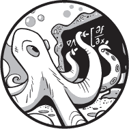

概率影响着我们生活的方方面面，但实际上，我们在这方面都做得不好，正如本章中的一些例子所展示的那样。我们需要学习概率学才能掌握它。而我们需要掌握它，因为深度学习广泛涉及概率论的概念。概率无处不在，从神经网络的输出到不同类别在现实中出现的频率，再到用于初始化深度网络的分布。

本章的目标是让你了解在深度学习中你会经常遇到的与概率相关的概念和术语。我们将从概率的基本概念开始，并介绍随机变量的概念。接着我们将讨论概率的基本规则。这些部分涵盖了基础知识，为我们后续讨论*联合概率与边际概率*奠定基础。在你深入探索深度学习时，你会一遍又一遍地遇到这些术语。一旦你掌握了如何使用联合概率和边际概率，我将介绍本书中讨论的两个链式法则中的第一个。第二个在第六章的微积分部分中讨论。我们将在第三章继续研究概率。

### 基本概念

一个*概率*是一个介于零和一之间的数字，用来衡量某件事发生的可能性。如果某件事不可能发生，那么它的概率就是零。如果某件事肯定会发生，那么它的概率就是一。我们通常以这种方式表达概率，尽管在日常生活中，人们似乎不喜欢说“明天下雨的概率是 0.25”。相反，我们会说“明天下雨的几率是 25%”。在日常口语中，我们将分数概率转换为百分比。在本章中我们也会这样做。

上一段使用了多个与概率相关的词汇：*可能性*、*机会*和*确定性*。在日常使用中这样表达是可以的，甚至在深度学习中也是如此，但当我们需要明确时，我们将坚持使用*概率*，并将其以零到一之间的数字表示，范围为[0, 1]。方括号表示上下限都包括在内。如果范围内不包括某个限值，则使用普通括号。例如，NumPy 函数`np.random.random()`返回一个伪随机的浮点数，范围是[0, 1)。因此，它可能返回零，但永远不会返回一。

接下来，我将介绍样本空间、事件和随机变量的基础概念。最后，我会给出一些关于人类如何在概率上犯错的例子。

#### 样本空间和事件

简单来说，*样本空间* 是一个离散集合或连续范围，表示一个事件的所有可能结果。*事件* 是发生的事情，通常是某个物理过程的结果，比如硬币的翻转或骰子的掷出。我们将所有可能的事件归纳在一起，形成我们正在处理的样本空间。每个事件都是样本空间中的一个*样本*，而样本空间则代表*所有*可能的事件。让我们来看几个例子。

硬币翻转的可能结果是正面（H）或反面（T）；因此，硬币翻转的样本空间是集合 {H, T}。标准骰子掷出的样本空间是集合 {1, 2, 3, 4, 5, 6}，因为排除骰子在其边缘停留的情况，当骰子停止移动时，六个面中的一个会在顶部。这些是离散样本空间的例子。在深度学习中，大多数样本空间是连续的，它们由浮点数组成，而不是整数或集合的元素。例如，如果神经网络的某个特征输入可以取值于区间 [0, 1]，那么 [0, 1] 就是该特征的样本空间。

我们可以询问某些事件发生的可能性。例如，对于一个硬币，我们可以问，硬币翻转后正面朝上的概率是多少？直观地讲，假设硬币没有偏重，也就是说两面出现的可能性相等，我们可以说正面朝上的概率是 50%。那么正面朝上的概率就是 0.5（以百分比表示为 50%）。我们可以看到，反面朝上的概率也是 0.5。最后，由于正面和反面是唯一的可能结果，我们发现所有可能结果的概率和为 0.5 + 0.5 = 1.0。概率*总是*加起来等于 1.0，覆盖所有可能的样本空间值。

那么，掷一个六面骰子得到四点的概率是多少呢？同样的，掷骰子的每一面没有偏重，只有六个面中的一个面有四个点，所以概率是六分之一，1/6 ≈ 0.166666... 或大约 17%。

#### 随机变量

让我们用一个变量*X*表示硬币翻转的结果。*X* 是所谓的*随机变量*，一个从其样本空间中取值并具有一定概率的变量。因为这里的样本空间是离散的，*X* 是一个*离散随机变量*，我们用大写字母表示。对于硬币，*X* 为正面的概率等于 *X* 为反面的概率，都是 0.5。为了正式地表达这个，我们使用：

*P*(*X* = 正面) = *P*(*X* = 反面) = 0.5

其中*P*是普遍用于表示括号内指定随机变量事件的概率。*连续随机变量*是指来自连续样本空间的随机变量，通常用小写字母表示，比如*x*。我们通常讨论的是随机变量位于样本空间某个范围内的概率，而不是一个特定的实数。例如，如果我们使用 NumPy 的`random`函数返回一个 0, 1)范围内的值，我们可以问：它返回值落在[0, 0.25)范围内的概率是多少？由于任何数字的返回概率和其他数字一样，我们可以说，落在该范围内的概率是 0.25，或者 25％。

#### 人类在概率上很差

我们将在下一节深入探讨概率的数学。但在此之前，让我们先看看两个涉及概率的例子，看看人类在这方面有多糟糕。这两个例子都曾让专家们感到困惑，这并不是因为专家们缺乏能力，而是因为我们对概率的直觉常常是完全错误的，甚至专家们也是彻底的人类。

##### 蒙提·霍尔难题

这个问题是我特别喜欢的一个，因为它甚至让拥有高级学位的数学家感到困惑。这个难题来源于一个美国的老牌游戏节目《*让我们来交易*》。节目的原主持人蒙提·霍尔会从观众中选出一个人，展示三扇标有 1、2 和 3 的封闭大门。其中一扇门后面藏着一辆新车，另外两扇门后面则是一些搞笑奖品，比如一只活山羊。

参赛者被要求选择一扇门。然后，霍尔会要求打开参赛者没有选择的其中一扇门，通常是那扇没有新车的门。当观众停止笑声后，霍尔会问参赛者是否愿意坚持原先选择的门，还是更愿意将选择换成剩下的那扇门。这个难题其实就是：他们是保留最初的选择，还是换到剩下的门？

如果你想思考一下这个问题，尽管去做。放下书本，走一走，拿出铅笔和纸，做些笔记，然后，当你有了答案（或放弃了），继续往下读……

这里是正确答案：换门。如果你换，你将在 2/3 的情况下赢得汽车。如果你不换，你只有 1/3 的机会赢得汽车，因为最初选择正确的概率就是 1/3：从三个选项中选一个正确的。

当玛丽莲·沃斯·萨凡特在 1990 年于《*Parade*》杂志专栏中提出这个问题并指出正确的解答是换门时，她收到了大量的来信，很多来自数学家，其中一些愤怒地坚持认为她错了。她并没有错。验证她正确的一种方法是使用计算机程序来模拟这个游戏。我们这里不开发代码，但并不难。如果你编写并运行它，你会看到随着模拟游戏次数的增加，换门时赢的概率趋近于 2/3。然而，我们也可以通过常识和基本的概率理论来理解解决方案。

首先，如果我们不换门，我们知道赢得汽车的概率是 1/3。现在，考虑一下换门时会发生什么。如果我们换门，唯一可能*失败*的情况是我们最初选择了正确的门。为什么？假设我们最初选择了一个假奖门。霍尔知道车在哪个门后，他永远不会打开有车的门。由于我们已经选择了一个假门，他被迫选择剩下的假门并为我们打开，这样就能确保车在唯一剩下的门后面。如果我们换门，我们就能赢。因为有两个门没有车，所以我们最初选错门的机会是 2/3。然后我们刚刚看到，如果我们最初选择错门并在有机会时换门，我们就会赢得汽车。因此，通过改变我们的猜测，我们有 2/3 的机会赢得汽车。换门失败的 1/3 概率，当然是指我们最初选择了正确的门的情况。

##### 癌症还是非癌症？

这个例子出现在几本关于概率和统计的流行书籍中（例如，乔尔·贝斯特的《更多可恶的谎言与统计数据》（*More Damned Lies and Statistics*，UC Press，2004 年）和伦纳德·莫洛迪诺的《醉汉的步伐》（*The Drunkard’s Walk*，Pantheon，2008 年））。它基于一项实际的研究。任务是确定一位 40 多岁的女性在做了阳性乳腺 X 光检查后，她患有乳腺癌的概率。请注意，以下的数字可能在研究进行时是准确的，但现在可能不再有效，请仅将其视为一个示例。

我们被告知以下内容：

1.  一位 40 多岁女性患有乳腺癌的概率是 0.8%（每 1,000 人中有 8 人）。

1.  一位患有乳腺癌的女性在做乳腺 X 光检查时，出现阳性结果的概率是 90%。

1.  一位*没有*乳腺癌的女性在做乳腺 X 光检查时，出现阳性结果的概率是 7%。

一位女性来到诊所进行筛查，乳腺 X 光结果为阳性。根据我们得到的信息，她实际上患有乳腺癌的概率是多少？

根据上述#1，我们知道如果我们随机选择 1,000 位 40 多岁的女性，其中平均会有 8 位患乳腺癌。因此，在这 8 位女性中，90%（即上述#2）会有阳性乳腺 X 光检查结果。这意味着 7 位患癌症的女性会有阳性乳腺 X 光检查结果，因为 8 × 0.9 = 7.2。剩下的 1,000 位中没有乳腺癌的女性有 992 位。根据上述#3，992 × 0.07 = 69.4，因此 69 位没有乳腺癌的女性也会有阳性乳腺 X 光检查结果，总共有 7 + 69 = 76 个阳性乳腺 X 光检查结果，其中 7 个是实际的癌症病例，69 个是假阳性结果。因此，阳性乳腺 X 光检查结果表示癌症的概率为 7/76，即 0.092——大约 9%。

医生在面对这个问题时给出的中位数估计是癌症的概率大约为 70%，其中超过三分之一的人给出了 90%的估计。对人类而言，概率是难以掌握的，尤其是对于那些有大量训练的人。医生的错误在于没有正确考虑到随机选择一位 40 多岁的女性患乳腺癌的概率。在[第三章中，我们将看到如何使用贝叶斯定理计算这一结果，贝叶斯定理考虑了这个概率。

现在，让我们从直觉转向数学的严谨性。

### 概率规则

让我们从概率的基本规则开始。这些是我们在接下来的章节中以及更远的章节中需要用到的基础规则。我们将学习事件的概率、概率的和规则，以及条件概率的含义。之后，乘积规则将帮助我们解决生日悖论。在生日悖论中，我们将看到如何计算在一个房间里，至少有两个人共享生日的概率超过 50%的最小人数。答案比你想象的要少。

#### 事件的概率

我们之前提到过，样本空间中所有概率的总和为 1。这意味着样本空间中的任何事件的概率始终小于或等于 1，因为该事件来自样本空间，而样本空间包含所有可能的事件。这意味着，对于任何事件*A*，

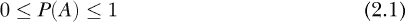

并且，对于样本空间中的所有事件*A[i]*，

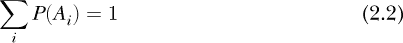

其中∑（sigma）表示对右边表达式中的每个*i*进行求和。可以将右边的表达式视为 Python 中`for`循环的循环体。

如果我们掷一个六面骰子，我们直观上（并且正确地）理解到得到任意值的概率是相同的：六种可能中的一种，或者 1/6。因此，方程 2.1 告诉我们，*P*(1)，掷出 1 的概率在 0 和 1 之间。这是因为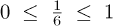。此外，方程 2.2 告诉我们，样本空间中所有事件的概率之和必须是 1。这对于六面骰子同样成立，因为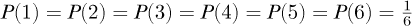和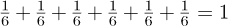。

如果事件发生的概率是*P(A)*，那么事件*A 不发生*的概率是

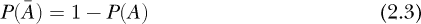

其中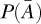表示“不是*A*”。被称为*A*的*补集*。有时你会看到写作*P*(¬*A*)，其中¬是“非”运算符的逻辑符号。

方程 2.3 来自方程 2.1 和方程 2.2，因为事件的概率小于 1，而样本空间中任何事件的发生概率是 1，所以非*A*事件发生的概率必须是 1 减去事件*A*发生的概率。

例如，在掷骰子时，得到[1, 6]范围内的任何值的概率是 1，但得到四点的概率是 1/6。所以，*不*掷出四点的概率就是去掉掷出四点的概率后剩下的概率。

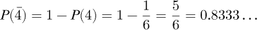

这意味着我们有 83%的概率不会掷出四点。

如果我们掷两个骰子并求和，会怎样呢？样本空间是从 2 到 12 的整数集合。然而，在这种情况下，每个和的出现概率并不相同，这种情况正是赌场游戏“掷骰子”中的核心。例如，我们通过列举所有可能的情况来计算每个和的概率。通过计算事件发生的方式数并除以事件的总数，我们可以确定概率。表 2-1 显示了生成每个和的所有可能方式。

**表 2-1：** 两个骰子产生不同和的组合数

| **和** | **组合** | **计数** | **概率** |
| --- | --- | --- | --- |
| 2 | 1 + 1 | 1 | 0.0278 |
| 3 | 1 + 2, 2 + 1 | 2 | 0.0556 |
| 4 | 1 + 3, 2 + 2, 3 + 1 | 3 | 0.0833 |
| 5 | 1 + 4, 2 + 3, 3 + 2, 4 + 1 | 4 | 0.1111 |
| 6 | 1 + 5, 2 + 4, 3 + 3, 4 + 2, 5 + 1 | 5 | 0.1389 |
| 7 | 1 + 6, 2 + 5, 3 + 4, 4 + 3, 5 + 2, 6 + 1 | 6 | 0.1667 |
| 8 | 2 + 6, 3 + 5, 4 + 4, 5 + 3, 6 + 2 | 5 | 0.1389 |
| 9 | 3 + 6, 4 + 5, 5 + 4, 6 + 3 | 4 | 0.1111 |
| 10 | 4 + 6, 5 + 5, 6 + 4 | 3 | 0.0833 |
| 11 | 5 + 6, 6 + 5 | 2 | 0.0556 |
| 12 | 6 + 6 | 1 | 0.0278 |
|  |  | 36 | 1.0000 |

在表 2-1 中，两个骰子的可能组合有 36 种。我们看到，最可能的和是 7，因为有六种组合的点数和为 7。最不可能的是 2 和 12；这两种情况各只有一种可能。如果有六种方式可以得到和为 7，那么得到 7 的概率是“36 中有 6”，即 6/36 ≈ 0.1667。我们将在下一章讨论概率分布和贝叶斯定理时回到表 2-1。表 2-1 展示了一个普遍的规则：如果我们可以列举样本空间，那么就可以计算特定事件的概率。

作为最后一个例子，如果你同时掷三枚硬币，得到零个、一个、两个或三个正面的概率是多少？我们可以列举可能的结果并观察。结果如下：

| **正面** | **组合** | **计数** | **概率** |
| --- | --- | --- | --- |
| 0 | TTT | 1 | 0.125 |
| 1 | HTT, THT, TTH | 3 | 0.375 |
| 2 | HHT, HTH, THH | 3 | 0.375 |
| 3 | HHH | 1 | 0.125 |
|  |  | 8 | 1.000 |

从这个表格中，我们可以看出，掷三枚硬币时，得到一个或两个正面的概率是相同的：37.5%。我们可以通过一些代码来验证这一点：

```py
import numpy as np

N = 1000000

M = 3

heads = np.zeros(M+1)

for i in range(N):

    flips = np.random.randint(0,2,M)

    h, _ = np.bincount(flips, minlength=2)

    heads[h] += 1

prob = heads / N

print("Probabilities: %s" % np.array2string(prob))
```

代码运行了 1,000,000 次测试（`N`），模拟了三枚硬币的投掷（`M`）。每次测试中，0、1、2 或 3 个正面的出现次数存储在`heads`中。每次测试选择三个值[0, 1]（`flips`），并计算出现多少个正面（即零）。我们使用`np.bincount`来实现这一点，并丢弃反面的数量。然后统计正面的数量，并进行下一组投掷。

当所有`N`次模拟完成后，我们通过除以运行的模拟次数(`prob`)将正面的数量转化为概率。最后，我们打印出对应的概率。对于零个、一个、两个或三个正面，一次运行的结果如下：

```py

Probabilities: [0.125236, 0.3751, 0.37505, 0.124614]

```

这些结果与我们之前计算的概率非常接近，因此我们有信心认为我们的计算是正确的。

#### 求和规则

我们先从定义开始：如果两个事件*A*和*B*不能同时发生，意思是要么*A*发生，要么*B*发生，我们称这两个事件是*互斥的*。例如，抛硬币时，要么是正面，要么是反面；它不可能同时是正面*和*反面。互斥事件意味着如果事件*A*发生了，那么事件*B*就被排除，反之亦然。此外，如果两个事件发生的概率完全不相关，也就是说事件*A*的概率不受事件*B*是否发生的影响，我们称这两个事件是*独立的*。

求和法则关注的是多个互斥事件发生的概率。它告诉我们其中一个事件发生的概率。例如，掷标准骰子得到四或五的概率是多少？我们知道掷出四的概率是 1/6，掷出五的概率也是 1/6。由于这些事件是互斥的，我们可以直观地理解得到四 *或* 五的概率是它们的和，因为四和五作为结果都是样本空间的一部分，而且要么四发生，要么五发生，或者两者都不发生。所以，我们得到以下结论：

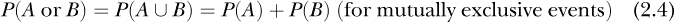

这里 ∪ 代表“或”或“并集”。你会经常看到 ∪。对于标准骰子，掷出四或五的概率是 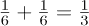，大约是 33%。

两次投掷硬币的样本空间是 {HH, HT, TH, TT}；因此，得到两个正面或两个反面的概率是：

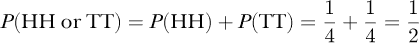

求和法则还有更多内容，但在我们能看到之前，需要先考虑乘法法则。

#### 乘法法则

求和法则告诉我们事件 *A* 或 *B* 发生的概率。乘法法则则告诉我们事件 *A 和 B* 发生的概率：

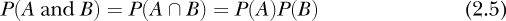

这里 ∩ 代表“且”或“交集”。

如果事件 *A* 和 *B* 是互斥的，我们会立即看到 *P*(*A* ∩ *B*) = 0，因为如果事件 *A* 发生的概率是 *P*(*A*)，那么事件 *B* 的概率是 *P*(*B*) = 0，它们的乘积也为零。如果事件 *B* 发生，那么 *P*(*A*) = 0，情况也是如此。

当然，并不是所有事件都是互斥的。例如，假设全球有 80% 的人有棕色眼睛，50% 的人是女性。那么，随机选取一个人是棕色眼睛的女性的概率是多少？我们可以使用乘法法则，

*P*(女性, 棕色眼睛) = *P*(女性)*P*(棕色眼睛) = 0.5(0.8) = 0.4

可以看到，随机选取一个人是棕色眼睛的女性的概率是 40%。

如果我们稍微思考一下，乘法法则就能理解了。计算女性这一事件的概率不会改变这些女性中拥有棕色眼睛的比例。一个事件，女性，并不影响另一个事件，棕色眼睛。

乘法法则不仅限于两个事件。考虑以下情况。根据保险公司数据，在美国，任何一年内被雷击的概率大约是 1/1,222,000，或者 0.000082%。那么，假设你住在美国，成为棕色眼睛女性并在任何一年内被雷击的概率是多少？我们可以再次使用乘法法则：

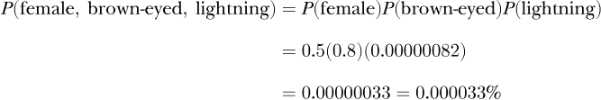

美国的人口大约是 3.31 亿，其中 0.000033%是今年会被闪电击中的棕眼女性：根据我们上面的计算是 109 人。根据美国国家气象局的统计，每年大约有 270 人会被闪电击中。正如我们上面所看到的，其中 40%的人是棕眼女性，这样计算得出 270(0.4) = 108。所以，我们的计算完全可信。

#### 求和规则回顾

我们上面提到过求和规则还有更多内容。现在让我们看看上面我们遗漏了什么。公式 2.4 给出了互斥事件*A*和*B*的求和规则。如果事件不是互斥的呢？在这种情况下，求和规则需要进行修改：

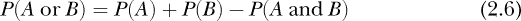

让我们看一个例子。

一位考古学家发现了一小批 20 枚古币。他注意到其中 12 枚是罗马币，8 枚是希腊币。他还注意到 6 枚罗马币和 3 枚希腊币是银币。其余的都是青铜币。那么，从这批硬币中选出一枚银币或罗马币的概率是多少？

如果我们认为银币和罗马币是互斥的，我们可能会倾向于说出以下结论：

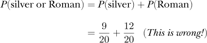

然而，两个概率的和是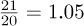，而我们*不能*有大于 1 的概率。显然有什么不对劲。

问题在于，硬币堆中有一些是银制的罗马币。我们已经将它们计算了两次——一次在*P*（银币）中，再次在*P*（罗马币）中——因此现在我们需要从总和中减去它们。共有 6 枚银制罗马币。所以，成为银制罗马币的概率是*P*（银币且罗马币）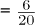。减去这部分后，我们可以看到选出银币或罗马币的概率是 75%：

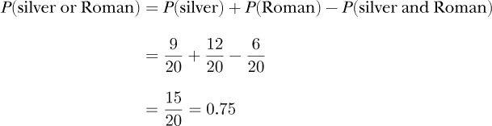

和求和规则一样，乘法规则还有更多内容，我们稍后会讲解。但是首先，让我们用乘法规则看看能否解决生日悖论。

#### 生日悖论

平均而言，我们需要将多少人聚集在一个房间里，才能让其中两人有超过 50%的概率共享同一天生日？这个问题被称为*生日悖论*。让我们看看能否利用概率的乘法规则来求解这个问题。

我们忽略闰年，并假设一年有 365 天。直观上，我们可以看到，随机选择的人共享同一天生日的概率是 1 天（共享生日）/365 个可能的生日。因此，样本空间是 365 天，而共享的生日是其中的 1 天。所以，我们得到如下结果：

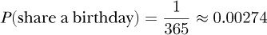

他们要么共享生日，要么不共享生日：1 – 1/365 = 365/365 – 1/365 = 364/365。因此，我们得到如下结果：

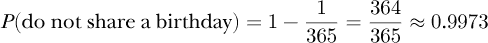

在一年中的 365 天里，有一天可能是匹配的，剩下的 364 天则不匹配。

随机选择的人共享生日的概率为 0.3%，这相当低。意味着如果你随机选择人对并询问他们是否有相同的生日，平均每千对会有三对是匹配的——这并不太可能发生。

对于我们的计算，我们将反过来看待这个问题。我们需要找出多少人集合在一起，才能使得两个人没有共享生日的概率低于 50%。

我们知道两个人随机选择没有共享生日的概率：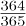。因此，如果我们随机选择两对人，两对人都没有共享生日的概率如下：

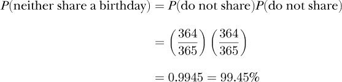

在这里，我们使用乘法法则。同样地，对于三个人，*(A*, *B*, *C*)，我们可以形成三对不同的组合，*(A*, *B*)，(*A*, *C*) 和 (*B*, *C*)，所以我们可以计算如下：

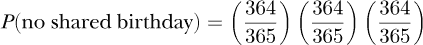

对于 *n* 次比较，这里是没有人共享生日的概率：

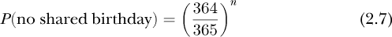

我们的任务是找到最小的比较次数，*n*，使得没有共享生日的概率小于 50%，其中 *n* 是房间里人数 *m* 的函数。为什么小于 50%？因为如果我们找到一个 *n*，使得没有共享生日的概率小于 50%，那么共享生日的概率必定大于 50%。

如果你随机挑选三个人，就有三对人需要检查是否有共同的生日。如果有四个人，就有六对。也就是说，人数越多，组合对数越多。我们能否找到一个规则，将人数 *m* 映射到需要比较的对数 *n* 上呢？如果找到了，我们就可以找到最小的 *m*，使得在该人数下的 *n*，公式 2.7 的概率小于 50%。

当我们有 *m* 个独特的物体（例如房间里的人员），并且我们选择它们的组合时，我们可以选择多少种不同的组合？换句话说，*m* 个物体两两组合有多少种可能？计算 *m* 个物体中选择 *k* 个的组合数的公式是：

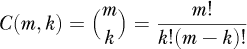

你有时会听到这个叫做“*m* 选 *k*”，对于我们来说，*k* = 2。让我们找到所需的比较次数 *n*，并使用两两组合的公式来找出一个 *m*，使得我们至少有 *n* 次比较。

一个简单的 Python 循环可以找到我们需要的 *n*：

```py
for n in range(300):

    if ((364/365)**n < 0.5):

        print(n)

        break
```

我们知道 *n* = 253。所以，我们需要平均进行 253 次比较，即 253 对人，才能有超过 50%的机会让这些人中某一对共享生日。最后一步是找出 *m* 个人数中，至少有 253 种两两组合的数量。通过一些暴力试验和错误，我们得到了以下结果：

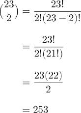

我们平均需要 *m* = 23 人，才能有超过 50%的概率至少有两个人的生日相同。这一切都要归功于乘法规则。

我们的结果可靠吗，还是只是手法巧妙？有些代码可以告诉我们。首先，让我们通过模拟验证随机挑选到两个生日相同的人概率为 0.3%：

```py
match = 0

for i in range(100000):

    a = np.random.randint(0,364)

    b = np.random.randint(0,364)

    if (a == b):

        match += 1

print("Probability of a random match = %0.6f" % (match/100000,))
```

这段代码模拟了 100,000 对随机人物，其中[0, 364]之间的随机整数代表某个人的生日。如果两个人的生日相同，则`match`会增加。所有模拟完成后，我们会打印出概率。这段代码的运行结果如下，这让我们对 0.3%的概率的断言变得可信：

```py

Probability of a random match = 0.003100

```

那么，至少要有多少人才能使共享生日的概率大于 50%呢？这里我们有两个循环。第一个是遍历房间内的人数（`m`），第二个是遍历该人数下的模拟次数（`n`）。在代码中，它看起来是这样的：

```py
for m in range(2,31):

    matches = 0

    for n in range(100000):

        match = 0

        b = np.random.randint(0,364,m)

        for i in range(m):

            for j in range(m):

                if (i != j) and (b[i] == b[j]):

                    match += 1

        if (match != 0):

            matches += 1

    print("%2d %0.6f" % (m, matches/100000))
```

我们让`m`的值从 2 到 30 人变化。对于每一组`m`人，我们运行 100,000 次模拟。每次模拟中，我们为每个人（`b`）挑选一个生日，然后将每个人与其他所有人进行比较，看看是否有生日相同。如果有相同的生日，则`match`增加。如果至少有一次匹配，我们就增加`matches`并进入下一个模拟。最后，当当前人数的所有模拟完成时，我们会打印出至少有一次匹配的概率。

如果我们运行代码并绘制输出，我们得到图 2-1，其中虚线表示 50%的概率。第一个超出虚线的点是 23 人，正是我们之前计算的结果。

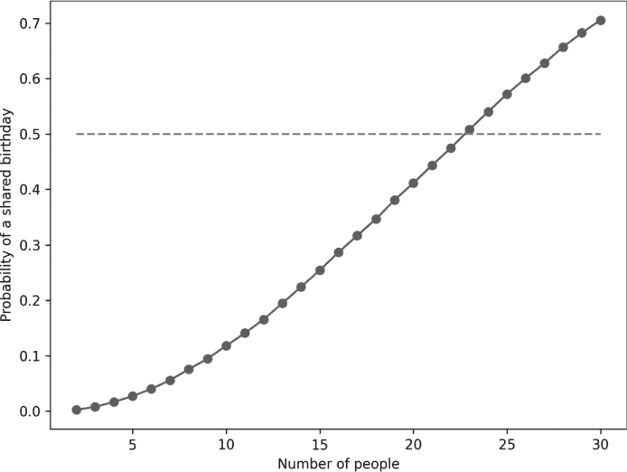

*图 2-1：共享生日的概率与房间人数的关系*

看到模拟结果与数学结果一致总是令人满意的。

#### 条件概率

假设有一个装有 10 颗弹珠的袋子：8 颗红色和 2 颗蓝色。我们知道，从袋子里随机挑选一颗弹珠，挑中蓝色弹珠的概率是 2/10，或者 20%。假设我们挑选到了蓝色弹珠。在欣赏它漂亮的蓝色后，我们将其放回袋中，摇动袋子，再抽出一颗弹珠。我们第二次挑选到蓝色弹珠的概率是多少？再次，因为袋中仍有 2 颗蓝色弹珠，总共有 10 颗弹珠，所以概率仍然是 20%。

如果事件 *A* 发生（这里是挑选了一颗蓝色弹珠并将其放回袋中）没有影响未来事件 *B* 的概率，那么这两个事件是独立的。我们第二次挑选到蓝色弹珠的机会不会受到之前挑选到蓝色弹珠的影响。同样的道理也适用于投掷硬币。我们连续四次正面朝上的事实与下一次投掷得到反面的概率无关，前提是假设硬币是公平的，也就是说它没有偏向某一面，或者是双正面（或双反面）。

现在，考虑一个替代场景。我们仍然有一个装有八颗红色弹珠和两颗蓝色弹珠的袋子。我们拿出一颗弹珠——假设这次是红色的——因为我们喜欢这种颜色，所以我们保留这颗弹珠并将其放在一边。现在，我们从袋子里拿出另一颗弹珠。再拿到一颗红色弹珠的概率是多少？在这里，情况发生了变化。现在有 9 颗弹珠，其中 7 颗是红色的。所以，拿到第二颗红色弹珠的概率现在是 9 分之 7，即 78%。最初拿到红色弹珠的概率是 10 分之 8，即 80%。事件*A*的发生，即我们拿到了并保留了一颗红色弹珠，改变了第二个事件的概率。这两个事件不再是独立的。第二个事件的概率被第一个事件的发生所改变。从符号上来说，我们写作*P**(B*|*A*)，意味着在事件*A*发生的条件下事件*B*发生的概率。这是一个*条件概率*，因为它是基于事件*A*发生的条件。

这里是我们更新乘法法则的地方。方程 2.5 中的版本假设两个事件是独立的，比如性别是女性和眼睛是棕色的。如果我们遇到依赖关系的情况，规则变为：

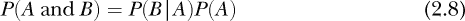

这意味着两个事件同时发生的概率是其中一个事件在另一个事件发生的条件下发生的概率与另一个事件发生的概率的乘积。

回顾我们上面的弹珠例子，我们计算了在已经拿走并保留了一颗红色弹珠之后，再拿到一颗红色弹珠的概率为 9 分之 7，约为 78%。那就是*P**(B*|*A*)。对于*P(A*)，我们需要计算最初拿到红色弹珠的概率，我们说这是 80%。因此，拿到一颗红色弹珠并保留它（*A*）以及第二次抽到一颗红色弹珠（*B*）的概率是 62%：

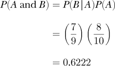

如果两个事件是互斥的，*P**(B*|*A*) = *P*(*A*|*B*) = 0。如果事件*A*和*B*是独立的，那么*P*(*A*|*B*) = *P*(*A*)，*P*(*B*|*A*) = *P*(*B*)，因为条件事件是否发生对后续事件没有影响。

最后，请注意，通常*P**(B*|*A*) ≠ *P*(*A*|*B*)，混淆这两个条件概率是一个常见且经常是严重的错误。正如我们将在第三章中看到的，贝叶斯定理给出了条件概率之间的正确关系。当我们讨论概率的链式法则时，我们将再次遇到条件概率。

#### 总概率

如果我们的样本空间被划分为不相交的区域，*B[i]*（*B*[1]、*B*[2]等），使得样本空间的总和由所有的*B[i]*组成，并且这些*B[i]*之间没有重叠，我们可以按如下方式计算事件在所有划分上的概率：

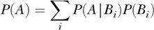

这里的*P**(A*|*B[i]*)是条件概率，表示在*B[i]*条件下发生*A*的概率，而*P*(*B[i]*)是*B[i]*的概率，它表示样本空间中*B[i]*所代表的部分。在这种情况下，*P**(A*)是*A*在所有*B[i]*分区下的*总概率*。让我们来看一个如何使用这个法则的例子。

你有三座城市，Kish、Kesh 和 Kuara，分别拥有 2000 人、1000 人和 3000 人。此外，这三座城市中拥有蓝眼睛的比例分别是 12%、3%和 21%。我们想知道从这些城市中随机选择一位居民，该居民拥有蓝眼睛的概率是多少。城市的人口影响着这个概率，因为不同城市的蓝眼睛概率不同，而各城市的人口也不相同。为了求得*P*(blue)，我们需要使用总概率法则：

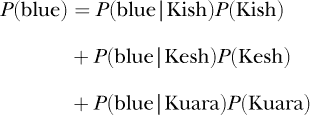

这里的*P*(blue|Kish)表示在你住在 Kish 的前提下，拥有蓝眼睛的概率，而*P*(Kish)是住在 Kish 的概率，依此类推。

我们知道了所需的量来计算总概率。每个城市的蓝眼睛概率如上所示，而每个城市的居民比例则由该城市人口与三座城市总人口之比得出：

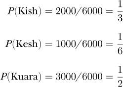

因此，*P*(blue)是

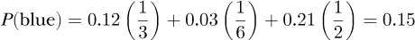

这意味着随机选取的三座城市中的一位居民有 15%的机会拥有蓝眼睛。请注意，选择这些城市的概率总和为：*P*(Kish) + *P*(Kesh) + *P*(Kuara) = 1\. 这是因为对总样本空间（所有城市居民）进行划分时，所有城市的划分必须覆盖整个样本空间。

### 联合概率与边缘概率

两个变量的*联合概率*，*P**(X* = *x*, *Y* = *y*)，是指随机变量*X*在*Y*为*y*的情况下，*X*为*x*的概率。我们之前已经看到过一个联合概率的例子。当我们在计算概率时使用“和”时，实际上我们就是在计算联合概率。联合概率是多个条件同时成立的概率，即“和”的概率。*边缘概率*是指在不考虑其他条件的情况下，计算其中一个或多个条件的概率；换句话说，就是在“和”的条件下计算某一子集的概率。

在本节中，我们将通过简单的表格来研究联合概率和边缘概率。然后，我们将介绍概率的链式法则。这个法则让我们可以将联合概率分解成更小的联合概率和条件概率的乘积。

#### 联合概率表

根据色盲意识组织（*[`www.colourblindawareness.org/`](http://www.colourblindawareness.org/)*）的资料，大约每 12 个男性中就有 1 人是色盲，而每 200 个女性中就有 1 人是色盲。之所以会有差异，是因为导致色盲的基因位于 X 染色体上，女性需要同时从母亲和父亲继承该隐性基因，而男性只需从一个父母那里继承该基因。

假设我们对 1,000 人进行调查。我们可以计算出男性且色盲、女性且色盲、男性且非色盲、女性且非色盲的人数。我们完成这个统计并将数据安排成如下表格：

|  | **色盲** | **非色盲** |
| --- | --- | --- |
| **男性** | 42 | 456 | 498 |
| **女性** | 3 | 499 | 502 |
|  | 45 | 955 | 1000 |

这种表格被称为*列联表*。统计数据位于表格中间的 2 × 2 数值区域。最右边一列是每行的总和，最后一行是每列的总和。最后一行或最后一列的总和位于最后一个单元格，并且必然总和为我们调查的 1,000 人。

我们可以通过将每个单元格除以 1,000（即调查的总人数）来将列联表转化为概率表。这样得到的结果如下：

|  | **色盲** | **非色盲** |
| --- | --- | --- |
| **男性** | 0.042 | 0.456 | 0.498 |
| **女性** | 0.003 | 0.499 | 0.502 |
|  | 0.045 | 0.955 | 1.000 |

现在，这个表格是一个联合概率表。通过它，我们可以查找男性和色盲的概率。符号表示为

*P*(性别 = 男性，色盲 = 是) = 0.042

同样地，我们可以看到

*P*(性别 = 女性，色盲 = 否) = 0.499

使用联合概率表，我们可以预测在对人群进行随机抽样时可能观察到的结果。例如，如果我们有一个 20,000 人的样本，那么根据我们的表格，我们预计会发现大约 20000(0.042) = 840 个色盲男性，以及大约 20000(0.003) = 60 个色盲女性。

如果我们想知道一个人是色盲的概率，而不考虑性别怎么办？为此，我们沿着色盲那一列求和，结果显示随机选择一个人是色盲的概率为 4.5%。同样，沿着行求和会给我们估计的女性概率为 50.2%。我们需要牢记的是，我们的表格是基于仅有 1,000 人的样本。如果我们改为对 100,000 人进行抽样，男性和女性的比例将更接近 50/50，而你猜得没错。

从联合概率表中计算色盲或女性的概率实际上是在计算边际概率。在第一个情况下，我们是沿着列求和，以消除性别的影响；而在第二个情况下，我们是沿着行求和，以消除色盲的影响。

从数学上讲，我们通过对不需要的变量进行求和来获得边际概率。如果我们有一个两个变量的联合概率表格，像上面的例子，我们就通过求和得到边际概率：

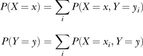

使用上面的表格，我们可以写出：

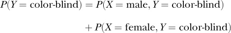

其中，我们对性别进行求和，以消除它的影响。现在，让我们探索另一个表格，包含三个变量的表格。

1912 年 4 月 14 日的某个时刻，RMS *泰坦尼克号*在从英国前往纽约市的首航途中沉没于北大西洋。根据对 887 名在*泰坦尼克号*上的乘客样本，我们可以生成表 2-2，显示三个变量的联合概率：生存、性别和舱位等级。

**表 2-2：** *泰坦尼克号*乘客的联合概率表

|  |  | **舱位 1** | **舱位 2** | **舱位 3** |
| --- | --- | --- | --- | --- |
| **死亡** | **男性** | 0.087 | 0.103 | 0.334 |
| **女性** | 0.003 | 0.007 | 0.081 |
| **生还** | **男性** | 0.051 | 0.019 | 0.053 |
| **女性** | 0.103 | 0.079 | 0.081 |

我们使用表 2-2 来计算一些概率。注意，我们将使用表 2-2 中的值，这些值精确到小数点后三位。因此，整体数字与我们从计数中计算出的概率会略有偏差，但这样做能够使表格和方程之间的联系更加明确。

首先，我们可以直接从表格中读取特定的生还、性别和舱位等级的三元组。例如：

*P*(死亡，男性，舱位 3) = 0.334

这意味着，随机选中的乘客是第三舱的男性且未生还的概率为 33%。那么第一舱的男性呢？这个在表中也有：

*P*(死亡，男性，舱位 1) = 0.087

这意味着选中的乘客有 9%的机会是第一舱的男性且已死亡。我们可以看到，舱位和社会阶层的差异确实影响了生还率。

让我们使用表格来计算一些其他的联合概率和边际概率。首先，未生还的概率是多少？要找到它，我们需要对性别和舱位进行求和：

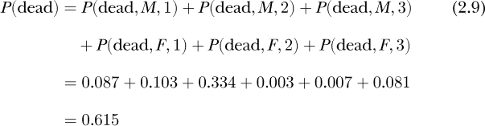

在这里，我们为男性/女性(*M*/*F*)和舱位等级（1, 2, 3）引入了简写符号。

让我们计算一下给定乘客为男性时未生还的概率，*P*(死亡|*M*)。为此，我们回顾方程 2.8，记住“与”意味着联合概率。我们重新写一下方程 2.8，以便解出 *P*(*B*|*A*)：

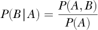

这有时用于首先定义条件概率。请注意，*P**(A*, *B*)表示 *P*(*A* 和 *B*)—二者都是联合概率。使用这种形式，给定乘客为男性时未生还的概率是：

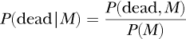

其中*P*(死亡, *M*)是死亡且为男性的联合概率，*P*(*M*)是为男性的概率。

在思考这些概率时我们需要小心。*P*(死亡, *M*)并不是指乘客为男性时未存活的概率。相反，它是指随机选择的乘客是未存活的男性的概率。我们想要的是*P*(死亡|*M*)，即在乘客是男性的条件下未存活的概率。

为了得到*P*(死亡, *M*)，我们需要对舱位类别求和：

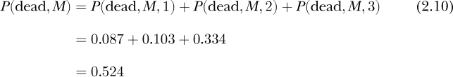

为了得到*P*(*M*)，我们对存活与舱位类别求和：

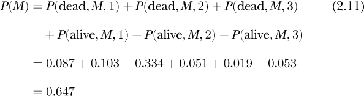

最后，为了计算*P*(死亡|*M*)：

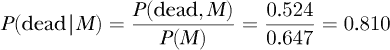

这告诉我们，81%的男性乘客未能存活。

下面的类似计算告诉我们女性并且存活的概率：

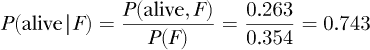

我们看到女性比男性更可能存活。这是“女性和儿童优先”这一说法实际上成立的一个例子。我留给你做练习来计算*P*(存活|*F*)的个别概率。

我们已经计算了*P*(死亡, *M*)，即未存活的男性的概率；*P*(*M*)，即为男性的概率；以及*P*(死亡|*M*)，即在为男性的条件下未存活的概率。接下来，我们根据表格 2-2 做一次新的计算。让我们找出*P*(死亡或 *M*)，即未存活或为男性的概率。

公式 2.6 告诉我们这是概率：

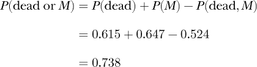

如果我们查看公式 2.9 和公式 2.11，我们会发现这两个公式具有相同的项，这些项正是公式 2.10 中求和的项。这就是为什么我们需要从*P*(死亡或 *M*)的计算中减去*P*(死亡, *M*)，以避免重复计算。

总结一下：

+   联合概率是指两个或更多随机变量具有特定取值的概率。联合概率通常用表格表示。

+   随机变量的边际概率是通过对其他随机变量的所有可能值求和得到的。

使用条件概率的乘法法则告诉我们如何计算给定条件概率和无条件概率时，两个随机变量的联合概率。现在让我们看看如何使用概率链式法则来推广这个概念。

#### 概率链式法则

公式 2.8 告诉我们如何通过条件概率来计算两个随机变量的联合概率。通过使用*概率链式法则*，我们可以扩展公式 2.8，并计算超过两个随机变量的联合概率。

在其通用形式中，*n*个随机变量的联合概率的链式法则如下：

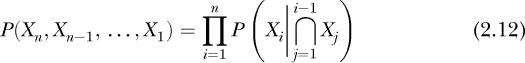

这里使用⋂表示“和”用于联合概率。方程 2.12 看起来很复杂，但跟着几个例子走，你会发现并不难理解。我需要在条件概率的联合部分使用⋂，但在例子中，我会用逗号，你很快就会看出规律。

下面是链式法则如何分解包含三个随机变量的联合概率：

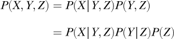

第一行表示*X*、*Y*和*Z*的概率是*X*在给定*Y*和*Z*情况下的条件概率与*Y*和*Z*的概率的乘积。这是方程 2.8，其中*X*为*B*，*Y*和*Z*为*A*。第二行对*P*(*Y*, *Z*)应用链式法则得到*P*(*Y*|*Z*)*P*(*Z*)。这个规则可以按顺序应用，就像链条一样，因此得名。

那么，四个随机变量的联合概率是什么？我们得到如下：

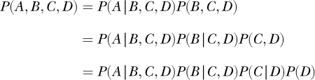

让我们通过一个使用链式法则的例子来演示。假设我们非常社交，派对上有 50 个人。50 人中有四个在秋天去过波士顿。我们随机挑选三个人。那么，*没有一个*人去过波士顿的概率是多少？

我们将用*A[i]*表示一个没有在秋天去过波士顿的人的事件。因此，我们要找的是*P*(*A*[3], *A*[2], *A*[1])，即三个都没有去过波士顿的人的概率。链式法则让我们可以将这个概率分解如下：

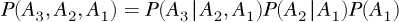

我们可以直观地理解这个方程的右侧。看一下*P*(*A*[1])。这是从房间里随机挑选一个没有在秋天去过波士顿的人的概率。四个人去过，因此有 46 个人没有去过，我们看到*P*(*A*[1]) = 46/50。选定一个人后，我们需要知道从剩下的 49 个人中选一个人的概率，即*P*(*A*[2]|*A*[1]) = 45/49。剩下的只有 49 个人，而且我们还没有选到四个去过波士顿的人。最后，选了两个人后，房间里剩下 48 个人，其中 44 个没有去过波士顿。因此，*P*(*A*[3]|*A*[2], *A*[1]) = 44/48。

现在我们准备好回答最初的问题了。从房间里随机选三个人且没有一个人去过秋天的波士顿的概率如下：

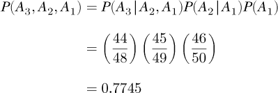

这稍微超过了 77%。

我们可以通过模拟多次随机抽取三个人来检查我们的计算是否合理。我们需要的代码如下：

```py
nb = 0

N = 100000

for i in range(N):

    s = np.random.randint(0,50,3)

    fail = False

    for t in range(3):

        if (s[t] < 4):

            fail = True

    if (not fail):

        nb += 1

print("No Boston in the fall = %0.4f" % (nb/N,))
```

我们将进行 100,000 次模拟。每次从 50 个没有在秋季去过波士顿的人中选择三个人时，我们将增加 `nb`。我们通过选择三个范围在 [0, 50) 内的随机整数，并将其放入 `s` 中来模拟选择三个人。然后，我们检查这三个整数中的每一个，看看是否有小于四的。如果有，我们就说选择了一个去过波士顿的人，并将 `fail` 设置为 `True`。如果三个整数都不小于四，那么这次模拟就是成功的。完成后，我们打印出在所有模拟中，选择了三位从未在秋季去过波士顿的人的比例。

运行这段代码得出了

```py

No Boston in the fall = 0.7780

```

这个结果足够接近我们计算的值，令我们相信我们找到了正确的答案。

### 总结

本章介绍了概率的基础知识。我们探讨了概率的基本概念，包括样本空间和随机变量。接着，通过一些例子说明了人类在概率方面的不足。然后，我们学习了概率的规则，并通过示例进行说明。这些规则引导我们进入了联合概率和边际概率，最终探讨了概率的链式法则。

下一章将继续探索概率，首先介绍概率分布及其采样方法，最后讲解贝叶斯定理，它展示了比较条件概率的正确方法。
