## 第三章：更多概率**


第二章为我们介绍了概率的基本概念。在本章中，我们将继续探讨概率，重点关注深度学习和机器学习中常遇到的两个重要话题：概率分布及其如何采样，贝叶斯定理。贝叶斯定理是概率论中最重要的概念之一，它在许多研究人员思考概率和如何应用它的方式上引发了范式转变。

### 概率分布

概率分布可以看作是一个函数，根据需求生成值。生成的值是随机的——我们不知道哪个值会出现——但任何值出现的概率遵循一般形式。例如，如果我们多次掷标准骰子并统计每个数字出现的次数，我们期望从长远来看，每个数字出现的可能性相等。实际上，这正是设计骰子的目的。因此，骰子的概率分布被称为*均匀分布*，因为每个数字出现的概率相等。我们还可以想象其他分布，其中某些值或值的范围比其他值更容易出现，比如一个加权骰子，它可能会异常频繁地显示六点。

深度学习从概率分布中采样的主要原因是在训练之前初始化网络。现代网络从不同的分布中选择初始权重，有时还包括偏置，最常见的是均匀分布和正态分布。均匀分布对我们来说比较熟悉，接下来我会讨论正态分布，它是一种连续分布。

在本节中，我将展示几种不同类型的概率分布。我们的重点是理解分布的形状，并学习如何使用 NumPy 从中抽样。我将从直方图开始，向你展示我们通常可以将直方图视为概率分布的近似。接着我将讨论常见的*离散概率分布*，这些分布返回整数值，如 3 或 7。最后，我将转向连续分布，返回浮动点数值，如 3.8 或 7.592。

#### 直方图与概率

请查看 表 3-1，我们在 第二章 中见过它。

**表 3-1：** 两个骰子不同和的组合数（摘自 表 2-1）

| **和** | **组合** | **计数** | **概率** |
| --- | --- | --- | --- |
| 2 | 1 + 1 | 1 | 0.0278 |
| 3 | 1 + 2, 2 + 1 | 2 | 0.0556 |
| 4 | 1 + 3, 2 + 2, 3 + 1 | 3 | 0.0833 |
| 5 | 1 + 4, 2 + 3, 3 + 2, 4 + 1 | 4 | 0.1111 |
| 6 | 1 + 5, 2 + 4, 3 + 3, 4 + 2, 5 + 1 | 5 | 0.1389 |
| 7 | 1 + 6, 2 + 5, 3 + 4, 4 + 3, 5 + 2, 6 + 1 | 6 | 0.1667 |
| 8 | 2 + 6, 3 + 5, 4 + 4, 5 + 3, 6 + 2 | 5 | 0.1389 |
| 9 | 3 + 6, 4 + 5, 5 + 4, 6 + 3 | 4 | 0.1111 |
| 10 | 4 + 6, 5 + 5, 6 + 4 | 3 | 0.0833 |
| 11 | 5 + 6, 6 + 5 | 2 | 0.0556 |
| 12 | 6 + 6 | 1 | 0.0278 |
|  |  | 36 | 1.0000 |

它展示了两个骰子如何加和得到不同的和。不要看实际的数值，看看可能的组合所形成的形状。如果我们去掉最后两列，向左旋转表格，并用“X”替换每个和，我们应该能看到类似下面的内容。

|  |  |  |  |  | × |  |  |  |  |  |
| --- | --- | --- | --- | --- | --- | --- | --- | --- | --- | --- |
|  |  |  |  | × | × | × |  |  |  |  |
|  |  |  | × | × | × | × | × |  |  |  |
|  |  | × | × | × | × | × | × | × |  |  |
|  | × | × | × | × | × | × | × | × | × |  |
| × | × | × | × | × | × | × | × | × | × | × |
| 2 | 3 | 4 | 5 | 6 | 7 | 8 | 9 | 10 | 11 | 12 |

你可以看到，达到每个和的方式数目有一个明确的形状和对称性。这种图表称为*直方图*。直方图是一种统计落入离散区间的事物数量的图表。对于表 3-1，这些区间是 2 到 12 的数字。统计的是获得该和的可能方式。直方图通常用条形图表示，通常是垂直条形，尽管它们不必是垂直的。表 3-1 基本上是一个水平直方图。使用多少个区间由制作人决定。如果使用太少的区间，直方图将会显得块状，可能无法揭示必要的细节，因为有趣的特征都被归类到同一个区间。如果使用太多区间，直方图将变得稀疏，很多区间没有统计数据。

让我们生成一些直方图。首先，我们将随机抽取[0,9]区间的整数，并统计每个整数出现的次数。实现这一点的代码非常简单：

```py
>>> import numpy as np

>>> n = np.random.randint(0,10,10000)

>>> h = np.bincount(n)

>>> h

array([ 975, 987, 987, 1017, 981, 1043, 1031, 988, 1007, 984])
```

我们首先将`n`设置为一个包含 10,000 个[0, 9]区间整数的数组。然后，我们使用`np .bincount`来统计每个数字出现的次数。我们发现这次运行得到了 975 个零和 984 个九。如果 NumPy 的伪随机生成器工作正常，我们期望在 10,000 个数字的样本中，每个数字平均出现 1,000 次。我们预期会有一定的波动，但大多数值应该接近 1,000，足够具有说服力。

上面的计数告诉我们每个数字出现的次数。如果我们将每个直方图的区间除以所有区间的总和，我们就从简单的计数转换为该区间出现的概率。对于上述随机数字，我们可以得到这些概率。

```py
>>> h = h / h.sum()

>>> h

array([0.0975, 0.0987, 0.0987, 0.1017, 0.0981, 0.1043, 0.1031, 0.0988,

       0.1007, 0.0984])
```

这告诉我们每个数字大约有 0.1 的概率出现，也就是每 10 次中有 1 次出现。将直方图的值除以直方图中计数的总和的这个技巧，使我们能够通过样本估计概率分布。它还告诉我们，当从生成直方图数据的任何过程中进行采样时，特定值出现的可能性。你应该注意，我说的是我们可以*估计*从一组样本中得到的概率分布。样本数量越大，估计的概率分布越接近实际生成这些样本的总体分布。我们永远无法得到实际的总体分布，但在样本数量无限的限制下，我们可以尽可能接近。

直方图常用于观察图像中像素值的分布。让我们绘制两张图像中像素的直方图。你可以在文件`ricky.py`中找到代码。（我不会在这里展示它，因为它对讨论没有帮助。）所使用的图像是 SciPy 中 `scipy.misc` 提供的两个示例灰度图像。第一张图展示了人们正在上楼梯（`ascent`），第二张是年轻浣熊的脸（`face`），如 图 3-1 所示。


*图 3-1：攀爬中的人（左）和“瑞奇”浣熊（右）*

图 3-2 提供了每个图像的直方图作为概率的图示。它显示了图像中灰度值的两种截然不同的分布。对于浣熊的面部，分布更加分散和平坦，而上楼梯的图像则在灰度值 128 附近有一个峰值，并且有几个亮像素。这些分布告诉我们，如果我们从面部图像中随机选择一个像素，我们最有可能得到一个灰度值接近 100 的像素，但在上楼梯的图像中，任意选择一个像素，它的灰度值很可能接近 128。

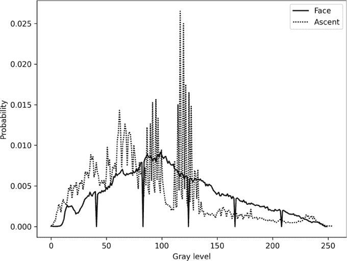

*图 3-2：两个 512×512 像素灰度样本图像的直方图作为概率分布*

再次强调，直方图统计了有多少项落入预定义的区间。我们看到，对于图像，作为概率分布的直方图告诉我们，如果我们随机选择一个像素，得到特定灰度值的可能性有多大。同样，前面那个例子中的随机数字的概率分布告诉我们，当我们请求一个随机整数时，得到每个数字的概率，范围是 [0,9]。

直方图是概率分布的离散表示。现在让我们来看看更常见的离散分布。

#### 离散概率分布

我们已经多次遇到最常见的离散分布：均匀分布。那就是我们通过掷骰子或抛硬币自然得到的分布。在均匀分布中，所有可能的结果发生的概率是相等的。一个模拟均匀分布过程的直方图是平的；所有结果出现的频率几乎相同。当我们看连续分布时，我们会再次看到均匀分布。目前，想象骰子。

让我们看看其他几个离散分布。

##### 二项分布

也许第二常见的离散分布是*二项分布*。这个分布表示在给定的试验次数中，如果每次事件发生的概率是已知的，则预期发生的事件次数。数学上，*k*次事件在*n*次试验中发生的概率，如果事件发生的概率是*p*，可以表示为

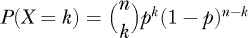

例如，抛三次公正的硬币，连续得到三次正面的概率是多少？根据乘法法则，我们知道概率是

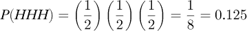

使用二项式公式，我们可以通过计算得到相同的结果

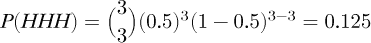

到目前为止，似乎并没有什么特别有用的。然而，如果事件的概率不是 0.5 呢？假设我们有一个事件，比如一个人通过不换门赢得*让我们来做交易*的概率，我们想知道在 13 个人中，有 7 个人不换猜测而获胜的概率是多少？我们知道不换门获胜的概率是 1/3——这就是*p*。然后我们有 13 次试验（*n*）和 7 个获胜者（*k*）。二项式公式告诉我们，概率是

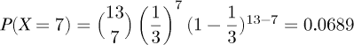

而且，如果玩家*确实*换门，

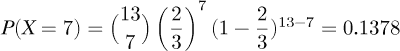

二项式公式给出了在指定的事件概率下，在给定次数的试验中发生一定数量事件的概率。如果我们固定*n*和*p*，并改变*k*，0 ≤ *k* ≤ *n*，我们可以得到每个*k*值的概率。这就给出了分布。例如，设*n* = 5，*p* = 0.3，那么 0 ≤ *k* ≤ 5，对于每个*k*值的概率为

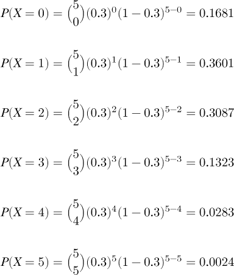

考虑到四舍五入，这个和为 1.0，正如我们所知道的，因为整个样本空间的概率和总是等于 1.0。注意，当*n* = 5 时，我们计算了所有可能的二项分布值。总的来说，这就指定了*概率质量函数 (pmf)*。概率质量函数告诉我们所有可能结果的概率。

二项分布由*n*和*p*来参数化。当*n* = 5 且*p* = 0.3 时，我们从上面的结果可以看到，来自这种二项分布的随机样本最常返回 1——大约 36%的时间。我们如何从二项分布中抽取样本？在 NumPy 中，我们只需要调用`random`模块中的`binomial`函数：

```py
>>> t = np.random.binomial(5, 0.3, size=1000)

>>> s = np.bincount(t)

>>> s

array([159, 368, 299, 155,  17,   2])

>>> s / s.sum()

array([0.159, 0.368, 0.299, 0.155, 0.017, 0.002])
```

我们传递`binomial`参数为试验次数（`5`）和每次试验成功的概率（`0.3`）。然后，我们请求从具有这些参数的二项分布中获取 1,000 个样本。通过使用`np.bincount`，我们看到最常返回的值确实是 1，正如我们上面计算的那样。通过使用直方图求和技巧，我们得到选择 1 的概率为 0.368——接近我们计算的 0.3601。

##### 伯努利分布

*伯努利分布*是二项分布的一个特例。在这种情况下，我们将*n* = 1，这意味着只有一次试验。我们只能抽取值为 0 或 1 的结果；要么事件发生，要么事件不发生。例如，当*p* = 0.5 时，我们得到

```py
>>> t = np.random.binomial(1, 0.5, size=1000)

>>> np.bincount(t)

array([496, 504])
```

这是合理的，因为 0.5 的概率意味着我们在抛一个公平的硬币，我们看到正反面出现的比例大致相等。

如果我们将*p*改为 0.3，我们得到

```py
>>> t = np.random.binomial(1, 0.3, size=1000)

>>> np.bincount(t)

array([665, 335])

>>> 335/1000

0.335
```

再次接近 0.3，正如我们预期的那样。

当你想模拟具有已知概率的事件时，使用来自二项分布的样本。通过伯努利形式，我们可以抽取二元结果，0 或 1，其中事件发生的可能性不必是公平抛硬币的概率 0.5。

##### 泊松分布

有时候，我们并不知道某个事件在特定试验中发生的概率。相反，我们可能知道某个时间间隔内事件发生的平均次数，假设为λ（lambda）。那么在这个时间间隔内，发生*k*个事件的概率是


这是*泊松分布*，它在模拟事件时非常有用，比如放射性衰变或某段时间内 X 射线探测器上光子的发生率。为了根据该分布抽样事件，我们使用`poisson`，它来自`random`模块。例如，假设某个时间间隔内，事件的平均发生次数为五次（λ = 5）。使用泊松分布，我们得到什么样的概率分布呢？在代码中，

```py
>>> t = np.random.poisson(5, size=1000)

>>> s = np.bincount(t)

>>> s

array([  6,  36,  83, 135, 179, 173, 156, 107,  58,  40,  20,   4,   2,

         0,   0,   1])

 >>> t.max()

15

>>> s = s / s.sum()

>>> s

array([0.006, 0.036, 0.083, 0.135, 0.179, 0.173, 0.156, 0.107, 0.058,

       0.04 , 0.02 , 0.004, 0.002, 0.   , 0.   , 0.001])
```

在这里，我们看到，与二项分布不同，二项分布不能选择超过*n*个事件，而泊松分布可以选择超过λ值的事件数量。在这种情况下，时间间隔内的最大事件数是 15，是平均数的三倍。你会发现，最常见的事件数正好接近五的平均值，正如你所预期的那样，但也可能会有显著偏离平均值的情况。

##### 快速加载骰子滚动器

如果我们需要根据任意离散分布抽样该怎么办？之前，我们看到了一些基于图像的直方图。在那种情况下，我们可以通过随机选择图像中的像素，从表示直方图的分布中抽样。但如果我们想根据任意权重抽取整数该怎么办？为了实现这一点，我们可以使用 Saad 等人开发的新快速加载骰子滚动器¹

*快速加载骰子滚轮（FLDR）*允许我们指定一个任意的离散分布，然后从中抽取样本。代码是用 Python 编写的，并且可以自由获取。（参见 *[`github.com/probcomp/fast-loaded-dice-roller/`](https://github.com/probcomp/fast-loaded-dice-roller/)*。）我将展示如何使用这段代码根据通用分布进行抽样。我建议直接从 GitHub 仓库下载`fldr.py`和`fldrf.py`文件，而不是运行`setup.py`。另外，在`fldrf.py`中编辑`.fldr`导入行，去掉“`.`”，使其变为：

```py

from fldr import fldr_preprocess_int

from fldr import fldr_s

```

使用 FLDR 需要两个步骤。第一步是告诉它你想要从中抽样的特定分布。你通过比率定义分布。（为了我们的目的，我们将使用实际的概率，也就是说，我们的分布总和将始终为 1.0。）这是预处理步骤，对于每个分布我们只需要做一次。之后，我们可以开始抽样。下面的示例将帮助澄清这一点：

```py
>>> from fldrf import fldr_preprocess_float_c

>>> from fldr import fldr_sample

>>> x = fldr_preprocess_float_c([0.6,0.2,0.1,0.1])

>>> t = [fldr_sample(x) for i in range(1000)]

 >>> np.bincount(t)

array([598, 190, 108, 104])
```

首先，我们导入所需的两个 FLDR 函数：`fldr_preprocess_float_c`和`fldr_sample`。然后，我们使用四个数字定义分布。四个数字意味着样本将是[0, 3]范围内的整数。然而，与均匀分布不同，在这里我们指定了零出现的概率为 60%，一出现的概率为 20%，而二和三的概率各为 10%。FLDR 需要的从分布中抽样的信息存储在`x`中。

调用`fldr_sample`返回一个来自分布的单个样本。注意两点：首先，我们需要传入`x`，其次，FLDR 不使用 NumPy，因此为了绘制 1,000 个样本，我们使用标准的 Python 列表推导式。1,000 个样本存储在列表`t`中。最后，我们生成直方图，可以看到近 60%的样本是零，略超过 10%的样本是三，这是我们预期的结果。

让我们使用之前使用过的浣熊面部图像的直方图，看看 FLDR 是否能够遵循一个更复杂的分布。我们将加载图像，生成直方图，将其转换为概率分布，并使用这些概率来设置 FLDR。之后，我们将从分布中抽取 25,000 个样本，计算样本的直方图，并将该直方图与原始直方图一起绘制，看看 FLDR 是否遵循我们提供的实际分布。我们需要的代码是：

```py
from scipy.misc import face

im = face(True)

b = np.bincount(im.ravel(), minlength=256)

b = b / b.sum()

x = fldr_preprocess_float_c(list(b))

t = [fldr_sample(x) for i in range(25000)]

q = np.bincount(t, minlength=256)

q = q / q.sum()
```

运行这段代码后，我们得到`b`，这是来自面部图像直方图的概率分布，以及`q`，这是从 FLDR 分布中抽取的 25,000 个样本创建的分布。图 3-3 展示了这两个分布的图形。

图 3-3 中的实线是我们提供给`fldr_preprocess_float_c`的概率分布，表示浣熊图像中灰度级（强度）的分布。虚线是来自该分布的 25,000 个样本的直方图。正如我们所看到的，它们遵循了请求的分布，并且与我们从这么少的样本中预期的变化一致。作为练习，将样本数量从 25,000 更改为 500,000，并绘制这两条曲线。你会看到它们几乎完全重叠。

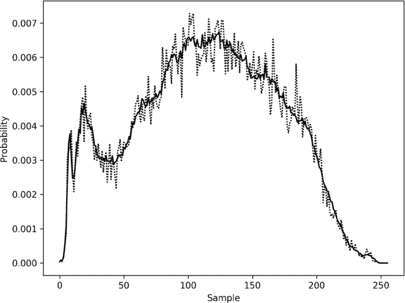

*图 3-3：比较快速加载的骰子滚动器分布（虚线）与来自 SciPy 面部图像生成的分布（实线）*

离散分布生成具有特定可能性的整数。现在我们暂时离开它们，来考虑返回浮动值的连续概率分布。

#### 连续概率分布

我在本章中还没有讨论连续概率。部分原因是为了让概率背后的概念更容易理解。像离散概率分布一样，连续概率分布也有一个特定的形状。然而，和我们上面看到的不同，连续分布中选择一个特定值的概率是零。一个特定值的概率为零，因为连续分布中可能的值是无限的；这意味着无法选择某个特定值。相反，我们讨论的是在某个特定范围内选择值的概率。

例如，最常见的连续分布是[0, 1]范围内的均匀分布。该分布返回*任何*位于该范围内的实数。虽然返回特定实数的概率为零，但我们可以讨论返回某个范围内的值的概率，例如[0, 0.25]。

再次考虑在[0, 1]范围内的均匀分布。我们知道从零到一的所有单个概率之和为 1.0。那么，从这个分布中抽取一个值，并且该值位于[0, 0.25]范围内的概率是多少呢？所有值的可能性相同，它们加起来为 1.0，因此，我们有 25%的机会返回一个位于[0, 0.25]范围内的值。同样，我们也有 25%的机会返回一个位于[0.75, 1]范围内的值，因为这个范围也覆盖了可能范围的 1/4。

当我们讨论在一个范围内对无数小事物求和时，我们讨论的是积分，这是微积分的一部分，在本书中我们不会涉及。然而，从概念上讲，如果我们考虑离散分布的极限情况，其中它能返回的值数趋近于无限，并且我们在某个范围内求和概率，那么我们就能理解发生了什么。

我们也可以从图形上理解这一点。图 3-4 展示了我将要讨论的连续概率分布。

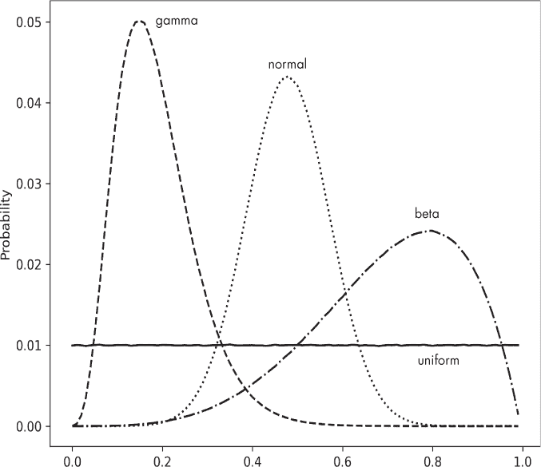

*图 3-4：一些常见的连续概率分布*

要获得在某个范围内抽样一个值的概率，我们需要将该范围内曲线下的面积加起来。事实上，这正是积分的作用；积分符号（∫）不过是一个花哨的“S”，表示*求和*。它是用于求和离散值的∑的连续版本。

图 3-4 中的分布是你最常遇到的分布，尽管还有许多其他的分布，它们同样足够有用并且被赋予了名字。所有这些分布都有对应的*概率密度函数（pdfs）*，这些封闭形式的函数生成从分布中采样所能得到的概率。我通过使用`continuous.py`文件中的代码来生成图 3-4 中的曲线。这些曲线是概率密度函数的估计值，我是通过大量样本的直方图来创建它们的。我这样做是为了展示 NumPy 的随机函数从这些分布中采样时能够做到它们所宣称的效果。

对于图 3-4，不必过多关注 x 轴。各个分布的输出范围不同；它们在这里被缩放，以便将所有分布都适配到图表中。需要注意的是它们的形状。均匀分布是遍布整个范围的均匀分布。正态曲线，也常被称为*高斯分布*或*钟形曲线*，是深度学习中使用的第二大常见分布。例如，神经网络的 He 初始化策略就是从正态分布中采样初始权重。

生成图 3-4 数据的代码值得关注，因为它向我们展示了如何使用 NumPy 获取样本：

```py
N = 10000000

B = 100

t = np.random.random(N)

u = np.histogram(t, bins=B)[0]

u = u / u.sum()

t = np.random.normal(0, 1, size=N)

n = np.histogram(t, bins=B)[0]

n = n / n.sum()

t = np.random.gamma(5.0, size=N)

g = np.histogram(t, bins=B)[0]

g = g / g.sum()

t = np.random.beta(5,2, size=N)

b = np.histogram(t, bins=B)[0]

b = b / b.sum()
```

**注意**

*我们在这里使用的是经典的 NumPy 函数，而不是基于生成器的新版函数。NumPy 在最近的版本中更新了伪随机数代码，但使用新代码的开销会影响我们在此想要展示的内容。除非你对伪随机数生成非常认真，否则旧版函数和它们所基于的梅森旋转算法伪随机数生成器完全足够。*

为了绘制图表，我们首先使用来自每个分布的 1000 万个样本（`N`）。然后，我们使用 100 个区间进行直方图绘制（`B`）。同样，绘制时 x 轴的范围在这里并不重要，重要的是曲线的形状。

均匀分布的样本使用了`random`，这是我们之前见过的一个函数。将样本传递给`histogram`并应用“除以总和”的技巧就能生成概率曲线数据（`u`）。我们对正态分布（`normal`）、伽马分布（`gamma`）和贝塔分布（`beta`）也做了相同的处理。

你会注意到，`normal`、`gamma` 和 `beta` 都接受参数。这些分布是有参数的，通过改变这些参数可以改变它们的形状。对于正态分布， 第一个参数是均值（μ），第二个参数是标准差（σ）。大约 68% 的正态分布位于均值的一个标准差范围内，即[μ - σ, μ + σ]。正态分布在数学和自然界中无处不在，甚至可以专门写一本书来讨论它。它总是围绕均值对称分布，标准差控制着曲线的宽窄。

Gamma 分布也是有参数化的。它接受两个参数：形状参数 (*k*) 和尺度参数 (θ)。这里，*k* = 5，尺度保持默认值 θ = 1。当形状参数增大时，gamma 分布越来越像高斯分布，峰值会向分布中心移动。尺度参数会影响峰值的横向大小。

同样，Beta 分布使用两个参数，*a* 和 *b*。这里，*a* = 5 和 *b* = 2。如果 *a* > *b*，则分布的峰值位于右侧；如果反过来，则位于左侧。如果 *a* = *b*，则 Beta 分布变为均匀分布。Beta 分布的灵活性使得它在模拟不同过程时非常有用，只要你能够找到逼近所需概率分布的 *a* 和 *b* 值。然而，根据你所需的精度，如果你有足够详细的离散分布近似值，上一节中看到的快速加载骰子滚动器可能是一个更实用的选择，尤其是在处理连续分布时。

表 3-2 显示了正态、Gamma 和 Beta 分布的概率密度函数。读者可以通过这些函数重新创建 图 3-4。你的结果会比图中的曲线更光滑。你可以使用 `scipy.special.beta` 函数计算 表 3-2 中的 *B*(*a*, *b*) 积分。对于 Γ(*k*)，请参见 `scipy.special.gamma`。此外，如果 Γ 函数的参数是整数，则 Γ(*n* + 1) = *n*!，所以 Γ(5) = Γ(4 + 1) = 4! = 24。

**表 3-2：** 正态分布、Gamma 分布和 Beta 分布的概率密度函数

| **normal** | 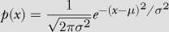 |
| --- | --- |
| **gamma** | 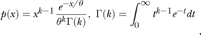 |
| **beta** | 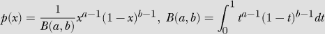 |

如果你对从这些分布中抽样值的方式感兴趣，我的书籍《*随机数与计算机*》（Springer，2018）比我们在此能提供的更深入地讨论了这些分布及其他分布，包括用 C 语言实现从这些分布中生成样本的代码。现在，让我们来看一下概率论中最重要的定理之一。

#### 中心极限定理

假设我们从某个分布中抽取 *N* 个样本并计算均值 *m*。如果我们多次重复这个操作，就会得到一组均值，*{m*[0], *m*[1], ...}，每个均值来自一个样本集合。每次 *N* 是否相同并不重要，但 *N* 不应太小。经验法则是 *N* 至少应该为 30 个样本。

*中心极限定理* 表示，基于这一组样本均值，即 *m* 的直方图或概率分布，将会呈现高斯分布的形状，无论样本最初是从什么样的分布中抽取出来的。

例如，这段代码

```py

M = 10000

m = np.zeros(M)

for i in range(M):

    t = np.random.beta(5,2,size=M)

    m[i] = t.mean()
```

创建了来自 Beta 分布 Beta(5,2)的 10,000 组样本，每组包含 10,000 个样本。每组样本的均值存储在`m`中。如果我们运行这段代码并绘制 *m* 的直方图，就会得到图 3-5。

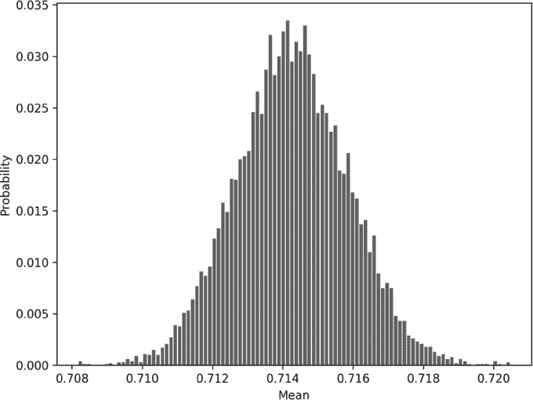

*图 3-5：Beta(5,2)分布的 10,000 组样本中，每组 10,000 个样本的均值分布*

图 3-5 的形状显然是高斯分布的。再次强调，这一形状是中心极限定理的结果，且不依赖于底层分布的形状。图 3-5 告诉我们，来自 Beta(5,2)的多个样本均值的均值大约为 0.714。对于上述代码的一次运行，样本均值的均值 (`m.mean()`) 为 0.7142929。

计算 Beta 分布均值有一个公式。Beta(5,2)分布的人群均值已知为 *a*/*(a* + *b*) = 5/(5 + 2) = 5/7 = 0.714285。图中图 3-5 的均值是对真实人群均值的度量，而 Beta(5,2)样本中得到的多个均值仅是估算值。

让我们再解释一遍，真正理解这里发生了什么。对于任何分布，比如 Beta(5,2)分布，如果我们抽取 *N* 个样本，就可以计算出这些样本的均值，一个单一的数字。如果我们对多个 *N* 样本集合重复这个过程，每个集合都有自己的均值，并且我们对这些均值的分布做一个直方图，就会得到类似图 3-5 的图形。该图告诉我们，所有多个样本均值本身都集中在某个均值附近。均值的均值是对人群均值的度量。它是我们从分布中能够抽取无数样本时得到的均值。如果我们将上述代码改为使用均匀分布，我们将得到 0.5 的人群均值。同样，如果我们切换到均值为 11 的高斯分布，生成的直方图将以 11 为中心。

让我们再次证明这一点，但这次使用离散分布。我们使用快速加载的骰子滚动器通过以下代码从一个偏斜的离散分布中生成样本：

```py

from fldrf import fldr_preprocess_float_c

from fldr import fldr_sample

z = fldr_preprocess_float_c([0.1,0.6,0.1,0.1,0.1])

m = np.zeros(M)

for i in range(M):

    t = np.array([fldr_sample(z) for i in range(M)])

    m[i] = t.mean()
```

图 3-6 展示了离散分布（上图）和相应的样本均值分布（下图）。

从概率质量函数中，我们可以看出，样本中最常见的值是 1，概率为 60%。然而，右侧的尾部意味着我们大约 30% 的时间会得到值 2 到 4。这些的加权均值是 0.6(1) + 0.1(2) + 0.1(3) + 0.1(4) = 1.5，这正是图 3-6 底部样本分布的均值。中心极限定理有效。我们将在第四章中讨论假设检验时重新审视中心极限定理。

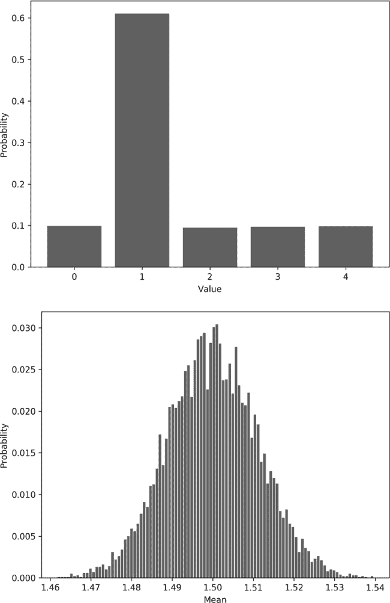

*图 3-6：一个任意离散分布（上图）和从中抽取的样本均值的分布（下图）*

#### 大数法则

与中心极限定理相关的一个概念，且常常与其混淆的，是*大数法则*。大数法则指出，随着从分布中抽取的样本量增大，样本均值越来越接近总体均值。在这里，我们考虑的是从分布中抽取的单个样本，并陈述我们期望其均值与真实总体均值之间的接近程度。而对于中心极限定理，我们有多个不同的样本集，并且我们在谈论这些样本集合均值的分布。

我们可以通过从一个分布中选取越来越大的样本并跟踪样本均值与样本量（抽样数量）之间的关系，简单地演示大数法则。因此，在代码中，

```py

m = []

for n in np.linspace(1,8,30):

    t = np.random.normal(1,1,size=int(10**n))

    m.append(t.mean())
```

这里我们从均值为 1 的正态分布中抽取越来越大的样本量。第一个样本量为 10，最后一个为 1 亿。如果我们将样本均值与样本量绘制成图，就可以看到大数法则的作用。

图 3-7 展示了在均值为 1（虚线）的正态分布中，样本均值随着样本数量变化的情况。随着从分布中抽取的样本数量增加，样本的均值逐渐接近总体均值，这展示了大数法则。


*图 3-7：大数法则的实际应用*

让我们换个话题，进入贝叶斯定理，这是本章的最后一个主题。

### 贝叶斯定理

在第二章，我们讨论了一个示例，决定一个女性是否患有癌症。在那里，我承诺贝叶斯定理将告诉我们如何正确计算一位 40 多岁女性患乳腺癌的概率。让我们在本节中兑现这个承诺，了解贝叶斯定理是什么以及如何使用它。

使用乘积法则，公式 2.8，我们知道以下两个数学陈述是正确的：

*P*(*B*, *A*) = *P*(*B*|*A*)*P*(*A*)

*P*(*A*, *B*) = *P*(*A*|*B*)*P*(*B*)

另外，因为*A*和*B*的联合概率与我们将哪个事件称为*A*、哪个事件称为*B*无关，

*P*(*A*, *B*) = *P*(*B*, *A*)

因此，

*P*(*B*|*A*)*P*(*A*) = *P*(*A*|*B*)*P*(*B*)

除以*P*(*A*)，我们得到

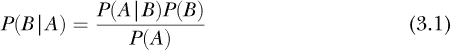

这是*贝叶斯定理*，贝叶斯方法的核心，用来比较两个条件概率：*P**(B*|*A*) 和 *P*(*A*|*B*)。你有时会看到方程 3.1 被称为*贝叶斯法则*。你也经常会看到“贝叶斯”后面没有撇号，这虽然有点草率和不规范，但在日常中很常见。

方程 3.1 已经成为霓虹灯、纹身甚至婴儿名字的标志：“贝叶斯”。这个方程以托马斯·贝叶斯（Thomas Bayes，1701–1761）的名字命名，他是英国的一位牧师和统计学家，这个方程在他去世后才被发布。用文字描述，方程 3.1 可以表述为：

*后验概率*，*P*(*B*|*A*)，是*P*(*A*|*B*)，即*似然*，与*P*(*B*)，即*先验*，的乘积，通过*P*(*A*)，即边际概率或*证据*，进行归一化。

现在我们知道了贝叶斯定理是什么，让我们看看它是如何应用的，以便更好地理解它。

#### 乳腺癌与否重启

思考贝叶斯定理的组成部分的一种方式是将其放在医学检测的背景下。在第二章的开始部分，我们计算了在乳房 X 光检查为阳性时，女性患乳腺癌的概率，并发现这个概率与我们可能天真认为的差异很大。现在让我们再次使用贝叶斯定理来回顾这个问题。在继续之前，重新阅读第二章的第一部分可能会有所帮助。

我们想使用贝叶斯定理来找到后验概率，即在乳房 X 光检查为阳性时患乳腺癌的概率。我们将其写为*P**(bc*+ |+)，表示乳腺癌（*bc*+）在乳房 X 光检查为阳性（+）时的概率。

在这个问题中，我们被告知，如果患者患有乳腺癌，乳房 X 光检查结果为阳性的概率是 90%。我们写作

*P*(+|*bc*+) = 0.9

这是贝叶斯方程中阳性乳房 X 光检查的*似然*，*P*(*A*|*B*) = *P*(+|*bc*+)。

接下来，我们被告知，随机女性患乳腺癌的概率是 0.8%。因此，我们知道

*P*(*bc*+) = 0.008

这是贝叶斯定理中的先验概率，*P*(*B*)。

我们已经有了方程 3.1 的所有组成部分，除了一个：*P**(A*)。在这个背景下，*P*(*A*)是什么？它是*P*(+)，即不考虑任何*B*（任何乳腺癌状态）的情况下，乳房 X 光检查为阳性的边际概率。这也是我们所知道的证据：乳房 X 光检查为阳性。

在这个问题中，我们被告知一个没有乳腺癌的女性有 7%的概率会得到乳房 X 光检查阳性结果。这是*P*(+)? 不是，它是*P*(+|*bc*–)，即在没有乳腺癌的情况下，乳房 X 光检查呈阳性的概率。

我已经两次提到过 *P**(A*) 是边际概率。我们知道如何计算边际或总概率：我们对联合概率中与我们想知道的内容无关的所有其他部分求和。在这里，我们必须对我们不关心的样本空间的所有分区求和，以获得阳性乳腺 X 光检查的边际概率。那么，哪些是我们不关心的分区呢？只有两个：一个是女性患乳腺癌，另一个是她没有乳腺癌。因此，我们需要找到

*P*(+) = *P*(+|*bc*+)*P*(*bc*+) + *P*(+|*bc*–)*P*(*bc*–)

我们已经知道所有这些量，除了 *P**(bc*–)。这是一个随机选择的女性 *没有* 乳腺癌的先验概率，*P**(bc*–) = 1 – *P*(*bc*+) = 0.992。

有时，你会在贝叶斯定理的分母中看到联合概率的其他项的求和。即使它们没有被明确指出，它们依然存在，隐含在求解 *P**(A*) 所需的条件中。

最后，我们已经拥有所有必要的元素，可以使用贝叶斯定理来计算概率：


这是我们之前得到的结果。回想一下，研究中有很大一部分医生声称乳腺 X 光检查阳性时的癌症概率 *P**(A*|*B*) 是 90%。他们的错误在于错误地将 *P(A*|*B*) 与 *P(B*|*A*) 等同起来。贝叶斯定理通过使用先验概率和边际概率正确地将两者联系了起来。

#### 更新先验

我们不需要仅仅停留在这个单一的计算上。考虑以下情况：假设一位女性在收到乳腺 X 光检查呈阳性的消息后，决定在另一家有不同放射科医生解读结果的机构进行第二次乳腺 X 光检查，而且第二次检查也呈阳性。她还会认为自己患乳腺癌的概率是 9% 吗？直观上，我们可能认为她现在更有理由相信自己得了癌症。这种信念是否可以量化？从贝叶斯角度来看，它是可以的，通过用第一次检查计算出来的后验概率 *P*(*bc*+|+) 来更新先验 *P**(bc*+)。毕竟，考虑到第一次的阳性乳腺 X 光检查结果，她现在的乳腺癌先验概率更强。

让我们基于之前的乳腺 X 光检查结果计算这个新的后验概率：

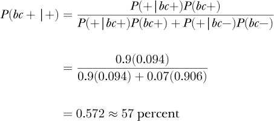

由于 57% 显著高于 9%，我们假设的这位女性现在有了更充足的理由相信她得了乳腺癌。

注意，在这个新的计算中，除了乳腺 X 光检查第二次阳性结果所导致的乳腺癌后验概率的大幅增加，还有哪些变化。首先，乳腺癌的先验概率从 0.008 → 0.094，后验概率是基于第一次检查计算得出的。其次，*P*(*bc*–) 也从 0.992 → 0.906 发生了变化。为什么？因为先验发生了变化，且 *P*(*bc*–) = 1 – *P*(*bc*+)。*P*(*bc*+) 和 *P*(*bc*–) 的总和仍然必须是 1.0——要么她患乳腺癌，要么她没有——这是整个样本空间。

在上面的例子中，我们基于初步的测试结果更新了先验概率，并且我们在第一个例子中获得了一个初始先验。那么，先验一般是如何选择的呢？在许多情况下，贝叶斯学派的选择先验，至少最初，是基于对问题的实际信念。通常，先验是一个均匀分布，称为*无信息先验*，因为没有任何东西来指导选择其他任何形式。以乳腺癌的例子为例，先验是可以通过对随机选择的女性样本进行实验来估计的。

如前所述，不要太认真对待这里的数字；它们仅用于示例。同时，虽然女性确实可以选择第二意见，但乳腺癌诊断的黄金标准是活检，这通常是初次阳性乳房 X 光检查后的下一步。最后，在本节中，我提到了女性和乳腺癌。男性也会得乳腺癌，尽管这种情况很少见，男性的病例不到 1%。然而，讨论中仅提及女性使得讨论更简便。我需要指出，男性乳腺癌的病例更可能是致命的，尽管原因尚不清楚。

#### 贝叶斯定理在机器学习中的应用

贝叶斯定理在机器学习和深度学习中广泛应用。贝叶斯定理的一个经典应用，甚至能取得惊人的效果，就是将其用作分类器。这就是所谓的*朴素贝叶斯*分类器。早期的电子邮件垃圾邮件过滤器就采用了这种方法，且非常有效。

假设我们有一个包含类别标签*y*和特征向量***x***的数据集。朴素贝叶斯分类器的目标是告诉我们，每个类别的概率，即给定的特征向量属于该类别的概率。通过这些概率，我们可以通过选择最大概率来分配类别标签。也就是说，我们要为每个类别标签*y*找到*P**(y*|***x***)。这是一个条件概率，因此我们可以使用贝叶斯定理来处理它：


上面的方程表示，特征向量*x*表示类别标签*y*实例的概率，是类别标签*y*生成特征向量*x*的概率与类别标签*y*发生的先验概率的乘积，除以所有类别标签上特征向量的边际概率。回顾一下计算*P*(*x*)时的隐式求和。

这对我们有什么用呢？既然我们有一个数据集，我们可以利用它来估计*P**(y*)，假设数据集的类别分布能够公平地代表我们在使用模型时遇到的情况。而且，由于我们有标签，我们可以将数据集分割成每个类别的子集。这可能有助于我们做一些有用的事情，以获取每个类别的可能性，*P*(*x*|*y*)。我们将完全忽略边际*P*(*x*)。让我们看看为什么，在这种情况下，我们可以这么做。

方程 3.2 是针对一个特定的类标签，比如 *y* = 1。我们将为数据集中的所有类标签拥有它的其他版本。我们之前提到过，我们的分类器由计算每个类标签的后验概率并选择最大的那个作为分配给未知特征向量的标签组成。方程 3.2 的分母是一个尺度因子，使得输出成为一个真正的概率。然而，在我们的使用场景中，我们只关心不同类标签之间 *P**(y*|***x***) 的相对排序。由于 *P*(***x***) 对所有 *y* 都是相同的，它是一个公共因子，这个因子会改变 *P**(y*|***x***) 相关的数字，但不会改变不同类标签之间的排序。因此，我们可以忽略它，专注于找到似然度和先验的乘积。尽管这种方式计算出来的最大 *P*(*y*|***x***) 已经不再是一个合适的概率，但它仍然是正确的类标签。

由于我们可以忽略 *P****(x***) 并且 *P*(*y*) 值可以从数据集中轻松估计，我们剩下的就是计算 *P****(x***|*y*)，即给定类标签为 *y* 时，特征向量 ***x*** 的似然度。我们在这种情况下该怎么做呢？

首先，我们可以考虑 *P****(x***|*y*) 是什么。它是给定特征向量属于类 *y* 时的条件概率。暂时我们可以忽略 *y* 部分，因为我们知道特征向量都来自类 *y*。

这只剩下了 *P****(x***)，因为我们固定了 *y*。特征向量是单独特征的集合，*x* = (***x[0]***, *x*[1], *x*[2], . . ., *x[n]*[–1])，其中 *n* 是向量中的特征数量。因此，*P****(x***) 其实是一个联合概率，表示所有单独特征同时具有其特定值的概率。所以，我们可以写成

*P*(*x*) = *P*(*x*[0], *x*[1], *x*[2], . . ., *x*[*n*–1])

这怎么帮助我们呢？如果我们对数据做出一个假设，我们会发现可以方便地拆解这个联合概率。假设我们的特征向量中的所有特征都是独立的。回想一下，*独立* 的意思是，*x*[1] 的值，比如说，并不受向量中任何其他特征值的影响。这个通常并不完全正确，对于图像中的像素来说，*肯定* 不成立，但我们还是假设它成立。我们天真地相信它是对的，这也就是 *朴素* 贝叶斯中的 *朴素*。

如果特征是独立的，那么一个特征取特定值的概率就与其他所有特征的取值无关。在这种情况下，乘积规则告诉我们可以像这样将联合概率拆解：

*P*(*x*) = *P*(*x*[0])*P*(*x*[1])*P*(*x*[2]) . . . *P*(*x*[*n*–1])

这对我们帮助很大。我们有一个按类别标注的数据集，使我们能够通过计算每个特征值在每个类中出现的频率，来估算任何特征对于任何特定类的概率。

让我们将所有内容结合起来，考虑一个假设的数据集，其中有三个类别——0、1 和 2——以及四个特征。我们首先使用按类别标签划分的数据集来估计每个特征值的概率。这为我们提供了每个类别标签下每个特征的*P**(x*[0])、*P*(*x*[1])等概率。结合类别标签的先验概率，该概率可以通过数据集中每个类别的样本数除以数据集中的总样本数来估计，我们可以为一个新的未知特征向量***x***进行计算，

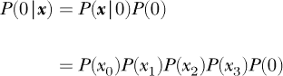

在这里，*P*(*x*[0])特征概率仅针对类别 0，*P*(0)是数据集中类别 0 的先验概率。*P*(0|***x***)是未归一化的后验概率，表示未知特征向量***x***属于类别 0。我们称其为*未归一化*，因为我们忽略了贝叶斯定理中的分母，知道包含它不会改变后验概率的排序，仅会改变其值。

我们可以重复上述计算，得到*P*(1|***x***)和*P*(2|***x***)，确保使用为这些类别计算的每个特征概率（即*P*(*x*[0])）。最后，我们为***x***分配具有最大后验概率的类别标签。

上述描述假设特征值是离散的。通常它们不是离散的，但可以采用一些变通方法。一种方法是将特征值分箱，使其变为离散。例如，如果特征的范围是[0, 3]，可以创建一个新的特征，其值为 0、1 或 2，并通过截断小数部分将连续特征分配到这些箱中。

另一种变通方法是对特征值的分布做出假设，并使用该分布来计算每个类别的*P**(x*[0])。特征通常基于现实世界中的测量，而现实世界中的许多事物都遵循正态分布。因此，通常我们假设各个特征虽然是连续的，但它们服从正态分布，并且我们可以从数据集中找到每个特征和类别标签的均值（μ）和标准差（σ）的估计值。

贝叶斯定理对于计算概率非常有用，在机器学习中也很有帮助。尽管贝叶斯学派与频率学派之间的争斗似乎有所减弱，但哲学上的分歧依然存在。在实践中，大多数研究人员发现这两种方法都有价值，有时应该同时使用两者的方法。我们将在下一章继续这一趋势，届时我们将从频率学派的角度审视统计学。我们通过指出在过去一个世纪里，绝大多数已发布的科学结果都采用了这种统计方法来辩护这一决定，其中也包括深度学习社区，至少在呈现实验结果时是如此。

### 概述

本章教会了我们概率分布，它们是什么，以及如何从中抽样，无论是离散的还是连续的。在我们探索深度学习的过程中，我们将遇到不同的分布。我们还发现了贝叶斯定理，了解了它如何让我们正确地关联条件概率。我们看到贝叶斯定理如何帮助我们评估癌症的真实可能性，给定一个不完美的医学测试——这是一个常见的情境。我们还学习了如何使用贝叶斯定理，以及我们在第二章中学到的一些基本概率规则，来构建一个简单但通常出奇有效的分类器。

现在让我们进入统计学的世界。

1。Feras A. Saad、Cameron E. Freer、Martin C. Rinard 和 Vikash K. Mansinghka，"快速加载骰子滚动器：一种近似最优的离散概率分布精确采样器"，载于 AISTATS 2020：第 23 届国际人工智能与统计学会议论文集，*机器学习研究论文集* 108，意大利西西里岛巴勒莫，2020 年。
