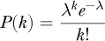
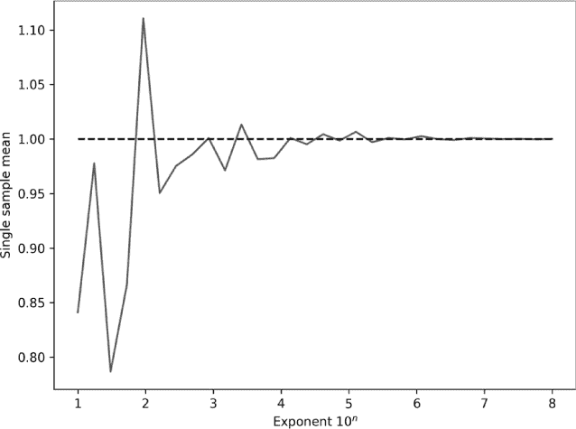
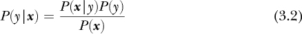

## **3

更多概率**

第二章向我们介绍了概率的基本概念。在本章中，我们将继续探索概率，重点讨论深度学习和机器学习中常见的两个重要话题：概率分布及如何从中采样，以及贝叶斯定理。贝叶斯定理是概率论中最重要的概念之一，它在许多研究人员思考概率及其应用的方式上带来了范式转变。

### 概率分布

概率分布可以看作是一个按需生成值的函数。生成的值是随机的——我们不知道哪个会出现——但任何值出现的可能性遵循一定的形式。例如，如果我们多次掷一个标准的骰子，并记录每个数字出现的次数，我们预计从长远来看，每个数字的出现机会是相等的。实际上，这就是最初制造骰子的目的。因此，骰子的概率分布被称为*均匀分布*，因为每个数字出现的可能性是相等的。我们还可以想象其他分布倾向于某个值或某个值的范围，比如一个加权的骰子，可能会出现六的概率异常高。

深度学习从概率分布中采样的主要原因是初始化网络权重。现代网络从不同的分布中选择初始权重，有时也选择偏置，最常见的是均匀分布和正态分布。均匀分布我们很熟悉，我稍后会讨论正态分布，这是一种连续分布。

本节将介绍几种不同类型的概率分布。我们的重点是理解分布的形状，并学习如何使用 NumPy 从中抽取样本。我将从直方图开始，向你展示我们如何通常将直方图视为概率分布的近似。接着我会讨论常见的*离散概率分布*，这些分布返回整数值，比如 3 或 7。最后，我将转到连续分布，返回浮动值，比如 3.8 或 7.592。

#### 直方图与概率

请查看我们在第二章中看到的表 3-1。

**表 3-1:** 两颗骰子组合导致不同总和的组合数（摘自表 2-1）

| **总和** | **组合数** | **计数** | **概率** |
| --- | --- | --- | --- |
| 2 | 1 + 1 | 1 | 0.0278 |
| 3 | 1 + 2, 2 + 1 | 2 | 0.0556 |
| 4 | 1 + 3, 2 + 2, 3 + 1 | 3 | 0.0833 |
| 5 | 1 + 4, 2 + 3, 3 + 2, 4 + 1 | 4 | 0.1111 |
| 6 | 1 + 5, 2 + 4, 3 + 3, 4 + 2, 5 + 1 | 5 | 0.1389 |
| 7 | 1 + 6, 2 + 5, 3 + 4, 4 + 3, 5 + 2, 6 + 1 | 6 | 0.1667 |
| 8 | 2 + 6, 3 + 5, 4 + 4, 5 + 3, 6 + 2 | 5 | 0.1389 |
| 9 | 3 + 6, 4 + 5, 5 + 4, 6 + 3 | 4 | 0.1111 |
| 10 | 4 + 6, 5 + 5, 6 + 4 | 3 | 0.0833 |
| 11 | 5 + 6, 6 + 5 | 2 | 0.0556 |
| 12 | 6 + 6 | 1 | 0.0278 |
|  |  | 36 | 1.0000 |

它展示了两个骰子加起来如何得到不同的和。不要看实际的数值；要看可能组合的形状。如果我们去掉最后两列，将表格转向左边，并将每个和替换为“X”，我们应该看到如下内容：

|  |  |  |  |  | × |  |  |  |  |  |
| --- | --- | --- | --- | --- | --- | --- | --- | --- | --- | --- |
|  |  |  |  | × | × | × |  |  |  |  |
|  |  |  | × | × | × | × | × |  |  |  |
|  |  | × | × | × | × | × | × | × |  |  |
|  | × | × | × | × | × | × | × | × | × |  |
| × | × | × | × | × | × | × | × | × | × | × |
| 2 | 3 | 4 | 5 | 6 | 7 | 8 | 9 | 10 | 11 | 12 |

可以看出，到达每个和的方式有明确的形状和对称性。这种图形叫做*直方图*。直方图是一个统计落入离散区间的事物数量的图表。对于表 3-1，这些区间是从 2 到 12 的数字。计数是达到该和的一种可能方式。直方图通常以条形图的形式表示，通常是竖直条形，尽管不一定非得如此。表 3-1 基本上是一个水平直方图。直方图使用多少个区间取决于制作人员。如果使用太少的区间，直方图将显得块状，可能无法揭示必要的细节，因为有趣的特征都被归入了同一个区间。如果使用太多的区间，直方图将显得稀疏，许多区间没有计数。

我们来生成一些直方图。首先，我们将随机抽取[0,9]范围内的整数，并统计每个整数的出现次数。实现这一过程的代码很简单：

>>> import numpy as np

>>> n = np.random.randint(0,10,10000)

>>> h = np.bincount(n)

>>> h

array([ 975, 987, 987, 1017, 981, 1043, 1031, 988, 1007, 984])

我们首先将 n 设置为一个包含 10,000 个整数的数组，范围是[0, 9]。然后，我们使用 np.bincount 来统计每个数字出现的次数。我们看到这次运行给我们带来了 975 个零和 984 个九。如果 NumPy 的伪随机生成器工作正常，我们期望在 10,000 个数字中每个数字的平均出现次数为 1,000。我们预计会有一些波动，但大多数值会足够接近 1,000，从而令人信服。

上述计数告诉我们每个数字出现的次数。如果我们将每个直方图的区间除以所有区间的总和，我们就将简单的计数转换为该区间出现的概率。对于上述随机数字，我们可以通过以下方式计算概率：

>>> h = h / h.sum()

>>> h

array([0.0975, 0.0987, 0.0987, 0.1017, 0.0981, 0.1043, 0.1031, 0.0988,

0.1007, 0.0984])

这告诉我们，每个数字出现的概率大约为 0.1，即 1/10。通过将直方图中的值除以直方图中计数的总和，我们可以从样本中估计概率分布。它还告诉我们，在从生成用于制作直方图的数据的任何过程进行采样时，特定值出现的可能性。你应该注意，我说过我们可以*估计*从一组样本中得出的概率分布。样本数量越大，估计的概率分布就越接近实际的生成样本的总体分布。我们永远无法得到实际的总体分布，但在无限数量样本的限制下，我们可以得到足够接近的结果。

直方图常常用于查看图像中像素值的分布。让我们绘制两张图像的像素直方图。你可以在文件 ricky.py 中找到代码。（我这里不展示它，因为它与讨论无关。）使用的图像是 SciPy 中 scipy.misc 包含的两张示例灰度图像。第一张展示了人们走上楼梯（上升），第二张是年轻浣熊的面部特写（面孔），如图 3-1 所示。

*图 3-1：人们上楼梯（左）和“Ricky”浣熊（右）*

图 3-2 提供了每张图像的直方图概率图。它展示了图像中灰度级值的两种非常不同的分布。对于浣熊的面部图像，分布较为分散和平坦，而上升图像在灰度级 128 附近有一个尖峰，并且有一些明亮的像素。这些分布告诉我们，如果我们从面部图像中随机选择一个像素，我们最有可能得到接近灰度级 100 的值，而在上升图像中，任意像素相对较有可能接近灰度级 128。

*图 3-2：两张 512×512 像素灰度样本图像的概率直方图*

再次强调，直方图统计了多少项落入预定义的箱子中。我们看到，对于图像，作为概率分布的直方图告诉我们，如果随机选择一个像素，得到特定灰度级值的可能性有多大。同样，之前示例中的随机数字概率分布告诉我们，在请求一个范围为[0,9]的随机整数时，每个数字出现的概率。

直方图是概率分布的离散表示。现在，让我们来看看更常见的离散分布。

#### 离散概率分布

我们已经多次遇到过最常见的离散分布：它是均匀分布。那就是我们通过掷骰子或抛硬币自然得到的分布。在均匀分布中，所有可能的结果是等概率的。模拟均匀分布过程的直方图是平的；所有结果出现的频率大致相同。我们将在查看连续分布时再次看到均匀分布。现在，想象一下骰子。

让我们看一下其他几个离散分布。

##### 二项分布

可能第二常见的离散分布是*二项分布*。这种分布表示在给定次数的试验中，如果每个事件都有一个特定的概率，那么期望发生的事件数量。数学上，如果事件发生的概率是*p*，则在*n*次试验中发生*k*个事件的概率可以写作

例如，当抛掷公平硬币三次时，连续三次出现正面朝上的概率是多少？根据乘法规则，我们知道其概率是

使用二项式公式，我们可以通过计算得到相同的答案

到目前为止，还不特别有帮助。但是，如果事件的概率不是 0.5 呢？如果我们有一个事件，比如一个人通过不换门赢得*Let’s Make a Deal*的概率，我们想知道在 13 个人中有 7 个人通过不更换猜测赢得比赛的概率是多少？我们知道不换门的获胜概率是 1/3——那就是*p*。然后我们有 13 次试验（*n*）和 7 个赢家（*k*）。二项式公式告诉我们其可能性是

并且，如果玩家*确实*换门，

二项式公式给出了在给定次数的试验中对于每次试验指定概率下的事件数的概率。如果我们固定*n*和*p*，并改变*k*，0 ≤ *k* ≤ *n*，我们就能得到每个*k*值的概率。这给出了分布。例如，设*n* = 5，*p* = 0.3，那么 0 ≤ *k* ≤ 5，每个*k*值的概率为

考虑到四舍五入，这总和为 1.0，因为我们知道总概率在整个样本空间上总是等于 1.0。请注意，我们计算了当*n* = 5 时，二项分布的所有可能值。总的来说，这指定了*概率质量函数（pmf）*。概率质量函数告诉我们与所有可能结果相关的概率。

二项分布由*n*和*p*参数化。对于*n* = 5 和*p* = 0.3，从上面的结果我们可以看到，来自这样的二项分布的随机样本最常返回 1——大约 36%的概率。我们如何从二项分布中抽取样本呢？在 NumPy 中，我们只需要调用随机模块中的二项函数：

>>> t = np.random.binomial(5, 0.3, size=1000)

>>> s = np.bincount(t)

>>> s

array([159, 368, 299, 155, 17, 2])

>>> s / s.sum()

array([0.159, 0.368, 0.299, 0.155, 0.017, 0.002])

我们传递给二项分布的参数包括试验次数（5）和每次试验的成功概率（0.3）。然后我们要求从这个参数下的二项分布中取 1000 个样本。通过使用 np.bincount，我们看到返回值最常见的确实是 1，正如我们之前计算的那样。通过使用我们的直方图求和技巧，我们得到了 0.368 的选择 1 的概率——接近我们计算的 0.3601。

##### 伯努利分布

*伯努利分布*是二项分布的一种特殊情况。在这种情况下，我们固定*n* = 1，意味着只有一次试验。我们只能取样 0 或 1；事件发生或不发生。例如，当*p* = 0.5 时，我们得到

>>> t = np.random.binomial(1, 0.5, size=1000)

>>> np.bincount(t)

array([496, 504])

这是合理的，因为概率为 0.5 意味着我们在掷一个公平的硬币，并且我们看到正面或反面的比例大致相等。

如果我们将*p*改为 0.3，我们得到

>>> t = np.random.binomial(1, 0.3, size=1000)

>>> np.bincount(t)

array([665, 335])

>>> 335/1000

0.335

再次接近 0.3，正如我们预期的那样。

当你想模拟具有已知概率的事件时，使用二项分布的样本。在伯努利形式下，我们可以采样二元结果 0 或 1，其中事件发生的可能性不一定是公平硬币翻转的概率 0.5。

##### 泊松分布

有时，我们并不知道某个特定试验发生事件的概率。相反，我们可能知道在某个时间间隔内发生事件的平均数量。假设在某段时间内，平均发生的事件数是λ（lambda），那么在该时间间隔内发生*k*个事件的概率为

这是*泊松分布*，它对于模拟诸如放射性衰变或 X 射线探测器上光子发生的事件非常有用。为了根据这个分布来取样事件，我们使用 random 模块中的 poisson。例如，假设在某个时间间隔内，平均发生五个事件（λ = 5）。我们使用泊松分布会得到什么样的概率分布？代码如下：

>>> t = np.random.poisson(5, size=1000)

>>> s = np.bincount(t)

>>> s

array([ 6, 36, 83, 135, 179, 173, 156, 107, 58, 40, 20, 4, 2,

0,   0,   1])

>>> t.max()

15

>>> s = s / s.sum()

>>> s

array([0.006, 0.036, 0.083, 0.135, 0.179, 0.173, 0.156, 0.107, 0.058,

0.04 , 0.02 , 0.004, 0.002, 0.   , 0.   , 0.001])

在这里，我们看到，与二项分布不同，二项分布不能选择超过*n*个事件，而泊松分布可以选择超过λ值的事件数量。在这种情况下，时间间隔内最大事件数为 15，是平均值的三倍。正如你可能预期的那样，最常见的事件数是接近平均值 5 的，但也可能出现与平均值显著偏离的情况。

##### 快速加载骰子滚动器

如果我们需要根据任意离散分布抽取样本，该怎么办呢？之前我们看过一些基于图像的直方图。在那种情况下，我们可以通过随机选择图像中的像素来从直方图所表示的分布中抽样。但如果我们想根据任意权重抽取整数呢？为此，我们可以使用 Saad 等人提出的新工具——快速加载骰子滚动器（Fast Loaded Dice Roller）¹。

*快速加载骰子滚动器（FLDR）* 让我们可以指定一个任意的离散分布，并从中抽取样本。代码是用 Python 编写并且可以自由获取。（参见 *[`github.com/probcomp/fast-loaded-dice-roller/`](https://github.com/probcomp/fast-loaded-dice-roller/)*。）我将展示如何使用代码根据通用分布进行抽样。我建议从 GitHub 仓库中只下载 fldr.py 和 fldrf.py 文件，而不是运行 setup.py。此外，编辑 fldrf.py 中的.fldr 导入行，去掉“.”，让它们改为：

from fldr import fldr_preprocess_int

from fldr import fldr_s

使用 FLDR 需要两个步骤。第一个步骤是告诉它你想要从哪个特定的分布中抽样。你通过定义分布的比率来描述该分布。（为了我们的目的，我们将使用实际概率，也就是说我们的分布的总和始终为 1.0。）这是预处理步骤，每个分布我们只需要做一次。之后，我们就可以开始抽样了。下面是一个示例来说明：

>>> from fldrf import fldr_preprocess_float_c

>>> from fldr import fldr_sample

>>> x = fldr_preprocess_float_c([0.6,0.2,0.1,0.1])

>>> t = [fldr_sample(x) for i in range(1000)]

>>> np.bincount(t)

array([598, 190, 108, 104])

首先，我们导入需要的两个 FLDR 函数：fldr_preprocess_float_c 和 fldr_sample。然后，我们使用一个包含四个数字的列表来定义分布。四个数字意味着样本将是[0, 3]之间的整数。然而，与均匀分布不同，这里我们指定的是：零的概率为 60%，一的概率为 20%，二和三的概率各为 10%。FLDR 需要的信息以 x 的形式返回，用于从分布中抽样。

调用 `fldr_sample` 返回从分布中抽取的单个样本。请注意两点：首先，我们需要传入 `x`，其次，FLDR 不使用 NumPy，因此为了绘制 1,000 个样本，我们使用标准的 Python 列表推导式。1,000 个样本存储在列表 `t` 中。最后，我们生成直方图，并看到近 60% 的样本为零，略多于 10% 的样本为三，这正是我们预期的结果。

让我们使用之前提到的浣熊面部图像的直方图，看看 FLDR 是否会遵循更复杂的分布。我们将加载图像，生成直方图，将其转换为概率分布，然后使用这些概率来设置 FLDR。之后，我们将从该分布中抽取 25,000 个样本，计算这些样本的直方图，并将这个直方图与原始直方图一起绘制，看看 FLDR 是否遵循我们提供的实际分布。我们需要的代码如下：

from scipy.misc import face

im = face(True)

b = np.bincount(im.ravel(), minlength=256)

b = b / b.sum()

x = fldr_preprocess_float_c(list(b))

t = [fldr_sample(x) for i in range(25000)]

q = np.bincount(t, minlength=256)

q = q / q.sum()

运行这段代码后，我们得到了 `b`，它是面部图像直方图的概率分布，以及 `q`，它是从 FLDR 分布中提取的 25,000 个样本生成的分布。图 3-3 展示了这两个分布的对比图。

图 3-3 中的实线是我们提供给 `fldr_preprocess_float_c` 的概率分布，表示浣熊图像中的灰度级（强度）分布。虚线是来自这个分布的 25,000 个样本的直方图。正如我们所看到的，它们遵循了请求的分布，并且有着我们从如此少量样本中预期的变化。作为练习，将样本数量从 25,000 改为 500,000 并绘制这两条曲线。你会看到它们几乎完全重合在一起。

*图 3-3：比较快速加载骰子滚动器分布（虚线）与从 SciPy 面部图像生成的分布（实线）*

离散分布生成具有特定概率的整数。现在让我们跳过这些，考虑连续概率分布，它们返回的是浮点数值。

#### 连续概率分布

我在本章中还没有讨论连续概率。部分原因是为了让概率背后的概念更容易理解。像离散分布一样，连续概率分布也有特定的形状。然而，和上面看到的那样，连续分布不会给特定的整数值分配概率，因为从连续分布中选择一个特定值的概率是零。一个特定值的概率为零，因为连续分布有无限多的可能值；这意味着不能选择一个特定值。相反，我们讨论的是在一个特定范围内选择值的概率。

例如，最常见的连续分布是[0, 1]区间上的均匀分布。这个分布会返回该区间内的*任何*实数。尽管返回一个特定实数的概率是零，但我们可以讨论返回一个范围内的值的概率，例如[0, 0.25]。

再次考虑[0, 1]区间上的均匀分布。我们知道，从零到一的所有单个概率的总和是 1.0。那么，从这个分布中抽取一个值，并且这个值落在[0, 0.25]区间内的概率是多少呢？所有值的概率是相等的，所有的概率加起来是 1.0，所以我们必须有 25%的概率返回一个位于[0, 0.25]区间内的值。同样，我们有 25%的概率返回一个位于[0.75, 1]区间内的值，因为它也涵盖了可能范围的 1/4。

当我们讨论在某个区间内对无限小的量进行求和时，我们实际上是在讨论积分，这是微积分的一部分，而这一部分内容我们在本书中不会覆盖。然而，从概念上讲，如果我们考虑一个离散分布的极限，其中它可以返回的值的数量趋于无限，并且我们在某个区间内对概率进行求和，我们就能理解发生了什么。

我们也可以从图形上思考这个问题。图 3-4 展示了我将要讨论的连续概率分布。

*图 3-4：一些常见的连续概率分布*

为了获得在某个区间内抽取值的概率，我们需要加总该区间下曲线的面积。事实上，这正是积分所做的；积分符号（∫）不过是一个花哨的“ S ”，代表*求和*。它是求和离散值的∑的连续版本。

图 3-4 中的分布是你最常遇到的几种，虽然还有许多其他有用到足以被命名的分布。所有这些分布都有相应的*概率密度函数 (pdfs)*，它们是生成从分布中采样所得到的概率的闭式函数。我使用文件 continuous.py 中的代码生成了图 3-4 中的曲线。这些曲线是概率密度函数的估计值，我是通过大量样本的直方图创建它们的。我这样做的目的是为了展示 NumPy 的随机函数从这些分布中采样确实如它们所宣称的那样。

对图 3-4 中的 x 轴不必过多关注。这些分布的输出范围不同；它们在这里被缩放，以便所有分布都能显示在图上。重要的是要注意它们的形状。均匀分布是，嗯，在整个范围内都是均匀的。正态曲线，也常被称为*高斯曲线*或*钟形曲线*，是深度学习中第二常用的分布。例如，神经网络的 He 初始化策略就是从正态分布中采样初始权重。

生成图 3-4 数据的代码值得注意，因为它向我们展示了如何使用 NumPy 获取样本：

N = 10000000

B = 100

t = np.random.random(N)

u = np.histogram(t, bins=B)[0]

u = u / u.sum()

t = np.random.normal(0, 1, size=N)

n = np.histogram(t, bins=B)[0]

n = n / n.sum()

t = np.random.gamma(5.0, size=N)

g = np.histogram(t, bins=B)[0]

g = g / g.sum()

t = np.random.beta(5,2, size=N)

b = np.histogram(t, bins=B)[0]

b = b / b.sum()

**注意**

*我们在这里使用的是经典的 NumPy 函数，而不是基于新生成器的函数。NumPy 在最近的版本中更新了伪随机数代码，但使用新代码的开销会影响我们在这里想要看到的内容。除非你对伪随机数生成非常严肃，否则旧的函数及其基于的梅森旋转算法伪随机数生成器将完全足够。*

为了生成这些图，我们首先从每个分布中使用 1000 万个样本（N）。然后，在直方图中使用 100 个箱子（B）。再次强调，绘制图时 x 轴的范围在这里并不重要，重要的是曲线的形状。

均匀样本使用的是 random 函数，这是我们之前见过的。将样本传递给直方图并应用“除以总和”的技巧生成概率曲线数据（u）。我们对高斯（正态）、伽马（gamma）和贝塔（beta）分布也进行了相同的处理。

你会注意到，正态分布、伽马分布和贝塔分布都接受参数。这些分布是参数化的；通过改变这些参数可以改变它们的形状。对于正态曲线，第一个参数是均值 (μ)，第二个参数是标准差 (σ)。大约 68% 的正态曲线位于均值的一个标准差范围内，[μ – σ, μ + σ]。正态曲线在数学和自然界中无处不在，单独写一本书也足够。它总是围绕其均值对称。标准差控制着曲线的宽窄。

伽马分布也是参数化的。它接受两个参数：形状 (*k*) 和尺度 (θ)。这里，*k* = 5，尺度保持其默认值 θ = 1。随着形状的增加，伽马分布越来越像高斯分布，峰值逐渐向分布的中心移动。尺度参数影响峰值的水平大小。

同样，beta 分布使用两个参数，*a* 和 *b*。这里，*a* = 5 和 *b* = 2。如果 *a* > *b*，分布的峰值位于右侧；如果反过来，则位于左侧。如果 *a* = *b*，beta 分布变为均匀分布。beta 分布的灵活性使其非常适合模拟不同的过程，只要你能找到接近所需概率分布的 *a* 和 *b* 值。然而，根据你需要的精度，如果你有一个足够详细的离散分布来近似连续分布，前一节中提到的新的快速加载骰子滚动器可能在实践中是更好的选择。

表 3-2 显示了正态分布、伽马分布和贝塔分布的概率密度函数。读者的一个练习是使用这些函数重新创建图 3-4。你的结果将比图中的曲线更加平滑。你可以使用 scipy.special.beta 函数计算表 3-2 中的 *B*(*a*, *b*) 积分。有关 Γ(*k*)，请参见 scipy.special.gamma。此外，如果 Γ 函数的参数是整数，则 Γ(*n* + 1) = *n*！，所以 Γ(5) = Γ(4 + 1) = 4! = 24。

**表 3-2：** 正态分布、伽马分布和贝塔分布的概率密度函数

| **normal** |  |
| --- | --- |
| **gamma** |  |
| **beta** |  |

如果你对从这些分布中采样值的方法感兴趣，我的书《随机数与计算机》（Springer，2018）深入讨论了这些分布和其他分布，比我们在这里提供的内容更为详尽，包括用 C 语言实现的采样方法。目前，让我们来看一下概率论中最重要的定理之一。

#### 中心极限定理

假设我们从某个分布中抽取 *N* 个样本并计算其均值 *m*。如果我们多次重复这一操作，我们将得到一组均值，*{m*[0], *m*[1], . . .}，每个均值来自于一个分布样本集。无论 *N* 每次是否相同，重要的是 *N* 不应过小。经验法则是，*N* 至少应该为 30 个样本。

*中心极限定理* 表示，从这组样本均值，即 *m*，生成的直方图或概率分布将呈高斯分布的形状，而不管样本最初来自哪个分布。

例如，这段代码

M = 10000

m = np.zeros(M)

for i in range(M):

t = np.random.beta(5,2,size=M)

m[i] = t.mean()

创建了 10,000 组来自 Beta(5,2) 分布的样本，每组包含 10,000 个样本。每组样本的均值被存储在 m 中。如果我们运行这段代码并绘制 *m* 的直方图，我们将得到图 3-5。

*图 3-5：Beta(5,2) 分布中 10,000 组样本的均值分布*

图 3-5 的形状明显呈高斯分布。同样，这个形状是中心极限定理的结果，并且不依赖于底层分布的形状。图 3-5 告诉我们，来自 Beta(5,2) 分布的多个样本集的样本均值本身的均值大约为 0.714。对于上述代码的一次运行，样本均值的均值 (m.mean()) 为 0.7142929。

有一个公式可以计算 Beta 分布的均值。Beta(5,2) 分布的总体均值已知为 *a*/*(a* + *b*) = 5/(5 + 2) = 5/7 = 0.714285。图 3-5 中的均值是对真实总体均值的测量，Beta(5,2) 样本中的多个均值只是对总体均值的估计。

让我们再解释一遍，以便真正理解发生了什么。对于任何分布，例如 Beta(5,2) 分布，如果我们抽取 *N* 个样本，我们可以计算这些样本的均值，这是一个单一的数值。如果我们重复这个过程，使用多个 *N* 样本集，每个样本集有它自己的均值，并且我们制作一个均值分布的直方图，我们将得到如图 3-5 所示的图形。该图表明，所有的样本均值本身都围绕着一个均值聚集。均值的均值是一个总体均值的度量。如果我们能从分布中抽取无限数量的样本，我们将得到这个均值。如果我们将上面的代码更改为使用均匀分布，我们将得到 0.5 的总体均值。同样，如果我们切换到一个均值为 11 的高斯分布，得到的直方图将会集中在 11 处。

让我们再次证明这一点，但这次使用一个离散分布。我们将使用快速加载骰子滚动器，通过以下代码从一个倾斜的离散分布中生成样本：

from fldrf import fldr_preprocess_float_c

from fldr import fldr_sample

z = fldr_preprocess_float_c([0.1,0.6,0.1,0.1,0.1])

m = np.zeros(M)

for i in range(M):

t = np.array([fldr_sample(z) for i in range(M)])

m[i] = t.mean()

图 3-6 显示了离散分布（上）及相应的样本均值分布（下）。

从概率质量函数可以看出，我们期望从样本中抽取到的最频繁的值是 1，概率为 60%。然而，右侧的尾部意味着我们也会大约 30% 的时间得到 2 到 4 之间的值。这些值的加权均值是 0.6(1) + 0.1(2) + 0.1(3) + 0.1(4) = 1.5，这恰好是图 3-6 下方样本分布的均值。中心极限定理成立。我们将在第四章讨论假设检验时重新回顾中心极限定理。

*图 3-6：一个任意的离散分布（上）及从中抽取的样本均值分布（下）*

#### 大数法则

一个与中心极限定理相关的概念，且常与之混淆的是*大数法则*。大数法则指出，随着从一个分布中抽取的样本大小的增加，样本的均值会越来越接近总体的均值。在这种情况下，我们讨论的是从分布中抽取的单个样本，并对其均值接近真实总体均值的程度做出预测。对于中心极限定理，我们有多个来自分布的样本集，并且我们对这些样本集均值的分布做出预测。

我们可以通过从一个分布中选择越来越大的样本并追踪其均值与样本大小（即抽取样本的数量）之间的关系，简单地演示大数法则。因此，在代码中，

m = []

for n in np.linspace(1,8,30):

t = np.random.normal(1,1,size=int(10**n))

m.append(t.mean())

这里我们从一个均值为 1 的正态分布中抽取越来越大的样本。第一个样本大小是 10，最后一个是 1 亿。如果我们将样本的均值与样本大小作为函数绘制出来，就会看到大数法则的效果。

图 3-7 显示了正态分布样本均值与样本数之间的关系，其中正态分布的均值为 1（虚线）。随着从分布中抽取的样本数增加，样本的均值逐渐接近总体均值，这说明了大数法则。

*图 3-7：大数法则的实际应用*

让我们换个话题，接下来讲解贝叶斯定理，这是本章的最后一个主题。

### 贝叶斯定理

在第二章，我们讨论了一个例子，确定一个女性是否患有癌症。在那里，我曾承诺，贝叶斯定理将告诉我们如何正确计算一个随机选择的四十多岁女性患乳腺癌的概率。让我们在本节中履行这个承诺，学习贝叶斯定理是什么，以及如何使用它。

使用乘积法则，公式 2.8，我们知道以下两个数学陈述是正确的：

*P*(*B*, *A*) = *P*(*B*|*A*)*P*(*A*)

*P*(*A*, *B*) = *P*(*A*|*B*)*P*(*B*)

此外，因为 *A* 和 *B* 的联合概率不依赖于我们将哪个事件称为 *A*，哪个称为 *B*，

*P*(*A*, *B*) = *P*(*B*, *A*)

因此，

*P*(*B*|*A*)*P*(*A*) = *P*(*A*|*B*)*P*(*B*)

除以 *P*(*A*)，我们得到

这就是 *贝叶斯定理*，是贝叶斯概率方法的核心，也是比较两个条件概率的正确方式：*P*(*B*|*A*) 和 *P*(*A*|*B*)。你有时会看到公式 3.1 被称为 *贝叶斯规则*。你还经常会看到“贝叶斯”后面没有撇号，这虽然有些草率和不规范，但很常见。

公式 3.1 已经被镶嵌在霓虹灯、纹身，甚至是婴儿名字中：“贝叶斯”。这个公式以托马斯·贝叶斯（Thomas Bayes，1701–1761）的名字命名，他是一位英国牧师和统计学家，且在去世后才发布。用语言表达，公式 3.1 说的是：

*后验概率*，*P*(*B*|*A*)，是 *P*(*A*|*B*)，即 *似然*，和 *P*(*B*)，即 *先验*，的乘积，归一化由 *P*(*A*)，即边际概率或 *证据*。

现在我们知道贝叶斯定理是什么，让我们看看它的实际应用，这样我们可以理解它。

#### 癌症与否 Redux

思考贝叶斯定理的组成部分的一种方式是在医疗检测的背景下。我们在第二章的开头计算了在乳房 X 光检查呈阳性时，女性患乳腺癌的概率，并发现这个概率与我们可能天真认为的不同。让我们现在用贝叶斯定理重新审视这个问题。在继续之前，重新阅读第二章的第一部分可能会有所帮助。

我们想用贝叶斯定理来计算后验概率，即在乳房 X 光检查呈阳性时，患乳腺癌的概率。我们将其表示为 *P*(*bc*+ |+)，表示给定乳房 X 光检查呈阳性（+）的情况下，患乳腺癌（*bc*+）的概率。

在这个问题中，我们知道，给定患者患有乳腺癌时，乳房 X 光检查呈阳性的概率是 90%。我们写成

*P*(+|*bc*+) = 0.9

这是贝叶斯公式中乳房 X 光检查呈阳性概率的表示形式，*P*(*A*|*B*) = *P*(+|*bc*+)。

接下来，我们得知随机女性患乳腺癌的概率是 0.8%。因此，我们知道

*P*(*bc*+) = 0.008

这是贝叶斯定理中的先验概率，*P*(*B*)。

除了 *P**(A*) 之外，我们已经具备了公式 3.1 中的所有组件。 在这个背景下，*P*(*A*) 是什么？它是 *P*(+)，即无论乳腺癌状态如何，阳性乳腺 X 光检查的边际概率。它也是我们所掌握的证据，也就是我们知道的事实：乳腺 X 光检查结果为阳性。

在这个问题中，我们被告知一个没有乳腺癌的女性有 7%的机会出现阳性乳腺 X 光检查结果。这是 *P*(+)? 不是，它是 *P*(+|*bc*–)，即在没有乳腺癌的情况下得到阳性乳腺 X 光检查结果的概率。

我之前已经提到过两次 *P**(A*) 作为边际概率。我们知道如何计算边际概率或总概率：我们对联合概率中不相关的其他部分进行求和。这里，我们必须对我们不关心的样本空间的所有划分进行求和，以获得阳性乳腺 X 光检查的边际概率。这些划分是什么？只有两种情况：一个女性要么有乳腺癌，要么没有乳腺癌。因此，我们需要找到

*P*(+) = *P*(+|*bc*+)*P*(*bc*+) + *P*(+|*bc*–)*P*(*bc*–)

我们已经知道了所有这些量，除了 *P**(bc*–)。这是一个随机选择的女性没有乳腺癌的先验概率，*P**(bc*–) = 1 – *P*(*bc*+) = 0.992。

有时候，你会看到贝叶斯定理的分母中会表达出对联合概率中其他项的求和。即使这些项没有明确指出，它们也是存在的，隐含在计算 *P**(A*) 所需的步骤中。

最后，我们有了所有的组成部分，可以使用贝叶斯定理来计算概率：

这是我们之前找到的结果。回想一下，研究中有很大一部分医生声称，从一个阳性乳腺 X 光检查结果中推断癌症的概率，*P**(A*|*B*)，是 90%。他们的错误在于错误地将 *P(A*|*B*) 与 *P(B*|*A*) 等同起来。贝叶斯定理通过使用先验概率和边际概率正确地将这两者联系起来。

#### 更新先验

我们不需要仅仅停留在这个单一的计算上。考虑一下：如果一位女性在得知她的乳腺 X 光检查结果是阳性后，决定去另一家机构进行第二次乳腺 X 光检查，且该检查结果也显示阳性，她还会相信她患乳腺癌的概率是 9%吗？直觉上，我们可能认为她现在有更多理由相信自己患有癌症。那么这个信念能否量化？在贝叶斯的视角下，这是可以的，方法是通过使用从第一次测试计算出的后验概率 *P*(*bc* + |+) 来更新先验 *P**(bc*+)，毕竟，第一次阳性乳腺 X 光检查结果使她的乳腺癌先验概率变得更强。

让我们基于之前的乳腺 X 光检查结果来计算这个新的后验概率：

由于 57%显著高于 9%，我们假设的女性现在有了更强的理由相信她患有乳腺癌。

注意到在这个新的计算中发生了什么变化，除了第二次乳腺 X 光检查结果为阳性后，乳腺癌的后验概率显著增加之外。首先，乳腺癌的先验概率从 0.008 → 0.094，后验概率是基于第一次测试计算的。其次，*P*(*bc*–)也从 0.992 → 0.906 发生了变化。为什么？因为先验发生了变化，而 *P*(*bc*–) = 1 – *P*(*bc*+)。*P*(*bc*+) 和 *P*(*bc*–) 的和仍然必须是 1.0——要么她得了乳腺癌，要么没有——这是整个样本空间。

在上面的例子中，我们根据初始测试结果更新了先验，并且在第一个例子中已经给出了初始的先验。那么，先验一般来说是什么呢？在许多情况下，贝叶斯方法使用者至少在最初会基于对问题的实际信念来选择先验。通常，先验是均匀分布，称为*无信息先验*，因为没有任何东西可以指导选择其他内容。对于乳腺癌的例子，先验是可以通过实验估算的，实验使用的是从一般人群中随机选取的女性。

如前所述，不要过于严肃看待这里的数字；它们仅用于示例。同时，虽然女性当然可以选择寻求第二意见，但乳腺癌诊断的金标准是活检，这是初次乳腺 X 光检查阳性后的可能下一步。最后，在本节中，我一直提到女性和乳腺癌。男性也可能得乳腺癌，尽管这种情况很少见，男性的病例不到 1%。然而，为了简化讨论，我只提到了女性。我还要指出，男性的乳腺癌病例更可能是致命的，尽管其原因尚未明确。

#### 贝叶斯定理在机器学习中的应用

贝叶斯定理在机器学习和深度学习中广泛应用。贝叶斯定理的一个经典应用，且往往能出奇有效，是将其用作分类器。这就是著名的*朴素贝叶斯*分类器。早期的电子邮件垃圾邮件过滤器就有效地使用了这种方法。

假设我们有一个数据集，其中包含类标签 *y* 和特征向量 ***x***。朴素贝叶斯分类器的目标是告诉我们，对于每个类，给定特征向量属于该类的概率。通过这些概率，我们可以通过选择最大概率来分配类标签。也就是说，我们要为每个类标签 *y* 找到 *P*( *y*|***x*** )。这是一个条件概率，所以我们可以用贝叶斯定理来计算：

上面的公式表示，特征向量 *x* 表示类标签 *y* 实例的概率，是类标签 *y* 生成特征向量 *x* 的概率乘以类标签 *y* 发生的先验概率，再除以所有类标签上特征向量的边际概率。回忆一下计算 *P*(*x*) 时的隐式求和。

这对我们有什么帮助？由于我们有一个数据集，我们可以利用它估计 *P**(y*)，假设数据集的类别分布能够公平地代表我们在使用模型时所遇到的情况。而且，由于我们有标签，我们可以将数据集分成更小的、按类别划分的集合。这或许能帮助我们做一些有用的事情，以获取每个类别的似然值 *P*(*x*|*y*)。我们将完全忽略边际概率 *P*(*x*)。让我们来看一下为什么在这种情况下，我们可以这么做。

公式 3.2 是针对特定类别标签的，比如 *y* = 1。我们会为数据集中的所有类别标签有其他版本。我们说我们的分类器是通过计算每个类别标签的后验概率，并选择最大的一个作为分配给未知特征向量的标签。 公式 3.2 的分母是一个尺度因子，它使得输出成为一个真实的概率。然而，对于我们的使用案例，我们只关心不同类别标签下的 *P**(y*|***x***) 的相对排序。由于 *P*(***x***) 对所有 *y* 来说是相同的，它是一个公共因子，会改变与 *P**(y*|***x***) 相关的数值，但不会改变不同类别标签之间的排序。因此，我们可以忽略它，专注于寻找似然和先验的乘积。虽然通过这种方式计算出的最大 *P*(*y*|***x***) 不再是一个正确的概率，但它仍然是正确的类别标签。

由于我们可以忽略 *P**(x***)，并且 *P*(*y*) 的值可以从数据集中轻松估计，我们剩下的就是计算 *P**(x***|*y*)，即在给定类别标签为 *y* 的情况下，得到特征向量 ***x*** 的似然性。在这种情况下，我们能做什么呢？

首先，我们可以思考一下 *P**(x***|*y*) 是什么。它是给定特征向量属于类别 *y* 时的条件概率。暂时我们可以忽略 *y* 部分，因为我们知道特征向量都来自于类别 *y*。

这只剩下 *P**(x***)，因为我们已经固定了 *y*。特征向量是各个单独特征的集合，*x* = (***x[0]***, *x*[1], *x*[2], . . ., *x[n]*[–1])，其中有 *n* 个特征。因此，*P**(x***) 实际上是一个联合概率，即所有个别特征同时具有特定值的概率。因此，我们可以写成

*P*(*x*) = *P*(*x*[0], *x*[1], *x*[2], . . ., *x*[*n*–1])

这怎么帮助我们呢？如果我们对数据做出一个额外的假设，我们会发现我们可以以一种方便的方式分解这个联合概率。假设我们特征向量中的所有特征都是独立的。回想一下，*独立*的意思是 *x*[1] 的值，比如说，不会受到特征向量中其他特征值的影响。这通常不完全正确，像图像中的像素 *绝对* 不是独立的，但我们还是假设它们是独立的。我们天真地相信它是对的，这也是 *Naive Bayes*（朴素贝叶斯）中的 *Naive* 的由来。

如果特征是独立的，那么某个特征取某个特定值的概率与其他特征的取值无关。在这种情况下，乘法规则告诉我们可以像这样分解联合概率：

*P*(*x*) = *P*(*x*[0])*P*(*x*[1])*P*(*x*[2]) . . . *P*(*x*[*n*–1])

这大有帮助。我们有一个按类别标记的数据集，允许我们通过计算每个特征值在每个类别中出现的频率，来估算每个特征对特定类别的概率。

我们将所有内容整合在一起，假设有一个包含三个类别（0、1 和 2）和四个特征的数据集。首先，我们使用按类别标签划分的数据集来估计每个特征值的概率。这为我们提供了每个特征对于每个类别标签的*P**(x*[0])、*P*(*x*[1])，等等的集合。结合从数据集中估算得到的类别标签的先验概率（即每个类别的样本数除以数据集中的样本总数），我们为一个新的未知特征向量***x***计算概率，

在这里，*P*(*x*[0])特征概率仅针对类别 0，*P*(0)是数据集中类别 0 的先验概率。*P*(0|***x***)是未知特征向量***x***属于类别 0 的未归一化后验概率。我们称其为*未归一化*，因为我们忽略了贝叶斯定理中的分母，知道包括分母不会改变后验概率的排序，只会改变它们的值。

我们可以重复上面的计算，以得到*P*(1|***x***)和*P*(2|***x***)，确保使用为这些类别计算的每个特征的概率（*P*(*x*[0])s）。最后，我们为***x***赋予具有最大后验概率的类别标签。

上述描述假设特征值是离散的。通常情况下，特征值不是离散的，但可以通过一些方法进行处理。一个方法是将特征值进行分箱，使其变为离散的。例如，如果特征的范围是[0, 3]，则创建一个新的特征，其值为 0、1 或 2，并通过截断任何小数部分将连续特征分配到这些箱子中的一个。

另一种解决方法是对特征值的分布做出另一个假设，并利用该分布来计算每个类别的*P**(x*[0])s。特征通常基于现实世界中的测量，现实世界中的许多事物都遵循正态分布。因此，我们通常假设各个特征虽然是连续的，但服从正态分布，我们可以从数据集中估算出每个特征和类别标签的均值（μ）和标准差（σ）。

贝叶斯定理对于计算概率非常有用。在机器学习中也很有帮助。尽管贝叶斯学派和频率学派之间的争论似乎正在减弱，但哲学上的分歧依然存在。实际上，大多数研究人员正在认识到，两种方法都有其价值，某些时候应同时使用两种学派的工具。在下一章中，我们将继续这一趋势，从频率学派的角度来审视统计学。我们为这一决定辩护，指出在过去一个世纪中，绝大多数已发表的科学结果都是通过这种方式使用统计学的，包括深度学习领域，至少在展示实验结果时是这样。

### 总结

本章向我们介绍了概率分布，它们是什么，以及如何从其中抽样，包括离散型和连续型。在我们探索深度学习的过程中，我们将遇到不同的分布。我们还发现了贝叶斯定理，并看到它如何帮助我们正确地关联条件概率。我们看到贝叶斯定理如何帮助我们评估癌症的真实可能性，尤其是在医学检测不完美的情况下——这是一个常见的情况。我们还学会了如何结合贝叶斯定理和我们在第二章中学到的一些基本概率规则，构建一个简单但往往出奇有效的分类器。

现在让我们进入统计学的世界。

1. Feras A. Saad, Cameron E. Freer, Martin C. Rinard, 和 Vikash K. Mansinghka，《快速加载骰子滚动器：离散概率分布的近似最优精确采样器》，见 AISTATS 2020：第 23 届国际人工智能与统计会议论文集，*机器学习研究论文集* 108，意大利西西里岛巴勒莫，2020 年。
