## 第四章：统计学**


糟糕的数据集会导致糟糕的模型。在构建模型之前，我们希望了解我们的数据，然后利用这些理解创建一个有用的数据集，进而生成符合预期的模型。掌握基本的统计学将帮助我们做到这一点。

*统计量*是从样本中计算得出的任何数字，并以某种方式用来描述它。在深度学习中，当我们谈论样本时，通常是指数据集。也许最基本的统计量是算术平均数，通常称为平均值。数据集的平均值是数据集的一个单一数字摘要。

本章我们将看到许多不同的统计量。我们将从学习数据类型和用总结性统计量描述数据集开始。接下来，我们将学习分位数并绘制数据以了解其内容。之后将讨论异常值和缺失数据。数据集很少是完美的，因此我们需要有某种方式来检测不良数据并处理缺失数据。我们在讨论不完美的数据集之后，会讨论变量之间的相关性。最后，我们将通过讨论假设检验来结束本章，假设检验帮助我们回答诸如“相同的父进程生成两个数据集的可能性有多大？”这样的问题。假设检验在科学中被广泛应用，包括深度学习。

### 数据类型

四种数据类型是名义数据、顺序数据、间隔数据和比率数据。让我们逐一看一下它们。

#### 名义数据

*名义数据*，有时称为*类别数据*，是没有不同值之间顺序关系的数据。一个例子是眼睛颜色；棕色、蓝色和绿色之间没有关系。

#### 顺序数据

对于*顺序数据*，数据具有排名或顺序，尽管在数学意义上这些差异并不重要。例如，如果问卷要求你从“强烈反对”、“反对”、“中立”、“同意”和“强烈同意”中选择，显然是有顺序的。不过，仍然可以看出，“同意”并不比“强烈反对”大三倍。我们能说的只是“强烈反对”在“同意”的左侧（以及“中立”和“反对”）。

另一个顺序数据的例子是教育水平。如果一个人的教育水平是四年级，另一个人的教育水平是八年级，我们可以说后者的教育水平高于前者，但我们不能说后者的教育水平是前者的两倍，因为“教育水平是两倍”没有固定的意义。

#### 间隔数据

*区间数据*具有有意义的差异。例如，如果一杯水的温度是 40 华氏度，另一杯是 80 华氏度，我们可以说这两杯水之间的温差是 40 度。然而，我们不能说第二杯水的热量是第一杯的两倍，因为华氏度的零点是任意的。口语中我们确实会说第二杯更热，但实际上并非如此。要验证这一点，可以想象如果我们将温度量表换成另一个具有任意零点但更合理的量表——摄氏度。我们看到第一杯水的温度大约是 4.4°C，第二杯是 26.7°C。显然，第二杯水并没有比第一杯多六倍的热量。

#### 比率数据

最后，*比率数据*是指差异有意义并且具有真实零点的数据。身高是比率值，因为零身高就是没有身高。同样，年龄也是比率值，因为零岁意味着没有年龄。如果我们采用一个新的年龄量表，并在一个人达到某个年龄段（例如投票年龄）时称其为零，那么我们就得到了一个区间量表，而不是比率量表。

我们再来看一下温度。我们之前提到温度是一个区间量。这并非总是如此。如果我们用华氏度或摄氏度来测量温度，那么确实它是一个区间量。然而，如果我们用开尔文度（绝对温标）来测量温度，它就变成了比率值。为什么？因为 0 开尔文（或*K*）温度就是真正的零温度，意味着没有任何温度。如果我们的第一杯水是 40°F，277.59 K，第二杯是 80°F，299.82 K，那么我们可以真实地说第二杯水比第一杯热 1.08 倍，因为（277.59）（1.08）≈299.8。

图 4-1 标明了各个量表，并展示了它们之间的关系。

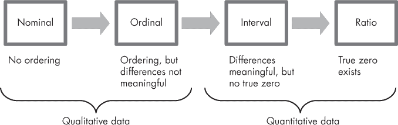

*图 4-1：四种数据类型*

图 4-1 中的每一步，从左到右，都为数据增加了左边数据类型所缺乏的内容。从名义数据到有序数据，我们增加了排序；从有序数据到区间数据，我们增加了有意义的差异；最后，从区间数据到比率数据增加了一个真正的零点。

在实际应用中，就统计学而言，我们应该了解数据的类型，以免做出没有意义的分析。如果我们有一份问卷，问题 A 在 1 到 5 的评分量表上的平均值为 2，而问题 B 的平均值为 4，我们不能说 B 的评分是 A 的两倍，只能说 B 的评分高于 A。在这个背景下，“两倍”是什么意思并不明确，很可能是没有意义的。

区间数据和比率数据可以是连续的（浮动数值）或离散的（整数）。从深度学习的角度看，模型通常将连续数据和离散数据同等对待，我们不需要对离散数据做任何特殊处理。

#### 在深度学习中使用名义数据

如果我们有一个名义值，比如一组颜色，像红色、绿色和蓝色，我们想将这些值传递到深度网络中，在使用之前我们需要先对数据进行转换。正如我们刚才看到的，名义数据是没有顺序的，所以虽然我们可能会想把红色赋值为 1，绿色赋值为 2，蓝色赋值为 3，但这样做是错误的，因为网络会将这些数字解释为区间数据。在这种情况下，对网络来说，蓝色 = 3（红色），这显然是无意义的。如果我们想将名义数据与深度网络一起使用，我们需要改变它，使得区间具有实际意义。我们通过*独热编码*来实现这一点。

在独热编码中，我们将单一的名义变量转化为一个向量，其中向量的每个元素对应于一个名义值。以颜色为例，单一的名义变量变成了一个三元素向量，一个元素代表红色，另一个代表绿色，最后一个代表蓝色。然后，我们将与颜色对应的值设置为 1，其它值设置为 0，如下所示：

| **值** |  | **向量** |
| --- | --- | --- |
| 红色 | → | 1 0 0 |
| 绿色 | → | 0 1 0 |
| 蓝色 | → | 0 0 1 |

现在，向量值变得有意义，因为它要么是红色（1），要么不是（0），要么是绿色（1），要么不是（0），要么是蓝色（1），要么不是（0）。零和一之间的区间具有数学意义，因为某个值的存在，比如红色，确实比它的缺失要“大”，对于每种颜色都一样。现在，这些值是区间型数据，网络可以使用它们。在一些工具包中，如 Keras，类标签在传递给模型之前会进行独热编码。这样做是为了确保向量输出能够与独热编码后的类标签在计算损失函数时良好地配合。

### 汇总统计

我们得到了一份数据集。我们该如何理解它呢？在使用它来构建模型之前，我们应该如何描述它，以便更好地理解它？

为了回答这些问题，我们需要了解*汇总统计*。计算汇总统计应该是你拿到新数据集后的第一件事。没有在构建模型之前查看数据集，就像买了一辆二手车，却没有检查轮胎，试驾一圈，也没看引擎盖下的情况。

不同的人对什么构成良好的汇总统计有不同的看法。我们将重点关注以下几项：均值；中位数；以及变异性度量，包括方差、标准差和标准误差。数据集的范围和众数也是常被提及的。*范围*是数据集中最大值和最小值之间的差异。*众数*是数据集中最频繁出现的值。我们通常通过直方图来视觉上感知众数，因为直方图展示了数据分布的形态。

#### 均值与中位数

我们大多数人在小学时学会了如何计算一组数字的平均值：将数字加起来，再除以数字的个数。这就是*算术平均数*，更具体地说，是*无权重*的算术平均数。如果数据集由一组值*{x[0]*, *x*[1], *x*[2], . . . , *x[n–1]*}组成，那么算术平均数是数据的总和除以数据集中元素的数量（*n*）。在符号上，我们可以这样表示：

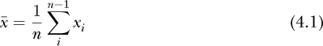

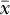 是表示样本均值的常见符号。

方程 4.1 计算的是无权重均值。每个值的权重为 1/*n*，所有权重的总和为 1.0。有时，我们可能需要对数据集中的元素赋予不同的权重；换句话说，并不是所有元素都应该平等计算。在这种情况下，我们计算加权均值，

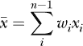

其中 *w[i]* 是赋予 *x[i]* 的权重，Σ*[i]w[i]* = 1。权重不是数据集的一部分，它们需要从其他地方获取。许多大学使用的学分绩点（GPA）就是加权均值的一个例子。每门课程的成绩乘以课程学分，然后将总和除以学分总数。从代数上讲，这相当于将每个成绩乘以一个权重，*w[i]* = *c[i]*/Σ*[i]**c[i]*，其中 *c[i]* 是课程 *i* 的学分，Σ*[i]**c[i]* 是学期的学分总数。

##### 几何均值

算术均值是目前最常用的均值。然而，还有其他均值。两个正数 *a* 和 *b* 的*几何均值*是它们乘积的平方根：

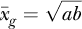

一般来说，*n* 个正数的几何均值是它们乘积的*n*次方根：

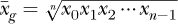

几何均值通常用于金融中计算平均增长率。在图像处理中，几何均值可以作为滤波器来帮助减少图像噪声。在深度学习中，几何均值出现在*马修斯相关系数（MCC）*中，MCC 是我们用来评估深度学习模型的指标之一。MCC 是另外两个指标——信息度和显著度的几何均值。

##### 调和均值

两个数 *a* 和 *b* 的*调和均值*是它们倒数的算术均值的倒数：

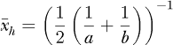

一般来说，

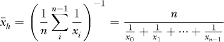

调和均值在深度学习中表现为 F1 分数。这是一个常用的评估分类器的指标。F1 分数是召回率（灵敏度）和精确度的调和均值：

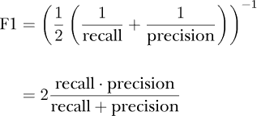

尽管 F1 分数经常被使用，但并不建议用它来评估深度学习模型。为了说明这一点，考虑召回率和精确度的定义：

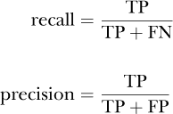

在这里，TP 是真正阳性（True Positive）的数量，FN 是假阴性（False Negative）的数量，FP 是假阳性（False Positive）的数量。这些值来自于用于评估模型的测试集。分类器的第四个重要数字是 TN，即真正阴性（True Negative）的数量（假设为二分类器）。F1 分数忽略 TN，但为了了解模型的表现，我们需要考虑正类和负类的分类。因此，F1 分数具有误导性，通常过于乐观。更好的度量标准是上面提到的 MCC 或 Cohen’s κ（Kappa），它与 MCC 相似，通常会紧密跟踪其变化。

##### 中位数

在我们继续讨论变异度量之前，还有一个常用的总结性统计量我们在这里提到。它稍后会在本章中再次出现。数据集的*中位数*是中间值。它是数据按数值排序后，数据集一半的值位于它之下，一半的值位于它之上的那个值。我们使用这个数据集：

*X* = {55,63,65,37,74,71,73,87,69,44}

如果我们对 *X* 进行排序，我们得到

{37, 44, 55, 63, 65, 69, 71, 73, 74, 87}

我们立刻看到一个潜在问题。我说过，我们需要在数据排序后得到中间值。对于 *X* 中的 10 个数据，没有真正的中间值。中间值位于 65 和 69 之间。当数据集中的元素数量是偶数时，中位数是两个中间数字的算术平均值。因此，在这种情况下，中位数是

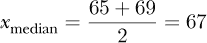

数据的算术平均值是 63.8。均值和中位数之间有什么区别？

从设计上看，中位数告诉我们将数据集分开的值，使得位于其上的样本数等于位于其下的样本数。重要的是样本的数量。对于均值，它是所有数据值的总和。因此，均值对值本身敏感，而中位数则对值的排序敏感。

如果我们观察 *X*，会看到大多数值位于 60 到 70 之间，只有一个较低的值 37。正是这个低值 37 使得均值相对于中位数较低。收入就是这种效应的一个典型例子。美国当前的家庭年收入中位数大约是 62,000 美元。最近的美国家庭收入均值接近 72,000 美元。二者之间的差异是因为少部分人群的收入远高于其他人，他们把整体均值拉高了。因此，对于收入而言，最有意义的统计量是中位数。

请参考 图 4-2。

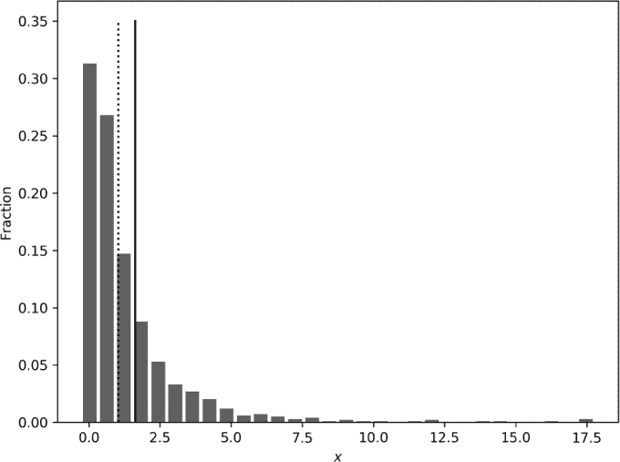

*图 4-2：均值（实线）和中位数（虚线）在样本数据集直方图上的绘制*

图 4-2 展示了从 1,000 个模拟数据样本生成的直方图。图中还标出了均值（实线）和中位数（虚线）。两者并不重合；直方图中的长尾将均值拉高。如果我们进行计数，会发现 500 个样本落在虚线以下的区间，500 个样本则落在虚线以上的区间。

有没有可能均值和中位数相同的情况？有的。如果数据的分布完全对称，那么均值和中位数将会相同。一个经典的例子就是正态分布。图 3-4 展示了一个正态分布，左右对称性非常明显。正态分布是特别的，我们将在本章中再次遇到它。现在要记住的是，数据集的分布越接近正态分布，均值和中位数就越接近。

另一个值得记住的情况是：如果数据集的分布与正态分布相差较远，如图 4-2 所示，那么中位数可能是更好的统计量，适合用来总结数据。

#### 变异度的度量

一名初学者射手向目标射击了 10 支箭。初学者的 8 支箭击中了目标，2 支箭完全偏离，且那 8 支命中的箭均匀分布在目标上。另一位专家射手向目标射击了 10 支箭，所有箭都射中了距离中心几厘米以内的区域。想一想这些箭的均值位置。对于专家射手，所有的箭都集中在目标中心附近，因此均值位置也会靠近中心。对于初学者，虽然没有箭射中目标中心，但它们大致均匀分布在目标的左右或上下。由于这个原因，平均位置将会平衡，并接近目标的中心。

然而，第一位射手的箭散布得较广，它们的位置变化很大。另一方面，第二位射手的箭聚集得很紧，位置变化很小。总结和理解数据集的一种有意义的方法是量化它的变化。让我们看看如何实现这一点。

##### 偏差与方差

我们衡量数据集变化的一种方法是找出*极差*，即最大值和最小值之间的差异。然而，极差是一个粗略的度量，因为它忽略了数据集中的大多数值，仅关注极端值。我们可以通过计算数据值与数据均值之间差异的平均值来做得更好。公式如下：

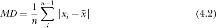

公式 4.2 是*平均偏差*。它是一种自然的度量，正是我们想要的：给出每个样本平均偏离均值的程度。虽然计算平均偏差没有问题，但你会发现它在实践中很少被使用。一个原因与代数和微积分有关。绝对值在数学上很麻烦。

让我们不用自然的变异度量，而是通过平方差来计算：

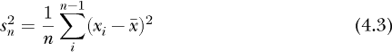

公式 4.3 被称为*偏差样本方差*。它是数据集中每个值与均值之间平方差的平均值。这是表征数据集散布的另一种方式。为什么它是偏差的，我们稍后会讨论。我们也会很快讨论为什么是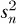而不是*s[n]*。

在我们继续之前，值得注意的是，你经常会看到一个稍微不同的公式：

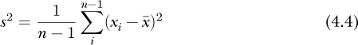

这个公式是*无偏样本方差*。用*n* – 1 代替*n*被称为贝塞尔修正。它与残差的自由度数相关，其中残差是从每个数据值中减去均值后剩余的部分。残差的总和为零，因此如果数据集中有*n*个值，知道*n* – 1 个残差就可以计算出最后一个残差。这为残差提供了自由度。我们“自由”地计算出*n* – 1 个残差，因为我们知道残差的总和为零，可以得出最后一个残差。除以*n*–1 可以给出方差的一个更少偏差的估计，假设本身一开始就有偏差。

为什么我们要讨论偏差方差和无偏方差？偏差是什么？我们应该始终记住，数据集是某个母体数据生成过程的一个样本，即母体。真实的母体方差（σ²）是母体围绕真实母体均值（μ）的散布。然而，我们不知道μ或σ²，因此我们从我们拥有的数据集中估计它们。样本的均值是。这是我们对μ的估计。然后，计算围绕的平方偏差的均值，并称之为我们对σ²的估计。这就是（公式 4.3）。这个结论虽然是正确的，但超出了我们展示的范围：是有偏差的，并不是σ²的最佳估计，但如果应用贝塞尔修正，我们将获得更好的母体方差估计。因此，我们应该使用*s*²（公式 4.4）来表征数据集围绕均值的方差。

总结来说，我们应该使用和 *s*² 来量化数据集的方差。那么，为什么是 *s*² 呢？方差的平方根是 *标准差*，对于总体来说用σ表示，针对从数据集中计算出的σ估计值用 *s* 表示。我们通常需要处理的是标准差。写平方根会很麻烦，因此约定俗成地用σ或 *s* 表示标准差，讨论方差时则使用其平方形式。

而且，由于生活本身已经足够模糊，你经常会看到σ被用作 *s*，以及方程式 4.3 被使用，而实际上它应该使用方程式 4.4。一些工具包，包括我们亲爱的 NumPy，便于使用错误的公式。

然而，随着数据集中样本数量的增加，偏差方差和无偏方差之间的差异逐渐减小，因为除以 *n* 或 *n* – 1 的影响变得越来越小。以下几行代码展示了这一点：

```py
>>> import numpy as np

>>> n = 10

>>> a = np.random.random(n)

>>> (1/n)*((a-a.mean())**2).sum()

0.08081748204006689

>>> (1/(n-1))*((a-a.mean())**2).sum()

0.08979720226674098
```

在这里，一个只有 10 个值的样本（`a`）显示了偏差方差和无偏方差在第三位小数上的差异。如果我们将数据集的大小从 10 增加到 10,000，我们会得到

```py
>>> n = 10000

>>> a = np.random.random(n)

>>> (1/n)*((a-a.mean())**2).sum()

0.08304350577482553

>>> (1/(n-1))*((a-a.mean())**2).sum()

0.08305181095592111
```

现在，偏差方差和无偏方差估计之间的差异已经在第五位小数。因此，对于我们通常在深度学习中使用的大数据集来说，实际上无论是使用 *s[n]* 还是 *s* 作为标准差都没多大区别。

**中位数绝对偏差**

标准差基于均值。如上所述，均值对极端值敏感，而标准差更为敏感，因为我们对每个样本的偏差进行平方处理。一个对数据集中极端值不敏感的变异性度量是 *中位数绝对偏差（MAD）*。MAD 定义为数据与中位数之间差异的绝对值的中位数：

MAD = 中位数(|*X[i]* – 中位数(*X*)|)

按步骤操作，首先计算数据的中位数，然后将其从每个数据值中减去，使结果为正，并报告该数据集的中位数。实现方法非常直接：

```py

def MAD(x):

    return np.median(np.abs(x-np.median(x)))
```

MAD 不常使用，但它对数据集中极端值的不敏感使得它在异常值检测中具有更频繁使用的价值。

##### 标准误差与标准差

我们还有一个方差的度量需要讨论：*均值的标准误差（SEM）*。SEM 通常简称为*标准误差（SE）*。为了理解 SE 是什么以及何时使用它，我们需要回到总体。如果我们从总体中选择一个样本，一个数据集，我们可以计算该样本的均值， 。如果我们选择多个样本并计算这些样本的均值，我们将生成一个包含来自总体样本均值的数据集。这听起来可能有些熟悉；它就是我们在第三章中用来说明中心极限定理的过程。均值集合的标准差就是标准误差。

标准差的标准误差公式很简单，

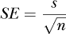

只是将样本标准差按样本数量的平方根进行缩放。

我们什么时候使用标准差，什么时候使用标准误差？使用标准差来了解样本围绕均值的分布情况。使用标准误差来说明样本均值对总体均值的估计有多好。从某种意义上讲，标准误差与中心极限定理有关，因为它影响来自总体的多个样本均值的标准差，同时也与大数法则相关，因为较大的数据集更有可能给出总体均值的更好估计。

从深度学习的角度来看，我们可能使用标准差来描述用于训练模型的数据集。如果我们训练和测试多个模型，并且记住深度网络初始化的随机性，我们可以对某个指标（例如准确度）计算这些模型的均值。在这种情况下，我们可能会报告均值准确度加上或减去标准误差。随着我们训练更多模型，并且更加确信均值准确度代表了模型架构所能提供的准确度，我们应该期望模型的均值准确度的误差会减少。

总结一下，在本节中，我们讨论了不同的总结性统计量，这些值可以帮助我们开始理解数据集。包括各种均值（算术均值、几何均值和调和均值）、中位数、标准差，以及在适当情况下，标准误差。现在，让我们看看如何使用图表来帮助理解数据集。

### 分位数和箱线图

要计算中位数，我们需要找到中间值，即将数据集分成两个部分的数值。从数学角度讲，我们说中位数将数据集分为两个分位数。

*分位数*将数据集划分为固定大小的组，其中固定大小是分位数中数据值的数量。由于中位数将数据集划分为两个大小相等的组，因此它是一个*2-分位数*。有时你会看到中位数被称为*第 50 百分位数*，意思是有 50%的数据值小于这个值。通过类似的推理，第 95 百分位数是 95%的数据集小于的值。研究人员通常计算 4-分位数，并称其为*四分位数*，因为它将数据集划分为四个组，其中 25%的数据值位于第一个四分位数，50%的数据值位于第一个和第二个四分位数，75%的数据值位于第一个、第二个和第三个四分位数，剩余的 25%的数据值位于第四个四分位数。

让我们通过一个例子来理解分位数的含义。这个例子使用了一个合成的考试数据集，代表了 1,000 个考试分数。请参阅文件*exams.npy*。我们将使用 NumPy 来为我们计算四分位数值，然后绘制该数据集的直方图，并标出四分位数值。首先，让我们计算四分位数的位置：

```py

d = np.load("exams.npy")

p = d[:,0].astype("uint32")

q = np.quantile(p, [0.0, 0.25, 0.5, 0.75, 1.0])

print("Quartiles: ", q)

print("Counts by quartile:")

print("    %d" % ((q[0] <= p) & (p < q[1])).sum())

print("    %d" % ((q[1] <= p) & (p < q[2])).sum())

print("    %d" % ((q[2] <= p) & (p < q[3])).sum())

print("    %d" % ((q[3] <= p) & (p < q[4])).sum())
```

这段代码以及生成图表的代码都在文件*quantiles.py*中。

首先，我们加载合成的考试数据并保留第一个考试分数（`p`）。注意，我们将`p`设置为整数数组，以便稍后使用`np.bincount`来制作直方图。（该代码未在上面显示。）然后，我们使用 NumPy 的`np.quantile`函数来计算四分位数值。该函数接受源数组和一个在[0, 1]范围内的分位数数组。这些值是从数组的最小值到最大值的距离的分数。所以，要求 0.5 分位数实际上是要求位于`p`的最小值和最大值之间的距离的一半的值，使得每个集合中的值的数量相等。

为了获得四分位数，我们请求 0.25、0.5 和 0.75 分位数，以获取使得`p`中 25%、50%和 75%的元素小于这些值的四分位数值。我们还请求 0.0 和 1.0 分位数，即`p`的最小值和最大值。这样做是为了方便我们在计算每个范围内元素数量时使用。注意，我们本可以使用`np.percentile`函数来代替，它返回与`np.quantile`相同的值，只不过使用的是百分位数而不是分数。在这种情况下，第二个参数应该是`[0,25,50,75,100]`。

返回的四分位数值在`q`中。我们打印它们以获取

```py

18.0, 56.75, 68.0, 78.0, 100.0
```

在这里，18 是最小值，100 是最大值，三个四分位数的截止值分别是 56.75、68 和 78。请注意，第二个四分位数的截止值是中位数 68。

剩下的代码计算`p`中每个范围内的值的数量。对于 1,000 个值，我们期望每个范围内有 250 个值，但因为数学运算不总是精确地落在现有数据值上，我们得到的结果是

```py

250, 237, 253, 248
```

意味着`p`中有 250 个元素小于 56.75，237 个元素在[56.75, 68]之间，依此类推。

上面的代码使用了一种巧妙的计数技巧，值得解释一下。我们想要计算`p`中某个范围内的值的数量。我们不能使用 NumPy 的`np.where`函数，因为它不喜欢复合条件语句。但是，如果我们使用像`10 <= p`这样的表达式，我们将得到一个与`p`大小相同的数组，其中每个元素如果满足条件，则为`True`，否则为`False`。因此，要求`10 <= p`且`p < 90`将返回两个布尔数组。要获得两个条件都为真的元素，我们需要将它们逻辑与（`&`）在一起。这样，我们得到一个与`p`大小和形状相同的最终数组，其中所有`True`元素表示`p`中位于 10, 90)范围内的值。要计算数量，我们可以使用`sum`方法，布尔数组中的`True`作为 1，`False`作为 0。

[图 4-3 显示了带有四分位数标记的考试数据直方图。

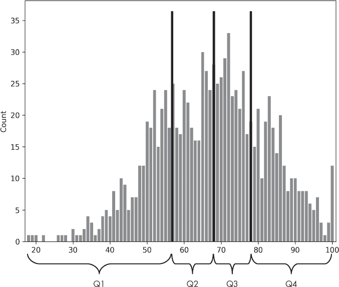

*图 4-3：带有四分位数标记的 1,000 个考试分数的直方图*

上面的示例再次展示了直方图在可视化和理解数据时的强大作用。我们应尽可能使用直方图来帮助理解数据集的情况。图 4-3 将四分位数值叠加在直方图上。这有助于我们理解四分位数是什么以及它们与数据值的关系，但这并不是一种典型的展示方式。更典型且更有用的展示方式是*箱形图*，因为它能够展示数据集的多个特征。现在让我们用它来展示上面的考试分数，这次我们还会包括之前忽略的另外两个考试分数集。

我们首先将展示一个箱形图，然后解释它。要查看*exams.npy*文件中三个考试的箱形图，请使用

```py

d = np.load("exams.npy")

plt.boxplot(d)

plt.xlabel("Test")

plt.ylabel("Scores")

plt.show()
```

我们加载完整的考试分数集，然后使用 Matplotlib 的`boxplot`函数。

看一下输出，见图 4-4。

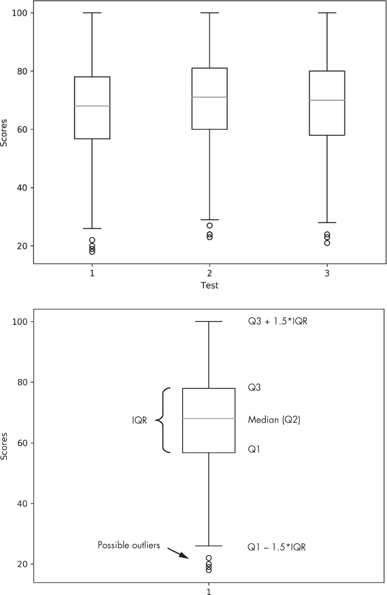

*图 4-4：三个考试的箱形图（上），以及带有标记组件的第一个考试的箱形图（下）*

图 4-4 中的上方图表显示了*|*exams.npy|中三个考试分数集的箱形图。这三个考试分数集的第一个在图 4-4 的下方再次绘制，并附有描述图表部分的标签。

箱形图为我们提供了数据的可视化摘要。图 4-4 中下方的图表中的盒子表示第一四分位数（Q1）和第三四分位数（Q3）之间的范围。Q3 和 Q1 之间的数值差异称为*四分位距（IQR）*。IQR 越大，数据在中位数周围的分布越广泛。注意，这次分数位于 y 轴上。我们本可以轻松地将图表设置为水平，但垂直显示是默认设置。中位数（Q2）标记在盒子中间附近。箱形图中没有显示均值。

箱线图包含了另外两条线，*胡须*，尽管 Matplotlib 称它们为 *飞行器*。如图所示，它们是 Q3 上方或 Q1 下方 1.5 倍 IQR 的值。最后，有一些圈圈标记为“可能的离群值”。根据惯例，位于胡须之外的值被认为是 *可能的离群值*，这意味着它们可能代表错误数据，要么是手动输入错误，要么更有可能是现在从故障传感器收到的错误数据。例如，CCD 相机上的亮点或坏点像素可能会被视为离群值。在评估潜在数据集时，我们应该对离群值保持敏感，并根据最佳判断来处理它们。通常，离群值并不多，我们可以将这些样本从数据集中删除而不会造成伤害。然而，也有可能这些离群值实际上是有效的，并且高度指示某个特定类别。如果是这种情况，我们希望将它们保留在数据集中，以期模型能够有效利用它们。经验、直觉和常识必须在这里指导我们。

让我们解释一下图 Figure 4-4 中显示的三组考试成绩的顶部图表。每次胡须的顶部都在 100，这很有道理：100 是满分，数据集中确实有 100 分。注意到图中的箱子部分并没有在胡须中垂直居中。回想一下，50% 的数据值位于 Q1 和 Q3 之间，箱子中的 Q2 以上和以下各占 25%，我们可以看到数据并不完全符合正态分布；它的分布偏离了正态曲线。回头看看图 Figure 4-3 中的直方图，第一场考试的数据也确认了这一点。类似地，我们看到第二次和第三次考试的数据也偏离了正态性。因此，箱线图可以告诉我们数据集的分布与正态分布的相似程度。当我们讨论假设检验时，我们需要知道数据是否符合正态分布。

那么，可能的离群值呢，低于 Q1 – 1.5 × IQR 的值？我们知道数据集代表的是考试成绩，因此常识告诉我们，这些并不是离群值，而是特别迷茫（或懒散）的学生的有效成绩。如果数据集包含高于 100 或低于 0 的值，那些才可以合理地标记为离群值。

有时丢弃含有离群值的样本是正确的做法。然而，如果离群值是由缺失数据引起的，去除样本可能就不可行了。让我们看看对于缺失数据我们可以做些什么，为什么我们通常应该像对待瘟疫一样避免它。

### 缺失数据

缺失数据就是我们没有的数据。如果数据集由表示特征向量的样本组成，缺失数据表现为某些样本中一个或多个特征由于某种原因没有被测量。通常，缺失数据会以某种方式进行编码。如果值仅为正数，缺失的特征可能会用 –1 或历史上用 –999 来标记。如果特征以字符串形式给出，字符串可能为空。对于浮点值，可以使用“不是一个数字”（NaN）。NumPy 使我们能够轻松检查数组中的 NaN，通过使用`np.isnan`：

```py
>>> a = np.arange(10, dtype="float64")

>>> a[3] = np.nan

>>> np.isnan(a[3])

True

>>> a[3] == np.nan

False

>>> a[3] is np.nan

False
```

注意，直接使用 `==` 或 `is` 来比较 `np.nan` 是行不通的；只有使用 `np.isnan` 测试才有效。

检测缺失数据是特定于数据集的。假设我们已经确信存在缺失数据，应该如何处理它？

让我们生成一个带有缺失值的小数据集，并利用现有的统计学知识来看看如何处理它们。以下代码在 `missing.py` 文件中。首先，我们生成一个包含 1,000 个样本的数据集，每个样本有四个特征：

```py

N = 1000

np.random.seed(73939133)

x = np.zeros((N,4))

x[:,0] = 5*np.random.random(N)

x[:,1] = np.random.normal(10,1,size=N)

x[:,2] = 3*np.random.beta(5,2,N)

x[:,3] = 0.3*np.random.lognormal(size=N)
```

数据集位于 `x` 中。我们固定随机数种子以获取可重复的结果。第一个特征是均匀分布的。第二个特征是正态分布的，第三个特征遵循 beta 分布，第四个特征遵循对数正态分布。

目前，`x` 没有缺失值。让我们通过将随机元素设为 NaN 来添加一些缺失值：

```py

i = np.random.randint(0,N, size=int(0.05*N))

x[i,0] = np.nan

i = np.random.randint(0,N, size=int(0.05*N))

x[i,1] = np.nan

i = np.random.randint(0,N, size=int(0.05*N))

x[i,2] = np.nan

i = np.random.randint(0,N, size=int(0.05*N))

x[i,3] = np.nan
```

现在，数据集的 5% 的值是 NaN。

如果一个大型数据集中的少数样本有缺失数据，我们可以删除这些样本而不必太担心。然而，如果 5% 的样本存在缺失数据，我们可能不想丢失这么多数据。更令人担忧的是，如果缺失数据与某个特定类别之间存在关联呢？丢弃这些样本可能会使数据集产生某种偏差，从而使得模型的效果变差。

那么，我们该怎么做呢？我们刚刚花了很多篇幅学习如何用基本的描述性统计来概括数据集。我们可以使用这些方法吗？当然可以。我们可以查看特征的分布，忽略缺失值，并利用这些分布来决定如何替换缺失数据。我们可能会天真地使用已有数据的均值，但查看分布可能会引导我们使用中位数，具体取决于分布是否远离正态分布。这似乎是箱线图的工作。幸运的是，Matplotlib 的 `boxplot` 函数很聪明；它会忽略 NaN。因此，生成箱线图只需要简单地调用 `boxplot(x)`。

图 4-5 展示了忽略 NaN 后的数据集。

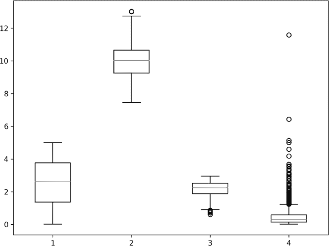

*图 4-5：忽略缺失值后的数据集箱线图*

图 4-5 中的框图展示了特征分布的情况。特征 1 服从均匀分布，因此我们期望在均值/中位数周围有一个对称的框（均匀分布的均值和中位数是相同的）。特征 2 服从正态分布，因此我们得到一个类似于特征 1 的框结构，但由于只有 1,000 个样本，出现了一些不对称性。特征 3 的贝塔分布向其范围的上端偏斜，这在箱型图中可以看到。最后，特征 4 的对数正态分布应该向较低值偏斜，长尾部分显现为许多位于胡须上方的“异常值”，这是一个警示，告诉我们不要盲目地将这些值称为异常值。

由于我们有一些特征的分布高度不符合正态分布，我们将用中位数来替换缺失值，而不是用均值。代码非常简单：

```py

good_idx = np.where(np.isnan(x[:,0]) == False)

m = np.median(x[good_idx,0])

bad_idx = np.where(np.isnan(x[:,0]) == True)

x[bad_idx,0] = m
```

这里，`i` 首先保存了特征 1 中非 NaN 的索引。我们使用这些索引来计算中位数（`m`）。接下来，我们将 `i` 设置为 NaN 的索引，并用中位数替换它们。我们可以对其他特征执行相同的操作，更新整个数据集，直到不再有缺失值。

我们是否对早期的分布产生了很大变化？没有，因为我们只更新了 5% 的值。例如，对于特征 3，根据贝塔分布，均值和标准差变化如下：

```py

non-NaN mean, std = 2.169986, 0.474514

updated mean, std = 2.173269, 0.462957
```

故事的启示是，如果缺失数据足够多，以至于删除它会使数据集产生偏差，那么最安全的做法是用均值或中位数替换缺失值。决定使用均值还是中位数时，可以参考描述性统计、箱型图或直方图。

此外，如果数据集是标注过的，比如深度学习数据集，那么上述过程需要使用每个类别的均值或中位数来完成。否则，计算出的值可能不适用于该类别。

在剔除缺失数据后，可以在该数据集上训练深度学习模型。

### 相关性

有时，数据集中的特征之间会存在某种关联。如果一个特征上升，另一个特征可能也会上升，尽管这种关系不一定是简单的线性关系。或者，另一个特征可能下降——这就是负相关。描述这种关联关系的正确术语是*相关性*。一种用于衡量相关性的统计量是理解数据集中特征之间关系的便捷工具。

例如，不难看出大多数图像的像素之间高度相关。这意味着如果我们随机选择一个像素，再选择一个相邻的像素，那么第二个像素很可能与第一个像素相似。如果这一点不成立，图像就会显得像是随机噪声。

在传统的机器学习中，高度相关的特征是不受欢迎的，因为它们不会提供任何新的信息，只会混淆模型。特征选择的整个艺术部分是为了去除这种影响。对于现代深度学习来说，由于网络本身学习输入数据的新表示，是否存在不相关的输入变得不那么重要。这部分原因也解释了为什么图像可以作为深度网络的输入，而在旧的机器学习模型中通常完全无法使用。

无论是传统学习还是现代学习，作为总结和探索数据集的一部分，特征之间的相关性是值得检查和理解的。在本节中，我们将讨论两种类型的相关性。每种类型都会返回一个数值，衡量数据集中两个特征之间的相关性强度。

#### 皮尔逊相关

*皮尔逊相关系数* 返回一个数值，*r* ϵ [–1, +1]，表示两个特征之间 *线性* 相关性的强度。这里的 *线性* 指的是我们能多强烈地用一条直线来描述特征之间的相关性。如果相关性是这样的，一个特征的增加正好与另一个特征的增加相对应，那么相关系数就是 +1。相反，如果第二个特征的减少正好与另一个特征的增加相对应，那么相关系数是 –1。相关系数为零表示两个特征之间没有关联；它们是（可能）独立的。

我在上面的句子中加了一个 *可能* 这个词，因为在某些情况下，两个特征之间的非线性依赖关系可能导致皮尔逊相关系数为零。然而，这种情况并不常见，对于我们的目的来说，我们可以认为接近零的相关系数表示两个特征是独立的。相关系数越接近零，无论是正还是负，特征之间的相关性越弱。

皮尔逊相关是通过两个特征的均值或两个特征乘积的均值来定义的。输入是两个特征，数据集中的两列。我们将这些输入称为 *X* 和 *Y*，其中大写字母表示数据值的向量。请注意，由于这两个特征来自数据集，*X[i]* 和 *Y[i]* 是成对出现的，意味着它们都来自同一个特征向量。

皮尔逊相关系数的公式是

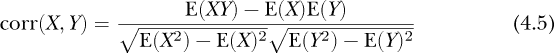

我们引入了一种新的但常用的符号表示法。*X* 的均值是 *X* 的 *期望*，记作 E(*X*)。因此，在公式 4.5 中，我们看到 *X* 的均值 E(*X*) 和 *Y* 的均值 E(*Y*)。正如我们所怀疑的那样，E(*XY*) 是 *X* 和 *Y* 的乘积的均值，逐元素计算。同样，E(*X*²) 是 *X* 与其自身的乘积的均值，而 E(*X*)² 是 *X* 的均值的平方。有了这个符号表示法，我们可以轻松编写自己的函数来计算两个特征向量的皮尔逊相关系数：

```py

import numpy as np

def pearson(x,y):

    exy = (x*y).mean()

    ex = x.mean()

    ey = y.mean()

    exx = (x*x).mean()

    ex2 = x.mean()**2

    eyy = (y*y).mean()

    ey2 = y.mean()**2

    return (exy - ex*ey)/(np.sqrt(exx-ex2)*np.sqrt(eyy-ey2))
```

`pearson` 函数直接实现了 公式 4.5。

让我们设置一个情境，可以使用 `pearson` 并将其与 NumPy 和 SciPy 提供的函数进行比较。接下来的代码，包括上面定义的 `pearson` 函数，都在 *correlation.py* 文件中。

首先，我们将创建三个相关的向量 `x`、`y` 和 `z`。我们假设这些是数据集中的特征，因此 `x[0]` 与 `y[0]` 和 `z[0]` 配对。我们需要的代码是

```py

np.random.seed(8675309)

N = 100

x = np.linspace(0,1,N) + (np.random.random(N)-0.5)

y = np.random.random(N)*x

z = -0.1*np.random.random(N)*x
```

注意，我们再次固定了 NumPy 的伪随机种子，以确保输出是可重复的。第一个特征 `x` 是从零到一的噪声线。第二个特征 `y` 跟踪 `x`，但由于与一个 0, 1) 之间的随机值相乘，它也是有噪声的。最后，`z` 与 `x` 是负相关的，因为它的系数是 -0.1。

[图 4-6 上方的图表顺序绘制了三个特征值，以观察它们如何相互跟踪。下方的图表则显示了三个特征作为配对点，其中一个值在 x 轴上，另一个值在 y 轴上。

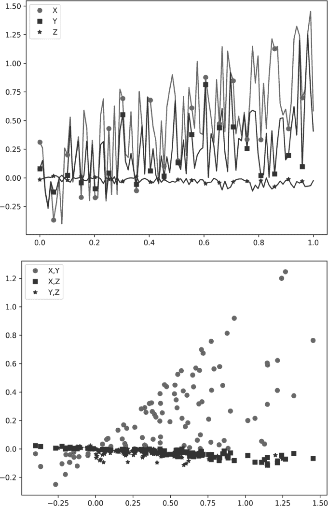

*图 4-6：三个特征按顺序展示它们如何相互跟踪（上图），以及将特征作为配对的散点图（下图）*

NumPy 用于计算皮尔逊相关系数的函数是 `np.corrcoef`。与我们的版本不同，这个函数返回一个矩阵，显示传递给它的所有变量对之间的相关性。例如，使用我们的 `pearson` 函数，我们得到如下的 `x`、`y` 和 `z` 之间的相关系数：

```py

pearson(x,y):  0.682852

pearson(x,z): -0.850475

pearson(y,z): -0.565361
```

NumPy 返回以下结果，其中 `x`、`y` 和 `z` 被堆叠为一个 3 × 100 的数组：

```py
>>> d = np.vstack((x,y,z))

>>> print(np.corrcoef(d))

[[ 1.          0.68285166 -0.85047468]

 [ 0.68285166  1.         -0.56536104]

 [-0.85047468 -0.56536104  1.        ]]
```

对角线对应于每个特征与自身的相关性，显然是完美的，因此为 1.0。`x` 与 `y` 之间的相关性位于元素 0,1 处，并与我们的 `pearson` 函数值匹配。同样，`x` 与 `z` 之间的相关性位于元素 0,2，`y` 与 `z` 之间的相关性位于元素 1,2。还要注意，矩阵是对称的，这与我们预期的相符，因为 corr(*X, Y*) = corr(*Y, X*)。

SciPy 的相关函数是 `stats.pearsonr`，其功能类似于我们的函数，但会返回一个 *p* 值和 *r* 值。我们将在本章后面讨论 *p* 值。我们使用返回的 *p* 值作为一个无相关系统产生计算得到的相关值的概率。对于我们的示例特征，*p* 值几乎等于零，这意味着没有合理的可能性是一个无相关的系统生成了这些特征。

我们之前提到过，对于图像来说，附近的像素通常是高度相关的。让我们看看这对于一张示例图像是否真的成立。我们将使用 `sklearn` 中提供的中国地图图像，并将绿色带的特定行作为配对向量。我们将计算两行相邻行、远离的行和一个随机向量的相关系数：

```py
>>> from sklearn.datasets import load_sample_image

>>> china = load_sample_image('china.jpg')

>>> a = china[230,:,1].astype("float64")

>>> b = china[231,:,1].astype("float64")

>>> c = china[400,:,1].astype("float64")

>>> d = np.random.random(640)

>>> pearson(a,b)

0.8979360

>>> pearson(a,c)

-0.276082

>>> pearson(a,d)

-0.038199
```

比较第 230 行和第 231 行可以看出它们高度正相关。比较第 230 行和第 400 行则显示出较弱的负相关性。最后，正如我们所预期的，与随机向量的相关性接近于零。

皮尔逊相关系数使用广泛，因此你常常会看到它仅被称为*相关系数*。现在让我们来看第二个相关性函数，并看看它与皮尔逊系数有何不同。

#### 斯皮尔曼相关性

我们将要探讨的第二个相关性度量是*斯皮尔曼相关系数*，ρ ϵ [–1, +1]。这是一个基于特征值排名的度量，而不是基于值本身。

为了对*X*进行排名，我们用*X*中每个值在*X*的排序版本中的索引替代每个值。如果*X*是

```py

[86, 62, 28, 43, 3, 92, 38, 87, 74, 11]
```

那么，排名是

```py

[7, 5, 2, 4, 0, 9, 3, 8, 6, 1]
```

因为当*X*排序时，86 排在第八位（从零开始计数），而 3 排在第一位。

皮尔逊相关性寻找的是线性关系，而斯皮尔曼则寻找输入之间的任何单调关联。

如果我们已经有了特征值的排名，那么斯皮尔曼系数就是

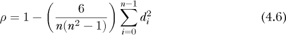

其中，*n*是样本数量，*d* = 排名(*X*) – 排名(*Y*)是成对的*X*和*Y*值的排名差异。请注意，只有在排名唯一时，方程式 4.6 才有效（即*X*或*Y*中没有重复值）。

为了计算方程式 4.6 中的*d*，我们需要对*X*和*Y*进行排名，并使用排名的差异。斯皮尔曼相关性是排名的皮尔逊相关性。

上面的示例展示了 Spearman 相关性的实现方法：

```py

import numpy as np

def spearman(x,y):

    n = len(x)

    t = x[np.argsort(x)]

    rx = []

    for i in range(n):

    rx.append(np.where(x[i] == t)[0][0])

rx = np.array(rx, dtype="float64")

t = y[np.argsort(y)]

ry = []

for i in range(n):

    ry.append(np.where(y[i] == t)[0][0])

ry = np.array(ry, dtype="float64")

d = rx - ry

return 1.0 - (6.0/(n*(n*n-1)))*(d**2).sum()
```

为了获得排名，我们首先需要对*X*（`t`）进行排序。然后，对于*X*（`x`）中的每个值，我们通过`np.where`找到它在`t`中的位置，并取第一个元素，第一个匹配项。在构建了`rx`列表后，我们将其转换为浮点 NumPy 数组。对于*Y*，我们做同样的事情来获得`ry`。有了排名，`d`被设置为它们的差值，然后使用方程式 4.6 返回斯皮尔曼ρ值。

请注意，这个版本的斯皮尔曼相关性受限于方程式 4.6，当*X*或*Y*中没有重复值时应使用。在本节中的示例使用了随机浮点数值，因此完全重复的概率非常低。

我们将比较我们的`spearman`实现与 SciPy 版本的`stats.spearmanr`。像 SciPy 版本的皮尔逊相关性一样，`stats.spearmanr`返回一个*p*-值。我们将忽略它。让我们看看我们的函数如何比较：

```py
>>> from scipy.stats import spearmanr

>>> print(spearman(x,y), spearmanr(x,y)[0])

0.694017401740174 0.6940174017401739

>>> print(spearman(x,z), spearmanr(x,z)[0])

-0.8950855085508551 -0.895085508550855

>>> print(spearman(y,z), spearmanr(y,z)[0])

-0.6414041404140414 -0.6414041404140414
```

我们与 SciPy 函数在浮点值的最后几位完全一致。

重要的是要记住皮尔逊相关性和斯皮尔曼相关性之间的根本区别。例如，考虑线性斜坡与 Sigmoid 函数之间的相关性：

```py

ramp = np.linspace(-20,20,1000)

sig = 1.0 / (1.0 + np.exp(-ramp))

print(pearson(ramp,sig))

print(spearman(ramp,sig))
```

这里，`ramp` 从 -20 增加到 20，而 `sig` 则呈现出 S 型曲线（“S” 曲线）。皮尔逊相关系数会偏高，因为随着 *x* 的增加，`ramp` 和 `sig` 都在增加，但这种关系并非完全线性。运行示例后得到的结果是

```py

0.905328

1.0
```

这表明皮尔逊相关系数为 0.9，但斯皮尔曼相关系数为 1.0，因为每次 `ramp` 增加时，`sig` 也只会增加，而没有其他变化。斯皮尔曼相关捕捉到了参数之间的非线性关系，而皮尔逊相关仅仅揭示了这一点。如果我们正在分析一个为传统机器学习算法准备的数据集，斯皮尔曼相关可能帮助我们决定保留哪些特征，丢弃哪些特征。

这标志着我们对统计学在描述和理解数据中的应用的探讨结束。接下来，让我们学习如何通过假设检验来解释实验结果，并回答像“这两组数据样本是否来自同一母体分布？”这样的问题。

### 假设检验

我们有两组各 50 名学生学习细胞生物学。由于学生是随机分配的，因此我们没有理由认为两组之间存在显著差异。组 1 参加了讲座，并额外完成了一系列结构化的计算机练习；组 2 仅参加了讲座。两组都参加了相同的期末考试，得到了表 4-1 中的测试成绩。我们想知道让学生进行计算机练习是否对他们的期末考试成绩有所影响。

**表 4-1：** 组 1 和 组 2 的测试成绩

| **组 1** | 81 80 85 87 83 87 87 90 79 83 88 75 87 92 78 80 83 91 82 88 89 92 97 82 79 82 82 85 89 91 83 85 77 81 90 87 82 84 86 79 84 85 90 84 90 85 85 78 94 100 |
| --- | --- |
| **组 2** | 92 82 78 74 86 69 83 67 85 82 81 91 79 82 82 88 80 63 85 86 77 94 85 75 77 89 86 71 82 82 80 88 72 91 90 92 95 87 71 83 94 90 78 60 76 88 91 83 85 73 |

图 4-7 展示了表 4-1 的数据箱线图。

为了了解两组之间的最终测试成绩是否有显著变化，我们需要进行假设检验。我们将使用的检验方法被称为 *假设检验*，这是现代科学中的一个关键环节。

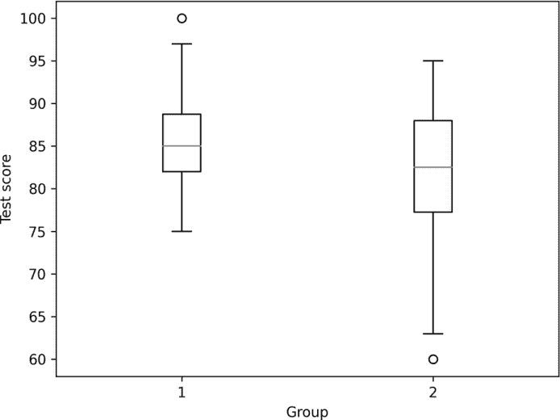

*图 4-7：来自表 4-1 的数据箱线图*

假设检验是一个广泛的主题，内容过于庞大，无法在这里提供全面介绍。由于这是一本关于深度学习的书，我们将重点讨论深度学习研究者可能遇到的情境。我们将仅考虑两种假设检验：针对方差不同的非配对样本的 t 检验（一个参数检验）和 Mann-Whitney U 检验（一个非参数检验）。随着我们深入了解这些检验的含义，我们将理解为什么选择这两种检验，以及什么是 *参数检验* 和 *非参数检验*。

要成功进行假设检验，我们需要明确什么是*假设*，因此我们首先会解决这个问题，并解释为何我们会限制考虑的假设检验类型。掌握了假设的概念后，我们将依次讨论 t 检验和 Mann-Whitney U 检验，并以表 4-1 中的数据作为示例。让我们开始吧。

#### 假设

为了了解两组数据是否来自相同的母体分布，我们可以查看摘要统计量。图 4-7 显示了第 1 组和第 2 组的箱型图。看起来这两个组的均值和标准差不同。我们怎么知道的呢？箱型图显示了中位数的位置，而“须”部分告诉我们一些关于方差的信息。这两者结合起来表明均值可能不同，因为中位数不同，并且这两组数据都在中位数周围对称。须之间的距离暗示了标准差。那么，让我们用数据集的均值来提出假设。

在假设检验中，我们有两个假设。第一个称为*零假设*（*H*[0]），即这两个数据集*来自*相同的母体分布，意味着它们没有显著的区别。第二个假设是*备择假设*（*H[a]*），即这两个组来自不同的分布。由于我们将使用均值，*H*[0]的意思是，这些数据实际上是来自生成这些数据的母体的均值是相同的。类似地，如果我们拒绝了*H*[0]，我们就隐式接受了*H[a]*，并声明我们有证据表明均值存在差异。由于我们没有真正的总体均值，因此我们将使用样本均值和标准差来代替。

假设检验并不能明确告诉我们*H*[0]是否成立。相反，它为我们提供了拒绝或接受零假设的证据。记住这一点是至关重要的。

我们正在测试两个独立样本，看看它们是否可以认为来自相同的母体分布。虽然有其他方式可以使用假设检验，但在深度学习中我们很少遇到。对于眼前的任务，我们需要样本均值和样本标准差。我们的测试将提出这样一个问题：“这两个数据集的均值之间有显著差异吗？”

我们只关心检测这两组数据是否来自相同的母体分布，因此我们将做出另一个简化假设：我们所有的检验都将是*双侧*的，或者说是*双尾*的。当我们使用像接下来要描述的 t 检验时，我们将我们的计算检验统计量（t 值）与检验统计量的分布进行比较，并询问我们计算得到的 t 值有多可能。如果我们想了解检验统计量高于或低于分布的某一部分，那么我们就是在进行双侧检验。如果我们只关心检验统计量是否超过某个特定值，而不关心它是否低于该值，或者反之，那么我们就是在进行单侧检验。

让我们列出我们的假设和方法：

1.  我们有两组独立的数据需要进行比较。

1.  我们并没有假设数据的标准差是否相同。

1.  我们的原假设是数据集的母体分布的均值相同，*H*[0] : μ[1] = μ[2]。我们将使用样本均值 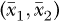 和样本标准差（*s*[1]，*s*[2]）来帮助我们决定接受或拒绝 *H*[0]。

1.  假设检验假定数据是*独立同分布（i.i.d.）*的。我们将其解释为数据是一个公平的随机样本。

在理解了这些假设之后，让我们从 t 检验开始，这是最广泛使用的假设检验方法。

#### t 检验

*t 检验*依赖于*t*，即检验统计量。这个统计量与 t 分布进行比较，并用来生成一个*p*-值，这个概率值将帮助我们得出关于 *H*[0] 的结论。t 检验和相关的 z 检验有着丰富的历史背景，我们在这里将忽略这些背景。我鼓励你在有机会时深入了解假设检验，或者至少复习一些关于正确进行假设检验和解读其结果的有价值文章。

t 检验是一个*参数检验*。这意味着数据和数据分布有一些假设。具体来说，t 检验假设除了数据是 i.i.d.之外，数据的分布（直方图）是正态分布。我们之前已经提到，许多物理过程似乎遵循正态分布，因此有理由认为实际测量的数据也可能遵循正态分布。

有很多方法可以测试数据集是否服从正态分布，但我们将忽略这些方法，因为关于此类测试的有效性存在一些争议。相反，我（有些鲁莽地）建议你同时使用 t 检验和 Mann-Whitney U 检验来帮助决定是否接受或拒绝 *H*[0]。使用这两种检验可能会导致它们得出相反的结论，一种检验表明存在反对零假设的证据，而另一种则表明没有证据。通常情况下，如果非参数检验表明有证据反对 *H*[0]，那么无论 t 检验的结果如何，应该接受这一证据。如果 t 检验结果反对 *H*[0]，但 Mann-Whitney U 检验结果没有，并且你认为数据是正态的，那么你可能也会接受 t 检验结果。

t 检验有不同的版本。我们在上面明确说明了将使用一个针对不同大小和方差的数据集设计的版本。我们将使用的 t 检验版本是 *Welch’s t-test*，它不假设两组数据的方差相同。

Welch’s t-test 的 t 分数是

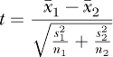

*n*[1] 和 *n*[2] 是两组的大小。

t 分数和一个称为 *自由度* 的相关值，类似于但又不同于上面提到的自由度，生成适当的 t 分布曲线。为了获得 *p*-值，我们计算曲线下的面积，包括正负 t 分数下方的面积，并将其返回。由于概率分布的积分为 1，正负 t 分数值到正负无穷大的尾部的总面积即为 *p*-值。我们将使用下面的自由度来帮助我们计算置信区间。

*p*-值告诉我们什么？它告诉我们，在零假设成立的情况下，看到我们看到的两个均值之间的差异，或更大的差异的概率。通常，如果这个概率低于我们设定的某个阈值，我们就拒绝零假设，并说我们有证据表明这两组的均值不同——它们来自不同的母体分布。当我们拒绝 *H*[0] 时，我们说这个差异是 *统计显著的*。接受/拒绝 *H*[0] 的阈值称为 α，通常 α = 0.05 是一个典型的（尽管有问题的）值。我们将在下面讨论为什么 0.05 是一个有问题的值。

需要记住的一点是，*p* 值假设零假设为真。它告诉我们，在假设真实 *H*[0] 的情况下，至少能得到我们所观察到的样本间差异或更大的差异的概率。如果 *p* 值较小，这有两种可能的含义：（1）零假设是错误的，或者（2）随机抽样误差导致我们得到了超出预期的样本。由于 *p* 值假设 *H*[0] 为真，一个较小的 *p* 值有助于我们减少对（2）的信心，并增加对（1）可能正确的信心。然而，*p* 值本身不能确认（1）；需要其他知识的支持。

我提到使用 α = 0.05 是有问题的。问题的主要原因是它过于宽松，导致过多地拒绝真实的零假设。根据 James Berger 和 Thomas Sellke 在其文章《检验点零假设：*P* 值与证据的不可调和性》（*美国统计学会期刊*，1987 年）中的论述，当 α = 0.05 时，大约 30% 的真实零假设会被拒绝。而当我们使用类似 α ≤ 0.001 的值时，错误拒绝真实零假设的几率降到不到 3%。这个故事的寓意是，*p* < 0.05 不是魔法，坦率地说，对于单个研究来说是不可令人信服的。应该寻找至少为 0.001，或者最好更小的高度显著的 *p* 值。在 *p* = 0.05 时，所得到的只是一个提示，应该重复实验。如果重复实验的 *p* 值都接近 0.05，那么拒绝零假设才开始显得有意义。

##### 置信区间

与 *p* 值一起，你通常还会看到 *置信区间（CIs）*。置信区间提供了一个范围，在这个范围内我们认为群体均值的真实差异会存在，且具有对比两个数据集重复样本的给定置信度。通常，我们报告的是 95% 置信区间。我们的假设检验通过检验样本均值的差异是否为零来检查均值是否相等。因此，任何包含零的置信区间都在告诉我们，不能拒绝零假设。

对于 Welch 的 t 检验，自由度是

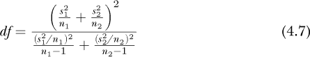

我们可以用它来计算置信区间，

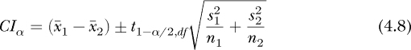

其中 *t*[1–α/2,*df*] 是临界值，t 值是根据给定的置信水平 (α) 和自由度 *df* 从公式 4.7 得出的。

我们应该如何解读 95% 置信区间？有一个总体值：群体均值之间的真实差异。95% 置信区间的含义是，如果我们能够从生成两个数据集的分布中反复抽取样本，95% 计算出的置信区间将包含均值之间的真实差异。它*不是*指包含均值差异的范围，且在 95% 的置信度下。

除了检查零是否在置信区间（CI）内外，CI 还有其他用途，因为它的宽度能告诉我们效应的大小。在这里，效应与均值之间的差异有关。我们可能基于*p*-值获得统计显著的差异，但效应可能在实际中没有意义。当效应较大时，CI 会很窄，因为小的 CI 表示一个包围真实效应的狭窄范围。我们稍后将看到，在可能的情况下，如何计算另一个有用的效应度量。

最后，一个小于 α 的 *p*-值也会有一个不包含 *H*[0] 的 *CI*[α]。换句话说，*p*-值和置信区间告诉我们的信息是同步的——它们不会互相矛盾。

##### 效应大小

拥有一个统计上显著的 *p*-值是一回事。另一个问题是由该 *p*-值表示的差异在现实世界中是否有意义。一个流行的效应大小度量是 *Cohen 的 d*。对于我们来说，因为我们使用的是 Welch 的 t 检验，Cohen 的 *d* 是通过计算得到的

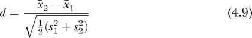

Cohen 的 *d* 通常是主观解释的，尽管我们也应该报告数值。主观上，效应的大小可以是

| ***d*** | **效应** |
| --- | --- |
| 0.2 | 小 |
| 0.5 | 中等 |
| 0.8 | 大 |

Cohen 的 *d* 是合理的。均值之间的差异是思考效应的一种自然方式。通过均值方差进行缩放后，它被置于一个一致的范围内。从公式 4.9 中我们可以看到，尽管与统计显著结果相关的 *p*-值可能导致一个小的效应，但该效应在实际中可能没有真正的重要性。

##### 评估测试成绩

让我们把以上所有内容结合起来，应用 t 检验到我们来自表格 4-1 的测试数据。你可以在文件 *hypothesis.py* 中找到代码。我们首先生成数据集：

```py

np.random.seed(65535)

a = np.random.normal(85,6,50).astype("int32")

a[np.where(a > 100)] = 100

b = np.random.normal(82,7,50).astype("int32")

b[np.where(b > 100)] = 100
```

再次强调，我们使用固定的 NumPy 伪随机数种子来确保可重复性。我们让 `a` 作为从均值为 85、标准差为 6.0 的正态分布中抽样的样本。我们从均值为 82、标准差为 7.0 的正态分布中选择 `b`。对于两者，我们将超过 100 的值限制为 100。毕竟，这些是考试成绩，没有额外学分。

接下来，我们应用 t 检验：

```py

from scipy.stats import ttest_ind

t,p = ttest_ind(a,b, equal_var=False)

print("(t=%0.5f, p=%0.5f)" % (t,p))
```

我们得到 *(t* = 2.40234, *p* = 0.01852)。*t* 是统计量，*p* 是计算得出的 *p*-值。它是 0.019，小于 0.05，但仅小了一倍。我们得到了一个较弱的结果，这告诉我们可能想要拒绝零假设，并认为两组 `a` 和 `b` 来自不同的分布。当然，我们知道它们确实来自不同的分布，因为我们是自己生成的，但看到检验结果朝正确的方向发展也让人放心。

请注意，我们从 SciPy 导入的函数是 `ttest_ind`。这是用于独立样本（即未配对样本）的函数。此外，请注意我们在调用时添加了 `equal_var=False`。这是使用 Welch 的 t 检验的方法，它不假设两个数据集之间的方差相等。我们知道它们不相等，因为 `a` 的标准差为 6.0，而 `b` 的标准差为 7.0。

为了获取置信区间，我们将编写一个 CI 函数，因为 NumPy 和 SciPy 没有包含此功能。该函数直接实现了 方程 4.7 和 4.8：

```py

from scipy import stats

def CI(a, b, alpha=0.05):

    n1, n2 = len(a), len(b)

    s1, s2 = np.std(a, ddof=1)**2, np.std(b, ddof=1)**2

    df = (s1/n1 + s2/n2)**2 / ((s1/n1)**2/(n1-1) + (s2/n2)**2/(n2-1))

    tc = stats.t.ppf(1 - alpha/2, df)

    lo = (a.mean()-b.mean()) - tc*np.sqrt(s1/n1 + s2/n2)

    hi = (a.mean()-b.mean()) + tc*np.sqrt(s1/n1 + s2/n2)

    return lo, hi
```

临界 *t* 值通过调用 `stats.t.ppf` 来获取，传入 α/2 值和正确的自由度 *df*。临界 *t* 值是 97.5 百分位值，对于 α = 0.05，这是 *百分位点函数 (ppf)* 返回的值。我们将其除以 2，以涵盖 t 分布的尾部。

对于我们的测试示例，置信区间为 [0.56105, 5.95895]。注意，这个区间不包含零，因此置信区间也表明结果具有统计学意义。然而，范围相当大，因此这不是一个特别稳健的结果。置信区间的范围可能单独解释起来较为困难，因此，最后，让我们计算 Cohen 的 *d*，看看考虑到置信区间的宽度，这是否合理。在代码中，我们实现了 方程 4.9：

```py

def Cohen_d(a,b):

    s1 = np.std(a, ddof=1)**2

    s2 = np.std(b, ddof=1)**2

    return (a.mean() - b.mean()) / np.sqrt(0.5*(s1+s2))
```

我们得到 *d* = 0.48047，对应于中等效应大小。

#### Mann-Whitney U 检验

t 检验假设源数据的分布是正态分布。如果数据不是正态分布，我们应当使用 *非参数检验*。非参数检验不对数据的基础分布做任何假设。*Mann-Whitney U 检验*，有时也称为 *Wilcoxon 秩和检验*，是一种非参数检验，用来帮助判断两组不同的数据是否来自相同的母体分布。Mann-Whitney U 检验不直接依赖于数据的值，而是使用数据的排名。

该检验的零假设如下：从第 1 组随机选出的值大于从第 2 组随机选出的值的概率为 0.5。我们可以稍微思考一下这个假设。如果数据来自同一个母体分布，那么我们应当期望从这两组中随机选出的任意一对值在大小上没有偏好。

备择假设是，随机从第 1 组选出的值大于随机从第 2 组选出的值的概率不为 0.5。请注意，这里并没有说明该概率是大于还是小于 0.5，仅仅是它不是 0.5；因此，我们将使用的 Mann-Whitney U 检验是双尾的。

Mann-Whitney U 检验的零假设与 t 检验的零假设不同。对于 t 检验，我们在问两组之间的均值是否相同。（实际上，我们在问均值的差异是否为零。）然而，如果两组数据确实来自不同的母体分布，那么这两个零假设都是错误的，因此我们可以用 Mann-Whitney U 检验替代 t 检验，特别是当数据不是正态分布时。

为了生成 *U*，即 Mann-Whitney 统计量，我们首先将两组数据合并并进行排名。相同的值会被替换为该值排名与下一个排名值之间的平均值。我们还会跟踪数据源组，以便稍后可以重新分组排名。按组求和后的排名得到 *R*[1] 和 *R*[2]（使用合并数据的排名）。我们计算两个值，

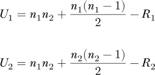

小的值称为 *U*，即检验统计量。可以从 *U* 生成 *p*-值，但需要记住上面关于 *p*-值含义和使用的讨论。与之前一样，*n*[1] 和 *n*[2] 是两组中的样本数。Mann-Whitney U 检验要求这两个数字中的较小者至少为 21 个样本。如果样本数不足，使用 SciPy `mannwhitneyu` 函数时，结果可能不可靠。

我们可以在来自表 4-1 的测试数据上运行 Mann-Whitney U 检验，

```py

from scipy.stats import mannwhitneyu

u,p = mannwhitneyu(a,b)

print("(U=%0.5f, p=%0.5f)" % (u,p))
```

使用上面提到的 `a` 和 `b` 作为 t 检验的样本。这给出了 *(U* = 997.00000, *p* = 0.04058)。*p*-值刚好低于 0.05 的最小阈值。

`a` 和 `b` 的均值分别是 85 和 82。如果我们将 `b` 的均值设置为 83 或 81，*p*-值会发生什么变化？改变 `b` 的均值意味着改变 `np.random.normal` 的第一个参数。这样做会得到表 4-2，在这里我已经包括了所有结果，以确保完整性。

**表 4-2：** 不同均值的模拟测试得分的 Mann-Whitney U 检验和 t 检验结果 (*n*[1]=*n*[2]=50)

| **均值** | **Mann-Whitney U** | **t 检验** |
| --- | --- | --- |
| 85 对比 83 | (*U*=1104.50000, *p*=0.15839) | (*t*=1.66543, *p*=0.09959) |
| 85 对比 82 | (*U*=997.00000, *p*=0.04058) | (*t*=2.40234, *p*=0.01852) |
| 85 对比 81 | (*U*=883.50000, *p*=0.00575) | (*t*=3.13925, *p*=0.00234) |

表 4-2 对我们来说应该是有意义的。当均值接近时，更难区分它们，因此我们期望更大的 *p*-值。回想一下，我们每组只有 50 个样本。当均值差异增大时，*p*-值会降低。均值差异为三时，*p*-值几乎达不到显著性。当差异更大时，*p*-值变得真正显著——这也是我们预期的结果。

上述分析引出了一个问题：对于两组之间均值差异较小的情况，*p*-值如何随样本量的变化而变化？

图 4-8 展示了 25 次运行中，Mann-Whitney U 检验和 t 检验在不同样本大小下的*p*-值（均值 ± 标准误差），以样本均值为 85 和 84 的情况为例。

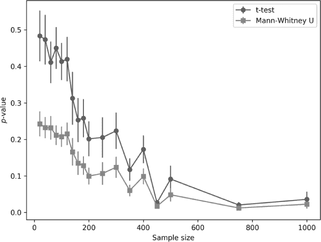

*图 4-8：均值 p 值与样本大小的关系，样本均值差异为 1，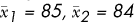*

小型数据集使得当均值差异较小时，很难区分不同的情况。我们还发现，较大的样本量能够揭示出差异，无论使用哪种测试。有趣的是，在图 4-8 中，尽管底层数据是正态分布的，Mann-Whitney U 检验的*p*-值却低于 t 检验。这与传统观念相反，通常情况下情况应该是相反的。

图 4-8 展示了大样本测试在检测实际差异方面的强大威力。当样本量足够大时，即使是微弱的差异也能变得显著。然而，我们需要与效应大小相平衡。当每组有 1,000 个样本时，我们得到一个统计学上显著的*p*-值，但 Cohen’s *d*约为 0.13，表示效应很弱。一项大样本研究可能会发现一个显著的效应，但其效应如此微弱，以至于在实践中几乎没有意义。

### 总结

本章涉及了你在深入学习深度学习过程中会遇到的统计学关键方面。具体来说，我们学习了不同类型的数据，以及如何确保数据对建立模型有用。接着，我们学习了总结性统计量，并通过示例帮助我们理解数据集。理解我们的数据是成功进行深度学习的关键。我们探讨了不同类型的均值，学习了变异性度量，并看到了通过箱型图可视化数据的实用性。

缺失数据是深度学习的一个痛点。在本章中，我们探讨了如何弥补缺失数据。接下来，我们讨论了相关性，如何检测和衡量数据集元素之间的关系。最后，我们介绍了假设检验。我们将讨论限制为在深度学习中最可能遇到的情景，学习了如何应用 t 检验和 Mann-Whitney U 检验。假设检验让我们接触到了*p*-值。我们看了它的示例，并讨论了如何正确地解释它。

在下一章，我们将告别统计学，深入探索线性代数的世界。线性代数是我们实现神经网络的基础。
