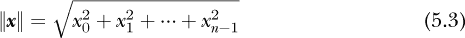
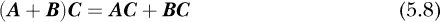

## 第五章：线性代数**


从形式上讲，线性代数是研究线性方程的学科，其中变量的最高次幂为一。然而，对于我们的目的来说，*线性代数*指的是多维数学对象——如向量和矩阵——以及对它们的运算。这就是线性代数在深度学习中的典型应用方式，也是实现深度学习算法的程序中数据操作的方式。通过做出这个区分，我们丢弃了大量有趣的数学内容，但由于我们的目标是理解深度学习中使用和应用的数学，因此我们希望能够得到宽恕。

在本章中，我将介绍在深度学习中使用的对象，特别是标量、向量、矩阵和张量。正如我们所看到的，这些对象实际上都是不同阶数的张量。我们将从数学和符号的角度讨论张量，然后使用 NumPy 进行实验。NumPy 明确设计用于向 Python 添加多维数组，它们是我们在本章中处理的数学对象的良好，但并不完全相同的类比。

我们将在本章的大部分时间里学习如何进行张量运算，这对于深度学习至关重要。实现高性能深度学习工具包的大部分努力，都涉及找到尽可能高效地进行张量运算的方法。

### 标量、向量、矩阵和张量

让我们来介绍一下我们的角色阵容。我会将它们与 Python 变量和 NumPy 数组相关联，展示我们如何在代码中实现这些对象。然后，我会展示张量与几何之间的一个便捷概念映射。

#### 标量

即使你不熟悉这个词，从你第一次学习计数那天起，你就已经知道标量是什么了。*标量*就是一个数字，比如 7、42 或 π。在表达式中，我们将使用*x*来表示标量，也就是用于表示变量的普通符号。对于计算机来说，标量是一个简单的数值变量：

```py
>>> s = 66

>>> s

66
```

#### 向量

*向量*是一个一维数字数组。从数学上讲，向量有方向性，可以是水平或垂直的。如果是水平的，它就是一个*行向量*。例如，


是一个由三个元素或分量构成的行向量。请注意，我们将使用**x**，一个加粗的小写字母，来表示向量。

从数学上讲，向量通常被认为是*列向量*，


其中***y***有四个分量，因此它是一个四维（4D）向量。请注意，在公式 5.1 中我们使用了方括号，而在公式 5.2 中我们使用了圆括号。两种符号表示方法都是可以接受的。

在代码中，我们通常将向量实现为一维数组：

```py
>>> import numpy as np

>>> x = np.array([1,2,3])

>>> print(x)

[1 2 3]

>>> print(x.reshape((3,1)))

[[1]

 [2]

 [3]]
```

在这里，我们使用`reshape`将三元素行向量转变为一个三行一列的列向量。

向量的分量通常被解释为沿一组坐标轴的长度。例如，三分量向量可能用于表示三维空间中的一个点。在这个向量中，

***x*** = [*x*, *y*, *z*]

*x* 可能是沿 x 轴的长度，*y* 是沿 y 轴的长度，*z* 是沿 z 轴的长度。这些是笛卡尔坐标，旨在唯一地标识三维空间中的所有点。

然而，在深度学习和机器学习中，向量的分量通常在几何意义上彼此不相关。相反，它们被用来表示*特征*，即模型用来尝试得出有用输出（如类别标签或回归值）的一些样本的性质。也就是说，表示特征集合的向量，称为*特征向量*，有时会从几何角度进行思考。例如，一些机器学习模型，如*k*-最近邻算法，将向量解释为几何空间中的某个坐标。

你经常会听到深度学习领域的人讨论问题的*特征空间*。特征空间指的是可能输入的集合。模型的训练集需要准确地表示模型在使用时会遇到的可能输入的特征空间。从这个意义上讲，特征向量是一个点，一个在这个*n*维空间中的位置，其中*n*是特征向量中的特征数量。

#### 矩阵

*矩阵*是一个二维数组：


***A***的元素通过行号和列号进行下标标记。矩阵***A***有三行四列，所以我们说它是一个 3 × 4 矩阵，其中 3 × 4 是矩阵的*阶*。请注意，***A***使用的是从 0 开始的下标。数学文本通常从 1 开始，但越来越多的情况下，使用 0，这样就不会在数学表示和矩阵的计算机表示之间产生偏移。还要注意，我们将使用***A***，一个加粗的大写字母，表示一个矩阵。

在代码中，矩阵表示为二维数组：

```py
>>> A = np.array([[1,2,3],[4,5,6],[7,8,9]])

>>> print(A)

[[1 2 3]

 [4 5 6]

 [7 8 9]]

>>> print(np.arange(12).reshape((3,4)))

[[ 0 1 2 3]

 [ 4 5 6 7]

 [ 8 9 10 11]]
```

在 Python 中，要获取矩阵***A***的元素*a*[12]，我们写作`A[1,2]`。请注意，当我们打印数组时，它们周围有一个额外的`[`和`]`。NumPy 使用这些括号来表示二维数组可以被视为行向量，其中每个元素本身就是一个向量。在 Python 术语中，这意味着矩阵可以被视为一个子列表的列表，每个子列表的长度相同。当然，这正是我们最初定义`A`的方式。

我们可以将向量看作是只有一行或一列的矩阵。一个三元素的列向量是一个 3 × 1 矩阵：它有三行和一列。类似地，一个四元素的行向量就像一个 1 × 4 矩阵：它有一行和四列。我们稍后将利用这一观察结果。

#### 张量

标量没有维度，向量有一个维度，矩阵有两个维度。正如你可能猜到的，我们并不止步于此。一个具有超过两维的数学对象通常被称为*张量*。在必要时，我们会像这样表示张量：`T`，作为无衬线大写字母。

张量的维度数量定义了其*阶*，这与矩阵的阶不同。一个 3D 张量的阶是 3。矩阵是一个阶为 2 的张量。向量是一个阶为 1 的张量，而标量是一个阶为 0 的张量。当我们在第九章讨论数据流过深度神经网络时，我们会看到许多工具包使用阶为 4（或更多）的张量。

在 Python 中，具有三维或更多维度的 NumPy 数组用于实现张量。例如，我们可以如下定义一个阶为 3 的张量：

```py
>>> t = np.arange(36).reshape((3,3,4))

>>> print(t)

[[[ 0 1 2 3]

  [ 4 5 6 7]

  [ 8 9 10 11]]

 [[12 13 14 15]

  [16 17 18 19]

  [20 21 22 23]]

 [[24 25 26 27]

  [28 29 30 31]

  [32 33 34 35]]]
```

在这里，我们使用`np.arange`定义`t`为一个包含 36 个元素的向量，数值为 0 . . . 35。然后，我们立即将这个向量`reshape`成一个 3 × 3 × 4 的张量（3 × 3 × 4 = 36）。可以将 3 × 3 × 4 的张量理解为包含三张 3 × 4 图像的堆叠。如果我们记住这一点，以下语句就能理解：

```py
>>> print(t[0])

[[ 0 1 2 3]

 [ 4 5 6 7]

 [ 8 9 10 11]]

>>> print(t[0,1])

[4 5 6 7]

>>> print(t[0,1,2])

6
```

请求`t[0]`将返回堆叠中的第一张 3 × 4*图像*。那么，接着请求`t[0,1]`将返回第一张图像的第二行，正如它所做的那样。最后，我们通过请求图像编号（`0`）、行编号（`1`）和该行的元素（`2`）来访问`t`的单个元素。

将张量的维度分配给一个个更小的集合是帮助记住维度含义的便捷方式。例如，我们可以如下定义一个阶为 5 的张量：

```py
>>> w = np.zeros((9,9,9,9,9))

>>> w[4,1,2,0,1]

0.0
```

但是，要求`w[4,1,2,0,1]`是什么意思呢？确切含义取决于应用。例如，我们可能认为`w`代表一个书架。第一个索引选择书架，第二个选择书架上的书。接着，第三个索引选择书中的页面，第四个选择页面上的行。最后一个索引选择行中的单词。因此，`w[4,1,2,0,1]`就是要求从书架的第五层架子上的第二本书的第三页的第一行中获取第二个单词，从右到左读取索引可以理解这一点。

书架类比确实有其局限性。NumPy 数组具有固定的维度，这意味着如果`w`是一个书架，它有九层架子，每一层架子上有*正好*九本书。同样，每本书有正好九页，每一页有九行。最后，每一行有正好九个单词。NumPy 数组通常在计算机中使用连续内存，因此在定义数组时每个维度的大小是固定的。这样做，并选择特定的数据类型，如无符号整数，使得定位数组中的元素成为一个使用简单公式计算基址偏移量的索引操作。这也是 NumPy 数组比 Python 列表快得多的原因。

任何低于 *n* 阶的张量都可以通过提供缺失的长度为 1 的维度，表示为一个 *n* 阶的张量。我们在上面看到过一个例子，当我说一个 *m* 维向量可以看作是一个 1 × *m* 或 *m* × 1 矩阵时。通过添加一个长度为 1 的缺失维度，1 阶张量（向量）变成了 2 阶张量（矩阵）。

作为一个极端例子，我们可以将一个标量（0 阶张量）当作一个 5 阶张量来处理，如下所示：

```py
>>> t = np.array(42).reshape((1,1,1,1,1))

>>> print(t)

[[[[[42]]]]]

>>> t.shape

(1, 1, 1, 1, 1)

>>> t[0,0,0,0,0]

42
```

在这里，我们将标量 `42` 重新塑形为一个 5 阶张量（一个五维 [5D] 数组），每个轴的长度都是 1。注意，NumPy 告诉我们张量 `t` 有五个维度，`42` 周围的 `[[[[[` 和 `]]]]]` 表明了这一点。请求 `t` 的形状验证了它是一个 5D 张量。最后，作为张量，我们可以通过指定所有维度 `t[0,0,0,0,0]` 来获取它包含的唯一元素的值。我们经常会使用这个添加新维度的技巧。事实上，在 NumPy 中，有一种直接执行此操作的方法，您将在使用深度学习工具包时看到：

```py
>>> t = np.array([[1,2,3],[4,5,6]])

>>> print(t)

[[1 2 3]

 [4 5 6]]

>>> w = t[np.newaxis,:,:]

 >>> w.shape

(1, 2, 3)

>>> print(w)

[[[1 2 3]

  [4 5 6]]]
```

在这里，我们通过使用 `np.newaxis` 创建一个长度为 1 的新轴，将 `t`（一个 2 阶张量，即矩阵）转变为 3 阶张量。这就是为什么 `w.shape` 返回 `(1,2,3)` 而不是 `(2,3)`，就像 `t` 那样。

张量与三阶及以下几何体之间存在类比，有助于我们可视化不同阶数之间的关系：

| **阶数（维度）** | **张量名称** | **几何名称** |
| --- | --- | --- |
| 0 | 标量 | 点 |
| 1 | 向量 | 线 |
| 2 | 矩阵 | 平面 |
| 3 | 张量 | 体积 |

请注意，我在表格中使用了张量（*tensor*）这个常见的定义。似乎没有标准化的名称来表示 3 阶张量。

在这一部分中，我们将深度学习中的数学对象与多维数组相关联，因为它们在代码中是如何实现的。通过这样做，我们丢弃了很多数学内容，但保留了理解深度学习所需的部分。现在让我们继续，看看如何在表达式中使用张量。

### 张量的算术运算

本节的目的是详细说明张量的操作，特别强调 1 阶张量（向量）和 2 阶张量（矩阵）的操作。我们将假设标量的操作已经非常熟练。

我们将从我所称之为*数组操作*开始，指的是像 NumPy 这样的工具包在各种维度的数组上执行的逐元素操作。然后我们将继续讲解特定于向量的操作。这为关键的矩阵乘法话题奠定了基础。最后，我们将讨论块矩阵。

#### 数组操作

到目前为止，我们使用 NumPy 工具包的方式展示了所有常见的标量算术运算都可以直接转换到多维数组的世界中。这包括加法、减法、乘法、除法和指数运算等标准操作，以及对数组应用函数。在所有这些情况下，标量操作都逐元素地应用到数组的每个元素上。这里的示例将为本节的其余部分定下基调，并且也会让我们探索一些我们尚未提到的 NumPy 广播规则。

首先让我们定义一些数组来进行操作：

```py
>>> a = np.array([[1,2,3],[4,5,6]])

>>> b = np.array([[7,8,9],[10,11,12]])

>>> c = np.array([10,100,1000])

>>> d = np.array([10,11])

>>> print(a)

[[1 2 3]

 [4 5 6]]

>>> print(b)

[[ 7 8 9]

 [10 11 12]]

>>> print(c)

[  10 100 1000]

>>> print(d)

[10 11]
```

对于维度匹配的数组，逐元素的算术运算是非常简单的：

```py
>>> print(a+b)

[[ 8 10 12]

 [14 16 18]]

>>> print(a-b)

[[-6 -6 -6]

 [-6 -6 -6]]

>>> print(a*b)

[[ 7 16 27]

 [40 55 72]]

>>> print(a/b)

[[0.14285714 0.25       0.33333333]

 [0.4        0.45454545 0.5       ]]

>>> print(b**a)

[[       7       64      729]

 [   10000   161051  2985984]]
```

这些结果都很容易理解；NumPy 将所需的操作应用到每个数组的对应元素上。两个矩阵（`a`和`b`）之间的逐元素乘法通常称为*Hadamard 积*。（你会在深度学习文献中不时遇到这个术语。）

NumPy 工具包将逐元素操作的概念扩展到了它所称的*广播*。在广播时，NumPy 应用一些规则，我们通过示例可以看到这些规则，其中一个数组会广播到另一个数组上，生成有意义的输出。

我们之前已经遇到过在标量和数组操作时的一种广播形式。在那个例子中，标量值被广播到数组的每个值上。

在第一个示例中，尽管`a`是一个 2 × 3 矩阵，NumPy 通过应用广播允许它与三分量向量`c`进行操作：

```py
>>> print(a+c)

[[  11  102 1003]

 [  14  105 1006]]

>>> print(c*a)

[[  10 200 3000]

 [  40 500 6000]]

>>> print(a/c)

[[0.1  0.02  0.003]

 [0.4  0.05  0.006]]
```

在这里，三分量向量`c`已经广播到 2 × 3 矩阵`a`的行上。NumPy 识别到`a`和`c`的最后一个维度都是三维的，因此可以将向量传递到矩阵上，生成所需的输出。在查看深度学习代码时，尤其是 Python 代码，你会看到像这样的情况。有时需要一些思考，并结合在 Python 提示符下进行一些实验，才能理解发生了什么。

我们能否将`d`（一个包含两个元素的向量）广播到`a`（一个 2 × 3 矩阵）上？如果我们尝试用和将`c`广播到`a`相同的方式进行操作，我们将会失败：

```py
>>> print(a+d)

Traceback (most recent call last):

  File "<stdin>", line 1, in <module>

ValueError: operands could not be broadcast together with shapes (2,3) (2,)
```

然而，NumPy 的广播规则支持长度为 1 的维度。`d`的形状是 2，它是一个包含两个元素的向量。如果我们将`d`重塑为一个形状为 2 × 1 的二维数组，那么我们就给 NumPy 提供了它所需要的信息：

```py
>>> d = d.reshape((2,1))

>>> d.shape

(2, 1)

>>> print(a+d)

[[11 12 13]

 [15 16 17]]
```

我们现在看到 NumPy 将`d`加到`a`的列上。

让我们回到数学的世界，来看一下向量的运算。

#### 向量运算

向量在代码中通常表示为一组数值，这些数值可以解释为沿一组坐标轴的值。在这里，我们将定义几种独特的向量运算。

##### 大小

从几何意义上讲，我们可以理解向量具有方向和长度。它们通常被画成箭头，我们将在第六章中看到向量图的一个例子。人们称向量的长度为它的*大小*。因此，我们将考虑的第一个向量运算是计算其大小。对于一个具有*n*个分量的向量***x***，其大小的公式是



在方程 5.3 中，向量周围的双竖线表示它的大小。你也常常会看到有人使用单竖线。单竖线也用于表示绝对值；我们通常依赖上下文来区分这两者。

方程 5.3 是从哪里来的？考虑一个二维向量***x*** = (*x*, *y*)。如果*x*和*y*分别是沿 x 轴和 y 轴的长度，我们就会看到*x*和*y*构成了一个直角三角形的两边。这个直角三角形的斜边长度就是向量的长度。因此，根据毕达哥拉斯定理，以及比他早得多的巴比伦人，这个长度是 ，广义到*n*维度后，变为方程 5.3。

##### 单位向量

现在我们已经能够计算向量的大小，我们可以引入一种有用的向量形式，叫做*单位向量*。如果我们将向量的各个分量除以它的大小，我们就得到了一个与原始向量方向相同但大小为 1 的向量，这就是单位向量。对于向量***v***，方向相同的单位向量是


向量上方的帽子用来标识它是一个单位向量。让我们来看一个具体的例子。我们的示例向量是***v*** = (2, –4,3)。因此，方向与***v***相同的单位向量是


在代码中，我们计算单位向量的方式如下：

```py
>>> v = np.array((2, -4, 3))

>>> u = v / np.sqrt((v*v).sum())

>>> print(u)

[ 0.37139068 -0.74278135 0.55708601 ]
```

在这里，我们利用了这样一个事实：要平方`v`的每个元素，我们通过将其与自身相乘（逐元素操作），然后通过调用`sum`将各个分量加在一起，得到平方后的大小。

##### 向量转置

我们之前提到过，行向量可以被看作是 1 × *n*矩阵，而列向量是*n* × 1 矩阵。将行向量转变为列向量，反之亦然，被称为进行*转置*操作。在第六章中，我们将看到转置也适用于矩阵。在符号上，我们将向量***y***的转置表示为***y***^⊤。因此，我们有


当然，我们不仅仅局限于三个分量。

在代码中，我们以多种方式转置向量。正如我们上面所看到的，我们可以使用`reshape`将向量重塑为 1 × *n* 或 *n* × 1 矩阵。我们还可以在向量上调用`transpose`方法，或者小心地使用转置简写。让我们看一下所有这些方法的示例。首先，定义一个 NumPy 向量，看看`reshape`如何将其变成一个 3 × 1 列向量和一个 1 × 3 行向量，而不是一个包含三个元素的普通向量：

```py
>>> v = np.array([1,2,3])

>>> print(v)

[1 2 3]

>>> print(v.reshape((3,1)))

[[1]

 [2]

 [3]]

>>> print(v.reshape((1,3)))

[[1 2 3]]
```

注意第一次调用`print(v)`和最后调用`reshape((1,3))`后的区别。输出现在多了一对括号，以表示前导维度为一。

接下来，我们对`v`进行转置操作：

```py
>>> print(v.transpose())

[1 2 3]

>>> print(v.T)

[1 2 3]
```

这里，我们看到调用`transpose`或`T`并没有改变`v`。这是因为`v`的形状只是`3`，而不是`(1,3)`或`(3,1)`。如果我们显式地将`v`改为 1 × 3 矩阵，我们会看到`transpose`和`T`产生了期望的效果：

```py
>>> v = v.reshape((1,3))

>>> print(v.transpose())

[[1]

 [2]

 [3]]

>>> print(v.T)

[[1]

 [2]

 [3]]
```

这里，`v`从行向量变成了列向量，正如我们所期望的那样。那么，教训是，在 NumPy 代码中，要小心向量的实际维度。大多数时候，我们可以不太注意，但有时我们需要明确区分普通向量、行向量和列向量。

##### 内积

也许最常见的向量运算是*内积*，或者常被称为*点积*。在符号上，两个向量的内积写作


这里，*θ*是两个向量之间的角度（如果从几何角度解释）。内积的结果是标量。〈***a***, ***b***〉符号经常出现，尽管在深度学习文献中，***a*** • ***b*** 点积符号似乎更为常见。***a***^⊤***b*** 矩阵乘法符号明确指出了如何计算内积，但我们将在讨论矩阵乘法时解释其含义。目前，求和告诉我们所需的知识：两个长度为 *n* 的向量的内积是 *n* 个分量的乘积之和。

向量与自身的内积是其大小的平方：

***a*** • ***a*** = ||***a***||²

内积是可交换的，

***a*** • ***b*** = ***b*** • ***a***

和分配的，

***a*** • (***b*** + ***c***) = ***a*** • ***b*** + ***a*** • ***c***

但不是结合的，因为第一个内积的结果是标量，而不是向量，乘以标量的向量不是内积。

最后，请注意，当向量之间的角度为 90 度时，内积为零；这是因为 cos *θ* 为零（方程式 5.5）。这意味着这两个向量彼此垂直，或者说是*正交*的。

让我们来看几个内积的例子。首先，我们将直观地实现方程式 5.4：

```py
>>> a = np.array([1,2,3,4])

>>> b = np.array([5,6,7,8])

>>> def inner(a,b):

...   s = 0.0

...   for i in range(len(a)):

...     s += a[i]*b[i]

...   return s

...

>>> inner(a,b)

70.0
```

然而，由于 `a` 和 `b` 是 NumPy 数组，我们知道我们可以更高效地计算：

```py
>>> (a*b).sum()

70
```

或者，可能是最有效的做法，我们可以通过使用 `np.dot` 让 NumPy 为我们计算：

```py
>>> np.dot(a,b)

70
```

在深度学习代码中，你会经常看到 `np.dot`。它的功能不仅仅是计算内积，正如我们下面将看到的。

方程 5.5 告诉我们两向量之间的角度为：


在代码中，这可以计算为：

```py
>>> A = np.sqrt(np.dot(a,a))

>>> B = np.sqrt(np.dot(b,b))

>>> t = np.arccos(np.dot(a,b)/(A*B))

>>> t*(180/np.pi)

14.335170291600924
```

这告诉我们，在将 `t` 从弧度转换后，***a*** 和 ***b*** 之间的角度大约为 14°。

如果我们考虑三维空间中的向量，我们可以看到正交向量之间的点积为零，这意味着它们之间的角度是 90°：

```py
>>> a = np.array([1,0,0])

>>> b = np.array([0,1,0])

>>> np.dot(a,b)

0

>>> t = np.arccos(0)

>>> t*(180/np.pi)

90.0
```

之所以如此，是因为 `a` 是沿 x 轴的单位向量，`b` 是沿 y 轴的单位向量，我们知道它们之间有一个直角。

有了内积作为工具，让我们看看如何用它将一个向量投影到另一个向量上。

##### 投影

一个向量在另一个向量上的投影计算的是第一个向量在第二个向量方向上的分量。***a*** 在 ***b*** 上的投影为：


图 5-1 图示了二维向量投影的含义。


*图 5-1：**a** 在二维中投影到 **b** 的图形表示*

投影找到的是 ***a*** 在 ***b*** 方向上的分量。请注意，***a*** 在 ***b*** 上的投影与 ***b*** 在 ***a*** 上的投影是不一样的。

因为我们在分子中使用了内积，所以可以看到，将一个向量投影到与其正交的另一个向量上，其结果为零。第一个向量在第二个向量的方向上没有任何分量。再想一想 x 轴和 y 轴。我们使用笛卡尔坐标系的整个原因是这两条轴，或者在三维空间中的三条轴，都是互相正交的；一个轴的任何部分都不在其他轴的方向上。这使得我们能够通过指定沿这些轴的分量来确定任何点，以及从原点到该点的向量。稍后，当我们讨论特征向量和主成分分析时，我们将看到如何将一个物体分解成互相正交的分量，见 第六章。

在代码中，计算投影是直接的：

```py
>>> a = np.array([1,1])

>>> b = np.array([1,0])

>>> p = (np.dot(a,b)/np.dot(b,b))*b

>>> print(p)

[1\. 0.]

>>> c = np.array([-1,1])

>>> p = (np.dot(c,b)/np.dot(b,b))*b

>>> print(p)

[-1\. -0.]
```

在第一个例子中，***a*** 指向从 x 轴向上 45° 的方向，而 ***b*** 指向 x 轴。我们会预期 ***a*** 的投影沿 x 轴方向，这也是它所做的（`p`）。在第二个例子中，***c*** 指向从 x 轴开始 135° = 90° + 45° 的方向。因此，我们会预期 ***c*** 沿 ***b*** 的分量应沿 x 轴方向，但与 ***b*** 相反方向，这正是它所做的。

**注意**

*将 **c** 沿 **b** 投影得到了 y 轴分量 `–0`。负号是 IEEE 754 浮点数表示的一个特性。内部表示的尾数（有效数字）为零，但符号仍然可以指定，从而导致时不时地输出负零。关于计算机数字格式的详细解释，包括浮点数，请参阅我的书《数字与计算机》（Springer-Verlag，2017）。*

现在让我们继续讨论两个向量的外积。

##### 外积

两个向量的内积返回一个标量值。两个向量的*外积*则返回一个矩阵。注意，与内积不同，外积不要求两个向量具有相同的维度。具体来说，对于具有 *m* 个分量的向量 ***a*** 和具有 *n* 个分量的向量 ***b***，外积是通过将 ***a*** 中的每个元素与 ***b*** 中的每个元素相乘所形成的矩阵，如下所示。


***ab***^⊤ 符号表示通过矩阵乘法计算外积。请注意，这个符号不同于内积 ***a***^⊤***b***，并且它假设 ***a*** 和 ***b*** 是列向量。外积没有一个统一的操作符符号，主要是因为它可以通过矩阵乘法很容易地指定，并且比点积更少见。然而，当外积与二元操作符一起呈现时，⊗ 符号似乎是最常用的。

在代码中，NumPy 提供了一个外积函数：

```py
>>> a = np.array([1,2,3,4])

>>> b = np.array([5,6,7,8])

>>> np.dot(a,b)

70

>>> np.outer(a,b)

array([[ 5, 6, 7, 8],

       [10, 12, 14, 16],

       [15, 18, 21, 24],

       [20, 24, 28, 32]])
```

我们在讨论内积时使用了 `a` 和 `b`。如预期的那样，`np.dot` 给出了 ***a***•***b*** 的标量输出。然而，`np.outer` 函数返回一个 4 × 4 的矩阵，其中每一行是向量 `b` 依次乘以向量 `a` 中的每个元素，首先是 `1`，然后是 `2`，接着是 `3`，最后是 `4`。因此，`a` 中的每个元素都与 `b` 中的每个元素相乘。结果矩阵是 4 × 4，因为 `a` 和 `b` 都有四个元素。

笛卡尔积

两个向量的外积与两个集合 *A* 和 *B* 的笛卡尔积之间有直接的类比。*笛卡尔积*是一个新集合，其中的每个元素是 *A* 和 *B* 中元素的一对可能配对。所以，如果 *A*={1,2,3,4} 且 *B*={5,6,7,8}，则笛卡尔积可以表示为


在这里，我们看到如果我们将每个条目替换为对的乘积，就得到了我们在 NumPy `np.outer` 中看到的相应的向量积。同时，请注意，当处理集合时，笛卡尔积通常使用 × 来表示。

外积能够混合所有输入组合的能力已被应用于深度学习中的神经协同过滤和视觉问答等应用。这些功能通过先进的网络执行，这些网络可以进行推荐或回答关于图像的文本问题。外积表现为两种不同嵌入向量的混合。*嵌入*是由网络低层生成的向量，例如传统卷积神经网络（CNN）中的倒数第二个全连接层输出到 softmax 层之前的层。嵌入层通常被认为学会了网络输入的新表示。它可以被看作是将复杂的输入（如图像）映射到一个减少的空间，维度从几百到几千不等。

##### 叉积

我们的最终向量-向量运算符是*叉积*。这个运算符仅在三维空间（ℝ³）中定义。***a***和***b***的叉积是一个新的向量，它垂直于包含***a***和***b***的平面。请注意，这并不意味着***a***和***b***本身是垂直的。叉积定义为


其中  是单位向量，*θ*是***a***和***b***之间的夹角。的方向由*右手法则*确定。用右手时，将食指指向***a***的方向，中指指向***b***的方向。然后，大拇指将指向的方向。公式 5.6 给出了叉积向量在ℝ³中的实际分量。

NumPy 通过`np.cross`实现叉积运算：

```py
>>> a = np.array([1,0,0])

>>> b = np.array([0,1,0])

>>> print(np.cross(a,b))

[0 0 1]

>>> c = np.array([1,1,0])

>>> print(np.cross(a,c))

[0 0 1]
```

在第一个例子中，`a`沿 x 轴方向，`b`沿 y 轴方向。因此，我们预期叉积会垂直于这些轴，结果确实如此：叉积指向 z 轴。第二个例子表明，`a`和`b`是否彼此垂直并不重要。在这里，`c`与 x 轴成 45°角，但`a`和`c`仍在 xy 平面内。因此，叉积仍然沿 z 轴方向。

叉积的定义涉及到 sin *θ*，而内积则使用 cos *θ*。当两个向量彼此正交时，内积为零。而叉积则在两个向量方向相同的时候为零，并且在向量垂直时达到最大值。上面的第二个 NumPy 示例之所以成立，是因为`c`的大小是且 sin 。因此，因子相互抵消，最终叉积的大小为 1，因为`a`是单位向量。

叉乘广泛应用于物理学和其他科学中，但在深度学习中较少使用，因为它仅限于三维空间。然而，如果你打算深入研究深度学习文献，仍然应该对它有所了解。

这就结束了我们对向量-向量运算的讨论。让我们离开一维世界，继续探讨所有深度学习中最重要的运算：矩阵乘法。

#### 矩阵乘法

在前一部分中，我们讨论了如何通过多种方式相乘两个向量：Hadamard 积、内积（点积）、外积和叉积。在这一部分，我们将研究矩阵的乘法，回顾一下行向量和列向量本身就是只有一行或一列的矩阵。

##### 矩阵乘法的性质

我们将很快定义矩阵乘法运算，但在此之前，让我们先看一下矩阵乘法的性质。设***A***、***B***和***C***为矩阵。那么，根据代数约定，将符号放在一起表示乘法，

***(AB)C*** = ***A***(***BC***)

这意味着矩阵乘法是结合的。其次，矩阵乘法是分配的：



然而，通常情况下，矩阵乘法是*非*交换的：

***AB*** ≠ ***BA***

正如在方程 5.8 中所看到的，右侧加法下的矩阵乘法与左侧加法下的矩阵乘法产生不同的结果，正如在方程 5.7 中所示。这也解释了我们为什么要展示方程 5.7 和方程 5.8；矩阵乘法可以从左或右进行，结果会不同。

##### 如何相乘两个矩阵

要计算***AB***，知道***A***必须在***B***的左边，我们首先需要验证这两个矩阵是否兼容。只有当***A***的列数与***B***的行数相同时，才可以进行矩阵相乘。因此，如果***A***是一个*n × m*矩阵，***B***是一个*m × k*矩阵，那么乘积***AB***可以计算出来，并且将是一个新的*n* × *k*矩阵。

要计算这个乘积，我们需要进行一系列的内积运算，将***A***的行向量与***B***的列向量相乘。图 5-2 展示了一个 3 × 3 矩阵***A***和一个 3 × 2 矩阵***B***的计算过程。


*图 5-2：将一个 3 × 3 矩阵与一个 3 × 2 矩阵相乘*

在图 5-2 中，输出矩阵的第一行是通过计算 ***A*** 的第一行与 ***B*** 每一列的内积得到的。输出矩阵的第一个元素显示的是 ***A*** 的第一行与 ***B*** 的第一列相乘的结果。输出矩阵的其余第一行是通过将 ***A*** 的第一行与 ***B*** 剩余列的点积重复计算得到的。

让我们通过实际数字来展示图 5-2 中矩阵的示例：


注意，***AB*** 是已定义的，但 ***BA*** 不是，因为我们无法将一个 3 × 2 的矩阵与一个 3 × 3 的矩阵相乘。***B*** 的列数必须与 ***A*** 的行数相同。

另一种理解矩阵乘法的方法是考虑每个输出矩阵元素的构成。例如，如果 ***A*** 是 *n* × *m* 且 ***B*** 是 *m* × *p*，我们知道矩阵乘积作为 *n* × *p* 的矩阵 ***C*** 存在。我们通过计算得到输出元素。


对于*i* = 0, . . . , *n* − 1 和 *j* = 0, . . . , *p* − 1。在上面的示例中，我们通过求和 *a*[20]*b*[01] + *a*[21]*b*[11] + *a*[22]*b*[21] 来找到 *c*[21]，这符合方程 5.9，其中*i* = 2, *j* = 1 和 *k* = 0, 1, 2。

方程 5.9 告诉我们如何找到单个输出矩阵元素。如果我们对*i*和*j*进行循环，就可以找到整个输出矩阵。这意味着矩阵乘法有一个直接的实现方法：

```py
def matrixmul(A,B):

    I,K = A.shape

    J = B.shape[1]

    C = np.zeros((I,J), dtype=A.dtype)

    for i in range(I):

        for j in range(J):

            for k in range(K):

                C[i,j] += A[i,k]*B[k,j]

    return C
```

我们假设参数***A***和***B***是兼容的矩阵。我们设定输出矩阵***C***的行数（`I`）和列数（`J`），并将它们作为***C***元素的循环限制。我们创建输出矩阵`C`，并将其数据类型与`A`相同。接下来开始三重循环。`i`循环遍历输出矩阵的所有行。接下来的`j`循环遍历当前行的列，最内层的`k`循环则涵盖了`A`和`B`元素的组合，如方程 5.9 所示。当所有循环结束后，我们返回矩阵乘积`C`。

函数`matrixmul`有效，它可以计算矩阵乘积。然而，在实现方面，它相当简单。实际上，存在更先进的算法，并且在使用编译代码时，简单方法还有许多优化。如下面所示，NumPy 支持矩阵乘法，并且在内部使用高度优化的编译代码库，其性能远远超过上面提到的简单代码。

##### 内积和外积的矩阵表示法

现在我们已经准备好理解上面的矩阵表示法，用于两个向量的内积，***a***^⊤***b***，以及外积，***ab***^⊤。在第一种情况中，由于转置，我们有一个 1 × *n* 的行向量和一个 *n* × 1 的列向量。算法要求形成行向量和列向量的内积，得到一个 1 × 1 的输出矩阵，即一个单一的标量数值。请注意，***a*** 和 ***b*** 中必须有 *n* 个分量。

对于外积，我们左边有一个 *n* × 1 的列向量，右边有一个 1 × *m* 的行向量。因此，我们知道输出矩阵是 *n* × *m*。如果 *m* = *n*，我们将得到一个 *n* × *n* 的输出矩阵。一个行数和列数相等的矩阵称为 *方阵*。这些矩阵有特殊的性质，其中一些将在第六章中看到。

要通过矩阵乘法找到两个向量的外积，我们将 ***a*** 的每一行的每个元素与 ***b*** 的每一列相乘，作为一个行向量*。


在这里，***b***^⊤ 的每一列，一个标量数值，都会沿着 ***a*** 的行传递，从而形成两个向量元素之间的每一个可能的乘积。

我们已经了解了如何手动执行矩阵乘法。现在让我们看看 NumPy 如何支持矩阵乘法。

##### NumPy 中的矩阵乘法

NumPy 提供了两个可以用于矩阵乘法的不同函数。第一个是我们已经见过的 `np.dot`，尽管我们到目前为止只用它来计算向量的内积。第二个是 `np.matmul`，它也是在 Python 3.5 及更高版本中使用 `@` 二元运算符时调用的。使用这两个函数进行矩阵乘法时，结果都符合预期。然而，NumPy 有时将 1D 数组与行向量或列向量处理得不同。

我们可以使用`shape`来判断一个 NumPy 数组是 1D 数组、行向量还是列向量，如清单 5-1 所示：

```py
>>> av = np.array([1,2,3])

>>> ar = np.array([[1,2,3]])

>>> ac = np.array([[1],[2],[3]])

>>> av.shape

(3,)

>>> ar.shape

(1, 3)

>>> ac.shape

(3, 1)
```

*清单 5-1：NumPy 向量*

在这里，我们看到一个具有三个元素的 1D 数组 `av` 的形状与三个组件的行向量 `ar` 或三个组件的列向量 `ac` 不同。然而，这些数组都包含相同的三个整数：1，2 和 3。

让我们进行一个实验，帮助我们理解 NumPy 如何实现矩阵乘法。我们将测试`np.dot`，但是如果我们使用 `np.matmul` 或 `@` 运算符，结果是一样的。我们需要一些向量和矩阵来操作。然后，我们将把它们的组合应用于 `np.dot` 并考虑输出，如果该组合的操作未定义，可能会发生错误。

让我们创建我们需要的数组、向量和矩阵：

```py
a1 = np.array([1,2,3])

ar = np.array([[1,2,3]])

ac = np.array([[1],[2],[3]])

b1 = np.array([1,2,3])

br = np.array([[1,2,3]])

bc = np.array([[1],[2],[3]])

A = np.array([[1,2,3],[4,5,6],[7,8,9]])

B = np.array([[9,8,7],[6,5,4],[3,2,1]])
```

如果我们记住清单 5-1 的结果，物体的形状应该从定义中可以辨认出来。我们还将定义两个 3 × 3 的矩阵，`A` 和 `B`。

接下来，我们将定义一个辅助函数，包装对 NumPy 的调用，以便捕获任何错误：

```py
def dot(a,b):

    try:

        return np.dot(a,b)

    except:

        return "fails"
```

该函数调用 `np.dot` 并在调用失败时返回词语 `fails`。 表 5-1 显示了给定输入组合下 `dot` 的输出。

表 5-1 展示了 NumPy 有时如何将一维数组与行向量或列向量区分对待。请参见 表 5-1 中的 `a1,A` 与 `ar,A` 以及 `A,ac` 之间的区别。`A,ac` 的输出是我们在数学上期望看到的结果，其中列向量 ***a[c]*** 被 ***A*** 从左侧乘。

`np.dot` 和 `np.matmul` 之间有什么实际区别吗？是的，有一些区别。对于一维和二维数组，二者没有区别。然而，对于大于二维的数组，它们处理的方式有所不同，尽管我们这里不会涉及到这些。此外，`np.dot` 允许其参数之一是标量，并将另一个参数的每个元素都乘以该标量。使用 `np.matmul` 乘以标量会抛出错误。

**表 5-1：** 应用 `dot` 或 `matmul` 到不同类型参数的结果

| **参数** | **`np.dot` 或 `np.matmul` 的结果** |
| --- | --- |
| `a1,b1` | 14（标量） |
| `a1,br` | 失败 |
| `a1,bc` | [14]（1 维向量） |
| `ar,b1` | [14]（1 维向量） |
| `ar,br` | 失败 |
| `ar,bc` | [14]（1 × 1 矩阵） |
| `ac,b1` | 失败 |
| `ac,br` |  |
| `ac,bc` | 失败 |
| `A,a1` | [14 32 50]（3 维向量） |
| `A,ar` | 失败 |
| `A,ac` |  |
| `a1,A` | [30 36 42]（3 维向量） |
| `ar,A` | [30 36 42]（1 × 3 矩阵） |
| `ac,A` | 失败 |
| `A,B` |  |

#### 克罗内克积

我们将要讨论的矩阵乘法的最终形式是两个矩阵的*克罗内克积*或*矩阵直积*。在计算矩阵乘积时，我们混合了矩阵的各个元素，将它们相乘。对于克罗内克积，我们通过将一个矩阵的元素与另一个矩阵整个相乘，生成一个比输入矩阵更大的输出矩阵。克罗内克积也是引入*块矩阵*（即由较小矩阵（块）构成的矩阵）概念的便捷方式。

例如，如果我们有三个矩阵


我们可以将一个块矩阵***M***定义为以下内容。


其中，***M*** 的每个元素是一个较小的矩阵，堆叠在一起。

我们可以通过一个涉及块矩阵的视觉示例最简单地定义克罗内克积。***A*** 和 ***B*** 的克罗内克积，通常表示为 ***A*** ⊗ ***B***，是


对于***A***，一个*m* × *n* 矩阵。这是一个块矩阵，因为有***B***，因此，当完全展开时，Kronecker 积会产生一个比***A***或***B***都要大的矩阵。请注意，与矩阵乘法不同，Kronecker 积对于任意大小的***A***和***B***矩阵都是定义好的。例如，使用来自方程 5.10 的***A***和***B***，Kronecker 积为：


上面注意到我们使用了⊗表示 Kronecker 积。这是惯例，尽管符号⊗有时被误用，也用于其他含义。例如，我们曾用它表示两个向量的外积。NumPy 通过`np.kron`支持 Kronecker 积。

### 总结

在本章中，我们介绍了深度学习中使用的数学对象：标量、向量、矩阵和张量。然后，我们探讨了与张量的算术运算，特别是与向量和矩阵的运算。我们看到如何对这些对象进行操作，无论是在数学上还是通过 NumPy 代码。

然而，我们对线性代数的探索还没有完成。在接下来的章节中，我们将更深入地探讨矩阵及其属性，讨论我们能够做的一些重要事情。
