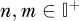
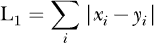
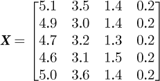

## 第六章：更多的线性代数**


在本章中，我们将继续探索线性代数的概念。虽然其中一些概念与深度学习的关系仅是间接的，但它们是你最终会遇到的数学内容。可以将本章看作是假定的背景知识。

具体来说，我们将更深入地了解方阵的性质以及对方阵进行的操作，并介绍一些你在深度学习文献中常遇到的术语。之后，我将介绍方阵的特征值和特征向量的概念，并讲解如何找到它们。接下来，我们将探讨向量范数以及在深度学习中经常遇到的其他距离度量方式。到那个时候，我将介绍协方差矩阵这一重要概念。

我们将在本章最后通过演示主成分分析（PCA）和奇异值分解（SVD）来总结这一章节。这些常用的方法非常依赖于本章中介绍的概念和操作符。我们将了解 PCA 是什么，如何执行 PCA，以及从机器学习的角度它能给我们带来什么。类似地，我们将使用 SVD，看看如何用它来实现 PCA，以及如何计算矩形矩阵的伪逆。

### 方阵

方阵在线性代数的世界中占有特殊的地位。让我们更详细地探讨它们。这里使用的术语将在深度学习及其他领域中经常出现。

#### 为什么是方阵？

如果我们将一个矩阵与一个列向量相乘，我们将得到另一个列向量作为输出：


从几何角度解释，2 × 4 的矩阵将 4 × 1 的列向量（ℝ⁴ 中的一个点）映射到了 ℝ² 中的一个新点。这个映射是线性的，因为点的值仅仅是与 2 × 4 矩阵的元素相乘；没有非线性操作，比如将向量的分量升幂等操作。

从这个角度看，我们可以使用矩阵在不同空间之间进行点的变换。如果矩阵是方阵，比如 *n* × *n*，则映射是从 ℝ^(*n*) 到 ℝ^(*n*)。例如，考虑


其中，点 (11, 12, 13) 被映射到点 (74, 182, 209)，这两个点都位于 ℝ³ 中。

使用矩阵将点从一个空间映射到另一个空间，使得可以使用*旋转矩阵*将一组点绕某一轴旋转。对于简单的旋转，我们可以在二维中定义矩阵，


并且在三维空间中，


旋转通过一个角度 *θ* 来进行，对于三维空间，旋转是围绕 x 轴、y 轴或 z 轴进行的，如下标所示。

使用矩阵，我们可以创建一个*仿射变换*。仿射变换将一组点映射到另一组点，使得原空间中的直线上的点在映射后的空间中仍然位于直线上。该变换是

***y*** = ***Ax*** + ***b***

仿射变换将矩阵变换 ***A*** 与平移 ***b*** 结合，以将一个向量 ***x*** 映射到一个新的向量 ***y***。我们可以通过将 ***A*** 放在矩阵的左上角，并将 ***b*** 添加为右侧的新列，将此操作合并为一个单一的矩阵乘法。底部的一行全是零，右侧列中有一个 1，构成了增广的变换矩阵。对于仿射变换矩阵


和平移向量


我们得到


这种形式将一个点，*(x*, *y*)，映射到一个新的点，(*x*′, *y*′)。

这一操作与在实现神经网络时有时使用的 *偏置技巧* 完全相同，即通过在增广权重矩阵中包含一个额外的特征向量并将其设为 1 来“埋藏”偏置。事实上，我们可以将前馈神经网络视为一系列仿射变换，其中变换矩阵是层与层之间的权重矩阵，偏置向量提供了平移。每一层的激活函数改变了层与层之间的线性关系。正是这种非线性使得网络能够学习映射输入的全新方式，从而最终输出反映网络设计要学习的功能关系。

我们使用方阵来将点从一个空间映射回同一空间，例如围绕某个轴旋转它们。现在让我们来看看方阵的一些特殊性质。

#### 转置、迹和幂

第五章向我们展示了通过向量转置在列向量和行向量之间移动。转置操作不仅限于向量，它对任何矩阵都有效，通过沿主对角线翻转行和列。例如，


转置是通过翻转矩阵元素的索引形成的：

*a[ij]* ← *a[ij]*， *i* = 0, 1, …… , *n* − 1, *j* = 0, 1, …… , *m* − 1

这将一个 *n* × *m* 矩阵转换为一个 *m* × *n* 矩阵。注意，方阵在转置操作下其阶数保持不变，且主对角线上的值不变。

在 NumPy 中，你可以对数组调用 `transpose` 方法，但由于转置操作非常常见，也有一种简写方式（`.T`）。例如，

```py
>>> import numpy as np

>>> a = np.array([[1,2,3],[4,5,6],[7,8,9]])

>>> print(a)

[[1 2 3]

 [4 5 6]

 [7 8 9]]

>>> print(a.transpose())

[[1 4 7]

 [2 5 8]

 [3 6 9]]

>>> print(a.T)

[[1 4 7]

 [2 5 8]

 [3 6 9]]
```

*迹* 是另一个常见的操作，应用于方阵：


作为一个算子，迹有某些特性。例如，它是线性的：

tr(***A*** + ***B***) = tr***A*** + tr***B***

同样成立的是 tr(***A***) = tr(***A****^T*) 和 tr(***AB***) = tr(***BA***)。

NumPy 使用 `np.trace` 快速计算矩阵的迹，并使用 `np.diag` 返回矩阵的对角线元素作为一维数组。

(*a*[00]， *a*[11]，……， *a[n−1,n−1]*)

对于一个 *n* × *n* 或 *n* × *m* 矩阵。

对于 NumPy 来说，矩阵不需要是方阵，也可以返回其对角线上的元素。尽管从数学上讲，迹通常只适用于方阵，但 NumPy 会计算任何矩阵的迹，返回对角线元素的和：

```py
>>> b = np.array([[1,2,3,4],[5,6,7,8]])

>>> print(b)

 [[1 2 3 4]

 [5 6 7 8]]

>>> print(np.diag(b))

[1 6]

>>> print(np.trace(b))

7
```

最后，你可以将一个方阵与其自身相乘，这意味着你可以通过将方阵自乘*n*次来将其提升到整数幂*n*。请注意，这与将矩阵的元素提升到幂不同。例如，


矩阵的幂遵循与将任何数字提升到幂相同的规则：

***A**^n**A**^m* = ***A**^(n+m)*

(***A**^n*)^(*m*) = ***A**^(nm)*

对于（正整数），且***A***是方阵。

NumPy 提供了一种方法，比反复调用`np.dot`更高效地计算方阵的幂：

```py
>>> from numpy.linalg import matrix_power

>>> a = np.array([[1,2],[3,4]])

>>> print(matrix_power(a,2))

[[ 7 10]

 [15 22]]

>>> print(matrix_power(a,10))

[[ 4783807 6972050]

 [10458075 15241882]]
```

现在让我们考虑一些你可能会遇到的特殊方阵。

#### 特殊方阵

许多方阵（以及非方阵）已经得到了特殊的命名。有些名称非常直观，比如全是零或全是一次的矩阵，分别称为*零矩阵*和*单位矩阵*。NumPy 广泛使用这些：

```py
>>> print(np.zeros((3,5)))

[[0\. 0\. 0\. 0\. 0.]

 [0\. 0\. 0\. 0\. 0.]

 [0\. 0\. 0\. 0\. 0.]]

>>> print(np.ones(3,3))

[[1\. 1\. 1.]

 [1\. 1\. 1.]

 [1\. 1\. 1.]]
```

请注意，你可以通过将单位矩阵乘以*c*来找到任何常数值的矩阵。

请注意，上面提到的 NumPy 默认使用 64 位浮点数矩阵，对应于 C 语言中的`double`类型。请参见表 1-1，了解可能的数值数据类型。在纯数学中，我们不太关心数据类型，但在深度学习中，你需要注意，避免定义比实际需要更多内存的数组。许多深度学习模型对 32 位浮点数组非常满意，它们每个元素使用的内存是 NumPy 默认值的一半。另外，许多工具包也开始使用新的或以前不常用的数据类型，比如 16 位浮点数，以便更好地利用内存。NumPy 支持 16 位浮点数，可以通过将`dtype`设置为`float16`来实现。

#### 单位矩阵

到目前为止，最重要的特殊矩阵是*单位矩阵*。这是一个方阵，所有对角线上的元素都为 1：


单位矩阵在乘法中起着类似于数字 1 的作用。因此，

***AI*** = ***IA*** = ***A***

对于一个*n* × *n*的方阵***A***和一个*n* × *n*的单位矩阵***I***，在必要时，我们会添加下标以表示单位矩阵的阶数，例如，***I**[n]*。

NumPy 使用`np.identity`或`np.eye`生成给定大小的单位矩阵：

```py
>>> a = np.array([[1,2],[3,4]])

>>> i = np.identity(2)

>>> print(i)

[[1\. 0.]

 [0\. 1.]]

>>> print(a @ i)

 [[1\. 2.]

 [3\. 4.]]
```

仔细观察上面的例子。从数学角度看，我们说将方阵与相同阶数的单位矩阵相乘会返回原矩阵。然而，NumPy 做了一件我们可能不希望发生的事情。矩阵 `a` 被定义为整数元素，因此它的数据类型是 `int64`，这是 NumPy 对整数的默认数据类型。然而，由于我们没有显式地为 `np.identity` 指定数据类型，NumPy 默认使用了 64 位浮点数。因此，矩阵乘法（`@`）操作 `a` 和 `i` 返回了 `a` 的浮点版本。这种微妙的数据类型变化可能对后续计算很重要，因此，再次提醒，在使用 NumPy 时我们需要关注数据类型。

无论你使用 `np.identity` 还是 `np.eye` 都没关系。事实上，`np.identity` 实际上只是 `np.eye` 的一个封装。

##### 三角矩阵

有时，你会听到关于*三角*矩阵的说法。三角矩阵有两种：上三角和下三角。正如你从名字中可以直观推测的那样，上三角矩阵是指在主对角线或其上方有非零元素的矩阵，而下三角矩阵则只有在主对角线或其下方才有元素。例如，


是一个上三角矩阵，而


是一个下三角矩阵。一个只在主对角线上有元素的矩阵，毫不奇怪，是一个*对角矩阵*。

NumPy 有两个函数，`np.triu` 和 `np.tril`，分别返回给定矩阵的上三角部分或下三角部分。所以，

```py
>>> a = np.arange(16).reshape((4,4))

>>> print(a)

[[ 0  1  2  3]

 [ 4  5  6  7]

 [ 8  9 10 11]

 [12 13 14 15]]

>>> print(np.triu(a))

[[ 0 1  2  3]

 [ 0 5  6  7]

 [ 0 0 10 11]

 [ 0 0 0 15]]

>>> print(np.tril(a))

[[ 0  0  0  0]

 [ 4  5  0  0]

 [ 8  9 10  0]

 [12 13 14 15]]
```

我们在深度学习中不常使用三角矩阵，但我们在线性代数中确实使用它们，部分原因是计算行列式，接下来我们将讨论这一点。

#### 行列式

我们可以将方阵 *n* × *n* 的*行列式*看作是一个将方阵映射到标量的函数。在深度学习中，行列式的主要用途是计算矩阵的特征值。我们将在本章后面看到这是什么意思，但现在可以将特征值看作是与矩阵相关的特殊标量值。行列式还可以告诉我们矩阵是否有逆矩阵，下面我们也会看到这一点。在符号上，我们用竖线表示矩阵的行列式。例如，如果 ***A*** 是一个 3 × 3 的矩阵，我们写行列式为


我们明确声明行列式的值是一个标量（ℝ 的元素）。所有方阵都有一个行列式。现在，我们来考虑一下行列式的一些性质：

1.  如果 ***A*** 的任一行或列为零，则 det(***A***) = 0。

1.  如果 ***A*** 的任意两行相同，则 det(***A***) = 0。

1.  如果 ***A*** 是上三角或下三角矩阵，那么 det 。

1.  如果 ***A*** 是对角矩阵，那么 det 。

1.  单位矩阵的行列式，无论大小如何，都是 1。

1.  矩阵乘积的行列式等于行列式的乘积，det(***AB***) = det(***A***)det(***B***)。

1.  det(***A***) = det(***A***^⊤)。

1.  det(***A**^n*) = det(***A***)^(*n*)。

属性 7 指出，转置操作不会改变行列式的值。属性 8 是属性 6 的一个结果。

我们有多种方法可以计算方阵的行列式。这里我们只研究一种方法，涉及使用递归公式。所有递归公式都适用于自身，就像代码中的递归函数调用自己一样。一般的思路是，每次递归都处理一个简化版的问题，最终将这些结果结合，得到大问题的解答。

例如，我们可以计算一个整数的阶乘，

*n*! = *n*(*n* − 1)(*n* − 2)(*n* − 3) . . . 1

如果我们注意到以下几点，它是递归的：


第一个语句说，*n*的阶乘是*n*乘以(*n* − 1)的阶乘。第二个语句说零的阶乘是 1。递归就是第一个语句，但没有某个条件返回值，这个递归将永远不会结束。这就是第二个语句的意义，即*基准情况*：它说当我们达到零时，递归结束。

这在代码中可能会更清晰。我们可以这样定义阶乘：

```py

def factorial(n):

    if (n == 0):

        return 1

    return n*factorial(n-1)
```

注意，`factorial`在参数减去 1 时会调用自身，除非参数为零，在这种情况下，它立即返回 1。这个代码能正常工作是因为 Python 的调用栈。调用栈跟踪所有`n*factorial(n-1)`的计算。当我们遇到基准情况时，所有待完成的乘法都已经完成，我们返回最终值。

因此，为了递归地计算行列式，我们需要一个递归语句，定义行列式为更简化的行列式的组合。我们还需要一个基准情况，它给出一个确定的值。对于行列式，基准情况是当我们得到一个 1 × 1 的矩阵时。对于任何 1 × 1 矩阵***A***，我们有

det(***A***) = *a*[00]

意味着 1 × 1 矩阵的行列式就是它包含的单一数值。

我们的计划是通过将计算分解为一个个逐渐简化的行列式来计算行列式，直到我们达到上述基准情况。为了做到这一点，我们需要一个涉及递归的语句。然而，在我们能够作出这个语句之前，我们需要定义一些内容。首先，我们需要定义矩阵的*次式*。矩阵***A***的(*i*, *j*)-次式是从***A***中删除第*i*行和第*j*列后剩下的矩阵。我们用***A****[ij]*表示次式矩阵。例如，给定


然后


其中，次式***A***[11]是通过删除第 1 行和第 1 列，只留下下划线的数值来找到的。

其次，我们需要定义次式，即*C**[ij]*，即***A****[ij]*的余因子。这就是我们递归语句出现的地方。定义是

*C**[ij]* = (−1)^(*i*+*j*+2)det(***A****[ij]*)

余因子取决于代数余子式的行列式。注意-1 的指数，它写作*i* + *j* + 2。如果你查看大多数数学书籍，你会看到指数是*i* + *j*。我们做出了一个有意识的选择，将矩阵定义为从零开始的索引，这样数学和代码实现就可以匹配，而不至于因为偏移而出错。这里是我们选择的一个地方，这使得我们在表达上不如数学书籍中的优雅。由于我们的索引“错”了 1，我们需要将这一点加回到余因子的指数中，这样余因子使用的正负值模式才是正确的。这意味着我们需要在指数中的每个变量上加 1：*i* → *i* + 1 和 *j* → *j* + 1。这样，指数*i* + *j* → (*i* + 1) + (*j* + 1) = *i* + *j* + 2。

我们现在准备好使用*余因子展开*来定义***A***的行列式的完整递归公式。事实证明，求解一个方阵任意一行或一列的矩阵值和相应余因子的乘积并求和，将得到行列式。因此，我们将使用矩阵的第一行来计算行列式，公式如下：


你可能会想：在方程 6.3 中，递归在哪里？它出现在代数余子式的行列式中。如果***A***是一个*n* × *n*的矩阵，代数余子式***A****[ij]*是一个*(n* − 1) × (*n* − 1)的矩阵。因此，为了计算余因子以找到一个*n* × *n*矩阵的行列式，我们需要知道如何计算一个*(n* − 1) × (*n* − 1)矩阵的行列式。然而，我们可以使用余因子展开来计算*(n* − 1) × (*n* − 1)的行列式，这涉及到计算一个*(n* − 2) × (*n* − 2)矩阵的行列式。这个过程会持续，直到我们得到一个 1 × 1 的矩阵。我们已经知道，1 × 1 矩阵的行列式就是它包含的唯一值。

让我们通过一个 2 × 2 矩阵来演示这个过程：


使用余因子展开，我们得到


这是 2 × 2 矩阵行列式的公式。2 × 2 矩阵的代数余子式是 1 × 1 矩阵，在这种情况下，每个余子式的值分别为*d*或*c*。

在 NumPy 中，我们使用`np.linalg.det`来计算行列式。例如，

```py
>>> a = np.array([[1,2],[3,4]])

>>> print(a)

[[1 2]

 [3 4]]

>>> np.linalg.det(a)

-2.0000000000000004

>>> 1*4 - 2*3

-2
```

代码的最后一行使用了我们之前推导出的 2 × 2 矩阵的公式作为对比。实际上，NumPy 内部并不使用递归的余因子展开来计算行列式。相反，它将矩阵分解为三个矩阵的乘积：（1）一个*置换矩阵*，看起来像是一个打乱的单位矩阵，每行每列只有一个 1，（2）一个下三角矩阵，以及（3）一个上三角矩阵。置换矩阵的行列式是+1 或-1，三角矩阵的行列式是对角线元素的乘积，而矩阵乘积的行列式是各个矩阵行列式的乘积。

我们可以使用行列式来判断一个矩阵是否有逆矩阵。现在让我们转到这个话题。

#### 逆矩阵

公式 6.2 定义了单位矩阵。我们说这个矩阵像数字 1 一样作用，因此当它与一个方阵相乘时，返回的仍然是相同的方阵。对于标量乘法，我们知道对于任何数字，*x* ≠ 0，存在另一个数字，记作*y*，使得*xy* = 1。这个数字是*x*的乘法逆元。此外，我们知道*y*的确切值，它是 1/*x* = *x*^(−1)。

类似地，我们可能会想，既然我们有一个像数字 1 一样作用的单位矩阵，是否存在另一个方阵，记作***A***^(−1)，对于给定的方阵***A***，使得

***AA***^(−1) = ***A***^(−1) ***A*** = ***I***

如果***A***^(−1)存在，那么它被称为***A***的*逆矩阵*，并且***A***被称为*可逆的*。对于实数，除零以外的所有数都有逆。对于矩阵来说，情况并不像实数那样简单。许多方阵没有逆。为了检查***A***是否有逆，我们使用行列式：det(***A***) = 0 表示***A***没有逆。进一步地，如果***A***^(−1)存在，那么


还要注意，(***A***^(−1))^(−1) = ***A***，这与实数的情况相同。逆矩阵的另一个有用属性是

(***AB***)^(−1) = ***B***^(−1) ***A***^(−1)

右边乘积的顺序非常重要。最后，请注意，对角矩阵的逆仅仅是对角元素的倒数：


可以通过行变换手动计算逆矩阵，我们在这里方便地忽略了这一点，因为在深度学习中很少使用。余因子展开法也可以计算逆矩阵，但为了节省时间，我们不会在这里详细说明过程。对我们来说，重要的是知道方阵通常有逆矩阵，并且我们可以通过 NumPy 的`np.linalg.inv`来计算逆矩阵。

如果一个矩阵*不可逆*，则称该矩阵为*奇异矩阵*。因此，奇异矩阵的行列式为零。如果一个矩阵有逆矩阵，则它是*非奇异的*或*非退化的*矩阵。

在 NumPy 中，我们使用`np.linalg.inv`来计算方阵的逆。例如，

```py
>>> a = np.array([[1,2,1],[2,1,2],[1,2,2]])

>>> print(a)

[[1 2 1]

 [2 1 2]

 [1 2 2]]

>>> b = np.linalg.inv(a)

>>> print(b)

[[ 0.66666667 0.66666667 -1\. ]

 [ 0.66666667 -0.33333333 0\. ]

 [-1.          0.         1\. ]]

>>> print(a @ b)

[[1\. 0\. 0.]

 [0\. 1\. 0.]

 [0\. 0\. 1.]]

>>> print(b @ a)

[[1\. 0\. 0.]

 [0\. 1\. 0.]

 [0\. 0\. 1.]]
```

注意逆矩阵（`b`）按预期工作，并在从左或右相乘时返回单位矩阵。

#### 对称矩阵、正交矩阵和酉矩阵

如果对于一个方阵***A***，我们有

***A***^⊤ = ***A***

那么***A***称为*对称矩阵*。例如，


是一个对称矩阵，因为***A***^⊤ = ***A***。

注意对角矩阵是对称的，并且两个对称矩阵的乘积是可交换的：***AB*** = ***BA***。如果存在的话，对称矩阵的逆也是对称矩阵。

如果以下条件成立，

***AA***^⊤ = ***A***^⊤ ***A*** = ***I***

***A***是一个正交矩阵。如果***A***是正交矩阵，那么

***A***^(−1) = ***A***^⊤

结果是，

det(***A***) = ±1

如果矩阵中的值允许是复数（这种情况在深度学习中不常见），并且

***U***^****U*** = ***UU***^* = ***I***

那么***U***是一个*单位矩阵*，其中***U***^*是***U***的*共轭转置*。共轭转置是普通的矩阵转置，随后执行复共轭操作，将变为−*i*。因此，我们可能会有


有时候，特别是在物理学中，共轭转置被称为*埃尔米特伴随*，表示为***A***^†。如果一个矩阵等于它的共轭转置，那么它被称为*埃尔米特矩阵*。注意，实对称矩阵也是埃尔米特矩阵，因为当数值是实数时，共轭转置与普通转置相同。因此，在提到具有实数元素的矩阵时，你可能会遇到*埃尔米特*这个术语，代替*对称*。

#### 对称矩阵的定性

在本节的开头，我们看到一个*n* × *n*的方阵将一个ℝ^(*n*)中的向量映射到另一个ℝ^(*n*)中的向量。现在让我们考虑一个对称的*n* × *n*矩阵***B***，它的元素是实数值。我们可以通过它如何映射向量来表征这个矩阵，使用的是映射向量与原始向量之间的内积。具体来说，如果***x***是一个列向量（*n* × 1），那么***Bx***也是一个*n* × 1 的列向量。因此，这个向量与原始向量***x***的内积是***x***^⊤***Bx***，这是一个标量。

如果以下条件成立：


那么***B***就被称为*正定*的。这里，粗体字**0**是一个*n* × 1 的全零列向量，∀是数学符号，表示“对于所有”。

类似地，如果


那么***B***是*负定*的。放松内积关系以及对***x***的非零要求会产生两个额外的情况。如果


那么***B***被称为*正半定*，并且


使得***B***成为*负半定*矩阵。最后，一个既不是正定也不是负定的实对称矩阵被称为*不定矩阵*。矩阵的定性告诉我们一些关于特征值的信息，接下来我们将在下一节中进一步学习。如果一个对称矩阵是正定的，那么它的所有特征值都是正数。类似地，一个对称的负定矩阵具有所有负的特征值。正半定和负半定对称矩阵的特征值分别全为正数或零，或全为负数或零。

现在让我们从讨论矩阵类型转到探索特征向量和特征值的重要性，这是我们在深度学习中经常使用的矩阵的关键特性。

### 特征向量与特征值

我们在上面学习过，一个方阵将一个向量映射到同一维空间中的另一个向量，***v***′ = ***Av***，其中***v***′和***v***都是*n*维向量，如果***A***是一个*n* × *n*矩阵。

考虑这个方程，


对于某个方阵***A***，其中λ是标量值，***v***是一个非零列向量。

方程 6.4 表示向量***v***被矩阵***A***映射回其自身的一个标量倍。我们称***v***为***A***的*特征向量*，特征值为λ。前缀*eigen*来自德语，通常翻译为“自我”、“特性”或“固有”。从几何角度来看，方程 6.4 表示矩阵***A***对其特征向量在ℝ^(*n*)中的作用是缩小或扩展向量，而不改变其方向。请注意，虽然***v***是非零的，但λ也可能是零。

方程 6.4 如何与单位矩阵***I***相关？根据定义，单位矩阵将一个向量映射回自身，而不对其进行缩放。因此，单位矩阵具有无数个特征向量，并且它们的特征值都是 1，因为对于任何***x***，有***Ix*** = ***x***。因此，同一个特征值可能适用于多个特征向量。

回想一下，方程 6.1 定义了一个 2D 空间中的旋转矩阵，对于某个给定角度*θ*。这个矩阵没有特征向量，因为对于任何非零向量，它会将向量旋转*θ*，因此它永远无法将一个向量映射回其原始方向。因此，并非每个矩阵都有特征向量。

#### 寻找特征值和特征向量

要找到矩阵的特征值（如果有的话），我们回到方程 6.4 并重写它：


我们可以在λ和***v***之间插入单位矩阵***I***，因为***Iv*** = ***v***。因此，要找到矩阵***A***的特征值，我们需要找到那些使矩阵***A*** − λ***I***将一个非零向量***v***映射为零向量的λ值。方程 6.5 只有在***A*** − λ***I***的行列式为零时，才有非零向量以外的解。

上述内容为我们提供了一种找到特征值的方法。例如，考虑对于一个 2 × 2 矩阵，***A*** − λ***I***的形式：


我们在上面学习过，2 × 2 矩阵的行列式有一个简单的形式；因此，上述矩阵的行列式为

det(***A*** − λ***I***) = (*a* − λ)(*d* − λ) − *bc*

这个方程是 λ 的二次多项式。由于我们需要行列式为零，我们将这个多项式设为零并找到它的根。根就是 ***A*** 的特征值。这个过程找到的多项式叫做*特征多项式*，方程 6.5 是*特征方程*。注意上面提到的特征多项式是二次多项式。通常，*n* × *n* 矩阵的特征多项式是 *n* 次多项式，因此一个矩阵最多有 *n* 个不同的特征值，因为一个 *n* 次多项式最多有 *n* 个根。

一旦我们知道了特征多项式的根，我们就可以返回到方程 6.5，将每个根代入 λ，并解出相关的特征向量，即方程 6.5 中的 ***v***。

三角矩阵的特征值（包括对角矩阵）容易计算，因为这种矩阵的行列式仅仅是主对角线元素的乘积。例如，对于一个 4 × 4 的三角矩阵，特征方程的行列式为

det(***A*** − λ***I***) = (*a*[00] − λ)(*a*[11] − λ)(*a*[22] − λ)(*a*[33] − λ)

它有四个根：主对角线上的值。对于三角矩阵和对角矩阵，主对角线上的元素*就是*特征值。

让我们看一下以下矩阵的特征值示例：


我选择这个矩阵是为了使数学计算更简便，但这个过程适用于任何矩阵。特征方程意味着我们需要找出使行列式为零的 λ 值，如下所示。


特征多项式可以轻松因式分解得到 λ = −1, −2。

在代码中，为了找到矩阵的特征值和特征向量，我们使用 `np.linalg.eig`。让我们检查一下上面的计算，看看 NumPy 是否同意：

```py
>>> a = np.array([[0,1],[-2,-3]])

>>> print(np.linalg.eig(a)[0])

[-1\. -2.]
```

`np.linalg.eig` 函数返回一个列表。第一个元素是矩阵的特征值向量。第二个元素（我们暂时忽略它）是一个矩阵，其*列*是与每个特征值相关的特征向量。注意，我们也可以使用 `np.linalg.eigvals` 来仅返回特征值。无论如何，我们看到我们计算出的 ***A*** 的特征值是正确的。

为了找到相关的特征向量，我们将每个特征值代入方程 6.5 并解出 ***v***。例如，当 λ = −1 时，我们得到


这导致了以下方程组：

*v*[0] + *v*[1] = 0

−2*v*[0] − 2*v*[1] = 0

这个系统有许多解，只要 *v*[0] = −*v*[1]。这意味着我们可以选择 *v*[0] 和 *v*[1]，只要它们之间的关系被保留。由此，我们得到了我们的特征向量。


如果我们对λ = −2 重复这个过程，我们得到***v*****[2]**的分量之间的关系是 2*v*[0] = −*v*[1]。因此，我们选择作为第二个特征向量。

让我们看看 NumPy 是否与我们达成一致。这次，我们将显示`np.linalg.eig`返回的第二个列表元素。这是一个矩阵，矩阵的列是特征向量：

```py
>>> print(np.linalg.eig(a)[1])

[[ 0.70710678 -0.4472136 ]

 [-0.70710678  0.89442719]]
```

嗯……这个矩阵的列似乎与我们选择的特征向量不匹配。但别担心——我们没有犯错。回想一下，特征向量不是唯一确定的，只有分量之间的关系是确定的。如果我们愿意，我们可以选择其他值，只要对于一个特征向量，它们的大小相等且符号相反，对于另一个特征向量，它们的比值是 2:1 且符号相反。NumPy 返回的是一组单位长度的特征向量。因此，为了验证我们的手工计算是正确的，我们需要通过将每个分量除以分量平方和的平方根，将我们的特征向量变成单位向量。在代码中，这样写很简洁，尽管有点乱：

```py
>>> np.array([1,-1])/np.sqrt((np.array([1,-1])**2).sum())

array([ 0.70710678, -0.70710678])

>>> np.array([-1,2])/np.sqrt((np.array([-1,2])**2).sum())

array([-0.4472136, 0.89442719])
```

现在我们看到我们是正确的。特征向量的单位向量版本确实与 NumPy 返回的矩阵的列匹配。

我们在做深度学习时经常使用矩阵的特征向量和特征值。例如，当我们研究主成分分析（PCA）时，我们会再次看到它们。但是在我们学习 PCA 之前，我们需要再次转换焦点，学习在深度学习中常用的向量范数和距离度量，特别是关于协方差矩阵的内容。

### 向量范数和距离度量

在常见的深度学习术语中，人们有些随便地将*范数*和*距离*互换使用。我们可以原谅他们这样做；正如我们下面将看到的，实际上这两个术语的区别很小。

*向量范数*是一个将向量（无论是实数还是复数）映射到某个值的函数，*x* ∈ ℝ，*x* ≥ 0。范数必须满足某些特定的数学性质，但在实践中，并不是所有称为范数的东西，实际上都是范数。在深度学习中，我们通常使用范数作为向量对之间的距离。实际上，距离度量的一个重要特性是输入的顺序不重要。如果*f*(*x*, *y*)是一个距离，那么*f*(*x*, *y*) = *f*(*y*, *x*)。再一次，这个性质并非严格遵循；例如，通常会看到使用 Kullback-Leibler 散度（KL 散度）作为距离，尽管这个性质并不成立。

让我们从向量范数开始，看看如何将它们作为向量之间的距离度量来使用。接着我们将介绍一个重要的概念——协方差矩阵，它在深度学习中有广泛应用，并且我们将看到如何从它创建一个距离度量：马氏距离。最后，我们将介绍 KL 散度，它可以作为两种离散概率分布之间的度量。

#### L-范数和距离度量

对于一个 *n*-维向量 ***x***，我们定义该向量的 *p*-范数为


其中 *p* 是一个实数。尽管我们在定义中使用了 *p*，人们通常称这些为 L*[p]* 范数。我们在第五章中看到过其中一种范数，当时我们定义了向量的大小。在那种情况下，我们计算的是 *L2-范数*，


它是 ***x*** 与自身的内积的平方根。

在深度学习中，我们最常用的范数是 L2-范数和 *L1-范数*，


它不过是 ***x*** 各个分量的绝对值之和。你还会遇到另一种范数，叫做 *L**[∞]-范数*，

L[∞] = max |*x**[i]*|

***x*** 各个分量的最大绝对值。

如果我们将 ***x*** 替换为两个向量的差 ***x*** − ***y***，我们可以将范数视为这两个向量之间的距离度量。或者，我们可以将这个过程看作是在向量 ***x*** 和 ***y*** 之间的差异上计算范数。

从范数到距离的转换在方程 6.6 中只做了一个简单的变换：


L2-距离变为


这是两个向量之间的 *欧几里得距离*。L1-距离通常称为 *曼哈顿距离*（也叫 *城市街区距离*、*箱车距离* 或 *出租车距离*）：



之所以这么命名，是因为它对应的是出租车在曼哈顿街区网格上行驶的距离。L[∞]-距离有时也被称为 *切比雪夫距离*。

范数方程在深度学习中有其他用途。例如，权重衰减作为深度学习中的正则化方法，使用模型权重的 L2-范数来防止权重过大。权重的 L1-范数有时也作为正则化器使用。

现在让我们来讨论一个重要的概念：协方差矩阵。它本身不是一个距离度量，但在某些度量中会用到它，并且它将在本章稍后再次出现。

#### 协方差矩阵

如果我们有多个变量的测量集合，例如一个包含特征向量的训练集，我们可以计算特征之间的方差。例如，以下是一个包含四个变量的观测矩阵，每行代表一个变量：



实际上，***X***是著名的鸢尾花数据集的前五个样本。对于鸢尾花数据集，特征是来自三种不同物种的鸢尾花各部分的测量值。你可以通过`sklearn`将此数据集加载到 NumPy 中：

```py
>>> from sklearn import datasets

>>> iris = datasets.load_iris()

>>> X = iris.data[:5]

>>> X

array([[5.1, 3.5, 1.4, 0.2],

       [4.9, 3.0, 1.4, 0.2],

       [4.7, 3.2, 1.3, 0.2],

       [4.6, 3.1, 1.5, 0.2],

       [5.0, 3.6, 1.4, 0.2]])
```

我们可以计算每个特征的标准差，即***A***的列，但这仅能告诉我们该特征值围绕均值的方差。由于我们有多个特征，因此了解特征之间的变化关系会很有帮助，比如第零列和第一列之间的变化关系。为了确定这一点，我们需要计算*协方差矩阵*。该矩阵捕捉了各个特征沿主对角线的方差。与此同时，非对角线的值表示一个特征随着另一个特征的变化而变化——这些就是协方差。由于有四个特征，协方差矩阵总是方阵，在这种情况下是一个 4 × 4 的矩阵。我们通过计算来找出协方差矩阵Σ的元素：


假设矩阵***X***的行是观测值，列代表不同的特征。所有行中每个特征的均值分别为  和 ，分别对应特征*i*和*j*。这里，*n*是观测值的数量，即***X***中的行数。我们可以看到，当*i* = *j*时，协方差值是该特征的常规方差。当*i* ≠ *j*时，值表示*i*和*j*的变化关系。我们通常将协方差矩阵记作Σ，并且它总是对称的：∑[*ij*] = ∑*[ji]*。

让我们计算上面***X***的协方差矩阵的一些元素。每个特征的均值为 。我们来找出Σ的第一行。这将告诉我们第一个特征（**X**的列）的方差，以及该特征与第二、第三和第四个特征的变化关系。因此，我们需要计算∑[00]、∑[01]、∑[02]和∑[03]：


我们可以对Σ的所有行重复这个计算，得到完整的协方差矩阵：


对角线上的元素表示***X***特征的方差。请注意，***X***的第四个特征的所有方差和协方差都为零。这是有道理的，因为这个特征在***X***中的所有值都是相同的；没有方差。

我们可以通过使用`np.cov`在代码中计算一组观测值的协方差矩阵：

```py

>>> print(np.cov(X, rowvar=False))

[[ 0.043   0.0365 -0.0025  0.    ]

 [ 0.0365  0.067  -0.0025  0.    ]

 [-0.0025 -0.0025  0.005   0.    ]

 [ 0.      0.      0.      0.    ]]
```

请注意，调用`np.cov`时包含了`rowvar=False`。默认情况下，`np.cov`期望其参数的每一行是一个变量，而列是该变量的观测值。这与深度学习中通常存储观测值的矩阵方式相反。因此，我们使用`rowvar`关键字告诉 NumPy，观测值是行，而不是列。

我上面提到过，协方差矩阵的对角线返回的是***X***中各特征的方差。NumPy 有一个函数 `np.std` 用于计算标准差，对该函数的输出进行平方应该能得到各特征的方差。对于***X***，我们得到

```py
>>> print(np.std(X, axis=0)**2)

[0.0344 0.0536 0.004 0.     ]
```

这些方差看起来不像协方差矩阵的对角线。其差异源于协方差方程中分母的 *n* − 1，公式 6.8。默认情况下，`np.std` 计算的是样本方差的偏倚估计。这意味着它不是除以 *n* − 1，而是除以 *n*。为了让 `np.std` 计算无偏方差估计，我们需要添加 `ddof=1` 关键字，

```py

>>> print(np.std(X, axis=0, ddof=1)**2)

[0.043 0.067 0.005  0.   ]
```

然后我们将得到与 Σ 对角线相同的值。

现在我们知道如何计算协方差矩阵，让我们在距离度量中使用它。

#### 马哈拉诺比斯距离

上面，我们通过一个矩阵表示数据集，其中数据集的行是观测值，列是构成每个观测值的变量的值。在机器学习中，行是特征向量。正如我们上面看到的，我们可以计算每个特征在所有观测值中的均值，并可以计算协方差矩阵。通过这些值，我们可以定义一个距离度量，称为*马哈拉诺比斯距离*，


其中，***x*** 是一个向量，**μ** 是由每个特征的均值构成的向量，Σ 是协方差矩阵。请注意，这个度量使用的是协方差矩阵的*逆*，而不是协方差矩阵本身。

公式 6.9 在某种意义上是在测量一个向量与具有均值向量 **μ** 的分布之间的距离。分布的离散程度由 Σ 捕捉。如果数据集中的特征之间没有协方差，且每个特征具有相同的标准差，那么 Σ 就变成了单位矩阵，它是其自身的逆。在这种情况下，Σ^(−1) 在公式 6.9 中实际上会被省略，马哈拉诺比斯距离就变成了 L2 距离（欧几里得距离）。

另一种理解马哈拉诺比斯距离的方法是，将**μ**替换为另一个向量，称之为***y***，它来自与***x***相同的数据集。那么 *D*[M] 就是两个向量之间的距离，考虑到数据集的方差。

我们可以使用马哈拉诺比斯距离来构建一个简单的分类器。如果给定一个数据集，我们计算数据集中每个类别的均值特征向量（这个向量也叫做*质心*），我们可以使用马哈拉诺比斯距离为一个未知特征向量***x***分配一个标签。我们通过计算所有马哈拉诺比斯距离到各个类别质心的距离，并将***x***分配给返回最小值的类别。此类分类器有时被称为*最近质心*分类器，你经常会看到它用 L2 距离代替马哈拉诺比斯距离来实现。可以说，马哈拉诺比斯距离更为优越，因为它考虑了数据集的方差。

让我们使用`sklearn`附带的乳腺癌数据集，使用马哈拉诺比斯距离构建最近质心分类器。乳腺癌数据集有两个类别：良性（0）和恶性（1）。该数据集包含 569 个观测值，每个观测值有 30 个特征，来源于组织学切片。我们将构建两个版本的最近质心分类器：一个使用马哈拉诺比斯距离，另一个使用欧几里得距离。我们预计，使用马哈拉诺比斯距离的分类器会表现得更好。

我们需要的代码非常简单：

```py

   import numpy as np

   from sklearn import datasets

❶ from scipy.spatial.distance import mahalanobis

   bc = datasets.load_breast_cancer()

   d = bc.data; l = bc.target

❷ i = np.argsort(np.random.random(len(d)))

   d = d[i]; l = l[i]

   xtrn, ytrn = d[:400], l[:400]

   xtst, ytst = d[400:], l[400:]

 ❸ i = np.where(ytrn == 0)

   m0 = xtrn[i].mean(axis=0)

   i = np.where(ytrn == 1)

   m1 = xtrn[i].mean(axis=0)

   S = np.cov(xtrn, rowvar=False)

   SI= np.linalg.inv(S)

   def score(xtst, ytst, m, SI):

       nc = 0

       for i in range(len(ytst)):

           d = np.array([mahalanobis(xtst[i],m[0],SI),

                         mahalanobis(xtst[i],m[1],SI)])

           c = np.argmin(d)

           if (c == ytst[i]):

               nc += 1

       return nc / len(ytst)

   mscore = score(xtst, ytst, [m0,m1], SI)

❹ escore = score(xtst, ytst, [m0,m1], np.identity(30))

   print("Mahalanobis score = %0.4f" % mscore)

   print("Euclidean score = %0.4f" % escore)
```

我们首先导入所需的模块，包括 SciPy 中的`mahalanobis`❶。该函数接受两个向量和协方差矩阵的逆矩阵，并返回*D*[M]。接着我们在`d`中获取数据集，并在`l`中获取标签。我们随机化顺序❷并提取前 400 个观测值作为训练数据（`xtrn`）和标签（`ytrn`）。其余观测值则留作测试数据（`xtst`，`ytst`）。

接下来我们*训练*模型。训练过程包括提取属于每个类别的所有观测值❸，并计算`m0`和`m1`。这两个值是类别 0 和类别 1 的所有观测值在 30 个特征上的均值。然后我们计算整个训练集的协方差矩阵（`S`）及其逆矩阵（`SI`）。

`score`函数接收测试观测值、类别均值向量的列表以及协方差矩阵的逆矩阵。它遍历每个测试观测值并计算马哈拉诺比斯距离（`d`）。然后它使用最小的距离来分配类别标签（`c`）。如果分配的标签与实际测试标签匹配，我们就计数（`nc`）。在函数结束时，我们返回整体准确率。

我们调用`score`函数两次。第一次调用使用逆协方差矩阵（`SI`），第二次调用使用单位矩阵，从而让`score`计算欧几里得距离。最后，我们打印出两个结果。

数据集的随机化❷意味着每次运行代码时，输出的得分会略有不同。运行代码 100 次得到以下平均得分（±标准差）。

| **距离** | **平均得分** |
| --- | --- |
| 马哈拉诺比斯 | 0.9595 ± 0.0142 |
| 欧几里得 | 0.8914 ± 0.0185 |

这清楚地表明，使用马氏距离可以提升模型的表现，准确率大约提高了 7 个百分点。

近年来，马氏距离在深度学习中的一个应用是提取顶层嵌入层的值（一个向量），并使用马氏距离来检测域外输入或对抗性输入。*域外输入*是指与模型训练时使用的数据类型有显著不同的输入。*对抗性输入*是指对手故意试图通过提供一个不是类 X 的数据来欺骗模型，尽管模型会将其标记为类 X。

#### Kullback-Leibler 散度

*Kullback-Leibler 散度（KL 散度）*，或称*相对熵*，是衡量两个概率分布相似度的一种度量：值越小，分布越相似。

如果*P*和*Q*是离散概率分布，则 KL 散度为


其中 log[2]是以 2 为底的对数。这是一个信息论度量，输出的是比特信息。有时也使用自然对数 ln，这种情况下度量单位称为*nats*。实现 KL 散度的 SciPy 函数在`scipy.special`中，命名为`rel_entr`。请注意，`rel_entr`使用的是自然对数，而不是以 2 为底的对数。还要注意，KL 散度在数学意义上不是一种距离度量，因为它违反了对称性属性，*D*KL ≠ *D*KL，但这并没有妨碍人们偶尔把它当作一种距离度量来使用。

让我们看一个例子，了解如何使用 KL 散度来度量不同离散概率分布之间的差异。我们将测量两个不同的二项分布与一个均匀分布之间的散度。然后，我们将绘制这些分布，看看从视觉上是否相信这些数字。

为了生成分布，我们将从一个有 12 个可能输出的均匀分布中抽取很多次。我们可以通过使用`np.random.randint`在代码中快速实现这一点。接着，我们将从两个不同的二项分布中抽取数据，*B*(12, 0.4) 和 *B*(12, 0.9)，这意味着每次试验有 12 次，概率分别为 0.4 和 0.9。我们将生成抽取结果的直方图，除以计数的总和，并将重新缩放的直方图作为我们的概率分布。然后，我们可以测量它们之间的散度。

我们需要的代码是

```py
   from scipy.special import rel_entr

   N = 1000000

❶ p = np.random.randint(0,13,size=N)

❷ p = np.bincount(p)

❸ p = p / p.sum()

   q = np.random.binomial(12,0.9,size=N)

   q = np.bincount(q)

   q = q / q.sum()

   w = np.random.binomial(12,0.4,size=N)

   w = np.bincount(w)

   w = w / w.sum()

   print(rel_entr(q,p).sum())

   print(rel_entr(w,p).sum())
```

我们从 SciPy 加载`rel_entr`，并将每个分布的抽样次数设为 1,000,000（`N`）。生成各自概率分布的代码对于每个分布的方法是相同的。我们从分布中抽取`N`个样本，首先从均匀分布开始❶。我们使用`randint`，因为它返回的整数范围是[0, 12]，这样我们就可以匹配`binomial`在 12 次试验中返回的离散[0, 12]值。通过使用`np.bincount`，我们从抽样结果中获得直方图。这个函数会统计向量中唯一值的频率❷。最后，我们通过将直方图除以总和❸，将计数值转换为分数。这给了我们一个包含 12 个元素的`p`向量，表示`randint`返回 0 到 12 之间的值的概率。假设`randint`使用的是良好的伪随机数生成器，我们预计`p`中的每个值的概率大致相等。（NumPy 使用的是 Mersenne Twister 伪随机数生成器，这是当前最好的之一，因此我们有信心能得到良好的结果。）

我们重复这个过程，将`binomial`替换为`randint`，使用概率分别为 0.9 和 0.4 的二项分布进行抽样。同样，通过对抽样结果进行直方图统计，并将计数转换为分数，我们得到了基于 0.9 和 0.4 的剩余概率分布，分别为`q`和`w`。

我们终于准备好测量偏差了。`rel_entr`函数与其他函数有些不同，因为它不会直接返回*D*[KL]。相反，它返回一个与其参数长度相同的向量，其中每个元素都是导致*D*[KL]的总和的一部分。因此，要得到实际的偏差值，我们需要将这个向量的元素相加。因此，我们打印`rel_entr`的输出的和，将两个二项分布与均匀分布进行比较。

抽样的随机性质意味着每次运行代码时得到的数字略有不同。一次运行结果为：

| **分布** | **偏差** |
| --- | --- |
| *D*KL | 1.1826 |
| *D*KL | 0.6218 |

这表明，概率为 0.9 的二项分布比概率为 0.4 的二项分布偏离均匀分布的程度更大。回想一下，偏离越小，两个概率分布就越相似。

我们相信这个结果吗？一种检查方法是通过可视化，绘制三个分布并查看*B*(12, 0.4)是否比*B*(12, 0.9)更像一个均匀分布。这将导致图 6-1。


*图 6-1：三种不同的离散概率分布：均匀分布（前向哈希）、*B*(12, 0.4)（后向哈希）和*B*(12, 0.9)（水平哈希）*

虽然显然没有一个二项分布特别均匀，*B*(12, 0.4)分布相对集中在范围内，并且比*B*(12, 0.9)分布更广泛地分布在多个值上。将*B*(12, 0.4)看作更像均匀分布似乎是合理的，这正是 KL 散度通过返回较小值告诉我们的。

现在我们拥有了实现主成分分析所需的一切。

### 主成分分析

假设我们有一个矩阵，***X***，表示一个数据集。我们理解每个特征的方差不一定相同。如果我们把每个观察值看作是一个在*n*维空间中的点，其中*n*是每个观察值的特征数量，我们可以想象出一群点，在不同的方向上有不同的散布程度。

*主成分分析（PCA）*是一种用于学习数据集散布方向的技术，首先从最大散布方向开始。这个方向被称为*主成分*。然后你可以按散布递减的顺序找到剩余的成分，每个新的成分都与其他成分正交。图 6-2 的顶部显示了一个二维数据集和两条箭头。即使我们对数据集一无所知，我们也能看到最大的箭头指向散布最大的方向。这就是我们所说的主成分。


*图 6-2：鸢尾花数据集的前两个特征及主成分方向（上图），以及 PCA 变换后的鸢尾花数据集（下图）*

我们通常使用 PCA 来降低数据集的维度。如果每个观察值有 100 个变量，但前两个主成分解释了数据中 95%的散布，那么将数据集映射到这两个成分上，并丢弃剩余的 98 个成分，可能足以用两个变量充分表征数据集。我们也可以使用 PCA 来增强数据集，前提是特征是连续的。

那么，PCA 是如何工作的呢？关于数据散布的讨论意味着 PCA 可能能够利用协方差矩阵，事实上，它的确是这样做的。我们可以将 PCA 算法分解为几个步骤：

1.  对数据进行均值中心化。

1.  计算均值中心化数据的协方差矩阵，Σ。

1.  计算Σ的特征值和特征向量。

1.  按照绝对值递减的顺序对特征值进行排序。

1.  丢弃最弱的特征值/特征向量（可选）。

1.  使用剩余的特征向量构造一个变换矩阵，***W***。

1.  从现有数据集中生成新的变换值，***x***′ = ***Wx***。这些值有时被称为*派生变量*。

让我们通过使用鸢尾花数据集（Listing 6-1）来演示这个过程。我们将把数据的维度从四个特征降至两个。先是代码，再是解释：

```py
   from sklearn.datasets import load_iris

   iris = load_iris().data.copy()

❶ m = iris.mean(axis=0)

   ir = iris - m

❷ cv = np.cov(ir, rowvar=False)

❸ val, vec = np.linalg.eig(cv)

   val = np.abs(val)

❹ idx = np.argsort(val)[::-1]

   ex = val[idx] / val.sum()

   print("fraction explained: ", ex)

❺ w = np.vstack((vec[:,idx[0]],vec[:,idx[1]]))

❻ d = np.zeros((ir.shape[0],2))

   for i in range(ir.shape[0]):

       d[i,:] = np.dot(w,ir[i])
```

*Listing 6-1：主成分分析（PCA）*

我们首先加载鸢尾花数据集，感谢`sklearn`提供。这给我们提供了一个 150 × 4 的矩阵`iris`，因为有 150 个观察值，每个观察值有四个特征。我们计算每个特征的均值 ❶，并从数据集中减去均值，利用 NumPy 的广播规则从`iris`的每一行中减去`m`。接下来我们将使用均值中心化后的矩阵`ir`。

下一步是计算协方差矩阵 ❷。输出`cv`是一个 4 × 4 的矩阵，因为每个观察值有四个特征。接着，我们计算`cv`的特征值和特征向量 ❸，然后取特征值的绝对值以获得其大小。我们希望特征值按大小降序排列，因此我们使用 Python 的`[::-1]`惯用法反转列表或数组的顺序，从而获取排序后的索引 ❹。

特征值的大小与数据集中每个主成分沿着的方差比例成正比；因此，如果我们将特征值按它们的总和进行缩放，就可以得到每个主成分解释的比例（`ex`）。解释的方差比例为

```py
fraction explained: [0.92461872 0.05306648 0.01710261 0.00521218]
```

这表明两个主成分解释了鸢尾花数据集中近 98%的方差。因此，接下来我们只保留前两个主成分。

我们从与两个最大特征值对应的特征向量中创建变换矩阵`w` ❺。回顾一下，`eig`返回特征向量作为矩阵`vec`的列。变换矩阵`w`是一个 2 × 4 的矩阵，因为它将四维特征向量映射到新的二维向量。

剩下的就是创建一个地方来存放变换后的观察值并将其填充 ❻。新的、降维后的数据集存储在`d`中。现在我们可以绘制整个变换后的数据集，并根据每个点所属的类别进行标记。结果是图 6-2 的底部部分。

在图 6-2 的顶部是仅使用前两个特征绘制的原始数据集图。箭头表示前两个主成分，箭头的大小显示了这些主成分解释了数据中多少方差。第一个主成分解释了大部分方差，这在视觉上是合理的。

在这个示例中，图 6-2 底部的衍生变量使数据集变得更容易处理，因为各类之间的分离比仅使用原始的两个特征时更加明显。有时候，PCA 使得模型更容易学习，因为特征向量的维度降低。然而，这并非总是如此。在 PCA 过程中，可能会丢失一个对于类分离至关重要的特征。正如机器学习中的大多数事情，实验非常重要。

PCA 是常用的，因此在多个工具包中得到了很好的支持。我们可以通过使用`sklearn.decomposition`模块中的`PCA`类来完成与上面相同的操作，而无需写上面的几十行代码：

```py
from sklearn.decomposition import PCA

pca = PCA(n_components=2)

pca.fit(ir)

d = pca.fit_transform(ir)
```

新的、降维后的数据集在`d`中。像其他`sklearn`类一样，在我们告诉`PCA`要学习多少个主成分后，它使用`fit`来设置变换矩阵（在列表 6-1 中是`w`）。然后，我们通过调用`fit_transform`来应用变换。

### 奇异值分解与伪逆

本章的最后，我们将介绍*奇异值分解（SVD）*。这是一种强大的技术，可以将任意矩阵分解为三个具有特殊性质的矩阵的乘积。SVD 的推导超出了本书的范围。我相信有兴趣的读者可以深入研究线性代数的广泛文献，找到关于 SVD 的来源及其最佳理解方式的满意阐述。我们的目标更为 modest：熟悉深度学习中使用的数学。因此，我们将满足于了解 SVD 的定义、它带给我们的理解、它的一些应用以及如何在 Python 中使用它。对于深度学习，你最有可能在计算非方阵的伪逆时遇到 SVD。我们将在本节中看到如何操作。

对于输入矩阵***A***，其元素为实数且形状为*m* × *n*，其中*m*不一定等于*n*（尽管它们可能相等），SVD 的输出是：


***A***已经被分解为三个矩阵：***U***，Σ和***V***。请注意，你有时可能会看到***V***^⊤被写作***V***^*，即***V***的共轭转置。这是适用于复数矩阵的更一般形式。我们将限制在实值矩阵的范围内，因此只需要普通的矩阵转置。

一个*m* × *n*矩阵***A***的 SVD 返回以下结果：***U***，它是*m* × *m*且是正交的；Σ，它是*m* × *n*且是对角的；以及***V***，它是*n* × *n*且是正交的。回忆一下，正交矩阵的转置就是它的逆，因此***UU***^⊤ = ***I****[m]*，***VV***^⊤ = ***I****[n]*，其中单位矩阵的下标表示矩阵的阶数，*m* × *m*或*n* × *n*。

在本章的这一部分，你可能会对“Σ，尺寸为*m* × *n*且为对角矩阵”这一说法挑起眉头，因为我们通常认为只有方阵才是对角矩阵。这里，当我们说“对角矩阵”时，我们指的是*矩形对角矩阵*。这是对对角矩阵的自然扩展，其中原本属于对角线的元素是非零的，其他位置的元素为零。例如，


是一个 3 × 5 的矩形对角矩阵，因为只有主对角线上的元素是非零的。术语“奇异”出现在“奇异值分解”中，来源于Σ对角矩阵中的元素，它们是矩阵***A**^T**A***的正特征值的平方根，即奇异值。

#### SVD 的实际应用

让我们明确一点，使用 SVD 来分解矩阵。我们的测试矩阵是：


我们将展示 SVD 的实际应用步骤。为了得到 SVD，我们使用`scipy.linalg`中的`svd`函数。

```py
>>> from scipy.linalg import svd

>>> a = np.array([[3,2,2],[2,3,-2]])

>>> u,s,vt = svd(a)
```

其中`u`是***U***，`vt`是***V***^⊤，`s`包含奇异值：

```py
>>> print(u)

[[-0.70710678 -0.70710678]

 [-0.70710678  0.70710678]]

>>> print(s)

[5\. 3.]

>>> print(vt)

[[-7.07106781e-01 -7.07106781e-01 -5.55111512e-17]

 [-2.35702260e-01  2.35702260e-01 -9.42809042e-01]

 [-6.66666667e-01  6.66666667e-01  3.33333333e-01]]
```

让我们验证奇异值确实是矩阵***A**^T**A***的正特征值的平方根：

```py
>>> print(np.linalg.eig(a.T @ a)[0])

[2.5000000e+01 5.0324328e-15 9.0000000e+00]
```

这表明，确实，5 和 3 分别是 25 和 9 的平方根。回想一下，`eig`返回的是一个列表，其中的第一个元素是特征值的向量。还要注意，还有第三个特征值：零。你可能会问：“我们应该如何界定一个数值为零？”这是一个很好的问题，但没有固定的答案。通常，我会将小于 10^(-9)的数值视为零。

SVD 的声明是，***U***和***V***是单位矩阵。如果是这样，它们与自身转置的乘积应该是单位矩阵：

```py
>>> print(u.T @ u)

[[1.00000000e+00 3.33066907e-16]

 [3.33066907e-16 1.00000000e+00]]

>>> print(vt @ vt.T)

[[ 1.00000000e+00  8.00919909e-17 -1.85037171e-17]

 [ 8.00919909e-17  1.00000000e+00 -5.55111512e-17]

 [-1.85037171e-17 -5.55111512e-17  1.00000000e+00]]
```

鉴于上面提到的关于应当视为零的数值，这确实是单位矩阵。注意，`svd`返回的是***V***^⊤，而不是***V***。然而，由于(***V***^⊤)^⊤ = ***V***，我们仍然在乘***V***^⊤***V***。

`svd`函数返回的不是Σ，而是Σ的对角线上的值。因此，我们需要重建Σ并使用它来验证 SVD 的效果，这意味着我们可以使用***U***、Σ和***V***^⊤来恢复***A***：

```py
>>> S = np.zeros((2,3))

>>> S[0,0], S[1,1] = s

>>> print(S)

[[5\. 0\. 0.]

 [0\. 3\. 0.]]

>>> A = u @ S @ vt

>>> print(A)

[[ 3\. 2\. 2.]

 [ 2\. 3\. -2.]]
```

这就是我们开始时的***A***——几乎：恢复的***A***不再是整数类型，这是一个细微的变化，值得在编写代码时记住。

#### 两个应用

SVD 是一个巧妙的技巧，但我们可以用它做什么呢？简短的答案是“很多”。我们来看两个应用。第一个是使用 SVD 进行 PCA。我们在上一节中使用的`sklearn PCA`类在内部就是使用 SVD 的。第二个例子出现在深度学习中：使用 SVD 计算 Moore-Penrose 伪逆，它是方阵逆矩阵的推广，适用于*m* × *n*矩阵。

##### PCA 的 SVD

为了了解如何使用 SVD 进行 PCA，我们使用上一节中的鸢尾花数据，这样可以与之前的结果进行比较。关键在于对Σ和***V***^⊤矩阵进行截断，仅保留所需数量的最大奇异值。分解代码会将奇异值按降序排列在Σ的对角线上，我们只需要保留Σ的前*k*列。代码如下：

```py
   u,s,vt = svd(ir)

❶ S = np.zeros((ir.shape[0], ir.shape[1]))

   for i in range(4):

       S[i,i] = s[i]

❷ S = S[:, :2]

   T = u @ S
```

在这里，我们使用来自列表 6-1 的`ir`。这是一个均值中心化版本的鸢尾花数据集矩阵，包含 150 行，每行有四个特征。调用`svd`将为我们提供`ir`的分解。接下来的三行❶创建了矩阵Σ的完整矩阵`S`。由于鸢尾花数据集有四个特征，`svd`返回的`s`向量将包含四个奇异值。

截断通过保留`S`的前两列来实现❷。这样，Σ矩阵从 150 × 4 变为 150 × 2。将***U***与新的Σ相乘得到转换后的鸢尾花数据集。由于***U***是 150 × 150，Σ是 150 × 2，我们得到一个 150 × 2 的数据集`T`。如果我们将其绘制为`T[:,0]`与`T[:,1]`的关系，我们将得到与图 6-2 底部部分完全相同的图。

##### Moore-Penrose 伪逆

正如承诺的，我们的第二个应用是计算***A***^+，即一个*m* × *n*矩阵***A***的 Moore-Penrose 伪逆。矩阵***A***^+被称为伪逆，因为它与***A***配合时，表现得像一个逆矩阵，其关系为


其中***AA***^+有点像单位矩阵，使得***A***^+有点像***A***的逆矩阵。

由于矩形对角矩阵的伪逆仅仅是对角线值的倒数，其余位置为零，接着取转置，我们可以将任何一般矩阵的伪逆计算为

***A***^+ = ***V***Σ^+ ***U****

对于***A*** = ***U***Σ***V****，是矩阵***A***的 SVD。注意，我们使用的是共轭转置***V***^*，而不是普通转置***V***^⊤。如果***A***是实数矩阵，那么普通转置和共轭转置是相同的。

让我们验证一下关于***A***^+的声明是否正确。我们将从上面章节中使用的***A***矩阵开始，计算 SVD，并使用这些部分来找到伪逆。最后，我们将验证方程 6.11。

我们将从***A***开始，使用我们在上面 SVD 示例中使用的相同数组：

```py
>>> A = np.array([[3,2,2],[2,3,-2]])

>>> print(A)

[[ 3 2  2]

 [ 2 3 -2]]
```

应用 SVD 将为我们提供***U***和***V***^⊤以及Σ的对角线。我们将使用对角元素手动构造Σ^+。回想一下，Σ^+是Σ的转置，其中非零的对角线元素会被替换为它们的倒数：

```py
>>> u,s,vt = svd(A)

>>> Splus = np.array([[1/s[0],0],[0,1/s[1]],[0,0]])

>>> print(Splus)

[[0.2        0.        ]

 [0.         0.33333333]

 [0.         0.        ]]
```

现在我们可以计算***A***^+并验证***AA***^+***A*** = ***A***：

```py
>>> Aplus = vt.T @ Splus @ u.T

>>> print(Aplus)

[[ 0.15555556  0.04444444]

 [ 0.04444444  0.15555556]

 [ 0.22222222 -0.22222222]]

>>> print(A @ Aplus @ A)

[[ 3\. 2.  2.]

 [ 2\. 3\. -2.]]
```

在这种情况下，***AA***^+是单位矩阵：

```py
>>> print(A @ Aplus)

[[1.00000000e+00 5.55111512e-17]

 [1.66533454e-16 1.00000000e+00]]
```

这就是我们对 SVD 的快速回顾和线性代数的讨论。我们只是触及了表面，但我们已经涵盖了需要知道的内容。

### 总结

这一章的内容以及前面的第五章讲解了大量的线性代数。作为一个数学主题，线性代数远比我们在这里展示的要丰富得多。

我们将本章重点放在了方阵上，因为它们在线性代数中占有特殊的地位。具体来说，我们讨论了方阵的一般性质，并提供了示例。我们学习了特征值和特征向量，如何求解它们，以及它们为何有用。接下来，我们研究了向量范数和其他测量距离的方法，因为这些在深度学习中经常出现。最后，我们通过学习主成分分析（PCA）及其原理结束了本章，并深入探讨了奇异值分解及其在深度学习中的两个相关应用。

下一章将转到微积分，重点讲解微分学。幸运的是，这部分是微积分中的“简单”部分，一般来说，它是我们理解深度学习中特定算法所需的全部内容。所以，系好安全带，确保你的手脚完全在车内，准备好启程进入微分学的世界吧。
