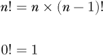
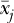
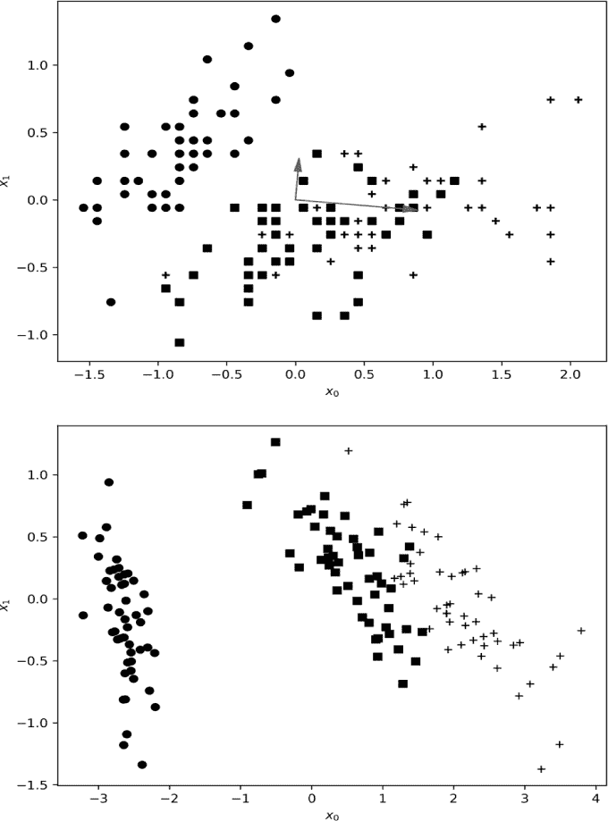

## **6

更多线性代数**

在本章中，我们将继续探讨线性代数的概念。虽然其中一些概念与深度学习的关系较为间接，但它们是你最终会遇到的数学知识。可以将本章视为假定的背景知识。

具体来说，我们将学习更多关于方阵的性质和运算，介绍在深度学习文献中常遇到的术语。之后，我将介绍方阵的特征值和特征向量的概念，以及如何求解它们。接下来，我们将探索向量范数和其他常见的距离度量方法，这些方法通常出现在深度学习中。此时，我将介绍协方差矩阵这一重要概念。

我们将在本章的结尾通过展示主成分分析（PCA）和奇异值分解（SVD）来总结。这些常用的方法在很大程度上依赖于本章所介绍的概念和运算符。我们将了解 PCA 是什么，如何执行 PCA，以及从机器学习的角度来看，PCA 能为我们带来什么。同样，我们也会学习 SVD，并看看如何用它来实现 PCA，以及计算矩形矩阵的伪逆。

### 方阵

方阵在线性代数中占有特殊地位。让我们更详细地探讨它们。这里使用的术语在深度学习和其他领域中将频繁出现。

#### 为什么是方阵？

如果我们将一个矩阵与一个列向量相乘，结果将是另一个列向量：

从几何角度解释，2 × 4 的矩阵已经将 4 × 1 的列向量，一个ℝ⁴中的点，映射到了ℝ²中的一个新点。该映射是线性的，因为点值只是与 2 × 4 矩阵的元素相乘；没有进行非线性操作，比如将向量的组件进行幂运算等。

从这个角度来看，我们可以使用矩阵在空间之间变换点。如果矩阵是方阵，比如*n* × *n*，那么映射是从ℝ^(*n*)回到ℝ^(*n*)。例如，考虑

其中，点（11，12，13）被映射到点（74，182，209），这两个点都在ℝ³中。

使用矩阵将点从一个空间映射到另一个空间，可以通过使用*旋转矩阵*来实现围绕一个轴旋转一组点。对于简单的旋转，我们可以定义二维矩阵，

在三维空间中，

旋转是由一个角度*θ*确定的，对于三维空间，旋转围绕 x 轴、y 轴或 z 轴进行，如下标所示。

使用矩阵，我们可以创建一个*仿射变换*。仿射变换将一组点映射到另一组点，使得原空间中一条直线上的点在映射空间中仍然处于直线上。该变换为：

***y*** = ***Ax*** + ***b***

仿射变换将矩阵变换***A***与平移***b***结合起来，将向量***x***映射到新向量***y***。我们可以通过将***A***放在矩阵的左上角，并将***b***作为新列添加到右侧，来将这一操作合并成一个单一的矩阵乘法。矩阵底部添加一行全零，并在最右列放置一个 1，完成扩展的变换矩阵。对于仿射变换矩阵

和平移向量

我们得到

这种形式将一个点，*(x*, *y*)，映射到一个新点，(*x*′, *y*′)。

这种操作与在实现神经网络时常用的*偏置技巧*相同，通过在扩展权重矩阵中包含一个额外的特征向量输入设置为 1 来隐藏偏置。事实上，我们可以将前馈神经网络视为一系列仿射变换，其中变换矩阵是层与层之间的权重矩阵，偏置向量提供平移。每一层的激活函数改变了层之间的线性关系。正是这种非线性使得网络能够学习一种新的方式来映射输入，以便最终输出反映网络设计要学习的功能关系。

我们使用方阵，将点从一个空间映射回同一空间，例如绕轴旋转它们。现在，让我们来看看方阵的一些特殊属性。

#### 转置、迹和幂

第五章向我们展示了向量转置，用于在列向量和行向量之间移动。转置操作不仅限于向量，它适用于任何矩阵，通过沿主对角线翻转行和列。例如，

转置是通过翻转矩阵元素的索引来形成的：

*a[ij]* ← *a[ij]*, *i* = 0, 1, . . . , *n* − 1, *j* = 0, 1, . . . , *m* – 1

这会将一个 *n* × *m* 矩阵变成 *m* × *n* 矩阵。注意，在转置操作下，方阵的顺序保持不变，且主对角线上的值不会改变。

在 NumPy 中，您可以对数组调用转置方法，但由于转置如此常见，因此也有简写符号 (.T)。例如，

>>> import numpy as np

>>> a = np.array([[1,2,3],[4,5,6],[7,8,9]])

>>> print(a)

[[1 2 3]

[4 5 6]

[7 8 9]]

>>> print(a.transpose())

[[1 4 7]

[2 5 8]

[3 6 9]]

>>> print(a.T)

[[1 4 7]

[2 5 8]

[3 6 9]]

*迹*是应用于方阵的另一个常见操作：

作为一个运算符，迹有一定的属性。例如，它是线性的：

tr(***A*** + ***B***) = tr***A*** + tr***B***

同样，tr(***A***) = tr(***A****^T*) 并且 tr(***AB***) = tr(***BA***)。

NumPy 使用 np.trace 快速计算矩阵的迹，并使用 np.diag 返回矩阵的对角元素作为一维数组，

(*a*[00], *a*[11], . . . , *a[n−1,n−1]*)

对于*n* × *n*或*n* × *m*矩阵。

对于 NumPy 来说，矩阵不必是方阵，仍然可以返回其对角线上的元素。虽然在数学上，迹一般只适用于方阵，但 NumPy 会计算任何矩阵的迹，返回对角线元素的和：

>>> b = np.array([[1,2,3,4],[5,6,7,8]])

>>> print(b)

[[1 2 3 4]

[5 6 7 8]]

>>> print(np.diag(b))

[1 6]

>>> print(np.trace(b))

7

最后，你可以将一个方阵与自身相乘，这意味着你可以将一个方阵提升到一个整数次幂*n*，通过将它自己乘*n*次。请注意，这与将矩阵的元素提升到某个幂次不同。例如，

矩阵的幂遵循与将数字提升为幂次相同的规则：

***A**^n**A**^m* = ***A**^(n+m)*

(***A**^n*)^(*m*) = ***A**^(nm)*

对于（正整数）且***A***是一个方阵。

NumPy 提供了一种比重复调用 np.dot 更高效地计算方阵幂的方法：

>>> from numpy.linalg import matrix_power

>>> a = np.array([[1,2],[3,4]])

>>> print(matrix_power(a,2))

[[ 7 10]

[15 22]]

>>> print(matrix_power(a,10))

[[ 4783807 6972050]

[10458075 15241882]]

现在，让我们考虑一些你可能会时常遇到的特殊方阵。

#### 特殊方阵

许多方阵（和非方阵）都有特殊名称。一些非常直观，比如全为零或全为一的矩阵，分别称为*零矩阵*和*单位矩阵*。NumPy 在这方面应用得很广泛：

>>> print(np.zeros((3,5)))

[[0\. 0\. 0\. 0\. 0.]]

[0\. 0\. 0\. 0\. 0.]

[0\. 0\. 0\. 0\. 0.]]

>>> print(np.ones(3,3))

[[1\. 1\. 1.]

[1\. 1\. 1.]

[1\. 1\. 1.]]

请注意，通过将全 1 矩阵乘以*c*，你可以得到一个常数值为*c*的矩阵。

注意上面，NumPy 默认矩阵使用 64 位浮点数，这对应于 C 语言中的 double 类型。请参见表 1-1 第 6 页，了解可能的数据类型列表。你可以通过 dtype 关键字指定所需的数据类型。在纯数学中，我们不太关注数据类型，但在深度学习中，你需要特别注意，避免定义比实际需要的更多的内存消耗的数组。许多深度学习模型对于 32 位浮点数组都能很好地工作，它们每个元素的内存占用是 NumPy 默认值的一半。另外，许多工具包开始使用新型或以前很少用的数据类型，如 16 位浮点数，以便更高效地使用内存。NumPy 通过将 dtype 指定为 float16，支持 16 位浮点数。

#### 单位矩阵

到目前为止，最重要的特殊矩阵是*单位矩阵*。这是一个对角线全为 1 的方阵：

单位矩阵在矩阵乘法中起到类似数字 1 的作用。因此，

***AI*** = ***IA*** = ***A***

对于一个*n* × *n*的方阵***A***和一个*n* × *n*的单位矩阵***I***。在必要时，我们会加上下标来表示单位矩阵的阶数，例如***I**[n]*。

NumPy 使用 np.identity 或 np.eye 来生成给定大小的单位矩阵：

>>> a = np.array([[1,2],[3,4]])

>>> i = np.identity(2)

>>> print(i)

[[1. 0.]

[0. 1.]]

>>> print(a @ i)

[[1. 2.]

[3. 4.]]

仔细看一下上面的例子。从数学角度讲，我们说将方阵与同阶的单位矩阵相乘会返回原矩阵。然而，NumPy 做了一些我们可能不希望发生的事情。矩阵 a 是用整数元素定义的，因此它的数据类型是 int64，这是 NumPy 默认的整数类型。然而，由于我们没有显式地为 np.identity 指定数据类型，NumPy 默认为 64 位浮点数。因此，矩阵 a 与 i 的矩阵乘法（@）返回了 a 的浮点数版本。这种数据类型的细微变化可能会影响后续的计算，因此我们在使用 NumPy 时需要特别注意数据类型。

无论是使用 np.identity 还是 np.eye 都没有关系。实际上，np.identity 只是 np.eye 的一个封装。

##### 三角矩阵

偶尔你会听到*三角矩阵*的概念。三角矩阵有两种类型：上三角矩阵和下三角矩阵。正如你从名字中可以直观推测的那样，上三角矩阵是指主对角线及其上方的部分包含非零元素，而下三角矩阵只有主对角线及其下方的部分包含非零元素。例如，

是一个上三角矩阵，而

是一个下三角矩阵。一个仅在主对角线上有元素的矩阵，毫不意外的是，它是一个*对角矩阵*。

NumPy 提供了两个函数，np.triu 和 np.tril，分别用于返回给定矩阵的上三角部分或下三角部分。因此，

>>> a = np.arange(16).reshape((4,4))

>>> print(a)

[[ 0 1 2 3]

[ 4 5 6 7]

[ 8 9 10 11]

[12 13 14 15]]

>>> print(np.triu(a))

[[ 0 1 2 3]

[ 0 5 6 7]

[ 0 0 10 11]

[ 0 0 0 15]]

>>> print(np.tril(a))

[[ 0 0 0 0]

[ 4 5 0 0]

[ 8 9 10 0]

[12 13 14 15]]

在深度学习中我们不常使用三角矩阵，但在线性代数中我们确实会用到它们，部分原因是为了计算行列式，现在我们将讨论这一点。

#### 行列式

我们可以将一个方阵的*行列式*，*n* × *n*，看作是一个将方阵映射到标量的函数。行列式在深度学习中的主要用途是计算矩阵的特征值。我们稍后会详细了解这一点，但现在可以把特征值看作是与矩阵相关的特殊标量值。行列式还可以告诉我们矩阵是否有逆矩阵，我们稍后也会看到这一点。在记法上，我们用竖线表示矩阵的行列式。例如，如果***A***是一个 3 × 3 的矩阵，我们写行列式为

这里我们明确指出行列式的值是一个标量（实数集合 ℝ 的元素）。所有方阵都有行列式。现在，我们来考虑一些行列式的性质：

1.  如果 ***A*** 的任意一行或一列为零，则 det(***A***) = 0。

1.  如果 ***A*** 的任意两行相同，那么 det(***A***) = 0。

1.  如果 ***A*** 是上三角矩阵或下三角矩阵，那么 det 。

1.  如果 ***A*** 是对角矩阵，则 det 。

1.  单位矩阵的行列式，无论大小如何，都是 1。

1.  矩阵乘积的行列式是各自行列式的乘积，det(***AB***) = det(***A***)det(***B***)。

1.  det(***A***) = det(***A***^⊤)。

1.  det(***A**^n*) = det(***A***)^(*n*)。

属性 7 表明转置操作不会改变行列式的值。属性 8 是属性 6 的一个推论。

我们有多种方法可以计算方阵的行列式。在这里我们只讨论一种方法，它涉及使用递归公式。所有递归公式都是自我调用的，就像代码中的递归函数调用自己一样。一般来说，每个递归操作处理问题的简化版本，然后可以将它们结合起来，得到更大问题的解决方案。

例如，我们可以计算一个整数的阶乘，

*n*! = *n*(*n* − 1)(*n* − 2)(*n* − 3) . . . 1

递归地，如果我们注意到以下几点：

第一句话表示 *n* 的阶乘是 *n* 乘以 (*n* − 1) 的阶乘。第二句话表示零的阶乘是 1。递归是第一句话所描述的内容，但如果没有某种条件返回一个值，递归将永远不会结束。这就是第二句话的意义，*基准情况*：它说明当我们得到零时，递归就结束了。

这在代码中可能更清晰。我们可以这样定义阶乘：

def factorial(n):

if (n == 0):

return 1

return n*factorial(n-1)

注意，阶乘函数会在参数减一时进行自我调用，除非参数为零，在这种情况下它会立即返回 1。这个代码之所以能工作，是因为 Python 的调用栈。调用栈会追踪所有的 n*factorial(n-1) 计算。当我们遇到基准情况时，所有待完成的乘法操作都已完成，并且我们返回最终结果。

因此，为了递归地计算行列式，我们需要一个递归语句，定义行列式的计算方法，并且用简化版的行列式来表示。我们还需要一个基准情况，给我们一个确定的值。对于行列式来说，基准情况是当我们得到一个 1 × 1 的矩阵时。对于任何 1 × 1 的矩阵 ***A***，我们有

det(***A***) = *a*[00]

这意味着 1 × 1 矩阵的行列式就是它所包含的唯一值。

我们的计划是通过将计算分解成逐步简化的行列式，直到我们达到上面的基本情况。为此，我们需要一个涉及递归的语句。然而，在编写这个语句之前，我们需要先定义一些概念。首先，我们需要定义矩阵的*余子式*。矩阵***A***的(*i*, *j*)-余子式，是在去掉矩阵***A***的第*i*行和第*j*列之后剩下的矩阵。我们用***A****[ij]*表示一个余子式矩阵。例如，给定

然后

其中，余子式***A***[11]是通过删除第 1 行和第 1 列得到的，仅保留下划线部分的值。

其次，我们需要定义*余因子*，*C**[ij]*，即余子式***A****[ij]*的余因子。这里就是我们的递归语句出现的地方。定义为

*C**[ij]* = (−1)^(*i*+*j*+2)det(***A****[ij]*)

余因子依赖于余子式的行列式。请注意，指数是-1 的幂，写作*i* + *j* + 2。如果你翻阅大多数数学书籍，你会看到指数是*i* + *j*。我们特意选择了用从零开始的索引来定义矩阵，这样数学推导和代码实现就能匹配，而不会因为索引偏差而出错。这里正是我们选择这种方式让数学公式不够优雅的地方。由于我们的索引从 0 开始，我们需要将这一偏差加回到余因子的指数中，以确保余因子使用的正负值模式正确。这意味着要将指数中的每个变量加 1：*i* → *i* + 1 和 *j* → *j* + 1。这样，指数*i* + *j*就变成了(*i* + 1) + (*j* + 1) = *i* + *j* + 2。

现在，我们已经准备好通过使用*余因子展开法*来完整地递归定义矩阵***A***的行列式。事实证明，对于任何一个方阵，计算某一行或某一列的矩阵值与相应的余因子的乘积并求和，就能得到行列式。因此，我们将使用矩阵的第一行，并将行列式计算为

你可能会想：在方程 6.3 中，递归在哪里呢？它出现在余子式的行列式中。如果***A***是一个*n* × *n*矩阵，余子式***A****[ij]*是一个*(n* − 1) × (*n* − 1)矩阵。因此，为了计算余因子以求出*n* × *n*矩阵的行列式，我们需要知道如何计算*(n* − 1) × (*n* − 1)矩阵的行列式。然而，我们可以使用余因子展开法来求*(n* − 1) × (*n* − 1)矩阵的行列式，这需要求出*(n* − 2) × (*n* − 2)矩阵的行列式。这个过程会一直持续，直到我们得到一个 1 × 1 矩阵。我们已经知道，1 × 1 矩阵的行列式就是它所包含的唯一值。

让我们通过一个 2 × 2 矩阵来演示这个过程：

使用余因子展开法，我们得到

这就是 2 × 2 矩阵行列式的公式。2 × 2 矩阵的余子式是 1 × 1 矩阵，在这种情况下，它们分别返回*d*或*c*。

在 NumPy 中，我们使用 np.linalg.det 计算行列式。例如，

>>> a = np.array([[1,2],[3,4]])

>>> print(a)

[[1 2]

[3 4]]

>>> np.linalg.det(a)

-2.0000000000000004

>>> 1*4 - 2*3

-2

代码的最后一行使用了我们上面推导出的 2 × 2 矩阵的公式以便进行比较。实际上，NumPy 并不使用递归的代数余子式展开法来计算行列式。相反，它将矩阵分解为三个矩阵的乘积：（1）一个*排列矩阵*，看起来像一个被打乱的单位矩阵，每一行和每一列只有一个 1，（2）一个下三角矩阵，和（3）一个上三角矩阵。排列矩阵的行列式为 +1 或 −1。三角矩阵的行列式是其对角元素的乘积，而矩阵乘积的行列式是各个矩阵行列式的乘积。

我们可以使用行列式来判断一个矩阵是否有逆矩阵。现在让我们来了解这个内容。

#### 逆矩阵

方程式 6.2 定义了单位矩阵。我们说这个矩阵像数字 1 一样工作，因此当它与一个方阵相乘时，返回的还是同一个方阵。在乘法中，我们知道对于任何数字 *x* ≠ 0，存在另一个数字，称为 *y*，使得 *xy* = 1。这个数字就是 *x* 的乘法逆元。此外，我们知道 *y* 就是 1/*x* = *x*^(−1)。

类比而言，我们可能会想，既然我们有一个像数字 1 一样工作的单位矩阵，那么是否存在另一个方阵，记为 **A**^(−1)，对于给定的方阵 **A**，使得

**AA**^(−1) = **A**^(−1) **A** = **I**

如果 **A**^(−1) 存在，它被称为 **A** 的*逆矩阵*，而 **A** 被称为*可逆的*。对于实数，所有非零数字都有逆元。对于矩阵情况则没那么简单，许多方阵没有逆矩阵。为了检查 **A** 是否有逆矩阵，我们使用行列式：det(**A**) = 0 表示 **A** 没有逆矩阵。此外，如果 **A**^(−1) 存在，则

还要注意，(**A**^(−1))^(−1) = **A**，这与实数的情况相同。逆矩阵的另一个有用性质是

(**AB**)^(−1) = **B**^(−1) **A**^(−1)

其中右边乘积的顺序是很重要的。最后，注意对角矩阵的逆矩阵只是对角元素的倒数：

可以通过手动使用行变换来计算逆矩阵，尽管我们在这里方便地忽略了这一点，因为在深度学习中很少使用行变换。代数余子式展开技术也可以用来计算逆矩阵，但为了节省时间，我们在此不展开讨论。对我们而言，重要的是知道方阵通常有逆矩阵，并且我们可以通过 NumPy 使用 np.linalg.inv 来计算逆矩阵。

如果一个矩阵 *不可* 逆，那么该矩阵被称为 *奇异矩阵*。因此，奇异矩阵的行列式为零。如果一个矩阵有逆，它就是 *非奇异矩阵* 或 *非退化矩阵*。

在 NumPy 中，我们使用 np.linalg.inv 来计算方阵的逆。例如，

>>> a = np.array([[1,2,1],[2,1,2],[1,2,2]])

>>> print(a)

[[1 2 1]

[2 1 2]

[1 2 2]]

>>> b = np.linalg.inv(a)

>>> print(b)

[[ 0.66666667 0.66666667 -1\. ]

[ 0.66666667 -0.33333333 0\. ]

[-1.          0.          1\. ]]

>>> print(a @ b)

[[1\. 0\. 0.]

[0\. 1\. 0.]

[0\. 0\. 1.]]

>>> print(b @ a)

[[1\. 0\. 0.]

[0\. 1\. 0.]

[0\. 0\. 1.]]

注意逆矩阵（b）按预期工作，并且在从左或右相乘时给出了单位矩阵。

#### 对称矩阵、正交矩阵和酉矩阵

如果对于方阵 ***A***，我们有

***A***^⊤ = ***A***

那么 ***A*** 被称为 *对称矩阵*。例如，

是对称矩阵，因为 ***A***^⊤ = ***A***。

注意对角矩阵是对称的，且两个对称矩阵的乘积是可交换的： ***AB*** = ***BA***。对称矩阵的逆矩阵（如果存在）也是对称矩阵。

如果以下条件成立，

***AA***^⊤ = ***A***^⊤ ***A*** = ***I***

那么 ***A*** 是一个正交矩阵。如果 ***A*** 是一个正交矩阵，那么

***A***^(−1) = ***A***^⊤

并且，结果是，

det(***A***) = ±1

如果矩阵中的值可以是复数，这在深度学习中不常见，并且

***U***^****U*** = ***UU***^* = ***I***

那么 ***U*** 是一个 *酉矩阵*，其中 ***U***^* 是 ***U*** 的 *共轭转置*。共轭转置是普通矩阵转置后再进行复共轭操作，将  改为 −*i*。因此，我们可能有

有时候，特别是在物理学中，共轭转置被称为 *埃尔米特伴随*，记作 ***A***^†。如果一个矩阵等于它的共轭转置，则称该矩阵为 *埃尔米特矩阵*。注意，实对称矩阵也是埃尔米特矩阵，因为当数值是实数时，共轭转置与普通转置相同。因此，当涉及到具有实元素的矩阵时，你可能会遇到 *埃尔米特* 这个术语，代替 *对称*。

#### 对称矩阵的正定性

我们在本节开始时看到，*n* × *n* 方阵将 ℝ^(*n*) 中的一个向量映射到 ℝ^(*n*) 中的另一个向量。现在我们考虑一个对称的 *n* × *n* 矩阵，***B***，其元素为实数。我们可以通过它如何使用原向量与映射向量之间的内积来表征这个矩阵。具体而言，如果 ***x*** 是一个列向量（*n* × 1），那么 ***Bx*** 也是一个 *n* × 1 的列向量。因此，这个向量与原始向量 ***x*** 的内积是 ***x***^⊤***Bx***，一个标量。

如果以下条件成立：

然后***B***被称为*正定*。这里，加粗的**0**是一个* n * × 1 的全零列向量，∀是数学符号，表示“对所有”。

同样，如果

然后***B***是*负定*的。放宽内积关系和***x***的非零要求，得到两个额外的情况。如果

然后***B***被称为*正半定*，并且

使***B***成为一个*负半定*矩阵。最后，一个既不是正半定也不是负半定的实数对称方阵被称为*不定矩阵*。矩阵的定性告诉我们一些关于特征值的信息，关于这一点我们将在下一节中进一步了解。如果一个对称矩阵是正定的，那么它的所有特征值都是正的。同样，负定的对称矩阵具有所有负的特征值。正半定和负半定的对称矩阵分别具有所有正或零的特征值，或所有负或零的特征值。

现在让我们从讨论矩阵类型转向发现特征向量和特征值的重要性，这些是我们在深度学习中经常使用的矩阵关键属性。

### 特征向量和特征值

我们在上面学到，方阵将一个向量映射到另一个同维度空间中的向量，***v***′ = ***Av***，其中***v***′和***v***都是*n*维向量，如果***A***是一个*n* × *n*矩阵。

考虑这个方程，

对于某个方阵***A***，其中λ是一个标量值，***v***是一个非零列向量。

公式 6.4 表明，向量***v***被***A***映射回它自身的标量倍数。我们称***v***为***A***的*特征向量*，其*特征值*为λ。前缀*eigen*来源于德语，常被翻译为“自我”、“特征”或“固有”。从几何角度看，公式 6.4 说明，***A***对其在ℝ^(*n*)中的特征向量的作用是缩小或放大向量，而不改变其方向。请注意，虽然***v***是非零的，但λ可能为零。

公式 6.4 如何与单位矩阵***I***相关？根据定义，单位矩阵将一个向量映射回其自身，而不进行缩放。因此，单位矩阵有无限多个特征向量，而且所有这些特征向量的特征值都是 1，因为对于任何***x***，***Ix*** = ***x***。因此，同一个特征值可能适用于多个特征向量。

回想一下，公式 6.1 定义了一个二维空间中某个给定角度*θ*的旋转矩阵。这个矩阵没有特征向量，因为对于任何非零向量，它会将向量旋转*θ*，因此它永远不能将一个向量映射回其原始方向。因此，并不是每个矩阵都有特征向量。

#### 寻找特征值和特征向量

要找出矩阵的特征值（如果有的话），我们回到 方程 6.4，并重写它：

我们可以在 λ 和 ***v*** 之间插入单位矩阵 ***I***，因为 ***Iv*** = ***v***。因此，要找出矩阵 ***A*** 的特征值，我们需要找到使得矩阵 ***A*** − λ***I*** 映射非零向量 ***v*** 到零向量的 λ 值。方程 6.5 只有在 ***A*** − λ***I*** 的行列式为零时，才有除零向量之外的解。

上述方法为我们提供了找到特征值的途径。例如，考虑一个 2 × 2 矩阵，看看 ***A*** − λ***I*** 是什么样的：

我们已经知道，2 × 2 矩阵的行列式有一个简单的形式；因此，上面矩阵的行列式是

det(***A*** − λ***I***) = (*a* − λ)(*d* − λ) − *bc*

这个方程是 λ 的二次多项式。因为我们需要行列式为零，所以我们将这个多项式设为零，并找到其根。根就是矩阵 ***A*** 的特征值。这个过程得到的多项式叫做 *特征多项式*，方程 6.5 是 *特征方程*。注意到上面特征多项式是一个二次多项式。一般来说，*n* × *n* 矩阵的特征多项式是 *n* 次多项式，因此一个矩阵最多有 *n* 个不同的特征值，因为 *n* 次多项式最多有 *n* 个根。

一旦我们知道了特征多项式的根，就可以回到 方程 6.5，将每个根代入 λ，并解出相应的特征向量，也就是 方程 6.5 中的 ***v***。

对于三角矩阵（包括对角矩阵），特征值的计算是直接的，因为这种矩阵的行列式只是主对角线元素的乘积。例如，对于一个 4 × 4 的三角矩阵，特征方程的行列式是

det(***A*** − λ***I***) = (*a*[00] − λ)(*a*[11] − λ)(*a*[22] − λ)(*a*[33] − λ)

它有四个根：对角线上的值。对于三角矩阵和对角矩阵，主对角线上的元素 *就是* 特征值。

让我们来看一个已完成的特征值例子，使用以下矩阵：

我选择了这个矩阵以使数学计算更加简洁，但这个过程适用于任何矩阵。特征方程意味着我们需要找到使行列式为零的 λ 值，具体见下文。

特征多项式可以轻松分解为 λ = −1, −2。

在代码中，要找出一个矩阵的特征值和特征向量，我们使用 np.linalg.eig。让我们检查一下上面的计算，看看 NumPy 是否同意：

>>> a = np.array([[0,1],[-2,-3]])

>>> print(np.linalg.eig(a)[0])

[-1\. -2.]

np.linalg.eig 函数返回一个列表。第一个元素是矩阵的特征值向量。第二个元素，我们暂时忽略，是一个矩阵，其*列*是与每个特征值关联的特征向量。请注意，我们也可以使用 np.linalg.eigvals 来只返回特征值。不管怎样，我们看到我们对***A***的特征值计算是正确的。

为了找到关联的特征向量，我们将每个特征值代入公式 6.5，并求解***v***。例如，对于 λ = −1，我们得到：

这导致了以下方程系统：

*v*[0] + *v*[1] = 0

−2*v*[0] − 2*v*[1] = 0

这个系统有很多解，只要*v*[0] = −*v*[1]。这意味着我们可以选择*v*[0]和*v*[1]，只要它们之间的关系得以保持。因此，我们得到了我们的特征向量。

如果我们对 λ = −2 重复此过程，我们得到***v***[2]的分量关系为 2*v*[0] = −*v*[1]。因此，我们选择  作为第二个特征向量。

让我们看看 NumPy 是否同意我们的计算。这次，我们将显示 np.linalg.eig 返回的第二个列表元素。这是一个矩阵，其中矩阵的列是与每个特征值关联的特征向量：

>>> print(np.linalg.eig(a)[1])

[[ 0.70710678 -0.4472136 ]

[-0.70710678  0.89442719]]

嗯……这个矩阵的列似乎与我们选择的特征向量不匹配。但别担心——我们没有犯错。请记住，特征向量并不是唯一确定的，只有分量之间的关系是确定的。如果我们愿意的话，我们可以选择其他值，只要对于一个特征向量，它们的大小相等且符号相反，而对于另一个，它们的比例为 2:1 且符号相反。NumPy 返回的是一组单位长度的特征向量。因此，要验证我们手工计算的结果是否正确，我们需要通过将每个分量除以分量平方和的平方根，将我们的特征向量转换为单位向量。代码如下，简洁但稍显凌乱：

>>> np.array([1,-1])/np.sqrt((np.array([1,-1])**2).sum())

array([ 0.70710678, -0.70710678])

>>> np.array([-1,2])/np.sqrt((np.array([-1,2])**2).sum())

array([-0.4472136, 0.89442719])

现在我们看到我们是正确的。特征向量的单位向量版本确实与 NumPy 返回的矩阵列匹配。

当我们进行深度学习时，我们会经常使用矩阵的特征向量和特征值。例如，当我们研究主成分分析时，我们会在本章后面再次看到它们。但在我们学习 PCA 之前，我们需要再次转移焦点，学习深度学习中常用的向量范数和距离度量，尤其是关于协方差矩阵的内容。

### 向量范数和距离度量

在深度学习的常用术语中，人们有些随意地将 *范数* 和 *距离* 这两个术语互换使用。我们可以宽容地理解他们这样做；正如下面所看到的，在实践中，这两个术语的差别非常小。

*向量范数*是一个将向量（无论是实数还是复数）映射到某个值的函数，*x* ∈ ℝ，*x* ≥ 0。范数必须满足一些特定的数学性质，但在实践中，并非所有被称为范数的东西，实际上都是范数。在深度学习中，我们通常将范数作为向量对之间的距离。实际上，距离度量的一个重要性质是输入的顺序不重要。如果 *f*(*x*, *y*) 是一个距离，那么 *f*(*x*, *y*) = *f*(*y*, *x*)。不过，这个性质并不总是严格遵循的；例如，你经常会看到 Kullback-Leibler 散度（KL 散度）被用作距离，尽管它并不满足这个性质。

让我们从向量范数开始，看看如何将它们轻松地用作向量之间的距离度量。接下来，我们将介绍深度学习中常用的一个重要概念——协方差矩阵，并看看如何从中创建一个距离度量：马哈拉诺比斯距离。最后，我们将通过介绍 KL 散度结束这一部分，KL 散度可以视为两种离散概率分布之间的度量。

#### L-范数与距离度量

对于一个 *n* 维向量 ***x***，我们定义该向量的 *p*-范数为

其中 *p* 是一个实数。尽管我们在定义中使用了 *p*，人们通常将这些称为 L*[p]* 范数。我们在 第五章 中已经看到了其中一种范数，当时我们定义了一个向量的大小。在那个例子中，我们计算的是 *L2 范数*，

这是 ***x*** 与自身的内积的平方根。

我们在深度学习中最常使用的范数是 L2 范数和 *L1 范数*，

这仅仅是 ***x*** 的各分量的绝对值之和。你还会遇到另外一种范数，即 *L**[∞]-范数*，

L[∞] = max |*x**[i]*|

***x*** 的各分量的最大绝对值。

如果我们将 ***x*** 替换为两个向量的差 ***x*** − ***y***，我们就可以将范数视为这两个向量之间的距离度量。或者，我们可以将这个过程想象为计算 ***x*** 和 ***y*** 之间差向量的范数。

从范数转到距离在 方程 6.6 中只需做一个微小的修改：

L2 距离变为

这是两个向量之间的 *欧几里得距离*。L1 距离通常被称为 *曼哈顿距离*（也称为 *城市街区距离*、*箱车距离* 或 *出租车距离*）：

它之所以如此命名，是因为它对应的是出租车在曼哈顿街道网格上行驶的距离。L[∞]距离有时被称为*切比雪夫距离*。

范数方程在深度学习中有其他用途。例如，深度学习中用于正则化的权重衰减，使用模型权重的 L2 范数来防止权重变得过大。权重的 L1 范数有时也用作正则化项。

现在让我们来考虑一个重要概念——协方差矩阵。它本身不是一个距离度量，但它被用于某个距离度量，并且它会在本章稍后出现。

#### 协方差矩阵

如果我们拥有多变量的多个测量数据，例如具有特征向量的训练集，我们可以计算特征之间的方差。例如，下面是四个变量的观测矩阵，每行对应一个变量：

实际上，***X***是著名鸢尾花数据集中的前五个样本。对于鸢尾花数据集，这些特征是来自三种不同物种的鸢尾花各个部位的测量值。你可以使用 sklearn 将该数据集加载到 NumPy 中：

>>> from sklearn import datasets

>>> iris = datasets.load_iris()

>>> X = iris.data[:5]

>>> X

array([[5.1, 3.5, 1.4, 0.2],

[4.9, 3.0, 1.4, 0.2],

[4.7, 3.2, 1.3, 0.2],

[4.6, 3.1, 1.5, 0.2],

[5.0, 3.6, 1.4, 0.2]])

我们可以计算每个特征的标准差，即***A***的列，但这只会告诉我们该特征值围绕其均值的方差。由于我们有多个特征，了解不同特征之间的关系会更有帮助。例如，我们可能想知道第零列和第一列的特征如何一起变化。为了确定这一点，我们需要计算*协方差矩阵*。该矩阵在主对角线上捕捉各个特征的方差。与此同时，非对角线的值表示一个特征如何随着另一个特征的变化而变化——这些就是协方差。由于有四个特征，协方差矩阵总是方阵，在这种情况下是一个 4 × 4 的矩阵。我们通过计算来找到协方差矩阵Σ的元素：

假设矩阵***X***的行是观测值，列表示不同的特征。所有行中各个特征的均值分别是和，对应特征*i*和*j*。这里，*n*是观测值的数量，即***X***中的行数。我们可以看到，当*i* = *j*时，协方差值是该特征的常规方差；当*i* ≠ *j*时，值表示*i*和*j*一起变化的程度。我们通常将协方差矩阵表示为Σ，它始终是对称的：∑[*ij*] = ∑[*ji]*。

让我们计算一下上面 ***X*** 协方差矩阵的一些元素。每个特征的均值是 。让我们先找出 Σ 的第一行。这将告诉我们第一个特征（**X** 的第一列）的方差以及这个特征与第二、第三和第四个特征的变化情况。因此，我们需要计算 ∑[00]、∑[01]、∑[02] 和 ∑[03]：

我们可以对 Σ 的所有行重复此计算，从而得到完整的协方差矩阵：

对角线上的元素表示 ***X*** 特征的方差。请注意，对于 ***X*** 的第四个特征，所有的方差和协方差都是零。这是有道理的，因为 ***X*** 中这个特征的所有值都是相同的；因此没有方差。

我们可以通过代码使用 np.cov 来计算一组观测值的协方差矩阵：

>>> print(np.cov(X, rowvar=False))

[[ 0.043   0.0365 -0.0025  0.     ]

[ 0.0365  0.067  -0.0025  0.    ]

[-0.0025 -0.0025  0.005   0.    ]

[ 0.      0.      0.      0.    ]]

请注意，调用 np.cov 时包括了 rowvar=False。默认情况下，np.cov 期望其参数的每一行代表一个变量，而每一列代表该变量的观测值。这与在深度学习中通常将观测数据存储在矩阵中的方式正好相反。因此，我们使用 rowvar 关键字来告诉 NumPy，观测值是矩阵的行，而不是列。

我在上面声称，协方差矩阵的对角线返回 ***X*** 特征的方差。NumPy 有一个函数 np.std 用于计算标准差，平方该函数的输出应该能直接给出特征的方差。对于 ***X***，我们得到：

>>> print(np.std(X, axis=0)**2)

[0.0344 0.0536 0.004 0.     ]

这些方差看起来不像协方差矩阵的对角线。区别在于协方差公式中的 *n* − 1，公式 6.8。默认情况下，np.std 计算的是样本方差的偏差估计。这意味着它没有除以 *n* − 1，而是除以 *n*。为了让 np.std 计算无偏方差估计，我们需要添加 ddof=1 关键字，

>>> print(np.std(X, axis=0, ddof=1)**2)

[0.043 0.067 0.005  0.   ]

然后我们会得到与 Σ 对角线上的值相同的结果。

现在我们知道了如何计算协方差矩阵，让我们将其用于距离度量中。

#### 马氏距离

在上面，我们通过一个矩阵表示了一个数据集，其中数据集的行是观测值，列是构成每个观测值的变量的值。在机器学习中，行就是特征向量。正如我们上面所看到的，我们可以计算每个特征在所有观测值中的均值，并可以计算协方差矩阵。通过这些值，我们可以定义一个叫做 *马氏距离* 的距离度量，

其中，***x***是一个向量，**μ**是由每个特征的均值构成的向量，Σ是协方差矩阵。请注意，这个度量使用的是协方差矩阵的*逆*，而不是协方差矩阵本身。

方程 6.9 从某种意义上讲，是在衡量一个向量和具有均值向量**μ**的分布之间的距离。分布的离散度由Σ表示。如果数据集中的特征之间没有协方差，并且每个特征的标准差相同，那么Σ就变成了单位矩阵，它是自己的逆矩阵。在这种情况下，Σ^(−1)实际上会从方程 6.9 中消失，马哈拉诺比斯距离就变成了 L2 距离（欧几里得距离）。

另一种理解马哈拉诺比斯距离的方式是将**μ**替换为另一个来自同一数据集的向量，称为***y***。那么*D*[M]就是考虑数据集方差的两向量之间的距离。

我们可以使用马哈拉诺比斯距离来构建一个简单的分类器。如果给定一个数据集，我们计算每个类别的均值特征向量（这个向量也叫做*中心点*），我们可以使用马哈拉诺比斯距离来给未知特征向量***x***赋予标签。具体做法是计算所有马哈拉诺比斯距离到各个类别的中心点，并将***x***分配给返回最小值的类别。这种类型的分类器有时被称为*最近中心点*分类器，通常会看到它使用 L2 距离代替马哈拉诺比斯距离来实现。可以说，马哈拉诺比斯距离通常是更好的度量，因为它考虑了数据集的方差。

让我们使用 sklearn 提供的乳腺癌数据集来构建一个使用马哈拉诺比斯距离的最近中心点分类器。乳腺癌数据集有两个类别：良性（0）和恶性（1）。该数据集包含 569 个观测值，每个观测值有 30 个特征，来源于组织学切片。我们将构建两个版本的最近中心点分类器：一个使用马哈拉诺比斯距离，另一个使用欧几里得距离。我们的期望是，使用马哈拉诺比斯距离的分类器表现会更好。

我们需要的代码很简单：

import numpy as np

from sklearn import datasets

❶ from scipy.spatial.distance import mahalanobis

bc = datasets.load_breast_cancer()

d = bc.data; l = bc.target

❷ i = np.argsort(np.random.random(len(d)))

d = d[i]; l = l[i]

xtrn, ytrn = d[:400], l[:400]

xtst, ytst = d[400:], l[400:]

❸ i = np.where(ytrn == 0)

m0 = xtrn[i].mean(axis=0)

i = np.where(ytrn == 1)

m1 = xtrn[i].mean(axis=0)

S = np.cov(xtrn, rowvar=False)

SI = np.linalg.inv(S)

def score(xtst, ytst, m, SI):

nc = 0

for i in range(len(ytst)):

d = np.array([mahalanobis(xtst[i],m[0],SI),

mahalanobis(xtst[i],m[1],SI)])

c = np.argmin(d)

if (c == ytst[i]):

nc += 1

return nc / len(ytst)

mscore = score(xtst, ytst, [m0,m1], SI)

❹ escore = score(xtst, ytst, [m0,m1], np.identity(30))

print("Mahalanobis 得分 = %0.4f" % mscore)

print("欧几里得得分 = %0.4f" % escore)

我们首先导入所需的模块，包括来自 SciPy 的 mahalanobis ❶。这个函数接受两个向量和协方差矩阵的逆，并返回 *D*[M]。接着，我们获取包含标签的 d 数据集和 l 标签。我们随机化顺序 ❷ 并提取前 400 个观测值作为训练数据 (xtrn) 和标签 (ytrn)。其余观测值保留用于测试 (xtst, ytst)。

接下来我们进行 *训练* 模型。训练过程包括提取每个类别的所有观测值 ❸，并计算 m0 和 m1。这些是所有类别 0 和类别 1 观测值的 30 个特征的均值。然后，我们计算整个训练集的协方差矩阵 (S) 及其逆 (SI)。

得分函数接受测试观测值、类别均值向量的列表以及协方差矩阵的逆。它遍历每个测试观测值并计算马哈拉诺比斯距离 (d)。然后，它使用最小的距离来分配类别标签 (c)。如果分配的标签与实际测试标签匹配，我们就统计它 (nc)。函数结束时，我们返回整体准确率。

我们调用得分函数两次。第一次调用使用逆协方差矩阵 (SI)，而第二次调用使用单位矩阵，从而使得得分计算欧几里得距离。最后，我们打印两个结果。

数据集的随机化 ❷ 意味着每次运行代码时，输出的得分会略有不同。运行代码 100 次，得到以下的平均得分（±标准差）。

| **距离** | **平均得分** |
| --- | --- |
| 马哈拉诺比斯距离 | 0.9595 ± 0.0142 |
| 欧几里得距离 | 0.8914 ± 0.0185 |

这清楚地显示了使用马哈拉诺比斯距离能提高模型性能，准确率提高了大约 7%。

最近，马哈拉诺比斯距离在深度学习中的应用之一是利用顶层嵌入层值（一个向量），使用马哈拉诺比斯距离来检测域外或对抗性输入。*域外输入*是指与模型训练时使用的数据类型有显著差异的输入。*对抗性输入*是指对手故意尝试通过提供不是类 X 的输入来欺骗模型，使得模型错误地将其标记为类 X。

#### Kullback-Leibler 散度

*Kullback-Leibler 散度（KL 散度）*，或称为 *相对熵*，是衡量两个概率分布相似度的指标：值越低，分布越相似。

如果 *P* 和 *Q* 是离散的概率分布，那么 KL 散度是

其中 log[2] 是以 2 为底的对数。这是一个信息论度量；输出是信息的比特。自然对数 ln 有时也会被使用，在这种情况下，度量被称为 *nats*。实现 KL 散度的 SciPy 函数位于 scipy.special 中，名为 rel_entr。注意，rel_entr 使用的是自然对数，而不是以 2 为底的对数。还要注意，KL 散度在数学意义上不是一个距离度量，因为它违反了对称性属性，*D*KL ≠ *D*KL，但这并不妨碍人们偶尔将其作为距离度量来使用。

让我们来看一个示例，展示如何使用 KL 散度来衡量不同离散概率分布之间的差异。我们将衡量两个不同的二项分布和一个均匀分布之间的散度。然后，我们将绘制这些分布，看看在视觉上是否与数值一致。

为了生成分布，我们将从一个具有 12 个可能输出的均匀分布中进行多次抽样。我们可以通过使用 np.random.randint 快速地在代码中实现这一点。然后，我们将从两个不同的二项分布 *B*(12, 0.4) 和 *B*(12, 0.9) 中抽样，这意味着每次试验有 12 次，概率分别为 0.4 和 0.9。我们将生成这些抽样的直方图，除以计数的总和，并将重新缩放的直方图用作我们的概率分布。然后，我们可以衡量它们之间的散度。

我们需要的代码是

from scipy.special import rel_entr

N = 1000000

❶ p = np.random.randint(0,13,size=N)

❷ p = np.bincount(p)

❸ p = p / p.sum()

q = np.random.binomial(12,0.9,size=N)

q = np.bincount(q)

q = q / q.sum()

w = np.random.binomial(12,0.4,size=N)

w = np.bincount(w)

w = w / w.sum()

print(rel_entr(q,p).sum())

print(rel_entr(w,p).sum())

我们从 SciPy 中加载 rel_entr，并将每个分布的抽样次数设置为 1,000,000（N）。生成相应概率分布的代码对于每个分布采用相同的方法。我们从分布中抽取 N 个样本，首先是均匀分布 ❶。我们使用 randint，因为它返回 [0, 12] 范围内的整数，这样我们就可以与二项分布在 12 次试验中返回的离散 [0, 12] 值相匹配。我们通过使用 np.bincount 从抽样向量中获得直方图。这个函数统计向量中唯一值的频率 ❷。最后，我们通过将直方图除以总和来将计数转换为分数 ❸。这将为我们提供一个包含 12 个元素的向量 p，表示 randint 返回值 0 到 12 的概率。假设 randint 使用了一个良好的伪随机数生成器，我们预计 p 中每个值的概率大致相等。（NumPy 使用 Mersenne Twister 伪随机数生成器，它是一个非常好的生成器，因此我们有信心得到良好的结果。）

我们重复这个过程，使用 0.9 和 0.4 的概率从二项分布中抽样，而不是使用 randint。再次通过对抽样结果进行直方图分析，并将计数转换为分数，得到了基于 0.9 和 0.4 的剩余概率分布 q 和 w。

我们终于准备好测量散度了。rel_entr 函数与其他函数略有不同，它并不会直接返回 *D*[KL]。相反，它返回一个与其参数长度相同的向量，其中向量的每个元素都是总体和的一部分，最终得出 *D*[KL]。因此，要获得实际的散度数值，我们需要将这个向量的元素相加。因此，我们打印 rel_entr 输出的和，比较这两个二项分布与均匀分布的差异。

抽样的随机性意味着每次运行代码时我们会得到略有不同的数字。一次运行结果为

| **分布** | **散度** |
| --- | --- |
| *D*KL | 1.1826 |
| *D*KL | 0.6218 |

这表明，概率为 0.9 的二项分布比概率为 0.4 的二项分布更偏离均匀分布。回忆一下，偏差越小，两个概率分布越接近。

我们相信这个结果吗？一种检查方法是通过可视化，即绘制三个分布并查看 *B*(12, 0.4) 是否比 *B*(12, 0.9) 更像均匀分布。这引出了图 6-1。

*图 6-1：三种不同的离散概率分布：均匀分布（正向哈希），* B(*12,0.4)（反向哈希），和* B(*12,0.9)（水平哈希）*

虽然显然没有一个二项分布特别均匀，但 *B*(12, 0.4) 的分布相对集中在范围内，并且分布的值比 *B*(12, 0.9) 更加广泛。将 *B*(12, 0.4) 看作更像均匀分布似乎是合理的，这正是 KL 散度通过返回较小的值所告诉我们的。

现在我们拥有了实施主成分分析所需的一切。

### 主成分分析

假设我们有一个矩阵，***X***，表示一个数据集。我们理解每个特征的方差不需要相同。如果我们将每个观测值看作是一个*n*维空间中的点，其中 *n* 是每个观测值中的特征数，我们可以想象一组点在不同方向上的散布程度不同。

*主成分分析（PCA）*是一种技术，用于学习数据集中的散布方向，首先从沿最大散布方向的方向开始。这个方向被称为*主成分*。然后，你可以按散布大小的递减顺序找到其余的成分，每个新成分都与其他所有成分正交。图 6-2 的顶部显示了一个二维数据集和两个箭头。在不了解数据集的情况下，我们可以看到最大的箭头指向最大散布方向。这就是我们所说的主成分。

*图 6-2：iris 数据集的前两个特征及主成分方向（上），以及 PCA 变换后的 iris 数据集（下）*

我们通常使用 PCA 来减少数据集的维度。如果每个观测有 100 个变量，但前两个主成分解释了 95%的数据散布，那么沿着这两个主成分映射数据集，并丢弃其余 98 个成分，可能就能充分表征数据集，仅使用两个变量。我们也可以使用 PCA 来扩展数据集，前提是特征是连续的。

那么，PCA 是如何工作的呢？关于数据散布的讨论意味着 PCA 可能能够利用协方差矩阵，事实上，它确实如此。我们可以将 PCA 算法分解为几个步骤：

1.  对数据进行均值中心化。

1.  计算均值中心化数据的协方差矩阵Σ。

1.  计算Σ的特征值和特征向量。

1.  按特征值的绝对值降序排列。

1.  丢弃最弱的特征值/特征向量（可选）。

1.  使用剩余的特征向量构造变换矩阵，***W***。

1.  从现有数据集中生成新的变换值，***x***′ = ***Wx***。这些值有时被称为*衍生变量*。

让我们用 iris 数据集来演示这个过程（代码清单 6-1）。我们将把数据的维度从四个特征减少到两个。首先是代码，然后是解释：

from sklearn.datasets import load_iris

iris = load_iris().data.copy()

❶ m = iris.mean(axis=0)

ir = iris - m

❷ cv = np.cov(ir, rowvar=False)

❸ val, vec = np.linalg.eig(cv)

val = np.abs(val)

❹ idx = np.argsort(val)[::-1]

ex = val[idx] / val.sum()

print("fraction explained: ", ex)

❺ w = np.vstack((vec[:,idx[0]],vec[:,idx[1]]))

❻ d = np.zeros((ir.shape[0],2))

for i in range(ir.shape[0]):

d[i,:] = np.dot(w,ir[i])

*代码清单 6-1：主成分分析（PCA）*

我们首先加载 iris 数据集，感谢 sklearn。这样我们得到一个 150 × 4 的矩阵，因为有 150 个观测，每个观测有四个特征。我们计算每个特征的均值❶，并从数据集中减去它，依赖 NumPy 的广播规则将 m 从每一行 iris 中减去。我们接下来会使用均值中心化后的矩阵 ir。

下一步是计算协方差矩阵 ❷。输出 cv 是一个 4 × 4 的矩阵，因为每个观测值有四个特征。接下来我们计算 cv 的特征值和特征向量 ❸，然后取特征值的绝对值来获得大小。我们希望特征值按大小降序排列，因此我们使用 Python 惯用法[::-1]来反转列表或数组的顺序 ❹。

特征值的大小与数据集在每个主成分方向上的方差比例成正比；因此，如果我们按特征值的总和缩放它们，我们就得到了每个主成分所解释的比例（ex）。方差解释的比例是

解释的方差比例：[0.92461872 0.05306648 0.01710261 0.00521218]

这表明两个主成分解释了鸢尾花数据集中近 98%的方差。因此，接下来我们只保留前两个主成分。

我们从与两个最大特征值相关的特征向量中创建变换矩阵 w ❺。回忆一下，eig 返回特征向量作为矩阵 vec 的列。变换矩阵 w 是一个 2 × 4 矩阵，因为它将一个四维特征向量映射到一个新的二维向量。

剩下的就是创建一个地方来存储变换后的观测值并将其填充 ❻。新的、降维后的数据集存储在 d 中。我们现在可以绘制整个变换后的数据集，并按每个点所属的类别进行标记。结果就是图 6-2 的底部部分。

在图 6-2 的顶部部分，展示了仅使用前两个特征的原始数据集的图形。箭头表示前两个主成分，箭头的大小显示了这些成分解释数据中方差的程度。第一个成分解释了大部分方差，这在视觉上是合理的。

在这个例子中，图 6-2 底部推导出的变量使得数据集更易于处理，因为使用原始的两个特征，类别之间的分隔比顶部更清晰。有时候，PCA 通过减少特征向量的维度，使模型更容易学习。然而，这并非总是如此。在 PCA 过程中，你可能会丢失一个关键特征，这可能会影响类别的分离。和大多数机器学习方法一样，实验是至关重要的。

PCA 被广泛使用，因此在多个工具包中得到了很好的支持。我们可以通过使用 sklearn.decomposition 模块中的 PCA 类，避免上面提到的十几行代码，完成相同的操作：

from sklearn.decomposition import PCA

pca = PCA(n_components=2)

pca.fit(ir)

d = pca.fit_transform(ir)

新的、降维后的数据集保存在 d 中。像其他 sklearn 类一样，在我们告诉 PCA 我们希望它学习多少个成分后，它使用 fit 来设置变换矩阵 (w 在 Listing 6-1)。然后我们通过调用 fit_transform 来应用变换。

### 奇异值分解与伪逆

本章最后，我们将介绍*奇异值分解（SVD）*。这是一种强大的技术，可以将任何矩阵分解为三个矩阵的乘积，每个矩阵都有其特殊属性。SVD 的推导超出了本书的范围。我相信有动力的读者可以深入线性代数的浩瀚文献，找到关于 SVD 起源和最佳理解的满意介绍。我们的目标更加谦逊：熟悉深度学习中的数学。因此，我们将满足于 SVD 的定义、它能给我们带来的一些理解、它的部分应用，以及如何在 Python 中使用它。在深度学习中，你最可能在计算非方阵的伪逆时遇到 SVD。我们将在本节中看到它是如何工作的。

对于输入矩阵***A***，其元素为实数且形状为 *m* × *n*，其中 *m* 不一定等于 *n*（虽然可以相等），其 SVD 的输出为：

***A*** 已经分解为三个矩阵：***U***、Σ 和 ***V***。注意，有时你可能会看到 ***V***^⊤ 被写作 ***V***^*，即 ***V*** 的共轭转置。这是适用于复数矩阵的更一般形式。我们将限制在实数矩阵，因此只需要普通的矩阵转置。

*m* × *n* 矩阵 ***A*** 的 SVD 返回以下内容：***U***，其形状为 *m* × *m* 且为正交矩阵；Σ，形状为 *m* × *n* 且为对角矩阵；***V***，其形状为 *n* × *n* 且为正交矩阵。回忆一下，正交矩阵的转置就是它的逆，所以 ***UU***^⊤ = ***I****[m]* 和 ***VV***^⊤ = ***I****[n]*，其中单位矩阵的下标表示矩阵的阶数，*m* × *m* 或 *n* × *n*。

在本章这一部分，你可能会对“Σ，形状为 *m* × *n* 且为对角矩阵”这一说法 raising 眉毛，因为我们之前只将方阵视为对角矩阵。这里，当我们提到*对角矩阵*时，我们指的是*矩形对角矩阵*。这是对对角矩阵的自然扩展，其中本应为对角线的元素是非零的，其他所有元素为零。例如，

是一个 3 × 5 的矩形对角矩阵，因为只有主对角线是非零的。 “奇异”在“奇异值分解”中的含义来自于对角矩阵 Σ 的元素，它们是奇异值，即矩阵 ***A**^T**A*** 的正特征值的平方根。

#### SVD 实际操作

让我们明确地使用 SVD 来分解一个矩阵。我们的测试矩阵是：

我们将展示 SVD 的应用过程，作为一系列步骤。为了获取 SVD，我们使用 scipy.linalg 中的 svd，

>>> from scipy.linalg import svd

>>> a = np.array([[3,2,2],[2,3,-2]])

>>> u,s,vt = svd(a)

其中 u 是 ***U***，vt 是 ***V***^⊤，s 包含奇异值：

>>> print(u)

[[-0.70710678 -0.70710678]

[-0.70710678  0.70710678]]

>>> print(s)

[5.  3.]

>>> print(vt)

[[-7.07106781e-01 -7.07106781e-01 -5.55111512e-17]

[-2.35702260e-01  2.35702260e-01 -9.42809042e-01]

[-6.66666667e-01  6.66666667e-01  3.33333333e-01]]

让我们检查奇异值是否确实是 ***A**^T**A*** 的正特征值的平方根：

>>> print(np.linalg.eig(a.T @ a)[0])

[2.5000000e+01 5.0324328e-15 9.0000000e+00]

这向我们展示了，是的，5 和 3 是 25 和 9 的平方根。回想一下，eig 返回一个列表，第一个元素是特征值的向量。还要注意，有一个第三个特征值：零。你可能会问：“我们应该将多小的数值解释为零？”这是一个很好的问题，但没有固定的答案。通常，我会将小于 10^(-9) 的值解释为零。

SVD 的声明是 ***U*** 和 ***V*** 是酉矩阵。如果是这样，它们与其转置的乘积应该是单位矩阵：

>>> print(u.T @ u)

[[1.00000000e+00 3.33066907e-16]

[3.33066907e-16 1.00000000e+00]]

>>> print(vt @ vt.T)

[[ 1.00000000e+00  8.00919909e-17 -1.85037171e-17]

[ 8.00919909e-17  1.00000000e+00 -5.55111512e-17]

[-1.85037171e-17 -5.55111512e-17  1.00000000e+00]]

鉴于上面关于我们应该将零解释为数值的评论，这确实是单位矩阵。注意，svd 返回的是 ***V***^⊤，而不是 ***V***。然而，由于 (***V***^⊤)^⊤ = ***V***，我们仍然在乘以 ***V***^⊤***V***。

svd 函数返回的不是 Σ，而是 Σ 的对角线值。因此，让我们重新构造 Σ，并使用它来验证 SVD 是否有效，这意味着我们可以使用 ***U***、Σ 和 ***V***^⊤ 来恢复 ***A***：

>>> S = np.zeros((2,3))

>>> S[0,0], S[1,1] = s

>>> print(S)

[[5.  0.  0.]]

[0.  3.  0.]]

>>> A = u @ S @ vt

>>> print(A)

[[ 3.  2.  2.]]

[ 2.  3.  -2.]]

这是我们最初的 ***A***——几乎是：恢复的 ***A*** 不再是整数类型，这是编写代码时值得记住的一个细微变化。

#### 两个应用实例

SVD 是一个非常巧妙的技巧，但我们可以用它做什么呢？简短的回答是“做很多事情”。让我们来看两个应用。第一个是使用 SVD 做主成分分析（PCA）。我们在上一节中使用的 sklearn PCA 类在内部使用了 SVD。第二个示例出现在深度学习中：使用 SVD 计算 Moore-Penrose 伪逆，它是对方阵逆的一种推广，用于 *m* × *n* 矩阵。

##### SVD 用于 PCA

为了看看如何将 SVD 用于 PCA，让我们使用上一节的鸢尾花数据，这样我们可以与那些结果进行比较。关键是截断 Σ 和 ***V***^⊤ 矩阵，只保留所需的最大奇异值数量。分解代码会将奇异值按降序排列在 Σ 的对角线上，我们只需要保留前 *k* 列的 Σ。然后，代码如下：

u,s,vt = svd(ir)

❶ S = np.zeros((ir.shape[0], ir.shape[1]))

for i in range(4):

S[i,i] = s[i]

❷ S = S[:, :2]

T = u @ S

这里，我们使用来自 清单 6-1 的 ir。它是经过均值中心化的鸢尾花数据集矩阵，包含 150 行，每行有四个特征。调用 svd 会给我们 ir 的分解。接下来的三行 ❶ 创建了 Σ 矩阵的完整形式 S。由于鸢尾花数据集有四个特征，svd 返回的 s 向量将包含四个奇异值。

截断操作是通过保留 S 的前两列 ❷ 来完成的。这样做将 Σ 从一个 150 × 4 的矩阵转换为 150 × 2 的矩阵。将 ***U*** 乘以新的 Σ 会给我们转换后的鸢尾花数据集。由于 ***U*** 是 150 × 150，Σ 是 150 × 2，我们得到的是一个 150 × 2 的数据集 T。如果我们将其绘制为 T[:,0] 对比 T[:,1]，我们将得到与 图 6-2 底部部分完全相同的图形。

##### 摩尔-彭罗斯伪逆

如承诺，我们的第二个应用是计算 ***A***^+，即一个 *m* × *n* 矩阵 ***A*** 的摩尔-彭罗斯伪逆。矩阵 ***A***^+ 被称为伪逆，因为它与 ***A*** 一起作用，像逆矩阵一样：

***AA***^+ 类似于单位矩阵，因此 ***A***^+ 类似于 ***A*** 的逆矩阵。

知道矩阵的伪逆对于一个矩形的对角矩阵而言，实际上只是对角值的倒数，零保持为零，再转置，我们就可以计算出任何一般矩阵的伪逆：

***A***^+ = ***V***Σ^+ ***U****

对于 ***A*** = ***U***Σ***V****，这是 ***A*** 的 SVD。请注意，我们使用了共轭转置 ***V***^*，而不是普通转置 ***V***^⊤。如果 ***A*** 是实数矩阵，那么普通转置与共轭转置是相同的。

让我们看看关于 ***A***^+ 的声明是否正确。我们将从上节中使用的 ***A*** 矩阵开始，计算 SVD，并使用各部分来求得伪逆。最后，我们将验证 公式 6.11。

我们将从 ***A*** 开始，使用与上面的 SVD 示例相同的数组：

>>> A = np.array([[3,2,2],[2,3,-2]])

>>> print(A)

[[ 3 2  2]

[ 2 3 -2]]

应用 SVD 将给我们 ***U*** 和 ***V***^⊤ 以及 Σ 的对角线。我们将使用对角线元素手动构建 Σ^+。回想一下，Σ^+ 是 Σ 的转置，其中非零对角元素将被替换为它们的倒数：

>>> u,s,vt = svd(A)

>>> Splus = np.array([[1/s[0],0],[0,1/s[1]],[0,0]])

>>> print(Splus)

[[0.2        0.        ]

[0.         0.33333333]

[0.         0.        ]]

现在我们可以计算 ***A***^+ 并验证 ***AA***^+***A*** = ***A***：

>>> Aplus = vt.T @ Splus @ u.T

>>> print(Aplus)

[[ 0.15555556  0.04444444]

[ 0.04444444  0.15555556]

[ 0.22222222 -0.22222222]]

>>> print(A @ Aplus @ A)

[[ 3.  2.  2. ]

[ 2.  3. -2. ]]

而在这种情况下，***AA***^+ 是单位矩阵：

>>> print(A @ Aplus)

[[1.00000000e+00 5.55111512e-17]

[1.66533454e-16 1.00000000e+00]]

这结束了我们对 SVD 的快速回顾以及线性代数的讨论。我们只是略微触及了表面，但已经涵盖了我们需要了解的内容。

### 总结

这一章以及之前的第五章深入探讨了大量的线性代数。作为一个数学主题，线性代数比我们这里展示的要丰富得多。

我们把这一章的重点放在了方阵上，因为它们在线性代数中占有特殊地位。具体来说，我们讨论了方阵的一般性质，并提供了示例。我们学习了特征值和特征向量，如何找到它们以及它们的应用价值。接着，我们研究了向量范数和其他度量距离的方法，因为它们在深度学习中经常出现。最后，我们通过学习 PCA 的概念和工作原理，结束了这一章，接着又探讨了奇异值分解，并结合了两个与深度学习相关的应用。

下一章将转换话题，讲解微积分。幸运的是，这是微积分中“简单”的部分，并且一般来说，这是我们理解与深度学习相关的算法所需的所有内容。所以，请系好安全带，确保双臂双腿完全坐在车内，准备启程进入微积分的世界。
