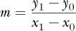
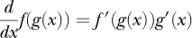
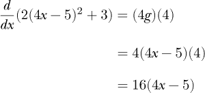
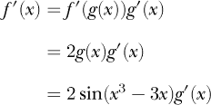
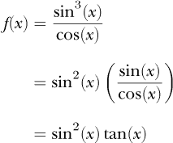
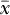

## 第七章：微分学**


艾萨克·牛顿爵士和戈特弗里德·威廉·莱布尼茨分别发现了“微积分”，这是数学历史上最伟大的成就之一。微积分通常分为两大部分：微分学和积分学。微分学讨论的是变化率及其关系，体现在导数的概念中。积分学则关注曲线下的面积等问题。

深度学习中我们不需要用到积分学，但微分学将会被频繁使用。例如，我们用微分学来训练神经网络；我们通过梯度下降法调整神经网络的权重，而梯度下降依赖于通过反向传播算法计算的导数。

导数将是本章的核心。我们将首先介绍斜率的概念，看看它如何引出导数的概念。然后我们会正式定义导数，并学习如何计算单变量函数的导数。之后，我们将学习如何利用导数找出函数的最小值和最大值。接下来是偏导数，即针对多变量函数的单一变量的导数。我们将在反向传播算法中广泛使用偏导数。最后，我们将介绍梯度，进而引入矩阵微积分，这也是第八章的内容。

### 斜率

在代数课上，我们学习了关于直线的所有内容。定义直线的一种方式是斜截式，

*y* = *mx* + *b*

其中 *m* 是斜率，*b* 是*y* 截距，即直线与 y 轴交点的位置。我们关注的是斜率。如果我们知道直线上的两个点（*x*[1], *y*[1]）和（*x*[0], *y*[0]），我们就知道直线的斜率：



斜率告诉我们，*x*位置的任何变化，会引起*y*的多少变化。如果斜率为正，那么*x*的正变化会导致*y*的正变化。另一方面，负斜率意味着*x*的正变化会导致*y*的负变化。

直线的斜截式告诉我们，斜率是*x*和*y*之间的比例常数。截距，*b*，是一个常数偏移量。这意味着，*x*从*x*[1]变到*x*[0]时，*y*的变化为*m*（*x*[1] − *x*[0]）。斜率关联了两件事，告诉我们改变一个变量如何影响另一个变量。我们将在本书中多次回到这个概念。

现在，让我们通过一些例子来形象化这一点。图 7-1 显示了一个曲线和一些与其相交的直线。


*图 7-1：一条曲线及其割线（*A*）和切线（*B*）*

标记为 *A* 的线与曲线在两点交叉，*x*[1] 和 *x*[0]。通过曲线上两点之间的连线称为 *割线*。另一条线，*B*，恰好在点 *x**[t]* 触及曲线。与曲线在一个点上接触的线称为 *切线*。我们将在下一节回到割线，但现在请注意，切线在 *x**[t]* 处具有特定的斜率，而割线随着 *x*[1] 和 *x*[0] 之间的距离趋向于零而变成切线。

假设我们将点 *x**[t]* 从曲线上的一个位置移动到另一个位置；我们可以看到，*x**[t]* 处的切线斜率也会随着位置的变化而改变。当我们接近曲线的最小点，约在 *x* = 0.3 处时，我们看到斜率变得越来越平缓。如果从左侧接近，斜率为负，并且变得越来越不负。如果从右侧接近，斜率为正，但变得越来越小。在实际的最小点，约在 *x* = 0.3 处，切线是水平的，斜率为零。类似地，如果我们接近曲线的最大点，约在 *x* = −0.8 处，斜率也会接近零。

我们可以看到，切线告诉我们曲线在某点的变化情况。正如我们将在本章后面看到的那样，切线的斜率在曲线的最小值和最大值处为零，这将引导我们找到这些点的方法。切线斜率为零的点被称为 *驻点*。

当然，要利用切线的斜率，我们需要能够求出曲线上任意 *x* 处切线的斜率。下一节将向我们展示如何做到这一点。

### 导数

上一节介绍了割线和切线的概念，并暗示了知道曲线在某一点的切线斜率可能是有用的。切线在 *x* 处的斜率被称为 *x* 处的 *导数*。它告诉我们曲线（函数）在 *x* 处的变化情况，即函数值如何随着 *x* 的微小变化而变化。在这一节中，我们将正式定义导数，并学习计算单变量函数 *x* 导数的简化规则。

#### 一个正式的定义

一般的第一学期微积分课程会通过研究极限来引入导数。我在上面提到过，曲线两点之间的割线的斜率会在两点重合时变成切线，而这正是极限发挥作用的地方。

例如，如果 *y* = *f*(*x*) 是一条曲线，并且我们在曲线上有两个点，*x*[0] 和 *x*[1]，那么这两点之间的斜率，Δ*y*/Δ*x*，为


这就是你可能在学校里学过的 *升高比水平*（*rise over run*）。*升高*，*Δy* = *y*[1] − *y*[0] = *f*(*x*[1]) − *f*(*x*[0])，除以 *水平*，Δ*x* = *x*[1] − *x*[0]。我们通常用 Δ 作为前缀来表示某个变量的变化。

如果我们定义 *h* = *x*[1] − *x*[0]，我们可以将 方程 7.1 重写为


因为 *x*[1] = *x*[0] + *h*。

在这种新形式下，我们可以通过让 *h* 越来越接近零，即 *h* → 0，来找到 *x*[0] 处切线的斜率。让一个值逼近另一个值就是一个*极限*。让 *h* → 0 就是让我们计算斜率的两点越来越接近。这直接导致了导数的定义。


*dy*/*dx* 或 *f′*(*x*) 用来表示 *f*(*x*) 的导数。

在我们深入讨论导数的含义之前，先花点时间讨论一下符号。使用 *f*′(*x*) 来表示导数是跟随 Joseph-Louis Lagrange 的做法。莱布尼茨使用 *dy*/*dx* 来模仿斜率的符号，将 Δ → *d*。如果 Δ*y* 是两个点之间 *y* 的变化量，*dy* 则是单个点上 *y* 的微小变化。牛顿使用了另一种符号，，其中点表示 *f* 的导数。物理学家通常使用牛顿的符号来表示关于时间的导数。例如，如果 *f*(*t*) 是粒子的位置关于时间 *t* 的函数，那么 就是关于 *t* 的导数，也就是位置随时间的变化。位置随时间的变化即为速度（如果使用向量则为速度）。你在书籍中会看到所有这些符号。我的偏好是保留 用于时间的函数，并在其他地方交替使用 Lagrange 的 *f*′(*x*) 和 Leibniz 的 *dy*/*dx*。

尽管上面的 方程 7.2 很繁琐，且是许多初学微积分学生的噩梦，至少直到他们遇到积分，但如果不得不使用它，你还是可以操作的。不过，在本书中我们不会讨论积分，所以你可以深呼吸，放松一下。

在与极限的斗争之后，微积分学生会得到一个秘密：一小套规则将使你无需使用极限就能计算几乎所有的导数。我们将通过一个一个的例子介绍这些规则，然后，在本节的末尾，我们将把这些规则整合成一种适合印在 T 恤上的形式。

然而，在我们深入讨论规则之前，让我们再花点时间讨论一下*导数*究竟在告诉我们什么。前面我提到，位置随时间的变化由导数给出。这对于所有的导数都是适用的；它们告诉我们某个事物如何随另一个事物的变化而变化。我们甚至可以在莱布尼茨的符号 *dy*/*dx* 中看到这一点，它表示 *dy* 随 *dx* 变化的程度。*x* 处的导数告诉我们该点处函数是如何变化的。正如我们将看到的，*f*(*x*) 的导数本身就是一个关于 *x* 的新函数。如果我们选择一个特定的 *x*[0]，那么我们知道 *f*(*x*[0]) 就是该点处函数的值。

同样地，如果我们知道导数，那么*f*′(*x*[0])表示函数*f*(*x*)在*x*[0]处变化的速度和方向。考虑速度的定义，即位置随时间变化的情况。我们甚至用语言来表达：我当前的速度是 30 英里每小时—*miles per hour*—即位置随时间的变化。

我们将使用导数来表示速率，看看改变一个变量如何影响另一个变量。最终，在深度学习中，我们希望了解在网络中改变一个参数的值将如何最终改变损失函数，即网络预期输出与实际输出之间的误差。

如果*f*′(*x*)是*x*的函数，那么我们应该能够对其求导。我们称*f*′(*x*)为*一阶导数*。它的导数，用*f*′′(*x*)表示，是*二阶导数*。在莱布尼茨符号中，我们写作*d*²*y*/*dx*²。二阶导数告诉我们一阶导数是如何随*x*变化的。物理学在这里提供了帮助。位置关于时间的函数*f*的一阶导数是*速度*，—即位置随时间的变化。因此，位置的二阶导数，，也就是速度的一阶导数，表示速度随时间的变化。我们称之为*加速度*。

理论上，我们可以计算任意多次导数。实际上，许多函数最终的导数是常数值。由于常数值不变化，它的导数为零。

总结一下，*f*(*x*)的导数是另一个函数，*f*′(*x*)或*dy*/*dx*，它告诉我们在每一点上*f*(*x*)的切线斜率。而且，由于*f*′(*x*)是*x*的函数，它也有导数，*f*′′(*x*)或*d*²*y*/*dx*²，即第二导数，它告诉我们*f*′(*x*)在每个*x*处的变化情况，依此类推。我们将在下面看到如何利用一阶和二阶导数。目前，先学习*微分*规则，即计算导数的过程。

#### 基本规则

我们在上一节中提到了一条规则：常数*c*的导数为零。所以，我们写作


这里我们使用的是莱布尼茨符号的算子形式：*d*/*dx*。可以将*d*/*dx*看作是作用于后面的部分；它的作用方式与否定相同：要否定*c*，我们写作*−c*；要对*c*求导，我们写作。如果我们的表达式中没有*x*，那么我们将其视为常数，导数为零。

##### 幂法则

*x*的幂的导数使用*幂法则*，


其中*a*是常数，*n*是指数，不需要是整数。我们来看一些例子：


我们经常通过加法和减法构建代数表达式。微分是一个线性算子，所以我们可以写作


这意味着我们逐项计算导数。例如，使用我们目前掌握的规则，我们现在知道如何计算一个多项式的导数：


一般来说，


在这里我们看到一个多项式的导数是另一个次数为*n* − 1 的多项式，并且原始多项式中的任何常数项都变为零。

##### 乘积法则

函数相乘的微分有它自己的规则，*乘积法则*：


乘积的导数是第一个函数的导数乘以第二个函数，加上第二个函数的导数乘以第一个函数。考虑以下例子：


##### 商法则

一个函数除以另一个函数的导数遵循*商法则*：


这就引出了像这样的例子：


##### 链式法则

下一个规则涉及函数的复合。当一个函数的输出作为另一个函数的输入时，我们就得到了函数的复合。*链式法则*适用于函数的复合，并且在神经网络的训练中至关重要。该规则是



我们将外函数的导数，使用*g*(*x*)作为变量，乘以内函数对*x*的导数。

作为第一个例子，考虑函数*f*(*x*) = (*x*² + 2*x* + 3)²。这是两个函数的复合吗？是的。让我们定义*f*(*g*) = *g*² 和 *g*(*x*) = *x*² + 2*x* + 3。那么，我们可以通过将*f*(*g*)中的每个*g*实例替换为关于*x*的*g*定义来找到*f*(*x*)：*g*(*x*) = *x*² + 2*x* + 3。这就得到了

*f*(*x*) = *g*² = (*x*² + 2*x* + 3)²

这自然是我们最初的目标。为了找到*f*′(*x*)，我们首先找到*f*′(*g*)，即*f*对*g*的导数，然后乘以*g*′(*x*)，即*g*对*x*的导数。最后一步，我们用关于*x*的*g*的定义来替换所有关于*g*的引用。所以，我们计算*f*′(*x*)为


我们通常不会明确指出*f*(*g*)和*g*(*x*)，但在头脑中我们会经过相同的过程。让我们来看一些更多的例子。在这个例子中，我们想找到


如果我们使用链式法则，我们可以看到我们有*f*(*g*) = 2*g*² + 3 和 *g*(*x*) = 4*x* − 5。 因此，我们可以写出



其中*f*′(*g*) = 2*g* 和 *g*′(*x*) = 4。通过一些练习，我们可以在脑海中将 4*x* − 5 看作是*f*(*x*)的一个变量（即*g*的替代），然后记得在计算完成后乘以 4*x* − 5 的导数。如果我们没能看到复合函数呢？如果我们扩展整个函数*f*(*x*)，然后再求导呢？我们最好能得到使用链式法则得出的答案。让我们来看一看……


这是我们上面找到的结果，所以我们应用链式法则是正确的。

让我们看一个新的例子。如果 ，我们应该如何考虑计算导数？如果我们把这个函数看作 ，其中 *u*(*x*) = 1 和 *v*(*x*) = 3*x*²，我们可以使用商法则得到如下结果。


这里，我们使用了 *u* 和 *v* 的简写表示法，省略了 *x* 的正式函数符号。

我们也可以将 *f*(*x*) 看作 (3*x*²)^(−1)。如果我们这样想，我们可以应用链式法则和幂法则得到


证明有时计算导数确实不止一种方法。

我们使用拉格朗日符号表示了链式法则。在本章稍后的部分，我们将使用莱布尼茨符号再次看到它。现在让我们继续，介绍一组三角函数的法则。

#### 三角函数的法则

基本三角函数的导数是直接的：


如果我们将基本微分法则应用到正切的定义上，可以看到最后一个法则是正确的：


记住，sec *x* = 1/ cos *x* 和 sin² *x* + cos² *x* = 1。

让我们看一些使用新三角法则的例子。我们将从一个包含三角函数的复合函数开始：


我们可以看到这是一个 *f*(*g*) = sin(*g*) 和 *g*(*x*) = *x*³ − 3*x* 的复合函数，所以我们知道可以应用链式法则得到导数，即 *f*′(*g*)*g*′(*x*)，其中 *f*′(*g*) = cos(*g*) 和 *g*′(*x*) = 3*x*² − 3。第二行简化了答案。

让我们看一个更复杂的复合函数：


这一次，我们把复合函数拆分为 *f*(*g*) = *g*² 和 *g*(*x*) = sin(*x*³ − 3*x*)。然而，*g*(*x*) 本身是一个复合函数，*g*(*u*) = sin(*u*) 和 *u*(*x*) = *x*³ − 3*x*，就像我们在前面的例子中所做的那样。所以，第一步是写出如下式子。



第一行是复合函数的导数定义。第二行代入了 *f*(*g*) 的导数，即 *2g*，第三行用 sin(*x*³ − 3*x*) 替换了 *g*(*x*)。现在，我们只需要找到 *g*′(*x*)，我们可以通过第二次使用链式法则来做到这一点，其中 *g*(*u*) = sin *u* 和 *u*(*x*) = *x*³ − 3*x*，正如我们在上面的例子中所做的那样。这样我们得到 *g*′(*x*) = cos(*x*³ − 3*x*)(3*x*² − 3)，所以现在我们知道 *f*′(*x*) 是


让我们做一个更多的例子。这个例子将涉及多个三角函数。我们想看看如何计算


正如在处理三角函数时经常出现的那样，恒等式起了作用。在这里，我们看到 *f*(*x*) 可以重写为：



现在，导数使用了三角函数法则、正割的定义、链式法则和乘积法则，如下所示。


让我们继续看一下指数和对数的导数。

#### 指数和对数的规则

*e^x*的导数，其中*e*是自然对数的底数（*e* ≈ 2.718...），是特别简单的。它就是它本身：


当自变量是*x*的函数时，这变成了


如果*e^x*的导数是*e^x*，那么当*a*是除*e*以外的实数时，*a^x*的导数是什么？要看答案，我们需要记住*e^x*和自然对数 ln *x*，它们是以*e*为底的对数的反函数，所以*e*^(ln*a*) = *a*。然后，我们可以写出

*a^x* = (*e*^(ln *a*))^(*x*) = *e^x*^(ln *a*)

我们现在知道如何从方程 7.3 中求出*e^x*^(ln*a*)的导数。它是


但是*e x* ln *a* = *a^x*，因此我们有


并且一般来说，


注意，如果*a* = *e*，我们得到 ln(*e*) = 1，并且方程 7.4 变成方程 7.3。

现在让我们来看自然对数本身的导数。它是


当自变量是*x*的函数时，这变成了


你可能会想：我们如何求一个以*e*以外的底数为基础的对数的导数？例如，log[10] *x*的导数是什么？为了回答这个问题，我们做的事情与上面求*a^x*的导数类似。我们将* x*的对数，底数为*b*，表示为自然对数的形式，如下所示


在这里，ln *b*是一个常数，与*x*无关。此外，我们现在知道如何求 ln *x*的导数，所以我们看到 log*[b] x*的导数必须是


对于任何实数底数*b* ≠ 1。而且，更一般地，


在这里，我们再次注意到，如果*b* = *e*，我们得到 ln *e* = 1，并且方程 7.6 变成方程 7.5。

在方程 7.6 中，我们已经总结了导数的规则。现在让我们将这些规则整理成一个表格，方便在本书剩余部分进行查阅。结果就是表 7-1。

现在我们知道如何求导了。我鼓励你寻找带有解答的练习题，以确保自己理解规则并知道如何应用它们。接下来我们来看一下如何利用导数来求函数的最小值和最大值。找到最小值对神经网络的训练至关重要。

**表 7-1：** 求导规则

| **类型** | **规则** |
| --- | --- |
| 常数 |  |
| 幂 |  |
| 和式 |  |
| 积 |  |
| 商 |  |
| 链式法则 |  |
| 三角学 |  |
| 指数 |  |
| 对数 |  |

### 函数的极小值和极大值

之前，我定义了驻点作为函数的一阶导数为零的地方，即切线的斜率为零的地方。我们可以利用这个信息来判断一个特定的点，记作 *x[m]*，是否是函数 *f*(*x*) 的极小值或极大值。如果 *x[m]* 是极小值，那么它是函数的最低点，在这个点上 *f*(*x[m]*) 小于 *f*(*x[m]*) 左右相邻点的值。类似地，如果 *f*(*x[m]*) 高于 *f*(*x[m]*) 左右相邻点的值，那么 *f*(*x[m]*) 是极大值。我们统称极小值和极大值为 *f*(*x*) 的*极值*（单数形式为 *极值点*）。

从导数的角度看，*极小值* 是指 *x[m]* 左侧点的导数为负，而右侧点的导数为正。*极大值* 则相反：左侧的导数为正，右侧的导数为负。

回顾 图 7-1。在这里，我们大约在 *x* = −0.8 处有一个局部极大值，在 *x* = 0.3 处有一个局部极小值。假设最大值实际上在 *x[m]* = −0.8 处。这个点是极大值，因为如果我们查看 *x[m]* 附近的任何点 *x[p]*，都会发现 *f*(*x[p]*) 小于 *f*(*x[m]*)。同样地，如果最小值在 *x[m]* = 0.3 处，那是因为任何接近它的点 *x[p]* 都有 *f*(*x[p]*) > *f*(*x[m]*)。如果我们想象切线沿着图形滑动，当它接近 *x* = −0.8 时，我们会看到斜率为正，但正朝向零。当我们越过 *x* = −0.8 时，斜率变为负数。最小值 *x* = 0.3 处则相反，左侧的切线斜率为负，但一旦越过 *x* = 0.3，斜率变为正数。

你会读到和听到术语*全局*和*局部*应用于极小值和极大值。*f*(*x*)的全局极小值是所有极小值中最低的，而全局极大值是所有极大值中最高的。因此，其他极小值和极大值被视为局部的；它们在特定区域有效，但还有更低的极小值或更高的极大值。我们应该注意，并非所有的函数都有极小值或极大值。例如，直线 *f*(*x*) = *mx* + *b* 就没有极小值或极大值，因为直线上的任何点都不满足极小值或极大值的要求。

所以，如果一阶导数 *f*′(*x*) 为零，我们就有极小值或极大值，对吧？并不一定。在其他驻点处，尽管一阶导数为零，但判断极小值或极大值的其他条件并不满足。这些点通常被称为*拐点*，或者如果是在多维空间中，则称为*鞍点*。例如，考虑 *y* = *x*³。其一阶导数为 *y*′ = 3*x*²，二阶导数为 *y*′′ = 6*x*。在 *x* = 0 时，第一和第二导数都为零。然而，正如我们在图 7-2 中看到的，*x* = 0 左右两侧的斜率都是正的。因此，斜率并没有从正变负或从负变正，意味着 *x* = 0 不是极值点，而是拐点。


*图 7-2：显示 *x* = 0 处拐点的 *y* = *x*³ 图像*

现在假设 *x[s]* 是一个驻点，所以 *f*′(*x[s]*) = 0。如果我们选择另外两个点，*x[s−∊]* 和 *x[s+∊]*，分别位于 *x[s]* 左右两侧，且 ∊（ε）非常小，我们就可以得到四种可能的 *f*′(*x[s]*[−∊]) 和 *f*′(*x[s]*[+∊]) 的值，如表 7-2 所示。

**表 7-2：识别驻点**

| ***f’*(*x[s]* – ∊), *f’*(*x[s]* + ∊) 的符号** | **驻点类型在 *x[s]* – ∊ < *x[s]* < *x[s]* + ∊ 时** |
| --- | --- |
| +, – | 极大值 |
| –, + | 极小值 |
| +, + | 既不是极小值也不是极大值 |
| –, – | 既不是极小值也不是极大值 |

因此，候选驻点的一阶导数值不足以告诉我们该点是否为极小值或极大值。我们可以观察候选点周围的区域来帮助我们做出判断。我们还可以查看 *f*′′(*x*)，即 *f*(*x*) 的二阶导数。如果 *x[s]* 是一个驻点且 *f*′(*x[s]*) = 0，那么 *f*′′(*x[s]*) 的符号可以告诉我们 *x[s]* 可能是什么类型的驻点。如果 *f*′′(*x[s]*) < 0，那么 *x[s]* 是 *f*(*x*) 的*极大值*。如果 *f*′′(*x[s]*) > 0，那么 *x[s]* 是极小值。如果 *f*′′(*x[s]*) = 0，二阶导数没有帮助；我们需要用一阶导数显式地测试附近的点。

我们首先如何找到候选的驻点呢？对于代数函数，我们解 *f*′(*x*) = 0；我们找到所有使得 *f*′(*x*) 为零的 *x* 值的解集。然后，我们使用导数检验来决定这些点是极小值、极大值还是拐点。

对于许多函数，我们可以直接求解 *f*′(*x*) = 0。例如，如果 *f*(*x*) = *x*³ − 2*x* + 4，我们有 *f*′(*x*) = 3*x*² − 2。如果我们将其设为零，*3x*[2] − 2 = 0，并使用二次公式求解，我们发现有两个驻点： 和 。*f*(*x*) 的二阶导数是 *f*′′(*x*) = 6*x*。*f*′′(*x*[0]) 的符号为负，因此 *x*[0] 代表一个最大值。由于 *f*′′(*x*[1]) 的符号为正，*x*[1] 是一个最小值。

我们可以看到，导数测试是正确的。图 7-3 的上部分显示了 *f*(*x*) = *x*³ − 2*x* + 4 的图，其中 *x*[0] 是一个最大值，*x*[1] 是一个最小值。

让我们看一个例子。这次，我们有 *f*(*x*) = *x*⁵−2*x*³+*x*+2，见图 7-3 的底部图。我们找到一阶导数并将其设为零：

*f*′(*x*) = 5*x*⁴ − 6*x*² + 1 = 0

如果我们代入 *u* = *x*²，我们可以通过找到 5*u*²−6*u*+1 的根并将这些根设置为 *x*²来求解 *f*′(*x*) 的根。这样做得到！Image 和 ，所以我们有四个驻点。为了测试它们，我们可以使用二阶导数测试。二阶导数是 *f*′′(*x*) = 20*x*³ − 12*x*。

将驻点代入 *f*′′ 计算得出：


意味着 *x*[0] 是一个最大值，*x*[1] 是一个最小值，*x*[2] 是另一个最大值，*x*[3] 是一个最小值。图 7-3 再次验证了我们的结论。


*图 7-3：* f(x) = x³ – 2x + 4（上）和 x⁵ – 2x³ + x + 2（下）的图，标出极值

如果我们无法轻易找到一个函数的驻点怎么办？也许我们无法代数地求解该函数，或者可能它不能以封闭形式表示，也就是说没有有限的操作集来表示它。典型的微积分课程通常不会关注这些情况。然而，我们需要关注这些问题，因为一种看待神经网络的方式是将其视为一个函数逼近器，它的函数无法直接表示。我们还能利用我们新学到的导数知识吗？答案是肯定的，我们可以。我们可以使用导数作为指示器，告诉我们如何越来越接近极值。这正是梯度下降法的作用，我们将在本书后面花大量时间讨论它。

目前，让我们继续研究多变量函数，并看看这对导数的概念有什么影响。

### 偏导数

到目前为止，我们只关注了一个变量的函数 *x*。当我们处理多个变量的函数时，*f*(*x*, *y*) 或 *f*(*x*[0], *x*[1], *x*[2], . . . , *x[n]*)，导数的概念会发生什么变化呢？为了处理这些情况，我们将引入*偏导数*的概念。请注意，为了清晰起见，本节将使用莱布尼茨符号。

方程 7.2 定义了 *f*(*x*) 对 *x* 的导数。如果 *x* 是唯一的变量，为什么我们要加上“对 *x* 的偏导数”这句话？现在我们来看看为什么：在这个表达式中，某个变量的偏导数是通过将其他变量视为常数并固定它们来求得的。然后我们说我们正在计算对那个未固定的变量的偏导数。

让我们来看一个例子。设 *f*(*x*, *y*) = *xy* + *x*/*y*。然后，我们可以计算 *两个* 偏导数，一个是对 *x* 的偏导数，另一个是对 *y* 的偏导数：


我们在本章之前学过的微分法则仍然适用。注意，*d* 已经变成了 ∂。这表示函数 *f* 是多变量的。同时，看到在计算相应的导数时，我们将其他变量视作常数参数。这就是偏导数的计算方法。接下来，我们来看一些例子，帮助你更好地理解这个概念。

如果 *f*(*x*, *y*, *z*) = *x*² + *y*² + *z*² + 3*xyz*，我们可以得到三个部分导数：


其他两个变量被视为常数。这就是为什么例如在对 *x* 的部分导数中，*y*² 和 *z*² 变为 0，而 3*xyz* 变为 *3yz*。

如果 ，我们有四个部分导数：


作为一个更复杂的例子，考虑 *f*(*x*, *y*) = *e^(xy)* cos *x* sin *y*。接下来的部分导数列出了我们在每个情况下使用乘积法则。


#### 混合偏导数

就像单变量函数的导数一样，我们也可以对部分导数进行偏导数运算。这些称为*混合偏导数*。此外，我们有更多的灵活性，因为我们可以改变对哪一个变量进行下一步偏导数运算。例如，之前我们看到，*z*的部分导数是


这仍然是一个关于 *x*、*y*、*z* 和 *t* 的函数。因此，我们可以像这样计算第二阶部分导数：


我来解释一下符号。我们从 *f* 对 *z* 的偏导数开始，所以我们写 ∂*f*/∂*z*。然后，从这个起点出发，我们进行其他部分导数运算。所以，如果我们想表示对 *x* 的部分导数，我们可以这样理解：


在这里，我们可以将偏导数算符看作“乘”上“分子”和“分母”，就像分数一样。然而，需要明确的是，这些并不是分数；符号只是继承了其斜率起源的分数风格。尽管如此，如果这种记忆法对你有帮助，那就有帮助。对于二阶偏导数，与其求导的变量位于左侧。如果变量相同，还会使用某种形式的指数，例如 ∂²*f*/∂*z*²。

#### 偏导数的链式法则

为了将链式法则应用于偏导数，我们需要追踪所有变量。因此，如果我们有 *f*(*x*, *y*)，其中 *x* 和 *y* 都是其他变量的函数，*x*(*r*, *s*) 和 *y*(*r*, *s*)，那么我们可以通过分别应用链式法则来求出 *f* 对 *r* 和 *s* 的偏导数，具体如下，


作为一个例子，设 *f*(*x*, *y*) = *x*³+*y*³，且 *x*(*r*, *s*) = 3*r*+2*s* 和 *y*(*r*, *s*) = *r*²−3*s*。现在求 ∂*f*/∂*r* 和 ∂*f*/∂*s*。为了求出这些偏导数，我们需要计算六个表达式，


这样所得到的偏导数是


就像单变量函数一样，多变量函数的链式法则是递归的，因此，如果 *r* 和 *s* 本身是另一个变量的函数，我们可以再应用一次链式法则，找到关于该变量的 *f* 的偏导数。例如，如果我们有 *x*(*r*, *s*)，*y*(*r*, *s*)，且 *r*(*w*)，*s*(*w*)，我们可以通过以下方式求出 ∂*f*/∂*w*：


最后，我们需要记住 ∂*f*/∂*w* 告诉我们 *f* 如何因 *w* 的微小变化而变化。我们将在梯度下降中使用这个事实。

本节关注的是偏导数的机械计算。让我们继续探索这些量背后的更多含义。这将引导我们到梯度的概念。

### 梯度

在第八章中，我们将深入探讨深度学习中使用的矩阵微积分表示法。然而，在此之前，我们将通过引入*梯度*的概念来结束本章内容。梯度建立在我们之前计算的导数基础上。简而言之，梯度告诉我们一个多变量函数如何变化，以及它变化最快的方向。

#### 计算梯度

如果我们有 *f*(*x*, *y*, *z*)，我们上面已经展示了如何计算每个变量的偏导数。如果我们将这些变量解释为坐标轴上的位置，我们就能看出 *f* 是一个返回标量（单一数值）的函数，这个数值适用于三维空间中的任意位置 (*x*, *y*, *z*)。我们甚至可以写作 *f*(***x***)，其中 ***x*** = (*x*, *y*, *z*) 来表明 *f* 是一个向量输入的函数。像前几章一样，我们将使用加粗小写字母表示向量，***x***。注意，有些人使用  来表示向量。

我们可以将向量横向写成行向量，像前一段那样，或者纵向写成列向量，


在列向量中，我们还使用了方括号而不是圆括号。两种表示法都是可以接受的。除非我们故意草率，通常在讨论代码中的向量时，我们会假设我们的向量是列向量。这意味着向量是一个 *n* 行一列的矩阵，即 *n* × 1。

接受向量输入并返回单一数值输出的函数称为 *标量场*。标量场的典型例子是温度。我们可以测量房间中任意一点的温度。我们将位置表示为相对于某个选定原点的三维向量，温度则是该点的值，即该区域分子平均动能的大小。我们也可以讨论接受向量作为输入并返回向量作为输出的函数，这些称为 *矢量场*。在这两种情况下，场一词指的是在某个适当的定义域内，函数对所有输入都有值。

梯度是接受向量作为输入的函数的导数。从数学上讲，我们将梯度表示为偏导数概念在 *n* 维空间中的推广。例如，在三维空间中，我们可以写作


梯度算子 ▽ 对 *f* 在每个维度上的偏导数进行操作。▽ 算子有多个名字，如 *del*、*grad* 或 *nabla*。当我们不单纯说“梯度算子”时，我们将使用▽并称之为 *del*。

通常，我们可以写作


让我们解析一下 方程 7.7。首先，我们有一个函数 *f*，它接受一个向量输入 ***x***，并返回一个标量值。对这个函数，我们应用梯度算子：


这会返回一个 *向量* (***y***)。梯度算子将 *f* 的标量输出转化为向量。让我们花些时间思考这意味着什么，它告诉我们关于标量场在给定位置的值的信息。（当我们处理向量时，我们会使用 *空间* 一词，即使没有直观的方式去可视化这个空间。虽然三维空间的类比有帮助，但它的意义有限；在数学上，空间的概念更为广泛。）

举个例子，考虑一个二维空间中的函数，*f*(***x***) = *f*(*x*, *y*) = *x*² + *xy* + *y*²。此时，*f* 的梯度为


由于 *f* 是一个标量场，二维平面上的每个点都有一个函数值。这就是 *f*(***x***) = *f*(*x*, *y*) 的输出。因此，我们可以在三维空间中绘制 *f*，以展示它随位置变化的表面。然而，梯度则给出了一组方程。这些方程集体告诉我们在点 ***x*** = (*x*, *y*) 处，函数值变化的方向和大小。

对于单变量函数，每个点只有一个斜率。再看看图 7-1 中的切线。在 *x[t]* 处，只有一个斜率。导数的符号表示斜率的方向，而导数的绝对值表示斜率的大小（陡度）。

然而，一旦我们转到多维空间，就会遇到一些难题。我们不仅有一个斜率切线，而是有无数个。我们可以想象在某个点上有一条切线，并且这条线可以指向我们希望的任何方向。该线的斜率告诉我们函数值在特定方向上的变化。我们可以通过*方向导数*来计算这种变化，即该点处的梯度与我们感兴趣方向的单位向量之间的点积：

*D**[u]**f*(***x***) ≡ ***u**• ▽f*(***x***) = ***u**^T*▽*f*(***x***) = ||***u***||||▽*f*(***x***)|| cos *θ*

其中，***u*** 是一个特定方向上的单位向量，▽*f*(***x***) 是该点 ***x*** 处的函数梯度，*θ* 是它们之间的角度。当 cos *θ* 最大时，方向导数也最大，这发生在 *θ* = 0 时。因此，函数在任何点的最大变化方向就是该点的梯度方向。

举个例子，假设我们选择二维平面上的一个点，比如 ***x*** = (*x*, *y*) = (0.5, −0.4)，并且根据上面给出的 *f*(*x*, *y*) = *x*² + *xy* + *y*²。此时，函数值在 ***x*** 处为 *x*² + *xy* + *y*² = (0.5)² + (0.5)(−0.4) + (−0.4)² = 0.21，这是一个标量值。然而，梯度在该点的值为


因此，我们现在知道，在点 (0.5, −0.4) 处，*f* 的最大变化方向是 (0.6, −0.3) 方向，且其大小为 。

#### 梯度的可视化

让我们将这一切变得不那么抽象。图 7-4 的顶部展示了在选定点上，*f*(*x*, *y*) = *x*² + *xy* + *y*² 的图像。


*图 7-4：`x`² + `xy` + `y`² 的图像（顶部）以及相关梯度场的二维投影（底部）*

生成此图的代码很简单：

```py
import numpy as np

x = np.linspace(-1.0,1.0,50)

 y = np.linspace(-1.0,1.0,50)

xx = []; yy = []; zz = []

for i in range (50):

    for j in range (50):

        xx.append(x[i])

        yy.append(y[j])

        zz.append(x[i]*x[i]+x[i]*y[j]+y[j]*y[j])

x = np.array(xx)

y = np.array(yy)

z = np.array(zz)
```

在这里，我们明确地进行循环，生成散点图的`x`、`y`和`z`值，以清楚地展示发生了什么。首先，我们使用 NumPy 生成 50 个均匀分布的点，在`x`和`y`上定义范围[−1, 1]。然后，我们设置双重循环，以便每个`x`与每个`y`配对计算函数值`z`。临时列表`xx`、`yy`和`zz`存储这些三元组。最后，我们将这些列表转换为 NumPy 数组，以便进行绘图。

生成散点图的代码是

```py
from mpl_toolkits.mplot3d import Axes3D

import matplotlib.pylab as plt

fig = plt.figure()

ax = fig.add_subplot(111, projection='3d')

ax.scatter(x, y, z, marker='.', s=2, color='b')

ax.view_init(30,20)

plt.draw()

plt.show()
```

我们首先加载`matplotlib`扩展库来进行 3D 绘图，然后设置 3D 投影的子图。图形本身是通过`ax.scatter`生成的，而`ax.view_init`和`plt.draw`则旋转图形，以便在展示之前给我们更好的函数形状视图。

在图 7-4 的底部，我们可以看到函数*x*² + *xy* + *y*²的梯度场向量图。该图展示了在网格点（*x*，*y*）上梯度向量的方向和相对大小。回想一下，梯度是一个向量场，因此*xy*平面上的每个点都有一个指向函数值变化最快方向的向量。通过视觉上，我们可以看到梯度向量图与图 7-4 顶部函数图的关系，其中靠近（−1，−1）和（1，1）点的函数值变化很快，而靠近（0，0）点的函数值变化很慢。

生成向量场图的代码是

```py
fig = plt.figure()

ax = fig.add_subplot(111)

x = np.linspace(-1.0,1.0,20)

y = np.linspace(-1.0,1.0,20)

xv, yv = np.meshgrid(x, y, indexing='ij', sparse=False)

dx = 2*xv + yv

dy = 2*yv + xv

 ax.quiver(xv, yv, dx, dy, color='b')

plt.axis('equal')

plt.show()
```

我们首先定义图形（`fig`）和 2D 子图（没有`projection`关键字）。然后，我们需要一组点的网格。上面我们通过循环获取这个网格，以便理解需要生成什么内容。在这里，我们通过`np.meshgrid`使用 NumPy 生成网格。请注意，我们传递给`np.meshgrid`的仍然是上面定义的`x`和`y`向量，用于定义域。

接下来的两行代码是对*f*的梯度的直接实现，方程 7.8。这些是我们希望绘制的向量，其中`dx`和`dy`给出了方向和大小，而`xv`和`yv`是输入点的集合——总共 400 个。

该图使用`ax.quiver`（因为它绘制的是箭头）。参数是点的网格（`xv`、`yv`）以及在这些点上的向量的相关*x*和*y*值（`dx`、`dy`）。最后，我们确保坐标轴相等（`plt.axis`），以避免扭曲向量显示，然后展示图形。

我们将在这里结束对梯度的介绍。我们将在本书的剩余部分再次看到它们，包括在第八章的符号表示和第十一章的梯度下降讨论中。

### 总结

本章介绍了微分学的主要概念。我们从斜率的概念开始，并学习了单变量函数的割线和切线的区别。然后我们正式定义了导数，即割线斜率趋近于一个点时的斜率。从这里开始，我们学习了微分的基本规则，并看到了如何应用它们。

接下来，我们学习了函数的极小值和极大值，以及如何通过导数找到这些点。然后我们引入了偏导数，作为计算多变量函数导数的一种方法。偏导数进一步引导我们进入梯度的概念，梯度将标量场转化为向量场，并告诉我们函数变化最剧烈的方向。我们在二维中计算了一个示例梯度，并展示了如何生成图形，显示函数与梯度之间的关系。我们学到了一个至关重要的事实：函数的梯度指向在某一点上函数值变化最快的方向。

让我们继续探索深度学习背后的数学，进入矩阵微积分的世界。
