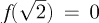
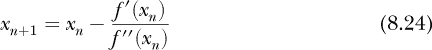

## **8

矩阵微积分**

第七章向我们介绍了微分学。在这一章，我们将讨论*矩阵微积分*，它将微分扩展到涉及向量和矩阵的函数。

深度学习广泛使用向量和矩阵，因此开发一种表示涉及这些对象的导数的符号和方法是有意义的。这正是矩阵微积分为我们提供的内容。在第七章的结尾，我们引入了梯度来表示向量的标量函数的导数——一个接受向量参数并返回标量的函数，*f*(***x***)。

我们将从矩阵微积分导数及其定义的表格开始。接下来，我们将研究一些涉及矩阵导数的恒等式。数学家喜欢恒等式；然而，为了保持理智，我们只会考虑其中的一小部分。一些特殊的矩阵是矩阵微积分的产物，特别是雅可比矩阵和海森矩阵。在你深入深度学习的过程中，你会遇到这两个矩阵，因此我们接下来会在优化的背景下讨论它们。回想一下，训练神经网络本质上是一个优化问题，因此理解这些特殊矩阵的含义以及如何使用它们尤为重要。我们将以一些矩阵导数的例子结束这一章。

### 公式

表 8-1 总结了我们将在本章中探讨的矩阵微积分导数。这些是实践中常用的导数。

**表 8-1：** 矩阵微积分导数

|  | **标量** | **向量** | **矩阵** |
| --- | --- | --- | --- |
| **标量** | ∂*f*/∂*x* | ∂***f***/∂*x* | ∂***F***/∂*x* |
| **向量** | ∂*f*/∂***x*** | ∂*f*/∂***x*** | — |
| **矩阵** | ∂***f***/∂***X*** | — | — |

表 8-1 的列表示函数，意味着返回值。注意，我们使用了三种版本的字母 f：常规、粗体和大写字母。如果返回值是标量，则使用*f*；如果是向量，则使用***f***；如果是矩阵，则使用***F***。 表 8-1 的行表示导数是相对于哪些变量计算的。相同的符号规则适用：*x*是标量，***x***是向量，***X***是矩阵。

表 8-1 定义了六个导数，但表格中有九个单元格。虽然可以定义其余的导数，但由于它们不够标准化或不常用，所以不值得讨论它们。对我们来说，这很好，因为这六个已经足够挑战我们的数学思维了。

表 8-1 中的第一个导数，位于左上角，是第七章的标准导数，一个生成标量的函数，关于标量的导数。（有关标准微分的所有内容，请参阅第七章。）

我们将在下面的章节中讲解剩下的五个导数。我们将每个导数定义为标量导数的形式。我们首先展示定义，然后解释该符号的含义。定义将帮助你在脑海中建立导数的模型。我猜想，在本节结束时，你可能会提前预测出这些定义。

然而，在我们开始之前，有一个复杂问题需要讨论。矩阵微积分符号较为繁琐，但并没有一个统一的符号体系。我们以前在讨论微分表示时也见过这种情况。对于矩阵微积分，有两种符号表示方法，分别是*分子布局*和*分母布局*。不同学科似乎偏好其中一种，尽管几乎常见的是混用符号和例外情况。对于深度学习，根据我非科学的粗略观察，似乎略偏向使用分子布局，因此我们这里也将采用这种布局。请注意，这两种布局都有存在，且其中一种通常是另一种的转置形式。

#### 一个接受标量参数的向量函数

一个接受标量参数的向量函数是我们的第一个导数；参见表 8-1，第一行第二列。我们将这样的函数写为***f***(*x*)，以表示标量参数*x*和向量输出***f***。像***f***这样的函数接受一个标量并将其映射到一个多维向量：

***f*** : ℝ → ℝ^(*m*)

在这里，*m*是输出向量中的元素数量。像***f***这样的函数被称为*向量值函数*，其参数为标量。

三维空间中的参数曲线是这类函数的一个极好例子。这些函数通常写作

其中 ， 和  是 x、y 和 z 方向上的单位向量。

图 8-1 显示了一个三维参数曲线的图像，

在这里，随着*t*的变化，三个轴的值也随之变化，从而描绘出螺旋形曲线。每个*t*的值都指定了三维空间中的一个点。

*图 8-1：三维参数曲线*

在矩阵微积分符号中，我们不像方程 8.1 那样写***f***。相反，我们将***f***表示为函数的列向量，

并且，一般情况下，

对于具有*n*个元素的***f***。

***f***(*x*)的导数被称为*切向量*。导数长什么样呢？由于***f***是一个向量，我们可能会预期***f***的导数是表示***f***每个元素的函数的导数，而且我们是对的：

我们来看一个简单的例子。首先，我们将定义***f***(*x*)，然后是导数：

在这里，∂***f***/∂*x*的每个元素是对应函数的导数，且该函数属于***f***。

#### 向量参数的标量函数

在第七章中，我们了解到，接受向量输入但返回标量的函数是一个标量场：

*f* : ℝ^(*m*) → ℝ

我们还了解到这个函数的导数是梯度。在矩阵微积分符号中，我们将∂*f*/∂***x***写作*f*(***x***)的导数如下：

其中，***x*** = [*x*[0] *x*[1] ... *x*[*m*–1]]^⊤ 是一个变量向量，而*f*是这些变量的函数。

请注意，由于我们决定使用分子布局方法，∂*f*/∂***x***被写成*行*向量。所以，为了保持我们的符号一致性，我们必须写成：

将行向量转为列向量，以匹配梯度。记住，▽是梯度的符号；我们在第七章看到过梯度的一个例子。

#### 向量函数的向量形式

如果一个向量值函数对标量的导数产生列向量，而一个标量函数对向量的导数产生行向量，那么一个向量值函数对向量的导数是否会产生一个矩阵呢？答案是肯定的。在这种情况下，我们正在考虑∂***f***/∂***x***，这是一个接受向量输入并返回向量的函数。

分子布局惯例为***f***(*x*)的导数提供了一个列向量，这意味着我们需要为***f***中的每个函数提供一行。同样，*f*(***x***)的导数产生了一个行向量。因此，合并这两个部分就得到了***f***(***x***)的导数：

这是对于一个函数，***f***，它返回一个*n*元素的向量，并接受一个*m*元素的向量***x***作为输入参数：

*f* : ℝ^(*m*) → ℝ^(*n*)

***f***的每一行都是***x***的标量函数，例如，*f*0。因此，我们可以将方程 8.2 写成：

这给我们提供了一个矩阵，它是梯度的集合，每个标量函数在***f***中都有一个梯度。我们将在本章稍后返回到这个矩阵。

#### 标量参数的矩阵函数

如果***f***(*x*)是一个接受标量参数但返回向量的函数，那么我们可以正确地假设***F***(*x*)可以被看作是一个接受标量参数但返回矩阵的函数：

***F*** : ℝ → ℝ^(*n*×*m*)

例如，假设***F***是一个*n* × *m*的标量函数矩阵：

对于参数*x*的导数是直接的：

如上所述，标量对向量值函数的导数被称为切向量。类比来说，标量对矩阵值函数的导数就是*切向矩阵*。

#### 向量参数的标量函数

现在让我们考虑*f*(***X***)，一个接受矩阵并返回标量的函数：

*f* : ℝ^(*n*×*m*) → ℝ

我们可以正确地认为，*f* 对矩阵 ***X*** 的导数本身是一个矩阵。然而，为了符合我们的分子布局惯例，得到的矩阵并不是像 ***X*** 那样排列的，而是像 ***X***^⊤，即 ***X*** 的转置。

为什么使用 ***X*** 的转置而不是 ***X*** 本身？为了解答这个问题，我们需要回顾一下我们如何定义 ∂*f*/∂***x***。在那里，尽管 ***x*** 是列向量，但按照标准惯例，我们说导数是一个*行*向量。我们使用了 ***x***^⊤ 作为排列顺序。因此，为了保持一致，我们需要按 ***X*** 的转置来排列 ∂*f*/∂***X***，并将 ***X*** 的列转换为导数中的行。结果，我们得出了以下定义。

这是一个 *m* × *n* 输出矩阵，对应 *n* × *m* 输入矩阵 ***X***。

方程式 8.4 定义了*梯度矩阵*，它在矩阵中发挥着类似于梯度 ▽*f*(**x**) 的作用。方程式 8.4 还完整了我们的矩阵微积分导数集合。接下来，让我们考虑一些矩阵导数恒等式。

### 恒等式

矩阵微积分涉及标量、向量、矩阵及其函数，这些函数返回标量、向量或矩阵，意味着存在许多恒等式和关系。然而，在这里我们将集中于基本恒等式，展示矩阵微积分与第七章微分微积分之间的关系。

以下每个子节介绍了与特定类型的导数相关的恒等式。这些恒等式涵盖了基本关系，并在适用时包含链式法则。在所有情况下，结果都遵循我们在本章中使用的分子布局方案。

#### 由向量构成的标量函数

我们从与向量输入的标量函数相关的恒等式开始。如果没有其他说明，*f* 和 *g* 是 ***x*** 的函数，返回标量。一个不依赖于 ***x*** 的常量向量用 ***a*** 表示，*a* 表示标量常数。

基本规则是直观的：

和

这些表明，标量常数的乘法与第七章中的作用相同，偏导数的线性性也如此。

乘积法则也如我们预期的那样适用：

在此暂停一下，提醒自己以上方程的输入和输出。我们知道，标量函数对向量参数的导数在我们的符号中是一个行向量。所以，方程式 8.5 返回一个乘以标量的行向量——导数的每个元素都乘以 *a*。

由于微分是一个线性算子，它对加法分配，因此方程式 8.6 给出了两个项，每个项都是由相应导数生成的行向量。

对于方程 8.7，乘积法则，结果再次包括两项。在每种情况下，导数返回一个行向量，并与标量函数值相乘，函数值为*f*(***x***)或*g*(***x***)。因此，方程 8.7 的输出也是一个行向量。

标量与向量的链式法则变为

其中*f*(*g*)返回一个标量并接受标量参数，而*g*(***x***)返回一个标量并接受向量参数。最终结果是一个行向量。让我们通过一个完整的例子来演示。

我们有一个向量，***x*** = [*x*[0], *x*[1], *x*[2]]^⊤；一个该向量的分量形式函数，*g*(***x***) = *x*[0] + *x*[1]*x*[2]；以及一个关于*g*的函数，*f*(*g*) = *g*²。根据方程 8.8，*f*对***x***的导数是

为了验证我们的结果，我们可以从*g*(***x***) = *x*[0] + *x*[1]*x*[2] 和 *f*(*g*) = *g*²开始，直接通过替代法得到*f*(***x***)。这样做得到了

从中我们得到

这与我们使用链式法则找到的结果匹配。当然，在这个简单的例子中，先进行替代再求导更容易，但我们同样证明了我们的推理。

然而，我们还没有完全结束标量与向量的恒等式。点积接受两个向量并产生一个标量，因此它与我们正在使用的函数形式相符，尽管点积的参数是向量。

例如，考虑以下结果：

在这里，我们得到了***x***和一个不依赖于***x***的向量***a***的点积的导数。

我们可以扩展方程 8.9，将***x***替换为一个向量值函数，***f(x***):

这个结果的形式是什么？假设*f*接受一个*m*维的输入并返回一个*n*维的向量输出。同样，假设***a***是一个*n*维的向量。从方程 8.2 中，我们知道∂***f***/∂***x***是一个*n* × *m*的矩阵。因此，最终结果是一个(1 × *n*) × (*n* × *m*) → 1 × *m*的行向量。很好！我们知道，当使用分子布局约定时，标量函数对向量的导数应该是一个行向量。

最后，两个向量值函数***f***和***g***的点积的导数是

如果方程 8.10 是一个行向量，那么类似的两个项的和也是一个行向量。

#### 通过标量的向量函数

向量与标量的微分，表 8-1，第一行第二列，在机器学习中比较少见，因此我们只检查几个恒等式。第一个是常数乘法：

请注意，我们可以通过矩阵在左侧相乘，因为导数是一个列向量。

求和法则仍然适用，

如同链式法则，

方程 8.12 是正确的，因为一个向量对标量的导数是一个列向量，而一个向量对向量的导数是一个矩阵。因此，将矩阵右乘列向量返回一个列向量，正如预期的那样。

还有两个关于与标量相乘的点积的导数值得了解。第一个类似于方程 8.11，但涉及两个标量的向量值函数：

第二个导数涉及*f*(***g***)和***g***(*x*)关于*x*的复合：

这就是行向量与列向量的点积。

#### 向量函数与向量的乘积

带有向量值函数和向量参数的导数在物理和工程中很常见。在机器学习中，它们在反向传播过程中出现，例如，在损失函数的导数中。让我们从一些简单的恒等式开始：

以及

其中结果是两个矩阵的和。

接下来是链式法则，它与标量对向量和向量对标量导数的情况一样有效：

结果是两个矩阵的乘积。

#### 标量函数与矩阵的乘积

对于返回标量的矩阵函数***X***，我们有通常形式的求和法则：

结果是两个矩阵的和。回想一下，如果***X***是一个*n* × *m*矩阵，则分子布局符号下的导数是一个*m* × *n*矩阵。

乘积法则同样按预期工作：

然而，链式法则有所不同。它依赖于*f(g*)，一个接受标量输入的标量函数，以及*g*(***X***)，一个接受矩阵输入的标量函数。在这个限制下，链式法则的形式看起来很熟悉：

让我们看看方程 8.13 的实际应用。首先，我们需要***X***，一个 2 × 2 矩阵：

接下来，我们需要  和 *g*(***X***) = *x*[0]*x*[3] + *x*[1]*x*[2]。注意，虽然*g*(***X***)接受矩阵输入，但结果是从矩阵的值计算得到的标量。

要应用链式法则，我们需要两个导数，

这里我们再次使用分子布局表示结果。

为了得到最终结果，我们计算

为了检查，我们将函数合并成一个单一函数，，并使用标准的链式法则计算每个结果矩阵元素的导数。这给出了

与之前的结果一致。

我们已经有了定义和恒等式。让我们回顾一下向量值函数对于向量参数的导数，因为得到的矩阵是特殊的。在深度学习中，我们将频繁遇到它。

### Jacobians 和 Hessians

公式 8.2 定义了向量值函数***f***相对于向量***x***的导数：

这个导数被称为 *Jacobian 矩阵*，***J***，或简称 *Jacobian*，你将会在深度学习文献中时常遇到它，尤其是在讨论梯度下降和训练模型时使用的其他优化算法时。Jacobian 有时会带下标，以指示它是相对于哪个变量的；例如，***J******[x]*** 如果是相对于***x***的。在上下文清晰的情况下，我们通常会忽略下标。

在本节中，我们将讨论 Jacobian 及其含义。接着，我们将介绍另一个矩阵，即基于 Jacobian 的 *Hessian 矩阵*（或简称 *Hessian*），并学习如何在优化问题中使用它。

本节的核心内容如下：Jacobian 是一阶导数的推广，Hessian 是二阶导数的推广。

#### 关于 Jacobians

我们之前看到过，可以将公式 8.14 视为梯度向量的转置堆叠（公式 8.3）：

将 Jacobian 视为梯度的堆叠为我们提供了它所表示内容的线索。回想一下，标量场的梯度，即接受向量参数并返回标量的函数，指向函数变化最大方向。类似地，Jacobian 向我们提供了关于向量值函数在某个点附近（***x******[p]***）如何变化的信息。Jacobian 对于向量值函数而言，就像梯度对于标量值函数一样；它告诉我们函数在***x******[p]***位置发生小变化时的变化情况。

其中一种理解 Jacobian 的方式是将其视为我们在第七章遇到的更具体情况的推广。表 8-2 展示了函数及其导数测量之间的关系。

**表 8-2：** Jacobian、梯度和斜率之间的关系

| **函数** | **导数** |
| --- | --- |
| ***f***(***x***) | ∂***f***/∂***x***，Jacobian 矩阵 |
| *f*(***x***) | ∂*f*/∂***x***，梯度向量 |
| *f*(*x*) | *df*/*dx*，斜率 |

Jacobian 矩阵是这三者中最为一般的。如果我们将函数限制为标量，那么 Jacobian 矩阵就变成了梯度向量（分子布局中的行向量）。如果我们将函数和参数限制为标量，梯度就变成了斜率。从某种意义上讲，它们都表示相同的含义：函数在空间中的某一点附近是如何变化的。

雅可比矩阵有很多用途。我将举两个例子。第一个例子来自微分方程系统。第二个例子使用牛顿法来找到向量值函数的根。当我们讨论反向传播时，我们将再次看到雅可比矩阵，因为那时需要计算一个向量值函数相对于另一个向量的导数。

##### 自治微分方程

*微分方程* 将导数和函数值结合在一个方程中。微分方程在物理学和工程学中无处不在。我们的例子来自 *自治系统* 理论，这是一类微分方程，其中自变量不出现在方程的右侧。例如，如果系统由函数值和关于时间 *t* 的一阶导数组成，则在描述该系统的方程中不会显式出现 *t*。

上一段只是背景介绍；你不需要记住它。处理自治微分方程系统最终会引出雅可比矩阵，这是我们的目标。我们可以将系统视为一个向量值函数，并且我们将使用雅可比矩阵来描述该系统的临界点（导数为零的点）。我们在第七章中处理过函数的临界点。

例如，让我们探索以下方程系统：

这个系统包含了两个函数，*x*(*t*) 和 *y*(*t*)，它们是耦合的，*x*(*t*) 的变化率依赖于 *x* 和 *y* 的值，反之亦然。

我们将系统视为一个单一的向量值函数：

我们将 *x* 替换为 *x*[0]，将 *y* 替换为 *x*[1]。

***f*** 表示的系统在 ***f*** = **0** 的位置有临界点，其中 **0** 是 2 × 1 维度的零向量。临界点是

其中代入 ***f*** 证明每个点都返回零向量。暂时假设我们已知临界点，现在我们要对它们进行表征。

要描述临界点，我们需要 ***f*** 生成的雅可比矩阵：

由于雅可比矩阵描述了一个函数在某个点附近的行为，我们可以用它来表征临界点。在第七章中，我们使用导数来判断一个点是函数的最小值点还是最大值点。对于雅可比矩阵，我们使用 ***J*** 的特征值来以类似的方式讨论临界点的类型和稳定性。

首先，让我们找到每个临界点的雅可比矩阵：

我们可以使用 NumPy 获取雅可比矩阵的特征值：

>>> import numpy as np

>>> np.linalg.eig([[4,0],[0,2]])[0]

array([4., 2.])

>>> np.linalg.eig([[2,0],[1,-2]])[0]

array([-2., 2.])

>>> np.linalg.eig([[0,-4],[2,-4]])[0]

array([-2.+2.j, -2.-2.j])

我们在第六章中遇到了 np.linalg.eig。特征值是 eig 返回的第一个值，因此函数调用中的[0]下标。

对于自治微分方程系统的临界点，特征值表明了这些点的类型和稳定性。如果两个特征值都是实数且符号相同，则临界点是一个节点。如果特征值小于零，则节点是稳定的；否则，它是不稳定的。你可以把稳定的节点看作一个坑；如果你接近它，就会掉进去。一个不稳定的节点就像一个山丘；如果你远离顶点——即临界点——你就会掉下来。第一个临界点***c***[0]具有正的实特征值；因此，它表示一个不稳定的节点。

如果雅可比矩阵的特征值是实数且符号相反，那么临界点就是鞍点。我们在第七章中讨论过鞍点。鞍点最终是不稳定的，但在二维中，存在一个方向可以“进入”鞍点，另一个方向则可以“离开”鞍点。一些研究人员认为，在训练深度神经网络时找到的大多数最小值实际上是损失函数的鞍点。我们看到，临界点***c***[1]是一个鞍点，因为其特征值是实数且符号相反。

最后，***c***[2]的特征值是复数。复特征值表明存在一个螺旋（也称为焦点）。如果特征值的实部小于零，则螺旋是稳定的；否则，它是不稳定的。由于特征值是互为共轭的复数，其实部的符号必须相同；不能一个为正另一个为负。对于***c***[2]，实部为负，因此***c***[2]表示一个稳定的螺旋。

##### 牛顿法

我通过推导给出了方程 8.15 的临界点。这个系统足够简单，我们可以代数地求解临界点，但这在一般情况下不一定成立。寻找一个函数根（即返回零的地方）的一种经典方法就是*牛顿法*。这是一种迭代法，通过使用一阶导数和初始猜测来逼近根。我们首先来看一维情况，然后扩展到二维。我们会看到，进入两维或更多维度需要使用雅可比矩阵。

让我们使用牛顿法来求解 2 的平方根。为此，我们需要一个方程，使得。经过一番思考，我们得到了一个：*f*(*x*) = 2 − *x*²。显然，当时。

牛顿法在一维的控制方程是

其中 *x*[0] 是对解的一个初始猜测。

我们将*x*[0]代入方程 8.18 的右侧，以找到*x*[1]。然后，我们重复使用*x*[1]代入右侧，得到*x*[2]，以此类推，直到我们看到*x[n]*几乎没有变化。此时，如果我们的初始猜测是合理的，那么我们就得到了我们想要的值。牛顿法收敛得很快，因此对于典型的例子，我们只需要进行几次迭代。当然，我们有强大的计算机可以使用，所以我们将利用它们，而不是手动计算。我们需要的 Python 代码在清单 8-1 中。

import numpy as np

def f(x):

return 2.0 - x*x

def d(x):

return -2.0*x

x = 1.0

for i in range(5):

x = x - f(x)/d(x)

print("%2d: %0.16f" % (i+1,x))

print("NumPy 表示 sqrt(2) = %0.16f，偏差为 %0.16f" %

(np.sqrt(2), np.abs(np.sqrt(2)-x)))

*清单 8-1：通过牛顿法寻找*  *的平方根*

清单 8-1 定义了两个函数。第一个，f(x)，返回给定 x 的函数值。第二个，d(x)，返回 x 的导数。如果*f*(*x*) = 2 − *x*²，那么*f*′(*x*) = −2*x*。

我们的初始猜测是*x* = 1.0。我们迭代方程 8.18 五次，每次打印当前估算的 2 的平方根。最后，我们使用 NumPy 计算*真实*值，看看与真实值的差距有多大。

运行清单 8-1 会产生

1: 1.5000000000000000

2: 1.4166666666666667

3: 1.4142156862745099

4: 1.4142135623746899

5: 1.4142135623730951

NumPy 表示 sqrt(2) = 1.4142135623730951，偏差为

偏差为 0.0000000000000000

这令人印象深刻；我们仅用了五次迭代，就将计算到了 16 位小数。

为了将牛顿法扩展到向量值函数，像方程 8.15 那样，我们将导数的倒数替换为雅可比矩阵的逆。为什么是逆矩阵？回想一下，对于一个对角矩阵，逆矩阵就是对角线元素的倒数。如果我们把标量导数看作一个 1×1 矩阵，那么倒数和逆矩阵是相同的。方程 8.18 已经使用了雅可比矩阵的逆，尽管它是一个 1×1 矩阵。因此，我们将迭代

对于合适的初始值，***x***[0]，以及在*x[n]*处评估的雅可比矩阵的逆。我们使用牛顿法来找到方程 8.15 的临界点。

在我们可以编写一些 Python 代码之前，我们需要雅可比矩阵的逆，方程 8.17。一个 2×2 矩阵的逆，

是

假设行列式不为零。***A***的行列式为*ad* − *bc*。因此，方程 8.17 的逆是

现在我们可以编写我们的代码了。结果见清单 8-2。

import numpy as np

def f(x):

x0,x1 = x[0,0],x[1,0]

return np.array([[4*x0-2*x0*x1],[2*x1+x0*x1-2*x1**2]])

def JI(x):

x0,x1 = x[0,0],x[1,0]

d = (4-2*x1)*(2-x0-4*x1)+2*x0*x1

return (1/d)*np.array([[2-x0-4*x1,2*x0],[-x1,4-2*x0]])

x0 = float(input("x0: "))

x1 = float(input("x1: "))

❶ x = np.array([[x0],[x1]])

N = 20

for i in range(N):

❷ x = x - JI(x) @ f(x)

if (i > (N-10)):

print("%4d: (%0.8f, %0.8f)" % (i, x[0,0],x[1,0]))

*列表 8-2：二维中的牛顿法*

列表 8-2 与 列表 8-1 在一维情况下是相同的。我们使用 f(x) 来计算给定输入向量的函数值，使用 JI(x) 来得到 ***x*** 处逆雅可比矩阵的值。注意，f(x) 返回一个列向量，而 JI(x) 返回一个 2 × 2 的矩阵。

代码首先要求用户输入初始猜测，x0 和 x1。这些值将形成初始向量 x。请注意，我们明确将 x 作为列向量 ❶。

接下来实现方程 8.19。逆雅可比矩阵是一个 2 × 2 的矩阵，我们通过 NumPy 的矩阵乘法运算符 @ 将其与函数值（一个 2 × 1 的列向量）相乘。结果是一个 2 × 1 的列向量，从当前的 x 值（也是一个 2 × 1 的列向量）中减去。如果循环在 10 次迭代内完成，当前值将打印在控制台上。

列表 8-2 是否有效？让我们运行它，看看是否能找到指向每个临界点的初始猜测（方程 8.16）。对于初始猜测 ，我们得到

11: (0.00004807, -1.07511237)

12: (0.00001107, -0.61452262)

13: (0.00000188, -0.27403667)

14: (0.00000019, -0.07568702)

15: (0.00000001, -0.00755378)

16: (0.00000000, -0.00008442)

17: (0.00000000, -0.00000001)

18: (0.00000000, -0.00000000)

19: (0.00000000, -0.00000000)

这是 方程 8.15 的第一个临界点。为了找到剩下的两个临界点，我们需要小心地选择初始猜测。有些猜测会爆炸，而很多会导致返回零向量。然而，通过一些试探和错误，我们得到了

这表明牛顿法能够找到 方程 8.15 的临界点。

我们从一组常微分方程开始，将其解释为一个向量值函数。然后，我们使用雅可比矩阵来表征该系统的临界点。接下来，我们第二次使用雅可比矩阵通过牛顿法找到系统的临界点。我们之所以能做到这一点，是因为雅可比矩阵是梯度在向量值函数上的推广，而梯度本身则是标量函数一阶导数的推广。如上所述，我们将在 第十章 讨论反向传播时再次看到雅可比矩阵。

#### 关于 Hessian 矩阵

如果雅可比矩阵像一元函数的导数，那么 *Hessian 矩阵* 就像二阶导数。在这种情况下，我们只限制于标量场，即对向量输入返回标量值的函数。让我们从定义开始并继续。对于函数 *f*(***x***)，Hessian 被定义为

其中 ***x*** = [*x*[0] *x*[1] . . . *x*[*n*–1]]^⊤。

查看公式 8.20 可以知道 Hessian 是一个方阵。此外，它是一个对称矩阵，意味着 ***H*** = ***H***^⊤。

Hessian 是标量场梯度的雅可比矩阵：

***H**[f]* = ***J***(▽*f*)

让我们通过一个例子来看这个。考虑这个函数：

如果我们直接使用公式 8.20 定义 Hessian，看到的是 ，因为 ∂*f*/∂*x*[0] = 4*x*[0] + *x*[2]。类似的计算给出了 Hessian 矩阵的其余部分：

在这种情况下，Hessian 是常数，而不是 *x* 的函数，因为 *f*(***x***) 中变量的最高次方是 2。

使用我们列向量定义的 *f*(***x***) 的梯度为

梯度的雅可比矩阵给出了以下结果，这与我们通过直接使用公式 8.20 找到的矩阵相同。

##### 最小值和最大值

我们在第七章中看到，我们可以通过二阶导数来测试一个函数的临界点是否是最小值 (*f*′′ > 0) 或最大值 (*f*′′ < 0)。我们将在下一节看到如何在优化问题中使用临界点。现在，让我们使用 Hessian 通过考虑其特征值来找到临界点。我们将继续使用上面的例子。Hessian 矩阵是 3 × 3，意味着有三个（或更少）特征值。再次，我们将节省时间并使用 NumPy 来告诉我们它们是什么：

>>> np.linalg.eig([[4,0,1],[0,-2,3],[1,3,0]])[0]

array([ 4.34211128, 1.86236874, -4.20448002])

三个特征值中有两个是正的，一个是负的。如果三个都是正的，则临界点是最小值。同样，如果三个都是负的，则临界点是最大值。请注意，最小值/最大值标签与符号相反，就像单变量的情况一样。然而，如果至少一个特征值为正，另一个为负（正如我们示例中的情况），那么临界点是鞍点。

自然会问，向量值函数的 Hessian 是否存在。毕竟，我们可以计算这种函数的雅可比矩阵；我们在上面已经展示了 Hessian 是梯度的雅可比矩阵。

可以将 Hessian 扩展到向量值函数。然而，结果不再是一个矩阵，而是一个三阶张量。为了证明这一点，考虑向量值函数的定义：

我们可以将向量值函数、向量场，视为一个标量函数的向量，每个标量函数是一个向量。我们可以计算每个***f***中的*m*个函数的 Hessian，从而得到一个矩阵的向量，

但是，矩阵的向量是一个三维对象。可以想象一个 RGB 图像：一个由三个二维图像组成的三维数组，每个图像代表红色、绿色和蓝色通道。因此，尽管可以定义和计算，但向量值函数的 Hessian 超出了我们当前的讨论范围。

##### 优化

在深度学习中，您最可能看到 Hessian 与优化相关。训练神经网络，在初步的近似下，是一个优化问题——目标是找到导致损失函数最小值的权重和偏置。

在第七章中，我们看到梯度提供了如何向最小值移动的信息。像梯度下降这样的优化算法，第十一章的主题，利用梯度作为指导。由于梯度是损失函数的一阶导数，基于梯度的算法被称为*一阶优化方法*。

Hessian 矩阵提供了比梯度更多的信息。作为二阶导数，Hessian 包含了关于损失函数的梯度变化的信息，也就是它的曲率。这里一个物理学的类比可能有帮助。一个粒子在一维空间中的运动由某个时间函数*x*(*t*)描述。它的导数，即速度，是*dx*/*dt* = *v*(*t*)。速度告诉我们位置变化的快慢。然而，速度可能随时间变化，因此它的导数，*dv*/*dt* = *a*(*t*)，就是加速度。如果速度是位置的一阶导数，那么加速度就是二阶导数，*d*²*x*/*dt*² = *a*(*t*)。类似地，损失函数的二阶导数——Hessian，提供了梯度变化的信息。使用 Hessian 或其近似的优化算法被称为*二阶优化方法*。

让我们从一个一维的例子开始。我们有一个函数*f*(*x*)，当前处于某个*x*[0]的位置。我们希望从这个位置移动到一个新位置*x*[1]，更接近*f*(*x*)的最小值。一个一阶算法将使用梯度，这里是导数，作为指导，因为我们知道沿着与导数方向相反的方向移动将使我们更接近更低的函数值。因此，对于某个步长，记作η（eta），我们可以写成

*x*[1] = *x*[0] − η *f*′(*x*[0])

这将使我们从*x*[0]移动到*x*[1]，即更接近*f*(*x*)的最小值，假设最小值存在。

上面的方程是有道理的，那么为什么还要考虑二阶方法呢？二阶方法在我们从 *f*(*x*) 转向 *f*(*x*) 时发挥作用。现在我们有梯度，而不仅仅是导数，*f*(***x***) 在某些点周围的形态可能更为复杂。梯度下降法的一般形式是

***x***[1] = ***x***[0] − η▽*f*(***x***[0])

但是赫西矩阵中的信息可以提供帮助。为了理解这一点，我们首先需要介绍 *泰勒级数展开* 的概念，这是一种将任意函数近似为一系列项之和的方法。我们在物理和工程中经常使用泰勒级数来简化特定点附近的复杂函数。我们也常用它们来计算 *超越函数*（不能用有限的代数运算表示的函数）的值。例如，当你在编程语言中使用 cos(x) 时，结果通常是通过泰勒级数展开得到的，并使用足够多的项以确保余弦值达到 32 位或 64 位浮点精度：

一般来说，要在点 *x* = *a* 附近逼近函数 *f*(*x*)，我们使用泰勒级数展开式：

其中 *f*^((*k*))(*a*) 是 *f*(*x*) 在点 *a* 处的第 *k* 阶导数。

*f*(*x*) 在 *x* = *a* 处的线性近似是

*f*(*x*) ≈ *f*(*a*) + *f*′(*a*)(*x* - *a*)

而 *f*(*x*) 的二次近似变为

在这里，我们可以看到线性近似使用了一阶导数，二次近似使用了一阶和二阶导数的泰勒展开。一个一阶优化算法使用线性近似，而一个二阶优化算法则使用二次近似。

从标量函数 *f*(*x*) 转变为向量函数 *f*(***x***)，会将一阶导数转化为梯度，二阶导数转化为赫西矩阵，

其中 ***H****f* 是 *f*(***x***) 在点 ***a*** 处的赫西矩阵。乘积的顺序发生变化，以使得维度正确，因为我们现在要处理的是向量和矩阵。

例如，如果 ***x*** 有 *n* 个元素，那么 *f*(***a***) 是一个标量；在 ***a*** 处的梯度是一个 *n* 元素的列向量，乘以 (***x*** − ***a***)^⊤，一个 *n* 元素的行向量，得到一个标量；最后一项是 1 × *n* 次 *n* × *n* 次 *n* × 1，最终得到 1 × *n* 次 *n* × 1，也就是一个标量。

为了使用泰勒级数展开进行优化，找到 *f* 的最小值，我们可以使用牛顿法，方法与 方程 8.18 中使用的类似。首先，我们重写 方程 8.21，将视角转变为从当前位置 (*x*) 发生位移 (Δ*x*)。然后，方程 8.21 变为

方程 8.22 是 Δ*x* 的抛物线，我们将其作为 *f* 在 *x* + Δ*x* 区域中更复杂形状的代替。为了找到 方程 8.22 的最小值，我们对其求导并设其为零，然后解出 Δ*x*。导数给出

如果设为零，则得到

方程 8.23 告诉我们当前位点 *x* 的偏移量，这个偏移量如果 *f*(*x*) 实际上是一个抛物线的话，会导致 *f*(*x*) 的最小值。实际上，*f*(*x*) 并不是抛物线，因此 方程 8.23 中的 Δ*x* 不是 *f*(*x*) 的最小值的实际偏移量。然而，由于泰勒级数展开使用了 *f*(*x*) 在 *x* 处的实际斜率 *f*′(*x*) 和曲率 *f*′′(*x*)，因此 方程 8.23 的偏移量比线性近似更能准确估计 *f*(*x*) 的实际最小值，假设存在最小值。

如果我们从 *x* 移动到 *x* + Δ*x*，那么没有理由不能再次使用 方程 8.23，将新的位置称为 *x*。这样思考会导致一个可以迭代的方程：

对于 *x*[0]，某个初始起点。

我们可以对具有向量参数的标量函数 *f*(***x***) 进行上述所有推导，这种类型的函数通常是我们在深度学习中通过损失函数遇到的。方程 8.24 变为

其中，二阶导数的倒数变为在 ***x**[n]* 处求得的海森矩阵的逆。

太棒了！我们有了一个算法，可以用来快速找到像 *f*(***x***) 这样的函数的最小值。我们在上面看到，牛顿法收敛得很快，因此使用它来最小化损失函数也应该很快收敛，甚至比仅考虑一阶导数的梯度下降法更快。

如果是这样，为什么我们使用梯度下降来训练神经网络，而不是使用牛顿法呢？

有几个原因。首先，我们还没有讨论海森矩阵适用性的问题，即海森矩阵是正定矩阵的相关问题。一个对称矩阵是正定的，当且仅当其所有特征值都是正的。在鞍点附近，海森矩阵可能不是正定的，这可能导致更新规则远离最小值。正如你可能预期的那样，像牛顿法这样简单的算法，一些变种试图解决这类问题，但即使解决了海森矩阵特征值的问题，使用海森矩阵来更新网络参数的计算负担，也正是阻止牛顿法前进的原因。

每次网络的权重和偏置更新时，海森矩阵都会发生变化，需要重新计算它及其逆矩阵。想想网络训练过程中使用的小批量数。即使只有一个小批量，网络中也有 *k* 个参数，其中 *k* 轻松达到百万甚至数十亿级别。海森矩阵是一个 *k* × *k* 的对称正定矩阵。逆矩阵的计算通常使用 Cholesky 分解，这比其他方法更高效，但仍然是一个 𝒪(*k*³) 算法。*大-O* 符号表示该算法的资源使用随着矩阵大小的立方而变化，无论是在时间、内存还是两者之间。这意味着，网络中参数数量翻倍时，逆海森矩阵的计算时间增加 2³ = 8 倍，而三倍参数需要大约 3³ = 27 倍的计算量，四倍参数则需要大约 4³ = 64 倍的计算量。而且这还不包括存储海森矩阵中 *k*² 个浮点数值。

使用牛顿法进行计算，即使对于简单的深度网络，所需的计算量也是惊人的。基于梯度的、一级优化方法几乎是我们训练神经网络时唯一能用的工具。

**注意**

*这个说法或许有些过早。近期关于* 神经进化 *的研究表明，进化算法能够成功地训练深度模型。我在群体优化技术和神经网络方面的实验也为这种方法提供了支持。*

一级方法之所以如此有效，现在看来，似乎是一个非常幸运的巧合。

### 一些矩阵微积分导数的例子

我们以一些类似于在深度学习中常见的导数例子来结束本章。

#### 逐元素操作的导数

让我们从逐元素操作的导数开始，这包括像将两个向量相加之类的操作。考虑

这就是两个向量逐元素相加的简单操作。∂***f***/∂***a***，即 ***f*** 的雅可比矩阵，看起来像什么？根据定义，我们得到

但是 *f*[0] 仅依赖于 *a*[0]，而 *f*[1] 依赖于 *a*[1]，以此类推。因此，所有 ∂*f[i]*/∂*a[j]* 当 *i* ≠ *j* 时都为零。这去除了矩阵的所有非对角元素，留下

由于 ∂*f*[*i*]/∂*a*[*i*] = 1 对所有 *i* 都成立。同样，∂***f***/∂***b*** = ***I*** 也是如此。而且，如果我们将加法改为减法，∂***f***/∂***a*** = ***I***，但是 ∂***f***/∂***b*** = −***I***。

如果操作符是 ***a*** 和 ***b*** 的逐元素乘法，***f*** = ***a*** ⊗ ***b***，那么我们得到以下结果，其中 diag(***x***) 表示向量 ***x*** 的 *n* 个元素沿对角线排列在一个 *n* × *n* 的矩阵中，其余元素为零。

#### 激活函数的导数

让我们找出前馈网络中单个节点的权重和偏置值的导数。回想一下，节点的输入是上一层的输出***x***，与权重***w***逐项相乘并与偏置值*b*（标量）相加。结果是一个标量，传递到激活函数中，生成节点的输出值。在这里，我们使用的是*修正线性单元（ReLU）*，当参数为正时，它返回参数值；当参数为负时，ReLU 返回零。我们可以将这个过程写为

为了实现反向传播，我们需要方程 8.25 关于***w***和*b*的导数。让我们来看一下如何找到它们。

我们首先考虑方程 8.25 的各个部分。例如，来自方程 8.9，我们知道点积关于***w***的导数是

其中我们利用了点积是交换律的事实，***w*** • ***x*** = ***x*** • ***w***。此外，由于*b*不依赖于***w***，我们有

那么 ReLU 的导数呢？根据定义，

暗示着

由于∂*z*/∂*z* = 1。

为了找到方程 8.25 关于***w***和*b*的导数，我们需要链式法则和上述结果。让我们从***w***开始。链式法则告诉我们如何

其中*z* = ***w*** • ***x*** + *b* 和 *y* = ReLU(*z*)。

我们知道∂*y*/∂*z*；它是上述 ReLU 的两种情况，方程 8.27。因此，现在我们有

我们知道∂*z*/∂***w*** = ***x***^⊤；它是方程 8.26。因此，我们的最终结果是

其中我们将*z*替换为***w*** • ***x*** + *b*。

我们按照类似的过程来找出∂*y*/∂*b*，如

但∂*y*/∂*z*为 0 或 1，具体取决于*z*的符号。同样，∂*z*/∂*b* = 1，这导致

### 总结

在这一章节中，我们学习了矩阵微积分，包括处理涉及向量和矩阵的函数的导数。我们逐步讲解了定义并讨论了一些恒等式。然后我们介绍了雅可比矩阵和海森矩阵，作为一阶和二阶导数的类比，并学习了如何在优化问题中使用它们。训练深度神经网络本质上是一个优化问题，因此雅可比矩阵和海森矩阵的潜在用途是显而易见的，尽管后者在大型神经网络中无法轻易使用。我们以一些深度学习中出现的表达式的导数例子结束了这一章节。

这就结束了本书的数学基础部分。接下来，我们将把注意力转向如何运用所学的知识来理解深度神经网络的工作原理。让我们从讨论数据如何在神经网络模型中流动开始。
