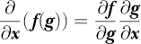
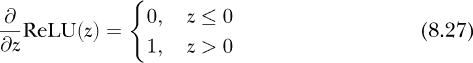

## 第八章：矩阵微积分**


第七章向我们介绍了微分学。在本章中，我们将讨论*矩阵微积分*，它将微分扩展到涉及向量和矩阵的函数。

深度学习广泛使用向量和矩阵，因此开发一种表示涉及这些对象的导数的符号和方法是有意义的。这就是矩阵微积分所提供的东西。在第七章的结尾，我们引入了梯度来表示标量函数关于向量的导数——这是一个接受向量参数并返回标量的函数，*f*(***x***)。

我们将从矩阵微积分导数及其定义的表格开始。接下来，我们将研究一些涉及矩阵导数的恒等式。数学家喜欢恒等式；然而，为了保持理智，我们只考虑少数几个。在矩阵微积分中，出现了一些特殊矩阵，即雅可比矩阵和海森矩阵。在你深入学习深度学习的过程中，你会遇到这两种矩阵，因此我们将在优化的背景下讨论它们。回想一下，训练神经网络本质上是一个优化问题，因此理解这些特殊矩阵的含义以及我们如何使用它们尤其重要。我们将以一些矩阵导数的例子结束本章。

### 公式

表 8-1 总结了我们将在本章中探讨的矩阵微积分导数。这些是实践中常用的导数。

**表 8-1：** 矩阵微积分导数

|  | **标量** | **向量** | **矩阵** |
| --- | --- | --- | --- |
| **标量** | ∂*f*/∂*x* | ∂***f***/∂*x* | ∂***F***/∂*x* |
| **向量** | ∂*f*/∂***x*** | ∂*f*/∂***x*** | — |
| **矩阵** | ∂***f***/∂***X*** | — | — |

表 8-1 的列表示函数，意味着返回值。请注意，我们使用了三种版本的字母 f：普通、粗体和大写。我们使用*f*表示返回值为标量，***f***表示返回值为向量，***F***表示返回值为矩阵。表 8-1 的行表示导数是相对于哪些变量计算的。相同的符号规则适用：*x*是标量，***x***是向量，***X***是矩阵。

表 8-1 定义了六个导数，但表格中有九个单元格。虽然可以定义其余的导数，但它们并未标准化，也不常用，因此不值得覆盖它们。对我们来说，这是个好事，因为这六个已经足够挑战我们的数学大脑了。

表 8-1 中的第一个导数，即左上角的那个，是第七章中的标准导数，表示关于标量的标量函数的导数。（参阅第七章了解所有关于标准微分的内容。）

我们将在下面的章节中介绍其余五个导数。我们将以标量导数的形式定义每一个。我们将首先展示定义，然后解释符号的含义。定义将帮助你在脑海中建立起对导数的模型。我猜测在本节结束时，你将能够预见到这些定义。

然而，在我们开始之前，有一个问题需要讨论。矩阵微积分的符号较为复杂，而且在符号的使用上没有统一的标准。我们以前已经看到过，表示微分的方法有很多种。对于矩阵微积分，有两种方法——*分子布局*和*分母布局*。不同学科似乎偏好其中一种，尽管例外几乎成了常态，符号混合也很常见。就深度学习而言，我个人的一些非正式观察显示，*分子布局*稍微更为流行，所以我们在这里将采用这种布局。只是要注意，市面上有两种符号体系，其中一种通常是另一种的转置。

#### 由标量参数定义的向量函数

接受标量参数的向量函数是我们的第一个导数；参见 表 8-1，第一行第二列。我们将这样的函数写作 ***f***(*x*)，以表示标量参数 *x* 和向量输出 ***f***。像 ***f*** 这样的函数接受标量并将其映射到多维向量：

***f*** : ℝ → ℝ^(*m*)

在这里，*m* 是输出向量中元素的数量。像 ***f*** 这样的函数被称为具有标量参数的*向量值函数*。

三维空间中的参数曲线是此类函数的一个优秀例子。这些函数通常写作


其中 , , 和  是 x、y 和 z 方向上的单位向量。

图 8-1 显示了一个三维参数曲线的图像，


在这里，随着 *t* 的变化，三个轴的值也会变化，从而描绘出螺旋曲线。每个 *t* 值指定三维空间中的一个点。


*图 8-1：三维参数曲线*

在矩阵微积分符号中，我们不会像在 方程 8.1 中那样写 ***f***。相反，我们将 ***f*** 写作函数的列向量，


一般来说，


对于具有 *n* 个元素的 ***f***。

***f***(*x*) 的导数被称为*切向量*。导数是什么样的？由于 ***f*** 是一个向量，我们可能期望 ***f*** 的导数是代表每个元素的函数的导数，事实也的确如此：


让我们看一个简单的例子。首先，我们将定义 ***f***(*x*)，然后是导数：


在这里，∂***f***/∂*x* 的每个元素是 ***f*** 中相应函数的导数。

#### 通过向量参数的标量函数

在第七章中，我们学到了一个接受向量输入但返回标量的函数是标量场：

*f* : ℝ^(*m*) → ℝ

我们还学到了该函数的导数是梯度。在矩阵微积分符号中，我们写作 ∂*f*/∂***x***，表示 *f*(***x***)。


其中 ***x*** = [*x*[0] *x*[1] ... *x*[*m*–1]]^⊤ 是一个变量向量，*f* 是这些变量的函数。

请注意，由于我们决定使用分子布局方法，∂*f*/∂***x*** 被写作一个 *行* 向量。因此，为了符合我们的符号记法，我们必须写作


将行向量转化为列向量，以与梯度匹配。记住，▽是梯度的符号；我们在第七章中看到过梯度的例子。

#### 通过向量的向量函数

如果通过标量对向量值函数求导得到列向量，而通过向量对标量函数求导得到行向量，那么通过向量对向量值函数求导是否得到矩阵？答案是肯定的。在这种情况下，我们考虑的是 ∂***f***/∂***x***，这是一个接受向量输入并返回向量的函数。

分子布局约定给了我们 ***f***(*x*) 导数的列向量，这意味着我们需要为 ***f*** 中的每个函数准备一行。类似地，*f*(***x***) 的导数生成了一个行向量。因此，合并这两者就得到了 ***f***(***x***) 的导数：


这是对于一个函数 ***f*** 的情况，返回一个 *n* 元素的向量并接受一个 *m* 元素的向量 ***x*** 作为其自变量：

*f* : ℝ^(*m*) → ℝ^(*n*)

***f*** 的每一行都是一个 ***x*** 的标量函数，例如，*f*0。因此，我们可以将方程 8.2 写作


这给我们提供了一个矩阵，作为每个标量函数在 ***f*** 中梯度的集合。我们将在本章稍后讨论这个矩阵。

#### 通过标量的矩阵函数

如果 ***f***(*x*) 是一个接受标量参数但返回向量的函数，那么我们可以正确地假设 ***F***(*x*) 可以看作是一个接受标量参数并返回矩阵的函数：

***F*** : ℝ → ℝ^(*n*×*m*)

例如，假设 ***F*** 是一个 *n* × *m* 的标量函数矩阵：


对于自变量 *x* 的导数，计算过程很简单：


正如我们上面所看到的，通过标量对向量值函数求导，得到的是切向量。类比地，通过标量对矩阵值函数求导，得到的是 *切向矩阵*。

#### 通过矩阵的标量函数

现在让我们考虑 *f*(***X***)，一个接受矩阵并返回标量的函数：

*f* : ℝ^(*n*×*m*) → ℝ

我们可以认为*F*关于矩阵***X***的导数本身就是一个矩阵，这样的理解是正确的。然而，为了符合我们的分子排列惯例，结果矩阵并不是像***X***那样排列，而是像***X***^⊤，即***X***的转置。

为什么使用***X***的转置而不是***X***本身？为了回答这个问题，我们需要回顾一下我们如何定义∂*f*/∂***x***。即使***x***是列向量，根据标准惯例，我们表示导数是一个*行*向量。我们使用了***x***^⊤作为排列方式。因此，为了保持一致性，我们需要将∂*f*/∂***X***按照***X***的转置排列，并将***X***的列转化为导数中的行。结果，我们得到了以下定义。


这是一个*m* × *n*的输出矩阵，针对*m* × *n*的输入矩阵***X***。

方程式 8.4 定义了*梯度矩阵*，对于矩阵，它起着类似于梯度▽*f*(**x**)的作用。方程式 8.4 还完整地列出了我们的矩阵微积分导数。接下来，我们将考虑一些矩阵导数恒等式。

### 等式

矩阵微积分涉及标量、向量、矩阵及其函数，这些函数自身返回标量、向量或矩阵，意味着存在许多恒等式和关系。然而，在这里，我们将集中于展示矩阵微积分与第七章的微分微积分之间关系的基本恒等式。

以下每个子节展示了与所指示的特定类型的导数相关的恒等式。这些恒等式涵盖了基本关系，并在适用时涉及链式法则。在所有情况下，结果都遵循我们在本章中使用的分子排列方案。

#### 标量函数与向量

我们从与标量函数和向量输入相关的恒等式开始。如果没有特别说明，*f*和*g*是关于向量***x***的函数，并返回一个标量。一个不依赖于***x***的常量向量表示为***a***，而*a*表示一个标量常数。

基本规则是直观的：


以及


这些表明，乘以标量常数的运算与在第七章中的表现一致，偏导数的线性性质也同样如此。

乘积法则也像我们预期的那样有效：


在这里稍作停顿，提醒自己上面方程的输入和输出。我们知道，标量函数关于向量变量的导数在我们的符号中是一个行向量。因此，方程式 8.5 返回的是一个行向量乘以一个标量——导数的每个元素都乘以*a*。

由于微分是一个线性算子，它对加法分配，因此方程式 8.6 会产生两个项，每个项都是由各自的导数生成的行向量。

对于 方程 8.7，乘积法则，结果再次包含两个项。在每种情况下，导数返回一个行向量，该向量乘以一个标量函数值，可能是 *f*(***x***) 或 *g*(***x***)。因此，方程 8.7 的输出也是一个行向量。

标量对向量的链式法则变为


*f*(*g*) 返回一个标量并接受一个标量参数，而 *g*(***x***) 返回一个标量并接受一个向量参数。最终结果是一个行向量。让我们通过一个完整的例子来演示。

我们有一个向量，***x*** = [*x*[0], *x*[1], *x*[2]]^⊤；该向量的一个分量形式的函数，*g*(***x***) = *x*[0] + *x*[1]*x*[2]；以及 *g* 的一个函数，*f*(*g*) = *g*²。根据 方程 8.8，*f* 对 ***x*** 的导数是


为了检查我们的结果，我们可以从 *g*(***x***) = *x*[0] + *x*[1]*x*[2] 和 *f*(*g*) = *g*² 开始，通过代入直接求出 *f*(***x***)。这样做得出的结果是


从中我们得到


这与我们使用链式法则得到的结果相匹配。当然，在这个简单的例子中，先进行代入再求导更容易，但我们一样证明了我们的结论。

然而，我们还没有完全解决标量对向量的恒等式。点积操作接受两个向量并产生一个标量，因此它适配我们正在处理的函数形式，尽管点积的参数是向量。

例如，考虑这个结果：


这里，我们有 ***x*** 和一个与 ***x*** 无关的向量 ***a*** 之间的点积的导数。

我们可以扩展 方程 8.9，将 ***x*** 替换为向量值函数 ***f(x***):


这个结果的形式是什么？假设 *f* 接受一个 *m* 元素的输入并返回一个 *n* 元素的向量输出。同样，假设 ***a*** 是一个 *n* 元素的向量。从 方程 8.2，我们知道导数 ∂***f***/∂***x*** 是一个 *n* × *m* 矩阵。因此，最终结果是一个 (1 × *n*) × (*n* × *m*) → 1 × *m* 的行向量。很好！我们知道，当使用分子布局约定时，标量函数对向量的导数应该是一个行向量。

最后，两个向量值函数 ***f*** 和 ***g*** 的点积的导数是


如果 方程 8.10 是一个行向量，那么像它这样的两个项的和也是一个行向量。

#### 标量乘以向量的函数

向量对标量的微分，表 8-1，第一行，第二列，在机器学习中较少见，因此我们只会检查一些恒等式。首先是常数乘法：


请注意，我们可以通过左乘矩阵，因为导数是一个列向量。

求和规则仍然适用，


就像链式法则一样，


方程 8.12 是正确的，因为标量对向量的导数是一个列向量，而向量对向量的导数是一个矩阵。因此，将右侧的矩阵与列向量相乘会返回一个列向量，正如预期的那样。

另有两个涉及标量的点积导数是值得了解的。第一个与方程 8.11 相似，但有两个标量值函数：


第二次导数涉及*f*(***g***)和***g***(*x*)关于*x*的合成：


这是一个行向量和列向量的点积。

#### 向量函数与向量的关系

向量值函数与向量参数的导数在物理学和工程学中很常见。在机器学习中，它们通常出现在反向传播中，例如，在损失函数的导数中。让我们从一些简单的恒等式开始：


和


其中结果是两个矩阵的和。

接下来是链式法则，它的作用与上述标量对向量和向量对标量的导数相同：



结果是两个矩阵的乘积。

#### 一个标量函数与矩阵的关系

对于返回标量的矩阵函数***X***，我们有求和规则的常规形式：


结果是两个矩阵的和。回想一下，如果***X***是一个*n* × *m*的矩阵，那么分子布局符号中的导数是一个*m* × *n*的矩阵。

乘积法则也按预期工作：


然而，链式法则有所不同。它依赖于*f(g*)，一个接受标量输入的标量函数，以及*g*(***X***)，一个接受矩阵输入的标量函数。在这个限制下，链式法则的形式看起来很熟悉：


让我们来看一下方程 8.13 的应用。首先，我们需要***X***，一个 2 × 2 的矩阵：


接下来，我们需要和*g*(***X***) = *x*[0]*x*[3] + *x*[1]*x*[2]。注意，虽然*g*(***X***)接受矩阵输入，但结果是一个标量，由矩阵的值计算得出。

为了应用链式法则，我们需要两个导数，


我们再次使用分子布局来表示结果。

为了找到整体结果，我们计算


为了验证，我们将这些函数结合起来写成一个单一的函数，，并使用标准的链式法则对结果矩阵中的每个元素进行求导。这会给我们


与之前的结果相匹配。

我们已经有了定义和恒等式。让我们重新审视一下带有向量参数的向量值函数的导数，因为得到的矩阵是特殊的。我们将在深度学习中频繁遇到它。

### 雅可比矩阵与赫西矩阵

方程 8.2 定义了带有向量参数***x***的向量值函数***f***的导数：


这个导数被称为*雅可比矩阵*，***J***，或简称*雅可比*，你会在深度学习文献中时常遇到它，特别是在讨论梯度下降和其他用于训练模型的优化算法时。雅可比矩阵有时会带有下标，表示它是相对于某个变量的；例如，***J******[x]*** 表示相对于***x***。当上下文清晰时，我们通常会省略下标。

在本节中，我们将讨论雅可比矩阵及其含义。然后我们将介绍另一个矩阵——*赫西矩阵*（或简称*赫西*），它基于雅可比矩阵，并学习如何在优化问题中使用它。

本节的核心内容如下：雅可比矩阵是第一导数的概括，赫西矩阵是第二导数的概括。

#### 关于雅可比矩阵

我们之前看到，我们可以将方程 8.14 看作是转置梯度向量的堆叠（方程 8.3）：


将雅可比矩阵看作是梯度堆叠，给了我们一些线索，帮助理解它的意义。回想一下，标量场的梯度，一个接受向量参数并返回标量的函数，指向函数最大变化的方向。类似地，雅可比矩阵为我们提供了有关向量值函数在某一点***x******[p]***附近行为的信息。雅可比矩阵对于向量值函数和向量的关系，就像梯度对于标量值函数和向量的关系；它告诉我们函数如何随着***x******[p]***位置的小变化而变化。

一种理解雅可比矩阵的方法是将其视为我们在第七章中遇到的更具体情况的概括。表 8-2 展示了函数与其导数所度量的关系。

**表 8-2：** 雅可比矩阵、梯度和斜率之间的关系

| **函数** | **导数** |
| --- | --- |
| ***f***(***x***) | ∂***f***/∂***x***, 雅可比矩阵 |
| *f*(***x***) | ∂*f*/∂***x***，梯度向量 |
| *f*(*x*) | *df*/*dx*，斜率 |

雅可比矩阵是三者中最一般的。如果我们将函数限制为标量，则雅可比矩阵变为梯度向量（分子形式的行向量）。如果我们将函数和参数都限制为标量，梯度则变为斜率。从某种意义上说，它们都表示相同的东西：函数在空间中某一点周围如何变化。

雅可比矩阵有许多用途。这里我将展示两个例子。第一个来自微分方程系统。第二个使用牛顿法来寻找向量值函数的根。当我们讨论反向传播时，还会再次看到雅可比矩阵，因为反向传播需要计算相对于向量的向量值函数的导数。

##### 自治微分方程

*微分方程*将导数和函数值结合在一个方程中。微分方程在物理学和工程学中随处可见。我们的例子来自*自治系统*的理论，它是微分方程的一种形式，其中独立变量不出现在方程的右侧。例如，如果系统由函数的值和关于时间 *t* 的一阶导数组成，则系统的方程中没有显式的 *t*。

前面的段落只是背景介绍；你不需要记住它。处理自治微分方程系统最终会导致雅可比矩阵，这就是我们的目标。我们可以将系统看作一个向量值函数，我们将使用雅可比矩阵来描述该系统的临界点（即导数为零的点）。我们在第七章中处理了函数的临界点。

例如，让我们探讨以下方程组：


这个系统包括两个函数，*x*(*t*) 和 *y*(*t*)，它们是耦合的，即 *x*(*t*) 的变化率依赖于 *x* 和 *y* 的值，反之亦然。

我们将系统视为一个单一的向量值函数：


在这里，我们将 *x* 替换为 *x*[0]，将 *y* 替换为 *x*[1]。

***f***表示的系统在***f*** = **0**的地方具有临界点，其中**0**是 2 × 1 维的零向量。临界点是


其中将每个点代入***f***后得到零向量。暂时假设我们已经得到了临界点，现在我们想要描述它们。

为了描述一个临界点，我们需要***f***生成的雅可比矩阵：


由于雅可比矩阵描述了函数在某一点附近的行为，因此我们可以用它来描述临界点。在第七章中，我们使用导数来判断一个点是函数的最小值还是最大值。对于雅可比矩阵，我们通过使用***J***的特征值来以类似的方式讨论临界点的类型和稳定性。

首先，让我们在每个临界点处求雅可比矩阵：


我们可以使用 NumPy 来获得雅可比矩阵的特征值：

```py
>>> import numpy as np

>>> np.linalg.eig([[4,0],[0,2]])[0]

array([4., 2.])

>>> np.linalg.eig([[2,0],[1,-2]])[0]

array([-2., 2.])

>>> np.linalg.eig([[0,-4],[2,-4]])[0]

array([-2.+2.j, -2.-2.j])
```

我们在第六章中遇到了`np.linalg.eig`。特征值是`eig`返回的第一个值，因此函数调用中有`[0]`的下标。

对于一组自治微分方程的临界点，特征值表明了点的类型和稳定性。如果两个特征值是实数并且符号相同，那么临界点是一个节点。如果特征值小于零，那么节点是稳定的；否则，它是不稳定的。你可以将稳定节点看作是一个坑；如果你接近它，你会掉进去。一个不稳定的节点像一座山；如果你从顶部偏离临界点，你会掉下来。第一个临界点***c***[0]的特征值为正实数，因此它代表一个不稳定的节点。

如果雅可比矩阵的特征值是实数但符号相反，那么临界点就是鞍点。我们在第七章中讨论了鞍点。鞍点最终是不稳定的，但在二维空间中，有一个方向你可以“掉进”鞍点，另一个方向则可以“从”鞍点“掉出来”。一些研究者认为，在训练深度神经网络时，找到的大多数最小值实际上是损失函数的鞍点。我们看到临界点***c***[1]是一个鞍点，因为特征值是实数且符号相反。

最后，***c***[2]的特征值是复数。复特征值表示一个螺旋（也叫焦点）。如果复特征值的实部小于零，那么螺旋是稳定的；否则，它是不稳定的。由于特征值是彼此的复共轭，实部的符号必须相同；不能有一个是正的，而另一个是负的。对于***c***[2]，实部是负的，因此***c***[2]表示一个稳定的螺旋。

##### 牛顿法

我通过公理性的方法给出了方程 8.15 的临界点。系统足够简单，我们可以通过代数方法求解临界点，但通常情况下情况并非如此。一个经典的求解函数根的方法（即函数值为零的点）被称为*牛顿法*。这是一种使用一阶导数和初始猜测值来逼近根的迭代方法。我们先看一下它在一维空间中的应用，然后再扩展到二维空间。我们将看到，进入二维或更高维空间时，需要使用雅可比矩阵。

让我们用牛顿法来求解 2 的平方根。为此，我们需要一个方程，使得。稍加思考，我们得到了一个方程：*f*(*x*) = 2 − *x*²。显然，当。

牛顿法在一维中的控制方程是


其中 *x*[0] 是对解的某个初始猜测值。

我们将*x*[0]代入方程 8.18 右侧来求得*x*[1]。然后我们重复使用*x*[1]代入右侧来得到*x*[2]，以此类推，直到我们看到*x[n]*的变化非常小。此时，如果我们的初始猜测合理，我们就得到了我们想要的值。牛顿法收敛很快，所以对于典型的例子，我们只需要几次迭代。当然，我们手头有强大的计算机，所以我们会使用它们，而不是手工计算。我们需要的 Python 代码在清单 8-1 中。

```py
import numpy as np

def f(x):

    return 2.0 - x*x

def d(x):

    return -2.0*x

x = 1.0

for i in range(5):

    x = x - f(x)/d(x)

    print("%2d: %0.16f" % (i+1,x))

print("NumPy says sqrt(2) = %0.16f for a deviation of %0.16f" %

     (np.sqrt(2), np.abs(np.sqrt(2)-x)))
```

*清单 8-1：通过牛顿法求解*  *的值*

清单 8-1 定义了两个函数。第一个，`f(x)`，返回给定`x`的函数值。第二个，`d(x)`，返回`x`处的导数。如果*f*(*x*) = 2 − *x*²，则*f*′(*x*) = −2*x*。

我们的初始猜测是 *x* = 1.0。我们对方程 8.18 进行五次迭代，每次打印当前的平方根 2 的估计值。最后，我们使用 NumPy 计算*真实*值，并查看我们与真实值的偏差。

运行清单 8-1 产生了

```py
 1: 1.5000000000000000

 2: 1.4166666666666667

 3: 1.4142156862745099

 4: 1.4142135623746899

 5: 1.4142135623730951

NumPy says sqrt(2) = 1.4142135623730951 for a

deviation of 0.0000000000000000
```

结果令人印象深刻；我们仅用五次迭代就得到了 ，精确到 16 位小数。

为了将牛顿法扩展到向量值函数的向量问题（如方程 8.15），我们用雅可比矩阵的逆替代了导数的倒数。为什么是逆矩阵？回想一下，对于一个对角矩阵，逆矩阵是对角元素的倒数。如果我们将标量导数视为一个 1 × 1 矩阵，那么倒数和逆矩阵是相同的。方程 8.18 已经使用了雅可比矩阵的逆，尽管它是一个 1 × 1 矩阵的逆。因此，我们将进行迭代


对于合适的初始值，***x***[0]，以及在*x[n]*处计算的雅可比矩阵的逆。让我们使用牛顿法来找到方程 8.15 的临界点。

在我们编写 Python 代码之前，我们需要方程 8.17 中的雅可比矩阵的逆。一个 2 × 2 矩阵的逆，


是


假设行列式不为零。***A***的行列式是*ad* − *bc*。因此，方程 8.17 的逆矩阵是


现在我们可以编写代码了。结果见清单 8-2。

```py
   import numpy as np

   def f(x):

       x0,x1 = x[0,0],x[1,0]

       return np.array([[4*x0-2*x0*x1],[2*x1+x0*x1-2*x1**2]])

   def JI(x):

       x0,x1 = x[0,0],x[1,0]

       d = (4-2*x1)*(2-x0-4*x1)+2*x0*x1

       return (1/d)*np.array([[2-x0-4*x1,2*x0],[-x1,4-2*x0]])

   x0 = float(input("x0: "))

   x1 = float(input("x1: "))

❶ x = np.array([[x0],[x1]])

   N = 20

   for i in range(N):

    ❷ x = x - JI(x) @ f(x)

       if (i > (N-10)):

           print("%4d: (%0.8f, %0.8f)" % (i, x[0,0],x[1,0]))
```

*清单 8-2：二维牛顿法*

清单 8-2 是对 1D 情况的清单 8-1 的回显。我们有`f(x)`来计算给定输入向量的函数值，`JI(x)`来提供在***x***处的雅可比矩阵的逆。注意，`f(x)`返回一个列向量，`JI(x)`返回一个 2 × 2 矩阵。

代码首先要求用户输入初始猜测值，`x0`和`x1`。这些值会形成初始向量`x`。注意，我们显式地将`x`形成列向量 ❶。

接下来是方程 8.19 的实现 ❷。逆雅可比矩阵是一个 2 × 2 的矩阵，我们将其与函数值（一个 2 × 1 的列向量）相乘，使用 NumPy 的矩阵乘法运算符 `@`。结果是一个 2 × 1 的列向量，从当前的 `x` 值（也是一个 2 × 1 的列向量）中减去。如果循环在 10 次迭代内完成，当前值会在控制台打印出来。

清单 8-2 是否有效？让我们运行它，看看是否能找到初始猜测，从而找到每个关键点（方程 8.16）。对于初始猜测 ，我们得到

```py
11: (0.00004807, -1.07511237)

12: (0.00001107, -0.61452262)

13: (0.00000188, -0.27403667)

14: (0.00000019, -0.07568702)

15: (0.00000001, -0.00755378)

16: (0.00000000, -0.00008442)

17: (0.00000000, -0.00000001)

18: (0.00000000, -0.00000000)

19: (0.00000000, -0.00000000)
```

这是方程 8.15 的第一个关键点。为了找到剩余的两个关键点，我们需要小心选择初始猜测。一些猜测会爆炸，而许多猜测会导致返回零向量。然而，通过一些试错法，我们得到了


这表明牛顿法可以找到方程 8.15 的关键点。

我们从一个微分方程系统开始，并将其解释为一个向量值函数。然后我们使用雅可比矩阵来表征该系统的关键点。接下来，我们第二次使用雅可比矩阵通过牛顿法定位系统的关键点。我们之所以能够这样做，是因为雅可比矩阵是梯度对向量值函数的推广，而梯度本身是标量函数一阶导数的推广。如上所述，当我们讨论反向传播时，还会看到雅可比矩阵，第十章中会详细介绍。

#### 关于 Hessian

如果雅可比矩阵类似于单变量函数的第一导数，那么*Hessian 矩阵*就像第二导数。在这种情况下，我们限制在标量场上，即对于向量输入返回标量值的函数。让我们从定义开始，然后从那里出发。对于函数 *f*(***x***)，Hessian 定义为


其中 ***x*** = [*x*[0] *x*[1] . . . *x*[*n*–1]]^⊤。

查看方程 8.20 告诉我们 Hessian 是一个方阵。此外，它是对称矩阵，意味着 ***H*** = ***H***^⊤。

Hessian 是标量场梯度的雅可比矩阵：

***H**[f]* = ***J***(▽*f*)

让我们用一个例子来看这个。考虑这个函数：


如果我们直接使用方程 8.20 中对 Hessian 的定义，我们可以看到，因为 ∂*f*/∂*x*[0] = 4*x*[0] + *x*[2]。类似的计算给出了其余的 Hessian 矩阵：


在这种情况下，Hessian 是常数，而不是 *x* 的函数，因为 *f*(***x***) 中变量的最高次幂是 2。

使用列向量定义的 *f*(***x***) 的梯度是


梯度的雅可比矩阵给出了以下内容，这与我们通过直接使用公式 8.20 找到的矩阵是相同的。


##### 最小值和最大值

我们在第七章中看到，我们可以利用二阶导数来测试一个函数的临界点是最小值（*f*′′ > 0）还是最大值（*f*′′ < 0）。我们将在下一节看到如何在优化问题中使用临界点。现在，让我们通过考虑海森矩阵的特征值来使用海森矩阵找到临界点。我们将继续使用上面的例子。海森矩阵是 3 × 3 矩阵，意味着它有三个（或更少）特征值。为了节省时间，我们将使用 NumPy 来告诉我们它们是什么：

```py
>>> np.linalg.eig([[4,0,1],[0,-2,3],[1,3,0]])[0]

array([ 4.34211128, 1.86236874, -4.20448002])
```

三个特征值中有两个是正的，一个是负的。如果三个特征值都是正的，那么临界点将是最小值。同样，如果三个特征值都是负的，临界点将是最大值。请注意，最小值/最大值的标签与符号相反，就像单变量的情况一样。然而，如果至少有一个特征值是正的，另一个是负的（正如我们例子中的情况），那么临界点就是鞍点。

自然地，我们会问，**向量值函数** ***f***（***x***）的海森矩阵是否存在。毕竟，我们可以计算这样的函数的雅可比矩阵；我们之前也这样做了，来展示海森矩阵是梯度的雅可比矩阵。

可以将海森矩阵扩展到向量值函数。然而，结果不再是一个矩阵，而是一个三阶张量。为了证明这一点，考虑向量值函数的定义：


我们可以把一个向量值函数（一个向量场）看作是一个由向量的标量函数组成的向量。我们可以计算***f***中每个*m*个函数的海森矩阵，得到一个矩阵向量，


但一个矩阵向量是一个三维对象。想象一下 RGB 图像：一个由三个二维图像组成的三维数组，分别表示红色、绿色和蓝色通道。因此，虽然可以定义和计算，但向量值函数的海森矩阵超出了我们当前的讨论范围。

##### 优化

在深度学习中，你最常见到海森矩阵是与优化相关的。训练神经网络从大体上来说就是一个优化问题——目标是找到能够最小化损失函数的权重和偏置。

在第七章中，我们看到梯度提供了如何朝着最小值移动的信息。优化算法，如梯度下降法，第十一章的主题，利用梯度作为指导。因为梯度是损失函数的一阶导数，所以完全基于梯度的算法被称为*一阶优化方法*。

Hessian 矩阵提供了比梯度更丰富的信息。作为二阶导数，Hessian 包含了关于损失函数梯度变化的信息，也就是其曲率。这里的物理类比可能有帮助。一个粒子在一维空间中的运动可以通过时间的某个函数 *x*(*t*) 来描述。其一阶导数，速度，是 *dx*/*dt* = *v*(*t*)。速度告诉我们位置随时间变化的快慢。然而，速度可能随时间变化，因此其导数 *dv*/*dt* = *a*(*t*) 就是加速度。如果速度是位置的一阶导数，那么加速度就是二阶导数，*d*²*x*/*dt*² = *a*(*t*)。类似地，损失函数的二阶导数，即 Hessian，提供了梯度变化的信息。使用 Hessian 或其近似值的优化算法被称为*二阶优化方法*。

让我们从一个一维的例子开始。我们有一个函数 *f*(*x*)，并且当前在某个 *x*[0] 处。我们希望从这个位置移动到一个新的位置 *x*[1]，接近 *f*(*x*) 的最小值。一个一阶算法会使用梯度（这里是导数）作为指导，因为我们知道，沿着导数的反方向移动会使函数值变小。因此，对于某个步长，记作 η（希腊字母 eta），我们可以写成

*x*[1] = *x*[0] − η *f*′(*x*[0])

这将把我们从 *x*[0] 移动到 *x*[1]，假设最小值存在的话，*x*[1] 会更接近 *f*(*x*) 的最小值。

上面的方程是有意义的，那么为什么还要考虑二阶方法呢？二阶方法的作用是在我们从 *f*(*x*) 移动到 *f*(*x*) 时起作用。现在我们有了梯度，而不仅仅是导数，并且 *f*(***x***) 在某个点附近的形态可能会更加复杂。梯度下降的通用形式是

***x***[1] = ***x***[0] − η▽*f*(***x***[0])

但是，Hessian 矩阵中的信息是有帮助的。为了了解其作用，我们首先需要引入*泰勒级数展开*的概念，这是一种将任意函数近似为一系列项之和的方法。在物理学和工程学中，我们经常使用泰勒级数来简化某个特定点附近的复杂函数。我们也经常用它们来计算*超越函数*的值（无法通过有限的基本代数运算来表示的函数）。例如，当你在编程语言中使用`cos(x)`时，结果可能是通过泰勒级数展开生成的，所用的项数足以让余弦函数达到 32 位或 64 位浮点精度：


一般来说，为了在某个点 *x* = *a* 附近近似函数 *f*(*x*)，泰勒级数展开是


其中 *f*^((*k*))(*a*) 是 *f*(*x*) 在点 *a* 处的 *k* 阶导数。

在 *x* = *a* 附近，*f*(*x*) 的线性近似是

*f*(*x*) ≈ *f*(*a*) + *f*′(*a*)(*x* - *a*)

而*f*(*x*)的二次近似变为


在这里，我们看到使用一阶导数的线性近似和使用*f*(*x*)的一阶和二阶导数的二次近似。一阶优化算法使用线性近似，而二阶优化算法使用二次近似。

从标量函数*f*(*x*)到向量的标量函数*f*(***x***)的转换，将一阶导数变为梯度，二阶导数变为赫塞矩阵，


其中***H****f*是*f*(***x***)在点***a***处求值的赫塞矩阵。为了使维度匹配，乘积的顺序发生了变化，因为我们现在需要处理向量和矩阵。

例如，如果***x***有*n*个元素，则*f*(***a***)是一个标量；在***a***处的梯度是一个*n*维的列向量乘以(***x*** − ***a***)^⊤，一个*n*维的行向量，产生一个标量；最后一项是 1 × *n*乘以*n* × *n*乘以*n* × 1，结果是 1 × *n*乘以*n* × 1，这也是一个标量。

为了使用泰勒级数展开进行优化，找到*f*的最小值，我们可以像在方程式 8.18 中一样使用牛顿法。首先，我们将方程式 8.21 重新写为从当前位置(*x*)的位移(Δ*x*)的角度来看。然后，方程式 8.21 变为


方程式 8.22 是Δ*x*的抛物线，我们将其作为*f*在*x* + Δ*x*区域内更复杂形状的替代。为了找到方程式 8.22 的最小值，我们对其求导并令其为零，然后解出Δ*x*。导数给出了


如果设为零，则得到


方程式 8.23 告诉我们当前坐标*x*到达*f*(*x*)最小值的偏移量，假设*f*(*x*)是一个抛物线。实际上，*f*(*x*)并不是抛物线，所以方程式 8.23 中的Δ*x*并不是*f*(*x*)最小值的实际偏移量。然而，由于泰勒级数展开使用了*f*(*x*)在*x*处的实际斜率*f*′(*x*)和曲率*f*′′(*x*)，因此方程式 8.23 的偏移量比线性近似更接近*f*(*x*)的实际最小值，假设存在最小值。

如果我们从*x*移动到*x* + Δ*x*，那就没有理由不能再次使用方程式 8.23，将新位置称为*x*。这样思考会导致一个可以迭代的方程：


对于*x*[0]，某个初始起点。

我们可以针对带有向量参数的标量函数 *f*(***x***) 计算上面的内容，这类函数是我们在深度学习中通过损失函数最常遇到的类型。公式 8.24 变为：


其中，二阶导数的倒数变成了在 ***x**[n]* 处求得的 Hessian 矩阵的逆。

很棒！我们有一个可以快速找到类似 *f*(***x***) 函数最小值的算法。我们在上面看到，牛顿法收敛速度很快，因此用它来最小化损失函数也应该会迅速收敛，比只考虑一阶导数的梯度下降法要快。

如果是这样，为什么我们不使用牛顿法来训练神经网络，而选择梯度下降法呢？

有几个原因。首先，我们没有讨论 Hessian 适用性带来的问题，尤其是 Hessian 作为正定矩阵的问题。一个对称矩阵是正定的，若它的所有特征值都为正。在鞍点附近，Hessian 可能不是正定的，这会导致更新规则偏离最小值。正如你可能会预料的那样，像牛顿法这样的简单算法中，一些变体尝试解决这类问题，但即便解决了 Hessian 特征值的问题，使用 Hessian 更新网络参数的计算负担也正是牛顿法无法继续进行的原因。

每次网络的权重和偏置被更新时，Hessian 矩阵都会发生变化，需要重新计算它及其逆矩阵。考虑到网络训练过程中使用的小批量数据量，即使是一个小批量，网络中也有 *k* 个参数，其中 *k* 很容易达到百万甚至数十亿级别。Hessian 是一个 *k* × *k* 的对称正定矩阵。求逆 Hessian 通常使用 Cholesky 分解，这比其他方法更高效，但仍然是一个 𝒪(*k*³) 的算法。*大-O* 符号表示算法的资源消耗随着矩阵大小的立方（时间、内存或两者）而增长。这意味着如果网络中的参数数量翻倍，求逆 Hessian 的计算时间将增加 2³ = 8 倍，而三倍数量的参数需要约 3³ = 27 倍的计算工作量，四倍则需要大约 4³ = 64 倍。而且这还没有提到存储 Hessian 矩阵中的 *k*² 个元素，所有这些都是浮动的数值。

即使对于中等规模的深度网络，使用牛顿法的计算量也是惊人的。基于梯度的一阶优化方法几乎是我们训练神经网络时唯一可以使用的。

**注意**

*这个说法可能有些过早。最近在* 神经进化 *领域的研究表明，进化算法可以成功地训练深度模型。我自己在群体优化技术和神经网络方面的实验也为这种方法提供了证据。*

第一阶方法如此有效，似乎目前为止是一个非常幸运的偶然。

### 矩阵微积分导数的一些例子

我们以一些类似于深度学习中常见导数的例子结束本章。

#### 元素级操作的导数

我们从元素级操作的导数开始，包括像将两个向量相加这样的操作。考虑


这实际上是将两个向量按元素相加。那么，∂***f***/∂***a***，即 ***f*** 的雅可比矩阵，是什么样子的呢？根据定义，我们有


但是 *f*[0] 只依赖于 *a*[0]，而 *f*[1] 依赖于 *a*[1]，以此类推。因此，所有 ∂*f[i]*/∂*a[j]*，对于 *i* ≠ *j* 都是零。这就去除了矩阵的所有非对角元素，剩下的是


因为 ∂*f*[*i*]/∂*a*[*i*] = 1 对所有 *i* 都成立。类似地，∂***f***/∂***b*** = ***I***。此外，如果我们将加法改为减法，∂***f***/∂***a*** = ***I***，但 ∂***f***/∂***b*** = −***I***。

如果操作是 ***a*** 和 ***b*** 的元素级乘法，***f*** = ***a*** ⊗ ***b***，那么我们得到如下结果，其中 diag(***x***) 表示向量 ***x*** 的 *n* 个元素沿对角线排列在一个 *n* × *n* 的矩阵中，其他位置为零。


#### 激活函数的导数

让我们找出前馈网络中隐藏层单个节点的权重和偏置的导数。回顾一下，节点的输入是前一层的输出 ***x***，与权重 ***w*** 按项相乘并加上偏置值 *b*（一个标量）。结果是一个标量，传递给激活函数以产生节点的输出值。在这里，我们使用的是 *修正线性单元（ReLU）*，如果输入为正，则返回该输入值；如果输入为负，则返回零。我们可以将这个过程写成


为了实现反向传播，我们需要方程 8.25 对***w***和 *b* 的导数。让我们看看如何找到它们。

我们首先考虑方程 8.25 的各个部分。例如，从方程 8.9 中，我们知道点积对***w***的导数是


这里我们利用了点积是交换律的事实，***w*** • ***x*** = ***x*** • ***w***。另外，由于 *b* 不依赖于 ***w***，我们有


那么 ReLU 的导数是什么样子的呢？根据定义，


这意味着



因为 ∂*z*/∂*z* = 1。

为了找到方程 8.25 对***w***和 *b* 的导数，我们需要链式法则和上面的结果。我们从 ***w*** 开始。链式法则告诉我们如何


*z* = ***w*** • ***x*** + *b* 和 *y* = ReLU(*z*)。

我们知道 ∂*y*/∂*z*；它是 ReLU 的上述两种情况，方程 8.27。所以现在我们有


我们知道 ∂*z*/∂***w*** = ***x***^⊤；它是方程 8.26。因此，我们的最终结果是


我们已将 *z* 替换为 ***w*** • ***x*** + *b*。

我们采用相同的程序来找到 ∂*y*/∂*b*，如


但 ∂*y*/∂*z* 是 0 或 1，取决于 *z* 的符号。同样，∂*z*/∂*b* = 1，这导致


### 总结

在这一密集章节中，我们学习了矩阵微积分，包括处理涉及向量和矩阵的函数的导数。我们通过了定义并讨论了一些恒等式。然后，我们引入了雅可比矩阵和海森矩阵，作为一阶和二阶导数的类比，并学习了如何在优化问题中使用它们。训练深度神经网络，实质上是一个优化问题，因此雅可比矩阵和海森矩阵的潜在用途显而易见，即使后者在大型神经网络中不易使用。我们以一些深度学习中常见的导数表达式为例，结束了本章。

本书的数学部分到此为止。接下来，我们将把注意力转向利用所学内容理解深度神经网络的工作原理。我们从讨论数据如何在神经网络模型中流动开始。
