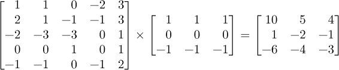
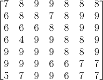

## 第九章：神经网络中的数据流**


在这一章，我将展示数据是如何在训练好的神经网络中流动的。换句话说，我们将查看如何从输入向量或张量转换到输出，以及数据在过程中所呈现的形式。如果你已经熟悉神经网络的运作原理，那就太好了；如果没有，跟随数据从一层流向另一层的过程，将帮助你建立对这些过程的理解。

首先，我们将了解如何在两种不同类型的网络中表示数据。接着，我们将通过一个传统的前馈网络来为自己打下坚实的基础。我们将看到在神经网络中进行推理时，代码是如何简洁的。最后，我们将通过引入卷积层和池化层，追踪数据在卷积神经网络中的流动。本章的目标不是展示流行工具包如何传递数据。这些工具包是高度优化的软件，其低层次的知识在此阶段对我们帮助不大。相反，目标是帮助你理解数据是如何从输入流向输出的。

### 数据表示

最终，深度学习的一切都与数据有关。我们使用数据来创建模型，然后用更多的数据进行测试，最终让我们能够对更多的数据进行预测。我们将从了解如何在两种类型的神经网络中表示数据开始：传统神经网络和深度卷积网络。

#### 传统神经网络

对于*传统神经网络*或其他经典机器学习模型，输入是一个数字向量，即特征向量。训练数据是一组这些特征向量，每个特征向量都带有一个关联的标签。（本章我们将限制在基本的监督学习上。）特征向量集合方便地实现为一个矩阵，每一行是一个特征向量，行数与数据集中的样本数相匹配。正如我们现在所知道的，计算机方便地使用二维数组表示矩阵。因此，在处理传统神经网络或其他经典模型（如支持向量机、随机森林等）时，我们将把数据集表示为二维数组。

例如，在第六章中我们首次接触的鸢尾花数据集，每个特征向量包含四个特征。我们将它表示为一个矩阵：

```py
>>> import numpy as np

>>> from sklearn import datasets

>>> iris = datasets.load_iris()

>>> X = iris.data[:5]

>>> X

array([[5.1, 3.5, 1.4, 0.2],

       [4.9, 3\. , 1.4, 0.2],

       [4.7, 3.2, 1.3, 0.2],

       [4.6, 3.1, 1.5, 0.2],

       [5\. , 3.6, 1.4, 0.2]])

>>> Y = iris.target[:5]
```

这里，我们展示了前五个样本，就像在第六章中做的那样。上面的样本全部属于类别 0（*I. setosa*）。为了将这些知识传递给模型，我们需要一个与之匹配的类别标签向量；`X[i]`返回样本`i`的特征向量，`Y[i]`返回类别标签。类别标签通常是一个整数，并且从零开始为数据集中每个类别编号。一些工具包更喜欢使用独热编码（one-hot encoding）的类别标签，但我们可以轻松地从更标准的整数标签中生成它们。

因此，传统的数据集在层与层之间使用矩阵来保存权重，每一层的输入和输出是一个向量。这相对直接。那么，更现代的深度网络呢？

#### 深度卷积网络

深度网络可能会使用特征向量，尤其是在模型实现一维卷积时，但更多情况下，使用深度网络的核心目的是让*卷积层*利用数据中的空间关系。通常，这意味着输入是图像，我们使用二维数组表示图像。但是，输入不一定非得是图像。模型并不关心输入代表的*是什么*；只有模型设计者知道，并根据这些知识决定架构。为了简单起见，我们假设输入是图像，因为我们已经了解计算机如何处理图像，至少从高层次来看是这样的。

黑白图像，或者带有灰度的图像，称为灰度图像，使用单个数字表示每个像素的强度。因此，灰度图像由一个矩阵组成，在计算机中表示为二维数组。然而，我们在计算机上看到的大多数图像都是彩色图像，而非灰度图像。大多数软件通过三个数字表示一个像素的颜色：红色的量、绿色的量和蓝色的量。这就是计算机上彩色图像被标记为*RGB*的原因。还有许多其他表示颜色的方法，但 RGB 是最常见的。通过这些基础色的混合，计算机能够显示数百万种颜色。如果每个像素需要三个数字，那么彩色图像就不再是一个二维数组，而是三个二维数组，每个数组代表一种颜色。

例如，在第四章中，我们从`sklearn`加载了一张彩色图像。我们再来看一遍，看看它是如何在内存中排列的：

```py
>>> from sklearn.datasets import load_sample_image

>>> china = load_sample_image('china.jpg')

>>> china.shape

(427, 640, 3)
```

图像以 NumPy 数组的形式返回。请求数组的形状会返回一个元组：(427, 640, 3)。这个数组有三个维度。第一个是图像的高度，427 个像素。第二个是图像的宽度，640 个像素。第三个是*通道*的数量，这里是三，因为它是 RGB 图像。第一个通道是每个像素的红色分量，第二个是绿色，最后一个是蓝色。如果需要的话，我们可以将每个通道当作一张灰度图像来看：

```py
>>> from PIL import Image

>>> Image.fromarray(china).show()

>>> Image.fromarray(china[:,:,0]).show()

>>> Image.fromarray(china[:,:,1]).show()

>>> Image.fromarray(china[:,:,2]).show()
```

PIL 指的是 Pillow，这是 Python 用于处理图像的库。如果你还没有安装它，运行以下命令可以为你安装：

```py
pip3 install pillow
```

每张图像看起来相似，但如果将它们并排放置，你会注意到一些差异。见图 9-1。每个通道图像的合成效果形成了显示的实际颜色。将`china[:,:,0]`替换为`china`，即可查看完整的彩色图像。


*图 9-1：红色（左）、绿色（中）、蓝色（右）*`*china*`*图像通道*

深度网络的输入通常是多维的。如果输入是彩色图像，我们需要使用一个 3D 张量来包含图像。然而，这还没有完毕。每个输入样本是一个 3D 张量，但我们通常不会一次只处理一个样本。在训练深度网络时，我们使用*小批量*，即一组样本一起处理以得到平均损失。这意味着输入张量还需要多出一个维度，用来指定我们想要的小批量中的*哪个*成员。因此，输入是一个 4D 张量：*N* × *H* × *W* × *C*，其中*N*是小批量中的样本数，*H*是每个图像的高度，*W*是每个图像的宽度，*C*是通道数。我们有时会将其写成元组形式：(*N*, *H*, *W*, *C*)。

让我们来看一下用于深度网络的一些实际数据。数据集是 CIFAR-10 数据集。这是一个广泛使用的基准数据集，可以在这里找到：*[`www.cs.toronto.edu/~kriz/cifar.html`](https://www.cs.toronto.edu/~kriz/cifar.html)*。不过，你并不需要下载原始数据集。我们已经在本书的代码中包含了 NumPy 版本。正如前面提到的，我们需要两个数组：一个用于图像，另一个用于对应的标签。你可以在*cifar10_test_images.npy*和*cifar10_test_labels.npy*文件中找到它们。让我们来看看：

```py
>>> images = np.load("cifar10_test_images.npy")

>>> labels = np.load("cifar10_test_labels.npy")

>>> images.shape

(10000, 32, 32, 3)

>>> labels.shape

(10000,)
```

注意到`images`数组具有四个维度。第一个是数组中图像的数量（*N* = 10,000）。第二个和第三个表示图像的大小为 32×32 像素。最后一个维度表示有三个通道，这意味着数据集包含的是彩色图像。需要注意的是，通常情况下，通道的数量可以指代任何按这种方式分组的数据集合——它不一定是实际的图像。`labels`向量也有 10,000 个元素。这些是类标签，共有 10 个类别，包含动物和车辆。例如，

```py
>>> labels[123]

2

>>> Image.fromarray(images[123]).show()
```

这表示图像 123 属于第 2 类（鸟类），并且标签是正确的；显示的图像应该是鸟类的图像。回想一下，在 NumPy 中，要求单个索引时会返回整个子数组，所以`images[123]`等价于`images[123,:,:,:]`。`Image`类的`fromarray`方法将 NumPy 数组转换为图像，以便`show`可以显示它。

使用小批量时，我们将整个数据集的一个子集传递给模型。如果我们的模型使用 24 个样本的小批量，那么深度网络的输入是一个（24，32，32，3）数组：24 张图像，每张图像有 32 行、32 列和 3 个通道。稍后我们会看到，通道的概念不仅仅局限于深度网络的输入，它同样适用于在各层之间传递的数据形状。

我们稍后会回到深度网络的数据。现在，让我们先转向更直接的主题：传统前馈神经网络中的数据流。

### 传统神经网络中的数据流

如上所示，在传统的神经网络中，层与层之间的权重以矩阵的形式存储。如果第*i*层有*n*个节点，第*i*−1 层有*m*个输出，那么这两层之间的权重矩阵***W[i]***就是一个*n* × *m*的矩阵。当这个矩阵与第*i*−1 层的*m* × 1 列向量相乘时，结果是一个*n* × 1 的输出，表示输入到第*i*层的*n*个节点的值。具体来说，我们计算

***a[i]*** = σ(***W[i]a[i−1]*** + ***b[i]***)

其中，***a[i]***[−1]是来自第*i*−1 层的*m* × 1 输出向量，它与***W[i]***相乘，产生一个*n* × 1 列向量。我们将第*i*层的偏置值***b[i]***加到该向量中，并对结果向量***W[i]a[i]***[−1] + ***b[i]***的每个元素应用激活函数σ，从而得到***a[i]***，即第*i*层的激活值。我们将激活值作为第*i*层的输出传递给第*i*+1 层。通过使用矩阵和向量，矩阵乘法规则自动计算所有必要的乘积，而无需在代码中显式使用循环。

让我们看一个简单神经网络的例子。我们将生成一个包含两个特征的随机数据集，然后将该数据集分成训练组和测试组。我们将使用`sklearn`在训练集上训练一个简单的前馈神经网络。该网络有一个隐藏层，包含五个节点，并使用修正线性激活函数（ReLU）。然后我们将测试训练好的网络，看看它学得如何，最重要的是，查看实际的权重矩阵和偏置向量。

为了构建数据集，我们将选择一组在二维空间中聚集但略有重叠的点。我们希望网络学习一些不完全简单的内容。以下是代码：

```py
   from sklearn.neural_network import MLPClassifier

   np.random.seed(8675309)

❶ x0 = np.random.random(50)-0.3

   y0 = np.random.random(50)+0.3

   x1 = np.random.random(50)+0.3

   y1 = np.random.random(50)-0.3

   x = np.zeros((100,2))

   x[:50,0] = x0; x[:50,1] = y0

   x[50:,0] = x1; x[50:,1] = y1

❷ y = np.array([0]*50+[1]*50)

❸ idx = np.argsort(np.random.random(100))

   x = x[idx]; y = y[idx]

   x_train = x[:75]; x_test = x[75:]

   y_train = y[:75]; y_test = y[75:]
```

我们需要从`sklearn`导入`MLPClassifier`类，因此首先加载它。然后我们定义一个二维数据集`x`，由两组各 50 个点组成。点是随机分布的（`x0`，`y0`和`x1`，`y1`），但分别集中在(0.2, 0.8)和(0.8, 0.2)位置 ❶。请注意，我们将 NumPy 的随机数种子设置为固定值，因此每次运行都会生成相同的一组数字。如有需要，可以删除这一行并尝试在不同数据集生成的情况下，网络的训练效果。

我们知道`x`中的前 50 个点来自我们所称之为类别 0，接下来的 50 个点是类别 1，因此我们定义一个标签向量`y` ❷。最后，我们随机化`x` ❸中的点的顺序，并小心地以相同的方式调整标签，然后将它们分成训练集（`x_train`）和标签（`y_train`），以及测试集（`x_test`）和标签（`y_test`）。我们保留 75%的数据用于训练，剩下的 25%用于测试。

图 9-2 显示了完整数据集的图形，其中每个特征位于一个坐标轴上。圆圈表示类 0 实例，方块表示类 1 实例。两个类别之间有明显的重叠。


*图 9-2：用于训练神经网络的数据集，类 0 实例以圆圈表示，类 1 实例以方块表示*

我们现在准备好训练模型了。如果使用默认设置，`sklearn`工具包使这变得非常简单：

```py
❶ clf = MLPClassifier(hidden_layer_sizes=(5,))

   clf.fit(x_train, y_train)

❷ score = clf.score(x_test, y_test)

   print("Model accuracy on test set: %0.4f" % score)

❸ W0 = clf.coefs_[0].T

   b0 = clf.intercepts_[0].reshape((5,1))

   W1 = clf.coefs_[1].T

   b1 = clf.intercepts_[1]
```

训练过程包括创建模型类的一个实例。注意，使用默认设置时（包括使用 ReLU 激活函数），我们只需指定隐藏层中节点的数量。我们希望有一个包含五个节点的隐藏层，因此传入元组`(5,)`。训练只需要调用一次`fit`函数，传入训练数据`x_train`和相应的标签`y_train`。完成后，我们通过计算测试集`(x_test, y_test)`上的准确率（`score`）来测试模型，并显示结果。

神经网络是随机初始化的，但由于我们在生成数据集时固定了 NumPy 随机数种子，并且由于`sklearn`也使用 NumPy 的随机数生成器，因此每次运行代码时，训练网络的结果应该是相同的。模型在测试数据上的准确率为 92%。这对我们很方便，但也令人担忧——如此多的工具包在底层使用 NumPy，因而固定随机数种子所导致的交互是很可能发生的，通常是不希望出现的，并且可能很难检测。

我们现在终于准备好从训练好的网络中获取权重矩阵和偏置向量。由于`sklearn`使用`np.dot`进行矩阵乘法，我们取权重矩阵`W0`和`W1`的转置，以便将它们转换为数学上更易于理解的形式。稍后我们将详细说明为什么这样做是必要的。同样，`b0`，隐藏层的偏置向量，是一个 1D 的 NumPy 数组，因此我们将其转换为列向量。输出层的偏置`b1`是一个标量，因为该网络只有一个输出，即我们传递给 sigmoid 函数的值，用于获得属于类 1 的概率。

让我们跟随网络计算第一个测试样本。为了节省空间，我们只展示数值的前三位，但我们的计算将使用完整精度。网络的输入是


我们希望网络给出一个输出，表示该输入属于类 1 的可能性。

为了获得隐藏层的输出，我们将***x***与权重矩阵***W***[0]相乘，加入偏置向量***b***[0]，然后将结果通过 ReLU：


隐藏层到输出层的过渡使用相同的形式，用***a***[0]代替***x***，但这里没有应用 ReLU：


为了获得最终的输出概率，我们使用***a*****[1]**，一个标量值，作为*sigmoid 函数*（也称为*logistic 函数*）的参数：


这意味着网络已将输入值属于类别 1 的可能性设定为 35.5%。对于二分类模型，通常的类别分配阈值为 50%，因此网络会将***x***分配给类别 0。查看`y_test[0]`可以告诉我们，网络在此情况下是正确的：***x***来自类别 0。

### 卷积神经网络中的数据流

我们在上面看到，数据在传统神经网络中的流动是直接的矩阵-向量运算。为了跟踪数据在*卷积神经网络（CNN）*中的流动，我们首先需要了解卷积操作是什么，以及它是如何工作的。具体来说，我们将学习如何通过卷积层和池化层将数据传递到模型顶部的全连接层。这个过程涵盖了许多 CNN 架构，至少在概念层面上是如此。

#### 卷积

卷积涉及两个函数，并且是一个在另一个上滑动的过程。如果函数是*f*(*x*)和*g*(*x*)，则卷积定义为


幸运的是，我们在离散域中工作，而且通常是 2D 输入，因此积分实际上并没有被使用，尽管*仍然是该操作的有用符号。

方程 9.1 的净效果是将*g*(*x*)滑动到*f*(*x*)上，进行不同的位移。让我们用一个一维离散示例来澄清。

##### 一维卷积

图 9-3 显示了底部的图和顶部标有*f*和*g*的两组数字。


*图 9-3：一维离散卷积*

我们从图 9-3 顶部显示的数字开始。第一行列出了*f*的离散值。下面是*g*，一个三元素的线性斜坡。卷积将*g*与*f*的左边对齐，如图所示。我们将两个数组之间的相应元素相乘，

[2, 6, 15] × [−1, 0, 1] = [−2, 0, 15]

然后将得到的值相加，

−2 + 0 + 15 = 13

为了得到输出中指定元素的值，*f* * *g*。为了完成卷积，*g*向右滑动一个元素，过程重复进行。请注意，在图 9-3 中，为了清晰起见，我们展示了*f*和*g*的每个其他对齐方式，所以看起来好像*g*向右滑动了两个元素。通常，我们将*g*称为*核*，它是滑动到输入*f*上的值集合。

图 9-3 底部的图是*f*(*x*) = ⌊255 exp(−0.5*x*²)⌋，其中*x*在[−3, 3]之间，圆点标记了对应的点。向下取整操作使输出为整数，以便简化下面的讨论。

图 9-3 中的方形点是*f*(*x*)与*g*(*x*) = [−1, 0, 1]卷积的输出。

图 9-3 中的*f*和*f* * *g*点是通过以下方式生成的：

```py
x = np.linspace(-3,3,20)

f = (255*np.exp(-0.5*x**2)).astype("int32")

g = np.array([-1,0,1])

fp= np.convolve(f,g[::-1], mode='same')
```

这段代码需要一些解释。

首先，我们有`x`，一个在[−3, 3]范围内按 20 步生成的向量；这个向量生成了`f`（上面的*f*（*x*））。我们希望`f`是整数类型，这就是`astype`为我们做的事情。接下来，我们定义了`g`，这是一个小的线性斜坡。正如我们所看到的，卷积操作将`g`滑动到*f*的各个元素上以生成输出。

接下来是卷积操作。由于卷积是常用的操作，NumPy 提供了一个一维卷积函数`np.convolve`。第一个参数是*f*，第二个是*g*。稍后我会解释为什么我们要在`g`上添加`[::-1]`来反转它。我还会解释`mode='same'`的含义。卷积的输出将存储在`fp`中。

图 9-3 顶部显示的第一个位置填入了输出中的 13。那么，13 左边的 6 是从哪里来的呢？卷积在*f*的边缘存在问题，因为卷积核并没有完全覆盖输入数据。对于一个包含三个元素的卷积核，*f*的每一端都会有一个边缘元素。卷积核通常有奇数个值，因此会有一个明确的中间元素。如果*g*有五个元素，那么在*f*的两端会有两个元素是*g*无法覆盖的。

卷积函数需要在这些边缘情况做出选择。一个选择是仅返回卷积的有效部分，忽略边缘情况。如果我们采用这种方法，称为*有效卷积*，那么输出`yp`将从元素 13 开始，长度比输入`y`少两个。

另一种方法是用零填充*f*中的缺失值。这被称为*零填充*，我们通常使用它使卷积操作的输出与输入大小相同。

使用`mode='same'`与`np.convolve`一起时，选择了零填充。这解释了 13 左边的 6。它是我们在*f*的 2 前面加上 0 并应用卷积核时得到的结果：

[0, 2, 6] × [−1, 0, 1] = [0, 0, 6]，0 + 0 + 6 = 6

如果我们只想要有效的输出值，我们会使用`mode='valid'`。

上述对`np.convolve`的调用并没有使用`g`，我们传入的是`g[::-1]`，即`g`的反向。我们这样做是为了让`np.convolve`的行为像深度神经网络中使用的卷积。从数学和信号处理的角度来看，卷积操作使用的是核的反向。因此，`np.convolve`函数会反转核，这意味着我们需要提前反转核，才能得到我们想要的效果。更技术一点地说，如果我们执行的操作被称为*卷积*，但没有翻转核，那么我们实际上在做*交叉相关*。在深度学习中，这个问题很少出现，因为我们在训练过程中*学习*核的元素，而不是提前指定它们。因此，工具包实现卷积操作时对核进行的任何翻转都不会影响结果，因为学习到的核值就是在翻转后的状态下学习得到的。我们假设接下来没有翻转，并且在必要时会翻转我们传递给 NumPy 和 SciPy 函数的核。另外，我们将继续使用*卷积*这一术语，指的是在深度学习中没有翻转核的情况。

通常，离散卷积操作涉及将核放置在输入数据上，从左侧开始，进行元素匹配相乘、求和，并将结果放入输出中，位置是核的中心与输入位置重合的地方。然后，核向右滑动一个元素，过程重复进行。我们可以将离散卷积操作扩展到二维。大多数现代深度卷积神经网络（CNN）使用二维核，尽管也可以使用一维和三维核。

##### 二维卷积

使用二维核进行卷积需要一个二维数组。图像是值的二维数组，卷积是常见的图像处理操作。例如，我们加载一张图像，之前在第三章中看到的浣熊面部图像，并使用二维卷积对其进行处理。考虑以下内容：

```py
from scipy.signal import convolve2d

from scipy.misc import face

img = face(True) 

img = img[:512,(img.shape[1]-612):(img.shape[1]-100)]

k = np.array([[1,0,0],[0,-8,0],[0,0,3]])

c = convolve2d(img, k, mode='same')
```

在这里，我们使用的是来自`signal`模块的 SciPy `convolve2d`函数。首先，我们加载浣熊图像，并将其裁剪为一个 512×512 像素的浣熊面部图像（`img`）。接着，我们定义一个 3 × 3 的核，`k`。最后，我们将这个核与面部图像进行卷积，并将结果存储在`c`中。`mode='same'`关键字对图像进行零填充，以处理边缘情况。

上面的代码会导致

```py
img[:8,:8]:

    [[ 88 97 112 127 116  97  84  84]

     [ 62 70 100 131 126  88  52  51]

     [ 41 46  87 127 146 116  78  56]

     [ 42 45  76 107 145 137 112  76]

     [ 58 59  69  79 111 106  90  68]

     [ 74 73  68  60  72  74  72  67]

     [ 92 87  75  63  57  74  91  93]

     [105 97  85  74  60  79 102 110]]

k:

    [[ 1  0 0]

     [ 0 -8 0]

     [ 0  0 3]]

c[1:8,1:8]:

    [[-209 -382 -566 -511 -278  -69 -101]

     [-106 -379 -571 -638 -438 -284 -241]

     [-168 -391 -484 -673 -568 -480 -318]

     [-278 -357 -332 -493 -341 -242 -143]

     [-335 -304 -216 -265 -168 -165 -184]

     [-389 -307 -240 -197 -274 -396 -427]

     [-404 -331 -289 -215 -368 -476 -488]]
```

这里，我们展示的是图像的上 8×8 角以及卷积的有效部分。回顾一下，有效部分是指核完全覆盖输入数组的部分。

对于核和图像，第一个有效的卷积输出是−209。数学上，第一步是与核进行逐元素相乘，


然后进行求和，

264 + 0 + 0 + 0 + (−560) + 0 + 0 + 0 + 87 = −209

请注意，使用的核并不是我们定义的`k`。相反，`convolve2d`首先将核上下翻转，然后左右翻转，之后再进行应用。剩下的`c`通过将核向右移动一个位置并重复乘法和加法运算来传递。在一行的末尾，核会向下移动一个位置并返回到左侧，直到整个图像处理完毕。深度学习工具包将这种移动称为*步幅*，并且步幅不一定是一个位置，也不一定在水平方向和垂直方向上相等。

图 9-4 显示了卷积的效果。


*图 9-4：原始浣熊面部图像（左）和卷积结果（右）*

为了生成图像，`c` 被向上移动，使最小值为零，然后除以最大值映射到[0, 1]。最后，输出乘以 255 并显示为灰度图像。原始的人脸图像在左侧，卷积后的图像在右侧。图像与核的卷积改变了图像，突出了某些特征，同时抑制了其他特征。

用卷积核对图像进行卷积不仅仅是为了帮助我们理解卷积操作。它在训练 CNN 时具有深远的意义。从概念上讲，CNN 由两个主要部分组成：一组卷积层和其他层，用于学习输入的新表示，以及一个顶层分类器，用于利用新表示对输入进行分类。正是新表示和分类器的联合学习使得 CNN 如此强大。学习输入的新表示的关键是学习到的卷积核。卷积核如何改变输入，随着数据流经 CNN 创建新的表示。使用梯度下降和反向传播训练网络，教会它创建哪些卷积核。

现在我们可以开始跟踪数据通过 CNN 的卷积层。让我们看一看。

#### 卷积层

上面我们讨论了深度网络如何将张量从一层传递到另一层，以及张量通常具有四个维度，*N* × *H* × *W* × *C*。为了跟踪卷积层中的数据，我们将忽略*N*，知道我们讨论的内容适用于张量中的每个样本。这将留下卷积层的输入为*H* × *W* × *C*，即一个三维张量。

卷积层的输出是另一个三维张量。输出的高度和宽度取决于卷积核的具体情况以及我们如何处理边缘。在这里的示例中，我们将使用有效卷积，这意味着我们将丢弃核没有完全覆盖的输入部分。如果卷积核是 3 × 3，则输出的高度和宽度会少两个，每个边缘少一个。如果卷积核是 5 × 5，则高度和宽度会少四个，每个边缘少两个。

卷积层使用一组*滤波器*来完成其目标。一个滤波器是多个核的堆叠。我们需要为每个期望的输出通道配置一个滤波器。每个滤波器中的核的数量与输入中的通道数量相匹配。因此，如果输入有*M*个通道，并且我们想要使用*K* × *K* 核获得*N*个输出通道，我们需要*N*个滤波器，每个滤波器是一个堆叠了*M K* × *K* 核的集合。

此外，每个*N*个滤波器都有一个偏置值。我们将在下面看到偏置是如何使用的，但我们现在已经知道了实现一个具有*M*个输入通道、*K* × *K* 核和*N*个输出的卷积层需要学习多少个参数。需要的参数数量是 *K* × *K* × *M* × *N*，其中每个滤波器有 *K* × *K* × *M* 个参数，再加上*N*个偏置项——每个滤波器一个。

让我们把这一切具象化。我们有一个卷积层。该层的输入是一个 (*H*,*W*,*C*) = (5,5,2) 的张量，意味着高度和宽度都是五，并且有两个通道。我们将使用一个 3 × 3 的卷积核，采用有效卷积，因此输出的高度和宽度为 3 × 3，来自 5 × 5 的输入。我们可以选择输出通道的数量。让我们选择三个。因此，我们需要使用卷积和卷积核将 (5,5,2) 的输入映射到 (3,3,3) 的输出。从上面讨论的内容可以得出，我们需要三个滤波器，每个滤波器有 3 × 3 × 2 个参数，再加上一个偏置项。

我们的输入堆叠是


我们将第三维度分离开来，显示两个输入通道，每个为 5 × 5。

这三个滤波器是


再次，我们将第三维度分离开来。请注意，每个滤波器都有两个 3 × 3 的卷积核，每个卷积核对应于 5 × 5 × 2 输入的一个通道。

让我们通过应用第一个滤波器*f*[0]来进行计算。我们需要将输入的第一个通道与*f*[0]的第一个卷积核进行卷积：


接下来，我们需要将第二个输入通道与*f*[0]的第二个核进行卷积：



最后，我们将两个卷积输出与单个偏置标量相加：


我们现在得到了第一个 3 × 3 的输出。

对*f*[1]和*f*[2]重复上述过程得到


我们已经完成了卷积层并生成了 3 × 3 × 3 的输出。

许多工具包使得在设置卷积层的调用中添加操作变得容易，但从概念上讲，这些操作本身就是独立的层，它们将 3 × 3 × 3 的输出作为输入。例如，如果需要，Keras 会对输出应用 ReLU。对卷积的输出应用 ReLU（一种非线性操作）将得到


注意，现在所有小于零的元素都变为零。我们在卷积层之间使用非线性激活函数，原因与在传统神经网络中使用非线性激活函数相同：防止卷积层坍塌为一个单一的线性层。请注意，生成滤波器输出的操作是纯线性的；每个输出元素是输入值的线性组合。添加 ReLU 激活函数可以打破这种线性关系。

创建卷积层的一个原因是为了减少需要学习的参数数量。在上面的例子中，输入是 5 × 5 × 2 = 50 个元素。期望的输出是 3 × 3 × 3 = 27 个元素。如果在这些元素之间使用全连接层，则需要学习 50 × 27 = 1,350 个权重，再加上 27 个偏置值。然而，卷积层只学习了三个过滤器，每个过滤器有 3 × 3 × 2 个权重，以及三个偏置值，总共需要 3(3 × 3 × 2) + 3 = 57 个参数。添加卷积层可以节省大约 1,300 个额外的权重学习。

卷积层的输出通常是池化层的输入。接下来我们将考虑这种类型的层。

#### 池化层

卷积网络通常在卷积层后使用*池化层*。它们的使用有些争议，因为池化会丢失信息，而信息的丢失可能使得网络更难学习空间关系。池化通常在空间域内进行，沿着输入张量的高度和宽度，同时保留通道数。

池化操作很简单：你将一个窗口在图像上滑动，通常是 2 × 2 的窗口，步长为二，以便将值分组。对每个分组执行的具体池化操作是最大池化或平均池化。最大池化操作保留窗口中的最大值，其余的值会被丢弃。平均池化则取窗口中所有值的均值。

一个 2 × 2 的窗口，步长为二，会导致每个空间方向上的尺寸减半。因此，一个 (24,24,32) 的输入张量会变成一个 (12,12,32) 的输出张量。图 9-5 展示了最大池化的过程。


*图 9-5：使用 2* × *2 窗口和步长为二的最大池化*

输入的一个通道，具有 8 的高度和宽度，位于左侧。2 × 2 的窗口滑动在输入上，每次跳跃两个位置，因此窗口之间没有重叠。每个 2 × 2 区域的输出是最大值。平均池化则会输出四个数字的均值。与正常的卷积一样，在每行的末尾，窗口会向下滑动两个位置，过程重复进行，将 8 × 8 的输入通道转换为 4 × 4 的输出通道。

如上所述，没有重叠的池化窗口会丢失空间信息。这使得深度学习界的一些人，尤其是 Geoffrey Hinton，感到遗憾，因为丢失空间信息会扭曲输入中物体或物体部分之间的关系。例如，将一个 2 × 2 的最大池化窗口，步幅为一而不是二，应用于图 9-5 中的输入矩阵会产生



这是一个 7 × 7 的输出，只丢失了原始 8 × 8 输入的一个行和列。在这种情况下，输入矩阵是随机生成的，因此我们应该期待一个偏向于 8 和 9 的最大池化操作——没有可以捕捉的结构。当然，这在实际的 CNN 中通常不是这样，因为我们希望利用输入中固有的空间结构。

池化在深度学习中被广泛使用，尤其是在卷积神经网络（CNN）中，因此理解池化操作的作用并意识到其潜在陷阱是至关重要的。接下来我们将进入 CNN 的输出端，通常是全连接层。

#### 全连接层

在深度网络中，全连接层在权重和数据方面与传统神经网络中的常规层是相同的。许多与分类相关的深度网络通过一个将张量展平的层将一组卷积层和池化层的输出传递给第一个全连接层，基本上是将张量展开为一个向量。一旦输出变为向量，全连接层就像传统神经网络一样，使用一个权重矩阵将向量输入映射到向量输出。

#### 数据在卷积神经网络中的流动

让我们把所有的部分放在一起，看看数据是如何从输入到输出通过 CNN 流动的。我们将使用一个简单的 CNN，训练于 MNIST 数据集，这是一个由 28×28 像素灰度手写数字图像组成的集合。架构如下所示。

输入 → 卷积(32) → 卷积(64) → 池化 → 展平 → 全连接(128) → 全连接(10)

输入是一个 28×28 像素的灰度图像（一个通道）。卷积层（conv）使用 3 × 3 的卷积核和有效卷积，因此其输出的高度和宽度比输入小两位。第一层卷积学习 32 个过滤器，第二层学习 64 个过滤器。我们忽略了不会影响网络中数据量的层，比如卷积层后的 ReLU 层。最大池化层假设使用 2 × 2 的窗口，步幅为二。第一个全连接层（dense）有 128 个节点，之后是一个具有 10 个节点的输出层，每个数字对应一个节点，范围从 0 到 9。

单个输入样本通过该网络传递的张量是

(28,28,1) →(26,26,32) →(24,24,64) →(12,12,64) → 9216 → 128 → 10

输入        卷积        卷积         池化      展平  全连接   全连接

展平层将 (12,12,64) 张量展开形成一个包含 9,216 个元素的向量（12 × 12 × 64 = 9,216）。我们将展平层输出的 9,216 个元素传递通过第一层全连接层，生成 128 个输出值，最后一步将这个 128 元素的向量映射到 10 个输出值。

请注意，上述值是指传入网络的每个输入样本的数据，属于小批量中的 *N* 个样本之一。这与网络在训练过程中需要学习的参数（权重和偏置）不同。

上述网络是使用 Keras 在 MNIST 数字数据集上训练的。图 9-6 通过视觉展示了网络在处理两个输入时的每一层的输出，具体来说，它展示了输入图像 4 和 6 的每一层输出。


*图 9-6：CNN 对两个样本输入的输出的可视化表示*

从顶部开始，我们看到两个输入。图中，强度已被反转，因此较暗的部分表示更高的数值。输入是一个 (28,28,1) 张量，1 表示单通道灰度图像。有效的卷积操作使用 3 × 3 的卷积核返回一个 26 × 26 的输出。第一层卷积学习了 32 个滤波器，因此输出是一个 (26,26,32) 张量。在图中，我们将每个滤波器的输出显示为图像。零被缩放为中灰色（强度为 128），更正的值会变得更暗，而更负的值则变得更亮。我们可以看到输入如何被学习到的滤波器所影响。单一输入通道意味着该层的每个滤波器都是一个单一的 3 × 3 卷积核。亮暗之间的过渡表示特定方向的边缘。

我们将 (26,26,32) 张量传递通过 ReLU（此处未显示），然后通过第二层卷积层。该层的输出是一个 (24,24,64) 张量，图中将其显示为一个 8 × 8 网格的图像。我们可以看到许多输入数字的部分被高亮显示。

池化层保留了通道数，但将空间维度缩小了两倍。在图像中，24×24 像素的 8 × 8 网格图像现在变成了 12×12 像素的 8 × 8 网格图像。展平操作将 (12,12,64) 张量映射到一个 9,216 元素的向量。

第一层全连接层的输出是一个 128 个数字的向量。在图 9-6 中，我们将其显示为一个包含 128 元素的条形码。值从左到右排列。每个条形的高度不重要，只是为了让条形码更加易于查看。输入图像生成的条形码是最后一层包含 10 个节点的输出表示，经过 softmax 函数后用于生成最终输出。softmax 输出最高的值被用来选择类别标签，“4”或“6”。

因此，我们可以将所有 CNN 层看作是通过第一个全连接层将输入映射到新的表示上，这种表示使得简单分类器容易处理。实际上，如果我们将“4”和“6”这两种数字的 10 个示例通过这个网络，并显示出结果中的 128 节点特征向量，我们可以得到图 9-7，在图中我们可以轻松地看到这两种数字模式之间的区别。


*图 9-7：多种“4”和“6”输入的第一层全连接层输出*

当然，我们书写数字的目的就是为了让人类更容易看到它们之间的差异。虽然我们可以通过 128 元素的向量图像来区分数字，但我们自然更喜欢使用书写的数字，因为习惯的使用以及我们的大脑视觉系统已经具备了高度复杂的分层特征检测器。

CNN 学习新输入表示的例子值得记住，因为人类在图像中用作分类线索的内容不一定是网络学习使用的内容。这或许能部分解释为什么某些预处理步骤（例如数据增强过程中对训练样本的修改）在帮助网络学习泛化时非常有效，而这些修改对我们来说似乎很奇怪。

### 摘要

本章的目标是演示神经网络如何处理从输入到输出的数据。自然，我们无法覆盖所有网络类型，但总体来说，原理是相同的：对于传统神经网络，数据作为向量从一层传递到另一层，而对于深度网络，它作为张量传递，通常是四维张量。

我们学习了如何将数据以特征向量或多维输入的形式呈现给网络。接着，我们查看了如何将数据传递通过传统神经网络。我们看到，作为输入和输出的向量使得传统神经网络的实现变得简单，实际上就是矩阵-向量乘法和加法的过程。

接下来，我们看到深度卷积网络如何将数据从一层传递到另一层。我们首先了解了卷积操作，然后了解了卷积层和池化层如何作为张量操作数据——对于输入的小批量样本，每个样本都是一个三维张量。在用于分类的 CNN 顶层是全连接层，我们看到它们的作用与传统神经网络中的作用完全一致。

本章最后，我们通过可视化的方式展示了输入图像是如何通过 CNN 产生输出表示的，从而使网络能够正确地标注输入。我们简要讨论了这个过程可能意味着网络在训练过程中所捕捉到的内容，以及它与人类在图像中自然看到的内容之间的差异。

现在我们可以讨论反向传播，它是两个关键算法中的第一个，和梯度下降一起使得深度神经网络的训练成为可能。
