## 第十章：BACKPROPAGATION**


反向传播目前是深度学习的核心算法。如果没有它，我们无法在合理的时间内训练深度神经网络，甚至根本无法训练。因此，深度学习的从业者需要理解反向传播是什么，它为训练过程带来了什么，以及如何实现它，至少对于简单的网络而言。本章的目的是假设你对反向传播没有任何了解。

本章的开始，我们将讨论反向传播是什么以及它不是什么。接着，我们将通过一个简单的网络来推导相关的数学。之后，我们将介绍一种适用于构建全连接前馈神经网络的反向传播矩阵描述。我们将探索数学原理并尝试基于 NumPy 的实现。

像 TensorFlow 这样的深度学习工具包不会像我们在本章前两部分那样实现反向传播。相反，它们使用计算图，我们将在本章结束时对其进行高层次的讨论。

### 反向传播是什么？

在第七章中，我们介绍了标量函数关于向量的梯度的概念。在第八章中，我们再次使用了梯度，并看到了它们与雅可比矩阵的关系。回想那一章，我们讨论了训练神经网络本质上是一个优化问题。我们知道，训练神经网络涉及一个损失函数，这是一个关于网络权重和偏置的函数，它告诉我们网络在训练集上的表现。当我们进行梯度下降时，我们将使用梯度来决定如何从损失景观的一个部分移动到另一个部分，以找到网络表现最好的地方。训练的目标是最小化训练集上的损失函数。

这就是高层次的概述。现在让我们更具体一点。梯度应用于接受向量输入并返回标量值的函数。对于神经网络来说，向量输入是权重和偏置，它们是定义网络架构固定后如何执行的参数。从符号上看，我们可以将损失函数写作*L*(**θ**)，其中**θ**（theta）是网络中所有权重和偏置的向量。我们的目标是沿着损失函数定义的空间移动，找到最小值，即导致最小损失*L*的特定**θ**。我们通过使用*L*(**θ** )的梯度来实现这一目标。因此，为了通过梯度下降训练神经网络，我们需要了解每个权重和偏置值如何影响损失函数；也就是说，我们需要知道∂*L*/∂*w*，其中*w*是某个权重（或偏置）。

反向传播是告诉我们每个网络的权重和偏置的∂*L*/∂*w*是什么的算法。通过这些偏导数，我们可以应用梯度下降来改进网络在下一轮训练数据上的表现。

在继续之前，我们需要说一下术语。你会经常听到机器学习的人用 *反向传播* 这个词来代指训练神经网络的整个过程。经验丰富的从业者明白他们的意思，但对于刚接触机器学习的人来说，有时会感到有些困惑。为了明确，*反向传播* 是一个算法，它找出每个权重和偏差对网络误差的贡献，即 ∂*L*/∂*w*。*梯度下降* 是另一个算法，它使用 ∂*L*/∂*w* 来修改权重和偏差，从而提高网络在训练集上的表现。

Rumelhart、Hinton 和 Williams 在他们 1986 年的论文《通过反向传播误差学习表示》中介绍了反向传播算法。最终，反向传播是我们在第七章和第八章中讨论的链式法则的应用。反向传播从网络的输出开始，带有损失函数。然后它向 *backward*（即“反向”）传播，逐层传播错误信号，以找到每个权重和偏差的 ∂*L*/∂*w*。需要注意的是，实践者通常将“反向传播”简称为“backprop”，你会经常遇到这个词。

我们将在接下来的两个章节中通过实例来演示反向传播。现在，最需要理解的主要内容是，反向传播是训练神经网络的两个步骤中的第一个步骤。它提供了第二个步骤——梯度下降所需的信息，后者是第十一章的内容。

### 手动反向传播

让我们定义一个简单的神经网络，它接受两个输入值，在隐藏层有两个节点，并且有一个单一的输出节点，如图 10-1 所示。

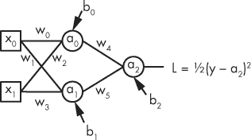

*图 10-1：一个简单的神经网络*

图 10-1 显示了这个网络的六个权重，*w*[0] 到 *w*[5]，以及三个偏差值，*b*[0]、*b*[1] 和 *b*[2]。每个值都是一个标量。

我们将在隐藏层使用 Sigmoid 激活函数，

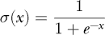

输出节点没有激活函数。为了训练这个网络，我们将使用平方误差损失函数，

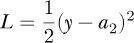

其中 *y* 是训练示例的标签，值为零或一，而 *a*[2] 是网络对于与 *y* 相关的输入，即 *x*[0] 和 *x*[1]，的输出。

让我们写出这个网络的前向传播方程，它是从输入 *x*[0] 和 *x*[1] 向输出 *a*[2] 进行的前向传播。方程如下：

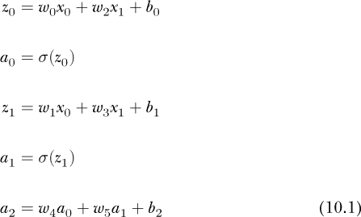

在这里，我们引入了中间值 *z*[0] 和 *z*[1]，它们是激活函数的参数。请注意，*a*[2] 没有激活函数。我们本可以在这里使用 Sigmoid 函数，但由于我们的标签仅为 0 或 1，我们无论如何都能学习到一个好的输出值。

如果我们通过网络传递一个单独的训练样本，输出是 *a*[2]。如果与训练样本相关的标签 ***x*** = (*x*[0]，*x*[1]) 是 *y*，则平方误差损失如 图 10-1 所示。

损失函数的参数是 *a*[2]；*y* 是一个固定常数。然而，*a*[2] 直接依赖于 *w*[4]、*w*[5]、*b*[2]，以及 *a*[1] 和 *a*[0] 的值，而后者又依赖于 *w*[0]、*w*[1]、*w*[2]、*w*[3]、*b*[0]、*b*[1]、*x*[0] 和 *x*[1]。因此，从权重和偏差的角度思考，我们可以将损失函数写成

*L* = *L*(*w*[0]，*w*[1]，*w*[2]，*w*[3]，*w*[4]，*w*[5]，*b*[0]，*b*[1]，*b*[2]；*x*[0]，*x*[1]，*y*) = *L*(**θ**；***x***，*y*)

这里，**θ** 代表权重和偏差，它被视为变量。分号后面的部分在这种情况下是常数：输入向量 ***x*** = (*x*[0]，*x*[1]) 和相关的标签 *y*。

我们需要损失函数的梯度，▽*L*(**θ**；***x***，*y*)。明确来说，我们需要所有的偏导数，∂*L*/∂*w*[5]，∂*L*/∂*b*[0]，等等，涉及所有权重和偏差：总共有九个偏导数。

这是我们的攻击计划。首先，我们通过数学推导来计算所有九个值的偏导数表达式。其次，我们将编写一些 Python 代码来实现这些表达式，以便训练 图 10-1 网络来对鸢尾花进行分类。在这个过程中我们将学到一些东西，也许最重要的一点是，通过手工计算偏导数，简直可以说是乏味。我们会成功的，但接下来的部分会让我们看到，幸运的是，背向传播有一种更紧凑的表示方式，尤其是对于完全连接的前馈神经网络。让我们开始吧。

#### 计算偏导数

我们需要得到 图 10-1 网络的损失函数所有偏导数的表达式。我们还需要激活函数（sigmoid）的导数表达式。我们从 sigmoid 开始，因为一个巧妙的技巧可以将导数表示为 sigmoidal 函数本身，这是在前向传播过程中计算得到的值。

Sigmoid 的导数如下所示。

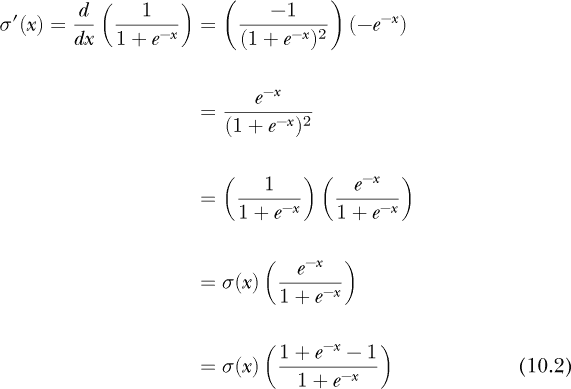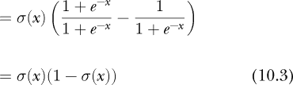

公式 10.2 的技巧是，在分子中加减一个 1，以改变因子的形式，使其成为 sigmoidal 函数本身的另一个副本。因此，sigmoid 的导数是 sigmoid 与 1 减去 sigmoid 的乘积。回顾 公式 10.1，我们看到前向传播计算了 sigmoid，也就是激活函数 *a*[0] 和 *a*[1]。因此，在推导反向传播偏导数时，我们可以通过 公式 10.3 用 *a*[0] 和 *a*[1] 来代替 sigmoid 的导数，从而避免重复计算。

让我们从偏导数开始。正如反向传播的名字所示，我们将从损失函数开始，逆向工作并应用链式法则，以得出我们所需的表达式。损失函数的导数，

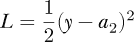

是

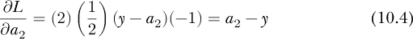

这意味着在接下来的表达式中，我们可以将 ∂*L*/∂*a*[2] 替换为 *a*[2] − *y*。回想一下，*y* 是当前训练样本的标签，我们在前向传播时将 *a*[2] 计算为网络的输出。

现在让我们找到 *w*[5]、*w*[4] 和 *b*[2] 的表达式，它们是计算 *a*[2] 时使用的参数。链式法则告诉我们

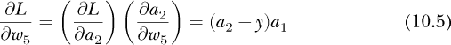

因为

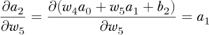

我们已经将 方程 10.1 中的 *a*[2] 表达式代入。

类似的逻辑得出 *w*[4] 和 *b*[2] 的表达式：

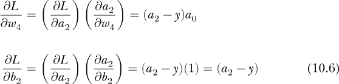

太棒了！我们得到了三个需要的偏导数——还剩六个。让我们写出 *b*[1]、*w*[1] 和 *w*[3] 的表达式，

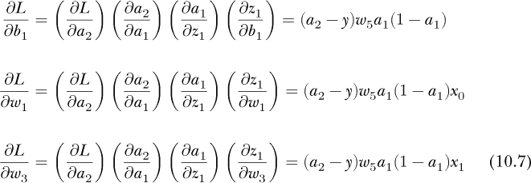

在这里我们使用

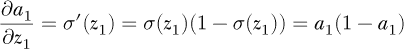

在计算 *a*[1] 时，我们将 *a*[1] 代入 σ(*z*[1])，因为我们在前向传播过程中计算了 *a*[1]。

一个类似的计算给出了最后三个偏导数的表达式：

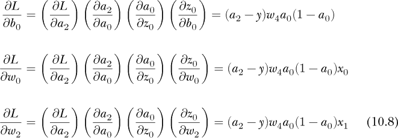

呼！这确实很繁琐，但现在我们已经得到了需要的内容。不过请注意，这是一个非常严谨的过程——如果我们改变网络结构、激活函数或损失函数，就需要重新推导这些表达式。现在让我们使用这些表达式来分类鸢尾花。

#### 转换为 Python 代码

我在这里展示的代码位于文件 *nn_by_hand.py* 中。请在编辑器中查看它，了解整体结构。我们将从 `main` 函数开始（列表 10-1）：

```py
❶ epochs = 1000

   eta = 0.1

❷ xtrn, ytrn, xtst, ytst = BuildDataset()

❸ net = {}

   net["b2"] = 0.0

   net["b1"] = 0.0

   net["b0"] = 0.0

   net["w5"] = 0.0001*(np.random.random() - 0.5)

   net["w4"] = 0.0001*(np.random.random() - 0.5)

   net["w3"] = 0.0001*(np.random.random() - 0.5)

   net["w2"] = 0.0001*(np.random.random() - 0.5)

   net["w1"] = 0.0001*(np.random.random() - 0.5)

   net["w0"] = 0.0001*(np.random.random() - 0.5)

❹ tn0,fp0,fn0,tp0,pred0 = Evaluate(net, xtst, ytst)

❺ net = GradientDescent(net, xtrn, ytrn, epochs, eta)

❻ tn,fp,fn,tp,pred = Evaluate(net, xtst, ytst)

   print("Training for %d epochs, learning rate %0.5f" % (epochs, eta))

 print()

   print("Before training:")

   print("   TN:%3d FP:%3d" % (tn0, fp0))

   print("   FN:%3d TP:%3d" % (fn0, tp0))

   print()

   print("After training:")

   print("   TN:%3d FP:%3d" % (tn, fp))

   print("   FN:%3d TP:%3d" % (fn, tp))
```

*列表 10-1：`*main*` *函数*

首先，我们设置训练轮数和学习率 η（eta）❶。训练轮数是通过训练集的次数，用来更新网络的权重和偏置。由于网络简单，数据集很小，只有 70 个样本，所以我们需要很多轮训练。梯度下降使用学习率来决定如何根据梯度值进行调整。我们将在第十一章中更深入地探讨学习率。

接下来，我们加载数据集❷。我们使用的是在第六章和第九章中使用过的相同的鸢尾花数据集，仅保留前两个特征和类别 0 与 1。请参阅 *nn_by_hand.py* 中的 `BuildDataset` 函数。返回值是 NumPy 数组：`xtrn`（70 × 2）和 `xtst`（30 × 2），分别用于训练数据和测试数据，以及在 `ytrn` 和 `ytst` 中的相应标签。

我们需要一个地方来存储网络的权重和偏置。使用一个 Python 字典就可以，所以我们接下来将其设置为默认值❸。注意，我们将偏置值设置为零，将权重设置为小的随机值，范围在 [−0.00005, +0.00005] 之间。在这个例子中，这些值似乎效果很好。

`main` 的其余部分在测试数据上评估随机初始化的网络（`Evaluate` ❹），执行梯度下降来训练模型（`GradientDescent` ❺），并再次评估测试数据以证明训练有效 ❻。

清单 10-2 显示了 `Evaluate` 以及 `Evaluate` 调用的 `Forward`。

```py

def Evaluate(net, x, y):

    out = Forward(net, x)

    tn = fp = fn = tp = 0

    pred = []

    for i in range(len(y)):

     ❶ c = 0 if (out[i] < 0.5) else 1

        pred.append(c)

        if (c == 0) and (y[i] == 0):

            tn += 1

        elif (c == 0) and (y[i] == 1):

            fn += 1

        elif (c == 1) and (y[i] == 0):

            fp += 1

        else:

            tp += 1

    return tn,fp,fn,tp,pred

 def Forward(net, x):

    out = np.zeros(x.shape[0])

    for k in range(x.shape[0]):

     ❷ z0 = net["w0"]*x[k,0] + net["w2"]*x[k,1] + net["b0"]

        a0 = sigmoid(z0)

        z1 = net["w1"]*x[k,0] + net["w3"]*x[k,1] + net["b1"]

        a1 = sigmoid(z1)

        out[k] = net["w4"]*a0 + net["w5"]*a1 + net["b2"]

    return out
```

*清单 10-2：* `*Evaluate*` *函数*

让我们从 `Forward` 开始，它对 `x` 中的数据执行前向传播。在创建一个存放网络输出的位置（`out`）之后，每个输入都会使用当前参数值 ❷ 通过网络。注意，这段代码是方程 10.1 的直接实现，其中 `out[k]` 代替了 *a*[2]。当所有输入处理完毕后，我们将收集到的输出返回给调用者。

现在让我们来看 `Evaluate`。它的参数是一组输入特征 `x`，相关的标签 `y`，以及网络参数 `net`。`Evaluate` 首先通过调用 `Forward` 将数据传递给网络以填充 `out`。这些是网络的原始浮动输出。为了与实际标签进行比较，我们应用一个阈值 ❶，将输出 < 0.5 的归为类 0，输出 ≥ 0.5 的归为类 1。预测标签将被附加到 `pred` 中，并通过与实际标签 `y` 进行比较来进行统计。

如果实际标签和预测标签都是零，则模型正确识别出了一个*真负类*（`TN`），即类 0 的真实实例。如果网络预测为类 0，但实际标签为类 1，则我们得到了*假负类*（`FN`），即被标记为类 0 的类 1 实例。相反，将类 0 实例标记为类 1 是*假正类*（`FP`）。唯一剩下的选项是一个实际的类 1 实例被标记为类 1，即*真正类*（`TP`）。最后，我们将计数和预测结果返回给调用者。

清单 10-3 展示了 `GradientDescent`，这是清单 10-1 中调用的 ❺。这里实现了前面计算的部分导数。

```py

def GradientDescent(net, x, y, epochs, eta):

 ❶ for e in range(epochs):

        dw0 = dw1 = dw2 = dw3 = dw4 = dw5 = db0 = db1 = db2 = 0.0

     ❷ for k in range(len(y)):

         ❸ z0 = net["w0"]*x[k,0] + net["w2"]*x[k,1] + net["b0"]

            a0 = sigmoid(z0)

            z1 = net["w1"]*x[k,0] + net["w3"]*x[k,1] + net["b1"]

            a1 = sigmoid(z1)

            a2 = net["w4"]*a0 + net["w5"]*a1 + net["b2"]

         ❹ db2 += a2 - y[k]

            dw4 += (a2 - y[k]) * a0

 dw5 += (a2 - y[k]) * a1

            db1 += (a2 - y[k]) * net["w5"] * a1 * (1 - a1)

            dw1 += (a2 - y[k]) * net["w5"] * a1 * (1 - a1) * x[k,0]

            dw3 += (a2 - y[k]) * net["w5"] * a1 * (1 - a1) * x[k,1]

            db0 += (a2 - y[k]) * net["w4"] * a0 * (1 - a0)

            dw0 += (a2 - y[k]) * net["w4"] * a0 * (1 - a0) * x[k,0]

            dw2 += (a2 - y[k]) * net["w4"] * a0 * (1 - a0) * x[k,1]

        m = len(y)

     ❺ net["b2"] = net["b2"] - eta * db2 / m

        net["w4"] = net["w4"] - eta * dw4 / m

        net["w5"] = net["w5"] - eta * dw5 / m

        net["b1"] = net["b1"] - eta * db1 / m

        net["w1"] = net["w1"] - eta * dw1 / m

        net["w3"] = net["w3"] - eta * dw3 / m

        net["b0"] = net["b0"] - eta * db0 / m

        net["w0"] = net["w0"] - eta * dw0 / m

        net["w2"] = net["w2"] - eta * dw2 / m

     return net
```

*清单 10-3：使用* `*GradientDescent*` *训练网络*

`GradientDescent` 函数包含一个双重循环。外部循环 ❶ 遍历 `epochs`，即训练集的完整遍历次数。内部循环 ❷ 遍历训练示例，一次处理一个。前向传播首先进行 ❸，用于计算输出 `a2` 和中间值。

接下来的代码块使用部分导数实现反向传播，通过方程 10.4 到 10.8，将误差（损失）向网络反向传播 ❹。我们使用训练集上的平均损失来更新权重和偏置。因此，我们会为每个训练示例累积每个权重和偏置值对损失的贡献。这也解释了为什么我们需要将每个新贡献加到训练集的总损失中。

将每个训练样本通过网络并累积其对损失的贡献传递后，我们更新权重和偏置 ❺。偏导数给出了梯度，即最大变化的方向；然而，我们想要最小化，所以我们沿着*梯度的反方向*移动，从当前值中减去每个权重和偏置导致的损失的平均值。

例如，

```py
net["b2"] = net["b2"] - eta * db2 / m
```

是

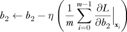

其中η = 0.1 为学习率，*m*为训练集中样本数。求和是对*b*[2]的偏导数求和，针对每个输入样本***x**[i]*评估，其平均值乘以学习率，用于调整下一个 epoch 的*b*[2]。我们经常用的另一个名称是学习率*步长*。该参数控制网络的权重和偏置如何在损失地形图上迈向最小值。

我们的实现已经完成。让我们运行它，看看它的表现如何。

#### 训练和测试模型

让我们看一下训练数据。我们可以绘制特征，每个轴一个，看看分离两个类别有多容易。结果是 Figure 10-2，其中类 0 为圆圈，类 1 为方块。

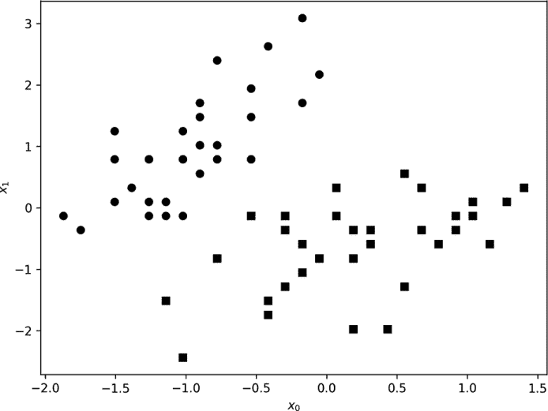

*Figure 10-2: 显示类 0（圆圈）和类 1（方块）的鸢尾花训练数据*

很容易看出两个类别彼此相当分离，即使是我们带有两个隐藏神经元的基础网络也应该能够学习它们之间的差异。将此图与 Figure 6-2 左侧进行比较，该图显示了所有三种鸢尾花类别的前两个特征。如果我们的数据集中包含类 2，则两个特征将不足以分离所有三个类别。

运行以下代码

```py
python3 nn_by_hand.py
```

对我来说，这产生

训练 1000 个 epochs，学习率为 0.10000

训练前：

TN: 15 FP: 0

FN: 15 TP: 0

训练后：

TN: 14 FP: 1

FN: 1 TP: 14

我们被告知训练使用了 70 个示例的训练集进行了 1000 次训练通过。这是 Listing 10-3 的外循环。然后我们被呈现出两个表格的数字，描述了训练前和训练后的网络。让我们逐步走过这些表格，了解它们所讲述的故事。

表格有几个名称：*列联表*，*2* × *2 表*或*混淆矩阵*。术语*混淆矩阵*最为通用，尽管通常用于多类分类器。标签计算测试集中真阳性、真阴性、假阳性和假阴性的数量。测试集包括 30 个样本，每类 15 个。如果网络完美，则所有 0 类样本将计入 TN 计数，所有 1 类样本将计入 TP 计数。错误为 FP 或 FN 计数。

随机初始化的网络将所有样本都标记为 class 0。我们知道这一点，因为有 15 个 TN 样本（真正的 class 0 样本）和 15 个 FN 样本（15 个被标记为 class 0 的 class 1 样本）。因此，训练前的总体准确率为 15/(15 + 15) = 0.5 = 50%。

经过训练后，在代码清单 10-3 中，代码外部循环执行了 1,000 次，测试数据几乎完全被正确分类，其中 15 个 class 0 中有 14 个被正确标记，15 个 class 1 中有 14 个被正确标记。总体准确率为 (14 + 14)/(15 + 15) = 28/30 = 93.3%，考虑到我们的模型只有一个隐藏层且该层有两个节点，这个结果还不错。

再次强调，这个练习的主要目的是展示手动计算导数是多么繁琐且容易出错。上面的代码是与标量一起工作的；它并未处理向量或矩阵，也没有利用通过更好的表示反向传播算法而可能产生的任何对称性。幸运的是，我们可以做得更好。让我们再次查看全连接网络的反向传播算法，看看是否能利用向量和矩阵来得到更优雅的实现。

### 全连接网络的反向传播

在本节中，我们将探讨能够将误差项从网络输出传递到输入的方程式。此外，我们还将看到如何使用这个误差项来计算层的权重和偏置的必要偏导数，以便我们能够实现梯度下降。掌握了所有基本的表达式后，我们将实现 Python 类，使我们能够构建并训练具有任意深度和形状的全连接前馈神经网络。最后，我们将通过测试 MNIST 数据集来验证这些类的效果。

#### 反向传播误差

让我们从一个有用的观察开始：全连接神经网络的各层可以被看作是向量函数：

***y*** = ***f***(***x***)

其中，层的输入是***x***，输出是***y***。输入***x***，要么是网络的实际输入（用于训练样本），要么是模型的某个隐藏层的输出（如果我们在处理隐藏层）。这两者都是向量；每个层中的节点会生成一个标量输出，这些标量输出组合起来就是***y***，一个表示该层输出的向量。

前向传播依次通过网络的各个层，映射***x**[i]*到***y**[i]*，使得***y**[i]*变成***x**[i]*+1，即层*i*+1 的输入。所有层都处理完后，我们使用最后一层的输出，称之为***h***，来计算损失，*L*(***h***, ***y***[true])。损失是衡量网络在输入***x***上的错误程度，我们通过将其与真实标签***y***[true]进行比较来确定。请注意，如果模型是多分类的，输出***h***是一个向量，每个可能的类别对应一个元素，而真实标签是一个零向量，除了实际类别标签的索引位置为一。这就是为什么许多工具包（如 Keras）将整数类别标签映射到独热编码向量的原因。

我们需要将损失值，或称为*误差*，反向传播通过网络；这就是反向传播步骤。为了对一个全连接网络使用每层向量和权重矩阵进行操作，我们需要首先了解如何执行前向传播。就像我们为上面构建的网络所做的那样，我们将激活函数的应用与全连接层的操作分开。

例如，对于任何一个输入向量***x***来自下层的层，我们需要计算一个输出向量，***y***。对于一个全连接层，前向传播为

***y*** = ***Wx*** + ***b***

其中，***W***是权重矩阵，***x***是输入向量，***b***是偏置向量。

对于一个激活层，我们有

***y*** = **σ**(***x***)

对于我们选择的任何激活函数**σ**。我们将在本章的其余部分中使用 sigmoid 函数。请注意，我们将函数设置为向量值函数。为此，我们将标量 sigmoid 函数应用于输入向量的每个元素，以生成输出向量：

**σ**(***x***) = [*σ*(*x*[0]) *σ*(*x*[1]) ... *σ*(*x[n]*[−1])]^⊤

一个全连接网络由一系列全连接层和后续的激活层组成。因此，前向传播是一个操作链，首先将模型的输入传递给第一层以生成输出，然后将其传递给下一层的输入，依此类推，直到所有层都被处理。

前向传播导致最终输出和损失。损失函数对网络输出的导数是第一个误差项。为了将误差项反向传播到模型中，我们需要计算误差项如何随着层输入的变化而变化，这通过计算层输出变化时误差的变化来实现。具体来说，对于每一层，我们需要知道如何计算

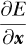

也就是说，我们需要知道误差项如何随着层输入的变化而变化，给定

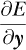

这表示误差项如何随着层输出的变化而变化。链式法则告诉我们如何做：

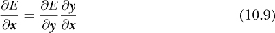

其中，层 *i* 的 ∂*E*/∂***x*** 在我们向后通过网络时变为层 *i* − 1 的 ∂*E*/∂***y***。

从操作上看，反向传播算法变成了

1.  进行一次前向传递，将 ***x*** → ***y***，逐层映射，以得到最终输出 ***h***。

1.  使用***h***和***y***[true]计算损失函数的导数值；这对于输出层变为 ∂*E*/∂***y***。

1.  对所有先前的层重复此过程，从 ∂*E*/∂***y*** 计算 ∂*E*/∂***x***，使得层 *i* 的 ∂*E*/∂***x*** 变为层 *i* − 1 的 ∂*E*/∂***y***。

这个算法将误差项反向传递通过网络。让我们从激活层开始，推导如何按层类型获取所需的偏导数。

我们假设我们知道 ∂*E*/∂***y*** 并且正在寻找 ∂*E*/∂***x***。链式法则说

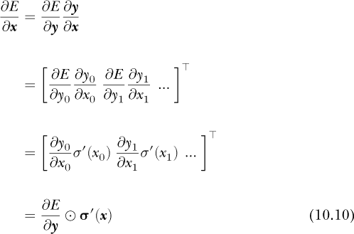

在这里，我们引入⊙表示哈达玛积。回想一下，哈达玛积是两个向量或矩阵的逐元素乘法。（参见第五章以获取复习资料。）

我们现在知道如何通过激活层传递误差项。我们考虑的唯一其他层是全连接层。如果我们展开方程 10.9，我们得到

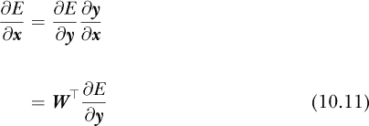

由于

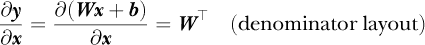

结果是 ***W***^⊤，而不是 ***W***，因为矩阵与向量的导数采用分母符号表示时，应该是矩阵的转置，而不是矩阵本身。

让我们暂停一下，回顾并思考一下方程 10.10 和 10.11 的形式。这些方程告诉我们如何将误差项从一层反向传递到另一层。这些值的形状是什么？对于激活层，如果输入有 *k* 个元素，那么输出也有 *k* 个元素。因此，方程 10.10 中的关系应该将一个 *k* 元素的向量映射到另一个 *k* 元素的向量。误差项 ∂*E*/∂***y*** 是一个 *k* 元素的向量，激活函数的导数 σ′(***x***) 也是一个 *k* 元素的向量。最后，两者之间的哈达玛积也会输出一个 *k* 元素的向量，这是所需要的。

对于全连接层，我们有一个 *m* 元素的输入，***x***；一个 *n* × *m* 元素的权重矩阵，***W***；以及一个 *n* 元素的输出向量，***y***。所以我们需要从 *n* 元素的误差项 ∂*E*/∂***y*** 生成一个 *m* 元素的向量 ∂*E*/∂***x***。通过将权重矩阵的转置（一个 *m* × *n* 元素的矩阵）与误差项相乘，确实会得到一个 *m* 元素的向量，因为 *m* × *n* 和 *n* × 1 的乘积是 *m* × 1，一个 *m* 元素的列向量。

#### 计算权重和偏置的偏导数

方程 10.10 和方程 10.11 告诉我们如何将误差项反向传递通过网络。然而，反向传播的重点是计算权重和偏置的变化如何影响误差，以便我们使用梯度下降。具体而言，对于每一层完全连接层，我们需要以下表达式：

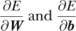

给定

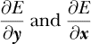

让我们从∂*E*/∂***b***开始。再次应用链式法则得到：

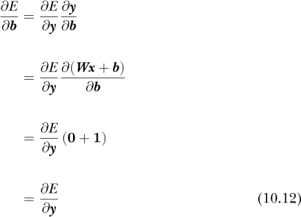

这意味着，完全连接层的偏置项的误差与输出的误差相同。

权重矩阵的计算是类似的：

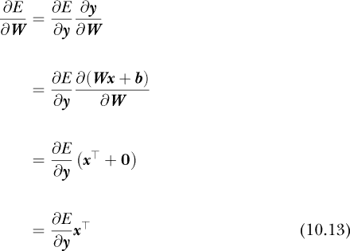

上面的方程告诉我们，权重矩阵的误差是输出误差与输入***x***的乘积。权重矩阵是一个*n* × *m*的矩阵，因为前向传递是与*m*元素的输入向量相乘。因此，来自权重的误差贡献∂*E*/∂***W***也必须是一个*n* × *m*的矩阵。我们知道∂*E*/∂***y***是一个*n*元素的列向量，而***x***的转置是一个*m*元素的行向量。两者的外积是一个*n* × *m*的矩阵，正如所要求的那样。

方程 10.10、方程 10.11、方程 10.12 和方程 10.13 适用于单个训练样本。这意味着对于特定的输入，这些方程，尤其是 10.12 和 10.13，告诉我们任何一层的偏置和权重对损失的贡献是*针对该输入样本*的。

为了实现梯度下降，我们需要在训练样本中累积这些误差，即∂*E*/∂***W***和∂*E*/∂***b***项。然后，我们使用这些误差的平均值在每个 epoch 结束时（或我们将要实现的小批量）更新权重和偏置。由于梯度下降是第十一章的内容，因此我们这里只是概述如何使用反向传播来实现梯度下降，详细内容将在那一章以及我们接下来实现的代码中给出。

一般来说，要训练网络，我们需要对小批量中的每个样本执行以下操作：

1.  将样本通过网络进行前向传递以创建输出。在这个过程中，我们需要存储每一层的输入，因为我们在实现反向传播时需要它（即我们需要方程 10.13 中的***x***^⊤）。

1.  计算损失函数的导数值，对我们来说是均方误差，用作反向传播中的第一个误差项。

1.  按逆序通过网络的各层，计算每个完全连接层的∂*E*/∂***W***和∂*E*/∂***b***。这些值会针对小批量中的每个样本进行累积（**Δ*W***，**Δ*b***）。

当小批量样本处理完并且误差累积后，便是进行梯度下降步骤的时候了。这时，每一层的权重和偏置通过以下方式更新：

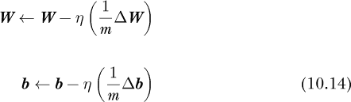

**Δ*W*** 和 **Δ*b*** 是小批量上的累计误差，*m* 是小批量的大小。重复的梯度下降步骤会得到一组最终的权重和偏置——一个训练好的网络。

本节内容较为数学化。下一节将数学转化为代码，在这里我们将看到，尽管数学复杂，但由于 NumPy 和面向对象设计，代码非常简洁优雅。如果你对数学部分不太熟悉，我猜代码会在很大程度上帮助你澄清这些内容。

#### 一个 Python 实现

我们的实现风格类似于像 Keras 这样的工具包。我们希望能够创建任意的全连接网络，因此我们会使用 Python 类来表示每一层，并将架构存储为一系列层的列表。每一层都会维护自己的权重和偏置，并具备执行前向传播、反向传播和梯度下降步骤的能力。为了简化，我们使用 sigmoid 激活函数和平方误差损失函数。

我们需要两个类：`ActivationLayer` 和 `FullyConnectedLayer`。另有一个 `Network` 类将这些部分结合起来并处理训练。所有类都位于文件 *NN.py* 中。（此处的代码修改自 Omar Aflak 的原始代码，并已获得他的许可使用。详见 *NN.py* 中的 GitHub 链接。我修改了代码，使其支持小批量训练，并能在每个样本之外支持其他梯度下降步骤。）

让我们逐步了解每个类，从 `ActivationLayer` 开始（见 示例 10-4）。我们已经做的数学转化成代码的方式非常优雅，在大多数情况下，只需一行 NumPy 代码。

```py

class ActivationLayer:

    def forward(self, input_data):

        self.input = input_data

        return sigmoid(input_data)

    def backward(self, output_error):

        return sigmoid_prime(self.input) * output_error

    def step(self, eta):

        return
```

*示例 10-4：* `*ActivationLayer*` *类*

示例 10-4 展示了 `ActivationLayer` 类，其中只包含三个方法：`forward`、`backward` 和 `step`。最简单的是 `step` 方法。它不做任何操作，因为激活层在梯度下降期间没有任何需要做的事情，因为没有权重或偏置值。

`forward` 方法接受输入向量 ***x***，将其存储以供稍后使用，然后通过应用 sigmoid 激活函数计算输出向量 ***y***。

`backward` 方法接受 ∂*E*/∂***y***，即来自上一层的 `output_error`。然后，它通过应用 sigmoid 函数的导数（`sigmoid_prime`）到前向传播时的输入集，并按元素与误差相乘，从而返回 公式 10.10。

`sigmoid` 和 `sigmoid_prime` 辅助函数是

```py

def sigmoid(x):

    return 1.0 / (1.0 + np.exp(-x))

def sigmoid_prime(x):

    return sigmoid(x)*(1.0 - sigmoid(x))
```

接下来是 `FullyConnectedLayer` 类。它比 `ActivationLayer` 类更复杂，但差别不大。请参见 示例 10-5。

```py

class FullyConnectedLayer:

    def __init__(self, input_size, output_size):

     ❶ self.delta_w = np.zeros((input_size, output_size))

        self.delta_b = np.zeros((1,output_size))

        self.passes = 0

     ❷ self.weights = np.random.rand(input_size, output_size) - 0.5

        self.bias = np.random.rand(1, output_size) - 0.5

    def forward(self, input_data):

        self.input = input_data

     ❸ return np.dot(self.input, self.weights) + self.bias

    def backward(self, output_error):

        input_error = np.dot(output_error, self.weights.T)

        weights_error = np.dot(self.input.T, output_error)

        self.delta_w += np.dot(self.input.T, output_error)

        self.delta_b += output_error

        self.passes += 1

        return input_error

    def step(self, eta):

     ❹ self.weights -= eta * self.delta_w / self.passes

        self.bias -= eta * self.delta_b / self.passes

     ❺ self.delta_w = np.zeros(self.weights.shape)

        self.delta_b = np.zeros(self.bias.shape)

        self.passes = 0
```

*示例 10-5：* `*FullyConnectedLayer*` *类*

我们告诉构造器输入节点和输出节点的数量。输入节点的数量（`input_size`）指定进入层的向量中元素的数量。同样，`output_size` 指定输出向量中元素的数量。

全连接层在小批量数据上累积权重和偏置误差，`delta_w` 中的 ∂*E*/∂***W*** 项和 `delta_b` 中的 ∂*E*/∂***b*** 项 ❶。每处理一个样本，`passes` 中的计数就会增加。

我们必须使用随机的权重和偏置值来初始化神经网络；因此，构造函数使用区间 [−0.5, 0.5] 内的均匀随机值设置初始权重矩阵和偏置向量 ❷。注意，偏置向量是 1 × *n* 的行向量。代码颠倒了上述方程的顺序，以匹配训练样本通常存储的方式：一个矩阵，其中每一行是一个样本，每一列是一个特征。计算结果是相同的，因为标量乘法是交换的：*ab* = *ba*。

`forward` 方法将输入向量存储起来，以供 `backward` 方法稍后使用，然后计算该层的输出，将输入乘以权重矩阵并加上偏置项 ❸。

只剩下两个方法。`backward` 方法接收 ∂*E*/∂***y***（`output_error`）并计算 ∂*E*/∂***x***（`input_error`）、∂*E*/∂***W***（`weights_error`）和 ∂*E*/∂***b***（`output_error`）。我们将这些误差添加到该层的累积误差总和 `delta_w` 和 `delta_b` 中，以供 `step` 使用。

`step` 方法包括一个用于全连接层的梯度下降步骤。与 `ActivationLayer` 的空方法不同，`FullyConnectedLayer` 有很多工作要做。我们使用平均误差来更新权重矩阵和偏置向量，正如在方程 10.14 ❹中所示。这实现了对小批量数据的梯度下降步骤。最后，我们重置累加器和计数器，为下一个小批量数据做准备 ❺。

`Network` 类将所有内容整合在一起，如清单 10-6 所示。

```py

class Network:

    def __init__(self, verbose=True):

        self.verbose = verbose

      ❶ self.layers = []

    def add(self, layer):

      ❷ self.layers.append(layer)

    def predict(self, input_data):

        result = []

        for i in range(input_data.shape[0]):

            output = input_data[i]

            for layer in self.layers:

                output = layer.forward(output)

            result.append(output)

      ❸ return result

     def fit(self, x_train, y_train, minibatches, learning_rate, batch_size=64):

      ❹ for i in range(minibatches):

 err = 0

        idx = np.argsort(np.random.random(x_train.shape[0]))[:batch_size]

        x_batch = x_train[idx]

        y_batch = y_train[idx]

      ❺ for j in range(batch_size):

            output = x_batch[j]

            for layer in self.layers:

                output = layer.forward(output)

          ❻ err += mse(y_batch[j], output)

          ❼ error = mse_prime(y_batch[j], output)

             for layer in reversed(self.layers):

                 error = layer.backward(error)

      ❽ for layer in self.layers:

             layer.step(learning_rate)

         if (self.verbose) and ((i%10) == 0):

              err /= batch_size

              print('minibatch %5d/%d error=%0.9f' % (i, minibatches, err))
```

*清单 10-6：* `*Network*` *类*

`Network` 类的构造函数很简单。我们设置一个 `verbose` 标志，用于在训练过程中切换显示小批量的平均误差。成功的训练应该显示这个误差随着时间的推移而减小。随着层的增加，它们被存储在 `layers` 中，构造函数初始化了这个 `layers` ❶。`add` 方法通过将层对象附加到 `layers` 中，来将层添加到网络中 ❷。

在网络训练完成后，`predict` 方法通过网络的各层进行前向传播，为 `input_data` 中的每个输入样本生成输出。注意模式：输入样本被赋值给 `output`；然后循环遍历 `layers`，依次调用每层的 `forward` 方法，将上一层的输出作为输入传递给下一层；如此往复，直到整个网络。循环结束时，`output` 包含最终层的输出，因此它会被附加到 `result` 中并返回给调用者 ❸。

训练网络是`fit`的工作。这个名字与`sklearn`的标准训练方法相匹配。参数是样本向量的 NumPy 数组，每行一个(`x_train`)，以及它们的标签作为一热向量(`y_train`)。接下来是训练所需的小批量数。稍后我们会讨论小批量。我们还需要提供学习率η（eta）和可选的小批量大小`batch_size`。

`fit`方法使用了一个双重循环。第一个循环是遍历所需的小批量数量❹。正如我们之前所学，小批量是完整训练集的一个子集，一个周期（epoch）是训练集的完整遍历。使用整个训练集称为*批量训练*，批量训练使用周期。然而，正如你将在第十一章中看到的那样，有充分的理由不使用批量训练，因此引入了*小批量*的概念。典型的小批量大小通常在 16 到 128 个样本之间。为了方便 GPU 深度学习工具包，通常使用 2 的幂次方。对我们来说，使用 64 或 63 个样本的小批量在性能上没有区别。

我们选择大多数小批量作为训练数据的顺序集合，以确保所有数据都被使用。在这里，我们有些懒，改为每次需要小批量时选择随机子集。这样可以简化代码，并增加一个随机性的应用场景。这就是`idx`的作用，它给我们提供了一个随机排列的训练集索引，只保留前`batch_size`个样本。然后，我们使用`x_batch`和`y_batch`进行实际的前向和反向传播。

第二个循环遍历小批量中的样本❺。样本逐一通过网络的各层，像`predict`一样调用`forward`。为了显示目的，实际的均方误差在前向传播输出与样本标签之间累积，得出小批量的误差❻。

反向传递从输出误差项开始，即损失函数的导数`mse_prime`❼。然后，反向传递继续*向后*穿过网络的各层，将上一层的输出误差作为输入传递给下一层，这个过程直接镜像了前向传播的过程。

一旦循环处理完所有的小批量样本❺，就该根据每层在样本中累计的平均误差进行梯度下降步骤❽。`step`的参数仅需要学习率。若设置了`verbose`，则每处理完 10 个小批量会报告平均误差。

我们将在第十一章中再次实验这段代码，探索梯度下降。现在，让我们用 MNIST 数据集测试它，看看它的效果如何。

#### 使用实现

让我们来试试*NN.py*。我们将用它来构建一个 MNIST 数据集的分类器，这是我们在第九章中首次遇到的。原始 MNIST 数据集包含 28×28 像素的手写数字灰度图像，背景为黑色。它是机器学习社区的工作马。我们将在将这些图像转化为 196 个元素（= 14 × 14）的向量之前，将它们调整为 14×14 像素。

该数据集包括 60,000 张训练图像和 10,000 张测试图像。这些向量存储在 NumPy 数组中；请参阅*dataset*目录中的文件。生成数据集的代码在*build_dataset.py*中。如果你想自己运行代码，首先需要安装 Keras 和 OpenCV 的 Python 版本。Keras 提供了原始的图像集，并将训练集标签映射到 one-hot 向量。OpenCV 将图像从 28×28 调整为 14×14 像素。

我们需要的代码在*mnist.py*中，见列表 10-7。

```py
   import numpy as np

   from NN import *

 ❶ x_train = np.load("dataset/train_images_small.npy")

   x_test = np.load("dataset/test_images_small.npy")

   y_train = np.load("dataset/train_labels_vector.npy")

   y_test = np.load("dataset/test_labels.npy")

❷ x_train = x_train.reshape(x_train.shape[0], 1, 14*14)

   x_train /= 255

   x_test = x_test.reshape(x_test.shape[0], 1, 14*14)

   x_test /= 255

❸ net = Network()

   net.add(FullyConnectedLayer(14*14, 100))

   net.add(ActivationLayer())

   net.add(FullyConnectedLayer(100, 50))

   net.add(ActivationLayer())

   net.add(FullyConnectedLayer(50, 10))

   net.add(ActivationLayer())

❹ net.fit(x_train, y_train, minibatches=40000, learning_rate=1.0)

❺ out = net.predict(x_test)

   cm = np.zeros((10,10), dtype="uint32")

   for i in range(len(y_test)):

       cm[y_test[i],np.argmax(out[i])] += 1

   print()

   print(np.array2string(cm))

   print()

   print("accuracy = %0.7f" % (np.diag(cm).sum() / cm.sum(),))
```

*列表 10-7：分类 MNIST 数字*

请注意，我们在导入 NumPy 后立即导入*NN.py*。接下来，我们加载训练图像、测试图像和标签❶。`Network`类要求每个样本向量是一个 1×*n*的行向量，因此我们将训练数据从(60000,196)调整为(60000,1,196)—与测试数据相同❷。同时，我们将 8 位数据从[0, 255]缩放到[0, 1]。这是图像数据的标准预处理步骤，因为这样做能使网络更容易学习。

接下来是构建模型❸。首先，我们创建一个`Network`类的实例。然后，我们通过定义一个具有 196 个输入和 100 个输出的`FullyConnectedLayer`来添加输入层。接着是一个 sigmoid 激活层。然后，我们添加第二个全连接层，将第一层的 100 个输出映射到 50 个输出，并附加一个激活层。最后，我们添加一个最后的全连接层，将上一层的 50 个输出映射到 10 个输出，即类别数量，并添加其激活层。这种方法模仿了常见的工具包，比如 Keras。

训练通过调用`fit` ❹来进行。我们指定了 40,000 个小批次，使用默认的小批次大小 64 个样本。我们将学习率设置为 1.0，这在此情况下表现良好。训练在我老旧的 Intel i5 Ubuntu 系统上大约需要 17 分钟。随着模型的训练，每个小批次的平均误差会被报告。当训练完成时，我们将 10,000 个测试样本通过网络，计算出一个 10 × 10 的混淆矩阵 ❺。回忆一下，混淆矩阵的行是实际的类标签，这里是实际的数字 0 到 9。列对应预测的标签，即每个输入样本的 10 个输出中最大的值。矩阵元素表示实际标签是*i*，而分配的标签是*j*的次数。如果模型是完美的，那么矩阵将是纯对角线的，意味着没有任何实际标签和模型标签不一致的情况。最后，整体准确率是通过对角线元素的和除以矩阵的总和（即所有测试样本的总数）来计算的。

我运行*mnist.py*时得到的结果是

minibatch 39940/40000  error=0.003941790

minibatch 39950/40000  error=0.001214253

minibatch 39960/40000  error=0.000832551

minibatch 39970/40000  error=0.000998448

minibatch 39980/40000  error=0.002377286

minibatch 39990/40000  error=0.000850956

[[ 965    0    1   1   1   5   2   3   2    0]

[   0 1121    3   2   0   1   3   0   5    0]

[   6    0 1005   4   2   0   3   7   5    0]

[   0    1    6 981   0   4   0   9   4    5]

[   2    0    3   0 953   0   5   3   1   15]

[   4    0    0  10   0 864   5   1   4    4]

[   8    2    1   1   3   4 936   0   3    0]

[   2    7   19   2   1   0   0 989   1    7]

[   5    0    4   5   3   5   7   3 939    3]

[   5    5    2  10   8   2   1   3   6 967]]

accuracy = 0.9720000

混淆矩阵呈强对角线形状，整体准确率为 97.2%。对于像*NN.py*这样的简单工具包和一个全连接前馈网络来说，这并不是一个差的结果。网络最大的错误是把七和二混淆了 19 次（混淆矩阵的元素[7,2]）。接下来的错误是把四和九混淆了 15 次（元素[4,9]）。这两种错误是可以理解的：七和二看起来常常相似，四和九也是如此。

我们在本章一开始创建了一个包含两个输入、两个隐藏层节点和一个输出的网络。文件*iris.py*通过调整数据集以适应`Network`的要求，来实现相同的模型。我们不再逐行讲解代码，但一定要运行它。当我运行时，我在测试集上的表现略有提升：类别 0 的正确率为 15 个中 14 个，类别 1 的正确率为 15 个中 15 个。

可惜的是，这里和上一节详细介绍的反向传播方法，最终并不够灵活，无法满足深度学习的需求。现代工具包不再使用这些方法。让我们探索一下现代深度学习工具包在反向传播方面是如何处理的。

### 计算图

在计算机科学中，*图*是一种由节点（顶点）和连接它们的边组成的集合。我们一直在使用图来表示神经网络。在这一节中，我们将用图来表示表达式。

考虑这个简单的表达式：

*y* = *mx* + *b*

要评估这个表达式，我们遵循关于运算符优先级的约定规则。遵循这些规则意味着一系列基本操作，我们可以将其表示为一个图，如图 10-3 所示。

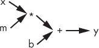

*图 10-3：实现* `y = mx + b` *的计算图*

数据沿着图 10-3 中的箭头流动，从左到右。数据起始于*源*，这里是*x*、*m*和*b*，并通过*运算符*、*和+，流向输出*y*。

图 10-3 是一个*计算图*——一个指定如何评估表达式的图。像 C 语言这样的编译器会以某种形式生成计算图，将高级表达式转换为机器语言指令的序列。对于上面的表达式，首先将*x*和*m*的值相乘，乘法操作的结果被传递给加法操作，并与*b*一起产生最终输出*y*。

我们可以将表达式表示为计算图，包括那些表示复杂深度神经网络的表达式。我们就是这样表示完全连接的前馈模型的，数据从输入***x***流经隐藏层到达输出，即损失函数。

计算图是像 TensorFlow 和 PyTorch 这样的深度学习工具包如何管理模型结构并实现反向传播的方式。与本章早期的严格计算不同，计算图是通用的，能够表示深度学习中使用的所有架构。

当你浏览深度学习文献并开始使用特定工具包时，你会遇到两种不同的计算图使用方法。第一种是在数据可用时动态生成图，PyTorch 使用这种方法，称为*符号到数字*。TensorFlow 使用第二种方法，*符号到符号*，提前构建一个静态计算图。两种方法都实现了图，且都能自动计算反向传播所需的导数。

TensorFlow 以与我们在前一节中做的方式类似的方式生成反向传播所需的导数。像加法一样，每个操作都知道如何根据其输入创建输出的导数。再加上链式法则，这就是实现反向传播所需的全部内容。图的遍历方式取决于 *图求值引擎* 和特定的模型架构，但图会根据前向和反向传播的需要进行遍历。请注意，由于计算图将表达式分解为更小的操作，每个操作都知道如何在反向步骤中处理梯度（就像我们在上面为 `ActivationLayer` 和 `FullyConnectedLayer` 所做的那样），因此可以在层中使用自定义函数，而无需处理导数。图引擎会为你做这件事，只要你使用引擎已经支持的原始操作。

让我们走一遍计算图的前向和反向传播。这一例子来自于 2015 年的论文《TensorFlow：异构分布式系统上的大规模机器学习》(*[`arxiv.org/pdf/1603.04467.pdf`](https://arxiv.org/pdf/1603.04467.pdf)*)。

完全连接模型中的隐藏层表示为

***y*** = **σ**(***Wx*** + ***b***)

对于权重矩阵 ***W***、偏置向量 ***b***、输入 ***x*** 和输出 ***y***。

图 10-4 以计算图的形式展示了相同的方程。

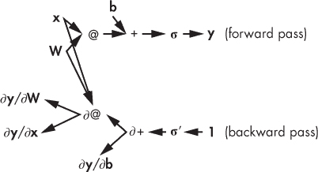

*图 10-4：表示前向传播和反向传播的计算图，经过一个前馈神经网络的层*

图 10-4 展示了两个版本。图的顶部显示了前向传播，其中数据从 ***x***、***W*** 和 ***b*** 流动，以生成输出。注意箭头是从左到右指向的。

请注意，源是张量，这里是向量或矩阵。操作的输出也是张量。张量在图中流动，因此得名 *TensorFlow*。图 10-4 将矩阵乘法表示为 `@`，这是 NumPy 的矩阵乘法操作符。激活函数是 **σ**。

对于反向传播，导数的序列从 ∂***y***/∂***y*** = 1 开始，并从操作符输出通过图流回输入。如果有多个输入，就会有多个输出导数。在实际操作中，图的求值引擎会按正确的顺序处理适当的操作符。每个操作符在其被处理时，都能获得所需的输入导数。

图 10-4 在操作符前使用 ∂ 来表示操作符生成的导数。例如，加法操作符 (∂+) 生成两个输出，因为有两个输入，***Wx*** 和 ***b***。矩阵乘法 (∂@) 也是如此。激活函数的导数表示为 **σ**′。

请注意，箭头从***W***和***x***在前向传播中指向反向传播中的矩阵乘法算符的导数。***W***和***x***都是计算∂***y***/∂***W***和∂***y***/∂***x***所必需的—请参见方程式 10.13 和方程式 10.11。没有箭头从***b***指向矩阵乘法算符，因为∂***y***/∂***b***不依赖于***b***—请参见方程式 10.12。如果在图 10-4 所示的网络结构下方还有一层，则矩阵乘法算符输出的∂***y***/∂***x***将成为反向传播经过该层的输入，依此类推。

计算图的强大功能使得现代深度学习工具包具有高度的通用性，支持几乎任何网络类型和架构，而不会让用户承担繁琐且复杂的梯度计算工作。当你继续探索深度学习时，请感激这些工具包仅凭几行代码便能实现的可能性。

### 总结

本章介绍了反向传播，这是使深度学习实用的两个关键组成部分之一。首先，我们手动计算了一个小型网络所需的导数，了解了这一过程是多么繁琐。然而，我们成功地训练了这个小型网络。

接下来，我们使用来自第八章的矩阵微积分知识，找出了多层全连接网络的方程式，并创建了一个与 Keras 等工具包类似的简单工具包。通过这个工具包，我们成功地使用 MNIST 数据集训练了一个高准确率的模型。尽管该工具包在隐藏层数量和大小方面具有高效和通用性，但它仅限于全连接模型。

本章最后简要介绍了现代深度学习工具包（如 TensorFlow）如何实现模型并自动化反向传播。计算图使得任意组合的基本操作成为可能，每个操作都可以根据需要反向传递梯度，从而支持深度学习中复杂的模型架构。

训练深度模型的第二部分是梯度下降，它将通过反向传播计算出的梯度付诸实践。现在让我们把注意力转向这一部分。
