## 第十一章：梯度下降**


在本章的最后，我们将稍微放慢节奏，重新审视梯度下降。我们将通过图示回顾梯度下降的概念，讨论它是什么以及如何运作。接下来，我们将探讨*随机*在*随机梯度下降*中的含义。梯度下降是一个简单的算法，允许进行调整，因此在我们探讨完随机梯度下降后，我们将考虑一个有用且常用的调整方法：动量。最后，我们将通过讨论更先进的自适应梯度下降算法来结束本章，具体包括 RMSprop、Adagrad 和 Adam。

这是一本数学书，但梯度下降非常贴近应用数学，因此我们将通过实验学习。这些方程是直接的，我们在前几章看到的数学知识作为背景是相关的。因此，可以将本章视为应用我们迄今为止所学内容的机会。

### 基本概念

我们已经遇到过几次梯度下降。我们知道基本的梯度下降更新方程的形式，来自方程 10.14：

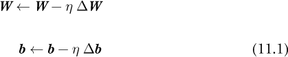

这里，**Δ*W*** 和 **Δ*b*** 分别是基于权重和偏差的偏导数计算出的误差；η（eta）是步长或学习率，这是我们用来调整移动方式的值。

方程 11.1 并不特定于机器学习。我们可以使用相同的形式在任意函数上实现梯度下降。让我们通过一维和二维示例讨论梯度下降，为其操作打下基础。我们将使用一种未经修改的梯度下降形式，称为*普通梯度下降*。

#### 一维梯度下降

让我们从一个标量函数 *x* 开始：

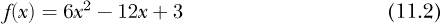

方程 11.2 是一个向上的抛物线。因此，它有一个最小值。让我们通过将导数设为零并解出*x*来解析地找到最小值：

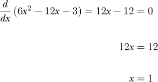

抛物线的最小值在 *x* = 1。现在，让我们改用梯度下降来找到方程 11.2 的最小值。我们应该如何开始？

首先，我们需要写出适当的更新方程，这是方程 11.1 在这种情况下的形式。我们需要梯度，对于一维函数，它就是导数，*f*′(*x*) = 12*x* − 12。通过导数，梯度下降变为：

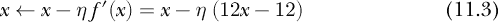

注意我们减去了η (12*x* − 12)。这就是算法被称为梯度*下降*的原因。回想一下，梯度指向函数值变化最大的方向。我们关心的是最小化函数，而不是最大化它，因此我们沿着与梯度相反的方向前进，朝着更小的函数值移动；因此，我们进行减法。

方程 11.3 是一次梯度下降步骤。它从初始位置 *x* 移动到一个新位置，基于当前点的斜率值。同样，学习率 *η* 决定了我们移动的距离。

既然我们已经得到了方程，让我们实现梯度下降法。我们将绘制方程 11.2，选择一个起始位置，例如 *x* = −0.9，并迭代方程 11.3，每次在 *x* 的新位置绘制函数值。如果我们这样做，我们应该会看到一系列的点在函数上，逐渐逼近最小值位置 *x* = 1。现在让我们写些代码。

首先，我们实现方程 11.2 及其导数：

```py

def f(x):

    return 6*x**2 - 12*x + 3

def d(x):

    return 12*x - 12
```

接下来，我们绘制函数图像，然后迭代方程 11.3，每次绘制新的位置对（*x*，*f*(*x*)）：

```py
   import numpy as np

   import matplotlib.pylab as plt

❶ x = np.linspace(-1,3,1000)

   plt.plot(x,f(x))

❷ x = -0.9

   eta = 0.03

❸ for i in range(15):

      plt.plot(x, f(x), marker='o', color='r')

    ❹ x = x - eta * d(x)
```

让我们逐步讲解代码。导入 NumPy 和 Matplotlib 后，我们绘制方程 11.2 ❶。接下来，我们设置初始的 *x* 位置 ❷，并进行 15 步梯度下降 ❸。我们在每一步之前进行绘图，因此我们看到的是初始的 *x*，但不会绘制最后一步，这在这种情况下是可以的。

最后一行 ❹ 是关键。它实现了方程 11.3。我们通过将导数在 *x* 处的值乘以步长 *η* = 0.03 来更新当前的 *x* 位置。上面的代码位于 *gd_1d.py* 文件中。如果我们运行它，我们将得到图 11-1。

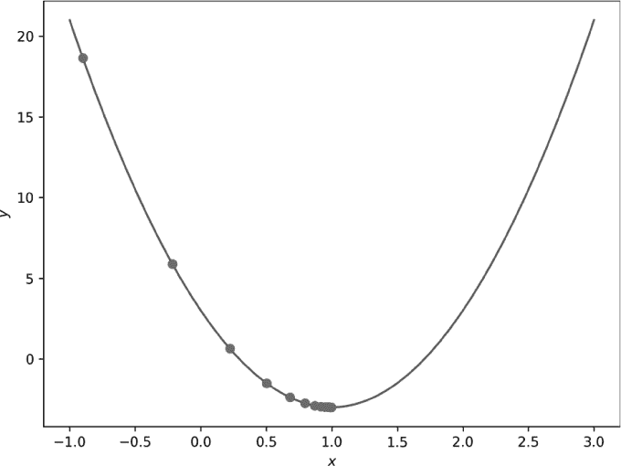

*图 11-1：使用较小步长（η = 0.03）的单维梯度下降*

我们的初始位置可以看作是最小值位置的初步猜测，*x* = −0.9。显然，这并不是最小值。随着我们进行梯度下降，每一步都会让我们逐渐接近最小值，正如一系列逐步朝向最小值的圆圈所示。

这里有两点需要注意。首先，我们确实越来越接近最小值。经过 14 步后，从实际角度看，我们已经接近最小值：*x* = 0.997648。其次，每一步梯度下降都会导致 *x* 的变化越来越小。学习率保持在 *η* = 0.03，因此 *x* 的小更新源自于每个 *x* 位置处的导数值逐渐减小。如果我们思考一下，就能理解。随着我们接近最小值位置，导数会越来越小，直到最小值处导数为零，因此使用导数进行更新时，更新量也会逐渐减小。

我们选择了图 11-1 中的步长，使其平滑地朝着抛物线的最小值移动。如果我们改变步长会怎么样呢？在 *gd_1d.py* 文件中，代码重复了上述步骤，从 *x* = 0.75 开始，设置 *η* = 0.15，步长是图 11-1 中绘制的步长的五倍。结果是图 11-2。

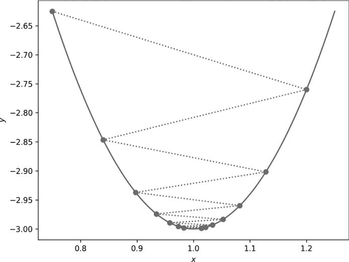

*图 11-2：使用较大步长（η = 0.15）的单维梯度下降*

在这种情况下，步骤会超越最小值。新的 *x* 位置会振荡，来回越过真正的最小值位置。虚线连接了连续的 *x* 位置。整体搜索仍然朝最小值逼近，但由于步长较大，每次更新 *x* 时可能会越过最小值，导致需要更长时间才能到达。

小的梯度下降步长沿函数走小距离，而大的步长则走大距离。如果学习率过小，可能需要很多梯度下降步骤。如果学习率过大，搜索就会超越并在最小值位置附近振荡。适当的学习率并不容易确定，因此直觉和经验在选择时非常重要。此外，这些例子中假设 *η* 是常数。事实上，*η* 不必是常数。在许多深度学习应用中，学习率不是恒定的，而是随着训练进展而变化，实际上使得 *η* 成为梯度下降步数的函数。

#### 二维梯度下降

一维梯度下降比较简单。接下来，我们转向二维，以增强我们对算法的直觉。下面引用的代码在文件 *gd_2d.py* 中。我们将首先考虑函数有一个最小值的情况，然后再讨论多个最小值的情况。

##### 单一最小值的梯度下降

为了在二维空间中工作，我们需要一个向量的标量函数，*f*(***x***) = *f*(*x*, *y*)，为了便于理解，我们将向量分解成其分量，***x*** = (*x*, *y*)。

我们将使用的第一个函数是：

*f*(*x*, *y*) = 6*x*² + 9*y*² − 12*x* − 14*y* + 3

为了实现梯度下降，我们还需要偏导数：

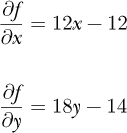

我们的更新方程变为：

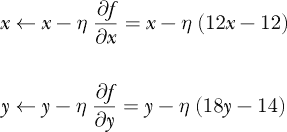

在代码中，我们定义了函数和偏导数：

```py

def f(x,y):

    return 6*x**2 + 9*y**2 - 12*x - 14*y + 3

def dx(x):

    return 12*x - 12

def dy(y):

    return 18*y - 14
```

由于偏导数与另一个变量无关，我们只需要传递 *x* 或 *y*。稍后在本节中，我们将看到一个例子，情况并非如此。

梯度下降遵循与之前相同的模式：选择一个初始位置，这次是一个向量，进行若干步迭代，并绘制路径。该函数是二维的，因此我们首先使用等高线来绘制它，如下所示。

```py
N = 100

x,y = np.meshgrid(np.linspace(-1,3,N), np.linspace(-1,3,N))

z = f(x,y)

plt.contourf(x,y,z,10, cmap="Greys")

plt.contour(x,y,z,10, colors='k', linewidths=1)

plt.plot([0,0],[-1,3],color='k',linewidth=1)

plt.plot([-1,3],[0,0],color='k',linewidth=1)

plt.plot(1,0.7777778,color='k',marker='+')
```

这段代码需要一些解释。为了绘制等高线，我们需要在 (*x*, *y*) 对的网格上表示函数。为了生成网格，我们使用 NumPy，特别是 `np.meshgrid`。`np.meshgrid` 的参数是 *x* 和 *y* 的点，这里由 `np.linspace` 提供，后者生成从 −1 到 3 的 *N* = 100 个均匀分布的值。`np.meshgrid` 函数返回两个 100 × 100 的矩阵。第一个矩阵包含给定范围内的 *x* 值，第二个矩阵包含 *y* 值。返回值表示所有可能的 (*x*, *y*) 对，形成覆盖 *x* 和 *y* 范围为 −1 到 3 的点的网格。将这些点传递给函数后，返回 `z`，即一个 100 × 100 的矩阵，表示每个 (*x*, *y*) 对的函数值。

我们可以绘制三维函数图，但那样不容易观察且在此情况下不必要。相反，我们将使用 *x*、*y* 和 *z* 的函数值来生成等高线图。等高线图以相同 *z* 值的一系列线条来展示三维信息。可以想象成地形图上环绕山丘的线条，每条线表示相同的海拔高度。随着山丘的升高，线条将围绕越来越小的区域。

等高线图有两种类型：一种是相同函数值的线条，另一种是表示函数范围的阴影。我们将使用灰度图同时绘制这两种类型。这是调用 Matplotlib 的 `plt.contourf` 和 `plt.contour` 函数的最终结果。其余的 `plt.plot` 调用显示了坐标轴，并用加号标记了函数的最小值。等高线图中的较浅阴影表示较低的函数值。

现在我们准备绘制梯度下降步骤的序列。我们将绘制序列中的每个位置，并用虚线将它们连接起来，以使路径更加清晰（见 清单 11-1）。在代码中，这就是

```py
x = xold = -0.5

y = yold = 2.9

for i in range(12):

    plt.plot([xold,x],[yold,y], marker='o', linestyle='dotted', color='k')

    xold = x

    yold = y

    x = x - 0.02 * dx(x)

    y = y - 0.02 * dy(y)
```

*清单 11-1：二维梯度下降*

我们从 (*x*, *y*) = (−0.5, 2.9) 开始，进行 12 步梯度下降。为了用虚线连接最后一个位置到新位置，我们跟踪当前的 *x* 和 *y* 位置以及先前的位置，(*x*[old], *y*[old])。梯度下降步骤更新 *x* 和 *y*，使用 *η* = 0.02，并调用各自的偏导数函数 `dx` 和 `dy`。

图 11-3 显示了 清单 11-1 所遵循的梯度下降路径（圆形），以及从 (1.5, −0.8)（方形）和 (2.7, 2.3)（三角形）出发的另外两条路径。

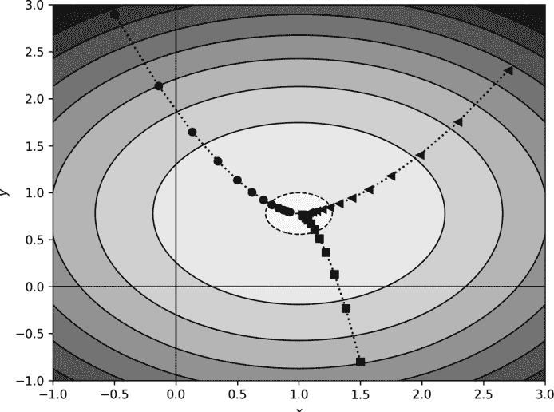

*图 11-3：二维梯度下降（小步长）*

所有三条梯度下降路径都汇聚到函数的最小值。这并不令人惊讶，因为该函数只有一个最小值。如果函数只有一个最小值，那么梯度下降最终会找到它。如果步长太小，可能需要很多步骤，但它们最终会收敛到最小值。如果步长太大，梯度下降可能会在最小值附近振荡，但会不断越过它。

现在，让我们稍微修改一下函数，将其在*x*方向上相对于*y*方向进行拉伸：

*f*(*x*, *y*) = 6*x*² + 40*y*² − 12*x* − 30*y* + 3

该函数的偏导数为∂*f*/∂*x* = 12*x* − 12 和 ∂*f*/∂*y* = 80*y* − 30。

此外，让我们选择两个起始位置（−0.5, 2.3）和（2.3, 2.3），并分别使用*η* = 0.02 和*η* = 0.01 生成一系列梯度下降步骤。图 11-4 显示了结果路径。

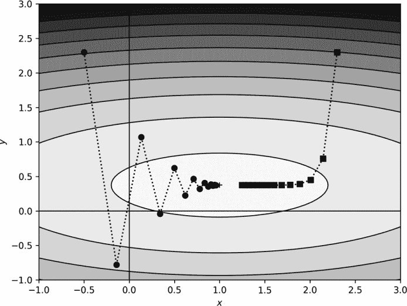

*图 11-4：具有较大步长和稍有不同函数的二维梯度下降*

首先考虑*η* = 0.02（圆形）路径。新函数像一个峡谷，*y*方向很窄，但*x*方向很长。较大的步长使得在*y*方向上上下振荡，同时朝着*x*方向的最小值移动。尽管在峡谷壁上反弹，我们仍然能找到最小值。

现在，看看*η* = 0.01（方形）路径。它很快掉入峡谷，然后沿峡谷底部缓慢移动，朝着最小值位置前进。在峡谷中，沿*x*方向的梯度分量（*x*和*y*的偏导数值）很小，因此沿*x*方向的运动相对较慢。在*y*方向上没有运动——峡谷很陡峭，相对较小的学习率已经定位到了峡谷底部，那里梯度主要沿*x*方向。

这里的教训是什么？同样，步长很重要。然而，函数的形状更为重要。该函数的最小值位于一个狭长峡谷的底部。峡谷中的梯度非常小；峡谷底部在*x*方向上是平坦的，因此运动较慢，因为它依赖于梯度值。我们在深度学习中经常遇到这种情况：如果梯度很小，学习就很慢。这也是为什么修正线性单元（ReLU）在深度学习中占主导地位的原因；对于正输入，梯度是恒定的。对于 Sigmoid 或双曲正切函数，当输入远离零时，梯度接近零。

##### 具有多个最小值的梯度下降

到目前为止，我们所研究的函数都有一个单一的最小值。如果情况不是这样呢？让我们来看一下当函数有多个最小值时，梯度下降会发生什么。考虑这个函数：

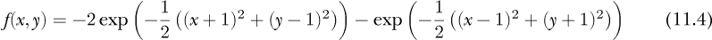

方程 11.4 是两个反向高斯分布的和，一个在 (−1, 1) 处的最小值为 −2，另一个在 (1, −1) 处的最小值为 −1。如果梯度下降法要找到全局最小值，它应该会在 (−1, 1) 处找到。此示例的代码在 *gd_multiple.py* 中。

偏导数为：

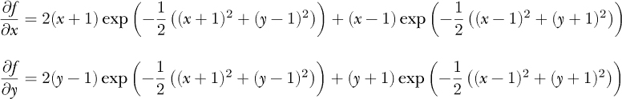

这转换为以下代码：

```py

def f(x,y):

    return -2*np.exp(-0.5*((x+1)**2+(y-1)**2)) + \

           -np.exp(-0.5*((x-1)**2+(y+1)**2))

def dx(x,y):

    return 2*(x+1)*np.exp(-0.5*((x+1)**2+(y-1)**2)) + \

           (x-1)*np.exp(-0.5*((x-1)**2+(y+1)**2))

def dy(x,y):

    return (y+1)*np.exp(-0.5*((x-1)**2+(y+1)**2)) + \

           2*(y-1)*np.exp(-0.5*((x+1)**2+(y-1)**2))
```

请注意，在这种情况下，偏导数确实依赖于 *x* 和 *y*。

*gd_multiple.py* 中的梯度下降部分代码与之前相同。让我们运行表 11-1 中的案例。

**表 11-1：** 不同起始位置和梯度下降步数

| **起始点** | **步数** | **符号** |
| --- | --- | --- |
| (–1.5,1.2) | 9 | 圆形 |
| (1.5,–1.8) | 9 | 正方形 |
| (0,0) | 20 | 加号 |
| (0.7,–0.2) | 20 | 三角形 |
| (1.5,1.5) | 30 | 星号 |

“符号”列指的是在图 11-5 中使用的图形符号。对于所有情况，*η* = 0.4。

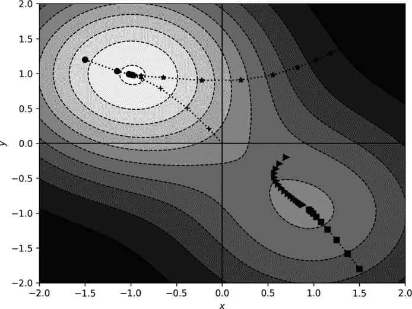

*图 11-5：具有两个极小值的函数的梯度下降*

图 11-5 中所示的梯度下降路径是合理的。在五个案例中，三条路径确实进入了由两个极小值中较深的一个定义的“深谷”——这是一次成功的搜索。然而，对于三角形和正方形，梯度下降却陷入了错误的最小值。显然，在这种情况下，梯度下降的成功与否取决于我们从哪里开始。一旦路径向下移动到一个更深的位置，梯度下降就没有办法反向上升以找到一个可能更好的最小值。

目前的看法是，深度学习模型的损失景观包含许多局部最小值。现在也普遍认为，在大多数情况下，这些最小值是相当相似的，这部分解释了深度学习模型的成功——训练这些模型时，你不需要找到损失的唯一“魔法”全局最小值，只需要找到其中一个（可能）与其他最小值差不多好的最小值。

我选择了本节示例中使用的初始位置，基于对函数形式的了解有意识地进行了选择。对于深度学习模型，选择起始点意味着对权重和偏置的随机初始化。通常，我们不知道损失函数的具体形式，因此初始化是一种盲目的尝试。大多数时候，或者至少很多时候，梯度下降会产生一个表现良好的模型。然而，有时它并不会如此成功；它可能会彻底失败。在这种情况下，可能是因为初始位置像图 11-5 中的正方形那样：它陷入了一个较差的局部最小值，因为它从一个不好的位置开始。

现在我们已经掌握了梯度下降法的基本概念，它是什么以及如何运作，让我们来探讨如何将其应用于深度学习中。

### 随机梯度下降

训练神经网络的主要目的是最小化损失函数，同时通过各种形式的正则化保持泛化能力。在第十章中，我们将损失表示为*L*(**θ**; ***x***, *y*)，其中**θ**（theta）是权重和偏置的向量，训练实例（***x***, *y*）是输入向量***x***和已知标签 y。请注意，这里，***x***代表的是*所有*训练数据，而不仅仅是单个样本。

梯度下降需要∂*L*/∂**θ**，我们通过反向传播得到这个值。∂*L*/∂**θ**是指所有单独的权重和偏置误差项的简洁表示，它们是反向传播给出的。我们通过对训练数据上的误差进行平均来得到∂*L*/∂**θ**。这就引出了一个问题：我们是对所有训练数据进行平均，还是仅对部分训练数据进行平均？

在进行梯度下降步骤之前，将所有训练数据传递给模型的过程称为批量训练。乍一看，批量训练似乎是合理的。毕竟，如果我们的训练集是来自于生成我们模型所需数据的父分布的良好样本，那么为什么不使用所有这些样本来进行梯度下降呢？

当数据集较小时，批量训练是自然的选择。然而，随着模型和数据集的增大，每次梯度下降步骤中将*所有*训练数据传递给模型的计算负担变得过于沉重。本章的示例已经暗示，为了找到一个好的最小值位置，可能需要进行许多梯度下降步骤，尤其是在使用非常小的学习率时。

因此，实践者开始在每次梯度下降步骤中使用训练数据的子集——即*小批量*。小批量训练最初可能被视为一种折衷，因为在小批量上计算的梯度是“错误的”，因为它并非基于完整训练集的表现。

当然，*批量*和*小批量*之间的区别只是一个约定俗成的虚构。实际上，它是从一个样本的小批量到包含所有可用样本的小批量的一个连续体。考虑到这一点，所有在网络训练过程中计算的梯度都是“错误的”，或者至少是不完整的，因为它们是基于对数据生成器及其能够生成的完整数据集的不完全了解。

因此，小批量训练并不是一种妥协，而是合理的选择。与在较大小批量上计算的梯度相比，小批量的梯度噪声较大，从某种意义上说，小批量的梯度是对“真实”梯度的粗略估计。当情况是噪声较大或随机时，*随机*这个词通常会出现，就像这里一样。使用小批量的梯度下降就是*随机梯度下降（SGD）*。

实际上，使用较小的小批量进行梯度下降往往会导致表现优于使用较大小批量训练的模型。一般给出的理论是，较小小批量的噪声梯度帮助梯度下降避免陷入损失景观中的差局部最小值。我们在图 11-5 中看到了这个效果，那里三角形和方形都陷入了错误的最小值。

再次地，我们发现自己非常幸运。以前，我们的幸运在于一阶梯度下降成功地训练了那些由于非线性损失景观而无法训练的模型，而现在，通过故意使用少量数据来估计梯度，我们获得了一个提升，从而避免了一个计算负担，这个负担可能使得深度学习的整个工作变得过于繁琐，在很多情况下难以实施。

我们的小批量应该多大？小批量大小是一个*超参数*，是我们需要选择的参数来训练模型，但它不是模型本身的一部分。适当的小批量大小取决于数据集。例如，在极端情况下，我们可以为每个样本进行一次梯度下降步骤，这有时效果很好。这个情况通常被称为*在线学习*。然而，特别是如果我们使用像批量归一化这样的层时，我们需要一个足够大的小批量，以便使计算出的均值和标准差成为合理的估计。同样，就像目前深度学习中的大多数事情一样，这些都是经验性的，你既需要有直觉，又需要尝试许多变种来优化模型的训练。这也是为什么人们研究*AutoML*系统，这些系统旨在为你进行所有的超参数调优。

另一个好问题是：小批量中应该包含什么？也就是说，我们应该使用完整数据集中的哪个小子集？通常，训练集中的样本顺序是随机化的，随后从数据集中抽取小批量，直到所有样本都被使用。使用数据集中的所有样本定义一个轮次，因此训练集中样本的数量除以小批量大小，决定了每个轮次的小批量数量。

另外，就像我们在*NN.py*中做的那样，一个小批量可能是真正从可用数据中随机抽取的。某些训练样本可能永远不会被使用，而其他样本可能被多次使用，但总体而言，大部分数据集在训练过程中都会被使用。

一些工具包会为指定数量的小批量进行训练。*NN.py*和 Caffe 就是采用这种方式。其他工具包，如 Keras 和`sklearn`，则使用轮次（epochs）。梯度下降步骤在处理完一个小批量后进行。较大的小批量会导致每轮次的梯度下降步骤较少。为了弥补这一点，使用轮次的工具包的实践者需要确保随着小批量大小的增加，梯度下降步骤的数量也增加——较大的小批量需要更多的轮次才能训练得好。

总结一下，深度学习至少因为以下原因不使用全批量训练：

1.  计算负担太重，无法在每个梯度下降步骤中将整个训练集通过模型。

1.  从小批量的平均损失计算出的梯度是一个噪声较大但合理的估计，接近真实的梯度，尽管这个真实的梯度是不可知的。

1.  含噪声的梯度在损失曲线中指向一个略有偏差的方向，从而可能避开不好的最小值。

1.  小批量训练在实践中对于许多数据集更有效。

第 4 个原因不容小觑：深度学习中的许多实践最初采用，是因为它们工作得更好。只有后来，才会用理论来证明其合理性，如果有的话。

由于我们已经在第十章实现了 SGD（参见*NN.py*），所以这里不再重新实现，但在接下来的部分，我们将加入动量，看看它如何影响神经网络训练。

### 动量

原始梯度下降仅依赖于偏导数的值与学习率的乘积。如果损失曲线有许多局部最小值，特别是这些最小值很陡峭，原始梯度下降可能会陷入其中的一个最小值，无法恢复。为了解决这个问题，我们可以修改原始梯度下降，加入*动量*项，这个项使用前一步更新的一个比例。将这个动量项包含在梯度下降中，为算法在损失曲线中的运动增加了惯性，从而有可能让梯度下降跳过不好的局部最小值。

让我们定义并尝试使用动量，先用一维和二维示例，如我们之前所做的那样。之后，我们将更新我们的*NN.py*工具包，使用动量来观察它如何影响在更复杂数据集上训练的模型。

#### 什么是动量？

在物理学中，运动物体的动量定义为质量乘以速度，***p*** = *m**v***。然而，速度本身是位置的导数，***v*** = *d**x***/*dt*，所以动量是质量乘以物体位置随时间变化的速率。

对于梯度下降，*位置*是函数值，*时间*是函数的自变量。然后，*速度*是函数值随着自变量变化的变化速率，∂*f*/∂***x***。因此，我们可以将*动量*看作是一个缩放的速度项。在物理学中，缩放因子是质量。对于梯度下降，缩放因子是*μ*（mu），一个介于零和一之间的数字。

如果我们将包含动量项的梯度称为***v***，那么之前的梯度下降更新方程将是

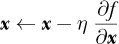

变成

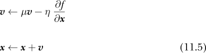

对于某些初始速度，***v*** = 0，以及“质量”*μ*。

让我们通过 公式 11.5 来理解它的含义。这个两步更新，先更新***v***再更新***x***，使得迭代变得容易，因为我们知道这是梯度下降中必须做的。如果我们将***v***代入更新方程中的***x***，我们得到

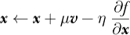

这使得更新过程变得清晰，它包含了之前的梯度步长，但会加入上一轮步长的一部分。之所以是部分，是因为我们将 *μ* 限制在 [0, 1] 范围内。如果 *μ* = 0，我们就回到常规的梯度下降方法。可以将 *μ* 理解为一个比例因子，表示保留多少上一轮速度并与当前梯度值一起更新。

动量项倾向于使运动在损失景观中沿着其先前的方向继续。*μ* 的值决定了这一倾向的强度。深度学习从业者通常使用 *μ* = 0.9，这样大部分先前的更新方向在下一步中得以保留，当前的梯度提供了一个小的调整。同样，像深度学习中的许多事物一样，这个数字是通过经验选择的。

牛顿的第一运动定律表明，除非外力作用，否则物体会保持运动状态。对外力的抗拒与物体的质量有关，这种抗拒被称为 *惯性*。因此，我们也可以将 *μ**v*** 项视为惯性，这或许是一个更合适的名称。

不管名字如何，现在我们已经有了它，让我们看看它对我们之前使用常规梯度下降处理的 1D 和 2D 示例有什么影响。

#### 1D 中的动量

让我们修改上面的 1D 和 2D 示例，使用动量项。我们从 1D 情况开始。更新后的代码位于文件 *gd_1d_momentum.py* 中，并在此作为清单 11-2 展示。

```py
   import matplotlib.pylab as plt

   def f(x):

       return 6*x**2 - 12*x + 3

   def d(x):

       return 12*x - 12

❶ m = ['o','s','>','<','*','+','p','h','P','D']

   x = np.linspace(0.75,1.25,1000)

   plt.plot(x,f(x))

❷ x = xold = 0.75

   eta = 0.09

   mu = 0.8

   v = 0.0

   for i in range(10):

    ❸ plt.plot([xold,x], [f(xold),f(x)], marker=m[i], linestyle='dotted',

       color='r')

       xold = x

       v = mu*v - eta * d(x)

       x = x + v

   for i in range(40):

       v = mu*v - eta * d(x)

       x = x + v

❹ plt.plot(x,f(x),marker='X', color='k')
```

*清单 11-2：具有动量的一维梯度下降*

清单 11-2 有点密集，所以让我们逐步解析。首先，我们进行绘图，因此需要引入 Matplotlib。接下来，我们定义函数 `f(x)` 及其导数 `d(x)`，与之前一样。为了配置绘图，我们定义了一组标记 ❶，然后绘制函数本身。如同之前一样，我们从 *x* = 0.75 ❷ 开始，并设置步长（`eta`）、动量（`mu`）和初始速度（`v`）。

我们现在准备开始迭代。我们将使用两个梯度下降循环。第一个绘制每一步 ❸，第二个继续梯度下降以展示我们最终确实能找到最小值，并用 `'X'` ❹ 标记它。对于每一步，我们通过模仿公式 11.5 计算新的速度，然后将速度加到当前的位置，得到下一个位置。

图 11-6 显示了 *gd_1d_momentum.py* 的输出。

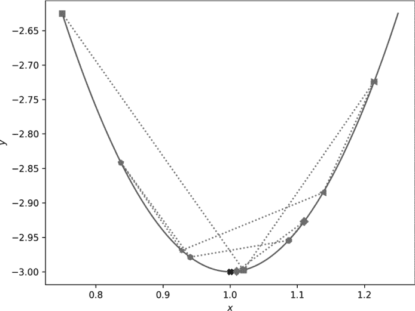

*图 11-6：具有动量的一维梯度下降*

请注意，我们故意使用了较大的步长(*η*)，因此我们超越了最小值。动量项也倾向于超越最小值。如果你沿着虚线和图表标记的序列走，你可以通过前 10 步的梯度下降过程。虽然有振荡，但振荡是衰减的，并最终在标记的最小值处稳定下来。添加动量增强了由于较大步长导致的超越。然而，即使有了动量项，在这里并没有什么优势，因为这里只有一个最小值，经过足够的梯度下降步骤，我们最终还是找到了最小值。

#### 二维中的动量

现在，让我们更新我们的二维示例。我们正在使用*gd_momentum.py*中的代码。回想一下，在二维示例中，函数是两个反向高斯函数的和。包括动量后，代码会稍作更新，如示例 11-3 所示：

```py

   def gd(x,y, eta,mu, steps, marker):

       xold = x

       yold = y

    ❶ vx = vy = 0.0

       for i in range(steps):

           plt.plot([xold,x],[yold,y], marker=marker,

                    linestyle='dotted', color='k')

 xold = x

           yold = y

        ❷ vx = mu*vx - eta * dx(x,y)

           vy = mu*vy - eta * dy(x,y)

        ❸ x = x + vx

           y = y + vy

❹ gd( 0.7,-0.2, 0.1, 0.9, 25, '>')

   gd( 1.5, 1.5, 0.02, 0.9, 90, '*')
```

*示例 11-3：带动量的二维梯度下降*

在这里，我们有一个新的函数`gd`，它执行带动量的梯度下降，从`(x, y)`开始，使用给定的*μ*和*η*，并运行`steps`次迭代。

初始速度被设置为❶，然后循环开始。公式 11.5 中的速度更新变为`vx = mu*vx - eta * dx(x,y)`❷，位置更新变为`x = x + vx`❸。和之前一样，绘制一条线连接最后的位置和当前的位置，以追踪通过函数空间的运动轨迹。

*gd_momentum.py*中的代码追踪了从之前使用的两个点开始的运动，分别是(0.7, −0.2)和(1.5, 1.5)❹。请注意，不同的点使用的步数和学习率不同，以避免图形过于杂乱。*gd_momentum.py*的输出为图 11-7。

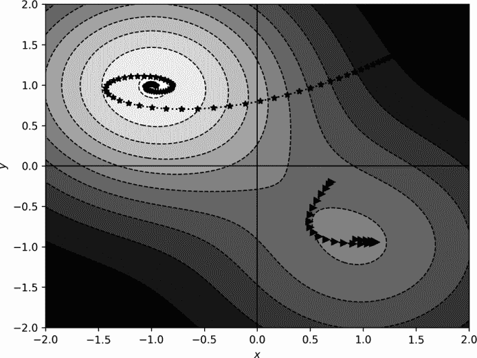

*图 11-7：带动量的二维梯度下降*

比较图 11-7 中的路径与图 11-5 中的路径。添加动量后，路径发生了偏移，因此它们趋向于朝同一方向持续运动。注意，从(1.5, 1.5)开始的路径朝着最小值螺旋移动，而另一条路径则朝着较浅的最小值弯曲，经过它后又返回到它附近。

动量项改变了在函数空间中运动的动态。然而，并不立刻能看出动量是否有帮助。毕竟，使用普通梯度下降的(1.5, 1.5)起始位置直接移动到了最小值位置，没有出现螺旋形运动。

让我们将动量添加到我们的*NN.py*工具集中，看看在训练真实神经网络时它是否能带来好处。

#### 使用动量训练模型

为了在*NN.py*中支持动量，我们需要在`FullyConnectedLayer`方法的两个地方进行调整。首先，如示例 11-4 所示，我们修改构造函数以允许`momentum`关键字：

```py

def __init__(self, input_size, output_size, momentum=0.0):

    self.delta_w = np.zeros((input_size, output_size))

    self.delta_b = np.zeros((1,output_size))

    self.passes = 0

    self.weights = np.random.rand(input_size, output_size) - 0.5

    self.bias = np.random.rand(1, output_size) - 0.5

 ❶ self.vw = np.zeros((input_size, output_size))

    self.vb = np.zeros((1, output_size))

    self.momentum = momentum
```

*示例 11-4：添加动量关键字*

在这里，我们向参数列表中添加了一个 `momentum` 关键字，默认值为零。然后，我们定义了权重（`vw`）和偏置（`vb`）的初始速度 ❶。这些是正确形状的矩阵，初始化为零。我们还保留了动量参数以供后续使用。

第二个修改是针对 `step` 方法的，正如列表 11-5 所示：

```py

def step(self, eta):

 ❶ self.vw = self.momentum * self.vw - eta * self.delta_w / self.passes

    self.vb = self.momentum * self.vb - eta * self.delta_b / self.passes

 ❷ self.weights = self.weights + self.vw

    self.bias = self.bias + self.vb

    self.delta_w = np.zeros(self.weights.shape)

    self.delta_b = np.zeros(self.bias.shape)

    self.passes = 0
```

*列表 11-5：更新 step 以包含动量*

我们实现了公式 11.5，首先是针对权重 ❶，然后是下一行的偏置。我们将动量（*μ*）乘以前一个速度，然后减去每个小批量的平均误差，再乘以学习率。接着，我们通过加上速度 ❷ 来更新权重和偏置。这就是我们引入动量所需要做的全部。然后，要使用它，我们在构建网络时为每个全连接层添加动量关键字，如列表 11-6 所示：

```py
net = Network()

net.add(FullyConnectedLayer(14*14, 100, momentum=0.9))

net.add(ActivationLayer())

net.add(FullyConnectedLayer(100, 50, momentum=0.9))

net.add(ActivationLayer())

net.add(FullyConnectedLayer(50, 10, momentum=0.9))

net.add(ActivationLayer())
```

*列表 11-6：在构建网络时指定动量*

每层添加动量使得可以使用特定于每层的动量值。尽管我不知道是否有研究这样做，但这似乎是一个相当明显的尝试，因此现在可能已经有人尝试过了。对于我们的目的，我们将所有层的动量设置为 0.9，并继续进行。

我们应该如何测试我们新的动量？我们可以使用上面提到的 MNIST 数据集，但它并不是一个合适的候选者，因为它太简单了。即使是一个简单的全连接网络也能达到超过 97% 的准确率。因此，我们将用另一个已知更具挑战性的数据集替换 MNIST 数字数据集：Fashion-MNIST 数据集。（请参见 Han Xiao 等人的《Fashion-MNIST: A Novel Image Dataset for Benchmarking Machine Learning Algorithms》，arXiv:1708.07747 [2017]。）

*Fashion-MNIST 数据集（FMNIST）* 是现有 MNIST 数据集的替代品。它包含来自 10 个服装类别的图像，均为 28×28 像素的灰度图像。为了我们的目的，我们将像 MNIST 那样将 28×28 像素的图像缩减为 14×14 像素。图像存储在 `dataset` 目录中，以 NumPy 数组的形式。让我们使用这些数据训练一个模型。模型的代码与列表 10-7 类似，唯一不同的是在列表 11-7 中，我们将 MNIST 数据集替换为 FMNIST：

```py
x_train = np.load("fmnist_train_images_small.npy")/255

x_test = np.load("fmnist_test_images_small.npy")/255

y_train = np.load("fmnist_train_labels_vector.npy")

y_test = np.load("fmnist_test_labels.npy")
```

*列表 11-7：加载 Fashion-MNIST 数据集*

我们还包括了计算测试数据集的 Matthews 相关系数（MCC）的代码。我们在第四章中首次接触到 MCC，并了解到它比准确率更能衡量模型的表现。要运行的代码在*fmnist.py*中。在一台较旧的 Intel i5 计算机上，大约 18 分钟完成一次运行，输出结果为：

```py

[[866   1  14  28   8   1  68   0  14   0]

 [  5 958   2  25   5   0   3   0   2   0]

 [ 20   1 790  14 126   0  44   1   3   1]

 [ 29  21  15 863  46   1  20   0   5   0]

 [  0   0  91  22 849   1  32   0   5   0]

 [  0   0   0   1   0 960   0  22   2  15]

 [161   2 111  38 115   0 556   0  17   0]

 [  0   0   0   0   0  29   0 942   0  29]

 [  1   0   7   5   6   2   2   4 973   0]

 [  0   0   0   0   0   6   0  29   1 964]]

accuracy = 0.8721000

MCC = 0.8584048
```

混淆矩阵，依然是 10×10，因为 FMNIST 有 10 个类别，和我们在 MNIST 中看到的非常干净的混淆矩阵相比，它相当嘈杂。对于全连接模型来说，这是一个具有挑战性的数据集。回想一下，MCC 是一个衡量标准，其值越接近 1，模型越好。

上面的混淆矩阵是用于没有动量训练的模型。学习率为 1.0，训练了 40,000 个包含 64 个样本的小批量。如果我们对每个全连接层添加 0.9 的动量，并将学习率降低到 0.2，会发生什么呢？当我们添加动量时，降低学习率是有道理的，这样我们就不会因为动量已经朝某个方向移动而使步伐变得过大。请尝试在没有动量的情况下，以学习率 0.2 运行*fmnist.py*，看看会发生什么。

含有动量的代码版本在*fmnist_momentum.py*中。大约 20 分钟后，这段代码运行一次产生了

```py

[[766   5  14  61   2   1 143   0   8   0]

 [  1 958   2  30   3   0   6   0   0   0]

 [ 12   0 794  16  98   0  80   0   0   0]

 [  8  11  13 917  21   0  27   0   3   0]

 [  0   0  84  44 798   0  71   0   3   0]

 [  0   0   0   1   0 938   0  31   1   29]

 [ 76   2  87  56  60   0 714   0   5   0]

 [  0   0   0   0   0  11   0 963   0  26]

 [  1   1   6   8   5   1  10   4 964   0]

 [  0   0   0   0   0   6   0  33   0 961]]

accuracy = 0.8773000

MCC = 0.8638721
```

这给我们带来了略微更高的 MCC。这是否意味着动量起到了帮助作用？也许吧。正如我们现在所理解的那样，训练神经网络是一个随机过程。所以，我们不能依赖单次训练模型的结果。我们需要多次训练模型并对结果进行统计测试。太棒了！这给了我们一个机会，能将我们在第四章中学到的假设检验知识付诸实践。

与其分别运行*fmnist.py*和*fmnist_momentum.py*各一次，不如每个运行 22 次。这在我的旧 Intel i5 系统上大概需要一天的时间，但耐心是美德。最终结果是动量模型有 22 个 MCC 值，没有动量的模型也有 22 个。22 个样本没有什么神奇之处，但我们打算使用 Mann-Whitney U 检验，而该检验的经验法则是每个数据集至少要有 20 个样本。

图 11-8 显示了结果的直方图。

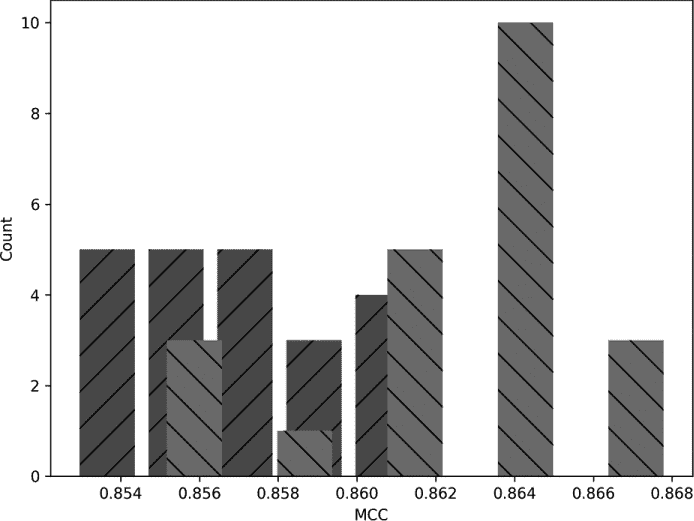

*图 11-8：显示带有动量（浅灰色）和不带动量（深灰色）模型的 MCC 分布的直方图*

深灰色条表示没有动量的 MCC 值，浅灰色条表示有动量的 MCC 值。从视觉上看，这两者有很大的区别。生成图 11-8 的代码在*fmnist_analyze.py*文件中。请一定查看这段代码，它使用了 SciPy 的`ttest_ind`和`mannwhitneyu`，并结合我们在第四章中提供的 Cohen's *d*实现来计算效应大小。MCC 值本身保存在代码中列出的 NumPy 文件中。

除了图表，*fmnist_analyze.py*还生成了以下输出：

```py
no momentum: 0.85778 +/- 0.00056

momentum   : 0.86413 +/- 0.00075

t-test momentum vs no (t,p): (6.77398299, 0.00000003)

Mann-Whitney U             : (41.00000000, 0.00000126)

Cohen's d                  : 2.04243
```

其中，前两条线分别是均值和均值的标准误差。t 检验的结果是（*t*，*p*），即*t*统计量及其关联的*p*值。同样，Mann-Whitney U 检验的结果是（*U*，*p*），即*U*统计量及其*p*值。回想一下，Mann-Whitney U 检验是一种非参数检验，假设 MCC 值的分布形态没有任何假定。而 t 检验假设它们服从正态分布。由于我们每组样本只有 22 个，实际上我们不能对结果是否服从正态分布做出任何明确的结论；这些直方图看起来并不像高斯曲线。这就是我们包含 Mann-Whitney U 检验结果的原因。

看一下各自的*p*值，我们可以得出结论，带动量和不带动量的 MCC 值均值差异在统计上是高度显著的，且带动量的结果更具优势。*t*值为正，且带动量的结果是第一个参数。那么 Cohen 的*d*值呢？它略高于 2.0，表示效应大小（非常）大。

我们*现在*可以说动量在这个案例中有帮助吗？大概可以。它在我们使用的超参数下，产生了更好的模型表现。训练神经网络的随机性使得我们有可能调整两个模型的超参数，以消除我们在现有数据中看到的差异。两者之间的架构是固定的，但并没有规定学习率和小批量大小已针对任何一个模型进行了优化。

一位严谨的研究人员可能会感到有必要对超参数进行优化处理，并且一旦确信自己找到了适用于这两种方法的最佳模型，便会在重复实验后做出更明确的结论。幸运的是，我们并不是严谨的研究人员。相反，我们将利用现有的证据，以及全球机器学习研究人员数十年来关于动量在梯度下降法中作用的智慧，来声明：是的，动量确实有助于模型学习，在大多数情况下你应该使用它。

然而，正态性问题仍然需要进一步调查。毕竟，我们是在寻求提升自己在深度学习方面的数学*和*实践直觉。因此，接下来我们将对带动量的模型进行 FMNIST 训练，不是训练 22 次，而是训练 100 次。作为妥协，我们将把小批量的数量从 40,000 减少到 10,000。尽管如此，预计仍然需要大部分时间来等待程序完成。代码，虽然我们在这里不逐步讲解，位于*fmnist_repeat.py*中。

图 11-9 展示了结果的直方图。

很明显，这个分布看起来完全不像一个正态曲线。*fmnist_repeat.py* 的输出包括了 SciPy 的 `normaltest` 函数的结果。该函数对一组数据进行统计检验，零假设是数据*服从*正态分布。因此，*p*-值低于 0.05 或 0.01 表示数据不服从正态分布。我们的 *p*-值几乎为零。

如何解读 图 11-9？首先，由于结果显然不是正态分布，我们不能使用 t 检验。然而，我们也使用了非参数的 Mann-Whitney U 检验，并得到了高度统计显著的结果，因此我们上述的结论仍然有效。其次，图 11-9 中的长尾在左侧。我们甚至可以提出一个论点，认为结果可能是双峰的：有两个峰，一个接近 0.83，另一个较小，接近 MCC 为 0.75。

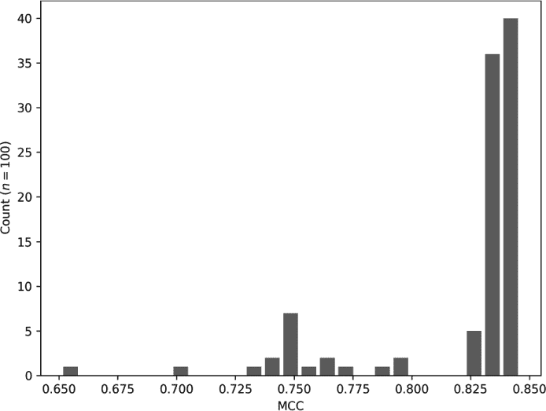

*图 11-9：FMNIST 模型 100 次训练的 MCC 值分布*

大多数模型训练后表现相对一致，MCC 值接近 0.83。然而，长尾表明，当模型的表现不理想时，它的表现非常糟糕。

直观来看，图 11-9 对我来说似乎是合理的。我们知道随机梯度下降对初始化不当敏感，而我们的工具包使用的是传统的小随机值初始化。看起来我们更有可能从一个较差的位置开始，之后就注定会得到较差的表现。

如果尾部出现在右侧呢？那可能意味着什么？右侧的长尾意味着大多数模型表现中等或较差，但偶尔会有一个特别“优秀”的模型出现。这样的情景意味着更好的模型是存在的，但我们的训练和/或初始化策略并不是特别擅长找到它们。我认为左侧的尾部更可取——大多数模型能找到合理的局部最小值，因此大多数训练，除非非常糟糕，最终会在表现上基本达到相同的水平。

现在，让我们来探讨一个常见的动量变种，你在深入学习中无疑会遇到它。

#### Nesterov 动量

许多深度学习工具包都包含了在梯度下降中使用 *Nesterov 动量* 的选项。Nesterov 动量是梯度下降的一种改进，广泛应用于优化领域。深度学习中通常实现的版本是从标准动量更新而来的：

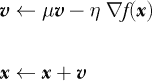

到

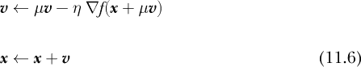

这里我们使用梯度符号，而不是损失函数的偏导数，以表明该技术是通用的，适用于任何函数，*f*(***x***).

标准动量和深度学习 Nesterov 动量之间的差异很微妙，只是在梯度的参数中增加了一个项。其思想是利用现有的动量来计算梯度，而不是在当前位置***x***上，而是在如果继续使用当前动量，梯度下降将会达到的位置，即 ***x*** + *μ **v***。然后，我们使用该位置的梯度值来更新当前位置，如之前所做的那样。

这一声明在优化中得到了很好的证明：这个调整导致了更快的收敛，这意味着梯度下降将在更少的步骤中找到最小值。然而，尽管工具包已经实现了它，但有理由相信，随机梯度下降和小批量引入的噪声抵消了这个调整，使得 Nesterov 动量在训练深度学习模型时可能不比常规动量更有用。（有关更多信息，请参见 Ian Goodfellow 等人著作《深度学习》第 292 页上的评论。）

然而，本章中的二维示例使用了实际的函数来计算梯度，因此我们可以预期在这种情况下 Nesterov 动量会有效。让我们更新二维示例，最小化两个反向高斯分布的和，看看 Nesterov 动量是否如所声称的那样改善了收敛。我们将运行的代码在 *gd_nesterov.py* 中，它与 *gd_momentum.py* 中的代码几乎相同。此外，我稍微修改了这两个文件，使它们在梯度下降完成后返回最终位置。这样，我们就可以看到我们接近已知最小值的程度。

实现 方程 11.6 很简单，只会影响速度更新，导致

vx = mu*vx - eta * dx(x,y)

vy = mu*vy - eta * dy(x,y)

变为

vx = mu * vx - eta * dx(x + mu * vx,y)

vy = mu * vy - eta * dy(x,y + mu * vy)

为每个分量 *x* 和 *y* 添加动量。其他一切保持不变。

图 11-10 比较了标准动量（上，来自 图 11-7）和 Nesterov 动量（下）。

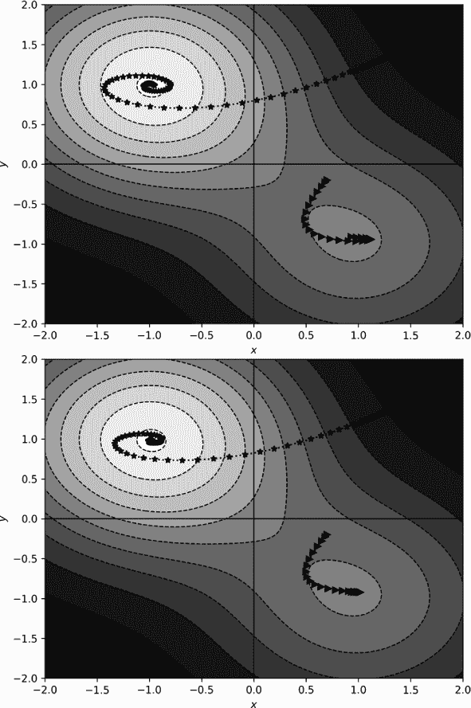

*图 11-10：标准动量（上）和 Nesterov 动量（下）*

在视觉上，Nesterov 动量显示出较少的超调，特别是在从 (1.5, 1.5) 开始的螺旋路径上。那每种方法返回的最终位置如何呢？我们可以看到 表 11-2。

**表 11-2**：使用和不使用 Nesterov 动量的梯度下降最终位置

| **初始点** | **标准** | **Nesterov** | **最小值** |
| --- | --- | --- | --- |
| (1.5,1.5) | (–0.9496, 0.9809) | (–0.9718, 0.9813) | (–1,1) |
| (0.7,–0.2) | (0.8807, –0.9063) | (0.9128, –0.9181) | (1,–1) |

在相同的梯度下降步骤数后，Nesterov 动量的结果比标准动量的结果更接近已知最小值。

### 自适应梯度下降

梯度下降算法几乎是微不足道的，这也促使了它的适应性。在本节中，我们将深入探讨深度学习社区中流行的三种梯度下降变体：RMSprop、Adagrad 和 Adam。三者中，Adam 至今最为流行，但其他两者也值得了解，因为它们是逐步演变至 Adam 的基础。这三种算法都以某种方式动态调整学习率。

#### RMSprop

Geoffrey Hinton 在 2012 年 Coursera 讲座系列中介绍了 *RMSprop*，它代表了 *均方根传播*（root mean square propagation）。类似于动量（可以与其结合使用），RMSprop 是一种梯度下降法，它跟踪梯度值的变化，并利用这些值来修改步长。

RMSprop 使用 *衰减项* γ（gamma）来计算算法执行过程中的梯度运行平均值。在他的讲座中，Hinton 使用 γ = 0.9。

梯度下降更新公式变为

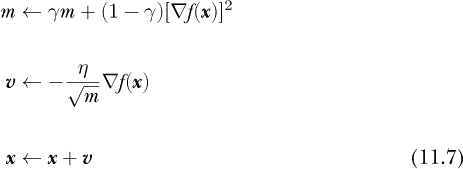

首先，我们更新 *m*，即梯度平方的加权运行平均值，权重是 γ，即衰减项。接下来是速度项，它与普通梯度下降几乎相同，但我们将学习率除以运行平均值的平方根，这就是 RMSprop 中的 RMS 部分。然后我们从当前的位置中减去缩放后的速度，以便迈出步伐。我们将这一步写成加法，类似于上面的动量方程（方程 11.5 和 11.6）；注意速度更新前的减号。

RMSprop 也可以与动量一起使用。例如，扩展 RMSprop 与 Nesterov 动量结合是很直接的：

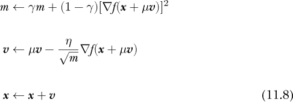

其中 *μ* 是动量因子，和之前一样。

有人声称 RMSprop 是一种稳健的分类器。我们将在下面看到它在一个测试中的表现。我们将其视为一种自适应技术，因为学习率（*η*）是通过梯度的均值的平方根来缩放的；因此，有效学习率是根据下降过程的历史进行调整的——它不是一成不变的。

RMSprop 常用于强化学习，这是机器学习的一个分支，旨在学习如何采取行动。例如，玩雅达利电子游戏就使用了强化学习。当优化过程是 *非平稳*（nonstationary）时，RMSprop 被认为是稳健的，这意味着统计数据会随着时间发生变化。相反，*平稳*（stationary）过程是指统计数据不会随时间变化。使用监督学习训练分类器是平稳的，因为训练集通常是固定的，并且不会发生变化，就像输入给分类器的数据应该是固定的一样，尽管这更难强制执行。在强化学习中，时间是一个因素，数据集的统计特性可能会随着时间的推移而变化；因此，强化学习可能涉及非平稳的优化过程。

#### Adagrad 和 Adadelta

*Adagrad* 出现于 2011 年（参见 John Duchi 等人的“自适应子梯度方法用于在线学习与随机优化”，*机器学习研究杂志* 12[7]， [2011]）。乍一看，它与 RMSprop 非常相似，尽管存在重要的差异。

我们可以将 Adagrad 的基本更新规则写作：

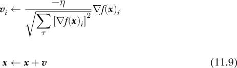

这需要一些解释。

首先，注意速度更新中的*i*下标，既在速度***v***上，也在梯度*▽f **(x***上。这里的*i*指的是速度的一个组件，意味着更新必须逐组件应用。方程 11.9 的顶部对系统的所有组件都重复。对于深度神经网络来说，这意味着所有的权重和偏置。

接下来，看看分母中每个组件的速度更新的和。这里，τ（tau）是优化过程中进行的*所有*梯度步骤的计数器，意味着对于系统的每个组件，Adagrad 跟踪在每个步骤中计算的梯度平方和。如果我们使用方程 11.9 进行第 11 步梯度下降，那么分母中的和将有 11 项，依此类推。如前所述，*η*是学习率，在这里是全局的，适用于所有组件。

Adagrad 的一个变种也在广泛使用中：*Adadelta*。（参见 Matthew Zeiler 的“Adadelta：一种自适应学习率方法”，[2012]）。Adadelta 将速度更新中所有步长的平方和的平方根，替换为最近几步的滑动平均，类似于 RMSprop 的滑动平均。Adadelta 还将手动选择的全局学习率*η*，替换为前几次速度更新的滑动平均。这消除了选择合适的*η*，但引入了一个新参数γ，用于设置窗口大小，类似于 RMSprop 的做法。γ可能对数据集的特性不如*η*敏感。注意，在原始的 Adadelta 论文中，γ被写作*ρ*（rho）。

#### Adam

Kingma 和 Ba 于 2015 年发布了*Adam*，即“自适应矩估计”，截至目前已被引用超过 66,000 次。Adam 使用梯度的平方，就像 RMSprop 和 Adagrad 一样，但还跟踪类似动量的项。让我们先展示更新方程，然后逐步解析：

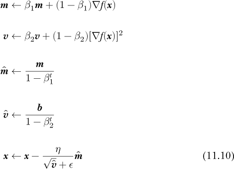

方程 11.10 的前两行定义了***m***和***v***作为一阶和二阶矩的滑动平均。一阶矩是均值；二阶矩类似于方差，是数据点与均值之间差异的二阶矩。注意在***v***的定义中有对梯度值的平方。滑动矩由两个标量参数*β*[1]和*β*[2]加权。

接下来的两行定义了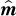和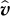。这些是偏差修正项，用来使***m***和***v***成为第一和第二矩的更好估计值。这里的*t*是一个从零开始的整数，表示时间步长。

实际步骤通过减去偏差修正的第一矩，，再乘以全局学习率的比率，*η*，以及偏差修正的第二矩的平方根，，来更新***x***。∊项是一个常数，用于避免除以零。

方程 11.10 有四个参数，虽然看起来过多，但其中三个参数设置简单且很少更改。原始论文建议*β*[1] = 0.9，*β*[2] = 0.999，∊ = 10^(−8)。因此，就像普通的梯度下降一样，用户需要选择*η*。例如，Keras 默认的*η* = 0.001，这在许多情况下效果良好。

Kingma 和 Ba 的论文通过实验表明，Adam 通常优于带 Nesterov 动量的 SGD、RMSprop、Adagrad 和 Adadelta。这很可能是为什么 Adam 目前成为许多深度学习任务的首选优化器。

#### 关于优化器的一些思考

使用哪个优化算法以及何时使用取决于数据集。如前所述，Adam 目前在许多任务中是首选，尽管经过适当调优的 SGD 也能非常有效，甚至有人对此深信不疑。虽然无法做出“最佳算法”的绝对判断，因为并不存在所谓的“最佳”，但我们可以进行一个小实验，并讨论结果。

这个实验，我将仅展示结果，使用 16,384 个随机样本对 MNIST 上的小型卷积神经网络进行训练，训练集大小为 128 的迷你批次，训练 12 个周期。结果展示了每个优化器（SGD、RMSprop、Adagrad 和 Adam）五次运行的均值和标准误差。感兴趣的点是测试集的准确率和训练时钟时间。我在同一台机器上训练了所有模型，因此我们应关注相对时间。没有使用 GPU。

图 11-11 展示了按优化器分类的总体测试集准确率（上）和训练时间（下）。

平均来说，SGD 和 RMSprop 的准确率比其他优化器低约 0.5%，而 RMSprop 的准确率波动较大，但始终未能超过 Adagrad 或 Adam。可以说，Adam 在准确率方面表现最好。至于训练时间，SGD 最快，而 Adam 最慢，正如我们所料，Adam 相比 SGD 需要执行更多的每步计算。总体而言，结果支持社区的直觉：Adam 是一个不错的优化器。

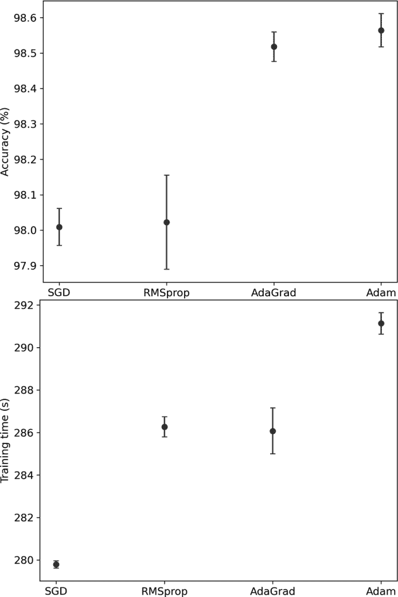

*图 11-11：按优化器分类的 MNIST 模型准确率（上）和训练时间（下）*

### 总结

本章介绍了梯度下降，从基本形式的原始梯度下降开始，配合 1D 和 2D 的例子。接着，我们介绍了随机梯度下降，并证明了它在深度学习中的应用。

接下来我们讨论了动量，包括标准动量和 Nesterov 动量。通过标准动量，我们展示了它在训练深度模型（好吧，相对“深”）中的帮助。我们用一个 2D 例子直观展示了 Nesterov 动量的效果，并讨论了为什么 Nesterov 动量和随机梯度下降可能会互相抵消。

本章最后，我们回顾了先进算法的梯度下降更新方程，展示了原始梯度下降如何引入修改。一个简单的实验让我们深入了解了这些算法的表现，并似乎证明了深度学习社区普遍认为 Adam 在一般情况下比 SGD 更合适的观点。

随着本章的结束，我们对深度学习数学的探索也画上了句号。剩下的只是最后一个附录，指引你去了解更多的资源。

### 结语

正如伟大的计算机科学家艾兹格尔·W·戴克斯特拉（Edsger W. Dijkstra）所说：“不应该有无聊的数学。”我真心希望你没有觉得这本书无聊。我可不想得罪戴克斯特拉的幽灵。如果你此刻还在继续阅读，我怀疑你确实找到了些有价值的内容。好极了！感谢你坚持下来。数学永远不应该无聊。

我们已经介绍了理解和使用深度学习所需的基础知识。然而，别停在这里：请使用附录中的参考资料，继续你的数学探索。你永远不应该对自己的知识基础感到满足——总是寻求扩展它。

如果你有任何问题或意见，请通过*【mathfordeeplearning@gmail.com】(mailto:mathfordeeplearning@gmail.com)*与我联系。
